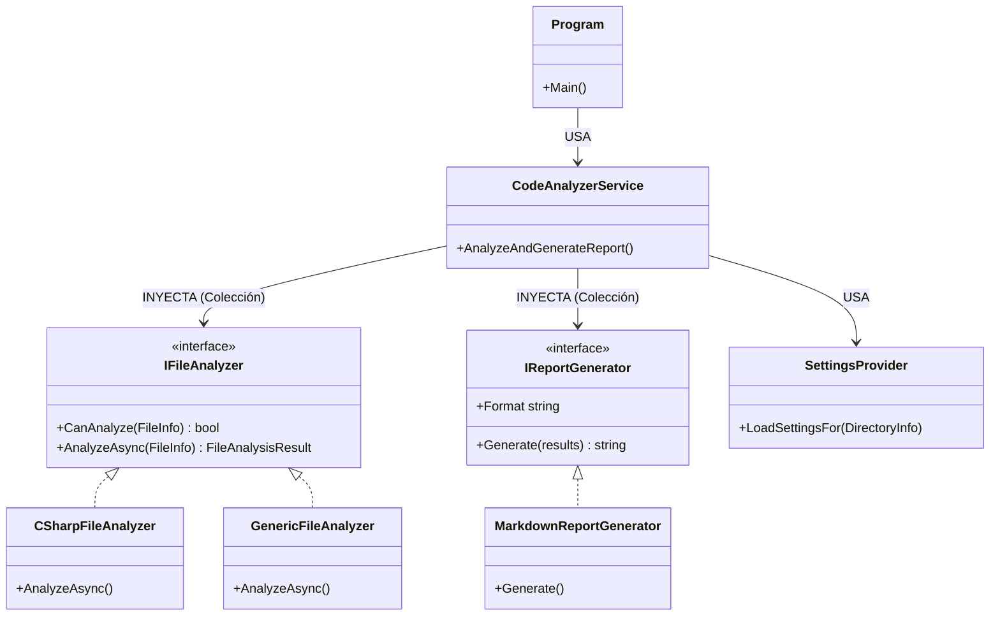

# Informe de Revisión y Especificación Técnica - ContextWeaver

**Fecha:** 2026-02-14
**Proyecto:** ContextWeaver

---

## 1. Resumen Ejecutivo

ContextWeaver es una herramienta de consola (CLI) diseñada para analizar repositorios de código y generar un reporte consolidado en Markdown. Su objetivo principal es empaquetar el contexto de un proyecto para ser consumido por Modelos de Lenguaje (LLMs).

La arquitectura general es sólida, moderna y sigue buenas prácticas de ingeniería de software en .NET (Inyección de Dependencias, Patrones de Diseño). Sin embargo, se han identificado hallazgos críticos en la lógica de análisis de dependencias que limitan la utilidad actual de dicha funcionalidad, así como oportunidades de optimización en el rendimiento.

---

## 2. Revisión de Código (Code Review)

### 2.1. Puntos Fuertes (Positivos)

1.  **Arquitectura Modular y Extensible**:
    -   Uso correcto de **Inyección de Dependencias (DI)** mediante `Microsoft.Extensions.DependencyInjection`.
    -   Implementación del **Patrón Strategy** para los analizadores (`IFileAnalyzer`) y generadores (`IReportGenerator`). Esto permite agregar soporte para nuevos lenguajes (ej. Python, Java) o formatos de salida (ej. JSON) sin modificar el núcleo de la aplicación (Principio Open/Closed).
2.  **Uso de Roslyn**:
    -   La utilización de la API de compilación de .NET (Roslyn) en `CSharpFileAnalyzer` es la elección correcta para un análisis robusto, en lugar de usar expresiones regulares.
3.  **Experiencia de Usuario (UX)**:
    -   `SettingsProvider` maneja inteligentemente la configuración: si no existe un archivo `.contextweaver.json`, crea uno por defecto automáticamente. Esto facilita enormemente el onboarding.
4.  **Claridad del Código**:
    -   El código es legible, bien estructurado y con comentarios explicativos que denotan una intención didáctica o de documentación clara.

### 2.2. Hallazgos Críticos (Bugs & Issues)

#### 🔴 1. Extracción de Dependencias Incompleta (Cross-File Dependencies)
**Ubicación:** `Analyzers/CSharpFileAnalyzer.cs` (Método `ExtractClassDependencies`)
**Severidad:** Alta

**Descripción:**
El analizador intenta filtrar las dependencias para incluir solo aquellas que pertenecen al proyecto (`projectTypeNames`). Sin embargo, la lista `projectTypeNames` se construye **únicamente con los tipos declarados en el archivo actual** (`root.DescendantNodes()`).

```csharp
// Línea 142 de CSharpFileAnalyzer.cs
var projectTypeNames = new HashSet<string>(declaredTypeSymbols.Select(s => s.Name));
// ...
// Línea 177: El filtro requiere que targetTypeName esté en projectTypeNames
if (... && projectTypeNames.Contains(targetTypeName) && ...)
```

**Consecuencia:**
El gráfico de dependencias (`mermaid`) ignorará todas las relaciones entre clases que residan en archivos diferentes. Solo detectará relaciones entre clases definidas dentro del mismo archivo físico. Esto hace que el gráfico de dependencias sea prácticamente inútil para visualizar la arquitectura real del proyecto.

**Solución Recomendada:**
Para resolver esto, el `CodeAnalyzerService` debería realizar una "pre-pasada" para recolectar todos los nombres de tipos del proyecto antes del análisis individual, o el `CSharpFileAnalyzer` debería tener acceso a un contexto global de símbolos del proyecto (aunque esto es más complejo sin cargar toda la solución/ficheros de proyecto formalmente). Una solución intermedia es recolectar todos los nombres de archivo/clase en un paso previo y pasarlo a los analizadores.

### 2.3. Oportunidades de Mejora

#### 🟡 1. Ejecución Secuencial (Performance)
**Ubicación:** `Services/CodeAnalyzerService.cs` (Línea 47)
**Descripción:**
El análisis de archivos se realiza de manera estrictamente secuencial dentro de un bucle `foreach` con `await`.
```csharp
foreach (var file in allFiles) {
    // ...
    var result = await analyzer.AnalyzeAsync(file); // Bloqueante secuencial
    // ...
}
```
**Recomendación:**
Dado que el análisis de archivos es una tarea mayormente ligada a CPU (parsing) y I/O (lectura), se beneficiaría enormemente de la paralelización usando `Task.WhenAll` o `Parallel.ForEachAsync`.

#### 🟡 2. Cálculo de Inestabilidad Aproximado
**Ubicación:** `Utilities/InstabilityCalculator.cs`
**Descripción:**
El cálculo se basa en los `usings` del archivo y una heurística de nombres de carpetas (`pathParts`).
-   Los `usings` no siempre implican una dependencia real (pueden ser usings no utilizados).
-   Asume que la estructura de carpetas define estrictamente los "módulos", lo cual es una convención común pero no universal.
**Recomendación:**
Es aceptable para una herramienta ligera, pero se debe documentar que es una métrica estimativa. Para mayor precisión, se debería usar el análisis semántico de Roslyn para contar referencias reales de tipos entre namespaces.

---

## 3. Especificación Técnica

### 3.1. Visión General del Sistema
ContextWeaver es una aplicación de consola .NET 8.0 que escanea recursivamente un directorio, filtra archivos según configuración, analiza su contenido (sintáctico para C#, texto plano para otros) y genera un documento Markdown consolidado ("Context File") optimizado para LLMs.

### 3.2. Arquitectura de Componentes

El sistema sigue una arquitectura de capas simplificada con Inyección de Dependencias.

#### Diagrama de Clases (Conceptual)



### 3.3. Flujo de Datos

1.  **Inicialización**:
    -   `Program.cs` configura el Host y DI.
    -   Parsea argumentos CLI (`--directory`, `--output`, `--format`).
2.  **Configuración**:
    -   `SettingsProvider` busca `.contextweaver.json`. Si falla, crea uno por defecto y lo carga.
    -   Configuración incluye: `IncludedExtensions` (e.g., .cs, .ts) y `ExcludePatterns` (e.g., node_modules).
3.  **Descubrimiento**:
    -   Listado recursivo de archivos en el directorio objetivo.
    -   Filtrado según configuración.
4.  **Análisis (Core Core)**:
    -   Iteración sobre archivos filtrados.
    -   Selección de estrategia (`IFileAnalyzer`) según extensión.
        -   **C#**: Parsing con Roslyn, extracción de métricas (Complejidad Ciclomática), Firmas de API pública, Usings y Dependencias de Clases.
        -   **Genérico**: Conteo de líneas y lectura de contenido raw.
5.  **Post-Procesamiento**:
    -   `InstabilityCalculator`: Calcula métricas de acoplamiento (Ca, Ce, Inestabilidad) basándose en importaciones de namespaces entre carpetas raíz.
6.  **Generación**:
    -   `MarkdownReportGenerator` estructura el reporte final:
        -   Resumen y Hotspots (Archivos grandes/complejos).
        -   Tabla de Inestabilidad.
        -   Gráfico de Dependencias (Mermaid).
        -   Árbol de Directorios.
        -   Contenido de Archivos (Concatenación).

### 3.4. Definición de Datos (Core)

#### `FileAnalysisResult`
DTO central que normaliza el resultado de cualquier analizador.
-   `RelativePath`: Ruta relativa del archivo.
-   `LinesOfCode`: Conteo físico de líneas.
-   `CodeContent`: Contenido completo del archivo.
-   `Language`: Identificador para resaltado de sintaxis (e.g., "csharp", "typescript").
-   `Usings`: Lista de importaciones detectadas.
-   `ClassDependencies`: Lista de relaciones "Origen -> Destino" (actualmente con limitaciones).
-   `Metrics`: Diccionario flexible para métricas específicas (Complejidad, Firmas API).

### 3.5. Requisitos del Entorno
-   **Runtime**: .NET 8.0 o superior.
-   **Dependencias Clave**:
    -   `System.CommandLine`: Para CLI.
    -   `Microsoft.Extensions.Hosting`: Para DI y ciclo de vida.
    -   `Microsoft.CodeAnalysis.CSharp` (Roslyn): Para análisis estático de C#.

---

## 4. Conclusión

ContextWeaver es una herramienta con una base sólida y bien diseñada. Su mayor fortaleza es la arquitectura extensible. Su debilidad crítica actual es la lógica de análisis de dependencias entre archivos, que requiere una refactorización para ser verdaderamente útil en proyectos complejos de C#. Corrigiendo este punto y paralizando el procesamiento de archivos, la herramienta sería altamente competitiva para su propósito de generación de contexto.
