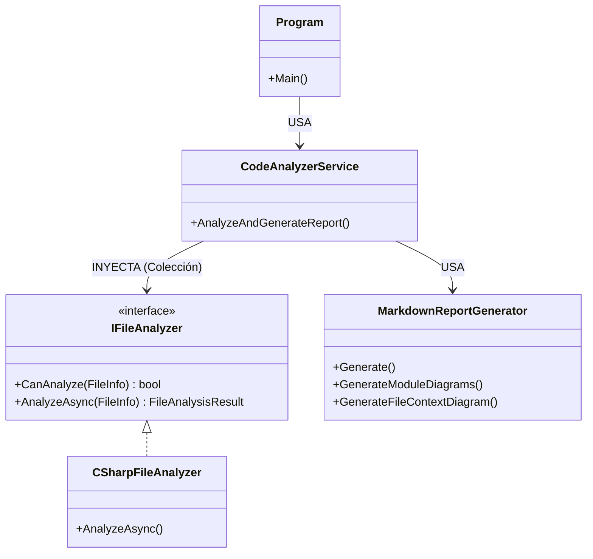

# Informe de Revisión y Especificación Técnica - ContextWeaver

**Fecha:** 2026-02-14 (Actualizado)
**Proyecto:** ContextWeaver

---

## 1. Resumen Ejecutivo

ContextWeaver es una herramienta de consola (CLI) diseñada para analizar repositorios de código y generar un reporte consolidado en Markdown. Su objetivo principal es empaquetar el contexto de un proyecto para ser consumido por Modelos de Lenguaje (LLMs).

La arquitectura general es sólida, moderna y sigue buenas prácticas de ingeniería de software en .NET. **Tras la última iteración, se han resuelto los problemas críticos de análisis de dependencias y rendimiento.** Ahora la herramienta ofrece capacidades avanzadas de diagramación (Mermaid y PlantUML) y un análisis de contexto detallado a nivel de módulo y archivo.

---

## 2. Revisión de Código (Code Review) - Estado Actual

### 2.1. Puntos Fuertes (Positivos)

1.  **Arquitectura Modular y Extensible**:
    -   Uso correcto de **Inyección de Dependencias (DI)** y **Patrón Strategy**.
    -   Fácil extensibilidad para nuevos lenguajes y formatos.
2.  **Análisis Robusto con Roslyn**:
    -   Uso de la API de compilación de .NET para extracción precisa de tipos y relaciones.
3.  **Visualización Avanzada**:
    -   Soporte dual para **Mermaid y PlantUML**.
    -   Diagramas granulares: Global, por Módulo y Contexto de Archivo.
    -   Distinción semántica de tipos (`class`, `interface`, `enum`, `record`, `struct`).
4.  **Rendimiento Optimizado**:
    -   Procesamiento paralelo de archivos utilizando `Parallel.ForEachAsync`.

### 2.2. Estado de Hallazgos Previos

#### ✅ 1. Extracción de Dependencias Incompleta (Cross-File Dependencies)
**Estado:** RESUELTO.
**Solución:** Se implementó una lógica de recolección de tipos en `CSharpFileAnalyzer` que permite identificar tipos del proyecto vs. tipos del sistema. El analizador ahora conecta correctamente dependencias entre archivos y filtra ruido del sistema (.NET framework).

#### ✅ 2. Ejecución Secuencial (Performance)
**Estado:** RESUELTO.
**Solución:** `CodeAnalyzerService` ahora utiliza ejecución paralela para el análisis de archivos, mejorando significativamente el tiempo de procesamiento en proyectos grandes.

#### 🟡 3. Cálculo de Inestabilidad Aproximado
**Estado:** PENDIENTE DE MEJORA (No crítico).
**Nota:** El cálculo sigue basándose en heurísticas de `usings`. Es suficiente para propósitos documentales, pero podría refinarse con análisis semántico profundo si se requiere precisión estricta.

---

## 3. Especificación Técnica

### 3.1. Visión General del Sistema
ContextWeaver escanea recursivamente un directorio, analiza código (C# vía Roslyn, otros vía texto), calcula métricas y genera un reporte Markdown con diagramas incrustados.

### 3.2. Arquitectura de Componentes

#### Diagrama de Clases (Conceptual)

### 3.3. Nuevas Capacidades de Diagramación

El generador de reportes ha sido enriquecido con las siguientes capacidades:

1.  **Soporte Multi-Formato**: Genera bloques para `mermaid` y `plantuml` simultáneamente.
2.  **Diagramas de Módulo**: Agrupa clases por carpetas de primer nivel (Arquitectura).
3.  **Diagramas de Contexto**: Al inicio de cada archivo, muestra un mini-diagrama con sus dependencias directas (Entrantes y Salientes).
4.  **Semántica de Tipos**:
    -   Detecta y renderiza correctamente `interface` vs `class` en PlantUML.
    -   Usa iconos/colores específicos (e.g., `#Pink` para el archivo actual).

### 3.4. Definición de Datos (Core)

#### `FileAnalysisResult`
DTO extendido para soportar las nuevas funcionalidades:
-   `RelativePath`: Ruta relativa.
-   `LinesOfCode`: Conteo de líneas.
-   `CodeContent`: Código fuente.
-   `DefinedTypes`: Lista de tipos declarados en el archivo.
-   `DefinedTypeKinds`: Diccionario mapeando `NombreTipo -> Kind` (class, interface, enum, etc.).
-   `ClassDependencies`: Lista de relaciones salientes ("Origen -> Destino").
-   `IncomingDependencies`: Lista de relaciones entrantes (calculado post-análisis).
-   `Metrics`: Diccionario flexible.

### 3.5. Requisitos del Entorno
-   **Runtime**: .NET 8.0 o superior.
-   **Dependencias**: `System.CommandLine`, `Microsoft.Extensions.Hosting`, `Microsoft.CodeAnalysis.CSharp`.

---

## 4. Conclusión

ContextWeaver ha evolucionado de una herramienta de concatenación simple a un generador de documentación técnica avanzado. La corrección de la extracción de dependencias y la adición de diagramas detallados (especialmente con soporte PlantUML y distinción de interfaces) lo convierten en una herramienta potente para entender bases de código legacy o complejas rápidamente.
