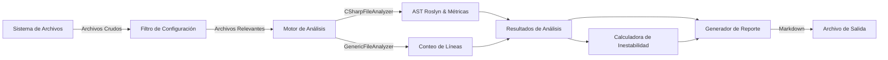

# ContextWeaver Specification (SPEC)

## 1. Visión General

**ContextWeaver** es una herramienta de línea de comandos (CLI) diseñada para ingenieros de software y arquitectos. Su propósito principal es transformar un repositorio de código completo en un **único documento Markdown enriquecido**. Este documento consolidado está optimizado para ser consumido por Large Language Models (LLMs), facilitando tareas de análisis arquitectónico, refactorización, documentación y onboarding.

La herramienta no solo concatena archivos, sino que realiza un "Context Engineering" activo: filtra ruido, calcula métricas de calidad, analiza dependencias arquitectónicas y genera mapas de navegación visuales.

## 2. Objetivos del Diseño

1.  **Optimización para LLMs**: Proveer el máximo contexto con la mínima cantidad de tokens irrelevantes (filtrando binarios, `node_modules`, etc.).
2.  **Navegabilidad Humana**: Permitir que los desarrolladores naveguen fácilmente por la estructura del proyecto dentro de un solo archivo.
3.  **Insight Arquitectónico**: Ofrecer métricas de alto nivel (Inestabilidad, Acoplamiento) que no son evidentes al ver archivos individuales.
4.  **Extensibilidad**: Arquitectura modular que permite añadir nuevos lenguajes y formatos de reporte fácilmente.
5.  **Cero Configuración (Zero-Config)**: Funcionar "out-of-the-box" con valores sensatos, pero permitir personalización total mediante configuración.

## 3. Arquitectura del Sistema

El sistema sigue una arquitectura modular basada en **Inyección de Dependencias** (`Microsoft.Extensions.DependencyInjection`) y patrones de diseño sólidos (Strategy, SOLID).

### 3.1 Componentes Principales

*   **Entry Point (`Program.cs`)**: Maneja la interfaz de línea de comandos (CLI) usando `System.CommandLine`. Configura el contenedor de servicios y lanza el proceso.
*   **Orquestador (`CodeAnalyzerService`)**: Coordina el flujo principal: carga configuración -> descubre archivos -> delega análisis -> calcula métricas globales -> genera reporte.
*   **Configuración (`SettingsProvider`)**: Gestiona la carga de `.contextweaver.json` y provee valores por defecto (`DefaultSettings`).
*   **Analizadores (`Analyzers/`)**: Implementan `IFileAnalyzer`. Extraen información específica de cada archivo.
    *   `CSharpFileAnalyzer`: Análisis profundo de sintaxis C# (Roslyn).
    *   `GenericFileAnalyzer`: Análisis básico de archivos de texto/código.
*   **Calculadores de Métricas (`Utilities/`)**:
    *   `InstabilityCalculator`: Calcula la inestabilidad de módulos.
    *   `CSharpMetricsCalculator`: Calcula complejidad ciclomática.
*   **Generadores de Reportes (`Reporters/`)**: Implementan `IReportGenerator`.
    *   `MarkdownReportGenerator`: Renderiza el resultado final en Markdown.

### 3.2 Diagrama de Flujo de Datos



## 4. Especificaciones Funcionales

### 4.1 Interfaz de Línea de Comandos (CLI)

La herramienta se ejecuta desde la terminal con los siguientes argumentos:

| Comando / Opción | Alias | Descripción | Valor por Defecto |
| :--- | :--- | :--- | :--- |
| `--directorio` | `-d` | Directorio raíz del proyecto a analizar. | Directorio actual (`.`) |
| `--output` | `-o` | Nombre/Ruta del archivo de reporte generado. | `analysis_report.md` |
| `--format` | `-f` | Formato del reporte de salida. | `markdown` |

**Comportamiento**:
1.  Si no se proveen argumentos, analiza el directorio actual.
2.  Muestra logs de progreso en la consola (archivos encontrados, configuración usada, éxito/error).

### 4.2 Sistema de Configuración

La herramienta busca un archivo `.contextweaver.json` en el directorio raíz del análisis.

*   **Si existe**: Carga la configuración y la mezcla con los valores por defecto (si faltan secciones).
*   **Si NO existe**: Crea automáticamente un archivo `.contextweaver.json` con la configuración por defecto para facilitar la personalización futura.

**Estructura de `.contextweaver.json`**:
```json
{
  "AnalysisSettings": {
    "IncludedExtensions": [".cs", ".ts", ".html", ...],
    "ExcludePatterns": ["bin", "obj", "node_modules", ...]
  }
}
```

**Valores por Defecto**:
*   **Extensiones**: `.cs`, `.csproj`, `.sln`, `.json`, `.ts`, `.html`, `.scss`, `.css`, `.md`
*   **Exclusiones**: `bin`, `obj`, `node_modules`, `.angular`, `.vs`, `dist`, `wwwroot`, `Publish`, `packages`, `Scripts`, `Content`

### 4.3 Motor de Análisis de Archivos

#### 4.3.1 Análisis de C# (`CSharpFileAnalyzer`)
Utiliza Roslyn (Microsoft.CodeAnalysis) para un análisis sintáctico y semántico profundo.
*   **Métricas**: Líneas de Código (LOC), Complejidad Ciclomática (flujo de control).
*   **Repo Map (Firmas API)**: Extrae firmas públicas de clases, métodos, propiedades y constructores.
*   **Dependencias**:
    *   Extrae sentencias `using`.
    *   Detecta relaciones de **Herencia** (`-.->`) y **Uso** (`-->`) entre clases del proyecto para gráficos Mermaid.

#### 4.3.2 Análisis Genérico (`GenericFileAnalyzer`)
Para lenguajes soportados pero sin analizador específico (TS, JS, HTML, etc.).
*   **Métricas**: Líneas de Código (LOC).
*   **Lenguaje**: Mapeo automático de extensión a identificador de bloque de código Markdown (ej. `.ts` -> `typescript`).

### 4.4 Análisis Arquitectónico (Inestabilidad)

Calcula la métrica de Inestabilidad de Robert C. Martin para cada carpeta de primer nivel (módulo).

**Fórmula**: $I = \frac{Ce}{Ca + Ce}$
*   **$Ce$ (Coupling Efferent)**: Número de módulos externos de los que depende este módulo (salientes).
*   **$Ca$ (Coupling Afferent)**: Número de módulos externos que dependen de este módulo (entrantes).

**Interpretación**:
*   $0 \le I \le 0.3$: **Estable** (Core/Abstracciones).
*   $0.7 \le I \le 1.0$: **Inestable** (Implementaciones/UI).

### 4.5 Generación de Reportes (`MarkdownReportGenerator`)

El reporte `analysis_report.md` contiene las siguientes secciones ordenadas:

1.  **Header**: Resumen del propósito, fecha y advertencias de seguridad.
2.  **Análisis de Hotspots**:
    *   Top 5 archivos por tamaño (LOC).
    *   Top 5 archivos por acoplamiento (número de `imports`).
3.  **Análisis de Inestabilidad**: Tabla con métricas $Ca$, $Ce$, $I$ y clasificación por módulo.
4.  **Gráfico de Dependencias**:
    *   **Mermaid**: Diagrama `graph TD` visualizando la arquitectura.
    *   **PlantUML**: Bloque alternativo con estereotipos ricos (`<<record>>`, `<<struct>>`).
5.  **Diagramas de Módulo**: Secciones dedicadas con diagramas de dependencias detallados por cada carpeta de primer nivel.
6.  **Estructura de Directorios**: Árbol de navegación con enlaces (anclas) a cada sección de archivo.
7.  **Contenido de Archivos**:
    *   Ruta del archivo.
    *   **Diagrama de Contexto**: Mini-gráfico (Mermaid y PlantUML) mostrando dependencias directas del archivo.
    *   **Referencias Entrantes**: Lista "Used By" con los archivos que dependen de este.
    *   **Repo Map**: Resumen de API pública e imports, enriquecido con semántica (modificadores, interfaces, atributos).
    *   **Métricas**: LOC, Complejidad Ciclomática, Profundidad Máxima de Anidamiento.
    *   **Código Fuente**: Bloque de código completo con resaltado de sintaxis.

## 5. Requisitos No Funcionales

1.  **Performance**: Debe manejar repositorios de tamaño mediano (miles de archivos) en segundos. El uso de `StringBuilder` y operaciones asíncronas (`async/await`) es crítico.
2.  **Seguridad**: El reporte de salida contiene código fuente completo. Debe advertirse al usuario sobre no compartir información sensible contenida en el reporte.
3.  **Portabilidad**: Al ser una .NET Global Tool, debe funcionar indistintamente en Windows, Linux y macOS.
4.  **Mantenibilidad**: El código debe seguir principios SOLID. Nuevos analizadores deben poder agregarse implementando `IFileAnalyzer` sin modificar el orquestador.

## 6. Futuras Mejoras (Roadmap)

*   [ ] Soporte para análisis profundo de TypeScript/JavaScript (AST).
*   [ ] Cálculo de métricas de acoplamiento a nivel de método.
*   [ ] Generación de reportes en formato JSON/XML para integración CI/CD.
*   [ ] Detección automática de secretos/credenciales antes de generar el reporte.
