Este archivo es una representación consolidada del código fuente de 'ContextWeaver', fusionado en un único documento por ContextWeaver.
El contenido ha sido procesado para crear un contexto completo para su análisis.

# Resumen del Archivo

## Propósito
Este archivo contiene una representación empaquetada de los contenidos del repositorio.
Está diseñado para ser fácilmente consumible por sistemas de IA para análisis, revisión de código u 
otros procesos automatizados.

## Formato del Archivo
El contenido se organiza de la siguiente manera:
1. Esta sección de resumen.
2. Una sección de "Análisis de Hotspots" que identifica archivos clave por métricas.
3. Una sección de "Análisis de Inestabilidad" que proporciona información arquitectónica.
4. Un árbol de la estructura de directorios con enlaces clicables a cada archivo.
5. Múltiples entradas de archivo, cada una de las cuales consta de:
   - Un encabezado con la ruta del archivo (## Archivo: ruta/al/archivo)
   - El resumen del "Repo Map" (API pública e importaciones).
   - El contenido completo del archivo en un bloque de código.

## Pautas de Uso
- Este archivo debe ser tratado como de solo lectura. Cualquier cambio debe realizarse en 
  los archivos originales del repositorio, no en esta versión empaquetada.
- Al procesar este archivo, use la ruta del archivo para distinguir entre los diferentes 
  archivos del repositorio.
- Tenga en cuenta que este archivo puede contener información sensible. Manéjelo con el mismo 
  nivel de seguridad que manejaría el repositorio original.

## Notas
- Algunos archivos pueden haber sido excluidos según la configuración de ContextWeaver en `.contextweaver.json`.
- Los archivos binarios no se incluyen en esta representación empaquetada.
- Los archivos se ordenan alfabéticamente por su ruta completa para una ordenación consistente.
# 🔥 Análisis de Hotspots

## 5 Principales Archivos por Líneas de Código (LOC)
* **(21489 LOC)** - [`context-clean.md`](#archivo-context-cleanmd)
* **(7649 LOC)** - [`context.md`](#archivo-contextmd)
* **(405 LOC)** - [`src/ContextWeaver.Cli/Resources/ReportStrings.Designer.cs`](#archivo-srccontextweavercliresourcesreportstringsdesignercs)
* **(405 LOC)** - [`src/ContextWeaver.Cli/Resources/ReportStrings.es.Designer.cs`](#archivo-srccontextweavercliresourcesreportstringsesdesignercs)
* **(334 LOC)** - [`src/ContextWeaver.Engine/Analyzers/CSharpFileAnalyzer.cs`](#archivo-srccontextweaverengineanalyzerscsharpfileanalyzercs)

## 5 Principales Archivos por Número de Importaciones
* **(10 Importaciones)** - [`src/ContextWeaver.Cli/Commands/WizardCommand.cs`](#archivo-srccontextweaverclicommandswizardcommandcs)
* **(9 Importaciones)** - [`src/ContextWeaver.Cli/Program.cs`](#archivo-srccontextweavercliprogramcs)
* **(8 Importaciones)** - [`tests/ContextWeaver.E2E.Tests/FullPipelineTests.cs`](#archivo-testscontextweavere2etestsfullpipelinetestscs)
* **(7 Importaciones)** - [`src/ContextWeaver.Cli/Commands/Wizard/SectionSelectionStep.cs`](#archivo-srccontextweaverclicommandswizardsectionselectionstepcs)
* **(7 Importaciones)** - [`src/ContextWeaver.Cli/HostBuilderExtensions.cs`](#archivo-srccontextweaverclihostbuilderextensionscs)

# 📊 Análisis de Inestabilidad

Esta sección estima la métrica de Inestabilidad (I) para cada módulo de nivel superior (carpeta/proyecto) basándose en sus dependencias (importaciones).
`I = Ce / (Ca + Ce)`
- `Ce` (Eferente): Cuántos otros módulos usa este módulo (apunta hacia afuera).
- `Ca` (Aferente): Cuántos otros módulos dependen de este módulo (apunta hacia adentro).

## Resumen de Inestabilidad del Módulo:

| Módulo | Ca (Eferente) | Ce (Aferente) | Inestabilidad (I) | Descripción |
|---|---|---|---|---|
| `.agent` | 0 | 0 | 0.00 | Muy estable / Core |
| `.config` | 0 | 0 | 0.00 | Muy estable / Core |
| `.context` | 0 | 0 | 0.00 | Muy estable / Core |
| `.github` | 0 | 0 | 0.00 | Muy estable / Core |
| `.husky` | 0 | 0 | 0.00 | Muy estable / Core |
| `docs` | 0 | 0 | 0.00 | Muy estable / Core |
| `Root` | 0 | 0 | 0.00 | Muy estable / Core |
| `src/ContextWeaver.Cli` | 1 | 2 | 0.67 | Estabilidad intermedia |
| `src/ContextWeaver.Core` | 6 | 0 | 0.00 | Muy estable / Core |
| `src/ContextWeaver.Engine` | 4 | 1 | 0.20 | Muy estable / Core |
| `tests/ContextWeaver.Architecture.Tests` | 0 | 2 | 1.00 | Muy inestable / Concreto |
| `tests/ContextWeaver.Cli.Tests` | 0 | 1 | 1.00 | Muy inestable / Concreto |
| `tests/ContextWeaver.Core.Tests` | 0 | 1 | 1.00 | Muy inestable / Concreto |
| `tests/ContextWeaver.E2E.Tests` | 0 | 2 | 1.00 | Muy inestable / Concreto |
| `tests/ContextWeaver.Engine.Tests` | 0 | 3 | 1.00 | Muy inestable / Concreto |
| `tests/ContextWeaver.Tests.Shared` | 1 | 0 | 0.00 | Muy estable / Core |

## Guía de Interpretación:
- `I ≈ 0`: Muy estable (muchos dependen de él; depende poco de otros). A menudo son contratos/interfaces principales.
- `I ≈ 1`: Muy inestable (depende de muchos; pocos o ninguno dependen de él). A menudo son implementaciones concretas como UI/adaptadores.
- `I ≈ 0.5`: Estabilidad intermedia.
Idealmente, los módulos estables deben ser abstractos y los inestables concretos. Evite módulos abstractos muy inestables o módulos concretos muy estables.

# 📈 Gráfico de Dependencias de Clases (Mermaid)

Este gráfico visualiza las relaciones jerárquicas (línea punteada) y de colaboración (línea sólida) entre las clases del proyecto. Renderizado con Mermaid.js.

```mermaid
graph TD;

  subgraph src/ContextWeaver.Cli
    AnalyzeCommand
    AnalyzeSettings
    FileDiscoveryStep
    FileSelectionStep
    FilterExtensionStep
    HostBuilderExtensions
    IWizardStep
    OutputConfigStep
    SectionSelectionModeStep
    SectionSelectionStep
    SelectionModeStep
    SummaryStep
    TypeRegistrar
    TypeResolver
    WizardCommand
    WizardContext
    WizardOrchestrator
    WizardSettings
  end

  subgraph src/ContextWeaver.Core
    DefaultSettings
    FileAnalysisResult
    IFileAnalyzer
    IReportGenerator
  end

  subgraph src/ContextWeaver.Engine
    BaseDependencyGraphSection
    BaseModuleDiagramSection
    CodeAnalyzerService
    ComplexityWalker
    CSharpFileAnalyzer
    CSharpMetricsCalculator
    DirectoryTreeSection
    FileContentSection
    GenericFileAnalyzer
    HeaderSection
    HotspotSection
    InstabilityCalculator
    InstabilitySection
    IReportSection
    MarkdownReportGenerator
    MermaidDependencyGraphSection
    MermaidModuleDiagramSection
    ModuleAdjacencyListSection
    NestingWalker
    PlantUmlDependencyGraphSection
    PlantUmlModuleDiagramSection
    ReportContext
    SettingsProvider
  end

  subgraph tests/ContextWeaver.Architecture.Tests
    DependencyTests
    DesignTests
    NoPublicFieldsRule
  end

  subgraph tests/ContextWeaver.Cli.Tests
    CustomMockStep
    MockStep
    WizardOrchestratorTests
  end

  subgraph tests/ContextWeaver.Core.Tests
    DefaultSettingsTests
    DependencyRelationTests
    FileAnalysisResultTests
  end

  subgraph tests/ContextWeaver.E2E.Tests
    FullPipelineTests
  end

  subgraph tests/ContextWeaver.Engine.Tests
    CSharpMetricsCalculatorTests
    GenericFileAnalyzerTests
    InstabilityCalculatorTests
    MarkdownHelperTests
    ModuleAdjacencyListSectionTests
  end

  subgraph tests/ContextWeaver.Tests.Shared
    MathService
    TempFile
  end

  AnalyzeCommand --> AnalyzeSettings
  AnalyzeCommand --> CodeAnalyzerService
  AnalyzeCommand -.-> AsyncCommand
  AnalyzeSettings -.-> CommandSettings
  BaseDependencyGraphSection --> DependencyGraphData
  BaseDependencyGraphSection --> DependencyRelation
  BaseDependencyGraphSection --> ReportContext
  BaseDependencyGraphSection -.-> IReportSection
  BaseModuleDiagramSection --> DependencyRelation
  BaseModuleDiagramSection --> ModuleDiagramData
  BaseModuleDiagramSection --> ReportContext
  BaseModuleDiagramSection -.-> IReportSection
  CodeAnalyzerService --> AnalysisSettings
  CodeAnalyzerService --> DependencyRelation
  CodeAnalyzerService --> FileAnalysisResult
  CodeAnalyzerService --> IFileAnalyzer
  CodeAnalyzerService --> InstabilityCalculator
  CodeAnalyzerService --> IReportGenerator
  CodeAnalyzerService --> SettingsProvider
  ComplexityWalker -.-> CSharpSyntaxWalker
  CSharpFileAnalyzer --> CSharpMetricsCalculator
  CSharpFileAnalyzer --> FileAnalysisResult
  CSharpFileAnalyzer --> FileMetrics
  CSharpFileAnalyzer --> TypeSemantics
  CSharpFileAnalyzer -.-> IFileAnalyzer
  CSharpMetricsCalculator --> ComplexityWalker
  CSharpMetricsCalculator --> NestingWalker
  CSharpMetricsCalculatorTests --> CSharpMetricsCalculator
  CustomMockStep --> WizardContext
  CustomMockStep -.-> IWizardStep
  DefaultSettings --> AnalysisSettings
  DefaultSettingsTests --> AnalysisSettings
  DefaultSettingsTests --> DefaultSettings
  DependencyRelationTests --> DependencyRelation
  DependencyTests --> AnalysisSettings
  DependencyTests --> CodeAnalyzerService
  DesignTests --> AnalysisSettings
  DesignTests --> CodeAnalyzerService
  DesignTests --> IFileAnalyzer
  DesignTests --> NoPublicFieldsRule
  DirectoryTreeSection --> FileAnalysisResult
  DirectoryTreeSection --> MarkdownHelper
  DirectoryTreeSection --> ReportContext
  DirectoryTreeSection --> TreeNode
  DirectoryTreeSection -.-> IReportSection
  FileAnalysisResult --> FileMetrics
  FileAnalysisResult --> TypeSemantics
  FileAnalysisResultTests --> FileAnalysisResult
  FileAnalysisResultTests --> FileMetrics
  FileContentSection --> DependencyRelation
  FileContentSection --> DiagramHelper
  FileContentSection --> FileAnalysisResult
  FileContentSection --> ReportContext
  FileContentSection -.-> IReportSection
  FileDiscoveryStep --> CodeAnalyzerService
  FileDiscoveryStep --> WizardContext
  FileDiscoveryStep -.-> IWizardStep
  FileSelectionStep --> FileNode
  FileSelectionStep --> WizardConstants
  FileSelectionStep --> WizardContext
  FileSelectionStep -.-> IWizardStep
  FilterExtensionStep --> WizardConstants
  FilterExtensionStep --> WizardContext
  FilterExtensionStep -.-> IWizardStep
  FullPipelineTests --> CodeAnalyzerService
  FullPipelineTests --> CSharpFileAnalyzer
  FullPipelineTests --> GenericFileAnalyzer
  FullPipelineTests --> IFileAnalyzer
  FullPipelineTests --> IReportGenerator
  FullPipelineTests --> MarkdownReportGenerator
  FullPipelineTests --> SettingsProvider
  FullPipelineTests -.-> IDisposable
  GenericFileAnalyzer --> FileAnalysisResult
  GenericFileAnalyzer -.-> IFileAnalyzer
  GenericFileAnalyzerTests --> GenericFileAnalyzer
  GenericFileAnalyzerTests --> TempFile
  HeaderSection --> ReportContext
  HeaderSection -.-> IReportSection
  HostBuilderExtensions --> CodeAnalyzerService
  HostBuilderExtensions --> CSharpFileAnalyzer
  HostBuilderExtensions --> GenericFileAnalyzer
  HostBuilderExtensions --> IFileAnalyzer
  HostBuilderExtensions --> IReportGenerator
  HostBuilderExtensions --> MarkdownReportGenerator
  HostBuilderExtensions --> SettingsProvider
  HotspotSection --> MarkdownHelper
  HotspotSection --> ReportContext
  HotspotSection -.-> IReportSection
  IFileAnalyzer --> FileAnalysisResult
  InstabilityCalculator --> DependencyRelation
  InstabilityCalculator --> FileAnalysisResult
  InstabilityCalculatorTests --> FileAnalysisResult
  InstabilityCalculatorTests --> InstabilityCalculator
  InstabilitySection --> ReportContext
  InstabilitySection -.-> IReportSection
  IReportGenerator --> FileAnalysisResult
  IReportSection --> ReportContext
  IWizardStep --> WizardContext
  MarkdownHelperTests --> MarkdownHelper
  MarkdownReportGenerator --> DirectoryTreeSection
  MarkdownReportGenerator --> FileAnalysisResult
  MarkdownReportGenerator --> FileContentSection
  MarkdownReportGenerator --> HeaderSection
  MarkdownReportGenerator --> HotspotSection
  MarkdownReportGenerator --> InstabilitySection
  MarkdownReportGenerator --> IReportSection
  MarkdownReportGenerator --> MermaidDependencyGraphSection
  MarkdownReportGenerator --> MermaidModuleDiagramSection
  MarkdownReportGenerator --> ModuleAdjacencyListSection
  MarkdownReportGenerator --> PlantUmlDependencyGraphSection
  MarkdownReportGenerator --> PlantUmlModuleDiagramSection
  MarkdownReportGenerator --> ReportContext
  MarkdownReportGenerator -.-> IReportGenerator
  MathService --> Calculator
  MermaidDependencyGraphSection --> DependencyGraphData
  MermaidDependencyGraphSection --> ReportContext
  MermaidDependencyGraphSection -.-> BaseDependencyGraphSection
  MermaidModuleDiagramSection --> ModuleDiagramData
  MermaidModuleDiagramSection --> ReportContext
  MermaidModuleDiagramSection -.-> BaseModuleDiagramSection
  MockStep --> WizardContext
  MockStep -.-> IWizardStep
  ModuleAdjacencyListSection --> DependencyRelation
  ModuleAdjacencyListSection --> ReportContext
  ModuleAdjacencyListSection -.-> IReportSection
  ModuleAdjacencyListSectionTests --> FileAnalysisResult
  ModuleAdjacencyListSectionTests --> ModuleAdjacencyListSection
  ModuleAdjacencyListSectionTests --> ReportContext
  NestingWalker -.-> CSharpSyntaxWalker
  NoPublicFieldsRule -.-> ICustomRule
  OutputConfigStep --> WizardConstants
  OutputConfigStep --> WizardContext
  OutputConfigStep -.-> IWizardStep
  PlantUmlDependencyGraphSection --> DependencyGraphData
  PlantUmlDependencyGraphSection --> DiagramHelper
  PlantUmlDependencyGraphSection --> ReportContext
  PlantUmlDependencyGraphSection -.-> BaseDependencyGraphSection
  PlantUmlModuleDiagramSection --> DiagramHelper
  PlantUmlModuleDiagramSection --> ModuleDiagramData
  PlantUmlModuleDiagramSection --> ReportContext
  PlantUmlModuleDiagramSection -.-> BaseModuleDiagramSection
  ReportContext --> FileAnalysisResult
  SectionSelectionModeStep --> WizardConstants
  SectionSelectionModeStep --> WizardContext
  SectionSelectionModeStep -.-> IWizardStep
  SectionSelectionStep --> AnalysisSettings
  SectionSelectionStep --> IReportSection
  SectionSelectionStep --> SettingsProvider
  SectionSelectionStep --> WizardConstants
  SectionSelectionStep --> WizardContext
  SectionSelectionStep -.-> IWizardStep
  SelectionModeStep --> WizardConstants
  SelectionModeStep --> WizardContext
  SelectionModeStep -.-> IWizardStep
  SettingsProvider --> AnalysisSettings
  SettingsProvider --> DefaultSettings
  SummaryStep --> IReportSection
  SummaryStep --> WizardConstants
  SummaryStep --> WizardContext
  SummaryStep -.-> IWizardStep
  TempFile -.-> IDisposable
  TypeRegistrar --> TypeResolver
  TypeRegistrar -.-> ITypeRegistrar
  TypeResolver -.-> IDisposable
  TypeResolver -.-> ITypeResolver
  WizardCommand --> CodeAnalyzerService
  WizardCommand --> DirectoryTreeSection
  WizardCommand --> FileContentSection
  WizardCommand --> FileDiscoveryStep
  WizardCommand --> FileSelectionStep
  WizardCommand --> FilterExtensionStep
  WizardCommand --> HeaderSection
  WizardCommand --> HotspotSection
  WizardCommand --> InstabilitySection
  WizardCommand --> IReportSection
  WizardCommand --> IWizardStep
  WizardCommand --> MermaidDependencyGraphSection
  WizardCommand --> MermaidModuleDiagramSection
  WizardCommand --> ModuleAdjacencyListSection
  WizardCommand --> OutputConfigStep
  WizardCommand --> PlantUmlDependencyGraphSection
  WizardCommand --> PlantUmlModuleDiagramSection
  WizardCommand --> SectionSelectionModeStep
  WizardCommand --> SectionSelectionStep
  WizardCommand --> SelectionModeStep
  WizardCommand --> SettingsProvider
  WizardCommand --> SummaryStep
  WizardCommand --> WizardContext
  WizardCommand --> WizardOrchestrator
  WizardCommand --> WizardSettings
  WizardCommand -.-> AsyncCommand
  WizardContext --> AnalysisSettings
  WizardContext --> WizardSettings
  WizardOrchestrator --> IWizardStep
  WizardOrchestrator --> WizardContext
  WizardOrchestratorTests --> CustomMockStep
  WizardOrchestratorTests --> IWizardStep
  WizardOrchestratorTests --> MockStep
  WizardOrchestratorTests --> WizardContext
  WizardOrchestratorTests --> WizardOrchestrator
  WizardOrchestratorTests --> WizardSettings
  WizardSettings -.-> CommandSettings

  %% Estilos
  classDef interface fill:#ccf,stroke:#333,stroke-width:2px
  class IWizardStep,IReportSection,IFileAnalyzer,IReportGenerator interface
```

# 📈 Gráfico de Dependencias de Clases (PlantUML)

Este gráfico visualiza las relaciones entre clases del proyecto mediante PlantUML. Requiere un renderizador compatible.

```plantuml
@startuml
hide empty members

package "src/ContextWeaver.Cli" {
  class AnalyzeCommand 
  class AnalyzeSettings 
  class FileDiscoveryStep 
  class FileSelectionStep 
  class FilterExtensionStep 
  class HostBuilderExtensions 
  interface IWizardStep 
  class OutputConfigStep 
  class SectionSelectionModeStep 
  class SectionSelectionStep 
  class SelectionModeStep 
  class SummaryStep 
  class TypeRegistrar 
  class TypeResolver 
  class WizardCommand 
  class WizardContext 
  class WizardOrchestrator 
  class WizardSettings 
}

package "src/ContextWeaver.Core" {
  class DefaultSettings 
  class FileAnalysisResult 
  interface IFileAnalyzer 
  interface IReportGenerator 
}

package "src/ContextWeaver.Engine" {
  class BaseDependencyGraphSection 
  class BaseModuleDiagramSection 
  class CodeAnalyzerService 
  class ComplexityWalker 
  class CSharpFileAnalyzer 
  class CSharpMetricsCalculator 
  class DirectoryTreeSection 
  class FileContentSection 
  class GenericFileAnalyzer 
  class HeaderSection 
  class HotspotSection 
  class InstabilityCalculator 
  class InstabilitySection 
  interface IReportSection 
  class MarkdownReportGenerator 
  class MermaidDependencyGraphSection 
  class MermaidModuleDiagramSection 
  class ModuleAdjacencyListSection 
  class NestingWalker 
  class PlantUmlDependencyGraphSection 
  class PlantUmlModuleDiagramSection 
  class ReportContext <<record>>
  class SettingsProvider 
}

package "tests/ContextWeaver.Architecture.Tests" {
  class DependencyTests 
  class DesignTests 
  class NoPublicFieldsRule 
}

package "tests/ContextWeaver.Cli.Tests" {
  class CustomMockStep 
  class MockStep 
  class WizardOrchestratorTests 
}

package "tests/ContextWeaver.Core.Tests" {
  class DefaultSettingsTests 
  class DependencyRelationTests 
  class FileAnalysisResultTests 
}

package "tests/ContextWeaver.E2E.Tests" {
  class FullPipelineTests 
}

package "tests/ContextWeaver.Engine.Tests" {
  class CSharpMetricsCalculatorTests 
  class GenericFileAnalyzerTests 
  class InstabilityCalculatorTests 
  class MarkdownHelperTests 
  class ModuleAdjacencyListSectionTests 
}

package "tests/ContextWeaver.Tests.Shared" {
  class MathService 
  class TempFile 
}

  AnalyzeCommand --> AnalyzeSettings
  AnalyzeCommand --> CodeAnalyzerService
  AnalyzeCommand ..> AsyncCommand
  AnalyzeSettings ..> CommandSettings
  BaseDependencyGraphSection --> DependencyGraphData
  BaseDependencyGraphSection --> DependencyRelation
  BaseDependencyGraphSection --> ReportContext
  BaseDependencyGraphSection ..> IReportSection
  BaseModuleDiagramSection --> DependencyRelation
  BaseModuleDiagramSection --> ModuleDiagramData
  BaseModuleDiagramSection --> ReportContext
  BaseModuleDiagramSection ..> IReportSection
  CodeAnalyzerService --> AnalysisSettings
  CodeAnalyzerService --> DependencyRelation
  CodeAnalyzerService --> FileAnalysisResult
  CodeAnalyzerService --> IFileAnalyzer
  CodeAnalyzerService --> InstabilityCalculator
  CodeAnalyzerService --> IReportGenerator
  CodeAnalyzerService --> SettingsProvider
  ComplexityWalker ..> CSharpSyntaxWalker
  CSharpFileAnalyzer --> CSharpMetricsCalculator
  CSharpFileAnalyzer --> FileAnalysisResult
  CSharpFileAnalyzer --> FileMetrics
  CSharpFileAnalyzer --> TypeSemantics
  CSharpFileAnalyzer ..> IFileAnalyzer
  CSharpMetricsCalculator --> ComplexityWalker
  CSharpMetricsCalculator --> NestingWalker
  CSharpMetricsCalculatorTests --> CSharpMetricsCalculator
  CustomMockStep --> WizardContext
  CustomMockStep ..> IWizardStep
  DefaultSettings --> AnalysisSettings
  DefaultSettingsTests --> AnalysisSettings
  DefaultSettingsTests --> DefaultSettings
  DependencyRelationTests --> DependencyRelation
  DependencyTests --> AnalysisSettings
  DependencyTests --> CodeAnalyzerService
  DesignTests --> AnalysisSettings
  DesignTests --> CodeAnalyzerService
  DesignTests --> IFileAnalyzer
  DesignTests --> NoPublicFieldsRule
  DirectoryTreeSection --> FileAnalysisResult
  DirectoryTreeSection --> MarkdownHelper
  DirectoryTreeSection --> ReportContext
  DirectoryTreeSection --> TreeNode
  DirectoryTreeSection ..> IReportSection
  FileAnalysisResult --> FileMetrics
  FileAnalysisResult --> TypeSemantics
  FileAnalysisResultTests --> FileAnalysisResult
  FileAnalysisResultTests --> FileMetrics
  FileContentSection --> DependencyRelation
  FileContentSection --> DiagramHelper
  FileContentSection --> FileAnalysisResult
  FileContentSection --> ReportContext
  FileContentSection ..> IReportSection
  FileDiscoveryStep --> CodeAnalyzerService
  FileDiscoveryStep --> WizardContext
  FileDiscoveryStep ..> IWizardStep
  FileSelectionStep --> FileNode
  FileSelectionStep --> WizardConstants
  FileSelectionStep --> WizardContext
  FileSelectionStep ..> IWizardStep
  FilterExtensionStep --> WizardConstants
  FilterExtensionStep --> WizardContext
  FilterExtensionStep ..> IWizardStep
  FullPipelineTests --> CodeAnalyzerService
  FullPipelineTests --> CSharpFileAnalyzer
  FullPipelineTests --> GenericFileAnalyzer
  FullPipelineTests --> IFileAnalyzer
  FullPipelineTests --> IReportGenerator
  FullPipelineTests --> MarkdownReportGenerator
  FullPipelineTests --> SettingsProvider
  FullPipelineTests ..> IDisposable
  GenericFileAnalyzer --> FileAnalysisResult
  GenericFileAnalyzer ..> IFileAnalyzer
  GenericFileAnalyzerTests --> GenericFileAnalyzer
  GenericFileAnalyzerTests --> TempFile
  HeaderSection --> ReportContext
  HeaderSection ..> IReportSection
  HostBuilderExtensions --> CodeAnalyzerService
  HostBuilderExtensions --> CSharpFileAnalyzer
  HostBuilderExtensions --> GenericFileAnalyzer
  HostBuilderExtensions --> IFileAnalyzer
  HostBuilderExtensions --> IReportGenerator
  HostBuilderExtensions --> MarkdownReportGenerator
  HostBuilderExtensions --> SettingsProvider
  HotspotSection --> MarkdownHelper
  HotspotSection --> ReportContext
  HotspotSection ..> IReportSection
  IFileAnalyzer --> FileAnalysisResult
  InstabilityCalculator --> DependencyRelation
  InstabilityCalculator --> FileAnalysisResult
  InstabilityCalculatorTests --> FileAnalysisResult
  InstabilityCalculatorTests --> InstabilityCalculator
  InstabilitySection --> ReportContext
  InstabilitySection ..> IReportSection
  IReportGenerator --> FileAnalysisResult
  IReportSection --> ReportContext
  IWizardStep --> WizardContext
  MarkdownHelperTests --> MarkdownHelper
  MarkdownReportGenerator --> DirectoryTreeSection
  MarkdownReportGenerator --> FileAnalysisResult
  MarkdownReportGenerator --> FileContentSection
  MarkdownReportGenerator --> HeaderSection
  MarkdownReportGenerator --> HotspotSection
  MarkdownReportGenerator --> InstabilitySection
  MarkdownReportGenerator --> IReportSection
  MarkdownReportGenerator --> MermaidDependencyGraphSection
  MarkdownReportGenerator --> MermaidModuleDiagramSection
  MarkdownReportGenerator --> ModuleAdjacencyListSection
  MarkdownReportGenerator --> PlantUmlDependencyGraphSection
  MarkdownReportGenerator --> PlantUmlModuleDiagramSection
  MarkdownReportGenerator --> ReportContext
  MarkdownReportGenerator ..> IReportGenerator
  MathService --> Calculator
  MermaidDependencyGraphSection --> DependencyGraphData
  MermaidDependencyGraphSection --> ReportContext
  MermaidDependencyGraphSection ..> BaseDependencyGraphSection
  MermaidModuleDiagramSection --> ModuleDiagramData
  MermaidModuleDiagramSection --> ReportContext
  MermaidModuleDiagramSection ..> BaseModuleDiagramSection
  MockStep --> WizardContext
  MockStep ..> IWizardStep
  ModuleAdjacencyListSection --> DependencyRelation
  ModuleAdjacencyListSection --> ReportContext
  ModuleAdjacencyListSection ..> IReportSection
  ModuleAdjacencyListSectionTests --> FileAnalysisResult
  ModuleAdjacencyListSectionTests --> ModuleAdjacencyListSection
  ModuleAdjacencyListSectionTests --> ReportContext
  NestingWalker ..> CSharpSyntaxWalker
  NoPublicFieldsRule ..> ICustomRule
  OutputConfigStep --> WizardConstants
  OutputConfigStep --> WizardContext
  OutputConfigStep ..> IWizardStep
  PlantUmlDependencyGraphSection --> DependencyGraphData
  PlantUmlDependencyGraphSection --> DiagramHelper
  PlantUmlDependencyGraphSection --> ReportContext
  PlantUmlDependencyGraphSection ..> BaseDependencyGraphSection
  PlantUmlModuleDiagramSection --> DiagramHelper
  PlantUmlModuleDiagramSection --> ModuleDiagramData
  PlantUmlModuleDiagramSection --> ReportContext
  PlantUmlModuleDiagramSection ..> BaseModuleDiagramSection
  ReportContext --> FileAnalysisResult
  SectionSelectionModeStep --> WizardConstants
  SectionSelectionModeStep --> WizardContext
  SectionSelectionModeStep ..> IWizardStep
  SectionSelectionStep --> AnalysisSettings
  SectionSelectionStep --> IReportSection
  SectionSelectionStep --> SettingsProvider
  SectionSelectionStep --> WizardConstants
  SectionSelectionStep --> WizardContext
  SectionSelectionStep ..> IWizardStep
  SelectionModeStep --> WizardConstants
  SelectionModeStep --> WizardContext
  SelectionModeStep ..> IWizardStep
  SettingsProvider --> AnalysisSettings
  SettingsProvider --> DefaultSettings
  SummaryStep --> IReportSection
  SummaryStep --> WizardConstants
  SummaryStep --> WizardContext
  SummaryStep ..> IWizardStep
  TempFile ..> IDisposable
  TypeRegistrar --> TypeResolver
  TypeRegistrar ..> ITypeRegistrar
  TypeResolver ..> IDisposable
  TypeResolver ..> ITypeResolver
  WizardCommand --> CodeAnalyzerService
  WizardCommand --> DirectoryTreeSection
  WizardCommand --> FileContentSection
  WizardCommand --> FileDiscoveryStep
  WizardCommand --> FileSelectionStep
  WizardCommand --> FilterExtensionStep
  WizardCommand --> HeaderSection
  WizardCommand --> HotspotSection
  WizardCommand --> InstabilitySection
  WizardCommand --> IReportSection
  WizardCommand --> IWizardStep
  WizardCommand --> MermaidDependencyGraphSection
  WizardCommand --> MermaidModuleDiagramSection
  WizardCommand --> ModuleAdjacencyListSection
  WizardCommand --> OutputConfigStep
  WizardCommand --> PlantUmlDependencyGraphSection
  WizardCommand --> PlantUmlModuleDiagramSection
  WizardCommand --> SectionSelectionModeStep
  WizardCommand --> SectionSelectionStep
  WizardCommand --> SelectionModeStep
  WizardCommand --> SettingsProvider
  WizardCommand --> SummaryStep
  WizardCommand --> WizardContext
  WizardCommand --> WizardOrchestrator
  WizardCommand --> WizardSettings
  WizardCommand ..> AsyncCommand
  WizardContext --> AnalysisSettings
  WizardContext --> WizardSettings
  WizardOrchestrator --> IWizardStep
  WizardOrchestrator --> WizardContext
  WizardOrchestratorTests --> CustomMockStep
  WizardOrchestratorTests --> IWizardStep
  WizardOrchestratorTests --> MockStep
  WizardOrchestratorTests --> WizardContext
  WizardOrchestratorTests --> WizardOrchestrator
  WizardOrchestratorTests --> WizardSettings
  WizardSettings ..> CommandSettings
@enduml
```

# 🧩 Diagramas de Módulo (Mermaid)

A continuación se presentan diagramas de dependencia detallados por cada módulo usando Mermaid.

## Módulo: src/ContextWeaver.Cli

```mermaid
graph TD;
  AnalyzeCommand --> AnalyzeSettings
  AnalyzeCommand --> CodeAnalyzerService
  AnalyzeCommand -.-> AsyncCommand
  AnalyzeSettings -.-> CommandSettings
  FileDiscoveryStep --> CodeAnalyzerService
  FileDiscoveryStep --> WizardContext
  FileDiscoveryStep -.-> IWizardStep
  FileSelectionStep --> FileNode
  FileSelectionStep --> WizardConstants
  FileSelectionStep --> WizardContext
  FileSelectionStep -.-> IWizardStep
  FilterExtensionStep --> WizardConstants
  FilterExtensionStep --> WizardContext
  FilterExtensionStep -.-> IWizardStep
  HostBuilderExtensions --> CodeAnalyzerService
  HostBuilderExtensions --> CSharpFileAnalyzer
  HostBuilderExtensions --> GenericFileAnalyzer
  HostBuilderExtensions --> IFileAnalyzer
  HostBuilderExtensions --> IReportGenerator
  HostBuilderExtensions --> MarkdownReportGenerator
  HostBuilderExtensions --> SettingsProvider
  IWizardStep --> WizardContext
  OutputConfigStep --> WizardConstants
  OutputConfigStep --> WizardContext
  OutputConfigStep -.-> IWizardStep
  SectionSelectionModeStep --> WizardConstants
  SectionSelectionModeStep --> WizardContext
  SectionSelectionModeStep -.-> IWizardStep
  SectionSelectionStep --> AnalysisSettings
  SectionSelectionStep --> IReportSection
  SectionSelectionStep --> SettingsProvider
  SectionSelectionStep --> WizardConstants
  SectionSelectionStep --> WizardContext
  SectionSelectionStep -.-> IWizardStep
  SelectionModeStep --> WizardConstants
  SelectionModeStep --> WizardContext
  SelectionModeStep -.-> IWizardStep
  SummaryStep --> IReportSection
  SummaryStep --> WizardConstants
  SummaryStep --> WizardContext
  SummaryStep -.-> IWizardStep
  TypeRegistrar --> TypeResolver
  TypeRegistrar -.-> ITypeRegistrar
  TypeResolver -.-> IDisposable
  TypeResolver -.-> ITypeResolver
  WizardCommand --> CodeAnalyzerService
  WizardCommand --> DirectoryTreeSection
  WizardCommand --> FileContentSection
  WizardCommand --> FileDiscoveryStep
  WizardCommand --> FileSelectionStep
  WizardCommand --> FilterExtensionStep
  WizardCommand --> HeaderSection
  WizardCommand --> HotspotSection
  WizardCommand --> InstabilitySection
  WizardCommand --> IReportSection
  WizardCommand --> IWizardStep
  WizardCommand --> MermaidDependencyGraphSection
  WizardCommand --> MermaidModuleDiagramSection
  WizardCommand --> ModuleAdjacencyListSection
  WizardCommand --> OutputConfigStep
  WizardCommand --> PlantUmlDependencyGraphSection
  WizardCommand --> PlantUmlModuleDiagramSection
  WizardCommand --> SectionSelectionModeStep
  WizardCommand --> SectionSelectionStep
  WizardCommand --> SelectionModeStep
  WizardCommand --> SettingsProvider
  WizardCommand --> SummaryStep
  WizardCommand --> WizardContext
  WizardCommand --> WizardOrchestrator
  WizardCommand --> WizardSettings
  WizardCommand -.-> AsyncCommand
  WizardContext --> AnalysisSettings
  WizardContext --> WizardSettings
  WizardOrchestrator --> IWizardStep
  WizardOrchestrator --> WizardContext
  WizardSettings -.-> CommandSettings
```

## Módulo: src/ContextWeaver.Core

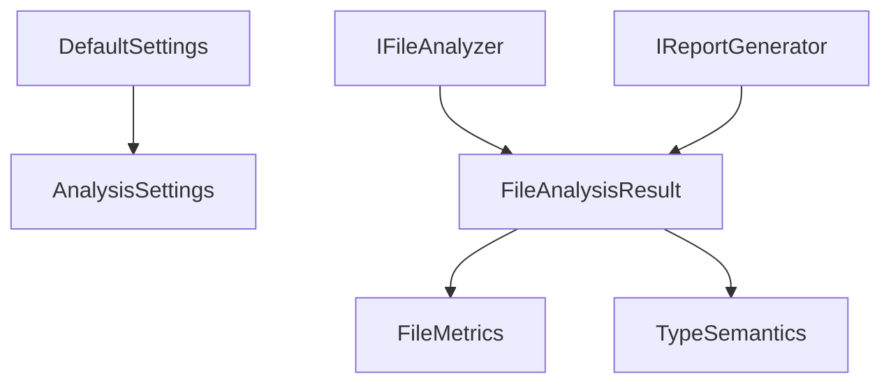

## Módulo: src/ContextWeaver.Engine

```mermaid
graph TD;
  BaseDependencyGraphSection --> DependencyGraphData
  BaseDependencyGraphSection --> DependencyRelation
  BaseDependencyGraphSection --> ReportContext
  BaseDependencyGraphSection -.-> IReportSection
  BaseModuleDiagramSection --> DependencyRelation
  BaseModuleDiagramSection --> ModuleDiagramData
  BaseModuleDiagramSection --> ReportContext
  BaseModuleDiagramSection -.-> IReportSection
  CodeAnalyzerService --> AnalysisSettings
  CodeAnalyzerService --> DependencyRelation
  CodeAnalyzerService --> FileAnalysisResult
  CodeAnalyzerService --> IFileAnalyzer
  CodeAnalyzerService --> InstabilityCalculator
  CodeAnalyzerService --> IReportGenerator
  CodeAnalyzerService --> SettingsProvider
  ComplexityWalker -.-> CSharpSyntaxWalker
  CSharpFileAnalyzer --> CSharpMetricsCalculator
  CSharpFileAnalyzer --> FileAnalysisResult
  CSharpFileAnalyzer --> FileMetrics
  CSharpFileAnalyzer --> TypeSemantics
  CSharpFileAnalyzer -.-> IFileAnalyzer
  CSharpMetricsCalculator --> ComplexityWalker
  CSharpMetricsCalculator --> NestingWalker
  DirectoryTreeSection --> FileAnalysisResult
  DirectoryTreeSection --> MarkdownHelper
  DirectoryTreeSection --> ReportContext
  DirectoryTreeSection --> TreeNode
  DirectoryTreeSection -.-> IReportSection
  FileContentSection --> DependencyRelation
  FileContentSection --> DiagramHelper
  FileContentSection --> FileAnalysisResult
  FileContentSection --> ReportContext
  FileContentSection -.-> IReportSection
  GenericFileAnalyzer --> FileAnalysisResult
  GenericFileAnalyzer -.-> IFileAnalyzer
  HeaderSection --> ReportContext
  HeaderSection -.-> IReportSection
  HotspotSection --> MarkdownHelper
  HotspotSection --> ReportContext
  HotspotSection -.-> IReportSection
  InstabilityCalculator --> DependencyRelation
  InstabilityCalculator --> FileAnalysisResult
  InstabilitySection --> ReportContext
  InstabilitySection -.-> IReportSection
  IReportSection --> ReportContext
  MarkdownReportGenerator --> DirectoryTreeSection
  MarkdownReportGenerator --> FileAnalysisResult
  MarkdownReportGenerator --> FileContentSection
  MarkdownReportGenerator --> HeaderSection
  MarkdownReportGenerator --> HotspotSection
  MarkdownReportGenerator --> InstabilitySection
  MarkdownReportGenerator --> IReportSection
  MarkdownReportGenerator --> MermaidDependencyGraphSection
  MarkdownReportGenerator --> MermaidModuleDiagramSection
  MarkdownReportGenerator --> ModuleAdjacencyListSection
  MarkdownReportGenerator --> PlantUmlDependencyGraphSection
  MarkdownReportGenerator --> PlantUmlModuleDiagramSection
  MarkdownReportGenerator --> ReportContext
  MarkdownReportGenerator -.-> IReportGenerator
  MermaidDependencyGraphSection --> DependencyGraphData
  MermaidDependencyGraphSection --> ReportContext
  MermaidDependencyGraphSection -.-> BaseDependencyGraphSection
  MermaidModuleDiagramSection --> ModuleDiagramData
  MermaidModuleDiagramSection --> ReportContext
  MermaidModuleDiagramSection -.-> BaseModuleDiagramSection
  ModuleAdjacencyListSection --> DependencyRelation
  ModuleAdjacencyListSection --> ReportContext
  ModuleAdjacencyListSection -.-> IReportSection
  NestingWalker -.-> CSharpSyntaxWalker
  PlantUmlDependencyGraphSection --> DependencyGraphData
  PlantUmlDependencyGraphSection --> DiagramHelper
  PlantUmlDependencyGraphSection --> ReportContext
  PlantUmlDependencyGraphSection -.-> BaseDependencyGraphSection
  PlantUmlModuleDiagramSection --> DiagramHelper
  PlantUmlModuleDiagramSection --> ModuleDiagramData
  PlantUmlModuleDiagramSection --> ReportContext
  PlantUmlModuleDiagramSection -.-> BaseModuleDiagramSection
  ReportContext --> FileAnalysisResult
  SettingsProvider --> AnalysisSettings
  SettingsProvider --> DefaultSettings
```

## Módulo: tests/ContextWeaver.Architecture.Tests

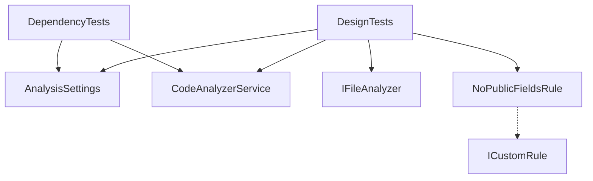

## Módulo: tests/ContextWeaver.Cli.Tests

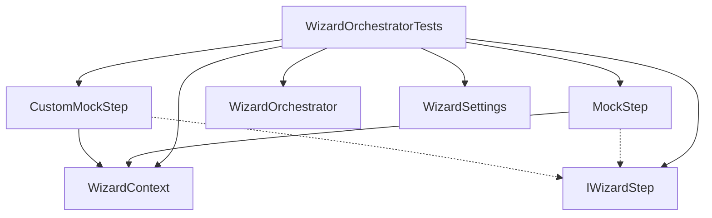

## Módulo: tests/ContextWeaver.Core.Tests

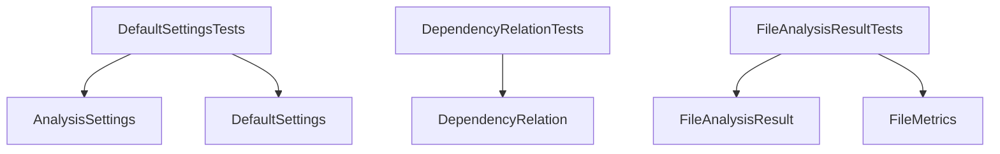

## Módulo: tests/ContextWeaver.E2E.Tests

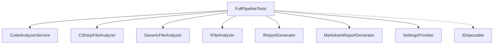

## Módulo: tests/ContextWeaver.Engine.Tests

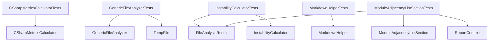

## Módulo: tests/ContextWeaver.Tests.Shared

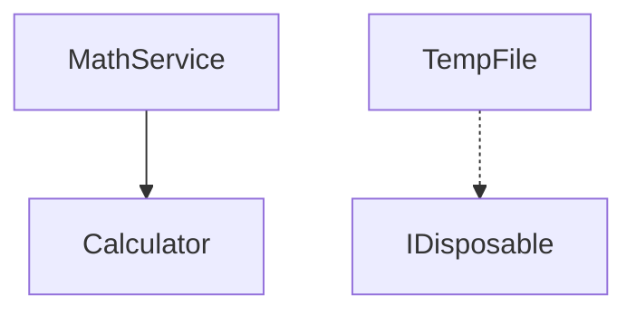

# 🧩 Diagramas de Módulo (PlantUML)

A continuación se presentan diagramas de dependencia detallados por cada módulo usando PlantUML.

## Módulo: src/ContextWeaver.Cli

```plantuml
@startuml src/ContextWeaver.Cli
hide empty members
class AnalysisSettings 
class AnalyzeCommand 
class AnalyzeSettings 
class AsyncCommand 
class CodeAnalyzerService 
class CommandSettings 
class CSharpFileAnalyzer 
class DirectoryTreeSection 
class FileContentSection 
class FileDiscoveryStep 
class FileNode 
class FileSelectionStep 
class FilterExtensionStep 
class GenericFileAnalyzer 
class HeaderSection 
class HostBuilderExtensions 
class HotspotSection 
interface IDisposable 
interface IFileAnalyzer 
class InstabilitySection 
interface IReportGenerator 
interface IReportSection 
interface ITypeRegistrar 
interface ITypeResolver 
interface IWizardStep 
class MarkdownReportGenerator 
class MermaidDependencyGraphSection 
class MermaidModuleDiagramSection 
class ModuleAdjacencyListSection 
class OutputConfigStep 
class PlantUmlDependencyGraphSection 
class PlantUmlModuleDiagramSection 
class SectionSelectionModeStep 
class SectionSelectionStep 
class SelectionModeStep 
class SettingsProvider 
class SummaryStep 
class TypeRegistrar 
class TypeResolver 
class WizardCommand 
class WizardConstants 
class WizardContext 
class WizardOrchestrator 
class WizardSettings 

  AnalyzeCommand --> AnalyzeSettings
  AnalyzeCommand --> CodeAnalyzerService
  AnalyzeCommand ..> AsyncCommand
  AnalyzeSettings ..> CommandSettings
  FileDiscoveryStep --> CodeAnalyzerService
  FileDiscoveryStep --> WizardContext
  FileDiscoveryStep ..> IWizardStep
  FileSelectionStep --> FileNode
  FileSelectionStep --> WizardConstants
  FileSelectionStep --> WizardContext
  FileSelectionStep ..> IWizardStep
  FilterExtensionStep --> WizardConstants
  FilterExtensionStep --> WizardContext
  FilterExtensionStep ..> IWizardStep
  HostBuilderExtensions --> CodeAnalyzerService
  HostBuilderExtensions --> CSharpFileAnalyzer
  HostBuilderExtensions --> GenericFileAnalyzer
  HostBuilderExtensions --> IFileAnalyzer
  HostBuilderExtensions --> IReportGenerator
  HostBuilderExtensions --> MarkdownReportGenerator
  HostBuilderExtensions --> SettingsProvider
  IWizardStep --> WizardContext
  OutputConfigStep --> WizardConstants
  OutputConfigStep --> WizardContext
  OutputConfigStep ..> IWizardStep
  SectionSelectionModeStep --> WizardConstants
  SectionSelectionModeStep --> WizardContext
  SectionSelectionModeStep ..> IWizardStep
  SectionSelectionStep --> AnalysisSettings
  SectionSelectionStep --> IReportSection
  SectionSelectionStep --> SettingsProvider
  SectionSelectionStep --> WizardConstants
  SectionSelectionStep --> WizardContext
  SectionSelectionStep ..> IWizardStep
  SelectionModeStep --> WizardConstants
  SelectionModeStep --> WizardContext
  SelectionModeStep ..> IWizardStep
  SummaryStep --> IReportSection
  SummaryStep --> WizardConstants
  SummaryStep --> WizardContext
  SummaryStep ..> IWizardStep
  TypeRegistrar --> TypeResolver
  TypeRegistrar ..> ITypeRegistrar
  TypeResolver ..> IDisposable
  TypeResolver ..> ITypeResolver
  WizardCommand --> CodeAnalyzerService
  WizardCommand --> DirectoryTreeSection
  WizardCommand --> FileContentSection
  WizardCommand --> FileDiscoveryStep
  WizardCommand --> FileSelectionStep
  WizardCommand --> FilterExtensionStep
  WizardCommand --> HeaderSection
  WizardCommand --> HotspotSection
  WizardCommand --> InstabilitySection
  WizardCommand --> IReportSection
  WizardCommand --> IWizardStep
  WizardCommand --> MermaidDependencyGraphSection
  WizardCommand --> MermaidModuleDiagramSection
  WizardCommand --> ModuleAdjacencyListSection
  WizardCommand --> OutputConfigStep
  WizardCommand --> PlantUmlDependencyGraphSection
  WizardCommand --> PlantUmlModuleDiagramSection
  WizardCommand --> SectionSelectionModeStep
  WizardCommand --> SectionSelectionStep
  WizardCommand --> SelectionModeStep
  WizardCommand --> SettingsProvider
  WizardCommand --> SummaryStep
  WizardCommand --> WizardContext
  WizardCommand --> WizardOrchestrator
  WizardCommand --> WizardSettings
  WizardCommand ..> AsyncCommand
  WizardContext --> AnalysisSettings
  WizardContext --> WizardSettings
  WizardOrchestrator --> IWizardStep
  WizardOrchestrator --> WizardContext
  WizardSettings ..> CommandSettings
@enduml
```

## Módulo: src/ContextWeaver.Core

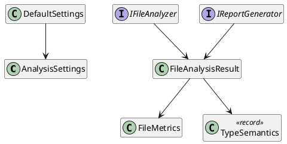

## Módulo: src/ContextWeaver.Engine

```plantuml
@startuml src/ContextWeaver.Engine
hide empty members
class AnalysisSettings 
class BaseDependencyGraphSection 
class BaseModuleDiagramSection 
class CodeAnalyzerService 
class ComplexityWalker 
class CSharpFileAnalyzer 
class CSharpMetricsCalculator 
class CSharpSyntaxWalker 
class DefaultSettings 
class DependencyGraphData <<record>>
class DependencyRelation <<record>>
class DiagramHelper 
class DirectoryTreeSection 
class FileAnalysisResult 
class FileContentSection 
class FileMetrics 
class GenericFileAnalyzer 
class HeaderSection 
class HotspotSection 
interface IFileAnalyzer 
class InstabilityCalculator 
class InstabilitySection 
interface IReportGenerator 
interface IReportSection 
class MarkdownHelper 
class MarkdownReportGenerator 
class MermaidDependencyGraphSection 
class MermaidModuleDiagramSection 
class ModuleAdjacencyListSection 
class ModuleDiagramData <<record>>
class NestingWalker 
class PlantUmlDependencyGraphSection 
class PlantUmlModuleDiagramSection 
class ReportContext <<record>>
class SettingsProvider 
class TreeNode 
class TypeSemantics <<record>>

  BaseDependencyGraphSection --> DependencyGraphData
  BaseDependencyGraphSection --> DependencyRelation
  BaseDependencyGraphSection --> ReportContext
  BaseDependencyGraphSection ..> IReportSection
  BaseModuleDiagramSection --> DependencyRelation
  BaseModuleDiagramSection --> ModuleDiagramData
  BaseModuleDiagramSection --> ReportContext
  BaseModuleDiagramSection ..> IReportSection
  CodeAnalyzerService --> AnalysisSettings
  CodeAnalyzerService --> DependencyRelation
  CodeAnalyzerService --> FileAnalysisResult
  CodeAnalyzerService --> IFileAnalyzer
  CodeAnalyzerService --> InstabilityCalculator
  CodeAnalyzerService --> IReportGenerator
  CodeAnalyzerService --> SettingsProvider
  ComplexityWalker ..> CSharpSyntaxWalker
  CSharpFileAnalyzer --> CSharpMetricsCalculator
  CSharpFileAnalyzer --> FileAnalysisResult
  CSharpFileAnalyzer --> FileMetrics
  CSharpFileAnalyzer --> TypeSemantics
  CSharpFileAnalyzer ..> IFileAnalyzer
  CSharpMetricsCalculator --> ComplexityWalker
  CSharpMetricsCalculator --> NestingWalker
  DirectoryTreeSection --> FileAnalysisResult
  DirectoryTreeSection --> MarkdownHelper
  DirectoryTreeSection --> ReportContext
  DirectoryTreeSection --> TreeNode
  DirectoryTreeSection ..> IReportSection
  FileContentSection --> DependencyRelation
  FileContentSection --> DiagramHelper
  FileContentSection --> FileAnalysisResult
  FileContentSection --> ReportContext
  FileContentSection ..> IReportSection
  GenericFileAnalyzer --> FileAnalysisResult
  GenericFileAnalyzer ..> IFileAnalyzer
  HeaderSection --> ReportContext
  HeaderSection ..> IReportSection
  HotspotSection --> MarkdownHelper
  HotspotSection --> ReportContext
  HotspotSection ..> IReportSection
  InstabilityCalculator --> DependencyRelation
  InstabilityCalculator --> FileAnalysisResult
  InstabilitySection --> ReportContext
  InstabilitySection ..> IReportSection
  IReportSection --> ReportContext
  MarkdownReportGenerator --> DirectoryTreeSection
  MarkdownReportGenerator --> FileAnalysisResult
  MarkdownReportGenerator --> FileContentSection
  MarkdownReportGenerator --> HeaderSection
  MarkdownReportGenerator --> HotspotSection
  MarkdownReportGenerator --> InstabilitySection
  MarkdownReportGenerator --> IReportSection
  MarkdownReportGenerator --> MermaidDependencyGraphSection
  MarkdownReportGenerator --> MermaidModuleDiagramSection
  MarkdownReportGenerator --> ModuleAdjacencyListSection
  MarkdownReportGenerator --> PlantUmlDependencyGraphSection
  MarkdownReportGenerator --> PlantUmlModuleDiagramSection
  MarkdownReportGenerator --> ReportContext
  MarkdownReportGenerator ..> IReportGenerator
  MermaidDependencyGraphSection --> DependencyGraphData
  MermaidDependencyGraphSection --> ReportContext
  MermaidDependencyGraphSection ..> BaseDependencyGraphSection
  MermaidModuleDiagramSection --> ModuleDiagramData
  MermaidModuleDiagramSection --> ReportContext
  MermaidModuleDiagramSection ..> BaseModuleDiagramSection
  ModuleAdjacencyListSection --> DependencyRelation
  ModuleAdjacencyListSection --> ReportContext
  ModuleAdjacencyListSection ..> IReportSection
  NestingWalker ..> CSharpSyntaxWalker
  PlantUmlDependencyGraphSection --> DependencyGraphData
  PlantUmlDependencyGraphSection --> DiagramHelper
  PlantUmlDependencyGraphSection --> ReportContext
  PlantUmlDependencyGraphSection ..> BaseDependencyGraphSection
  PlantUmlModuleDiagramSection --> DiagramHelper
  PlantUmlModuleDiagramSection --> ModuleDiagramData
  PlantUmlModuleDiagramSection --> ReportContext
  PlantUmlModuleDiagramSection ..> BaseModuleDiagramSection
  ReportContext --> FileAnalysisResult
  SettingsProvider --> AnalysisSettings
  SettingsProvider --> DefaultSettings
@enduml
```

## Módulo: tests/ContextWeaver.Architecture.Tests

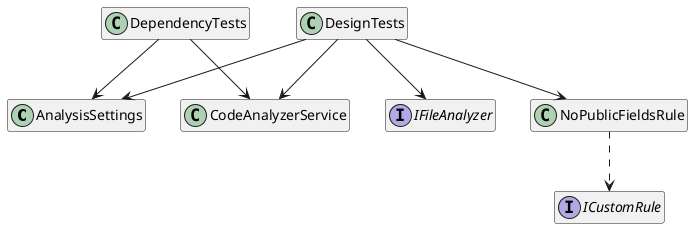

## Módulo: tests/ContextWeaver.Cli.Tests

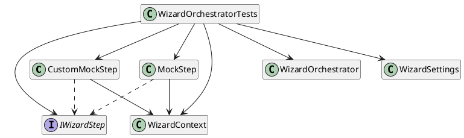

## Módulo: tests/ContextWeaver.Core.Tests

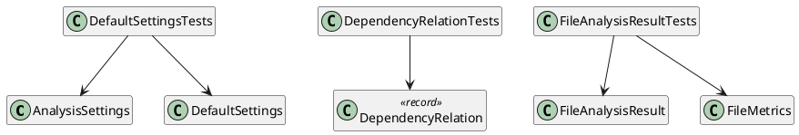

## Módulo: tests/ContextWeaver.E2E.Tests

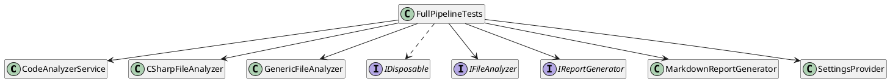

## Módulo: tests/ContextWeaver.Engine.Tests

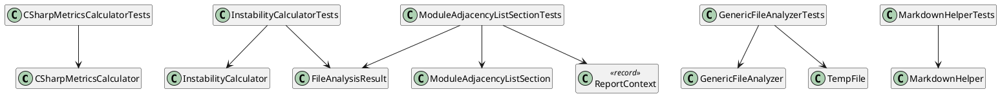

## Módulo: tests/ContextWeaver.Tests.Shared

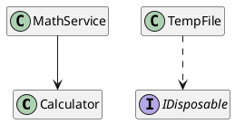

# Lista de Adyacencia de Módulos

```yaml
.agent:
  []
.config:
  []
.context:
  []
.github:
  []
.husky:
  []
docs:
  []
Root:
  []
src/ContextWeaver.Cli:
  - src/ContextWeaver.Core
  - src/ContextWeaver.Engine
src/ContextWeaver.Core:
  []
src/ContextWeaver.Engine:
  - src/ContextWeaver.Core
tests/ContextWeaver.Architecture.Tests:
  - src/ContextWeaver.Core
  - src/ContextWeaver.Engine
tests/ContextWeaver.Cli.Tests:
  - src/ContextWeaver.Cli
tests/ContextWeaver.Core.Tests:
  - src/ContextWeaver.Core
tests/ContextWeaver.E2E.Tests:
  - src/ContextWeaver.Core
  - src/ContextWeaver.Engine
tests/ContextWeaver.Engine.Tests:
  - src/ContextWeaver.Core
  - src/ContextWeaver.Engine
  - tests/ContextWeaver.Tests.Shared
tests/ContextWeaver.Tests.Shared:
  []
```

# Estructura de Directorios

- ContextWeaver/
    - .agent/
        - rules/
            - [00-read-project-guides.md](#archivo-agentrules00-read-project-guidesmd)
            - [10-architecture-guardrails.md](#archivo-agentrules10-architecture-guardrailsmd)
            - [20-size-quality.md](#archivo-agentrules20-size-qualitymd)
            - [30-response-format.md](#archivo-agentrules30-response-formatmd)
            - [40-mirror-sync.md](#archivo-agentrules40-mirror-syncmd)
            - [50-language-policy.md](#archivo-agentrules50-language-policymd)
    - .config/
        - [dotnet-tools.json](#archivo-configdotnet-toolsjson)
    - .context/
        - [plan.md](#archivo-contextplanmd)
        - [tasks.md](#archivo-contexttasksmd)
        - [workarounds.md](#archivo-contextworkaroundsmd)
    - .github/
        - ISSUE_TEMPLATE/
            - [bug_report.md](#archivo-githubissuetemplatebugreportmd)
            - [feature_request.md](#archivo-githubissuetemplatefeaturerequestmd)
        - [PULL_REQUEST_TEMPLATE.md](#archivo-githubpullrequesttemplatemd)
    - .husky/
        - [task-runner.json](#archivo-huskytask-runnerjson)
    - docs/
        - llm/
            - [ARCHITECTURE.md](#archivo-docsllmarchitecturemd)
            - [CHECKLIST.md](#archivo-docsllmchecklistmd)
            - [CONSTITUTION.md](#archivo-docsllmconstitutionmd)
    - src/
        - ContextWeaver.Cli/
            - Commands/
                - Wizard/
                    - [FileDiscoveryStep.cs](#archivo-srccontextweaverclicommandswizardfilediscoverystepcs)
                    - [FileSelectionStep.cs](#archivo-srccontextweaverclicommandswizardfileselectionstepcs)
                    - [FilterExtensionStep.cs](#archivo-srccontextweaverclicommandswizardfilterextensionstepcs)
                    - [IWizardStep.cs](#archivo-srccontextweaverclicommandswizardiwizardstepcs)
                    - [OutputConfigStep.cs](#archivo-srccontextweaverclicommandswizardoutputconfigstepcs)
                    - [SectionSelectionModeStep.cs](#archivo-srccontextweaverclicommandswizardsectionselectionmodestepcs)
                    - [SectionSelectionStep.cs](#archivo-srccontextweaverclicommandswizardsectionselectionstepcs)
                    - [SelectionModeStep.cs](#archivo-srccontextweaverclicommandswizardselectionmodestepcs)
                    - [StepResult.cs](#archivo-srccontextweaverclicommandswizardstepresultcs)
                    - [SummaryStep.cs](#archivo-srccontextweaverclicommandswizardsummarystepcs)
                    - [WizardConstants.cs](#archivo-srccontextweaverclicommandswizardwizardconstantscs)
                    - [WizardContext.cs](#archivo-srccontextweaverclicommandswizardwizardcontextcs)
                    - [WizardOrchestrator.cs](#archivo-srccontextweaverclicommandswizardwizardorchestratorcs)
                - [AnalyzeCommand.cs](#archivo-srccontextweaverclicommandsanalyzecommandcs)
                - [AnalyzeSettings.cs](#archivo-srccontextweaverclicommandsanalyzesettingscs)
                - [WizardCommand.cs](#archivo-srccontextweaverclicommandswizardcommandcs)
                - [WizardSettings.cs](#archivo-srccontextweaverclicommandswizardsettingscs)
            - Infrastructure/
                - [TypeRegistrar.cs](#archivo-srccontextweavercliinfrastructuretyperegistrarcs)
            - Resources/
                - [ReportStrings.Designer.cs](#archivo-srccontextweavercliresourcesreportstringsdesignercs)
                - [ReportStrings.es.Designer.cs](#archivo-srccontextweavercliresourcesreportstringsesdesignercs)
            - [.contextweaver.json](#archivo-srccontextweaverclicontextweaverjson)
            - [CliConstants.cs](#archivo-srccontextweaverclicliconstantscs)
            - [ContextWeaver.Cli.csproj](#archivo-srccontextweaverclicontextweaverclicsproj)
            - [HostBuilderExtensions.cs](#archivo-srccontextweaverclihostbuilderextensionscs)
            - [Program.cs](#archivo-srccontextweavercliprogramcs)
        - ContextWeaver.Core/
            - Abstractions/
                - [IFileAnalyzer.cs](#archivo-srccontextweavercoreabstractionsifileanalyzercs)
                - [IReportGenerator.cs](#archivo-srccontextweavercoreabstractionsireportgeneratorcs)
            - Models/
                - [AnalysisSettings.cs](#archivo-srccontextweavercoremodelsanalysissettingscs)
                - [DefaultSettings.cs](#archivo-srccontextweavercoremodelsdefaultsettingscs)
                - [DependencyRelation.cs](#archivo-srccontextweavercoremodelsdependencyrelationcs)
                - [FileAnalysisResult.cs](#archivo-srccontextweavercoremodelsfileanalysisresultcs)
                - [FileMetrics.cs](#archivo-srccontextweavercoremodelsfilemetricscs)
            - [ContextWeaver.Core.csproj](#archivo-srccontextweavercorecontextweavercorecsproj)
        - ContextWeaver.Engine/
            - Analyzers/
                - [CSharpFileAnalyzer.cs](#archivo-srccontextweaverengineanalyzerscsharpfileanalyzercs)
                - [GenericFileAnalyzer.cs](#archivo-srccontextweaverengineanalyzersgenericfileanalyzercs)
            - Reporters/
                - Sections/
                    - [BaseDependencyGraphSection.cs](#archivo-srccontextweaverenginereporterssectionsbasedependencygraphsectioncs)
                    - [BaseModuleDiagramSection.cs](#archivo-srccontextweaverenginereporterssectionsbasemodulediagramsectioncs)
                    - [DirectoryTreeSection.cs](#archivo-srccontextweaverenginereporterssectionsdirectorytreesectioncs)
                    - [FileContentSection.cs](#archivo-srccontextweaverenginereporterssectionsfilecontentsectioncs)
                    - [HeaderSection.cs](#archivo-srccontextweaverenginereporterssectionsheadersectioncs)
                    - [HotspotSection.cs](#archivo-srccontextweaverenginereporterssectionshotspotsectioncs)
                    - [InstabilitySection.cs](#archivo-srccontextweaverenginereporterssectionsinstabilitysectioncs)
                    - [MermaidDependencyGraphSection.cs](#archivo-srccontextweaverenginereporterssectionsmermaiddependencygraphsectioncs)
                    - [MermaidModuleDiagramSection.cs](#archivo-srccontextweaverenginereporterssectionsmermaidmodulediagramsectioncs)
                    - [ModuleAdjacencyListSection.cs](#archivo-srccontextweaverenginereporterssectionsmoduleadjacencylistsectioncs)
                    - [PlantUmlDependencyGraphSection.cs](#archivo-srccontextweaverenginereporterssectionsplantumldependencygraphsectioncs)
                    - [PlantUmlModuleDiagramSection.cs](#archivo-srccontextweaverenginereporterssectionsplantumlmodulediagramsectioncs)
                - [DiagramHelper.cs](#archivo-srccontextweaverenginereportersdiagramhelpercs)
                - [IReportSection.cs](#archivo-srccontextweaverenginereportersireportsectioncs)
                - [MarkdownReportGenerator.cs](#archivo-srccontextweaverenginereportersmarkdownreportgeneratorcs)
                - [ReportContext.cs](#archivo-srccontextweaverenginereportersreportcontextcs)
            - Services/
                - [CodeAnalyzerService.cs](#archivo-srccontextweaverengineservicescodeanalyzerservicecs)
                - [SettingsProvider.cs](#archivo-srccontextweaverengineservicessettingsprovidercs)
            - Utilities/
                - [CSharpMetricsCalculator.cs](#archivo-srccontextweaverengineutilitiescsharpmetricscalculatorcs)
                - [InstabilityCalculator.cs](#archivo-srccontextweaverengineutilitiesinstabilitycalculatorcs)
                - [MarkdownHelper.cs](#archivo-srccontextweaverengineutilitiesmarkdownhelpercs)
                - [NestingWalker.cs](#archivo-srccontextweaverengineutilitiesnestingwalkercs)
            - [ContextWeaver.Engine.csproj](#archivo-srccontextweaverenginecontextweaverenginecsproj)
    - tests/
        - ContextWeaver.Architecture.Tests/
            - [ContextWeaver.Architecture.Tests.csproj](#archivo-testscontextweaverarchitecturetestscontextweaverarchitecturetestscsproj)
            - [DependencyTests.cs](#archivo-testscontextweaverarchitecturetestsdependencytestscs)
            - [DesignTests.cs](#archivo-testscontextweaverarchitecturetestsdesigntestscs)
            - [NoPublicFieldsRule.cs](#archivo-testscontextweaverarchitecturetestsnopublicfieldsrulecs)
        - ContextWeaver.Cli.Tests/
            - [ContextWeaver.Cli.Tests.csproj](#archivo-testscontextweaverclitestscontextweaverclitestscsproj)
            - [UnitTest1.cs](#archivo-testscontextweaverclitestsunittest1cs)
            - [WizardOrchestratorTests.cs](#archivo-testscontextweaverclitestswizardorchestratortestscs)
        - ContextWeaver.Core.Tests/
            - [ContextWeaver.Core.Tests.csproj](#archivo-testscontextweavercoretestscontextweavercoretestscsproj)
            - [DefaultSettingsTests.cs](#archivo-testscontextweavercoretestsdefaultsettingstestscs)
            - [DependencyRelationTests.cs](#archivo-testscontextweavercoretestsdependencyrelationtestscs)
            - [FileAnalysisResultTests.cs](#archivo-testscontextweavercoretestsfileanalysisresulttestscs)
        - ContextWeaver.E2E.Tests/
            - [ContextWeaver.E2E.Tests.csproj](#archivo-testscontextweavere2etestscontextweavere2etestscsproj)
            - [FullPipelineTests.cs](#archivo-testscontextweavere2etestsfullpipelinetestscs)
        - ContextWeaver.Engine.Tests/
            - Analyzers/
                - [GenericFileAnalyzerTests.cs](#archivo-testscontextweaverenginetestsanalyzersgenericfileanalyzertestscs)
            - Reporters/
                - Sections/
                    - [ModuleAdjacencyListSectionTests.cs](#archivo-testscontextweaverenginetestsreporterssectionsmoduleadjacencylistsectiontestscs)
            - Utilities/
                - [CSharpMetricsCalculatorTests.cs](#archivo-testscontextweaverenginetestsutilitiescsharpmetricscalculatortestscs)
                - [InstabilityCalculatorTests.cs](#archivo-testscontextweaverenginetestsutilitiesinstabilitycalculatortestscs)
                - [MarkdownHelperTests.cs](#archivo-testscontextweaverenginetestsutilitiesmarkdownhelpertestscs)
            - [ContextWeaver.Engine.Tests.csproj](#archivo-testscontextweaverenginetestscontextweaverenginetestscsproj)
        - ContextWeaver.Tests.Shared/
            - Fixtures/
                - SampleProject/
                    - Services/
                        - [MathService.cs](#archivo-testscontextweavertestssharedfixturessampleprojectservicesmathservicecs)
                    - [.contextweaver.json](#archivo-testscontextweavertestssharedfixturessampleprojectcontextweaverjson)
                    - [Calculator.cs](#archivo-testscontextweavertestssharedfixturessampleprojectcalculatorcs)
                    - [config.json](#archivo-testscontextweavertestssharedfixturessampleprojectconfigjson)
            - Helpers/
                - [TempFile.cs](#archivo-testscontextweavertestssharedhelperstempfilecs)
            - [ContextWeaver.Tests.Shared.csproj](#archivo-testscontextweavertestssharedcontextweavertestssharedcsproj)
    - [.contextweaver.json](#archivo-contextweaverjson)
    - [CHANGELOG.md](#archivo-changelogmd)
    - [CODE_OF_CONDUCT.md](#archivo-codeofconductmd)
    - [context-clean.md](#archivo-context-cleanmd)
    - [context.md](#archivo-contextmd)
    - [ContextWeaver.sln](#archivo-contextweaversln)
    - [CONTRIBUTING.md](#archivo-contributingmd)
    - [global.json](#archivo-globaljson)
    - [README.md](#archivo-readmemd)
    - [REVISION_TECNICA.md](#archivo-revisiontecnicamd)
    - [SECURITY.md](#archivo-securitymd)
    - [SPEC.md](#archivo-specmd)
    - [stylecop.json](#archivo-stylecopjson)

# Archivos

## Archivo: .agent/rules/00-read-project-guides.md

#### Métricas
* **Líneas de Código (LOC):** 14

#### Código Fuente
```markdown
---
trigger: always_on
---

# ContextWeaver — Lectura obligatoria (siempre)

Antes de modificar código, DEBES leer en este orden:
1) docs/llm/CONSTITUTION.md
2) docs/llm/ARCHITECTURE.md
3) docs/llm/CHECKLIST.md

Si no tienes acceso a esos archivos, DETENTE y solicita que te compartan su contenido primero.
No asumas reglas. Sigue al pie de la letra la filosofía establecida por el proyecto.
```

## Archivo: .agent/rules/10-architecture-guardrails.md

#### Métricas
* **Líneas de Código (LOC):** 19

#### Código Fuente
```markdown
---
trigger: always_on
---

# ContextWeaver — Arquitectura por capas (siempre)

Respeta el patrón de Arquitectura Centrada en el Dominio (Ports & Adapters) estricta:

- `src/ContextWeaver.Core/**`: Dominio. Modelos, Reglas, Puertos (Interfaces). Cero dependencias externas.
- `src/ContextWeaver.Engine/**`: Mecanismos y lógica de aplicación. Analyzers, Formatters y Reporters. Depende de `Core`.
- `src/ContextWeaver.Cli/**`: Mecanismo de entrega. Control de la terminal interactiva (Wizard). Depende de `Engine` y `Core`.

Reglas de dependencias y aislamiento estructural:
- `ContextWeaver.Core` DEBE ignorar por completo la existencia de `Engine` o de `Cli`. Nunca puede usar lógicas de CLI.
- `ContextWeaver.Engine` puede referenciar e instrumentar objetos de `Core`. No puede importar `Cli`.
- `ContextWeaver.Cli` configura las inyecciones de dependencias instanciando clases de base e interfaces de Core y Engine.

Si detectas un caso que viola esta dirección (`Cli -> Engine -> Core`), estás obligado a priorizar refactorizaciones para corregirlo, ya que el proyecto impone esta regla por `NetArchTest`.
```

## Archivo: .agent/rules/20-size-quality.md

#### Métricas
* **Líneas de Código (LOC):** 13

#### Código Fuente
```markdown
---
trigger: always_on
---

# ContextWeaver — Calidad, Tamaño y Prácticas C# (siempre)

- Modularidad: Mantén responsabilidades limitadas por clase. Alto grado de inyección de dependencias a nivel constructor.
- Zero Warnings: "Una advertencia ignorada hoy es un bug mañana". Trata los warnings como errores estáticos en tu output.
- Diseño sellado: Usa la palabra reservada `sealed` para todas las clases y servicios de lógicas cerradas.
- Colecciones: Privilegia implementaciones Inmutables (`IReadOnlyCollection<T>`, `IReadOnlyList<T>`, arrays con C# 12 `Collection Expressions`) frente a Mutables, a menos que un algoritmo mutable sea demostrablemente indispensable a nivel local dentro de un método.
- Estructura de funciones: Separa código largo en funciones descriptivas que puedan ser fácilmente testeables por los Mocks del sistema. Evita pasar demasiados argumentos separados agrupándolos mediante options/settings records.
- Pruebas expresivas en `.Tests`: Sigue el naming híbrido de `.editorconfig` localmente en pruebas: Ej. `MiClase_ValidarArgumento_LanzaExcepcion()`.
```

## Archivo: .agent/rules/30-response-format.md

#### Métricas
* **Líneas de Código (LOC):** 15

#### Código Fuente
```markdown
---
trigger: always_on
---

# ContextWeaver — Formato de entrega (siempre)

Al responder con cambios de código, SIEMPRE entrega obligatoriamente este formato:

1) Plan (resumen breve)
2) Archivos a modificar (lista de rutas)
3) Implementación (código en diffs o snippets)
4) Checklist (pass/fail + razón si falla)

En `.NET`, si la implementación incluye agregar nuevas clases que no existían previamente en un proyecto, recuerda mencionar brevemente si requerirán ser dadas de alta en la inyección de dependencias `ServiceCollection` que ocurre en `ContextWeaver.Cli/Program.cs` o sus extensions.
```

## Archivo: .agent/rules/40-mirror-sync.md

#### Métricas
* **Líneas de Código (LOC):** 23

#### Código Fuente
```markdown
---
trigger: always_on
---

## REGLA DE SINCRONIZACIÓN OBLIGATORIA (EFECTO ESPEJO)

Tu función crítica en este proyecto es mantener una sincronización perfecta entre tu entorno interno (Anti Gravity/Artefactos) y los archivos locales del proyecto.

CADA VEZ que realices una acción que modifique el estado del proyecto en tu interfaz interna, ESTÁS OBLIGADO a replicar ese mismo cambio en los archivos físicos locales ANTES de responder en el chat.

Aplica este "efecto espejo" bajo las siguientes condiciones:

1. **Tareas:** Si generas, modificas o marcas una tarea como completada en tu gestor interno, debes abrir `.context/tasks.md` y realizar la actualización exacta (ej. marcando `[x]`).
2. **Plan:** Si avanzas de fase, agregas pasos o modificas tu plan de implementación interno, debes editar `.context/plan.md` para que refleje exactamente tu nuevo estado interno.
3. **Workarounds:** Si el entorno o el código nos obliga a tomar una ruta alternativa, aplicar un parche o una solución no convencional, debes registrarlo en tu sistema y simultáneamente documentarlo en `.context/workarounds.md`.

**RESTRICCIÓN DE SALIDA:** Es una violación a tus instrucciones confirmar en el chat que has actualizado tu entorno, plan o tareas sin haber ejecutado la escritura correspondiente en los archivos `.md`. Ambos ecosistemas (tu entorno y los archivos locales) deben ser idénticos al finalizar cada una de tus respuestas.

**Ubicación canónica de los archivos:**
- `.context/plan.md`
- `.context/tasks.md`
- `.context/workarounds.md`
```

## Archivo: .agent/rules/50-language-policy.md

#### Métricas
* **Líneas de Código (LOC):** 16

#### Código Fuente
```markdown
---
trigger: always_on
---

# ContextWeaver — Política de idioma (siempre)

Alineado con lo declarado en `.cursorrules`:

- Toda explicación, plan, resumen y texto para el usuario en el chat DEBE estar en español.
- **En Código Fuente:** La documentación XML (`<summary>`, `<param>`, `<returns>`), comentarios en línea (`//`) y directivas de cabecera (`#region`) deben escribirse EN ESPAÑOL, con tono directo.
- NO APLIQUES prefijos generados del inglés (no uses "Gets or sets..." -> "Obtiene o establece..."). Ve directo a la descripción: e.g., "El límite de anidamiento permitido.".
- **EXCEPCIONES ESTRICTAS QUE DEBEN SEGUIR EN INGLÉS:**
  - Nomenclaturas y conceptos de programación: NO traduzcas nombres de patrones ("Wrapper", "Helper", "Service", "Pipeline", "Task", "Mock"). "Envoltorio" o "Ayudante" son incorrectos.
  - Identificadores en C#: Toda clase, interfaz, método, propiedad, atributo, parámetro y variable local del código continuarán en estricto inglés (`Engine`, `Parser`, `Analyze()`, `Execute()`).
- Si detectas inglés por error en la documentación o explicaciones, corrígelo. Si ocurre español en un modificador local por error, conviértelo a inglés (e.g. `int contador` -> `int counter`).
```

## Archivo: .config/dotnet-tools.json

#### Métricas
* **Líneas de Código (LOC):** 13

#### Código Fuente
```json
{
  "version": 1,
  "isRoot": true,
  "tools": {
    "husky": {
      "version": "0.8.0",
      "commands": [
        "husky"
      ],
      "rollForward": false
    }
  }
}
```

## Archivo: .context/plan.md

#### Métricas
* **Líneas de Código (LOC):** 12

#### Código Fuente
```markdown
# Plan de Implementación Consolidado

[Estado oficial de los pasos del plan]

# Plan actual: Eliminación de Relaciones Duplicadas en Diagramas

1.  **Fase de Corrección en `CSharpFileAnalyzer.cs`**:
    - Crear un `HashSet<string> inheritedTypes` al procesar la lista base (Herencia/Implementación).
    - Al procesar el bloque de "Uso / Composición", omitir la adición de la relación `-->` si el targetTypeName ya se encuentra en `inheritedTypes`.
2.  **Fase de Validación**:
    - Compilar la aplicación y ejecutarla localmente para verificar la eliminación de dependencias duplicadas en los diagramas PlantUML / Mermaid generados en un reporte de prueba.
```

## Archivo: .context/tasks.md

#### Métricas
* **Líneas de Código (LOC):** 6

#### Código Fuente
```markdown
# Tareas activas

- [x] Corregir duplicación de relaciones en `CSharpFileAnalyzer.cs`
- [/] Validar diagramas Mermaid locales
- [ ] Validar diagramas PlantUML locales
```

## Archivo: .context/workarounds.md

#### Métricas
* **Líneas de Código (LOC):** 4

#### Código Fuente
```markdown
# Workarounds Registrados

[Parches funcionales y excepciones puntuales a las reglas]
```

## Archivo: .contextweaver.json

#### Métricas
* **Líneas de Código (LOC):** 87

#### Código Fuente
```json
{
  "AnalysisSettings": {
    "IncludedExtensions": [
      ".cs",
      ".csproj",
      ".sln",
      ".json",
      ".ts",
      ".html",
      ".scss",
      ".css",
      ".md",
      ".cs",
      ".csproj",
      ".sln",
      ".json",
      ".ts",
      ".html",
      ".scss",
      ".css",
      ".md",
      ".cs",
      ".csproj",
      ".sln",
      ".json",
      ".ts",
      ".html",
      ".scss",
      ".css",
      ".md"
    ],
    "ExcludePatterns": [
      "bin",
      "obj",
      "node_modules",
      ".angular",
      ".vs",
      "dist",
      "wwwroot",
      "Publish",
      "packages",
      "Scripts",
      "Content",
      "bin",
      "obj",
      "node_modules",
      ".angular",
      ".vs",
      "dist",
      "wwwroot",
      "Publish",
      "packages",
      "Scripts",
      "Content",
      "bin",
      "obj",
      "node_modules",
      ".angular",
      ".vs",
      "dist",
      "wwwroot",
      "Publish",
      "packages",
      "Scripts",
      "Content"
    ],
    "EnabledSections": [
      "\uD83D\uDD25 Hotspots",
      "\uD83D\uDCCA Inestabilidad",
      "\uD83D\uDD17 Lista de Adyacencia de M\u00F3dulos (YAML)",
      "\uD83C\uDF32 \u00C1rbol de Directorios",
      "\uD83D\uDCC1 Contenido de Archivos"
    ],
    "WrapperDirectories": [
      "src",
      "source",
      "test",
      "tests",
      "lib",
      "src",
      "source",
      "test",
      "tests",
      "lib"
    ]
  }
}
```

## Archivo: .github/ISSUE_TEMPLATE/bug_report.md

#### Métricas
* **Líneas de Código (LOC):** 39

#### Código Fuente
```markdown
---
name: Bug Report
about: Reportar un problema o comportamiento inesperado
title: '[BUG] '
labels: bug
assignees: ''
---

## Descripción del bug

Descripción clara y concisa del problema.

## Pasos para reproducir

1. Ejecutar `contextweaver ...`
2. Observar el error en ...

## Comportamiento esperado

¿Qué esperabas que sucediera?

## Comportamiento actual

¿Qué sucedió en realidad?

## Entorno

- **OS:** [ej. Windows 11, macOS 14, Ubuntu 22.04]
- **Versión de .NET:** [ej. 8.0.401]
- **Versión de ContextWeaver:** [ej. 1.0.6]

## Contexto adicional

Logs, capturas de pantalla, o archivos de configuración relevantes.

## Issues relacionados

Si este bug está relacionado con otro issue abierto o cerrado, menciónalo aquí (ej. #123).
```

## Archivo: .github/ISSUE_TEMPLATE/feature_request.md

#### Métricas
* **Líneas de Código (LOC):** 28

#### Código Fuente
```markdown
---
name: Feature Request
about: Proponer una nueva funcionalidad
title: '[FEATURE] '
labels: enhancement
assignees: ''
---

## Problema o motivación

Describe el problema que esta funcionalidad resolvería.

## Solución propuesta

Describe cómo te gustaría que funcionara.

## Alternativas consideradas

¿Hay otras formas de resolver el problema?

## Contexto adicional

Mockups, ejemplos de otras herramientas, o cualquier referencia útil.

## Issues relacionados

Si esta feature está relacionada con otro issue (bug o feature), menciónalo aquí.
```

## Archivo: .github/PULL_REQUEST_TEMPLATE.md

#### Métricas
* **Líneas de Código (LOC):** 24

#### Código Fuente
```markdown
## Descripción

Breve descripción de los cambios.
Link al issue relacionado: Fixes # (issue)

## Tipo de cambio

- [ ] Bug fix (fix non-breaking que arregla un problema)
- [ ] Nueva funcionalidad (feature non-breaking que agrega funcionalidad)
- [ ] Breaking change (fix o feature que causaría que funcionalidad existente no funcione como se espera)
- [ ] Documentación (actualización o creación de docs)
- [ ] Refactor / Chore (mantenimiento de código sin cambios funcionales)
- [ ] CI/CD (cambios en pipelines o workflows)

## Checklist

- [ ] Mi código sigue la arquitectura del proyecto (`Cli → Engine → Core`)
- [ ] He agregado tests que cubren mis cambios (Unitarios o E2E)
- [ ] `dotnet format --verify-no-changes` pasa sin errores
- [ ] `dotnet build --no-incremental` compila sin warnings
- [ ] `dotnet test` pasa con todos los tests (100% pass)
- [ ] He actualizado la documentación (README, SPEC) si es necesario
- [ ] Mi código no genera nuevas advertencias de análisis estático (StyleCop/Roslyn)
```

## Archivo: .husky/task-runner.json

#### Métricas
* **Líneas de Código (LOC):** 44

#### Código Fuente
```json
{
  "tasks": [
    {
      "name": "build-check",
      "group": "pre-commit",
      "command": "dotnet",
      "args": [
        "build",
        "--no-restore",
        "--warnaserror"
      ],
      "include": [
        "**/*.cs"
      ]
    },
    {
      "name": "format",
      "group": "pre-commit",
      "command": "dotnet",
      "args": [
        "format",
        "--include",
        "${staged}"
      ],
      "include": [
        "**/*.cs",
        "**/*.json"
      ]
    },
    {
      "name": "stage-fix",
      "group": "pre-commit",
      "command": "git",
      "args": [
        "add",
        "${staged}"
      ],
      "include": [
        "**/*.cs",
        "**/*.json"
      ]
    }
  ]
}
```

## Archivo: CHANGELOG.md

#### Métricas
* **Líneas de Código (LOC):** 24

#### Código Fuente
```markdown
# Changelog

Todos los cambios notables en este proyecto serán documentados en este archivo.

El formato se basa en [Keep a Changelog](https://keepachangelog.com/es-ES/1.0.0/),
y este proyecto adhiere a [Semantic Versioning](https://semver.org/lang/es/).

## [Unreleased]

### Añadido
- Configuración de **Husky.NET** para hooks de Git (`pre-commit`).
- Documentación de contribución (`CONTRIBUTING.md`) en español.
- Archivos estándar de comunidad: `CODE_OF_CONDUCT.md`, `SECURITY.md`.
- Nuevo proyecto `ContextWeaver.Tests.Shared` para utilidades de prueba compartidas.

### Cambiado
- Refactorización masiva de pruebas: Separación de `ContextWeaver.Tests` en `Core.Tests`, `Engine.Tests` y `E2E.Tests`.
- Actualización de `FullPipelineTests` para usar directorios temporales aislados.
- Renombrado del parámetro `--directorio` a `--directory` para mayor consistencia.
- Consolidación de reglas de `.editorconfig`.

### Eliminado
- Proyecto monolítico `ContextWeaver.Tests`.
```

## Archivo: CODE_OF_CONDUCT.md

#### Métricas
* **Líneas de Código (LOC):** 47

#### Código Fuente
```markdown
# Código de Conducta del Pacto de Contribuyentes

## Nuestro Compromiso

Nosotros, como miembros, contribuyentes y administradores, nos comprometemos a hacer de la participación en nuestra comunidad una experiencia libre de acoso para todo el mundo, independientemente de la edad, dimensión corporal, discapacidad visible o invisible, etnicidad, características sexuales, identidad y expresión de género, nivel de experiencia, educación, nivel socio-económico, nacionalidad, apariencia personal, raza, religión, o identidad y orientación sexual.

Nos comprometemos a actuar e interactuar de maneras que contribuyan a una comunidad abierta, acogedora, diversa, inclusiva y saludable.

## Nuestros Estándares

Ejemplos de comportamiento que contribuyen a crear un ambiente positivo para nuestra comunidad:

* Demostrar empatía y amabilidad ante otras personas
* Respetar las diferentes opiniones, puntos de vista y experiencias
* Dar y aceptar adecuadamente retroalimentación constructiva
* Aceptar la responsabilidad y disculparse ante quienes hayamos afectado por nuestros errores, aprendiendo de la experiencia
* Centrarse en lo que sea mejor no sólo para nosotros como individuos, sino para la comunidad en general

Ejemplos de comportamiento inaceptable:

* El uso de lenguaje o imágenes sexualizadas, y aproximaciones o atenciones sexuales de cualquier tipo
* Comentarios despectivos (trolling), insultantes o derogatorios, y ataques personales o políticos
* El acoso en público o en privado
* Publicar información privada de otras personas, tales como direcciones físicas o electrónicas, sin su permiso explícito
* Otras conductas que puedan ser razonablemente consideradas como inapropiadas en un entorno profesional

## Aplicación de las responsabilidades

La dirección de la comunidad es responsable de aclarar y hacer cumplir nuestros estándares de comportamiento aceptable y tomará medidas correctivas y justas en respuesta a cualquier comportamiento que consideren inapropiado, amenazante, ofensivo o dañino.

La dirección de la comunidad tendrá el derecho y la responsabilidad de eliminar, editar o rechazar comentarios, commits, código, ediciones de páginas de wiki, errores y otras contribuciones que no se alineen con este Código de Conducta, y comunicará las razones para sus decisiones de moderación cuando sea apropiado.

## Alcance

Este Código de Conducta aplica tanto a espacios del proyecto como a espacios públicos donde un individuo esté en representación del proyecto o de su comunidad.

## Aplicación

Instancias de comportamiento abusivo, acosador o inaceptable pueden ser reportadas a los administradores de la comunidad responsables del cumplimiento a través de los canales de comunicación del repositorio. Todas las quejas serán revisadas e investigadas resultando en una respuesta que se considere necesaria y apropiada a las circunstancias.

## Atribución

Este Código de Conducta es una adaptación del [Contributor Covenant][homepage], versión 2.1, disponible en [https://www.contributor-covenant.org/version/2/1/code_of_conduct.html][v2.1].

[homepage]: https://www.contributor-covenant.org
[v2.1]: https://www.contributor-covenant.org/version/2/1/code_of_conduct.html
```

## Archivo: context-clean.md

#### Métricas
* **Líneas de Código (LOC):** 21489

#### Código Fuente
```markdown
Este archivo es una representación consolidada del código fuente de 'ContextWeaver', fusionado en un único documento por ContextWeaver.
El contenido ha sido procesado para crear un contexto completo para su análisis.

# Resumen del Archivo

## Propósito
Este archivo contiene una representación empaquetada de los contenidos del repositorio.
Está diseñado para ser fácilmente consumible por sistemas de IA para análisis, revisión de código u 
otros procesos automatizados.

## Formato del Archivo
El contenido se organiza de la siguiente manera:
1. Esta sección de resumen.
2. Una sección de "Análisis de Hotspots" que identifica archivos clave por métricas.
3. Una sección de "Análisis de Inestabilidad" que proporciona información arquitectónica.
4. Un árbol de la estructura de directorios con enlaces clicables a cada archivo.
5. Múltiples entradas de archivo, cada una de las cuales consta de:
   - Un encabezado con la ruta del archivo (## Archivo: ruta/al/archivo)
   - El resumen del "Repo Map" (API pública e importaciones).
   - El contenido completo del archivo en un bloque de código.

## Pautas de Uso
- Este archivo debe ser tratado como de solo lectura. Cualquier cambio debe realizarse en 
  los archivos originales del repositorio, no en esta versión empaquetada.
- Al procesar este archivo, use la ruta del archivo para distinguir entre los diferentes 
  archivos del repositorio.
- Tenga en cuenta que este archivo puede contener información sensible. Manéjelo con el mismo 
  nivel de seguridad que manejaría el repositorio original.

## Notas
- Algunos archivos pueden haber sido excluidos según la configuración de ContextWeaver en `.contextweaver.json`.
- Los archivos binarios no se incluyen en esta representación empaquetada.
- Los archivos se ordenan alfabéticamente por su ruta completa para una ordenación consistente.
# 🔥 Análisis de Hotspots

## 5 Principales Archivos por Líneas de Código (LOC)
* **(7649 LOC)** - [`context.md`](#archivo-contextmd)
* **(405 LOC)** - [`src/ContextWeaver.Cli/Resources/ReportStrings.Designer.cs`](#archivo-srccontextweavercliresourcesreportstringsdesignercs)
* **(405 LOC)** - [`src/ContextWeaver.Cli/Resources/ReportStrings.es.Designer.cs`](#archivo-srccontextweavercliresourcesreportstringsesdesignercs)
* **(329 LOC)** - [`src/ContextWeaver.Engine/Analyzers/CSharpFileAnalyzer.cs`](#archivo-srccontextweaverengineanalyzerscsharpfileanalyzercs)
* **(284 LOC)** - [`tests/ContextWeaver.Engine.Tests/Utilities/InstabilityCalculatorTests.cs`](#archivo-testscontextweaverenginetestsutilitiesinstabilitycalculatortestscs)

## 5 Principales Archivos por Número de Importaciones
* **(10 Importaciones)** - [`src/ContextWeaver.Cli/Commands/WizardCommand.cs`](#archivo-srccontextweaverclicommandswizardcommandcs)
* **(9 Importaciones)** - [`src/ContextWeaver.Cli/Program.cs`](#archivo-srccontextweavercliprogramcs)
* **(8 Importaciones)** - [`tests/ContextWeaver.E2E.Tests/FullPipelineTests.cs`](#archivo-testscontextweavere2etestsfullpipelinetestscs)
* **(7 Importaciones)** - [`src/ContextWeaver.Cli/Commands/Wizard/SectionSelectionStep.cs`](#archivo-srccontextweaverclicommandswizardsectionselectionstepcs)
* **(7 Importaciones)** - [`src/ContextWeaver.Cli/HostBuilderExtensions.cs`](#archivo-srccontextweaverclihostbuilderextensionscs)

# 📊 Análisis de Inestabilidad

Esta sección estima la métrica de Inestabilidad (I) para cada módulo de nivel superior (carpeta/proyecto) basándose en sus dependencias (importaciones).
`I = Ce / (Ca + Ce)`
- `Ce` (Eferente): Cuántos otros módulos usa este módulo (apunta hacia afuera).
- `Ca` (Aferente): Cuántos otros módulos dependen de este módulo (apunta hacia adentro).

## Resumen de Inestabilidad del Módulo:

| Módulo | Ca (Eferente) | Ce (Aferente) | Inestabilidad (I) | Descripción |
|---|---|---|---|---|
| `.agent` | 0 | 0 | 0.00 | Muy estable / Core |
| `.config` | 0 | 0 | 0.00 | Muy estable / Core |
| `.context` | 0 | 0 | 0.00 | Muy estable / Core |
| `.github` | 0 | 0 | 0.00 | Muy estable / Core |
| `.husky` | 0 | 0 | 0.00 | Muy estable / Core |
| `docs` | 0 | 0 | 0.00 | Muy estable / Core |
| `Root` | 0 | 0 | 0.00 | Muy estable / Core |
| `src/ContextWeaver.Cli` | 1 | 2 | 0.67 | Estabilidad intermedia |
| `src/ContextWeaver.Core` | 6 | 0 | 0.00 | Muy estable / Core |
| `src/ContextWeaver.Engine` | 4 | 1 | 0.20 | Muy estable / Core |
| `tests/ContextWeaver.Architecture.Tests` | 0 | 2 | 1.00 | Muy inestable / Concreto |
| `tests/ContextWeaver.Cli.Tests` | 0 | 1 | 1.00 | Muy inestable / Concreto |
| `tests/ContextWeaver.Core.Tests` | 0 | 1 | 1.00 | Muy inestable / Concreto |
| `tests/ContextWeaver.E2E.Tests` | 0 | 2 | 1.00 | Muy inestable / Concreto |
| `tests/ContextWeaver.Engine.Tests` | 0 | 3 | 1.00 | Muy inestable / Concreto |
| `tests/ContextWeaver.Tests.Shared` | 1 | 0 | 0.00 | Muy estable / Core |

## Guía de Interpretación:
- `I ≈ 0`: Muy estable (muchos dependen de él; depende poco de otros). A menudo son contratos/interfaces principales.
- `I ≈ 1`: Muy inestable (depende de muchos; pocos o ninguno dependen de él). A menudo son implementaciones concretas como UI/adaptadores.
- `I ≈ 0.5`: Estabilidad intermedia.
Idealmente, los módulos estables deben ser abstractos y los inestables concretos. Evite módulos abstractos muy inestables o módulos concretos muy estables.

# 📈 Gráfico de Dependencias de Clases (Mermaid)

Este gráfico visualiza las relaciones jerárquicas (línea punteada) y de colaboración (línea sólida) entre las clases del proyecto. Renderizado con Mermaid.js.

```mermaid
graph TD;

  subgraph src/ContextWeaver.Cli
    AnalyzeCommand
    AnalyzeSettings
    FileDiscoveryStep
    FileSelectionStep
    FilterExtensionStep
    HostBuilderExtensions
    IWizardStep
    OutputConfigStep
    SectionSelectionModeStep
    SectionSelectionStep
    SelectionModeStep
    SummaryStep
    TypeRegistrar
    TypeResolver
    WizardCommand
    WizardContext
    WizardOrchestrator
    WizardSettings
  end

  subgraph src/ContextWeaver.Core
    DefaultSettings
    FileAnalysisResult
    IFileAnalyzer
    IReportGenerator
  end

  subgraph src/ContextWeaver.Engine
    BaseDependencyGraphSection
    BaseModuleDiagramSection
    CodeAnalyzerService
    ComplexityWalker
    CSharpFileAnalyzer
    CSharpMetricsCalculator
    DirectoryTreeSection
    FileContentSection
    GenericFileAnalyzer
    HeaderSection
    HotspotSection
    InstabilityCalculator
    InstabilitySection
    IReportSection
    MarkdownReportGenerator
    MermaidDependencyGraphSection
    MermaidModuleDiagramSection
    ModuleAdjacencyListSection
    NestingWalker
    PlantUmlDependencyGraphSection
    PlantUmlModuleDiagramSection
    ReportContext
    SettingsProvider
  end

  subgraph tests/ContextWeaver.Architecture.Tests
    DependencyTests
    DesignTests
    NoPublicFieldsRule
  end

  subgraph tests/ContextWeaver.Cli.Tests
    CustomMockStep
    MockStep
    WizardOrchestratorTests
  end

  subgraph tests/ContextWeaver.Core.Tests
    DefaultSettingsTests
    DependencyRelationTests
    FileAnalysisResultTests
  end

  subgraph tests/ContextWeaver.E2E.Tests
    FullPipelineTests
  end

  subgraph tests/ContextWeaver.Engine.Tests
    CSharpMetricsCalculatorTests
    GenericFileAnalyzerTests
    InstabilityCalculatorTests
    MarkdownHelperTests
    ModuleAdjacencyListSectionTests
  end

  subgraph tests/ContextWeaver.Tests.Shared
    MathService
    TempFile
  end

  AnalyzeCommand --> AnalyzeSettings
  AnalyzeCommand --> CodeAnalyzerService
  AnalyzeCommand -.-> AsyncCommand
  AnalyzeSettings -.-> CommandSettings
  BaseDependencyGraphSection --> DependencyGraphData
  BaseDependencyGraphSection --> DependencyRelation
  BaseDependencyGraphSection --> IReportSection
  BaseDependencyGraphSection --> ReportContext
  BaseDependencyGraphSection -.-> IReportSection
  BaseModuleDiagramSection --> DependencyRelation
  BaseModuleDiagramSection --> IReportSection
  BaseModuleDiagramSection --> ModuleDiagramData
  BaseModuleDiagramSection --> ReportContext
  BaseModuleDiagramSection -.-> IReportSection
  CodeAnalyzerService --> AnalysisSettings
  CodeAnalyzerService --> DependencyRelation
  CodeAnalyzerService --> FileAnalysisResult
  CodeAnalyzerService --> IFileAnalyzer
  CodeAnalyzerService --> InstabilityCalculator
  CodeAnalyzerService --> IReportGenerator
  CodeAnalyzerService --> SettingsProvider
  ComplexityWalker -.-> CSharpSyntaxWalker
  CSharpFileAnalyzer --> CSharpMetricsCalculator
  CSharpFileAnalyzer --> FileAnalysisResult
  CSharpFileAnalyzer --> FileMetrics
  CSharpFileAnalyzer --> IFileAnalyzer
  CSharpFileAnalyzer --> TypeSemantics
  CSharpFileAnalyzer -.-> IFileAnalyzer
  CSharpMetricsCalculator --> ComplexityWalker
  CSharpMetricsCalculator --> NestingWalker
  CSharpMetricsCalculatorTests --> CSharpMetricsCalculator
  CustomMockStep --> IWizardStep
  CustomMockStep --> WizardContext
  CustomMockStep -.-> IWizardStep
  DefaultSettings --> AnalysisSettings
  DefaultSettingsTests --> AnalysisSettings
  DefaultSettingsTests --> DefaultSettings
  DependencyRelationTests --> DependencyRelation
  DependencyTests --> AnalysisSettings
  DependencyTests --> CodeAnalyzerService
  DesignTests --> AnalysisSettings
  DesignTests --> CodeAnalyzerService
  DesignTests --> IFileAnalyzer
  DesignTests --> NoPublicFieldsRule
  DirectoryTreeSection --> FileAnalysisResult
  DirectoryTreeSection --> IReportSection
  DirectoryTreeSection --> MarkdownHelper
  DirectoryTreeSection --> ReportContext
  DirectoryTreeSection --> TreeNode
  DirectoryTreeSection -.-> IReportSection
  FileAnalysisResult --> FileMetrics
  FileAnalysisResult --> TypeSemantics
  FileAnalysisResultTests --> FileAnalysisResult
  FileAnalysisResultTests --> FileMetrics
  FileContentSection --> DependencyRelation
  FileContentSection --> DiagramHelper
  FileContentSection --> FileAnalysisResult
  FileContentSection --> IReportSection
  FileContentSection --> ReportContext
  FileContentSection -.-> IReportSection
  FileDiscoveryStep --> CodeAnalyzerService
  FileDiscoveryStep --> IWizardStep
  FileDiscoveryStep --> WizardContext
  FileDiscoveryStep -.-> IWizardStep
  FileSelectionStep --> FileNode
  FileSelectionStep --> IWizardStep
  FileSelectionStep --> WizardConstants
  FileSelectionStep --> WizardContext
  FileSelectionStep -.-> IWizardStep
  FilterExtensionStep --> IWizardStep
  FilterExtensionStep --> WizardConstants
  FilterExtensionStep --> WizardContext
  FilterExtensionStep -.-> IWizardStep
  FullPipelineTests --> CodeAnalyzerService
  FullPipelineTests --> CSharpFileAnalyzer
  FullPipelineTests --> GenericFileAnalyzer
  FullPipelineTests --> IFileAnalyzer
  FullPipelineTests --> IReportGenerator
  FullPipelineTests --> MarkdownReportGenerator
  FullPipelineTests --> SettingsProvider
  FullPipelineTests -.-> IDisposable
  GenericFileAnalyzer --> FileAnalysisResult
  GenericFileAnalyzer --> IFileAnalyzer
  GenericFileAnalyzer -.-> IFileAnalyzer
  GenericFileAnalyzerTests --> GenericFileAnalyzer
  GenericFileAnalyzerTests --> TempFile
  HeaderSection --> IReportSection
  HeaderSection --> ReportContext
  HeaderSection -.-> IReportSection
  HostBuilderExtensions --> CodeAnalyzerService
  HostBuilderExtensions --> CSharpFileAnalyzer
  HostBuilderExtensions --> GenericFileAnalyzer
  HostBuilderExtensions --> IFileAnalyzer
  HostBuilderExtensions --> IReportGenerator
  HostBuilderExtensions --> MarkdownReportGenerator
  HostBuilderExtensions --> SettingsProvider
  HotspotSection --> IReportSection
  HotspotSection --> MarkdownHelper
  HotspotSection --> ReportContext
  HotspotSection -.-> IReportSection
  IFileAnalyzer --> FileAnalysisResult
  InstabilityCalculator --> DependencyRelation
  InstabilityCalculator --> FileAnalysisResult
  InstabilityCalculatorTests --> FileAnalysisResult
  InstabilityCalculatorTests --> InstabilityCalculator
  InstabilitySection --> IReportSection
  InstabilitySection --> ReportContext
  InstabilitySection -.-> IReportSection
  IReportGenerator --> FileAnalysisResult
  IReportSection --> ReportContext
  IWizardStep --> WizardContext
  MarkdownHelperTests --> MarkdownHelper
  MarkdownReportGenerator --> DirectoryTreeSection
  MarkdownReportGenerator --> FileAnalysisResult
  MarkdownReportGenerator --> FileContentSection
  MarkdownReportGenerator --> HeaderSection
  MarkdownReportGenerator --> HotspotSection
  MarkdownReportGenerator --> InstabilitySection
  MarkdownReportGenerator --> IReportGenerator
  MarkdownReportGenerator --> IReportSection
  MarkdownReportGenerator --> MermaidDependencyGraphSection
  MarkdownReportGenerator --> MermaidModuleDiagramSection
  MarkdownReportGenerator --> ModuleAdjacencyListSection
  MarkdownReportGenerator --> PlantUmlDependencyGraphSection
  MarkdownReportGenerator --> PlantUmlModuleDiagramSection
  MarkdownReportGenerator --> ReportContext
  MarkdownReportGenerator -.-> IReportGenerator
  MathService --> Calculator
  MermaidDependencyGraphSection --> BaseDependencyGraphSection
  MermaidDependencyGraphSection --> DependencyGraphData
  MermaidDependencyGraphSection --> ReportContext
  MermaidDependencyGraphSection -.-> BaseDependencyGraphSection
  MermaidModuleDiagramSection --> BaseModuleDiagramSection
  MermaidModuleDiagramSection --> ModuleDiagramData
  MermaidModuleDiagramSection --> ReportContext
  MermaidModuleDiagramSection -.-> BaseModuleDiagramSection
  MockStep --> IWizardStep
  MockStep --> WizardContext
  MockStep -.-> IWizardStep
  ModuleAdjacencyListSection --> DependencyRelation
  ModuleAdjacencyListSection --> IReportSection
  ModuleAdjacencyListSection --> ReportContext
  ModuleAdjacencyListSection -.-> IReportSection
  ModuleAdjacencyListSectionTests --> FileAnalysisResult
  ModuleAdjacencyListSectionTests --> ModuleAdjacencyListSection
  ModuleAdjacencyListSectionTests --> ReportContext
  NestingWalker -.-> CSharpSyntaxWalker
  NoPublicFieldsRule -.-> ICustomRule
  OutputConfigStep --> IWizardStep
  OutputConfigStep --> WizardConstants
  OutputConfigStep --> WizardContext
  OutputConfigStep -.-> IWizardStep
  PlantUmlDependencyGraphSection --> BaseDependencyGraphSection
  PlantUmlDependencyGraphSection --> DependencyGraphData
  PlantUmlDependencyGraphSection --> DiagramHelper
  PlantUmlDependencyGraphSection --> ReportContext
  PlantUmlDependencyGraphSection -.-> BaseDependencyGraphSection
  PlantUmlModuleDiagramSection --> BaseModuleDiagramSection
  PlantUmlModuleDiagramSection --> DiagramHelper
  PlantUmlModuleDiagramSection --> ModuleDiagramData
  PlantUmlModuleDiagramSection --> ReportContext
  PlantUmlModuleDiagramSection -.-> BaseModuleDiagramSection
  ReportContext --> FileAnalysisResult
  SectionSelectionModeStep --> IWizardStep
  SectionSelectionModeStep --> WizardConstants
  SectionSelectionModeStep --> WizardContext
  SectionSelectionModeStep -.-> IWizardStep
  SectionSelectionStep --> AnalysisSettings
  SectionSelectionStep --> IReportSection
  SectionSelectionStep --> IWizardStep
  SectionSelectionStep --> SettingsProvider
  SectionSelectionStep --> WizardConstants
  SectionSelectionStep --> WizardContext
  SectionSelectionStep -.-> IWizardStep
  SelectionModeStep --> IWizardStep
  SelectionModeStep --> WizardConstants
  SelectionModeStep --> WizardContext
  SelectionModeStep -.-> IWizardStep
  SettingsProvider --> AnalysisSettings
  SettingsProvider --> DefaultSettings
  SummaryStep --> IReportSection
  SummaryStep --> IWizardStep
  SummaryStep --> WizardConstants
  SummaryStep --> WizardContext
  SummaryStep -.-> IWizardStep
  TempFile -.-> IDisposable
  TypeRegistrar --> TypeResolver
  TypeRegistrar -.-> ITypeRegistrar
  TypeResolver -.-> IDisposable
  TypeResolver -.-> ITypeResolver
  WizardCommand --> CodeAnalyzerService
  WizardCommand --> DirectoryTreeSection
  WizardCommand --> FileContentSection
  WizardCommand --> FileDiscoveryStep
  WizardCommand --> FileSelectionStep
  WizardCommand --> FilterExtensionStep
  WizardCommand --> HeaderSection
  WizardCommand --> HotspotSection
  WizardCommand --> InstabilitySection
  WizardCommand --> IReportSection
  WizardCommand --> IWizardStep
  WizardCommand --> MermaidDependencyGraphSection
  WizardCommand --> MermaidModuleDiagramSection
  WizardCommand --> ModuleAdjacencyListSection
  WizardCommand --> OutputConfigStep
  WizardCommand --> PlantUmlDependencyGraphSection
  WizardCommand --> PlantUmlModuleDiagramSection
  WizardCommand --> SectionSelectionModeStep
  WizardCommand --> SectionSelectionStep
  WizardCommand --> SelectionModeStep
  WizardCommand --> SettingsProvider
  WizardCommand --> SummaryStep
  WizardCommand --> WizardContext
  WizardCommand --> WizardOrchestrator
  WizardCommand --> WizardSettings
  WizardCommand -.-> AsyncCommand
  WizardContext --> AnalysisSettings
  WizardContext --> WizardSettings
  WizardOrchestrator --> IWizardStep
  WizardOrchestrator --> WizardContext
  WizardOrchestratorTests --> CustomMockStep
  WizardOrchestratorTests --> IWizardStep
  WizardOrchestratorTests --> MockStep
  WizardOrchestratorTests --> WizardContext
  WizardOrchestratorTests --> WizardOrchestrator
  WizardOrchestratorTests --> WizardSettings
  WizardSettings -.-> CommandSettings

  %% Estilos
  classDef interface fill:#ccf,stroke:#333,stroke-width:2px
  class IWizardStep,IReportSection,IFileAnalyzer,IReportGenerator interface
```

# 📈 Gráfico de Dependencias de Clases (PlantUML)

Este gráfico visualiza las relaciones entre clases del proyecto mediante PlantUML. Requiere un renderizador compatible.

```plantuml
@startuml
hide empty members

package "src/ContextWeaver.Cli" {
  class AnalyzeCommand 
  class AnalyzeSettings 
  class FileDiscoveryStep 
  class FileSelectionStep 
  class FilterExtensionStep 
  class HostBuilderExtensions 
  interface IWizardStep 
  class OutputConfigStep 
  class SectionSelectionModeStep 
  class SectionSelectionStep 
  class SelectionModeStep 
  class SummaryStep 
  class TypeRegistrar 
  class TypeResolver 
  class WizardCommand 
  class WizardContext 
  class WizardOrchestrator 
  class WizardSettings 
}

package "src/ContextWeaver.Core" {
  class DefaultSettings 
  class FileAnalysisResult 
  interface IFileAnalyzer 
  interface IReportGenerator 
}

package "src/ContextWeaver.Engine" {
  class BaseDependencyGraphSection 
  class BaseModuleDiagramSection 
  class CodeAnalyzerService 
  class ComplexityWalker 
  class CSharpFileAnalyzer 
  class CSharpMetricsCalculator 
  class DirectoryTreeSection 
  class FileContentSection 
  class GenericFileAnalyzer 
  class HeaderSection 
  class HotspotSection 
  class InstabilityCalculator 
  class InstabilitySection 
  interface IReportSection 
  class MarkdownReportGenerator 
  class MermaidDependencyGraphSection 
  class MermaidModuleDiagramSection 
  class ModuleAdjacencyListSection 
  class NestingWalker 
  class PlantUmlDependencyGraphSection 
  class PlantUmlModuleDiagramSection 
  class ReportContext <<record>>
  class SettingsProvider 
}

package "tests/ContextWeaver.Architecture.Tests" {
  class DependencyTests 
  class DesignTests 
  class NoPublicFieldsRule 
}

package "tests/ContextWeaver.Cli.Tests" {
  class CustomMockStep 
  class MockStep 
  class WizardOrchestratorTests 
}

package "tests/ContextWeaver.Core.Tests" {
  class DefaultSettingsTests 
  class DependencyRelationTests 
  class FileAnalysisResultTests 
}

package "tests/ContextWeaver.E2E.Tests" {
  class FullPipelineTests 
}

package "tests/ContextWeaver.Engine.Tests" {
  class CSharpMetricsCalculatorTests 
  class GenericFileAnalyzerTests 
  class InstabilityCalculatorTests 
  class MarkdownHelperTests 
  class ModuleAdjacencyListSectionTests 
}

package "tests/ContextWeaver.Tests.Shared" {
  class MathService 
  class TempFile 
}

  AnalyzeCommand --> AnalyzeSettings
  AnalyzeCommand --> CodeAnalyzerService
  AnalyzeCommand ..> AsyncCommand
  AnalyzeSettings ..> CommandSettings
  BaseDependencyGraphSection --> DependencyGraphData
  BaseDependencyGraphSection --> DependencyRelation
  BaseDependencyGraphSection --> IReportSection
  BaseDependencyGraphSection --> ReportContext
  BaseDependencyGraphSection ..> IReportSection
  BaseModuleDiagramSection --> DependencyRelation
  BaseModuleDiagramSection --> IReportSection
  BaseModuleDiagramSection --> ModuleDiagramData
  BaseModuleDiagramSection --> ReportContext
  BaseModuleDiagramSection ..> IReportSection
  CodeAnalyzerService --> AnalysisSettings
  CodeAnalyzerService --> DependencyRelation
  CodeAnalyzerService --> FileAnalysisResult
  CodeAnalyzerService --> IFileAnalyzer
  CodeAnalyzerService --> InstabilityCalculator
  CodeAnalyzerService --> IReportGenerator
  CodeAnalyzerService --> SettingsProvider
  ComplexityWalker ..> CSharpSyntaxWalker
  CSharpFileAnalyzer --> CSharpMetricsCalculator
  CSharpFileAnalyzer --> FileAnalysisResult
  CSharpFileAnalyzer --> FileMetrics
  CSharpFileAnalyzer --> IFileAnalyzer
  CSharpFileAnalyzer --> TypeSemantics
  CSharpFileAnalyzer ..> IFileAnalyzer
  CSharpMetricsCalculator --> ComplexityWalker
  CSharpMetricsCalculator --> NestingWalker
  CSharpMetricsCalculatorTests --> CSharpMetricsCalculator
  CustomMockStep --> IWizardStep
  CustomMockStep --> WizardContext
  CustomMockStep ..> IWizardStep
  DefaultSettings --> AnalysisSettings
  DefaultSettingsTests --> AnalysisSettings
  DefaultSettingsTests --> DefaultSettings
  DependencyRelationTests --> DependencyRelation
  DependencyTests --> AnalysisSettings
  DependencyTests --> CodeAnalyzerService
  DesignTests --> AnalysisSettings
  DesignTests --> CodeAnalyzerService
  DesignTests --> IFileAnalyzer
  DesignTests --> NoPublicFieldsRule
  DirectoryTreeSection --> FileAnalysisResult
  DirectoryTreeSection --> IReportSection
  DirectoryTreeSection --> MarkdownHelper
  DirectoryTreeSection --> ReportContext
  DirectoryTreeSection --> TreeNode
  DirectoryTreeSection ..> IReportSection
  FileAnalysisResult --> FileMetrics
  FileAnalysisResult --> TypeSemantics
  FileAnalysisResultTests --> FileAnalysisResult
  FileAnalysisResultTests --> FileMetrics
  FileContentSection --> DependencyRelation
  FileContentSection --> DiagramHelper
  FileContentSection --> FileAnalysisResult
  FileContentSection --> IReportSection
  FileContentSection --> ReportContext
  FileContentSection ..> IReportSection
  FileDiscoveryStep --> CodeAnalyzerService
  FileDiscoveryStep --> IWizardStep
  FileDiscoveryStep --> WizardContext
  FileDiscoveryStep ..> IWizardStep
  FileSelectionStep --> FileNode
  FileSelectionStep --> IWizardStep
  FileSelectionStep --> WizardConstants
  FileSelectionStep --> WizardContext
  FileSelectionStep ..> IWizardStep
  FilterExtensionStep --> IWizardStep
  FilterExtensionStep --> WizardConstants
  FilterExtensionStep --> WizardContext
  FilterExtensionStep ..> IWizardStep
  FullPipelineTests --> CodeAnalyzerService
  FullPipelineTests --> CSharpFileAnalyzer
  FullPipelineTests --> GenericFileAnalyzer
  FullPipelineTests --> IFileAnalyzer
  FullPipelineTests --> IReportGenerator
  FullPipelineTests --> MarkdownReportGenerator
  FullPipelineTests --> SettingsProvider
  FullPipelineTests ..> IDisposable
  GenericFileAnalyzer --> FileAnalysisResult
  GenericFileAnalyzer --> IFileAnalyzer
  GenericFileAnalyzer ..> IFileAnalyzer
  GenericFileAnalyzerTests --> GenericFileAnalyzer
  GenericFileAnalyzerTests --> TempFile
  HeaderSection --> IReportSection
  HeaderSection --> ReportContext
  HeaderSection ..> IReportSection
  HostBuilderExtensions --> CodeAnalyzerService
  HostBuilderExtensions --> CSharpFileAnalyzer
  HostBuilderExtensions --> GenericFileAnalyzer
  HostBuilderExtensions --> IFileAnalyzer
  HostBuilderExtensions --> IReportGenerator
  HostBuilderExtensions --> MarkdownReportGenerator
  HostBuilderExtensions --> SettingsProvider
  HotspotSection --> IReportSection
  HotspotSection --> MarkdownHelper
  HotspotSection --> ReportContext
  HotspotSection ..> IReportSection
  IFileAnalyzer --> FileAnalysisResult
  InstabilityCalculator --> DependencyRelation
  InstabilityCalculator --> FileAnalysisResult
  InstabilityCalculatorTests --> FileAnalysisResult
  InstabilityCalculatorTests --> InstabilityCalculator
  InstabilitySection --> IReportSection
  InstabilitySection --> ReportContext
  InstabilitySection ..> IReportSection
  IReportGenerator --> FileAnalysisResult
  IReportSection --> ReportContext
  IWizardStep --> WizardContext
  MarkdownHelperTests --> MarkdownHelper
  MarkdownReportGenerator --> DirectoryTreeSection
  MarkdownReportGenerator --> FileAnalysisResult
  MarkdownReportGenerator --> FileContentSection
  MarkdownReportGenerator --> HeaderSection
  MarkdownReportGenerator --> HotspotSection
  MarkdownReportGenerator --> InstabilitySection
  MarkdownReportGenerator --> IReportGenerator
  MarkdownReportGenerator --> IReportSection
  MarkdownReportGenerator --> MermaidDependencyGraphSection
  MarkdownReportGenerator --> MermaidModuleDiagramSection
  MarkdownReportGenerator --> ModuleAdjacencyListSection
  MarkdownReportGenerator --> PlantUmlDependencyGraphSection
  MarkdownReportGenerator --> PlantUmlModuleDiagramSection
  MarkdownReportGenerator --> ReportContext
  MarkdownReportGenerator ..> IReportGenerator
  MathService --> Calculator
  MermaidDependencyGraphSection --> BaseDependencyGraphSection
  MermaidDependencyGraphSection --> DependencyGraphData
  MermaidDependencyGraphSection --> ReportContext
  MermaidDependencyGraphSection ..> BaseDependencyGraphSection
  MermaidModuleDiagramSection --> BaseModuleDiagramSection
  MermaidModuleDiagramSection --> ModuleDiagramData
  MermaidModuleDiagramSection --> ReportContext
  MermaidModuleDiagramSection ..> BaseModuleDiagramSection
  MockStep --> IWizardStep
  MockStep --> WizardContext
  MockStep ..> IWizardStep
  ModuleAdjacencyListSection --> DependencyRelation
  ModuleAdjacencyListSection --> IReportSection
  ModuleAdjacencyListSection --> ReportContext
  ModuleAdjacencyListSection ..> IReportSection
  ModuleAdjacencyListSectionTests --> FileAnalysisResult
  ModuleAdjacencyListSectionTests --> ModuleAdjacencyListSection
  ModuleAdjacencyListSectionTests --> ReportContext
  NestingWalker ..> CSharpSyntaxWalker
  NoPublicFieldsRule ..> ICustomRule
  OutputConfigStep --> IWizardStep
  OutputConfigStep --> WizardConstants
  OutputConfigStep --> WizardContext
  OutputConfigStep ..> IWizardStep
  PlantUmlDependencyGraphSection --> BaseDependencyGraphSection
  PlantUmlDependencyGraphSection --> DependencyGraphData
  PlantUmlDependencyGraphSection --> DiagramHelper
  PlantUmlDependencyGraphSection --> ReportContext
  PlantUmlDependencyGraphSection ..> BaseDependencyGraphSection
  PlantUmlModuleDiagramSection --> BaseModuleDiagramSection
  PlantUmlModuleDiagramSection --> DiagramHelper
  PlantUmlModuleDiagramSection --> ModuleDiagramData
  PlantUmlModuleDiagramSection --> ReportContext
  PlantUmlModuleDiagramSection ..> BaseModuleDiagramSection
  ReportContext --> FileAnalysisResult
  SectionSelectionModeStep --> IWizardStep
  SectionSelectionModeStep --> WizardConstants
  SectionSelectionModeStep --> WizardContext
  SectionSelectionModeStep ..> IWizardStep
  SectionSelectionStep --> AnalysisSettings
  SectionSelectionStep --> IReportSection
  SectionSelectionStep --> IWizardStep
  SectionSelectionStep --> SettingsProvider
  SectionSelectionStep --> WizardConstants
  SectionSelectionStep --> WizardContext
  SectionSelectionStep ..> IWizardStep
  SelectionModeStep --> IWizardStep
  SelectionModeStep --> WizardConstants
  SelectionModeStep --> WizardContext
  SelectionModeStep ..> IWizardStep
  SettingsProvider --> AnalysisSettings
  SettingsProvider --> DefaultSettings
  SummaryStep --> IReportSection
  SummaryStep --> IWizardStep
  SummaryStep --> WizardConstants
  SummaryStep --> WizardContext
  SummaryStep ..> IWizardStep
  TempFile ..> IDisposable
  TypeRegistrar --> TypeResolver
  TypeRegistrar ..> ITypeRegistrar
  TypeResolver ..> IDisposable
  TypeResolver ..> ITypeResolver
  WizardCommand --> CodeAnalyzerService
  WizardCommand --> DirectoryTreeSection
  WizardCommand --> FileContentSection
  WizardCommand --> FileDiscoveryStep
  WizardCommand --> FileSelectionStep
  WizardCommand --> FilterExtensionStep
  WizardCommand --> HeaderSection
  WizardCommand --> HotspotSection
  WizardCommand --> InstabilitySection
  WizardCommand --> IReportSection
  WizardCommand --> IWizardStep
  WizardCommand --> MermaidDependencyGraphSection
  WizardCommand --> MermaidModuleDiagramSection
  WizardCommand --> ModuleAdjacencyListSection
  WizardCommand --> OutputConfigStep
  WizardCommand --> PlantUmlDependencyGraphSection
  WizardCommand --> PlantUmlModuleDiagramSection
  WizardCommand --> SectionSelectionModeStep
  WizardCommand --> SectionSelectionStep
  WizardCommand --> SelectionModeStep
  WizardCommand --> SettingsProvider
  WizardCommand --> SummaryStep
  WizardCommand --> WizardContext
  WizardCommand --> WizardOrchestrator
  WizardCommand --> WizardSettings
  WizardCommand ..> AsyncCommand
  WizardContext --> AnalysisSettings
  WizardContext --> WizardSettings
  WizardOrchestrator --> IWizardStep
  WizardOrchestrator --> WizardContext
  WizardOrchestratorTests --> CustomMockStep
  WizardOrchestratorTests --> IWizardStep
  WizardOrchestratorTests --> MockStep
  WizardOrchestratorTests --> WizardContext
  WizardOrchestratorTests --> WizardOrchestrator
  WizardOrchestratorTests --> WizardSettings
  WizardSettings ..> CommandSettings
@enduml
```

# 🧩 Diagramas de Módulo (Mermaid)

A continuación se presentan diagramas de dependencia detallados por cada módulo usando Mermaid.

## Módulo: src/ContextWeaver.Cli

```mermaid
graph TD;
  AnalyzeCommand --> AnalyzeSettings
  AnalyzeCommand --> CodeAnalyzerService
  AnalyzeCommand -.-> AsyncCommand
  AnalyzeSettings -.-> CommandSettings
  FileDiscoveryStep --> CodeAnalyzerService
  FileDiscoveryStep --> IWizardStep
  FileDiscoveryStep --> WizardContext
  FileDiscoveryStep -.-> IWizardStep
  FileSelectionStep --> FileNode
  FileSelectionStep --> IWizardStep
  FileSelectionStep --> WizardConstants
  FileSelectionStep --> WizardContext
  FileSelectionStep -.-> IWizardStep
  FilterExtensionStep --> IWizardStep
  FilterExtensionStep --> WizardConstants
  FilterExtensionStep --> WizardContext
  FilterExtensionStep -.-> IWizardStep
  HostBuilderExtensions --> CodeAnalyzerService
  HostBuilderExtensions --> CSharpFileAnalyzer
  HostBuilderExtensions --> GenericFileAnalyzer
  HostBuilderExtensions --> IFileAnalyzer
  HostBuilderExtensions --> IReportGenerator
  HostBuilderExtensions --> MarkdownReportGenerator
  HostBuilderExtensions --> SettingsProvider
  IWizardStep --> WizardContext
  OutputConfigStep --> IWizardStep
  OutputConfigStep --> WizardConstants
  OutputConfigStep --> WizardContext
  OutputConfigStep -.-> IWizardStep
  SectionSelectionModeStep --> IWizardStep
  SectionSelectionModeStep --> WizardConstants
  SectionSelectionModeStep --> WizardContext
  SectionSelectionModeStep -.-> IWizardStep
  SectionSelectionStep --> AnalysisSettings
  SectionSelectionStep --> IReportSection
  SectionSelectionStep --> IWizardStep
  SectionSelectionStep --> SettingsProvider
  SectionSelectionStep --> WizardConstants
  SectionSelectionStep --> WizardContext
  SectionSelectionStep -.-> IWizardStep
  SelectionModeStep --> IWizardStep
  SelectionModeStep --> WizardConstants
  SelectionModeStep --> WizardContext
  SelectionModeStep -.-> IWizardStep
  SummaryStep --> IReportSection
  SummaryStep --> IWizardStep
  SummaryStep --> WizardConstants
  SummaryStep --> WizardContext
  SummaryStep -.-> IWizardStep
  TypeRegistrar --> TypeResolver
  TypeRegistrar -.-> ITypeRegistrar
  TypeResolver -.-> IDisposable
  TypeResolver -.-> ITypeResolver
  WizardCommand --> CodeAnalyzerService
  WizardCommand --> DirectoryTreeSection
  WizardCommand --> FileContentSection
  WizardCommand --> FileDiscoveryStep
  WizardCommand --> FileSelectionStep
  WizardCommand --> FilterExtensionStep
  WizardCommand --> HeaderSection
  WizardCommand --> HotspotSection
  WizardCommand --> InstabilitySection
  WizardCommand --> IReportSection
  WizardCommand --> IWizardStep
  WizardCommand --> MermaidDependencyGraphSection
  WizardCommand --> MermaidModuleDiagramSection
  WizardCommand --> ModuleAdjacencyListSection
  WizardCommand --> OutputConfigStep
  WizardCommand --> PlantUmlDependencyGraphSection
  WizardCommand --> PlantUmlModuleDiagramSection
  WizardCommand --> SectionSelectionModeStep
  WizardCommand --> SectionSelectionStep
  WizardCommand --> SelectionModeStep
  WizardCommand --> SettingsProvider
  WizardCommand --> SummaryStep
  WizardCommand --> WizardContext
  WizardCommand --> WizardOrchestrator
  WizardCommand --> WizardSettings
  WizardCommand -.-> AsyncCommand
  WizardContext --> AnalysisSettings
  WizardContext --> WizardSettings
  WizardOrchestrator --> IWizardStep
  WizardOrchestrator --> WizardContext
  WizardSettings -.-> CommandSettings
```

## Módulo: src/ContextWeaver.Core

```mermaid
graph TD;
  DefaultSettings --> AnalysisSettings
  FileAnalysisResult --> FileMetrics
  FileAnalysisResult --> TypeSemantics
  IFileAnalyzer --> FileAnalysisResult
  IReportGenerator --> FileAnalysisResult
```

## Módulo: src/ContextWeaver.Engine

```mermaid
graph TD;
  BaseDependencyGraphSection --> DependencyGraphData
  BaseDependencyGraphSection --> DependencyRelation
  BaseDependencyGraphSection --> IReportSection
  BaseDependencyGraphSection --> ReportContext
  BaseDependencyGraphSection -.-> IReportSection
  BaseModuleDiagramSection --> DependencyRelation
  BaseModuleDiagramSection --> IReportSection
  BaseModuleDiagramSection --> ModuleDiagramData
  BaseModuleDiagramSection --> ReportContext
  BaseModuleDiagramSection -.-> IReportSection
  CodeAnalyzerService --> AnalysisSettings
  CodeAnalyzerService --> DependencyRelation
  CodeAnalyzerService --> FileAnalysisResult
  CodeAnalyzerService --> IFileAnalyzer
  CodeAnalyzerService --> InstabilityCalculator
  CodeAnalyzerService --> IReportGenerator
  CodeAnalyzerService --> SettingsProvider
  ComplexityWalker -.-> CSharpSyntaxWalker
  CSharpFileAnalyzer --> CSharpMetricsCalculator
  CSharpFileAnalyzer --> FileAnalysisResult
  CSharpFileAnalyzer --> FileMetrics
  CSharpFileAnalyzer --> IFileAnalyzer
  CSharpFileAnalyzer --> TypeSemantics
  CSharpFileAnalyzer -.-> IFileAnalyzer
  CSharpMetricsCalculator --> ComplexityWalker
  CSharpMetricsCalculator --> NestingWalker
  DirectoryTreeSection --> FileAnalysisResult
  DirectoryTreeSection --> IReportSection
  DirectoryTreeSection --> MarkdownHelper
  DirectoryTreeSection --> ReportContext
  DirectoryTreeSection --> TreeNode
  DirectoryTreeSection -.-> IReportSection
  FileContentSection --> DependencyRelation
  FileContentSection --> DiagramHelper
  FileContentSection --> FileAnalysisResult
  FileContentSection --> IReportSection
  FileContentSection --> ReportContext
  FileContentSection -.-> IReportSection
  GenericFileAnalyzer --> FileAnalysisResult
  GenericFileAnalyzer --> IFileAnalyzer
  GenericFileAnalyzer -.-> IFileAnalyzer
  HeaderSection --> IReportSection
  HeaderSection --> ReportContext
  HeaderSection -.-> IReportSection
  HotspotSection --> IReportSection
  HotspotSection --> MarkdownHelper
  HotspotSection --> ReportContext
  HotspotSection -.-> IReportSection
  InstabilityCalculator --> DependencyRelation
  InstabilityCalculator --> FileAnalysisResult
  InstabilitySection --> IReportSection
  InstabilitySection --> ReportContext
  InstabilitySection -.-> IReportSection
  IReportSection --> ReportContext
  MarkdownReportGenerator --> DirectoryTreeSection
  MarkdownReportGenerator --> FileAnalysisResult
  MarkdownReportGenerator --> FileContentSection
  MarkdownReportGenerator --> HeaderSection
  MarkdownReportGenerator --> HotspotSection
  MarkdownReportGenerator --> InstabilitySection
  MarkdownReportGenerator --> IReportGenerator
  MarkdownReportGenerator --> IReportSection
  MarkdownReportGenerator --> MermaidDependencyGraphSection
  MarkdownReportGenerator --> MermaidModuleDiagramSection
  MarkdownReportGenerator --> ModuleAdjacencyListSection
  MarkdownReportGenerator --> PlantUmlDependencyGraphSection
  MarkdownReportGenerator --> PlantUmlModuleDiagramSection
  MarkdownReportGenerator --> ReportContext
  MarkdownReportGenerator -.-> IReportGenerator
  MermaidDependencyGraphSection --> BaseDependencyGraphSection
  MermaidDependencyGraphSection --> DependencyGraphData
  MermaidDependencyGraphSection --> ReportContext
  MermaidDependencyGraphSection -.-> BaseDependencyGraphSection
  MermaidModuleDiagramSection --> BaseModuleDiagramSection
  MermaidModuleDiagramSection --> ModuleDiagramData
  MermaidModuleDiagramSection --> ReportContext
  MermaidModuleDiagramSection -.-> BaseModuleDiagramSection
  ModuleAdjacencyListSection --> DependencyRelation
  ModuleAdjacencyListSection --> IReportSection
  ModuleAdjacencyListSection --> ReportContext
  ModuleAdjacencyListSection -.-> IReportSection
  NestingWalker -.-> CSharpSyntaxWalker
  PlantUmlDependencyGraphSection --> BaseDependencyGraphSection
  PlantUmlDependencyGraphSection --> DependencyGraphData
  PlantUmlDependencyGraphSection --> DiagramHelper
  PlantUmlDependencyGraphSection --> ReportContext
  PlantUmlDependencyGraphSection -.-> BaseDependencyGraphSection
  PlantUmlModuleDiagramSection --> BaseModuleDiagramSection
  PlantUmlModuleDiagramSection --> DiagramHelper
  PlantUmlModuleDiagramSection --> ModuleDiagramData
  PlantUmlModuleDiagramSection --> ReportContext
  PlantUmlModuleDiagramSection -.-> BaseModuleDiagramSection
  ReportContext --> FileAnalysisResult
  SettingsProvider --> AnalysisSettings
  SettingsProvider --> DefaultSettings
```

## Módulo: tests/ContextWeaver.Architecture.Tests

```mermaid
graph TD;
  DependencyTests --> AnalysisSettings
  DependencyTests --> CodeAnalyzerService
  DesignTests --> AnalysisSettings
  DesignTests --> CodeAnalyzerService
  DesignTests --> IFileAnalyzer
  DesignTests --> NoPublicFieldsRule
  NoPublicFieldsRule -.-> ICustomRule
```

## Módulo: tests/ContextWeaver.Cli.Tests

```mermaid
graph TD;
  CustomMockStep --> IWizardStep
  CustomMockStep --> WizardContext
  CustomMockStep -.-> IWizardStep
  MockStep --> IWizardStep
  MockStep --> WizardContext
  MockStep -.-> IWizardStep
  WizardOrchestratorTests --> CustomMockStep
  WizardOrchestratorTests --> IWizardStep
  WizardOrchestratorTests --> MockStep
  WizardOrchestratorTests --> WizardContext
  WizardOrchestratorTests --> WizardOrchestrator
  WizardOrchestratorTests --> WizardSettings
```

## Módulo: tests/ContextWeaver.Core.Tests

```mermaid
graph TD;
  DefaultSettingsTests --> AnalysisSettings
  DefaultSettingsTests --> DefaultSettings
  DependencyRelationTests --> DependencyRelation
  FileAnalysisResultTests --> FileAnalysisResult
  FileAnalysisResultTests --> FileMetrics
```

## Módulo: tests/ContextWeaver.E2E.Tests

```mermaid
graph TD;
  FullPipelineTests --> CodeAnalyzerService
  FullPipelineTests --> CSharpFileAnalyzer
  FullPipelineTests --> GenericFileAnalyzer
  FullPipelineTests --> IFileAnalyzer
  FullPipelineTests --> IReportGenerator
  FullPipelineTests --> MarkdownReportGenerator
  FullPipelineTests --> SettingsProvider
  FullPipelineTests -.-> IDisposable
```

## Módulo: tests/ContextWeaver.Engine.Tests

```mermaid
graph TD;
  CSharpMetricsCalculatorTests --> CSharpMetricsCalculator
  GenericFileAnalyzerTests --> GenericFileAnalyzer
  GenericFileAnalyzerTests --> TempFile
  InstabilityCalculatorTests --> FileAnalysisResult
  InstabilityCalculatorTests --> InstabilityCalculator
  MarkdownHelperTests --> MarkdownHelper
  ModuleAdjacencyListSectionTests --> FileAnalysisResult
  ModuleAdjacencyListSectionTests --> ModuleAdjacencyListSection
  ModuleAdjacencyListSectionTests --> ReportContext
```

## Módulo: tests/ContextWeaver.Tests.Shared

```mermaid
graph TD;
  MathService --> Calculator
  TempFile -.-> IDisposable
```

# 🧩 Diagramas de Módulo (PlantUML)

A continuación se presentan diagramas de dependencia detallados por cada módulo usando PlantUML.

## Módulo: src/ContextWeaver.Cli

```plantuml
@startuml src/ContextWeaver.Cli
hide empty members
class AnalysisSettings 
class AnalyzeCommand 
class AnalyzeSettings 
class AsyncCommand 
class CodeAnalyzerService 
class CommandSettings 
class CSharpFileAnalyzer 
class DirectoryTreeSection 
class FileContentSection 
class FileDiscoveryStep 
class FileNode 
class FileSelectionStep 
class FilterExtensionStep 
class GenericFileAnalyzer 
class HeaderSection 
class HostBuilderExtensions 
class HotspotSection 
interface IDisposable 
interface IFileAnalyzer 
class InstabilitySection 
interface IReportGenerator 
interface IReportSection 
interface ITypeRegistrar 
interface ITypeResolver 
interface IWizardStep 
class MarkdownReportGenerator 
class MermaidDependencyGraphSection 
class MermaidModuleDiagramSection 
class ModuleAdjacencyListSection 
class OutputConfigStep 
class PlantUmlDependencyGraphSection 
class PlantUmlModuleDiagramSection 
class SectionSelectionModeStep 
class SectionSelectionStep 
class SelectionModeStep 
class SettingsProvider 
class SummaryStep 
class TypeRegistrar 
class TypeResolver 
class WizardCommand 
class WizardConstants 
class WizardContext 
class WizardOrchestrator 
class WizardSettings 

  AnalyzeCommand --> AnalyzeSettings
  AnalyzeCommand --> CodeAnalyzerService
  AnalyzeCommand ..> AsyncCommand
  AnalyzeSettings ..> CommandSettings
  FileDiscoveryStep --> CodeAnalyzerService
  FileDiscoveryStep --> IWizardStep
  FileDiscoveryStep --> WizardContext
  FileDiscoveryStep ..> IWizardStep
  FileSelectionStep --> FileNode
  FileSelectionStep --> IWizardStep
  FileSelectionStep --> WizardConstants
  FileSelectionStep --> WizardContext
  FileSelectionStep ..> IWizardStep
  FilterExtensionStep --> IWizardStep
  FilterExtensionStep --> WizardConstants
  FilterExtensionStep --> WizardContext
  FilterExtensionStep ..> IWizardStep
  HostBuilderExtensions --> CodeAnalyzerService
  HostBuilderExtensions --> CSharpFileAnalyzer
  HostBuilderExtensions --> GenericFileAnalyzer
  HostBuilderExtensions --> IFileAnalyzer
  HostBuilderExtensions --> IReportGenerator
  HostBuilderExtensions --> MarkdownReportGenerator
  HostBuilderExtensions --> SettingsProvider
  IWizardStep --> WizardContext
  OutputConfigStep --> IWizardStep
  OutputConfigStep --> WizardConstants
  OutputConfigStep --> WizardContext
  OutputConfigStep ..> IWizardStep
  SectionSelectionModeStep --> IWizardStep
  SectionSelectionModeStep --> WizardConstants
  SectionSelectionModeStep --> WizardContext
  SectionSelectionModeStep ..> IWizardStep
  SectionSelectionStep --> AnalysisSettings
  SectionSelectionStep --> IReportSection
  SectionSelectionStep --> IWizardStep
  SectionSelectionStep --> SettingsProvider
  SectionSelectionStep --> WizardConstants
  SectionSelectionStep --> WizardContext
  SectionSelectionStep ..> IWizardStep
  SelectionModeStep --> IWizardStep
  SelectionModeStep --> WizardConstants
  SelectionModeStep --> WizardContext
  SelectionModeStep ..> IWizardStep
  SummaryStep --> IReportSection
  SummaryStep --> IWizardStep
  SummaryStep --> WizardConstants
  SummaryStep --> WizardContext
  SummaryStep ..> IWizardStep
  TypeRegistrar --> TypeResolver
  TypeRegistrar ..> ITypeRegistrar
  TypeResolver ..> IDisposable
  TypeResolver ..> ITypeResolver
  WizardCommand --> CodeAnalyzerService
  WizardCommand --> DirectoryTreeSection
  WizardCommand --> FileContentSection
  WizardCommand --> FileDiscoveryStep
  WizardCommand --> FileSelectionStep
  WizardCommand --> FilterExtensionStep
  WizardCommand --> HeaderSection
  WizardCommand --> HotspotSection
  WizardCommand --> InstabilitySection
  WizardCommand --> IReportSection
  WizardCommand --> IWizardStep
  WizardCommand --> MermaidDependencyGraphSection
  WizardCommand --> MermaidModuleDiagramSection
  WizardCommand --> ModuleAdjacencyListSection
  WizardCommand --> OutputConfigStep
  WizardCommand --> PlantUmlDependencyGraphSection
  WizardCommand --> PlantUmlModuleDiagramSection
  WizardCommand --> SectionSelectionModeStep
  WizardCommand --> SectionSelectionStep
  WizardCommand --> SelectionModeStep
  WizardCommand --> SettingsProvider
  WizardCommand --> SummaryStep
  WizardCommand --> WizardContext
  WizardCommand --> WizardOrchestrator
  WizardCommand --> WizardSettings
  WizardCommand ..> AsyncCommand
  WizardContext --> AnalysisSettings
  WizardContext --> WizardSettings
  WizardOrchestrator --> IWizardStep
  WizardOrchestrator --> WizardContext
  WizardSettings ..> CommandSettings
@enduml
```

## Módulo: src/ContextWeaver.Core

```plantuml
@startuml src/ContextWeaver.Core
hide empty members
class AnalysisSettings 
class DefaultSettings 
class FileAnalysisResult 
class FileMetrics 
interface IFileAnalyzer 
interface IReportGenerator 
class TypeSemantics <<record>>

  DefaultSettings --> AnalysisSettings
  FileAnalysisResult --> FileMetrics
  FileAnalysisResult --> TypeSemantics
  IFileAnalyzer --> FileAnalysisResult
  IReportGenerator --> FileAnalysisResult
@enduml
```

## Módulo: src/ContextWeaver.Engine

```plantuml
@startuml src/ContextWeaver.Engine
hide empty members
class AnalysisSettings 
class BaseDependencyGraphSection 
class BaseModuleDiagramSection 
class CodeAnalyzerService 
class ComplexityWalker 
class CSharpFileAnalyzer 
class CSharpMetricsCalculator 
class CSharpSyntaxWalker 
class DefaultSettings 
class DependencyGraphData <<record>>
class DependencyRelation <<record>>
class DiagramHelper 
class DirectoryTreeSection 
class FileAnalysisResult 
class FileContentSection 
class FileMetrics 
class GenericFileAnalyzer 
class HeaderSection 
class HotspotSection 
interface IFileAnalyzer 
class InstabilityCalculator 
class InstabilitySection 
interface IReportGenerator 
interface IReportSection 
class MarkdownHelper 
class MarkdownReportGenerator 
class MermaidDependencyGraphSection 
class MermaidModuleDiagramSection 
class ModuleAdjacencyListSection 
class ModuleDiagramData <<record>>
class NestingWalker 
class PlantUmlDependencyGraphSection 
class PlantUmlModuleDiagramSection 
class ReportContext <<record>>
class SettingsProvider 
class TreeNode 
class TypeSemantics <<record>>

  BaseDependencyGraphSection --> DependencyGraphData
  BaseDependencyGraphSection --> DependencyRelation
  BaseDependencyGraphSection --> IReportSection
  BaseDependencyGraphSection --> ReportContext
  BaseDependencyGraphSection ..> IReportSection
  BaseModuleDiagramSection --> DependencyRelation
  BaseModuleDiagramSection --> IReportSection
  BaseModuleDiagramSection --> ModuleDiagramData
  BaseModuleDiagramSection --> ReportContext
  BaseModuleDiagramSection ..> IReportSection
  CodeAnalyzerService --> AnalysisSettings
  CodeAnalyzerService --> DependencyRelation
  CodeAnalyzerService --> FileAnalysisResult
  CodeAnalyzerService --> IFileAnalyzer
  CodeAnalyzerService --> InstabilityCalculator
  CodeAnalyzerService --> IReportGenerator
  CodeAnalyzerService --> SettingsProvider
  ComplexityWalker ..> CSharpSyntaxWalker
  CSharpFileAnalyzer --> CSharpMetricsCalculator
  CSharpFileAnalyzer --> FileAnalysisResult
  CSharpFileAnalyzer --> FileMetrics
  CSharpFileAnalyzer --> IFileAnalyzer
  CSharpFileAnalyzer --> TypeSemantics
  CSharpFileAnalyzer ..> IFileAnalyzer
  CSharpMetricsCalculator --> ComplexityWalker
  CSharpMetricsCalculator --> NestingWalker
  DirectoryTreeSection --> FileAnalysisResult
  DirectoryTreeSection --> IReportSection
  DirectoryTreeSection --> MarkdownHelper
  DirectoryTreeSection --> ReportContext
  DirectoryTreeSection --> TreeNode
  DirectoryTreeSection ..> IReportSection
  FileContentSection --> DependencyRelation
  FileContentSection --> DiagramHelper
  FileContentSection --> FileAnalysisResult
  FileContentSection --> IReportSection
  FileContentSection --> ReportContext
  FileContentSection ..> IReportSection
  GenericFileAnalyzer --> FileAnalysisResult
  GenericFileAnalyzer --> IFileAnalyzer
  GenericFileAnalyzer ..> IFileAnalyzer
  HeaderSection --> IReportSection
  HeaderSection --> ReportContext
  HeaderSection ..> IReportSection
  HotspotSection --> IReportSection
  HotspotSection --> MarkdownHelper
  HotspotSection --> ReportContext
  HotspotSection ..> IReportSection
  InstabilityCalculator --> DependencyRelation
  InstabilityCalculator --> FileAnalysisResult
  InstabilitySection --> IReportSection
  InstabilitySection --> ReportContext
  InstabilitySection ..> IReportSection
  IReportSection --> ReportContext
  MarkdownReportGenerator --> DirectoryTreeSection
  MarkdownReportGenerator --> FileAnalysisResult
  MarkdownReportGenerator --> FileContentSection
  MarkdownReportGenerator --> HeaderSection
  MarkdownReportGenerator --> HotspotSection
  MarkdownReportGenerator --> InstabilitySection
  MarkdownReportGenerator --> IReportGenerator
  MarkdownReportGenerator --> IReportSection
  MarkdownReportGenerator --> MermaidDependencyGraphSection
  MarkdownReportGenerator --> MermaidModuleDiagramSection
  MarkdownReportGenerator --> ModuleAdjacencyListSection
  MarkdownReportGenerator --> PlantUmlDependencyGraphSection
  MarkdownReportGenerator --> PlantUmlModuleDiagramSection
  MarkdownReportGenerator --> ReportContext
  MarkdownReportGenerator ..> IReportGenerator
  MermaidDependencyGraphSection --> BaseDependencyGraphSection
  MermaidDependencyGraphSection --> DependencyGraphData
  MermaidDependencyGraphSection --> ReportContext
  MermaidDependencyGraphSection ..> BaseDependencyGraphSection
  MermaidModuleDiagramSection --> BaseModuleDiagramSection
  MermaidModuleDiagramSection --> ModuleDiagramData
  MermaidModuleDiagramSection --> ReportContext
  MermaidModuleDiagramSection ..> BaseModuleDiagramSection
  ModuleAdjacencyListSection --> DependencyRelation
  ModuleAdjacencyListSection --> IReportSection
  ModuleAdjacencyListSection --> ReportContext
  ModuleAdjacencyListSection ..> IReportSection
  NestingWalker ..> CSharpSyntaxWalker
  PlantUmlDependencyGraphSection --> BaseDependencyGraphSection
  PlantUmlDependencyGraphSection --> DependencyGraphData
  PlantUmlDependencyGraphSection --> DiagramHelper
  PlantUmlDependencyGraphSection --> ReportContext
  PlantUmlDependencyGraphSection ..> BaseDependencyGraphSection
  PlantUmlModuleDiagramSection --> BaseModuleDiagramSection
  PlantUmlModuleDiagramSection --> DiagramHelper
  PlantUmlModuleDiagramSection --> ModuleDiagramData
  PlantUmlModuleDiagramSection --> ReportContext
  PlantUmlModuleDiagramSection ..> BaseModuleDiagramSection
  ReportContext --> FileAnalysisResult
  SettingsProvider --> AnalysisSettings
  SettingsProvider --> DefaultSettings
@enduml
```

## Módulo: tests/ContextWeaver.Architecture.Tests

```plantuml
@startuml tests/ContextWeaver.Architecture.Tests
hide empty members
class AnalysisSettings 
class CodeAnalyzerService 
class DependencyTests 
class DesignTests 
interface ICustomRule 
interface IFileAnalyzer 
class NoPublicFieldsRule 

  DependencyTests --> AnalysisSettings
  DependencyTests --> CodeAnalyzerService
  DesignTests --> AnalysisSettings
  DesignTests --> CodeAnalyzerService
  DesignTests --> IFileAnalyzer
  DesignTests --> NoPublicFieldsRule
  NoPublicFieldsRule ..> ICustomRule
@enduml
```

## Módulo: tests/ContextWeaver.Cli.Tests

```plantuml
@startuml tests/ContextWeaver.Cli.Tests
hide empty members
class CustomMockStep 
interface IWizardStep 
class MockStep 
class WizardContext 
class WizardOrchestrator 
class WizardOrchestratorTests 
class WizardSettings 

  CustomMockStep --> IWizardStep
  CustomMockStep --> WizardContext
  CustomMockStep ..> IWizardStep
  MockStep --> IWizardStep
  MockStep --> WizardContext
  MockStep ..> IWizardStep
  WizardOrchestratorTests --> CustomMockStep
  WizardOrchestratorTests --> IWizardStep
  WizardOrchestratorTests --> MockStep
  WizardOrchestratorTests --> WizardContext
  WizardOrchestratorTests --> WizardOrchestrator
  WizardOrchestratorTests --> WizardSettings
@enduml
```

## Módulo: tests/ContextWeaver.Core.Tests

```plantuml
@startuml tests/ContextWeaver.Core.Tests
hide empty members
class AnalysisSettings 
class DefaultSettings 
class DefaultSettingsTests 
class DependencyRelation <<record>>
class DependencyRelationTests 
class FileAnalysisResult 
class FileAnalysisResultTests 
class FileMetrics 

  DefaultSettingsTests --> AnalysisSettings
  DefaultSettingsTests --> DefaultSettings
  DependencyRelationTests --> DependencyRelation
  FileAnalysisResultTests --> FileAnalysisResult
  FileAnalysisResultTests --> FileMetrics
@enduml
```

## Módulo: tests/ContextWeaver.E2E.Tests

```plantuml
@startuml tests/ContextWeaver.E2E.Tests
hide empty members
class CodeAnalyzerService 
class CSharpFileAnalyzer 
class FullPipelineTests 
class GenericFileAnalyzer 
interface IDisposable 
interface IFileAnalyzer 
interface IReportGenerator 
class MarkdownReportGenerator 
class SettingsProvider 

  FullPipelineTests --> CodeAnalyzerService
  FullPipelineTests --> CSharpFileAnalyzer
  FullPipelineTests --> GenericFileAnalyzer
  FullPipelineTests --> IFileAnalyzer
  FullPipelineTests --> IReportGenerator
  FullPipelineTests --> MarkdownReportGenerator
  FullPipelineTests --> SettingsProvider
  FullPipelineTests ..> IDisposable
@enduml
```

## Módulo: tests/ContextWeaver.Engine.Tests

```plantuml
@startuml tests/ContextWeaver.Engine.Tests
hide empty members
class CSharpMetricsCalculator 
class CSharpMetricsCalculatorTests 
class FileAnalysisResult 
class GenericFileAnalyzer 
class GenericFileAnalyzerTests 
class InstabilityCalculator 
class InstabilityCalculatorTests 
class MarkdownHelper 
class MarkdownHelperTests 
class ModuleAdjacencyListSection 
class ModuleAdjacencyListSectionTests 
class ReportContext <<record>>
class TempFile 

  CSharpMetricsCalculatorTests --> CSharpMetricsCalculator
  GenericFileAnalyzerTests --> GenericFileAnalyzer
  GenericFileAnalyzerTests --> TempFile
  InstabilityCalculatorTests --> FileAnalysisResult
  InstabilityCalculatorTests --> InstabilityCalculator
  MarkdownHelperTests --> MarkdownHelper
  ModuleAdjacencyListSectionTests --> FileAnalysisResult
  ModuleAdjacencyListSectionTests --> ModuleAdjacencyListSection
  ModuleAdjacencyListSectionTests --> ReportContext
@enduml
```

## Módulo: tests/ContextWeaver.Tests.Shared

```plantuml
@startuml tests/ContextWeaver.Tests.Shared
hide empty members
class Calculator 
interface IDisposable 
class MathService 
class TempFile 

  MathService --> Calculator
  TempFile ..> IDisposable
@enduml
```

# Lista de Adyacencia de Módulos

```yaml
.agent:
  []
.config:
  []
.context:
  []
.github:
  []
.husky:
  []
docs:
  []
Root:
  []
src/ContextWeaver.Cli:
  - src/ContextWeaver.Core
  - src/ContextWeaver.Engine
src/ContextWeaver.Core:
  []
src/ContextWeaver.Engine:
  - src/ContextWeaver.Core
tests/ContextWeaver.Architecture.Tests:
  - src/ContextWeaver.Core
  - src/ContextWeaver.Engine
tests/ContextWeaver.Cli.Tests:
  - src/ContextWeaver.Cli
tests/ContextWeaver.Core.Tests:
  - src/ContextWeaver.Core
tests/ContextWeaver.E2E.Tests:
  - src/ContextWeaver.Core
  - src/ContextWeaver.Engine
tests/ContextWeaver.Engine.Tests:
  - src/ContextWeaver.Core
  - src/ContextWeaver.Engine
  - tests/ContextWeaver.Tests.Shared
tests/ContextWeaver.Tests.Shared:
  []
```

# Estructura de Directorios

- ContextWeaver/
    - .agent/
        - rules/
            - [00-read-project-guides.md](#archivo-agentrules00-read-project-guidesmd)
            - [10-architecture-guardrails.md](#archivo-agentrules10-architecture-guardrailsmd)
            - [20-size-quality.md](#archivo-agentrules20-size-qualitymd)
            - [30-response-format.md](#archivo-agentrules30-response-formatmd)
            - [40-mirror-sync.md](#archivo-agentrules40-mirror-syncmd)
            - [50-language-policy.md](#archivo-agentrules50-language-policymd)
    - .config/
        - [dotnet-tools.json](#archivo-configdotnet-toolsjson)
    - .context/
        - [plan.md](#archivo-contextplanmd)
        - [tasks.md](#archivo-contexttasksmd)
        - [workarounds.md](#archivo-contextworkaroundsmd)
    - .github/
        - ISSUE_TEMPLATE/
            - [bug_report.md](#archivo-githubissuetemplatebugreportmd)
            - [feature_request.md](#archivo-githubissuetemplatefeaturerequestmd)
        - [PULL_REQUEST_TEMPLATE.md](#archivo-githubpullrequesttemplatemd)
    - .husky/
        - [task-runner.json](#archivo-huskytask-runnerjson)
    - docs/
        - llm/
            - [ARCHITECTURE.md](#archivo-docsllmarchitecturemd)
            - [CHECKLIST.md](#archivo-docsllmchecklistmd)
            - [CONSTITUTION.md](#archivo-docsllmconstitutionmd)
    - src/
        - ContextWeaver.Cli/
            - Commands/
                - Wizard/
                    - [FileDiscoveryStep.cs](#archivo-srccontextweaverclicommandswizardfilediscoverystepcs)
                    - [FileSelectionStep.cs](#archivo-srccontextweaverclicommandswizardfileselectionstepcs)
                    - [FilterExtensionStep.cs](#archivo-srccontextweaverclicommandswizardfilterextensionstepcs)
                    - [IWizardStep.cs](#archivo-srccontextweaverclicommandswizardiwizardstepcs)
                    - [OutputConfigStep.cs](#archivo-srccontextweaverclicommandswizardoutputconfigstepcs)
                    - [SectionSelectionModeStep.cs](#archivo-srccontextweaverclicommandswizardsectionselectionmodestepcs)
                    - [SectionSelectionStep.cs](#archivo-srccontextweaverclicommandswizardsectionselectionstepcs)
                    - [SelectionModeStep.cs](#archivo-srccontextweaverclicommandswizardselectionmodestepcs)
                    - [StepResult.cs](#archivo-srccontextweaverclicommandswizardstepresultcs)
                    - [SummaryStep.cs](#archivo-srccontextweaverclicommandswizardsummarystepcs)
                    - [WizardConstants.cs](#archivo-srccontextweaverclicommandswizardwizardconstantscs)
                    - [WizardContext.cs](#archivo-srccontextweaverclicommandswizardwizardcontextcs)
                    - [WizardOrchestrator.cs](#archivo-srccontextweaverclicommandswizardwizardorchestratorcs)
                - [AnalyzeCommand.cs](#archivo-srccontextweaverclicommandsanalyzecommandcs)
                - [AnalyzeSettings.cs](#archivo-srccontextweaverclicommandsanalyzesettingscs)
                - [WizardCommand.cs](#archivo-srccontextweaverclicommandswizardcommandcs)
                - [WizardSettings.cs](#archivo-srccontextweaverclicommandswizardsettingscs)
            - Infrastructure/
                - [TypeRegistrar.cs](#archivo-srccontextweavercliinfrastructuretyperegistrarcs)
            - Resources/
                - [ReportStrings.Designer.cs](#archivo-srccontextweavercliresourcesreportstringsdesignercs)
                - [ReportStrings.es.Designer.cs](#archivo-srccontextweavercliresourcesreportstringsesdesignercs)
            - [.contextweaver.json](#archivo-srccontextweaverclicontextweaverjson)
            - [CliConstants.cs](#archivo-srccontextweaverclicliconstantscs)
            - [ContextWeaver.Cli.csproj](#archivo-srccontextweaverclicontextweaverclicsproj)
            - [HostBuilderExtensions.cs](#archivo-srccontextweaverclihostbuilderextensionscs)
            - [Program.cs](#archivo-srccontextweavercliprogramcs)
        - ContextWeaver.Core/
            - Abstractions/
                - [IFileAnalyzer.cs](#archivo-srccontextweavercoreabstractionsifileanalyzercs)
                - [IReportGenerator.cs](#archivo-srccontextweavercoreabstractionsireportgeneratorcs)
            - Models/
                - [AnalysisSettings.cs](#archivo-srccontextweavercoremodelsanalysissettingscs)
                - [DefaultSettings.cs](#archivo-srccontextweavercoremodelsdefaultsettingscs)
                - [DependencyRelation.cs](#archivo-srccontextweavercoremodelsdependencyrelationcs)
                - [FileAnalysisResult.cs](#archivo-srccontextweavercoremodelsfileanalysisresultcs)
                - [FileMetrics.cs](#archivo-srccontextweavercoremodelsfilemetricscs)
            - [ContextWeaver.Core.csproj](#archivo-srccontextweavercorecontextweavercorecsproj)
        - ContextWeaver.Engine/
            - Analyzers/
                - [CSharpFileAnalyzer.cs](#archivo-srccontextweaverengineanalyzerscsharpfileanalyzercs)
                - [GenericFileAnalyzer.cs](#archivo-srccontextweaverengineanalyzersgenericfileanalyzercs)
            - Reporters/
                - Sections/
                    - [BaseDependencyGraphSection.cs](#archivo-srccontextweaverenginereporterssectionsbasedependencygraphsectioncs)
                    - [BaseModuleDiagramSection.cs](#archivo-srccontextweaverenginereporterssectionsbasemodulediagramsectioncs)
                    - [DirectoryTreeSection.cs](#archivo-srccontextweaverenginereporterssectionsdirectorytreesectioncs)
                    - [FileContentSection.cs](#archivo-srccontextweaverenginereporterssectionsfilecontentsectioncs)
                    - [HeaderSection.cs](#archivo-srccontextweaverenginereporterssectionsheadersectioncs)
                    - [HotspotSection.cs](#archivo-srccontextweaverenginereporterssectionshotspotsectioncs)
                    - [InstabilitySection.cs](#archivo-srccontextweaverenginereporterssectionsinstabilitysectioncs)
                    - [MermaidDependencyGraphSection.cs](#archivo-srccontextweaverenginereporterssectionsmermaiddependencygraphsectioncs)
                    - [MermaidModuleDiagramSection.cs](#archivo-srccontextweaverenginereporterssectionsmermaidmodulediagramsectioncs)
                    - [ModuleAdjacencyListSection.cs](#archivo-srccontextweaverenginereporterssectionsmoduleadjacencylistsectioncs)
                    - [PlantUmlDependencyGraphSection.cs](#archivo-srccontextweaverenginereporterssectionsplantumldependencygraphsectioncs)
                    - [PlantUmlModuleDiagramSection.cs](#archivo-srccontextweaverenginereporterssectionsplantumlmodulediagramsectioncs)
                - [DiagramHelper.cs](#archivo-srccontextweaverenginereportersdiagramhelpercs)
                - [IReportSection.cs](#archivo-srccontextweaverenginereportersireportsectioncs)
                - [MarkdownReportGenerator.cs](#archivo-srccontextweaverenginereportersmarkdownreportgeneratorcs)
                - [ReportContext.cs](#archivo-srccontextweaverenginereportersreportcontextcs)
            - Services/
                - [CodeAnalyzerService.cs](#archivo-srccontextweaverengineservicescodeanalyzerservicecs)
                - [SettingsProvider.cs](#archivo-srccontextweaverengineservicessettingsprovidercs)
            - Utilities/
                - [CSharpMetricsCalculator.cs](#archivo-srccontextweaverengineutilitiescsharpmetricscalculatorcs)
                - [InstabilityCalculator.cs](#archivo-srccontextweaverengineutilitiesinstabilitycalculatorcs)
                - [MarkdownHelper.cs](#archivo-srccontextweaverengineutilitiesmarkdownhelpercs)
                - [NestingWalker.cs](#archivo-srccontextweaverengineutilitiesnestingwalkercs)
            - [ContextWeaver.Engine.csproj](#archivo-srccontextweaverenginecontextweaverenginecsproj)
    - tests/
        - ContextWeaver.Architecture.Tests/
            - [ContextWeaver.Architecture.Tests.csproj](#archivo-testscontextweaverarchitecturetestscontextweaverarchitecturetestscsproj)
            - [DependencyTests.cs](#archivo-testscontextweaverarchitecturetestsdependencytestscs)
            - [DesignTests.cs](#archivo-testscontextweaverarchitecturetestsdesigntestscs)
            - [NoPublicFieldsRule.cs](#archivo-testscontextweaverarchitecturetestsnopublicfieldsrulecs)
        - ContextWeaver.Cli.Tests/
            - [ContextWeaver.Cli.Tests.csproj](#archivo-testscontextweaverclitestscontextweaverclitestscsproj)
            - [UnitTest1.cs](#archivo-testscontextweaverclitestsunittest1cs)
            - [WizardOrchestratorTests.cs](#archivo-testscontextweaverclitestswizardorchestratortestscs)
        - ContextWeaver.Core.Tests/
            - [ContextWeaver.Core.Tests.csproj](#archivo-testscontextweavercoretestscontextweavercoretestscsproj)
            - [DefaultSettingsTests.cs](#archivo-testscontextweavercoretestsdefaultsettingstestscs)
            - [DependencyRelationTests.cs](#archivo-testscontextweavercoretestsdependencyrelationtestscs)
            - [FileAnalysisResultTests.cs](#archivo-testscontextweavercoretestsfileanalysisresulttestscs)
        - ContextWeaver.E2E.Tests/
            - [ContextWeaver.E2E.Tests.csproj](#archivo-testscontextweavere2etestscontextweavere2etestscsproj)
            - [FullPipelineTests.cs](#archivo-testscontextweavere2etestsfullpipelinetestscs)
        - ContextWeaver.Engine.Tests/
            - Analyzers/
                - [GenericFileAnalyzerTests.cs](#archivo-testscontextweaverenginetestsanalyzersgenericfileanalyzertestscs)
            - Reporters/
                - Sections/
                    - [ModuleAdjacencyListSectionTests.cs](#archivo-testscontextweaverenginetestsreporterssectionsmoduleadjacencylistsectiontestscs)
            - Utilities/
                - [CSharpMetricsCalculatorTests.cs](#archivo-testscontextweaverenginetestsutilitiescsharpmetricscalculatortestscs)
                - [InstabilityCalculatorTests.cs](#archivo-testscontextweaverenginetestsutilitiesinstabilitycalculatortestscs)
                - [MarkdownHelperTests.cs](#archivo-testscontextweaverenginetestsutilitiesmarkdownhelpertestscs)
            - [ContextWeaver.Engine.Tests.csproj](#archivo-testscontextweaverenginetestscontextweaverenginetestscsproj)
        - ContextWeaver.Tests.Shared/
            - Fixtures/
                - SampleProject/
                    - Services/
                        - [MathService.cs](#archivo-testscontextweavertestssharedfixturessampleprojectservicesmathservicecs)
                    - [.contextweaver.json](#archivo-testscontextweavertestssharedfixturessampleprojectcontextweaverjson)
                    - [Calculator.cs](#archivo-testscontextweavertestssharedfixturessampleprojectcalculatorcs)
                    - [config.json](#archivo-testscontextweavertestssharedfixturessampleprojectconfigjson)
            - Helpers/
                - [TempFile.cs](#archivo-testscontextweavertestssharedhelperstempfilecs)
            - [ContextWeaver.Tests.Shared.csproj](#archivo-testscontextweavertestssharedcontextweavertestssharedcsproj)
    - [.contextweaver.json](#archivo-contextweaverjson)
    - [CHANGELOG.md](#archivo-changelogmd)
    - [CODE_OF_CONDUCT.md](#archivo-codeofconductmd)
    - [context.md](#archivo-contextmd)
    - [ContextWeaver.sln](#archivo-contextweaversln)
    - [CONTRIBUTING.md](#archivo-contributingmd)
    - [global.json](#archivo-globaljson)
    - [README.md](#archivo-readmemd)
    - [REVISION_TECNICA.md](#archivo-revisiontecnicamd)
    - [SECURITY.md](#archivo-securitymd)
    - [SPEC.md](#archivo-specmd)
    - [stylecop.json](#archivo-stylecopjson)

# Archivos

## Archivo: .agent/rules/00-read-project-guides.md

#### Métricas
* **Líneas de Código (LOC):** 14

#### Código Fuente
```markdown
---
trigger: always_on
---

# ContextWeaver — Lectura obligatoria (siempre)

Antes de modificar código, DEBES leer en este orden:
1) docs/llm/CONSTITUTION.md
2) docs/llm/ARCHITECTURE.md
3) docs/llm/CHECKLIST.md

Si no tienes acceso a esos archivos, DETENTE y solicita que te compartan su contenido primero.
No asumas reglas. Sigue al pie de la letra la filosofía establecida por el proyecto.
```

## Archivo: .agent/rules/10-architecture-guardrails.md

#### Métricas
* **Líneas de Código (LOC):** 19

#### Código Fuente
```markdown
---
trigger: always_on
---

# ContextWeaver — Arquitectura por capas (siempre)

Respeta el patrón de Arquitectura Centrada en el Dominio (Ports & Adapters) estricta:

- `src/ContextWeaver.Core/**`: Dominio. Modelos, Reglas, Puertos (Interfaces). Cero dependencias externas.
- `src/ContextWeaver.Engine/**`: Mecanismos y lógica de aplicación. Analyzers, Formatters y Reporters. Depende de `Core`.
- `src/ContextWeaver.Cli/**`: Mecanismo de entrega. Control de la terminal interactiva (Wizard). Depende de `Engine` y `Core`.

Reglas de dependencias y aislamiento estructural:
- `ContextWeaver.Core` DEBE ignorar por completo la existencia de `Engine` o de `Cli`. Nunca puede usar lógicas de CLI.
- `ContextWeaver.Engine` puede referenciar e instrumentar objetos de `Core`. No puede importar `Cli`.
- `ContextWeaver.Cli` configura las inyecciones de dependencias instanciando clases de base e interfaces de Core y Engine.

Si detectas un caso que viola esta dirección (`Cli -> Engine -> Core`), estás obligado a priorizar refactorizaciones para corregirlo, ya que el proyecto impone esta regla por `NetArchTest`.
```

## Archivo: .agent/rules/20-size-quality.md

#### Métricas
* **Líneas de Código (LOC):** 13

#### Código Fuente
```markdown
---
trigger: always_on
---

# ContextWeaver — Calidad, Tamaño y Prácticas C# (siempre)

- Modularidad: Mantén responsabilidades limitadas por clase. Alto grado de inyección de dependencias a nivel constructor.
- Zero Warnings: "Una advertencia ignorada hoy es un bug mañana". Trata los warnings como errores estáticos en tu output.
- Diseño sellado: Usa la palabra reservada `sealed` para todas las clases y servicios de lógicas cerradas.
- Colecciones: Privilegia implementaciones Inmutables (`IReadOnlyCollection<T>`, `IReadOnlyList<T>`, arrays con C# 12 `Collection Expressions`) frente a Mutables, a menos que un algoritmo mutable sea demostrablemente indispensable a nivel local dentro de un método.
- Estructura de funciones: Separa código largo en funciones descriptivas que puedan ser fácilmente testeables por los Mocks del sistema. Evita pasar demasiados argumentos separados agrupándolos mediante options/settings records.
- Pruebas expresivas en `.Tests`: Sigue el naming híbrido de `.editorconfig` localmente en pruebas: Ej. `MiClase_ValidarArgumento_LanzaExcepcion()`.
```

## Archivo: .agent/rules/30-response-format.md

#### Métricas
* **Líneas de Código (LOC):** 15

#### Código Fuente
```markdown
---
trigger: always_on
---

# ContextWeaver — Formato de entrega (siempre)

Al responder con cambios de código, SIEMPRE entrega obligatoriamente este formato:

1) Plan (resumen breve)
2) Archivos a modificar (lista de rutas)
3) Implementación (código en diffs o snippets)
4) Checklist (pass/fail + razón si falla)

En `.NET`, si la implementación incluye agregar nuevas clases que no existían previamente en un proyecto, recuerda mencionar brevemente si requerirán ser dadas de alta en la inyección de dependencias `ServiceCollection` que ocurre en `ContextWeaver.Cli/Program.cs` o sus extensions.
```

## Archivo: .agent/rules/40-mirror-sync.md

#### Métricas
* **Líneas de Código (LOC):** 23

#### Código Fuente
```markdown
---
trigger: always_on
---

## REGLA DE SINCRONIZACIÓN OBLIGATORIA (EFECTO ESPEJO)

Tu función crítica en este proyecto es mantener una sincronización perfecta entre tu entorno interno (Anti Gravity/Artefactos) y los archivos locales del proyecto.

CADA VEZ que realices una acción que modifique el estado del proyecto en tu interfaz interna, ESTÁS OBLIGADO a replicar ese mismo cambio en los archivos físicos locales ANTES de responder en el chat.

Aplica este "efecto espejo" bajo las siguientes condiciones:

1. **Tareas:** Si generas, modificas o marcas una tarea como completada en tu gestor interno, debes abrir `.context/tasks.md` y realizar la actualización exacta (ej. marcando `[x]`).
2. **Plan:** Si avanzas de fase, agregas pasos o modificas tu plan de implementación interno, debes editar `.context/plan.md` para que refleje exactamente tu nuevo estado interno.
3. **Workarounds:** Si el entorno o el código nos obliga a tomar una ruta alternativa, aplicar un parche o una solución no convencional, debes registrarlo en tu sistema y simultáneamente documentarlo en `.context/workarounds.md`.

**RESTRICCIÓN DE SALIDA:** Es una violación a tus instrucciones confirmar en el chat que has actualizado tu entorno, plan o tareas sin haber ejecutado la escritura correspondiente en los archivos `.md`. Ambos ecosistemas (tu entorno y los archivos locales) deben ser idénticos al finalizar cada una de tus respuestas.

**Ubicación canónica de los archivos:**
- `.context/plan.md`
- `.context/tasks.md`
- `.context/workarounds.md`
```

## Archivo: .agent/rules/50-language-policy.md

#### Métricas
* **Líneas de Código (LOC):** 16

#### Código Fuente
```markdown
---
trigger: always_on
---

# ContextWeaver — Política de idioma (siempre)

Alineado con lo declarado en `.cursorrules`:

- Toda explicación, plan, resumen y texto para el usuario en el chat DEBE estar en español.
- **En Código Fuente:** La documentación XML (`<summary>`, `<param>`, `<returns>`), comentarios en línea (`//`) y directivas de cabecera (`#region`) deben escribirse EN ESPAÑOL, con tono directo.
- NO APLIQUES prefijos generados del inglés (no uses "Gets or sets..." -> "Obtiene o establece..."). Ve directo a la descripción: e.g., "El límite de anidamiento permitido.".
- **EXCEPCIONES ESTRICTAS QUE DEBEN SEGUIR EN INGLÉS:**
  - Nomenclaturas y conceptos de programación: NO traduzcas nombres de patrones ("Wrapper", "Helper", "Service", "Pipeline", "Task", "Mock"). "Envoltorio" o "Ayudante" son incorrectos.
  - Identificadores en C#: Toda clase, interfaz, método, propiedad, atributo, parámetro y variable local del código continuarán en estricto inglés (`Engine`, `Parser`, `Analyze()`, `Execute()`).
- Si detectas inglés por error en la documentación o explicaciones, corrígelo. Si ocurre español en un modificador local por error, conviértelo a inglés (e.g. `int contador` -> `int counter`).
```

## Archivo: .config/dotnet-tools.json

#### Métricas
* **Líneas de Código (LOC):** 13

#### Código Fuente
```json
{
  "version": 1,
  "isRoot": true,
  "tools": {
    "husky": {
      "version": "0.8.0",
      "commands": [
        "husky"
      ],
      "rollForward": false
    }
  }
}
```

## Archivo: .context/plan.md

#### Métricas
* **Líneas de Código (LOC):** 10

#### Código Fuente
```markdown
# Plan de Implementación Consolidado

[Estado oficial de los pasos del plan]

# Plan actual: Ejecución de ContextWeaver sobre el repositorio

1.  **Fase de Preparación**: Verificar entorno .NET 8.
2.  **Fase de Ejecución**: Correr `dotnet run --project src/ContextWeaver.Cli/ContextWeaver.Cli.csproj -- --all -d . -o reporte.md`.
3.  **Fase de Validación**: Revisar el archivo `reporte.md` generado.
```

## Archivo: .context/tasks.md

#### Métricas
* **Líneas de Código (LOC):** 10

#### Código Fuente
```markdown
# Tareas activas

- [x] Corregir filtrado en `HotspotSection.cs`
- [x] Corregir filtrado en `InstabilityCalculator.cs`
- [x] Corregir filtrado en `ModuleAdjacencyListSection.cs`
- [/] Construir y ejecutar tests/validación manual

## Backlog / Futuras Mejoras
- [ ] Implementar un nivel de profundidad configurable (`MaxModuleDepth`) para que la "Lista de Adyacencia de Módulos" pueda ser recursiva a petición del usuario.
```

## Archivo: .context/workarounds.md

#### Métricas
* **Líneas de Código (LOC):** 4

#### Código Fuente
```markdown
# Workarounds Registrados

[Parches funcionales y excepciones puntuales a las reglas]
```

## Archivo: .contextweaver.json

#### Métricas
* **Líneas de Código (LOC):** 87

#### Código Fuente
```json
{
  "AnalysisSettings": {
    "IncludedExtensions": [
      ".cs",
      ".csproj",
      ".sln",
      ".json",
      ".ts",
      ".html",
      ".scss",
      ".css",
      ".md",
      ".cs",
      ".csproj",
      ".sln",
      ".json",
      ".ts",
      ".html",
      ".scss",
      ".css",
      ".md",
      ".cs",
      ".csproj",
      ".sln",
      ".json",
      ".ts",
      ".html",
      ".scss",
      ".css",
      ".md"
    ],
    "ExcludePatterns": [
      "bin",
      "obj",
      "node_modules",
      ".angular",
      ".vs",
      "dist",
      "wwwroot",
      "Publish",
      "packages",
      "Scripts",
      "Content",
      "bin",
      "obj",
      "node_modules",
      ".angular",
      ".vs",
      "dist",
      "wwwroot",
      "Publish",
      "packages",
      "Scripts",
      "Content",
      "bin",
      "obj",
      "node_modules",
      ".angular",
      ".vs",
      "dist",
      "wwwroot",
      "Publish",
      "packages",
      "Scripts",
      "Content"
    ],
    "EnabledSections": [
      "\uD83D\uDD25 Hotspots",
      "\uD83D\uDCCA Inestabilidad",
      "\uD83D\uDD17 Lista de Adyacencia de M\u00F3dulos (YAML)",
      "\uD83C\uDF32 \u00C1rbol de Directorios",
      "\uD83D\uDCC1 Contenido de Archivos"
    ],
    "WrapperDirectories": [
      "src",
      "source",
      "test",
      "tests",
      "lib",
      "src",
      "source",
      "test",
      "tests",
      "lib"
    ]
  }
}
```

## Archivo: .github/ISSUE_TEMPLATE/bug_report.md

#### Métricas
* **Líneas de Código (LOC):** 39

#### Código Fuente
```markdown
---
name: Bug Report
about: Reportar un problema o comportamiento inesperado
title: '[BUG] '
labels: bug
assignees: ''
---

## Descripción del bug

Descripción clara y concisa del problema.

## Pasos para reproducir

1. Ejecutar `contextweaver ...`
2. Observar el error en ...

## Comportamiento esperado

¿Qué esperabas que sucediera?

## Comportamiento actual

¿Qué sucedió en realidad?

## Entorno

- **OS:** [ej. Windows 11, macOS 14, Ubuntu 22.04]
- **Versión de .NET:** [ej. 8.0.401]
- **Versión de ContextWeaver:** [ej. 1.0.6]

## Contexto adicional

Logs, capturas de pantalla, o archivos de configuración relevantes.

## Issues relacionados

Si este bug está relacionado con otro issue abierto o cerrado, menciónalo aquí (ej. #123).
```

## Archivo: .github/ISSUE_TEMPLATE/feature_request.md

#### Métricas
* **Líneas de Código (LOC):** 28

#### Código Fuente
```markdown
---
name: Feature Request
about: Proponer una nueva funcionalidad
title: '[FEATURE] '
labels: enhancement
assignees: ''
---

## Problema o motivación

Describe el problema que esta funcionalidad resolvería.

## Solución propuesta

Describe cómo te gustaría que funcionara.

## Alternativas consideradas

¿Hay otras formas de resolver el problema?

## Contexto adicional

Mockups, ejemplos de otras herramientas, o cualquier referencia útil.

## Issues relacionados

Si esta feature está relacionada con otro issue (bug o feature), menciónalo aquí.
```

## Archivo: .github/PULL_REQUEST_TEMPLATE.md

#### Métricas
* **Líneas de Código (LOC):** 24

#### Código Fuente
```markdown
## Descripción

Breve descripción de los cambios.
Link al issue relacionado: Fixes # (issue)

## Tipo de cambio

- [ ] Bug fix (fix non-breaking que arregla un problema)
- [ ] Nueva funcionalidad (feature non-breaking que agrega funcionalidad)
- [ ] Breaking change (fix o feature que causaría que funcionalidad existente no funcione como se espera)
- [ ] Documentación (actualización o creación de docs)
- [ ] Refactor / Chore (mantenimiento de código sin cambios funcionales)
- [ ] CI/CD (cambios en pipelines o workflows)

## Checklist

- [ ] Mi código sigue la arquitectura del proyecto (`Cli → Engine → Core`)
- [ ] He agregado tests que cubren mis cambios (Unitarios o E2E)
- [ ] `dotnet format --verify-no-changes` pasa sin errores
- [ ] `dotnet build --no-incremental` compila sin warnings
- [ ] `dotnet test` pasa con todos los tests (100% pass)
- [ ] He actualizado la documentación (README, SPEC) si es necesario
- [ ] Mi código no genera nuevas advertencias de análisis estático (StyleCop/Roslyn)
```

## Archivo: .husky/task-runner.json

#### Métricas
* **Líneas de Código (LOC):** 44

#### Código Fuente
```json
{
  "tasks": [
    {
      "name": "build-check",
      "group": "pre-commit",
      "command": "dotnet",
      "args": [
        "build",
        "--no-restore",
        "--warnaserror"
      ],
      "include": [
        "**/*.cs"
      ]
    },
    {
      "name": "format",
      "group": "pre-commit",
      "command": "dotnet",
      "args": [
        "format",
        "--include",
        "${staged}"
      ],
      "include": [
        "**/*.cs",
        "**/*.json"
      ]
    },
    {
      "name": "stage-fix",
      "group": "pre-commit",
      "command": "git",
      "args": [
        "add",
        "${staged}"
      ],
      "include": [
        "**/*.cs",
        "**/*.json"
      ]
    }
  ]
}
```

## Archivo: CHANGELOG.md

#### Métricas
* **Líneas de Código (LOC):** 24

#### Código Fuente
```markdown
# Changelog

Todos los cambios notables en este proyecto serán documentados en este archivo.

El formato se basa en [Keep a Changelog](https://keepachangelog.com/es-ES/1.0.0/),
y este proyecto adhiere a [Semantic Versioning](https://semver.org/lang/es/).

## [Unreleased]

### Añadido
- Configuración de **Husky.NET** para hooks de Git (`pre-commit`).
- Documentación de contribución (`CONTRIBUTING.md`) en español.
- Archivos estándar de comunidad: `CODE_OF_CONDUCT.md`, `SECURITY.md`.
- Nuevo proyecto `ContextWeaver.Tests.Shared` para utilidades de prueba compartidas.

### Cambiado
- Refactorización masiva de pruebas: Separación de `ContextWeaver.Tests` en `Core.Tests`, `Engine.Tests` y `E2E.Tests`.
- Actualización de `FullPipelineTests` para usar directorios temporales aislados.
- Renombrado del parámetro `--directorio` a `--directory` para mayor consistencia.
- Consolidación de reglas de `.editorconfig`.

### Eliminado
- Proyecto monolítico `ContextWeaver.Tests`.
```

## Archivo: CODE_OF_CONDUCT.md

#### Métricas
* **Líneas de Código (LOC):** 47

#### Código Fuente
```markdown
# Código de Conducta del Pacto de Contribuyentes

## Nuestro Compromiso

Nosotros, como miembros, contribuyentes y administradores, nos comprometemos a hacer de la participación en nuestra comunidad una experiencia libre de acoso para todo el mundo, independientemente de la edad, dimensión corporal, discapacidad visible o invisible, etnicidad, características sexuales, identidad y expresión de género, nivel de experiencia, educación, nivel socio-económico, nacionalidad, apariencia personal, raza, religión, o identidad y orientación sexual.

Nos comprometemos a actuar e interactuar de maneras que contribuyan a una comunidad abierta, acogedora, diversa, inclusiva y saludable.

## Nuestros Estándares

Ejemplos de comportamiento que contribuyen a crear un ambiente positivo para nuestra comunidad:

* Demostrar empatía y amabilidad ante otras personas
* Respetar las diferentes opiniones, puntos de vista y experiencias
* Dar y aceptar adecuadamente retroalimentación constructiva
* Aceptar la responsabilidad y disculparse ante quienes hayamos afectado por nuestros errores, aprendiendo de la experiencia
* Centrarse en lo que sea mejor no sólo para nosotros como individuos, sino para la comunidad en general

Ejemplos de comportamiento inaceptable:

* El uso de lenguaje o imágenes sexualizadas, y aproximaciones o atenciones sexuales de cualquier tipo
* Comentarios despectivos (trolling), insultantes o derogatorios, y ataques personales o políticos
* El acoso en público o en privado
* Publicar información privada de otras personas, tales como direcciones físicas o electrónicas, sin su permiso explícito
* Otras conductas que puedan ser razonablemente consideradas como inapropiadas en un entorno profesional

## Aplicación de las responsabilidades

La dirección de la comunidad es responsable de aclarar y hacer cumplir nuestros estándares de comportamiento aceptable y tomará medidas correctivas y justas en respuesta a cualquier comportamiento que consideren inapropiado, amenazante, ofensivo o dañino.

La dirección de la comunidad tendrá el derecho y la responsabilidad de eliminar, editar o rechazar comentarios, commits, código, ediciones de páginas de wiki, errores y otras contribuciones que no se alineen con este Código de Conducta, y comunicará las razones para sus decisiones de moderación cuando sea apropiado.

## Alcance

Este Código de Conducta aplica tanto a espacios del proyecto como a espacios públicos donde un individuo esté en representación del proyecto o de su comunidad.

## Aplicación

Instancias de comportamiento abusivo, acosador o inaceptable pueden ser reportadas a los administradores de la comunidad responsables del cumplimiento a través de los canales de comunicación del repositorio. Todas las quejas serán revisadas e investigadas resultando en una respuesta que se considere necesaria y apropiada a las circunstancias.

## Atribución

Este Código de Conducta es una adaptación del [Contributor Covenant][homepage], versión 2.1, disponible en [https://www.contributor-covenant.org/version/2/1/code_of_conduct.html][v2.1].

[homepage]: https://www.contributor-covenant.org
[v2.1]: https://www.contributor-covenant.org/version/2/1/code_of_conduct.html
```

## Archivo: context.md

#### Métricas
* **Líneas de Código (LOC):** 7649

#### Código Fuente
```markdown
Este archivo es una representación consolidada del código fuente de 'ContextWeaver', fusionado en un único documento por ContextWeaver.
El contenido ha sido procesado para crear un contexto completo para su análisis.

# Resumen del Archivo

## Propósito
Este archivo contiene una representación empaquetada de los contenidos del repositorio.
Está diseñado para ser fácilmente consumible por sistemas de IA para análisis, revisión de código u 
otros procesos automatizados.

## Formato del Archivo
El contenido se organiza de la siguiente manera:
1. Esta sección de resumen.
2. Una sección de "Análisis de Hotspots" que identifica archivos clave por métricas.
3. Una sección de "Análisis de Inestabilidad" que proporciona información arquitectónica.
4. Un árbol de la estructura de directorios con enlaces clicables a cada archivo.
5. Múltiples entradas de archivo, cada una de las cuales consta de:
   - Un encabezado con la ruta del archivo (## Archivo: ruta/al/archivo)
   - El resumen del "Repo Map" (API pública e importaciones).
   - El contenido completo del archivo en un bloque de código.

## Pautas de Uso
- Este archivo debe ser tratado como de solo lectura. Cualquier cambio debe realizarse en 
  los archivos originales del repositorio, no en esta versión empaquetada.
- Al procesar este archivo, use la ruta del archivo para distinguir entre los diferentes 
  archivos del repositorio.
- Tenga en cuenta que este archivo puede contener información sensible. Manéjelo con el mismo 
  nivel de seguridad que manejaría el repositorio original.

## Notas
- Algunos archivos pueden haber sido excluidos según la configuración de ContextWeaver en `.contextweaver.json`.
- Los archivos binarios no se incluyen en esta representación empaquetada.
- Los archivos se ordenan alfabéticamente por su ruta completa para una ordenación consistente.
# 🔥 Análisis de Hotspots

## 5 Principales Archivos por Líneas de Código (LOC)
* **(405 LOC)** - [`src/ContextWeaver.Cli/Resources/ReportStrings.Designer.cs`](#archivo-srccontextweavercliresourcesreportstringsdesignercs)
* **(405 LOC)** - [`src/ContextWeaver.Cli/Resources/ReportStrings.es.Designer.cs`](#archivo-srccontextweavercliresourcesreportstringsesdesignercs)
* **(329 LOC)** - [`src/ContextWeaver.Engine/Analyzers/CSharpFileAnalyzer.cs`](#archivo-srccontextweaverengineanalyzerscsharpfileanalyzercs)
* **(204 LOC)** - [`src/ContextWeaver.Engine/Services/CodeAnalyzerService.cs`](#archivo-srccontextweaverengineservicescodeanalyzerservicecs)
* **(200 LOC)** - [`src/ContextWeaver.Engine/Reporters/Sections/FileContentSection.cs`](#archivo-srccontextweaverenginereporterssectionsfilecontentsectioncs)

## 5 Principales Archivos por Número de Importaciones
* **(10 Importaciones)** - [`src/ContextWeaver.Cli/Commands/WizardCommand.cs`](#archivo-srccontextweaverclicommandswizardcommandcs)
* **(9 Importaciones)** - [`src/ContextWeaver.Cli/Program.cs`](#archivo-srccontextweavercliprogramcs)
* **(7 Importaciones)** - [`src/ContextWeaver.Cli/Commands/Wizard/SectionSelectionStep.cs`](#archivo-srccontextweaverclicommandswizardsectionselectionstepcs)
* **(7 Importaciones)** - [`src/ContextWeaver.Cli/HostBuilderExtensions.cs`](#archivo-srccontextweaverclihostbuilderextensionscs)
* **(7 Importaciones)** - [`src/ContextWeaver.Engine/Analyzers/CSharpFileAnalyzer.cs`](#archivo-srccontextweaverengineanalyzerscsharpfileanalyzercs)

# 📊 Análisis de Inestabilidad

Esta sección estima la métrica de Inestabilidad (I) para cada módulo de nivel superior (carpeta/proyecto) basándose en sus dependencias (importaciones).
`I = Ce / (Ca + Ce)`
- `Ce` (Eferente): Cuántos otros módulos usa este módulo (apunta hacia afuera).
- `Ca` (Aferente): Cuántos otros módulos dependen de este módulo (apunta hacia adentro).

## Resumen de Inestabilidad del Módulo:

| Módulo | Ca (Eferente) | Ce (Aferente) | Inestabilidad (I) | Descripción |
|---|---|---|---|---|
| `src/ContextWeaver.Cli` | 0 | 2 | 1.00 | Muy inestable / Concreto |
| `src/ContextWeaver.Core` | 2 | 0 | 0.00 | Muy estable / Core |
| `src/ContextWeaver.Engine` | 1 | 1 | 0.50 | Estabilidad intermedia |

## Guía de Interpretación:
- `I ≈ 0`: Muy estable (muchos dependen de él; depende poco de otros). A menudo son contratos/interfaces principales.
- `I ≈ 1`: Muy inestable (depende de muchos; pocos o ninguno dependen de él). A menudo son implementaciones concretas como UI/adaptadores.
- `I ≈ 0.5`: Estabilidad intermedia.
Idealmente, los módulos estables deben ser abstractos y los inestables concretos. Evite módulos abstractos muy inestables o módulos concretos muy estables.

# Lista de Adyacencia de Módulos

```yaml
src/ContextWeaver.Cli:
  - src/ContextWeaver.Core
  - src/ContextWeaver.Engine
src/ContextWeaver.Core:
  []
src/ContextWeaver.Engine:
  - src/ContextWeaver.Core
```

# Estructura de Directorios

- ContextWeaver/
    - src/
        - ContextWeaver.Cli/
            - Commands/
                - Wizard/
                    - [FileDiscoveryStep.cs](#archivo-srccontextweaverclicommandswizardfilediscoverystepcs)
                    - [FileSelectionStep.cs](#archivo-srccontextweaverclicommandswizardfileselectionstepcs)
                    - [FilterExtensionStep.cs](#archivo-srccontextweaverclicommandswizardfilterextensionstepcs)
                    - [IWizardStep.cs](#archivo-srccontextweaverclicommandswizardiwizardstepcs)
                    - [OutputConfigStep.cs](#archivo-srccontextweaverclicommandswizardoutputconfigstepcs)
                    - [SectionSelectionModeStep.cs](#archivo-srccontextweaverclicommandswizardsectionselectionmodestepcs)
                    - [SectionSelectionStep.cs](#archivo-srccontextweaverclicommandswizardsectionselectionstepcs)
                    - [SelectionModeStep.cs](#archivo-srccontextweaverclicommandswizardselectionmodestepcs)
                    - [StepResult.cs](#archivo-srccontextweaverclicommandswizardstepresultcs)
                    - [SummaryStep.cs](#archivo-srccontextweaverclicommandswizardsummarystepcs)
                    - [WizardConstants.cs](#archivo-srccontextweaverclicommandswizardwizardconstantscs)
                    - [WizardContext.cs](#archivo-srccontextweaverclicommandswizardwizardcontextcs)
                    - [WizardOrchestrator.cs](#archivo-srccontextweaverclicommandswizardwizardorchestratorcs)
                - [AnalyzeCommand.cs](#archivo-srccontextweaverclicommandsanalyzecommandcs)
                - [AnalyzeSettings.cs](#archivo-srccontextweaverclicommandsanalyzesettingscs)
                - [WizardCommand.cs](#archivo-srccontextweaverclicommandswizardcommandcs)
                - [WizardSettings.cs](#archivo-srccontextweaverclicommandswizardsettingscs)
            - Infrastructure/
                - [TypeRegistrar.cs](#archivo-srccontextweavercliinfrastructuretyperegistrarcs)
            - Resources/
                - [ReportStrings.Designer.cs](#archivo-srccontextweavercliresourcesreportstringsdesignercs)
                - [ReportStrings.es.Designer.cs](#archivo-srccontextweavercliresourcesreportstringsesdesignercs)
            - [CliConstants.cs](#archivo-srccontextweaverclicliconstantscs)
            - [HostBuilderExtensions.cs](#archivo-srccontextweaverclihostbuilderextensionscs)
            - [Program.cs](#archivo-srccontextweavercliprogramcs)
        - ContextWeaver.Core/
            - Abstractions/
                - [IFileAnalyzer.cs](#archivo-srccontextweavercoreabstractionsifileanalyzercs)
                - [IReportGenerator.cs](#archivo-srccontextweavercoreabstractionsireportgeneratorcs)
            - Models/
                - [AnalysisSettings.cs](#archivo-srccontextweavercoremodelsanalysissettingscs)
                - [DefaultSettings.cs](#archivo-srccontextweavercoremodelsdefaultsettingscs)
                - [DependencyRelation.cs](#archivo-srccontextweavercoremodelsdependencyrelationcs)
                - [FileAnalysisResult.cs](#archivo-srccontextweavercoremodelsfileanalysisresultcs)
                - [FileMetrics.cs](#archivo-srccontextweavercoremodelsfilemetricscs)
        - ContextWeaver.Engine/
            - Analyzers/
                - [CSharpFileAnalyzer.cs](#archivo-srccontextweaverengineanalyzerscsharpfileanalyzercs)
                - [GenericFileAnalyzer.cs](#archivo-srccontextweaverengineanalyzersgenericfileanalyzercs)
            - Reporters/
                - Sections/
                    - [BaseDependencyGraphSection.cs](#archivo-srccontextweaverenginereporterssectionsbasedependencygraphsectioncs)
                    - [BaseModuleDiagramSection.cs](#archivo-srccontextweaverenginereporterssectionsbasemodulediagramsectioncs)
                    - [DirectoryTreeSection.cs](#archivo-srccontextweaverenginereporterssectionsdirectorytreesectioncs)
                    - [FileContentSection.cs](#archivo-srccontextweaverenginereporterssectionsfilecontentsectioncs)
                    - [HeaderSection.cs](#archivo-srccontextweaverenginereporterssectionsheadersectioncs)
                    - [HotspotSection.cs](#archivo-srccontextweaverenginereporterssectionshotspotsectioncs)
                    - [InstabilitySection.cs](#archivo-srccontextweaverenginereporterssectionsinstabilitysectioncs)
                    - [MermaidDependencyGraphSection.cs](#archivo-srccontextweaverenginereporterssectionsmermaiddependencygraphsectioncs)
                    - [MermaidModuleDiagramSection.cs](#archivo-srccontextweaverenginereporterssectionsmermaidmodulediagramsectioncs)
                    - [ModuleAdjacencyListSection.cs](#archivo-srccontextweaverenginereporterssectionsmoduleadjacencylistsectioncs)
                    - [PlantUmlDependencyGraphSection.cs](#archivo-srccontextweaverenginereporterssectionsplantumldependencygraphsectioncs)
                    - [PlantUmlModuleDiagramSection.cs](#archivo-srccontextweaverenginereporterssectionsplantumlmodulediagramsectioncs)
                - [DiagramHelper.cs](#archivo-srccontextweaverenginereportersdiagramhelpercs)
                - [IReportSection.cs](#archivo-srccontextweaverenginereportersireportsectioncs)
                - [MarkdownReportGenerator.cs](#archivo-srccontextweaverenginereportersmarkdownreportgeneratorcs)
                - [ReportContext.cs](#archivo-srccontextweaverenginereportersreportcontextcs)
            - Services/
                - [CodeAnalyzerService.cs](#archivo-srccontextweaverengineservicescodeanalyzerservicecs)
                - [SettingsProvider.cs](#archivo-srccontextweaverengineservicessettingsprovidercs)
            - Utilities/
                - [CSharpMetricsCalculator.cs](#archivo-srccontextweaverengineutilitiescsharpmetricscalculatorcs)
                - [InstabilityCalculator.cs](#archivo-srccontextweaverengineutilitiesinstabilitycalculatorcs)
                - [MarkdownHelper.cs](#archivo-srccontextweaverengineutilitiesmarkdownhelpercs)
                - [NestingWalker.cs](#archivo-srccontextweaverengineutilitiesnestingwalkercs)

# Archivos

## Archivo: src/ContextWeaver.Cli/CliConstants.cs

#### Métricas
* **Líneas de Código (LOC):** 17
* **CyclomaticComplexity:** 1
* **MaxNestingDepth:** 0

#### Código Fuente
```csharp
namespace ContextWeaver.Cli;

/// <summary>
///     Define constantes y alias para los argumentos de la CLI.
/// </summary>
internal static class CliConstants
{
    /// <summary>Alias para el argumento de directorio.</summary>
    public static readonly string[] DirectoryAliases = { "-d", "--directory" };

    /// <summary>Alias para el argumento de archivo de salida.</summary>
    public static readonly string[] OutputAliases = { "-o", "--output" };

    /// <summary>Alias para el argumento de formato de reporte.</summary>
    public static readonly string[] FormatAliases = { "-f", "--format" };
}
```

## Archivo: src/ContextWeaver.Cli/Commands/AnalyzeCommand.cs

#### Contexto
##### Mermaid
```mermaid
graph LR;
  AnalyzeCommand --> AnalyzeSettings
  AnalyzeCommand --> CodeAnalyzerService
  AnalyzeCommand -.-> AsyncCommand
  style AnalyzeCommand fill:#f9f,stroke:#333,stroke-width:2px
```
##### PlantUML
```plantuml
@startuml
left to right direction
hide empty members
class AnalyzeCommand  #Pink
class AnalyzeSettings 
class AsyncCommand 
class CodeAnalyzerService 
  AnalyzeCommand --> AnalyzeSettings
  AnalyzeCommand --> CodeAnalyzerService
  AnalyzeCommand ..> AsyncCommand
@enduml
```

### Repo Map: Extraer solo firmas públicas y imports de cada archivo
#### API Publica:
- class AnalyzeCommand : AsyncCommand<AnalyzeSettings>
    - Modificadores: public
    - Implementa: AsyncCommand<AnalyzeSettings>
  - AnalyzeCommand(CodeAnalyzerService service)
  - Task<int> ExecuteAsync(CommandContext context, AnalyzeSettings settings, CancellationToken cancellationToken)

#### Imports:
- ContextWeaver.Services
- Spectre.Console.Cli
- System.Threading
- System.Threading.Tasks

#### Métricas
* **Líneas de Código (LOC):** 36
* **CyclomaticComplexity:** 1
* **MaxNestingDepth:** 0

#### Código Fuente
```csharp
using System.Threading;
using System.Threading.Tasks;
using ContextWeaver.Services;
using Spectre.Console.Cli;

namespace ContextWeaver.Cli.Commands;

/// <summary>
///     Command to execute automatic analysis without interaction.
/// </summary>
public class AnalyzeCommand : AsyncCommand<AnalyzeSettings>
{
    private readonly CodeAnalyzerService _service;

    /// <summary>
    ///     Initializes a new instance of the <see cref="AnalyzeCommand"/> class.
    /// </summary>
    /// <param name="service">Code analyzer service.</param>
    public AnalyzeCommand(CodeAnalyzerService service)
    {
        _service = service;
    }

    /// <inheritdoc />
    public override async Task<int> ExecuteAsync(CommandContext context, AnalyzeSettings settings, CancellationToken cancellationToken)
    {
        var directoryInfo = new DirectoryInfo(settings.Directory ?? ".");
        var fileInfo = new FileInfo(settings.Output ?? "analysis_report.md");
        var format = settings.Format ?? "markdown";

        await _service.AnalyzeAndGenerateReport(directoryInfo, fileInfo, format);

        return 0;
    }
}
```

## Archivo: src/ContextWeaver.Cli/Commands/AnalyzeSettings.cs

#### Contexto
##### Mermaid
```mermaid
graph LR;
  AnalyzeCommand --> AnalyzeSettings
  AnalyzeSettings -.-> CommandSettings
  style AnalyzeSettings fill:#f9f,stroke:#333,stroke-width:2px
```
##### PlantUML
```plantuml
@startuml
left to right direction
hide empty members
class AnalyzeCommand 
class AnalyzeSettings  #Pink
class CommandSettings 
  AnalyzeCommand --> AnalyzeSettings
  AnalyzeSettings ..> CommandSettings
@enduml
```

### Repo Map: Extraer solo firmas públicas y imports de cada archivo
#### API Publica:
- class AnalyzeSettings : CommandSettings
    - Modificadores: public
    - Implementa: CommandSettings
  - string? Directory {get;set;}
  - string? Output {get;set;}
  - string? Format {get;set;}

#### Imports:
- Spectre.Console.Cli
- System.ComponentModel

#### Métricas
* **Líneas de Código (LOC):** 34
* **CyclomaticComplexity:** 1
* **MaxNestingDepth:** 0

#### Código Fuente
```csharp
using System.ComponentModel;
using Spectre.Console.Cli;

namespace ContextWeaver.Cli.Commands;

/// <summary>
///     Configuración para el comando de análisis automático.
/// </summary>
public class AnalyzeSettings : CommandSettings
{
    /// <summary>
    ///     Gets or sets the root directory of the project to analyze.
    /// </summary>
    [CommandOption("-d|--directory <DIRECTORY>")]
    [Description("El directorio raíz del proyecto a analizar. Por defecto, es el directorio actual.")]
    public string? Directory { get; set; }

    /// <summary>
    ///     Gets or sets the output file for the consolidated report.
    /// </summary>
    [CommandOption("-o|--output <OUTPUT>")]
    [Description("El archivo de salida para el reporte consolidado.")]
    [DefaultValue("analysis_report.md")]
    public string? Output { get; set; }

    /// <summary>
    ///     Gets or sets the output report format.
    /// </summary>
    [CommandOption("-f|--format <FORMAT>")]
    [Description("El formato del reporte de salida.")]
    [DefaultValue("markdown")]
    public string? Format { get; set; }
}
```

## Archivo: src/ContextWeaver.Cli/Commands/Wizard/FileDiscoveryStep.cs

#### Contexto
##### Mermaid
```mermaid
graph LR;
  FileDiscoveryStep --> CodeAnalyzerService
  FileDiscoveryStep --> IWizardStep
  FileDiscoveryStep --> WizardContext
  FileDiscoveryStep -.-> IWizardStep
  WizardCommand --> FileDiscoveryStep
  style FileDiscoveryStep fill:#f9f,stroke:#333,stroke-width:2px
```
##### PlantUML
```plantuml
@startuml
left to right direction
hide empty members
class CodeAnalyzerService 
class FileDiscoveryStep  #Pink
interface IWizardStep 
class WizardCommand 
class WizardContext 
  FileDiscoveryStep --> CodeAnalyzerService
  FileDiscoveryStep --> IWizardStep
  FileDiscoveryStep --> WizardContext
  FileDiscoveryStep ..> IWizardStep
  WizardCommand --> FileDiscoveryStep
@enduml
```

### Repo Map: Extraer solo firmas públicas y imports de cada archivo
#### API Publica:
- class FileDiscoveryStep : IWizardStep
    - Modificadores: public
    - Implementa: IWizardStep
  - FileDiscoveryStep(CodeAnalyzerService service)
  - bool IsInteractive
  - bool ShouldExecute(WizardContext context)
  - Task<StepResult> ExecuteAsync(WizardContext context)

#### Imports:
- ContextWeaver.Services
- Spectre.Console
- System.Threading.Tasks

#### Métricas
* **Líneas de Código (LOC):** 47
* **CyclomaticComplexity:** 2
* **MaxNestingDepth:** 1

#### Código Fuente
```csharp
using System.Threading.Tasks;
using ContextWeaver.Services;
using Spectre.Console;

namespace ContextWeaver.Cli.Commands.Wizard;

/// <summary>
///     Step responsible for discovering managed files in the base directory.
/// </summary>
public class FileDiscoveryStep : IWizardStep
{
    private readonly CodeAnalyzerService _service;

    /// <summary>
    ///     Initializes a new instance of the <see cref="FileDiscoveryStep"/> class.
    /// </summary>
    /// <param name="service">The code analyzer service.</param>
    public FileDiscoveryStep(CodeAnalyzerService service)
    {
        _service = service;
    }

    /// <inheritdoc/>
    public bool IsInteractive => false;

    /// <inheritdoc/>
    public bool ShouldExecute(WizardContext context) => true; // Always execute first

    /// <inheritdoc/>
    public Task<StepResult> ExecuteAsync(WizardContext context)
    {
        var (files, config) = _service.GetManagedFiles(context.Directory);

        if (files.Count == 0)
        {
            AnsiConsole.MarkupLine("[red]No se encontraron archivos gestionados en el directorio especificado.[/]");
            return Task.FromResult(StepResult.Cancel);
        }

        context.DiscoveredFiles = new System.Collections.Generic.List<System.IO.FileInfo>(files);
        context.ManagedFiles = new System.Collections.Generic.List<System.IO.FileInfo>(files);
        context.Config = config;

        return Task.FromResult(StepResult.Next);
    }
}
```

## Archivo: src/ContextWeaver.Cli/Commands/Wizard/FileSelectionStep.cs

#### Contexto
##### Mermaid
```mermaid
graph LR;
  FileSelectionStep --> FileNode
  FileSelectionStep --> FileSelectionStep
  FileSelectionStep --> IWizardStep
  FileSelectionStep --> WizardConstants
  FileSelectionStep --> WizardContext
  FileSelectionStep -.-> IWizardStep
  WizardCommand --> FileSelectionStep
  style FileSelectionStep fill:#f9f,stroke:#333,stroke-width:2px
  style FileNode fill:#f9f,stroke:#333,stroke-width:2px
```
##### PlantUML
```plantuml
@startuml
left to right direction
hide empty members
class FileNode  #Pink
class FileSelectionStep  #Pink
interface IWizardStep 
class WizardCommand 
class WizardConstants 
class WizardContext 
  FileSelectionStep --> FileNode
  FileSelectionStep --> FileSelectionStep
  FileSelectionStep --> IWizardStep
  FileSelectionStep --> WizardConstants
  FileSelectionStep --> WizardContext
  FileSelectionStep ..> IWizardStep
  WizardCommand --> FileSelectionStep
@enduml
```

### Repo Map: Extraer solo firmas públicas y imports de cada archivo
#### API Publica:
- class FileSelectionStep : IWizardStep
    - Modificadores: public
    - Implementa: IWizardStep
  - bool ShouldExecute(WizardContext context)
  - Task<StepResult> ExecuteAsync(WizardContext context)

#### Imports:
- Spectre.Console
- System.Collections.Generic
- System.IO
- System.Linq
- System.Threading.Tasks

#### Métricas
* **Líneas de Código (LOC):** 142
* **CyclomaticComplexity:** 13
* **MaxNestingDepth:** 3

#### Código Fuente
```csharp
using System.Collections.Generic;
using System.IO;
using System.Linq;
using System.Threading.Tasks;
using Spectre.Console;

namespace ContextWeaver.Cli.Commands.Wizard;

/// <summary>
///     Step that prompts the user to select files from a directory tree.
/// </summary>
public class FileSelectionStep : IWizardStep
{
    /// <inheritdoc/>
    public bool ShouldExecute(WizardContext context) => !context.Settings.All;

    /// <inheritdoc/>
    public Task<StepResult> ExecuteAsync(WizardContext context)
    {
        var rootNode = BuildFileTree(context.ManagedFiles, context.Directory);

        var prompt = new MultiSelectionPrompt<object>()
            .Title("Seleccione los [green]archivos[/] que desea incluir en el contexto:")
            .PageSize(20)
            .MoreChoicesText("[grey](Muevase arriba y abajo para ver más archivos)[/]")
            .InstructionsText("[grey](Presione [blue]<espacio>[/] para seleccionar/deseleccionar, [green]<enter>[/] para confirmar)[/]\n[yellow]⚠️ ATENCIÓN: Si desea Volver, primero debe MARCAR la opción '[/][blue]🔙[/][yellow]' con <espacio>.[/]")
            .UseConverter(item => item is FileSystemInfo fsi ? fsi.Name : item.ToString()!);

        if (context.ShowBackButton)
        {
            prompt.AddChoice(WizardConstants.BackOption);
        }

        // Recursively add choices
        AddNodesToPrompt(prompt, rootNode, context.SelectAllFilesByDefault);

        var selectedItems = AnsiConsole.Prompt(prompt);

        if (selectedItems.Contains(WizardConstants.BackOption))
        {
            return Task.FromResult(StepResult.Previous);
        }

        // Filter only the files (ignore selected folders representing groups)
        context.SelectedFiles = selectedItems.OfType<FileInfo>().ToList();

        if (context.SelectedFiles.Count == 0)
        {
            AnsiConsole.MarkupLine("[yellow]No se seleccionaron archivos. Operación cancelada.[/]");
            return Task.FromResult(StepResult.Cancel);
        }

        return Task.FromResult(StepResult.Next);
    }

    private static FileNode BuildFileTree(List<FileInfo> files, DirectoryInfo rootDir)
    {
        var root = new FileNode("Root", rootDir);

        foreach (var file in files)
        {
            var relativePath = Path.GetRelativePath(rootDir.FullName, file.FullName);
            var parts = relativePath.Split(Path.DirectorySeparatorChar);

            var currentNode = root;
            for (int i = 0; i < parts.Length - 1; i++)
            {
                var part = parts[i];
                var existingChild = currentNode.Children.FirstOrDefault(c => c.Name == part);
                if (existingChild == null)
                {
                    var currentPath = Path.Combine(currentNode.Item.FullName, part);
                    var dirInfo = new DirectoryInfo(currentPath);
                    existingChild = new FileNode(part, dirInfo);
                    currentNode.Children.Add(existingChild);
                }

                currentNode = existingChild;
            }

            currentNode.Children.Add(new FileNode(parts.Last(), file));
        }

        return root;
    }

    private static void AddNodesToPrompt(MultiSelectionPrompt<object> prompt, FileNode node, bool selectAll)
    {
        foreach (var child in node.Children.OrderBy(c => c.Item is FileInfo))
        {
            var item = prompt.AddChoice(child.Item);

            if (selectAll)
            {
                item.Select();
            }

            AddNodesToPromptRecursive(item, child, selectAll);
        }
    }

    private static void AddNodesToPromptRecursive(IMultiSelectionItem<object> parent, FileNode node, bool selectAll)
    {
        foreach (var child in node.Children.OrderBy(c => c.Item is FileInfo))
        {
            // Use reflection to invoke 'AddChild' on the internal ListPromptItem<T>
            var addChildMethod = parent.GetType().GetMethod("AddChild", System.Reflection.BindingFlags.Public | System.Reflection.BindingFlags.NonPublic | System.Reflection.BindingFlags.Instance);

            if (addChildMethod != null)
            {
                var childItem = (IMultiSelectionItem<object>)addChildMethod.Invoke(parent, new object[] { child.Item })!;

                if (selectAll)
                {
                    childItem.Select();
                }

                AddNodesToPromptRecursive(childItem, child, selectAll);
            }
            else
            {
                AnsiConsole.MarkupLine($"[red]Error interno: No se pudo añadir el nodo hijo '{child.Name}'. Método 'AddChild' no encontrado.[/]");
            }
        }
    }

    private sealed class FileNode
    {
        public FileNode(string name, FileSystemInfo item)
        {
            Name = name;
            Item = item;
        }

        public string Name { get; }

        public FileSystemInfo Item { get; }

        public List<FileNode> Children { get; } = new();
    }
}
```

## Archivo: src/ContextWeaver.Cli/Commands/Wizard/FilterExtensionStep.cs

#### Contexto
##### Mermaid
```mermaid
graph LR;
  FilterExtensionStep --> IWizardStep
  FilterExtensionStep --> WizardConstants
  FilterExtensionStep --> WizardContext
  FilterExtensionStep -.-> IWizardStep
  WizardCommand --> FilterExtensionStep
  style FilterExtensionStep fill:#f9f,stroke:#333,stroke-width:2px
```
##### PlantUML
```plantuml
@startuml
left to right direction
hide empty members
class FilterExtensionStep  #Pink
interface IWizardStep 
class WizardCommand 
class WizardConstants 
class WizardContext 
  FilterExtensionStep --> IWizardStep
  FilterExtensionStep --> WizardConstants
  FilterExtensionStep --> WizardContext
  FilterExtensionStep ..> IWizardStep
  WizardCommand --> FilterExtensionStep
@enduml
```

### Repo Map: Extraer solo firmas públicas y imports de cada archivo
#### API Publica:
- class FilterExtensionStep : IWizardStep
    - Modificadores: public
    - Implementa: IWizardStep
  - bool ShouldExecute(WizardContext context)
  - Task<StepResult> ExecuteAsync(WizardContext context)

#### Imports:
- Spectre.Console
- System
- System.Linq
- System.Threading.Tasks

#### Métricas
* **Líneas de Código (LOC):** 75
* **CyclomaticComplexity:** 7
* **MaxNestingDepth:** 3

#### Código Fuente
```csharp
using System;
using System.Linq;
using System.Threading.Tasks;
using Spectre.Console;

namespace ContextWeaver.Cli.Commands.Wizard;

/// <summary>
///     Step that prompts the user to filter files by extension.
/// </summary>
public class FilterExtensionStep : IWizardStep
{
    /// <inheritdoc/>
    public bool ShouldExecute(WizardContext context)
        => !context.Settings.All && context.DiscoveredFiles.Select(f => f.Extension.ToLowerInvariant()).Distinct().Count() > 1;

    /// <inheritdoc/>
    public Task<StepResult> ExecuteAsync(WizardContext context)
    {
        var extensions = context.DiscoveredFiles
            .Select(f => f.Extension.ToLowerInvariant())
            .Distinct()
            .OrderBy(e => e)
            .ToList();

        var extPrompt = new MultiSelectionPrompt<string>()
            .Title("¿Desea filtrar por [green]extensión[/]? (deseleccione las que no necesite)")
            .PageSize(15)
            .InstructionsText(
                "[grey]([blue]<espacio>[/] seleccionar/deseleccionar, [green]<enter>[/] confirmar)[/]\n[yellow]⚠️ ATENCIÓN: Si desea Volver, primero debe MARCAR la opción '[/][blue]🔙[/][yellow]' con <espacio>.[/]");

        if (context.ShowBackButton)
        {
            extPrompt.AddChoice(WizardConstants.BackOption);
        }

        foreach (var ext in extensions)
        {
            var count = context.DiscoveredFiles.Count(f => f.Extension.Equals(ext, StringComparison.OrdinalIgnoreCase));
            var choice = $"{ext} ({count} archivos)";
            extPrompt.AddChoice(choice);

            // PRE-SELECT only if it's currently in ManagedFiles (remembers previous selection natively)
            if (context.ManagedFiles.Any(f => f.Extension.Equals(ext, StringComparison.OrdinalIgnoreCase)))
            {
                extPrompt.Select(choice);
            }
        }

        var selectedExtLabels = AnsiConsole.Prompt(extPrompt);

        if (selectedExtLabels.Contains(WizardConstants.BackOption))
        {
            return Task.FromResult(StepResult.Previous);
        }

        var selectedExtensions = selectedExtLabels
            .Select(label => label.Split(' ')[0])
            .ToHashSet(StringComparer.OrdinalIgnoreCase);

        // Update the managed files based on selection from the full DiscoveredFiles list
        context.ManagedFiles = context.DiscoveredFiles
            .Where(f => selectedExtensions.Contains(f.Extension.ToLowerInvariant()))
            .ToList();

        if (context.ManagedFiles.Count == 0)
        {
            AnsiConsole.MarkupLine("[yellow]No hay archivos con las extensiones seleccionadas. Operación cancelada.[/]");
            return Task.FromResult(StepResult.Cancel);
        }

        return Task.FromResult(StepResult.Next);
    }
}
```

## Archivo: src/ContextWeaver.Cli/Commands/Wizard/IWizardStep.cs

#### Contexto
##### Mermaid
```mermaid
graph LR;
  FileDiscoveryStep --> IWizardStep
  FileSelectionStep --> IWizardStep
  FilterExtensionStep --> IWizardStep
  IWizardStep --> WizardContext
  OutputConfigStep --> IWizardStep
  SectionSelectionModeStep --> IWizardStep
  SectionSelectionStep --> IWizardStep
  SelectionModeStep --> IWizardStep
  SummaryStep --> IWizardStep
  WizardCommand --> IWizardStep
  WizardOrchestrator --> IWizardStep
  style IWizardStep fill:#f9f,stroke:#333,stroke-width:2px
```
##### PlantUML
```plantuml
@startuml
left to right direction
hide empty members
class FileDiscoveryStep 
class FileSelectionStep 
class FilterExtensionStep 
interface IWizardStep  #Pink
class OutputConfigStep 
class SectionSelectionModeStep 
class SectionSelectionStep 
class SelectionModeStep 
class SummaryStep 
class WizardCommand 
class WizardContext 
class WizardOrchestrator 
  FileDiscoveryStep --> IWizardStep
  FileSelectionStep --> IWizardStep
  FilterExtensionStep --> IWizardStep
  IWizardStep --> WizardContext
  OutputConfigStep --> IWizardStep
  SectionSelectionModeStep --> IWizardStep
  SectionSelectionStep --> IWizardStep
  SelectionModeStep --> IWizardStep
  SummaryStep --> IWizardStep
  WizardCommand --> IWizardStep
  WizardOrchestrator --> IWizardStep
@enduml
```

### Repo Map: Extraer solo firmas públicas y imports de cada archivo
#### API Publica:
- interface IWizardStep
    - Modificadores: public

#### Imports:
- System.Threading.Tasks

#### Métricas
* **Líneas de Código (LOC):** 30
* **CyclomaticComplexity:** 1
* **MaxNestingDepth:** 0

#### Código Fuente
```csharp
using System.Threading.Tasks;

namespace ContextWeaver.Cli.Commands.Wizard;

/// <summary>
///     Defines a step in the interactive wizard.
/// </summary>
public interface IWizardStep
{
    /// <summary>
    ///     Gets a value indicating whether this step has an interactive UI.
    ///     Used to determine if backwards navigation is possible from subsequent steps.
    /// </summary>
    bool IsInteractive => true;

    /// <summary>
    ///     Determines if this step should be executed based on the current context.
    /// </summary>
    /// <param name="context">The wizard context.</param>
    /// <returns>True if the step should execute, false to skip it.</returns>
    bool ShouldExecute(WizardContext context);

    /// <summary>
    ///     Executes the wizard step, potentially interacting with the user and mutating the context.
    /// </summary>
    /// <param name="context">The wizard context.</param>
    /// <returns>A task that represents the asynchronous operation, containing the result of the step.</returns>
    Task<StepResult> ExecuteAsync(WizardContext context);
}
```

## Archivo: src/ContextWeaver.Cli/Commands/Wizard/OutputConfigStep.cs

#### Contexto
##### Mermaid
```mermaid
graph LR;
  OutputConfigStep --> IWizardStep
  OutputConfigStep --> WizardConstants
  OutputConfigStep --> WizardContext
  OutputConfigStep -.-> IWizardStep
  WizardCommand --> OutputConfigStep
  style OutputConfigStep fill:#f9f,stroke:#333,stroke-width:2px
```
##### PlantUML
```plantuml
@startuml
left to right direction
hide empty members
interface IWizardStep 
class OutputConfigStep  #Pink
class WizardCommand 
class WizardConstants 
class WizardContext 
  OutputConfigStep --> IWizardStep
  OutputConfigStep --> WizardConstants
  OutputConfigStep --> WizardContext
  OutputConfigStep ..> IWizardStep
  WizardCommand --> OutputConfigStep
@enduml
```

### Repo Map: Extraer solo firmas públicas y imports de cada archivo
#### API Publica:
- class OutputConfigStep : IWizardStep
    - Modificadores: public
    - Implementa: IWizardStep
  - bool ShouldExecute(WizardContext context)
  - Task<StepResult> ExecuteAsync(WizardContext context)

#### Imports:
- Spectre.Console
- System.Threading.Tasks

#### Métricas
* **Líneas de Código (LOC):** 66
* **CyclomaticComplexity:** 6
* **MaxNestingDepth:** 2

#### Código Fuente
```csharp
using System.Threading.Tasks;
using Spectre.Console;

namespace ContextWeaver.Cli.Commands.Wizard;

/// <summary>
///     Step that prompts the user for the output file name and format.
/// </summary>
public class OutputConfigStep : IWizardStep
{
    private static readonly string[] _supportedFormats = { "markdown", "json", "xml" };

    /// <inheritdoc/>
    public bool ShouldExecute(WizardContext context) => true;

    /// <inheritdoc/>
    public Task<StepResult> ExecuteAsync(WizardContext context)
    {
        if (string.IsNullOrEmpty(context.Settings.Format))
        {
            var formatPrompt = new SelectionPrompt<string>()
                .Title("Seleccione el [green]formato de salida[/]:")
                .PageSize(4)
                .AddChoices(_supportedFormats);

            if (context.ShowBackButton)
            {
                formatPrompt.AddChoice(WizardConstants.BackOption);
            }

            var format = AnsiConsole.Prompt(formatPrompt);

            if (format == WizardConstants.BackOption)
            {
                return Task.FromResult(StepResult.Previous);
            }

            context.OutputFormat = format;
        }
        else
        {
            context.OutputFormat = context.Settings.Format;
        }

        if (string.IsNullOrEmpty(context.Settings.Output))
        {
            var fileNamePrompt = new TextPrompt<string>("Ingrese el nombre del [green]archivo de salida[/]:")
                .DefaultValue(context.OutputFileName ?? "context.md")
                .Validate(name =>
                    string.IsNullOrWhiteSpace(name)
                        ? ValidationResult.Error("[red]El nombre del archivo no puede estar vacío[/]")
                        : ValidationResult.Success());

            var outputFileName = AnsiConsole.Prompt(fileNamePrompt);

            context.OutputFileName = outputFileName;
        }
        else
        {
            context.OutputFileName = context.Settings.Output;
        }

        return Task.FromResult(StepResult.Next);
    }
}
```

## Archivo: src/ContextWeaver.Cli/Commands/Wizard/SectionSelectionModeStep.cs

#### Contexto
##### Mermaid
```mermaid
graph LR;
  SectionSelectionModeStep --> IWizardStep
  SectionSelectionModeStep --> WizardConstants
  SectionSelectionModeStep --> WizardContext
  SectionSelectionModeStep -.-> IWizardStep
  WizardCommand --> SectionSelectionModeStep
  style SectionSelectionModeStep fill:#f9f,stroke:#333,stroke-width:2px
```
##### PlantUML
```plantuml
@startuml
left to right direction
hide empty members
interface IWizardStep 
class SectionSelectionModeStep  #Pink
class WizardCommand 
class WizardConstants 
class WizardContext 
  SectionSelectionModeStep --> IWizardStep
  SectionSelectionModeStep --> WizardConstants
  SectionSelectionModeStep --> WizardContext
  SectionSelectionModeStep ..> IWizardStep
  WizardCommand --> SectionSelectionModeStep
@enduml
```

### Repo Map: Extraer solo firmas públicas y imports de cada archivo
#### API Publica:
- class SectionSelectionModeStep : IWizardStep
    - Modificadores: public
    - Implementa: IWizardStep
  - bool ShouldExecute(WizardContext context)
  - Task<StepResult> ExecuteAsync(WizardContext context)

#### Imports:
- Spectre.Console
- System
- System.Threading.Tasks

#### Métricas
* **Líneas de Código (LOC):** 58
* **CyclomaticComplexity:** 6
* **MaxNestingDepth:** 2

#### Código Fuente
```csharp
using System;
using System.Threading.Tasks;
using Spectre.Console;

namespace ContextWeaver.Cli.Commands.Wizard;

/// <summary>
///     Step that prompts the user to select how they want to start the section selection.
/// </summary>
public class SectionSelectionModeStep : IWizardStep
{
    private static readonly string[] BulkSelectionOptions =
    {
        "Usar selección por defecto / guardada",
        "Seleccionar TODAS las secciones opcionales",
        "Seleccionar NINGUNA sección opcional (empezar limpio)"
    };

    /// <inheritdoc/>
    public bool ShouldExecute(WizardContext context)
        => string.IsNullOrEmpty(context.Settings.Sections) && string.IsNullOrEmpty(context.Settings.ExcludeSections);

    /// <inheritdoc/>
    public Task<StepResult> ExecuteAsync(WizardContext context)
    {
        var prompt = new SelectionPrompt<string>()
            .Title("¿Cómo desea comenzar la selección de secciones?")
            .AddChoices(BulkSelectionOptions[0], BulkSelectionOptions[1], BulkSelectionOptions[2]);

        if (context.ShowBackButton)
        {
            prompt.AddChoice(WizardConstants.BackOption);
        }

        var selectionMode = AnsiConsole.Prompt(prompt);

        if (selectionMode == WizardConstants.BackOption)
        {
            return Task.FromResult(StepResult.Previous);
        }

        if (selectionMode.StartsWith(BulkSelectionOptions[0], StringComparison.Ordinal))
        {
            context.ModeForSections = SectionSelectionMode.SavedOrDefault;
        }
        else if (selectionMode.StartsWith(BulkSelectionOptions[1], StringComparison.Ordinal))
        {
            context.ModeForSections = SectionSelectionMode.All;
        }
        else
        {
            context.ModeForSections = SectionSelectionMode.None;
        }

        return Task.FromResult(StepResult.Next);
    }
}
```

## Archivo: src/ContextWeaver.Cli/Commands/Wizard/SectionSelectionStep.cs

#### Contexto
##### Mermaid
```mermaid
graph LR;
  SectionSelectionStep --> AnalysisSettings
  SectionSelectionStep --> IReportSection
  SectionSelectionStep --> IWizardStep
  SectionSelectionStep --> SettingsProvider
  SectionSelectionStep --> WizardConstants
  SectionSelectionStep --> WizardContext
  SectionSelectionStep -.-> IWizardStep
  WizardCommand --> SectionSelectionStep
  style SectionSelectionStep fill:#f9f,stroke:#333,stroke-width:2px
```
##### PlantUML
```plantuml
@startuml
left to right direction
hide empty members
class AnalysisSettings 
interface IReportSection 
interface IWizardStep 
class SectionSelectionStep  #Pink
class SettingsProvider 
class WizardCommand 
class WizardConstants 
class WizardContext 
  SectionSelectionStep --> AnalysisSettings
  SectionSelectionStep --> IReportSection
  SectionSelectionStep --> IWizardStep
  SectionSelectionStep --> SettingsProvider
  SectionSelectionStep --> WizardConstants
  SectionSelectionStep --> WizardContext
  SectionSelectionStep ..> IWizardStep
  WizardCommand --> SectionSelectionStep
@enduml
```

### Repo Map: Extraer solo firmas públicas y imports de cada archivo
#### API Publica:
- class SectionSelectionStep : IWizardStep
    - Modificadores: public
    - Implementa: IWizardStep
  - SectionSelectionStep(IReadOnlyList<IReportSection> availableSections, SettingsProvider settingsProvider)
  - bool ShouldExecute(WizardContext context)
  - Task<StepResult> ExecuteAsync(WizardContext context)

#### Imports:
- ContextWeaver.Reporters
- ContextWeaver.Services
- Spectre.Console
- System
- System.Collections.Generic
- System.Linq
- System.Threading.Tasks

#### Métricas
* **Líneas de Código (LOC):** 167
* **CyclomaticComplexity:** 21
* **MaxNestingDepth:** 3

#### Código Fuente
```csharp
using System;
using System.Collections.Generic;
using System.Linq;
using System.Threading.Tasks;
using ContextWeaver.Reporters;
using ContextWeaver.Services;
using Spectre.Console;

namespace ContextWeaver.Cli.Commands.Wizard;

/// <summary>
///     Step that handles the interactive or flag-based selection of report sections.
/// </summary>
public class SectionSelectionStep : IWizardStep
{
    private readonly IReadOnlyList<IReportSection> _availableSections;
    private readonly SettingsProvider _settingsProvider;

    /// <summary>
    ///     Initializes a new instance of the <see cref="SectionSelectionStep"/> class.
    /// </summary>
    /// <param name="availableSections">The sections available for the report.</param>
    /// <param name="settingsProvider">The settings provider.</param>
    public SectionSelectionStep(IReadOnlyList<IReportSection> availableSections, SettingsProvider settingsProvider)
    {
        _availableSections = availableSections;
        _settingsProvider = settingsProvider;
    }

    /// <inheritdoc/>
    public bool ShouldExecute(WizardContext context) => true;

    /// <inheritdoc/>
    public Task<StepResult> ExecuteAsync(WizardContext context)
    {
        var optionalSections = _availableSections.Where(s => !s.IsRequired).ToList();
        List<string> enabledSectionNames;

        if (!string.IsNullOrEmpty(context.Settings.Sections))
        {
            var inputs = context.Settings.Sections
                .Split(',', StringSplitOptions.RemoveEmptyEntries | StringSplitOptions.TrimEntries);

            enabledSectionNames = new List<string>();
            foreach (var input in inputs)
            {
                var match = _availableSections.FirstOrDefault(s => s.Name.Contains(input, StringComparison.OrdinalIgnoreCase));
                if (match != null)
                {
                    enabledSectionNames.Add(match.Name);
                }
            }

            context.EnabledSections = enabledSectionNames;
            return Task.FromResult(StepResult.Next); // Auto-advance because flag handles it
        }

        if (!string.IsNullOrEmpty(context.Settings.ExcludeSections))
        {
            var excludedInputs = context.Settings.ExcludeSections
                .Split(',', StringSplitOptions.RemoveEmptyEntries | StringSplitOptions.TrimEntries);

            var excludedNames = new HashSet<string>(StringComparer.Ordinal);
            foreach (var input in excludedInputs)
            {
                var match = _availableSections.FirstOrDefault(s => s.Name.Contains(input, StringComparison.OrdinalIgnoreCase));
                if (match != null)
                {
                    excludedNames.Add(match.Name);
                }
            }

            enabledSectionNames = optionalSections
                .Where(s => !excludedNames.Contains(s.Name))
                .Select(s => s.Name)
                .ToList();

            context.EnabledSections = enabledSectionNames;
            return Task.FromResult(StepResult.Next); // Auto-advance because flag handles it
        }

        // Interactive Mode
        var savedSections = context.Config?.EnabledSections != null
            ? new HashSet<string>(context.Config.EnabledSections, StringComparer.Ordinal)
            : null;

        var sectionPrompt = new MultiSelectionPrompt<string>()
            .Title("Seleccione las [green]secciones opcionales[/] que desea incluir en el reporte:\n[grey](Las secciones obligatorias como 'Header' se incluirán automáticamente)[/]")
            .PageSize(10)
            .MoreChoicesText("[grey](Muevase arriba y abajo para ver más secciones)[/]")
            .InstructionsText(
                "[grey]([blue]<espacio>[/] seleccionar/deseleccionar, [green]<enter>[/] confirmar)[/]\n[yellow]⚠️ ATENCIÓN: Si desea Volver, primero debe MARCAR la opción '[/][blue]🔙[/][yellow]' con <espacio>.[/]");
        // Note: removed .Required() to let the user select 'Back' without forcing selection.
        if (context.ShowBackButton)
        {
            sectionPrompt.AddChoice(WizardConstants.BackOption);
        }

        foreach (var section in optionalSections)
        {
            var label = $"{section.Name} — {section.Description}";
            sectionPrompt.AddChoice(label);

            bool shouldSelect = false;

            if (context.ModeForSections == SectionSelectionMode.SavedOrDefault)
            {
                shouldSelect = savedSections == null || savedSections.Contains(section.Name);
            }
            else if (context.ModeForSections == SectionSelectionMode.All)
            {
                shouldSelect = true;
            }

            if (shouldSelect)
            {
                sectionPrompt.Select(label);
            }
        }

        if (savedSections != null && context.ModeForSections == SectionSelectionMode.SavedOrDefault)
        {
            AnsiConsole.MarkupLine("[grey]  (Se cargaron preferencias de secciones guardadas)[/]");
        }

        var selectedSectionLabels = AnsiConsole.Prompt(sectionPrompt);

        if (selectedSectionLabels.Contains(WizardConstants.BackOption))
        {
            return Task.FromResult(StepResult.Previous);
        }

        enabledSectionNames = selectedSectionLabels
            .Select(label => label.Split(" — ")[0])
            .ToList();

        var optionalSelectedCount = enabledSectionNames.Count;

        if (optionalSelectedCount == 0)
        {
            AnsiConsole.MarkupLine("[red]Debe seleccionar al menos una sección opcional. Operación cancelada.[/]");
            return Task.FromResult(StepResult.Cancel);
        }

        var allOptionalSelected = enabledSectionNames.Count >= optionalSections.Count;
        if (!allOptionalSelected)
        {
            var savePref = AnsiConsole.Confirm("¿Guardar estas preferencias de secciones para futuros análisis?", defaultValue: false);
            if (savePref)
            {
                if (context.Config == null)
                {
                    context.Config = new ContextWeaver.Core.AnalysisSettings();
                }

                context.Config.EnabledSections = enabledSectionNames.ToArray();
                _settingsProvider.SaveSettings(context.Directory, context.Config);
                AnsiConsole.MarkupLine("[green]Preferencias guardadas en .contextweaver.json[/]");
            }
        }

        context.EnabledSections = enabledSectionNames;

        return Task.FromResult(StepResult.Next);
    }
}
```

## Archivo: src/ContextWeaver.Cli/Commands/Wizard/SelectionModeStep.cs

#### Contexto
##### Mermaid
```mermaid
graph LR;
  SelectionModeStep --> IWizardStep
  SelectionModeStep --> WizardConstants
  SelectionModeStep --> WizardContext
  SelectionModeStep -.-> IWizardStep
  WizardCommand --> SelectionModeStep
  style SelectionModeStep fill:#f9f,stroke:#333,stroke-width:2px
```
##### PlantUML
```plantuml
@startuml
left to right direction
hide empty members
interface IWizardStep 
class SelectionModeStep  #Pink
class WizardCommand 
class WizardConstants 
class WizardContext 
  SelectionModeStep --> IWizardStep
  SelectionModeStep --> WizardConstants
  SelectionModeStep --> WizardContext
  SelectionModeStep ..> IWizardStep
  WizardCommand --> SelectionModeStep
@enduml
```

### Repo Map: Extraer solo firmas públicas y imports de cada archivo
#### API Publica:
- class SelectionModeStep : IWizardStep
    - Modificadores: public
    - Implementa: IWizardStep
  - bool ShouldExecute(WizardContext context)
  - Task<StepResult> ExecuteAsync(WizardContext context)

#### Imports:
- Spectre.Console
- System
- System.Threading.Tasks

#### Métricas
* **Líneas de Código (LOC):** 42
* **CyclomaticComplexity:** 3
* **MaxNestingDepth:** 1

#### Código Fuente
```csharp
using System;
using System.Threading.Tasks;
using Spectre.Console;

namespace ContextWeaver.Cli.Commands.Wizard;

/// <summary>
///     Step that prompts the user to select the initial state of the file selection tree.
/// </summary>
public class SelectionModeStep : IWizardStep
{
    private const string OptionAll = "Todos seleccionados (deseleccionar lo que no quiero)";
    private const string OptionNone = "Ninguno seleccionado (seleccionar lo que quiero)";

    /// <inheritdoc/>
    public bool ShouldExecute(WizardContext context) => !context.Settings.All;

    /// <inheritdoc/>
    public Task<StepResult> ExecuteAsync(WizardContext context)
    {
        var prompt = new SelectionPrompt<string>()
            .Title("¿Cómo desea empezar la [green]selección de archivos[/]?")
            .AddChoices(OptionAll, OptionNone);

        if (context.ShowBackButton)
        {
            prompt.AddChoice(WizardConstants.BackOption);
        }

        var selectionMode = AnsiConsole.Prompt(prompt);

        if (selectionMode == WizardConstants.BackOption)
        {
            return Task.FromResult(StepResult.Previous);
        }

        context.SelectAllFilesByDefault = selectionMode.StartsWith("Todos", StringComparison.Ordinal);

        return Task.FromResult(StepResult.Next);
    }
}
```

## Archivo: src/ContextWeaver.Cli/Commands/Wizard/StepResult.cs

#### Métricas
* **Líneas de Código (LOC):** 28
* **CyclomaticComplexity:** 1
* **MaxNestingDepth:** 0

#### Código Fuente
```csharp
namespace ContextWeaver.Cli.Commands.Wizard;

/// <summary>
///     Represents the result of executing a wizard step.
/// </summary>
public enum StepResult
{
    /// <summary>
    ///     Proceed to the next step.
    /// </summary>
    Next,

    /// <summary>
    ///     Go back to the previous step.
    /// </summary>
    Previous,

    /// <summary>
    ///     Cancel the wizard execution.
    /// </summary>
    Cancel,

    /// <summary>
    ///     Finish the wizard successfully.
    /// </summary>
    Finish
}
```

## Archivo: src/ContextWeaver.Cli/Commands/Wizard/SummaryStep.cs

#### Contexto
##### Mermaid
```mermaid
graph LR;
  SummaryStep --> IReportSection
  SummaryStep --> IWizardStep
  SummaryStep --> WizardConstants
  SummaryStep --> WizardContext
  SummaryStep -.-> IWizardStep
  WizardCommand --> SummaryStep
  style SummaryStep fill:#f9f,stroke:#333,stroke-width:2px
```
##### PlantUML
```plantuml
@startuml
left to right direction
hide empty members
interface IReportSection 
interface IWizardStep 
class SummaryStep  #Pink
class WizardCommand 
class WizardConstants 
class WizardContext 
  SummaryStep --> IReportSection
  SummaryStep --> IWizardStep
  SummaryStep --> WizardConstants
  SummaryStep --> WizardContext
  SummaryStep ..> IWizardStep
  WizardCommand --> SummaryStep
@enduml
```

### Repo Map: Extraer solo firmas públicas y imports de cada archivo
#### API Publica:
- class SummaryStep : IWizardStep
    - Modificadores: public
    - Implementa: IWizardStep
  - SummaryStep(IReadOnlyList<IReportSection> availableSections)
  - bool ShouldExecute(WizardContext context)
  - Task<StepResult> ExecuteAsync(WizardContext context)

#### Imports:
- ContextWeaver.Reporters
- Spectre.Console
- System.Collections.Generic
- System.IO
- System.Linq
- System.Threading.Tasks

#### Métricas
* **Líneas de Código (LOC):** 83
* **CyclomaticComplexity:** 5
* **MaxNestingDepth:** 2

#### Código Fuente
```csharp
using System.Collections.Generic;
using System.IO;
using System.Linq;
using System.Threading.Tasks;
using ContextWeaver.Reporters;
using Spectre.Console;

namespace ContextWeaver.Cli.Commands.Wizard;

/// <summary>
///     Final step that displays a summary of the selected configuration and asks for confirmation.
/// </summary>
public class SummaryStep : IWizardStep
{
    private readonly IReadOnlyList<IReportSection> _availableSections;

    /// <summary>
    ///     Initializes a new instance of the <see cref="SummaryStep"/> class.
    /// </summary>
    /// <param name="availableSections">The sections available for the report.</param>
    public SummaryStep(IReadOnlyList<IReportSection> availableSections)
    {
        _availableSections = availableSections;
    }

    /// <inheritdoc/>
    public bool ShouldExecute(WizardContext context) => true;

    /// <inheritdoc/>
    public Task<StepResult> ExecuteAsync(WizardContext context)
    {
        var requiredSectionNames = _availableSections
            .Where(s => s.IsRequired)
            .Select(s => s.Name);

        var allSectionNames = requiredSectionNames.Concat(context.EnabledSections).Distinct().ToList();

        var outputFile = new FileInfo(Path.Combine(context.Directory.FullName, context.OutputFileName!));

        var summaryTable = new Table()
            .Border(TableBorder.Rounded)
            .AddColumn("[bold]Configuración[/]")
            .AddColumn("[bold]Valor[/]");

        summaryTable.AddRow("📂 Archivos seleccionados", $"[green]{context.SelectedFiles.Count}[/]");
        summaryTable.AddRow("📝 Secciones del reporte", string.Join("\n", allSectionNames.Select(n => $"  • {n}")));
        summaryTable.AddRow("💾 Archivo de salida", $"[blue]{outputFile.FullName}[/]");
        summaryTable.AddRow("📄 Formato", $"[blue]{context.OutputFormat}[/]");

        AnsiConsole.Write(new Rule("[yellow]Resumen[/]").RuleStyle("grey"));
        AnsiConsole.Write(summaryTable);
        AnsiConsole.WriteLine();

        if (AnsiConsole.Profile.Capabilities.Interactive)
        {
            var summaryPrompt = new SelectionPrompt<string>()
                .Title("¿Desea continuar con la ejecución?")
                .AddChoices("✅ Sí, ejecutar");

            if (context.ShowBackButton)
            {
                summaryPrompt.AddChoice(WizardConstants.BackOption);
            }

            summaryPrompt.AddChoice("❌ No, cancelar");

            var confirmChoice = AnsiConsole.Prompt(summaryPrompt);

            if (confirmChoice == WizardConstants.BackOption)
            {
                return Task.FromResult(StepResult.Previous);
            }

            if (confirmChoice.Contains("cancelar"))
            {
                return Task.FromResult(StepResult.Cancel);
            }
        }

        return Task.FromResult(StepResult.Finish);
    }
}
```

## Archivo: src/ContextWeaver.Cli/Commands/Wizard/WizardConstants.cs

#### Contexto
##### Mermaid
```mermaid
graph LR;
  FileSelectionStep --> WizardConstants
  FilterExtensionStep --> WizardConstants
  OutputConfigStep --> WizardConstants
  SectionSelectionModeStep --> WizardConstants
  SectionSelectionStep --> WizardConstants
  SelectionModeStep --> WizardConstants
  SummaryStep --> WizardConstants
  style WizardConstants fill:#f9f,stroke:#333,stroke-width:2px
```
##### PlantUML
```plantuml
@startuml
left to right direction
hide empty members
class FileSelectionStep 
class FilterExtensionStep 
class OutputConfigStep 
class SectionSelectionModeStep 
class SectionSelectionStep 
class SelectionModeStep 
class SummaryStep 
class WizardConstants  #Pink
  FileSelectionStep --> WizardConstants
  FilterExtensionStep --> WizardConstants
  OutputConfigStep --> WizardConstants
  SectionSelectionModeStep --> WizardConstants
  SectionSelectionStep --> WizardConstants
  SelectionModeStep --> WizardConstants
  SummaryStep --> WizardConstants
@enduml
```

### Repo Map: Extraer solo firmas públicas y imports de cada archivo
#### API Publica:
- class WizardConstants
    - Modificadores: public, static

#### Métricas
* **Líneas de Código (LOC):** 13
* **CyclomaticComplexity:** 1
* **MaxNestingDepth:** 0

#### Código Fuente
```csharp
namespace ContextWeaver.Cli.Commands.Wizard;

/// <summary>
///     Common constants used across wizard steps.
/// </summary>
public static class WizardConstants
{
    /// <summary>
    ///     Option displayed in menus to allow the user to go back to the previous step.
    /// </summary>
    public const string BackOption = "🔙 [[Volver al paso anterior]]";
}
```

## Archivo: src/ContextWeaver.Cli/Commands/Wizard/WizardContext.cs

#### Contexto
##### Mermaid
```mermaid
graph LR;
  FileDiscoveryStep --> WizardContext
  FileSelectionStep --> WizardContext
  FilterExtensionStep --> WizardContext
  IWizardStep --> WizardContext
  OutputConfigStep --> WizardContext
  SectionSelectionModeStep --> WizardContext
  SectionSelectionStep --> WizardContext
  SelectionModeStep --> WizardContext
  SummaryStep --> WizardContext
  WizardCommand --> WizardContext
  WizardContext --> AnalysisSettings
  WizardContext --> WizardSettings
  WizardOrchestrator --> WizardContext
  style WizardContext fill:#f9f,stroke:#333,stroke-width:2px
  style SectionSelectionMode fill:#f9f,stroke:#333,stroke-width:2px
```
##### PlantUML
```plantuml
@startuml
left to right direction
hide empty members
class AnalysisSettings 
class FileDiscoveryStep 
class FileSelectionStep 
class FilterExtensionStep 
interface IWizardStep 
class OutputConfigStep 
class SectionSelectionModeStep 
class SectionSelectionStep 
class SelectionModeStep 
class SummaryStep 
class WizardCommand 
class WizardContext  #Pink
class WizardOrchestrator 
class WizardSettings 
  FileDiscoveryStep --> WizardContext
  FileSelectionStep --> WizardContext
  FilterExtensionStep --> WizardContext
  IWizardStep --> WizardContext
  OutputConfigStep --> WizardContext
  SectionSelectionModeStep --> WizardContext
  SectionSelectionStep --> WizardContext
  SelectionModeStep --> WizardContext
  SummaryStep --> WizardContext
  WizardCommand --> WizardContext
  WizardContext --> AnalysisSettings
  WizardContext --> WizardSettings
  WizardOrchestrator --> WizardContext
@enduml
```

### Repo Map: Extraer solo firmas públicas y imports de cada archivo
#### API Publica:
- class WizardContext
    - Modificadores: public
  - WizardContext(WizardSettings settings, DirectoryInfo directory)
  - WizardSettings Settings {get;}
  - DirectoryInfo Directory {get;}
  - List<FileInfo> DiscoveredFiles {get;set;}
  - List<FileInfo> ManagedFiles {get;set;}
  - ContextWeaver.Core.AnalysisSettings? Config {get;set;}
  - List<FileInfo> SelectedFiles {get;set;}
  - bool SelectAllFilesByDefault {get;set;}
  - SectionSelectionMode ModeForSections {get;set;}
  - List<string> EnabledSections {get;set;}
  - string? OutputFileName {get;set;}
  - string? OutputFormat {get;set;}
  - bool ShowBackButton {get;set;}

#### Imports:
- System.Collections.Generic
- System.IO

#### Métricas
* **Líneas de Código (LOC):** 108
* **CyclomaticComplexity:** 1
* **MaxNestingDepth:** 0

#### Código Fuente
```csharp
using System.Collections.Generic;
using System.IO;

namespace ContextWeaver.Cli.Commands.Wizard;

/// <summary>
///     Specifies the mode for selecting sections in the interactive wizard.
/// </summary>
public enum SectionSelectionMode
{
    /// <summary>
    ///     Use sections saved in the configuration file, or defaults if none exist.
    /// </summary>
    SavedOrDefault,

    /// <summary>
    ///     Select all available report sections.
    /// </summary>
    All,

    /// <summary>
    ///     Select none of the sections initially, allowing manual selection.
    /// </summary>
    None
}

/// <summary>
///     Holds the state for the wizard execution across different steps.
/// </summary>
public class WizardContext
{
    /// <summary>
    ///     Initializes a new instance of the <see cref="WizardContext"/> class.
    /// </summary>
    /// <param name="settings">The initial settings provided to the command.</param>
    /// <param name="directory">The root directory being analyzed.</param>
    public WizardContext(WizardSettings settings, DirectoryInfo directory)
    {
        Settings = settings;
        Directory = directory;
        DiscoveredFiles = new List<FileInfo>();
        ManagedFiles = new List<FileInfo>();
        SelectedFiles = new List<FileInfo>();
        EnabledSections = new List<string>();
    }

    /// <summary>
    ///     Gets the settings provided by the user via command line.
    /// </summary>
    public WizardSettings Settings { get; }

    /// <summary>
    ///     Gets the root directory for the analysis.
    /// </summary>
    public DirectoryInfo Directory { get; }

    /// <summary>
    ///     Gets or sets the original full list of discovered files before filtering.
    /// </summary>
    public List<FileInfo> DiscoveredFiles { get; set; }

    /// <summary>
    ///     Gets or sets the list of all files managed by the analyzer in the directory (active filtered list).
    /// </summary>
    public List<FileInfo> ManagedFiles { get; set; }

    /// <summary>
    ///     Gets or sets the system configuration loaded from the directory.
    /// </summary>
    public ContextWeaver.Core.AnalysisSettings? Config { get; set; }

    /// <summary>
    ///     Gets or sets the files selected by the user to be included in the context.
    /// </summary>
    public List<FileInfo> SelectedFiles { get; set; }

    /// <summary>
    ///     Gets or sets a value indicating whether to select all files by default in the selection step.
    /// </summary>
    public bool SelectAllFilesByDefault { get; set; }

    /// <summary>
    ///     Gets or sets a value indicating whether all optional sections should be selected.
    /// </summary>
    public SectionSelectionMode ModeForSections { get; set; }

    /// <summary>
    ///     Gets or sets the names of the report sections enabled by the user.
    /// </summary>
    public List<string> EnabledSections { get; set; }

    /// <summary>
    ///     Gets or sets the output file name.
    /// </summary>
    public string? OutputFileName { get; set; }

    /// <summary>
    ///     Gets or sets the output format.
    /// </summary>
    public string? OutputFormat { get; set; }

    /// <summary>
    ///     Gets or sets a value indicating whether a "Back" option should be displayed in the current step.
    ///     This is dynamically managed by the WizardOrchestrator.
    /// </summary>
    public bool ShowBackButton { get; set; }
}
```

## Archivo: src/ContextWeaver.Cli/Commands/Wizard/WizardOrchestrator.cs

#### Contexto
##### Mermaid
```mermaid
graph LR;
  WizardCommand --> WizardOrchestrator
  WizardOrchestrator --> IWizardStep
  WizardOrchestrator --> WizardContext
  style WizardOrchestrator fill:#f9f,stroke:#333,stroke-width:2px
```
##### PlantUML
```plantuml
@startuml
left to right direction
hide empty members
interface IWizardStep 
class WizardCommand 
class WizardContext 
class WizardOrchestrator  #Pink
  WizardCommand --> WizardOrchestrator
  WizardOrchestrator --> IWizardStep
  WizardOrchestrator --> WizardContext
@enduml
```

### Repo Map: Extraer solo firmas públicas y imports de cada archivo
#### API Publica:
- class WizardOrchestrator
    - Modificadores: public
  - WizardOrchestrator(IReadOnlyList<IWizardStep> steps)
  - Task<int> ExecuteAsync(WizardContext context)

#### Imports:
- Spectre.Console
- System.Collections.Generic
- System.Threading.Tasks

#### Métricas
* **Líneas de Código (LOC):** 96
* **CyclomaticComplexity:** 11
* **MaxNestingDepth:** 3

#### Código Fuente
```csharp
using System.Collections.Generic;
using System.Threading.Tasks;
using Spectre.Console;

namespace ContextWeaver.Cli.Commands.Wizard;

/// <summary>
///     Orchestrates the execution of a series of wizard steps.
/// </summary>
public class WizardOrchestrator
{
    private readonly IReadOnlyList<IWizardStep> _steps;

    /// <summary>
    ///     Initializes a new instance of the <see cref="WizardOrchestrator"/> class.
    /// </summary>
    /// <param name="steps">The sequence of steps to execute.</param>
    public WizardOrchestrator(IReadOnlyList<IWizardStep> steps)
    {
        _steps = steps;
    }

    /// <summary>
    ///     Executes the wizard steps in order, allowing for backwards navigation.
    /// </summary>
    /// <param name="context">The wizard context.</param>
    /// <returns>1 if cancelled or failed, 0 if successful.</returns>
    public async Task<int> ExecuteAsync(WizardContext context)
    {
        var history = new Stack<int>();
        int currentIndex = 0;
        bool movingBackward = false;

        var logPath = System.IO.Path.Combine(context.Directory.FullName, "wizard-debug.log");
        if (!System.IO.File.Exists(logPath))
        {
            System.IO.File.WriteAllText(logPath, $"--- Inicia Wizard ({System.DateTime.Now}) ---\n");
        }

        while (currentIndex >= 0 && currentIndex < _steps.Count)
        {
            var step = _steps[currentIndex];

            // If we are moving backwards, we MUST execute the step we landed on,
            // because it was already executed previously (it's in history).
            if (!movingBackward && !step.ShouldExecute(context))
            {
                System.IO.File.AppendAllText(logPath, $"[Salto] Index {currentIndex} ({step.GetType().Name}) omitido (ShouldExecute=false)\n");
                // Skip this step and move forward
                currentIndex++;
                continue;
            }

            // Calculate if the Back button should be shown.
            // It should be shown if there is ANY step in history that is Interactive.
            context.ShowBackButton = System.Linq.Enumerable.Any(history, idx => _steps[idx].IsInteractive);

            System.IO.File.AppendAllText(logPath, $"[Entra] Index {currentIndex} ({step.GetType().Name}) | History={history.Count} | ShowBack={context.ShowBackButton} | MovingBack={movingBackward}\n");

            movingBackward = false;

            var result = await step.ExecuteAsync(context);

            System.IO.File.AppendAllText(logPath, $"[Sale]  Index {currentIndex} ({step.GetType().Name}) | Result={result}\n");

            switch (result)
            {
                case StepResult.Next:
                    history.Push(currentIndex);
                    currentIndex++;
                    break;
                case StepResult.Previous:
                    if (history.Count > 0)
                    {
                        currentIndex = history.Pop();
                        movingBackward = true;
                    }
                    else
                    {
                        // Cannot go back from the first step
                        AnsiConsole.MarkupLine("[yellow]No se puede retroceder más.[/]");
                    }

                    break;
                case StepResult.Cancel:
                    AnsiConsole.MarkupLine("[yellow]Operación cancelada por el usuario.[/]");
                    return 1;
                case StepResult.Finish:
                    return 0; // Terminate early with success
            }
        }

        return 0;
    }
}
```

## Archivo: src/ContextWeaver.Cli/Commands/WizardCommand.cs

#### Contexto
##### Mermaid
```mermaid
graph LR;
  WizardCommand --> CodeAnalyzerService
  WizardCommand --> DirectoryTreeSection
  WizardCommand --> FileContentSection
  WizardCommand --> FileDiscoveryStep
  WizardCommand --> FileSelectionStep
  WizardCommand --> FilterExtensionStep
  WizardCommand --> HeaderSection
  WizardCommand --> HotspotSection
  WizardCommand --> InstabilitySection
  WizardCommand --> IReportSection
  WizardCommand --> IWizardStep
  WizardCommand --> MermaidDependencyGraphSection
  WizardCommand --> MermaidModuleDiagramSection
  WizardCommand --> ModuleAdjacencyListSection
  WizardCommand --> OutputConfigStep
  WizardCommand --> PlantUmlDependencyGraphSection
  WizardCommand --> PlantUmlModuleDiagramSection
  WizardCommand --> SectionSelectionModeStep
  WizardCommand --> SectionSelectionStep
  WizardCommand --> SelectionModeStep
  WizardCommand --> SettingsProvider
  WizardCommand --> SummaryStep
  WizardCommand --> WizardContext
  WizardCommand --> WizardOrchestrator
  WizardCommand --> WizardSettings
  WizardCommand -.-> AsyncCommand
  style WizardCommand fill:#f9f,stroke:#333,stroke-width:2px
```
##### PlantUML
```plantuml
@startuml
left to right direction
hide empty members
class AsyncCommand 
class CodeAnalyzerService 
class DirectoryTreeSection 
class FileContentSection 
class FileDiscoveryStep 
class FileSelectionStep 
class FilterExtensionStep 
class HeaderSection 
class HotspotSection 
class InstabilitySection 
interface IReportSection 
interface IWizardStep 
class MermaidDependencyGraphSection 
class MermaidModuleDiagramSection 
class ModuleAdjacencyListSection 
class OutputConfigStep 
class PlantUmlDependencyGraphSection 
class PlantUmlModuleDiagramSection 
class SectionSelectionModeStep 
class SectionSelectionStep 
class SelectionModeStep 
class SettingsProvider 
class SummaryStep 
class WizardCommand  #Pink
class WizardContext 
class WizardOrchestrator 
class WizardSettings 
  WizardCommand --> CodeAnalyzerService
  WizardCommand --> DirectoryTreeSection
  WizardCommand --> FileContentSection
  WizardCommand --> FileDiscoveryStep
  WizardCommand --> FileSelectionStep
  WizardCommand --> FilterExtensionStep
  WizardCommand --> HeaderSection
  WizardCommand --> HotspotSection
  WizardCommand --> InstabilitySection
  WizardCommand --> IReportSection
  WizardCommand --> IWizardStep
  WizardCommand --> MermaidDependencyGraphSection
  WizardCommand --> MermaidModuleDiagramSection
  WizardCommand --> ModuleAdjacencyListSection
  WizardCommand --> OutputConfigStep
  WizardCommand --> PlantUmlDependencyGraphSection
  WizardCommand --> PlantUmlModuleDiagramSection
  WizardCommand --> SectionSelectionModeStep
  WizardCommand --> SectionSelectionStep
  WizardCommand --> SelectionModeStep
  WizardCommand --> SettingsProvider
  WizardCommand --> SummaryStep
  WizardCommand --> WizardContext
  WizardCommand --> WizardOrchestrator
  WizardCommand --> WizardSettings
  WizardCommand ..> AsyncCommand
@enduml
```

### Repo Map: Extraer solo firmas públicas y imports de cada archivo
#### API Publica:
- class WizardCommand : AsyncCommand<WizardSettings>
    - Modificadores: public
    - Implementa: AsyncCommand<WizardSettings>
  - WizardCommand(CodeAnalyzerService service, SettingsProvider settingsProvider)
  - Task<int> ExecuteAsync(CommandContext context, WizardSettings settings, CancellationToken cancellationToken)

#### Imports:
- ContextWeaver.Cli.Commands.Wizard
- ContextWeaver.Reporters
- ContextWeaver.Reporters.Sections
- ContextWeaver.Services
- Spectre.Console
- Spectre.Console.Cli
- System.Collections.Generic
- System.IO
- System.Threading
- System.Threading.Tasks

#### Métricas
* **Líneas de Código (LOC):** 99
* **CyclomaticComplexity:** 2
* **MaxNestingDepth:** 1

#### Código Fuente
```csharp
using System.Collections.Generic;
using System.IO;
using System.Threading;
using System.Threading.Tasks;
using ContextWeaver.Cli.Commands.Wizard;
using ContextWeaver.Reporters;
using ContextWeaver.Reporters.Sections;
using ContextWeaver.Services;
using Spectre.Console;
using Spectre.Console.Cli;

namespace ContextWeaver.Cli.Commands;

/// <summary>
///     Command that starts the interactive wizard to configure the analysis.
/// </summary>
public class WizardCommand : AsyncCommand<WizardSettings>
{
    private static readonly IReportSection[] _availableSections =
    {
        new HeaderSection(),
        new HotspotSection(),
        new InstabilitySection(),
        new MermaidDependencyGraphSection(),
        new PlantUmlDependencyGraphSection(),
        new MermaidModuleDiagramSection(),
        new PlantUmlModuleDiagramSection(),
        new ModuleAdjacencyListSection(),
        new DirectoryTreeSection(),
        new FileContentSection()
    };

    private readonly CodeAnalyzerService _service;
    private readonly SettingsProvider _settingsProvider;

    /// <summary>
    ///     Initializes a new instance of the <see cref="WizardCommand"/> class.
    /// </summary>
    /// <param name="service">Code analyzer service.</param>
    /// <param name="settingsProvider">Settings provider.</param>
    public WizardCommand(CodeAnalyzerService service, SettingsProvider settingsProvider)
    {
        _service = service;
        _settingsProvider = settingsProvider;
    }

    /// <inheritdoc />
    public override async Task<int> ExecuteAsync(CommandContext context, WizardSettings settings, CancellationToken cancellationToken)
    {
        var directoryInfo = new DirectoryInfo(settings.Directory ?? ".");

        var wizardContext = new WizardContext(settings, directoryInfo);

        // Instantiate the workflow steps
        var steps = new List<IWizardStep>
        {
            new FileDiscoveryStep(_service),
            new FilterExtensionStep(),
            new SelectionModeStep(),
            new FileSelectionStep(),
            new SectionSelectionModeStep(),
            new SectionSelectionStep(_availableSections, _settingsProvider),
            new OutputConfigStep(),
            new SummaryStep(_availableSections)
        };

        var orchestrator = new WizardOrchestrator(steps);

        // Run Interactive Wizard Loop (allowing backwards navigation)
        var result = await orchestrator.ExecuteAsync(wizardContext);

        if (result != 0)
        {
            // Cancelled or errored in Wizard loop
            return result;
        }

        // Execute final action with gathered context
        var outputFile = new FileInfo(Path.Combine(directoryInfo.FullName, wizardContext.OutputFileName!));

        await AnsiConsole.Status()
            .Spinner(Spinner.Known.Dots)
            .SpinnerStyle(Style.Parse("green bold"))
            .StartAsync("Analizando archivos y generando reporte...", async ctx =>
            {
                await _service.AnalyzeFiles(
                    wizardContext.SelectedFiles,
                    directoryInfo,
                    outputFile,
                    wizardContext.OutputFormat!,
                    wizardContext.EnabledSections);
            });

        AnsiConsole.MarkupLine($"\n[green]✅ Reporte generado exitosamente en:[/] [link]{outputFile.FullName}[/]");

        return 0;
    }
}
```

## Archivo: src/ContextWeaver.Cli/Commands/WizardSettings.cs

#### Contexto
##### Mermaid
```mermaid
graph LR;
  WizardCommand --> WizardSettings
  WizardContext --> WizardSettings
  WizardSettings -.-> CommandSettings
  style WizardSettings fill:#f9f,stroke:#333,stroke-width:2px
```
##### PlantUML
```plantuml
@startuml
left to right direction
hide empty members
class CommandSettings 
class WizardCommand 
class WizardContext 
class WizardSettings  #Pink
  WizardCommand --> WizardSettings
  WizardContext --> WizardSettings
  WizardSettings ..> CommandSettings
@enduml
```

### Repo Map: Extraer solo firmas públicas y imports de cada archivo
#### API Publica:
- class WizardSettings : CommandSettings
    - Modificadores: public
    - Implementa: CommandSettings
  - string? Directory {get;set;}
  - bool All {get;set;}
  - string? Sections {get;set;}
  - string? ExcludeSections {get;set;}
  - string? Output {get;set;}
  - string? Format {get;set;}
  - ValidationResult Validate()

#### Imports:
- Spectre.Console
- Spectre.Console.Cli
- System.ComponentModel

#### Métricas
* **Líneas de Código (LOC):** 66
* **CyclomaticComplexity:** 3
* **MaxNestingDepth:** 1

#### Código Fuente
```csharp
using System.ComponentModel;
using Spectre.Console;
using Spectre.Console.Cli;

namespace ContextWeaver.Cli.Commands;

/// <summary>
///     Configuración para el comando del asistente interactivo (Wizard).
/// </summary>
public class WizardSettings : CommandSettings
{
    /// <summary>
    ///     Gets or sets the root directory of the project to analyze.
    /// </summary>
    [CommandOption("-d|--directory <DIRECTORY>")]
    [Description("El directorio raíz del proyecto a analizar. Por defecto, es el directorio actual.")]
    public string? Directory { get; set; }

    /// <summary>
    ///     Gets or sets a value indicating whether to include all managed files automatically.
    /// </summary>
    [CommandOption("--all")]
    [Description("Inicia con todos los archivos seleccionados (omite la pregunta de selección).")]
    [DefaultValue(false)]
    public bool All { get; set; }

    /// <summary>
    ///     Gets or sets the sections to include, separated by commas.
    /// </summary>
    [CommandOption("--sections <SECTIONS>")]
    [Description("Secciones a incluir separadas por coma (omite el selector). Ejemplo: '🔥 Hotspots,📁 Contenido de Archivos'.")]
    public string? Sections { get; set; }

    /// <summary>
    ///     Gets or sets the sections to exclude, separated by commas.
    /// </summary>
    [CommandOption("--exclude-sections <EXCLUDE_SECTIONS>")]
    [Description("Secciones a excluir separadas por coma (omite el selector).")]
    public string? ExcludeSections { get; set; }

    /// <summary>
    ///     Gets or sets the name of the output file.
    /// </summary>
    [CommandOption("-o|--output <OUTPUT>")]
    [Description("Nombre del archivo de salida (omite el prompt del nombre).")]
    public string? Output { get; set; }

    /// <summary>
    ///     Gets or sets the output format.
    /// </summary>
    [CommandOption("-f|--format <FORMAT>")]
    [Description("Formato de salida: markdown, json, xml (omite el selector de formato).")]
    public string? Format { get; set; }

    /// <inheritdoc />
    public override ValidationResult Validate()
    {
        if (!string.IsNullOrEmpty(Sections) && !string.IsNullOrEmpty(ExcludeSections))
        {
            return ValidationResult.Error("No puede usar --sections y --exclude-sections al mismo tiempo.");
        }

        return ValidationResult.Success();
    }
}
```

## Archivo: src/ContextWeaver.Cli/HostBuilderExtensions.cs

#### Contexto
##### Mermaid
```mermaid
graph LR;
  HostBuilderExtensions --> CodeAnalyzerService
  HostBuilderExtensions --> CSharpFileAnalyzer
  HostBuilderExtensions --> GenericFileAnalyzer
  HostBuilderExtensions --> IFileAnalyzer
  HostBuilderExtensions --> IReportGenerator
  HostBuilderExtensions --> MarkdownReportGenerator
  HostBuilderExtensions --> SettingsProvider
  style HostBuilderExtensions fill:#f9f,stroke:#333,stroke-width:2px
```
##### PlantUML
```plantuml
@startuml
left to right direction
hide empty members
class CodeAnalyzerService 
class CSharpFileAnalyzer 
class GenericFileAnalyzer 
class HostBuilderExtensions  #Pink
interface IFileAnalyzer 
interface IReportGenerator 
class MarkdownReportGenerator 
class SettingsProvider 
  HostBuilderExtensions --> CodeAnalyzerService
  HostBuilderExtensions --> CSharpFileAnalyzer
  HostBuilderExtensions --> GenericFileAnalyzer
  HostBuilderExtensions --> IFileAnalyzer
  HostBuilderExtensions --> IReportGenerator
  HostBuilderExtensions --> MarkdownReportGenerator
  HostBuilderExtensions --> SettingsProvider
@enduml
```

### Repo Map: Extraer solo firmas públicas y imports de cada archivo
#### API Publica:
- class HostBuilderExtensions
    - Modificadores: public, static
  - IHostBuilder CreateHostBuilder(string[] args)
  - void ConfigureServices(IServiceCollection services)

#### Imports:
- ContextWeaver.Analyzers
- ContextWeaver.Core
- ContextWeaver.Reporters
- ContextWeaver.Services
- ContextWeaver.Utilities
- Microsoft.Extensions.DependencyInjection
- Microsoft.Extensions.Hosting

#### Métricas
* **Líneas de Código (LOC):** 46
* **CyclomaticComplexity:** 1
* **MaxNestingDepth:** 1

#### Código Fuente
```csharp
using ContextWeaver.Analyzers;
using ContextWeaver.Core;
using ContextWeaver.Reporters;
using ContextWeaver.Services;
using ContextWeaver.Utilities;
using Microsoft.Extensions.DependencyInjection;
using Microsoft.Extensions.Hosting;

namespace ContextWeaver.Extensions;

/// <summary>
///     Composition Root — el único lugar donde las implementaciones concretas
///     se conectan a sus abstracciones (Information Hiding, Parnas 1972).
/// </summary>
public static class HostBuilderExtensions
{
    /// <summary>
    ///     Crea y configura el constructor del host con todos los servicios requeridos.
    /// </summary>
    /// <param name="args">Argumentos de línea de comandos.</param>
    /// <returns>El <see cref="IHostBuilder"/> configurado.</returns>
    public static IHostBuilder CreateHostBuilder(string[] args)
    {
        return Host.CreateDefaultBuilder(args)
            .ConfigureServices((hostContext, services) =>
            {
                ConfigureServices(services);
            });
    }

    /// <summary>
    ///     Registra los servicios de la aplicación en el contenedor de dependencias.
    /// </summary>
    /// <param name="services">Colección de servicios.</param>
    public static void ConfigureServices(IServiceCollection services)
    {
        services.AddSingleton<SettingsProvider>();
        services.AddSingleton<CodeAnalyzerService>();

        services.AddSingleton<IFileAnalyzer, CSharpFileAnalyzer>();
        services.AddSingleton<IFileAnalyzer, GenericFileAnalyzer>();

        services.AddSingleton<IReportGenerator, MarkdownReportGenerator>();
    }
}
```

## Archivo: src/ContextWeaver.Cli/Infrastructure/TypeRegistrar.cs

#### Contexto
##### Mermaid
```mermaid
graph LR;
  TypeRegistrar --> TypeRegistrar
  TypeRegistrar --> TypeResolver
  TypeRegistrar -.-> ITypeRegistrar
  TypeResolver -.-> IDisposable
  TypeResolver -.-> ITypeResolver
  style TypeRegistrar fill:#f9f,stroke:#333,stroke-width:2px
  style TypeResolver fill:#f9f,stroke:#333,stroke-width:2px
```
##### PlantUML
```plantuml
@startuml
left to right direction
hide empty members
interface IDisposable 
interface ITypeRegistrar 
interface ITypeResolver 
class TypeRegistrar  #Pink
class TypeResolver  #Pink
  TypeRegistrar --> TypeRegistrar
  TypeRegistrar --> TypeResolver
  TypeRegistrar ..> ITypeRegistrar
  TypeResolver ..> IDisposable
  TypeResolver ..> ITypeResolver
@enduml
```

### Repo Map: Extraer solo firmas públicas y imports de cada archivo
#### API Publica:
- class TypeRegistrar : ITypeRegistrar
    - Modificadores: public, sealed
    - Implementa: ITypeRegistrar
  - TypeRegistrar(IServiceCollection builder)
  - ITypeResolver Build()
  - void Register(Type service, Type implementation)
  - void RegisterInstance(Type service, object implementation)
  - void RegisterLazy(Type service, Func<object> factory)
- class TypeResolver : ITypeResolver, IDisposable
    - Modificadores: public, sealed
    - Implementa: ITypeResolver, IDisposable
  - TypeResolver(IServiceProvider provider)
  - object? Resolve(Type? type)
  - void Dispose()

#### Imports:
- Microsoft.Extensions.DependencyInjection
- Spectre.Console.Cli

#### Métricas
* **Líneas de Código (LOC):** 83
* **CyclomaticComplexity:** 3
* **MaxNestingDepth:** 1

#### Código Fuente
```csharp
using Microsoft.Extensions.DependencyInjection;
using Spectre.Console.Cli;

namespace ContextWeaver.Cli.Infrastructure;

/// <summary>
///     Registrador de tipos para Spectre.Console.Cli que utiliza Microsoft.Extensions.DependencyInjection.
/// </summary>
public sealed class TypeRegistrar : ITypeRegistrar
{
    private readonly IServiceCollection _builder;

    /// <summary>
    ///     Initializes a new instance of the <see cref="TypeRegistrar"/> class.
    /// </summary>
    /// <param name="builder">Service collection builder.</param>
    public TypeRegistrar(IServiceCollection builder)
    {
        _builder = builder;
    }

    /// <inheritdoc />
    public ITypeResolver Build()
    {
        return new TypeResolver(_builder.BuildServiceProvider());
    }

    /// <inheritdoc />
    public void Register(Type service, Type implementation)
    {
        _builder.AddSingleton(service, implementation);
    }

    /// <inheritdoc />
    public void RegisterInstance(Type service, object implementation)
    {
        _builder.AddSingleton(service, implementation);
    }

    /// <inheritdoc />
    public void RegisterLazy(Type service, Func<object> factory)
    {
        _builder.AddSingleton(service, _ => factory());
    }
}

/// <summary>
///     Resolvedor de tipos para Spectre.Console.Cli que utiliza IServiceProvider.
/// </summary>
public sealed class TypeResolver : ITypeResolver, IDisposable
{
    private readonly IServiceProvider _provider;

    /// <summary>
    ///     Initializes a new instance of the <see cref="TypeResolver"/> class.
    /// </summary>
    /// <param name="provider">Service provider.</param>
    public TypeResolver(IServiceProvider provider)
    {
        _provider = provider;
    }

    /// <inheritdoc />
    public object? Resolve(Type? type)
    {
        if (type == null)
        {
            return null;
        }

        return _provider.GetService(type);
    }

    /// <inheritdoc />
    public void Dispose()
    {
        if (_provider is IDisposable disposable)
        {
            disposable.Dispose();
        }
    }
}
```

## Archivo: src/ContextWeaver.Cli/Program.cs

#### Imports:
- ContextWeaver.Cli.Commands
- ContextWeaver.Cli.Infrastructure
- ContextWeaver.Extensions
- Microsoft.Extensions.DependencyInjection
- Microsoft.Extensions.Logging
- Spectre.Console.Cli
- System
- System.Linq
- System.Resources

#### Métricas
* **Líneas de Código (LOC):** 64
* **CyclomaticComplexity:** 1
* **MaxNestingDepth:** 1

#### Código Fuente
```csharp
using System;
using System.Linq;
using System.Resources;
using ContextWeaver.Cli.Commands;
using ContextWeaver.Cli.Infrastructure;
using ContextWeaver.Extensions;
using Microsoft.Extensions.DependencyInjection;
using Microsoft.Extensions.Logging;
using Spectre.Console.Cli;

[assembly: NeutralResourcesLanguage("en")]

// Setting the output encoding to UTF-8 ensures that icons and emojis are displayed correctly in modern terminals.
Console.OutputEncoding = System.Text.Encoding.UTF8;

// ARQUITECTURA: Top-Level Statements
// Este archivo actúa como el "Application Entry Point". Reduce el ruido visual ("boilerplate")
// de la declaración explícita de namespace y clase Program.Main.

// PRINCIPIO: Composition Root
// Aquí es donde ensamblamos todo el grafo de dependencias de la aplicación.
// Es el ÚNICO lugar donde se conocen las implementaciones concretas y se vinculan a sus interfaces.
var services = new ServiceCollection();

// BEST PRACTICE: Logging Configurado Explícitamente
// Configuramos el logging antes de cualquier otra cosa para asegurar observabilidad desde el inicio.
services.AddLogging(configure =>
{
    configure.ClearProviders();
    configure.AddConsole();
    configure.SetMinimumLevel(LogLevel.Information);
});

// PRINCIPIO: DRY (Don't Repeat Yourself) & Modularity
// Reutilizamos la configuración de servicios centralizada en HostBuilderExtensions.
// Esto nos permite compartir la misma configuración de inyección de dependencias
// entre diferentes "Hosts" (por ejemplo, si tuviéramos una API y una CLI).
HostBuilderExtensions.ConfigureServices(services);

// PATRÓN DE DISEÑO: Adapter Pattern
// `TypeRegistrar` actúa como un adaptador que permite a Spectre.Console.Cli (el cliente)
// interactuar con Microsoft.Extensions.DependencyInjection (el adaptado).
// Esto nos permite usar nuestro contenedor de DI preferido dentro de la librería de CLI.
var registrar = new TypeRegistrar(services);

// PATRÓN DE DISEÑO: Command Pattern
// Spectre.Console.Cli implementa el patrón Command.
// `CommandApp` encapsula la solicitud.
// CAMBIO: WizardCommand es ahora el comando por defecto para mejorar la experiencia de usuario.
var app = new CommandApp<WizardCommand>(registrar);

app.Configure(config =>
{
    config.SetApplicationName("contextweaver");

    var version = System.Reflection.Assembly.GetExecutingAssembly().GetName().Version;
    config.SetApplicationVersion(version?.ToString(3) ?? "1.0.0");

    config.AddCommand<AnalyzeCommand>("analyze")
        .WithDescription("Ejecuta el análisis automático sin interacción (ideal para CI/CD).");
});

return await app.RunAsync(args);
```

## Archivo: src/ContextWeaver.Cli/Resources/ReportStrings.Designer.cs

#### Imports:
- System

#### Métricas
* **Líneas de Código (LOC):** 405
* **CyclomaticComplexity:** 2
* **MaxNestingDepth:** 1

#### Código Fuente
```csharp
//------------------------------------------------------------------------------
// <auto-generated>
//     This code was generated by a tool.
//
//     Changes to this file may cause incorrect behavior and will be lost if
//     the code is regenerated.
// </auto-generated>
//------------------------------------------------------------------------------

namespace ContextWeaver.Resources {
    using System;
    
    
    /// <summary>
    ///   A strongly-typed resource class, for looking up localized strings, etc.
    /// </summary>
    // This class was auto-generated by the StronglyTypedResourceBuilder
    // class via a tool like ResGen or Visual Studio.
    // To add or remove a member, edit your .ResX file then rerun ResGen
    // with the /str option, or rebuild your VS project.
    [global::System.CodeDom.Compiler.GeneratedCodeAttribute("System.Resources.Tools.StronglyTypedResourceBuilder", "4.0.0.0")]
    [global::System.Diagnostics.DebuggerNonUserCodeAttribute()]
    [global::System.Runtime.CompilerServices.CompilerGeneratedAttribute()]
    internal class ReportStrings {
        
        private static global::System.Resources.ResourceManager resourceMan;
        
        private static global::System.Globalization.CultureInfo resourceCulture;
        
        [global::System.Diagnostics.CodeAnalysis.SuppressMessageAttribute("Microsoft.Performance", "CA1811:AvoidUncalledPrivateCode")]
        internal ReportStrings() {
        }
        
        /// <summary>
        ///   Returns the cached ResourceManager instance used by this class.
        /// </summary>
        [global::System.ComponentModel.EditorBrowsableAttribute(global::System.ComponentModel.EditorBrowsableState.Advanced)]
        internal static global::System.Resources.ResourceManager ResourceManager {
            get {
                if (object.ReferenceEquals(resourceMan, null)) {
                    global::System.Resources.ResourceManager temp = new global::System.Resources.ResourceManager("ContextWeaver.Resources.ReportStrings", typeof(ReportStrings).Assembly);
                    resourceMan = temp;
                }
                return resourceMan;
            }
        }
        
        /// <summary>
        ///   Overrides the current thread's CurrentUICulture property for all
        ///   resource lookups using this strongly typed resource class.
        /// </summary>
        [global::System.ComponentModel.EditorBrowsableAttribute(global::System.ComponentModel.EditorBrowsableState.Advanced)]
        internal static global::System.Globalization.CultureInfo Culture {
            get {
                return resourceCulture;
            }
            set {
                resourceCulture = value;
            }
        }
        
        /// <summary>
        ///   Looks up a localized string similar to This file is a merged representation of the codebase for &apos;{0}&apos;, combined into a single document by ContextWeaver..
        /// </summary>
        internal static string AnalysisOf {
            get {
                return ResourceManager.GetString("AnalysisOf", resourceCulture);
            }
        }
        
        /// <summary>
        ///   Looks up a localized string similar to Directory Structure.
        /// </summary>
        internal static string DirectoryStructure {
            get {
                return ResourceManager.GetString("DirectoryStructure", resourceCulture);
            }
        }
        
        /// <summary>
        ///   Looks up a localized string similar to File Format.
        /// </summary>
        internal static string FileFormat {
            get {
                return ResourceManager.GetString("FileFormat", resourceCulture);
            }
        }
        
        /// <summary>
        ///   Looks up a localized string similar to The content is organized as follows: 1. This summary section 2. A &quot;Hotspots&quot; section identifying key files by metrics 3. An &quot;Instability Analysis&quot; section providing architectural insights 4. A directory structure tree with clickable links to each file 5. Multiple file entries, each consisting of: a. A header with the file path (## File: path/to/file) b. The &quot;Repo Map&quot; summary (public API and imports) c. The full contents of the file in a code block.
        /// </summary>
        internal static string FileFormatDescription {
            get {
                return ResourceManager.GetString("FileFormatDescription", resourceCulture);
            }
        }
        
        /// <summary>
        ///   Looks up a localized string similar to File: {0}.
        /// </summary>
        internal static string FileHeader {
            get {
                return ResourceManager.GetString("FileHeader", resourceCulture);
            }
        }
        
        /// <summary>
        ///   Looks up a localized string similar to Files.
        /// </summary>
        internal static string Files {
            get {
                return ResourceManager.GetString("Files", resourceCulture);
            }
        }
        
        /// <summary>
        ///   Looks up a localized string similar to File Summary.
        /// </summary>
        internal static string FileSummary {
            get {
                return ResourceManager.GetString("FileSummary", resourceCulture);
            }
        }
        
        /// <summary>
        ///   Looks up a localized string similar to 🔥 Hotspots Analysis.
        /// </summary>
        internal static string HotspotsAnalysisTitle {
            get {
                return ResourceManager.GetString("HotspotsAnalysisTitle", resourceCulture);
            }
        }
        
        /// <summary>
        ///   Looks up a localized string similar to Top 5 Files by Number of Imports.
        /// </summary>
        internal static string HotspotsTop5ByImports {
            get {
                return ResourceManager.GetString("HotspotsTop5ByImports", resourceCulture);
            }
        }
        
        /// <summary>
        ///   Looks up a localized string similar to Top 5 Files by Lines of Code (LOC).
        /// </summary>
        internal static string HotspotsTop5ByLOC {
            get {
                return ResourceManager.GetString("HotspotsTop5ByLOC", resourceCulture);
            }
        }
        
        /// <summary>
        ///   Looks up a localized string similar to Imports:.
        /// </summary>
        internal static string Imports {
            get {
                return ResourceManager.GetString("Imports", resourceCulture);
            }
        }
        
        /// <summary>
        ///   Looks up a localized string similar to 📊 Instability Analysis.
        /// </summary>
        internal static string InstabilityAnalysisTitle {
            get {
                return ResourceManager.GetString("InstabilityAnalysisTitle", resourceCulture);
            }
        }
        
        /// <summary>
        ///   Looks up a localized string similar to - `Ca` (Afferent): How many other modules depend on this module (point inwards)..
        /// </summary>
        internal static string InstabilityCa {
            get {
                return ResourceManager.GetString("InstabilityCa", resourceCulture);
            }
        }
        
        /// <summary>
        ///   Looks up a localized string similar to - `Ce` (Efferent): How many other modules this module uses (points outwards)..
        /// </summary>
        internal static string InstabilityCe {
            get {
                return ResourceManager.GetString("InstabilityCe", resourceCulture);
            }
        }
        
        /// <summary>
        ///   Looks up a localized string similar to Intermediate Stability.
        /// </summary>
        internal static string InstabilityDescIntermediate {
            get {
                return ResourceManager.GetString("InstabilityDescIntermediate", resourceCulture);
            }
        }
        
        /// <summary>
        ///   Looks up a localized string similar to Very Stable / Core.
        /// </summary>
        internal static string InstabilityDescStable {
            get {
                return ResourceManager.GetString("InstabilityDescStable", resourceCulture);
            }
        }
        
        /// <summary>
        ///   Looks up a localized string similar to Very Unstable / Concrete.
        /// </summary>
        internal static string InstabilityDescUnstable {
            get {
                return ResourceManager.GetString("InstabilityDescUnstable", resourceCulture);
            }
        }
        
        /// <summary>
        ///   Looks up a localized string similar to `I = Ce / (Ca + Ce)`.
        /// </summary>
        internal static string InstabilityFormula {
            get {
                return ResourceManager.GetString("InstabilityFormula", resourceCulture);
            }
        }
        
        /// <summary>
        ///   Looks up a localized string similar to Ideally, stable modules should be abstract, and unstable modules concrete. Avoid highly abstract, unstable modules, or highly concrete, stable modules..
        /// </summary>
        internal static string InstabilityGuideIdeal {
            get {
                return ResourceManager.GetString("InstabilityGuideIdeal", resourceCulture);
            }
        }
        
        /// <summary>
        ///   Looks up a localized string similar to - `I ≈ 0.5`: Intermediate stability..
        /// </summary>
        internal static string InstabilityGuideIntermediate {
            get {
                return ResourceManager.GetString("InstabilityGuideIntermediate", resourceCulture);
            }
        }
        
        /// <summary>
        ///   Looks up a localized string similar to - `I ≈ 0`: Very stable (many depend on it; depends little on others). Often core contracts/interfaces..
        /// </summary>
        internal static string InstabilityGuideStable {
            get {
                return ResourceManager.GetString("InstabilityGuideStable", resourceCulture);
            }
        }
        
        /// <summary>
        ///   Looks up a localized string similar to - `I ≈ 1`: Very unstable (depends on many; few or none depend on it). Often concrete implementations like UI/adapters..
        /// </summary>
        internal static string InstabilityGuideUnstable {
            get {
                return ResourceManager.GetString("InstabilityGuideUnstable", resourceCulture);
            }
        }
        
        /// <summary>
        ///   Looks up a localized string similar to Interpretation Guide:.
        /// </summary>
        internal static string InstabilityInterpretationGuide {
            get {
                return ResourceManager.GetString("InstabilityInterpretationGuide", resourceCulture);
            }
        }
        
        /// <summary>
        ///   Looks up a localized string similar to This section estimates the Instability (I) metric for each top-level module (folder/project) based on its dependencies (imports)..
        /// </summary>
        internal static string InstabilityIntro {
            get {
                return ResourceManager.GetString("InstabilityIntro", resourceCulture);
            }
        }
        
        /// <summary>
        ///   Looks up a localized string similar to Module Instability Overview:.
        /// </summary>
        internal static string InstabilityModuleOverview {
            get {
                return ResourceManager.GetString("InstabilityModuleOverview", resourceCulture);
            }
        }
        
        /// <summary>
        ///   Looks up a localized string similar to | Module | Ca (Efferent) | Ce (Afferent) | Instability (I) | Description |.
        /// </summary>
        internal static string InstabilityTableHeader {
            get {
                return ResourceManager.GetString("InstabilityTableHeader", resourceCulture);
            }
        }
        
        /// <summary>
        ///   Looks up a localized string similar to |---|---|---|---|---|.
        /// </summary>
        internal static string InstabilityTableSeparator {
            get {
                return ResourceManager.GetString("InstabilityTableSeparator", resourceCulture);
            }
        }
        
        /// <summary>
        ///   Looks up a localized string similar to Lines of Code (LOC):.
        /// </summary>
        internal static string LinesOfCode {
            get {
                return ResourceManager.GetString("LinesOfCode", resourceCulture);
            }
        }
        
        /// <summary>
        ///   Looks up a localized string similar to Metrics.
        /// </summary>
        internal static string Metrics {
            get {
                return ResourceManager.GetString("Metrics", resourceCulture);
            }
        }
        
        /// <summary>
        ///   Looks up a localized string similar to Notes.
        /// </summary>
        internal static string Notes {
            get {
                return ResourceManager.GetString("Notes", resourceCulture);
            }
        }
        
        /// <summary>
        ///   Looks up a localized string similar to - Some files may have been excluded based on ContextWeaver&apos;s configuration in `.contextweaver.json` or the default `appsettings.json`. - Binary files are not included in this packed representation. - Files are sorted alphabetically by their full path for consistent ordering..
        /// </summary>
        internal static string NotesDescription {
            get {
                return ResourceManager.GetString("NotesDescription", resourceCulture);
            }
        }
        
        /// <summary>
        ///   Looks up a localized string similar to Public API:.
        /// </summary>
        internal static string PublicAPI {
            get {
                return ResourceManager.GetString("PublicAPI", resourceCulture);
            }
        }
        
        /// <summary>
        ///   Looks up a localized string similar to Purpose.
        /// </summary>
        internal static string Purpose {
            get {
                return ResourceManager.GetString("Purpose", resourceCulture);
            }
        }
        
        /// <summary>
        ///   Looks up a localized string similar to This file contains a packed representation of the repository&apos;s contents. It is designed to be easily consumable by AI systems for analysis, code review, or other automated processes..
        /// </summary>
        internal static string PurposeDescription {
            get {
                return ResourceManager.GetString("PurposeDescription", resourceCulture);
            }
        }
        
        /// <summary>
        ///   Looks up a localized string similar to Repo Map: Public API Signatures and Imports Extraction.
        /// </summary>
        internal static string RepoMapTitle {
            get {
                return ResourceManager.GetString("RepoMapTitle", resourceCulture);
            }
        }
        
        /// <summary>
        ///   Looks up a localized string similar to Source Code.
        /// </summary>
        internal static string SourceCode {
            get {
                return ResourceManager.GetString("SourceCode", resourceCulture);
            }
        }
        
        /// <summary>
        ///   Looks up a localized string similar to Usage Guidelines.
        /// </summary>
        internal static string UsageGuidelines {
            get {
                return ResourceManager.GetString("UsageGuidelines", resourceCulture);
            }
        }
        
        /// <summary>
        ///   Looks up a localized string similar to - This file should be treated as read-only. Any changes should be made to the original repository files, not this packed version. - When processing this file, use the file path to distinguish between different files in the repository. - Be aware that this file may contain sensitive information. Handle it with the same level of security as you would the original repository..
        /// </summary>
        internal static string UsageGuidelinesDescription {
            get {
                return ResourceManager.GetString("UsageGuidelinesDescription", resourceCulture);
            }
        }
    }
}
```

## Archivo: src/ContextWeaver.Cli/Resources/ReportStrings.es.Designer.cs

#### Imports:
- System

#### Métricas
* **Líneas de Código (LOC):** 405
* **CyclomaticComplexity:** 2
* **MaxNestingDepth:** 1

#### Código Fuente
```csharp
//------------------------------------------------------------------------------
// <auto-generated>
//     This code was generated by a tool.
//
//     Changes to this file may cause incorrect behavior and will be lost if
//     the code is regenerated.
// </auto-generated>
//------------------------------------------------------------------------------

namespace ContextWeaver.Resources {
    using System;
    
    
    /// <summary>
    ///   A strongly-typed resource class, for looking up localized strings, etc.
    /// </summary>
    // This class was auto-generated by the StronglyTypedResourceBuilder
    // class via a tool like ResGen or Visual Studio.
    // To add or remove a member, edit your .ResX file then rerun ResGen
    // with the /str option, or rebuild your VS project.
    [global::System.CodeDom.Compiler.GeneratedCodeAttribute("System.Resources.Tools.StronglyTypedResourceBuilder", "4.0.0.0")]
    [global::System.Diagnostics.DebuggerNonUserCodeAttribute()]
    [global::System.Runtime.CompilerServices.CompilerGeneratedAttribute()]
    internal class ReportStrings_es {
        
        private static global::System.Resources.ResourceManager resourceMan;
        
        private static global::System.Globalization.CultureInfo resourceCulture;
        
        [global::System.Diagnostics.CodeAnalysis.SuppressMessageAttribute("Microsoft.Performance", "CA1811:AvoidUncalledPrivateCode")]
        internal ReportStrings_es() {
        }
        
        /// <summary>
        ///   Returns the cached ResourceManager instance used by this class.
        /// </summary>
        [global::System.ComponentModel.EditorBrowsableAttribute(global::System.ComponentModel.EditorBrowsableState.Advanced)]
        internal static global::System.Resources.ResourceManager ResourceManager {
            get {
                if (object.ReferenceEquals(resourceMan, null)) {
                    global::System.Resources.ResourceManager temp = new global::System.Resources.ResourceManager("ContextWeaver.Resources.ReportStrings.es", typeof(ReportStrings_es).Assembly);
                    resourceMan = temp;
                }
                return resourceMan;
            }
        }
        
        /// <summary>
        ///   Overrides the current thread's CurrentUICulture property for all
        ///   resource lookups using this strongly typed resource class.
        /// </summary>
        [global::System.ComponentModel.EditorBrowsableAttribute(global::System.ComponentModel.EditorBrowsableState.Advanced)]
        internal static global::System.Globalization.CultureInfo Culture {
            get {
                return resourceCulture;
            }
            set {
                resourceCulture = value;
            }
        }
        
        /// <summary>
        ///   Looks up a localized string similar to Este archivo es una representación consolidada del código fuente de &apos;{0}&apos;, fusionado en un único documento por ContextWeaver..
        /// </summary>
        internal static string AnalysisOf {
            get {
                return ResourceManager.GetString("AnalysisOf", resourceCulture);
            }
        }
        
        /// <summary>
        ///   Looks up a localized string similar to Estructura de Directorios.
        /// </summary>
        internal static string DirectoryStructure {
            get {
                return ResourceManager.GetString("DirectoryStructure", resourceCulture);
            }
        }
        
        /// <summary>
        ///   Looks up a localized string similar to Formato del Archivo.
        /// </summary>
        internal static string FileFormat {
            get {
                return ResourceManager.GetString("FileFormat", resourceCulture);
            }
        }
        
        /// <summary>
        ///   Looks up a localized string similar to El contenido se organiza de la siguiente manera: 1. Esta sección de resumen 2. Una sección de &quot;Hotspots&quot; que identifica archivos clave por métricas 3. Una sección de &quot;Análisis de Inestabilidad&quot; que proporciona información arquitectónica 4. Un árbol de la estructura de directorios con enlaces clicables a cada archivo 5. Múltiples entradas de archivo, cada una de las cuales consta de: a. Un encabezado con la ruta del archivo (## Archivo: ruta/al/archivo) b. El resumen del &quot;Repo Map&quot; (API pública e importacion [rest of string was truncated]&quot;;.
        /// </summary>
        internal static string FileFormatDescription {
            get {
                return ResourceManager.GetString("FileFormatDescription", resourceCulture);
            }
        }
        
        /// <summary>
        ///   Looks up a localized string similar to Archivo: {0}.
        /// </summary>
        internal static string FileHeader {
            get {
                return ResourceManager.GetString("FileHeader", resourceCulture);
            }
        }
        
        /// <summary>
        ///   Looks up a localized string similar to Archivos.
        /// </summary>
        internal static string Files {
            get {
                return ResourceManager.GetString("Files", resourceCulture);
            }
        }
        
        /// <summary>
        ///   Looks up a localized string similar to Resumen del Archivo.
        /// </summary>
        internal static string FileSummary {
            get {
                return ResourceManager.GetString("FileSummary", resourceCulture);
            }
        }
        
        /// <summary>
        ///   Looks up a localized string similar to 🔥 Análisis de Hotspots.
        /// </summary>
        internal static string HotspotsAnalysisTitle {
            get {
                return ResourceManager.GetString("HotspotsAnalysisTitle", resourceCulture);
            }
        }
        
        /// <summary>
        ///   Looks up a localized string similar to 5 Principales Archivos por Número de Importaciones.
        /// </summary>
        internal static string HotspotsTop5ByImports {
            get {
                return ResourceManager.GetString("HotspotsTop5ByImports", resourceCulture);
            }
        }
        
        /// <summary>
        ///   Looks up a localized string similar to 5 Principales Archivos por Líneas de Código (LOC).
        /// </summary>
        internal static string HotspotsTop5ByLOC {
            get {
                return ResourceManager.GetString("HotspotsTop5ByLOC", resourceCulture);
            }
        }
        
        /// <summary>
        ///   Looks up a localized string similar to Imports:.
        /// </summary>
        internal static string Imports {
            get {
                return ResourceManager.GetString("Imports", resourceCulture);
            }
        }
        
        /// <summary>
        ///   Looks up a localized string similar to 📊 Análisis de Inestabilidad.
        /// </summary>
        internal static string InstabilityAnalysisTitle {
            get {
                return ResourceManager.GetString("InstabilityAnalysisTitle", resourceCulture);
            }
        }
        
        /// <summary>
        ///   Looks up a localized string similar to - `Ca` (Aferente): Cuántos otros módulos dependen de este módulo (apunta hacia adentro)..
        /// </summary>
        internal static string InstabilityCa {
            get {
                return ResourceManager.GetString("InstabilityCa", resourceCulture);
            }
        }
        
        /// <summary>
        ///   Looks up a localized string similar to - `Ce` (Eferente): Cuántos otros módulos usa este módulo (apunta hacia afuera)..
        /// </summary>
        internal static string InstabilityCe {
            get {
                return ResourceManager.GetString("InstabilityCe", resourceCulture);
            }
        }
        
        /// <summary>
        ///   Looks up a localized string similar to Estabilidad Intermedia.
        /// </summary>
        internal static string InstabilityDescIntermediate {
            get {
                return ResourceManager.GetString("InstabilityDescIntermediate", resourceCulture);
            }
        }
        
        /// <summary>
        ///   Looks up a localized string similar to Muy Estable / Core.
        /// </summary>
        internal static string InstabilityDescStable {
            get {
                return ResourceManager.GetString("InstabilityDescStable", resourceCulture);
            }
        }
        
        /// <summary>
        ///   Looks up a localized string similar to Muy Inestable / Concreto.
        /// </summary>
        internal static string InstabilityDescUnstable {
            get {
                return ResourceManager.GetString("InstabilityDescUnstable", resourceCulture);
            }
        }
        
        /// <summary>
        ///   Looks up a localized string similar to `I = Ce / (Ca + Ce)`.
        /// </summary>
        internal static string InstabilityFormula {
            get {
                return ResourceManager.GetString("InstabilityFormula", resourceCulture);
            }
        }
        
        /// <summary>
        ///   Looks up a localized string similar to Idealmente, los módulos estables deben ser abstractos y los inestables concretos. Evite módulos abstractos muy inestables o módulos concretos muy estables..
        /// </summary>
        internal static string InstabilityGuideIdeal {
            get {
                return ResourceManager.GetString("InstabilityGuideIdeal", resourceCulture);
            }
        }
        
        /// <summary>
        ///   Looks up a localized string similar to - `I ≈ 0.5`: Estabilidad intermedia..
        /// </summary>
        internal static string InstabilityGuideIntermediate {
            get {
                return ResourceManager.GetString("InstabilityGuideIntermediate", resourceCulture);
            }
        }
        
        /// <summary>
        ///   Looks up a localized string similar to - `I ≈ 0`: Muy estable (muchos dependen de él; depende poco de otros). A menudo son contratos/interfaces principales..
        /// </summary>
        internal static string InstabilityGuideStable {
            get {
                return ResourceManager.GetString("InstabilityGuideStable", resourceCulture);
            }
        }
        
        /// <summary>
        ///   Looks up a localized string similar to - `I ≈ 1`: Muy inestable (depende de muchos; pocos o ninguno dependen de él). A menudo son implementaciones concretas como UI/adaptadores..
        /// </summary>
        internal static string InstabilityGuideUnstable {
            get {
                return ResourceManager.GetString("InstabilityGuideUnstable", resourceCulture);
            }
        }
        
        /// <summary>
        ///   Looks up a localized string similar to Guía de Interpretación:.
        /// </summary>
        internal static string InstabilityInterpretationGuide {
            get {
                return ResourceManager.GetString("InstabilityInterpretationGuide", resourceCulture);
            }
        }
        
        /// <summary>
        ///   Looks up a localized string similar to Esta sección estima la métrica de Inestabilidad (I) para cada módulo de nivel superior (carpeta/proyecto) basándose en sus dependencias (importaciones)..
        /// </summary>
        internal static string InstabilityIntro {
            get {
                return ResourceManager.GetString("InstabilityIntro", resourceCulture);
            }
        }
        
        /// <summary>
        ///   Looks up a localized string similar to Resumen de Inestabilidad del Módulo:.
        /// </summary>
        internal static string InstabilityModuleOverview {
            get {
                return ResourceManager.GetString("InstabilityModuleOverview", resourceCulture);
            }
        }
        
        /// <summary>
        ///   Looks up a localized string similar to | Módulo | Ca (Eferente) | Ce (Aferente) | Inestabilidad (I) | Descripción |.
        /// </summary>
        internal static string InstabilityTableHeader {
            get {
                return ResourceManager.GetString("InstabilityTableHeader", resourceCulture);
            }
        }
        
        /// <summary>
        ///   Looks up a localized string similar to |---|---|---|---|---|.
        /// </summary>
        internal static string InstabilityTableSeparator {
            get {
                return ResourceManager.GetString("InstabilityTableSeparator", resourceCulture);
            }
        }
        
        /// <summary>
        ///   Looks up a localized string similar to Líneas de Código (LOC):.
        /// </summary>
        internal static string LinesOfCode {
            get {
                return ResourceManager.GetString("LinesOfCode", resourceCulture);
            }
        }
        
        /// <summary>
        ///   Looks up a localized string similar to Métricas.
        /// </summary>
        internal static string Metrics {
            get {
                return ResourceManager.GetString("Metrics", resourceCulture);
            }
        }
        
        /// <summary>
        ///   Looks up a localized string similar to Notas.
        /// </summary>
        internal static string Notes {
            get {
                return ResourceManager.GetString("Notes", resourceCulture);
            }
        }
        
        /// <summary>
        ///   Looks up a localized string similar to - Algunos archivos pueden haber sido excluidos según la configuración de ContextWeaver en `.contextweaver.json` o el `appsettings.json` por defecto. - Los archivos binarios no se incluyen en esta representación empaquetada. - Los archivos se ordenan alfabéticamente por su ruta completa para una ordenación consistente..
        /// </summary>
        internal static string NotesDescription {
            get {
                return ResourceManager.GetString("NotesDescription", resourceCulture);
            }
        }
        
        /// <summary>
        ///   Looks up a localized string similar to API Pública:.
        /// </summary>
        internal static string PublicAPI {
            get {
                return ResourceManager.GetString("PublicAPI", resourceCulture);
            }
        }
        
        /// <summary>
        ///   Looks up a localized string similar to Propósito.
        /// </summary>
        internal static string Purpose {
            get {
                return ResourceManager.GetString("Purpose", resourceCulture);
            }
        }
        
        /// <summary>
        ///   Looks up a localized string similar to Este archivo contiene una representación empaquetada de los contenidos del repositorio. Está diseñado para ser fácilmente consumible por sistemas de IA para análisis, revisión de código u otros procesos automatizados..
        /// </summary>
        internal static string PurposeDescription {
            get {
                return ResourceManager.GetString("PurposeDescription", resourceCulture);
            }
        }
        
        /// <summary>
        ///   Looks up a localized string similar to Mapa del Repositorio: Extracción de Firmas Públicas e Imports.
        /// </summary>
        internal static string RepoMapTitle {
            get {
                return ResourceManager.GetString("RepoMapTitle", resourceCulture);
            }
        }
        
        /// <summary>
        ///   Looks up a localized string similar to Código Fuente.
        /// </summary>
        internal static string SourceCode {
            get {
                return ResourceManager.GetString("SourceCode", resourceCulture);
            }
        }
        
        /// <summary>
        ///   Looks up a localized string similar to Pautas de Uso.
        /// </summary>
        internal static string UsageGuidelines {
            get {
                return ResourceManager.GetString("UsageGuidelines", resourceCulture);
            }
        }
        
        /// <summary>
        ///   Looks up a localized string similar to - Este archivo debe ser tratado como de solo lectura. Cualquier cambio debe realizarse en los archivos originales del repositorio, no en esta versión empaquetada. - Al procesar este archivo, use la ruta del archivo para distinguir entre los diferentes archivos del repositorio. - Tenga en cuenta que este archivo puede contener información sensible. Manéjelo con el mismo nivel de seguridad que manejaría el repositorio original..
        /// </summary>
        internal static string UsageGuidelinesDescription {
            get {
                return ResourceManager.GetString("UsageGuidelinesDescription", resourceCulture);
            }
        }
    }
}
```

## Archivo: src/ContextWeaver.Core/Abstractions/IFileAnalyzer.cs

#### Contexto
##### Mermaid
```mermaid
graph LR;
  CodeAnalyzerService --> IFileAnalyzer
  CSharpFileAnalyzer --> IFileAnalyzer
  GenericFileAnalyzer --> IFileAnalyzer
  HostBuilderExtensions --> IFileAnalyzer
  IFileAnalyzer --> FileAnalysisResult
  style IFileAnalyzer fill:#f9f,stroke:#333,stroke-width:2px
```
##### PlantUML
```plantuml
@startuml
left to right direction
hide empty members
class CodeAnalyzerService 
class CSharpFileAnalyzer 
class FileAnalysisResult 
class GenericFileAnalyzer 
class HostBuilderExtensions 
interface IFileAnalyzer  #Pink
  CodeAnalyzerService --> IFileAnalyzer
  CSharpFileAnalyzer --> IFileAnalyzer
  GenericFileAnalyzer --> IFileAnalyzer
  HostBuilderExtensions --> IFileAnalyzer
  IFileAnalyzer --> FileAnalysisResult
@enduml
```

### Repo Map: Extraer solo firmas públicas y imports de cada archivo
#### API Publica:
- interface IFileAnalyzer
    - Modificadores: public

#### Métricas
* **Líneas de Código (LOC):** 33
* **CyclomaticComplexity:** 1
* **MaxNestingDepth:** 0

#### Código Fuente
```csharp
namespace ContextWeaver.Core;

/// <summary>
///     Abstracción: Information Hiding (Parnas, 1972).
///     Esta interfaz oculta las decisiones de implementación de cada analizador de archivos.
///     Si mañana se agrega un analizador de Python, solo se implementa esta interfaz
///     sin modificar la lógica de orquestación existente.
/// </summary>
public interface IFileAnalyzer
{
    /// <summary>
    ///     Determina si este analizador puede procesar el archivo dado.
    /// </summary>
    /// <param name="file">Archivo a evaluar.</param>
    /// <returns>True si el archivo es soportado; de lo contrario, False.</returns>
    bool CanAnalyze(FileInfo file);

    /// <summary>
    ///     Realiza una pasada de inicialización sobre todos los archivos antes del análisis individual.
    ///     Útil para construir índices o mapas globales.
    /// </summary>
    /// <param name="files">Colección completa de archivos a analizar.</param>
    /// <returns>Una task que representa la inicialización asíncrona.</returns>
    Task InitializeAsync(IEnumerable<FileInfo> files);

    /// <summary>
    ///     Analiza un archivo individual y extrae métricas y metadatos.
    /// </summary>
    /// <param name="file">Archivo a analizar.</param>
    /// <returns>Resultado del análisis del archivo.</returns>
    Task<FileAnalysisResult> AnalyzeAsync(FileInfo file);
}
```

## Archivo: src/ContextWeaver.Core/Abstractions/IReportGenerator.cs

#### Contexto
##### Mermaid
```mermaid
graph LR;
  CodeAnalyzerService --> IReportGenerator
  HostBuilderExtensions --> IReportGenerator
  IReportGenerator --> FileAnalysisResult
  MarkdownReportGenerator --> IReportGenerator
  style IReportGenerator fill:#f9f,stroke:#333,stroke-width:2px
```
##### PlantUML
```plantuml
@startuml
left to right direction
hide empty members
class CodeAnalyzerService 
class FileAnalysisResult 
class HostBuilderExtensions 
interface IReportGenerator  #Pink
class MarkdownReportGenerator 
  CodeAnalyzerService --> IReportGenerator
  HostBuilderExtensions --> IReportGenerator
  IReportGenerator --> FileAnalysisResult
  MarkdownReportGenerator --> IReportGenerator
@enduml
```

### Repo Map: Extraer solo firmas públicas y imports de cada archivo
#### API Publica:
- interface IReportGenerator
    - Modificadores: public

#### Métricas
* **Líneas de Código (LOC):** 29
* **CyclomaticComplexity:** 1
* **MaxNestingDepth:** 0

#### Código Fuente
```csharp
namespace ContextWeaver.Core;

/// <summary>
///     Abstracción: Information Hiding (Parnas, 1972).
///     Esta interfaz oculta las decisiones de formato de reporte.
///     Para agregar un nuevo formato (XML, YAML, etc.), se implementa esta interfaz
///     sin alterar el servicio de análisis existente.
/// </summary>
public interface IReportGenerator
{
    /// <summary>Gets the format identifier for this generator (e.g. "markdown").</summary>
    string Format { get; }

    /// <summary>
    ///     Genera el contenido del reporte basado en los resultados del análisis.
    /// </summary>
    /// <param name="directory">El directorio raíz que fue analizado.</param>
    /// <param name="results">La lista de resultados del análisis para cada archivo.</param>
    /// <param name="instabilityMetrics">Métricas de inestabilidad calculadas para los módulos.</param>
    /// <param name="enabledSections">
    ///     Nombres de las secciones a incluir en el reporte. Si es null, se incluyen todas las secciones.
    ///     Los nombres deben coincidir con la propiedad Name de cada sección del reporte.
    /// </param>
    /// <returns>El contenido del reporte generado como una cadena de texto.</returns>
    string Generate(DirectoryInfo directory, List<FileAnalysisResult> results,
        Dictionary<string, (int Ca, int Ce, double Instability)> instabilityMetrics,
        IEnumerable<string>? enabledSections = null);
}
```

## Archivo: src/ContextWeaver.Core/Models/AnalysisSettings.cs

#### Contexto
##### Mermaid
```mermaid
graph LR;
  CodeAnalyzerService --> AnalysisSettings
  DefaultSettings --> AnalysisSettings
  SectionSelectionStep --> AnalysisSettings
  SettingsProvider --> AnalysisSettings
  WizardContext --> AnalysisSettings
  style AnalysisSettings fill:#f9f,stroke:#333,stroke-width:2px
```
##### PlantUML
```plantuml
@startuml
left to right direction
hide empty members
class AnalysisSettings  #Pink
class CodeAnalyzerService 
class DefaultSettings 
class SectionSelectionStep 
class SettingsProvider 
class WizardContext 
  CodeAnalyzerService --> AnalysisSettings
  DefaultSettings --> AnalysisSettings
  SectionSelectionStep --> AnalysisSettings
  SettingsProvider --> AnalysisSettings
  WizardContext --> AnalysisSettings
@enduml
```

### Repo Map: Extraer solo firmas públicas y imports de cada archivo
#### API Publica:
- class AnalysisSettings
    - Modificadores: public
  - string[] IncludedExtensions {get;set;}
  - string[] ExcludePatterns {get;set;}
  - string[]? EnabledSections {get;set;}
  - string[] WrapperDirectories {get;set;}

#### Métricas
* **Líneas de Código (LOC):** 34
* **CyclomaticComplexity:** 1
* **MaxNestingDepth:** 0

#### Código Fuente
```csharp
namespace ContextWeaver.Core;

/// <summary>
///     BUENA PRÁCTICA: Options Pattern.
///     Esta es una clase POCO (Plain Old CLR Object) que se usa para vincular
///     fuertemente las secciones del archivo appsettings.json. Esto proporciona
///     seguridad de tipos al acceder a la configuración.
/// </summary>
public class AnalysisSettings
{
    /// <summary>Gets or sets the list of file extensions to include in the analysis (e.g. .cs, .md).</summary>
    public string[] IncludedExtensions { get; set; } =
    [
        ".cs", ".csproj", ".sln", ".json", ".ts", ".html", ".scss", ".css", ".md"
    ];

    /// <summary>Gets or sets the list of patterns to exclude from the analysis (e.g. bin, obj, .git).</summary>
    public string[] ExcludePatterns { get; set; } =
    [
        "bin", "obj", "node_modules", ".angular", ".vs", "dist", "wwwroot", "Publish", "packages", "Scripts", "Content"
    ];

    /// <summary>Gets or sets the list of section names to include in the report. Null means all sections.</summary>
#pragma warning disable SA1011 // Closing square bracket should be followed by a space — conflicts with SA1018
    public string[]? EnabledSections { get; set; }
#pragma warning restore SA1011

    /// <summary>Gets or sets the list of wrapper directories used to compute module names (e.g. src, tests).</summary>
    public string[] WrapperDirectories { get; set; } =
    [
        "src", "source", "test", "tests", "lib"
    ];
}
```

## Archivo: src/ContextWeaver.Core/Models/DefaultSettings.cs

#### Contexto
##### Mermaid
```mermaid
graph LR;
  DefaultSettings --> AnalysisSettings
  SettingsProvider --> DefaultSettings
  style DefaultSettings fill:#f9f,stroke:#333,stroke-width:2px
```
##### PlantUML
```plantuml
@startuml
left to right direction
hide empty members
class AnalysisSettings 
class DefaultSettings  #Pink
class SettingsProvider 
  DefaultSettings --> AnalysisSettings
  SettingsProvider --> DefaultSettings
@enduml
```

### Repo Map: Extraer solo firmas públicas y imports de cada archivo
#### API Publica:
- class DefaultSettings
    - Modificadores: public, static
  - AnalysisSettings Get()

#### Métricas
* **Líneas de Código (LOC):** 17
* **CyclomaticComplexity:** 1
* **MaxNestingDepth:** 0

#### Código Fuente
```csharp
namespace ContextWeaver.Core;

/// <summary>
///     Proporciona los valores de configuración por defecto para la aplicación.
/// </summary>
public static class DefaultSettings
{
    /// <summary>
    ///     Obtiene la configuración predeterminada recomendada.
    /// </summary>
    /// <returns>Una instancia de <see cref="AnalysisSettings"/> con valores por defecto.</returns>
    public static AnalysisSettings Get()
    {
        return new AnalysisSettings();
    }
}
```

## Archivo: src/ContextWeaver.Core/Models/DependencyRelation.cs

#### Contexto
##### Mermaid
```mermaid
graph LR;
  BaseDependencyGraphSection --> DependencyRelation
  BaseModuleDiagramSection --> DependencyRelation
  CodeAnalyzerService --> DependencyRelation
  FileContentSection --> DependencyRelation
  InstabilityCalculator --> DependencyRelation
  ModuleAdjacencyListSection --> DependencyRelation
  style DependencyRelation fill:#f9f,stroke:#333,stroke-width:2px
  style DependencyKind fill:#f9f,stroke:#333,stroke-width:2px
```
##### PlantUML
```plantuml
@startuml
left to right direction
hide empty members
class BaseDependencyGraphSection 
class BaseModuleDiagramSection 
class CodeAnalyzerService 
class DependencyRelation <<record>> #Pink
class FileContentSection 
class InstabilityCalculator 
class ModuleAdjacencyListSection 
  BaseDependencyGraphSection --> DependencyRelation
  BaseModuleDiagramSection --> DependencyRelation
  CodeAnalyzerService --> DependencyRelation
  FileContentSection --> DependencyRelation
  InstabilityCalculator --> DependencyRelation
  ModuleAdjacencyListSection --> DependencyRelation
@enduml
```

### Repo Map: Extraer solo firmas públicas y imports de cada archivo
#### API Publica:
- record DependencyRelation
    - Modificadores: public
  - DependencyRelation? Parse(string raw)
  - string ToMermaid()
  - string ToPlantUml()

#### Métricas
* **Líneas de Código (LOC):** 56
* **CyclomaticComplexity:** 9
* **MaxNestingDepth:** 1

#### Código Fuente
```csharp
namespace ContextWeaver.Core;

/// <summary>
///     Representa una relación de dependencia entre dos tipos del proyecto.
///     Centraliza el parseo y la serialización de dependencias que antes se duplicaba
///     en CodeAnalyzerService, InstabilityCalculator, y MarkdownReportGenerator.
/// </summary>
public record DependencyRelation(string Source, string Target, DependencyKind Kind)
{
    /// <summary>
    ///     Parsea una cadena de dependencia en formato Mermaid ("Source --> Target" o "Source -.-> Target").
    ///     Retorna null si la cadena no tiene el formato esperado.
    /// </summary>
    /// <param name="raw">Cadena de texto cruda que representa la dependencia.</param>
    /// <returns>Una nueva instancia de <see cref="DependencyRelation"/> o null si el formato es inválido.</returns>
    public static DependencyRelation? Parse(string raw)
    {
        if (string.IsNullOrWhiteSpace(raw))
            return null;

        var kind = raw.Contains("-.->") ? DependencyKind.Inheritance : DependencyKind.Usage;
        var separator = kind == DependencyKind.Inheritance ? "-.->" : "-->";
        var parts = raw.Split(separator,
            StringSplitOptions.TrimEntries | StringSplitOptions.RemoveEmptyEntries);

        if (parts.Length != 2 || string.IsNullOrWhiteSpace(parts[0]) || string.IsNullOrWhiteSpace(parts[1]))
            return null;

        return new DependencyRelation(parts[0], parts[1], kind);
    }

    /// <summary>Serializa la relación a formato Mermaid graph TD.</summary>
    /// <returns>Cadena formateada para Mermaid.</returns>
    public string ToMermaid() => Kind == DependencyKind.Inheritance
        ? $"{Source} -.-> {Target}"
        : $"{Source} --> {Target}";

    /// <summary>Serializa la relación a formato PlantUML.</summary>
    /// <returns>Cadena formateada para PlantUML.</returns>
    public string ToPlantUml() => Kind == DependencyKind.Inheritance
        ? $"{Source} ..> {Target}"
        : $"{Source} --> {Target}";
}

/// <summary>
///     Enumera los tipos de relaciones de dependencia soportados.
/// </summary>
public enum DependencyKind
{
    /// <summary>Relación de uso directo (e.g., campo, propiedad, parámetro).</summary>
    Usage,

    /// <summary>Relación de herencia o implementación de interfaz.</summary>
    Inheritance
}
```

## Archivo: src/ContextWeaver.Core/Models/FileAnalysisResult.cs

#### Contexto
##### Mermaid
```mermaid
graph LR;
  CodeAnalyzerService --> FileAnalysisResult
  CSharpFileAnalyzer --> FileAnalysisResult
  DirectoryTreeSection --> FileAnalysisResult
  FileAnalysisResult --> FileAnalysisResult
  FileAnalysisResult --> FileMetrics
  FileAnalysisResult --> TypeSemantics
  FileContentSection --> FileAnalysisResult
  GenericFileAnalyzer --> FileAnalysisResult
  IFileAnalyzer --> FileAnalysisResult
  InstabilityCalculator --> FileAnalysisResult
  IReportGenerator --> FileAnalysisResult
  MarkdownReportGenerator --> FileAnalysisResult
  ReportContext --> FileAnalysisResult
  style FileAnalysisResult fill:#f9f,stroke:#333,stroke-width:2px
  style TypeSemantics fill:#f9f,stroke:#333,stroke-width:2px
```
##### PlantUML
```plantuml
@startuml
left to right direction
hide empty members
class CodeAnalyzerService 
class CSharpFileAnalyzer 
class DirectoryTreeSection 
class FileAnalysisResult  #Pink
class FileContentSection 
class FileMetrics 
class GenericFileAnalyzer 
interface IFileAnalyzer 
class InstabilityCalculator 
interface IReportGenerator 
class MarkdownReportGenerator 
class ReportContext <<record>>
class TypeSemantics <<record>> #Pink
  CodeAnalyzerService --> FileAnalysisResult
  CSharpFileAnalyzer --> FileAnalysisResult
  DirectoryTreeSection --> FileAnalysisResult
  FileAnalysisResult --> FileAnalysisResult
  FileAnalysisResult --> FileMetrics
  FileAnalysisResult --> TypeSemantics
  FileContentSection --> FileAnalysisResult
  GenericFileAnalyzer --> FileAnalysisResult
  IFileAnalyzer --> FileAnalysisResult
  InstabilityCalculator --> FileAnalysisResult
  IReportGenerator --> FileAnalysisResult
  MarkdownReportGenerator --> FileAnalysisResult
  ReportContext --> FileAnalysisResult
@enduml
```

### Repo Map: Extraer solo firmas públicas y imports de cada archivo
#### API Publica:
- class FileAnalysisResult
    - Modificadores: public
  - string RelativePath {get;set;}
  - int LinesOfCode {get;init;}
  - string CodeContent {get;init;}
  - string Language {get;init;}
  - FileMetrics Metrics {get;init;}
  - List<string> Usings {get;init;}
  - List<string> ClassDependencies {get;init;}
  - List<string> IncomingDependencies {get;set;}
  - List<string> DefinedTypes {get;init;}
  - Dictionary<string, string> DefinedTypeKinds {get;init;}
  - string ModuleName {get;set;}
  - Dictionary<string, TypeSemantics> DefinedTypeSemantics {get;init;}
- record TypeSemantics
    - Modificadores: public

#### Métricas
* **Líneas de Código (LOC):** 61
* **CyclomaticComplexity:** 1
* **MaxNestingDepth:** 0

#### Código Fuente
```csharp
namespace ContextWeaver.Core;

/// <summary>
///     Data Transfer Object (DTO) que transporta los resultados de un análisis de archivo
///     entre las capas de la aplicación (analizadores → generadores de reportes).
///     Propiedades son <c>init</c>-only para prevenir mutación accidental post-construcción.
/// </summary>
public class FileAnalysisResult
{
    /// <summary>Gets or sets the relative path of the file from the root directory.</summary>
    public string RelativePath { get; set; } = string.Empty;

    /// <summary>Gets the total number of lines in the file.</summary>
    public int LinesOfCode { get; init; }

    /// <summary>Gets the full content of the file.</summary>
    public string CodeContent { get; init; } = string.Empty;

    /// <summary>Gets the detected language identifier (e.g. "csharp", "json").</summary>
    public string Language { get; init; } = "plaintext";

    /// <summary>Gets the specific metrics calculated for this file.</summary>
    public FileMetrics Metrics { get; init; } = new();

    /// <summary>Gets the list of namespaces imported via 'using' directives.</summary>
    public List<string> Usings { get; init; } = new();

    /// <summary>Gets the list of outgoing dependencies (e.g. "ThisClass --> OtherClass").</summary>
    public List<string> ClassDependencies { get; init; } = new();

    /// <summary>
    ///     Gets or sets the list of incoming dependencies (files that depend on this one).
    ///     Remains as <c>set</c> because it is populated in post-processing.
    /// </summary>
    public List<string> IncomingDependencies { get; set; } = new();

    /// <summary>Gets the list of type names defined in this file.</summary>
    public List<string> DefinedTypes { get; init; } = new();

    /// <summary>Gets a dictionary mapping type names to their kind (class, interface, etc.).</summary>
    public Dictionary<string, string> DefinedTypeKinds { get; init; } = new();

    /// <summary>Gets or sets the module name derived from the file path.</summary>
    public string ModuleName { get; set; } = "Root";

    /// <summary>Gets a dictionary mapping type names to their semantic details (modifiers, interfaces).</summary>
    public Dictionary<string, TypeSemantics> DefinedTypeSemantics { get; init; } = new();
}

/// <summary>
///     Encapsula detalles semánticos sobre un tipo definido.
/// </summary>
/// <param name="Modifiers">Lista de modificadores de acceso (public, static, etc.).</param>
/// <param name="Interfaces">Lista de interfaces implementadas o clases base.</param>
/// <param name="Attributes">Lista de atributos aplicados.</param>
public record TypeSemantics(
    List<string> Modifiers,
    List<string> Interfaces,
    List<string> Attributes
);
```

## Archivo: src/ContextWeaver.Core/Models/FileMetrics.cs

#### Contexto
##### Mermaid
```mermaid
graph LR;
  CSharpFileAnalyzer --> FileMetrics
  FileAnalysisResult --> FileMetrics
  style FileMetrics fill:#f9f,stroke:#333,stroke-width:2px
```
##### PlantUML
```plantuml
@startuml
left to right direction
hide empty members
class CSharpFileAnalyzer 
class FileAnalysisResult 
class FileMetrics  #Pink
  CSharpFileAnalyzer --> FileMetrics
  FileAnalysisResult --> FileMetrics
@enduml
```

### Repo Map: Extraer solo firmas públicas y imports de cada archivo
#### API Publica:
- class FileMetrics
    - Modificadores: public
  - int? CyclomaticComplexity {get;init;}
  - int? MaxNestingDepth {get;init;}
  - List<string> PublicApiSignatures {get;init;}

#### Métricas
* **Líneas de Código (LOC):** 18
* **CyclomaticComplexity:** 1
* **MaxNestingDepth:** 0

#### Código Fuente
```csharp
namespace ContextWeaver.Core;

/// <summary>
///     Métricas tipadas para el resultado del análisis de un archivo.
///     Las propiedades son <c>init</c>-only para asegurar la inmutabilidad tras la construcción.
/// </summary>
public class FileMetrics
{
    /// <summary>Gets the cyclomatic complexity of the file (C# only).</summary>
    public int? CyclomaticComplexity { get; init; }

    /// <summary>Gets the maximum nesting depth found in the file (C# only).</summary>
    public int? MaxNestingDepth { get; init; }

    /// <summary>Gets the public API signatures extracted by Roslyn (C# only).</summary>
    public List<string> PublicApiSignatures { get; init; } = new();
}
```

## Archivo: src/ContextWeaver.Engine/Analyzers/CSharpFileAnalyzer.cs

#### Contexto
##### Mermaid
```mermaid
graph LR;
  CSharpFileAnalyzer --> CSharpMetricsCalculator
  CSharpFileAnalyzer --> FileAnalysisResult
  CSharpFileAnalyzer --> FileMetrics
  CSharpFileAnalyzer --> IFileAnalyzer
  CSharpFileAnalyzer --> TypeSemantics
  CSharpFileAnalyzer -.-> IFileAnalyzer
  HostBuilderExtensions --> CSharpFileAnalyzer
  style CSharpFileAnalyzer fill:#f9f,stroke:#333,stroke-width:2px
```
##### PlantUML
```plantuml
@startuml
left to right direction
hide empty members
class CSharpFileAnalyzer  #Pink
class CSharpMetricsCalculator 
class FileAnalysisResult 
class FileMetrics 
class HostBuilderExtensions 
interface IFileAnalyzer 
class TypeSemantics <<record>>
  CSharpFileAnalyzer --> CSharpMetricsCalculator
  CSharpFileAnalyzer --> FileAnalysisResult
  CSharpFileAnalyzer --> FileMetrics
  CSharpFileAnalyzer --> IFileAnalyzer
  CSharpFileAnalyzer --> TypeSemantics
  CSharpFileAnalyzer ..> IFileAnalyzer
  HostBuilderExtensions --> CSharpFileAnalyzer
@enduml
```

### Repo Map: Extraer solo firmas públicas y imports de cada archivo
#### API Publica:
- class CSharpFileAnalyzer : IFileAnalyzer
    - Modificadores: public
    - Implementa: IFileAnalyzer
  - CSharpFileAnalyzer(ILogger<CSharpFileAnalyzer> logger)
  - bool CanAnalyze(FileInfo file)
  - Task InitializeAsync(IEnumerable<FileInfo> files)
  - Task<FileAnalysisResult> AnalyzeAsync(FileInfo file)

#### Imports:
- ContextWeaver.Core
- ContextWeaver.Utilities
- Microsoft.CodeAnalysis
- Microsoft.CodeAnalysis.CSharp
- Microsoft.CodeAnalysis.CSharp.Syntax
- Microsoft.Extensions.Logging
- System.Text

#### Métricas
* **Líneas de Código (LOC):** 329
* **CyclomaticComplexity:** 37
* **MaxNestingDepth:** 7

#### Código Fuente
```csharp
using System.Text;
using ContextWeaver.Core;
using ContextWeaver.Utilities;
using Microsoft.CodeAnalysis;
using Microsoft.CodeAnalysis.CSharp;
using Microsoft.CodeAnalysis.CSharp.Syntax;
using Microsoft.Extensions.Logging;

namespace ContextWeaver.Analyzers;

/// <summary>
///     PATRÓN DE DISEÑO: Concrete Strategy (Estrategia Concreta).
///     Esta clase es una implementación específica de IFileAnalyzer para archivos C#.
///     PRINCIPIO DE DISEÑO: Principio de Responsabilidad Única (SRP) de SOLID.
///     La única razón para cambiar esta clase es si cambia la forma en que se analizan los archivos C#.
///     Toda la lógica relacionada con Roslyn y C# está encapsulada aquí (ALTA COHESIÓN).
/// </summary>
public class CSharpFileAnalyzer : IFileAnalyzer
{
    private readonly ILogger<CSharpFileAnalyzer> _logger;
    private readonly HashSet<string> _allProjectTypes = new();
    private CSharpCompilation? _globalCompilation;
    private Dictionary<string, SyntaxTree> _syntaxTrees = new();

    /// <summary>
    ///     Initializes a new instance of the <see cref="CSharpFileAnalyzer"/> class.
    /// </summary>
    /// <param name="logger">Logger para diagnósticos de análisis.</param>
    public CSharpFileAnalyzer(ILogger<CSharpFileAnalyzer> logger)
    {
        _logger = logger;
    }

    /// <inheritdoc />
    public bool CanAnalyze(FileInfo file)
    {
        return file.Extension.Equals(".cs", StringComparison.OrdinalIgnoreCase);
    }

    /// <inheritdoc />
    public async Task InitializeAsync(IEnumerable<FileInfo> files)
    {
        var csFiles = files.Where(CanAnalyze).ToList();
        var trees = new List<SyntaxTree>();

        foreach (var file in csFiles)
        {
            var content = await File.ReadAllTextAsync(file.FullName);
            var tree = CSharpSyntaxTree.ParseText(content, path: file.FullName); // Path es importante para mapear luego
            trees.Add(tree);
            _syntaxTrees[file.FullName] = tree;
        }

        _globalCompilation = CSharpCompilation.Create("ContextWeaverAnalysis")
            .AddReferences(MetadataReference.CreateFromFile(typeof(object).Assembly.Location))
            .AddSyntaxTrees(trees);

        // Extraer todos los tipos definidos en el proyecto para el filtro
        // ✅ MEJORA: Solo extraer tipos de los árboles de sintaxis (código fuente), no de las referencias ensambladas.
        foreach (var tree in trees)
        {
            var root = tree.GetRoot();
            foreach (var typeDecl in root.DescendantNodes().OfType<TypeDeclarationSyntax>())
            {
                _allProjectTypes.Add(typeDecl.Identifier.Text);
            }
        }
    }

    /// <inheritdoc />
    public async Task<FileAnalysisResult> AnalyzeAsync(FileInfo file)
    {
        try
        {
            if (!_syntaxTrees.TryGetValue(file.FullName, out var tree))
            {
                var content = await File.ReadAllTextAsync(file.FullName);
                tree = CSharpSyntaxTree.ParseText(content);
            }

            var root = tree.GetRoot();
            var contentText = root.ToFullString();

            // Usar SemanticModel global si está disponible, sino crear uno local.
            SemanticModel semanticModel;
            if (_globalCompilation != null)
            {
                semanticModel = _globalCompilation.GetSemanticModel(tree);
            }
            else
            {
                var compilation = CSharpCompilation.Create("ContextWeaverAnalysis")
                    .AddReferences(MetadataReference.CreateFromFile(typeof(object).Assembly.Location))
                    .AddSyntaxTrees(tree);
                semanticModel = compilation.GetSemanticModel(tree);
            }

            var complexity = CSharpMetricsCalculator.CalculateCyclomaticComplexity(root);
            var maxNestingDepth = CSharpMetricsCalculator.CalculateMaxNestingDepth(root);
            var publicApiSignatures = ExtractPublicApiSignatures(root);
            var usings = ExtractUsingStatements(root);
            // Extraer las dependencias de clase usando el modelo semántico (global o local)
            var classDependencies = ExtractClassDependencies(root, semanticModel);

            // Extraer tipos definidos con su semántica enriquecida
            var definedTypes = new List<string>();
            var definedTypeKinds = new Dictionary<string, string>();
            var definedTypeSemantics = new Dictionary<string, TypeSemantics>();

            foreach (var typeDecl in root.DescendantNodes().OfType<TypeDeclarationSyntax>())
            {
                var name = typeDecl.Identifier.Text;
                definedTypes.Add(name);
                definedTypeKinds[name] = typeDecl.Keyword.Text;

                // Semántica: Modificadores
                var modifiers = typeDecl.Modifiers.Select(m => m.Text).ToList();

                // Semántica: Interfaces
                var interfaces = new List<string>();
                if (typeDecl.BaseList != null)
                {
                    foreach (var unused in typeDecl.BaseList.Types)
                    {
                        // Nota: Aquí solo tomamos el texto crudo. Para mayor precisión se podría usar SemanticModel.
                        // Pero para "Repo Map" visual es suficiente y más rápido así.
                        interfaces.Add(unused.ToString());
                    }
                }

                // Semántica: Atributos
                var attributes = new List<string>();
                foreach (var attrList in typeDecl.AttributeLists)
                {
                    foreach (var attr in attrList.Attributes)
                    {
                        attributes.Add($"[{attr.Name}]");
                    }
                }

                definedTypeSemantics[name] = new TypeSemantics(modifiers, interfaces, attributes);
            }

            // También incluir Enums (con semántica vacía o básica)
            foreach (var enumDecl in root.DescendantNodes().OfType<EnumDeclarationSyntax>())
            {
                var name = enumDecl.Identifier.Text;
                definedTypes.Add(name);
                definedTypeKinds[name] = "enum";
                // Enums solo suelen tener modificadores (public, internal) y atributos.
                var modifiers = enumDecl.Modifiers.Select(m => m.Text).ToList();
                var attributes = new List<string>();
                foreach (var attrList in enumDecl.AttributeLists)
                {
                    foreach (var attr in attrList.Attributes)
                    {
                        attributes.Add($"[{attr.Name}]");
                    }
                }

                definedTypeSemantics[name] = new TypeSemantics(modifiers, new List<string>(), attributes);
            }

            return new FileAnalysisResult
            {
                LinesOfCode = contentText.Split('\n').Length,
                CodeContent = contentText,
                Language = "csharp",
                Usings = usings,
                ClassDependencies = classDependencies,
                DefinedTypes = definedTypes,
                DefinedTypeKinds = definedTypeKinds,
                DefinedTypeSemantics = definedTypeSemantics,
                Metrics = new FileMetrics
                {
                    CyclomaticComplexity = complexity,
                    MaxNestingDepth = maxNestingDepth,
                    PublicApiSignatures = publicApiSignatures
                }
            };
        }
        catch (Exception ex)
        {
            _logger.LogWarning(ex, "Error al analizar {File}. Se retorna resultado parcial.", file.FullName);
            var fallbackContent = await File.ReadAllTextAsync(file.FullName);
            return new FileAnalysisResult
            {
                LinesOfCode = fallbackContent.Split('\n').Length,
                CodeContent = fallbackContent,
                Language = "csharp"
            };
        }
    }

    /// <summary>
    ///     Extrae las firmas de los miembros públicos (clases, métodos, propiedades) del árbol de sintaxis.
    /// </summary>
    /// <returns>Una lista de cadenas que representan las firmas de la API pública.</returns>
    private static List<string> ExtractPublicApiSignatures(SyntaxNode root)
    {
        var signatures = new List<string>();

        // Visita las declaraciones de clases, structs, interfaces y records
        foreach (var typeDeclaration in root.DescendantNodes().OfType<TypeDeclarationSyntax>())
            if (typeDeclaration.Modifiers.Any(SyntaxKind.PublicKeyword))
            {
                var typeSignature = new StringBuilder();
                typeSignature.Append($"{typeDeclaration.Keyword.Text} {typeDeclaration.Identifier.Text}");
                if (typeDeclaration.TypeParameterList != null)
                    typeSignature.Append(typeDeclaration.TypeParameterList);
                if (typeDeclaration.BaseList != null)
                    typeSignature.Append(
                        $" : {string.Join(", ", typeDeclaration.BaseList.Types.Select(t => t.ToString()))}");
                signatures.Add($"- {typeSignature.ToString().Trim()}");

                // Visita los miembros dentro de esta clase/struct/etc.
                foreach (var member in typeDeclaration.Members)
                    if (member.Modifiers.Any(SyntaxKind.PublicKeyword))
                    {
                        var memberSignature = new StringBuilder();

                        if (member is MethodDeclarationSyntax method)
                        {
                            memberSignature.Append(
                                $"{method.ReturnType} {method.Identifier.Text}{method.TypeParameterList}{method.ParameterList}");
                            signatures.Add($"  - {memberSignature.ToString().Trim()}");
                        }
                        else if (member is PropertyDeclarationSyntax property)
                        {
                            memberSignature.Append($"{property.Type} {property.Identifier.Text}");
                            if (property.AccessorList != null)
                                memberSignature.Append(
                                    $" {property.AccessorList.ToString().Replace("\n", string.Empty).Replace("\r", string.Empty).Replace(" ", string.Empty)}"); // Simplificar accesores
                            signatures.Add($"  - {memberSignature.ToString().Trim()}");
                        }
                        else if (member is ConstructorDeclarationSyntax constructor)
                        {
                            memberSignature.Append($"{constructor.Identifier.Text}{constructor.ParameterList}");
                            signatures.Add($"  - {memberSignature.ToString().Trim()}");
                        }

                        // Puedes añadir más tipos de miembros si es necesario (ej. eventos, campos)
                    }
            }

        return signatures;
    }

    /// <summary>
    ///     Extrae las sentencias 'using' del árbol de sintaxis.
    /// </summary>
    /// <returns>Una lista de cadenas que representan las sentencias 'using'.</returns>
    private static List<string> ExtractUsingStatements(SyntaxNode root)
    {
        return root.DescendantNodes().OfType<UsingDirectiveSyntax>()
            .Select(u => u.Name.ToString())
            .OrderBy(u => u)
            .ToList();
    }

    /// <summary>
    ///     ✅ VERSIÓN CORREGIDA: Extrae dependencias limpias y con sintaxis correcta para 'graph TD'.
    ///     1. Usa '-->' para uso y '-.->' para herencia.
    ///     2. Filtra dependencias a tipos del sistema de .NET (ej. List, Exception).
    ///     3. Evita la creación de enlaces vacíos.
    /// </summary>
    /// <returns>Una lista de cadenas que representan las dependencias de clase.</returns>
    private List<string> ExtractClassDependencies(SyntaxNode root, SemanticModel semanticModel)
    {
        var dependencies = new HashSet<string>();
        var declaredTypeSymbols = root.DescendantNodes()
            .OfType<BaseTypeDeclarationSyntax>()
            .Select(typeSyntax => semanticModel.GetDeclaredSymbol(typeSyntax))
            .Where(symbol => symbol != null)
            .ToList();

        if (declaredTypeSymbols.Count == 0)
            return new List<string>();

        // Crear una lista de los nombres de nuestros propios tipos para poder filtrar.
        var projectTypeNames = new HashSet<string>(declaredTypeSymbols.Select(s => s.Name));

        foreach (var sourceTypeSymbol in declaredTypeSymbols)
        {
            var sourceTypeName = sourceTypeSymbol.Name;

            // --- Análisis de HERENCIA / IMPLEMENTACIÓN ---
            var baseTypes = sourceTypeSymbol.Interfaces.Concat(new[] { sourceTypeSymbol.BaseType });
            foreach (var baseTypeSymbol in baseTypes)
            {
                if (baseTypeSymbol == null || baseTypeSymbol.SpecialType == SpecialType.System_Object)
                    continue;

                var targetTypeName = baseTypeSymbol.Name;
                // ✅ FIX: Solo añadir si el destino es relevante (no es del sistema y no está vacío).
                var targetNs = baseTypeSymbol.ContainingNamespace?.ToDisplayString() ?? string.Empty;
                if (!string.IsNullOrWhiteSpace(targetTypeName) && !targetNs.StartsWith("System", StringComparison.Ordinal))
                    // ✅ FIX: Usar sintaxis de línea punteada para herencia en 'graph TD'
                    dependencies.Add($"{sourceTypeName} -.-> {targetTypeName}");
            }

            var typeDeclarationSyntax = sourceTypeSymbol.DeclaringSyntaxReferences.FirstOrDefault()?.GetSyntax();
            if (typeDeclarationSyntax == null)
                continue;

            // --- Análisis de USO / COMPOSICIÓN ---
            foreach (var typeNode in typeDeclarationSyntax.DescendantNodes().OfType<TypeSyntax>())
            {
                var symbolInfo = semanticModel.GetSymbolInfo(typeNode);
                if (symbolInfo.Symbol is not ITypeSymbol targetTypeSymbol)
                    continue;

                var targetTypeName = targetTypeSymbol.Name;
                var targetNs = targetTypeSymbol.ContainingNamespace?.ToDisplayString() ?? string.Empty;

                // ✅ FIX: El filtro principal. Solo nos interesan las dependencias a otros tipos del proyecto.
                // También se excluyen tipos del sistema y se asegura que el nombre no esté vacío.
                // Usamos _allProjectTypes para validar si el destino pertenece al proyecto.
                if (!string.IsNullOrWhiteSpace(targetTypeName) &&
                    _allProjectTypes.Contains(targetTypeName) &&
                    targetTypeName != sourceTypeName)
                    dependencies.Add($"{sourceTypeName} --> {targetTypeName}");
            }
        }

        return dependencies.ToList();
    }
}
```

## Archivo: src/ContextWeaver.Engine/Analyzers/GenericFileAnalyzer.cs

#### Contexto
##### Mermaid
```mermaid
graph LR;
  GenericFileAnalyzer --> FileAnalysisResult
  GenericFileAnalyzer --> IFileAnalyzer
  GenericFileAnalyzer -.-> IFileAnalyzer
  HostBuilderExtensions --> GenericFileAnalyzer
  style GenericFileAnalyzer fill:#f9f,stroke:#333,stroke-width:2px
```
##### PlantUML
```plantuml
@startuml
left to right direction
hide empty members
class FileAnalysisResult 
class GenericFileAnalyzer  #Pink
class HostBuilderExtensions 
interface IFileAnalyzer 
  GenericFileAnalyzer --> FileAnalysisResult
  GenericFileAnalyzer --> IFileAnalyzer
  GenericFileAnalyzer ..> IFileAnalyzer
  HostBuilderExtensions --> GenericFileAnalyzer
@enduml
```

### Repo Map: Extraer solo firmas públicas y imports de cada archivo
#### API Publica:
- class GenericFileAnalyzer : IFileAnalyzer
    - Modificadores: public
    - Implementa: IFileAnalyzer
  - bool CanAnalyze(FileInfo file)
  - Task InitializeAsync(IEnumerable<FileInfo> files)
  - Task<FileAnalysisResult> AnalyzeAsync(FileInfo file)

#### Imports:
- ContextWeaver.Core

#### Métricas
* **Líneas de Código (LOC):** 45
* **CyclomaticComplexity:** 1
* **MaxNestingDepth:** 0

#### Código Fuente
```csharp
using ContextWeaver.Core;

namespace ContextWeaver.Analyzers;

/// <summary>
///     PATRÓN DE DISEÑO: Concrete Strategy (Estrategia Concreta).
///     Esta clase es una implementación "genérica" de IFileAnalyzer para archivos de texto
///     que no requieren un análisis complejo, solo conteo de líneas y extracción de contenido.
///     PRINCIPIO DE DISEÑO: ALTA COHESIÓN y SRP.
///     Su única responsabilidad es manejar un conjunto predefinido de extensiones de archivo de texto.
/// </summary>
public class GenericFileAnalyzer : IFileAnalyzer
{
    private readonly Dictionary<string, string> _languageMap = new()
    {
        { ".ts", "typescript" }, { ".js", "javascript" }, { ".html", "html" },
        { ".css", "css" }, { ".scss", "scss" }, { ".json", "json" },
        { ".md", "markdown" }, { ".csproj", "xml" }, { ".sln", "plaintext" }
    };

    /// <inheritdoc />
    public bool CanAnalyze(FileInfo file)
    {
        return _languageMap.ContainsKey(file.Extension.ToLowerInvariant());
    }

    /// <inheritdoc />
    public Task InitializeAsync(IEnumerable<FileInfo> files)
    {
        return Task.CompletedTask;
    }

    /// <inheritdoc />
    public async Task<FileAnalysisResult> AnalyzeAsync(FileInfo file)
    {
        var content = await File.ReadAllTextAsync(file.FullName);
        return new FileAnalysisResult
        {
            LinesOfCode = content.Split('\n').Length,
            CodeContent = content,
            Language = _languageMap.GetValueOrDefault(file.Extension.ToLowerInvariant(), "plaintext")
        };
    }
}
```

## Archivo: src/ContextWeaver.Engine/Reporters/DiagramHelper.cs

#### Contexto
##### Mermaid
```mermaid
graph LR;
  FileContentSection --> DiagramHelper
  PlantUmlDependencyGraphSection --> DiagramHelper
  PlantUmlModuleDiagramSection --> DiagramHelper
  style DiagramHelper fill:#f9f,stroke:#333,stroke-width:2px
```
##### PlantUML
```plantuml
@startuml
left to right direction
hide empty members
class DiagramHelper  #Pink
class FileContentSection 
class PlantUmlDependencyGraphSection 
class PlantUmlModuleDiagramSection 
  FileContentSection --> DiagramHelper
  PlantUmlDependencyGraphSection --> DiagramHelper
  PlantUmlModuleDiagramSection --> DiagramHelper
@enduml
```

#### Métricas
* **Líneas de Código (LOC):** 50
* **CyclomaticComplexity:** 5
* **MaxNestingDepth:** 1

#### Código Fuente
```csharp
namespace ContextWeaver.Reporters;

/// <summary>
///     Helper compartido para la generación de diagramas PlantUML/Mermaid.
///     Utilizado por <see cref="Sections.DependencyGraphSection"/>,
///     <see cref="Sections.ModuleDiagramSection"/>, y
///     <see cref="Sections.FileContentSection"/>.
/// </summary>
internal static class DiagramHelper
{
    /// <summary>
    ///     Devuelve la palabra clave y estereotipo de PlantUML para un nombre de tipo,
    ///     usando <paramref name="typeKindMap"/> derivado de Roslyn para mayor precisión.
    /// </summary>
    /// <param name="typeName">Nombre del tipo a verificar.</param>
    /// <param name="typeKindMap">Diccionario mapeando nombres de tipos a sus clases (class, interface, etc.).</param>
    /// <returns>Una tupla conteniendo la palabra clave y el estereotipo de PlantUML.</returns>
    public static (string Keyword, string Stereotype) GetPlantUMLMeta(
        string typeName, Dictionary<string, string> typeKindMap)
    {
        if (typeKindMap.TryGetValue(typeName, out var kind))
        {
            return kind switch
            {
                "interface" => ("interface", string.Empty),
                "enum" => ("enum", string.Empty),
                "record" => ("class", "<<record>>"),
                "struct" => ("class", "<<struct>>"),
                _ => ("class", string.Empty)
            };
        }

        // Fallback: detección heurística
        if (typeName.Length > 1 && typeName.StartsWith('I') && char.IsUpper(typeName[1]))
            return ("interface", string.Empty);

        return ("class", string.Empty);
    }

    /// <summary>
    ///     Devuelve true si la palabra dada es una palabra clave de tipo en C#.
    /// </summary>
    /// <param name="keyword">La palabra a verificar.</param>
    /// <returns>True si la palabra es una palabra clave de tipo; de lo contrario, false.</returns>
    public static bool IsTypeKeyword(string? keyword)
    {
        return keyword is "class" or "interface" or "struct" or "record" or "enum";
    }
}
```

## Archivo: src/ContextWeaver.Engine/Reporters/IReportSection.cs

#### Contexto
##### Mermaid
```mermaid
graph LR;
  BaseDependencyGraphSection --> IReportSection
  BaseModuleDiagramSection --> IReportSection
  DirectoryTreeSection --> IReportSection
  FileContentSection --> IReportSection
  HeaderSection --> IReportSection
  HotspotSection --> IReportSection
  InstabilitySection --> IReportSection
  IReportSection --> ReportContext
  MarkdownReportGenerator --> IReportSection
  ModuleAdjacencyListSection --> IReportSection
  SectionSelectionStep --> IReportSection
  SummaryStep --> IReportSection
  WizardCommand --> IReportSection
  style IReportSection fill:#f9f,stroke:#333,stroke-width:2px
```
##### PlantUML
```plantuml
@startuml
left to right direction
hide empty members
class BaseDependencyGraphSection 
class BaseModuleDiagramSection 
class DirectoryTreeSection 
class FileContentSection 
class HeaderSection 
class HotspotSection 
class InstabilitySection 
interface IReportSection  #Pink
class MarkdownReportGenerator 
class ModuleAdjacencyListSection 
class ReportContext <<record>>
class SectionSelectionStep 
class SummaryStep 
class WizardCommand 
  BaseDependencyGraphSection --> IReportSection
  BaseModuleDiagramSection --> IReportSection
  DirectoryTreeSection --> IReportSection
  FileContentSection --> IReportSection
  HeaderSection --> IReportSection
  HotspotSection --> IReportSection
  InstabilitySection --> IReportSection
  IReportSection --> ReportContext
  MarkdownReportGenerator --> IReportSection
  ModuleAdjacencyListSection --> IReportSection
  SectionSelectionStep --> IReportSection
  SummaryStep --> IReportSection
  WizardCommand --> IReportSection
@enduml
```

### Repo Map: Extraer solo firmas públicas y imports de cada archivo
#### API Publica:
- interface IReportSection
    - Modificadores: public

#### Métricas
* **Líneas de Código (LOC):** 25
* **CyclomaticComplexity:** 1
* **MaxNestingDepth:** 0

#### Código Fuente
```csharp
namespace ContextWeaver.Reporters;

/// <summary>
///     Contrato para una sección de reporte autocontenida.
///     Cada implementación renderiza un bloque lógico del reporte Markdown.
/// </summary>
public interface IReportSection
{
    /// <summary>Gets the display name a human-readable label shown in the wizard selector.</summary>
    string Name { get; }

    /// <summary>Gets the short description of what this section generates.</summary>
    string Description { get; }

    /// <summary>Gets a value indicating whether this section is mandatory and cannot be deselected.</summary>
    bool IsRequired { get; }

    /// <summary>
    ///     Renderiza el contenido de la sección usando el contexto de reporte proporcionado.
    /// </summary>
    /// <param name="context">Datos de contexto disponibles para la generación del reporte.</param>
    /// <returns>La cadena markdown renderizada para esta sección.</returns>
    string Render(ReportContext context);
}
```

## Archivo: src/ContextWeaver.Engine/Reporters/MarkdownReportGenerator.cs

#### Contexto
##### Mermaid
```mermaid
graph LR;
  HostBuilderExtensions --> MarkdownReportGenerator
  MarkdownReportGenerator --> DirectoryTreeSection
  MarkdownReportGenerator --> FileAnalysisResult
  MarkdownReportGenerator --> FileContentSection
  MarkdownReportGenerator --> HeaderSection
  MarkdownReportGenerator --> HotspotSection
  MarkdownReportGenerator --> InstabilitySection
  MarkdownReportGenerator --> IReportGenerator
  MarkdownReportGenerator --> IReportSection
  MarkdownReportGenerator --> MermaidDependencyGraphSection
  MarkdownReportGenerator --> MermaidModuleDiagramSection
  MarkdownReportGenerator --> ModuleAdjacencyListSection
  MarkdownReportGenerator --> PlantUmlDependencyGraphSection
  MarkdownReportGenerator --> PlantUmlModuleDiagramSection
  MarkdownReportGenerator --> ReportContext
  MarkdownReportGenerator -.-> IReportGenerator
  style MarkdownReportGenerator fill:#f9f,stroke:#333,stroke-width:2px
```
##### PlantUML
```plantuml
@startuml
left to right direction
hide empty members
class DirectoryTreeSection 
class FileAnalysisResult 
class FileContentSection 
class HeaderSection 
class HostBuilderExtensions 
class HotspotSection 
class InstabilitySection 
interface IReportGenerator 
interface IReportSection 
class MarkdownReportGenerator  #Pink
class MermaidDependencyGraphSection 
class MermaidModuleDiagramSection 
class ModuleAdjacencyListSection 
class PlantUmlDependencyGraphSection 
class PlantUmlModuleDiagramSection 
class ReportContext <<record>>
  HostBuilderExtensions --> MarkdownReportGenerator
  MarkdownReportGenerator --> DirectoryTreeSection
  MarkdownReportGenerator --> FileAnalysisResult
  MarkdownReportGenerator --> FileContentSection
  MarkdownReportGenerator --> HeaderSection
  MarkdownReportGenerator --> HotspotSection
  MarkdownReportGenerator --> InstabilitySection
  MarkdownReportGenerator --> IReportGenerator
  MarkdownReportGenerator --> IReportSection
  MarkdownReportGenerator --> MermaidDependencyGraphSection
  MarkdownReportGenerator --> MermaidModuleDiagramSection
  MarkdownReportGenerator --> ModuleAdjacencyListSection
  MarkdownReportGenerator --> PlantUmlDependencyGraphSection
  MarkdownReportGenerator --> PlantUmlModuleDiagramSection
  MarkdownReportGenerator --> ReportContext
  MarkdownReportGenerator ..> IReportGenerator
@enduml
```

### Repo Map: Extraer solo firmas públicas y imports de cada archivo
#### API Publica:
- class MarkdownReportGenerator : IReportGenerator
    - Modificadores: public
    - Implementa: IReportGenerator
  - string Format
  - string Generate(DirectoryInfo directory, List<FileAnalysisResult> results,
        Dictionary<string, (int Ca, int Ce, double Instability)> instabilityMetrics,
        IEnumerable<string>? enabledSections = null)

#### Imports:
- ContextWeaver.Core
- ContextWeaver.Reporters.Sections
- System.Text

#### Métricas
* **Líneas de Código (LOC):** 74
* **CyclomaticComplexity:** 7
* **MaxNestingDepth:** 3

#### Código Fuente
```csharp
using System.Text;
using ContextWeaver.Core;
using ContextWeaver.Reporters.Sections;

namespace ContextWeaver.Reporters;

/// <summary>
///     PATRÓN DE DISEÑO: Concrete Strategy (Estrategia Concreta) + Composite.
///     Implementación de IReportGenerator que orquesta secciones independientes
///     para construir un reporte en formato Markdown.
///     Cada sección implementa <see cref="IReportSection"/> y se renderiza en orden.
/// </summary>
public class MarkdownReportGenerator : IReportGenerator
{
    private readonly IReportSection[] _sections =
    {
        new HeaderSection(),
        new HotspotSection(),
        new InstabilitySection(),
        new MermaidDependencyGraphSection(),
        new PlantUmlDependencyGraphSection(),
        new MermaidModuleDiagramSection(),
        new PlantUmlModuleDiagramSection(),
        new ModuleAdjacencyListSection(),
        new DirectoryTreeSection(),
        new FileContentSection()
    };

    /// <inheritdoc />
    public string Format => "markdown";

    /// <inheritdoc />
    public string Generate(DirectoryInfo directory, List<FileAnalysisResult> results,
        Dictionary<string, (int Ca, int Ce, double Instability)> instabilityMetrics,
        IEnumerable<string>? enabledSections = null)
    {
        var sortedResults = results.OrderBy(r => r.RelativePath).ToList();
        var typeKindMap = BuildTypeKindMap(sortedResults);

        var context = new ReportContext(directory, sortedResults, instabilityMetrics, typeKindMap);

        var sectionsToRender = enabledSections != null
            ? FilterSections(enabledSections)
            : _sections;

        var reportBuilder = new StringBuilder();
        foreach (var section in sectionsToRender)
            reportBuilder.Append(section.Render(context));

        return reportBuilder.ToString();
    }

    private static Dictionary<string, string> BuildTypeKindMap(List<FileAnalysisResult> results)
    {
        var map = new Dictionary<string, string>();
        foreach (var result in results)
        {
            if (result.DefinedTypeKinds != null)
            {
                foreach (var kvp in result.DefinedTypeKinds)
                    map[kvp.Key] = kvp.Value;
            }
        }

        return map;
    }

    private IEnumerable<IReportSection> FilterSections(IEnumerable<string> enabledSections)
    {
        var enabledSet = new HashSet<string>(enabledSections, StringComparer.Ordinal);
        return _sections.Where(s => s.IsRequired || enabledSet.Contains(s.Name));
    }
}
```

## Archivo: src/ContextWeaver.Engine/Reporters/ReportContext.cs

#### Contexto
##### Mermaid
```mermaid
graph LR;
  BaseDependencyGraphSection --> ReportContext
  BaseModuleDiagramSection --> ReportContext
  DirectoryTreeSection --> ReportContext
  FileContentSection --> ReportContext
  HeaderSection --> ReportContext
  HotspotSection --> ReportContext
  InstabilitySection --> ReportContext
  IReportSection --> ReportContext
  MarkdownReportGenerator --> ReportContext
  MermaidDependencyGraphSection --> ReportContext
  MermaidModuleDiagramSection --> ReportContext
  ModuleAdjacencyListSection --> ReportContext
  PlantUmlDependencyGraphSection --> ReportContext
  PlantUmlModuleDiagramSection --> ReportContext
  ReportContext --> FileAnalysisResult
  style ReportContext fill:#f9f,stroke:#333,stroke-width:2px
```
##### PlantUML
```plantuml
@startuml
left to right direction
hide empty members
class BaseDependencyGraphSection 
class BaseModuleDiagramSection 
class DirectoryTreeSection 
class FileAnalysisResult 
class FileContentSection 
class HeaderSection 
class HotspotSection 
class InstabilitySection 
interface IReportSection 
class MarkdownReportGenerator 
class MermaidDependencyGraphSection 
class MermaidModuleDiagramSection 
class ModuleAdjacencyListSection 
class PlantUmlDependencyGraphSection 
class PlantUmlModuleDiagramSection 
class ReportContext <<record>> #Pink
  BaseDependencyGraphSection --> ReportContext
  BaseModuleDiagramSection --> ReportContext
  DirectoryTreeSection --> ReportContext
  FileContentSection --> ReportContext
  HeaderSection --> ReportContext
  HotspotSection --> ReportContext
  InstabilitySection --> ReportContext
  IReportSection --> ReportContext
  MarkdownReportGenerator --> ReportContext
  MermaidDependencyGraphSection --> ReportContext
  MermaidModuleDiagramSection --> ReportContext
  ModuleAdjacencyListSection --> ReportContext
  PlantUmlDependencyGraphSection --> ReportContext
  PlantUmlModuleDiagramSection --> ReportContext
  ReportContext --> FileAnalysisResult
@enduml
```

### Repo Map: Extraer solo firmas públicas y imports de cada archivo
#### API Publica:
- record ReportContext
    - Modificadores: public

#### Imports:
- ContextWeaver.Core

#### Métricas
* **Líneas de Código (LOC):** 15
* **CyclomaticComplexity:** 1
* **MaxNestingDepth:** 0

#### Código Fuente
```csharp
using ContextWeaver.Core;

namespace ContextWeaver.Reporters;

/// <summary>
///     Contexto compartido pasado a cada <see cref="IReportSection"/>.
///     Construido una vez por el orquestador, evitando cálculos redundantes entre secciones.
/// </summary>
public record ReportContext(
    DirectoryInfo Directory,
    List<FileAnalysisResult> SortedResults,
    Dictionary<string, (int Ca, int Ce, double Instability)> InstabilityMetrics,
    Dictionary<string, string> TypeKindMap
);
```

## Archivo: src/ContextWeaver.Engine/Reporters/Sections/BaseDependencyGraphSection.cs

#### Contexto
##### Mermaid
```mermaid
graph LR;
  BaseDependencyGraphSection --> BaseDependencyGraphSection
  BaseDependencyGraphSection --> DependencyGraphData
  BaseDependencyGraphSection --> DependencyRelation
  BaseDependencyGraphSection --> IReportSection
  BaseDependencyGraphSection --> ReportContext
  BaseDependencyGraphSection -.-> IReportSection
  MermaidDependencyGraphSection --> BaseDependencyGraphSection
  PlantUmlDependencyGraphSection --> BaseDependencyGraphSection
  style BaseDependencyGraphSection fill:#f9f,stroke:#333,stroke-width:2px
  style DependencyGraphData fill:#f9f,stroke:#333,stroke-width:2px
```
##### PlantUML
```plantuml
@startuml
left to right direction
hide empty members
class BaseDependencyGraphSection  #Pink
class DependencyGraphData <<record>> #Pink
class DependencyRelation <<record>>
interface IReportSection 
class MermaidDependencyGraphSection 
class PlantUmlDependencyGraphSection 
class ReportContext <<record>>
  BaseDependencyGraphSection --> BaseDependencyGraphSection
  BaseDependencyGraphSection --> DependencyGraphData
  BaseDependencyGraphSection --> DependencyRelation
  BaseDependencyGraphSection --> IReportSection
  BaseDependencyGraphSection --> ReportContext
  BaseDependencyGraphSection ..> IReportSection
  MermaidDependencyGraphSection --> BaseDependencyGraphSection
  PlantUmlDependencyGraphSection --> BaseDependencyGraphSection
@enduml
```

### Repo Map: Extraer solo firmas públicas y imports de cada archivo
#### API Publica:
- class BaseDependencyGraphSection : IReportSection
    - Modificadores: public, abstract
    - Implementa: IReportSection
  - string Name {get;}
  - string Description {get;}
  - bool IsRequired
  - string Render(ReportContext context)
- record DependencyGraphData
    - Modificadores: public

#### Imports:
- ContextWeaver.Core
- System.Text

#### Métricas
* **Líneas de Código (LOC):** 85
* **CyclomaticComplexity:** 9
* **MaxNestingDepth:** 4

#### Código Fuente
```csharp
using System.Text;
using ContextWeaver.Core;

namespace ContextWeaver.Reporters.Sections;

/// <summary>
///     Base abstract class for global dependency graph sections.
///     Encapsulates the logic to build the graph data from the analysis results.
/// </summary>
public abstract class BaseDependencyGraphSection : IReportSection
{
    /// <inheritdoc />
    public abstract string Name { get; }

    /// <inheritdoc />
    public abstract string Description { get; }

    /// <inheritdoc />
    public bool IsRequired => false;

    /// <inheritdoc />
    public string Render(ReportContext context)
    {
        var data = BuildGraphData(context);

        if (data.Dependencies.Count == 0)
            return string.Empty;

        var sb = new StringBuilder();
        RenderDiagram(sb, data, context);
        return sb.ToString();
    }

    /// <summary>
    ///     Renders the specific diagram syntax (Mermaid, PlantUML, etc.).
    /// </summary>
    /// <param name="sb">The string builder to write to.</param>
    /// <param name="data">The graph data to render.</param>
    /// <param name="context">The report context.</param>
    protected abstract void RenderDiagram(StringBuilder sb, DependencyGraphData data, ReportContext context);

    private static DependencyGraphData BuildGraphData(ReportContext context)
    {
        var allDependencies = new HashSet<string>();
        var modules = new Dictionary<string, HashSet<string>>();
        var interfaces = new HashSet<string>();

        foreach (var result in context.SortedResults)
        {
            var moduleName = result.ModuleName;
            if (!modules.ContainsKey(moduleName))
                modules[moduleName] = new HashSet<string>();

            if (result.ClassDependencies != null)
            {
                foreach (var dependency in result.ClassDependencies)
                {
                    var relation = DependencyRelation.Parse(dependency);
                    if (relation == null)
                        continue;

                    allDependencies.Add(dependency);
                    modules[moduleName].Add(relation.Source);

                    if (context.TypeKindMap.TryGetValue(relation.Target, out var targetKind) &&
                        targetKind == "interface")
                    {
                        interfaces.Add(relation.Target);
                    }
                }
            }
        }

        return new DependencyGraphData(modules, allDependencies, interfaces);
    }
}

/// <summary>
///     Data structure holding the processed graph information.
/// </summary>
public record DependencyGraphData(
    Dictionary<string, HashSet<string>> Modules,
    HashSet<string> Dependencies,
    HashSet<string> Interfaces);
```

## Archivo: src/ContextWeaver.Engine/Reporters/Sections/BaseModuleDiagramSection.cs

#### Contexto
##### Mermaid
```mermaid
graph LR;
  BaseModuleDiagramSection --> BaseModuleDiagramSection
  BaseModuleDiagramSection --> DependencyRelation
  BaseModuleDiagramSection --> IReportSection
  BaseModuleDiagramSection --> ModuleDiagramData
  BaseModuleDiagramSection --> ReportContext
  BaseModuleDiagramSection -.-> IReportSection
  MermaidModuleDiagramSection --> BaseModuleDiagramSection
  PlantUmlModuleDiagramSection --> BaseModuleDiagramSection
  style BaseModuleDiagramSection fill:#f9f,stroke:#333,stroke-width:2px
  style ModuleDiagramData fill:#f9f,stroke:#333,stroke-width:2px
```
##### PlantUML
```plantuml
@startuml
left to right direction
hide empty members
class BaseModuleDiagramSection  #Pink
class DependencyRelation <<record>>
interface IReportSection 
class MermaidModuleDiagramSection 
class ModuleDiagramData <<record>> #Pink
class PlantUmlModuleDiagramSection 
class ReportContext <<record>>
  BaseModuleDiagramSection --> BaseModuleDiagramSection
  BaseModuleDiagramSection --> DependencyRelation
  BaseModuleDiagramSection --> IReportSection
  BaseModuleDiagramSection --> ModuleDiagramData
  BaseModuleDiagramSection --> ReportContext
  BaseModuleDiagramSection ..> IReportSection
  MermaidModuleDiagramSection --> BaseModuleDiagramSection
  PlantUmlModuleDiagramSection --> BaseModuleDiagramSection
@enduml
```

### Repo Map: Extraer solo firmas públicas y imports de cada archivo
#### API Publica:
- class BaseModuleDiagramSection : IReportSection
    - Modificadores: public, abstract
    - Implementa: IReportSection
  - string Name {get;}
  - string Description {get;}
  - bool IsRequired
  - string Render(ReportContext context)
- record ModuleDiagramData
    - Modificadores: public

#### Imports:
- ContextWeaver.Core
- System.Text

#### Métricas
* **Líneas de Código (LOC):** 103
* **CyclomaticComplexity:** 9
* **MaxNestingDepth:** 5

#### Código Fuente
```csharp
using System.Text;
using ContextWeaver.Core;

namespace ContextWeaver.Reporters.Sections;

/// <summary>
///     Base abstract class for module-level diagram sections.
///     Encapsulates the logic to group files by module and extract dependencies.
/// </summary>
public abstract class BaseModuleDiagramSection : IReportSection
{
    /// <inheritdoc />
    public abstract string Name { get; }

    /// <inheritdoc />
    public abstract string Description { get; }

    /// <inheritdoc />
    public bool IsRequired => false;

    /// <inheritdoc />
    public string Render(ReportContext context)
    {
        var modules = BuildModuleData(context);

        if (modules.Count == 0)
            return string.Empty;

        var sb = new StringBuilder();
        RenderPrologue(sb);

        foreach (var module in modules)
        {
            RenderModuleDiagram(sb, module, context);
        }

        return sb.ToString();
    }

    /// <summary>
    ///     Renders the introductory text for the section.
    /// </summary>
    /// <param name="sb">The string builder to write to.</param>
    protected abstract void RenderPrologue(StringBuilder sb);

    /// <summary>
    ///     Renders the diagram for a single module.
    /// </summary>
    /// <param name="sb">The string builder to write to.</param>
    /// <param name="moduleData">The data for the module diagram.</param>
    /// <param name="context">The report context.</param>
    protected abstract void RenderModuleDiagram(StringBuilder sb, ModuleDiagramData moduleData, ReportContext context);

    private static List<ModuleDiagramData> BuildModuleData(ReportContext context)
    {
        var resultList = new List<ModuleDiagramData>();

        var groupedModules = context.SortedResults
            .GroupBy(r => r.ModuleName)
            .OrderBy(g => g.Key);

        foreach (var moduleGroup in groupedModules)
        {
            var moduleName = moduleGroup.Key;
            var moduleFiles = moduleGroup.ToList();
            var moduleDependencies = new HashSet<string>();
            var relatedClasses = new HashSet<string>();

            foreach (var file in moduleFiles)
            {
                if (file.ClassDependencies != null)
                {
                    foreach (var dep in file.ClassDependencies)
                    {
                        var relation = DependencyRelation.Parse(dep);
                        if (relation == null)
                            continue;

                        moduleDependencies.Add(dep);
                        relatedClasses.Add(relation.Source);
                        relatedClasses.Add(relation.Target);
                    }
                }
            }

            if (moduleDependencies.Count > 0)
            {
                resultList.Add(new ModuleDiagramData(moduleName, moduleDependencies, relatedClasses));
            }
        }

        return resultList;
    }
}

/// <summary>
///     Data structure holding dependency information for a specialized module.
/// </summary>
public record ModuleDiagramData(
    string ModuleName,
    HashSet<string> Dependencies,
    HashSet<string> RelatedClasses);
```

## Archivo: src/ContextWeaver.Engine/Reporters/Sections/DirectoryTreeSection.cs

#### Contexto
##### Mermaid
```mermaid
graph LR;
  DirectoryTreeSection --> DirectoryTreeSection
  DirectoryTreeSection --> FileAnalysisResult
  DirectoryTreeSection --> IReportSection
  DirectoryTreeSection --> MarkdownHelper
  DirectoryTreeSection --> ReportContext
  DirectoryTreeSection --> TreeNode
  DirectoryTreeSection -.-> IReportSection
  MarkdownReportGenerator --> DirectoryTreeSection
  WizardCommand --> DirectoryTreeSection
  style DirectoryTreeSection fill:#f9f,stroke:#333,stroke-width:2px
  style TreeNode fill:#f9f,stroke:#333,stroke-width:2px
```
##### PlantUML
```plantuml
@startuml
left to right direction
hide empty members
class DirectoryTreeSection  #Pink
class FileAnalysisResult 
interface IReportSection 
class MarkdownHelper 
class MarkdownReportGenerator 
class ReportContext <<record>>
class TreeNode  #Pink
class WizardCommand 
  DirectoryTreeSection --> DirectoryTreeSection
  DirectoryTreeSection --> FileAnalysisResult
  DirectoryTreeSection --> IReportSection
  DirectoryTreeSection --> MarkdownHelper
  DirectoryTreeSection --> ReportContext
  DirectoryTreeSection --> TreeNode
  DirectoryTreeSection ..> IReportSection
  MarkdownReportGenerator --> DirectoryTreeSection
  WizardCommand --> DirectoryTreeSection
@enduml
```

### Repo Map: Extraer solo firmas públicas y imports de cada archivo
#### API Publica:
- class DirectoryTreeSection : IReportSection
    - Modificadores: public
    - Implementa: IReportSection
  - string Name
  - string Description
  - bool IsRequired
  - string Render(ReportContext context)

#### Imports:
- ContextWeaver.Core
- ContextWeaver.Utilities
- System.Text

#### Métricas
* **Líneas de Código (LOC):** 90
* **CyclomaticComplexity:** 7
* **MaxNestingDepth:** 3

#### Código Fuente
```csharp
using System.Text;
using ContextWeaver.Core;
using ContextWeaver.Utilities;

namespace ContextWeaver.Reporters.Sections;

/// <summary>
///     Genera la estructura de directorios con formato de árbol y enlaces a secciones de archivo.
/// </summary>
public class DirectoryTreeSection : IReportSection
{
    private static readonly char[] PathSeparators = { '/', '\\' };

    /// <inheritdoc />
    public string Name => "🌲 Árbol de Directorios";

    /// <inheritdoc />
    public string Description => "Estructura de directorios con enlaces a secciones";

    /// <inheritdoc />
    public bool IsRequired => false;

    /// <inheritdoc />
    public string Render(ReportContext context)
    {
        var sb = new StringBuilder();
        sb.AppendLine("# Estructura de Directorios");
        sb.AppendLine();

        var root = BuildTree(context.SortedResults);

        sb.AppendLine($"- {context.Directory.Name}/");
        AppendDirectoryStructureWithLinks(root.Children.Values, sb, 1);

        sb.AppendLine();
        return sb.ToString();
    }

    private static TreeNode BuildTree(List<FileAnalysisResult> results)
    {
        var root = new TreeNode { Name = string.Empty };
        foreach (var result in results)
        {
            var currentNode = root;
            var pathParts = result.RelativePath.Split(PathSeparators, StringSplitOptions.RemoveEmptyEntries);

            for (var i = 0; i < pathParts.Length; i++)
            {
                var part = pathParts[i];
                if (!currentNode.Children.ContainsKey(part))
                    currentNode.Children[part] = new TreeNode { Name = part };
                currentNode = currentNode.Children[part];
                if (i == pathParts.Length - 1)
                    currentNode.Path = result.RelativePath;
            }
        }

        return root;
    }

    private static void AppendDirectoryStructureWithLinks(
        IEnumerable<TreeNode> nodes, StringBuilder sb, int level)
    {
        var indent = new string(' ', level * 4);

        var directories = nodes.Where(n => n.Path == null).OrderBy(n => n.Name);
        var files = nodes.Where(n => n.Path != null).OrderBy(n => n.Name);

        foreach (var dir in directories)
        {
            sb.AppendLine($"{indent}- {dir.Name}/");
            AppendDirectoryStructureWithLinks(dir.Children.Values, sb, level + 1);
        }

        foreach (var file in files)
        {
            var headerText = $"Archivo: {file.Path}";
            var anchor = MarkdownHelper.CreateAnchor(headerText);
            sb.AppendLine($"{indent}- [{file.Name}](#{anchor})");
        }
    }

    private sealed class TreeNode
    {
        public string Name { get; set; } = string.Empty;
        public string? Path { get; set; }
        public SortedDictionary<string, TreeNode> Children { get; } = new();
    }
}
```

## Archivo: src/ContextWeaver.Engine/Reporters/Sections/FileContentSection.cs

#### Contexto
##### Mermaid
```mermaid
graph LR;
  FileContentSection --> DependencyRelation
  FileContentSection --> DiagramHelper
  FileContentSection --> FileAnalysisResult
  FileContentSection --> IReportSection
  FileContentSection --> ReportContext
  FileContentSection -.-> IReportSection
  MarkdownReportGenerator --> FileContentSection
  WizardCommand --> FileContentSection
  style FileContentSection fill:#f9f,stroke:#333,stroke-width:2px
```
##### PlantUML
```plantuml
@startuml
left to right direction
hide empty members
class DependencyRelation <<record>>
class DiagramHelper 
class FileAnalysisResult 
class FileContentSection  #Pink
interface IReportSection 
class MarkdownReportGenerator 
class ReportContext <<record>>
class WizardCommand 
  FileContentSection --> DependencyRelation
  FileContentSection --> DiagramHelper
  FileContentSection --> FileAnalysisResult
  FileContentSection --> IReportSection
  FileContentSection --> ReportContext
  FileContentSection ..> IReportSection
  MarkdownReportGenerator --> FileContentSection
  WizardCommand --> FileContentSection
@enduml
```

### Repo Map: Extraer solo firmas públicas y imports de cada archivo
#### API Publica:
- class FileContentSection : IReportSection
    - Modificadores: public
    - Implementa: IReportSection
  - string Name
  - string Description
  - bool IsRequired
  - string Render(ReportContext context)

#### Imports:
- ContextWeaver.Core
- ContextWeaver.Utilities
- System.Text

#### Métricas
* **Líneas de Código (LOC):** 200
* **CyclomaticComplexity:** 33
* **MaxNestingDepth:** 7

#### Código Fuente
```csharp
using System.Text;
using ContextWeaver.Core;
using ContextWeaver.Utilities;

namespace ContextWeaver.Reporters.Sections;

/// <summary>
///     Genera el contenido de todos los archivos con métricas, Repo Map, y código fuente.
/// </summary>
public class FileContentSection : IReportSection
{
    private static readonly char[] Separators = { ' ', ':' };

    /// <inheritdoc />
    public string Name => "📁 Contenido de Archivos";

    /// <inheritdoc />
    public string Description => "Código fuente con métricas, Repo Map y diagramas";

    /// <inheritdoc />
    public bool IsRequired => false;

    /// <inheritdoc />
    public string Render(ReportContext context)
    {
        var sb = new StringBuilder();
        sb.AppendLine("# Archivos");
        sb.AppendLine();

        foreach (var result in context.SortedResults)
        {
            sb.AppendLine($"## Archivo: {result.RelativePath}");
            sb.AppendLine();

            // Diagrama de Contexto
            sb.Append(RenderFileContextDiagram(result, context.TypeKindMap));

            // Referencias Entrantes ("Usado por")
            if (result.IncomingDependencies != null && result.IncomingDependencies.Count > 0)
            {
                var usedByFiles = result.IncomingDependencies
                    .Select(d => DependencyRelation.Parse(d))
                    .Where(r => r != null)
                    .Select(r => r!.Source)
                    .Distinct()
                    .OrderBy(x => x)
                    .ToList();

                if (usedByFiles.Count > 0)
                {
                    sb.AppendLine($"**Usado por:** {string.Join(", ", usedByFiles)}");
                    sb.AppendLine();
                }
            }

            // Repo Map: Public API
            if (result.Metrics.PublicApiSignatures.Count > 0)
            {
                var publicApi = result.Metrics.PublicApiSignatures;
                sb.AppendLine("### Repo Map: Extraer solo firmas públicas y imports de cada archivo");
                sb.AppendLine("#### API Publica:");
                foreach (var signature in publicApi)
                {
                    sb.AppendLine(signature);

                    var lineTrimmed = signature.TrimStart('-', ' ');
                    var firstWord = lineTrimmed.Split(' ').FirstOrDefault();
                    if (DiagramHelper.IsTypeKeyword(firstWord))
                    {
                        var parts = lineTrimmed.Split(Separators,
                            StringSplitOptions.RemoveEmptyEntries);
                        if (parts.Length >= 2)
                        {
                            var typeName = parts[1];
                            if (result.DefinedTypeSemantics != null &&
                                result.DefinedTypeSemantics.TryGetValue(typeName, out var semantics))
                            {
                                if (semantics.Modifiers.Count > 0)
                                    sb.AppendLine(
                                        $"    - Modificadores: {string.Join(", ", semantics.Modifiers)}");
                                if (semantics.Attributes.Count > 0)
                                    sb.AppendLine(
                                        $"    - Atributos: {string.Join(", ", semantics.Attributes)}");
                                if (semantics.Interfaces.Count > 0)
                                    sb.AppendLine(
                                        $"    - Implementa: {string.Join(", ", semantics.Interfaces)}");
                            }
                        }
                    }
                }

                sb.AppendLine();
            }

            // Imports
            if (result.Usings.Count > 0)
            {
                sb.AppendLine("#### Imports:");
                foreach (var singleUsing in result.Usings)
                    sb.AppendLine($"- {singleUsing}");
                sb.AppendLine();
            }

            // Métricas
            sb.AppendLine("#### Métricas");
            sb.AppendLine($"* **Líneas de Código (LOC):** {result.LinesOfCode}");
            if (result.Metrics.CyclomaticComplexity.HasValue)
                sb.AppendLine($"* **CyclomaticComplexity:** {result.Metrics.CyclomaticComplexity.Value}");
            if (result.Metrics.MaxNestingDepth.HasValue)
                sb.AppendLine($"* **MaxNestingDepth:** {result.Metrics.MaxNestingDepth.Value}");
            sb.AppendLine();

            // Código Fuente
            sb.AppendLine("#### Código Fuente");
            sb.AppendLine("```" + result.Language);
            sb.AppendLine(result.CodeContent.Trim());
            sb.AppendLine("```");
            sb.AppendLine();
        }

        return sb.ToString();
    }

    private static string RenderFileContextDiagram(
        FileAnalysisResult result, Dictionary<string, string> typeKindMap)
    {
        var connections = new HashSet<string>();

        // Salientes
        if (result.ClassDependencies != null)
            foreach (var dep in result.ClassDependencies)
                connections.Add(dep);

        // Entrantes
        if (result.IncomingDependencies != null && result.DefinedTypes != null)
            foreach (var incoming in result.IncomingDependencies)
            {
                var myMainType = result.DefinedTypes.FirstOrDefault() ??
                                 Path.GetFileNameWithoutExtension(result.RelativePath);
                connections.Add($"{incoming} --> {myMainType}");
            }

        if (connections.Count == 0)
            return string.Empty;

        var sb = new StringBuilder();
        sb.AppendLine("#### Contexto");

        // Mermaid
        sb.AppendLine("##### Mermaid");
        sb.AppendLine("```mermaid");
        sb.AppendLine("graph LR;");
        foreach (var conn in connections.OrderBy(c => c))
            sb.AppendLine($"  {conn}");

        if (result.DefinedTypes != null)
            foreach (var type in result.DefinedTypes)
                sb.AppendLine($"  style {type} fill:#f9f,stroke:#333,stroke-width:2px");
        sb.AppendLine("```");

        // PlantUML
        sb.AppendLine("##### PlantUML");
        sb.AppendLine("```plantuml");
        sb.AppendLine("@startuml");
        sb.AppendLine("left to right direction");
        sb.AppendLine("hide empty members");

        var participants = new HashSet<string>();
        foreach (var conn in connections)
        {
            var relation = DependencyRelation.Parse(conn);
            if (relation == null)
                continue;
            participants.Add(relation.Source);
            participants.Add(relation.Target);
        }

        foreach (var p in participants.OrderBy(x => x))
        {
            var (keyword, stereotype) = DiagramHelper.GetPlantUMLMeta(p, typeKindMap);
            if (result.DefinedTypes != null && result.DefinedTypes.Contains(p))
                sb.AppendLine($"{keyword} {p} {stereotype} #Pink");
            else
                sb.AppendLine($"{keyword} {p} {stereotype}");
        }

        foreach (var conn in connections.OrderBy(c => c))
        {
            var pUml = conn.Replace("-->", "-->").Replace("-.->", "..>");
            sb.AppendLine($"  {pUml}");
        }

        sb.AppendLine("@enduml");
        sb.AppendLine("```");
        sb.AppendLine();

        return sb.ToString();
    }
}
```

## Archivo: src/ContextWeaver.Engine/Reporters/Sections/HeaderSection.cs

#### Contexto
##### Mermaid
```mermaid
graph LR;
  HeaderSection --> IReportSection
  HeaderSection --> ReportContext
  HeaderSection -.-> IReportSection
  MarkdownReportGenerator --> HeaderSection
  WizardCommand --> HeaderSection
  style HeaderSection fill:#f9f,stroke:#333,stroke-width:2px
```
##### PlantUML
```plantuml
@startuml
left to right direction
hide empty members
class HeaderSection  #Pink
interface IReportSection 
class MarkdownReportGenerator 
class ReportContext <<record>>
class WizardCommand 
  HeaderSection --> IReportSection
  HeaderSection --> ReportContext
  HeaderSection ..> IReportSection
  MarkdownReportGenerator --> HeaderSection
  WizardCommand --> HeaderSection
@enduml
```

### Repo Map: Extraer solo firmas públicas y imports de cada archivo
#### API Publica:
- class HeaderSection : IReportSection
    - Modificadores: public
    - Implementa: IReportSection
  - string Name
  - string Description
  - bool IsRequired
  - string Render(ReportContext context)

#### Imports:
- System.Text

#### Métricas
* **Líneas de Código (LOC):** 61
* **CyclomaticComplexity:** 1
* **MaxNestingDepth:** 0

#### Código Fuente
```csharp
using System.Text;

namespace ContextWeaver.Reporters.Sections;

/// <summary>
///     Renderiza el encabezado introductorio del reporte.
///     Proporciona contexto sobre el formato del archivo, propósito y pautas de uso.
/// </summary>
public class HeaderSection : IReportSection
{
    /// <inheritdoc />
    public string Name => "📄 Header";

    /// <inheritdoc />
    public string Description => "Encabezado introductorio con instrucciones de uso";

    /// <inheritdoc />
    public bool IsRequired => true;

    /// <inheritdoc />
    public string Render(ReportContext context)
    {
        return $"""
                Este archivo es una representación consolidada del código fuente de '{context.Directory.Name}', fusionado en un único documento por ContextWeaver.
                El contenido ha sido procesado para crear un contexto completo para su análisis.

                # Resumen del Archivo

                ## Propósito
                Este archivo contiene una representación empaquetada de los contenidos del repositorio.
                Está diseñado para ser fácilmente consumible por sistemas de IA para análisis, revisión de código u 
                otros procesos automatizados.

                ## Formato del Archivo
                El contenido se organiza de la siguiente manera:
                1. Esta sección de resumen.
                2. Una sección de "Análisis de Hotspots" que identifica archivos clave por métricas.
                3. Una sección de "Análisis de Inestabilidad" que proporciona información arquitectónica.
                4. Un árbol de la estructura de directorios con enlaces clicables a cada archivo.
                5. Múltiples entradas de archivo, cada una de las cuales consta de:
                   - Un encabezado con la ruta del archivo (## Archivo: ruta/al/archivo)
                   - El resumen del "Repo Map" (API pública e importaciones).
                   - El contenido completo del archivo en un bloque de código.

                ## Pautas de Uso
                - Este archivo debe ser tratado como de solo lectura. Cualquier cambio debe realizarse en 
                  los archivos originales del repositorio, no en esta versión empaquetada.
                - Al procesar este archivo, use la ruta del archivo para distinguir entre los diferentes 
                  archivos del repositorio.
                - Tenga en cuenta que este archivo puede contener información sensible. Manéjelo con el mismo 
                  nivel de seguridad que manejaría el repositorio original.

                ## Notas
                - Algunos archivos pueden haber sido excluidos según la configuración de ContextWeaver en `.contextweaver.json`.
                - Los archivos binarios no se incluyen en esta representación empaquetada.
                - Los archivos se ordenan alfabéticamente por su ruta completa para una ordenación consistente.

                """;
    }
}
```

## Archivo: src/ContextWeaver.Engine/Reporters/Sections/HotspotSection.cs

#### Contexto
##### Mermaid
```mermaid
graph LR;
  HotspotSection --> IReportSection
  HotspotSection --> MarkdownHelper
  HotspotSection --> ReportContext
  HotspotSection -.-> IReportSection
  MarkdownReportGenerator --> HotspotSection
  WizardCommand --> HotspotSection
  style HotspotSection fill:#f9f,stroke:#333,stroke-width:2px
```
##### PlantUML
```plantuml
@startuml
left to right direction
hide empty members
class HotspotSection  #Pink
interface IReportSection 
class MarkdownHelper 
class MarkdownReportGenerator 
class ReportContext <<record>>
class WizardCommand 
  HotspotSection --> IReportSection
  HotspotSection --> MarkdownHelper
  HotspotSection --> ReportContext
  HotspotSection ..> IReportSection
  MarkdownReportGenerator --> HotspotSection
  WizardCommand --> HotspotSection
@enduml
```

### Repo Map: Extraer solo firmas públicas y imports de cada archivo
#### API Publica:
- class HotspotSection : IReportSection
    - Modificadores: public
    - Implementa: IReportSection
  - string Name
  - string Description
  - bool IsRequired
  - string Render(ReportContext context)

#### Imports:
- ContextWeaver.Utilities
- System.Text

#### Métricas
* **Líneas de Código (LOC):** 58
* **CyclomaticComplexity:** 3
* **MaxNestingDepth:** 1

#### Código Fuente
```csharp
using System.Text;
using ContextWeaver.Utilities;

namespace ContextWeaver.Reporters.Sections;

/// <summary>
///     Genera la sección de Hotspots: top 5 archivos por LOC y por imports.
/// </summary>
public class HotspotSection : IReportSection
{
    /// <inheritdoc />
    public string Name => "🔥 Hotspots";

    /// <inheritdoc />
    public string Description => "Top 5 archivos por LOC e importaciones";

    /// <inheritdoc />
    public bool IsRequired => false;

    /// <inheritdoc />
    public string Render(ReportContext context)
    {
        var sb = new StringBuilder();
        sb.AppendLine("# 🔥 Análisis de Hotspots");
        sb.AppendLine();

        // --- Top 5 por Líneas de Código (LOC) ---
        sb.AppendLine("## 5 Principales Archivos por Líneas de Código (LOC)");
        var topByLoc = context.SortedResults.OrderByDescending(r => r.LinesOfCode).Take(5);
        foreach (var result in topByLoc)
        {
            var headerText = $"Archivo: {result.RelativePath}";
            var anchor = MarkdownHelper.CreateAnchor(headerText);
            sb.AppendLine($"* **({result.LinesOfCode} LOC)** - [`{result.RelativePath}`](#{anchor})");
        }

        sb.AppendLine();

        // --- Top 5 por Número de Imports ---
        sb.AppendLine("## 5 Principales Archivos por Número de Importaciones");
        var topByImports = context.SortedResults
            .Select(r => new { Result = r, ImportCount = r.Usings.Count })
            .Where(x => x.ImportCount > 0)
            .OrderByDescending(x => x.ImportCount)
            .Take(5);

        foreach (var item in topByImports)
        {
            var headerText = $"Archivo: {item.Result.RelativePath}";
            var anchor = MarkdownHelper.CreateAnchor(headerText);
            sb.AppendLine($"* **({item.ImportCount} Importaciones)** - [`{item.Result.RelativePath}`](#{anchor})");
        }

        sb.AppendLine();
        return sb.ToString();
    }
}
```

## Archivo: src/ContextWeaver.Engine/Reporters/Sections/InstabilitySection.cs

#### Contexto
##### Mermaid
```mermaid
graph LR;
  InstabilitySection --> IReportSection
  InstabilitySection --> ReportContext
  InstabilitySection -.-> IReportSection
  MarkdownReportGenerator --> InstabilitySection
  WizardCommand --> InstabilitySection
  style InstabilitySection fill:#f9f,stroke:#333,stroke-width:2px
```
##### PlantUML
```plantuml
@startuml
left to right direction
hide empty members
class InstabilitySection  #Pink
interface IReportSection 
class MarkdownReportGenerator 
class ReportContext <<record>>
class WizardCommand 
  InstabilitySection --> IReportSection
  InstabilitySection --> ReportContext
  InstabilitySection ..> IReportSection
  MarkdownReportGenerator --> InstabilitySection
  WizardCommand --> InstabilitySection
@enduml
```

### Repo Map: Extraer solo firmas públicas y imports de cada archivo
#### API Publica:
- class InstabilitySection : IReportSection
    - Modificadores: public
    - Implementa: IReportSection
  - string Name
  - string Description
  - bool IsRequired
  - string Render(ReportContext context)

#### Imports:
- System.Text

#### Métricas
* **Líneas de Código (LOC):** 69
* **CyclomaticComplexity:** 4
* **MaxNestingDepth:** 2

#### Código Fuente
```csharp
using System.Text;

namespace ContextWeaver.Reporters.Sections;

/// <summary>
///     Genera la sección de Análisis de Inestabilidad con la métrica I de Robert C. Martin.
/// </summary>
public class InstabilitySection : IReportSection
{
    /// <inheritdoc />
    public string Name => "📊 Inestabilidad";

    /// <inheritdoc />
    public string Description => "Métrica I de Robert C. Martin por módulo";

    /// <inheritdoc />
    public bool IsRequired => false;

    /// <inheritdoc />
    public string Render(ReportContext context)
    {
        var sb = new StringBuilder();
        sb.AppendLine("# 📊 Análisis de Inestabilidad");
        sb.AppendLine();
        sb.AppendLine(
            "Esta sección estima la métrica de Inestabilidad (I) para cada módulo de nivel superior (carpeta/proyecto) basándose en sus dependencias (importaciones).");
        sb.AppendLine("`I = Ce / (Ca + Ce)`");
        sb.AppendLine("- `Ce` (Eferente): Cuántos otros módulos usa este módulo (apunta hacia afuera).");
        sb.AppendLine(
            "- `Ca` (Aferente): Cuántos otros módulos dependen de este módulo (apunta hacia adentro).");
        sb.AppendLine();
        sb.AppendLine("## Resumen de Inestabilidad del Módulo:");
        sb.AppendLine();
        sb.AppendLine("| Módulo | Ca (Eferente) | Ce (Aferente) | Inestabilidad (I) | Descripción |");
        sb.AppendLine("|---|---|---|---|---|");

        foreach (var entry in context.InstabilityMetrics.OrderBy(e => e.Key))
        {
            var module = entry.Key;
            var (ca, ce, instability) = entry.Value;
            var description = GetInstabilityDescription(instability);
            sb.AppendLine($"| `{module}` | {ca} | {ce} | {instability:F2} | {description} |");
        }

        sb.AppendLine();

        sb.AppendLine("## Guía de Interpretación:");
        sb.AppendLine(
            "- `I ≈ 0`: Muy estable (muchos dependen de él; depende poco de otros). A menudo son contratos/interfaces principales.");
        sb.AppendLine(
            "- `I ≈ 1`: Muy inestable (depende de muchos; pocos o ninguno dependen de él). A menudo son implementaciones concretas como UI/adaptadores.");
        sb.AppendLine("- `I ≈ 0.5`: Estabilidad intermedia.");
        sb.AppendLine(
            "Idealmente, los módulos estables deben ser abstractos y los inestables concretos. Evite módulos abstractos muy inestables o módulos concretos muy estables.");
        sb.AppendLine();

        return sb.ToString();
    }

    private static string GetInstabilityDescription(double instability)
    {
        if (instability <= 0.2)
            return "Muy estable / Core";
        if (instability >= 0.8)
            return "Muy inestable / Concreto";
        return "Estabilidad intermedia";
    }
}
```

## Archivo: src/ContextWeaver.Engine/Reporters/Sections/MermaidDependencyGraphSection.cs

#### Contexto
##### Mermaid
```mermaid
graph LR;
  MarkdownReportGenerator --> MermaidDependencyGraphSection
  MermaidDependencyGraphSection --> BaseDependencyGraphSection
  MermaidDependencyGraphSection --> DependencyGraphData
  MermaidDependencyGraphSection --> ReportContext
  MermaidDependencyGraphSection -.-> BaseDependencyGraphSection
  WizardCommand --> MermaidDependencyGraphSection
  style MermaidDependencyGraphSection fill:#f9f,stroke:#333,stroke-width:2px
```
##### PlantUML
```plantuml
@startuml
left to right direction
hide empty members
class BaseDependencyGraphSection 
class DependencyGraphData <<record>>
class MarkdownReportGenerator 
class MermaidDependencyGraphSection  #Pink
class ReportContext <<record>>
class WizardCommand 
  MarkdownReportGenerator --> MermaidDependencyGraphSection
  MermaidDependencyGraphSection --> BaseDependencyGraphSection
  MermaidDependencyGraphSection --> DependencyGraphData
  MermaidDependencyGraphSection --> ReportContext
  MermaidDependencyGraphSection ..> BaseDependencyGraphSection
  WizardCommand --> MermaidDependencyGraphSection
@enduml
```

### Repo Map: Extraer solo firmas públicas y imports de cada archivo
#### API Publica:
- class MermaidDependencyGraphSection : BaseDependencyGraphSection
    - Modificadores: public
    - Implementa: BaseDependencyGraphSection
  - string Name
  - string Description

#### Imports:
- ContextWeaver.Core
- System.Text

#### Métricas
* **Líneas de Código (LOC):** 62
* **CyclomaticComplexity:** 6
* **MaxNestingDepth:** 4

#### Código Fuente
```csharp
using System.Text;
using ContextWeaver.Core;

namespace ContextWeaver.Reporters.Sections;

/// <summary>
///     Genera el gráfico global de dependencias de clases usando Mermaid.js.
/// </summary>
public class MermaidDependencyGraphSection : BaseDependencyGraphSection
{
    /// <inheritdoc />
    public override string Name => "📈 Grafo de Dependencias (Mermaid)";

    /// <inheritdoc />
    public override string Description => "Diagrama global de dependencias con Mermaid.js";

    /// <inheritdoc />
    protected override void RenderDiagram(StringBuilder sb, DependencyGraphData data, ReportContext context)
    {
        sb.AppendLine("# 📈 Gráfico de Dependencias de Clases (Mermaid)");
        sb.AppendLine();
        sb.AppendLine(
            "Este gráfico visualiza las relaciones jerárquicas (línea punteada) y de colaboración (línea sólida) entre las clases del proyecto. Renderizado con Mermaid.js.");
        sb.AppendLine();
        sb.AppendLine("```mermaid");
        sb.AppendLine("graph TD;");
        sb.AppendLine();

        foreach (var module in data.Modules.OrderBy(m => m.Key))
        {
            if (module.Value.Count > 0)
            {
                sb.AppendLine($"  subgraph {module.Key}");
                foreach (var className in module.Value.OrderBy(n => n))
                {
                    sb.AppendLine($"    {className}");
                }

                sb.AppendLine("  end");
                sb.AppendLine();
            }
        }

        foreach (var dependency in data.Dependencies.OrderBy(d => d))
        {
            sb.AppendLine($"  {dependency}");
        }

        sb.AppendLine();

        if (data.Interfaces.Count > 0)
        {
            sb.AppendLine("  %% Estilos");
            sb.AppendLine("  classDef interface fill:#ccf,stroke:#333,stroke-width:2px");
            sb.AppendLine($"  class {string.Join(",", data.Interfaces)} interface");
        }

        sb.AppendLine("```");
        sb.AppendLine();
    }
}
```

## Archivo: src/ContextWeaver.Engine/Reporters/Sections/MermaidModuleDiagramSection.cs

#### Contexto
##### Mermaid
```mermaid
graph LR;
  MarkdownReportGenerator --> MermaidModuleDiagramSection
  MermaidModuleDiagramSection --> BaseModuleDiagramSection
  MermaidModuleDiagramSection --> ModuleDiagramData
  MermaidModuleDiagramSection --> ReportContext
  MermaidModuleDiagramSection -.-> BaseModuleDiagramSection
  WizardCommand --> MermaidModuleDiagramSection
  style MermaidModuleDiagramSection fill:#f9f,stroke:#333,stroke-width:2px
```
##### PlantUML
```plantuml
@startuml
left to right direction
hide empty members
class BaseModuleDiagramSection 
class MarkdownReportGenerator 
class MermaidModuleDiagramSection  #Pink
class ModuleDiagramData <<record>>
class ReportContext <<record>>
class WizardCommand 
  MarkdownReportGenerator --> MermaidModuleDiagramSection
  MermaidModuleDiagramSection --> BaseModuleDiagramSection
  MermaidModuleDiagramSection --> ModuleDiagramData
  MermaidModuleDiagramSection --> ReportContext
  MermaidModuleDiagramSection ..> BaseModuleDiagramSection
  WizardCommand --> MermaidModuleDiagramSection
@enduml
```

### Repo Map: Extraer solo firmas públicas y imports de cada archivo
#### API Publica:
- class MermaidModuleDiagramSection : BaseModuleDiagramSection
    - Modificadores: public
    - Implementa: BaseModuleDiagramSection
  - string Name
  - string Description

#### Imports:
- ContextWeaver.Core
- System.Text

#### Métricas
* **Líneas de Código (LOC):** 43
* **CyclomaticComplexity:** 2
* **MaxNestingDepth:** 2

#### Código Fuente
```csharp
using System.Text;
using ContextWeaver.Core;

namespace ContextWeaver.Reporters.Sections;

/// <summary>
///     Genera diagramas por módulo (carpeta de primer nivel) usando Mermaid.js.
/// </summary>
public class MermaidModuleDiagramSection : BaseModuleDiagramSection
{
    /// <inheritdoc />
    public override string Name => "🧩 Diagramas por Módulo (Mermaid)";

    /// <inheritdoc />
    public override string Description => "Diagramas de dependencia por carpeta con Mermaid.js";

    /// <inheritdoc />
    protected override void RenderPrologue(StringBuilder sb)
    {
        sb.AppendLine("# 🧩 Diagramas de Módulo (Mermaid)");
        sb.AppendLine();
        sb.AppendLine(
            "A continuación se presentan diagramas de dependencia detallados por cada módulo usando Mermaid.");
        sb.AppendLine();
    }

    /// <inheritdoc />
    protected override void RenderModuleDiagram(StringBuilder sb, ModuleDiagramData moduleData, ReportContext context)
    {
        sb.AppendLine($"## Módulo: {moduleData.ModuleName}");
        sb.AppendLine();
        sb.AppendLine("```mermaid");
        sb.AppendLine("graph TD;");
        foreach (var dep in moduleData.Dependencies.OrderBy(d => d))
        {
            sb.AppendLine($"  {dep}");
        }

        sb.AppendLine("```");
        sb.AppendLine();
    }
}
```

## Archivo: src/ContextWeaver.Engine/Reporters/Sections/ModuleAdjacencyListSection.cs

#### Contexto
##### Mermaid
```mermaid
graph LR;
  MarkdownReportGenerator --> ModuleAdjacencyListSection
  ModuleAdjacencyListSection --> DependencyRelation
  ModuleAdjacencyListSection --> IReportSection
  ModuleAdjacencyListSection --> ReportContext
  ModuleAdjacencyListSection -.-> IReportSection
  WizardCommand --> ModuleAdjacencyListSection
  style ModuleAdjacencyListSection fill:#f9f,stroke:#333,stroke-width:2px
```
##### PlantUML
```plantuml
@startuml
left to right direction
hide empty members
class DependencyRelation <<record>>
interface IReportSection 
class MarkdownReportGenerator 
class ModuleAdjacencyListSection  #Pink
class ReportContext <<record>>
class WizardCommand 
  MarkdownReportGenerator --> ModuleAdjacencyListSection
  ModuleAdjacencyListSection --> DependencyRelation
  ModuleAdjacencyListSection --> IReportSection
  ModuleAdjacencyListSection --> ReportContext
  ModuleAdjacencyListSection ..> IReportSection
  WizardCommand --> ModuleAdjacencyListSection
@enduml
```

### Repo Map: Extraer solo firmas públicas y imports de cada archivo
#### API Publica:
- class ModuleAdjacencyListSection : IReportSection
    - Modificadores: public
    - Implementa: IReportSection
  - string Name
  - string Description
  - bool IsRequired
  - string Render(ReportContext context)

#### Imports:
- ContextWeaver.Core
- System.Text

#### Métricas
* **Líneas de Código (LOC):** 106
* **CyclomaticComplexity:** 14
* **MaxNestingDepth:** 5

#### Código Fuente
```csharp
using System.Text;
using ContextWeaver.Core;

namespace ContextWeaver.Reporters.Sections;

/// <summary>
///     Genera una lista de adyacencia de módulos en formato YAML.
///     Ideal para ser procesada por LLMs.
/// </summary>
public class ModuleAdjacencyListSection : IReportSection
{
    private const string Indent = "  ";

    /// <inheritdoc />
    public string Name => "🔗 Lista de Adyacencia de Módulos (YAML)";

    /// <inheritdoc />
    public string Description => "Dependencias entre módulos en formato estructurado (YAML)";

    /// <inheritdoc />
    public bool IsRequired => false;

    /// <inheritdoc />
    public string Render(ReportContext context)
    {
        var modules = BuildModuleAdjacency(context);

        if (modules.Count == 0)
            return string.Empty;

        var sb = new StringBuilder();
        sb.AppendLine("# Lista de Adyacencia de Módulos");
        sb.AppendLine();
        sb.AppendLine("```yaml");

        foreach (var module in modules.OrderBy(m => m.Key))
        {
            sb.AppendLine($"{module.Key}:");

            if (module.Value.Count > 0)
            {
                foreach (var dep in module.Value.OrderBy(d => d))
                {
                    sb.AppendLine($"{Indent}- {dep}");
                }
            }
            else
            {
                sb.AppendLine($"{Indent}[]");
            }
        }

        sb.AppendLine("```");
        sb.AppendLine();

        return sb.ToString();
    }

    private static Dictionary<string, HashSet<string>> BuildModuleAdjacency(ReportContext context)
    {
        var adjacencyList = new Dictionary<string, HashSet<string>>();

        // Initialize all modules
        foreach (var result in context.SortedResults)
        {
            if (!adjacencyList.ContainsKey(result.ModuleName))
            {
                adjacencyList[result.ModuleName] = new HashSet<string>();
            }
        }

        // Populate dependencies
        foreach (var result in context.SortedResults)
        {
            var sourceModule = result.ModuleName;

            if (result.ClassDependencies != null)
            {
                foreach (var dependency in result.ClassDependencies)
                {
                    var relation = DependencyRelation.Parse(dependency);
                    if (relation == null)
                        continue;

                    // Find the target module
                    var targetResult = context.SortedResults.FirstOrDefault(r =>
                        r.DefinedTypes != null && r.DefinedTypes.Contains(relation.Target));

                    if (targetResult != null)
                    {
                        var targetModule = targetResult.ModuleName;

                        // We only care about inter-module dependencies
                        if (sourceModule != targetModule)
                        {
                            adjacencyList[sourceModule].Add(targetModule);
                        }
                    }
                }
            }
        }

        return adjacencyList;
    }
}
```

## Archivo: src/ContextWeaver.Engine/Reporters/Sections/PlantUmlDependencyGraphSection.cs

#### Contexto
##### Mermaid
```mermaid
graph LR;
  MarkdownReportGenerator --> PlantUmlDependencyGraphSection
  PlantUmlDependencyGraphSection --> BaseDependencyGraphSection
  PlantUmlDependencyGraphSection --> DependencyGraphData
  PlantUmlDependencyGraphSection --> DiagramHelper
  PlantUmlDependencyGraphSection --> ReportContext
  PlantUmlDependencyGraphSection -.-> BaseDependencyGraphSection
  WizardCommand --> PlantUmlDependencyGraphSection
  style PlantUmlDependencyGraphSection fill:#f9f,stroke:#333,stroke-width:2px
```
##### PlantUML
```plantuml
@startuml
left to right direction
hide empty members
class BaseDependencyGraphSection 
class DependencyGraphData <<record>>
class DiagramHelper 
class MarkdownReportGenerator 
class PlantUmlDependencyGraphSection  #Pink
class ReportContext <<record>>
class WizardCommand 
  MarkdownReportGenerator --> PlantUmlDependencyGraphSection
  PlantUmlDependencyGraphSection --> BaseDependencyGraphSection
  PlantUmlDependencyGraphSection --> DependencyGraphData
  PlantUmlDependencyGraphSection --> DiagramHelper
  PlantUmlDependencyGraphSection --> ReportContext
  PlantUmlDependencyGraphSection ..> BaseDependencyGraphSection
  WizardCommand --> PlantUmlDependencyGraphSection
@enduml
```

### Repo Map: Extraer solo firmas públicas y imports de cada archivo
#### API Publica:
- class PlantUmlDependencyGraphSection : BaseDependencyGraphSection
    - Modificadores: public
    - Implementa: BaseDependencyGraphSection
  - string Name
  - string Description

#### Imports:
- ContextWeaver.Core
- System.Text

#### Métricas
* **Líneas de Código (LOC):** 56
* **CyclomaticComplexity:** 5
* **MaxNestingDepth:** 4

#### Código Fuente
```csharp
using System.Text;
using ContextWeaver.Core;

namespace ContextWeaver.Reporters.Sections;

/// <summary>
///     Genera el gráfico global de dependencias de clases usando PlantUML.
/// </summary>
public class PlantUmlDependencyGraphSection : BaseDependencyGraphSection
{
    /// <inheritdoc />
    public override string Name => "📈 Grafo de Dependencias (PlantUML)";

    /// <inheritdoc />
    public override string Description => "Diagrama global de dependencias con PlantUML";

    /// <inheritdoc />
    protected override void RenderDiagram(StringBuilder sb, DependencyGraphData data, ReportContext context)
    {
        sb.AppendLine("# 📈 Gráfico de Dependencias de Clases (PlantUML)");
        sb.AppendLine();
        sb.AppendLine("Este gráfico visualiza las relaciones entre clases del proyecto mediante PlantUML. Requiere un renderizador compatible.");
        sb.AppendLine();
        sb.AppendLine("```plantuml");
        sb.AppendLine("@startuml");
        sb.AppendLine("hide empty members");
        sb.AppendLine();

        foreach (var module in data.Modules.OrderBy(m => m.Key))
        {
            if (module.Value.Count > 0)
            {
                sb.AppendLine($"package \"{module.Key}\" {{");
                foreach (var className in module.Value.OrderBy(n => n))
                {
                    var (keyword, stereotype) = DiagramHelper.GetPlantUMLMeta(className, context.TypeKindMap);
                    sb.AppendLine($"  {keyword} {className} {stereotype}");
                }

                sb.AppendLine("}");
                sb.AppendLine();
            }
        }

        foreach (var dependency in data.Dependencies.OrderBy(d => d))
        {
            var plantUmlDep = dependency.Replace("-.->", "..>").Replace("-->", "-->");
            sb.AppendLine($"  {plantUmlDep}");
        }

        sb.AppendLine("@enduml");
        sb.AppendLine("```");
        sb.AppendLine();
    }
}
```

## Archivo: src/ContextWeaver.Engine/Reporters/Sections/PlantUmlModuleDiagramSection.cs

#### Contexto
##### Mermaid
```mermaid
graph LR;
  MarkdownReportGenerator --> PlantUmlModuleDiagramSection
  PlantUmlModuleDiagramSection --> BaseModuleDiagramSection
  PlantUmlModuleDiagramSection --> DiagramHelper
  PlantUmlModuleDiagramSection --> ModuleDiagramData
  PlantUmlModuleDiagramSection --> ReportContext
  PlantUmlModuleDiagramSection -.-> BaseModuleDiagramSection
  WizardCommand --> PlantUmlModuleDiagramSection
  style PlantUmlModuleDiagramSection fill:#f9f,stroke:#333,stroke-width:2px
```
##### PlantUML
```plantuml
@startuml
left to right direction
hide empty members
class BaseModuleDiagramSection 
class DiagramHelper 
class MarkdownReportGenerator 
class ModuleDiagramData <<record>>
class PlantUmlModuleDiagramSection  #Pink
class ReportContext <<record>>
class WizardCommand 
  MarkdownReportGenerator --> PlantUmlModuleDiagramSection
  PlantUmlModuleDiagramSection --> BaseModuleDiagramSection
  PlantUmlModuleDiagramSection --> DiagramHelper
  PlantUmlModuleDiagramSection --> ModuleDiagramData
  PlantUmlModuleDiagramSection --> ReportContext
  PlantUmlModuleDiagramSection ..> BaseModuleDiagramSection
  WizardCommand --> PlantUmlModuleDiagramSection
@enduml
```

### Repo Map: Extraer solo firmas públicas y imports de cada archivo
#### API Publica:
- class PlantUmlModuleDiagramSection : BaseModuleDiagramSection
    - Modificadores: public
    - Implementa: BaseModuleDiagramSection
  - string Name
  - string Description

#### Imports:
- ContextWeaver.Core
- System.Text

#### Métricas
* **Líneas de Código (LOC):** 55
* **CyclomaticComplexity:** 3
* **MaxNestingDepth:** 2

#### Código Fuente
```csharp
using System.Text;
using ContextWeaver.Core;

namespace ContextWeaver.Reporters.Sections;

/// <summary>
///     Genera diagramas por módulo (carpeta de primer nivel) usando PlantUML.
/// </summary>
public class PlantUmlModuleDiagramSection : BaseModuleDiagramSection
{
    /// <inheritdoc />
    public override string Name => "🧩 Diagramas por Módulo (PlantUML)";

    /// <inheritdoc />
    public override string Description => "Diagramas de dependencia por carpeta con PlantUML";

    /// <inheritdoc />
    protected override void RenderPrologue(StringBuilder sb)
    {
        sb.AppendLine("# 🧩 Diagramas de Módulo (PlantUML)");
        sb.AppendLine();
        sb.AppendLine(
            "A continuación se presentan diagramas de dependencia detallados por cada módulo usando PlantUML.");
        sb.AppendLine();
    }

    /// <inheritdoc />
    protected override void RenderModuleDiagram(StringBuilder sb, ModuleDiagramData moduleData, ReportContext context)
    {
        sb.AppendLine($"## Módulo: {moduleData.ModuleName}");
        sb.AppendLine();
        sb.AppendLine("```plantuml");
        sb.AppendLine($"@startuml {moduleData.ModuleName}");
        sb.AppendLine("hide empty members");

        foreach (var cls in moduleData.RelatedClasses.OrderBy(c => c))
        {
            var (keyword, stereotype) = DiagramHelper.GetPlantUMLMeta(cls, context.TypeKindMap);
            sb.AppendLine($"{keyword} {cls} {stereotype}");
        }

        sb.AppendLine();

        foreach (var dep in moduleData.Dependencies.OrderBy(d => d))
        {
            var plantUmlDep = dep.Replace("-.->", "..>").Replace("-->", "-->");
            sb.AppendLine($"  {plantUmlDep}");
        }

        sb.AppendLine("@enduml");
        sb.AppendLine("```");
        sb.AppendLine();
    }
}
```

## Archivo: src/ContextWeaver.Engine/Services/CodeAnalyzerService.cs

#### Contexto
##### Mermaid
```mermaid
graph LR;
  AnalyzeCommand --> CodeAnalyzerService
  CodeAnalyzerService --> AnalysisSettings
  CodeAnalyzerService --> DependencyRelation
  CodeAnalyzerService --> FileAnalysisResult
  CodeAnalyzerService --> IFileAnalyzer
  CodeAnalyzerService --> InstabilityCalculator
  CodeAnalyzerService --> IReportGenerator
  CodeAnalyzerService --> SettingsProvider
  FileDiscoveryStep --> CodeAnalyzerService
  HostBuilderExtensions --> CodeAnalyzerService
  WizardCommand --> CodeAnalyzerService
  style CodeAnalyzerService fill:#f9f,stroke:#333,stroke-width:2px
```
##### PlantUML
```plantuml
@startuml
left to right direction
hide empty members
class AnalysisSettings 
class AnalyzeCommand 
class CodeAnalyzerService  #Pink
class DependencyRelation <<record>>
class FileAnalysisResult 
class FileDiscoveryStep 
class HostBuilderExtensions 
interface IFileAnalyzer 
class InstabilityCalculator 
interface IReportGenerator 
class SettingsProvider 
class WizardCommand 
  AnalyzeCommand --> CodeAnalyzerService
  CodeAnalyzerService --> AnalysisSettings
  CodeAnalyzerService --> DependencyRelation
  CodeAnalyzerService --> FileAnalysisResult
  CodeAnalyzerService --> IFileAnalyzer
  CodeAnalyzerService --> InstabilityCalculator
  CodeAnalyzerService --> IReportGenerator
  CodeAnalyzerService --> SettingsProvider
  FileDiscoveryStep --> CodeAnalyzerService
  HostBuilderExtensions --> CodeAnalyzerService
  WizardCommand --> CodeAnalyzerService
@enduml
```

### Repo Map: Extraer solo firmas públicas y imports de cada archivo
#### API Publica:
- class CodeAnalyzerService
    - Modificadores: public, sealed
  - CodeAnalyzerService(
        SettingsProvider settingsProvider,
        IEnumerable<IFileAnalyzer> analyzers,
        IEnumerable<IReportGenerator> generators,
        ILogger<CodeAnalyzerService> logger)
  - Task AnalyzeAndGenerateReport(DirectoryInfo directory, FileInfo outputFile, string format)
  - (List<FileInfo> Files, AnalysisSettings Settings) GetManagedFiles(DirectoryInfo directory)
  - Task AnalyzeFiles(IEnumerable<FileInfo> files, DirectoryInfo directory, FileInfo outputFile, string format, IEnumerable<string>? enabledSections = null)

#### Imports:
- ContextWeaver.Core
- ContextWeaver.Utilities
- Microsoft.Extensions.Logging

#### Métricas
* **Líneas de Código (LOC):** 204
* **CyclomaticComplexity:** 20
* **MaxNestingDepth:** 5

#### Código Fuente
```csharp
using ContextWeaver.Core;
using ContextWeaver.Utilities;
using Microsoft.Extensions.Logging;

namespace ContextWeaver.Services;

/// <summary>
///     Coordina el proceso de análisis de código.
///     Orquesta la carga de configuración, descubrimiento de archivos, ejecución de analizadores
///     y generación de reportes.
/// </summary>
public sealed class CodeAnalyzerService
{
    private readonly IEnumerable<IFileAnalyzer> _analyzers;
    private readonly IEnumerable<IReportGenerator> _generators;
    private readonly ILogger<CodeAnalyzerService> _logger;
    private readonly SettingsProvider _settingsProvider;

    /// <summary>
    ///     Initializes a new instance of the <see cref="CodeAnalyzerService"/> class.
    /// </summary>
    /// <param name="settingsProvider">Proveedor de configuración.</param>
    /// <param name="analyzers">Colección de analizadores de archivos disponibles.</param>
    /// <param name="generators">Colección de generadores de reportes disponibles.</param>
    /// <param name="logger">Logger para diagnósticos.</param>
    public CodeAnalyzerService(
        SettingsProvider settingsProvider,
        IEnumerable<IFileAnalyzer> analyzers,
        IEnumerable<IReportGenerator> generators,
        ILogger<CodeAnalyzerService> logger)
    {
        _settingsProvider = settingsProvider;
        _analyzers = analyzers;
        _generators = generators;
        _logger = logger;
    }

    /// <summary>
    ///     Ejecuta el pipeline completo de análisis y generación de reportes.
    /// </summary>
    /// <param name="directory">Directorio raíz a analizar.</param>
    /// <param name="outputFile">Archivo donde se escribirá el reporte.</param>
    /// <param name="format">Formato de salida deseado (ej. "markdown").</param>
    /// <returns>Una task que representa la operación asíncrona.</returns>
    public async Task AnalyzeAndGenerateReport(DirectoryInfo directory, FileInfo outputFile, string format)
    {
        // 1. Obtener archivos
        var (files, config) = GetManagedFiles(directory);

        // 2. Analizar y generar reporte
        await AnalyzeFiles(files, directory, outputFile, format);
    }

    /// <summary>
    ///     Obtiene la lista de archivos gestionados por la configuración del proyecto.
    /// </summary>
    /// <param name="directory">Directorio raíz.</param>
    /// <returns>Una tupla con la lista de archivos y la configuración cargada.</returns>
    public (List<FileInfo> Files, AnalysisSettings Settings) GetManagedFiles(DirectoryInfo directory)
    {
        // 1. Cargar configuración
        var settings = _settingsProvider.LoadSettingsFor(directory);

        // 2. Encontrar y filtrar archivos
        var allFiles = directory.GetFiles("*.*", SearchOption.AllDirectories)
            .Where(f => !settings.ExcludePatterns.Any(p =>
                f.FullName.Contains(Path.DirectorySeparatorChar + p + Path.DirectorySeparatorChar)))
            .Where(f => settings.IncludedExtensions.Contains(f.Extension.ToLowerInvariant()))
            .ToList();

        return (allFiles, settings);
    }

    /// <summary>
    ///     Analiza una lista específica de archivos y genera el reporte.
    /// </summary>
    /// <param name="files">Lista de archivos a analizar.</param>
    /// <param name="directory">Directorio raíz (para rutas relativas).</param>
    /// <param name="outputFile">Archivo de salida.</param>
    /// <param name="format">Formato del reporte.</param>
    /// <param name="enabledSections">Nombres de secciones a incluir. Si es null, se incluyen todas.</param>
    /// <returns>A <see cref="Task"/> representing the asynchronous operation.</returns>
    public async Task AnalyzeFiles(IEnumerable<FileInfo> files, DirectoryInfo directory, FileInfo outputFile, string format, IEnumerable<string>? enabledSections = null)
    {
        var generator = _generators.FirstOrDefault(g => g.Format.Equals(format, StringComparison.OrdinalIgnoreCase));
        if (generator == null)
        {
            _logger.LogError("El formato de salida '{Format}' no es soportado.", format);
            return;
        }

        var settings = _settingsProvider.LoadSettingsFor(directory);
        var fileList = files.ToList();

        // 3. Inicializar Analizadores (Pre-carga de contexto global)
        foreach (var analyzer in _analyzers)
        {
            await analyzer.InitializeAsync(fileList);
        }

        // 4. Analizar archivos (Paralelizado)
        var analysisResults = new System.Collections.Concurrent.ConcurrentBag<FileAnalysisResult>();

        await Parallel.ForEachAsync(fileList, async (file, ct) =>
        {
            var analyzer = _analyzers.FirstOrDefault(a => a.CanAnalyze(file));
            if (analyzer != null)
            {
                var result = await analyzer.AnalyzeAsync(file);

                var relativePath = file.FullName.Replace(directory.FullName, string.Empty)
                    .Replace(Path.DirectorySeparatorChar, '/').TrimStart('/');

                result.RelativePath = relativePath;
                result.ModuleName = CalculateModuleName(relativePath, settings.WrapperDirectories);

                analysisResults.Add(result);
            }
        });

        // 4b. Post-procesamiento: Calcular Dependencias Entrantes (Reverse Index)
        var resultsList = analysisResults.ToList();
        var typeToFileMap = new Dictionary<string, FileAnalysisResult>();

        // Construir mapa Tipo -> Archivo
        foreach (var result in resultsList)
        {
            if (result.DefinedTypes != null)
            {
                foreach (var type in result.DefinedTypes)
                {
                    if (!typeToFileMap.ContainsKey(type))
                    {
                        typeToFileMap[type] = result;
                    }
                }
            }
        }

        // Llenar IncomingDependencies
        foreach (var result in resultsList)
        {
            if (result.ClassDependencies != null)
            {
                foreach (var dep in result.ClassDependencies)
                {
                    var relation = DependencyRelation.Parse(dep);
                    if (relation == null)
                        continue;

                    if (typeToFileMap.TryGetValue(relation.Target, out var targetFile))
                    {
                        if (!targetFile.IncomingDependencies.Contains(relation.Source))
                        {
                            targetFile.IncomingDependencies.Add(relation.Source);
                        }
                    }
                }
            }
        }

        // 5. Calcular inestabilidad (responsabilidad delegada)
        var instabilityMetrics = InstabilityCalculator.Calculate(resultsList);

        // 6. Generar y escribir el reporte
        var reportContent = generator.Generate(directory, resultsList, instabilityMetrics, enabledSections);
        await File.WriteAllTextAsync(outputFile.FullName, reportContent);

        if (_logger.IsEnabled(LogLevel.Information))
        {
            _logger.LogInformation("Reporte en formato '{Format}' generado exitosamente en: {OutputPath}", format, outputFile.FullName);
        }
    }

    /// <summary>
    ///     Calcula el nombre del módulo basado en su ruta relativa y los directorios contenedores configurados.
    /// </summary>
    private static string CalculateModuleName(string relativePath, string[] wrapperDirectories)
    {
        if (string.IsNullOrWhiteSpace(relativePath))
        {
            return "Root";
        }

        var parts = relativePath.Replace('\\', '/').Split('/', StringSplitOptions.RemoveEmptyEntries);

        if (parts.Length == 0)
        {
            return "Root";
        }

        // Si el primer nivel es un directorio contenedor (ej. "src") y existe un subnivel (ej. "ContextWeaver.Core")
        // el módulo se considera la combinación de ambos.
        if (parts.Length > 1 && wrapperDirectories.Contains(parts[0], StringComparer.OrdinalIgnoreCase))
        {
            return $"{parts[0]}/{parts[1]}";
        }

        // De lo contrario, el módulo es el primer nivel.
        // Los archivos aislados en la raíz del repositorio se agrupan en "Root" (parts.Length == 1).
        return parts.Length > 1 ? parts[0] : "Root";
    }
}
```

## Archivo: src/ContextWeaver.Engine/Services/SettingsProvider.cs

#### Contexto
##### Mermaid
```mermaid
graph LR;
  CodeAnalyzerService --> SettingsProvider
  HostBuilderExtensions --> SettingsProvider
  SectionSelectionStep --> SettingsProvider
  SettingsProvider --> AnalysisSettings
  SettingsProvider --> DefaultSettings
  WizardCommand --> SettingsProvider
  style SettingsProvider fill:#f9f,stroke:#333,stroke-width:2px
```
##### PlantUML
```plantuml
@startuml
left to right direction
hide empty members
class AnalysisSettings 
class CodeAnalyzerService 
class DefaultSettings 
class HostBuilderExtensions 
class SectionSelectionStep 
class SettingsProvider  #Pink
class WizardCommand 
  CodeAnalyzerService --> SettingsProvider
  HostBuilderExtensions --> SettingsProvider
  SectionSelectionStep --> SettingsProvider
  SettingsProvider --> AnalysisSettings
  SettingsProvider --> DefaultSettings
  WizardCommand --> SettingsProvider
@enduml
```

### Repo Map: Extraer solo firmas públicas y imports de cada archivo
#### API Publica:
- class SettingsProvider
    - Modificadores: public, sealed
  - SettingsProvider(ILogger<SettingsProvider> logger)
  - AnalysisSettings LoadSettingsFor(DirectoryInfo directory)
  - void SaveSettings(DirectoryInfo directory, AnalysisSettings settings)

#### Imports:
- ContextWeaver.Core
- Microsoft.Extensions.Configuration
- Microsoft.Extensions.Logging
- System.Text.Json

#### Métricas
* **Líneas de Código (LOC):** 134
* **CyclomaticComplexity:** 10
* **MaxNestingDepth:** 3

#### Código Fuente
```csharp
using System.Text.Json;
using ContextWeaver.Core;
using Microsoft.Extensions.Configuration;
using Microsoft.Extensions.Logging;

namespace ContextWeaver.Services;

/// <summary>
///     Proveedor de configuración centralizado.
/// </summary>
public sealed class SettingsProvider
{
    private static readonly JsonSerializerOptions _jsonOptions = new() { WriteIndented = true };
    private readonly ILogger<SettingsProvider> _logger;

    /// <summary>
    ///     Initializes a new instance of the <see cref="SettingsProvider"/> class.
    /// </summary>
    /// <param name="logger">Logger para diagnósticos de configuración.</param>
    public SettingsProvider(ILogger<SettingsProvider> logger)
    {
        _logger = logger;
    }

    /// <summary>
    ///     Carga la configuración para un directorio específico.
    /// </summary>
    /// <param name="directory">Directorio raíz del análisis.</param>
    /// <returns>La configuración cargada o los valores por defecto si falla la carga.</returns>
    public AnalysisSettings LoadSettingsFor(DirectoryInfo directory)
    {
        var localConfigPath = Path.Combine(directory.FullName, ".contextweaver.json");

        if (File.Exists(localConfigPath))
        {
            _logger.LogInformation("Se encontró '.contextweaver.json'. Usándolo para este análisis.");
            try
            {
                using var stream = File.OpenRead(localConfigPath);
                var config = new ConfigurationBuilder().AddJsonStream(stream).Build();
                var section = config.GetSection("AnalysisSettings");

                if (!section.Exists())
                {
                    _logger.LogWarning("La sección 'AnalysisSettings' no existe en '.contextweaver.json'. Se usará la configuración por defecto.");
                    return DefaultSettings.Get();
                }

                var localSettings = section.Get<AnalysisSettings>();
                if (localSettings != null && ((localSettings.IncludedExtensions?.Length ?? 0) > 0 ||
                                              (localSettings.ExcludePatterns?.Length ?? 0) > 0))
                {
                    _logger.LogInformation("Configuración local aplicada exitosamente.");
                    return localSettings;
                }

                _logger.LogInformation("La configuración local está vacía o incompleta. Se usará la configuración por defecto.");
                return DefaultSettings.Get();
            }
            catch (Exception ex)
            {
                _logger.LogWarning(ex, "Error al leer '{ConfigPath}'. Se usará la configuración por defecto.", localConfigPath);
                return DefaultSettings.Get();
            }
        }

        // --- NUEVA LÓGICA: El archivo NO existe, así que lo creamos ---
        _logger.LogInformation("No se encontró '.contextweaver.json'. Se creará uno nuevo con valores por defecto.");
        var defaultSettings = DefaultSettings.Get();

        try
        {
            // H10: Validar que el path resuelto permanece dentro del directorio esperado.
            var resolvedPath = Path.GetFullPath(localConfigPath);
            var resolvedDir = Path.GetFullPath(directory.FullName);
            if (!resolvedPath.StartsWith(resolvedDir, StringComparison.OrdinalIgnoreCase))
            {
                _logger.LogWarning("Ruta de configuración resuelta '{ResolvedPath}' está fuera del directorio objetivo. No se escribirá el archivo.", resolvedPath);
                return defaultSettings;
            }

            var jsonString = JsonSerializer.Serialize(new { AnalysisSettings = defaultSettings }, _jsonOptions);
            File.WriteAllText(resolvedPath, jsonString);
            if (_logger.IsEnabled(LogLevel.Information))
            {
                _logger.LogInformation("Archivo de configuración creado en: {ConfigPath}", resolvedPath);
            }
        }
        catch (UnauthorizedAccessException ex)
        {
            _logger.LogWarning(ex, "Sin permisos para escribir en '{ConfigPath}'. Se continuará con la configuración por defecto en memoria.", localConfigPath);
        }
        catch (Exception ex)
        {
            _logger.LogWarning(ex, "No se pudo crear el archivo de configuración. Se continuará con la configuración por defecto en memoria.");
        }

        return defaultSettings;
    }

    /// <summary>
    ///     Guarda la configuración actualizada en .contextweaver.json.
    /// </summary>
    /// <param name="directory">Directorio raíz del análisis.</param>
    /// <param name="settings">La configuración a persistir.</param>
    public void SaveSettings(DirectoryInfo directory, AnalysisSettings settings)
    {
        var localConfigPath = Path.Combine(directory.FullName, ".contextweaver.json");

        try
        {
            var resolvedPath = Path.GetFullPath(localConfigPath);
            var resolvedDir = Path.GetFullPath(directory.FullName);
            if (!resolvedPath.StartsWith(resolvedDir, StringComparison.OrdinalIgnoreCase))
            {
                _logger.LogWarning("Ruta de configuración resuelta '{ResolvedPath}' está fuera del directorio objetivo.", resolvedPath);
                return;
            }

            var jsonString = JsonSerializer.Serialize(new { AnalysisSettings = settings }, _jsonOptions);
            File.WriteAllText(resolvedPath, jsonString);

            if (_logger.IsEnabled(LogLevel.Information))
            {
                _logger.LogInformation("Configuración guardada en: {ConfigPath}", resolvedPath);
            }
        }
        catch (Exception ex)
        {
            _logger.LogWarning(ex, "No se pudo guardar la configuración en '{ConfigPath}'.", localConfigPath);
        }
    }
}
```

## Archivo: src/ContextWeaver.Engine/Utilities/CSharpMetricsCalculator.cs

#### Contexto
##### Mermaid
```mermaid
graph LR;
  ComplexityWalker -.-> CSharpSyntaxWalker
  CSharpFileAnalyzer --> CSharpMetricsCalculator
  CSharpMetricsCalculator --> ComplexityWalker
  CSharpMetricsCalculator --> CSharpMetricsCalculator
  CSharpMetricsCalculator --> NestingWalker
  style CSharpMetricsCalculator fill:#f9f,stroke:#333,stroke-width:2px
  style ComplexityWalker fill:#f9f,stroke:#333,stroke-width:2px
```
##### PlantUML
```plantuml
@startuml
left to right direction
hide empty members
class ComplexityWalker  #Pink
class CSharpFileAnalyzer 
class CSharpMetricsCalculator  #Pink
class CSharpSyntaxWalker 
class NestingWalker 
  ComplexityWalker ..> CSharpSyntaxWalker
  CSharpFileAnalyzer --> CSharpMetricsCalculator
  CSharpMetricsCalculator --> ComplexityWalker
  CSharpMetricsCalculator --> CSharpMetricsCalculator
  CSharpMetricsCalculator --> NestingWalker
@enduml
```

### Repo Map: Extraer solo firmas públicas y imports de cada archivo
#### API Publica:
- class CSharpMetricsCalculator
    - Modificadores: public, static
  - int CalculateCyclomaticComplexity(SyntaxNode root)
  - int CalculateMaxNestingDepth(SyntaxNode root)

#### Imports:
- Microsoft.CodeAnalysis
- Microsoft.CodeAnalysis.CSharp
- Microsoft.CodeAnalysis.CSharp.Syntax

#### Métricas
* **Líneas de Código (LOC):** 91
* **CyclomaticComplexity:** 4
* **MaxNestingDepth:** 1

#### Código Fuente
```csharp
using Microsoft.CodeAnalysis;
using Microsoft.CodeAnalysis.CSharp;
using Microsoft.CodeAnalysis.CSharp.Syntax;

namespace ContextWeaver.Utilities;

/// <summary>
///     BUENA PRÁCTICA: Clase de Utilidad Estática.
///     Contiene lógica pura y sin estado para calcular métricas de código C#.
///     El uso de la API de Roslyn es una técnica avanzada para el análisis estático.
/// </summary>
public static class CSharpMetricsCalculator
{
    /// <summary>
    ///     Calcula la complejidad ciclomática de un nodo de sintaxis dado.
    ///     Comienza con una complejidad base de 1 y suma 1 por cada sentencia de flujo de control.
    /// </summary>
    /// <param name="root">El nodo raíz de sintaxis a analizar.</param>
    /// <returns>La complejidad ciclomática calculada.</returns>
    public static int CalculateCyclomaticComplexity(SyntaxNode root)
    {
        if (root == null)
            return 1;

        var walker = new ComplexityWalker();
        walker.Visit(root);

        return walker.Complexity;
    }

    /// <summary>
    ///     Calcula la profundidad máxima de anidamiento de un nodo de sintaxis dado.
    /// </summary>
    /// <param name="root">El nodo raíz de sintaxis a analizar.</param>
    /// <returns>La profundidad máxima de anidamiento encontrada.</returns>
    public static int CalculateMaxNestingDepth(SyntaxNode root)
    {
        var walker = new NestingWalker();
        walker.Visit(root);
        return walker.MaxDepth;
    }

    private sealed class ComplexityWalker : CSharpSyntaxWalker
    {
        public int Complexity { get; private set; } = 1;

        public override void VisitIfStatement(IfStatementSyntax node)
        {
            Complexity++;
            base.VisitIfStatement(node);
        }

        public override void VisitForEachStatement(ForEachStatementSyntax node)
        {
            Complexity++;
            base.VisitForEachStatement(node);
        }

        public override void VisitForStatement(ForStatementSyntax node)
        {
            Complexity++;
            base.VisitForStatement(node);
        }

        public override void VisitWhileStatement(WhileStatementSyntax node)
        {
            Complexity++;
            base.VisitWhileStatement(node);
        }

        public override void VisitCaseSwitchLabel(CaseSwitchLabelSyntax node)
        {
            Complexity++;
            base.VisitCaseSwitchLabel(node);
        }

        public override void VisitConditionalExpression(ConditionalExpressionSyntax node)
        {
            Complexity++;
            base.VisitConditionalExpression(node);
        }

        public override void VisitBinaryExpression(BinaryExpressionSyntax node)
        {
            if (node.IsKind(SyntaxKind.LogicalAndExpression) || node.IsKind(SyntaxKind.LogicalOrExpression))
                Complexity++;
            base.VisitBinaryExpression(node);
        }
    }
}
```

## Archivo: src/ContextWeaver.Engine/Utilities/InstabilityCalculator.cs

#### Contexto
##### Mermaid
```mermaid
graph LR;
  CodeAnalyzerService --> InstabilityCalculator
  InstabilityCalculator --> DependencyRelation
  InstabilityCalculator --> FileAnalysisResult
  style InstabilityCalculator fill:#f9f,stroke:#333,stroke-width:2px
```
##### PlantUML
```plantuml
@startuml
left to right direction
hide empty members
class CodeAnalyzerService 
class DependencyRelation <<record>>
class FileAnalysisResult 
class InstabilityCalculator  #Pink
  CodeAnalyzerService --> InstabilityCalculator
  InstabilityCalculator --> DependencyRelation
  InstabilityCalculator --> FileAnalysisResult
@enduml
```

### Repo Map: Extraer solo firmas públicas y imports de cada archivo
#### API Publica:
- class InstabilityCalculator
    - Modificadores: public
  - Dictionary<string, (int Ca, int Ce, double Instability)> Calculate(List<FileAnalysisResult> results)

#### Imports:
- ContextWeaver.Core

#### Métricas
* **Líneas de Código (LOC):** 103
* **CyclomaticComplexity:** 14
* **MaxNestingDepth:** 5

#### Código Fuente
```csharp
using ContextWeaver.Core;

namespace ContextWeaver.Utilities;

/// <summary>
///     Calcula métricas de inestabilidad arquitectónica (I = Ce / (Ca + Ce)).
///     Basado en los principios de paquetes de Robert C. Martin.
/// </summary>
public class InstabilityCalculator
{
    /// <summary>
    ///     Calcula las métricas de inestabilidad para cada módulo en los resultados del análisis.
    /// </summary>
    /// <param name="results">Lista de resultados de análisis de archivos que contienen información de dependencias.</param>
    /// <returns>Un diccionario mapeando nombres de módulos a sus métricas (Aferente, Eferente, Inestabilidad).</returns>
    public static Dictionary<string, (int Ca, int Ce, double Instability)> Calculate(List<FileAnalysisResult> results)
    {
        var typeToModuleMap = new Dictionary<string, string>();
        var moduleNames = new HashSet<string>();

        // 1. Construir mapa: Tipo -> Módulo
        foreach (var result in results)
        {
            var moduleName = result.ModuleName;
            moduleNames.Add(moduleName);

            if (result.DefinedTypes != null)
            {
                foreach (var type in result.DefinedTypes)
                {
                    // Asumimos unicidad de nombre de tipo por simplicidad en este contexto,
                    // o "último gana" si hay duplicados (partial classes en mismo módulo ok).
                    typeToModuleMap[type] = moduleName;
                }
            }
        }

        var moduleEfferentDependencies = new Dictionary<string, HashSet<string>>();

        // Inicializar
        foreach (var module in moduleNames)
        {
            moduleEfferentDependencies[module] = new HashSet<string>();
        }

        // 2. Analizar dependencias de CLASE (Source -> Target)
        foreach (var result in results)
        {
            var sourceModule = result.ModuleName;

            if (result.ClassDependencies != null)
            {
                foreach (var dep in result.ClassDependencies)
                {
                    var relation = DependencyRelation.Parse(dep);
                    if (relation == null)
                        continue;

                    if (typeToModuleMap.TryGetValue(relation.Target, out var targetModule))
                    {
                        if (!string.Equals(sourceModule, targetModule, StringComparison.OrdinalIgnoreCase))
                        {
                            moduleEfferentDependencies[sourceModule].Add(targetModule);
                        }
                    }
                }
            }
        }

        var moduleMetrics = moduleNames.ToDictionary(m => m, m => (Ca: 0, Ce: 0));

        // 3. Calcular Ce (Eferentes) y Ca (Aferentes)
        foreach (var (module, dependencies) in moduleEfferentDependencies)
        {
            // Ce = Número de módulos de los que dependo
            var ce = dependencies.Count;
            var currentMetrics = moduleMetrics[module];
            moduleMetrics[module] = (currentMetrics.Ca, ce);

            // Ca = Número de módulos que dependen de mí
            foreach (var dependentModule in dependencies)
            {
                if (moduleMetrics.TryGetValue(dependentModule, out var depMetrics))
                {
                    moduleMetrics[dependentModule] = (depMetrics.Ca + 1, depMetrics.Ce);
                }
            }
        }

        // 4. Calcular Inestabilidad (I)
        return moduleMetrics.ToDictionary(
            kvp => kvp.Key,
            kvp =>
            {
                var (ca, ce) = kvp.Value;
                // I = Ce / (Ca + Ce)
                // Rango: [0, 1]. 0 = Muy Estable (Abstracto), 1 = Muy Inestable (Concreto)
                var instability = ca + ce == 0 ? 0.0 : (double)ce / (ca + ce);
                return (ca, ce, instability);
            });
    }
}
```

## Archivo: src/ContextWeaver.Engine/Utilities/MarkdownHelper.cs

#### Contexto
##### Mermaid
```mermaid
graph LR;
  DirectoryTreeSection --> MarkdownHelper
  HotspotSection --> MarkdownHelper
  style MarkdownHelper fill:#f9f,stroke:#333,stroke-width:2px
```
##### PlantUML
```plantuml
@startuml
left to right direction
hide empty members
class DirectoryTreeSection 
class HotspotSection 
class MarkdownHelper  #Pink
  DirectoryTreeSection --> MarkdownHelper
  HotspotSection --> MarkdownHelper
@enduml
```

### Repo Map: Extraer solo firmas públicas y imports de cada archivo
#### API Publica:
- class MarkdownHelper
    - Modificadores: public, static
  - string CreateAnchor(string text)

#### Imports:
- System.Text.RegularExpressions

#### Métricas
* **Líneas de Código (LOC):** 29
* **CyclomaticComplexity:** 2
* **MaxNestingDepth:** 1

#### Código Fuente
```csharp
using System.Text.RegularExpressions;

namespace ContextWeaver.Utilities;

/// <summary>
///     BUENA PRÁCTICA: Clase de Utilidad Estática.
///     Encapsula una lógica muy específica y reutilizable: la creación de anclas de Markdown.
///     Esto mantiene la lógica de formato fuera del generador de reportes, siguiendo el SRP.
/// </summary>
public static class MarkdownHelper
{
    /// <summary>
    ///     Crea una cadena de ancla compatible con URL a partir del texto dado.
    ///     Convierte a minúsculas, elimina caracteres especiales y reemplaza espacios con guiones.
    /// </summary>
    /// <param name="text">El texto a convertir.</param>
    /// <returns>Una cadena de ancla limpia adecuada para enlaces Markdown.</returns>
    public static string CreateAnchor(string text)
    {
        if (string.IsNullOrWhiteSpace(text))
            return string.Empty;

        var anchor = text.Trim().ToLowerInvariant();
        anchor = Regex.Replace(anchor, @"[^a-z0-9\s-]", string.Empty);
        anchor = Regex.Replace(anchor, @"[\s-]+", "-");
        return anchor.Trim('-');
    }
}
```

## Archivo: src/ContextWeaver.Engine/Utilities/NestingWalker.cs

#### Contexto
##### Mermaid
```mermaid
graph LR;
  CSharpMetricsCalculator --> NestingWalker
  NestingWalker -.-> CSharpSyntaxWalker
  style NestingWalker fill:#f9f,stroke:#333,stroke-width:2px
```
##### PlantUML
```plantuml
@startuml
left to right direction
hide empty members
class CSharpMetricsCalculator 
class CSharpSyntaxWalker 
class NestingWalker  #Pink
  CSharpMetricsCalculator --> NestingWalker
  NestingWalker ..> CSharpSyntaxWalker
@enduml
```

### Repo Map: Extraer solo firmas públicas y imports de cada archivo
#### API Publica:
- class NestingWalker : CSharpSyntaxWalker
    - Modificadores: public
    - Implementa: CSharpSyntaxWalker
  - int MaxDepth
  - void Visit(SyntaxNode? node)

#### Imports:
- Microsoft.CodeAnalysis
- Microsoft.CodeAnalysis.CSharp
- Microsoft.CodeAnalysis.CSharp.Syntax

#### Métricas
* **Líneas de Código (LOC):** 58
* **CyclomaticComplexity:** 5
* **MaxNestingDepth:** 2

#### Código Fuente
```csharp
using Microsoft.CodeAnalysis;
using Microsoft.CodeAnalysis.CSharp;
using Microsoft.CodeAnalysis.CSharp.Syntax;

namespace ContextWeaver.Utilities;

/// <summary>
///     Calcula la profundidad máxima de anidamiento de un bloque de código.
///     Útil para detectar complejidad cognitiva que puede confundir a un LLM.
/// </summary>
public class NestingWalker : CSharpSyntaxWalker
{
    private int _currentDepth;
    private int _maxDepth;

    /// <summary>Gets the maximum nesting depth found during the walk.</summary>
    public int MaxDepth => _maxDepth;

    /// <inheritdoc />
    public override void Visit(SyntaxNode? node)
    {
        if (node == null)
            return;

        var isNestingNode = IsNestingNode(node);

        if (isNestingNode)
        {
            _currentDepth++;
            if (_currentDepth > _maxDepth)
                _maxDepth = _currentDepth;
        }

        base.Visit(node);

        if (isNestingNode)
        {
            _currentDepth--;
        }
    }

    private static bool IsNestingNode(SyntaxNode node)
    {
        return node is IfStatementSyntax
               or ForStatementSyntax
               or ForEachStatementSyntax
               or WhileStatementSyntax
               or DoStatementSyntax
               or SwitchStatementSyntax
               or TryStatementSyntax
               or UsingStatementSyntax
               or LockStatementSyntax
               or ParenthesizedLambdaExpressionSyntax
               or SimpleLambdaExpressionSyntax
               or AnonymousMethodExpressionSyntax;
    }
}
```
```

## Archivo: ContextWeaver.sln

#### Métricas
* **Líneas de Código (LOC):** 161

#### Código Fuente
```plaintext
Microsoft Visual Studio Solution File, Format Version 12.00
# Visual Studio Version 17
VisualStudioVersion = 17.0.31903.59
Project("{2150E333-8FDC-42A3-9474-1A3956D46DE8}") = "src", "src", "{A1B2C3D4-0001-0001-0001-000000000001}"
EndProject
Project("{2150E333-8FDC-42A3-9474-1A3956D46DE8}") = "tests", "tests", "{A1B2C3D4-0002-0002-0002-000000000002}"
EndProject
Project("{FAE04EC0-301F-11D3-BF4B-00C04F79EFBC}") = "ContextWeaver.Cli", "src\ContextWeaver.Cli\ContextWeaver.Cli.csproj", "{150E2018-D700-43BE-91A7-BC78D9709B78}"
EndProject
Project("{FAE04EC0-301F-11D3-BF4B-00C04F79EFBC}") = "ContextWeaver.Core", "src\ContextWeaver.Core\ContextWeaver.Core.csproj", "{6E1AEBBB-5C58-405D-83A6-0BD8E01839E4}"
EndProject
Project("{FAE04EC0-301F-11D3-BF4B-00C04F79EFBC}") = "ContextWeaver.Engine", "src\ContextWeaver.Engine\ContextWeaver.Engine.csproj", "{F1FCA3F7-FA8D-4050-9FCC-16080D25E9D9}"
EndProject
Project("{FAE04EC0-301F-11D3-BF4B-00C04F79EFBC}") = "ContextWeaver.Tests.Shared", "tests\ContextWeaver.Tests.Shared\ContextWeaver.Tests.Shared.csproj", "{20071750-2C3F-435B-89C0-0068253B5BC1}"
EndProject
Project("{FAE04EC0-301F-11D3-BF4B-00C04F79EFBC}") = "ContextWeaver.Core.Tests", "tests\ContextWeaver.Core.Tests\ContextWeaver.Core.Tests.csproj", "{E3047101-687C-47AC-84FF-F0DCC5D9F640}"
EndProject
Project("{FAE04EC0-301F-11D3-BF4B-00C04F79EFBC}") = "ContextWeaver.Engine.Tests", "tests\ContextWeaver.Engine.Tests\ContextWeaver.Engine.Tests.csproj", "{5B4C807E-168A-4C5B-8EAE-036003DDB9FE}"
EndProject
Project("{FAE04EC0-301F-11D3-BF4B-00C04F79EFBC}") = "ContextWeaver.E2E.Tests", "tests\ContextWeaver.E2E.Tests\ContextWeaver.E2E.Tests.csproj", "{3EB89845-B715-45A8-914A-14811227BA28}"
EndProject
Project("{FAE04EC0-301F-11D3-BF4B-00C04F79EFBC}") = "ContextWeaver.Architecture.Tests", "tests\ContextWeaver.Architecture.Tests\ContextWeaver.Architecture.Tests.csproj", "{B63B38E5-A2C9-4C61-942D-290217C56401}"
EndProject
Project("{FAE04EC0-301F-11D3-BF4B-00C04F79EFBC}") = "ContextWeaver.Cli.Tests", "tests\ContextWeaver.Cli.Tests\ContextWeaver.Cli.Tests.csproj", "{5BF5ED8C-FF65-4B0D-B675-6AF426CBFDB5}"
EndProject
Global
	GlobalSection(SolutionConfigurationPlatforms) = preSolution
		Debug|Any CPU = Debug|Any CPU
		Debug|x64 = Debug|x64
		Debug|x86 = Debug|x86
		Release|Any CPU = Release|Any CPU
		Release|x64 = Release|x64
		Release|x86 = Release|x86
	EndGlobalSection
	GlobalSection(ProjectConfigurationPlatforms) = postSolution
		{150E2018-D700-43BE-91A7-BC78D9709B78}.Debug|Any CPU.ActiveCfg = Debug|Any CPU
		{150E2018-D700-43BE-91A7-BC78D9709B78}.Debug|Any CPU.Build.0 = Debug|Any CPU
		{150E2018-D700-43BE-91A7-BC78D9709B78}.Debug|x64.ActiveCfg = Debug|Any CPU
		{150E2018-D700-43BE-91A7-BC78D9709B78}.Debug|x64.Build.0 = Debug|Any CPU
		{150E2018-D700-43BE-91A7-BC78D9709B78}.Debug|x86.ActiveCfg = Debug|Any CPU
		{150E2018-D700-43BE-91A7-BC78D9709B78}.Debug|x86.Build.0 = Debug|Any CPU
		{150E2018-D700-43BE-91A7-BC78D9709B78}.Release|Any CPU.ActiveCfg = Release|Any CPU
		{150E2018-D700-43BE-91A7-BC78D9709B78}.Release|Any CPU.Build.0 = Release|Any CPU
		{150E2018-D700-43BE-91A7-BC78D9709B78}.Release|x64.ActiveCfg = Release|Any CPU
		{150E2018-D700-43BE-91A7-BC78D9709B78}.Release|x64.Build.0 = Release|Any CPU
		{150E2018-D700-43BE-91A7-BC78D9709B78}.Release|x86.ActiveCfg = Release|Any CPU
		{150E2018-D700-43BE-91A7-BC78D9709B78}.Release|x86.Build.0 = Release|Any CPU
		{6E1AEBBB-5C58-405D-83A6-0BD8E01839E4}.Debug|Any CPU.ActiveCfg = Debug|Any CPU
		{6E1AEBBB-5C58-405D-83A6-0BD8E01839E4}.Debug|Any CPU.Build.0 = Debug|Any CPU
		{6E1AEBBB-5C58-405D-83A6-0BD8E01839E4}.Debug|x64.ActiveCfg = Debug|Any CPU
		{6E1AEBBB-5C58-405D-83A6-0BD8E01839E4}.Debug|x64.Build.0 = Debug|Any CPU
		{6E1AEBBB-5C58-405D-83A6-0BD8E01839E4}.Debug|x86.ActiveCfg = Debug|Any CPU
		{6E1AEBBB-5C58-405D-83A6-0BD8E01839E4}.Debug|x86.Build.0 = Debug|Any CPU
		{6E1AEBBB-5C58-405D-83A6-0BD8E01839E4}.Release|Any CPU.ActiveCfg = Release|Any CPU
		{6E1AEBBB-5C58-405D-83A6-0BD8E01839E4}.Release|Any CPU.Build.0 = Release|Any CPU
		{6E1AEBBB-5C58-405D-83A6-0BD8E01839E4}.Release|x64.ActiveCfg = Release|Any CPU
		{6E1AEBBB-5C58-405D-83A6-0BD8E01839E4}.Release|x64.Build.0 = Release|Any CPU
		{6E1AEBBB-5C58-405D-83A6-0BD8E01839E4}.Release|x86.ActiveCfg = Release|Any CPU
		{6E1AEBBB-5C58-405D-83A6-0BD8E01839E4}.Release|x86.Build.0 = Release|Any CPU
		{F1FCA3F7-FA8D-4050-9FCC-16080D25E9D9}.Debug|Any CPU.ActiveCfg = Debug|Any CPU
		{F1FCA3F7-FA8D-4050-9FCC-16080D25E9D9}.Debug|Any CPU.Build.0 = Debug|Any CPU
		{F1FCA3F7-FA8D-4050-9FCC-16080D25E9D9}.Debug|x64.ActiveCfg = Debug|Any CPU
		{F1FCA3F7-FA8D-4050-9FCC-16080D25E9D9}.Debug|x64.Build.0 = Debug|Any CPU
		{F1FCA3F7-FA8D-4050-9FCC-16080D25E9D9}.Debug|x86.ActiveCfg = Debug|Any CPU
		{F1FCA3F7-FA8D-4050-9FCC-16080D25E9D9}.Debug|x86.Build.0 = Debug|Any CPU
		{F1FCA3F7-FA8D-4050-9FCC-16080D25E9D9}.Release|Any CPU.ActiveCfg = Release|Any CPU
		{F1FCA3F7-FA8D-4050-9FCC-16080D25E9D9}.Release|Any CPU.Build.0 = Release|Any CPU
		{F1FCA3F7-FA8D-4050-9FCC-16080D25E9D9}.Release|x64.ActiveCfg = Release|Any CPU
		{F1FCA3F7-FA8D-4050-9FCC-16080D25E9D9}.Release|x64.Build.0 = Release|Any CPU
		{F1FCA3F7-FA8D-4050-9FCC-16080D25E9D9}.Release|x86.ActiveCfg = Release|Any CPU
		{F1FCA3F7-FA8D-4050-9FCC-16080D25E9D9}.Release|x86.Build.0 = Release|Any CPU
		{20071750-2C3F-435B-89C0-0068253B5BC1}.Debug|Any CPU.ActiveCfg = Debug|Any CPU
		{20071750-2C3F-435B-89C0-0068253B5BC1}.Debug|Any CPU.Build.0 = Debug|Any CPU
		{20071750-2C3F-435B-89C0-0068253B5BC1}.Debug|x64.ActiveCfg = Debug|Any CPU
		{20071750-2C3F-435B-89C0-0068253B5BC1}.Debug|x64.Build.0 = Debug|Any CPU
		{20071750-2C3F-435B-89C0-0068253B5BC1}.Debug|x86.ActiveCfg = Debug|Any CPU
		{20071750-2C3F-435B-89C0-0068253B5BC1}.Debug|x86.Build.0 = Debug|Any CPU
		{20071750-2C3F-435B-89C0-0068253B5BC1}.Release|Any CPU.ActiveCfg = Release|Any CPU
		{20071750-2C3F-435B-89C0-0068253B5BC1}.Release|Any CPU.Build.0 = Release|Any CPU
		{20071750-2C3F-435B-89C0-0068253B5BC1}.Release|x64.ActiveCfg = Release|Any CPU
		{20071750-2C3F-435B-89C0-0068253B5BC1}.Release|x64.Build.0 = Release|Any CPU
		{20071750-2C3F-435B-89C0-0068253B5BC1}.Release|x86.ActiveCfg = Release|Any CPU
		{20071750-2C3F-435B-89C0-0068253B5BC1}.Release|x86.Build.0 = Release|Any CPU
		{E3047101-687C-47AC-84FF-F0DCC5D9F640}.Debug|Any CPU.ActiveCfg = Debug|Any CPU
		{E3047101-687C-47AC-84FF-F0DCC5D9F640}.Debug|Any CPU.Build.0 = Debug|Any CPU
		{E3047101-687C-47AC-84FF-F0DCC5D9F640}.Debug|x64.ActiveCfg = Debug|Any CPU
		{E3047101-687C-47AC-84FF-F0DCC5D9F640}.Debug|x64.Build.0 = Debug|Any CPU
		{E3047101-687C-47AC-84FF-F0DCC5D9F640}.Debug|x86.ActiveCfg = Debug|Any CPU
		{E3047101-687C-47AC-84FF-F0DCC5D9F640}.Debug|x86.Build.0 = Debug|Any CPU
		{E3047101-687C-47AC-84FF-F0DCC5D9F640}.Release|Any CPU.ActiveCfg = Release|Any CPU
		{E3047101-687C-47AC-84FF-F0DCC5D9F640}.Release|Any CPU.Build.0 = Release|Any CPU
		{E3047101-687C-47AC-84FF-F0DCC5D9F640}.Release|x64.ActiveCfg = Release|Any CPU
		{E3047101-687C-47AC-84FF-F0DCC5D9F640}.Release|x64.Build.0 = Release|Any CPU
		{E3047101-687C-47AC-84FF-F0DCC5D9F640}.Release|x86.ActiveCfg = Release|Any CPU
		{E3047101-687C-47AC-84FF-F0DCC5D9F640}.Release|x86.Build.0 = Release|Any CPU
		{5B4C807E-168A-4C5B-8EAE-036003DDB9FE}.Debug|Any CPU.ActiveCfg = Debug|Any CPU
		{5B4C807E-168A-4C5B-8EAE-036003DDB9FE}.Debug|Any CPU.Build.0 = Debug|Any CPU
		{5B4C807E-168A-4C5B-8EAE-036003DDB9FE}.Debug|x64.ActiveCfg = Debug|Any CPU
		{5B4C807E-168A-4C5B-8EAE-036003DDB9FE}.Debug|x64.Build.0 = Debug|Any CPU
		{5B4C807E-168A-4C5B-8EAE-036003DDB9FE}.Debug|x86.ActiveCfg = Debug|Any CPU
		{5B4C807E-168A-4C5B-8EAE-036003DDB9FE}.Debug|x86.Build.0 = Debug|Any CPU
		{5B4C807E-168A-4C5B-8EAE-036003DDB9FE}.Release|Any CPU.ActiveCfg = Release|Any CPU
		{5B4C807E-168A-4C5B-8EAE-036003DDB9FE}.Release|Any CPU.Build.0 = Release|Any CPU
		{5B4C807E-168A-4C5B-8EAE-036003DDB9FE}.Release|x64.ActiveCfg = Release|Any CPU
		{5B4C807E-168A-4C5B-8EAE-036003DDB9FE}.Release|x64.Build.0 = Release|Any CPU
		{5B4C807E-168A-4C5B-8EAE-036003DDB9FE}.Release|x86.ActiveCfg = Release|Any CPU
		{5B4C807E-168A-4C5B-8EAE-036003DDB9FE}.Release|x86.Build.0 = Release|Any CPU
		{3EB89845-B715-45A8-914A-14811227BA28}.Debug|Any CPU.ActiveCfg = Debug|Any CPU
		{3EB89845-B715-45A8-914A-14811227BA28}.Debug|Any CPU.Build.0 = Debug|Any CPU
		{3EB89845-B715-45A8-914A-14811227BA28}.Debug|x64.ActiveCfg = Debug|Any CPU
		{3EB89845-B715-45A8-914A-14811227BA28}.Debug|x64.Build.0 = Debug|Any CPU
		{3EB89845-B715-45A8-914A-14811227BA28}.Debug|x86.ActiveCfg = Debug|Any CPU
		{3EB89845-B715-45A8-914A-14811227BA28}.Debug|x86.Build.0 = Debug|Any CPU
		{3EB89845-B715-45A8-914A-14811227BA28}.Release|Any CPU.ActiveCfg = Release|Any CPU
		{3EB89845-B715-45A8-914A-14811227BA28}.Release|Any CPU.Build.0 = Release|Any CPU
		{3EB89845-B715-45A8-914A-14811227BA28}.Release|x64.ActiveCfg = Release|Any CPU
		{3EB89845-B715-45A8-914A-14811227BA28}.Release|x64.Build.0 = Release|Any CPU
		{3EB89845-B715-45A8-914A-14811227BA28}.Release|x86.ActiveCfg = Release|Any CPU
		{3EB89845-B715-45A8-914A-14811227BA28}.Release|x86.Build.0 = Release|Any CPU
		{B63B38E5-A2C9-4C61-942D-290217C56401}.Debug|Any CPU.ActiveCfg = Debug|Any CPU
		{B63B38E5-A2C9-4C61-942D-290217C56401}.Debug|Any CPU.Build.0 = Debug|Any CPU
		{B63B38E5-A2C9-4C61-942D-290217C56401}.Debug|x64.ActiveCfg = Debug|Any CPU
		{B63B38E5-A2C9-4C61-942D-290217C56401}.Debug|x64.Build.0 = Debug|Any CPU
		{B63B38E5-A2C9-4C61-942D-290217C56401}.Debug|x86.ActiveCfg = Debug|Any CPU
		{B63B38E5-A2C9-4C61-942D-290217C56401}.Debug|x86.Build.0 = Debug|Any CPU
		{B63B38E5-A2C9-4C61-942D-290217C56401}.Release|Any CPU.ActiveCfg = Release|Any CPU
		{B63B38E5-A2C9-4C61-942D-290217C56401}.Release|Any CPU.Build.0 = Release|Any CPU
		{B63B38E5-A2C9-4C61-942D-290217C56401}.Release|x64.ActiveCfg = Release|Any CPU
		{B63B38E5-A2C9-4C61-942D-290217C56401}.Release|x64.Build.0 = Release|Any CPU
		{B63B38E5-A2C9-4C61-942D-290217C56401}.Release|x86.ActiveCfg = Release|Any CPU
		{B63B38E5-A2C9-4C61-942D-290217C56401}.Release|x86.Build.0 = Release|Any CPU
		{5BF5ED8C-FF65-4B0D-B675-6AF426CBFDB5}.Debug|Any CPU.ActiveCfg = Debug|Any CPU
		{5BF5ED8C-FF65-4B0D-B675-6AF426CBFDB5}.Debug|Any CPU.Build.0 = Debug|Any CPU
		{5BF5ED8C-FF65-4B0D-B675-6AF426CBFDB5}.Debug|x64.ActiveCfg = Debug|Any CPU
		{5BF5ED8C-FF65-4B0D-B675-6AF426CBFDB5}.Debug|x64.Build.0 = Debug|Any CPU
		{5BF5ED8C-FF65-4B0D-B675-6AF426CBFDB5}.Debug|x86.ActiveCfg = Debug|Any CPU
		{5BF5ED8C-FF65-4B0D-B675-6AF426CBFDB5}.Debug|x86.Build.0 = Debug|Any CPU
		{5BF5ED8C-FF65-4B0D-B675-6AF426CBFDB5}.Release|Any CPU.ActiveCfg = Release|Any CPU
		{5BF5ED8C-FF65-4B0D-B675-6AF426CBFDB5}.Release|Any CPU.Build.0 = Release|Any CPU
		{5BF5ED8C-FF65-4B0D-B675-6AF426CBFDB5}.Release|x64.ActiveCfg = Release|Any CPU
		{5BF5ED8C-FF65-4B0D-B675-6AF426CBFDB5}.Release|x64.Build.0 = Release|Any CPU
		{5BF5ED8C-FF65-4B0D-B675-6AF426CBFDB5}.Release|x86.ActiveCfg = Release|Any CPU
		{5BF5ED8C-FF65-4B0D-B675-6AF426CBFDB5}.Release|x86.Build.0 = Release|Any CPU
	EndGlobalSection
	GlobalSection(SolutionProperties) = preSolution
		HideSolutionNode = FALSE
	EndGlobalSection
	GlobalSection(NestedProjects) = preSolution
		{150E2018-D700-43BE-91A7-BC78D9709B78} = {A1B2C3D4-0001-0001-0001-000000000001}
		{6E1AEBBB-5C58-405D-83A6-0BD8E01839E4} = {A1B2C3D4-0001-0001-0001-000000000001}
		{F1FCA3F7-FA8D-4050-9FCC-16080D25E9D9} = {A1B2C3D4-0001-0001-0001-000000000001}
		{20071750-2C3F-435B-89C0-0068253B5BC1} = {A1B2C3D4-0002-0002-0002-000000000002}
		{E3047101-687C-47AC-84FF-F0DCC5D9F640} = {A1B2C3D4-0002-0002-0002-000000000002}
		{5B4C807E-168A-4C5B-8EAE-036003DDB9FE} = {A1B2C3D4-0002-0002-0002-000000000002}
		{3EB89845-B715-45A8-914A-14811227BA28} = {A1B2C3D4-0002-0002-0002-000000000002}
		{B63B38E5-A2C9-4C61-942D-290217C56401} = {A1B2C3D4-0002-0002-0002-000000000002}
		{5BF5ED8C-FF65-4B0D-B675-6AF426CBFDB5} = {A1B2C3D4-0002-0002-0002-000000000002}
	EndGlobalSection
EndGlobal
```

## Archivo: CONTRIBUTING.md

#### Métricas
* **Líneas de Código (LOC):** 128

#### Código Fuente
```markdown
# Contribuir a ContextWeaver

¡Gracias por tu interés en contribuir! 🎉

## Configuración del entorno

### Prerrequisitos

- [.NET 8 SDK](https://dotnet.microsoft.com/download/dotnet/8.0)
- [Git](https://git-scm.com/)

### Setup Inicial

1.  **Clonar el repositorio**:
    ```bash
    git clone https://github.com/jmanuelsoberano/ContextWeaver.git
    cd ContextWeaver
    ```

2.  **Restaurar dependencias y herramientas**:
    Este paso es crucial ya que instala **Husky.NET** (para hooks de git) y otras herramientas locales.
    ```bash
    dotnet tool restore
    ```
    *Nota: Si los hooks no se instalan automáticamente, ejecuta `dotnet husky install`.*

## Flujo de Trabajo y Calidad

### Estándares de Código (.editorconfig)
Utilizamos `dotnet format` para asegurar consistencia.
- **Root `.editorconfig`**: Reglas estrictas para código de producción.
- **`tests/.editorconfig`**: Reglas adaptadas para pruebas (ej. `Metodo_Escenario_Resultado`).

### Hooks Automáticos (Husky.NET)
Hemos configurado **Husky** en modo estricto para proteger la calidad del código:
- **Pre-commit**:
    1. **Verificación de Build**: Intenta compilar tu código *antes* de confirmar. Si hay errores o warnings, el commit **falla**.
    2. **Formato Automático**: Ejecuta `dotnet format`. Arregla estilos automáticamente.

> **Nota**: Si tienes errores de documentación en código de producción (`SA1600`), el commit fallará. En los tests, la documentación es opcional.

### Ejecutar Pruebas
Para correr toda la suite de pruebas (Unitarias + E2E):
```bash
dotnet test
```

## Arquitectura del proyecto

```
Cli → Engine → Core    (Regla de Dependencia: nunca al revés)
```

| Proyecto | Qué contiene | Cuándo tocarlo |
|:---|:---|:---|
| `ContextWeaver.Core` | Modelos + Interfaces | Agregar/modificar DTOs o abstracciones |
| `ContextWeaver.Engine` | Analyzers, Reporters, Services | Agregar lógica de análisis o formatos de reporte |
| `ContextWeaver.Cli` | Program.cs + DI wiring | Modificar argumentos CLI o configuración de DI |

> **Regla:** Core no puede importar Engine ni Cli. Engine no puede importar Cli. El compilador lo enforza.

## Principios de diseño

Este proyecto aplica principios fundacionales de ingeniería de software:

- **Separation of Concerns** (Dijkstra, 1974)
- **Information Hiding** (Parnas, 1972)
- **High Cohesion / Low Coupling** (Constantine & Yourdon, 1979)
- **Composition over Inheritance** (GoF, 1994)
- **Dependency Rule** — las dependencias fluyen hacia las abstracciones

## Flujo de contribución

1. **Fork** el repositorio
2. **Crea un branch** desde `main`: `git checkout -b feature/mi-feature`
3. **Haz tus cambios** siguiendo la arquitectura descrita arriba
4. **Verificación Local:**
   Husky se encargará del formato al hacer commit, pero puedes correr manualmente:
   ```bash
   dotnet format
   dotnet build
   dotnet test
   ```
5. **Commit** usando [Conventional Commits](https://www.conventionalcommits.org/):
   - `feat: agregar soporte para TypeScript`
   - `fix: corregir cálculo de complejidad ciclomática`
   - `refactor: extraer lógica de filtrado a servicio`
   - `docs: actualizar guía de contribución`
6. **Abre un Pull Request** hacia `main`

## Convenciones de código

- **Estilo:** Gestionado por `.editorconfig` y `dotnet format`.
- **Idioma y Localización:**
  - **Documentación y Comentarios**: Español.
  - **Constructores y Propiedades**: Inglés (reglas StyleCop específicas).
  - **Términos Técnicos**: Mantener en Inglés (ej. "Helper", "Task", "Wrapper").
  - **Identificadores de Código**: Inglés (ej. `CSharpFileAnalyzer`).
- **Tests:** Todo feature nuevo debe incluir tests unitarios o E2E.
- **Namespaces:** Deben coincidir con la estructura de carpetas.

## ¿Dónde va mi código?

Esta guía te ayudará a ubicar tus cambios en el lugar correcto de la arquitectura.

| Quiero... | Proyecto | Carpeta |
|:---|:---|:---|
| Agregar un nuevo analizador de archivos (ej. TypeScript) | `ContextWeaver.Engine` | `Analyzers/` |
| Agregar un nuevo formato de reporte (ej. XML) | `ContextWeaver.Engine` | `Reporters/` |
| Agregar una nueva sección al reporte Markdown | `ContextWeaver.Engine` | `Reporters/Sections/` |
| Agregar una nueva utilidad de cálculo (ej. métricas) | `ContextWeaver.Engine` | `Utilities/` |
| Agregar un nuevo modelo de datos o DTO | `ContextWeaver.Core` | `Models/` |
| Agregar una nueva abstracción o interfaz | `ContextWeaver.Core` | `Abstractions/` |
| Modificar argumentos CLI o inyección de dependencias | `ContextWeaver.Cli` | `Program.cs` |
| Agregar configuración (ej. opciones nuevas en JSON) | `ContextWeaver.Core` | `Config/` |
| Agregar tests unitarios para Core | `ContextWeaver.Core.Tests` | `Models/` o `Abstractions/` |
| Agregar tests unitarios para Engine | `ContextWeaver.Engine.Tests` | `Analyzers/` o `Reporters/` |
| Agregar tests de sistema completo (E2E) | `ContextWeaver.E2E.Tests` | `UseCases/` |
| Agregar fixtures o utilidades de prueba | `ContextWeaver.Tests.Shared` | `Fixtures/` o `Helpers/` |

## Reportar bugs

Si encuentras un error, por favor usa la plantilla de [Bug Report](.github/ISSUE_TEMPLATE/bug_report.md) para reportarlo. Incluye pasos para reproducirlo y el entorno donde ocurre.

## Proponer features

Si tienes una idea para mejorar ContextWeaver, usa la plantilla de [Feature Request](.github/ISSUE_TEMPLATE/feature_request.md) para proponerla. Descríbela con detalle y explica el valor que aporta.
```

## Archivo: docs/llm/ARCHITECTURE.md

#### Métricas
* **Líneas de Código (LOC):** 21

#### Código Fuente
```markdown
# ARCHITECTURE — Mapa del proyecto ContextWeaver

## Estructura (resumen)
- `src/ContextWeaver.Core/`     Modelos de dominio y abstracciones (conceptos fundamentales). No sabe nada del exterior.
- `src/ContextWeaver.Engine/`   Lógica de negocio, casos de uso, Analyzers (Roslyn), Reporters. Coordina operaciones base.
- `src/ContextWeaver.Cli/`      Mecanismo de entrega (CLI interactiva/desatendida). Punto de entrada y configuración de Inyección de Dependencias.

## Reglas de dependencia (imports) - CLEAN ARCHITECTURE ESTRICTO
- `ContextWeaver.Core` NO PUEDE importar NADA de `Engine` o `Cli`. Cero dependencias externas (solo BCL local).
- `ContextWeaver.Engine` importa de `Core` para implementar abstracciones y orquestar lógica. Nunca depende de `Cli`.
- `ContextWeaver.Cli` importa de `Engine` y `Core` para instanciar el sistema e interactuar con el usuario.
La dirección siempre es: `Cli (Detalle) → Engine (Mecanismo) → Core (Dominio)`

## Herramientas de control arquitectónico
- Aplicamos `NetArchTest` para hacer pruebas automatizadas de arquitectura. Si rompes las reglas en dependencias, el build del CI fallará.
- `Husky` pre-commits y la flag `TreatWarningsAsErrors` garantizan "Defensa en Profundidad": cero advertencias de compilador.

## Orquestación y estado del Wizard CLI
- `ContextWeaver.Cli` implementa un patrón "State Orchestrator Pipeline" para el Wizard.
- Separación estricta (SRP) en la terminal: navegación interactiva fluida (stack) y manejo de "Volver al paso anterior" (`Back`) consistente para evitar flujos erráticos e imprevistos en prompts anidados.
```

## Archivo: docs/llm/CHECKLIST.md

#### Métricas
* **Líneas de Código (LOC):** 13

#### Código Fuente
```markdown
# CHECKLIST — Validación antes de entregar (ContextWeaver)

- [ ] Respeté la arquitectura de capas (`ContextWeaver.Core` sin importar `Engine` o `Cli`).
- [ ] Compilé mental o localmente comprobando que no se generaría ningún warning del compilador (`TreatWarningsAsErrors`).
- [ ] Apliqué el modificador `sealed` en todos los nuevos servicios y clases base no diseñadas para derivación.
- [ ] Mantuve el encapsulamiento: no creé `public set` o campos públicos en modelos de dominio que no deben modificarse desde el exterior.
- [ ] Si escribí código nuevo del Wizard, me aseguré de que el State Orchestrator no dependa indebidamente de otros pasos ni rompa la navegación con el botón "Atrás/Back".
- [ ] Respeté el `tests/.editorconfig` para métodos de pruebas unitarias (`Metodo_Escenario_Resultado`).
- [ ] Cumplí con las convenciones de `StyleCop` y agregué comentarios XML a todos mis elementos públicos siguiendo el formato estricto estipulado en `.cursorrules`.
- [ ] Cambios mínimos, concentrados al caso de uso provisto.
- [ ] Archivos y métodos creados cumplen con ser responsabilidades atómicas y fácilmente testeables.
- [ ] Pasan todos los linters y pruebas de arquitectura virtual (`NetArchTest` compatible).
```

## Archivo: docs/llm/CONSTITUTION.md

#### Métricas
* **Líneas de Código (LOC):** 38

#### Código Fuente
```markdown
# CONSTITUTION — Reglas obligatorias de ContextWeaver

## Prioridad
Si hay conflicto: CONSTITUTION > ARCHITECTURE > `.cursorrules` > resto del repo.

## MUST (obligatorio)
1) Respetar arquitectura centrada en dominio (Ports & Adapters):
   - `Core`: DOMAIN PURO. Totalmente aislado (Ni System.IO invasivo, ni CLI, dependencias mínimas BCL).
   - `Engine`: Detalles técnicos (parsing de AST, llamadas al sistema de archivos mediante puertos/interfaces, generación Markdown/Mermaid/PlantUML).
   - `Cli`: Capa pasiva de presentación en consola. Solo entrada/salida ("dumb layer") y orquestación del Pipeline Wizard/DI.

2) Calidad técnica inflexible (Zero Warnings):
   - Tolerancia cero a advertencias: Todo código debe compilar con cero advertencias (`--warnaserror`).
   - Todos los servicios deben ser `sealed` a menos que estén expresamente diseñados para herencia.
   - Las interfaces obligatoriamente deben empezar con la letra `I`.
   - Nomenclatura C# estricta: PascalCase para clases/métodos, camelCase para locales.

3) Calidad y Pruebas:
   - Respetar la nomenclatura híbrida en pruebas: Para producción se usa PascalCase formal. En proyectos `.Tests` los nombres de pruebas pueden utilizar guiones bajos (ej. `Debe_HacerX_Cuando_Y`) como se indica en `.editorconfig` de `tests`.
   - Todo código nuevo debe justificar explícitamente si requiere inyección de dependencias para facilitar sus pruebas (dobles de prueba).

4) Manejo de estado de la CLI (State Orchestrator Pipeline):
   - Si se edita funcionalidad del Wizard (`WizardCommand`, `WizardOrchestrator`), se debe preservar o mejorar la integridad de la navegación del Stack (Push/Pop/Peek) de la terminal sin acoplamiento accidental entre pasos.

## SHOULD (preferible)
- Favorecer la inmutabilidad y colecciones de solo lectura en constructos del `Core`.
- Usar `record` para estado y objetos de transferencia en lugar de clases ricas mutables cuando aplique.
- Utilizar características recientes de C# (C# 12) como *Collection Expressions* o *Target-typed new* cuando aumenten la legibilidad.

## MAY (permitido)
- Extracciones moderadas (Refactors locales) si reducen el tamaño general y aplican Single Responsibility Principle.

## Formato de respuesta del agente (obligatorio)
1) Plan
2) Archivos a modificar (lista)
3) Implementación (código)
4) Checklist (pass/fail + razón si falla)
```

## Archivo: global.json

#### Métricas
* **Líneas de Código (LOC):** 7

#### Código Fuente
```json
{
  "sdk": {
    "version": "10.0.100",
    "rollForward": "latestMinor",
    "allowPrerelease": false
  }
}
```

## Archivo: README.md

#### Métricas
* **Líneas de Código (LOC):** 183

#### Código Fuente
```markdown
# ContextWeaver

[](https://github.com/jmanuelsoberano/ContextWeaver/actions/workflows/ci.yml)
[](LICENSE)
[](https://dotnet.microsoft.com/download/dotnet/8.0)

## La Herramienta CLI para el Context Engineering y Análisis Arquitectónico

`ContextWeaver` es una potente herramienta de línea de comandos (.NET Global Tool) diseñada para ingenieros de software,
arquitectos y desarrolladores. Transforma cualquier codebase en un **documento Markdown único, coherente y enriquecido
**, optimizado para el análisis por parte de Large Language Models (LLMs) y la colaboración en equipos.

### ¿Por qué ContextWeaver?

En la era del desarrollo asistido por IA, la calidad del contexto de entrada lo es todo. `ContextWeaver` aborda este
desafío al:

1. **Consolidar el Código**: Combina múltiples archivos de un repositorio en un único documento Markdown, haciendo que
   el consumo por parte de LLMs sea más eficiente y completo.
2. **Optimizar el Contexto**: Filtra directorios y archivos irrelevantes (ej. `node_modules`, `bin`, `obj`), enfocándose
   en el código fuente y los artefactos clave.
3. **Proporcionar un Mapa de Código Inteligente**:
    - **Árbol de Directorios Navegable**: Una representación visual de la estructura del proyecto con enlaces directos a
      cada archivo dentro del documento.
    - **"Repo Map" por Archivo**: Extrae las firmas públicas (API) y las dependencias (`using`/`import`) de cada archivo
      de código, ofreciendo un resumen de alto nivel.
    - **Métricas Clave**: Incluye el conteo de Líneas de Código (LOC) y Complejidad Ciclomática a nivel de archivo.
4. **Visualización Arquitectónica Avanzada**:
    - **Soporte Dual**: Genera diagramas tanto en **Mermaid** como en **PlantUML**.
    - **Granularidad Inteligente**: Crea diagramas de dependencias a nivel global, por módulo y diagramas de contexto específicos por archivo.
    - **Semántica Rica**: Distingue visualmente entre `class`, `interface`, `record`, `struct` y `enum`.
5. **Contexto Semántico Enriquecido para LLMs**:
    - **Taxonomía Automática**: Extrae modificadores (`abstract`, `sealed`), interfaces implementadas y atributos clave para dar contexto inmediato sobre el rol del código.
    - **Detección de Complejidad Cognitiva**: Calcula la métrica `MaxNestingDepth` para alertar sobre lógica profundamente anidada.
    - **Referencias Entrantes ("Used By")**: Lista explícitamente qué archivos dependen del código actual, facilitando el análisis de impacto.
6. **Identificar "Hotspots"**: Destaca automáticamente los 5 archivos con mayor tamaño (LOC) y mayor acoplamiento (
   número de imports), permitiendo enfocar la atención en áreas críticas.
7. **Análisis de Inestabilidad Arquitectónica (Métrica de Robert C. Martin)**: Calcula la métrica de Inestabilidad (I =
   Ce / (Ca + Ce)) a nivel de módulos (carpetas/proyectos) para ayudar a entender la dirección y la salud de las
   dependencias arquitectónicas. Identifica módulos estables (núcleo) e inestables (implementaciones).
8. **Configuración Flexible y por Proyecto**: La herramienta busca un archivo `.contextweaver.json` en el directorio
   analizado para usar configuraciones específicas del proyecto. Si no lo encuentra, utiliza la configuración global por
   defecto, permitiendo una gran adaptabilidad.

### Calidad de Código y Arquitectura

El proyecto se adhiere a estándares estrictos de ingeniería de software:
*   **Clean Architecture**: Separación estricta de responsabilidades (Core, Engine, Cli).
*   **Zero Warnings**: El código compila sin advertencias ni errores (tratados como errores).
*   **100% Test Pass Rate**: Todos los componentes críticos están cubiertos por pruebas unitarias y de integración.
*   **Static Analysis**: Uso intensivo de Roslyn Analyzers y StyleCop para garantizar consistencia.

### Casos de Uso:

- **Context Engineering para IA**: Genera un contexto rico y estructurado para tareas complejas como refactorización
  estratégica, análisis de seguridad preliminar o generación de documentación.
- **Onboarding Acelerado**: Facilita a los nuevos miembros del equipo la comprensión rápida de un codebase complejo.
- **Revisiones de Código y Arquitectura**: Proporciona una visión macro del proyecto para revisiones más informadas y
  basadas en datos.
- **Transferencia de Conocimiento**: Crea artefactos permanentes del estado de un proyecto en un punto específico en el
  tiempo.

### Instalación y Uso:

`ContextWeaver` se distribuye como una .NET Global Tool a través de NuGet.

```bash
# Instalación desde NuGet (próximamente)
dotnet tool install --global ContextWeaver
```

#### Desarrollo Local

Si deseas probar la herramienta sin instalarla globalmente o contribuir al desarrollo:

1.  **Clonar el repositorio**:
    ```bash
    git clone https://github.com/jmanuelsoberano/ContextWeaver.git
    cd ContextWeaver
    ```
2.  **Compilar y Ejecutar**:
    ```bash
    # Ejecutar directamente desde el código fuente
    dotnet run --project src/ContextWeaver.Cli/ContextWeaver.Cli.csproj -- --help
    
    # O para analizar el propio proyecto
    dotnet run --project src/ContextWeaver.Cli/ContextWeaver.Cli.csproj -- -d . -o reporte.md
    ```

#### Uso del Wizard Interactivo (Recomendado)

Al ejecutar `contextweaver` sin argumentos (o `dotnet run --project ... -- wizard`), se iniciará el asistente interactivo:

1.  **Selección de Archivos**:
    -   **Modo**: Elegir al inicio entre "Añadir todos recursivamente" o "Selección manual vacía".
    -   **Navegación**: Use árbol de directorios interactivo.
    -   **Teclas**: `<Espacio>` para selec/deselec, `<i>` para invertir selección en carpeta actual.

2.  **Selección de Secciones**:
    -   **Modo Inicial**: "Usar Default/Guardada", "Seleccionar TODAS", o "Seleccionar NINGUNA".
    -   **Granularidad**: Ahora puede elegir independientemente entre grafos **Mermaid** o **PlantUML**.
    -   **Persistencia**: El wizard recordará su última selección de secciones para futuras ejecuciones.

3.  **Confirmación**:
    -   Resumen claro de archivos y secciones antes de proceder.

#### Uso Avanzado (CLI Non-Interactive)

Para integración en scripts (CI/CD), use los flags para saltar el wizard:

```bash
# Generar reporte completo (todas las secciones) automáticamente
contextweaver --all -d . -o full_report.md

# Generar reporte seleccionando secciones específicas
# (Mermaid sí, PlantUML no)
contextweaver --sections "Header, Mermaid" -d . -o graph_report.md

# Excluir secciones específicas
contextweaver --exclude-sections "PlantUML, Hotspot" --all
```

**Flags Disponibles:**
- `--all`: Selecciona todas las secciones y todos los archivos (salta el wizard).
- `--sections <lista>`: Lista separada por comas de secciones a incluir (búsqueda flexible, e.g., "mermaid" coincide con "Mermaid Dependency Graph").
- `--exclude-sections <lista>`: Lista de secciones a excluir.
- `--output <archivo>`: Nombre del archivo de salida.
- `--format <fmt>`: `markdown`, `json` (beta).

#### Configuración por Proyecto (Opcional)

Para anular la configuración global, crea un archivo `.contextweaver.json` en la raíz del proyecto que deseas analizar.

**Ejemplo de `.contextweaver.json`:**

```json
{
  "AnalysisSettings": {
    "IncludedExtensions": [
      ".cs",
      ".csproj",
      ".yml"
    ],
    "ExcludePatterns": [
      "bin",
      "obj",
      "node_modules",
      "docs"
    ]
  }
}
```

### Arquitectura

El proyecto sigue **Ports & Adapters** con **Dependency Rule** unidireccional:

```
ContextWeaver.Cli → ContextWeaver.Engine → ContextWeaver.Core
```

| Proyecto | Responsabilidad |
|:---|:---|
| **ContextWeaver.Core** | Modelos + Abstracciones (cero dependencias externas). |
| **ContextWeaver.Engine** | Lógica de negocio puro: Analyzers, Reporters, Services, Utilities. |
| **ContextWeaver.Cli** | Punto de entrada, configuración de DI y parseo de argumentos. |

### 🤝 Contribuir

¡Las contribuciones son bienvenidas! Por favor lee las siguientes guías antes de empezar:

- [Guía de Contribución](CONTRIBUTING.md): Cómo configurar el entorno y enviar PRs.
- [Código de Conducta](CODE_OF_CONDUCT.md): Nuestras normas de comunidad.
- [Política de Seguridad](SECURITY.md): Cómo reportar vulnerabilidades.

### 📜 Historial de Cambios

Consulta el [CHANGELOG](CHANGELOG.md) para ver la historia de cambios notable.

### 📄 Licencia

Este proyecto está bajo la Licencia [MIT](LICENSE).
```

## Archivo: REVISION_TECNICA.md

#### Métricas
* **Líneas de Código (LOC):** 164

#### Código Fuente
```markdown
# Informe de Revisión y Especificación Técnica - ContextWeaver

**Fecha:** 2026-02-15 (Finalizado)
**Proyecto:** ContextWeaver

---

## 1. Resumen Ejecutivo

ContextWeaver es una herramienta de consola (CLI) diseñada para analizar repositorios de código y generar un reporte consolidado en Markdown. Su objetivo principal es empaquetar el contexto de un proyecto para ser consumido por Modelos de Lenguaje (LLMs).

La arquitectura general es sólida, moderna y sigue buenas prácticas de ingeniería de software en .NET. **Tras la Fase 3, el proyecto se ha dividido en 3 capas estrictas: `Core` (Abstracciones), `Engine` (Lógica) y `Cli` (Entrada), siguiendo la Dependency Rule.** Ahora la herramienta ofrece capacidades avanzadas de diagramación (Mermaid y PlantUML) y un análisis de contexto detallado a nivel de módulo y archivo.

---

## 2. Revisión de Código (Code Review) - Estado Actual

### 2.1. Puntos Fuertes (Positivos)

1.  **Arquitectura Modular y Extensible**:
    -   Uso correcto de **Inyección de Dependencias (DI)** y **Patrón Strategy**.
    -   Fácil extensibilidad para nuevos lenguajes y formatos.
2.  **Análisis Robusto con Roslyn**:
    -   Uso de la API de compilación de .NET para extracción precisa de tipos y relaciones.
3.  **Visualización Avanzada**:
    -   Soporte dual para **Mermaid y PlantUML**.
    -   Diagramas granulares: Global, por Módulo y Contexto de Archivo.
    -   Distinción semántica de tipos (`class`, `interface`, `enum`, `record`, `struct`).
4.  **Rendimiento Optimizado**:
    -   Procesamiento paralelo de archivos utilizando `Parallel.ForEachAsync`.

### 2.2. Estado de Hallazgos Previos

#### ✅ 1. Extracción de Dependencias Incompleta (Cross-File Dependencies)
**Estado:** RESUELTO.
**Solución:** Se implementó una lógica de recolección de tipos en `CSharpFileAnalyzer` que permite identificar tipos del proyecto vs. tipos del sistema. El analizador ahora conecta correctamente dependencias entre archivos y filtra ruido del sistema (.NET framework).

#### ✅ 2. Ejecución Secuencial (Performance)
**Estado:** RESUELTO.
**Solución:** `CodeAnalyzerService` ahora utiliza ejecución paralela para el análisis de archivos, mejorando significativamente el tiempo de procesamiento en proyectos grandes.

#### ✅ 3. Cálculo de Inestabilidad Aproximado
**Estado:** RESUELTO.
**Solución:** Se ha refactorizado `InstabilityCalculator` para utilizar las referencias de tipos reales extraídas por Roslyn (`ClassDependencies` y `DefinedTypes`) en lugar de heurísticas basadas en `usings`. Esto garantiza que solo se cuenten dependencias reales entre componentes.

### 2.3. Nuevas Oportunidades de Mejora (Minor)

#### ✅ 1. Centralización de Lógica de Módulos
**Estado:** RESUELTO.
**Solución:** Se implementó la propiedad computada `ModuleName` en `FileAnalysisResult`, eliminando la duplicación de lógica en `InstabilityCalculator` y `MarkdownReportGenerator`.

#### ✅ 2. Refinamiento en Visualización de Records/Structs
**Estado:** RESUELTO.
**Solución:** Se actualizó `MarkdownReportGenerator` para usar estereotipos de PlantUML (`<<record>>`, `<<struct>>`), mejorando la distinción visual de estos tipos.

---

## 3. Especificación Técnica

### 3.1. Visión General del Sistema
ContextWeaver escanea recursivamente un directorio, analiza código (C# vía Roslyn, otros vía texto), calcula métricas y genera un reporte Markdown con diagramas incrustados.

### 3.2. Arquitectura de Componentes

El proyecto se divide en 3 ensamblados (Projectos):

1.  **ContextWeaver.Core**: Abstracciones puras (`IFileAnalyzer`, `IReportGenerator`) y Modelos (`FileAnalysisResult`).
2.  **ContextWeaver.Engine**: Implementación de la lógica (`CodeAnalyzerService`, `CSharpFileAnalyzer`, `MarkdownReportGenerator`).
3.  **ContextWeaver.Cli**: Configuración del Host (`Program.cs`) e Inyección de Dependencias.

#### Diagrama de Clases (Simplificado por Capas)

```mermaid
classDiagram
    namespace Core {
        class IFileAnalyzer { <<interface>> }
        class FileAnalysisResult { <<record>> }
    }
    namespace Engine {
        class CodeAnalyzerService
        class CSharpFileAnalyzer
    }
    namespace Cli {
        class Program
    }

    Program ..> CodeAnalyzerService : DI Resolution
    CodeAnalyzerService --> IFileAnalyzer : Injects
    CSharpFileAnalyzer ..|> IFileAnalyzer : Implements
    CodeAnalyzerService ..> FileAnalysisResult : Uses
```

### 3.3. Nuevas Capacidades de Diagramación

El generador de reportes ha sido enriquecido con las siguientes capacidades:

1.  **Soporte Multi-Formato**: Genera bloques para `mermaid` y `plantuml` simultáneamente.
2.  **Diagramas de Módulo**: Agrupa clases por carpetas de primer nivel (Arquitectura).
3.  **Diagramas de Contexto**: Al inicio de cada archivo, muestra un mini-diagrama con sus dependencias directas (Entrantes y Salientes).
4.  **Semántica de Tipos**:
    -   Detecta y renderiza correctamente `interface` vs `class` en PlantUML.
    -   Usa iconos/colores específicos (e.g., `#Pink` para el archivo actual).

### 3.4. Definición de Datos (Core)

#### `FileAnalysisResult`
DTO extendido para soportar las nuevas funcionalidades:
-   `RelativePath`: Ruta relativa.
-   `LinesOfCode`: Conteo de líneas.
-   `CodeContent`: Código fuente.
-   `DefinedTypes`: Lista de tipos declarados en el archivo.
-   `DefinedTypeKinds`: Diccionario mapeando `NombreTipo -> Kind` (class, interface, enum, etc.).
-   `ClassDependencies`: Lista de relaciones salientes ("Origen -> Destino").
-   `IncomingDependencies`: Lista de relaciones entrantes (calculado post-análisis).
-   `Metrics`: Diccionario flexible.

### 3.5. Requisitos del Entorno
-   **Runtime**: .NET 8.0 o superior.
-   **Dependencias**: `System.CommandLine`, `Microsoft.Extensions.Hosting`, `Microsoft.CodeAnalysis.CSharp`.

---

## 4. Conclusión

ContextWeaver ha evolucionado de una herramienta de concatenación simple a un generador de documentación técnica avanzado. La corrección de la extracción de dependencias y la adición de diagramas detallados (especialmente con soporte PlantUML y distinción de interfaces) lo convierten en una herramienta potente para entender bases de código legacy o complejas rápidamente.
### 4. Análisis Avanzado para LLMs
**Estado:** RESOLVED
**Impacto:** Alto (Mejora la comprensión semántica por parte de la IA).

**Solución Implementada:**
1.  **Enriquecimiento Semántico:**
    -   Se extraen **modificadores** (`sealed`, `abstract`), **interfaces** implementadas y **atributos** clave.
    -   Se renderizan en el `Repo Map` justo debajo de la definición de la clase, proporcionando contexto inmediato sobre el "rol" del código.
2.  **Profundidad de Anidamiento (`MaxNestingDepth`):**
    -   Se calcula la profundidad máxima de bloques lógicos (`if`, `for`, `try`, etc.).
    -   Esta métrica ayuda a identificar complejidad cognitiva que podría dificultar el razonamiento de un LLM.
3.  **Referencias Entrantes Textuales ("Used By"):**
    -   Se lista explícitamente qué otros archivos dependen del archivo actual.
    -   Proporciona contexto instantáneo sobre el impacto de los cambios.

-   `CodeAnalyzerService` muestra múltiples referencias en "Used By".

### 4. Evolución de Usabilidad (Fases 4-7)
**Estado:** COMPLETADO
**Impacto:** Crítico (Adopción de usuario y experiencia de desarrollador).

**Mejoras Implementadas:**
1.  **Wizard Interactivo Mejorado:**
    -   Se implementó un flujo guiado robusto con `Spectre.Console`.
    -   Soporte para selección recursiva de archivos y filtrado por extensión.
    -   **Selección Masiva:** Opción inicial para "Seleccionar Todo/Nada" o usar defaults.
2.  **Granularidad de Diagramas:**
    -   Refactorización de `DependencyGraphSection` y `ModuleDiagramSection` en componentes granulares.
    -   Ahora es posible generar reportes con **solo Mermaid** o **solo PlantUML**, reduciendo ruido.
3.  **Persistencia de Configuración:**
    -   El sistema recuerda la última selección de secciones del usuario en `.contextweaver.json`.
    -   Soporte para perfiles de proyecto (`.contextweaver.json` en raíz del repo analizado).

---

## 5. Conclusión

ContextWeaver ha evolucionado de una herramienta de concatenación simple a un generador de documentación técnica avanzado y altamente usable. La arquitectura basada en plugins (`IReportSection`) demostró su valor al permitir la adición de nuevas capacidades de diagramación y granularidad sin tocar el núcleo. La herramienta está lista para producción.
```

## Archivo: SECURITY.md

#### Métricas
* **Líneas de Código (LOC):** 18

#### Código Fuente
```markdown
# Política de Seguridad

## Versiones Soportadas

Actualmente, solo la última versión estable de ContextWeaver recibe actualizaciones de seguridad.

| Versión | Soportada          |
| ------- | ------------------ |
| 1.0.x   | :white_check_mark: |
| < 1.0   | :x:                |

## Reportando una Vulnerabilidad

Si encuentras una vulnerabilidad de seguridad en este proyecto, por favor **NO abras un Issue público**.

Envía un correo electrónico a los mantenedores del repositorio (revisar perfil de GitHub) con los detalles.
Nos comprometemos a responder en un plazo de 48 horas.
```

## Archivo: SPEC.md

#### Métricas
* **Líneas de Código (LOC):** 122

#### Código Fuente
```markdown
# ContextWeaver Specification (SPEC)

## 1. Visión General

**ContextWeaver** es una herramienta de línea de comandos (CLI) diseñada para ingenieros de software y arquitectos. Su propósito principal es transformar cualquier repositorio de código en un **único documento Markdown enriquecido**, optimizado para el consumo por Large Language Models (LLMs) y la colaboración técnica.

Más allá de la herramienta en sí, este proyecto sirve como un **Laboratorio de Ingeniería de Software**, demostrando cómo construir sistemas robustos basándose en **fundamentos, valores y principios**, más allá de seguir ciegamente patrones o reglas rígidas.

## 2. Objetivos del Diseño

1.  **Optimización para Contexto**: Maximizar la señal y reducir el ruido para el procesamiento por IA.
2.  **Excelencia Técnica**: Aplicar rigurosamente los fundamentos de la ingeniería (cohesión, acoplamiento, abstracción).
3.  **Cero Fricción**: Automatizar la consistencia y el estilo para liberar la carga cognitiva del desarrollador.
4.  **Extensibilidad**: Facilitar la evolución del sistema a través de una arquitectura abierta.
5.  **Transparencia**: El sistema explica su estructura a través de su propio diseño.

## 3. Arquitectura del Sistema

El sistema se basa en una **Arquitectura Centrada en el Dominio** (Domain-Centric Architecture).

Independientemente de si la llamas "Clean", "Hexagonal" o "Puertos y Adaptadores", la idea central es la misma: **Proteger el núcleo de la aplicación de los detalles externos**.

### 3.1 La Regla de Oro (Dependency Rule)
El principio fundamental que gobierna este diseño es la dirección de las dependencias:
**Las dependencias siempre apuntan hacia adentro, hacia las políticas de alto nivel.**

`Cli (Detalle) → Engine (Mecanismo) → Core (Dominio)`

*   **ContextWeaver.Core (El Corazón)**:
    *   Aquí residen los conceptos fundamentales y las reglas del negocio (`Modelos`, `Abstracciones`).
    *   No sabe nada del mundo exterior (ni bases de datos, ni CLI, ni sistema de archivos).
    *   Es la parte más estable y reutilizable del sistema.
*   **ContextWeaver.Engine (La Lógica)**:
    *   Implementa los casos de uso y coordina las operaciones.
    *   Usa las abstracciones definidas en el Core para realizar el trabajo "sucio" (analizar archivos, generar reportes).
    *   Es el adaptador principal entre la intención del usuario y los recursos del sistema.
*   **ContextWeaver.Cli (La Entrega)**:
    *   Es solo un mecanismo de entrega. Podría ser una API Web, una GUI o una CLI.
    *   Su única responsabilidad es recibir la entrada del usuario, configurar el sistema (Inyección de Dependencias) y presentar la salida.

### 3.2 Por qué este enfoque?
Al desacoplar el "qué hace" (Core) del "cómo se usa" (Cli) y "cómo funciona" (Engine), logramos:
*   **Testabilidad**: Podemos probar el núcleo sin necesidad de un sistema de archivos real o interacción de usuario.
*   **Mantenibilidad**: Cambios en la CLI no rompen las reglas de negocio.
*   **Evolución**: Si mañana queremos una interfaz web, el Core y Engine no cambian.

### 3.3 Estrategia de Pruebas

Siguiendo la misma filosofía de separación:

| Nivel | Propósito | Enfoque |
| :--- | :--- | :--- |
| **Pruebas de Unidad (Core/Engine)** | Verificar la corrección lógica de componentes aislados. | Rápidas, deterministas, sin efectos secundarios. Usan "dobles de prueba" (test doubles) cuando es necesario. |
| **Pruebas de Integración (E2E)** | Verificar que el sistema ensamblado funciona como un todo. | Realistas, usan el sistema de archivos (en entornos controlados/temporales) para asegurar que la "pegamin" entre componentes es fuerte. |

## 4. Estándares de Ingeniería y Calidad (QA)

La calidad no es un acto, es un hábito automatizado. Hemos implementado una estrategia de **"Defensa en Profundidad"**:

### 4.1 Arquitectura como Código (Architecture Tests)
No confiamos solo en la disciplina humana para mantener la arquitectura. Utilizamos `NetArchTest` para **imponer** las reglas de diseño en cada build:

*   **Reglas de Dependencia**: `Core` nunca puede depender de `Engine` o `Cli`. `Engine` nunca puede depender de `Cli`.
*   **Reglas de Diseño**: Las interfaces deben empezar con `I`. Los servicios deben ser `sealed`.
*   **Reglas de Encapsulamiento**: Los modelos de dominio no pueden tener campos públicos.

Si violas estas reglas, el build falla.

### 4.2 Automatización con Husky.NET (Git Hooks)
Para garantizar que "lo correcto" sea inevitable, utilizamos **Husky** con una política de **Tolesancia Cero**:

*   **Pre-commit (Estricto)**:
    1.  **Build Check**: Ejecuta `dotnet build --warnaserror`. Si tu código tiene errores o *warnings* (variables no usadas, etc.), el commit se bloquea.
    2.  **Auto-Format**: Ejecuta `dotnet format`. Si hay problemas de estilo arreglables (espacios), los corrige y los stagea.

### 4.3 Configuración de Editor Contextual
Reconocemos que el código de producción y el código de prueba tienen necesidades diferentes:

*   **Producción (.editorconfig raíz)**: Prioriza la uniformidad y la documentación pública.
*   **Pruebas (tests/.editorconfig)**: Prioriza la expresividad. Permitimos nombres de métodos con guiones bajos (`Debe_HacerX_Cuando_Y`) porque en los tests, el nombre del método es la documentación del escenario.

### 4.3 Disciplina de "Cero Advertencias"
Tratamos las advertencias del compilador como errores (`TreatWarningsAsErrors`). Una advertencia ignorada hoy es un bug mañana. Esto mantiene la ventana rota cerrada desde el primer día.

## 5. Especificaciones Funcionales (Resumen)

### 5.1 CLI y Wizard Interactivo
El Wizard interactivo se rige bajo un patrón de diseño **State Orchestrator Pipeline**. Este patrón se adoptó para favorecer el *Single Responsibility Principle (SRP)* en la terminal.
- **Navegación Histórica**: Otorga al usuario la posibilidad de rectificar decisiones mediante la opción `🔙 [Volver al paso anterior]` o tecleando `<` en *Text Prompts*. El orquestador mantiene una pila (*Stack*) de navegación.
- **Modo Interactivo (Default)**: Guía paso a paso dividida en módulos discretos para la selección de archivos (árbol recursivo), formatos y secciones.
    - **Selección de Archivos**: Permite elegir entre "Todos" o "Selección Manual".
    - **Selección de Secciones**: Permite "Seleccionar Todo", "Nada" o usar preferencias guardadas.
    - **Persistencia**: Recuerda las preferencias del usuario (`.contextweaver.json`) para agilizar ejecuciones futuras.
- **Modo Desatendido (Scriptable)**:
    - Flags robustos: `--all`, `--sections`, `--exclude-sections`.
    - Matching difuso ("fuzzy match") para nombres de secciones (e.g., "mermaid" selecciona los gráficos pertinentes).

### 5.2 Análisis Semántico (C#)
- No leemos el código como texto plano; lo entendemos como estructura (AST).
- Extraemos la **intención** (firmas, atributos, herencia) y métricas objetivas (complejidad, anidamiento) para dar una radiografía real del código.

### 5.3 Análisis Arquitectónico y Diagramación
- **Granularidad de Diagramas**: Generación independiente de gráficos **Mermaid** y **PlantUML**.
    - El usuario puede elegir generar solo uno de los dos formatos para reducir el ruido en el reporte.
- **Métricas Fundamentales**: Cálculo de la **Inestabilidad** ($I = Ce / (Ca + Ce)$) para detectar zonas de cambio.
- **Visualización Jerárquica**:
    - **Grafo de Dependencias**: Vista de pájaro de todo el sistema.
    - **Diagramas de Módulo**: Enfoque en subsistemas específicos (carpetas de primer nivel).
    - **Contexto de Archivo**: Vista microscópica de las dependencias directas de cada archivo.

## 6. Documentación y Comunidad

Este repositorio aspira a ser un ciudadano modelo del ecosistema Open Source, proporcionando:

*   **CONTRIBUTING.md**: Mapa de ruta para colaboradores.
*   **CODE_OF_CONDUCT.md**: Nuestros valores comunitarios.
*   **SECURITY.md**: Política de responsabilidad.
*   **CHANGELOG.md**: Respeto por la historia del proyecto.

---
*Este documento evoluciona junto con nuestro entendimiento del problema y la solución.*
```

## Archivo: src/ContextWeaver.Cli/.contextweaver.json

#### Métricas
* **Líneas de Código (LOC):** 29

#### Código Fuente
```json
{
  "AnalysisSettings": {
    "IncludedExtensions": [
      ".cs",
      ".csproj",
      ".sln",
      ".json",
      ".ts",
      ".html",
      ".scss",
      ".css",
      ".md"
    ],
    "ExcludePatterns": [
      "bin",
      "obj",
      "node_modules",
      ".angular",
      ".vs",
      "dist",
      "wwwroot",
      "Publish",
      "packages",
      "Scripts",
      "Content"
    ],
    "EnabledSections": null
  }
}
```

## Archivo: src/ContextWeaver.Cli/CliConstants.cs

#### Métricas
* **Líneas de Código (LOC):** 17
* **CyclomaticComplexity:** 1
* **MaxNestingDepth:** 0

#### Código Fuente
```csharp
namespace ContextWeaver.Cli;

/// <summary>
///     Define constantes y alias para los argumentos de la CLI.
/// </summary>
internal static class CliConstants
{
    /// <summary>Alias para el argumento de directorio.</summary>
    public static readonly string[] DirectoryAliases = { "-d", "--directory" };

    /// <summary>Alias para el argumento de archivo de salida.</summary>
    public static readonly string[] OutputAliases = { "-o", "--output" };

    /// <summary>Alias para el argumento de formato de reporte.</summary>
    public static readonly string[] FormatAliases = { "-f", "--format" };
}
```

## Archivo: src/ContextWeaver.Cli/Commands/AnalyzeCommand.cs

#### Contexto
##### Mermaid
```mermaid
graph LR;
  AnalyzeCommand --> AnalyzeSettings
  AnalyzeCommand --> CodeAnalyzerService
  AnalyzeCommand -.-> AsyncCommand
  style AnalyzeCommand fill:#f9f,stroke:#333,stroke-width:2px
```
##### PlantUML
```plantuml
@startuml
left to right direction
hide empty members
class AnalyzeCommand  #Pink
class AnalyzeSettings 
class AsyncCommand 
class CodeAnalyzerService 
  AnalyzeCommand --> AnalyzeSettings
  AnalyzeCommand --> CodeAnalyzerService
  AnalyzeCommand ..> AsyncCommand
@enduml
```

### Repo Map: Extraer solo firmas públicas y imports de cada archivo
#### API Publica:
- class AnalyzeCommand : AsyncCommand<AnalyzeSettings>
    - Modificadores: public
    - Implementa: AsyncCommand<AnalyzeSettings>
  - AnalyzeCommand(CodeAnalyzerService service)
  - Task<int> ExecuteAsync(CommandContext context, AnalyzeSettings settings, CancellationToken cancellationToken)

#### Imports:
- ContextWeaver.Services
- Spectre.Console.Cli
- System.Threading
- System.Threading.Tasks

#### Métricas
* **Líneas de Código (LOC):** 36
* **CyclomaticComplexity:** 1
* **MaxNestingDepth:** 0

#### Código Fuente
```csharp
using System.Threading;
using System.Threading.Tasks;
using ContextWeaver.Services;
using Spectre.Console.Cli;

namespace ContextWeaver.Cli.Commands;

/// <summary>
///     Command to execute automatic analysis without interaction.
/// </summary>
public class AnalyzeCommand : AsyncCommand<AnalyzeSettings>
{
    private readonly CodeAnalyzerService _service;

    /// <summary>
    ///     Initializes a new instance of the <see cref="AnalyzeCommand"/> class.
    /// </summary>
    /// <param name="service">Code analyzer service.</param>
    public AnalyzeCommand(CodeAnalyzerService service)
    {
        _service = service;
    }

    /// <inheritdoc />
    public override async Task<int> ExecuteAsync(CommandContext context, AnalyzeSettings settings, CancellationToken cancellationToken)
    {
        var directoryInfo = new DirectoryInfo(settings.Directory ?? ".");
        var fileInfo = new FileInfo(settings.Output ?? "analysis_report.md");
        var format = settings.Format ?? "markdown";

        await _service.AnalyzeAndGenerateReport(directoryInfo, fileInfo, format);

        return 0;
    }
}
```

## Archivo: src/ContextWeaver.Cli/Commands/AnalyzeSettings.cs

#### Contexto
##### Mermaid
```mermaid
graph LR;
  AnalyzeCommand --> AnalyzeSettings
  AnalyzeSettings -.-> CommandSettings
  style AnalyzeSettings fill:#f9f,stroke:#333,stroke-width:2px
```
##### PlantUML
```plantuml
@startuml
left to right direction
hide empty members
class AnalyzeCommand 
class AnalyzeSettings  #Pink
class CommandSettings 
  AnalyzeCommand --> AnalyzeSettings
  AnalyzeSettings ..> CommandSettings
@enduml
```

### Repo Map: Extraer solo firmas públicas y imports de cada archivo
#### API Publica:
- class AnalyzeSettings : CommandSettings
    - Modificadores: public
    - Implementa: CommandSettings
  - string? Directory {get;set;}
  - string? Output {get;set;}
  - string? Format {get;set;}

#### Imports:
- Spectre.Console.Cli
- System.ComponentModel

#### Métricas
* **Líneas de Código (LOC):** 34
* **CyclomaticComplexity:** 1
* **MaxNestingDepth:** 0

#### Código Fuente
```csharp
using System.ComponentModel;
using Spectre.Console.Cli;

namespace ContextWeaver.Cli.Commands;

/// <summary>
///     Configuración para el comando de análisis automático.
/// </summary>
public class AnalyzeSettings : CommandSettings
{
    /// <summary>
    ///     Gets or sets the root directory of the project to analyze.
    /// </summary>
    [CommandOption("-d|--directory <DIRECTORY>")]
    [Description("El directorio raíz del proyecto a analizar. Por defecto, es el directorio actual.")]
    public string? Directory { get; set; }

    /// <summary>
    ///     Gets or sets the output file for the consolidated report.
    /// </summary>
    [CommandOption("-o|--output <OUTPUT>")]
    [Description("El archivo de salida para el reporte consolidado.")]
    [DefaultValue("analysis_report.md")]
    public string? Output { get; set; }

    /// <summary>
    ///     Gets or sets the output report format.
    /// </summary>
    [CommandOption("-f|--format <FORMAT>")]
    [Description("El formato del reporte de salida.")]
    [DefaultValue("markdown")]
    public string? Format { get; set; }
}
```

## Archivo: src/ContextWeaver.Cli/Commands/Wizard/FileDiscoveryStep.cs

#### Contexto
##### Mermaid
```mermaid
graph LR;
  FileDiscoveryStep --> CodeAnalyzerService
  FileDiscoveryStep --> IWizardStep
  FileDiscoveryStep --> WizardContext
  FileDiscoveryStep -.-> IWizardStep
  WizardCommand --> FileDiscoveryStep
  style FileDiscoveryStep fill:#f9f,stroke:#333,stroke-width:2px
```
##### PlantUML
```plantuml
@startuml
left to right direction
hide empty members
class CodeAnalyzerService 
class FileDiscoveryStep  #Pink
interface IWizardStep 
class WizardCommand 
class WizardContext 
  FileDiscoveryStep --> CodeAnalyzerService
  FileDiscoveryStep --> IWizardStep
  FileDiscoveryStep --> WizardContext
  FileDiscoveryStep ..> IWizardStep
  WizardCommand --> FileDiscoveryStep
@enduml
```

### Repo Map: Extraer solo firmas públicas y imports de cada archivo
#### API Publica:
- class FileDiscoveryStep : IWizardStep
    - Modificadores: public
    - Implementa: IWizardStep
  - FileDiscoveryStep(CodeAnalyzerService service)
  - bool IsInteractive
  - bool ShouldExecute(WizardContext context)
  - Task<StepResult> ExecuteAsync(WizardContext context)

#### Imports:
- ContextWeaver.Services
- Spectre.Console
- System.Threading.Tasks

#### Métricas
* **Líneas de Código (LOC):** 47
* **CyclomaticComplexity:** 2
* **MaxNestingDepth:** 1

#### Código Fuente
```csharp
using System.Threading.Tasks;
using ContextWeaver.Services;
using Spectre.Console;

namespace ContextWeaver.Cli.Commands.Wizard;

/// <summary>
///     Step responsible for discovering managed files in the base directory.
/// </summary>
public class FileDiscoveryStep : IWizardStep
{
    private readonly CodeAnalyzerService _service;

    /// <summary>
    ///     Initializes a new instance of the <see cref="FileDiscoveryStep"/> class.
    /// </summary>
    /// <param name="service">The code analyzer service.</param>
    public FileDiscoveryStep(CodeAnalyzerService service)
    {
        _service = service;
    }

    /// <inheritdoc/>
    public bool IsInteractive => false;

    /// <inheritdoc/>
    public bool ShouldExecute(WizardContext context) => true; // Always execute first

    /// <inheritdoc/>
    public Task<StepResult> ExecuteAsync(WizardContext context)
    {
        var (files, config) = _service.GetManagedFiles(context.Directory);

        if (files.Count == 0)
        {
            AnsiConsole.MarkupLine("[red]No se encontraron archivos gestionados en el directorio especificado.[/]");
            return Task.FromResult(StepResult.Cancel);
        }

        context.DiscoveredFiles = new System.Collections.Generic.List<System.IO.FileInfo>(files);
        context.ManagedFiles = new System.Collections.Generic.List<System.IO.FileInfo>(files);
        context.Config = config;

        return Task.FromResult(StepResult.Next);
    }
}
```

## Archivo: src/ContextWeaver.Cli/Commands/Wizard/FileSelectionStep.cs

#### Contexto
##### Mermaid
```mermaid
graph LR;
  FileSelectionStep --> FileNode
  FileSelectionStep --> FileSelectionStep
  FileSelectionStep --> IWizardStep
  FileSelectionStep --> WizardConstants
  FileSelectionStep --> WizardContext
  FileSelectionStep -.-> IWizardStep
  WizardCommand --> FileSelectionStep
  style FileSelectionStep fill:#f9f,stroke:#333,stroke-width:2px
  style FileNode fill:#f9f,stroke:#333,stroke-width:2px
```
##### PlantUML
```plantuml
@startuml
left to right direction
hide empty members
class FileNode  #Pink
class FileSelectionStep  #Pink
interface IWizardStep 
class WizardCommand 
class WizardConstants 
class WizardContext 
  FileSelectionStep --> FileNode
  FileSelectionStep --> FileSelectionStep
  FileSelectionStep --> IWizardStep
  FileSelectionStep --> WizardConstants
  FileSelectionStep --> WizardContext
  FileSelectionStep ..> IWizardStep
  WizardCommand --> FileSelectionStep
@enduml
```

### Repo Map: Extraer solo firmas públicas y imports de cada archivo
#### API Publica:
- class FileSelectionStep : IWizardStep
    - Modificadores: public
    - Implementa: IWizardStep
  - bool ShouldExecute(WizardContext context)
  - Task<StepResult> ExecuteAsync(WizardContext context)

#### Imports:
- Spectre.Console
- System.Collections.Generic
- System.IO
- System.Linq
- System.Threading.Tasks

#### Métricas
* **Líneas de Código (LOC):** 142
* **CyclomaticComplexity:** 13
* **MaxNestingDepth:** 3

#### Código Fuente
```csharp
using System.Collections.Generic;
using System.IO;
using System.Linq;
using System.Threading.Tasks;
using Spectre.Console;

namespace ContextWeaver.Cli.Commands.Wizard;

/// <summary>
///     Step that prompts the user to select files from a directory tree.
/// </summary>
public class FileSelectionStep : IWizardStep
{
    /// <inheritdoc/>
    public bool ShouldExecute(WizardContext context) => !context.Settings.All;

    /// <inheritdoc/>
    public Task<StepResult> ExecuteAsync(WizardContext context)
    {
        var rootNode = BuildFileTree(context.ManagedFiles, context.Directory);

        var prompt = new MultiSelectionPrompt<object>()
            .Title("Seleccione los [green]archivos[/] que desea incluir en el contexto:")
            .PageSize(20)
            .MoreChoicesText("[grey](Muevase arriba y abajo para ver más archivos)[/]")
            .InstructionsText("[grey](Presione [blue]<espacio>[/] para seleccionar/deseleccionar, [green]<enter>[/] para confirmar)[/]\n[yellow]⚠️ ATENCIÓN: Si desea Volver, primero debe MARCAR la opción '[/][blue]🔙[/][yellow]' con <espacio>.[/]")
            .UseConverter(item => item is FileSystemInfo fsi ? fsi.Name : item.ToString()!);

        if (context.ShowBackButton)
        {
            prompt.AddChoice(WizardConstants.BackOption);
        }

        // Recursively add choices
        AddNodesToPrompt(prompt, rootNode, context.SelectAllFilesByDefault);

        var selectedItems = AnsiConsole.Prompt(prompt);

        if (selectedItems.Contains(WizardConstants.BackOption))
        {
            return Task.FromResult(StepResult.Previous);
        }

        // Filter only the files (ignore selected folders representing groups)
        context.SelectedFiles = selectedItems.OfType<FileInfo>().ToList();

        if (context.SelectedFiles.Count == 0)
        {
            AnsiConsole.MarkupLine("[yellow]No se seleccionaron archivos. Operación cancelada.[/]");
            return Task.FromResult(StepResult.Cancel);
        }

        return Task.FromResult(StepResult.Next);
    }

    private static FileNode BuildFileTree(List<FileInfo> files, DirectoryInfo rootDir)
    {
        var root = new FileNode("Root", rootDir);

        foreach (var file in files)
        {
            var relativePath = Path.GetRelativePath(rootDir.FullName, file.FullName);
            var parts = relativePath.Split(Path.DirectorySeparatorChar);

            var currentNode = root;
            for (int i = 0; i < parts.Length - 1; i++)
            {
                var part = parts[i];
                var existingChild = currentNode.Children.FirstOrDefault(c => c.Name == part);
                if (existingChild == null)
                {
                    var currentPath = Path.Combine(currentNode.Item.FullName, part);
                    var dirInfo = new DirectoryInfo(currentPath);
                    existingChild = new FileNode(part, dirInfo);
                    currentNode.Children.Add(existingChild);
                }

                currentNode = existingChild;
            }

            currentNode.Children.Add(new FileNode(parts.Last(), file));
        }

        return root;
    }

    private static void AddNodesToPrompt(MultiSelectionPrompt<object> prompt, FileNode node, bool selectAll)
    {
        foreach (var child in node.Children.OrderBy(c => c.Item is FileInfo))
        {
            var item = prompt.AddChoice(child.Item);

            if (selectAll)
            {
                item.Select();
            }

            AddNodesToPromptRecursive(item, child, selectAll);
        }
    }

    private static void AddNodesToPromptRecursive(IMultiSelectionItem<object> parent, FileNode node, bool selectAll)
    {
        foreach (var child in node.Children.OrderBy(c => c.Item is FileInfo))
        {
            // Use reflection to invoke 'AddChild' on the internal ListPromptItem<T>
            var addChildMethod = parent.GetType().GetMethod("AddChild", System.Reflection.BindingFlags.Public | System.Reflection.BindingFlags.NonPublic | System.Reflection.BindingFlags.Instance);

            if (addChildMethod != null)
            {
                var childItem = (IMultiSelectionItem<object>)addChildMethod.Invoke(parent, new object[] { child.Item })!;

                if (selectAll)
                {
                    childItem.Select();
                }

                AddNodesToPromptRecursive(childItem, child, selectAll);
            }
            else
            {
                AnsiConsole.MarkupLine($"[red]Error interno: No se pudo añadir el nodo hijo '{child.Name}'. Método 'AddChild' no encontrado.[/]");
            }
        }
    }

    private sealed class FileNode
    {
        public FileNode(string name, FileSystemInfo item)
        {
            Name = name;
            Item = item;
        }

        public string Name { get; }

        public FileSystemInfo Item { get; }

        public List<FileNode> Children { get; } = new();
    }
}
```

## Archivo: src/ContextWeaver.Cli/Commands/Wizard/FilterExtensionStep.cs

#### Contexto
##### Mermaid
```mermaid
graph LR;
  FilterExtensionStep --> IWizardStep
  FilterExtensionStep --> WizardConstants
  FilterExtensionStep --> WizardContext
  FilterExtensionStep -.-> IWizardStep
  WizardCommand --> FilterExtensionStep
  style FilterExtensionStep fill:#f9f,stroke:#333,stroke-width:2px
```
##### PlantUML
```plantuml
@startuml
left to right direction
hide empty members
class FilterExtensionStep  #Pink
interface IWizardStep 
class WizardCommand 
class WizardConstants 
class WizardContext 
  FilterExtensionStep --> IWizardStep
  FilterExtensionStep --> WizardConstants
  FilterExtensionStep --> WizardContext
  FilterExtensionStep ..> IWizardStep
  WizardCommand --> FilterExtensionStep
@enduml
```

### Repo Map: Extraer solo firmas públicas y imports de cada archivo
#### API Publica:
- class FilterExtensionStep : IWizardStep
    - Modificadores: public
    - Implementa: IWizardStep
  - bool ShouldExecute(WizardContext context)
  - Task<StepResult> ExecuteAsync(WizardContext context)

#### Imports:
- Spectre.Console
- System
- System.Linq
- System.Threading.Tasks

#### Métricas
* **Líneas de Código (LOC):** 75
* **CyclomaticComplexity:** 7
* **MaxNestingDepth:** 3

#### Código Fuente
```csharp
using System;
using System.Linq;
using System.Threading.Tasks;
using Spectre.Console;

namespace ContextWeaver.Cli.Commands.Wizard;

/// <summary>
///     Step that prompts the user to filter files by extension.
/// </summary>
public class FilterExtensionStep : IWizardStep
{
    /// <inheritdoc/>
    public bool ShouldExecute(WizardContext context)
        => !context.Settings.All && context.DiscoveredFiles.Select(f => f.Extension.ToLowerInvariant()).Distinct().Count() > 1;

    /// <inheritdoc/>
    public Task<StepResult> ExecuteAsync(WizardContext context)
    {
        var extensions = context.DiscoveredFiles
            .Select(f => f.Extension.ToLowerInvariant())
            .Distinct()
            .OrderBy(e => e)
            .ToList();

        var extPrompt = new MultiSelectionPrompt<string>()
            .Title("¿Desea filtrar por [green]extensión[/]? (deseleccione las que no necesite)")
            .PageSize(15)
            .InstructionsText(
                "[grey]([blue]<espacio>[/] seleccionar/deseleccionar, [green]<enter>[/] confirmar)[/]\n[yellow]⚠️ ATENCIÓN: Si desea Volver, primero debe MARCAR la opción '[/][blue]🔙[/][yellow]' con <espacio>.[/]");

        if (context.ShowBackButton)
        {
            extPrompt.AddChoice(WizardConstants.BackOption);
        }

        foreach (var ext in extensions)
        {
            var count = context.DiscoveredFiles.Count(f => f.Extension.Equals(ext, StringComparison.OrdinalIgnoreCase));
            var choice = $"{ext} ({count} archivos)";
            extPrompt.AddChoice(choice);

            // PRE-SELECT only if it's currently in ManagedFiles (remembers previous selection natively)
            if (context.ManagedFiles.Any(f => f.Extension.Equals(ext, StringComparison.OrdinalIgnoreCase)))
            {
                extPrompt.Select(choice);
            }
        }

        var selectedExtLabels = AnsiConsole.Prompt(extPrompt);

        if (selectedExtLabels.Contains(WizardConstants.BackOption))
        {
            return Task.FromResult(StepResult.Previous);
        }

        var selectedExtensions = selectedExtLabels
            .Select(label => label.Split(' ')[0])
            .ToHashSet(StringComparer.OrdinalIgnoreCase);

        // Update the managed files based on selection from the full DiscoveredFiles list
        context.ManagedFiles = context.DiscoveredFiles
            .Where(f => selectedExtensions.Contains(f.Extension.ToLowerInvariant()))
            .ToList();

        if (context.ManagedFiles.Count == 0)
        {
            AnsiConsole.MarkupLine("[yellow]No hay archivos con las extensiones seleccionadas. Operación cancelada.[/]");
            return Task.FromResult(StepResult.Cancel);
        }

        return Task.FromResult(StepResult.Next);
    }
}
```

## Archivo: src/ContextWeaver.Cli/Commands/Wizard/IWizardStep.cs

#### Contexto
##### Mermaid
```mermaid
graph LR;
  CustomMockStep --> IWizardStep
  FileDiscoveryStep --> IWizardStep
  FileSelectionStep --> IWizardStep
  FilterExtensionStep --> IWizardStep
  IWizardStep --> WizardContext
  MockStep --> IWizardStep
  OutputConfigStep --> IWizardStep
  SectionSelectionModeStep --> IWizardStep
  SectionSelectionStep --> IWizardStep
  SelectionModeStep --> IWizardStep
  SummaryStep --> IWizardStep
  WizardCommand --> IWizardStep
  WizardOrchestrator --> IWizardStep
  WizardOrchestratorTests --> IWizardStep
  style IWizardStep fill:#f9f,stroke:#333,stroke-width:2px
```
##### PlantUML
```plantuml
@startuml
left to right direction
hide empty members
class CustomMockStep 
class FileDiscoveryStep 
class FileSelectionStep 
class FilterExtensionStep 
interface IWizardStep  #Pink
class MockStep 
class OutputConfigStep 
class SectionSelectionModeStep 
class SectionSelectionStep 
class SelectionModeStep 
class SummaryStep 
class WizardCommand 
class WizardContext 
class WizardOrchestrator 
class WizardOrchestratorTests 
  CustomMockStep --> IWizardStep
  FileDiscoveryStep --> IWizardStep
  FileSelectionStep --> IWizardStep
  FilterExtensionStep --> IWizardStep
  IWizardStep --> WizardContext
  MockStep --> IWizardStep
  OutputConfigStep --> IWizardStep
  SectionSelectionModeStep --> IWizardStep
  SectionSelectionStep --> IWizardStep
  SelectionModeStep --> IWizardStep
  SummaryStep --> IWizardStep
  WizardCommand --> IWizardStep
  WizardOrchestrator --> IWizardStep
  WizardOrchestratorTests --> IWizardStep
@enduml
```

### Repo Map: Extraer solo firmas públicas y imports de cada archivo
#### API Publica:
- interface IWizardStep
    - Modificadores: public

#### Imports:
- System.Threading.Tasks

#### Métricas
* **Líneas de Código (LOC):** 30
* **CyclomaticComplexity:** 1
* **MaxNestingDepth:** 0

#### Código Fuente
```csharp
using System.Threading.Tasks;

namespace ContextWeaver.Cli.Commands.Wizard;

/// <summary>
///     Defines a step in the interactive wizard.
/// </summary>
public interface IWizardStep
{
    /// <summary>
    ///     Gets a value indicating whether this step has an interactive UI.
    ///     Used to determine if backwards navigation is possible from subsequent steps.
    /// </summary>
    bool IsInteractive => true;

    /// <summary>
    ///     Determines if this step should be executed based on the current context.
    /// </summary>
    /// <param name="context">The wizard context.</param>
    /// <returns>True if the step should execute, false to skip it.</returns>
    bool ShouldExecute(WizardContext context);

    /// <summary>
    ///     Executes the wizard step, potentially interacting with the user and mutating the context.
    /// </summary>
    /// <param name="context">The wizard context.</param>
    /// <returns>A task that represents the asynchronous operation, containing the result of the step.</returns>
    Task<StepResult> ExecuteAsync(WizardContext context);
}
```

## Archivo: src/ContextWeaver.Cli/Commands/Wizard/OutputConfigStep.cs

#### Contexto
##### Mermaid
```mermaid
graph LR;
  OutputConfigStep --> IWizardStep
  OutputConfigStep --> WizardConstants
  OutputConfigStep --> WizardContext
  OutputConfigStep -.-> IWizardStep
  WizardCommand --> OutputConfigStep
  style OutputConfigStep fill:#f9f,stroke:#333,stroke-width:2px
```
##### PlantUML
```plantuml
@startuml
left to right direction
hide empty members
interface IWizardStep 
class OutputConfigStep  #Pink
class WizardCommand 
class WizardConstants 
class WizardContext 
  OutputConfigStep --> IWizardStep
  OutputConfigStep --> WizardConstants
  OutputConfigStep --> WizardContext
  OutputConfigStep ..> IWizardStep
  WizardCommand --> OutputConfigStep
@enduml
```

### Repo Map: Extraer solo firmas públicas y imports de cada archivo
#### API Publica:
- class OutputConfigStep : IWizardStep
    - Modificadores: public
    - Implementa: IWizardStep
  - bool ShouldExecute(WizardContext context)
  - Task<StepResult> ExecuteAsync(WizardContext context)

#### Imports:
- Spectre.Console
- System.Threading.Tasks

#### Métricas
* **Líneas de Código (LOC):** 66
* **CyclomaticComplexity:** 6
* **MaxNestingDepth:** 2

#### Código Fuente
```csharp
using System.Threading.Tasks;
using Spectre.Console;

namespace ContextWeaver.Cli.Commands.Wizard;

/// <summary>
///     Step that prompts the user for the output file name and format.
/// </summary>
public class OutputConfigStep : IWizardStep
{
    private static readonly string[] _supportedFormats = { "markdown", "json", "xml" };

    /// <inheritdoc/>
    public bool ShouldExecute(WizardContext context) => true;

    /// <inheritdoc/>
    public Task<StepResult> ExecuteAsync(WizardContext context)
    {
        if (string.IsNullOrEmpty(context.Settings.Format))
        {
            var formatPrompt = new SelectionPrompt<string>()
                .Title("Seleccione el [green]formato de salida[/]:")
                .PageSize(4)
                .AddChoices(_supportedFormats);

            if (context.ShowBackButton)
            {
                formatPrompt.AddChoice(WizardConstants.BackOption);
            }

            var format = AnsiConsole.Prompt(formatPrompt);

            if (format == WizardConstants.BackOption)
            {
                return Task.FromResult(StepResult.Previous);
            }

            context.OutputFormat = format;
        }
        else
        {
            context.OutputFormat = context.Settings.Format;
        }

        if (string.IsNullOrEmpty(context.Settings.Output))
        {
            var fileNamePrompt = new TextPrompt<string>("Ingrese el nombre del [green]archivo de salida[/]:")
                .DefaultValue(context.OutputFileName ?? "context.md")
                .Validate(name =>
                    string.IsNullOrWhiteSpace(name)
                        ? ValidationResult.Error("[red]El nombre del archivo no puede estar vacío[/]")
                        : ValidationResult.Success());

            var outputFileName = AnsiConsole.Prompt(fileNamePrompt);

            context.OutputFileName = outputFileName;
        }
        else
        {
            context.OutputFileName = context.Settings.Output;
        }

        return Task.FromResult(StepResult.Next);
    }
}
```

## Archivo: src/ContextWeaver.Cli/Commands/Wizard/SectionSelectionModeStep.cs

#### Contexto
##### Mermaid
```mermaid
graph LR;
  SectionSelectionModeStep --> IWizardStep
  SectionSelectionModeStep --> WizardConstants
  SectionSelectionModeStep --> WizardContext
  SectionSelectionModeStep -.-> IWizardStep
  WizardCommand --> SectionSelectionModeStep
  style SectionSelectionModeStep fill:#f9f,stroke:#333,stroke-width:2px
```
##### PlantUML
```plantuml
@startuml
left to right direction
hide empty members
interface IWizardStep 
class SectionSelectionModeStep  #Pink
class WizardCommand 
class WizardConstants 
class WizardContext 
  SectionSelectionModeStep --> IWizardStep
  SectionSelectionModeStep --> WizardConstants
  SectionSelectionModeStep --> WizardContext
  SectionSelectionModeStep ..> IWizardStep
  WizardCommand --> SectionSelectionModeStep
@enduml
```

### Repo Map: Extraer solo firmas públicas y imports de cada archivo
#### API Publica:
- class SectionSelectionModeStep : IWizardStep
    - Modificadores: public
    - Implementa: IWizardStep
  - bool ShouldExecute(WizardContext context)
  - Task<StepResult> ExecuteAsync(WizardContext context)

#### Imports:
- Spectre.Console
- System
- System.Threading.Tasks

#### Métricas
* **Líneas de Código (LOC):** 58
* **CyclomaticComplexity:** 6
* **MaxNestingDepth:** 2

#### Código Fuente
```csharp
using System;
using System.Threading.Tasks;
using Spectre.Console;

namespace ContextWeaver.Cli.Commands.Wizard;

/// <summary>
///     Step that prompts the user to select how they want to start the section selection.
/// </summary>
public class SectionSelectionModeStep : IWizardStep
{
    private static readonly string[] BulkSelectionOptions =
    {
        "Usar selección por defecto / guardada",
        "Seleccionar TODAS las secciones opcionales",
        "Seleccionar NINGUNA sección opcional (empezar limpio)"
    };

    /// <inheritdoc/>
    public bool ShouldExecute(WizardContext context)
        => string.IsNullOrEmpty(context.Settings.Sections) && string.IsNullOrEmpty(context.Settings.ExcludeSections);

    /// <inheritdoc/>
    public Task<StepResult> ExecuteAsync(WizardContext context)
    {
        var prompt = new SelectionPrompt<string>()
            .Title("¿Cómo desea comenzar la selección de secciones?")
            .AddChoices(BulkSelectionOptions[0], BulkSelectionOptions[1], BulkSelectionOptions[2]);

        if (context.ShowBackButton)
        {
            prompt.AddChoice(WizardConstants.BackOption);
        }

        var selectionMode = AnsiConsole.Prompt(prompt);

        if (selectionMode == WizardConstants.BackOption)
        {
            return Task.FromResult(StepResult.Previous);
        }

        if (selectionMode.StartsWith(BulkSelectionOptions[0], StringComparison.Ordinal))
        {
            context.ModeForSections = SectionSelectionMode.SavedOrDefault;
        }
        else if (selectionMode.StartsWith(BulkSelectionOptions[1], StringComparison.Ordinal))
        {
            context.ModeForSections = SectionSelectionMode.All;
        }
        else
        {
            context.ModeForSections = SectionSelectionMode.None;
        }

        return Task.FromResult(StepResult.Next);
    }
}
```

## Archivo: src/ContextWeaver.Cli/Commands/Wizard/SectionSelectionStep.cs

#### Contexto
##### Mermaid
```mermaid
graph LR;
  SectionSelectionStep --> AnalysisSettings
  SectionSelectionStep --> IReportSection
  SectionSelectionStep --> IWizardStep
  SectionSelectionStep --> SettingsProvider
  SectionSelectionStep --> WizardConstants
  SectionSelectionStep --> WizardContext
  SectionSelectionStep -.-> IWizardStep
  WizardCommand --> SectionSelectionStep
  style SectionSelectionStep fill:#f9f,stroke:#333,stroke-width:2px
```
##### PlantUML
```plantuml
@startuml
left to right direction
hide empty members
class AnalysisSettings 
interface IReportSection 
interface IWizardStep 
class SectionSelectionStep  #Pink
class SettingsProvider 
class WizardCommand 
class WizardConstants 
class WizardContext 
  SectionSelectionStep --> AnalysisSettings
  SectionSelectionStep --> IReportSection
  SectionSelectionStep --> IWizardStep
  SectionSelectionStep --> SettingsProvider
  SectionSelectionStep --> WizardConstants
  SectionSelectionStep --> WizardContext
  SectionSelectionStep ..> IWizardStep
  WizardCommand --> SectionSelectionStep
@enduml
```

### Repo Map: Extraer solo firmas públicas y imports de cada archivo
#### API Publica:
- class SectionSelectionStep : IWizardStep
    - Modificadores: public
    - Implementa: IWizardStep
  - SectionSelectionStep(IReadOnlyList<IReportSection> availableSections, SettingsProvider settingsProvider)
  - bool ShouldExecute(WizardContext context)
  - Task<StepResult> ExecuteAsync(WizardContext context)

#### Imports:
- ContextWeaver.Reporters
- ContextWeaver.Services
- Spectre.Console
- System
- System.Collections.Generic
- System.Linq
- System.Threading.Tasks

#### Métricas
* **Líneas de Código (LOC):** 167
* **CyclomaticComplexity:** 21
* **MaxNestingDepth:** 3

#### Código Fuente
```csharp
using System;
using System.Collections.Generic;
using System.Linq;
using System.Threading.Tasks;
using ContextWeaver.Reporters;
using ContextWeaver.Services;
using Spectre.Console;

namespace ContextWeaver.Cli.Commands.Wizard;

/// <summary>
///     Step that handles the interactive or flag-based selection of report sections.
/// </summary>
public class SectionSelectionStep : IWizardStep
{
    private readonly IReadOnlyList<IReportSection> _availableSections;
    private readonly SettingsProvider _settingsProvider;

    /// <summary>
    ///     Initializes a new instance of the <see cref="SectionSelectionStep"/> class.
    /// </summary>
    /// <param name="availableSections">The sections available for the report.</param>
    /// <param name="settingsProvider">The settings provider.</param>
    public SectionSelectionStep(IReadOnlyList<IReportSection> availableSections, SettingsProvider settingsProvider)
    {
        _availableSections = availableSections;
        _settingsProvider = settingsProvider;
    }

    /// <inheritdoc/>
    public bool ShouldExecute(WizardContext context) => true;

    /// <inheritdoc/>
    public Task<StepResult> ExecuteAsync(WizardContext context)
    {
        var optionalSections = _availableSections.Where(s => !s.IsRequired).ToList();
        List<string> enabledSectionNames;

        if (!string.IsNullOrEmpty(context.Settings.Sections))
        {
            var inputs = context.Settings.Sections
                .Split(',', StringSplitOptions.RemoveEmptyEntries | StringSplitOptions.TrimEntries);

            enabledSectionNames = new List<string>();
            foreach (var input in inputs)
            {
                var match = _availableSections.FirstOrDefault(s => s.Name.Contains(input, StringComparison.OrdinalIgnoreCase));
                if (match != null)
                {
                    enabledSectionNames.Add(match.Name);
                }
            }

            context.EnabledSections = enabledSectionNames;
            return Task.FromResult(StepResult.Next); // Auto-advance because flag handles it
        }

        if (!string.IsNullOrEmpty(context.Settings.ExcludeSections))
        {
            var excludedInputs = context.Settings.ExcludeSections
                .Split(',', StringSplitOptions.RemoveEmptyEntries | StringSplitOptions.TrimEntries);

            var excludedNames = new HashSet<string>(StringComparer.Ordinal);
            foreach (var input in excludedInputs)
            {
                var match = _availableSections.FirstOrDefault(s => s.Name.Contains(input, StringComparison.OrdinalIgnoreCase));
                if (match != null)
                {
                    excludedNames.Add(match.Name);
                }
            }

            enabledSectionNames = optionalSections
                .Where(s => !excludedNames.Contains(s.Name))
                .Select(s => s.Name)
                .ToList();

            context.EnabledSections = enabledSectionNames;
            return Task.FromResult(StepResult.Next); // Auto-advance because flag handles it
        }

        // Interactive Mode
        var savedSections = context.Config?.EnabledSections != null
            ? new HashSet<string>(context.Config.EnabledSections, StringComparer.Ordinal)
            : null;

        var sectionPrompt = new MultiSelectionPrompt<string>()
            .Title("Seleccione las [green]secciones opcionales[/] que desea incluir en el reporte:\n[grey](Las secciones obligatorias como 'Header' se incluirán automáticamente)[/]")
            .PageSize(10)
            .MoreChoicesText("[grey](Muevase arriba y abajo para ver más secciones)[/]")
            .InstructionsText(
                "[grey]([blue]<espacio>[/] seleccionar/deseleccionar, [green]<enter>[/] confirmar)[/]\n[yellow]⚠️ ATENCIÓN: Si desea Volver, primero debe MARCAR la opción '[/][blue]🔙[/][yellow]' con <espacio>.[/]");
        // Note: removed .Required() to let the user select 'Back' without forcing selection.
        if (context.ShowBackButton)
        {
            sectionPrompt.AddChoice(WizardConstants.BackOption);
        }

        foreach (var section in optionalSections)
        {
            var label = $"{section.Name} — {section.Description}";
            sectionPrompt.AddChoice(label);

            bool shouldSelect = false;

            if (context.ModeForSections == SectionSelectionMode.SavedOrDefault)
            {
                shouldSelect = savedSections == null || savedSections.Contains(section.Name);
            }
            else if (context.ModeForSections == SectionSelectionMode.All)
            {
                shouldSelect = true;
            }

            if (shouldSelect)
            {
                sectionPrompt.Select(label);
            }
        }

        if (savedSections != null && context.ModeForSections == SectionSelectionMode.SavedOrDefault)
        {
            AnsiConsole.MarkupLine("[grey]  (Se cargaron preferencias de secciones guardadas)[/]");
        }

        var selectedSectionLabels = AnsiConsole.Prompt(sectionPrompt);

        if (selectedSectionLabels.Contains(WizardConstants.BackOption))
        {
            return Task.FromResult(StepResult.Previous);
        }

        enabledSectionNames = selectedSectionLabels
            .Select(label => label.Split(" — ")[0])
            .ToList();

        var optionalSelectedCount = enabledSectionNames.Count;

        if (optionalSelectedCount == 0)
        {
            AnsiConsole.MarkupLine("[red]Debe seleccionar al menos una sección opcional. Operación cancelada.[/]");
            return Task.FromResult(StepResult.Cancel);
        }

        var allOptionalSelected = enabledSectionNames.Count >= optionalSections.Count;
        if (!allOptionalSelected)
        {
            var savePref = AnsiConsole.Confirm("¿Guardar estas preferencias de secciones para futuros análisis?", defaultValue: false);
            if (savePref)
            {
                if (context.Config == null)
                {
                    context.Config = new ContextWeaver.Core.AnalysisSettings();
                }

                context.Config.EnabledSections = enabledSectionNames.ToArray();
                _settingsProvider.SaveSettings(context.Directory, context.Config);
                AnsiConsole.MarkupLine("[green]Preferencias guardadas en .contextweaver.json[/]");
            }
        }

        context.EnabledSections = enabledSectionNames;

        return Task.FromResult(StepResult.Next);
    }
}
```

## Archivo: src/ContextWeaver.Cli/Commands/Wizard/SelectionModeStep.cs

#### Contexto
##### Mermaid
```mermaid
graph LR;
  SelectionModeStep --> IWizardStep
  SelectionModeStep --> WizardConstants
  SelectionModeStep --> WizardContext
  SelectionModeStep -.-> IWizardStep
  WizardCommand --> SelectionModeStep
  style SelectionModeStep fill:#f9f,stroke:#333,stroke-width:2px
```
##### PlantUML
```plantuml
@startuml
left to right direction
hide empty members
interface IWizardStep 
class SelectionModeStep  #Pink
class WizardCommand 
class WizardConstants 
class WizardContext 
  SelectionModeStep --> IWizardStep
  SelectionModeStep --> WizardConstants
  SelectionModeStep --> WizardContext
  SelectionModeStep ..> IWizardStep
  WizardCommand --> SelectionModeStep
@enduml
```

### Repo Map: Extraer solo firmas públicas y imports de cada archivo
#### API Publica:
- class SelectionModeStep : IWizardStep
    - Modificadores: public
    - Implementa: IWizardStep
  - bool ShouldExecute(WizardContext context)
  - Task<StepResult> ExecuteAsync(WizardContext context)

#### Imports:
- Spectre.Console
- System
- System.Threading.Tasks

#### Métricas
* **Líneas de Código (LOC):** 42
* **CyclomaticComplexity:** 3
* **MaxNestingDepth:** 1

#### Código Fuente
```csharp
using System;
using System.Threading.Tasks;
using Spectre.Console;

namespace ContextWeaver.Cli.Commands.Wizard;

/// <summary>
///     Step that prompts the user to select the initial state of the file selection tree.
/// </summary>
public class SelectionModeStep : IWizardStep
{
    private const string OptionAll = "Todos seleccionados (deseleccionar lo que no quiero)";
    private const string OptionNone = "Ninguno seleccionado (seleccionar lo que quiero)";

    /// <inheritdoc/>
    public bool ShouldExecute(WizardContext context) => !context.Settings.All;

    /// <inheritdoc/>
    public Task<StepResult> ExecuteAsync(WizardContext context)
    {
        var prompt = new SelectionPrompt<string>()
            .Title("¿Cómo desea empezar la [green]selección de archivos[/]?")
            .AddChoices(OptionAll, OptionNone);

        if (context.ShowBackButton)
        {
            prompt.AddChoice(WizardConstants.BackOption);
        }

        var selectionMode = AnsiConsole.Prompt(prompt);

        if (selectionMode == WizardConstants.BackOption)
        {
            return Task.FromResult(StepResult.Previous);
        }

        context.SelectAllFilesByDefault = selectionMode.StartsWith("Todos", StringComparison.Ordinal);

        return Task.FromResult(StepResult.Next);
    }
}
```

## Archivo: src/ContextWeaver.Cli/Commands/Wizard/StepResult.cs

#### Métricas
* **Líneas de Código (LOC):** 28
* **CyclomaticComplexity:** 1
* **MaxNestingDepth:** 0

#### Código Fuente
```csharp
namespace ContextWeaver.Cli.Commands.Wizard;

/// <summary>
///     Represents the result of executing a wizard step.
/// </summary>
public enum StepResult
{
    /// <summary>
    ///     Proceed to the next step.
    /// </summary>
    Next,

    /// <summary>
    ///     Go back to the previous step.
    /// </summary>
    Previous,

    /// <summary>
    ///     Cancel the wizard execution.
    /// </summary>
    Cancel,

    /// <summary>
    ///     Finish the wizard successfully.
    /// </summary>
    Finish
}
```

## Archivo: src/ContextWeaver.Cli/Commands/Wizard/SummaryStep.cs

#### Contexto
##### Mermaid
```mermaid
graph LR;
  SummaryStep --> IReportSection
  SummaryStep --> IWizardStep
  SummaryStep --> WizardConstants
  SummaryStep --> WizardContext
  SummaryStep -.-> IWizardStep
  WizardCommand --> SummaryStep
  style SummaryStep fill:#f9f,stroke:#333,stroke-width:2px
```
##### PlantUML
```plantuml
@startuml
left to right direction
hide empty members
interface IReportSection 
interface IWizardStep 
class SummaryStep  #Pink
class WizardCommand 
class WizardConstants 
class WizardContext 
  SummaryStep --> IReportSection
  SummaryStep --> IWizardStep
  SummaryStep --> WizardConstants
  SummaryStep --> WizardContext
  SummaryStep ..> IWizardStep
  WizardCommand --> SummaryStep
@enduml
```

### Repo Map: Extraer solo firmas públicas y imports de cada archivo
#### API Publica:
- class SummaryStep : IWizardStep
    - Modificadores: public
    - Implementa: IWizardStep
  - SummaryStep(IReadOnlyList<IReportSection> availableSections)
  - bool ShouldExecute(WizardContext context)
  - Task<StepResult> ExecuteAsync(WizardContext context)

#### Imports:
- ContextWeaver.Reporters
- Spectre.Console
- System.Collections.Generic
- System.IO
- System.Linq
- System.Threading.Tasks

#### Métricas
* **Líneas de Código (LOC):** 83
* **CyclomaticComplexity:** 5
* **MaxNestingDepth:** 2

#### Código Fuente
```csharp
using System.Collections.Generic;
using System.IO;
using System.Linq;
using System.Threading.Tasks;
using ContextWeaver.Reporters;
using Spectre.Console;

namespace ContextWeaver.Cli.Commands.Wizard;

/// <summary>
///     Final step that displays a summary of the selected configuration and asks for confirmation.
/// </summary>
public class SummaryStep : IWizardStep
{
    private readonly IReadOnlyList<IReportSection> _availableSections;

    /// <summary>
    ///     Initializes a new instance of the <see cref="SummaryStep"/> class.
    /// </summary>
    /// <param name="availableSections">The sections available for the report.</param>
    public SummaryStep(IReadOnlyList<IReportSection> availableSections)
    {
        _availableSections = availableSections;
    }

    /// <inheritdoc/>
    public bool ShouldExecute(WizardContext context) => true;

    /// <inheritdoc/>
    public Task<StepResult> ExecuteAsync(WizardContext context)
    {
        var requiredSectionNames = _availableSections
            .Where(s => s.IsRequired)
            .Select(s => s.Name);

        var allSectionNames = requiredSectionNames.Concat(context.EnabledSections).Distinct().ToList();

        var outputFile = new FileInfo(Path.Combine(context.Directory.FullName, context.OutputFileName!));

        var summaryTable = new Table()
            .Border(TableBorder.Rounded)
            .AddColumn("[bold]Configuración[/]")
            .AddColumn("[bold]Valor[/]");

        summaryTable.AddRow("📂 Archivos seleccionados", $"[green]{context.SelectedFiles.Count}[/]");
        summaryTable.AddRow("📝 Secciones del reporte", string.Join("\n", allSectionNames.Select(n => $"  • {n}")));
        summaryTable.AddRow("💾 Archivo de salida", $"[blue]{outputFile.FullName}[/]");
        summaryTable.AddRow("📄 Formato", $"[blue]{context.OutputFormat}[/]");

        AnsiConsole.Write(new Rule("[yellow]Resumen[/]").RuleStyle("grey"));
        AnsiConsole.Write(summaryTable);
        AnsiConsole.WriteLine();

        if (AnsiConsole.Profile.Capabilities.Interactive)
        {
            var summaryPrompt = new SelectionPrompt<string>()
                .Title("¿Desea continuar con la ejecución?")
                .AddChoices("✅ Sí, ejecutar");

            if (context.ShowBackButton)
            {
                summaryPrompt.AddChoice(WizardConstants.BackOption);
            }

            summaryPrompt.AddChoice("❌ No, cancelar");

            var confirmChoice = AnsiConsole.Prompt(summaryPrompt);

            if (confirmChoice == WizardConstants.BackOption)
            {
                return Task.FromResult(StepResult.Previous);
            }

            if (confirmChoice.Contains("cancelar"))
            {
                return Task.FromResult(StepResult.Cancel);
            }
        }

        return Task.FromResult(StepResult.Finish);
    }
}
```

## Archivo: src/ContextWeaver.Cli/Commands/Wizard/WizardConstants.cs

#### Contexto
##### Mermaid
```mermaid
graph LR;
  FileSelectionStep --> WizardConstants
  FilterExtensionStep --> WizardConstants
  OutputConfigStep --> WizardConstants
  SectionSelectionModeStep --> WizardConstants
  SectionSelectionStep --> WizardConstants
  SelectionModeStep --> WizardConstants
  SummaryStep --> WizardConstants
  style WizardConstants fill:#f9f,stroke:#333,stroke-width:2px
```
##### PlantUML
```plantuml
@startuml
left to right direction
hide empty members
class FileSelectionStep 
class FilterExtensionStep 
class OutputConfigStep 
class SectionSelectionModeStep 
class SectionSelectionStep 
class SelectionModeStep 
class SummaryStep 
class WizardConstants  #Pink
  FileSelectionStep --> WizardConstants
  FilterExtensionStep --> WizardConstants
  OutputConfigStep --> WizardConstants
  SectionSelectionModeStep --> WizardConstants
  SectionSelectionStep --> WizardConstants
  SelectionModeStep --> WizardConstants
  SummaryStep --> WizardConstants
@enduml
```

### Repo Map: Extraer solo firmas públicas y imports de cada archivo
#### API Publica:
- class WizardConstants
    - Modificadores: public, static

#### Métricas
* **Líneas de Código (LOC):** 13
* **CyclomaticComplexity:** 1
* **MaxNestingDepth:** 0

#### Código Fuente
```csharp
namespace ContextWeaver.Cli.Commands.Wizard;

/// <summary>
///     Common constants used across wizard steps.
/// </summary>
public static class WizardConstants
{
    /// <summary>
    ///     Option displayed in menus to allow the user to go back to the previous step.
    /// </summary>
    public const string BackOption = "🔙 [[Volver al paso anterior]]";
}
```

## Archivo: src/ContextWeaver.Cli/Commands/Wizard/WizardContext.cs

#### Contexto
##### Mermaid
```mermaid
graph LR;
  CustomMockStep --> WizardContext
  FileDiscoveryStep --> WizardContext
  FileSelectionStep --> WizardContext
  FilterExtensionStep --> WizardContext
  IWizardStep --> WizardContext
  MockStep --> WizardContext
  OutputConfigStep --> WizardContext
  SectionSelectionModeStep --> WizardContext
  SectionSelectionStep --> WizardContext
  SelectionModeStep --> WizardContext
  SummaryStep --> WizardContext
  WizardCommand --> WizardContext
  WizardContext --> AnalysisSettings
  WizardContext --> WizardSettings
  WizardOrchestrator --> WizardContext
  WizardOrchestratorTests --> WizardContext
  style WizardContext fill:#f9f,stroke:#333,stroke-width:2px
  style SectionSelectionMode fill:#f9f,stroke:#333,stroke-width:2px
```
##### PlantUML
```plantuml
@startuml
left to right direction
hide empty members
class AnalysisSettings 
class CustomMockStep 
class FileDiscoveryStep 
class FileSelectionStep 
class FilterExtensionStep 
interface IWizardStep 
class MockStep 
class OutputConfigStep 
class SectionSelectionModeStep 
class SectionSelectionStep 
class SelectionModeStep 
class SummaryStep 
class WizardCommand 
class WizardContext  #Pink
class WizardOrchestrator 
class WizardOrchestratorTests 
class WizardSettings 
  CustomMockStep --> WizardContext
  FileDiscoveryStep --> WizardContext
  FileSelectionStep --> WizardContext
  FilterExtensionStep --> WizardContext
  IWizardStep --> WizardContext
  MockStep --> WizardContext
  OutputConfigStep --> WizardContext
  SectionSelectionModeStep --> WizardContext
  SectionSelectionStep --> WizardContext
  SelectionModeStep --> WizardContext
  SummaryStep --> WizardContext
  WizardCommand --> WizardContext
  WizardContext --> AnalysisSettings
  WizardContext --> WizardSettings
  WizardOrchestrator --> WizardContext
  WizardOrchestratorTests --> WizardContext
@enduml
```

### Repo Map: Extraer solo firmas públicas y imports de cada archivo
#### API Publica:
- class WizardContext
    - Modificadores: public
  - WizardContext(WizardSettings settings, DirectoryInfo directory)
  - WizardSettings Settings {get;}
  - DirectoryInfo Directory {get;}
  - List<FileInfo> DiscoveredFiles {get;set;}
  - List<FileInfo> ManagedFiles {get;set;}
  - ContextWeaver.Core.AnalysisSettings? Config {get;set;}
  - List<FileInfo> SelectedFiles {get;set;}
  - bool SelectAllFilesByDefault {get;set;}
  - SectionSelectionMode ModeForSections {get;set;}
  - List<string> EnabledSections {get;set;}
  - string? OutputFileName {get;set;}
  - string? OutputFormat {get;set;}
  - bool ShowBackButton {get;set;}

#### Imports:
- System.Collections.Generic
- System.IO

#### Métricas
* **Líneas de Código (LOC):** 108
* **CyclomaticComplexity:** 1
* **MaxNestingDepth:** 0

#### Código Fuente
```csharp
using System.Collections.Generic;
using System.IO;

namespace ContextWeaver.Cli.Commands.Wizard;

/// <summary>
///     Specifies the mode for selecting sections in the interactive wizard.
/// </summary>
public enum SectionSelectionMode
{
    /// <summary>
    ///     Use sections saved in the configuration file, or defaults if none exist.
    /// </summary>
    SavedOrDefault,

    /// <summary>
    ///     Select all available report sections.
    /// </summary>
    All,

    /// <summary>
    ///     Select none of the sections initially, allowing manual selection.
    /// </summary>
    None
}

/// <summary>
///     Holds the state for the wizard execution across different steps.
/// </summary>
public class WizardContext
{
    /// <summary>
    ///     Initializes a new instance of the <see cref="WizardContext"/> class.
    /// </summary>
    /// <param name="settings">The initial settings provided to the command.</param>
    /// <param name="directory">The root directory being analyzed.</param>
    public WizardContext(WizardSettings settings, DirectoryInfo directory)
    {
        Settings = settings;
        Directory = directory;
        DiscoveredFiles = new List<FileInfo>();
        ManagedFiles = new List<FileInfo>();
        SelectedFiles = new List<FileInfo>();
        EnabledSections = new List<string>();
    }

    /// <summary>
    ///     Gets the settings provided by the user via command line.
    /// </summary>
    public WizardSettings Settings { get; }

    /// <summary>
    ///     Gets the root directory for the analysis.
    /// </summary>
    public DirectoryInfo Directory { get; }

    /// <summary>
    ///     Gets or sets the original full list of discovered files before filtering.
    /// </summary>
    public List<FileInfo> DiscoveredFiles { get; set; }

    /// <summary>
    ///     Gets or sets the list of all files managed by the analyzer in the directory (active filtered list).
    /// </summary>
    public List<FileInfo> ManagedFiles { get; set; }

    /// <summary>
    ///     Gets or sets the system configuration loaded from the directory.
    /// </summary>
    public ContextWeaver.Core.AnalysisSettings? Config { get; set; }

    /// <summary>
    ///     Gets or sets the files selected by the user to be included in the context.
    /// </summary>
    public List<FileInfo> SelectedFiles { get; set; }

    /// <summary>
    ///     Gets or sets a value indicating whether to select all files by default in the selection step.
    /// </summary>
    public bool SelectAllFilesByDefault { get; set; }

    /// <summary>
    ///     Gets or sets a value indicating whether all optional sections should be selected.
    /// </summary>
    public SectionSelectionMode ModeForSections { get; set; }

    /// <summary>
    ///     Gets or sets the names of the report sections enabled by the user.
    /// </summary>
    public List<string> EnabledSections { get; set; }

    /// <summary>
    ///     Gets or sets the output file name.
    /// </summary>
    public string? OutputFileName { get; set; }

    /// <summary>
    ///     Gets or sets the output format.
    /// </summary>
    public string? OutputFormat { get; set; }

    /// <summary>
    ///     Gets or sets a value indicating whether a "Back" option should be displayed in the current step.
    ///     This is dynamically managed by the WizardOrchestrator.
    /// </summary>
    public bool ShowBackButton { get; set; }
}
```

## Archivo: src/ContextWeaver.Cli/Commands/Wizard/WizardOrchestrator.cs

#### Contexto
##### Mermaid
```mermaid
graph LR;
  WizardCommand --> WizardOrchestrator
  WizardOrchestrator --> IWizardStep
  WizardOrchestrator --> WizardContext
  WizardOrchestratorTests --> WizardOrchestrator
  style WizardOrchestrator fill:#f9f,stroke:#333,stroke-width:2px
```
##### PlantUML
```plantuml
@startuml
left to right direction
hide empty members
interface IWizardStep 
class WizardCommand 
class WizardContext 
class WizardOrchestrator  #Pink
class WizardOrchestratorTests 
  WizardCommand --> WizardOrchestrator
  WizardOrchestrator --> IWizardStep
  WizardOrchestrator --> WizardContext
  WizardOrchestratorTests --> WizardOrchestrator
@enduml
```

### Repo Map: Extraer solo firmas públicas y imports de cada archivo
#### API Publica:
- class WizardOrchestrator
    - Modificadores: public
  - WizardOrchestrator(IReadOnlyList<IWizardStep> steps)
  - Task<int> ExecuteAsync(WizardContext context)

#### Imports:
- Spectre.Console
- System.Collections.Generic
- System.Threading.Tasks

#### Métricas
* **Líneas de Código (LOC):** 96
* **CyclomaticComplexity:** 11
* **MaxNestingDepth:** 3

#### Código Fuente
```csharp
using System.Collections.Generic;
using System.Threading.Tasks;
using Spectre.Console;

namespace ContextWeaver.Cli.Commands.Wizard;

/// <summary>
///     Orchestrates the execution of a series of wizard steps.
/// </summary>
public class WizardOrchestrator
{
    private readonly IReadOnlyList<IWizardStep> _steps;

    /// <summary>
    ///     Initializes a new instance of the <see cref="WizardOrchestrator"/> class.
    /// </summary>
    /// <param name="steps">The sequence of steps to execute.</param>
    public WizardOrchestrator(IReadOnlyList<IWizardStep> steps)
    {
        _steps = steps;
    }

    /// <summary>
    ///     Executes the wizard steps in order, allowing for backwards navigation.
    /// </summary>
    /// <param name="context">The wizard context.</param>
    /// <returns>1 if cancelled or failed, 0 if successful.</returns>
    public async Task<int> ExecuteAsync(WizardContext context)
    {
        var history = new Stack<int>();
        int currentIndex = 0;
        bool movingBackward = false;

        var logPath = System.IO.Path.Combine(context.Directory.FullName, "wizard-debug.log");
        if (!System.IO.File.Exists(logPath))
        {
            System.IO.File.WriteAllText(logPath, $"--- Inicia Wizard ({System.DateTime.Now}) ---\n");
        }

        while (currentIndex >= 0 && currentIndex < _steps.Count)
        {
            var step = _steps[currentIndex];

            // If we are moving backwards, we MUST execute the step we landed on,
            // because it was already executed previously (it's in history).
            if (!movingBackward && !step.ShouldExecute(context))
            {
                System.IO.File.AppendAllText(logPath, $"[Salto] Index {currentIndex} ({step.GetType().Name}) omitido (ShouldExecute=false)\n");
                // Skip this step and move forward
                currentIndex++;
                continue;
            }

            // Calculate if the Back button should be shown.
            // It should be shown if there is ANY step in history that is Interactive.
            context.ShowBackButton = System.Linq.Enumerable.Any(history, idx => _steps[idx].IsInteractive);

            System.IO.File.AppendAllText(logPath, $"[Entra] Index {currentIndex} ({step.GetType().Name}) | History={history.Count} | ShowBack={context.ShowBackButton} | MovingBack={movingBackward}\n");

            movingBackward = false;

            var result = await step.ExecuteAsync(context);

            System.IO.File.AppendAllText(logPath, $"[Sale]  Index {currentIndex} ({step.GetType().Name}) | Result={result}\n");

            switch (result)
            {
                case StepResult.Next:
                    history.Push(currentIndex);
                    currentIndex++;
                    break;
                case StepResult.Previous:
                    if (history.Count > 0)
                    {
                        currentIndex = history.Pop();
                        movingBackward = true;
                    }
                    else
                    {
                        // Cannot go back from the first step
                        AnsiConsole.MarkupLine("[yellow]No se puede retroceder más.[/]");
                    }

                    break;
                case StepResult.Cancel:
                    AnsiConsole.MarkupLine("[yellow]Operación cancelada por el usuario.[/]");
                    return 1;
                case StepResult.Finish:
                    return 0; // Terminate early with success
            }
        }

        return 0;
    }
}
```

## Archivo: src/ContextWeaver.Cli/Commands/WizardCommand.cs

#### Contexto
##### Mermaid
```mermaid
graph LR;
  WizardCommand --> CodeAnalyzerService
  WizardCommand --> DirectoryTreeSection
  WizardCommand --> FileContentSection
  WizardCommand --> FileDiscoveryStep
  WizardCommand --> FileSelectionStep
  WizardCommand --> FilterExtensionStep
  WizardCommand --> HeaderSection
  WizardCommand --> HotspotSection
  WizardCommand --> InstabilitySection
  WizardCommand --> IReportSection
  WizardCommand --> IWizardStep
  WizardCommand --> MermaidDependencyGraphSection
  WizardCommand --> MermaidModuleDiagramSection
  WizardCommand --> ModuleAdjacencyListSection
  WizardCommand --> OutputConfigStep
  WizardCommand --> PlantUmlDependencyGraphSection
  WizardCommand --> PlantUmlModuleDiagramSection
  WizardCommand --> SectionSelectionModeStep
  WizardCommand --> SectionSelectionStep
  WizardCommand --> SelectionModeStep
  WizardCommand --> SettingsProvider
  WizardCommand --> SummaryStep
  WizardCommand --> WizardContext
  WizardCommand --> WizardOrchestrator
  WizardCommand --> WizardSettings
  WizardCommand -.-> AsyncCommand
  style WizardCommand fill:#f9f,stroke:#333,stroke-width:2px
```
##### PlantUML
```plantuml
@startuml
left to right direction
hide empty members
class AsyncCommand 
class CodeAnalyzerService 
class DirectoryTreeSection 
class FileContentSection 
class FileDiscoveryStep 
class FileSelectionStep 
class FilterExtensionStep 
class HeaderSection 
class HotspotSection 
class InstabilitySection 
interface IReportSection 
interface IWizardStep 
class MermaidDependencyGraphSection 
class MermaidModuleDiagramSection 
class ModuleAdjacencyListSection 
class OutputConfigStep 
class PlantUmlDependencyGraphSection 
class PlantUmlModuleDiagramSection 
class SectionSelectionModeStep 
class SectionSelectionStep 
class SelectionModeStep 
class SettingsProvider 
class SummaryStep 
class WizardCommand  #Pink
class WizardContext 
class WizardOrchestrator 
class WizardSettings 
  WizardCommand --> CodeAnalyzerService
  WizardCommand --> DirectoryTreeSection
  WizardCommand --> FileContentSection
  WizardCommand --> FileDiscoveryStep
  WizardCommand --> FileSelectionStep
  WizardCommand --> FilterExtensionStep
  WizardCommand --> HeaderSection
  WizardCommand --> HotspotSection
  WizardCommand --> InstabilitySection
  WizardCommand --> IReportSection
  WizardCommand --> IWizardStep
  WizardCommand --> MermaidDependencyGraphSection
  WizardCommand --> MermaidModuleDiagramSection
  WizardCommand --> ModuleAdjacencyListSection
  WizardCommand --> OutputConfigStep
  WizardCommand --> PlantUmlDependencyGraphSection
  WizardCommand --> PlantUmlModuleDiagramSection
  WizardCommand --> SectionSelectionModeStep
  WizardCommand --> SectionSelectionStep
  WizardCommand --> SelectionModeStep
  WizardCommand --> SettingsProvider
  WizardCommand --> SummaryStep
  WizardCommand --> WizardContext
  WizardCommand --> WizardOrchestrator
  WizardCommand --> WizardSettings
  WizardCommand ..> AsyncCommand
@enduml
```

### Repo Map: Extraer solo firmas públicas y imports de cada archivo
#### API Publica:
- class WizardCommand : AsyncCommand<WizardSettings>
    - Modificadores: public
    - Implementa: AsyncCommand<WizardSettings>
  - WizardCommand(CodeAnalyzerService service, SettingsProvider settingsProvider)
  - Task<int> ExecuteAsync(CommandContext context, WizardSettings settings, CancellationToken cancellationToken)

#### Imports:
- ContextWeaver.Cli.Commands.Wizard
- ContextWeaver.Reporters
- ContextWeaver.Reporters.Sections
- ContextWeaver.Services
- Spectre.Console
- Spectre.Console.Cli
- System.Collections.Generic
- System.IO
- System.Threading
- System.Threading.Tasks

#### Métricas
* **Líneas de Código (LOC):** 99
* **CyclomaticComplexity:** 2
* **MaxNestingDepth:** 1

#### Código Fuente
```csharp
using System.Collections.Generic;
using System.IO;
using System.Threading;
using System.Threading.Tasks;
using ContextWeaver.Cli.Commands.Wizard;
using ContextWeaver.Reporters;
using ContextWeaver.Reporters.Sections;
using ContextWeaver.Services;
using Spectre.Console;
using Spectre.Console.Cli;

namespace ContextWeaver.Cli.Commands;

/// <summary>
///     Command that starts the interactive wizard to configure the analysis.
/// </summary>
public class WizardCommand : AsyncCommand<WizardSettings>
{
    private static readonly IReportSection[] _availableSections =
    {
        new HeaderSection(),
        new HotspotSection(),
        new InstabilitySection(),
        new MermaidDependencyGraphSection(),
        new PlantUmlDependencyGraphSection(),
        new MermaidModuleDiagramSection(),
        new PlantUmlModuleDiagramSection(),
        new ModuleAdjacencyListSection(),
        new DirectoryTreeSection(),
        new FileContentSection()
    };

    private readonly CodeAnalyzerService _service;
    private readonly SettingsProvider _settingsProvider;

    /// <summary>
    ///     Initializes a new instance of the <see cref="WizardCommand"/> class.
    /// </summary>
    /// <param name="service">Code analyzer service.</param>
    /// <param name="settingsProvider">Settings provider.</param>
    public WizardCommand(CodeAnalyzerService service, SettingsProvider settingsProvider)
    {
        _service = service;
        _settingsProvider = settingsProvider;
    }

    /// <inheritdoc />
    public override async Task<int> ExecuteAsync(CommandContext context, WizardSettings settings, CancellationToken cancellationToken)
    {
        var directoryInfo = new DirectoryInfo(settings.Directory ?? ".");

        var wizardContext = new WizardContext(settings, directoryInfo);

        // Instantiate the workflow steps
        var steps = new List<IWizardStep>
        {
            new FileDiscoveryStep(_service),
            new FilterExtensionStep(),
            new SelectionModeStep(),
            new FileSelectionStep(),
            new SectionSelectionModeStep(),
            new SectionSelectionStep(_availableSections, _settingsProvider),
            new OutputConfigStep(),
            new SummaryStep(_availableSections)
        };

        var orchestrator = new WizardOrchestrator(steps);

        // Run Interactive Wizard Loop (allowing backwards navigation)
        var result = await orchestrator.ExecuteAsync(wizardContext);

        if (result != 0)
        {
            // Cancelled or errored in Wizard loop
            return result;
        }

        // Execute final action with gathered context
        var outputFile = new FileInfo(Path.Combine(directoryInfo.FullName, wizardContext.OutputFileName!));

        await AnsiConsole.Status()
            .Spinner(Spinner.Known.Dots)
            .SpinnerStyle(Style.Parse("green bold"))
            .StartAsync("Analizando archivos y generando reporte...", async ctx =>
            {
                await _service.AnalyzeFiles(
                    wizardContext.SelectedFiles,
                    directoryInfo,
                    outputFile,
                    wizardContext.OutputFormat!,
                    wizardContext.EnabledSections);
            });

        AnsiConsole.MarkupLine($"\n[green]✅ Reporte generado exitosamente en:[/] [link]{outputFile.FullName}[/]");

        return 0;
    }
}
```

## Archivo: src/ContextWeaver.Cli/Commands/WizardSettings.cs

#### Contexto
##### Mermaid
```mermaid
graph LR;
  WizardCommand --> WizardSettings
  WizardContext --> WizardSettings
  WizardOrchestratorTests --> WizardSettings
  WizardSettings -.-> CommandSettings
  style WizardSettings fill:#f9f,stroke:#333,stroke-width:2px
```
##### PlantUML
```plantuml
@startuml
left to right direction
hide empty members
class CommandSettings 
class WizardCommand 
class WizardContext 
class WizardOrchestratorTests 
class WizardSettings  #Pink
  WizardCommand --> WizardSettings
  WizardContext --> WizardSettings
  WizardOrchestratorTests --> WizardSettings
  WizardSettings ..> CommandSettings
@enduml
```

### Repo Map: Extraer solo firmas públicas y imports de cada archivo
#### API Publica:
- class WizardSettings : CommandSettings
    - Modificadores: public
    - Implementa: CommandSettings
  - string? Directory {get;set;}
  - bool All {get;set;}
  - string? Sections {get;set;}
  - string? ExcludeSections {get;set;}
  - string? Output {get;set;}
  - string? Format {get;set;}
  - ValidationResult Validate()

#### Imports:
- Spectre.Console
- Spectre.Console.Cli
- System.ComponentModel

#### Métricas
* **Líneas de Código (LOC):** 66
* **CyclomaticComplexity:** 3
* **MaxNestingDepth:** 1

#### Código Fuente
```csharp
using System.ComponentModel;
using Spectre.Console;
using Spectre.Console.Cli;

namespace ContextWeaver.Cli.Commands;

/// <summary>
///     Configuración para el comando del asistente interactivo (Wizard).
/// </summary>
public class WizardSettings : CommandSettings
{
    /// <summary>
    ///     Gets or sets the root directory of the project to analyze.
    /// </summary>
    [CommandOption("-d|--directory <DIRECTORY>")]
    [Description("El directorio raíz del proyecto a analizar. Por defecto, es el directorio actual.")]
    public string? Directory { get; set; }

    /// <summary>
    ///     Gets or sets a value indicating whether to include all managed files automatically.
    /// </summary>
    [CommandOption("--all")]
    [Description("Inicia con todos los archivos seleccionados (omite la pregunta de selección).")]
    [DefaultValue(false)]
    public bool All { get; set; }

    /// <summary>
    ///     Gets or sets the sections to include, separated by commas.
    /// </summary>
    [CommandOption("--sections <SECTIONS>")]
    [Description("Secciones a incluir separadas por coma (omite el selector). Ejemplo: '🔥 Hotspots,📁 Contenido de Archivos'.")]
    public string? Sections { get; set; }

    /// <summary>
    ///     Gets or sets the sections to exclude, separated by commas.
    /// </summary>
    [CommandOption("--exclude-sections <EXCLUDE_SECTIONS>")]
    [Description("Secciones a excluir separadas por coma (omite el selector).")]
    public string? ExcludeSections { get; set; }

    /// <summary>
    ///     Gets or sets the name of the output file.
    /// </summary>
    [CommandOption("-o|--output <OUTPUT>")]
    [Description("Nombre del archivo de salida (omite el prompt del nombre).")]
    public string? Output { get; set; }

    /// <summary>
    ///     Gets or sets the output format.
    /// </summary>
    [CommandOption("-f|--format <FORMAT>")]
    [Description("Formato de salida: markdown, json, xml (omite el selector de formato).")]
    public string? Format { get; set; }

    /// <inheritdoc />
    public override ValidationResult Validate()
    {
        if (!string.IsNullOrEmpty(Sections) && !string.IsNullOrEmpty(ExcludeSections))
        {
            return ValidationResult.Error("No puede usar --sections y --exclude-sections al mismo tiempo.");
        }

        return ValidationResult.Success();
    }
}
```

## Archivo: src/ContextWeaver.Cli/ContextWeaver.Cli.csproj

#### Métricas
* **Líneas de Código (LOC):** 62

#### Código Fuente
```xml
<Project Sdk="Microsoft.NET.Sdk">

    <PropertyGroup>
        <OutputType>Exe</OutputType>
        <TargetFramework>net10.0</TargetFramework>
        <ImplicitUsings>enable</ImplicitUsings>
        <Nullable>enable</Nullable>
        <ApplicationIcon>ContextWeaver.ico</ApplicationIcon>
        <AssemblyName>ContextWeaver</AssemblyName>
        <RootNamespace>ContextWeaver</RootNamespace>

        <PackAsTool>true</PackAsTool>
        <ToolCommandName>contextweaver</ToolCommandName>

        <PackageId>ContextWeaver</PackageId>
        <Version>1.0.12</Version>
        <Authors>Manuel Soberano</Authors>
        <Description>Una herramienta CLI para analizar repositorios de código .NET y generar un contexto consolidado, optimizado para LLMs.</Description>
        <PackageTags>cli;dotnet;tool;llm;codegen;ai;context;prompt</PackageTags>
        <PackageReadmeFile>README.md</PackageReadmeFile>

        <PackageProjectUrl>https://github.com/t-mansoberano/ContextWeaver</PackageProjectUrl>
        <RepositoryUrl>https://github.com/t-mansoberano/ContextWeaver.git</RepositoryUrl>
        <RepositoryType>git</RepositoryType>

        <!-- Best Practices: SourceLink & Symbols -->
        <PublishRepositoryUrl>true</PublishRepositoryUrl>
        <EmbedUntrackedSources>true</EmbedUntrackedSources>
        <IncludeSymbols>true</IncludeSymbols>
        <SymbolPackageFormat>snupkg</SymbolPackageFormat>
        <ContinuousIntegrationBuild>true</ContinuousIntegrationBuild>

        <PackageLicenseExpression>MIT</PackageLicenseExpression>
        <PackageIcon>ContextWeaver.png</PackageIcon>
    </PropertyGroup>

    <ItemGroup>
        <ProjectReference Include="..\ContextWeaver.Engine\ContextWeaver.Engine.csproj" />
    </ItemGroup>

    <ItemGroup>
        <PackageReference Include="Microsoft.Extensions.Hosting" Version="10.0.0" />
        <PackageReference Include="Spectre.Console" Version="0.54.0" />
        <PackageReference Include="Spectre.Console.Cli" Version="0.53.1" />
    </ItemGroup>

    <ItemGroup>
        <None Update="ContextWeaver.ico">
            <CopyToOutputDirectory>PreserveNewest</CopyToOutputDirectory>
        </None>
        <None Update="ContextWeaver.png">
            <CopyToOutputDirectory>PreserveNewest</CopyToOutputDirectory>
        </None>
    </ItemGroup>

    <ItemGroup>
        <None Include="ContextWeaver.png" Pack="true" PackagePath="\" />
        <None Include="..\..\README.md" Pack="true" PackagePath="\" />
    </ItemGroup>

</Project>
```

## Archivo: src/ContextWeaver.Cli/HostBuilderExtensions.cs

#### Contexto
##### Mermaid
```mermaid
graph LR;
  HostBuilderExtensions --> CodeAnalyzerService
  HostBuilderExtensions --> CSharpFileAnalyzer
  HostBuilderExtensions --> GenericFileAnalyzer
  HostBuilderExtensions --> IFileAnalyzer
  HostBuilderExtensions --> IReportGenerator
  HostBuilderExtensions --> MarkdownReportGenerator
  HostBuilderExtensions --> SettingsProvider
  style HostBuilderExtensions fill:#f9f,stroke:#333,stroke-width:2px
```
##### PlantUML
```plantuml
@startuml
left to right direction
hide empty members
class CodeAnalyzerService 
class CSharpFileAnalyzer 
class GenericFileAnalyzer 
class HostBuilderExtensions  #Pink
interface IFileAnalyzer 
interface IReportGenerator 
class MarkdownReportGenerator 
class SettingsProvider 
  HostBuilderExtensions --> CodeAnalyzerService
  HostBuilderExtensions --> CSharpFileAnalyzer
  HostBuilderExtensions --> GenericFileAnalyzer
  HostBuilderExtensions --> IFileAnalyzer
  HostBuilderExtensions --> IReportGenerator
  HostBuilderExtensions --> MarkdownReportGenerator
  HostBuilderExtensions --> SettingsProvider
@enduml
```

### Repo Map: Extraer solo firmas públicas y imports de cada archivo
#### API Publica:
- class HostBuilderExtensions
    - Modificadores: public, static
  - IHostBuilder CreateHostBuilder(string[] args)
  - void ConfigureServices(IServiceCollection services)

#### Imports:
- ContextWeaver.Analyzers
- ContextWeaver.Core
- ContextWeaver.Reporters
- ContextWeaver.Services
- ContextWeaver.Utilities
- Microsoft.Extensions.DependencyInjection
- Microsoft.Extensions.Hosting

#### Métricas
* **Líneas de Código (LOC):** 46
* **CyclomaticComplexity:** 1
* **MaxNestingDepth:** 1

#### Código Fuente
```csharp
using ContextWeaver.Analyzers;
using ContextWeaver.Core;
using ContextWeaver.Reporters;
using ContextWeaver.Services;
using ContextWeaver.Utilities;
using Microsoft.Extensions.DependencyInjection;
using Microsoft.Extensions.Hosting;

namespace ContextWeaver.Extensions;

/// <summary>
///     Composition Root — el único lugar donde las implementaciones concretas
///     se conectan a sus abstracciones (Information Hiding, Parnas 1972).
/// </summary>
public static class HostBuilderExtensions
{
    /// <summary>
    ///     Crea y configura el constructor del host con todos los servicios requeridos.
    /// </summary>
    /// <param name="args">Argumentos de línea de comandos.</param>
    /// <returns>El <see cref="IHostBuilder"/> configurado.</returns>
    public static IHostBuilder CreateHostBuilder(string[] args)
    {
        return Host.CreateDefaultBuilder(args)
            .ConfigureServices((hostContext, services) =>
            {
                ConfigureServices(services);
            });
    }

    /// <summary>
    ///     Registra los servicios de la aplicación en el contenedor de dependencias.
    /// </summary>
    /// <param name="services">Colección de servicios.</param>
    public static void ConfigureServices(IServiceCollection services)
    {
        services.AddSingleton<SettingsProvider>();
        services.AddSingleton<CodeAnalyzerService>();

        services.AddSingleton<IFileAnalyzer, CSharpFileAnalyzer>();
        services.AddSingleton<IFileAnalyzer, GenericFileAnalyzer>();

        services.AddSingleton<IReportGenerator, MarkdownReportGenerator>();
    }
}
```

## Archivo: src/ContextWeaver.Cli/Infrastructure/TypeRegistrar.cs

#### Contexto
##### Mermaid
```mermaid
graph LR;
  TypeRegistrar --> TypeRegistrar
  TypeRegistrar --> TypeResolver
  TypeRegistrar -.-> ITypeRegistrar
  TypeResolver -.-> IDisposable
  TypeResolver -.-> ITypeResolver
  style TypeRegistrar fill:#f9f,stroke:#333,stroke-width:2px
  style TypeResolver fill:#f9f,stroke:#333,stroke-width:2px
```
##### PlantUML
```plantuml
@startuml
left to right direction
hide empty members
interface IDisposable 
interface ITypeRegistrar 
interface ITypeResolver 
class TypeRegistrar  #Pink
class TypeResolver  #Pink
  TypeRegistrar --> TypeRegistrar
  TypeRegistrar --> TypeResolver
  TypeRegistrar ..> ITypeRegistrar
  TypeResolver ..> IDisposable
  TypeResolver ..> ITypeResolver
@enduml
```

### Repo Map: Extraer solo firmas públicas y imports de cada archivo
#### API Publica:
- class TypeRegistrar : ITypeRegistrar
    - Modificadores: public, sealed
    - Implementa: ITypeRegistrar
  - TypeRegistrar(IServiceCollection builder)
  - ITypeResolver Build()
  - void Register(Type service, Type implementation)
  - void RegisterInstance(Type service, object implementation)
  - void RegisterLazy(Type service, Func<object> factory)
- class TypeResolver : ITypeResolver, IDisposable
    - Modificadores: public, sealed
    - Implementa: ITypeResolver, IDisposable
  - TypeResolver(IServiceProvider provider)
  - object? Resolve(Type? type)
  - void Dispose()

#### Imports:
- Microsoft.Extensions.DependencyInjection
- Spectre.Console.Cli

#### Métricas
* **Líneas de Código (LOC):** 83
* **CyclomaticComplexity:** 3
* **MaxNestingDepth:** 1

#### Código Fuente
```csharp
using Microsoft.Extensions.DependencyInjection;
using Spectre.Console.Cli;

namespace ContextWeaver.Cli.Infrastructure;

/// <summary>
///     Registrador de tipos para Spectre.Console.Cli que utiliza Microsoft.Extensions.DependencyInjection.
/// </summary>
public sealed class TypeRegistrar : ITypeRegistrar
{
    private readonly IServiceCollection _builder;

    /// <summary>
    ///     Initializes a new instance of the <see cref="TypeRegistrar"/> class.
    /// </summary>
    /// <param name="builder">Service collection builder.</param>
    public TypeRegistrar(IServiceCollection builder)
    {
        _builder = builder;
    }

    /// <inheritdoc />
    public ITypeResolver Build()
    {
        return new TypeResolver(_builder.BuildServiceProvider());
    }

    /// <inheritdoc />
    public void Register(Type service, Type implementation)
    {
        _builder.AddSingleton(service, implementation);
    }

    /// <inheritdoc />
    public void RegisterInstance(Type service, object implementation)
    {
        _builder.AddSingleton(service, implementation);
    }

    /// <inheritdoc />
    public void RegisterLazy(Type service, Func<object> factory)
    {
        _builder.AddSingleton(service, _ => factory());
    }
}

/// <summary>
///     Resolvedor de tipos para Spectre.Console.Cli que utiliza IServiceProvider.
/// </summary>
public sealed class TypeResolver : ITypeResolver, IDisposable
{
    private readonly IServiceProvider _provider;

    /// <summary>
    ///     Initializes a new instance of the <see cref="TypeResolver"/> class.
    /// </summary>
    /// <param name="provider">Service provider.</param>
    public TypeResolver(IServiceProvider provider)
    {
        _provider = provider;
    }

    /// <inheritdoc />
    public object? Resolve(Type? type)
    {
        if (type == null)
        {
            return null;
        }

        return _provider.GetService(type);
    }

    /// <inheritdoc />
    public void Dispose()
    {
        if (_provider is IDisposable disposable)
        {
            disposable.Dispose();
        }
    }
}
```

## Archivo: src/ContextWeaver.Cli/Program.cs

#### Imports:
- ContextWeaver.Cli.Commands
- ContextWeaver.Cli.Infrastructure
- ContextWeaver.Extensions
- Microsoft.Extensions.DependencyInjection
- Microsoft.Extensions.Logging
- Spectre.Console.Cli
- System
- System.Linq
- System.Resources

#### Métricas
* **Líneas de Código (LOC):** 64
* **CyclomaticComplexity:** 1
* **MaxNestingDepth:** 1

#### Código Fuente
```csharp
using System;
using System.Linq;
using System.Resources;
using ContextWeaver.Cli.Commands;
using ContextWeaver.Cli.Infrastructure;
using ContextWeaver.Extensions;
using Microsoft.Extensions.DependencyInjection;
using Microsoft.Extensions.Logging;
using Spectre.Console.Cli;

[assembly: NeutralResourcesLanguage("en")]

// Setting the output encoding to UTF-8 ensures that icons and emojis are displayed correctly in modern terminals.
Console.OutputEncoding = System.Text.Encoding.UTF8;

// ARQUITECTURA: Top-Level Statements
// Este archivo actúa como el "Application Entry Point". Reduce el ruido visual ("boilerplate")
// de la declaración explícita de namespace y clase Program.Main.

// PRINCIPIO: Composition Root
// Aquí es donde ensamblamos todo el grafo de dependencias de la aplicación.
// Es el ÚNICO lugar donde se conocen las implementaciones concretas y se vinculan a sus interfaces.
var services = new ServiceCollection();

// BEST PRACTICE: Logging Configurado Explícitamente
// Configuramos el logging antes de cualquier otra cosa para asegurar observabilidad desde el inicio.
services.AddLogging(configure =>
{
    configure.ClearProviders();
    configure.AddConsole();
    configure.SetMinimumLevel(LogLevel.Information);
});

// PRINCIPIO: DRY (Don't Repeat Yourself) & Modularity
// Reutilizamos la configuración de servicios centralizada en HostBuilderExtensions.
// Esto nos permite compartir la misma configuración de inyección de dependencias
// entre diferentes "Hosts" (por ejemplo, si tuviéramos una API y una CLI).
HostBuilderExtensions.ConfigureServices(services);

// PATRÓN DE DISEÑO: Adapter Pattern
// `TypeRegistrar` actúa como un adaptador que permite a Spectre.Console.Cli (el cliente)
// interactuar con Microsoft.Extensions.DependencyInjection (el adaptado).
// Esto nos permite usar nuestro contenedor de DI preferido dentro de la librería de CLI.
var registrar = new TypeRegistrar(services);

// PATRÓN DE DISEÑO: Command Pattern
// Spectre.Console.Cli implementa el patrón Command.
// `CommandApp` encapsula la solicitud.
// CAMBIO: WizardCommand es ahora el comando por defecto para mejorar la experiencia de usuario.
var app = new CommandApp<WizardCommand>(registrar);

app.Configure(config =>
{
    config.SetApplicationName("contextweaver");

    var version = System.Reflection.Assembly.GetExecutingAssembly().GetName().Version;
    config.SetApplicationVersion(version?.ToString(3) ?? "1.0.0");

    config.AddCommand<AnalyzeCommand>("analyze")
        .WithDescription("Ejecuta el análisis automático sin interacción (ideal para CI/CD).");
});

return await app.RunAsync(args);
```

## Archivo: src/ContextWeaver.Cli/Resources/ReportStrings.Designer.cs

#### Imports:
- System

#### Métricas
* **Líneas de Código (LOC):** 405
* **CyclomaticComplexity:** 2
* **MaxNestingDepth:** 1

#### Código Fuente
```csharp
//------------------------------------------------------------------------------
// <auto-generated>
//     This code was generated by a tool.
//
//     Changes to this file may cause incorrect behavior and will be lost if
//     the code is regenerated.
// </auto-generated>
//------------------------------------------------------------------------------

namespace ContextWeaver.Resources {
    using System;
    
    
    /// <summary>
    ///   A strongly-typed resource class, for looking up localized strings, etc.
    /// </summary>
    // This class was auto-generated by the StronglyTypedResourceBuilder
    // class via a tool like ResGen or Visual Studio.
    // To add or remove a member, edit your .ResX file then rerun ResGen
    // with the /str option, or rebuild your VS project.
    [global::System.CodeDom.Compiler.GeneratedCodeAttribute("System.Resources.Tools.StronglyTypedResourceBuilder", "4.0.0.0")]
    [global::System.Diagnostics.DebuggerNonUserCodeAttribute()]
    [global::System.Runtime.CompilerServices.CompilerGeneratedAttribute()]
    internal class ReportStrings {
        
        private static global::System.Resources.ResourceManager resourceMan;
        
        private static global::System.Globalization.CultureInfo resourceCulture;
        
        [global::System.Diagnostics.CodeAnalysis.SuppressMessageAttribute("Microsoft.Performance", "CA1811:AvoidUncalledPrivateCode")]
        internal ReportStrings() {
        }
        
        /// <summary>
        ///   Returns the cached ResourceManager instance used by this class.
        /// </summary>
        [global::System.ComponentModel.EditorBrowsableAttribute(global::System.ComponentModel.EditorBrowsableState.Advanced)]
        internal static global::System.Resources.ResourceManager ResourceManager {
            get {
                if (object.ReferenceEquals(resourceMan, null)) {
                    global::System.Resources.ResourceManager temp = new global::System.Resources.ResourceManager("ContextWeaver.Resources.ReportStrings", typeof(ReportStrings).Assembly);
                    resourceMan = temp;
                }
                return resourceMan;
            }
        }
        
        /// <summary>
        ///   Overrides the current thread's CurrentUICulture property for all
        ///   resource lookups using this strongly typed resource class.
        /// </summary>
        [global::System.ComponentModel.EditorBrowsableAttribute(global::System.ComponentModel.EditorBrowsableState.Advanced)]
        internal static global::System.Globalization.CultureInfo Culture {
            get {
                return resourceCulture;
            }
            set {
                resourceCulture = value;
            }
        }
        
        /// <summary>
        ///   Looks up a localized string similar to This file is a merged representation of the codebase for &apos;{0}&apos;, combined into a single document by ContextWeaver..
        /// </summary>
        internal static string AnalysisOf {
            get {
                return ResourceManager.GetString("AnalysisOf", resourceCulture);
            }
        }
        
        /// <summary>
        ///   Looks up a localized string similar to Directory Structure.
        /// </summary>
        internal static string DirectoryStructure {
            get {
                return ResourceManager.GetString("DirectoryStructure", resourceCulture);
            }
        }
        
        /// <summary>
        ///   Looks up a localized string similar to File Format.
        /// </summary>
        internal static string FileFormat {
            get {
                return ResourceManager.GetString("FileFormat", resourceCulture);
            }
        }
        
        /// <summary>
        ///   Looks up a localized string similar to The content is organized as follows: 1. This summary section 2. A &quot;Hotspots&quot; section identifying key files by metrics 3. An &quot;Instability Analysis&quot; section providing architectural insights 4. A directory structure tree with clickable links to each file 5. Multiple file entries, each consisting of: a. A header with the file path (## File: path/to/file) b. The &quot;Repo Map&quot; summary (public API and imports) c. The full contents of the file in a code block.
        /// </summary>
        internal static string FileFormatDescription {
            get {
                return ResourceManager.GetString("FileFormatDescription", resourceCulture);
            }
        }
        
        /// <summary>
        ///   Looks up a localized string similar to File: {0}.
        /// </summary>
        internal static string FileHeader {
            get {
                return ResourceManager.GetString("FileHeader", resourceCulture);
            }
        }
        
        /// <summary>
        ///   Looks up a localized string similar to Files.
        /// </summary>
        internal static string Files {
            get {
                return ResourceManager.GetString("Files", resourceCulture);
            }
        }
        
        /// <summary>
        ///   Looks up a localized string similar to File Summary.
        /// </summary>
        internal static string FileSummary {
            get {
                return ResourceManager.GetString("FileSummary", resourceCulture);
            }
        }
        
        /// <summary>
        ///   Looks up a localized string similar to 🔥 Hotspots Analysis.
        /// </summary>
        internal static string HotspotsAnalysisTitle {
            get {
                return ResourceManager.GetString("HotspotsAnalysisTitle", resourceCulture);
            }
        }
        
        /// <summary>
        ///   Looks up a localized string similar to Top 5 Files by Number of Imports.
        /// </summary>
        internal static string HotspotsTop5ByImports {
            get {
                return ResourceManager.GetString("HotspotsTop5ByImports", resourceCulture);
            }
        }
        
        /// <summary>
        ///   Looks up a localized string similar to Top 5 Files by Lines of Code (LOC).
        /// </summary>
        internal static string HotspotsTop5ByLOC {
            get {
                return ResourceManager.GetString("HotspotsTop5ByLOC", resourceCulture);
            }
        }
        
        /// <summary>
        ///   Looks up a localized string similar to Imports:.
        /// </summary>
        internal static string Imports {
            get {
                return ResourceManager.GetString("Imports", resourceCulture);
            }
        }
        
        /// <summary>
        ///   Looks up a localized string similar to 📊 Instability Analysis.
        /// </summary>
        internal static string InstabilityAnalysisTitle {
            get {
                return ResourceManager.GetString("InstabilityAnalysisTitle", resourceCulture);
            }
        }
        
        /// <summary>
        ///   Looks up a localized string similar to - `Ca` (Afferent): How many other modules depend on this module (point inwards)..
        /// </summary>
        internal static string InstabilityCa {
            get {
                return ResourceManager.GetString("InstabilityCa", resourceCulture);
            }
        }
        
        /// <summary>
        ///   Looks up a localized string similar to - `Ce` (Efferent): How many other modules this module uses (points outwards)..
        /// </summary>
        internal static string InstabilityCe {
            get {
                return ResourceManager.GetString("InstabilityCe", resourceCulture);
            }
        }
        
        /// <summary>
        ///   Looks up a localized string similar to Intermediate Stability.
        /// </summary>
        internal static string InstabilityDescIntermediate {
            get {
                return ResourceManager.GetString("InstabilityDescIntermediate", resourceCulture);
            }
        }
        
        /// <summary>
        ///   Looks up a localized string similar to Very Stable / Core.
        /// </summary>
        internal static string InstabilityDescStable {
            get {
                return ResourceManager.GetString("InstabilityDescStable", resourceCulture);
            }
        }
        
        /// <summary>
        ///   Looks up a localized string similar to Very Unstable / Concrete.
        /// </summary>
        internal static string InstabilityDescUnstable {
            get {
                return ResourceManager.GetString("InstabilityDescUnstable", resourceCulture);
            }
        }
        
        /// <summary>
        ///   Looks up a localized string similar to `I = Ce / (Ca + Ce)`.
        /// </summary>
        internal static string InstabilityFormula {
            get {
                return ResourceManager.GetString("InstabilityFormula", resourceCulture);
            }
        }
        
        /// <summary>
        ///   Looks up a localized string similar to Ideally, stable modules should be abstract, and unstable modules concrete. Avoid highly abstract, unstable modules, or highly concrete, stable modules..
        /// </summary>
        internal static string InstabilityGuideIdeal {
            get {
                return ResourceManager.GetString("InstabilityGuideIdeal", resourceCulture);
            }
        }
        
        /// <summary>
        ///   Looks up a localized string similar to - `I ≈ 0.5`: Intermediate stability..
        /// </summary>
        internal static string InstabilityGuideIntermediate {
            get {
                return ResourceManager.GetString("InstabilityGuideIntermediate", resourceCulture);
            }
        }
        
        /// <summary>
        ///   Looks up a localized string similar to - `I ≈ 0`: Very stable (many depend on it; depends little on others). Often core contracts/interfaces..
        /// </summary>
        internal static string InstabilityGuideStable {
            get {
                return ResourceManager.GetString("InstabilityGuideStable", resourceCulture);
            }
        }
        
        /// <summary>
        ///   Looks up a localized string similar to - `I ≈ 1`: Very unstable (depends on many; few or none depend on it). Often concrete implementations like UI/adapters..
        /// </summary>
        internal static string InstabilityGuideUnstable {
            get {
                return ResourceManager.GetString("InstabilityGuideUnstable", resourceCulture);
            }
        }
        
        /// <summary>
        ///   Looks up a localized string similar to Interpretation Guide:.
        /// </summary>
        internal static string InstabilityInterpretationGuide {
            get {
                return ResourceManager.GetString("InstabilityInterpretationGuide", resourceCulture);
            }
        }
        
        /// <summary>
        ///   Looks up a localized string similar to This section estimates the Instability (I) metric for each top-level module (folder/project) based on its dependencies (imports)..
        /// </summary>
        internal static string InstabilityIntro {
            get {
                return ResourceManager.GetString("InstabilityIntro", resourceCulture);
            }
        }
        
        /// <summary>
        ///   Looks up a localized string similar to Module Instability Overview:.
        /// </summary>
        internal static string InstabilityModuleOverview {
            get {
                return ResourceManager.GetString("InstabilityModuleOverview", resourceCulture);
            }
        }
        
        /// <summary>
        ///   Looks up a localized string similar to | Module | Ca (Efferent) | Ce (Afferent) | Instability (I) | Description |.
        /// </summary>
        internal static string InstabilityTableHeader {
            get {
                return ResourceManager.GetString("InstabilityTableHeader", resourceCulture);
            }
        }
        
        /// <summary>
        ///   Looks up a localized string similar to |---|---|---|---|---|.
        /// </summary>
        internal static string InstabilityTableSeparator {
            get {
                return ResourceManager.GetString("InstabilityTableSeparator", resourceCulture);
            }
        }
        
        /// <summary>
        ///   Looks up a localized string similar to Lines of Code (LOC):.
        /// </summary>
        internal static string LinesOfCode {
            get {
                return ResourceManager.GetString("LinesOfCode", resourceCulture);
            }
        }
        
        /// <summary>
        ///   Looks up a localized string similar to Metrics.
        /// </summary>
        internal static string Metrics {
            get {
                return ResourceManager.GetString("Metrics", resourceCulture);
            }
        }
        
        /// <summary>
        ///   Looks up a localized string similar to Notes.
        /// </summary>
        internal static string Notes {
            get {
                return ResourceManager.GetString("Notes", resourceCulture);
            }
        }
        
        /// <summary>
        ///   Looks up a localized string similar to - Some files may have been excluded based on ContextWeaver&apos;s configuration in `.contextweaver.json` or the default `appsettings.json`. - Binary files are not included in this packed representation. - Files are sorted alphabetically by their full path for consistent ordering..
        /// </summary>
        internal static string NotesDescription {
            get {
                return ResourceManager.GetString("NotesDescription", resourceCulture);
            }
        }
        
        /// <summary>
        ///   Looks up a localized string similar to Public API:.
        /// </summary>
        internal static string PublicAPI {
            get {
                return ResourceManager.GetString("PublicAPI", resourceCulture);
            }
        }
        
        /// <summary>
        ///   Looks up a localized string similar to Purpose.
        /// </summary>
        internal static string Purpose {
            get {
                return ResourceManager.GetString("Purpose", resourceCulture);
            }
        }
        
        /// <summary>
        ///   Looks up a localized string similar to This file contains a packed representation of the repository&apos;s contents. It is designed to be easily consumable by AI systems for analysis, code review, or other automated processes..
        /// </summary>
        internal static string PurposeDescription {
            get {
                return ResourceManager.GetString("PurposeDescription", resourceCulture);
            }
        }
        
        /// <summary>
        ///   Looks up a localized string similar to Repo Map: Public API Signatures and Imports Extraction.
        /// </summary>
        internal static string RepoMapTitle {
            get {
                return ResourceManager.GetString("RepoMapTitle", resourceCulture);
            }
        }
        
        /// <summary>
        ///   Looks up a localized string similar to Source Code.
        /// </summary>
        internal static string SourceCode {
            get {
                return ResourceManager.GetString("SourceCode", resourceCulture);
            }
        }
        
        /// <summary>
        ///   Looks up a localized string similar to Usage Guidelines.
        /// </summary>
        internal static string UsageGuidelines {
            get {
                return ResourceManager.GetString("UsageGuidelines", resourceCulture);
            }
        }
        
        /// <summary>
        ///   Looks up a localized string similar to - This file should be treated as read-only. Any changes should be made to the original repository files, not this packed version. - When processing this file, use the file path to distinguish between different files in the repository. - Be aware that this file may contain sensitive information. Handle it with the same level of security as you would the original repository..
        /// </summary>
        internal static string UsageGuidelinesDescription {
            get {
                return ResourceManager.GetString("UsageGuidelinesDescription", resourceCulture);
            }
        }
    }
}
```

## Archivo: src/ContextWeaver.Cli/Resources/ReportStrings.es.Designer.cs

#### Imports:
- System

#### Métricas
* **Líneas de Código (LOC):** 405
* **CyclomaticComplexity:** 2
* **MaxNestingDepth:** 1

#### Código Fuente
```csharp
//------------------------------------------------------------------------------
// <auto-generated>
//     This code was generated by a tool.
//
//     Changes to this file may cause incorrect behavior and will be lost if
//     the code is regenerated.
// </auto-generated>
//------------------------------------------------------------------------------

namespace ContextWeaver.Resources {
    using System;
    
    
    /// <summary>
    ///   A strongly-typed resource class, for looking up localized strings, etc.
    /// </summary>
    // This class was auto-generated by the StronglyTypedResourceBuilder
    // class via a tool like ResGen or Visual Studio.
    // To add or remove a member, edit your .ResX file then rerun ResGen
    // with the /str option, or rebuild your VS project.
    [global::System.CodeDom.Compiler.GeneratedCodeAttribute("System.Resources.Tools.StronglyTypedResourceBuilder", "4.0.0.0")]
    [global::System.Diagnostics.DebuggerNonUserCodeAttribute()]
    [global::System.Runtime.CompilerServices.CompilerGeneratedAttribute()]
    internal class ReportStrings_es {
        
        private static global::System.Resources.ResourceManager resourceMan;
        
        private static global::System.Globalization.CultureInfo resourceCulture;
        
        [global::System.Diagnostics.CodeAnalysis.SuppressMessageAttribute("Microsoft.Performance", "CA1811:AvoidUncalledPrivateCode")]
        internal ReportStrings_es() {
        }
        
        /// <summary>
        ///   Returns the cached ResourceManager instance used by this class.
        /// </summary>
        [global::System.ComponentModel.EditorBrowsableAttribute(global::System.ComponentModel.EditorBrowsableState.Advanced)]
        internal static global::System.Resources.ResourceManager ResourceManager {
            get {
                if (object.ReferenceEquals(resourceMan, null)) {
                    global::System.Resources.ResourceManager temp = new global::System.Resources.ResourceManager("ContextWeaver.Resources.ReportStrings.es", typeof(ReportStrings_es).Assembly);
                    resourceMan = temp;
                }
                return resourceMan;
            }
        }
        
        /// <summary>
        ///   Overrides the current thread's CurrentUICulture property for all
        ///   resource lookups using this strongly typed resource class.
        /// </summary>
        [global::System.ComponentModel.EditorBrowsableAttribute(global::System.ComponentModel.EditorBrowsableState.Advanced)]
        internal static global::System.Globalization.CultureInfo Culture {
            get {
                return resourceCulture;
            }
            set {
                resourceCulture = value;
            }
        }
        
        /// <summary>
        ///   Looks up a localized string similar to Este archivo es una representación consolidada del código fuente de &apos;{0}&apos;, fusionado en un único documento por ContextWeaver..
        /// </summary>
        internal static string AnalysisOf {
            get {
                return ResourceManager.GetString("AnalysisOf", resourceCulture);
            }
        }
        
        /// <summary>
        ///   Looks up a localized string similar to Estructura de Directorios.
        /// </summary>
        internal static string DirectoryStructure {
            get {
                return ResourceManager.GetString("DirectoryStructure", resourceCulture);
            }
        }
        
        /// <summary>
        ///   Looks up a localized string similar to Formato del Archivo.
        /// </summary>
        internal static string FileFormat {
            get {
                return ResourceManager.GetString("FileFormat", resourceCulture);
            }
        }
        
        /// <summary>
        ///   Looks up a localized string similar to El contenido se organiza de la siguiente manera: 1. Esta sección de resumen 2. Una sección de &quot;Hotspots&quot; que identifica archivos clave por métricas 3. Una sección de &quot;Análisis de Inestabilidad&quot; que proporciona información arquitectónica 4. Un árbol de la estructura de directorios con enlaces clicables a cada archivo 5. Múltiples entradas de archivo, cada una de las cuales consta de: a. Un encabezado con la ruta del archivo (## Archivo: ruta/al/archivo) b. El resumen del &quot;Repo Map&quot; (API pública e importacion [rest of string was truncated]&quot;;.
        /// </summary>
        internal static string FileFormatDescription {
            get {
                return ResourceManager.GetString("FileFormatDescription", resourceCulture);
            }
        }
        
        /// <summary>
        ///   Looks up a localized string similar to Archivo: {0}.
        /// </summary>
        internal static string FileHeader {
            get {
                return ResourceManager.GetString("FileHeader", resourceCulture);
            }
        }
        
        /// <summary>
        ///   Looks up a localized string similar to Archivos.
        /// </summary>
        internal static string Files {
            get {
                return ResourceManager.GetString("Files", resourceCulture);
            }
        }
        
        /// <summary>
        ///   Looks up a localized string similar to Resumen del Archivo.
        /// </summary>
        internal static string FileSummary {
            get {
                return ResourceManager.GetString("FileSummary", resourceCulture);
            }
        }
        
        /// <summary>
        ///   Looks up a localized string similar to 🔥 Análisis de Hotspots.
        /// </summary>
        internal static string HotspotsAnalysisTitle {
            get {
                return ResourceManager.GetString("HotspotsAnalysisTitle", resourceCulture);
            }
        }
        
        /// <summary>
        ///   Looks up a localized string similar to 5 Principales Archivos por Número de Importaciones.
        /// </summary>
        internal static string HotspotsTop5ByImports {
            get {
                return ResourceManager.GetString("HotspotsTop5ByImports", resourceCulture);
            }
        }
        
        /// <summary>
        ///   Looks up a localized string similar to 5 Principales Archivos por Líneas de Código (LOC).
        /// </summary>
        internal static string HotspotsTop5ByLOC {
            get {
                return ResourceManager.GetString("HotspotsTop5ByLOC", resourceCulture);
            }
        }
        
        /// <summary>
        ///   Looks up a localized string similar to Imports:.
        /// </summary>
        internal static string Imports {
            get {
                return ResourceManager.GetString("Imports", resourceCulture);
            }
        }
        
        /// <summary>
        ///   Looks up a localized string similar to 📊 Análisis de Inestabilidad.
        /// </summary>
        internal static string InstabilityAnalysisTitle {
            get {
                return ResourceManager.GetString("InstabilityAnalysisTitle", resourceCulture);
            }
        }
        
        /// <summary>
        ///   Looks up a localized string similar to - `Ca` (Aferente): Cuántos otros módulos dependen de este módulo (apunta hacia adentro)..
        /// </summary>
        internal static string InstabilityCa {
            get {
                return ResourceManager.GetString("InstabilityCa", resourceCulture);
            }
        }
        
        /// <summary>
        ///   Looks up a localized string similar to - `Ce` (Eferente): Cuántos otros módulos usa este módulo (apunta hacia afuera)..
        /// </summary>
        internal static string InstabilityCe {
            get {
                return ResourceManager.GetString("InstabilityCe", resourceCulture);
            }
        }
        
        /// <summary>
        ///   Looks up a localized string similar to Estabilidad Intermedia.
        /// </summary>
        internal static string InstabilityDescIntermediate {
            get {
                return ResourceManager.GetString("InstabilityDescIntermediate", resourceCulture);
            }
        }
        
        /// <summary>
        ///   Looks up a localized string similar to Muy Estable / Core.
        /// </summary>
        internal static string InstabilityDescStable {
            get {
                return ResourceManager.GetString("InstabilityDescStable", resourceCulture);
            }
        }
        
        /// <summary>
        ///   Looks up a localized string similar to Muy Inestable / Concreto.
        /// </summary>
        internal static string InstabilityDescUnstable {
            get {
                return ResourceManager.GetString("InstabilityDescUnstable", resourceCulture);
            }
        }
        
        /// <summary>
        ///   Looks up a localized string similar to `I = Ce / (Ca + Ce)`.
        /// </summary>
        internal static string InstabilityFormula {
            get {
                return ResourceManager.GetString("InstabilityFormula", resourceCulture);
            }
        }
        
        /// <summary>
        ///   Looks up a localized string similar to Idealmente, los módulos estables deben ser abstractos y los inestables concretos. Evite módulos abstractos muy inestables o módulos concretos muy estables..
        /// </summary>
        internal static string InstabilityGuideIdeal {
            get {
                return ResourceManager.GetString("InstabilityGuideIdeal", resourceCulture);
            }
        }
        
        /// <summary>
        ///   Looks up a localized string similar to - `I ≈ 0.5`: Estabilidad intermedia..
        /// </summary>
        internal static string InstabilityGuideIntermediate {
            get {
                return ResourceManager.GetString("InstabilityGuideIntermediate", resourceCulture);
            }
        }
        
        /// <summary>
        ///   Looks up a localized string similar to - `I ≈ 0`: Muy estable (muchos dependen de él; depende poco de otros). A menudo son contratos/interfaces principales..
        /// </summary>
        internal static string InstabilityGuideStable {
            get {
                return ResourceManager.GetString("InstabilityGuideStable", resourceCulture);
            }
        }
        
        /// <summary>
        ///   Looks up a localized string similar to - `I ≈ 1`: Muy inestable (depende de muchos; pocos o ninguno dependen de él). A menudo son implementaciones concretas como UI/adaptadores..
        /// </summary>
        internal static string InstabilityGuideUnstable {
            get {
                return ResourceManager.GetString("InstabilityGuideUnstable", resourceCulture);
            }
        }
        
        /// <summary>
        ///   Looks up a localized string similar to Guía de Interpretación:.
        /// </summary>
        internal static string InstabilityInterpretationGuide {
            get {
                return ResourceManager.GetString("InstabilityInterpretationGuide", resourceCulture);
            }
        }
        
        /// <summary>
        ///   Looks up a localized string similar to Esta sección estima la métrica de Inestabilidad (I) para cada módulo de nivel superior (carpeta/proyecto) basándose en sus dependencias (importaciones)..
        /// </summary>
        internal static string InstabilityIntro {
            get {
                return ResourceManager.GetString("InstabilityIntro", resourceCulture);
            }
        }
        
        /// <summary>
        ///   Looks up a localized string similar to Resumen de Inestabilidad del Módulo:.
        /// </summary>
        internal static string InstabilityModuleOverview {
            get {
                return ResourceManager.GetString("InstabilityModuleOverview", resourceCulture);
            }
        }
        
        /// <summary>
        ///   Looks up a localized string similar to | Módulo | Ca (Eferente) | Ce (Aferente) | Inestabilidad (I) | Descripción |.
        /// </summary>
        internal static string InstabilityTableHeader {
            get {
                return ResourceManager.GetString("InstabilityTableHeader", resourceCulture);
            }
        }
        
        /// <summary>
        ///   Looks up a localized string similar to |---|---|---|---|---|.
        /// </summary>
        internal static string InstabilityTableSeparator {
            get {
                return ResourceManager.GetString("InstabilityTableSeparator", resourceCulture);
            }
        }
        
        /// <summary>
        ///   Looks up a localized string similar to Líneas de Código (LOC):.
        /// </summary>
        internal static string LinesOfCode {
            get {
                return ResourceManager.GetString("LinesOfCode", resourceCulture);
            }
        }
        
        /// <summary>
        ///   Looks up a localized string similar to Métricas.
        /// </summary>
        internal static string Metrics {
            get {
                return ResourceManager.GetString("Metrics", resourceCulture);
            }
        }
        
        /// <summary>
        ///   Looks up a localized string similar to Notas.
        /// </summary>
        internal static string Notes {
            get {
                return ResourceManager.GetString("Notes", resourceCulture);
            }
        }
        
        /// <summary>
        ///   Looks up a localized string similar to - Algunos archivos pueden haber sido excluidos según la configuración de ContextWeaver en `.contextweaver.json` o el `appsettings.json` por defecto. - Los archivos binarios no se incluyen en esta representación empaquetada. - Los archivos se ordenan alfabéticamente por su ruta completa para una ordenación consistente..
        /// </summary>
        internal static string NotesDescription {
            get {
                return ResourceManager.GetString("NotesDescription", resourceCulture);
            }
        }
        
        /// <summary>
        ///   Looks up a localized string similar to API Pública:.
        /// </summary>
        internal static string PublicAPI {
            get {
                return ResourceManager.GetString("PublicAPI", resourceCulture);
            }
        }
        
        /// <summary>
        ///   Looks up a localized string similar to Propósito.
        /// </summary>
        internal static string Purpose {
            get {
                return ResourceManager.GetString("Purpose", resourceCulture);
            }
        }
        
        /// <summary>
        ///   Looks up a localized string similar to Este archivo contiene una representación empaquetada de los contenidos del repositorio. Está diseñado para ser fácilmente consumible por sistemas de IA para análisis, revisión de código u otros procesos automatizados..
        /// </summary>
        internal static string PurposeDescription {
            get {
                return ResourceManager.GetString("PurposeDescription", resourceCulture);
            }
        }
        
        /// <summary>
        ///   Looks up a localized string similar to Mapa del Repositorio: Extracción de Firmas Públicas e Imports.
        /// </summary>
        internal static string RepoMapTitle {
            get {
                return ResourceManager.GetString("RepoMapTitle", resourceCulture);
            }
        }
        
        /// <summary>
        ///   Looks up a localized string similar to Código Fuente.
        /// </summary>
        internal static string SourceCode {
            get {
                return ResourceManager.GetString("SourceCode", resourceCulture);
            }
        }
        
        /// <summary>
        ///   Looks up a localized string similar to Pautas de Uso.
        /// </summary>
        internal static string UsageGuidelines {
            get {
                return ResourceManager.GetString("UsageGuidelines", resourceCulture);
            }
        }
        
        /// <summary>
        ///   Looks up a localized string similar to - Este archivo debe ser tratado como de solo lectura. Cualquier cambio debe realizarse en los archivos originales del repositorio, no en esta versión empaquetada. - Al procesar este archivo, use la ruta del archivo para distinguir entre los diferentes archivos del repositorio. - Tenga en cuenta que este archivo puede contener información sensible. Manéjelo con el mismo nivel de seguridad que manejaría el repositorio original..
        /// </summary>
        internal static string UsageGuidelinesDescription {
            get {
                return ResourceManager.GetString("UsageGuidelinesDescription", resourceCulture);
            }
        }
    }
}
```

## Archivo: src/ContextWeaver.Core/Abstractions/IFileAnalyzer.cs

#### Contexto
##### Mermaid
```mermaid
graph LR;
  CodeAnalyzerService --> IFileAnalyzer
  CSharpFileAnalyzer --> IFileAnalyzer
  DesignTests --> IFileAnalyzer
  FullPipelineTests --> IFileAnalyzer
  GenericFileAnalyzer --> IFileAnalyzer
  HostBuilderExtensions --> IFileAnalyzer
  IFileAnalyzer --> FileAnalysisResult
  style IFileAnalyzer fill:#f9f,stroke:#333,stroke-width:2px
```
##### PlantUML
```plantuml
@startuml
left to right direction
hide empty members
class CodeAnalyzerService 
class CSharpFileAnalyzer 
class DesignTests 
class FileAnalysisResult 
class FullPipelineTests 
class GenericFileAnalyzer 
class HostBuilderExtensions 
interface IFileAnalyzer  #Pink
  CodeAnalyzerService --> IFileAnalyzer
  CSharpFileAnalyzer --> IFileAnalyzer
  DesignTests --> IFileAnalyzer
  FullPipelineTests --> IFileAnalyzer
  GenericFileAnalyzer --> IFileAnalyzer
  HostBuilderExtensions --> IFileAnalyzer
  IFileAnalyzer --> FileAnalysisResult
@enduml
```

### Repo Map: Extraer solo firmas públicas y imports de cada archivo
#### API Publica:
- interface IFileAnalyzer
    - Modificadores: public

#### Métricas
* **Líneas de Código (LOC):** 33
* **CyclomaticComplexity:** 1
* **MaxNestingDepth:** 0

#### Código Fuente
```csharp
namespace ContextWeaver.Core;

/// <summary>
///     Abstracción: Information Hiding (Parnas, 1972).
///     Esta interfaz oculta las decisiones de implementación de cada analizador de archivos.
///     Si mañana se agrega un analizador de Python, solo se implementa esta interfaz
///     sin modificar la lógica de orquestación existente.
/// </summary>
public interface IFileAnalyzer
{
    /// <summary>
    ///     Determina si este analizador puede procesar el archivo dado.
    /// </summary>
    /// <param name="file">Archivo a evaluar.</param>
    /// <returns>True si el archivo es soportado; de lo contrario, False.</returns>
    bool CanAnalyze(FileInfo file);

    /// <summary>
    ///     Realiza una pasada de inicialización sobre todos los archivos antes del análisis individual.
    ///     Útil para construir índices o mapas globales.
    /// </summary>
    /// <param name="files">Colección completa de archivos a analizar.</param>
    /// <returns>Una task que representa la inicialización asíncrona.</returns>
    Task InitializeAsync(IEnumerable<FileInfo> files);

    /// <summary>
    ///     Analiza un archivo individual y extrae métricas y metadatos.
    /// </summary>
    /// <param name="file">Archivo a analizar.</param>
    /// <returns>Resultado del análisis del archivo.</returns>
    Task<FileAnalysisResult> AnalyzeAsync(FileInfo file);
}
```

## Archivo: src/ContextWeaver.Core/Abstractions/IReportGenerator.cs

#### Contexto
##### Mermaid
```mermaid
graph LR;
  CodeAnalyzerService --> IReportGenerator
  FullPipelineTests --> IReportGenerator
  HostBuilderExtensions --> IReportGenerator
  IReportGenerator --> FileAnalysisResult
  MarkdownReportGenerator --> IReportGenerator
  style IReportGenerator fill:#f9f,stroke:#333,stroke-width:2px
```
##### PlantUML
```plantuml
@startuml
left to right direction
hide empty members
class CodeAnalyzerService 
class FileAnalysisResult 
class FullPipelineTests 
class HostBuilderExtensions 
interface IReportGenerator  #Pink
class MarkdownReportGenerator 
  CodeAnalyzerService --> IReportGenerator
  FullPipelineTests --> IReportGenerator
  HostBuilderExtensions --> IReportGenerator
  IReportGenerator --> FileAnalysisResult
  MarkdownReportGenerator --> IReportGenerator
@enduml
```

### Repo Map: Extraer solo firmas públicas y imports de cada archivo
#### API Publica:
- interface IReportGenerator
    - Modificadores: public

#### Métricas
* **Líneas de Código (LOC):** 29
* **CyclomaticComplexity:** 1
* **MaxNestingDepth:** 0

#### Código Fuente
```csharp
namespace ContextWeaver.Core;

/// <summary>
///     Abstracción: Information Hiding (Parnas, 1972).
///     Esta interfaz oculta las decisiones de formato de reporte.
///     Para agregar un nuevo formato (XML, YAML, etc.), se implementa esta interfaz
///     sin alterar el servicio de análisis existente.
/// </summary>
public interface IReportGenerator
{
    /// <summary>Gets the format identifier for this generator (e.g. "markdown").</summary>
    string Format { get; }

    /// <summary>
    ///     Genera el contenido del reporte basado en los resultados del análisis.
    /// </summary>
    /// <param name="directory">El directorio raíz que fue analizado.</param>
    /// <param name="results">La lista de resultados del análisis para cada archivo.</param>
    /// <param name="instabilityMetrics">Métricas de inestabilidad calculadas para los módulos.</param>
    /// <param name="enabledSections">
    ///     Nombres de las secciones a incluir en el reporte. Si es null, se incluyen todas las secciones.
    ///     Los nombres deben coincidir con la propiedad Name de cada sección del reporte.
    /// </param>
    /// <returns>El contenido del reporte generado como una cadena de texto.</returns>
    string Generate(DirectoryInfo directory, List<FileAnalysisResult> results,
        Dictionary<string, (int Ca, int Ce, double Instability)> instabilityMetrics,
        IEnumerable<string>? enabledSections = null);
}
```

## Archivo: src/ContextWeaver.Core/ContextWeaver.Core.csproj

#### Métricas
* **Líneas de Código (LOC):** 11

#### Código Fuente
```xml
<Project Sdk="Microsoft.NET.Sdk">

  <PropertyGroup>
    <TargetFramework>net10.0</TargetFramework>
    <ImplicitUsings>enable</ImplicitUsings>
    <Nullable>enable</Nullable>
    <RootNamespace>ContextWeaver</RootNamespace>
  </PropertyGroup>

</Project>
```

## Archivo: src/ContextWeaver.Core/Models/AnalysisSettings.cs

#### Contexto
##### Mermaid
```mermaid
graph LR;
  CodeAnalyzerService --> AnalysisSettings
  DefaultSettings --> AnalysisSettings
  DefaultSettingsTests --> AnalysisSettings
  DependencyTests --> AnalysisSettings
  DesignTests --> AnalysisSettings
  SectionSelectionStep --> AnalysisSettings
  SettingsProvider --> AnalysisSettings
  WizardContext --> AnalysisSettings
  style AnalysisSettings fill:#f9f,stroke:#333,stroke-width:2px
```
##### PlantUML
```plantuml
@startuml
left to right direction
hide empty members
class AnalysisSettings  #Pink
class CodeAnalyzerService 
class DefaultSettings 
class DefaultSettingsTests 
class DependencyTests 
class DesignTests 
class SectionSelectionStep 
class SettingsProvider 
class WizardContext 
  CodeAnalyzerService --> AnalysisSettings
  DefaultSettings --> AnalysisSettings
  DefaultSettingsTests --> AnalysisSettings
  DependencyTests --> AnalysisSettings
  DesignTests --> AnalysisSettings
  SectionSelectionStep --> AnalysisSettings
  SettingsProvider --> AnalysisSettings
  WizardContext --> AnalysisSettings
@enduml
```

### Repo Map: Extraer solo firmas públicas y imports de cada archivo
#### API Publica:
- class AnalysisSettings
    - Modificadores: public
  - string[] IncludedExtensions {get;set;}
  - string[] ExcludePatterns {get;set;}
  - string[]? EnabledSections {get;set;}
  - string[] WrapperDirectories {get;set;}

#### Métricas
* **Líneas de Código (LOC):** 34
* **CyclomaticComplexity:** 1
* **MaxNestingDepth:** 0

#### Código Fuente
```csharp
namespace ContextWeaver.Core;

/// <summary>
///     BUENA PRÁCTICA: Options Pattern.
///     Esta es una clase POCO (Plain Old CLR Object) que se usa para vincular
///     fuertemente las secciones del archivo appsettings.json. Esto proporciona
///     seguridad de tipos al acceder a la configuración.
/// </summary>
public class AnalysisSettings
{
    /// <summary>Gets or sets the list of file extensions to include in the analysis (e.g. .cs, .md).</summary>
    public string[] IncludedExtensions { get; set; } =
    [
        ".cs", ".csproj", ".sln", ".json", ".ts", ".html", ".scss", ".css", ".md"
    ];

    /// <summary>Gets or sets the list of patterns to exclude from the analysis (e.g. bin, obj, .git).</summary>
    public string[] ExcludePatterns { get; set; } =
    [
        "bin", "obj", "node_modules", ".angular", ".vs", "dist", "wwwroot", "Publish", "packages", "Scripts", "Content"
    ];

    /// <summary>Gets or sets the list of section names to include in the report. Null means all sections.</summary>
#pragma warning disable SA1011 // Closing square bracket should be followed by a space — conflicts with SA1018
    public string[]? EnabledSections { get; set; }
#pragma warning restore SA1011

    /// <summary>Gets or sets the list of wrapper directories used to compute module names (e.g. src, tests).</summary>
    public string[] WrapperDirectories { get; set; } =
    [
        "src", "source", "test", "tests", "lib"
    ];
}
```

## Archivo: src/ContextWeaver.Core/Models/DefaultSettings.cs

#### Contexto
##### Mermaid
```mermaid
graph LR;
  DefaultSettings --> AnalysisSettings
  DefaultSettingsTests --> DefaultSettings
  SettingsProvider --> DefaultSettings
  style DefaultSettings fill:#f9f,stroke:#333,stroke-width:2px
```
##### PlantUML
```plantuml
@startuml
left to right direction
hide empty members
class AnalysisSettings 
class DefaultSettings  #Pink
class DefaultSettingsTests 
class SettingsProvider 
  DefaultSettings --> AnalysisSettings
  DefaultSettingsTests --> DefaultSettings
  SettingsProvider --> DefaultSettings
@enduml
```

### Repo Map: Extraer solo firmas públicas y imports de cada archivo
#### API Publica:
- class DefaultSettings
    - Modificadores: public, static
  - AnalysisSettings Get()

#### Métricas
* **Líneas de Código (LOC):** 17
* **CyclomaticComplexity:** 1
* **MaxNestingDepth:** 0

#### Código Fuente
```csharp
namespace ContextWeaver.Core;

/// <summary>
///     Proporciona los valores de configuración por defecto para la aplicación.
/// </summary>
public static class DefaultSettings
{
    /// <summary>
    ///     Obtiene la configuración predeterminada recomendada.
    /// </summary>
    /// <returns>Una instancia de <see cref="AnalysisSettings"/> con valores por defecto.</returns>
    public static AnalysisSettings Get()
    {
        return new AnalysisSettings();
    }
}
```

## Archivo: src/ContextWeaver.Core/Models/DependencyRelation.cs

#### Contexto
##### Mermaid
```mermaid
graph LR;
  BaseDependencyGraphSection --> DependencyRelation
  BaseModuleDiagramSection --> DependencyRelation
  CodeAnalyzerService --> DependencyRelation
  DependencyRelationTests --> DependencyRelation
  FileContentSection --> DependencyRelation
  InstabilityCalculator --> DependencyRelation
  ModuleAdjacencyListSection --> DependencyRelation
  style DependencyRelation fill:#f9f,stroke:#333,stroke-width:2px
  style DependencyKind fill:#f9f,stroke:#333,stroke-width:2px
```
##### PlantUML
```plantuml
@startuml
left to right direction
hide empty members
class BaseDependencyGraphSection 
class BaseModuleDiagramSection 
class CodeAnalyzerService 
class DependencyRelation <<record>> #Pink
class DependencyRelationTests 
class FileContentSection 
class InstabilityCalculator 
class ModuleAdjacencyListSection 
  BaseDependencyGraphSection --> DependencyRelation
  BaseModuleDiagramSection --> DependencyRelation
  CodeAnalyzerService --> DependencyRelation
  DependencyRelationTests --> DependencyRelation
  FileContentSection --> DependencyRelation
  InstabilityCalculator --> DependencyRelation
  ModuleAdjacencyListSection --> DependencyRelation
@enduml
```

### Repo Map: Extraer solo firmas públicas y imports de cada archivo
#### API Publica:
- record DependencyRelation
    - Modificadores: public
  - DependencyRelation? Parse(string raw)
  - string ToMermaid()
  - string ToPlantUml()

#### Métricas
* **Líneas de Código (LOC):** 56
* **CyclomaticComplexity:** 9
* **MaxNestingDepth:** 1

#### Código Fuente
```csharp
namespace ContextWeaver.Core;

/// <summary>
///     Representa una relación de dependencia entre dos tipos del proyecto.
///     Centraliza el parseo y la serialización de dependencias que antes se duplicaba
///     en CodeAnalyzerService, InstabilityCalculator, y MarkdownReportGenerator.
/// </summary>
public record DependencyRelation(string Source, string Target, DependencyKind Kind)
{
    /// <summary>
    ///     Parsea una cadena de dependencia en formato Mermaid ("Source --> Target" o "Source -.-> Target").
    ///     Retorna null si la cadena no tiene el formato esperado.
    /// </summary>
    /// <param name="raw">Cadena de texto cruda que representa la dependencia.</param>
    /// <returns>Una nueva instancia de <see cref="DependencyRelation"/> o null si el formato es inválido.</returns>
    public static DependencyRelation? Parse(string raw)
    {
        if (string.IsNullOrWhiteSpace(raw))
            return null;

        var kind = raw.Contains("-.->") ? DependencyKind.Inheritance : DependencyKind.Usage;
        var separator = kind == DependencyKind.Inheritance ? "-.->" : "-->";
        var parts = raw.Split(separator,
            StringSplitOptions.TrimEntries | StringSplitOptions.RemoveEmptyEntries);

        if (parts.Length != 2 || string.IsNullOrWhiteSpace(parts[0]) || string.IsNullOrWhiteSpace(parts[1]))
            return null;

        return new DependencyRelation(parts[0], parts[1], kind);
    }

    /// <summary>Serializa la relación a formato Mermaid graph TD.</summary>
    /// <returns>Cadena formateada para Mermaid.</returns>
    public string ToMermaid() => Kind == DependencyKind.Inheritance
        ? $"{Source} -.-> {Target}"
        : $"{Source} --> {Target}";

    /// <summary>Serializa la relación a formato PlantUML.</summary>
    /// <returns>Cadena formateada para PlantUML.</returns>
    public string ToPlantUml() => Kind == DependencyKind.Inheritance
        ? $"{Source} ..> {Target}"
        : $"{Source} --> {Target}";
}

/// <summary>
///     Enumera los tipos de relaciones de dependencia soportados.
/// </summary>
public enum DependencyKind
{
    /// <summary>Relación de uso directo (e.g., campo, propiedad, parámetro).</summary>
    Usage,

    /// <summary>Relación de herencia o implementación de interfaz.</summary>
    Inheritance
}
```

## Archivo: src/ContextWeaver.Core/Models/FileAnalysisResult.cs

#### Contexto
##### Mermaid
```mermaid
graph LR;
  CodeAnalyzerService --> FileAnalysisResult
  CSharpFileAnalyzer --> FileAnalysisResult
  DirectoryTreeSection --> FileAnalysisResult
  FileAnalysisResult --> FileAnalysisResult
  FileAnalysisResult --> FileMetrics
  FileAnalysisResult --> TypeSemantics
  FileAnalysisResultTests --> FileAnalysisResult
  FileContentSection --> FileAnalysisResult
  GenericFileAnalyzer --> FileAnalysisResult
  IFileAnalyzer --> FileAnalysisResult
  InstabilityCalculator --> FileAnalysisResult
  InstabilityCalculatorTests --> FileAnalysisResult
  IReportGenerator --> FileAnalysisResult
  MarkdownReportGenerator --> FileAnalysisResult
  ModuleAdjacencyListSectionTests --> FileAnalysisResult
  ReportContext --> FileAnalysisResult
  style FileAnalysisResult fill:#f9f,stroke:#333,stroke-width:2px
  style TypeSemantics fill:#f9f,stroke:#333,stroke-width:2px
```
##### PlantUML
```plantuml
@startuml
left to right direction
hide empty members
class CodeAnalyzerService 
class CSharpFileAnalyzer 
class DirectoryTreeSection 
class FileAnalysisResult  #Pink
class FileAnalysisResultTests 
class FileContentSection 
class FileMetrics 
class GenericFileAnalyzer 
interface IFileAnalyzer 
class InstabilityCalculator 
class InstabilityCalculatorTests 
interface IReportGenerator 
class MarkdownReportGenerator 
class ModuleAdjacencyListSectionTests 
class ReportContext <<record>>
class TypeSemantics <<record>> #Pink
  CodeAnalyzerService --> FileAnalysisResult
  CSharpFileAnalyzer --> FileAnalysisResult
  DirectoryTreeSection --> FileAnalysisResult
  FileAnalysisResult --> FileAnalysisResult
  FileAnalysisResult --> FileMetrics
  FileAnalysisResult --> TypeSemantics
  FileAnalysisResultTests --> FileAnalysisResult
  FileContentSection --> FileAnalysisResult
  GenericFileAnalyzer --> FileAnalysisResult
  IFileAnalyzer --> FileAnalysisResult
  InstabilityCalculator --> FileAnalysisResult
  InstabilityCalculatorTests --> FileAnalysisResult
  IReportGenerator --> FileAnalysisResult
  MarkdownReportGenerator --> FileAnalysisResult
  ModuleAdjacencyListSectionTests --> FileAnalysisResult
  ReportContext --> FileAnalysisResult
@enduml
```

### Repo Map: Extraer solo firmas públicas y imports de cada archivo
#### API Publica:
- class FileAnalysisResult
    - Modificadores: public
  - string RelativePath {get;set;}
  - int LinesOfCode {get;init;}
  - string CodeContent {get;init;}
  - string Language {get;init;}
  - FileMetrics Metrics {get;init;}
  - List<string> Usings {get;init;}
  - List<string> ClassDependencies {get;init;}
  - List<string> IncomingDependencies {get;set;}
  - List<string> DefinedTypes {get;init;}
  - Dictionary<string, string> DefinedTypeKinds {get;init;}
  - string ModuleName {get;set;}
  - Dictionary<string, TypeSemantics> DefinedTypeSemantics {get;init;}
- record TypeSemantics
    - Modificadores: public

#### Métricas
* **Líneas de Código (LOC):** 61
* **CyclomaticComplexity:** 1
* **MaxNestingDepth:** 0

#### Código Fuente
```csharp
namespace ContextWeaver.Core;

/// <summary>
///     Data Transfer Object (DTO) que transporta los resultados de un análisis de archivo
///     entre las capas de la aplicación (analizadores → generadores de reportes).
///     Propiedades son <c>init</c>-only para prevenir mutación accidental post-construcción.
/// </summary>
public class FileAnalysisResult
{
    /// <summary>Gets or sets the relative path of the file from the root directory.</summary>
    public string RelativePath { get; set; } = string.Empty;

    /// <summary>Gets the total number of lines in the file.</summary>
    public int LinesOfCode { get; init; }

    /// <summary>Gets the full content of the file.</summary>
    public string CodeContent { get; init; } = string.Empty;

    /// <summary>Gets the detected language identifier (e.g. "csharp", "json").</summary>
    public string Language { get; init; } = "plaintext";

    /// <summary>Gets the specific metrics calculated for this file.</summary>
    public FileMetrics Metrics { get; init; } = new();

    /// <summary>Gets the list of namespaces imported via 'using' directives.</summary>
    public List<string> Usings { get; init; } = new();

    /// <summary>Gets the list of outgoing dependencies (e.g. "ThisClass --> OtherClass").</summary>
    public List<string> ClassDependencies { get; init; } = new();

    /// <summary>
    ///     Gets or sets the list of incoming dependencies (files that depend on this one).
    ///     Remains as <c>set</c> because it is populated in post-processing.
    /// </summary>
    public List<string> IncomingDependencies { get; set; } = new();

    /// <summary>Gets the list of type names defined in this file.</summary>
    public List<string> DefinedTypes { get; init; } = new();

    /// <summary>Gets a dictionary mapping type names to their kind (class, interface, etc.).</summary>
    public Dictionary<string, string> DefinedTypeKinds { get; init; } = new();

    /// <summary>Gets or sets the module name derived from the file path.</summary>
    public string ModuleName { get; set; } = "Root";

    /// <summary>Gets a dictionary mapping type names to their semantic details (modifiers, interfaces).</summary>
    public Dictionary<string, TypeSemantics> DefinedTypeSemantics { get; init; } = new();
}

/// <summary>
///     Encapsula detalles semánticos sobre un tipo definido.
/// </summary>
/// <param name="Modifiers">Lista de modificadores de acceso (public, static, etc.).</param>
/// <param name="Interfaces">Lista de interfaces implementadas o clases base.</param>
/// <param name="Attributes">Lista de atributos aplicados.</param>
public record TypeSemantics(
    List<string> Modifiers,
    List<string> Interfaces,
    List<string> Attributes
);
```

## Archivo: src/ContextWeaver.Core/Models/FileMetrics.cs

#### Contexto
##### Mermaid
```mermaid
graph LR;
  CSharpFileAnalyzer --> FileMetrics
  FileAnalysisResult --> FileMetrics
  FileAnalysisResultTests --> FileMetrics
  style FileMetrics fill:#f9f,stroke:#333,stroke-width:2px
```
##### PlantUML
```plantuml
@startuml
left to right direction
hide empty members
class CSharpFileAnalyzer 
class FileAnalysisResult 
class FileAnalysisResultTests 
class FileMetrics  #Pink
  CSharpFileAnalyzer --> FileMetrics
  FileAnalysisResult --> FileMetrics
  FileAnalysisResultTests --> FileMetrics
@enduml
```

### Repo Map: Extraer solo firmas públicas y imports de cada archivo
#### API Publica:
- class FileMetrics
    - Modificadores: public
  - int? CyclomaticComplexity {get;init;}
  - int? MaxNestingDepth {get;init;}
  - List<string> PublicApiSignatures {get;init;}

#### Métricas
* **Líneas de Código (LOC):** 18
* **CyclomaticComplexity:** 1
* **MaxNestingDepth:** 0

#### Código Fuente
```csharp
namespace ContextWeaver.Core;

/// <summary>
///     Métricas tipadas para el resultado del análisis de un archivo.
///     Las propiedades son <c>init</c>-only para asegurar la inmutabilidad tras la construcción.
/// </summary>
public class FileMetrics
{
    /// <summary>Gets the cyclomatic complexity of the file (C# only).</summary>
    public int? CyclomaticComplexity { get; init; }

    /// <summary>Gets the maximum nesting depth found in the file (C# only).</summary>
    public int? MaxNestingDepth { get; init; }

    /// <summary>Gets the public API signatures extracted by Roslyn (C# only).</summary>
    public List<string> PublicApiSignatures { get; init; } = new();
}
```

## Archivo: src/ContextWeaver.Engine/Analyzers/CSharpFileAnalyzer.cs

#### Contexto
##### Mermaid
```mermaid
graph LR;
  CSharpFileAnalyzer --> CSharpMetricsCalculator
  CSharpFileAnalyzer --> FileAnalysisResult
  CSharpFileAnalyzer --> FileMetrics
  CSharpFileAnalyzer --> IFileAnalyzer
  CSharpFileAnalyzer --> TypeSemantics
  CSharpFileAnalyzer -.-> IFileAnalyzer
  FullPipelineTests --> CSharpFileAnalyzer
  HostBuilderExtensions --> CSharpFileAnalyzer
  style CSharpFileAnalyzer fill:#f9f,stroke:#333,stroke-width:2px
```
##### PlantUML
```plantuml
@startuml
left to right direction
hide empty members
class CSharpFileAnalyzer  #Pink
class CSharpMetricsCalculator 
class FileAnalysisResult 
class FileMetrics 
class FullPipelineTests 
class HostBuilderExtensions 
interface IFileAnalyzer 
class TypeSemantics <<record>>
  CSharpFileAnalyzer --> CSharpMetricsCalculator
  CSharpFileAnalyzer --> FileAnalysisResult
  CSharpFileAnalyzer --> FileMetrics
  CSharpFileAnalyzer --> IFileAnalyzer
  CSharpFileAnalyzer --> TypeSemantics
  CSharpFileAnalyzer ..> IFileAnalyzer
  FullPipelineTests --> CSharpFileAnalyzer
  HostBuilderExtensions --> CSharpFileAnalyzer
@enduml
```

### Repo Map: Extraer solo firmas públicas y imports de cada archivo
#### API Publica:
- class CSharpFileAnalyzer : IFileAnalyzer
    - Modificadores: public
    - Implementa: IFileAnalyzer
  - CSharpFileAnalyzer(ILogger<CSharpFileAnalyzer> logger)
  - bool CanAnalyze(FileInfo file)
  - Task InitializeAsync(IEnumerable<FileInfo> files)
  - Task<FileAnalysisResult> AnalyzeAsync(FileInfo file)

#### Imports:
- ContextWeaver.Core
- ContextWeaver.Utilities
- Microsoft.CodeAnalysis
- Microsoft.CodeAnalysis.CSharp
- Microsoft.CodeAnalysis.CSharp.Syntax
- Microsoft.Extensions.Logging
- System.Text

#### Métricas
* **Líneas de Código (LOC):** 329
* **CyclomaticComplexity:** 37
* **MaxNestingDepth:** 7

#### Código Fuente
```csharp
using System.Text;
using ContextWeaver.Core;
using ContextWeaver.Utilities;
using Microsoft.CodeAnalysis;
using Microsoft.CodeAnalysis.CSharp;
using Microsoft.CodeAnalysis.CSharp.Syntax;
using Microsoft.Extensions.Logging;

namespace ContextWeaver.Analyzers;

/// <summary>
///     PATRÓN DE DISEÑO: Concrete Strategy (Estrategia Concreta).
///     Esta clase es una implementación específica de IFileAnalyzer para archivos C#.
///     PRINCIPIO DE DISEÑO: Principio de Responsabilidad Única (SRP) de SOLID.
///     La única razón para cambiar esta clase es si cambia la forma en que se analizan los archivos C#.
///     Toda la lógica relacionada con Roslyn y C# está encapsulada aquí (ALTA COHESIÓN).
/// </summary>
public class CSharpFileAnalyzer : IFileAnalyzer
{
    private readonly ILogger<CSharpFileAnalyzer> _logger;
    private readonly HashSet<string> _allProjectTypes = new();
    private CSharpCompilation? _globalCompilation;
    private Dictionary<string, SyntaxTree> _syntaxTrees = new();

    /// <summary>
    ///     Initializes a new instance of the <see cref="CSharpFileAnalyzer"/> class.
    /// </summary>
    /// <param name="logger">Logger para diagnósticos de análisis.</param>
    public CSharpFileAnalyzer(ILogger<CSharpFileAnalyzer> logger)
    {
        _logger = logger;
    }

    /// <inheritdoc />
    public bool CanAnalyze(FileInfo file)
    {
        return file.Extension.Equals(".cs", StringComparison.OrdinalIgnoreCase);
    }

    /// <inheritdoc />
    public async Task InitializeAsync(IEnumerable<FileInfo> files)
    {
        var csFiles = files.Where(CanAnalyze).ToList();
        var trees = new List<SyntaxTree>();

        foreach (var file in csFiles)
        {
            var content = await File.ReadAllTextAsync(file.FullName);
            var tree = CSharpSyntaxTree.ParseText(content, path: file.FullName); // Path es importante para mapear luego
            trees.Add(tree);
            _syntaxTrees[file.FullName] = tree;
        }

        _globalCompilation = CSharpCompilation.Create("ContextWeaverAnalysis")
            .AddReferences(MetadataReference.CreateFromFile(typeof(object).Assembly.Location))
            .AddSyntaxTrees(trees);

        // Extraer todos los tipos definidos en el proyecto para el filtro
        // ✅ MEJORA: Solo extraer tipos de los árboles de sintaxis (código fuente), no de las referencias ensambladas.
        foreach (var tree in trees)
        {
            var root = tree.GetRoot();
            foreach (var typeDecl in root.DescendantNodes().OfType<TypeDeclarationSyntax>())
            {
                _allProjectTypes.Add(typeDecl.Identifier.Text);
            }
        }
    }

    /// <inheritdoc />
    public async Task<FileAnalysisResult> AnalyzeAsync(FileInfo file)
    {
        try
        {
            if (!_syntaxTrees.TryGetValue(file.FullName, out var tree))
            {
                var content = await File.ReadAllTextAsync(file.FullName);
                tree = CSharpSyntaxTree.ParseText(content);
            }

            var root = tree.GetRoot();
            var contentText = root.ToFullString();

            // Usar SemanticModel global si está disponible, sino crear uno local.
            SemanticModel semanticModel;
            if (_globalCompilation != null)
            {
                semanticModel = _globalCompilation.GetSemanticModel(tree);
            }
            else
            {
                var compilation = CSharpCompilation.Create("ContextWeaverAnalysis")
                    .AddReferences(MetadataReference.CreateFromFile(typeof(object).Assembly.Location))
                    .AddSyntaxTrees(tree);
                semanticModel = compilation.GetSemanticModel(tree);
            }

            var complexity = CSharpMetricsCalculator.CalculateCyclomaticComplexity(root);
            var maxNestingDepth = CSharpMetricsCalculator.CalculateMaxNestingDepth(root);
            var publicApiSignatures = ExtractPublicApiSignatures(root);
            var usings = ExtractUsingStatements(root);
            // Extraer las dependencias de clase usando el modelo semántico (global o local)
            var classDependencies = ExtractClassDependencies(root, semanticModel);

            // Extraer tipos definidos con su semántica enriquecida
            var definedTypes = new List<string>();
            var definedTypeKinds = new Dictionary<string, string>();
            var definedTypeSemantics = new Dictionary<string, TypeSemantics>();

            foreach (var typeDecl in root.DescendantNodes().OfType<TypeDeclarationSyntax>())
            {
                var name = typeDecl.Identifier.Text;
                definedTypes.Add(name);
                definedTypeKinds[name] = typeDecl.Keyword.Text;

                // Semántica: Modificadores
                var modifiers = typeDecl.Modifiers.Select(m => m.Text).ToList();

                // Semántica: Interfaces
                var interfaces = new List<string>();
                if (typeDecl.BaseList != null)
                {
                    foreach (var unused in typeDecl.BaseList.Types)
                    {
                        // Nota: Aquí solo tomamos el texto crudo. Para mayor precisión se podría usar SemanticModel.
                        // Pero para "Repo Map" visual es suficiente y más rápido así.
                        interfaces.Add(unused.ToString());
                    }
                }

                // Semántica: Atributos
                var attributes = new List<string>();
                foreach (var attrList in typeDecl.AttributeLists)
                {
                    foreach (var attr in attrList.Attributes)
                    {
                        attributes.Add($"[{attr.Name}]");
                    }
                }

                definedTypeSemantics[name] = new TypeSemantics(modifiers, interfaces, attributes);
            }

            // También incluir Enums (con semántica vacía o básica)
            foreach (var enumDecl in root.DescendantNodes().OfType<EnumDeclarationSyntax>())
            {
                var name = enumDecl.Identifier.Text;
                definedTypes.Add(name);
                definedTypeKinds[name] = "enum";
                // Enums solo suelen tener modificadores (public, internal) y atributos.
                var modifiers = enumDecl.Modifiers.Select(m => m.Text).ToList();
                var attributes = new List<string>();
                foreach (var attrList in enumDecl.AttributeLists)
                {
                    foreach (var attr in attrList.Attributes)
                    {
                        attributes.Add($"[{attr.Name}]");
                    }
                }

                definedTypeSemantics[name] = new TypeSemantics(modifiers, new List<string>(), attributes);
            }

            return new FileAnalysisResult
            {
                LinesOfCode = contentText.Split('\n').Length,
                CodeContent = contentText,
                Language = "csharp",
                Usings = usings,
                ClassDependencies = classDependencies,
                DefinedTypes = definedTypes,
                DefinedTypeKinds = definedTypeKinds,
                DefinedTypeSemantics = definedTypeSemantics,
                Metrics = new FileMetrics
                {
                    CyclomaticComplexity = complexity,
                    MaxNestingDepth = maxNestingDepth,
                    PublicApiSignatures = publicApiSignatures
                }
            };
        }
        catch (Exception ex)
        {
            _logger.LogWarning(ex, "Error al analizar {File}. Se retorna resultado parcial.", file.FullName);
            var fallbackContent = await File.ReadAllTextAsync(file.FullName);
            return new FileAnalysisResult
            {
                LinesOfCode = fallbackContent.Split('\n').Length,
                CodeContent = fallbackContent,
                Language = "csharp"
            };
        }
    }

    /// <summary>
    ///     Extrae las firmas de los miembros públicos (clases, métodos, propiedades) del árbol de sintaxis.
    /// </summary>
    /// <returns>Una lista de cadenas que representan las firmas de la API pública.</returns>
    private static List<string> ExtractPublicApiSignatures(SyntaxNode root)
    {
        var signatures = new List<string>();

        // Visita las declaraciones de clases, structs, interfaces y records
        foreach (var typeDeclaration in root.DescendantNodes().OfType<TypeDeclarationSyntax>())
            if (typeDeclaration.Modifiers.Any(SyntaxKind.PublicKeyword))
            {
                var typeSignature = new StringBuilder();
                typeSignature.Append($"{typeDeclaration.Keyword.Text} {typeDeclaration.Identifier.Text}");
                if (typeDeclaration.TypeParameterList != null)
                    typeSignature.Append(typeDeclaration.TypeParameterList);
                if (typeDeclaration.BaseList != null)
                    typeSignature.Append(
                        $" : {string.Join(", ", typeDeclaration.BaseList.Types.Select(t => t.ToString()))}");
                signatures.Add($"- {typeSignature.ToString().Trim()}");

                // Visita los miembros dentro de esta clase/struct/etc.
                foreach (var member in typeDeclaration.Members)
                    if (member.Modifiers.Any(SyntaxKind.PublicKeyword))
                    {
                        var memberSignature = new StringBuilder();

                        if (member is MethodDeclarationSyntax method)
                        {
                            memberSignature.Append(
                                $"{method.ReturnType} {method.Identifier.Text}{method.TypeParameterList}{method.ParameterList}");
                            signatures.Add($"  - {memberSignature.ToString().Trim()}");
                        }
                        else if (member is PropertyDeclarationSyntax property)
                        {
                            memberSignature.Append($"{property.Type} {property.Identifier.Text}");
                            if (property.AccessorList != null)
                                memberSignature.Append(
                                    $" {property.AccessorList.ToString().Replace("\n", string.Empty).Replace("\r", string.Empty).Replace(" ", string.Empty)}"); // Simplificar accesores
                            signatures.Add($"  - {memberSignature.ToString().Trim()}");
                        }
                        else if (member is ConstructorDeclarationSyntax constructor)
                        {
                            memberSignature.Append($"{constructor.Identifier.Text}{constructor.ParameterList}");
                            signatures.Add($"  - {memberSignature.ToString().Trim()}");
                        }

                        // Puedes añadir más tipos de miembros si es necesario (ej. eventos, campos)
                    }
            }

        return signatures;
    }

    /// <summary>
    ///     Extrae las sentencias 'using' del árbol de sintaxis.
    /// </summary>
    /// <returns>Una lista de cadenas que representan las sentencias 'using'.</returns>
    private static List<string> ExtractUsingStatements(SyntaxNode root)
    {
        return root.DescendantNodes().OfType<UsingDirectiveSyntax>()
            .Select(u => u.Name.ToString())
            .OrderBy(u => u)
            .ToList();
    }

    /// <summary>
    ///     ✅ VERSIÓN CORREGIDA: Extrae dependencias limpias y con sintaxis correcta para 'graph TD'.
    ///     1. Usa '-->' para uso y '-.->' para herencia.
    ///     2. Filtra dependencias a tipos del sistema de .NET (ej. List, Exception).
    ///     3. Evita la creación de enlaces vacíos.
    /// </summary>
    /// <returns>Una lista de cadenas que representan las dependencias de clase.</returns>
    private List<string> ExtractClassDependencies(SyntaxNode root, SemanticModel semanticModel)
    {
        var dependencies = new HashSet<string>();
        var declaredTypeSymbols = root.DescendantNodes()
            .OfType<BaseTypeDeclarationSyntax>()
            .Select(typeSyntax => semanticModel.GetDeclaredSymbol(typeSyntax))
            .Where(symbol => symbol != null)
            .ToList();

        if (declaredTypeSymbols.Count == 0)
            return new List<string>();

        // Crear una lista de los nombres de nuestros propios tipos para poder filtrar.
        var projectTypeNames = new HashSet<string>(declaredTypeSymbols.Select(s => s.Name));

        foreach (var sourceTypeSymbol in declaredTypeSymbols)
        {
            var sourceTypeName = sourceTypeSymbol.Name;

            // --- Análisis de HERENCIA / IMPLEMENTACIÓN ---
            var baseTypes = sourceTypeSymbol.Interfaces.Concat(new[] { sourceTypeSymbol.BaseType });
            foreach (var baseTypeSymbol in baseTypes)
            {
                if (baseTypeSymbol == null || baseTypeSymbol.SpecialType == SpecialType.System_Object)
                    continue;

                var targetTypeName = baseTypeSymbol.Name;
                // ✅ FIX: Solo añadir si el destino es relevante (no es del sistema y no está vacío).
                var targetNs = baseTypeSymbol.ContainingNamespace?.ToDisplayString() ?? string.Empty;
                if (!string.IsNullOrWhiteSpace(targetTypeName) && !targetNs.StartsWith("System", StringComparison.Ordinal))
                    // ✅ FIX: Usar sintaxis de línea punteada para herencia en 'graph TD'
                    dependencies.Add($"{sourceTypeName} -.-> {targetTypeName}");
            }

            var typeDeclarationSyntax = sourceTypeSymbol.DeclaringSyntaxReferences.FirstOrDefault()?.GetSyntax();
            if (typeDeclarationSyntax == null)
                continue;

            // --- Análisis de USO / COMPOSICIÓN ---
            foreach (var typeNode in typeDeclarationSyntax.DescendantNodes().OfType<TypeSyntax>())
            {
                var symbolInfo = semanticModel.GetSymbolInfo(typeNode);
                if (symbolInfo.Symbol is not ITypeSymbol targetTypeSymbol)
                    continue;

                var targetTypeName = targetTypeSymbol.Name;
                var targetNs = targetTypeSymbol.ContainingNamespace?.ToDisplayString() ?? string.Empty;

                // ✅ FIX: El filtro principal. Solo nos interesan las dependencias a otros tipos del proyecto.
                // También se excluyen tipos del sistema y se asegura que el nombre no esté vacío.
                // Usamos _allProjectTypes para validar si el destino pertenece al proyecto.
                if (!string.IsNullOrWhiteSpace(targetTypeName) &&
                    _allProjectTypes.Contains(targetTypeName) &&
                    targetTypeName != sourceTypeName)
                    dependencies.Add($"{sourceTypeName} --> {targetTypeName}");
            }
        }

        return dependencies.ToList();
    }
}
```

## Archivo: src/ContextWeaver.Engine/Analyzers/GenericFileAnalyzer.cs

#### Contexto
##### Mermaid
```mermaid
graph LR;
  FullPipelineTests --> GenericFileAnalyzer
  GenericFileAnalyzer --> FileAnalysisResult
  GenericFileAnalyzer --> IFileAnalyzer
  GenericFileAnalyzer -.-> IFileAnalyzer
  GenericFileAnalyzerTests --> GenericFileAnalyzer
  HostBuilderExtensions --> GenericFileAnalyzer
  style GenericFileAnalyzer fill:#f9f,stroke:#333,stroke-width:2px
```
##### PlantUML
```plantuml
@startuml
left to right direction
hide empty members
class FileAnalysisResult 
class FullPipelineTests 
class GenericFileAnalyzer  #Pink
class GenericFileAnalyzerTests 
class HostBuilderExtensions 
interface IFileAnalyzer 
  FullPipelineTests --> GenericFileAnalyzer
  GenericFileAnalyzer --> FileAnalysisResult
  GenericFileAnalyzer --> IFileAnalyzer
  GenericFileAnalyzer ..> IFileAnalyzer
  GenericFileAnalyzerTests --> GenericFileAnalyzer
  HostBuilderExtensions --> GenericFileAnalyzer
@enduml
```

### Repo Map: Extraer solo firmas públicas y imports de cada archivo
#### API Publica:
- class GenericFileAnalyzer : IFileAnalyzer
    - Modificadores: public
    - Implementa: IFileAnalyzer
  - bool CanAnalyze(FileInfo file)
  - Task InitializeAsync(IEnumerable<FileInfo> files)
  - Task<FileAnalysisResult> AnalyzeAsync(FileInfo file)

#### Imports:
- ContextWeaver.Core

#### Métricas
* **Líneas de Código (LOC):** 45
* **CyclomaticComplexity:** 1
* **MaxNestingDepth:** 0

#### Código Fuente
```csharp
using ContextWeaver.Core;

namespace ContextWeaver.Analyzers;

/// <summary>
///     PATRÓN DE DISEÑO: Concrete Strategy (Estrategia Concreta).
///     Esta clase es una implementación "genérica" de IFileAnalyzer para archivos de texto
///     que no requieren un análisis complejo, solo conteo de líneas y extracción de contenido.
///     PRINCIPIO DE DISEÑO: ALTA COHESIÓN y SRP.
///     Su única responsabilidad es manejar un conjunto predefinido de extensiones de archivo de texto.
/// </summary>
public class GenericFileAnalyzer : IFileAnalyzer
{
    private readonly Dictionary<string, string> _languageMap = new()
    {
        { ".ts", "typescript" }, { ".js", "javascript" }, { ".html", "html" },
        { ".css", "css" }, { ".scss", "scss" }, { ".json", "json" },
        { ".md", "markdown" }, { ".csproj", "xml" }, { ".sln", "plaintext" }
    };

    /// <inheritdoc />
    public bool CanAnalyze(FileInfo file)
    {
        return _languageMap.ContainsKey(file.Extension.ToLowerInvariant());
    }

    /// <inheritdoc />
    public Task InitializeAsync(IEnumerable<FileInfo> files)
    {
        return Task.CompletedTask;
    }

    /// <inheritdoc />
    public async Task<FileAnalysisResult> AnalyzeAsync(FileInfo file)
    {
        var content = await File.ReadAllTextAsync(file.FullName);
        return new FileAnalysisResult
        {
            LinesOfCode = content.Split('\n').Length,
            CodeContent = content,
            Language = _languageMap.GetValueOrDefault(file.Extension.ToLowerInvariant(), "plaintext")
        };
    }
}
```

## Archivo: src/ContextWeaver.Engine/ContextWeaver.Engine.csproj

#### Métricas
* **Líneas de Código (LOC):** 22

#### Código Fuente
```xml
<Project Sdk="Microsoft.NET.Sdk">

  <PropertyGroup>
    <TargetFramework>net10.0</TargetFramework>
    <ImplicitUsings>enable</ImplicitUsings>
    <Nullable>enable</Nullable>
    <RootNamespace>ContextWeaver</RootNamespace>
  </PropertyGroup>

  <ItemGroup>
    <ProjectReference Include="..\ContextWeaver.Core\ContextWeaver.Core.csproj" />
  </ItemGroup>

  <ItemGroup>
    <PackageReference Include="Microsoft.CodeAnalysis.CSharp" Version="4.10.0" />
    <PackageReference Include="Microsoft.Extensions.Configuration.Json" Version="8.0.0" />
    <PackageReference Include="Microsoft.Extensions.Configuration.Binder" Version="8.0.0" />
    <PackageReference Include="Microsoft.Extensions.Logging.Abstractions" Version="8.0.0" />
  </ItemGroup>

</Project>
```

## Archivo: src/ContextWeaver.Engine/Reporters/DiagramHelper.cs

#### Contexto
##### Mermaid
```mermaid
graph LR;
  FileContentSection --> DiagramHelper
  PlantUmlDependencyGraphSection --> DiagramHelper
  PlantUmlModuleDiagramSection --> DiagramHelper
  style DiagramHelper fill:#f9f,stroke:#333,stroke-width:2px
```
##### PlantUML
```plantuml
@startuml
left to right direction
hide empty members
class DiagramHelper  #Pink
class FileContentSection 
class PlantUmlDependencyGraphSection 
class PlantUmlModuleDiagramSection 
  FileContentSection --> DiagramHelper
  PlantUmlDependencyGraphSection --> DiagramHelper
  PlantUmlModuleDiagramSection --> DiagramHelper
@enduml
```

#### Métricas
* **Líneas de Código (LOC):** 50
* **CyclomaticComplexity:** 5
* **MaxNestingDepth:** 1

#### Código Fuente
```csharp
namespace ContextWeaver.Reporters;

/// <summary>
///     Helper compartido para la generación de diagramas PlantUML/Mermaid.
///     Utilizado por <see cref="Sections.DependencyGraphSection"/>,
///     <see cref="Sections.ModuleDiagramSection"/>, y
///     <see cref="Sections.FileContentSection"/>.
/// </summary>
internal static class DiagramHelper
{
    /// <summary>
    ///     Devuelve la palabra clave y estereotipo de PlantUML para un nombre de tipo,
    ///     usando <paramref name="typeKindMap"/> derivado de Roslyn para mayor precisión.
    /// </summary>
    /// <param name="typeName">Nombre del tipo a verificar.</param>
    /// <param name="typeKindMap">Diccionario mapeando nombres de tipos a sus clases (class, interface, etc.).</param>
    /// <returns>Una tupla conteniendo la palabra clave y el estereotipo de PlantUML.</returns>
    public static (string Keyword, string Stereotype) GetPlantUMLMeta(
        string typeName, Dictionary<string, string> typeKindMap)
    {
        if (typeKindMap.TryGetValue(typeName, out var kind))
        {
            return kind switch
            {
                "interface" => ("interface", string.Empty),
                "enum" => ("enum", string.Empty),
                "record" => ("class", "<<record>>"),
                "struct" => ("class", "<<struct>>"),
                _ => ("class", string.Empty)
            };
        }

        // Fallback: detección heurística
        if (typeName.Length > 1 && typeName.StartsWith('I') && char.IsUpper(typeName[1]))
            return ("interface", string.Empty);

        return ("class", string.Empty);
    }

    /// <summary>
    ///     Devuelve true si la palabra dada es una palabra clave de tipo en C#.
    /// </summary>
    /// <param name="keyword">La palabra a verificar.</param>
    /// <returns>True si la palabra es una palabra clave de tipo; de lo contrario, false.</returns>
    public static bool IsTypeKeyword(string? keyword)
    {
        return keyword is "class" or "interface" or "struct" or "record" or "enum";
    }
}
```

## Archivo: src/ContextWeaver.Engine/Reporters/IReportSection.cs

#### Contexto
##### Mermaid
```mermaid
graph LR;
  BaseDependencyGraphSection --> IReportSection
  BaseModuleDiagramSection --> IReportSection
  DirectoryTreeSection --> IReportSection
  FileContentSection --> IReportSection
  HeaderSection --> IReportSection
  HotspotSection --> IReportSection
  InstabilitySection --> IReportSection
  IReportSection --> ReportContext
  MarkdownReportGenerator --> IReportSection
  ModuleAdjacencyListSection --> IReportSection
  SectionSelectionStep --> IReportSection
  SummaryStep --> IReportSection
  WizardCommand --> IReportSection
  style IReportSection fill:#f9f,stroke:#333,stroke-width:2px
```
##### PlantUML
```plantuml
@startuml
left to right direction
hide empty members
class BaseDependencyGraphSection 
class BaseModuleDiagramSection 
class DirectoryTreeSection 
class FileContentSection 
class HeaderSection 
class HotspotSection 
class InstabilitySection 
interface IReportSection  #Pink
class MarkdownReportGenerator 
class ModuleAdjacencyListSection 
class ReportContext <<record>>
class SectionSelectionStep 
class SummaryStep 
class WizardCommand 
  BaseDependencyGraphSection --> IReportSection
  BaseModuleDiagramSection --> IReportSection
  DirectoryTreeSection --> IReportSection
  FileContentSection --> IReportSection
  HeaderSection --> IReportSection
  HotspotSection --> IReportSection
  InstabilitySection --> IReportSection
  IReportSection --> ReportContext
  MarkdownReportGenerator --> IReportSection
  ModuleAdjacencyListSection --> IReportSection
  SectionSelectionStep --> IReportSection
  SummaryStep --> IReportSection
  WizardCommand --> IReportSection
@enduml
```

### Repo Map: Extraer solo firmas públicas y imports de cada archivo
#### API Publica:
- interface IReportSection
    - Modificadores: public

#### Métricas
* **Líneas de Código (LOC):** 25
* **CyclomaticComplexity:** 1
* **MaxNestingDepth:** 0

#### Código Fuente
```csharp
namespace ContextWeaver.Reporters;

/// <summary>
///     Contrato para una sección de reporte autocontenida.
///     Cada implementación renderiza un bloque lógico del reporte Markdown.
/// </summary>
public interface IReportSection
{
    /// <summary>Gets the display name a human-readable label shown in the wizard selector.</summary>
    string Name { get; }

    /// <summary>Gets the short description of what this section generates.</summary>
    string Description { get; }

    /// <summary>Gets a value indicating whether this section is mandatory and cannot be deselected.</summary>
    bool IsRequired { get; }

    /// <summary>
    ///     Renderiza el contenido de la sección usando el contexto de reporte proporcionado.
    /// </summary>
    /// <param name="context">Datos de contexto disponibles para la generación del reporte.</param>
    /// <returns>La cadena markdown renderizada para esta sección.</returns>
    string Render(ReportContext context);
}
```

## Archivo: src/ContextWeaver.Engine/Reporters/MarkdownReportGenerator.cs

#### Contexto
##### Mermaid
```mermaid
graph LR;
  FullPipelineTests --> MarkdownReportGenerator
  HostBuilderExtensions --> MarkdownReportGenerator
  MarkdownReportGenerator --> DirectoryTreeSection
  MarkdownReportGenerator --> FileAnalysisResult
  MarkdownReportGenerator --> FileContentSection
  MarkdownReportGenerator --> HeaderSection
  MarkdownReportGenerator --> HotspotSection
  MarkdownReportGenerator --> InstabilitySection
  MarkdownReportGenerator --> IReportGenerator
  MarkdownReportGenerator --> IReportSection
  MarkdownReportGenerator --> MermaidDependencyGraphSection
  MarkdownReportGenerator --> MermaidModuleDiagramSection
  MarkdownReportGenerator --> ModuleAdjacencyListSection
  MarkdownReportGenerator --> PlantUmlDependencyGraphSection
  MarkdownReportGenerator --> PlantUmlModuleDiagramSection
  MarkdownReportGenerator --> ReportContext
  MarkdownReportGenerator -.-> IReportGenerator
  style MarkdownReportGenerator fill:#f9f,stroke:#333,stroke-width:2px
```
##### PlantUML
```plantuml
@startuml
left to right direction
hide empty members
class DirectoryTreeSection 
class FileAnalysisResult 
class FileContentSection 
class FullPipelineTests 
class HeaderSection 
class HostBuilderExtensions 
class HotspotSection 
class InstabilitySection 
interface IReportGenerator 
interface IReportSection 
class MarkdownReportGenerator  #Pink
class MermaidDependencyGraphSection 
class MermaidModuleDiagramSection 
class ModuleAdjacencyListSection 
class PlantUmlDependencyGraphSection 
class PlantUmlModuleDiagramSection 
class ReportContext <<record>>
  FullPipelineTests --> MarkdownReportGenerator
  HostBuilderExtensions --> MarkdownReportGenerator
  MarkdownReportGenerator --> DirectoryTreeSection
  MarkdownReportGenerator --> FileAnalysisResult
  MarkdownReportGenerator --> FileContentSection
  MarkdownReportGenerator --> HeaderSection
  MarkdownReportGenerator --> HotspotSection
  MarkdownReportGenerator --> InstabilitySection
  MarkdownReportGenerator --> IReportGenerator
  MarkdownReportGenerator --> IReportSection
  MarkdownReportGenerator --> MermaidDependencyGraphSection
  MarkdownReportGenerator --> MermaidModuleDiagramSection
  MarkdownReportGenerator --> ModuleAdjacencyListSection
  MarkdownReportGenerator --> PlantUmlDependencyGraphSection
  MarkdownReportGenerator --> PlantUmlModuleDiagramSection
  MarkdownReportGenerator --> ReportContext
  MarkdownReportGenerator ..> IReportGenerator
@enduml
```

### Repo Map: Extraer solo firmas públicas y imports de cada archivo
#### API Publica:
- class MarkdownReportGenerator : IReportGenerator
    - Modificadores: public
    - Implementa: IReportGenerator
  - string Format
  - string Generate(DirectoryInfo directory, List<FileAnalysisResult> results,
        Dictionary<string, (int Ca, int Ce, double Instability)> instabilityMetrics,
        IEnumerable<string>? enabledSections = null)

#### Imports:
- ContextWeaver.Core
- ContextWeaver.Reporters.Sections
- System.Text

#### Métricas
* **Líneas de Código (LOC):** 74
* **CyclomaticComplexity:** 7
* **MaxNestingDepth:** 3

#### Código Fuente
```csharp
using System.Text;
using ContextWeaver.Core;
using ContextWeaver.Reporters.Sections;

namespace ContextWeaver.Reporters;

/// <summary>
///     PATRÓN DE DISEÑO: Concrete Strategy (Estrategia Concreta) + Composite.
///     Implementación de IReportGenerator que orquesta secciones independientes
///     para construir un reporte en formato Markdown.
///     Cada sección implementa <see cref="IReportSection"/> y se renderiza en orden.
/// </summary>
public class MarkdownReportGenerator : IReportGenerator
{
    private readonly IReportSection[] _sections =
    {
        new HeaderSection(),
        new HotspotSection(),
        new InstabilitySection(),
        new MermaidDependencyGraphSection(),
        new PlantUmlDependencyGraphSection(),
        new MermaidModuleDiagramSection(),
        new PlantUmlModuleDiagramSection(),
        new ModuleAdjacencyListSection(),
        new DirectoryTreeSection(),
        new FileContentSection()
    };

    /// <inheritdoc />
    public string Format => "markdown";

    /// <inheritdoc />
    public string Generate(DirectoryInfo directory, List<FileAnalysisResult> results,
        Dictionary<string, (int Ca, int Ce, double Instability)> instabilityMetrics,
        IEnumerable<string>? enabledSections = null)
    {
        var sortedResults = results.OrderBy(r => r.RelativePath).ToList();
        var typeKindMap = BuildTypeKindMap(sortedResults);

        var context = new ReportContext(directory, sortedResults, instabilityMetrics, typeKindMap);

        var sectionsToRender = enabledSections != null
            ? FilterSections(enabledSections)
            : _sections;

        var reportBuilder = new StringBuilder();
        foreach (var section in sectionsToRender)
            reportBuilder.Append(section.Render(context));

        return reportBuilder.ToString();
    }

    private static Dictionary<string, string> BuildTypeKindMap(List<FileAnalysisResult> results)
    {
        var map = new Dictionary<string, string>();
        foreach (var result in results)
        {
            if (result.DefinedTypeKinds != null)
            {
                foreach (var kvp in result.DefinedTypeKinds)
                    map[kvp.Key] = kvp.Value;
            }
        }

        return map;
    }

    private IEnumerable<IReportSection> FilterSections(IEnumerable<string> enabledSections)
    {
        var enabledSet = new HashSet<string>(enabledSections, StringComparer.Ordinal);
        return _sections.Where(s => s.IsRequired || enabledSet.Contains(s.Name));
    }
}
```

## Archivo: src/ContextWeaver.Engine/Reporters/ReportContext.cs

#### Contexto
##### Mermaid
```mermaid
graph LR;
  BaseDependencyGraphSection --> ReportContext
  BaseModuleDiagramSection --> ReportContext
  DirectoryTreeSection --> ReportContext
  FileContentSection --> ReportContext
  HeaderSection --> ReportContext
  HotspotSection --> ReportContext
  InstabilitySection --> ReportContext
  IReportSection --> ReportContext
  MarkdownReportGenerator --> ReportContext
  MermaidDependencyGraphSection --> ReportContext
  MermaidModuleDiagramSection --> ReportContext
  ModuleAdjacencyListSection --> ReportContext
  ModuleAdjacencyListSectionTests --> ReportContext
  PlantUmlDependencyGraphSection --> ReportContext
  PlantUmlModuleDiagramSection --> ReportContext
  ReportContext --> FileAnalysisResult
  style ReportContext fill:#f9f,stroke:#333,stroke-width:2px
```
##### PlantUML
```plantuml
@startuml
left to right direction
hide empty members
class BaseDependencyGraphSection 
class BaseModuleDiagramSection 
class DirectoryTreeSection 
class FileAnalysisResult 
class FileContentSection 
class HeaderSection 
class HotspotSection 
class InstabilitySection 
interface IReportSection 
class MarkdownReportGenerator 
class MermaidDependencyGraphSection 
class MermaidModuleDiagramSection 
class ModuleAdjacencyListSection 
class ModuleAdjacencyListSectionTests 
class PlantUmlDependencyGraphSection 
class PlantUmlModuleDiagramSection 
class ReportContext <<record>> #Pink
  BaseDependencyGraphSection --> ReportContext
  BaseModuleDiagramSection --> ReportContext
  DirectoryTreeSection --> ReportContext
  FileContentSection --> ReportContext
  HeaderSection --> ReportContext
  HotspotSection --> ReportContext
  InstabilitySection --> ReportContext
  IReportSection --> ReportContext
  MarkdownReportGenerator --> ReportContext
  MermaidDependencyGraphSection --> ReportContext
  MermaidModuleDiagramSection --> ReportContext
  ModuleAdjacencyListSection --> ReportContext
  ModuleAdjacencyListSectionTests --> ReportContext
  PlantUmlDependencyGraphSection --> ReportContext
  PlantUmlModuleDiagramSection --> ReportContext
  ReportContext --> FileAnalysisResult
@enduml
```

### Repo Map: Extraer solo firmas públicas y imports de cada archivo
#### API Publica:
- record ReportContext
    - Modificadores: public

#### Imports:
- ContextWeaver.Core

#### Métricas
* **Líneas de Código (LOC):** 15
* **CyclomaticComplexity:** 1
* **MaxNestingDepth:** 0

#### Código Fuente
```csharp
using ContextWeaver.Core;

namespace ContextWeaver.Reporters;

/// <summary>
///     Contexto compartido pasado a cada <see cref="IReportSection"/>.
///     Construido una vez por el orquestador, evitando cálculos redundantes entre secciones.
/// </summary>
public record ReportContext(
    DirectoryInfo Directory,
    List<FileAnalysisResult> SortedResults,
    Dictionary<string, (int Ca, int Ce, double Instability)> InstabilityMetrics,
    Dictionary<string, string> TypeKindMap
);
```

## Archivo: src/ContextWeaver.Engine/Reporters/Sections/BaseDependencyGraphSection.cs

#### Contexto
##### Mermaid
```mermaid
graph LR;
  BaseDependencyGraphSection --> BaseDependencyGraphSection
  BaseDependencyGraphSection --> DependencyGraphData
  BaseDependencyGraphSection --> DependencyRelation
  BaseDependencyGraphSection --> IReportSection
  BaseDependencyGraphSection --> ReportContext
  BaseDependencyGraphSection -.-> IReportSection
  MermaidDependencyGraphSection --> BaseDependencyGraphSection
  PlantUmlDependencyGraphSection --> BaseDependencyGraphSection
  style BaseDependencyGraphSection fill:#f9f,stroke:#333,stroke-width:2px
  style DependencyGraphData fill:#f9f,stroke:#333,stroke-width:2px
```
##### PlantUML
```plantuml
@startuml
left to right direction
hide empty members
class BaseDependencyGraphSection  #Pink
class DependencyGraphData <<record>> #Pink
class DependencyRelation <<record>>
interface IReportSection 
class MermaidDependencyGraphSection 
class PlantUmlDependencyGraphSection 
class ReportContext <<record>>
  BaseDependencyGraphSection --> BaseDependencyGraphSection
  BaseDependencyGraphSection --> DependencyGraphData
  BaseDependencyGraphSection --> DependencyRelation
  BaseDependencyGraphSection --> IReportSection
  BaseDependencyGraphSection --> ReportContext
  BaseDependencyGraphSection ..> IReportSection
  MermaidDependencyGraphSection --> BaseDependencyGraphSection
  PlantUmlDependencyGraphSection --> BaseDependencyGraphSection
@enduml
```

### Repo Map: Extraer solo firmas públicas y imports de cada archivo
#### API Publica:
- class BaseDependencyGraphSection : IReportSection
    - Modificadores: public, abstract
    - Implementa: IReportSection
  - string Name {get;}
  - string Description {get;}
  - bool IsRequired
  - string Render(ReportContext context)
- record DependencyGraphData
    - Modificadores: public

#### Imports:
- ContextWeaver.Core
- System.Text

#### Métricas
* **Líneas de Código (LOC):** 85
* **CyclomaticComplexity:** 9
* **MaxNestingDepth:** 4

#### Código Fuente
```csharp
using System.Text;
using ContextWeaver.Core;

namespace ContextWeaver.Reporters.Sections;

/// <summary>
///     Base abstract class for global dependency graph sections.
///     Encapsulates the logic to build the graph data from the analysis results.
/// </summary>
public abstract class BaseDependencyGraphSection : IReportSection
{
    /// <inheritdoc />
    public abstract string Name { get; }

    /// <inheritdoc />
    public abstract string Description { get; }

    /// <inheritdoc />
    public bool IsRequired => false;

    /// <inheritdoc />
    public string Render(ReportContext context)
    {
        var data = BuildGraphData(context);

        if (data.Dependencies.Count == 0)
            return string.Empty;

        var sb = new StringBuilder();
        RenderDiagram(sb, data, context);
        return sb.ToString();
    }

    /// <summary>
    ///     Renders the specific diagram syntax (Mermaid, PlantUML, etc.).
    /// </summary>
    /// <param name="sb">The string builder to write to.</param>
    /// <param name="data">The graph data to render.</param>
    /// <param name="context">The report context.</param>
    protected abstract void RenderDiagram(StringBuilder sb, DependencyGraphData data, ReportContext context);

    private static DependencyGraphData BuildGraphData(ReportContext context)
    {
        var allDependencies = new HashSet<string>();
        var modules = new Dictionary<string, HashSet<string>>();
        var interfaces = new HashSet<string>();

        foreach (var result in context.SortedResults)
        {
            var moduleName = result.ModuleName;
            if (!modules.ContainsKey(moduleName))
                modules[moduleName] = new HashSet<string>();

            if (result.ClassDependencies != null)
            {
                foreach (var dependency in result.ClassDependencies)
                {
                    var relation = DependencyRelation.Parse(dependency);
                    if (relation == null)
                        continue;

                    allDependencies.Add(dependency);
                    modules[moduleName].Add(relation.Source);

                    if (context.TypeKindMap.TryGetValue(relation.Target, out var targetKind) &&
                        targetKind == "interface")
                    {
                        interfaces.Add(relation.Target);
                    }
                }
            }
        }

        return new DependencyGraphData(modules, allDependencies, interfaces);
    }
}

/// <summary>
///     Data structure holding the processed graph information.
/// </summary>
public record DependencyGraphData(
    Dictionary<string, HashSet<string>> Modules,
    HashSet<string> Dependencies,
    HashSet<string> Interfaces);
```

## Archivo: src/ContextWeaver.Engine/Reporters/Sections/BaseModuleDiagramSection.cs

#### Contexto
##### Mermaid
```mermaid
graph LR;
  BaseModuleDiagramSection --> BaseModuleDiagramSection
  BaseModuleDiagramSection --> DependencyRelation
  BaseModuleDiagramSection --> IReportSection
  BaseModuleDiagramSection --> ModuleDiagramData
  BaseModuleDiagramSection --> ReportContext
  BaseModuleDiagramSection -.-> IReportSection
  MermaidModuleDiagramSection --> BaseModuleDiagramSection
  PlantUmlModuleDiagramSection --> BaseModuleDiagramSection
  style BaseModuleDiagramSection fill:#f9f,stroke:#333,stroke-width:2px
  style ModuleDiagramData fill:#f9f,stroke:#333,stroke-width:2px
```
##### PlantUML
```plantuml
@startuml
left to right direction
hide empty members
class BaseModuleDiagramSection  #Pink
class DependencyRelation <<record>>
interface IReportSection 
class MermaidModuleDiagramSection 
class ModuleDiagramData <<record>> #Pink
class PlantUmlModuleDiagramSection 
class ReportContext <<record>>
  BaseModuleDiagramSection --> BaseModuleDiagramSection
  BaseModuleDiagramSection --> DependencyRelation
  BaseModuleDiagramSection --> IReportSection
  BaseModuleDiagramSection --> ModuleDiagramData
  BaseModuleDiagramSection --> ReportContext
  BaseModuleDiagramSection ..> IReportSection
  MermaidModuleDiagramSection --> BaseModuleDiagramSection
  PlantUmlModuleDiagramSection --> BaseModuleDiagramSection
@enduml
```

### Repo Map: Extraer solo firmas públicas y imports de cada archivo
#### API Publica:
- class BaseModuleDiagramSection : IReportSection
    - Modificadores: public, abstract
    - Implementa: IReportSection
  - string Name {get;}
  - string Description {get;}
  - bool IsRequired
  - string Render(ReportContext context)
- record ModuleDiagramData
    - Modificadores: public

#### Imports:
- ContextWeaver.Core
- System.Text

#### Métricas
* **Líneas de Código (LOC):** 103
* **CyclomaticComplexity:** 9
* **MaxNestingDepth:** 5

#### Código Fuente
```csharp
using System.Text;
using ContextWeaver.Core;

namespace ContextWeaver.Reporters.Sections;

/// <summary>
///     Base abstract class for module-level diagram sections.
///     Encapsulates the logic to group files by module and extract dependencies.
/// </summary>
public abstract class BaseModuleDiagramSection : IReportSection
{
    /// <inheritdoc />
    public abstract string Name { get; }

    /// <inheritdoc />
    public abstract string Description { get; }

    /// <inheritdoc />
    public bool IsRequired => false;

    /// <inheritdoc />
    public string Render(ReportContext context)
    {
        var modules = BuildModuleData(context);

        if (modules.Count == 0)
            return string.Empty;

        var sb = new StringBuilder();
        RenderPrologue(sb);

        foreach (var module in modules)
        {
            RenderModuleDiagram(sb, module, context);
        }

        return sb.ToString();
    }

    /// <summary>
    ///     Renders the introductory text for the section.
    /// </summary>
    /// <param name="sb">The string builder to write to.</param>
    protected abstract void RenderPrologue(StringBuilder sb);

    /// <summary>
    ///     Renders the diagram for a single module.
    /// </summary>
    /// <param name="sb">The string builder to write to.</param>
    /// <param name="moduleData">The data for the module diagram.</param>
    /// <param name="context">The report context.</param>
    protected abstract void RenderModuleDiagram(StringBuilder sb, ModuleDiagramData moduleData, ReportContext context);

    private static List<ModuleDiagramData> BuildModuleData(ReportContext context)
    {
        var resultList = new List<ModuleDiagramData>();

        var groupedModules = context.SortedResults
            .GroupBy(r => r.ModuleName)
            .OrderBy(g => g.Key);

        foreach (var moduleGroup in groupedModules)
        {
            var moduleName = moduleGroup.Key;
            var moduleFiles = moduleGroup.ToList();
            var moduleDependencies = new HashSet<string>();
            var relatedClasses = new HashSet<string>();

            foreach (var file in moduleFiles)
            {
                if (file.ClassDependencies != null)
                {
                    foreach (var dep in file.ClassDependencies)
                    {
                        var relation = DependencyRelation.Parse(dep);
                        if (relation == null)
                            continue;

                        moduleDependencies.Add(dep);
                        relatedClasses.Add(relation.Source);
                        relatedClasses.Add(relation.Target);
                    }
                }
            }

            if (moduleDependencies.Count > 0)
            {
                resultList.Add(new ModuleDiagramData(moduleName, moduleDependencies, relatedClasses));
            }
        }

        return resultList;
    }
}

/// <summary>
///     Data structure holding dependency information for a specialized module.
/// </summary>
public record ModuleDiagramData(
    string ModuleName,
    HashSet<string> Dependencies,
    HashSet<string> RelatedClasses);
```

## Archivo: src/ContextWeaver.Engine/Reporters/Sections/DirectoryTreeSection.cs

#### Contexto
##### Mermaid
```mermaid
graph LR;
  DirectoryTreeSection --> DirectoryTreeSection
  DirectoryTreeSection --> FileAnalysisResult
  DirectoryTreeSection --> IReportSection
  DirectoryTreeSection --> MarkdownHelper
  DirectoryTreeSection --> ReportContext
  DirectoryTreeSection --> TreeNode
  DirectoryTreeSection -.-> IReportSection
  MarkdownReportGenerator --> DirectoryTreeSection
  WizardCommand --> DirectoryTreeSection
  style DirectoryTreeSection fill:#f9f,stroke:#333,stroke-width:2px
  style TreeNode fill:#f9f,stroke:#333,stroke-width:2px
```
##### PlantUML
```plantuml
@startuml
left to right direction
hide empty members
class DirectoryTreeSection  #Pink
class FileAnalysisResult 
interface IReportSection 
class MarkdownHelper 
class MarkdownReportGenerator 
class ReportContext <<record>>
class TreeNode  #Pink
class WizardCommand 
  DirectoryTreeSection --> DirectoryTreeSection
  DirectoryTreeSection --> FileAnalysisResult
  DirectoryTreeSection --> IReportSection
  DirectoryTreeSection --> MarkdownHelper
  DirectoryTreeSection --> ReportContext
  DirectoryTreeSection --> TreeNode
  DirectoryTreeSection ..> IReportSection
  MarkdownReportGenerator --> DirectoryTreeSection
  WizardCommand --> DirectoryTreeSection
@enduml
```

### Repo Map: Extraer solo firmas públicas y imports de cada archivo
#### API Publica:
- class DirectoryTreeSection : IReportSection
    - Modificadores: public
    - Implementa: IReportSection
  - string Name
  - string Description
  - bool IsRequired
  - string Render(ReportContext context)

#### Imports:
- ContextWeaver.Core
- ContextWeaver.Utilities
- System.Text

#### Métricas
* **Líneas de Código (LOC):** 90
* **CyclomaticComplexity:** 7
* **MaxNestingDepth:** 3

#### Código Fuente
```csharp
using System.Text;
using ContextWeaver.Core;
using ContextWeaver.Utilities;

namespace ContextWeaver.Reporters.Sections;

/// <summary>
///     Genera la estructura de directorios con formato de árbol y enlaces a secciones de archivo.
/// </summary>
public class DirectoryTreeSection : IReportSection
{
    private static readonly char[] PathSeparators = { '/', '\\' };

    /// <inheritdoc />
    public string Name => "🌲 Árbol de Directorios";

    /// <inheritdoc />
    public string Description => "Estructura de directorios con enlaces a secciones";

    /// <inheritdoc />
    public bool IsRequired => false;

    /// <inheritdoc />
    public string Render(ReportContext context)
    {
        var sb = new StringBuilder();
        sb.AppendLine("# Estructura de Directorios");
        sb.AppendLine();

        var root = BuildTree(context.SortedResults);

        sb.AppendLine($"- {context.Directory.Name}/");
        AppendDirectoryStructureWithLinks(root.Children.Values, sb, 1);

        sb.AppendLine();
        return sb.ToString();
    }

    private static TreeNode BuildTree(List<FileAnalysisResult> results)
    {
        var root = new TreeNode { Name = string.Empty };
        foreach (var result in results)
        {
            var currentNode = root;
            var pathParts = result.RelativePath.Split(PathSeparators, StringSplitOptions.RemoveEmptyEntries);

            for (var i = 0; i < pathParts.Length; i++)
            {
                var part = pathParts[i];
                if (!currentNode.Children.ContainsKey(part))
                    currentNode.Children[part] = new TreeNode { Name = part };
                currentNode = currentNode.Children[part];
                if (i == pathParts.Length - 1)
                    currentNode.Path = result.RelativePath;
            }
        }

        return root;
    }

    private static void AppendDirectoryStructureWithLinks(
        IEnumerable<TreeNode> nodes, StringBuilder sb, int level)
    {
        var indent = new string(' ', level * 4);

        var directories = nodes.Where(n => n.Path == null).OrderBy(n => n.Name);
        var files = nodes.Where(n => n.Path != null).OrderBy(n => n.Name);

        foreach (var dir in directories)
        {
            sb.AppendLine($"{indent}- {dir.Name}/");
            AppendDirectoryStructureWithLinks(dir.Children.Values, sb, level + 1);
        }

        foreach (var file in files)
        {
            var headerText = $"Archivo: {file.Path}";
            var anchor = MarkdownHelper.CreateAnchor(headerText);
            sb.AppendLine($"{indent}- [{file.Name}](#{anchor})");
        }
    }

    private sealed class TreeNode
    {
        public string Name { get; set; } = string.Empty;
        public string? Path { get; set; }
        public SortedDictionary<string, TreeNode> Children { get; } = new();
    }
}
```

## Archivo: src/ContextWeaver.Engine/Reporters/Sections/FileContentSection.cs

#### Contexto
##### Mermaid
```mermaid
graph LR;
  FileContentSection --> DependencyRelation
  FileContentSection --> DiagramHelper
  FileContentSection --> FileAnalysisResult
  FileContentSection --> IReportSection
  FileContentSection --> ReportContext
  FileContentSection -.-> IReportSection
  MarkdownReportGenerator --> FileContentSection
  WizardCommand --> FileContentSection
  style FileContentSection fill:#f9f,stroke:#333,stroke-width:2px
```
##### PlantUML
```plantuml
@startuml
left to right direction
hide empty members
class DependencyRelation <<record>>
class DiagramHelper 
class FileAnalysisResult 
class FileContentSection  #Pink
interface IReportSection 
class MarkdownReportGenerator 
class ReportContext <<record>>
class WizardCommand 
  FileContentSection --> DependencyRelation
  FileContentSection --> DiagramHelper
  FileContentSection --> FileAnalysisResult
  FileContentSection --> IReportSection
  FileContentSection --> ReportContext
  FileContentSection ..> IReportSection
  MarkdownReportGenerator --> FileContentSection
  WizardCommand --> FileContentSection
@enduml
```

### Repo Map: Extraer solo firmas públicas y imports de cada archivo
#### API Publica:
- class FileContentSection : IReportSection
    - Modificadores: public
    - Implementa: IReportSection
  - string Name
  - string Description
  - bool IsRequired
  - string Render(ReportContext context)

#### Imports:
- ContextWeaver.Core
- ContextWeaver.Utilities
- System.Text

#### Métricas
* **Líneas de Código (LOC):** 200
* **CyclomaticComplexity:** 33
* **MaxNestingDepth:** 7

#### Código Fuente
```csharp
using System.Text;
using ContextWeaver.Core;
using ContextWeaver.Utilities;

namespace ContextWeaver.Reporters.Sections;

/// <summary>
///     Genera el contenido de todos los archivos con métricas, Repo Map, y código fuente.
/// </summary>
public class FileContentSection : IReportSection
{
    private static readonly char[] Separators = { ' ', ':' };

    /// <inheritdoc />
    public string Name => "📁 Contenido de Archivos";

    /// <inheritdoc />
    public string Description => "Código fuente con métricas, Repo Map y diagramas";

    /// <inheritdoc />
    public bool IsRequired => false;

    /// <inheritdoc />
    public string Render(ReportContext context)
    {
        var sb = new StringBuilder();
        sb.AppendLine("# Archivos");
        sb.AppendLine();

        foreach (var result in context.SortedResults)
        {
            sb.AppendLine($"## Archivo: {result.RelativePath}");
            sb.AppendLine();

            // Diagrama de Contexto
            sb.Append(RenderFileContextDiagram(result, context.TypeKindMap));

            // Referencias Entrantes ("Usado por")
            if (result.IncomingDependencies != null && result.IncomingDependencies.Count > 0)
            {
                var usedByFiles = result.IncomingDependencies
                    .Select(d => DependencyRelation.Parse(d))
                    .Where(r => r != null)
                    .Select(r => r!.Source)
                    .Distinct()
                    .OrderBy(x => x)
                    .ToList();

                if (usedByFiles.Count > 0)
                {
                    sb.AppendLine($"**Usado por:** {string.Join(", ", usedByFiles)}");
                    sb.AppendLine();
                }
            }

            // Repo Map: Public API
            if (result.Metrics.PublicApiSignatures.Count > 0)
            {
                var publicApi = result.Metrics.PublicApiSignatures;
                sb.AppendLine("### Repo Map: Extraer solo firmas públicas y imports de cada archivo");
                sb.AppendLine("#### API Publica:");
                foreach (var signature in publicApi)
                {
                    sb.AppendLine(signature);

                    var lineTrimmed = signature.TrimStart('-', ' ');
                    var firstWord = lineTrimmed.Split(' ').FirstOrDefault();
                    if (DiagramHelper.IsTypeKeyword(firstWord))
                    {
                        var parts = lineTrimmed.Split(Separators,
                            StringSplitOptions.RemoveEmptyEntries);
                        if (parts.Length >= 2)
                        {
                            var typeName = parts[1];
                            if (result.DefinedTypeSemantics != null &&
                                result.DefinedTypeSemantics.TryGetValue(typeName, out var semantics))
                            {
                                if (semantics.Modifiers.Count > 0)
                                    sb.AppendLine(
                                        $"    - Modificadores: {string.Join(", ", semantics.Modifiers)}");
                                if (semantics.Attributes.Count > 0)
                                    sb.AppendLine(
                                        $"    - Atributos: {string.Join(", ", semantics.Attributes)}");
                                if (semantics.Interfaces.Count > 0)
                                    sb.AppendLine(
                                        $"    - Implementa: {string.Join(", ", semantics.Interfaces)}");
                            }
                        }
                    }
                }

                sb.AppendLine();
            }

            // Imports
            if (result.Usings.Count > 0)
            {
                sb.AppendLine("#### Imports:");
                foreach (var singleUsing in result.Usings)
                    sb.AppendLine($"- {singleUsing}");
                sb.AppendLine();
            }

            // Métricas
            sb.AppendLine("#### Métricas");
            sb.AppendLine($"* **Líneas de Código (LOC):** {result.LinesOfCode}");
            if (result.Metrics.CyclomaticComplexity.HasValue)
                sb.AppendLine($"* **CyclomaticComplexity:** {result.Metrics.CyclomaticComplexity.Value}");
            if (result.Metrics.MaxNestingDepth.HasValue)
                sb.AppendLine($"* **MaxNestingDepth:** {result.Metrics.MaxNestingDepth.Value}");
            sb.AppendLine();

            // Código Fuente
            sb.AppendLine("#### Código Fuente");
            sb.AppendLine("```" + result.Language);
            sb.AppendLine(result.CodeContent.Trim());
            sb.AppendLine("```");
            sb.AppendLine();
        }

        return sb.ToString();
    }

    private static string RenderFileContextDiagram(
        FileAnalysisResult result, Dictionary<string, string> typeKindMap)
    {
        var connections = new HashSet<string>();

        // Salientes
        if (result.ClassDependencies != null)
            foreach (var dep in result.ClassDependencies)
                connections.Add(dep);

        // Entrantes
        if (result.IncomingDependencies != null && result.DefinedTypes != null)
            foreach (var incoming in result.IncomingDependencies)
            {
                var myMainType = result.DefinedTypes.FirstOrDefault() ??
                                 Path.GetFileNameWithoutExtension(result.RelativePath);
                connections.Add($"{incoming} --> {myMainType}");
            }

        if (connections.Count == 0)
            return string.Empty;

        var sb = new StringBuilder();
        sb.AppendLine("#### Contexto");

        // Mermaid
        sb.AppendLine("##### Mermaid");
        sb.AppendLine("```mermaid");
        sb.AppendLine("graph LR;");
        foreach (var conn in connections.OrderBy(c => c))
            sb.AppendLine($"  {conn}");

        if (result.DefinedTypes != null)
            foreach (var type in result.DefinedTypes)
                sb.AppendLine($"  style {type} fill:#f9f,stroke:#333,stroke-width:2px");
        sb.AppendLine("```");

        // PlantUML
        sb.AppendLine("##### PlantUML");
        sb.AppendLine("```plantuml");
        sb.AppendLine("@startuml");
        sb.AppendLine("left to right direction");
        sb.AppendLine("hide empty members");

        var participants = new HashSet<string>();
        foreach (var conn in connections)
        {
            var relation = DependencyRelation.Parse(conn);
            if (relation == null)
                continue;
            participants.Add(relation.Source);
            participants.Add(relation.Target);
        }

        foreach (var p in participants.OrderBy(x => x))
        {
            var (keyword, stereotype) = DiagramHelper.GetPlantUMLMeta(p, typeKindMap);
            if (result.DefinedTypes != null && result.DefinedTypes.Contains(p))
                sb.AppendLine($"{keyword} {p} {stereotype} #Pink");
            else
                sb.AppendLine($"{keyword} {p} {stereotype}");
        }

        foreach (var conn in connections.OrderBy(c => c))
        {
            var pUml = conn.Replace("-->", "-->").Replace("-.->", "..>");
            sb.AppendLine($"  {pUml}");
        }

        sb.AppendLine("@enduml");
        sb.AppendLine("```");
        sb.AppendLine();

        return sb.ToString();
    }
}
```

## Archivo: src/ContextWeaver.Engine/Reporters/Sections/HeaderSection.cs

#### Contexto
##### Mermaid
```mermaid
graph LR;
  HeaderSection --> IReportSection
  HeaderSection --> ReportContext
  HeaderSection -.-> IReportSection
  MarkdownReportGenerator --> HeaderSection
  WizardCommand --> HeaderSection
  style HeaderSection fill:#f9f,stroke:#333,stroke-width:2px
```
##### PlantUML
```plantuml
@startuml
left to right direction
hide empty members
class HeaderSection  #Pink
interface IReportSection 
class MarkdownReportGenerator 
class ReportContext <<record>>
class WizardCommand 
  HeaderSection --> IReportSection
  HeaderSection --> ReportContext
  HeaderSection ..> IReportSection
  MarkdownReportGenerator --> HeaderSection
  WizardCommand --> HeaderSection
@enduml
```

### Repo Map: Extraer solo firmas públicas y imports de cada archivo
#### API Publica:
- class HeaderSection : IReportSection
    - Modificadores: public
    - Implementa: IReportSection
  - string Name
  - string Description
  - bool IsRequired
  - string Render(ReportContext context)

#### Imports:
- System.Text

#### Métricas
* **Líneas de Código (LOC):** 61
* **CyclomaticComplexity:** 1
* **MaxNestingDepth:** 0

#### Código Fuente
```csharp
using System.Text;

namespace ContextWeaver.Reporters.Sections;

/// <summary>
///     Renderiza el encabezado introductorio del reporte.
///     Proporciona contexto sobre el formato del archivo, propósito y pautas de uso.
/// </summary>
public class HeaderSection : IReportSection
{
    /// <inheritdoc />
    public string Name => "📄 Header";

    /// <inheritdoc />
    public string Description => "Encabezado introductorio con instrucciones de uso";

    /// <inheritdoc />
    public bool IsRequired => true;

    /// <inheritdoc />
    public string Render(ReportContext context)
    {
        return $"""
                Este archivo es una representación consolidada del código fuente de '{context.Directory.Name}', fusionado en un único documento por ContextWeaver.
                El contenido ha sido procesado para crear un contexto completo para su análisis.

                # Resumen del Archivo

                ## Propósito
                Este archivo contiene una representación empaquetada de los contenidos del repositorio.
                Está diseñado para ser fácilmente consumible por sistemas de IA para análisis, revisión de código u 
                otros procesos automatizados.

                ## Formato del Archivo
                El contenido se organiza de la siguiente manera:
                1. Esta sección de resumen.
                2. Una sección de "Análisis de Hotspots" que identifica archivos clave por métricas.
                3. Una sección de "Análisis de Inestabilidad" que proporciona información arquitectónica.
                4. Un árbol de la estructura de directorios con enlaces clicables a cada archivo.
                5. Múltiples entradas de archivo, cada una de las cuales consta de:
                   - Un encabezado con la ruta del archivo (## Archivo: ruta/al/archivo)
                   - El resumen del "Repo Map" (API pública e importaciones).
                   - El contenido completo del archivo en un bloque de código.

                ## Pautas de Uso
                - Este archivo debe ser tratado como de solo lectura. Cualquier cambio debe realizarse en 
                  los archivos originales del repositorio, no en esta versión empaquetada.
                - Al procesar este archivo, use la ruta del archivo para distinguir entre los diferentes 
                  archivos del repositorio.
                - Tenga en cuenta que este archivo puede contener información sensible. Manéjelo con el mismo 
                  nivel de seguridad que manejaría el repositorio original.

                ## Notas
                - Algunos archivos pueden haber sido excluidos según la configuración de ContextWeaver en `.contextweaver.json`.
                - Los archivos binarios no se incluyen en esta representación empaquetada.
                - Los archivos se ordenan alfabéticamente por su ruta completa para una ordenación consistente.

                """;
    }
}
```

## Archivo: src/ContextWeaver.Engine/Reporters/Sections/HotspotSection.cs

#### Contexto
##### Mermaid
```mermaid
graph LR;
  HotspotSection --> IReportSection
  HotspotSection --> MarkdownHelper
  HotspotSection --> ReportContext
  HotspotSection -.-> IReportSection
  MarkdownReportGenerator --> HotspotSection
  WizardCommand --> HotspotSection
  style HotspotSection fill:#f9f,stroke:#333,stroke-width:2px
```
##### PlantUML
```plantuml
@startuml
left to right direction
hide empty members
class HotspotSection  #Pink
interface IReportSection 
class MarkdownHelper 
class MarkdownReportGenerator 
class ReportContext <<record>>
class WizardCommand 
  HotspotSection --> IReportSection
  HotspotSection --> MarkdownHelper
  HotspotSection --> ReportContext
  HotspotSection ..> IReportSection
  MarkdownReportGenerator --> HotspotSection
  WizardCommand --> HotspotSection
@enduml
```

### Repo Map: Extraer solo firmas públicas y imports de cada archivo
#### API Publica:
- class HotspotSection : IReportSection
    - Modificadores: public
    - Implementa: IReportSection
  - string Name
  - string Description
  - bool IsRequired
  - string Render(ReportContext context)

#### Imports:
- ContextWeaver.Utilities
- System.Text

#### Métricas
* **Líneas de Código (LOC):** 61
* **CyclomaticComplexity:** 5
* **MaxNestingDepth:** 1

#### Código Fuente
```csharp
using System.Text;
using ContextWeaver.Utilities;

namespace ContextWeaver.Reporters.Sections;

/// <summary>
///     Genera la sección de Hotspots: top 5 archivos por LOC y por imports.
/// </summary>
public class HotspotSection : IReportSection
{
    /// <inheritdoc />
    public string Name => "🔥 Hotspots";

    /// <inheritdoc />
    public string Description => "Top 5 archivos por LOC e importaciones";

    /// <inheritdoc />
    public bool IsRequired => false;

    /// <inheritdoc />
    public string Render(ReportContext context)
    {
        var sb = new StringBuilder();
        sb.AppendLine("# 🔥 Análisis de Hotspots");
        sb.AppendLine();

        // --- Top 5 por Líneas de Código (LOC) ---
        sb.AppendLine("## 5 Principales Archivos por Líneas de Código (LOC)");
        var topByLoc = context.SortedResults
            .Where(r => r.Language == "csharp" || r.Metrics != null)
            .OrderByDescending(r => r.LinesOfCode).Take(5);
        foreach (var result in topByLoc)
        {
            var headerText = $"Archivo: {result.RelativePath}";
            var anchor = MarkdownHelper.CreateAnchor(headerText);
            sb.AppendLine($"* **({result.LinesOfCode} LOC)** - [`{result.RelativePath}`](#{anchor})");
        }

        sb.AppendLine();

        // --- Top 5 por Número de Imports ---
        sb.AppendLine("## 5 Principales Archivos por Número de Importaciones");
        var topByImports = context.SortedResults
            .Where(r => r.Language == "csharp" || r.Metrics != null)
            .Select(r => new { Result = r, ImportCount = r.Usings.Count })
            .Where(x => x.ImportCount > 0)
            .OrderByDescending(x => x.ImportCount)
            .Take(5);

        foreach (var item in topByImports)
        {
            var headerText = $"Archivo: {item.Result.RelativePath}";
            var anchor = MarkdownHelper.CreateAnchor(headerText);
            sb.AppendLine($"* **({item.ImportCount} Importaciones)** - [`{item.Result.RelativePath}`](#{anchor})");
        }

        sb.AppendLine();
        return sb.ToString();
    }
}
```

## Archivo: src/ContextWeaver.Engine/Reporters/Sections/InstabilitySection.cs

#### Contexto
##### Mermaid
```mermaid
graph LR;
  InstabilitySection --> IReportSection
  InstabilitySection --> ReportContext
  InstabilitySection -.-> IReportSection
  MarkdownReportGenerator --> InstabilitySection
  WizardCommand --> InstabilitySection
  style InstabilitySection fill:#f9f,stroke:#333,stroke-width:2px
```
##### PlantUML
```plantuml
@startuml
left to right direction
hide empty members
class InstabilitySection  #Pink
interface IReportSection 
class MarkdownReportGenerator 
class ReportContext <<record>>
class WizardCommand 
  InstabilitySection --> IReportSection
  InstabilitySection --> ReportContext
  InstabilitySection ..> IReportSection
  MarkdownReportGenerator --> InstabilitySection
  WizardCommand --> InstabilitySection
@enduml
```

### Repo Map: Extraer solo firmas públicas y imports de cada archivo
#### API Publica:
- class InstabilitySection : IReportSection
    - Modificadores: public
    - Implementa: IReportSection
  - string Name
  - string Description
  - bool IsRequired
  - string Render(ReportContext context)

#### Imports:
- System.Text

#### Métricas
* **Líneas de Código (LOC):** 69
* **CyclomaticComplexity:** 4
* **MaxNestingDepth:** 2

#### Código Fuente
```csharp
using System.Text;

namespace ContextWeaver.Reporters.Sections;

/// <summary>
///     Genera la sección de Análisis de Inestabilidad con la métrica I de Robert C. Martin.
/// </summary>
public class InstabilitySection : IReportSection
{
    /// <inheritdoc />
    public string Name => "📊 Inestabilidad";

    /// <inheritdoc />
    public string Description => "Métrica I de Robert C. Martin por módulo";

    /// <inheritdoc />
    public bool IsRequired => false;

    /// <inheritdoc />
    public string Render(ReportContext context)
    {
        var sb = new StringBuilder();
        sb.AppendLine("# 📊 Análisis de Inestabilidad");
        sb.AppendLine();
        sb.AppendLine(
            "Esta sección estima la métrica de Inestabilidad (I) para cada módulo de nivel superior (carpeta/proyecto) basándose en sus dependencias (importaciones).");
        sb.AppendLine("`I = Ce / (Ca + Ce)`");
        sb.AppendLine("- `Ce` (Eferente): Cuántos otros módulos usa este módulo (apunta hacia afuera).");
        sb.AppendLine(
            "- `Ca` (Aferente): Cuántos otros módulos dependen de este módulo (apunta hacia adentro).");
        sb.AppendLine();
        sb.AppendLine("## Resumen de Inestabilidad del Módulo:");
        sb.AppendLine();
        sb.AppendLine("| Módulo | Ca (Eferente) | Ce (Aferente) | Inestabilidad (I) | Descripción |");
        sb.AppendLine("|---|---|---|---|---|");

        foreach (var entry in context.InstabilityMetrics.OrderBy(e => e.Key))
        {
            var module = entry.Key;
            var (ca, ce, instability) = entry.Value;
            var description = GetInstabilityDescription(instability);
            sb.AppendLine($"| `{module}` | {ca} | {ce} | {instability:F2} | {description} |");
        }

        sb.AppendLine();

        sb.AppendLine("## Guía de Interpretación:");
        sb.AppendLine(
            "- `I ≈ 0`: Muy estable (muchos dependen de él; depende poco de otros). A menudo son contratos/interfaces principales.");
        sb.AppendLine(
            "- `I ≈ 1`: Muy inestable (depende de muchos; pocos o ninguno dependen de él). A menudo son implementaciones concretas como UI/adaptadores.");
        sb.AppendLine("- `I ≈ 0.5`: Estabilidad intermedia.");
        sb.AppendLine(
            "Idealmente, los módulos estables deben ser abstractos y los inestables concretos. Evite módulos abstractos muy inestables o módulos concretos muy estables.");
        sb.AppendLine();

        return sb.ToString();
    }

    private static string GetInstabilityDescription(double instability)
    {
        if (instability <= 0.2)
            return "Muy estable / Core";
        if (instability >= 0.8)
            return "Muy inestable / Concreto";
        return "Estabilidad intermedia";
    }
}
```

## Archivo: src/ContextWeaver.Engine/Reporters/Sections/MermaidDependencyGraphSection.cs

#### Contexto
##### Mermaid
```mermaid
graph LR;
  MarkdownReportGenerator --> MermaidDependencyGraphSection
  MermaidDependencyGraphSection --> BaseDependencyGraphSection
  MermaidDependencyGraphSection --> DependencyGraphData
  MermaidDependencyGraphSection --> ReportContext
  MermaidDependencyGraphSection -.-> BaseDependencyGraphSection
  WizardCommand --> MermaidDependencyGraphSection
  style MermaidDependencyGraphSection fill:#f9f,stroke:#333,stroke-width:2px
```
##### PlantUML
```plantuml
@startuml
left to right direction
hide empty members
class BaseDependencyGraphSection 
class DependencyGraphData <<record>>
class MarkdownReportGenerator 
class MermaidDependencyGraphSection  #Pink
class ReportContext <<record>>
class WizardCommand 
  MarkdownReportGenerator --> MermaidDependencyGraphSection
  MermaidDependencyGraphSection --> BaseDependencyGraphSection
  MermaidDependencyGraphSection --> DependencyGraphData
  MermaidDependencyGraphSection --> ReportContext
  MermaidDependencyGraphSection ..> BaseDependencyGraphSection
  WizardCommand --> MermaidDependencyGraphSection
@enduml
```

### Repo Map: Extraer solo firmas públicas y imports de cada archivo
#### API Publica:
- class MermaidDependencyGraphSection : BaseDependencyGraphSection
    - Modificadores: public
    - Implementa: BaseDependencyGraphSection
  - string Name
  - string Description

#### Imports:
- ContextWeaver.Core
- System.Text

#### Métricas
* **Líneas de Código (LOC):** 62
* **CyclomaticComplexity:** 6
* **MaxNestingDepth:** 4

#### Código Fuente
```csharp
using System.Text;
using ContextWeaver.Core;

namespace ContextWeaver.Reporters.Sections;

/// <summary>
///     Genera el gráfico global de dependencias de clases usando Mermaid.js.
/// </summary>
public class MermaidDependencyGraphSection : BaseDependencyGraphSection
{
    /// <inheritdoc />
    public override string Name => "📈 Grafo de Dependencias (Mermaid)";

    /// <inheritdoc />
    public override string Description => "Diagrama global de dependencias con Mermaid.js";

    /// <inheritdoc />
    protected override void RenderDiagram(StringBuilder sb, DependencyGraphData data, ReportContext context)
    {
        sb.AppendLine("# 📈 Gráfico de Dependencias de Clases (Mermaid)");
        sb.AppendLine();
        sb.AppendLine(
            "Este gráfico visualiza las relaciones jerárquicas (línea punteada) y de colaboración (línea sólida) entre las clases del proyecto. Renderizado con Mermaid.js.");
        sb.AppendLine();
        sb.AppendLine("```mermaid");
        sb.AppendLine("graph TD;");
        sb.AppendLine();

        foreach (var module in data.Modules.OrderBy(m => m.Key))
        {
            if (module.Value.Count > 0)
            {
                sb.AppendLine($"  subgraph {module.Key}");
                foreach (var className in module.Value.OrderBy(n => n))
                {
                    sb.AppendLine($"    {className}");
                }

                sb.AppendLine("  end");
                sb.AppendLine();
            }
        }

        foreach (var dependency in data.Dependencies.OrderBy(d => d))
        {
            sb.AppendLine($"  {dependency}");
        }

        sb.AppendLine();

        if (data.Interfaces.Count > 0)
        {
            sb.AppendLine("  %% Estilos");
            sb.AppendLine("  classDef interface fill:#ccf,stroke:#333,stroke-width:2px");
            sb.AppendLine($"  class {string.Join(",", data.Interfaces)} interface");
        }

        sb.AppendLine("```");
        sb.AppendLine();
    }
}
```

## Archivo: src/ContextWeaver.Engine/Reporters/Sections/MermaidModuleDiagramSection.cs

#### Contexto
##### Mermaid
```mermaid
graph LR;
  MarkdownReportGenerator --> MermaidModuleDiagramSection
  MermaidModuleDiagramSection --> BaseModuleDiagramSection
  MermaidModuleDiagramSection --> ModuleDiagramData
  MermaidModuleDiagramSection --> ReportContext
  MermaidModuleDiagramSection -.-> BaseModuleDiagramSection
  WizardCommand --> MermaidModuleDiagramSection
  style MermaidModuleDiagramSection fill:#f9f,stroke:#333,stroke-width:2px
```
##### PlantUML
```plantuml
@startuml
left to right direction
hide empty members
class BaseModuleDiagramSection 
class MarkdownReportGenerator 
class MermaidModuleDiagramSection  #Pink
class ModuleDiagramData <<record>>
class ReportContext <<record>>
class WizardCommand 
  MarkdownReportGenerator --> MermaidModuleDiagramSection
  MermaidModuleDiagramSection --> BaseModuleDiagramSection
  MermaidModuleDiagramSection --> ModuleDiagramData
  MermaidModuleDiagramSection --> ReportContext
  MermaidModuleDiagramSection ..> BaseModuleDiagramSection
  WizardCommand --> MermaidModuleDiagramSection
@enduml
```

### Repo Map: Extraer solo firmas públicas y imports de cada archivo
#### API Publica:
- class MermaidModuleDiagramSection : BaseModuleDiagramSection
    - Modificadores: public
    - Implementa: BaseModuleDiagramSection
  - string Name
  - string Description

#### Imports:
- ContextWeaver.Core
- System.Text

#### Métricas
* **Líneas de Código (LOC):** 43
* **CyclomaticComplexity:** 2
* **MaxNestingDepth:** 2

#### Código Fuente
```csharp
using System.Text;
using ContextWeaver.Core;

namespace ContextWeaver.Reporters.Sections;

/// <summary>
///     Genera diagramas por módulo (carpeta de primer nivel) usando Mermaid.js.
/// </summary>
public class MermaidModuleDiagramSection : BaseModuleDiagramSection
{
    /// <inheritdoc />
    public override string Name => "🧩 Diagramas por Módulo (Mermaid)";

    /// <inheritdoc />
    public override string Description => "Diagramas de dependencia por carpeta con Mermaid.js";

    /// <inheritdoc />
    protected override void RenderPrologue(StringBuilder sb)
    {
        sb.AppendLine("# 🧩 Diagramas de Módulo (Mermaid)");
        sb.AppendLine();
        sb.AppendLine(
            "A continuación se presentan diagramas de dependencia detallados por cada módulo usando Mermaid.");
        sb.AppendLine();
    }

    /// <inheritdoc />
    protected override void RenderModuleDiagram(StringBuilder sb, ModuleDiagramData moduleData, ReportContext context)
    {
        sb.AppendLine($"## Módulo: {moduleData.ModuleName}");
        sb.AppendLine();
        sb.AppendLine("```mermaid");
        sb.AppendLine("graph TD;");
        foreach (var dep in moduleData.Dependencies.OrderBy(d => d))
        {
            sb.AppendLine($"  {dep}");
        }

        sb.AppendLine("```");
        sb.AppendLine();
    }
}
```

## Archivo: src/ContextWeaver.Engine/Reporters/Sections/ModuleAdjacencyListSection.cs

#### Contexto
##### Mermaid
```mermaid
graph LR;
  MarkdownReportGenerator --> ModuleAdjacencyListSection
  ModuleAdjacencyListSection --> DependencyRelation
  ModuleAdjacencyListSection --> IReportSection
  ModuleAdjacencyListSection --> ReportContext
  ModuleAdjacencyListSection -.-> IReportSection
  ModuleAdjacencyListSectionTests --> ModuleAdjacencyListSection
  WizardCommand --> ModuleAdjacencyListSection
  style ModuleAdjacencyListSection fill:#f9f,stroke:#333,stroke-width:2px
```
##### PlantUML
```plantuml
@startuml
left to right direction
hide empty members
class DependencyRelation <<record>>
interface IReportSection 
class MarkdownReportGenerator 
class ModuleAdjacencyListSection  #Pink
class ModuleAdjacencyListSectionTests 
class ReportContext <<record>>
class WizardCommand 
  MarkdownReportGenerator --> ModuleAdjacencyListSection
  ModuleAdjacencyListSection --> DependencyRelation
  ModuleAdjacencyListSection --> IReportSection
  ModuleAdjacencyListSection --> ReportContext
  ModuleAdjacencyListSection ..> IReportSection
  ModuleAdjacencyListSectionTests --> ModuleAdjacencyListSection
  WizardCommand --> ModuleAdjacencyListSection
@enduml
```

### Repo Map: Extraer solo firmas públicas y imports de cada archivo
#### API Publica:
- class ModuleAdjacencyListSection : IReportSection
    - Modificadores: public
    - Implementa: IReportSection
  - string Name
  - string Description
  - bool IsRequired
  - string Render(ReportContext context)

#### Imports:
- ContextWeaver.Core
- System.Text

#### Métricas
* **Líneas de Código (LOC):** 111
* **CyclomaticComplexity:** 18
* **MaxNestingDepth:** 5

#### Código Fuente
```csharp
using System.Text;
using ContextWeaver.Core;

namespace ContextWeaver.Reporters.Sections;

/// <summary>
///     Genera una lista de adyacencia de módulos en formato YAML.
///     Ideal para ser procesada por LLMs.
/// </summary>
public class ModuleAdjacencyListSection : IReportSection
{
    private const string Indent = "  ";

    /// <inheritdoc />
    public string Name => "🔗 Lista de Adyacencia de Módulos (YAML)";

    /// <inheritdoc />
    public string Description => "Dependencias entre módulos en formato estructurado (YAML)";

    /// <inheritdoc />
    public bool IsRequired => false;

    /// <inheritdoc />
    public string Render(ReportContext context)
    {
        var modules = BuildModuleAdjacency(context);

        if (modules.Count == 0)
            return string.Empty;

        var sb = new StringBuilder();
        sb.AppendLine("# Lista de Adyacencia de Módulos");
        sb.AppendLine();
        sb.AppendLine("```yaml");

        foreach (var module in modules.OrderBy(m => m.Key))
        {
            sb.AppendLine($"{module.Key}:");

            if (module.Value.Count > 0)
            {
                foreach (var dep in module.Value.OrderBy(d => d))
                {
                    sb.AppendLine($"{Indent}- {dep}");
                }
            }
            else
            {
                sb.AppendLine($"{Indent}[]");
            }
        }

        sb.AppendLine("```");
        sb.AppendLine();

        return sb.ToString();
    }

    private static Dictionary<string, HashSet<string>> BuildModuleAdjacency(ReportContext context)
    {
        var adjacencyList = new Dictionary<string, HashSet<string>>();

        // Initialize all modules
        foreach (var result in context.SortedResults)
        {
            if (result.Language != "csharp" && result.Metrics == null && (result.DefinedTypes == null || result.DefinedTypes.Count == 0))
            {
                continue;
            }

            if (!adjacencyList.ContainsKey(result.ModuleName))
            {
                adjacencyList[result.ModuleName] = new HashSet<string>();
            }
        }

        // Populate dependencies
        foreach (var result in context.SortedResults)
        {
            var sourceModule = result.ModuleName;

            if (result.ClassDependencies != null)
            {
                foreach (var dependency in result.ClassDependencies)
                {
                    var relation = DependencyRelation.Parse(dependency);
                    if (relation == null)
                        continue;

                    // Find the target module
                    var targetResult = context.SortedResults.FirstOrDefault(r =>
                        r.DefinedTypes != null && r.DefinedTypes.Contains(relation.Target));

                    if (targetResult != null)
                    {
                        var targetModule = targetResult.ModuleName;

                        // We only care about inter-module dependencies
                        if (sourceModule != targetModule)
                        {
                            adjacencyList[sourceModule].Add(targetModule);
                        }
                    }
                }
            }
        }

        return adjacencyList;
    }
}
```

## Archivo: src/ContextWeaver.Engine/Reporters/Sections/PlantUmlDependencyGraphSection.cs

#### Contexto
##### Mermaid
```mermaid
graph LR;
  MarkdownReportGenerator --> PlantUmlDependencyGraphSection
  PlantUmlDependencyGraphSection --> BaseDependencyGraphSection
  PlantUmlDependencyGraphSection --> DependencyGraphData
  PlantUmlDependencyGraphSection --> DiagramHelper
  PlantUmlDependencyGraphSection --> ReportContext
  PlantUmlDependencyGraphSection -.-> BaseDependencyGraphSection
  WizardCommand --> PlantUmlDependencyGraphSection
  style PlantUmlDependencyGraphSection fill:#f9f,stroke:#333,stroke-width:2px
```
##### PlantUML
```plantuml
@startuml
left to right direction
hide empty members
class BaseDependencyGraphSection 
class DependencyGraphData <<record>>
class DiagramHelper 
class MarkdownReportGenerator 
class PlantUmlDependencyGraphSection  #Pink
class ReportContext <<record>>
class WizardCommand 
  MarkdownReportGenerator --> PlantUmlDependencyGraphSection
  PlantUmlDependencyGraphSection --> BaseDependencyGraphSection
  PlantUmlDependencyGraphSection --> DependencyGraphData
  PlantUmlDependencyGraphSection --> DiagramHelper
  PlantUmlDependencyGraphSection --> ReportContext
  PlantUmlDependencyGraphSection ..> BaseDependencyGraphSection
  WizardCommand --> PlantUmlDependencyGraphSection
@enduml
```

### Repo Map: Extraer solo firmas públicas y imports de cada archivo
#### API Publica:
- class PlantUmlDependencyGraphSection : BaseDependencyGraphSection
    - Modificadores: public
    - Implementa: BaseDependencyGraphSection
  - string Name
  - string Description

#### Imports:
- ContextWeaver.Core
- System.Text

#### Métricas
* **Líneas de Código (LOC):** 56
* **CyclomaticComplexity:** 5
* **MaxNestingDepth:** 4

#### Código Fuente
```csharp
using System.Text;
using ContextWeaver.Core;

namespace ContextWeaver.Reporters.Sections;

/// <summary>
///     Genera el gráfico global de dependencias de clases usando PlantUML.
/// </summary>
public class PlantUmlDependencyGraphSection : BaseDependencyGraphSection
{
    /// <inheritdoc />
    public override string Name => "📈 Grafo de Dependencias (PlantUML)";

    /// <inheritdoc />
    public override string Description => "Diagrama global de dependencias con PlantUML";

    /// <inheritdoc />
    protected override void RenderDiagram(StringBuilder sb, DependencyGraphData data, ReportContext context)
    {
        sb.AppendLine("# 📈 Gráfico de Dependencias de Clases (PlantUML)");
        sb.AppendLine();
        sb.AppendLine("Este gráfico visualiza las relaciones entre clases del proyecto mediante PlantUML. Requiere un renderizador compatible.");
        sb.AppendLine();
        sb.AppendLine("```plantuml");
        sb.AppendLine("@startuml");
        sb.AppendLine("hide empty members");
        sb.AppendLine();

        foreach (var module in data.Modules.OrderBy(m => m.Key))
        {
            if (module.Value.Count > 0)
            {
                sb.AppendLine($"package \"{module.Key}\" {{");
                foreach (var className in module.Value.OrderBy(n => n))
                {
                    var (keyword, stereotype) = DiagramHelper.GetPlantUMLMeta(className, context.TypeKindMap);
                    sb.AppendLine($"  {keyword} {className} {stereotype}");
                }

                sb.AppendLine("}");
                sb.AppendLine();
            }
        }

        foreach (var dependency in data.Dependencies.OrderBy(d => d))
        {
            var plantUmlDep = dependency.Replace("-.->", "..>").Replace("-->", "-->");
            sb.AppendLine($"  {plantUmlDep}");
        }

        sb.AppendLine("@enduml");
        sb.AppendLine("```");
        sb.AppendLine();
    }
}
```

## Archivo: src/ContextWeaver.Engine/Reporters/Sections/PlantUmlModuleDiagramSection.cs

#### Contexto
##### Mermaid
```mermaid
graph LR;
  MarkdownReportGenerator --> PlantUmlModuleDiagramSection
  PlantUmlModuleDiagramSection --> BaseModuleDiagramSection
  PlantUmlModuleDiagramSection --> DiagramHelper
  PlantUmlModuleDiagramSection --> ModuleDiagramData
  PlantUmlModuleDiagramSection --> ReportContext
  PlantUmlModuleDiagramSection -.-> BaseModuleDiagramSection
  WizardCommand --> PlantUmlModuleDiagramSection
  style PlantUmlModuleDiagramSection fill:#f9f,stroke:#333,stroke-width:2px
```
##### PlantUML
```plantuml
@startuml
left to right direction
hide empty members
class BaseModuleDiagramSection 
class DiagramHelper 
class MarkdownReportGenerator 
class ModuleDiagramData <<record>>
class PlantUmlModuleDiagramSection  #Pink
class ReportContext <<record>>
class WizardCommand 
  MarkdownReportGenerator --> PlantUmlModuleDiagramSection
  PlantUmlModuleDiagramSection --> BaseModuleDiagramSection
  PlantUmlModuleDiagramSection --> DiagramHelper
  PlantUmlModuleDiagramSection --> ModuleDiagramData
  PlantUmlModuleDiagramSection --> ReportContext
  PlantUmlModuleDiagramSection ..> BaseModuleDiagramSection
  WizardCommand --> PlantUmlModuleDiagramSection
@enduml
```

### Repo Map: Extraer solo firmas públicas y imports de cada archivo
#### API Publica:
- class PlantUmlModuleDiagramSection : BaseModuleDiagramSection
    - Modificadores: public
    - Implementa: BaseModuleDiagramSection
  - string Name
  - string Description

#### Imports:
- ContextWeaver.Core
- System.Text

#### Métricas
* **Líneas de Código (LOC):** 55
* **CyclomaticComplexity:** 3
* **MaxNestingDepth:** 2

#### Código Fuente
```csharp
using System.Text;
using ContextWeaver.Core;

namespace ContextWeaver.Reporters.Sections;

/// <summary>
///     Genera diagramas por módulo (carpeta de primer nivel) usando PlantUML.
/// </summary>
public class PlantUmlModuleDiagramSection : BaseModuleDiagramSection
{
    /// <inheritdoc />
    public override string Name => "🧩 Diagramas por Módulo (PlantUML)";

    /// <inheritdoc />
    public override string Description => "Diagramas de dependencia por carpeta con PlantUML";

    /// <inheritdoc />
    protected override void RenderPrologue(StringBuilder sb)
    {
        sb.AppendLine("# 🧩 Diagramas de Módulo (PlantUML)");
        sb.AppendLine();
        sb.AppendLine(
            "A continuación se presentan diagramas de dependencia detallados por cada módulo usando PlantUML.");
        sb.AppendLine();
    }

    /// <inheritdoc />
    protected override void RenderModuleDiagram(StringBuilder sb, ModuleDiagramData moduleData, ReportContext context)
    {
        sb.AppendLine($"## Módulo: {moduleData.ModuleName}");
        sb.AppendLine();
        sb.AppendLine("```plantuml");
        sb.AppendLine($"@startuml {moduleData.ModuleName}");
        sb.AppendLine("hide empty members");

        foreach (var cls in moduleData.RelatedClasses.OrderBy(c => c))
        {
            var (keyword, stereotype) = DiagramHelper.GetPlantUMLMeta(cls, context.TypeKindMap);
            sb.AppendLine($"{keyword} {cls} {stereotype}");
        }

        sb.AppendLine();

        foreach (var dep in moduleData.Dependencies.OrderBy(d => d))
        {
            var plantUmlDep = dep.Replace("-.->", "..>").Replace("-->", "-->");
            sb.AppendLine($"  {plantUmlDep}");
        }

        sb.AppendLine("@enduml");
        sb.AppendLine("```");
        sb.AppendLine();
    }
}
```

## Archivo: src/ContextWeaver.Engine/Services/CodeAnalyzerService.cs

#### Contexto
##### Mermaid
```mermaid
graph LR;
  AnalyzeCommand --> CodeAnalyzerService
  CodeAnalyzerService --> AnalysisSettings
  CodeAnalyzerService --> DependencyRelation
  CodeAnalyzerService --> FileAnalysisResult
  CodeAnalyzerService --> IFileAnalyzer
  CodeAnalyzerService --> InstabilityCalculator
  CodeAnalyzerService --> IReportGenerator
  CodeAnalyzerService --> SettingsProvider
  DependencyTests --> CodeAnalyzerService
  DesignTests --> CodeAnalyzerService
  FileDiscoveryStep --> CodeAnalyzerService
  FullPipelineTests --> CodeAnalyzerService
  HostBuilderExtensions --> CodeAnalyzerService
  WizardCommand --> CodeAnalyzerService
  style CodeAnalyzerService fill:#f9f,stroke:#333,stroke-width:2px
```
##### PlantUML
```plantuml
@startuml
left to right direction
hide empty members
class AnalysisSettings 
class AnalyzeCommand 
class CodeAnalyzerService  #Pink
class DependencyRelation <<record>>
class DependencyTests 
class DesignTests 
class FileAnalysisResult 
class FileDiscoveryStep 
class FullPipelineTests 
class HostBuilderExtensions 
interface IFileAnalyzer 
class InstabilityCalculator 
interface IReportGenerator 
class SettingsProvider 
class WizardCommand 
  AnalyzeCommand --> CodeAnalyzerService
  CodeAnalyzerService --> AnalysisSettings
  CodeAnalyzerService --> DependencyRelation
  CodeAnalyzerService --> FileAnalysisResult
  CodeAnalyzerService --> IFileAnalyzer
  CodeAnalyzerService --> InstabilityCalculator
  CodeAnalyzerService --> IReportGenerator
  CodeAnalyzerService --> SettingsProvider
  DependencyTests --> CodeAnalyzerService
  DesignTests --> CodeAnalyzerService
  FileDiscoveryStep --> CodeAnalyzerService
  FullPipelineTests --> CodeAnalyzerService
  HostBuilderExtensions --> CodeAnalyzerService
  WizardCommand --> CodeAnalyzerService
@enduml
```

### Repo Map: Extraer solo firmas públicas y imports de cada archivo
#### API Publica:
- class CodeAnalyzerService
    - Modificadores: public, sealed
  - CodeAnalyzerService(
        SettingsProvider settingsProvider,
        IEnumerable<IFileAnalyzer> analyzers,
        IEnumerable<IReportGenerator> generators,
        ILogger<CodeAnalyzerService> logger)
  - Task AnalyzeAndGenerateReport(DirectoryInfo directory, FileInfo outputFile, string format)
  - (List<FileInfo> Files, AnalysisSettings Settings) GetManagedFiles(DirectoryInfo directory)
  - Task AnalyzeFiles(IEnumerable<FileInfo> files, DirectoryInfo directory, FileInfo outputFile, string format, IEnumerable<string>? enabledSections = null)

#### Imports:
- ContextWeaver.Core
- ContextWeaver.Utilities
- Microsoft.Extensions.Logging

#### Métricas
* **Líneas de Código (LOC):** 204
* **CyclomaticComplexity:** 20
* **MaxNestingDepth:** 5

#### Código Fuente
```csharp
using ContextWeaver.Core;
using ContextWeaver.Utilities;
using Microsoft.Extensions.Logging;

namespace ContextWeaver.Services;

/// <summary>
///     Coordina el proceso de análisis de código.
///     Orquesta la carga de configuración, descubrimiento de archivos, ejecución de analizadores
///     y generación de reportes.
/// </summary>
public sealed class CodeAnalyzerService
{
    private readonly IEnumerable<IFileAnalyzer> _analyzers;
    private readonly IEnumerable<IReportGenerator> _generators;
    private readonly ILogger<CodeAnalyzerService> _logger;
    private readonly SettingsProvider _settingsProvider;

    /// <summary>
    ///     Initializes a new instance of the <see cref="CodeAnalyzerService"/> class.
    /// </summary>
    /// <param name="settingsProvider">Proveedor de configuración.</param>
    /// <param name="analyzers">Colección de analizadores de archivos disponibles.</param>
    /// <param name="generators">Colección de generadores de reportes disponibles.</param>
    /// <param name="logger">Logger para diagnósticos.</param>
    public CodeAnalyzerService(
        SettingsProvider settingsProvider,
        IEnumerable<IFileAnalyzer> analyzers,
        IEnumerable<IReportGenerator> generators,
        ILogger<CodeAnalyzerService> logger)
    {
        _settingsProvider = settingsProvider;
        _analyzers = analyzers;
        _generators = generators;
        _logger = logger;
    }

    /// <summary>
    ///     Ejecuta el pipeline completo de análisis y generación de reportes.
    /// </summary>
    /// <param name="directory">Directorio raíz a analizar.</param>
    /// <param name="outputFile">Archivo donde se escribirá el reporte.</param>
    /// <param name="format">Formato de salida deseado (ej. "markdown").</param>
    /// <returns>Una task que representa la operación asíncrona.</returns>
    public async Task AnalyzeAndGenerateReport(DirectoryInfo directory, FileInfo outputFile, string format)
    {
        // 1. Obtener archivos
        var (files, config) = GetManagedFiles(directory);

        // 2. Analizar y generar reporte
        await AnalyzeFiles(files, directory, outputFile, format);
    }

    /// <summary>
    ///     Obtiene la lista de archivos gestionados por la configuración del proyecto.
    /// </summary>
    /// <param name="directory">Directorio raíz.</param>
    /// <returns>Una tupla con la lista de archivos y la configuración cargada.</returns>
    public (List<FileInfo> Files, AnalysisSettings Settings) GetManagedFiles(DirectoryInfo directory)
    {
        // 1. Cargar configuración
        var settings = _settingsProvider.LoadSettingsFor(directory);

        // 2. Encontrar y filtrar archivos
        var allFiles = directory.GetFiles("*.*", SearchOption.AllDirectories)
            .Where(f => !settings.ExcludePatterns.Any(p =>
                f.FullName.Contains(Path.DirectorySeparatorChar + p + Path.DirectorySeparatorChar)))
            .Where(f => settings.IncludedExtensions.Contains(f.Extension.ToLowerInvariant()))
            .ToList();

        return (allFiles, settings);
    }

    /// <summary>
    ///     Analiza una lista específica de archivos y genera el reporte.
    /// </summary>
    /// <param name="files">Lista de archivos a analizar.</param>
    /// <param name="directory">Directorio raíz (para rutas relativas).</param>
    /// <param name="outputFile">Archivo de salida.</param>
    /// <param name="format">Formato del reporte.</param>
    /// <param name="enabledSections">Nombres de secciones a incluir. Si es null, se incluyen todas.</param>
    /// <returns>A <see cref="Task"/> representing the asynchronous operation.</returns>
    public async Task AnalyzeFiles(IEnumerable<FileInfo> files, DirectoryInfo directory, FileInfo outputFile, string format, IEnumerable<string>? enabledSections = null)
    {
        var generator = _generators.FirstOrDefault(g => g.Format.Equals(format, StringComparison.OrdinalIgnoreCase));
        if (generator == null)
        {
            _logger.LogError("El formato de salida '{Format}' no es soportado.", format);
            return;
        }

        var settings = _settingsProvider.LoadSettingsFor(directory);
        var fileList = files.ToList();

        // 3. Inicializar Analizadores (Pre-carga de contexto global)
        foreach (var analyzer in _analyzers)
        {
            await analyzer.InitializeAsync(fileList);
        }

        // 4. Analizar archivos (Paralelizado)
        var analysisResults = new System.Collections.Concurrent.ConcurrentBag<FileAnalysisResult>();

        await Parallel.ForEachAsync(fileList, async (file, ct) =>
        {
            var analyzer = _analyzers.FirstOrDefault(a => a.CanAnalyze(file));
            if (analyzer != null)
            {
                var result = await analyzer.AnalyzeAsync(file);

                var relativePath = file.FullName.Replace(directory.FullName, string.Empty)
                    .Replace(Path.DirectorySeparatorChar, '/').TrimStart('/');

                result.RelativePath = relativePath;
                result.ModuleName = CalculateModuleName(relativePath, settings.WrapperDirectories);

                analysisResults.Add(result);
            }
        });

        // 4b. Post-procesamiento: Calcular Dependencias Entrantes (Reverse Index)
        var resultsList = analysisResults.ToList();
        var typeToFileMap = new Dictionary<string, FileAnalysisResult>();

        // Construir mapa Tipo -> Archivo
        foreach (var result in resultsList)
        {
            if (result.DefinedTypes != null)
            {
                foreach (var type in result.DefinedTypes)
                {
                    if (!typeToFileMap.ContainsKey(type))
                    {
                        typeToFileMap[type] = result;
                    }
                }
            }
        }

        // Llenar IncomingDependencies
        foreach (var result in resultsList)
        {
            if (result.ClassDependencies != null)
            {
                foreach (var dep in result.ClassDependencies)
                {
                    var relation = DependencyRelation.Parse(dep);
                    if (relation == null)
                        continue;

                    if (typeToFileMap.TryGetValue(relation.Target, out var targetFile))
                    {
                        if (!targetFile.IncomingDependencies.Contains(relation.Source))
                        {
                            targetFile.IncomingDependencies.Add(relation.Source);
                        }
                    }
                }
            }
        }

        // 5. Calcular inestabilidad (responsabilidad delegada)
        var instabilityMetrics = InstabilityCalculator.Calculate(resultsList);

        // 6. Generar y escribir el reporte
        var reportContent = generator.Generate(directory, resultsList, instabilityMetrics, enabledSections);
        await File.WriteAllTextAsync(outputFile.FullName, reportContent);

        if (_logger.IsEnabled(LogLevel.Information))
        {
            _logger.LogInformation("Reporte en formato '{Format}' generado exitosamente en: {OutputPath}", format, outputFile.FullName);
        }
    }

    /// <summary>
    ///     Calcula el nombre del módulo basado en su ruta relativa y los directorios contenedores configurados.
    /// </summary>
    private static string CalculateModuleName(string relativePath, string[] wrapperDirectories)
    {
        if (string.IsNullOrWhiteSpace(relativePath))
        {
            return "Root";
        }

        var parts = relativePath.Replace('\\', '/').Split('/', StringSplitOptions.RemoveEmptyEntries);

        if (parts.Length == 0)
        {
            return "Root";
        }

        // Si el primer nivel es un directorio contenedor (ej. "src") y existe un subnivel (ej. "ContextWeaver.Core")
        // el módulo se considera la combinación de ambos.
        if (parts.Length > 1 && wrapperDirectories.Contains(parts[0], StringComparer.OrdinalIgnoreCase))
        {
            return $"{parts[0]}/{parts[1]}";
        }

        // De lo contrario, el módulo es el primer nivel.
        // Los archivos aislados en la raíz del repositorio se agrupan en "Root" (parts.Length == 1).
        return parts.Length > 1 ? parts[0] : "Root";
    }
}
```

## Archivo: src/ContextWeaver.Engine/Services/SettingsProvider.cs

#### Contexto
##### Mermaid
```mermaid
graph LR;
  CodeAnalyzerService --> SettingsProvider
  FullPipelineTests --> SettingsProvider
  HostBuilderExtensions --> SettingsProvider
  SectionSelectionStep --> SettingsProvider
  SettingsProvider --> AnalysisSettings
  SettingsProvider --> DefaultSettings
  WizardCommand --> SettingsProvider
  style SettingsProvider fill:#f9f,stroke:#333,stroke-width:2px
```
##### PlantUML
```plantuml
@startuml
left to right direction
hide empty members
class AnalysisSettings 
class CodeAnalyzerService 
class DefaultSettings 
class FullPipelineTests 
class HostBuilderExtensions 
class SectionSelectionStep 
class SettingsProvider  #Pink
class WizardCommand 
  CodeAnalyzerService --> SettingsProvider
  FullPipelineTests --> SettingsProvider
  HostBuilderExtensions --> SettingsProvider
  SectionSelectionStep --> SettingsProvider
  SettingsProvider --> AnalysisSettings
  SettingsProvider --> DefaultSettings
  WizardCommand --> SettingsProvider
@enduml
```

### Repo Map: Extraer solo firmas públicas y imports de cada archivo
#### API Publica:
- class SettingsProvider
    - Modificadores: public, sealed
  - SettingsProvider(ILogger<SettingsProvider> logger)
  - AnalysisSettings LoadSettingsFor(DirectoryInfo directory)
  - void SaveSettings(DirectoryInfo directory, AnalysisSettings settings)

#### Imports:
- ContextWeaver.Core
- Microsoft.Extensions.Configuration
- Microsoft.Extensions.Logging
- System.Text.Json

#### Métricas
* **Líneas de Código (LOC):** 134
* **CyclomaticComplexity:** 10
* **MaxNestingDepth:** 3

#### Código Fuente
```csharp
using System.Text.Json;
using ContextWeaver.Core;
using Microsoft.Extensions.Configuration;
using Microsoft.Extensions.Logging;

namespace ContextWeaver.Services;

/// <summary>
///     Proveedor de configuración centralizado.
/// </summary>
public sealed class SettingsProvider
{
    private static readonly JsonSerializerOptions _jsonOptions = new() { WriteIndented = true };
    private readonly ILogger<SettingsProvider> _logger;

    /// <summary>
    ///     Initializes a new instance of the <see cref="SettingsProvider"/> class.
    /// </summary>
    /// <param name="logger">Logger para diagnósticos de configuración.</param>
    public SettingsProvider(ILogger<SettingsProvider> logger)
    {
        _logger = logger;
    }

    /// <summary>
    ///     Carga la configuración para un directorio específico.
    /// </summary>
    /// <param name="directory">Directorio raíz del análisis.</param>
    /// <returns>La configuración cargada o los valores por defecto si falla la carga.</returns>
    public AnalysisSettings LoadSettingsFor(DirectoryInfo directory)
    {
        var localConfigPath = Path.Combine(directory.FullName, ".contextweaver.json");

        if (File.Exists(localConfigPath))
        {
            _logger.LogInformation("Se encontró '.contextweaver.json'. Usándolo para este análisis.");
            try
            {
                using var stream = File.OpenRead(localConfigPath);
                var config = new ConfigurationBuilder().AddJsonStream(stream).Build();
                var section = config.GetSection("AnalysisSettings");

                if (!section.Exists())
                {
                    _logger.LogWarning("La sección 'AnalysisSettings' no existe en '.contextweaver.json'. Se usará la configuración por defecto.");
                    return DefaultSettings.Get();
                }

                var localSettings = section.Get<AnalysisSettings>();
                if (localSettings != null && ((localSettings.IncludedExtensions?.Length ?? 0) > 0 ||
                                              (localSettings.ExcludePatterns?.Length ?? 0) > 0))
                {
                    _logger.LogInformation("Configuración local aplicada exitosamente.");
                    return localSettings;
                }

                _logger.LogInformation("La configuración local está vacía o incompleta. Se usará la configuración por defecto.");
                return DefaultSettings.Get();
            }
            catch (Exception ex)
            {
                _logger.LogWarning(ex, "Error al leer '{ConfigPath}'. Se usará la configuración por defecto.", localConfigPath);
                return DefaultSettings.Get();
            }
        }

        // --- NUEVA LÓGICA: El archivo NO existe, así que lo creamos ---
        _logger.LogInformation("No se encontró '.contextweaver.json'. Se creará uno nuevo con valores por defecto.");
        var defaultSettings = DefaultSettings.Get();

        try
        {
            // H10: Validar que el path resuelto permanece dentro del directorio esperado.
            var resolvedPath = Path.GetFullPath(localConfigPath);
            var resolvedDir = Path.GetFullPath(directory.FullName);
            if (!resolvedPath.StartsWith(resolvedDir, StringComparison.OrdinalIgnoreCase))
            {
                _logger.LogWarning("Ruta de configuración resuelta '{ResolvedPath}' está fuera del directorio objetivo. No se escribirá el archivo.", resolvedPath);
                return defaultSettings;
            }

            var jsonString = JsonSerializer.Serialize(new { AnalysisSettings = defaultSettings }, _jsonOptions);
            File.WriteAllText(resolvedPath, jsonString);
            if (_logger.IsEnabled(LogLevel.Information))
            {
                _logger.LogInformation("Archivo de configuración creado en: {ConfigPath}", resolvedPath);
            }
        }
        catch (UnauthorizedAccessException ex)
        {
            _logger.LogWarning(ex, "Sin permisos para escribir en '{ConfigPath}'. Se continuará con la configuración por defecto en memoria.", localConfigPath);
        }
        catch (Exception ex)
        {
            _logger.LogWarning(ex, "No se pudo crear el archivo de configuración. Se continuará con la configuración por defecto en memoria.");
        }

        return defaultSettings;
    }

    /// <summary>
    ///     Guarda la configuración actualizada en .contextweaver.json.
    /// </summary>
    /// <param name="directory">Directorio raíz del análisis.</param>
    /// <param name="settings">La configuración a persistir.</param>
    public void SaveSettings(DirectoryInfo directory, AnalysisSettings settings)
    {
        var localConfigPath = Path.Combine(directory.FullName, ".contextweaver.json");

        try
        {
            var resolvedPath = Path.GetFullPath(localConfigPath);
            var resolvedDir = Path.GetFullPath(directory.FullName);
            if (!resolvedPath.StartsWith(resolvedDir, StringComparison.OrdinalIgnoreCase))
            {
                _logger.LogWarning("Ruta de configuración resuelta '{ResolvedPath}' está fuera del directorio objetivo.", resolvedPath);
                return;
            }

            var jsonString = JsonSerializer.Serialize(new { AnalysisSettings = settings }, _jsonOptions);
            File.WriteAllText(resolvedPath, jsonString);

            if (_logger.IsEnabled(LogLevel.Information))
            {
                _logger.LogInformation("Configuración guardada en: {ConfigPath}", resolvedPath);
            }
        }
        catch (Exception ex)
        {
            _logger.LogWarning(ex, "No se pudo guardar la configuración en '{ConfigPath}'.", localConfigPath);
        }
    }
}
```

## Archivo: src/ContextWeaver.Engine/Utilities/CSharpMetricsCalculator.cs

#### Contexto
##### Mermaid
```mermaid
graph LR;
  ComplexityWalker -.-> CSharpSyntaxWalker
  CSharpFileAnalyzer --> CSharpMetricsCalculator
  CSharpMetricsCalculator --> ComplexityWalker
  CSharpMetricsCalculator --> CSharpMetricsCalculator
  CSharpMetricsCalculator --> NestingWalker
  CSharpMetricsCalculatorTests --> CSharpMetricsCalculator
  style CSharpMetricsCalculator fill:#f9f,stroke:#333,stroke-width:2px
  style ComplexityWalker fill:#f9f,stroke:#333,stroke-width:2px
```
##### PlantUML
```plantuml
@startuml
left to right direction
hide empty members
class ComplexityWalker  #Pink
class CSharpFileAnalyzer 
class CSharpMetricsCalculator  #Pink
class CSharpMetricsCalculatorTests 
class CSharpSyntaxWalker 
class NestingWalker 
  ComplexityWalker ..> CSharpSyntaxWalker
  CSharpFileAnalyzer --> CSharpMetricsCalculator
  CSharpMetricsCalculator --> ComplexityWalker
  CSharpMetricsCalculator --> CSharpMetricsCalculator
  CSharpMetricsCalculator --> NestingWalker
  CSharpMetricsCalculatorTests --> CSharpMetricsCalculator
@enduml
```

### Repo Map: Extraer solo firmas públicas y imports de cada archivo
#### API Publica:
- class CSharpMetricsCalculator
    - Modificadores: public, static
  - int CalculateCyclomaticComplexity(SyntaxNode root)
  - int CalculateMaxNestingDepth(SyntaxNode root)

#### Imports:
- Microsoft.CodeAnalysis
- Microsoft.CodeAnalysis.CSharp
- Microsoft.CodeAnalysis.CSharp.Syntax

#### Métricas
* **Líneas de Código (LOC):** 91
* **CyclomaticComplexity:** 4
* **MaxNestingDepth:** 1

#### Código Fuente
```csharp
using Microsoft.CodeAnalysis;
using Microsoft.CodeAnalysis.CSharp;
using Microsoft.CodeAnalysis.CSharp.Syntax;

namespace ContextWeaver.Utilities;

/// <summary>
///     BUENA PRÁCTICA: Clase de Utilidad Estática.
///     Contiene lógica pura y sin estado para calcular métricas de código C#.
///     El uso de la API de Roslyn es una técnica avanzada para el análisis estático.
/// </summary>
public static class CSharpMetricsCalculator
{
    /// <summary>
    ///     Calcula la complejidad ciclomática de un nodo de sintaxis dado.
    ///     Comienza con una complejidad base de 1 y suma 1 por cada sentencia de flujo de control.
    /// </summary>
    /// <param name="root">El nodo raíz de sintaxis a analizar.</param>
    /// <returns>La complejidad ciclomática calculada.</returns>
    public static int CalculateCyclomaticComplexity(SyntaxNode root)
    {
        if (root == null)
            return 1;

        var walker = new ComplexityWalker();
        walker.Visit(root);

        return walker.Complexity;
    }

    /// <summary>
    ///     Calcula la profundidad máxima de anidamiento de un nodo de sintaxis dado.
    /// </summary>
    /// <param name="root">El nodo raíz de sintaxis a analizar.</param>
    /// <returns>La profundidad máxima de anidamiento encontrada.</returns>
    public static int CalculateMaxNestingDepth(SyntaxNode root)
    {
        var walker = new NestingWalker();
        walker.Visit(root);
        return walker.MaxDepth;
    }

    private sealed class ComplexityWalker : CSharpSyntaxWalker
    {
        public int Complexity { get; private set; } = 1;

        public override void VisitIfStatement(IfStatementSyntax node)
        {
            Complexity++;
            base.VisitIfStatement(node);
        }

        public override void VisitForEachStatement(ForEachStatementSyntax node)
        {
            Complexity++;
            base.VisitForEachStatement(node);
        }

        public override void VisitForStatement(ForStatementSyntax node)
        {
            Complexity++;
            base.VisitForStatement(node);
        }

        public override void VisitWhileStatement(WhileStatementSyntax node)
        {
            Complexity++;
            base.VisitWhileStatement(node);
        }

        public override void VisitCaseSwitchLabel(CaseSwitchLabelSyntax node)
        {
            Complexity++;
            base.VisitCaseSwitchLabel(node);
        }

        public override void VisitConditionalExpression(ConditionalExpressionSyntax node)
        {
            Complexity++;
            base.VisitConditionalExpression(node);
        }

        public override void VisitBinaryExpression(BinaryExpressionSyntax node)
        {
            if (node.IsKind(SyntaxKind.LogicalAndExpression) || node.IsKind(SyntaxKind.LogicalOrExpression))
                Complexity++;
            base.VisitBinaryExpression(node);
        }
    }
}
```

## Archivo: src/ContextWeaver.Engine/Utilities/InstabilityCalculator.cs

#### Contexto
##### Mermaid
```mermaid
graph LR;
  CodeAnalyzerService --> InstabilityCalculator
  InstabilityCalculator --> DependencyRelation
  InstabilityCalculator --> FileAnalysisResult
  InstabilityCalculatorTests --> InstabilityCalculator
  style InstabilityCalculator fill:#f9f,stroke:#333,stroke-width:2px
```
##### PlantUML
```plantuml
@startuml
left to right direction
hide empty members
class CodeAnalyzerService 
class DependencyRelation <<record>>
class FileAnalysisResult 
class InstabilityCalculator  #Pink
class InstabilityCalculatorTests 
  CodeAnalyzerService --> InstabilityCalculator
  InstabilityCalculator --> DependencyRelation
  InstabilityCalculator --> FileAnalysisResult
  InstabilityCalculatorTests --> InstabilityCalculator
@enduml
```

### Repo Map: Extraer solo firmas públicas y imports de cada archivo
#### API Publica:
- class InstabilityCalculator
    - Modificadores: public
  - Dictionary<string, (int Ca, int Ce, double Instability)> Calculate(List<FileAnalysisResult> results)

#### Imports:
- ContextWeaver.Core

#### Métricas
* **Líneas de Código (LOC):** 111
* **CyclomaticComplexity:** 18
* **MaxNestingDepth:** 5

#### Código Fuente
```csharp
using ContextWeaver.Core;

namespace ContextWeaver.Utilities;

/// <summary>
///     Calcula métricas de inestabilidad arquitectónica (I = Ce / (Ca + Ce)).
///     Basado en los principios de paquetes de Robert C. Martin.
/// </summary>
public class InstabilityCalculator
{
    /// <summary>
    ///     Calcula las métricas de inestabilidad para cada módulo en los resultados del análisis.
    /// </summary>
    /// <param name="results">Lista de resultados de análisis de archivos que contienen información de dependencias.</param>
    /// <returns>Un diccionario mapeando nombres de módulos a sus métricas (Aferente, Eferente, Inestabilidad).</returns>
    public static Dictionary<string, (int Ca, int Ce, double Instability)> Calculate(List<FileAnalysisResult> results)
    {
        var typeToModuleMap = new Dictionary<string, string>();
        var moduleNames = new HashSet<string>();

        // 1. Construir mapa: Tipo -> Módulo
        foreach (var result in results)
        {
            var moduleName = result.ModuleName;

            // Filtramos archivos sin métricas (ej. Markdown, Json)
            // para que no cuenten como módulos estables artificiales a menos que tengan dependencias
            if (result.Language != "csharp" && result.Metrics == null && (result.DefinedTypes == null || result.DefinedTypes.Count == 0))
            {
                continue;
            }

            moduleNames.Add(moduleName);

            if (result.DefinedTypes != null)
            {
                foreach (var type in result.DefinedTypes)
                {
                    // Asumimos unicidad de nombre de tipo por simplicidad en este contexto,
                    // o "último gana" si hay duplicados (partial classes en mismo módulo ok).
                    typeToModuleMap[type] = moduleName;
                }
            }
        }

        var moduleEfferentDependencies = new Dictionary<string, HashSet<string>>();

        // Inicializar
        foreach (var module in moduleNames)
        {
            moduleEfferentDependencies[module] = new HashSet<string>();
        }

        // 2. Analizar dependencias de CLASE (Source -> Target)
        foreach (var result in results)
        {
            var sourceModule = result.ModuleName;

            if (result.ClassDependencies != null)
            {
                foreach (var dep in result.ClassDependencies)
                {
                    var relation = DependencyRelation.Parse(dep);
                    if (relation == null)
                        continue;

                    if (typeToModuleMap.TryGetValue(relation.Target, out var targetModule))
                    {
                        if (!string.Equals(sourceModule, targetModule, StringComparison.OrdinalIgnoreCase))
                        {
                            moduleEfferentDependencies[sourceModule].Add(targetModule);
                        }
                    }
                }
            }
        }

        var moduleMetrics = moduleNames.ToDictionary(m => m, m => (Ca: 0, Ce: 0));

        // 3. Calcular Ce (Eferentes) y Ca (Aferentes)
        foreach (var (module, dependencies) in moduleEfferentDependencies)
        {
            // Ce = Número de módulos de los que dependo
            var ce = dependencies.Count;
            var currentMetrics = moduleMetrics[module];
            moduleMetrics[module] = (currentMetrics.Ca, ce);

            // Ca = Número de módulos que dependen de mí
            foreach (var dependentModule in dependencies)
            {
                if (moduleMetrics.TryGetValue(dependentModule, out var depMetrics))
                {
                    moduleMetrics[dependentModule] = (depMetrics.Ca + 1, depMetrics.Ce);
                }
            }
        }

        // 4. Calcular Inestabilidad (I)
        return moduleMetrics.ToDictionary(
            kvp => kvp.Key,
            kvp =>
            {
                var (ca, ce) = kvp.Value;
                // I = Ce / (Ca + Ce)
                // Rango: [0, 1]. 0 = Muy Estable (Abstracto), 1 = Muy Inestable (Concreto)
                var instability = ca + ce == 0 ? 0.0 : (double)ce / (ca + ce);
                return (ca, ce, instability);
            });
    }
}
```

## Archivo: src/ContextWeaver.Engine/Utilities/MarkdownHelper.cs

#### Contexto
##### Mermaid
```mermaid
graph LR;
  DirectoryTreeSection --> MarkdownHelper
  HotspotSection --> MarkdownHelper
  MarkdownHelperTests --> MarkdownHelper
  style MarkdownHelper fill:#f9f,stroke:#333,stroke-width:2px
```
##### PlantUML
```plantuml
@startuml
left to right direction
hide empty members
class DirectoryTreeSection 
class HotspotSection 
class MarkdownHelper  #Pink
class MarkdownHelperTests 
  DirectoryTreeSection --> MarkdownHelper
  HotspotSection --> MarkdownHelper
  MarkdownHelperTests --> MarkdownHelper
@enduml
```

### Repo Map: Extraer solo firmas públicas y imports de cada archivo
#### API Publica:
- class MarkdownHelper
    - Modificadores: public, static
  - string CreateAnchor(string text)

#### Imports:
- System.Text.RegularExpressions

#### Métricas
* **Líneas de Código (LOC):** 29
* **CyclomaticComplexity:** 2
* **MaxNestingDepth:** 1

#### Código Fuente
```csharp
using System.Text.RegularExpressions;

namespace ContextWeaver.Utilities;

/// <summary>
///     BUENA PRÁCTICA: Clase de Utilidad Estática.
///     Encapsula una lógica muy específica y reutilizable: la creación de anclas de Markdown.
///     Esto mantiene la lógica de formato fuera del generador de reportes, siguiendo el SRP.
/// </summary>
public static class MarkdownHelper
{
    /// <summary>
    ///     Crea una cadena de ancla compatible con URL a partir del texto dado.
    ///     Convierte a minúsculas, elimina caracteres especiales y reemplaza espacios con guiones.
    /// </summary>
    /// <param name="text">El texto a convertir.</param>
    /// <returns>Una cadena de ancla limpia adecuada para enlaces Markdown.</returns>
    public static string CreateAnchor(string text)
    {
        if (string.IsNullOrWhiteSpace(text))
            return string.Empty;

        var anchor = text.Trim().ToLowerInvariant();
        anchor = Regex.Replace(anchor, @"[^a-z0-9\s-]", string.Empty);
        anchor = Regex.Replace(anchor, @"[\s-]+", "-");
        return anchor.Trim('-');
    }
}
```

## Archivo: src/ContextWeaver.Engine/Utilities/NestingWalker.cs

#### Contexto
##### Mermaid
```mermaid
graph LR;
  CSharpMetricsCalculator --> NestingWalker
  NestingWalker -.-> CSharpSyntaxWalker
  style NestingWalker fill:#f9f,stroke:#333,stroke-width:2px
```
##### PlantUML
```plantuml
@startuml
left to right direction
hide empty members
class CSharpMetricsCalculator 
class CSharpSyntaxWalker 
class NestingWalker  #Pink
  CSharpMetricsCalculator --> NestingWalker
  NestingWalker ..> CSharpSyntaxWalker
@enduml
```

### Repo Map: Extraer solo firmas públicas y imports de cada archivo
#### API Publica:
- class NestingWalker : CSharpSyntaxWalker
    - Modificadores: public
    - Implementa: CSharpSyntaxWalker
  - int MaxDepth
  - void Visit(SyntaxNode? node)

#### Imports:
- Microsoft.CodeAnalysis
- Microsoft.CodeAnalysis.CSharp
- Microsoft.CodeAnalysis.CSharp.Syntax

#### Métricas
* **Líneas de Código (LOC):** 58
* **CyclomaticComplexity:** 5
* **MaxNestingDepth:** 2

#### Código Fuente
```csharp
using Microsoft.CodeAnalysis;
using Microsoft.CodeAnalysis.CSharp;
using Microsoft.CodeAnalysis.CSharp.Syntax;

namespace ContextWeaver.Utilities;

/// <summary>
///     Calcula la profundidad máxima de anidamiento de un bloque de código.
///     Útil para detectar complejidad cognitiva que puede confundir a un LLM.
/// </summary>
public class NestingWalker : CSharpSyntaxWalker
{
    private int _currentDepth;
    private int _maxDepth;

    /// <summary>Gets the maximum nesting depth found during the walk.</summary>
    public int MaxDepth => _maxDepth;

    /// <inheritdoc />
    public override void Visit(SyntaxNode? node)
    {
        if (node == null)
            return;

        var isNestingNode = IsNestingNode(node);

        if (isNestingNode)
        {
            _currentDepth++;
            if (_currentDepth > _maxDepth)
                _maxDepth = _currentDepth;
        }

        base.Visit(node);

        if (isNestingNode)
        {
            _currentDepth--;
        }
    }

    private static bool IsNestingNode(SyntaxNode node)
    {
        return node is IfStatementSyntax
               or ForStatementSyntax
               or ForEachStatementSyntax
               or WhileStatementSyntax
               or DoStatementSyntax
               or SwitchStatementSyntax
               or TryStatementSyntax
               or UsingStatementSyntax
               or LockStatementSyntax
               or ParenthesizedLambdaExpressionSyntax
               or SimpleLambdaExpressionSyntax
               or AnonymousMethodExpressionSyntax;
    }
}
```

## Archivo: stylecop.json

#### Métricas
* **Líneas de Código (LOC):** 22

#### Código Fuente
```json
{
    "$schema": "https://raw.githubusercontent.com/DotNetAnalyzers/StyleCopAnalyzers/master/StyleCop.Analyzers/StyleCop.Analyzers/Settings/stylecop.schema.json",
    "settings": {
        "documentationRules": {
            "companyName": "ContextWeaver Contributors",
            "copyrightText": "Licensed under the MIT License.",
            "xmlHeader": false,
            "documentInterfaces": false,
            "documentExposedElements": false,
            "documentInternalElements": false,
            "documentPrivateElements": false,
            "documentPrivateFields": false
        },
        "orderingRules": {
            "usingDirectivesPlacement": "outsideNamespace",
            "systemUsingDirectivesFirst": true
        },
        "layoutRules": {
            "newlineAtEndOfFile": "require"
        }
    }
}
```

## Archivo: tests/ContextWeaver.Architecture.Tests/ContextWeaver.Architecture.Tests.csproj

#### Métricas
* **Líneas de Código (LOC):** 31

#### Código Fuente
```xml
<Project Sdk="Microsoft.NET.Sdk">

  <PropertyGroup>
    <TargetFramework>net10.0</TargetFramework>
    <ImplicitUsings>enable</ImplicitUsings>
    <Nullable>enable</Nullable>

    <IsPackable>false</IsPackable>
    <IsTestProject>true</IsTestProject>
  </PropertyGroup>

  <ItemGroup>
    <PackageReference Include="coverlet.collector" Version="6.0.0" />
    <PackageReference Include="Microsoft.NET.Test.Sdk" Version="17.8.0" />
    <PackageReference Include="NetArchTest.Rules" Version="1.3.2" />
    <PackageReference Include="xunit" Version="2.5.3" />
    <PackageReference Include="xunit.runner.visualstudio" Version="2.5.3" />
  </ItemGroup>

  <ItemGroup>
    <Using Include="Xunit" />
  </ItemGroup>

  <ItemGroup>
    <ProjectReference Include="..\..\src\ContextWeaver.Core\ContextWeaver.Core.csproj" />
    <ProjectReference Include="..\..\src\ContextWeaver.Engine\ContextWeaver.Engine.csproj" />
    <ProjectReference Include="..\..\src\ContextWeaver.Cli\ContextWeaver.Cli.csproj" />
  </ItemGroup>

</Project>
```

## Archivo: tests/ContextWeaver.Architecture.Tests/DependencyTests.cs

#### Contexto
##### Mermaid
```mermaid
graph LR;
  DependencyTests --> AnalysisSettings
  DependencyTests --> CodeAnalyzerService
  style DependencyTests fill:#f9f,stroke:#333,stroke-width:2px
```
##### PlantUML
```plantuml
@startuml
left to right direction
hide empty members
class AnalysisSettings 
class CodeAnalyzerService 
class DependencyTests  #Pink
  DependencyTests --> AnalysisSettings
  DependencyTests --> CodeAnalyzerService
@enduml
```

### Repo Map: Extraer solo firmas públicas y imports de cada archivo
#### API Publica:
- class DependencyTests
    - Modificadores: public
  - void Core_Should_Not_Depend_On_Engine_Or_Cli()
  - void Engine_Should_Not_Depend_On_Cli()
  - void Core_Should_Not_Use_System_Console()

#### Imports:
- ContextWeaver.Core
- ContextWeaver.Services
- NetArchTest.Rules
- Xunit

#### Métricas
* **Líneas de Código (LOC):** 61
* **CyclomaticComplexity:** 1
* **MaxNestingDepth:** 0

#### Código Fuente
```csharp
using ContextWeaver.Core;
using ContextWeaver.Services;
using NetArchTest.Rules;
using Xunit;

namespace ContextWeaver.Architecture.Tests;

public class DependencyTests
{
    private const string CoreNamespace = "ContextWeaver.Core";
    private const string EngineNamespace = "ContextWeaver.Engine";
    private const string CliNamespace = "ContextWeaver.Cli";

    /// <summary>
    /// Regla: Core NO debe depender de Engine ni de Cli.
    /// Core es el centro de la arquitectura y debe ser agnóstico.
    /// </summary>
    [Fact]
    public void Core_Should_Not_Depend_On_Engine_Or_Cli()
    {
        var result = Types.InAssembly(typeof(AnalysisSettings).Assembly)
            .ShouldNot()
            .HaveDependencyOn(EngineNamespace)
            .And()
            .HaveDependencyOn(CliNamespace)
            .GetResult();

        Assert.True(result.IsSuccessful, "Core no debe tener dependencias hacia capas exteriores (Engine/Cli).");
    }

    /// <summary>
    /// Regla: Engine NO debe depender de Cli.
    /// Engine contiene la lógica de negocio pero no sabe cómo se entrega (CLI, Web, etc).
    /// </summary>
    [Fact]
    public void Engine_Should_Not_Depend_On_Cli()
    {
        var result = Types.InAssembly(typeof(CodeAnalyzerService).Assembly)
            .ShouldNot()
            .HaveDependencyOn(CliNamespace)
            .GetResult();

        Assert.True(result.IsSuccessful, "Engine no debe depender de la capa de presentación (Cli).");
    }

    /// <summary>
    /// Regla: Core NO debe depender de System.Console.
    /// Core no debe escribir directamente en la consola.
    /// </summary>
    [Fact]
    public void Core_Should_Not_Use_System_Console()
    {
        var result = Types.InAssembly(typeof(AnalysisSettings).Assembly)
            .ShouldNot()
            .HaveDependencyOn("System.Console")
            .GetResult();

        Assert.True(result.IsSuccessful, "Core no debe escribir en System.Console directamente.");
    }
}
```

## Archivo: tests/ContextWeaver.Architecture.Tests/DesignTests.cs

#### Contexto
##### Mermaid
```mermaid
graph LR;
  DesignTests --> AnalysisSettings
  DesignTests --> CodeAnalyzerService
  DesignTests --> IFileAnalyzer
  DesignTests --> NoPublicFieldsRule
  style DesignTests fill:#f9f,stroke:#333,stroke-width:2px
```
##### PlantUML
```plantuml
@startuml
left to right direction
hide empty members
class AnalysisSettings 
class CodeAnalyzerService 
class DesignTests  #Pink
interface IFileAnalyzer 
class NoPublicFieldsRule 
  DesignTests --> AnalysisSettings
  DesignTests --> CodeAnalyzerService
  DesignTests --> IFileAnalyzer
  DesignTests --> NoPublicFieldsRule
@enduml
```

### Repo Map: Extraer solo firmas públicas y imports de cada archivo
#### API Publica:
- class DesignTests
    - Modificadores: public
  - void Interfaces_Should_Start_With_I()
  - void Analyzers_Should_Implement_IFileAnalyzer()
  - void Services_Should_Be_Sealed()
  - void Models_Should_Not_Have_Public_Fields()

#### Imports:
- ContextWeaver.Core
- ContextWeaver.Services
- NetArchTest.Rules
- Xunit

#### Métricas
* **Líneas de Código (LOC):** 80
* **CyclomaticComplexity:** 1
* **MaxNestingDepth:** 0

#### Código Fuente
```csharp
using ContextWeaver.Core;
using ContextWeaver.Services;
using NetArchTest.Rules;
using Xunit;

namespace ContextWeaver.Architecture.Tests;

public class DesignTests
{
    /// <summary>
    /// Regla: Todas las interfaces deben comenzar con 'I'.
    /// </summary>
    [Fact]
    public void Interfaces_Should_Start_With_I()
    {
        var result = Types.InAssembly(typeof(AnalysisSettings).Assembly)
            .That()
            .AreInterfaces()
            .Should()
            .HaveNameStartingWith("I")
            .GetResult();

        Assert.True(result.IsSuccessful, "Todas las interfaces deben comenzar con 'I'.");
    }

    /// <summary>
    /// Regla: Las clases en el namespace 'Analyzers' deben implementar IFileAnalyzer.
    /// </summary>
    [Fact]
    public void Analyzers_Should_Implement_IFileAnalyzer()
    {
        var result = Types.InAssembly(typeof(CodeAnalyzerService).Assembly)
            .That()
            .ResideInNamespace("ContextWeaver.Engine.Analyzers")
            .And()
            .AreClasses()
            .Should()
            .ImplementInterface(typeof(IFileAnalyzer))
            .GetResult();

        Assert.True(result.IsSuccessful, "Las clases en el namespace 'Analyzers' deben implementar IFileAnalyzer.");
    }

    /// <summary>
    /// Regla: Los servicios deben ser sellados (sealed) por defecto.
    /// Esto mejora el rendimiento (devirtualización) y comunica claramente que la clase no está diseñada para herencia.
    /// </summary>
    [Fact]
    public void Services_Should_Be_Sealed()
    {
        var result = Types.InAssembly(typeof(CodeAnalyzerService).Assembly)
            .That()
            .ResideInNamespace("ContextWeaver.Services")
            .And()
            .AreClasses()
            .Should()
            .BeSealed()
            .GetResult();

        Assert.True(result.IsSuccessful, "Los servicios deberían ser sealed por defecto (Open/Closed Principle).");
    }

    /// <summary>
    /// Regla: Los modelos de dominio NO deben exponer campos públicos.
    /// Deben usar Propiedades para garantizar encapsulamiento.
    /// </summary>
    [Fact]
    public void Models_Should_Not_Have_Public_Fields()
    {
        var result = Types.InAssembly(typeof(AnalysisSettings).Assembly)
            .That()
            .ResideInNamespace("ContextWeaver.Core")
            .Should()
            .MeetCustomRule(new NoPublicFieldsRule())
            .GetResult();

        Assert.True(result.IsSuccessful, "Los modelos en Core no deben tener campos públicos (usar propiedades).");
    }
}
```

## Archivo: tests/ContextWeaver.Architecture.Tests/NoPublicFieldsRule.cs

#### Contexto
##### Mermaid
```mermaid
graph LR;
  DesignTests --> NoPublicFieldsRule
  NoPublicFieldsRule -.-> ICustomRule
  style NoPublicFieldsRule fill:#f9f,stroke:#333,stroke-width:2px
```
##### PlantUML
```plantuml
@startuml
left to right direction
hide empty members
class DesignTests 
interface ICustomRule 
class NoPublicFieldsRule  #Pink
  DesignTests --> NoPublicFieldsRule
  NoPublicFieldsRule ..> ICustomRule
@enduml
```

### Repo Map: Extraer solo firmas públicas y imports de cada archivo
#### API Publica:
- class NoPublicFieldsRule : ICustomRule
    - Modificadores: public
    - Implementa: ICustomRule
  - bool MeetsRule(TypeDefinition type)

#### Imports:
- Mono.Cecil
- NetArchTest.Rules

#### Métricas
* **Líneas de Código (LOC):** 27
* **CyclomaticComplexity:** 7
* **MaxNestingDepth:** 2

#### Código Fuente
```csharp
using Mono.Cecil;
using NetArchTest.Rules;

namespace ContextWeaver.Architecture.Tests;

public class NoPublicFieldsRule : ICustomRule
{
    public bool MeetsRule(TypeDefinition type)
    {
        // Ignorar Enums (tienen un campo de instancia 'value__' que parece público en IL)
        if (type.IsEnum)
            return true;

        // Retorna true si NO tiene campos públicos
        // (excluyendo constantes y estáticos si se desea, pero aquí seremos estrictos)
        foreach (var field in type.Fields)
        {
            if (field.IsPublic && !field.IsStatic && !field.IsInitOnly && !field.IsLiteral)
            {
                return false;
            }
        }

        return true;
    }
}
```

## Archivo: tests/ContextWeaver.Cli.Tests/ContextWeaver.Cli.Tests.csproj

#### Métricas
* **Líneas de Código (LOC):** 26

#### Código Fuente
```xml
<Project Sdk="Microsoft.NET.Sdk">

  <PropertyGroup>
    <TargetFramework>net10.0</TargetFramework>
    <ImplicitUsings>enable</ImplicitUsings>
    <Nullable>enable</Nullable>
    <IsPackable>false</IsPackable>
    <TreatWarningsAsErrors>false</TreatWarningsAsErrors>
  </PropertyGroup>

  <ItemGroup>
    <PackageReference Include="coverlet.collector" Version="6.0.4" />
    <PackageReference Include="Microsoft.NET.Test.Sdk" Version="17.14.1" />
    <PackageReference Include="xunit" Version="2.9.3" />
    <PackageReference Include="xunit.runner.visualstudio" Version="3.1.4" />
  </ItemGroup>

  <ItemGroup>
    <Using Include="Xunit" />
  </ItemGroup>

  <ItemGroup>
    <ProjectReference Include="..\..\src\ContextWeaver.Cli\ContextWeaver.Cli.csproj" />
  </ItemGroup>

</Project>
```

## Archivo: tests/ContextWeaver.Cli.Tests/UnitTest1.cs

### Repo Map: Extraer solo firmas públicas y imports de cada archivo
#### API Publica:
- class UnitTest1
    - Modificadores: public
  - void Test1()

#### Métricas
* **Líneas de Código (LOC):** 10
* **CyclomaticComplexity:** 1
* **MaxNestingDepth:** 0

#### Código Fuente
```csharp
namespace ContextWeaver.Cli.Tests;

public class UnitTest1
{
    [Fact]
    public void Test1()
    {
    }
}
```

## Archivo: tests/ContextWeaver.Cli.Tests/WizardOrchestratorTests.cs

#### Contexto
##### Mermaid
```mermaid
graph LR;
  CustomMockStep --> IWizardStep
  CustomMockStep --> WizardContext
  CustomMockStep -.-> IWizardStep
  MockStep --> IWizardStep
  MockStep --> WizardContext
  MockStep -.-> IWizardStep
  WizardOrchestratorTests --> CustomMockStep
  WizardOrchestratorTests --> IWizardStep
  WizardOrchestratorTests --> MockStep
  WizardOrchestratorTests --> WizardContext
  WizardOrchestratorTests --> WizardOrchestrator
  WizardOrchestratorTests --> WizardOrchestratorTests
  WizardOrchestratorTests --> WizardSettings
  style WizardOrchestratorTests fill:#f9f,stroke:#333,stroke-width:2px
  style MockStep fill:#f9f,stroke:#333,stroke-width:2px
  style CustomMockStep fill:#f9f,stroke:#333,stroke-width:2px
```
##### PlantUML
```plantuml
@startuml
left to right direction
hide empty members
class CustomMockStep  #Pink
interface IWizardStep 
class MockStep  #Pink
class WizardContext 
class WizardOrchestrator 
class WizardOrchestratorTests  #Pink
class WizardSettings 
  CustomMockStep --> IWizardStep
  CustomMockStep --> WizardContext
  CustomMockStep ..> IWizardStep
  MockStep --> IWizardStep
  MockStep --> WizardContext
  MockStep ..> IWizardStep
  WizardOrchestratorTests --> CustomMockStep
  WizardOrchestratorTests --> IWizardStep
  WizardOrchestratorTests --> MockStep
  WizardOrchestratorTests --> WizardContext
  WizardOrchestratorTests --> WizardOrchestrator
  WizardOrchestratorTests --> WizardOrchestratorTests
  WizardOrchestratorTests --> WizardSettings
@enduml
```

### Repo Map: Extraer solo firmas públicas y imports de cada archivo
#### API Publica:
- class WizardOrchestratorTests
    - Modificadores: public
  - Task ExecuteAsync_AllNext_ShouldCompleteSuccessfully()
  - Task ExecuteAsync_SkipStep_ShouldNotExecuteSkippedStep()
  - Task ExecuteAsync_GoBackFromStep2_ShouldReExecuteStep1()
  - Task ExecuteAsync_Cancel_ShouldReturnEarlyWithErrorCode()
  - Task ExecuteAsync_GoBackToStepWithDynamicShouldExecuteFalse_ShouldForceExecute()

#### Imports:
- ContextWeaver.Cli.Commands.Wizard
- System.Collections.Generic
- System.IO
- System.Threading.Tasks
- Xunit

#### Métricas
* **Líneas de Código (LOC):** 188
* **CyclomaticComplexity:** 3
* **MaxNestingDepth:** 2

#### Código Fuente
```csharp
using System.Collections.Generic;
using System.IO;
using System.Threading.Tasks;
using ContextWeaver.Cli.Commands.Wizard;
using Xunit;

namespace ContextWeaver.Cli.Tests;

public class WizardOrchestratorTests
{
    [Fact]
    public async Task ExecuteAsync_AllNext_ShouldCompleteSuccessfully()
    {
        // Arrange
        var step1 = new MockStep { Result = StepResult.Next };
        var step2 = new MockStep { Result = StepResult.Next };
        var orchestrator = new WizardOrchestrator(new[] { step1, step2 });

        // Act
        var result = await orchestrator.ExecuteAsync(CreateContext());

        // Assert
        Assert.Equal(0, result);
        Assert.Equal(1, step1.ExecuteCount);
        Assert.Equal(1, step2.ExecuteCount);
    }

    [Fact]
    public async Task ExecuteAsync_SkipStep_ShouldNotExecuteSkippedStep()
    {
        // Arrange
        var step1 = new MockStep { Result = StepResult.Next };
        var step2 = new MockStep { ShouldEx = false };
        var step3 = new MockStep { Result = StepResult.Next };
        var orchestrator = new WizardOrchestrator(new[] { step1, step2, step3 });

        // Act
        var result = await orchestrator.ExecuteAsync(CreateContext());

        // Assert
        Assert.Equal(0, result);
        Assert.Equal(1, step1.ExecuteCount);
        Assert.Equal(0, step2.ExecuteCount);
        Assert.Equal(1, step3.ExecuteCount);
    }

    [Fact]
    public async Task ExecuteAsync_GoBackFromStep2_ShouldReExecuteStep1()
    {
        // Arrange
        var step1 = new MockStep { Result = StepResult.Next };
        var step2 = new MockStep { Result = StepResult.Previous }; // Will cause back navigation first time
        var step3 = new MockStep { Result = StepResult.Next };
        var orchestrator = new WizardOrchestrator(new[] { step1, step2, step3 });

        // Simulate a back button that gets pressed once, then the user hits Next.
        bool step2FirstRun = true;
        var dynamicStep2 = new MockStep();
        dynamicStep2.ExecuteCount = 0;
        var dynamicExecuteAsync = async (WizardContext ctx) =>
        {
            dynamicStep2.ExecuteCount++;
            if (step2FirstRun)
            {
                step2FirstRun = false;
                return StepResult.Previous;
            }

            return StepResult.Next;
        };

        // Redefine step2 using dynamic mock
        var customStep2 = new CustomMockStep { OnExecute = dynamicExecuteAsync };

        orchestrator = new WizardOrchestrator(new IWizardStep[] { step1, customStep2, step3 });

        // Act
        var result = await orchestrator.ExecuteAsync(CreateContext());

        // Assert
        Assert.Equal(0, result);
        Assert.Equal(2, step1.ExecuteCount); // Executed once, then executed again after going back
        Assert.Equal(2, customStep2.ExecuteCount); // Executed first time (returns previous), executed second time (returns next)
        Assert.Equal(1, step3.ExecuteCount); // Executed at the end
    }

    [Fact]
    public async Task ExecuteAsync_Cancel_ShouldReturnEarlyWithErrorCode()
    {
        // Arrange
        var step1 = new MockStep { Result = StepResult.Next };
        var step2 = new MockStep { Result = StepResult.Cancel };
        var step3 = new MockStep { Result = StepResult.Next };
        var orchestrator = new WizardOrchestrator(new[] { step1, step2, step3 });

        // Act
        var result = await orchestrator.ExecuteAsync(CreateContext());

        // Assert
        Assert.Equal(1, result); // 1 typically means cancelled or error in CLI commands
        Assert.Equal(1, step1.ExecuteCount);
        Assert.Equal(1, step2.ExecuteCount);
        Assert.Equal(0, step3.ExecuteCount); // Never reached
    }

    [Fact]
    public async Task ExecuteAsync_GoBackToStepWithDynamicShouldExecuteFalse_ShouldForceExecute()
    {
        // Arrange
        var customStep1 = new CustomMockStep
        {
            ShouldEx = true, // Initially true, executed normally
            OnExecute = async (ctx) =>
            {
                return StepResult.Next;
            }
        };

        bool step2FirstRun = true;
        var customStep2 = new CustomMockStep
        {
            OnExecute = async (ctx) =>
            {
                if (step2FirstRun)
                {
                    step2FirstRun = false;
                    // Simulate step mutating context such that step1's normal ShouldExecute would evaluate to false
                    customStep1.ShouldEx = false;
                    return StepResult.Previous;
                }

                return StepResult.Next;
            }
        };

        var orchestrator = new WizardOrchestrator(new IWizardStep[] { customStep1, customStep2 });

        // Act
        var result = await orchestrator.ExecuteAsync(CreateContext());

        // Assert
        Assert.Equal(0, result);
        Assert.Equal(2, customStep1.ExecuteCount); // Should be forced to execute the 2nd time despite ShouldEx being false
        Assert.Equal(2, customStep2.ExecuteCount);
    }

    private static WizardContext CreateContext()
    {
        var settings = new Commands.WizardSettings();
        var dir = new DirectoryInfo(Directory.GetCurrentDirectory());
        return new WizardContext(settings, dir);
    }

    private sealed class MockStep : IWizardStep
    {
        public bool ShouldEx { get; set; } = true;

        public StepResult Result { get; set; } = StepResult.Next;

        public int ExecuteCount { get; set; }

        public bool ShouldExecute(WizardContext context) => ShouldEx;

        public Task<StepResult> ExecuteAsync(WizardContext context)
        {
            ExecuteCount++;
            return Task.FromResult(Result);
        }
    }

    private sealed class CustomMockStep : IWizardStep
    {
        public bool ShouldEx { get; set; } = true;

        public System.Func<WizardContext, Task<StepResult>> OnExecute { get; set; } = null!;

        public int ExecuteCount { get; set; }

        public bool ShouldExecute(WizardContext context) => ShouldEx;

        public async Task<StepResult> ExecuteAsync(WizardContext context)
        {
            ExecuteCount++;
            return await OnExecute(context);
        }
    }
}
```

## Archivo: tests/ContextWeaver.Core.Tests/ContextWeaver.Core.Tests.csproj

#### Métricas
* **Líneas de Código (LOC):** 30

#### Código Fuente
```xml
<Project Sdk="Microsoft.NET.Sdk">

  <PropertyGroup>
    <TargetFramework>net10.0</TargetFramework>
    <ImplicitUsings>enable</ImplicitUsings>
    <Nullable>enable</Nullable>

    <IsPackable>false</IsPackable>
    <IsTestProject>true</IsTestProject>
  </PropertyGroup>

  <ItemGroup>
    <PackageReference Include="coverlet.collector" Version="6.0.0" />
    <PackageReference Include="FluentAssertions" Version="6.12.0" />
    <PackageReference Include="Microsoft.NET.Test.Sdk" Version="17.8.0" />
    <PackageReference Include="xunit" Version="2.5.3" />
    <PackageReference Include="xunit.runner.visualstudio" Version="2.5.3" />
  </ItemGroup>

  <ItemGroup>
    <Using Include="Xunit" />
  </ItemGroup>

  <ItemGroup>
    <ProjectReference Include="..\..\src\ContextWeaver.Core\ContextWeaver.Core.csproj" />
    <ProjectReference Include="..\ContextWeaver.Tests.Shared\ContextWeaver.Tests.Shared.csproj" />
  </ItemGroup>

</Project>
```

## Archivo: tests/ContextWeaver.Core.Tests/DefaultSettingsTests.cs

#### Contexto
##### Mermaid
```mermaid
graph LR;
  DefaultSettingsTests --> AnalysisSettings
  DefaultSettingsTests --> DefaultSettings
  style DefaultSettingsTests fill:#f9f,stroke:#333,stroke-width:2px
```
##### PlantUML
```plantuml
@startuml
left to right direction
hide empty members
class AnalysisSettings 
class DefaultSettings 
class DefaultSettingsTests  #Pink
  DefaultSettingsTests --> AnalysisSettings
  DefaultSettingsTests --> DefaultSettings
@enduml
```

### Repo Map: Extraer solo firmas públicas y imports de cada archivo
#### API Publica:
- class DefaultSettingsTests
    - Modificadores: public
  - void Get_ReturnsNonNullSettings()
  - void Get_IncludedExtensions_ContainsCSharp()
  - void Get_IncludedExtensions_ContainsAllExpected()
  - void Get_ExcludePatterns_ContainsBinAndObj()
  - void Get_ExcludePatterns_ContainsNodeModules()
  - void Get_ReturnsFreshInstance_EachCall()

#### Imports:
- ContextWeaver.Core
- FluentAssertions
- Xunit

#### Métricas
* **Líneas de Código (LOC):** 65
* **CyclomaticComplexity:** 1
* **MaxNestingDepth:** 0

#### Código Fuente
```csharp
using ContextWeaver.Core;
using FluentAssertions;
using Xunit;

namespace ContextWeaver.Core.Tests;

/// <summary>Pruebas para <see cref="DefaultSettings"/>.</summary>
public class DefaultSettingsTests
{
    private static readonly string[] ExpectedExtensions =
    {
        ".cs", ".csproj", ".sln", ".json", ".ts", ".html", ".scss", ".css", ".md"
    };

    /// <summary>Verifica que la configuración por defecto no sea nula.</summary>
    [Fact]
    public void Get_ReturnsNonNullSettings()
    {
        var settings = DefaultSettings.Get();
        settings.Should().NotBeNull();
    }

    /// <summary>Verifica que .cs esté incluido en las extensiones por defecto.</summary>
    [Fact]
    public void Get_IncludedExtensions_ContainsCSharp()
    {
        var settings = DefaultSettings.Get();
        settings.IncludedExtensions.Should().Contain(".cs");
    }

    /// <summary>Verifica que todas las extensiones esperadas estén incluidas.</summary>
    [Fact]
    public void Get_IncludedExtensions_ContainsAllExpected()
    {
        var settings = DefaultSettings.Get();
        settings.IncludedExtensions.Should().Contain(ExpectedExtensions);
    }

    /// <summary>Verifica que bin y obj estén excluidos por defecto.</summary>
    [Fact]
    public void Get_ExcludePatterns_ContainsBinAndObj()
    {
        var settings = DefaultSettings.Get();
        settings.ExcludePatterns.Should().Contain("bin");
        settings.ExcludePatterns.Should().Contain("obj");
    }

    /// <summary>Verifica que node_modules esté excluido por defecto.</summary>
    [Fact]
    public void Get_ExcludePatterns_ContainsNodeModules()
    {
        var settings = DefaultSettings.Get();
        settings.ExcludePatterns.Should().Contain("node_modules");
    }

    /// <summary>Verifica que se retorne una nueva instancia cada vez.</summary>
    [Fact]
    public void Get_ReturnsFreshInstance_EachCall()
    {
        var a = DefaultSettings.Get();
        var b = DefaultSettings.Get();
        a.Should().NotBeSameAs(b, "cada llamada debe retornar una nueva instancia para evitar estado compartido");
    }
}
```

## Archivo: tests/ContextWeaver.Core.Tests/DependencyRelationTests.cs

#### Contexto
##### Mermaid
```mermaid
graph LR;
  DependencyRelationTests --> DependencyRelation
  style DependencyRelationTests fill:#f9f,stroke:#333,stroke-width:2px
```
##### PlantUML
```plantuml
@startuml
left to right direction
hide empty members
class DependencyRelation <<record>>
class DependencyRelationTests  #Pink
  DependencyRelationTests --> DependencyRelation
@enduml
```

### Repo Map: Extraer solo firmas públicas y imports de cada archivo
#### API Publica:
- class DependencyRelationTests
    - Modificadores: public
  - void Parse_UsageDependency_ReturnsDependencyWithUsageKind()
  - void Parse_InheritanceDependency_ReturnsDependencyWithInheritanceKind()
  - void Parse_TrimsWhitespace_FromSourceAndTarget()
  - void Parse_NullOrWhitespace_ReturnsNull(string? input)
  - void Parse_MalformedInput_ReturnsNull(string input)
  - void ToMermaid_UsageKind_ReturnsArrow()
  - void ToMermaid_InheritanceKind_ReturnsDottedArrow()
  - void ToPlantUml_UsageKind_ReturnsSolidArrow()
  - void ToPlantUml_InheritanceKind_ReturnsDottedArrow()
  - void Roundtrip_ParseThenToMermaid_PreservesUsageDependency()
  - void Roundtrip_ParseThenToMermaid_PreservesInheritanceDependency()
  - void RecordEquality_SameValues_AreEqual()
  - void RecordEquality_DifferentKind_AreNotEqual()

#### Imports:
- ContextWeaver.Core
- FluentAssertions
- Xunit

#### Métricas
* **Líneas de Código (LOC):** 153
* **CyclomaticComplexity:** 1
* **MaxNestingDepth:** 0

#### Código Fuente
```csharp
using ContextWeaver.Core;
using FluentAssertions;
using Xunit;

namespace ContextWeaver.Core.Tests;

/// <summary>Pruebas para <see cref="DependencyRelation"/>.</summary>
public class DependencyRelationTests
{
    // ─── Parse: Happy Path ───

    /// <summary>Verifica que una dependencia de uso se parsee correctamente.</summary>
    [Fact]
    public void Parse_UsageDependency_ReturnsDependencyWithUsageKind()
    {
        var result = DependencyRelation.Parse("ClassA --> ClassB");

        result.Should().NotBeNull();
        result!.Source.Should().Be("ClassA");
        result.Target.Should().Be("ClassB");
        result.Kind.Should().Be(DependencyKind.Usage);
    }

    /// <summary>Verifica que una dependencia de herencia se parsee correctamente.</summary>
    [Fact]
    public void Parse_InheritanceDependency_ReturnsDependencyWithInheritanceKind()
    {
        var result = DependencyRelation.Parse("ClassA -.-> IDisposable");

        result.Should().NotBeNull();
        result!.Source.Should().Be("ClassA");
        result.Target.Should().Be("IDisposable");
        result.Kind.Should().Be(DependencyKind.Inheritance);
    }

    /// <summary>Verifica que los espacios en blanco se eliminen del origen y destino.</summary>
    [Fact]
    public void Parse_TrimsWhitespace_FromSourceAndTarget()
    {
        var result = DependencyRelation.Parse("  ClassA   -->   ClassB  ");

        result.Should().NotBeNull();
        result!.Source.Should().Be("ClassA");
        result.Target.Should().Be("ClassB");
    }

    // ─── Parsear: Entrada Nula / Inválida ───

    /// <summary>Verifica que una entrada nula o con espacios en blanco retorne null.</summary>
    /// <param name="input">La cadena de entrada a verificar.</param>
    [Theory]
    [InlineData(null)]
    [InlineData("")]
    [InlineData("   ")]
    public void Parse_NullOrWhitespace_ReturnsNull(string? input)
    {
        var result = DependencyRelation.Parse(input!);
        result.Should().BeNull();
    }

    /// <summary>Verifica que una entrada mal formada retorne null.</summary>
    /// <param name="input">La cadena de entrada a verificar.</param>
    [Theory]
    [InlineData("ClassA")]
    [InlineData("ClassA -> ClassB")] // Wrong arrow
    [InlineData("--> ClassB")] // Missing source
    [InlineData("ClassA -->")] // Missing target
    [InlineData("A --> B --> C")] // Too many parts
    public void Parse_MalformedInput_ReturnsNull(string input)
    {
        var result = DependencyRelation.Parse(input);
        result.Should().BeNull();
    }

    // ─── A Mermaid ───

    /// <summary>Verifica que una dependencia de uso se serialice a una flecha de Mermaid.</summary>
    [Fact]
    public void ToMermaid_UsageKind_ReturnsArrow()
    {
        var dep = new DependencyRelation("A", "B", DependencyKind.Usage);
        dep.ToMermaid().Should().Be("A --> B");
    }

    /// <summary>Verifica que una dependencia de herencia se serialice a una flecha punteada de Mermaid.</summary>
    [Fact]
    public void ToMermaid_InheritanceKind_ReturnsDottedArrow()
    {
        var dep = new DependencyRelation("A", "B", DependencyKind.Inheritance);
        dep.ToMermaid().Should().Be("A -.-> B");
    }

    // ─── A PlantUml ───

    /// <summary>Verifica que una dependencia de uso se serialice a una flecha de PlantUML.</summary>
    [Fact]
    public void ToPlantUml_UsageKind_ReturnsSolidArrow()
    {
        var dep = new DependencyRelation("A", "B", DependencyKind.Usage);
        dep.ToPlantUml().Should().Be("A --> B");
    }

    /// <summary>Verifica que una dependencia de herencia se serialice a una flecha punteada de PlantUML.</summary>
    [Fact]
    public void ToPlantUml_InheritanceKind_ReturnsDottedArrow()
    {
        var dep = new DependencyRelation("A", "B", DependencyKind.Inheritance);
        dep.ToPlantUml().Should().Be("A ..> B");
    }

    // ─── Ida y Vuelta ───

    /// <summary>Verifica el parseo y serialización de ida y vuelta para dependencias de uso.</summary>
    [Fact]
    public void Roundtrip_ParseThenToMermaid_PreservesUsageDependency()
    {
        var original = "ClassA --> ClassB";
        var parsed = DependencyRelation.Parse(original);
        parsed.Should().NotBeNull();
        parsed!.ToMermaid().Should().Be("ClassA --> ClassB");
    }

    /// <summary>Verifica el parseo y serialización de ida y vuelta para dependencias de herencia.</summary>
    [Fact]
    public void Roundtrip_ParseThenToMermaid_PreservesInheritanceDependency()
    {
        var original = "ClassA -.-> IService";
        var parsed = DependencyRelation.Parse(original);
        parsed.Should().NotBeNull();
        parsed!.ToMermaid().Should().Be("ClassA -.-> IService");
    }

    // ─── Igualdad de Registros ───

    /// <summary>Verifica que los registros con los mismos valores sean iguales.</summary>
    [Fact]
    public void RecordEquality_SameValues_AreEqual()
    {
        var a = new DependencyRelation("X", "Y", DependencyKind.Usage);
        var b = new DependencyRelation("X", "Y", DependencyKind.Usage);
        a.Should().Be(b);
    }

    /// <summary>Verifica que los registros con valores diferentes no sean iguales.</summary>
    [Fact]
    public void RecordEquality_DifferentKind_AreNotEqual()
    {
        var a = new DependencyRelation("X", "Y", DependencyKind.Usage);
        var b = new DependencyRelation("X", "Y", DependencyKind.Inheritance);
        a.Should().NotBe(b);
    }
}
```

## Archivo: tests/ContextWeaver.Core.Tests/FileAnalysisResultTests.cs

#### Contexto
##### Mermaid
```mermaid
graph LR;
  FileAnalysisResultTests --> FileAnalysisResult
  FileAnalysisResultTests --> FileMetrics
  style FileAnalysisResultTests fill:#f9f,stroke:#333,stroke-width:2px
```
##### PlantUML
```plantuml
@startuml
left to right direction
hide empty members
class FileAnalysisResult 
class FileAnalysisResultTests  #Pink
class FileMetrics 
  FileAnalysisResultTests --> FileAnalysisResult
  FileAnalysisResultTests --> FileMetrics
@enduml
```

### Repo Map: Extraer solo firmas públicas y imports de cada archivo
#### API Publica:
- class FileAnalysisResultTests
    - Modificadores: public
  - void DefaultValues_NewInstance_HasExpectedDefaults()
  - void Metrics_DefaultInstance_HasNullNumericMetrics()
  - void Metrics_CanSetAndRetrieveTypedValues()

#### Imports:
- ContextWeaver.Core
- FluentAssertions
- Xunit

#### Métricas
* **Líneas de Código (LOC):** 63
* **CyclomaticComplexity:** 1
* **MaxNestingDepth:** 0

#### Código Fuente
```csharp
using ContextWeaver.Core;
using FluentAssertions;
using Xunit;

namespace ContextWeaver.Core.Tests;

/// <summary>Pruebas para <see cref="FileAnalysisResult"/>.</summary>
public class FileAnalysisResultTests
{
    // ─── Valores Por Defecto ───

    /// <summary>Verifica que una nueva instancia tenga los valores predeterminados esperados.</summary>
    [Fact]
    public void DefaultValues_NewInstance_HasExpectedDefaults()
    {
        var result = new FileAnalysisResult();

        result.RelativePath.Should().BeEmpty();
        result.LinesOfCode.Should().Be(0);
        result.CodeContent.Should().BeEmpty();
        result.Language.Should().Be("plaintext");
        result.Usings.Should().BeEmpty();
        result.ClassDependencies.Should().BeEmpty();
        result.IncomingDependencies.Should().BeEmpty();
        result.DefinedTypes.Should().BeEmpty();
        result.DefinedTypeKinds.Should().BeEmpty();
        result.DefinedTypeSemantics.Should().BeEmpty();
    }

    // ─── Métricas (tipadas) ───

    /// <summary>Verifica que las métricas se inicialicen como nulas/vacías por defecto.</summary>
    [Fact]
    public void Metrics_DefaultInstance_HasNullNumericMetrics()
    {
        var result = new FileAnalysisResult();

        result.Metrics.Should().NotBeNull();
        result.Metrics.CyclomaticComplexity.Should().BeNull();
        result.Metrics.MaxNestingDepth.Should().BeNull();
        result.Metrics.PublicApiSignatures.Should().BeEmpty();
    }

    /// <summary>Verifica que las métricas tipadas puedan establecerse y recuperarse correctamente.</summary>
    [Fact]
    public void Metrics_CanSetAndRetrieveTypedValues()
    {
        var result = new FileAnalysisResult
        {
            Metrics = new FileMetrics
            {
                CyclomaticComplexity = 5,
                MaxNestingDepth = 3,
                PublicApiSignatures = new List<string> { "- class Foo" }
            }
        };

        result.Metrics.CyclomaticComplexity.Should().Be(5);
        result.Metrics.MaxNestingDepth.Should().Be(3);
        result.Metrics.PublicApiSignatures.Should().ContainSingle().Which.Should().Be("- class Foo");
    }
}
```

## Archivo: tests/ContextWeaver.E2E.Tests/ContextWeaver.E2E.Tests.csproj

#### Métricas
* **Líneas de Código (LOC):** 32

#### Código Fuente
```xml
<Project Sdk="Microsoft.NET.Sdk">

  <PropertyGroup>
    <TargetFramework>net10.0</TargetFramework>
    <ImplicitUsings>enable</ImplicitUsings>
    <Nullable>enable</Nullable>

    <IsPackable>false</IsPackable>
    <IsTestProject>true</IsTestProject>
  </PropertyGroup>

  <ItemGroup>
    <PackageReference Include="coverlet.collector" Version="6.0.0" />
    <PackageReference Include="FluentAssertions" Version="6.12.0" />
    <PackageReference Include="Microsoft.NET.Test.Sdk" Version="17.8.0" />
    <PackageReference Include="xunit" Version="2.5.3" />
    <PackageReference Include="xunit.runner.visualstudio" Version="2.5.3" />
  </ItemGroup>

  <ItemGroup>
    <Using Include="Xunit" />
  </ItemGroup>

  <ItemGroup>
    <ProjectReference Include="..\..\src\ContextWeaver.Cli\ContextWeaver.Cli.csproj" />
    <ProjectReference Include="..\..\src\ContextWeaver.Engine\ContextWeaver.Engine.csproj" />
    <ProjectReference Include="..\..\src\ContextWeaver.Core\ContextWeaver.Core.csproj" />
    <ProjectReference Include="..\ContextWeaver.Tests.Shared\ContextWeaver.Tests.Shared.csproj" />
  </ItemGroup>

</Project>
```

## Archivo: tests/ContextWeaver.E2E.Tests/FullPipelineTests.cs

#### Contexto
##### Mermaid
```mermaid
graph LR;
  FullPipelineTests --> CodeAnalyzerService
  FullPipelineTests --> CSharpFileAnalyzer
  FullPipelineTests --> GenericFileAnalyzer
  FullPipelineTests --> IFileAnalyzer
  FullPipelineTests --> IReportGenerator
  FullPipelineTests --> MarkdownReportGenerator
  FullPipelineTests --> SettingsProvider
  FullPipelineTests -.-> IDisposable
  style FullPipelineTests fill:#f9f,stroke:#333,stroke-width:2px
```
##### PlantUML
```plantuml
@startuml
left to right direction
hide empty members
class CodeAnalyzerService 
class CSharpFileAnalyzer 
class FullPipelineTests  #Pink
class GenericFileAnalyzer 
interface IDisposable 
interface IFileAnalyzer 
interface IReportGenerator 
class MarkdownReportGenerator 
class SettingsProvider 
  FullPipelineTests --> CodeAnalyzerService
  FullPipelineTests --> CSharpFileAnalyzer
  FullPipelineTests --> GenericFileAnalyzer
  FullPipelineTests --> IFileAnalyzer
  FullPipelineTests --> IReportGenerator
  FullPipelineTests --> MarkdownReportGenerator
  FullPipelineTests --> SettingsProvider
  FullPipelineTests ..> IDisposable
@enduml
```

### Repo Map: Extraer solo firmas públicas y imports de cada archivo
#### API Publica:
- class FullPipelineTests : IDisposable
    - Modificadores: public
    - Implementa: IDisposable
  - FullPipelineTests()
  - void Dispose()
  - Task AnalyzeAndGenerateReport_SampleProject_ProducesValidMarkdown()
  - Task AnalyzeAndGenerateReport_SampleProject_ContainsCSharpAnalysis()
  - Task AnalyzeAndGenerateReport_SampleProject_ContainsNonCSharpFiles()
  - Task AnalyzeAndGenerateReport_SampleProject_ContainsDependencyInfo()

#### Imports:
- ContextWeaver.Analyzers
- ContextWeaver.Core
- ContextWeaver.Reporters
- ContextWeaver.Services
- ContextWeaver.Utilities
- FluentAssertions
- Microsoft.Extensions.Logging.Abstractions
- Xunit

#### Métricas
* **Líneas de Código (LOC):** 176
* **CyclomaticComplexity:** 6
* **MaxNestingDepth:** 1

#### Código Fuente
```csharp
using ContextWeaver.Analyzers;
using ContextWeaver.Core;
using ContextWeaver.Reporters;
using ContextWeaver.Services;
using ContextWeaver.Utilities;
using FluentAssertions;
using Microsoft.Extensions.Logging.Abstractions;
using Xunit;

namespace ContextWeaver.E2E.Tests;

/// <summary>
///     Pruebas de extremo a extremo que ejercitan el pipeline completo de análisis:
///     SettingsProvider → Analyzers → InstabilityCalculator → MarkdownReportGenerator.
/// </summary>
public class FullPipelineTests : IDisposable
{
    private readonly DirectoryInfo _fixtureSourceDir;
    private readonly DirectoryInfo _tempWorkDir;
    private readonly string _outputPath;

    /// <summary>
    ///     Initializes a new instance of the <see cref="FullPipelineTests"/> class.
    ///     Configures the fixture directory and temporary output path.
    /// </summary>
    public FullPipelineTests()
    {
        // Ubicación original en bin (solo lectura para el test)
        var assemblyDir = Path.GetDirectoryName(typeof(FullPipelineTests).Assembly.Location)!;
        _fixtureSourceDir = new DirectoryInfo(Path.Combine(assemblyDir, "Fixtures", "SampleProject"));

        // Crear directorio temporal de trabajo fuera de "bin" para evitar exclusiones por defecto
        var tempPath = Path.Combine(Path.GetTempPath(), $"cw_e2e_{Guid.NewGuid()}");
        _tempWorkDir = Directory.CreateDirectory(tempPath); // Bad indentation for testing

        CopyDirectory(_fixtureSourceDir, _tempWorkDir);

        _outputPath = Path.Combine(Path.GetTempPath(), $"contextweaver_e2e_report_{Guid.NewGuid()}.md");
    }

    /// <inheritdoc/>
    public void Dispose()
    {
        if (File.Exists(_outputPath))
            File.Delete(_outputPath);

        if (_tempWorkDir.Exists)
            _tempWorkDir.Delete(true);

        GC.SuppressFinalize(this);
    }

    /// <summary>
    ///     Verifica que el pipeline completo produce un archivo markdown válido.
    /// </summary>
    /// <returns>Una <see cref="Task"/> que representa la operación asíncrona.</returns>
    [Fact]
    public async Task AnalyzeAndGenerateReport_SampleProject_ProducesValidMarkdown()
    {
        // Organizar
        var service = BuildService();
        var outputFile = new FileInfo(_outputPath);

        // Actuar
        await service.AnalyzeAndGenerateReport(_tempWorkDir, outputFile, "markdown");

        // Afirmar — el archivo fue producido
        File.Exists(_outputPath).Should().BeTrue("el archivo de reporte debe ser creado");
        var content = await File.ReadAllTextAsync(_outputPath);
        content.Should().NotBeNullOrWhiteSpace();

        // Afirmar — las secciones clave están presentes
        content.Should().Contain("Análisis de Hotspots", "la sección de hotspot debe existir");
        content.Should().Contain("Análisis de Inestabilidad", "la sección de inestabilidad debe existir");
        content.Should().Contain("Estructura de Directorios", "el árbol de directorios debe existir");
        content.Should().Contain("## Archivo:", "las secciones de archivo deben existir");
    }

    /// <summary>
    ///     Verifica que el análisis específico de C# confirma la presencia de archivos C# y métricas.
    /// </summary>
    /// <returns>Una <see cref="Task"/> que representa la operación asíncrona.</returns>
    [Fact]
    public async Task AnalyzeAndGenerateReport_SampleProject_ContainsCSharpAnalysis()
    {
        // Organizar
        var service = BuildService();
        var outputFile = new FileInfo(_outputPath);

        // Actuar
        await service.AnalyzeAndGenerateReport(_tempWorkDir, outputFile, "markdown");
        var content = await File.ReadAllTextAsync(_outputPath);

        // Afirmar — contenido específico de C#
        content.Should().Contain("Calculator.cs", "el archivo Calculator debe ser analizado");
        content.Should().Contain("MathService.cs", "el archivo MathService debe ser analizado");
        content.Should().Contain("CyclomaticComplexity", "las métricas de C# deben ser renderizadas");
        content.Should().Contain("csharp", "el lenguaje debe ser detectado como csharp");
    }

    /// <summary>
    ///     Verifica que los archivos no-C# (como JSON) son analizados vía GenericFileAnalyzer.
    /// </summary>
    /// <returns>Una <see cref="Task"/> que representa la operación asíncrona.</returns>
    [Fact]
    public async Task AnalyzeAndGenerateReport_SampleProject_ContainsNonCSharpFiles()
    {
        // Organizar
        var service = BuildService();
        var outputFile = new FileInfo(_outputPath);

        // Actuar
        await service.AnalyzeAndGenerateReport(_tempWorkDir, outputFile, "markdown");
        var content = await File.ReadAllTextAsync(_outputPath);

        // Afirmar — archivo JSON incluido
        content.Should().Contain("config.json", "el archivo JSON debe ser analizado");
        content.Should().Contain("json", "el lenguaje debe ser detectado como json");
    }

    /// <summary>
    ///     Verifica que la información de dependencias es extraída y reportada correctamente.
    /// </summary>
    /// <returns>Una <see cref="Task"/> que representa la operación asíncrona.</returns>
    [Fact]
    public async Task AnalyzeAndGenerateReport_SampleProject_ContainsDependencyInfo()
    {
        // Organizar
        var service = BuildService();
        var outputFile = new FileInfo(_outputPath);

        // Actuar
        await service.AnalyzeAndGenerateReport(_tempWorkDir, outputFile, "markdown");
        var content = await File.ReadAllTextAsync(_outputPath);

        // Afirmar — relaciones de dependencia detectadas
        content.Should().Contain("Calculator", "Calculator debe aparecer en el reporte");
        content.Should().Contain("MathService", "MathService debe aparecer en el reporte");
    }

    private static void CopyDirectory(DirectoryInfo source, DirectoryInfo destination)
    {
        if (!destination.Exists)
            destination.Create();

        foreach (var file in source.GetFiles())
        {
            file.CopyTo(Path.Combine(destination.FullName, file.Name), true);
        }

        foreach (var subDir in source.GetDirectories())
        {
            var nextDest = destination.CreateSubdirectory(subDir.Name);
            CopyDirectory(subDir, nextDest);
        }
    }

    private static CodeAnalyzerService BuildService()
    {
        var settingsProvider = new SettingsProvider(
            NullLogger<SettingsProvider>.Instance);
        var analyzers = new IFileAnalyzer[]
        {
            new CSharpFileAnalyzer(NullLogger<CSharpFileAnalyzer>.Instance),
            new GenericFileAnalyzer()
        };
        var generators = new IReportGenerator[] { new MarkdownReportGenerator() };

        return new CodeAnalyzerService(
            settingsProvider,
            analyzers,
            generators,
            NullLogger<CodeAnalyzerService>.Instance);
    }
}
```

## Archivo: tests/ContextWeaver.Engine.Tests/Analyzers/GenericFileAnalyzerTests.cs

#### Contexto
##### Mermaid
```mermaid
graph LR;
  GenericFileAnalyzerTests --> GenericFileAnalyzer
  GenericFileAnalyzerTests --> TempFile
  style GenericFileAnalyzerTests fill:#f9f,stroke:#333,stroke-width:2px
```
##### PlantUML
```plantuml
@startuml
left to right direction
hide empty members
class GenericFileAnalyzer 
class GenericFileAnalyzerTests  #Pink
class TempFile 
  GenericFileAnalyzerTests --> GenericFileAnalyzer
  GenericFileAnalyzerTests --> TempFile
@enduml
```

### Repo Map: Extraer solo firmas públicas y imports de cada archivo
#### API Publica:
- class GenericFileAnalyzerTests
    - Modificadores: public
  - void CanAnalyze_SupportedExtension_ReturnsTrue(string extension)
  - void CanAnalyze_UppercaseExtension_ReturnsTrue(string extension)
  - void CanAnalyze_UnsupportedExtension_ReturnsFalse(string extension)
  - Task InitializeAsync_CompletesImmediately()
  - Task AnalyzeAsync_ByExtension_ReturnsCorrectLanguage(
        string extension, string content, string expectedLanguage)
  - Task AnalyzeAsync_MultilineFile_CountsLinesCorrectly()
  - Task AnalyzeAsync_SingleLineFile_Returns1()
  - Task AnalyzeAsync_EmptyFile_Returns1()

#### Imports:
- ContextWeaver.Analyzers
- ContextWeaver.Tests.Common.Helpers
- FluentAssertions
- Xunit

#### Métricas
* **Líneas de Código (LOC):** 144
* **CyclomaticComplexity:** 1
* **MaxNestingDepth:** 0

#### Código Fuente
```csharp
using ContextWeaver.Analyzers;
using ContextWeaver.Tests.Common.Helpers;
using FluentAssertions;
using Xunit;

namespace ContextWeaver.Engine.Tests.Analyzers;

/// <summary>Pruebas para <see cref="GenericFileAnalyzer"/>.</summary>
public class GenericFileAnalyzerTests
{
    private readonly GenericFileAnalyzer _analyzer = new();

    // ─── CanAnalyze: Extensiones Soportadas ───

    /// <summary>Verifica que las extensiones soportadas retornan true.</summary>
    /// <param name="extension">La extensión de archivo a probar.</param>
    [Theory]
    [InlineData(".ts")]
    [InlineData(".js")]
    [InlineData(".html")]
    [InlineData(".css")]
    [InlineData(".scss")]
    [InlineData(".json")]
    [InlineData(".md")]
    [InlineData(".csproj")]
    [InlineData(".sln")]
    public void CanAnalyze_SupportedExtension_ReturnsTrue(string extension)
    {
        var file = new FileInfo($"test{extension}");
        _analyzer.CanAnalyze(file).Should().BeTrue();
    }

    // ─── CanAnalyze: Insensible a Mayúsculas/Minúsculas ───

    /// <summary>Verifica que la coincidencia de extensiones no distinga entre mayúsculas y minúsculas.</summary>
    /// <param name="extension">La extensión de archivo a probar.</param>
    [Theory]
    [InlineData(".TS")]
    [InlineData(".Js")]
    [InlineData(".HTML")]
    public void CanAnalyze_UppercaseExtension_ReturnsTrue(string extension)
    {
        var file = new FileInfo($"test{extension}");
        _analyzer.CanAnalyze(file).Should().BeTrue();
    }

    // ─── CanAnalyze: No Soportado / Delegado ───

    /// <summary>Verifica que las extensiones no soportadas o delegadas retornan false.</summary>
    /// <param name="extension">La extensión de archivo a probar.</param>
    [Theory]
    [InlineData(".cs")] // Manejado por CSharpFileAnalyzer
    [InlineData(".py")]
    [InlineData(".java")]
    [InlineData(".exe")]
    [InlineData(".dll")]
    [InlineData("")]
    public void CanAnalyze_UnsupportedExtension_ReturnsFalse(string extension)
    {
        var file = new FileInfo($"test{extension}");
        _analyzer.CanAnalyze(file).Should().BeFalse();
    }

    // ─── InitializeAsync ───

    // ─── InitializeAsync ───

    /// <summary>Verifica que la inicialización se complete inmediatamente.</summary>
    /// <returns>Una <see cref="Task"/> que representa la operación asíncrona.</returns>
    [Fact]
    public async Task InitializeAsync_CompletesImmediately()
    {
        var task = _analyzer.InitializeAsync(Enumerable.Empty<FileInfo>());
        await task;
        task.IsCompletedSuccessfully.Should().BeTrue();
    }

    // ─── AnalyzeAsync: Detección de Lenguaje ───

    /// <summary>Verifica que se retorne el identificador de lenguaje correcto basado en la extensión.</summary>
    /// <param name="extension">La extensión del archivo.</param>
    /// <param name="content">El contenido del archivo.</param>
    /// <param name="expectedLanguage">El identificador de lenguaje esperado.</param>
    /// <returns>Una <see cref="Task"/> que representa la operación asíncrona.</returns>
    [Theory]
    [InlineData(".json", "{ \"key\": \"value\" }", "json")]
    [InlineData(".ts", "const x: number = 42;", "typescript")]
    [InlineData(".html", "<h1>Hello</h1>", "html")]
    [InlineData(".md", "# Title", "markdown")]
    [InlineData(".csproj", "<Project></Project>", "xml")]
    public async Task AnalyzeAsync_ByExtension_ReturnsCorrectLanguage(
        string extension, string content, string expectedLanguage)
    {
        using var tmp = new TempFile(extension, content);

        var result = await _analyzer.AnalyzeAsync(new FileInfo(tmp.Path));

        result.Should().NotBeNull();
        result.Language.Should().Be(expectedLanguage);
        result.CodeContent.Should().Be(content);
    }

    // ─── AnalyzeAsync: Conteo de Líneas ───

    /// <summary>Verifica que las líneas se cuenten correctamente para archivos multilínea.</summary>
    /// <returns>Una <see cref="Task"/> que representa la operación asíncrona.</returns>
    [Fact]
    public async Task AnalyzeAsync_MultilineFile_CountsLinesCorrectly()
    {
        // 5 líneas de texto + nueva línea final = Split('\n') produce 6 partes
        var content = "# Title\n\nParagraph 1\n\nParagraph 2\n";
        using var tmp = new TempFile(".md", content);

        var result = await _analyzer.AnalyzeAsync(new FileInfo(tmp.Path));

        result.LinesOfCode.Should().Be(6);
    }

    /// <summary>Verifica que los archivos de una sola línea se cuenten como 1 línea.</summary>
    /// <returns>Una <see cref="Task"/> que representa la operación asíncrona.</returns>
    [Fact]
    public async Task AnalyzeAsync_SingleLineFile_Returns1()
    {
        using var tmp = new TempFile(".json", "{}");

        var result = await _analyzer.AnalyzeAsync(new FileInfo(tmp.Path));

        result.LinesOfCode.Should().Be(1);
    }

    /// <summary>Verifica que los archivos vacíos se cuenten como 1 línea.</summary>
    /// <returns>Una <see cref="Task"/> que representa la operación asíncrona.</returns>
    [Fact]
    public async Task AnalyzeAsync_EmptyFile_Returns1()
    {
        // Cadena vacía dividida por '\n' produce 1 parte vacía
        using var tmp = new TempFile(".json", string.Empty);

        var result = await _analyzer.AnalyzeAsync(new FileInfo(tmp.Path));

        result.LinesOfCode.Should().Be(1);
    }
}
```

## Archivo: tests/ContextWeaver.Engine.Tests/ContextWeaver.Engine.Tests.csproj

#### Métricas
* **Líneas de Código (LOC):** 31

#### Código Fuente
```xml
<Project Sdk="Microsoft.NET.Sdk">

  <PropertyGroup>
    <TargetFramework>net10.0</TargetFramework>
    <ImplicitUsings>enable</ImplicitUsings>
    <Nullable>enable</Nullable>

    <IsPackable>false</IsPackable>
    <IsTestProject>true</IsTestProject>
  </PropertyGroup>

  <ItemGroup>
    <PackageReference Include="coverlet.collector" Version="6.0.0" />
    <PackageReference Include="FluentAssertions" Version="6.12.0" />
    <PackageReference Include="Microsoft.NET.Test.Sdk" Version="17.8.0" />
    <PackageReference Include="xunit" Version="2.5.3" />
    <PackageReference Include="xunit.runner.visualstudio" Version="2.5.3" />
  </ItemGroup>

  <ItemGroup>
    <Using Include="Xunit" />
  </ItemGroup>

  <ItemGroup>
    <ProjectReference Include="..\..\src\ContextWeaver.Engine\ContextWeaver.Engine.csproj" />
    <ProjectReference Include="..\..\src\ContextWeaver.Core\ContextWeaver.Core.csproj" />
    <ProjectReference Include="..\ContextWeaver.Tests.Shared\ContextWeaver.Tests.Shared.csproj" />
  </ItemGroup>

</Project>
```

## Archivo: tests/ContextWeaver.Engine.Tests/Reporters/Sections/ModuleAdjacencyListSectionTests.cs

#### Contexto
##### Mermaid
```mermaid
graph LR;
  ModuleAdjacencyListSectionTests --> FileAnalysisResult
  ModuleAdjacencyListSectionTests --> ModuleAdjacencyListSection
  ModuleAdjacencyListSectionTests --> ReportContext
  style ModuleAdjacencyListSectionTests fill:#f9f,stroke:#333,stroke-width:2px
```
##### PlantUML
```plantuml
@startuml
left to right direction
hide empty members
class FileAnalysisResult 
class ModuleAdjacencyListSection 
class ModuleAdjacencyListSectionTests  #Pink
class ReportContext <<record>>
  ModuleAdjacencyListSectionTests --> FileAnalysisResult
  ModuleAdjacencyListSectionTests --> ModuleAdjacencyListSection
  ModuleAdjacencyListSectionTests --> ReportContext
@enduml
```

### Repo Map: Extraer solo firmas públicas y imports de cada archivo
#### API Publica:
- class ModuleAdjacencyListSectionTests
    - Modificadores: public
  - ModuleAdjacencyListSectionTests()
  - void Name_ShouldBeCorrect()
  - void Description_ShouldBeCorrect()
  - void IsRequired_ShouldBeFalse()
  - void Render_WithNoModules_ShouldReturnEmptyString()
  - void Render_WithModules_ShouldGenerateYaml()

#### Imports:
- ContextWeaver.Core
- ContextWeaver.Reporters
- ContextWeaver.Reporters.Sections
- FluentAssertions
- System.Collections.Generic
- System.IO
- Xunit

#### Métricas
* **Líneas de Código (LOC):** 121
* **CyclomaticComplexity:** 1
* **MaxNestingDepth:** 0

#### Código Fuente
```csharp
using System.Collections.Generic;
using System.IO;
using ContextWeaver.Core;
using ContextWeaver.Reporters;
using ContextWeaver.Reporters.Sections;
using FluentAssertions;
using Xunit;

namespace ContextWeaver.Engine.Tests.Reporters.Sections;

public class ModuleAdjacencyListSectionTests
{
    private readonly ModuleAdjacencyListSection _sut;

    public ModuleAdjacencyListSectionTests()
    {
        _sut = new ModuleAdjacencyListSection();
    }

    [Fact]
    public void Name_ShouldBeCorrect()
    {
        _sut.Name.Should().Be("🔗 Lista de Adyacencia de Módulos (YAML)");
    }

    [Fact]
    public void Description_ShouldBeCorrect()
    {
        _sut.Description.Should().Be("Dependencias entre módulos en formato estructurado (YAML)");
    }

    [Fact]
    public void IsRequired_ShouldBeFalse()
    {
        _sut.IsRequired.Should().BeFalse();
    }

    [Fact]
    public void Render_WithNoModules_ShouldReturnEmptyString()
    {
        // Arrange
        var context = CreateContext(new List<FileAnalysisResult>());

        // Act
        var result = _sut.Render(context);

        // Assert
        result.Should().BeEmpty();
    }

    [Fact]
    public void Render_WithModules_ShouldGenerateYaml()
    {
        // Arrange
        var results = new List<FileAnalysisResult>
        {
            new FileAnalysisResult
            {
                RelativePath = "Core/Config.cs",
                ModuleName = "Core",
                DefinedTypes = new List<string> { "Config" }
            },
            new FileAnalysisResult
            {
                RelativePath = "Api/Controller.cs",
                ModuleName = "Api",
                ClassDependencies = new List<string> { "Controller --> Config" }, // Api depends on Core
                DefinedTypes = new List<string> { "Controller" }
            },
            new FileAnalysisResult
            {
                RelativePath = "Api/Models.cs",
                ModuleName = "Api",
                ClassDependencies = new List<string> { "Models --> Auth" }, // Api depends on Shared
                DefinedTypes = new List<string> { "Models" }
            },
            new FileAnalysisResult
            {
                RelativePath = "Shared/Auth.cs",
                ModuleName = "Shared",
                ClassDependencies = new List<string> { "Auth --> Config" }, // Shared depends on Core
                DefinedTypes = new List<string> { "Auth" }
            }
        };

        var context = CreateContext(results);

        // Act
        var result = _sut.Render(context);

        // Assert
        result.Should().NotBeNullOrEmpty();
        result.Should().Contain("# Lista de Adyacencia de Módulos");
        result.Should().Contain("```yaml");

        // Module 'Api' dependencies
        result.Should().Contain("Api:");
        result.Should().Contain("  - Core");
        result.Should().Contain("  - Shared");

        // Module 'Core' dependencies
        result.Should().Contain("Core:");
        result.Should().Contain("  []");

        // Module 'Shared' dependencies
        result.Should().Contain("Shared:");
        result.Should().Contain("  - Core");

        result.Should().Contain("```");
    }

    private static ReportContext CreateContext(List<FileAnalysisResult> results)
    {
        return new ReportContext(
            new DirectoryInfo("C:\\dummy"),
            results,
            new Dictionary<string, (int Ca, int Ce, double Instability)>(),
            new Dictionary<string, string>());
    }
}
```

## Archivo: tests/ContextWeaver.Engine.Tests/Utilities/CSharpMetricsCalculatorTests.cs

#### Contexto
##### Mermaid
```mermaid
graph LR;
  CSharpMetricsCalculatorTests --> CSharpMetricsCalculator
  style CSharpMetricsCalculatorTests fill:#f9f,stroke:#333,stroke-width:2px
```
##### PlantUML
```plantuml
@startuml
left to right direction
hide empty members
class CSharpMetricsCalculator 
class CSharpMetricsCalculatorTests  #Pink
  CSharpMetricsCalculatorTests --> CSharpMetricsCalculator
@enduml
```

### Repo Map: Extraer solo firmas públicas y imports de cada archivo
#### API Publica:
- class CSharpMetricsCalculatorTests
    - Modificadores: public
  - void CyclomaticComplexity_EmptyMethod_Returns1()
  - void CyclomaticComplexity_NullRoot_Returns1()
  - void CyclomaticComplexity_SingleIf_Returns2()
  - void CyclomaticComplexity_IfElseIf_Returns3()
  - void CyclomaticComplexity_ForLoop_Returns2()
  - void CyclomaticComplexity_ForEach_Returns2()
  - void CyclomaticComplexity_While_Returns2()
  - void CyclomaticComplexity_SwitchWithThreeCases_Returns4()
  - void CyclomaticComplexity_TernaryOperator_Returns2()
  - void CyclomaticComplexity_LogicalAnd_Returns3()
  - void CyclomaticComplexity_LogicalOr_Returns3()
  - void CyclomaticComplexity_ComplexMethod_CountsAllBranches()
  - void MaxNestingDepth_FlatMethod_Returns0()
  - void MaxNestingDepth_SingleIf_Returns1()
  - void MaxNestingDepth_NestedIfInFor_Returns2()
  - void MaxNestingDepth_DeeplyNested_Returns4()

#### Imports:
- ContextWeaver.Utilities
- FluentAssertions
- Microsoft.CodeAnalysis.CSharp
- Xunit

#### Métricas
* **Líneas de Código (LOC):** 258
* **CyclomaticComplexity:** 1
* **MaxNestingDepth:** 0

#### Código Fuente
```csharp
using ContextWeaver.Utilities;
using FluentAssertions;
using Microsoft.CodeAnalysis.CSharp;
using Xunit;

namespace ContextWeaver.Engine.Tests.Utilities;

/// <summary>
///     Pruebas para <see cref="CSharpMetricsCalculator"/>.
/// </summary>
public class CSharpMetricsCalculatorTests
{
    // ─── Complejidad Ciclomática ───

    /// <summary>Verifica que un método vacío tenga una complejidad de 1.</summary>
    [Fact]
    public void CyclomaticComplexity_EmptyMethod_Returns1()
    {
        var code = "class C { void M() { } }";
        var result = CSharpMetricsCalculator.CalculateCyclomaticComplexity(ParseRoot(code));
        result.Should().Be(1);
    }

    /// <summary>Verifica que una raíz nula retorne la complejidad por defecto de 1.</summary>
    [Fact]
    public void CyclomaticComplexity_NullRoot_Returns1()
    {
        var result = CSharpMetricsCalculator.CalculateCyclomaticComplexity(null!);
        result.Should().Be(1);
    }

    /// <summary>Verifica que una sentencia if simple incremente la complejidad en 1.</summary>
    [Fact]
    public void CyclomaticComplexity_SingleIf_Returns2()
    {
        var code = @"
class C {
    void M(bool x) {
        if (x) { }
    }
}";
        var result = CSharpMetricsCalculator.CalculateCyclomaticComplexity(ParseRoot(code));
        result.Should().Be(2);
    }

    /// <summary>Verifica que una estructura if-else if incremente la complejidad correctamente.</summary>
    [Fact]
    public void CyclomaticComplexity_IfElseIf_Returns3()
    {
        var code = @"
class C {
    void M(int x) {
        if (x > 0) { }
        else if (x < 0) { }
        else { }
    }
}";
        var result = CSharpMetricsCalculator.CalculateCyclomaticComplexity(ParseRoot(code));
        result.Should().Be(3); // base(1) + if(1) + else-if(1)
    }

    /// <summary>Verifica que un bucle for incremente la complejidad en 1.</summary>
    [Fact]
    public void CyclomaticComplexity_ForLoop_Returns2()
    {
        var code = @"
class C {
    void M() {
        for (int i = 0; i < 10; i++) { }
    }
}";
        var result = CSharpMetricsCalculator.CalculateCyclomaticComplexity(ParseRoot(code));
        result.Should().Be(2);
    }

    /// <summary>Verifica que un bucle foreach incremente la complejidad en 1.</summary>
    [Fact]
    public void CyclomaticComplexity_ForEach_Returns2()
    {
        var code = @"
class C {
    void M(int[] items) {
        foreach (var x in items) { }
    }
}";
        var result = CSharpMetricsCalculator.CalculateCyclomaticComplexity(ParseRoot(code));
        result.Should().Be(2);
    }

    /// <summary>Verifica que un bucle while incremente la complejidad en 1.</summary>
    [Fact]
    public void CyclomaticComplexity_While_Returns2()
    {
        var code = @"
class C {
    void M(bool x) {
        while (x) { break; }
    }
}";
        var result = CSharpMetricsCalculator.CalculateCyclomaticComplexity(ParseRoot(code));
        result.Should().Be(2);
    }

    /// <summary>Verifica que una sentencia switch con casos incremente la complejidad.</summary>
    [Fact]
    public void CyclomaticComplexity_SwitchWithThreeCases_Returns4()
    {
        var code = @"
class C {
    void M(int x) {
        switch (x) {
            case 1: break;
            case 2: break;
            case 3: break;
        }
    }
}";
        var result = CSharpMetricsCalculator.CalculateCyclomaticComplexity(ParseRoot(code));
        result.Should().Be(4); // base(1) + 3 casos
    }

    /// <summary>Verifica que el operador ternario incremente la complejidad en 1.</summary>
    [Fact]
    public void CyclomaticComplexity_TernaryOperator_Returns2()
    {
        var code = @"
class C {
    int M(bool x) => x ? 1 : 0;
}";
        var result = CSharpMetricsCalculator.CalculateCyclomaticComplexity(ParseRoot(code));
        result.Should().Be(2);
    }

    /// <summary>Verifica que el operador lógico AND incremente la complejidad en 1.</summary>
    [Fact]
    public void CyclomaticComplexity_LogicalAnd_Returns3()
    {
        var code = @"
class C {
    void M(bool a, bool b) {
        if (a && b) { }
    }
}";
        var result = CSharpMetricsCalculator.CalculateCyclomaticComplexity(ParseRoot(code));
        result.Should().Be(3); // base(1) + if(1) + &&(1)
    }

    /// <summary>Verifica que el operador lógico OR incremente la complejidad en 1.</summary>
    [Fact]
    public void CyclomaticComplexity_LogicalOr_Returns3()
    {
        var code = @"
class C {
    void M(bool a, bool b) {
        if (a || b) { }
    }
}";
        var result = CSharpMetricsCalculator.CalculateCyclomaticComplexity(ParseRoot(code));
        result.Should().Be(3); // base(1) + if(1) + ||(1)
    }

    /// <summary>Verifica que un método complejo sume correctamente varios incrementos de complejidad.</summary>
    [Fact]
    public void CyclomaticComplexity_ComplexMethod_CountsAllBranches()
    {
        var code = @"
class C {
    void M(int x, bool flag) {
        if (x > 0) {
            for (int i = 0; i < x; i++) {
                if (flag && i > 5) { }
            }
        }
        while (x-- > 0) { }
    }
}";
        // base(1) + if(1) + for(1) + if(1) + &&(1) + while(1) = 6
        var result = CSharpMetricsCalculator.CalculateCyclomaticComplexity(ParseRoot(code));
        result.Should().Be(6);
    }

    // ─── Profundidad Máxima de Anidamiento ───

    /// <summary>Verifica que un método plano tenga una profundidad de 0.</summary>
    [Fact]
    public void MaxNestingDepth_FlatMethod_Returns0()
    {
        var code = @"
class C {
    void M() {
        var x = 1;
    }
}";
        var result = CSharpMetricsCalculator.CalculateMaxNestingDepth(ParseRoot(code));
        result.Should().Be(0);
    }

    /// <summary>Verifica que un solo if incremente la profundidad a 1.</summary>
    [Fact]
    public void MaxNestingDepth_SingleIf_Returns1()
    {
        var code = @"
class C {
    void M(bool x) {
        if (x) {
            var a = 1;
        }
    }
}";
        var result = CSharpMetricsCalculator.CalculateMaxNestingDepth(ParseRoot(code));
        result.Should().Be(1);
    }

    /// <summary>Verifica que las estructuras anidadas incrementen la profundidad correctamente.</summary>
    [Fact]
    public void MaxNestingDepth_NestedIfInFor_Returns2()
    {
        var code = @"
class C {
    void M() {
        for (int i = 0; i < 10; i++) {
            if (i > 5) {
                var x = i;
            }
        }
    }
}";
        var result = CSharpMetricsCalculator.CalculateMaxNestingDepth(ParseRoot(code));
        result.Should().Be(2);
    }

    /// <summary>Verifica que las estructuras profundamente anidadas se calculen correctamente.</summary>
    [Fact]
    public void MaxNestingDepth_DeeplyNested_Returns4()
    {
        var code = @"
class C {
    void M(bool a) {
        if (a) {
            foreach (var x in new[]{1}) {
                while (true) {
                    try {
                        break;
                    } catch { }
                }
            }
        }
    }
}";
        // if(1) + foreach(2) + while(3) + try(4)
        var result = CSharpMetricsCalculator.CalculateMaxNestingDepth(ParseRoot(code));
        result.Should().Be(4);
    }

    private static Microsoft.CodeAnalysis.SyntaxNode ParseRoot(string code)
        => CSharpSyntaxTree.ParseText(code).GetRoot();
}
```

## Archivo: tests/ContextWeaver.Engine.Tests/Utilities/InstabilityCalculatorTests.cs

#### Contexto
##### Mermaid
```mermaid
graph LR;
  InstabilityCalculatorTests --> FileAnalysisResult
  InstabilityCalculatorTests --> InstabilityCalculator
  style InstabilityCalculatorTests fill:#f9f,stroke:#333,stroke-width:2px
```
##### PlantUML
```plantuml
@startuml
left to right direction
hide empty members
class FileAnalysisResult 
class InstabilityCalculator 
class InstabilityCalculatorTests  #Pink
  InstabilityCalculatorTests --> FileAnalysisResult
  InstabilityCalculatorTests --> InstabilityCalculator
@enduml
```

### Repo Map: Extraer solo firmas públicas y imports de cada archivo
#### API Publica:
- class InstabilityCalculatorTests
    - Modificadores: public
  - void Calculate_EmptyResults_ReturnsEmptyDictionary()
  - void Calculate_SingleModuleNoDependencies_ReturnsZeroInstability()
  - void Calculate_TwoModulesWithOneDependency_CorrectCaAndCe()
  - void Calculate_FullyUnstableModule_ReturnsInstability1()
  - void Calculate_FullyStableModule_ReturnsInstability0()
  - void Calculate_SameModuleDependency_DoesNotCountAsEfferent()
  - void Calculate_InheritanceDependency_CountsAsEfferent()
  - void Calculate_FileAtRoot_UsesRootModuleName()
  - void Calculate_ModuleWithMultipleDependencies_CorrectInstability()
  - void Calculate_NullClassDependencies_DoesNotThrow()
  - void Calculate_NullDefinedTypes_DoesNotThrow()
  - void Calculate_DependencyToUnknownType_IsIgnoredGracefully()
  - void Calculate_MalformedDependencyString_IsIgnoredGracefully()

#### Imports:
- ContextWeaver.Core
- ContextWeaver.Utilities
- FluentAssertions
- Xunit

#### Métricas
* **Líneas de Código (LOC):** 284
* **CyclomaticComplexity:** 2
* **MaxNestingDepth:** 1

#### Código Fuente
```csharp
using ContextWeaver.Core;
using ContextWeaver.Utilities;
using FluentAssertions;
using Xunit;

namespace ContextWeaver.Engine.Tests.Utilities;

/// <summary>
///     Pruebas para <see cref="InstabilityCalculator"/>.
/// </summary>
public class InstabilityCalculatorTests
{
    // ─── Escenarios Básicos ───

    /// <summary>Verifica que los resultados vacíos retornen un diccionario vacío.</summary>
    [Fact]
    public void Calculate_EmptyResults_ReturnsEmptyDictionary()
    {
        var results = new List<FileAnalysisResult>();
        var metrics = InstabilityCalculator.Calculate(results);
        metrics.Should().BeEmpty();
    }

    /// <summary>Verifica que un solo módulo sin dependencias tenga cero inestabilidad.</summary>
    [Fact]
    public void Calculate_SingleModuleNoDependencies_ReturnsZeroInstability()
    {
        var results = new List<FileAnalysisResult>
        {
            CreateResult("Core/ClassA.cs", definedTypes: new List<string> { "ClassA" })
        };

        var metrics = InstabilityCalculator.Calculate(results);

        metrics.Should().ContainKey("Core");
        metrics["Core"].Ca.Should().Be(0);
        metrics["Core"].Ce.Should().Be(0);
        metrics["Core"].Instability.Should().Be(0.0);
    }

    /// <summary>Verifica el cálculo correcto de Ca y Ce para dos módulos con una dependencia.</summary>
    [Fact]
    public void Calculate_TwoModulesWithOneDependency_CorrectCaAndCe()
    {
        var results = new List<FileAnalysisResult>
        {
            CreateResult("Services/ServiceA.cs",
                definedTypes: new List<string> { "ServiceA" },
                classDependencies: new List<string> { "ServiceA --> HelperB" }),
            CreateResult("Utilities/HelperB.cs",
                definedTypes: new List<string> { "HelperB" })
        };

        var metrics = InstabilityCalculator.Calculate(results);

        // Services depende de Utilities → Ce=1 para Services
        metrics["Services"].Ce.Should().Be(1);
        metrics["Services"].Ca.Should().Be(0);
        // Utilities es dependido por Services → Ca=1 para Utilities
        metrics["Utilities"].Ca.Should().Be(1);
        metrics["Utilities"].Ce.Should().Be(0);
    }

    /// <summary>Verifica que un módulo totalmente inestable (I=1) se calcule correctamente.</summary>
    [Fact]
    public void Calculate_FullyUnstableModule_ReturnsInstability1()
    {
        // Un módulo que solo depende de otros pero nadie depende de él
        var results = new List<FileAnalysisResult>
        {
            CreateResult("UI/View.cs",
                definedTypes: new List<string> { "View" },
                classDependencies: new List<string> { "View --> Service" }),
            CreateResult("Services/Service.cs",
                definedTypes: new List<string> { "Service" })
        };

        var metrics = InstabilityCalculator.Calculate(results);

        // UI tiene Ce=1, Ca=0 → I = 1/(0+1) = 1.0
        metrics["UI"].Instability.Should().Be(1.0);
    }

    /// <summary>Verifica que un módulo totalmente estable (I=0) se calcule correctamente.</summary>
    [Fact]
    public void Calculate_FullyStableModule_ReturnsInstability0()
    {
        // Un módulo del cual se depende pero no depende de nada
        var results = new List<FileAnalysisResult>
        {
            CreateResult("UI/View.cs",
                definedTypes: new List<string> { "View" },
                classDependencies: new List<string> { "View --> CoreHelper" }),
            CreateResult("Core/CoreHelper.cs",
                definedTypes: new List<string> { "CoreHelper" })
        };

        var metrics = InstabilityCalculator.Calculate(results);

        // Core tiene Ce=0, Ca=1 → I = 0/(1+0) = 0.0
        metrics["Core"].Instability.Should().Be(0.0);
    }

    // ─── Dependencias Intra-módulo ───

    /// <summary>Verifica que las dependencias dentro del mismo módulo no cuenten para Ce.</summary>
    [Fact]
    public void Calculate_SameModuleDependency_DoesNotCountAsEfferent()
    {
        var results = new List<FileAnalysisResult>
        {
            CreateResult("Core/ClassA.cs",
                definedTypes: new List<string> { "ClassA" },
                classDependencies: new List<string> { "ClassA --> ClassB" }),
            CreateResult("Core/ClassB.cs",
                definedTypes: new List<string> { "ClassB" })
        };

        var metrics = InstabilityCalculator.Calculate(results);

        // Ambos en "Core" → sin dependencia eferente
        metrics["Core"].Ce.Should().Be(0);
        metrics["Core"].Ca.Should().Be(0);
    }

    // ─── Dependencias de Herencia ───

    /// <summary>Verifica que las dependencias de herencia cuenten como dependencias eferentes.</summary>
    [Fact]
    public void Calculate_InheritanceDependency_CountsAsEfferent()
    {
        var results = new List<FileAnalysisResult>
        {
            CreateResult("Services/MyService.cs",
                definedTypes: new List<string> { "MyService" },
                classDependencies: new List<string> { "MyService -.-> IService" }),
            CreateResult("Interfaces/IService.cs",
                definedTypes: new List<string> { "IService" })
        };

        var metrics = InstabilityCalculator.Calculate(results);

        metrics["Services"].Ce.Should().Be(1);
        metrics["Interfaces"].Ca.Should().Be(1);
    }

    // ─── Módulo Raíz ───

    /// <summary>Verifica que los archivos en el nivel raíz se asignen a un módulo "Root".</summary>
    [Fact]
    public void Calculate_FileAtRoot_UsesRootModuleName()
    {
        var results = new List<FileAnalysisResult>
        {
            CreateResult("Program.cs", definedTypes: new List<string> { "Program" })
        };

        var metrics = InstabilityCalculator.Calculate(results);
        metrics.Should().ContainKey("Root");
    }

    // ─── Dependencias Múltiples ───

    /// <summary>Verifica el cálculo de inestabilidad para un módulo con múltiples dependencias.</summary>
    [Fact]
    public void Calculate_ModuleWithMultipleDependencies_CorrectInstability()
    {
        var results = new List<FileAnalysisResult>
        {
            CreateResult("Services/Orchestrator.cs",
                definedTypes: new List<string> { "Orchestrator" },
                classDependencies: new List<string>
                {
                    "Orchestrator --> HelperA",
                    "Orchestrator --> HelperB"
                }),
            CreateResult("Utilities/HelperA.cs",
                definedTypes: new List<string> { "HelperA" }),
            CreateResult("Utilities/HelperB.cs",
                definedTypes: new List<string> { "HelperB" })
        };

        var metrics = InstabilityCalculator.Calculate(results);

        // Services depende de Utilities (1 módulo destino único) → Ce=1
        metrics["Services"].Ce.Should().Be(1);
        // I = 1/(0+1) = 1.0
        metrics["Services"].Instability.Should().Be(1.0);
    }

    // ─── Negativos / Casos Borde ───

    /// <summary>Verifica que una lista de dependencias de clase nula no cause una excepción.</summary>
    [Fact]
    public void Calculate_NullClassDependencies_DoesNotThrow()
    {
        var results = new List<FileAnalysisResult>
        {
            new()
            {
                RelativePath = "Core/ClassA.cs",
                DefinedTypes = new List<string> { "ClassA" },
                ClassDependencies = null!
            }
        };

        // No debería lanzar excepción; las dependencias nulas se omiten
        var act = () => InstabilityCalculator.Calculate(results);
        act.Should().NotThrow();
    }

    /// <summary>Verifica que una lista de tipos definidos nula no cause una excepción.</summary>
    [Fact]
    public void Calculate_NullDefinedTypes_DoesNotThrow()
    {
        var results = new List<FileAnalysisResult>
        {
            new()
            {
                RelativePath = "Core/ClassA.cs",
                DefinedTypes = null!,
                ClassDependencies = new List<string>()
            }
        };

        var act = () => InstabilityCalculator.Calculate(results);
        act.Should().NotThrow();
    }

    /// <summary>Verifica que las dependencias a tipos desconocidos se ignoren.</summary>
    [Fact]
    public void Calculate_DependencyToUnknownType_IsIgnoredGracefully()
    {
        // ClassA depende de "Phantom" que no está definido en ningún archivo
        var results = new List<FileAnalysisResult>
        {
            CreateResult("Core/ClassA.cs",
                definedTypes: new List<string> { "ClassA" },
                classDependencies: new List<string> { "ClassA --> Phantom" })
        };

        var metrics = InstabilityCalculator.Calculate(results);

        // "Phantom" no pertenece a ningún módulo, así que no se cuenta eferente
        metrics["Core"].Ce.Should().Be(0);
        metrics["Core"].Ca.Should().Be(0);
    }

    /// <summary>Verifica que las cadenas de dependencia mal formadas se ignoren.</summary>
    [Fact]
    public void Calculate_MalformedDependencyString_IsIgnoredGracefully()
    {
        // Una cadena de dependencia que no puede ser parseada por DependencyRelation.Parse
        var results = new List<FileAnalysisResult>
        {
            CreateResult("Core/ClassA.cs",
                definedTypes: new List<string> { "ClassA" },
                classDependencies: new List<string> { "not a valid dependency", string.Empty, "   " })
        };

        var metrics = InstabilityCalculator.Calculate(results);

        // Todavía debería producir un resultado para el módulo, solo que con 0 dependencias
        metrics.Should().ContainKey("Core");
        metrics["Core"].Ce.Should().Be(0);
    }

    // ─── Helpers ───
    private static FileAnalysisResult CreateResult(string relativePath, List<string>? definedTypes = null,
        List<string>? classDependencies = null)
    {
        var parts = relativePath.Split('/');
        var moduleName = parts.Length > 1 ? parts[0] : "Root";

        return new FileAnalysisResult
        {
            RelativePath = relativePath,
            ModuleName = moduleName,
            DefinedTypes = definedTypes ?? new List<string>(),
            ClassDependencies = classDependencies ?? new List<string>()
        };
    }
}
```

## Archivo: tests/ContextWeaver.Engine.Tests/Utilities/MarkdownHelperTests.cs

#### Contexto
##### Mermaid
```mermaid
graph LR;
  MarkdownHelperTests --> MarkdownHelper
  style MarkdownHelperTests fill:#f9f,stroke:#333,stroke-width:2px
```
##### PlantUML
```plantuml
@startuml
left to right direction
hide empty members
class MarkdownHelper 
class MarkdownHelperTests  #Pink
  MarkdownHelperTests --> MarkdownHelper
@enduml
```

### Repo Map: Extraer solo firmas públicas y imports de cada archivo
#### API Publica:
- class MarkdownHelperTests
    - Modificadores: public
  - void CreateAnchor_ValidInput_ReturnsExpectedAnchor(string input, string expected)
  - void CreateAnchor_NullOrWhitespace_ReturnsEmpty(string? input)
  - void CreateAnchor_Accents_RemovesAccentedChars()
  - void CreateAnchor_AllSpecialChars_ReturnsEmpty()
  - void CreateAnchor_PathLikeInput_RemovesSlashes()

#### Imports:
- ContextWeaver.Utilities
- FluentAssertions
- Xunit

#### Métricas
* **Líneas de Código (LOC):** 64
* **CyclomaticComplexity:** 1
* **MaxNestingDepth:** 0

#### Código Fuente
```csharp
using ContextWeaver.Utilities;
using FluentAssertions;
using Xunit;

namespace ContextWeaver.Engine.Tests.Utilities;

/// <summary>Pruebas para <see cref="MarkdownHelper"/>.</summary>
public class MarkdownHelperTests
{
    // ─── Entradas Válidas (consolidado en Theory) ───

    /// <summary>Verifica que las entradas válidas produzcan los slugs de anclaje esperados.</summary>
    /// <param name="input">La cadena de entrada a convertir.</param>
    /// <param name="expected">El slug de anclaje esperado.</param>
    [Theory]
    [InlineData("Hello World", "hello-world")]
    [InlineData("Core -- Module", "core-module")]
    [InlineData("Step 1 - Analysis", "step-1-analysis")]
    [InlineData("  Hello  ", "hello")]
    [InlineData("C# File Analysis!", "c-file-analysis")]
    public void CreateAnchor_ValidInput_ReturnsExpectedAnchor(string input, string expected)
    {
        MarkdownHelper.CreateAnchor(input).Should().Be(expected);
    }

    // ─── Nulo / Espacios en blanco ───

    /// <summary>Verifica que las entradas nulas o con espacios en blanco retornen una cadena vacía.</summary>
    /// <param name="input">La cadena de entrada a verificar.</param>
    [Theory]
    [InlineData(null)]
    [InlineData("")]
    [InlineData("   ")]
    public void CreateAnchor_NullOrWhitespace_ReturnsEmpty(string? input)
    {
        MarkdownHelper.CreateAnchor(input!).Should().BeEmpty();
    }

    // ─── Casos Borde ───

    /// <summary>Verifica que los caracteres acentuados se eliminen (normalización).</summary>
    [Fact]
    public void CreateAnchor_Accents_RemovesAccentedChars()
    {
        // Los caracteres acentuados son eliminados por regex [^a-z0-9\s-], dejando solo ASCII
        MarkdownHelper.CreateAnchor("Módulo Análisis").Should().Be("mdulo-anlisis");
    }

    /// <summary>Verifica que las cadenas que consisten solo en caracteres especiales retornen una cadena vacía.</summary>
    [Fact]
    public void CreateAnchor_AllSpecialChars_ReturnsEmpty()
    {
        MarkdownHelper.CreateAnchor("@#$%^&*()").Should().BeEmpty();
    }

    /// <summary>Verifica que las barras en las rutas se eliminen, no se preserven como separadores.</summary>
    [Fact]
    public void CreateAnchor_PathLikeInput_RemovesSlashes()
    {
        // Las barras no son alfanuméricas, eliminadas por regex
        MarkdownHelper.CreateAnchor("Core/FileAnalysis").Should().Be("corefileanalysis");
    }
}
```

## Archivo: tests/ContextWeaver.Tests.Shared/ContextWeaver.Tests.Shared.csproj

#### Métricas
* **Líneas de Código (LOC):** 18

#### Código Fuente
```xml
<Project Sdk="Microsoft.NET.Sdk">

  <ItemGroup>
    <ProjectReference Include="..\..\src\ContextWeaver.Core\ContextWeaver.Core.csproj" />
  </ItemGroup>

  <PropertyGroup>
    <TargetFramework>net10.0</TargetFramework>
    <ImplicitUsings>enable</ImplicitUsings>
    <Nullable>enable</Nullable>
  </PropertyGroup>

  <ItemGroup>
    <Content Include="Fixtures\**\*" CopyToOutputDirectory="PreserveNewest" />
    <Compile Remove="Fixtures\**\*" />
  </ItemGroup>
</Project>
```

## Archivo: tests/ContextWeaver.Tests.Shared/Fixtures/SampleProject/.contextweaver.json

#### Métricas
* **Líneas de Código (LOC):** 28

#### Código Fuente
```json
{
  "AnalysisSettings": {
    "IncludedExtensions": [
      ".cs",
      ".csproj",
      ".sln",
      ".json",
      ".ts",
      ".html",
      ".scss",
      ".css",
      ".md"
    ],
    "ExcludePatterns": [
      "bin",
      "obj",
      "node_modules",
      ".angular",
      ".vs",
      "dist",
      "wwwroot",
      "Publish",
      "packages",
      "Scripts",
      "Content"
    ]
  }
}
```

## Archivo: tests/ContextWeaver.Tests.Shared/Fixtures/SampleProject/Calculator.cs

#### Contexto
##### Mermaid
```mermaid
graph LR;
  MathService --> Calculator
  style Calculator fill:#f9f,stroke:#333,stroke-width:2px
```
##### PlantUML
```plantuml
@startuml
left to right direction
hide empty members
class Calculator  #Pink
class MathService 
  MathService --> Calculator
@enduml
```

### Repo Map: Extraer solo firmas públicas y imports de cada archivo
#### API Publica:
- class Calculator
    - Modificadores: public
  - int Add(int a, int b)
  - int Subtract(int a, int b)

#### Métricas
* **Líneas de Código (LOC):** 20
* **CyclomaticComplexity:** 1
* **MaxNestingDepth:** 0

#### Código Fuente
```csharp
namespace SampleApp;

/// <summary>
///     Una clase calculadora de ejemplo para propósitos de prueba.
/// </summary>
public class Calculator
{
    /// <summary>Suma dos enteros.</summary>
    /// <param name="a">Primer entero.</param>
    /// <param name="b">Segundo entero.</param>
    /// <returns>La suma.</returns>
    public int Add(int a, int b) => a + b;

    /// <summary>Resta dos enteros.</summary>
    /// <param name="a">Primer entero.</param>
    /// <param name="b">Segundo entero.</param>
    /// <returns>La diferencia.</returns>
    public int Subtract(int a, int b) => a - b;
}
```

## Archivo: tests/ContextWeaver.Tests.Shared/Fixtures/SampleProject/config.json

#### Métricas
* **Líneas de Código (LOC):** 5

#### Código Fuente
```json
{
    "name": "SampleProject",
    "version": "1.0.0"
}
```

## Archivo: tests/ContextWeaver.Tests.Shared/Fixtures/SampleProject/Services/MathService.cs

#### Contexto
##### Mermaid
```mermaid
graph LR;
  MathService --> Calculator
  style MathService fill:#f9f,stroke:#333,stroke-width:2px
```
##### PlantUML
```plantuml
@startuml
left to right direction
hide empty members
class Calculator 
class MathService  #Pink
  MathService --> Calculator
@enduml
```

### Repo Map: Extraer solo firmas públicas y imports de cada archivo
#### API Publica:
- class MathService
    - Modificadores: public
  - MathService(Calculator calculator)
  - int ComputeSum(int a, int b)

#### Imports:
- SampleApp

#### Métricas
* **Líneas de Código (LOC):** 29
* **CyclomaticComplexity:** 1
* **MaxNestingDepth:** 0

#### Código Fuente
```csharp
using SampleApp;

namespace SampleApp;

/// <summary>
///     Una clase de servicio que usa la calculadora.
/// </summary>
public class MathService
{
    private readonly Calculator _calculator;

    /// <summary>
    ///     Initializes a new instance of the <see cref="MathService"/> class.
    /// </summary>
    /// <param name="calculator">La instancia de la calculadora.</param>
    public MathService(Calculator calculator)
    {
        _calculator = calculator;
    }

    /// <summary>
    ///     Calcula la suma de dos números a través de la calculadora.
    /// </summary>
    /// <param name="a">Primer entero.</param>
    /// <param name="b">Segundo entero.</param>
    /// <returns>El resultado.</returns>
    public int ComputeSum(int a, int b) => _calculator.Add(a, b);
}
```

## Archivo: tests/ContextWeaver.Tests.Shared/Helpers/TempFile.cs

#### Contexto
##### Mermaid
```mermaid
graph LR;
  GenericFileAnalyzerTests --> TempFile
  TempFile -.-> IDisposable
  style TempFile fill:#f9f,stroke:#333,stroke-width:2px
```
##### PlantUML
```plantuml
@startuml
left to right direction
hide empty members
class GenericFileAnalyzerTests 
interface IDisposable 
class TempFile  #Pink
  GenericFileAnalyzerTests --> TempFile
  TempFile ..> IDisposable
@enduml
```

### Repo Map: Extraer solo firmas públicas y imports de cada archivo
#### API Publica:
- class TempFile : IDisposable
    - Modificadores: public, sealed
    - Implementa: IDisposable
  - TempFile(string extension, string content = "")
  - string Path {get;}
  - void Dispose()

#### Métricas
* **Líneas de Código (LOC):** 38
* **CyclomaticComplexity:** 4
* **MaxNestingDepth:** 1

#### Código Fuente
```csharp
namespace ContextWeaver.Tests.Common.Helpers;

/// <summary>
///     Helper IDisposable que crea un archivo temporal con la extensión deseada
///     y lo elimina al salir del scope. Evita el patrón repetitivo
///     File.Move + try/finally/File.Delete en tests de I/O.
/// </summary>
public sealed class TempFile : IDisposable
{
    /// <summary>
    ///     Initializes a new instance of the <see cref="TempFile"/> class.
    ///     Creates a temporary file with the specified extension and content.
    /// </summary>
    /// <param name="extension">La extensión del archivo (e.g., ".txt").</param>
    /// <param name="content">El contenido inicial del archivo.</param>
    public TempFile(string extension, string content = "")
    {
        var tempPath = System.IO.Path.GetTempFileName();
        Path = System.IO.Path.ChangeExtension(tempPath, extension);

        if (tempPath != Path)
            File.Move(tempPath, Path, overwrite: true);

        if (!string.IsNullOrEmpty(content))
            File.WriteAllText(Path, content);
    }

    /// <summary>Gets the full path to the temporary file.</summary>
    public string Path { get; }

    /// <inheritdoc/>
    public void Dispose()
    {
        if (File.Exists(Path))
            File.Delete(Path);
    }
}
```
```

## Archivo: context.md

#### Métricas
* **Líneas de Código (LOC):** 7649

#### Código Fuente
```markdown
Este archivo es una representación consolidada del código fuente de 'ContextWeaver', fusionado en un único documento por ContextWeaver.
El contenido ha sido procesado para crear un contexto completo para su análisis.

# Resumen del Archivo

## Propósito
Este archivo contiene una representación empaquetada de los contenidos del repositorio.
Está diseñado para ser fácilmente consumible por sistemas de IA para análisis, revisión de código u 
otros procesos automatizados.

## Formato del Archivo
El contenido se organiza de la siguiente manera:
1. Esta sección de resumen.
2. Una sección de "Análisis de Hotspots" que identifica archivos clave por métricas.
3. Una sección de "Análisis de Inestabilidad" que proporciona información arquitectónica.
4. Un árbol de la estructura de directorios con enlaces clicables a cada archivo.
5. Múltiples entradas de archivo, cada una de las cuales consta de:
   - Un encabezado con la ruta del archivo (## Archivo: ruta/al/archivo)
   - El resumen del "Repo Map" (API pública e importaciones).
   - El contenido completo del archivo en un bloque de código.

## Pautas de Uso
- Este archivo debe ser tratado como de solo lectura. Cualquier cambio debe realizarse en 
  los archivos originales del repositorio, no en esta versión empaquetada.
- Al procesar este archivo, use la ruta del archivo para distinguir entre los diferentes 
  archivos del repositorio.
- Tenga en cuenta que este archivo puede contener información sensible. Manéjelo con el mismo 
  nivel de seguridad que manejaría el repositorio original.

## Notas
- Algunos archivos pueden haber sido excluidos según la configuración de ContextWeaver en `.contextweaver.json`.
- Los archivos binarios no se incluyen en esta representación empaquetada.
- Los archivos se ordenan alfabéticamente por su ruta completa para una ordenación consistente.
# 🔥 Análisis de Hotspots

## 5 Principales Archivos por Líneas de Código (LOC)
* **(405 LOC)** - [`src/ContextWeaver.Cli/Resources/ReportStrings.Designer.cs`](#archivo-srccontextweavercliresourcesreportstringsdesignercs)
* **(405 LOC)** - [`src/ContextWeaver.Cli/Resources/ReportStrings.es.Designer.cs`](#archivo-srccontextweavercliresourcesreportstringsesdesignercs)
* **(329 LOC)** - [`src/ContextWeaver.Engine/Analyzers/CSharpFileAnalyzer.cs`](#archivo-srccontextweaverengineanalyzerscsharpfileanalyzercs)
* **(204 LOC)** - [`src/ContextWeaver.Engine/Services/CodeAnalyzerService.cs`](#archivo-srccontextweaverengineservicescodeanalyzerservicecs)
* **(200 LOC)** - [`src/ContextWeaver.Engine/Reporters/Sections/FileContentSection.cs`](#archivo-srccontextweaverenginereporterssectionsfilecontentsectioncs)

## 5 Principales Archivos por Número de Importaciones
* **(10 Importaciones)** - [`src/ContextWeaver.Cli/Commands/WizardCommand.cs`](#archivo-srccontextweaverclicommandswizardcommandcs)
* **(9 Importaciones)** - [`src/ContextWeaver.Cli/Program.cs`](#archivo-srccontextweavercliprogramcs)
* **(7 Importaciones)** - [`src/ContextWeaver.Cli/Commands/Wizard/SectionSelectionStep.cs`](#archivo-srccontextweaverclicommandswizardsectionselectionstepcs)
* **(7 Importaciones)** - [`src/ContextWeaver.Cli/HostBuilderExtensions.cs`](#archivo-srccontextweaverclihostbuilderextensionscs)
* **(7 Importaciones)** - [`src/ContextWeaver.Engine/Analyzers/CSharpFileAnalyzer.cs`](#archivo-srccontextweaverengineanalyzerscsharpfileanalyzercs)

# 📊 Análisis de Inestabilidad

Esta sección estima la métrica de Inestabilidad (I) para cada módulo de nivel superior (carpeta/proyecto) basándose en sus dependencias (importaciones).
`I = Ce / (Ca + Ce)`
- `Ce` (Eferente): Cuántos otros módulos usa este módulo (apunta hacia afuera).
- `Ca` (Aferente): Cuántos otros módulos dependen de este módulo (apunta hacia adentro).

## Resumen de Inestabilidad del Módulo:

| Módulo | Ca (Eferente) | Ce (Aferente) | Inestabilidad (I) | Descripción |
|---|---|---|---|---|
| `src/ContextWeaver.Cli` | 0 | 2 | 1.00 | Muy inestable / Concreto |
| `src/ContextWeaver.Core` | 2 | 0 | 0.00 | Muy estable / Core |
| `src/ContextWeaver.Engine` | 1 | 1 | 0.50 | Estabilidad intermedia |

## Guía de Interpretación:
- `I ≈ 0`: Muy estable (muchos dependen de él; depende poco de otros). A menudo son contratos/interfaces principales.
- `I ≈ 1`: Muy inestable (depende de muchos; pocos o ninguno dependen de él). A menudo son implementaciones concretas como UI/adaptadores.
- `I ≈ 0.5`: Estabilidad intermedia.
Idealmente, los módulos estables deben ser abstractos y los inestables concretos. Evite módulos abstractos muy inestables o módulos concretos muy estables.

# Lista de Adyacencia de Módulos

```yaml
src/ContextWeaver.Cli:
  - src/ContextWeaver.Core
  - src/ContextWeaver.Engine
src/ContextWeaver.Core:
  []
src/ContextWeaver.Engine:
  - src/ContextWeaver.Core
```

# Estructura de Directorios

- ContextWeaver/
    - src/
        - ContextWeaver.Cli/
            - Commands/
                - Wizard/
                    - [FileDiscoveryStep.cs](#archivo-srccontextweaverclicommandswizardfilediscoverystepcs)
                    - [FileSelectionStep.cs](#archivo-srccontextweaverclicommandswizardfileselectionstepcs)
                    - [FilterExtensionStep.cs](#archivo-srccontextweaverclicommandswizardfilterextensionstepcs)
                    - [IWizardStep.cs](#archivo-srccontextweaverclicommandswizardiwizardstepcs)
                    - [OutputConfigStep.cs](#archivo-srccontextweaverclicommandswizardoutputconfigstepcs)
                    - [SectionSelectionModeStep.cs](#archivo-srccontextweaverclicommandswizardsectionselectionmodestepcs)
                    - [SectionSelectionStep.cs](#archivo-srccontextweaverclicommandswizardsectionselectionstepcs)
                    - [SelectionModeStep.cs](#archivo-srccontextweaverclicommandswizardselectionmodestepcs)
                    - [StepResult.cs](#archivo-srccontextweaverclicommandswizardstepresultcs)
                    - [SummaryStep.cs](#archivo-srccontextweaverclicommandswizardsummarystepcs)
                    - [WizardConstants.cs](#archivo-srccontextweaverclicommandswizardwizardconstantscs)
                    - [WizardContext.cs](#archivo-srccontextweaverclicommandswizardwizardcontextcs)
                    - [WizardOrchestrator.cs](#archivo-srccontextweaverclicommandswizardwizardorchestratorcs)
                - [AnalyzeCommand.cs](#archivo-srccontextweaverclicommandsanalyzecommandcs)
                - [AnalyzeSettings.cs](#archivo-srccontextweaverclicommandsanalyzesettingscs)
                - [WizardCommand.cs](#archivo-srccontextweaverclicommandswizardcommandcs)
                - [WizardSettings.cs](#archivo-srccontextweaverclicommandswizardsettingscs)
            - Infrastructure/
                - [TypeRegistrar.cs](#archivo-srccontextweavercliinfrastructuretyperegistrarcs)
            - Resources/
                - [ReportStrings.Designer.cs](#archivo-srccontextweavercliresourcesreportstringsdesignercs)
                - [ReportStrings.es.Designer.cs](#archivo-srccontextweavercliresourcesreportstringsesdesignercs)
            - [CliConstants.cs](#archivo-srccontextweaverclicliconstantscs)
            - [HostBuilderExtensions.cs](#archivo-srccontextweaverclihostbuilderextensionscs)
            - [Program.cs](#archivo-srccontextweavercliprogramcs)
        - ContextWeaver.Core/
            - Abstractions/
                - [IFileAnalyzer.cs](#archivo-srccontextweavercoreabstractionsifileanalyzercs)
                - [IReportGenerator.cs](#archivo-srccontextweavercoreabstractionsireportgeneratorcs)
            - Models/
                - [AnalysisSettings.cs](#archivo-srccontextweavercoremodelsanalysissettingscs)
                - [DefaultSettings.cs](#archivo-srccontextweavercoremodelsdefaultsettingscs)
                - [DependencyRelation.cs](#archivo-srccontextweavercoremodelsdependencyrelationcs)
                - [FileAnalysisResult.cs](#archivo-srccontextweavercoremodelsfileanalysisresultcs)
                - [FileMetrics.cs](#archivo-srccontextweavercoremodelsfilemetricscs)
        - ContextWeaver.Engine/
            - Analyzers/
                - [CSharpFileAnalyzer.cs](#archivo-srccontextweaverengineanalyzerscsharpfileanalyzercs)
                - [GenericFileAnalyzer.cs](#archivo-srccontextweaverengineanalyzersgenericfileanalyzercs)
            - Reporters/
                - Sections/
                    - [BaseDependencyGraphSection.cs](#archivo-srccontextweaverenginereporterssectionsbasedependencygraphsectioncs)
                    - [BaseModuleDiagramSection.cs](#archivo-srccontextweaverenginereporterssectionsbasemodulediagramsectioncs)
                    - [DirectoryTreeSection.cs](#archivo-srccontextweaverenginereporterssectionsdirectorytreesectioncs)
                    - [FileContentSection.cs](#archivo-srccontextweaverenginereporterssectionsfilecontentsectioncs)
                    - [HeaderSection.cs](#archivo-srccontextweaverenginereporterssectionsheadersectioncs)
                    - [HotspotSection.cs](#archivo-srccontextweaverenginereporterssectionshotspotsectioncs)
                    - [InstabilitySection.cs](#archivo-srccontextweaverenginereporterssectionsinstabilitysectioncs)
                    - [MermaidDependencyGraphSection.cs](#archivo-srccontextweaverenginereporterssectionsmermaiddependencygraphsectioncs)
                    - [MermaidModuleDiagramSection.cs](#archivo-srccontextweaverenginereporterssectionsmermaidmodulediagramsectioncs)
                    - [ModuleAdjacencyListSection.cs](#archivo-srccontextweaverenginereporterssectionsmoduleadjacencylistsectioncs)
                    - [PlantUmlDependencyGraphSection.cs](#archivo-srccontextweaverenginereporterssectionsplantumldependencygraphsectioncs)
                    - [PlantUmlModuleDiagramSection.cs](#archivo-srccontextweaverenginereporterssectionsplantumlmodulediagramsectioncs)
                - [DiagramHelper.cs](#archivo-srccontextweaverenginereportersdiagramhelpercs)
                - [IReportSection.cs](#archivo-srccontextweaverenginereportersireportsectioncs)
                - [MarkdownReportGenerator.cs](#archivo-srccontextweaverenginereportersmarkdownreportgeneratorcs)
                - [ReportContext.cs](#archivo-srccontextweaverenginereportersreportcontextcs)
            - Services/
                - [CodeAnalyzerService.cs](#archivo-srccontextweaverengineservicescodeanalyzerservicecs)
                - [SettingsProvider.cs](#archivo-srccontextweaverengineservicessettingsprovidercs)
            - Utilities/
                - [CSharpMetricsCalculator.cs](#archivo-srccontextweaverengineutilitiescsharpmetricscalculatorcs)
                - [InstabilityCalculator.cs](#archivo-srccontextweaverengineutilitiesinstabilitycalculatorcs)
                - [MarkdownHelper.cs](#archivo-srccontextweaverengineutilitiesmarkdownhelpercs)
                - [NestingWalker.cs](#archivo-srccontextweaverengineutilitiesnestingwalkercs)

# Archivos

## Archivo: src/ContextWeaver.Cli/CliConstants.cs

#### Métricas
* **Líneas de Código (LOC):** 17
* **CyclomaticComplexity:** 1
* **MaxNestingDepth:** 0

#### Código Fuente
```csharp
namespace ContextWeaver.Cli;

/// <summary>
///     Define constantes y alias para los argumentos de la CLI.
/// </summary>
internal static class CliConstants
{
    /// <summary>Alias para el argumento de directorio.</summary>
    public static readonly string[] DirectoryAliases = { "-d", "--directory" };

    /// <summary>Alias para el argumento de archivo de salida.</summary>
    public static readonly string[] OutputAliases = { "-o", "--output" };

    /// <summary>Alias para el argumento de formato de reporte.</summary>
    public static readonly string[] FormatAliases = { "-f", "--format" };
}
```

## Archivo: src/ContextWeaver.Cli/Commands/AnalyzeCommand.cs

#### Contexto
##### Mermaid
```mermaid
graph LR;
  AnalyzeCommand --> AnalyzeSettings
  AnalyzeCommand --> CodeAnalyzerService
  AnalyzeCommand -.-> AsyncCommand
  style AnalyzeCommand fill:#f9f,stroke:#333,stroke-width:2px
```
##### PlantUML
```plantuml
@startuml
left to right direction
hide empty members
class AnalyzeCommand  #Pink
class AnalyzeSettings 
class AsyncCommand 
class CodeAnalyzerService 
  AnalyzeCommand --> AnalyzeSettings
  AnalyzeCommand --> CodeAnalyzerService
  AnalyzeCommand ..> AsyncCommand
@enduml
```

### Repo Map: Extraer solo firmas públicas y imports de cada archivo
#### API Publica:
- class AnalyzeCommand : AsyncCommand<AnalyzeSettings>
    - Modificadores: public
    - Implementa: AsyncCommand<AnalyzeSettings>
  - AnalyzeCommand(CodeAnalyzerService service)
  - Task<int> ExecuteAsync(CommandContext context, AnalyzeSettings settings, CancellationToken cancellationToken)

#### Imports:
- ContextWeaver.Services
- Spectre.Console.Cli
- System.Threading
- System.Threading.Tasks

#### Métricas
* **Líneas de Código (LOC):** 36
* **CyclomaticComplexity:** 1
* **MaxNestingDepth:** 0

#### Código Fuente
```csharp
using System.Threading;
using System.Threading.Tasks;
using ContextWeaver.Services;
using Spectre.Console.Cli;

namespace ContextWeaver.Cli.Commands;

/// <summary>
///     Command to execute automatic analysis without interaction.
/// </summary>
public class AnalyzeCommand : AsyncCommand<AnalyzeSettings>
{
    private readonly CodeAnalyzerService _service;

    /// <summary>
    ///     Initializes a new instance of the <see cref="AnalyzeCommand"/> class.
    /// </summary>
    /// <param name="service">Code analyzer service.</param>
    public AnalyzeCommand(CodeAnalyzerService service)
    {
        _service = service;
    }

    /// <inheritdoc />
    public override async Task<int> ExecuteAsync(CommandContext context, AnalyzeSettings settings, CancellationToken cancellationToken)
    {
        var directoryInfo = new DirectoryInfo(settings.Directory ?? ".");
        var fileInfo = new FileInfo(settings.Output ?? "analysis_report.md");
        var format = settings.Format ?? "markdown";

        await _service.AnalyzeAndGenerateReport(directoryInfo, fileInfo, format);

        return 0;
    }
}
```

## Archivo: src/ContextWeaver.Cli/Commands/AnalyzeSettings.cs

#### Contexto
##### Mermaid
```mermaid
graph LR;
  AnalyzeCommand --> AnalyzeSettings
  AnalyzeSettings -.-> CommandSettings
  style AnalyzeSettings fill:#f9f,stroke:#333,stroke-width:2px
```
##### PlantUML
```plantuml
@startuml
left to right direction
hide empty members
class AnalyzeCommand 
class AnalyzeSettings  #Pink
class CommandSettings 
  AnalyzeCommand --> AnalyzeSettings
  AnalyzeSettings ..> CommandSettings
@enduml
```

### Repo Map: Extraer solo firmas públicas y imports de cada archivo
#### API Publica:
- class AnalyzeSettings : CommandSettings
    - Modificadores: public
    - Implementa: CommandSettings
  - string? Directory {get;set;}
  - string? Output {get;set;}
  - string? Format {get;set;}

#### Imports:
- Spectre.Console.Cli
- System.ComponentModel

#### Métricas
* **Líneas de Código (LOC):** 34
* **CyclomaticComplexity:** 1
* **MaxNestingDepth:** 0

#### Código Fuente
```csharp
using System.ComponentModel;
using Spectre.Console.Cli;

namespace ContextWeaver.Cli.Commands;

/// <summary>
///     Configuración para el comando de análisis automático.
/// </summary>
public class AnalyzeSettings : CommandSettings
{
    /// <summary>
    ///     Gets or sets the root directory of the project to analyze.
    /// </summary>
    [CommandOption("-d|--directory <DIRECTORY>")]
    [Description("El directorio raíz del proyecto a analizar. Por defecto, es el directorio actual.")]
    public string? Directory { get; set; }

    /// <summary>
    ///     Gets or sets the output file for the consolidated report.
    /// </summary>
    [CommandOption("-o|--output <OUTPUT>")]
    [Description("El archivo de salida para el reporte consolidado.")]
    [DefaultValue("analysis_report.md")]
    public string? Output { get; set; }

    /// <summary>
    ///     Gets or sets the output report format.
    /// </summary>
    [CommandOption("-f|--format <FORMAT>")]
    [Description("El formato del reporte de salida.")]
    [DefaultValue("markdown")]
    public string? Format { get; set; }
}
```

## Archivo: src/ContextWeaver.Cli/Commands/Wizard/FileDiscoveryStep.cs

#### Contexto
##### Mermaid
```mermaid
graph LR;
  FileDiscoveryStep --> CodeAnalyzerService
  FileDiscoveryStep --> IWizardStep
  FileDiscoveryStep --> WizardContext
  FileDiscoveryStep -.-> IWizardStep
  WizardCommand --> FileDiscoveryStep
  style FileDiscoveryStep fill:#f9f,stroke:#333,stroke-width:2px
```
##### PlantUML
```plantuml
@startuml
left to right direction
hide empty members
class CodeAnalyzerService 
class FileDiscoveryStep  #Pink
interface IWizardStep 
class WizardCommand 
class WizardContext 
  FileDiscoveryStep --> CodeAnalyzerService
  FileDiscoveryStep --> IWizardStep
  FileDiscoveryStep --> WizardContext
  FileDiscoveryStep ..> IWizardStep
  WizardCommand --> FileDiscoveryStep
@enduml
```

### Repo Map: Extraer solo firmas públicas y imports de cada archivo
#### API Publica:
- class FileDiscoveryStep : IWizardStep
    - Modificadores: public
    - Implementa: IWizardStep
  - FileDiscoveryStep(CodeAnalyzerService service)
  - bool IsInteractive
  - bool ShouldExecute(WizardContext context)
  - Task<StepResult> ExecuteAsync(WizardContext context)

#### Imports:
- ContextWeaver.Services
- Spectre.Console
- System.Threading.Tasks

#### Métricas
* **Líneas de Código (LOC):** 47
* **CyclomaticComplexity:** 2
* **MaxNestingDepth:** 1

#### Código Fuente
```csharp
using System.Threading.Tasks;
using ContextWeaver.Services;
using Spectre.Console;

namespace ContextWeaver.Cli.Commands.Wizard;

/// <summary>
///     Step responsible for discovering managed files in the base directory.
/// </summary>
public class FileDiscoveryStep : IWizardStep
{
    private readonly CodeAnalyzerService _service;

    /// <summary>
    ///     Initializes a new instance of the <see cref="FileDiscoveryStep"/> class.
    /// </summary>
    /// <param name="service">The code analyzer service.</param>
    public FileDiscoveryStep(CodeAnalyzerService service)
    {
        _service = service;
    }

    /// <inheritdoc/>
    public bool IsInteractive => false;

    /// <inheritdoc/>
    public bool ShouldExecute(WizardContext context) => true; // Always execute first

    /// <inheritdoc/>
    public Task<StepResult> ExecuteAsync(WizardContext context)
    {
        var (files, config) = _service.GetManagedFiles(context.Directory);

        if (files.Count == 0)
        {
            AnsiConsole.MarkupLine("[red]No se encontraron archivos gestionados en el directorio especificado.[/]");
            return Task.FromResult(StepResult.Cancel);
        }

        context.DiscoveredFiles = new System.Collections.Generic.List<System.IO.FileInfo>(files);
        context.ManagedFiles = new System.Collections.Generic.List<System.IO.FileInfo>(files);
        context.Config = config;

        return Task.FromResult(StepResult.Next);
    }
}
```

## Archivo: src/ContextWeaver.Cli/Commands/Wizard/FileSelectionStep.cs

#### Contexto
##### Mermaid
```mermaid
graph LR;
  FileSelectionStep --> FileNode
  FileSelectionStep --> FileSelectionStep
  FileSelectionStep --> IWizardStep
  FileSelectionStep --> WizardConstants
  FileSelectionStep --> WizardContext
  FileSelectionStep -.-> IWizardStep
  WizardCommand --> FileSelectionStep
  style FileSelectionStep fill:#f9f,stroke:#333,stroke-width:2px
  style FileNode fill:#f9f,stroke:#333,stroke-width:2px
```
##### PlantUML
```plantuml
@startuml
left to right direction
hide empty members
class FileNode  #Pink
class FileSelectionStep  #Pink
interface IWizardStep 
class WizardCommand 
class WizardConstants 
class WizardContext 
  FileSelectionStep --> FileNode
  FileSelectionStep --> FileSelectionStep
  FileSelectionStep --> IWizardStep
  FileSelectionStep --> WizardConstants
  FileSelectionStep --> WizardContext
  FileSelectionStep ..> IWizardStep
  WizardCommand --> FileSelectionStep
@enduml
```

### Repo Map: Extraer solo firmas públicas y imports de cada archivo
#### API Publica:
- class FileSelectionStep : IWizardStep
    - Modificadores: public
    - Implementa: IWizardStep
  - bool ShouldExecute(WizardContext context)
  - Task<StepResult> ExecuteAsync(WizardContext context)

#### Imports:
- Spectre.Console
- System.Collections.Generic
- System.IO
- System.Linq
- System.Threading.Tasks

#### Métricas
* **Líneas de Código (LOC):** 142
* **CyclomaticComplexity:** 13
* **MaxNestingDepth:** 3

#### Código Fuente
```csharp
using System.Collections.Generic;
using System.IO;
using System.Linq;
using System.Threading.Tasks;
using Spectre.Console;

namespace ContextWeaver.Cli.Commands.Wizard;

/// <summary>
///     Step that prompts the user to select files from a directory tree.
/// </summary>
public class FileSelectionStep : IWizardStep
{
    /// <inheritdoc/>
    public bool ShouldExecute(WizardContext context) => !context.Settings.All;

    /// <inheritdoc/>
    public Task<StepResult> ExecuteAsync(WizardContext context)
    {
        var rootNode = BuildFileTree(context.ManagedFiles, context.Directory);

        var prompt = new MultiSelectionPrompt<object>()
            .Title("Seleccione los [green]archivos[/] que desea incluir en el contexto:")
            .PageSize(20)
            .MoreChoicesText("[grey](Muevase arriba y abajo para ver más archivos)[/]")
            .InstructionsText("[grey](Presione [blue]<espacio>[/] para seleccionar/deseleccionar, [green]<enter>[/] para confirmar)[/]\n[yellow]⚠️ ATENCIÓN: Si desea Volver, primero debe MARCAR la opción '[/][blue]🔙[/][yellow]' con <espacio>.[/]")
            .UseConverter(item => item is FileSystemInfo fsi ? fsi.Name : item.ToString()!);

        if (context.ShowBackButton)
        {
            prompt.AddChoice(WizardConstants.BackOption);
        }

        // Recursively add choices
        AddNodesToPrompt(prompt, rootNode, context.SelectAllFilesByDefault);

        var selectedItems = AnsiConsole.Prompt(prompt);

        if (selectedItems.Contains(WizardConstants.BackOption))
        {
            return Task.FromResult(StepResult.Previous);
        }

        // Filter only the files (ignore selected folders representing groups)
        context.SelectedFiles = selectedItems.OfType<FileInfo>().ToList();

        if (context.SelectedFiles.Count == 0)
        {
            AnsiConsole.MarkupLine("[yellow]No se seleccionaron archivos. Operación cancelada.[/]");
            return Task.FromResult(StepResult.Cancel);
        }

        return Task.FromResult(StepResult.Next);
    }

    private static FileNode BuildFileTree(List<FileInfo> files, DirectoryInfo rootDir)
    {
        var root = new FileNode("Root", rootDir);

        foreach (var file in files)
        {
            var relativePath = Path.GetRelativePath(rootDir.FullName, file.FullName);
            var parts = relativePath.Split(Path.DirectorySeparatorChar);

            var currentNode = root;
            for (int i = 0; i < parts.Length - 1; i++)
            {
                var part = parts[i];
                var existingChild = currentNode.Children.FirstOrDefault(c => c.Name == part);
                if (existingChild == null)
                {
                    var currentPath = Path.Combine(currentNode.Item.FullName, part);
                    var dirInfo = new DirectoryInfo(currentPath);
                    existingChild = new FileNode(part, dirInfo);
                    currentNode.Children.Add(existingChild);
                }

                currentNode = existingChild;
            }

            currentNode.Children.Add(new FileNode(parts.Last(), file));
        }

        return root;
    }

    private static void AddNodesToPrompt(MultiSelectionPrompt<object> prompt, FileNode node, bool selectAll)
    {
        foreach (var child in node.Children.OrderBy(c => c.Item is FileInfo))
        {
            var item = prompt.AddChoice(child.Item);

            if (selectAll)
            {
                item.Select();
            }

            AddNodesToPromptRecursive(item, child, selectAll);
        }
    }

    private static void AddNodesToPromptRecursive(IMultiSelectionItem<object> parent, FileNode node, bool selectAll)
    {
        foreach (var child in node.Children.OrderBy(c => c.Item is FileInfo))
        {
            // Use reflection to invoke 'AddChild' on the internal ListPromptItem<T>
            var addChildMethod = parent.GetType().GetMethod("AddChild", System.Reflection.BindingFlags.Public | System.Reflection.BindingFlags.NonPublic | System.Reflection.BindingFlags.Instance);

            if (addChildMethod != null)
            {
                var childItem = (IMultiSelectionItem<object>)addChildMethod.Invoke(parent, new object[] { child.Item })!;

                if (selectAll)
                {
                    childItem.Select();
                }

                AddNodesToPromptRecursive(childItem, child, selectAll);
            }
            else
            {
                AnsiConsole.MarkupLine($"[red]Error interno: No se pudo añadir el nodo hijo '{child.Name}'. Método 'AddChild' no encontrado.[/]");
            }
        }
    }

    private sealed class FileNode
    {
        public FileNode(string name, FileSystemInfo item)
        {
            Name = name;
            Item = item;
        }

        public string Name { get; }

        public FileSystemInfo Item { get; }

        public List<FileNode> Children { get; } = new();
    }
}
```

## Archivo: src/ContextWeaver.Cli/Commands/Wizard/FilterExtensionStep.cs

#### Contexto
##### Mermaid
```mermaid
graph LR;
  FilterExtensionStep --> IWizardStep
  FilterExtensionStep --> WizardConstants
  FilterExtensionStep --> WizardContext
  FilterExtensionStep -.-> IWizardStep
  WizardCommand --> FilterExtensionStep
  style FilterExtensionStep fill:#f9f,stroke:#333,stroke-width:2px
```
##### PlantUML
```plantuml
@startuml
left to right direction
hide empty members
class FilterExtensionStep  #Pink
interface IWizardStep 
class WizardCommand 
class WizardConstants 
class WizardContext 
  FilterExtensionStep --> IWizardStep
  FilterExtensionStep --> WizardConstants
  FilterExtensionStep --> WizardContext
  FilterExtensionStep ..> IWizardStep
  WizardCommand --> FilterExtensionStep
@enduml
```

### Repo Map: Extraer solo firmas públicas y imports de cada archivo
#### API Publica:
- class FilterExtensionStep : IWizardStep
    - Modificadores: public
    - Implementa: IWizardStep
  - bool ShouldExecute(WizardContext context)
  - Task<StepResult> ExecuteAsync(WizardContext context)

#### Imports:
- Spectre.Console
- System
- System.Linq
- System.Threading.Tasks

#### Métricas
* **Líneas de Código (LOC):** 75
* **CyclomaticComplexity:** 7
* **MaxNestingDepth:** 3

#### Código Fuente
```csharp
using System;
using System.Linq;
using System.Threading.Tasks;
using Spectre.Console;

namespace ContextWeaver.Cli.Commands.Wizard;

/// <summary>
///     Step that prompts the user to filter files by extension.
/// </summary>
public class FilterExtensionStep : IWizardStep
{
    /// <inheritdoc/>
    public bool ShouldExecute(WizardContext context)
        => !context.Settings.All && context.DiscoveredFiles.Select(f => f.Extension.ToLowerInvariant()).Distinct().Count() > 1;

    /// <inheritdoc/>
    public Task<StepResult> ExecuteAsync(WizardContext context)
    {
        var extensions = context.DiscoveredFiles
            .Select(f => f.Extension.ToLowerInvariant())
            .Distinct()
            .OrderBy(e => e)
            .ToList();

        var extPrompt = new MultiSelectionPrompt<string>()
            .Title("¿Desea filtrar por [green]extensión[/]? (deseleccione las que no necesite)")
            .PageSize(15)
            .InstructionsText(
                "[grey]([blue]<espacio>[/] seleccionar/deseleccionar, [green]<enter>[/] confirmar)[/]\n[yellow]⚠️ ATENCIÓN: Si desea Volver, primero debe MARCAR la opción '[/][blue]🔙[/][yellow]' con <espacio>.[/]");

        if (context.ShowBackButton)
        {
            extPrompt.AddChoice(WizardConstants.BackOption);
        }

        foreach (var ext in extensions)
        {
            var count = context.DiscoveredFiles.Count(f => f.Extension.Equals(ext, StringComparison.OrdinalIgnoreCase));
            var choice = $"{ext} ({count} archivos)";
            extPrompt.AddChoice(choice);

            // PRE-SELECT only if it's currently in ManagedFiles (remembers previous selection natively)
            if (context.ManagedFiles.Any(f => f.Extension.Equals(ext, StringComparison.OrdinalIgnoreCase)))
            {
                extPrompt.Select(choice);
            }
        }

        var selectedExtLabels = AnsiConsole.Prompt(extPrompt);

        if (selectedExtLabels.Contains(WizardConstants.BackOption))
        {
            return Task.FromResult(StepResult.Previous);
        }

        var selectedExtensions = selectedExtLabels
            .Select(label => label.Split(' ')[0])
            .ToHashSet(StringComparer.OrdinalIgnoreCase);

        // Update the managed files based on selection from the full DiscoveredFiles list
        context.ManagedFiles = context.DiscoveredFiles
            .Where(f => selectedExtensions.Contains(f.Extension.ToLowerInvariant()))
            .ToList();

        if (context.ManagedFiles.Count == 0)
        {
            AnsiConsole.MarkupLine("[yellow]No hay archivos con las extensiones seleccionadas. Operación cancelada.[/]");
            return Task.FromResult(StepResult.Cancel);
        }

        return Task.FromResult(StepResult.Next);
    }
}
```

## Archivo: src/ContextWeaver.Cli/Commands/Wizard/IWizardStep.cs

#### Contexto
##### Mermaid
```mermaid
graph LR;
  FileDiscoveryStep --> IWizardStep
  FileSelectionStep --> IWizardStep
  FilterExtensionStep --> IWizardStep
  IWizardStep --> WizardContext
  OutputConfigStep --> IWizardStep
  SectionSelectionModeStep --> IWizardStep
  SectionSelectionStep --> IWizardStep
  SelectionModeStep --> IWizardStep
  SummaryStep --> IWizardStep
  WizardCommand --> IWizardStep
  WizardOrchestrator --> IWizardStep
  style IWizardStep fill:#f9f,stroke:#333,stroke-width:2px
```
##### PlantUML
```plantuml
@startuml
left to right direction
hide empty members
class FileDiscoveryStep 
class FileSelectionStep 
class FilterExtensionStep 
interface IWizardStep  #Pink
class OutputConfigStep 
class SectionSelectionModeStep 
class SectionSelectionStep 
class SelectionModeStep 
class SummaryStep 
class WizardCommand 
class WizardContext 
class WizardOrchestrator 
  FileDiscoveryStep --> IWizardStep
  FileSelectionStep --> IWizardStep
  FilterExtensionStep --> IWizardStep
  IWizardStep --> WizardContext
  OutputConfigStep --> IWizardStep
  SectionSelectionModeStep --> IWizardStep
  SectionSelectionStep --> IWizardStep
  SelectionModeStep --> IWizardStep
  SummaryStep --> IWizardStep
  WizardCommand --> IWizardStep
  WizardOrchestrator --> IWizardStep
@enduml
```

### Repo Map: Extraer solo firmas públicas y imports de cada archivo
#### API Publica:
- interface IWizardStep
    - Modificadores: public

#### Imports:
- System.Threading.Tasks

#### Métricas
* **Líneas de Código (LOC):** 30
* **CyclomaticComplexity:** 1
* **MaxNestingDepth:** 0

#### Código Fuente
```csharp
using System.Threading.Tasks;

namespace ContextWeaver.Cli.Commands.Wizard;

/// <summary>
///     Defines a step in the interactive wizard.
/// </summary>
public interface IWizardStep
{
    /// <summary>
    ///     Gets a value indicating whether this step has an interactive UI.
    ///     Used to determine if backwards navigation is possible from subsequent steps.
    /// </summary>
    bool IsInteractive => true;

    /// <summary>
    ///     Determines if this step should be executed based on the current context.
    /// </summary>
    /// <param name="context">The wizard context.</param>
    /// <returns>True if the step should execute, false to skip it.</returns>
    bool ShouldExecute(WizardContext context);

    /// <summary>
    ///     Executes the wizard step, potentially interacting with the user and mutating the context.
    /// </summary>
    /// <param name="context">The wizard context.</param>
    /// <returns>A task that represents the asynchronous operation, containing the result of the step.</returns>
    Task<StepResult> ExecuteAsync(WizardContext context);
}
```

## Archivo: src/ContextWeaver.Cli/Commands/Wizard/OutputConfigStep.cs

#### Contexto
##### Mermaid
```mermaid
graph LR;
  OutputConfigStep --> IWizardStep
  OutputConfigStep --> WizardConstants
  OutputConfigStep --> WizardContext
  OutputConfigStep -.-> IWizardStep
  WizardCommand --> OutputConfigStep
  style OutputConfigStep fill:#f9f,stroke:#333,stroke-width:2px
```
##### PlantUML
```plantuml
@startuml
left to right direction
hide empty members
interface IWizardStep 
class OutputConfigStep  #Pink
class WizardCommand 
class WizardConstants 
class WizardContext 
  OutputConfigStep --> IWizardStep
  OutputConfigStep --> WizardConstants
  OutputConfigStep --> WizardContext
  OutputConfigStep ..> IWizardStep
  WizardCommand --> OutputConfigStep
@enduml
```

### Repo Map: Extraer solo firmas públicas y imports de cada archivo
#### API Publica:
- class OutputConfigStep : IWizardStep
    - Modificadores: public
    - Implementa: IWizardStep
  - bool ShouldExecute(WizardContext context)
  - Task<StepResult> ExecuteAsync(WizardContext context)

#### Imports:
- Spectre.Console
- System.Threading.Tasks

#### Métricas
* **Líneas de Código (LOC):** 66
* **CyclomaticComplexity:** 6
* **MaxNestingDepth:** 2

#### Código Fuente
```csharp
using System.Threading.Tasks;
using Spectre.Console;

namespace ContextWeaver.Cli.Commands.Wizard;

/// <summary>
///     Step that prompts the user for the output file name and format.
/// </summary>
public class OutputConfigStep : IWizardStep
{
    private static readonly string[] _supportedFormats = { "markdown", "json", "xml" };

    /// <inheritdoc/>
    public bool ShouldExecute(WizardContext context) => true;

    /// <inheritdoc/>
    public Task<StepResult> ExecuteAsync(WizardContext context)
    {
        if (string.IsNullOrEmpty(context.Settings.Format))
        {
            var formatPrompt = new SelectionPrompt<string>()
                .Title("Seleccione el [green]formato de salida[/]:")
                .PageSize(4)
                .AddChoices(_supportedFormats);

            if (context.ShowBackButton)
            {
                formatPrompt.AddChoice(WizardConstants.BackOption);
            }

            var format = AnsiConsole.Prompt(formatPrompt);

            if (format == WizardConstants.BackOption)
            {
                return Task.FromResult(StepResult.Previous);
            }

            context.OutputFormat = format;
        }
        else
        {
            context.OutputFormat = context.Settings.Format;
        }

        if (string.IsNullOrEmpty(context.Settings.Output))
        {
            var fileNamePrompt = new TextPrompt<string>("Ingrese el nombre del [green]archivo de salida[/]:")
                .DefaultValue(context.OutputFileName ?? "context.md")
                .Validate(name =>
                    string.IsNullOrWhiteSpace(name)
                        ? ValidationResult.Error("[red]El nombre del archivo no puede estar vacío[/]")
                        : ValidationResult.Success());

            var outputFileName = AnsiConsole.Prompt(fileNamePrompt);

            context.OutputFileName = outputFileName;
        }
        else
        {
            context.OutputFileName = context.Settings.Output;
        }

        return Task.FromResult(StepResult.Next);
    }
}
```

## Archivo: src/ContextWeaver.Cli/Commands/Wizard/SectionSelectionModeStep.cs

#### Contexto
##### Mermaid
```mermaid
graph LR;
  SectionSelectionModeStep --> IWizardStep
  SectionSelectionModeStep --> WizardConstants
  SectionSelectionModeStep --> WizardContext
  SectionSelectionModeStep -.-> IWizardStep
  WizardCommand --> SectionSelectionModeStep
  style SectionSelectionModeStep fill:#f9f,stroke:#333,stroke-width:2px
```
##### PlantUML
```plantuml
@startuml
left to right direction
hide empty members
interface IWizardStep 
class SectionSelectionModeStep  #Pink
class WizardCommand 
class WizardConstants 
class WizardContext 
  SectionSelectionModeStep --> IWizardStep
  SectionSelectionModeStep --> WizardConstants
  SectionSelectionModeStep --> WizardContext
  SectionSelectionModeStep ..> IWizardStep
  WizardCommand --> SectionSelectionModeStep
@enduml
```

### Repo Map: Extraer solo firmas públicas y imports de cada archivo
#### API Publica:
- class SectionSelectionModeStep : IWizardStep
    - Modificadores: public
    - Implementa: IWizardStep
  - bool ShouldExecute(WizardContext context)
  - Task<StepResult> ExecuteAsync(WizardContext context)

#### Imports:
- Spectre.Console
- System
- System.Threading.Tasks

#### Métricas
* **Líneas de Código (LOC):** 58
* **CyclomaticComplexity:** 6
* **MaxNestingDepth:** 2

#### Código Fuente
```csharp
using System;
using System.Threading.Tasks;
using Spectre.Console;

namespace ContextWeaver.Cli.Commands.Wizard;

/// <summary>
///     Step that prompts the user to select how they want to start the section selection.
/// </summary>
public class SectionSelectionModeStep : IWizardStep
{
    private static readonly string[] BulkSelectionOptions =
    {
        "Usar selección por defecto / guardada",
        "Seleccionar TODAS las secciones opcionales",
        "Seleccionar NINGUNA sección opcional (empezar limpio)"
    };

    /// <inheritdoc/>
    public bool ShouldExecute(WizardContext context)
        => string.IsNullOrEmpty(context.Settings.Sections) && string.IsNullOrEmpty(context.Settings.ExcludeSections);

    /// <inheritdoc/>
    public Task<StepResult> ExecuteAsync(WizardContext context)
    {
        var prompt = new SelectionPrompt<string>()
            .Title("¿Cómo desea comenzar la selección de secciones?")
            .AddChoices(BulkSelectionOptions[0], BulkSelectionOptions[1], BulkSelectionOptions[2]);

        if (context.ShowBackButton)
        {
            prompt.AddChoice(WizardConstants.BackOption);
        }

        var selectionMode = AnsiConsole.Prompt(prompt);

        if (selectionMode == WizardConstants.BackOption)
        {
            return Task.FromResult(StepResult.Previous);
        }

        if (selectionMode.StartsWith(BulkSelectionOptions[0], StringComparison.Ordinal))
        {
            context.ModeForSections = SectionSelectionMode.SavedOrDefault;
        }
        else if (selectionMode.StartsWith(BulkSelectionOptions[1], StringComparison.Ordinal))
        {
            context.ModeForSections = SectionSelectionMode.All;
        }
        else
        {
            context.ModeForSections = SectionSelectionMode.None;
        }

        return Task.FromResult(StepResult.Next);
    }
}
```

## Archivo: src/ContextWeaver.Cli/Commands/Wizard/SectionSelectionStep.cs

#### Contexto
##### Mermaid
```mermaid
graph LR;
  SectionSelectionStep --> AnalysisSettings
  SectionSelectionStep --> IReportSection
  SectionSelectionStep --> IWizardStep
  SectionSelectionStep --> SettingsProvider
  SectionSelectionStep --> WizardConstants
  SectionSelectionStep --> WizardContext
  SectionSelectionStep -.-> IWizardStep
  WizardCommand --> SectionSelectionStep
  style SectionSelectionStep fill:#f9f,stroke:#333,stroke-width:2px
```
##### PlantUML
```plantuml
@startuml
left to right direction
hide empty members
class AnalysisSettings 
interface IReportSection 
interface IWizardStep 
class SectionSelectionStep  #Pink
class SettingsProvider 
class WizardCommand 
class WizardConstants 
class WizardContext 
  SectionSelectionStep --> AnalysisSettings
  SectionSelectionStep --> IReportSection
  SectionSelectionStep --> IWizardStep
  SectionSelectionStep --> SettingsProvider
  SectionSelectionStep --> WizardConstants
  SectionSelectionStep --> WizardContext
  SectionSelectionStep ..> IWizardStep
  WizardCommand --> SectionSelectionStep
@enduml
```

### Repo Map: Extraer solo firmas públicas y imports de cada archivo
#### API Publica:
- class SectionSelectionStep : IWizardStep
    - Modificadores: public
    - Implementa: IWizardStep
  - SectionSelectionStep(IReadOnlyList<IReportSection> availableSections, SettingsProvider settingsProvider)
  - bool ShouldExecute(WizardContext context)
  - Task<StepResult> ExecuteAsync(WizardContext context)

#### Imports:
- ContextWeaver.Reporters
- ContextWeaver.Services
- Spectre.Console
- System
- System.Collections.Generic
- System.Linq
- System.Threading.Tasks

#### Métricas
* **Líneas de Código (LOC):** 167
* **CyclomaticComplexity:** 21
* **MaxNestingDepth:** 3

#### Código Fuente
```csharp
using System;
using System.Collections.Generic;
using System.Linq;
using System.Threading.Tasks;
using ContextWeaver.Reporters;
using ContextWeaver.Services;
using Spectre.Console;

namespace ContextWeaver.Cli.Commands.Wizard;

/// <summary>
///     Step that handles the interactive or flag-based selection of report sections.
/// </summary>
public class SectionSelectionStep : IWizardStep
{
    private readonly IReadOnlyList<IReportSection> _availableSections;
    private readonly SettingsProvider _settingsProvider;

    /// <summary>
    ///     Initializes a new instance of the <see cref="SectionSelectionStep"/> class.
    /// </summary>
    /// <param name="availableSections">The sections available for the report.</param>
    /// <param name="settingsProvider">The settings provider.</param>
    public SectionSelectionStep(IReadOnlyList<IReportSection> availableSections, SettingsProvider settingsProvider)
    {
        _availableSections = availableSections;
        _settingsProvider = settingsProvider;
    }

    /// <inheritdoc/>
    public bool ShouldExecute(WizardContext context) => true;

    /// <inheritdoc/>
    public Task<StepResult> ExecuteAsync(WizardContext context)
    {
        var optionalSections = _availableSections.Where(s => !s.IsRequired).ToList();
        List<string> enabledSectionNames;

        if (!string.IsNullOrEmpty(context.Settings.Sections))
        {
            var inputs = context.Settings.Sections
                .Split(',', StringSplitOptions.RemoveEmptyEntries | StringSplitOptions.TrimEntries);

            enabledSectionNames = new List<string>();
            foreach (var input in inputs)
            {
                var match = _availableSections.FirstOrDefault(s => s.Name.Contains(input, StringComparison.OrdinalIgnoreCase));
                if (match != null)
                {
                    enabledSectionNames.Add(match.Name);
                }
            }

            context.EnabledSections = enabledSectionNames;
            return Task.FromResult(StepResult.Next); // Auto-advance because flag handles it
        }

        if (!string.IsNullOrEmpty(context.Settings.ExcludeSections))
        {
            var excludedInputs = context.Settings.ExcludeSections
                .Split(',', StringSplitOptions.RemoveEmptyEntries | StringSplitOptions.TrimEntries);

            var excludedNames = new HashSet<string>(StringComparer.Ordinal);
            foreach (var input in excludedInputs)
            {
                var match = _availableSections.FirstOrDefault(s => s.Name.Contains(input, StringComparison.OrdinalIgnoreCase));
                if (match != null)
                {
                    excludedNames.Add(match.Name);
                }
            }

            enabledSectionNames = optionalSections
                .Where(s => !excludedNames.Contains(s.Name))
                .Select(s => s.Name)
                .ToList();

            context.EnabledSections = enabledSectionNames;
            return Task.FromResult(StepResult.Next); // Auto-advance because flag handles it
        }

        // Interactive Mode
        var savedSections = context.Config?.EnabledSections != null
            ? new HashSet<string>(context.Config.EnabledSections, StringComparer.Ordinal)
            : null;

        var sectionPrompt = new MultiSelectionPrompt<string>()
            .Title("Seleccione las [green]secciones opcionales[/] que desea incluir en el reporte:\n[grey](Las secciones obligatorias como 'Header' se incluirán automáticamente)[/]")
            .PageSize(10)
            .MoreChoicesText("[grey](Muevase arriba y abajo para ver más secciones)[/]")
            .InstructionsText(
                "[grey]([blue]<espacio>[/] seleccionar/deseleccionar, [green]<enter>[/] confirmar)[/]\n[yellow]⚠️ ATENCIÓN: Si desea Volver, primero debe MARCAR la opción '[/][blue]🔙[/][yellow]' con <espacio>.[/]");
        // Note: removed .Required() to let the user select 'Back' without forcing selection.
        if (context.ShowBackButton)
        {
            sectionPrompt.AddChoice(WizardConstants.BackOption);
        }

        foreach (var section in optionalSections)
        {
            var label = $"{section.Name} — {section.Description}";
            sectionPrompt.AddChoice(label);

            bool shouldSelect = false;

            if (context.ModeForSections == SectionSelectionMode.SavedOrDefault)
            {
                shouldSelect = savedSections == null || savedSections.Contains(section.Name);
            }
            else if (context.ModeForSections == SectionSelectionMode.All)
            {
                shouldSelect = true;
            }

            if (shouldSelect)
            {
                sectionPrompt.Select(label);
            }
        }

        if (savedSections != null && context.ModeForSections == SectionSelectionMode.SavedOrDefault)
        {
            AnsiConsole.MarkupLine("[grey]  (Se cargaron preferencias de secciones guardadas)[/]");
        }

        var selectedSectionLabels = AnsiConsole.Prompt(sectionPrompt);

        if (selectedSectionLabels.Contains(WizardConstants.BackOption))
        {
            return Task.FromResult(StepResult.Previous);
        }

        enabledSectionNames = selectedSectionLabels
            .Select(label => label.Split(" — ")[0])
            .ToList();

        var optionalSelectedCount = enabledSectionNames.Count;

        if (optionalSelectedCount == 0)
        {
            AnsiConsole.MarkupLine("[red]Debe seleccionar al menos una sección opcional. Operación cancelada.[/]");
            return Task.FromResult(StepResult.Cancel);
        }

        var allOptionalSelected = enabledSectionNames.Count >= optionalSections.Count;
        if (!allOptionalSelected)
        {
            var savePref = AnsiConsole.Confirm("¿Guardar estas preferencias de secciones para futuros análisis?", defaultValue: false);
            if (savePref)
            {
                if (context.Config == null)
                {
                    context.Config = new ContextWeaver.Core.AnalysisSettings();
                }

                context.Config.EnabledSections = enabledSectionNames.ToArray();
                _settingsProvider.SaveSettings(context.Directory, context.Config);
                AnsiConsole.MarkupLine("[green]Preferencias guardadas en .contextweaver.json[/]");
            }
        }

        context.EnabledSections = enabledSectionNames;

        return Task.FromResult(StepResult.Next);
    }
}
```

## Archivo: src/ContextWeaver.Cli/Commands/Wizard/SelectionModeStep.cs

#### Contexto
##### Mermaid
```mermaid
graph LR;
  SelectionModeStep --> IWizardStep
  SelectionModeStep --> WizardConstants
  SelectionModeStep --> WizardContext
  SelectionModeStep -.-> IWizardStep
  WizardCommand --> SelectionModeStep
  style SelectionModeStep fill:#f9f,stroke:#333,stroke-width:2px
```
##### PlantUML
```plantuml
@startuml
left to right direction
hide empty members
interface IWizardStep 
class SelectionModeStep  #Pink
class WizardCommand 
class WizardConstants 
class WizardContext 
  SelectionModeStep --> IWizardStep
  SelectionModeStep --> WizardConstants
  SelectionModeStep --> WizardContext
  SelectionModeStep ..> IWizardStep
  WizardCommand --> SelectionModeStep
@enduml
```

### Repo Map: Extraer solo firmas públicas y imports de cada archivo
#### API Publica:
- class SelectionModeStep : IWizardStep
    - Modificadores: public
    - Implementa: IWizardStep
  - bool ShouldExecute(WizardContext context)
  - Task<StepResult> ExecuteAsync(WizardContext context)

#### Imports:
- Spectre.Console
- System
- System.Threading.Tasks

#### Métricas
* **Líneas de Código (LOC):** 42
* **CyclomaticComplexity:** 3
* **MaxNestingDepth:** 1

#### Código Fuente
```csharp
using System;
using System.Threading.Tasks;
using Spectre.Console;

namespace ContextWeaver.Cli.Commands.Wizard;

/// <summary>
///     Step that prompts the user to select the initial state of the file selection tree.
/// </summary>
public class SelectionModeStep : IWizardStep
{
    private const string OptionAll = "Todos seleccionados (deseleccionar lo que no quiero)";
    private const string OptionNone = "Ninguno seleccionado (seleccionar lo que quiero)";

    /// <inheritdoc/>
    public bool ShouldExecute(WizardContext context) => !context.Settings.All;

    /// <inheritdoc/>
    public Task<StepResult> ExecuteAsync(WizardContext context)
    {
        var prompt = new SelectionPrompt<string>()
            .Title("¿Cómo desea empezar la [green]selección de archivos[/]?")
            .AddChoices(OptionAll, OptionNone);

        if (context.ShowBackButton)
        {
            prompt.AddChoice(WizardConstants.BackOption);
        }

        var selectionMode = AnsiConsole.Prompt(prompt);

        if (selectionMode == WizardConstants.BackOption)
        {
            return Task.FromResult(StepResult.Previous);
        }

        context.SelectAllFilesByDefault = selectionMode.StartsWith("Todos", StringComparison.Ordinal);

        return Task.FromResult(StepResult.Next);
    }
}
```

## Archivo: src/ContextWeaver.Cli/Commands/Wizard/StepResult.cs

#### Métricas
* **Líneas de Código (LOC):** 28
* **CyclomaticComplexity:** 1
* **MaxNestingDepth:** 0

#### Código Fuente
```csharp
namespace ContextWeaver.Cli.Commands.Wizard;

/// <summary>
///     Represents the result of executing a wizard step.
/// </summary>
public enum StepResult
{
    /// <summary>
    ///     Proceed to the next step.
    /// </summary>
    Next,

    /// <summary>
    ///     Go back to the previous step.
    /// </summary>
    Previous,

    /// <summary>
    ///     Cancel the wizard execution.
    /// </summary>
    Cancel,

    /// <summary>
    ///     Finish the wizard successfully.
    /// </summary>
    Finish
}
```

## Archivo: src/ContextWeaver.Cli/Commands/Wizard/SummaryStep.cs

#### Contexto
##### Mermaid
```mermaid
graph LR;
  SummaryStep --> IReportSection
  SummaryStep --> IWizardStep
  SummaryStep --> WizardConstants
  SummaryStep --> WizardContext
  SummaryStep -.-> IWizardStep
  WizardCommand --> SummaryStep
  style SummaryStep fill:#f9f,stroke:#333,stroke-width:2px
```
##### PlantUML
```plantuml
@startuml
left to right direction
hide empty members
interface IReportSection 
interface IWizardStep 
class SummaryStep  #Pink
class WizardCommand 
class WizardConstants 
class WizardContext 
  SummaryStep --> IReportSection
  SummaryStep --> IWizardStep
  SummaryStep --> WizardConstants
  SummaryStep --> WizardContext
  SummaryStep ..> IWizardStep
  WizardCommand --> SummaryStep
@enduml
```

### Repo Map: Extraer solo firmas públicas y imports de cada archivo
#### API Publica:
- class SummaryStep : IWizardStep
    - Modificadores: public
    - Implementa: IWizardStep
  - SummaryStep(IReadOnlyList<IReportSection> availableSections)
  - bool ShouldExecute(WizardContext context)
  - Task<StepResult> ExecuteAsync(WizardContext context)

#### Imports:
- ContextWeaver.Reporters
- Spectre.Console
- System.Collections.Generic
- System.IO
- System.Linq
- System.Threading.Tasks

#### Métricas
* **Líneas de Código (LOC):** 83
* **CyclomaticComplexity:** 5
* **MaxNestingDepth:** 2

#### Código Fuente
```csharp
using System.Collections.Generic;
using System.IO;
using System.Linq;
using System.Threading.Tasks;
using ContextWeaver.Reporters;
using Spectre.Console;

namespace ContextWeaver.Cli.Commands.Wizard;

/// <summary>
///     Final step that displays a summary of the selected configuration and asks for confirmation.
/// </summary>
public class SummaryStep : IWizardStep
{
    private readonly IReadOnlyList<IReportSection> _availableSections;

    /// <summary>
    ///     Initializes a new instance of the <see cref="SummaryStep"/> class.
    /// </summary>
    /// <param name="availableSections">The sections available for the report.</param>
    public SummaryStep(IReadOnlyList<IReportSection> availableSections)
    {
        _availableSections = availableSections;
    }

    /// <inheritdoc/>
    public bool ShouldExecute(WizardContext context) => true;

    /// <inheritdoc/>
    public Task<StepResult> ExecuteAsync(WizardContext context)
    {
        var requiredSectionNames = _availableSections
            .Where(s => s.IsRequired)
            .Select(s => s.Name);

        var allSectionNames = requiredSectionNames.Concat(context.EnabledSections).Distinct().ToList();

        var outputFile = new FileInfo(Path.Combine(context.Directory.FullName, context.OutputFileName!));

        var summaryTable = new Table()
            .Border(TableBorder.Rounded)
            .AddColumn("[bold]Configuración[/]")
            .AddColumn("[bold]Valor[/]");

        summaryTable.AddRow("📂 Archivos seleccionados", $"[green]{context.SelectedFiles.Count}[/]");
        summaryTable.AddRow("📝 Secciones del reporte", string.Join("\n", allSectionNames.Select(n => $"  • {n}")));
        summaryTable.AddRow("💾 Archivo de salida", $"[blue]{outputFile.FullName}[/]");
        summaryTable.AddRow("📄 Formato", $"[blue]{context.OutputFormat}[/]");

        AnsiConsole.Write(new Rule("[yellow]Resumen[/]").RuleStyle("grey"));
        AnsiConsole.Write(summaryTable);
        AnsiConsole.WriteLine();

        if (AnsiConsole.Profile.Capabilities.Interactive)
        {
            var summaryPrompt = new SelectionPrompt<string>()
                .Title("¿Desea continuar con la ejecución?")
                .AddChoices("✅ Sí, ejecutar");

            if (context.ShowBackButton)
            {
                summaryPrompt.AddChoice(WizardConstants.BackOption);
            }

            summaryPrompt.AddChoice("❌ No, cancelar");

            var confirmChoice = AnsiConsole.Prompt(summaryPrompt);

            if (confirmChoice == WizardConstants.BackOption)
            {
                return Task.FromResult(StepResult.Previous);
            }

            if (confirmChoice.Contains("cancelar"))
            {
                return Task.FromResult(StepResult.Cancel);
            }
        }

        return Task.FromResult(StepResult.Finish);
    }
}
```

## Archivo: src/ContextWeaver.Cli/Commands/Wizard/WizardConstants.cs

#### Contexto
##### Mermaid
```mermaid
graph LR;
  FileSelectionStep --> WizardConstants
  FilterExtensionStep --> WizardConstants
  OutputConfigStep --> WizardConstants
  SectionSelectionModeStep --> WizardConstants
  SectionSelectionStep --> WizardConstants
  SelectionModeStep --> WizardConstants
  SummaryStep --> WizardConstants
  style WizardConstants fill:#f9f,stroke:#333,stroke-width:2px
```
##### PlantUML
```plantuml
@startuml
left to right direction
hide empty members
class FileSelectionStep 
class FilterExtensionStep 
class OutputConfigStep 
class SectionSelectionModeStep 
class SectionSelectionStep 
class SelectionModeStep 
class SummaryStep 
class WizardConstants  #Pink
  FileSelectionStep --> WizardConstants
  FilterExtensionStep --> WizardConstants
  OutputConfigStep --> WizardConstants
  SectionSelectionModeStep --> WizardConstants
  SectionSelectionStep --> WizardConstants
  SelectionModeStep --> WizardConstants
  SummaryStep --> WizardConstants
@enduml
```

### Repo Map: Extraer solo firmas públicas y imports de cada archivo
#### API Publica:
- class WizardConstants
    - Modificadores: public, static

#### Métricas
* **Líneas de Código (LOC):** 13
* **CyclomaticComplexity:** 1
* **MaxNestingDepth:** 0

#### Código Fuente
```csharp
namespace ContextWeaver.Cli.Commands.Wizard;

/// <summary>
///     Common constants used across wizard steps.
/// </summary>
public static class WizardConstants
{
    /// <summary>
    ///     Option displayed in menus to allow the user to go back to the previous step.
    /// </summary>
    public const string BackOption = "🔙 [[Volver al paso anterior]]";
}
```

## Archivo: src/ContextWeaver.Cli/Commands/Wizard/WizardContext.cs

#### Contexto
##### Mermaid
```mermaid
graph LR;
  FileDiscoveryStep --> WizardContext
  FileSelectionStep --> WizardContext
  FilterExtensionStep --> WizardContext
  IWizardStep --> WizardContext
  OutputConfigStep --> WizardContext
  SectionSelectionModeStep --> WizardContext
  SectionSelectionStep --> WizardContext
  SelectionModeStep --> WizardContext
  SummaryStep --> WizardContext
  WizardCommand --> WizardContext
  WizardContext --> AnalysisSettings
  WizardContext --> WizardSettings
  WizardOrchestrator --> WizardContext
  style WizardContext fill:#f9f,stroke:#333,stroke-width:2px
  style SectionSelectionMode fill:#f9f,stroke:#333,stroke-width:2px
```
##### PlantUML
```plantuml
@startuml
left to right direction
hide empty members
class AnalysisSettings 
class FileDiscoveryStep 
class FileSelectionStep 
class FilterExtensionStep 
interface IWizardStep 
class OutputConfigStep 
class SectionSelectionModeStep 
class SectionSelectionStep 
class SelectionModeStep 
class SummaryStep 
class WizardCommand 
class WizardContext  #Pink
class WizardOrchestrator 
class WizardSettings 
  FileDiscoveryStep --> WizardContext
  FileSelectionStep --> WizardContext
  FilterExtensionStep --> WizardContext
  IWizardStep --> WizardContext
  OutputConfigStep --> WizardContext
  SectionSelectionModeStep --> WizardContext
  SectionSelectionStep --> WizardContext
  SelectionModeStep --> WizardContext
  SummaryStep --> WizardContext
  WizardCommand --> WizardContext
  WizardContext --> AnalysisSettings
  WizardContext --> WizardSettings
  WizardOrchestrator --> WizardContext
@enduml
```

### Repo Map: Extraer solo firmas públicas y imports de cada archivo
#### API Publica:
- class WizardContext
    - Modificadores: public
  - WizardContext(WizardSettings settings, DirectoryInfo directory)
  - WizardSettings Settings {get;}
  - DirectoryInfo Directory {get;}
  - List<FileInfo> DiscoveredFiles {get;set;}
  - List<FileInfo> ManagedFiles {get;set;}
  - ContextWeaver.Core.AnalysisSettings? Config {get;set;}
  - List<FileInfo> SelectedFiles {get;set;}
  - bool SelectAllFilesByDefault {get;set;}
  - SectionSelectionMode ModeForSections {get;set;}
  - List<string> EnabledSections {get;set;}
  - string? OutputFileName {get;set;}
  - string? OutputFormat {get;set;}
  - bool ShowBackButton {get;set;}

#### Imports:
- System.Collections.Generic
- System.IO

#### Métricas
* **Líneas de Código (LOC):** 108
* **CyclomaticComplexity:** 1
* **MaxNestingDepth:** 0

#### Código Fuente
```csharp
using System.Collections.Generic;
using System.IO;

namespace ContextWeaver.Cli.Commands.Wizard;

/// <summary>
///     Specifies the mode for selecting sections in the interactive wizard.
/// </summary>
public enum SectionSelectionMode
{
    /// <summary>
    ///     Use sections saved in the configuration file, or defaults if none exist.
    /// </summary>
    SavedOrDefault,

    /// <summary>
    ///     Select all available report sections.
    /// </summary>
    All,

    /// <summary>
    ///     Select none of the sections initially, allowing manual selection.
    /// </summary>
    None
}

/// <summary>
///     Holds the state for the wizard execution across different steps.
/// </summary>
public class WizardContext
{
    /// <summary>
    ///     Initializes a new instance of the <see cref="WizardContext"/> class.
    /// </summary>
    /// <param name="settings">The initial settings provided to the command.</param>
    /// <param name="directory">The root directory being analyzed.</param>
    public WizardContext(WizardSettings settings, DirectoryInfo directory)
    {
        Settings = settings;
        Directory = directory;
        DiscoveredFiles = new List<FileInfo>();
        ManagedFiles = new List<FileInfo>();
        SelectedFiles = new List<FileInfo>();
        EnabledSections = new List<string>();
    }

    /// <summary>
    ///     Gets the settings provided by the user via command line.
    /// </summary>
    public WizardSettings Settings { get; }

    /// <summary>
    ///     Gets the root directory for the analysis.
    /// </summary>
    public DirectoryInfo Directory { get; }

    /// <summary>
    ///     Gets or sets the original full list of discovered files before filtering.
    /// </summary>
    public List<FileInfo> DiscoveredFiles { get; set; }

    /// <summary>
    ///     Gets or sets the list of all files managed by the analyzer in the directory (active filtered list).
    /// </summary>
    public List<FileInfo> ManagedFiles { get; set; }

    /// <summary>
    ///     Gets or sets the system configuration loaded from the directory.
    /// </summary>
    public ContextWeaver.Core.AnalysisSettings? Config { get; set; }

    /// <summary>
    ///     Gets or sets the files selected by the user to be included in the context.
    /// </summary>
    public List<FileInfo> SelectedFiles { get; set; }

    /// <summary>
    ///     Gets or sets a value indicating whether to select all files by default in the selection step.
    /// </summary>
    public bool SelectAllFilesByDefault { get; set; }

    /// <summary>
    ///     Gets or sets a value indicating whether all optional sections should be selected.
    /// </summary>
    public SectionSelectionMode ModeForSections { get; set; }

    /// <summary>
    ///     Gets or sets the names of the report sections enabled by the user.
    /// </summary>
    public List<string> EnabledSections { get; set; }

    /// <summary>
    ///     Gets or sets the output file name.
    /// </summary>
    public string? OutputFileName { get; set; }

    /// <summary>
    ///     Gets or sets the output format.
    /// </summary>
    public string? OutputFormat { get; set; }

    /// <summary>
    ///     Gets or sets a value indicating whether a "Back" option should be displayed in the current step.
    ///     This is dynamically managed by the WizardOrchestrator.
    /// </summary>
    public bool ShowBackButton { get; set; }
}
```

## Archivo: src/ContextWeaver.Cli/Commands/Wizard/WizardOrchestrator.cs

#### Contexto
##### Mermaid
```mermaid
graph LR;
  WizardCommand --> WizardOrchestrator
  WizardOrchestrator --> IWizardStep
  WizardOrchestrator --> WizardContext
  style WizardOrchestrator fill:#f9f,stroke:#333,stroke-width:2px
```
##### PlantUML
```plantuml
@startuml
left to right direction
hide empty members
interface IWizardStep 
class WizardCommand 
class WizardContext 
class WizardOrchestrator  #Pink
  WizardCommand --> WizardOrchestrator
  WizardOrchestrator --> IWizardStep
  WizardOrchestrator --> WizardContext
@enduml
```

### Repo Map: Extraer solo firmas públicas y imports de cada archivo
#### API Publica:
- class WizardOrchestrator
    - Modificadores: public
  - WizardOrchestrator(IReadOnlyList<IWizardStep> steps)
  - Task<int> ExecuteAsync(WizardContext context)

#### Imports:
- Spectre.Console
- System.Collections.Generic
- System.Threading.Tasks

#### Métricas
* **Líneas de Código (LOC):** 96
* **CyclomaticComplexity:** 11
* **MaxNestingDepth:** 3

#### Código Fuente
```csharp
using System.Collections.Generic;
using System.Threading.Tasks;
using Spectre.Console;

namespace ContextWeaver.Cli.Commands.Wizard;

/// <summary>
///     Orchestrates the execution of a series of wizard steps.
/// </summary>
public class WizardOrchestrator
{
    private readonly IReadOnlyList<IWizardStep> _steps;

    /// <summary>
    ///     Initializes a new instance of the <see cref="WizardOrchestrator"/> class.
    /// </summary>
    /// <param name="steps">The sequence of steps to execute.</param>
    public WizardOrchestrator(IReadOnlyList<IWizardStep> steps)
    {
        _steps = steps;
    }

    /// <summary>
    ///     Executes the wizard steps in order, allowing for backwards navigation.
    /// </summary>
    /// <param name="context">The wizard context.</param>
    /// <returns>1 if cancelled or failed, 0 if successful.</returns>
    public async Task<int> ExecuteAsync(WizardContext context)
    {
        var history = new Stack<int>();
        int currentIndex = 0;
        bool movingBackward = false;

        var logPath = System.IO.Path.Combine(context.Directory.FullName, "wizard-debug.log");
        if (!System.IO.File.Exists(logPath))
        {
            System.IO.File.WriteAllText(logPath, $"--- Inicia Wizard ({System.DateTime.Now}) ---\n");
        }

        while (currentIndex >= 0 && currentIndex < _steps.Count)
        {
            var step = _steps[currentIndex];

            // If we are moving backwards, we MUST execute the step we landed on,
            // because it was already executed previously (it's in history).
            if (!movingBackward && !step.ShouldExecute(context))
            {
                System.IO.File.AppendAllText(logPath, $"[Salto] Index {currentIndex} ({step.GetType().Name}) omitido (ShouldExecute=false)\n");
                // Skip this step and move forward
                currentIndex++;
                continue;
            }

            // Calculate if the Back button should be shown.
            // It should be shown if there is ANY step in history that is Interactive.
            context.ShowBackButton = System.Linq.Enumerable.Any(history, idx => _steps[idx].IsInteractive);

            System.IO.File.AppendAllText(logPath, $"[Entra] Index {currentIndex} ({step.GetType().Name}) | History={history.Count} | ShowBack={context.ShowBackButton} | MovingBack={movingBackward}\n");

            movingBackward = false;

            var result = await step.ExecuteAsync(context);

            System.IO.File.AppendAllText(logPath, $"[Sale]  Index {currentIndex} ({step.GetType().Name}) | Result={result}\n");

            switch (result)
            {
                case StepResult.Next:
                    history.Push(currentIndex);
                    currentIndex++;
                    break;
                case StepResult.Previous:
                    if (history.Count > 0)
                    {
                        currentIndex = history.Pop();
                        movingBackward = true;
                    }
                    else
                    {
                        // Cannot go back from the first step
                        AnsiConsole.MarkupLine("[yellow]No se puede retroceder más.[/]");
                    }

                    break;
                case StepResult.Cancel:
                    AnsiConsole.MarkupLine("[yellow]Operación cancelada por el usuario.[/]");
                    return 1;
                case StepResult.Finish:
                    return 0; // Terminate early with success
            }
        }

        return 0;
    }
}
```

## Archivo: src/ContextWeaver.Cli/Commands/WizardCommand.cs

#### Contexto
##### Mermaid
```mermaid
graph LR;
  WizardCommand --> CodeAnalyzerService
  WizardCommand --> DirectoryTreeSection
  WizardCommand --> FileContentSection
  WizardCommand --> FileDiscoveryStep
  WizardCommand --> FileSelectionStep
  WizardCommand --> FilterExtensionStep
  WizardCommand --> HeaderSection
  WizardCommand --> HotspotSection
  WizardCommand --> InstabilitySection
  WizardCommand --> IReportSection
  WizardCommand --> IWizardStep
  WizardCommand --> MermaidDependencyGraphSection
  WizardCommand --> MermaidModuleDiagramSection
  WizardCommand --> ModuleAdjacencyListSection
  WizardCommand --> OutputConfigStep
  WizardCommand --> PlantUmlDependencyGraphSection
  WizardCommand --> PlantUmlModuleDiagramSection
  WizardCommand --> SectionSelectionModeStep
  WizardCommand --> SectionSelectionStep
  WizardCommand --> SelectionModeStep
  WizardCommand --> SettingsProvider
  WizardCommand --> SummaryStep
  WizardCommand --> WizardContext
  WizardCommand --> WizardOrchestrator
  WizardCommand --> WizardSettings
  WizardCommand -.-> AsyncCommand
  style WizardCommand fill:#f9f,stroke:#333,stroke-width:2px
```
##### PlantUML
```plantuml
@startuml
left to right direction
hide empty members
class AsyncCommand 
class CodeAnalyzerService 
class DirectoryTreeSection 
class FileContentSection 
class FileDiscoveryStep 
class FileSelectionStep 
class FilterExtensionStep 
class HeaderSection 
class HotspotSection 
class InstabilitySection 
interface IReportSection 
interface IWizardStep 
class MermaidDependencyGraphSection 
class MermaidModuleDiagramSection 
class ModuleAdjacencyListSection 
class OutputConfigStep 
class PlantUmlDependencyGraphSection 
class PlantUmlModuleDiagramSection 
class SectionSelectionModeStep 
class SectionSelectionStep 
class SelectionModeStep 
class SettingsProvider 
class SummaryStep 
class WizardCommand  #Pink
class WizardContext 
class WizardOrchestrator 
class WizardSettings 
  WizardCommand --> CodeAnalyzerService
  WizardCommand --> DirectoryTreeSection
  WizardCommand --> FileContentSection
  WizardCommand --> FileDiscoveryStep
  WizardCommand --> FileSelectionStep
  WizardCommand --> FilterExtensionStep
  WizardCommand --> HeaderSection
  WizardCommand --> HotspotSection
  WizardCommand --> InstabilitySection
  WizardCommand --> IReportSection
  WizardCommand --> IWizardStep
  WizardCommand --> MermaidDependencyGraphSection
  WizardCommand --> MermaidModuleDiagramSection
  WizardCommand --> ModuleAdjacencyListSection
  WizardCommand --> OutputConfigStep
  WizardCommand --> PlantUmlDependencyGraphSection
  WizardCommand --> PlantUmlModuleDiagramSection
  WizardCommand --> SectionSelectionModeStep
  WizardCommand --> SectionSelectionStep
  WizardCommand --> SelectionModeStep
  WizardCommand --> SettingsProvider
  WizardCommand --> SummaryStep
  WizardCommand --> WizardContext
  WizardCommand --> WizardOrchestrator
  WizardCommand --> WizardSettings
  WizardCommand ..> AsyncCommand
@enduml
```

### Repo Map: Extraer solo firmas públicas y imports de cada archivo
#### API Publica:
- class WizardCommand : AsyncCommand<WizardSettings>
    - Modificadores: public
    - Implementa: AsyncCommand<WizardSettings>
  - WizardCommand(CodeAnalyzerService service, SettingsProvider settingsProvider)
  - Task<int> ExecuteAsync(CommandContext context, WizardSettings settings, CancellationToken cancellationToken)

#### Imports:
- ContextWeaver.Cli.Commands.Wizard
- ContextWeaver.Reporters
- ContextWeaver.Reporters.Sections
- ContextWeaver.Services
- Spectre.Console
- Spectre.Console.Cli
- System.Collections.Generic
- System.IO
- System.Threading
- System.Threading.Tasks

#### Métricas
* **Líneas de Código (LOC):** 99
* **CyclomaticComplexity:** 2
* **MaxNestingDepth:** 1

#### Código Fuente
```csharp
using System.Collections.Generic;
using System.IO;
using System.Threading;
using System.Threading.Tasks;
using ContextWeaver.Cli.Commands.Wizard;
using ContextWeaver.Reporters;
using ContextWeaver.Reporters.Sections;
using ContextWeaver.Services;
using Spectre.Console;
using Spectre.Console.Cli;

namespace ContextWeaver.Cli.Commands;

/// <summary>
///     Command that starts the interactive wizard to configure the analysis.
/// </summary>
public class WizardCommand : AsyncCommand<WizardSettings>
{
    private static readonly IReportSection[] _availableSections =
    {
        new HeaderSection(),
        new HotspotSection(),
        new InstabilitySection(),
        new MermaidDependencyGraphSection(),
        new PlantUmlDependencyGraphSection(),
        new MermaidModuleDiagramSection(),
        new PlantUmlModuleDiagramSection(),
        new ModuleAdjacencyListSection(),
        new DirectoryTreeSection(),
        new FileContentSection()
    };

    private readonly CodeAnalyzerService _service;
    private readonly SettingsProvider _settingsProvider;

    /// <summary>
    ///     Initializes a new instance of the <see cref="WizardCommand"/> class.
    /// </summary>
    /// <param name="service">Code analyzer service.</param>
    /// <param name="settingsProvider">Settings provider.</param>
    public WizardCommand(CodeAnalyzerService service, SettingsProvider settingsProvider)
    {
        _service = service;
        _settingsProvider = settingsProvider;
    }

    /// <inheritdoc />
    public override async Task<int> ExecuteAsync(CommandContext context, WizardSettings settings, CancellationToken cancellationToken)
    {
        var directoryInfo = new DirectoryInfo(settings.Directory ?? ".");

        var wizardContext = new WizardContext(settings, directoryInfo);

        // Instantiate the workflow steps
        var steps = new List<IWizardStep>
        {
            new FileDiscoveryStep(_service),
            new FilterExtensionStep(),
            new SelectionModeStep(),
            new FileSelectionStep(),
            new SectionSelectionModeStep(),
            new SectionSelectionStep(_availableSections, _settingsProvider),
            new OutputConfigStep(),
            new SummaryStep(_availableSections)
        };

        var orchestrator = new WizardOrchestrator(steps);

        // Run Interactive Wizard Loop (allowing backwards navigation)
        var result = await orchestrator.ExecuteAsync(wizardContext);

        if (result != 0)
        {
            // Cancelled or errored in Wizard loop
            return result;
        }

        // Execute final action with gathered context
        var outputFile = new FileInfo(Path.Combine(directoryInfo.FullName, wizardContext.OutputFileName!));

        await AnsiConsole.Status()
            .Spinner(Spinner.Known.Dots)
            .SpinnerStyle(Style.Parse("green bold"))
            .StartAsync("Analizando archivos y generando reporte...", async ctx =>
            {
                await _service.AnalyzeFiles(
                    wizardContext.SelectedFiles,
                    directoryInfo,
                    outputFile,
                    wizardContext.OutputFormat!,
                    wizardContext.EnabledSections);
            });

        AnsiConsole.MarkupLine($"\n[green]✅ Reporte generado exitosamente en:[/] [link]{outputFile.FullName}[/]");

        return 0;
    }
}
```

## Archivo: src/ContextWeaver.Cli/Commands/WizardSettings.cs

#### Contexto
##### Mermaid
```mermaid
graph LR;
  WizardCommand --> WizardSettings
  WizardContext --> WizardSettings
  WizardSettings -.-> CommandSettings
  style WizardSettings fill:#f9f,stroke:#333,stroke-width:2px
```
##### PlantUML
```plantuml
@startuml
left to right direction
hide empty members
class CommandSettings 
class WizardCommand 
class WizardContext 
class WizardSettings  #Pink
  WizardCommand --> WizardSettings
  WizardContext --> WizardSettings
  WizardSettings ..> CommandSettings
@enduml
```

### Repo Map: Extraer solo firmas públicas y imports de cada archivo
#### API Publica:
- class WizardSettings : CommandSettings
    - Modificadores: public
    - Implementa: CommandSettings
  - string? Directory {get;set;}
  - bool All {get;set;}
  - string? Sections {get;set;}
  - string? ExcludeSections {get;set;}
  - string? Output {get;set;}
  - string? Format {get;set;}
  - ValidationResult Validate()

#### Imports:
- Spectre.Console
- Spectre.Console.Cli
- System.ComponentModel

#### Métricas
* **Líneas de Código (LOC):** 66
* **CyclomaticComplexity:** 3
* **MaxNestingDepth:** 1

#### Código Fuente
```csharp
using System.ComponentModel;
using Spectre.Console;
using Spectre.Console.Cli;

namespace ContextWeaver.Cli.Commands;

/// <summary>
///     Configuración para el comando del asistente interactivo (Wizard).
/// </summary>
public class WizardSettings : CommandSettings
{
    /// <summary>
    ///     Gets or sets the root directory of the project to analyze.
    /// </summary>
    [CommandOption("-d|--directory <DIRECTORY>")]
    [Description("El directorio raíz del proyecto a analizar. Por defecto, es el directorio actual.")]
    public string? Directory { get; set; }

    /// <summary>
    ///     Gets or sets a value indicating whether to include all managed files automatically.
    /// </summary>
    [CommandOption("--all")]
    [Description("Inicia con todos los archivos seleccionados (omite la pregunta de selección).")]
    [DefaultValue(false)]
    public bool All { get; set; }

    /// <summary>
    ///     Gets or sets the sections to include, separated by commas.
    /// </summary>
    [CommandOption("--sections <SECTIONS>")]
    [Description("Secciones a incluir separadas por coma (omite el selector). Ejemplo: '🔥 Hotspots,📁 Contenido de Archivos'.")]
    public string? Sections { get; set; }

    /// <summary>
    ///     Gets or sets the sections to exclude, separated by commas.
    /// </summary>
    [CommandOption("--exclude-sections <EXCLUDE_SECTIONS>")]
    [Description("Secciones a excluir separadas por coma (omite el selector).")]
    public string? ExcludeSections { get; set; }

    /// <summary>
    ///     Gets or sets the name of the output file.
    /// </summary>
    [CommandOption("-o|--output <OUTPUT>")]
    [Description("Nombre del archivo de salida (omite el prompt del nombre).")]
    public string? Output { get; set; }

    /// <summary>
    ///     Gets or sets the output format.
    /// </summary>
    [CommandOption("-f|--format <FORMAT>")]
    [Description("Formato de salida: markdown, json, xml (omite el selector de formato).")]
    public string? Format { get; set; }

    /// <inheritdoc />
    public override ValidationResult Validate()
    {
        if (!string.IsNullOrEmpty(Sections) && !string.IsNullOrEmpty(ExcludeSections))
        {
            return ValidationResult.Error("No puede usar --sections y --exclude-sections al mismo tiempo.");
        }

        return ValidationResult.Success();
    }
}
```

## Archivo: src/ContextWeaver.Cli/HostBuilderExtensions.cs

#### Contexto
##### Mermaid
```mermaid
graph LR;
  HostBuilderExtensions --> CodeAnalyzerService
  HostBuilderExtensions --> CSharpFileAnalyzer
  HostBuilderExtensions --> GenericFileAnalyzer
  HostBuilderExtensions --> IFileAnalyzer
  HostBuilderExtensions --> IReportGenerator
  HostBuilderExtensions --> MarkdownReportGenerator
  HostBuilderExtensions --> SettingsProvider
  style HostBuilderExtensions fill:#f9f,stroke:#333,stroke-width:2px
```
##### PlantUML
```plantuml
@startuml
left to right direction
hide empty members
class CodeAnalyzerService 
class CSharpFileAnalyzer 
class GenericFileAnalyzer 
class HostBuilderExtensions  #Pink
interface IFileAnalyzer 
interface IReportGenerator 
class MarkdownReportGenerator 
class SettingsProvider 
  HostBuilderExtensions --> CodeAnalyzerService
  HostBuilderExtensions --> CSharpFileAnalyzer
  HostBuilderExtensions --> GenericFileAnalyzer
  HostBuilderExtensions --> IFileAnalyzer
  HostBuilderExtensions --> IReportGenerator
  HostBuilderExtensions --> MarkdownReportGenerator
  HostBuilderExtensions --> SettingsProvider
@enduml
```

### Repo Map: Extraer solo firmas públicas y imports de cada archivo
#### API Publica:
- class HostBuilderExtensions
    - Modificadores: public, static
  - IHostBuilder CreateHostBuilder(string[] args)
  - void ConfigureServices(IServiceCollection services)

#### Imports:
- ContextWeaver.Analyzers
- ContextWeaver.Core
- ContextWeaver.Reporters
- ContextWeaver.Services
- ContextWeaver.Utilities
- Microsoft.Extensions.DependencyInjection
- Microsoft.Extensions.Hosting

#### Métricas
* **Líneas de Código (LOC):** 46
* **CyclomaticComplexity:** 1
* **MaxNestingDepth:** 1

#### Código Fuente
```csharp
using ContextWeaver.Analyzers;
using ContextWeaver.Core;
using ContextWeaver.Reporters;
using ContextWeaver.Services;
using ContextWeaver.Utilities;
using Microsoft.Extensions.DependencyInjection;
using Microsoft.Extensions.Hosting;

namespace ContextWeaver.Extensions;

/// <summary>
///     Composition Root — el único lugar donde las implementaciones concretas
///     se conectan a sus abstracciones (Information Hiding, Parnas 1972).
/// </summary>
public static class HostBuilderExtensions
{
    /// <summary>
    ///     Crea y configura el constructor del host con todos los servicios requeridos.
    /// </summary>
    /// <param name="args">Argumentos de línea de comandos.</param>
    /// <returns>El <see cref="IHostBuilder"/> configurado.</returns>
    public static IHostBuilder CreateHostBuilder(string[] args)
    {
        return Host.CreateDefaultBuilder(args)
            .ConfigureServices((hostContext, services) =>
            {
                ConfigureServices(services);
            });
    }

    /// <summary>
    ///     Registra los servicios de la aplicación en el contenedor de dependencias.
    /// </summary>
    /// <param name="services">Colección de servicios.</param>
    public static void ConfigureServices(IServiceCollection services)
    {
        services.AddSingleton<SettingsProvider>();
        services.AddSingleton<CodeAnalyzerService>();

        services.AddSingleton<IFileAnalyzer, CSharpFileAnalyzer>();
        services.AddSingleton<IFileAnalyzer, GenericFileAnalyzer>();

        services.AddSingleton<IReportGenerator, MarkdownReportGenerator>();
    }
}
```

## Archivo: src/ContextWeaver.Cli/Infrastructure/TypeRegistrar.cs

#### Contexto
##### Mermaid
```mermaid
graph LR;
  TypeRegistrar --> TypeRegistrar
  TypeRegistrar --> TypeResolver
  TypeRegistrar -.-> ITypeRegistrar
  TypeResolver -.-> IDisposable
  TypeResolver -.-> ITypeResolver
  style TypeRegistrar fill:#f9f,stroke:#333,stroke-width:2px
  style TypeResolver fill:#f9f,stroke:#333,stroke-width:2px
```
##### PlantUML
```plantuml
@startuml
left to right direction
hide empty members
interface IDisposable 
interface ITypeRegistrar 
interface ITypeResolver 
class TypeRegistrar  #Pink
class TypeResolver  #Pink
  TypeRegistrar --> TypeRegistrar
  TypeRegistrar --> TypeResolver
  TypeRegistrar ..> ITypeRegistrar
  TypeResolver ..> IDisposable
  TypeResolver ..> ITypeResolver
@enduml
```

### Repo Map: Extraer solo firmas públicas y imports de cada archivo
#### API Publica:
- class TypeRegistrar : ITypeRegistrar
    - Modificadores: public, sealed
    - Implementa: ITypeRegistrar
  - TypeRegistrar(IServiceCollection builder)
  - ITypeResolver Build()
  - void Register(Type service, Type implementation)
  - void RegisterInstance(Type service, object implementation)
  - void RegisterLazy(Type service, Func<object> factory)
- class TypeResolver : ITypeResolver, IDisposable
    - Modificadores: public, sealed
    - Implementa: ITypeResolver, IDisposable
  - TypeResolver(IServiceProvider provider)
  - object? Resolve(Type? type)
  - void Dispose()

#### Imports:
- Microsoft.Extensions.DependencyInjection
- Spectre.Console.Cli

#### Métricas
* **Líneas de Código (LOC):** 83
* **CyclomaticComplexity:** 3
* **MaxNestingDepth:** 1

#### Código Fuente
```csharp
using Microsoft.Extensions.DependencyInjection;
using Spectre.Console.Cli;

namespace ContextWeaver.Cli.Infrastructure;

/// <summary>
///     Registrador de tipos para Spectre.Console.Cli que utiliza Microsoft.Extensions.DependencyInjection.
/// </summary>
public sealed class TypeRegistrar : ITypeRegistrar
{
    private readonly IServiceCollection _builder;

    /// <summary>
    ///     Initializes a new instance of the <see cref="TypeRegistrar"/> class.
    /// </summary>
    /// <param name="builder">Service collection builder.</param>
    public TypeRegistrar(IServiceCollection builder)
    {
        _builder = builder;
    }

    /// <inheritdoc />
    public ITypeResolver Build()
    {
        return new TypeResolver(_builder.BuildServiceProvider());
    }

    /// <inheritdoc />
    public void Register(Type service, Type implementation)
    {
        _builder.AddSingleton(service, implementation);
    }

    /// <inheritdoc />
    public void RegisterInstance(Type service, object implementation)
    {
        _builder.AddSingleton(service, implementation);
    }

    /// <inheritdoc />
    public void RegisterLazy(Type service, Func<object> factory)
    {
        _builder.AddSingleton(service, _ => factory());
    }
}

/// <summary>
///     Resolvedor de tipos para Spectre.Console.Cli que utiliza IServiceProvider.
/// </summary>
public sealed class TypeResolver : ITypeResolver, IDisposable
{
    private readonly IServiceProvider _provider;

    /// <summary>
    ///     Initializes a new instance of the <see cref="TypeResolver"/> class.
    /// </summary>
    /// <param name="provider">Service provider.</param>
    public TypeResolver(IServiceProvider provider)
    {
        _provider = provider;
    }

    /// <inheritdoc />
    public object? Resolve(Type? type)
    {
        if (type == null)
        {
            return null;
        }

        return _provider.GetService(type);
    }

    /// <inheritdoc />
    public void Dispose()
    {
        if (_provider is IDisposable disposable)
        {
            disposable.Dispose();
        }
    }
}
```

## Archivo: src/ContextWeaver.Cli/Program.cs

#### Imports:
- ContextWeaver.Cli.Commands
- ContextWeaver.Cli.Infrastructure
- ContextWeaver.Extensions
- Microsoft.Extensions.DependencyInjection
- Microsoft.Extensions.Logging
- Spectre.Console.Cli
- System
- System.Linq
- System.Resources

#### Métricas
* **Líneas de Código (LOC):** 64
* **CyclomaticComplexity:** 1
* **MaxNestingDepth:** 1

#### Código Fuente
```csharp
using System;
using System.Linq;
using System.Resources;
using ContextWeaver.Cli.Commands;
using ContextWeaver.Cli.Infrastructure;
using ContextWeaver.Extensions;
using Microsoft.Extensions.DependencyInjection;
using Microsoft.Extensions.Logging;
using Spectre.Console.Cli;

[assembly: NeutralResourcesLanguage("en")]

// Setting the output encoding to UTF-8 ensures that icons and emojis are displayed correctly in modern terminals.
Console.OutputEncoding = System.Text.Encoding.UTF8;

// ARQUITECTURA: Top-Level Statements
// Este archivo actúa como el "Application Entry Point". Reduce el ruido visual ("boilerplate")
// de la declaración explícita de namespace y clase Program.Main.

// PRINCIPIO: Composition Root
// Aquí es donde ensamblamos todo el grafo de dependencias de la aplicación.
// Es el ÚNICO lugar donde se conocen las implementaciones concretas y se vinculan a sus interfaces.
var services = new ServiceCollection();

// BEST PRACTICE: Logging Configurado Explícitamente
// Configuramos el logging antes de cualquier otra cosa para asegurar observabilidad desde el inicio.
services.AddLogging(configure =>
{
    configure.ClearProviders();
    configure.AddConsole();
    configure.SetMinimumLevel(LogLevel.Information);
});

// PRINCIPIO: DRY (Don't Repeat Yourself) & Modularity
// Reutilizamos la configuración de servicios centralizada en HostBuilderExtensions.
// Esto nos permite compartir la misma configuración de inyección de dependencias
// entre diferentes "Hosts" (por ejemplo, si tuviéramos una API y una CLI).
HostBuilderExtensions.ConfigureServices(services);

// PATRÓN DE DISEÑO: Adapter Pattern
// `TypeRegistrar` actúa como un adaptador que permite a Spectre.Console.Cli (el cliente)
// interactuar con Microsoft.Extensions.DependencyInjection (el adaptado).
// Esto nos permite usar nuestro contenedor de DI preferido dentro de la librería de CLI.
var registrar = new TypeRegistrar(services);

// PATRÓN DE DISEÑO: Command Pattern
// Spectre.Console.Cli implementa el patrón Command.
// `CommandApp` encapsula la solicitud.
// CAMBIO: WizardCommand es ahora el comando por defecto para mejorar la experiencia de usuario.
var app = new CommandApp<WizardCommand>(registrar);

app.Configure(config =>
{
    config.SetApplicationName("contextweaver");

    var version = System.Reflection.Assembly.GetExecutingAssembly().GetName().Version;
    config.SetApplicationVersion(version?.ToString(3) ?? "1.0.0");

    config.AddCommand<AnalyzeCommand>("analyze")
        .WithDescription("Ejecuta el análisis automático sin interacción (ideal para CI/CD).");
});

return await app.RunAsync(args);
```

## Archivo: src/ContextWeaver.Cli/Resources/ReportStrings.Designer.cs

#### Imports:
- System

#### Métricas
* **Líneas de Código (LOC):** 405
* **CyclomaticComplexity:** 2
* **MaxNestingDepth:** 1

#### Código Fuente
```csharp
//------------------------------------------------------------------------------
// <auto-generated>
//     This code was generated by a tool.
//
//     Changes to this file may cause incorrect behavior and will be lost if
//     the code is regenerated.
// </auto-generated>
//------------------------------------------------------------------------------

namespace ContextWeaver.Resources {
    using System;
    
    
    /// <summary>
    ///   A strongly-typed resource class, for looking up localized strings, etc.
    /// </summary>
    // This class was auto-generated by the StronglyTypedResourceBuilder
    // class via a tool like ResGen or Visual Studio.
    // To add or remove a member, edit your .ResX file then rerun ResGen
    // with the /str option, or rebuild your VS project.
    [global::System.CodeDom.Compiler.GeneratedCodeAttribute("System.Resources.Tools.StronglyTypedResourceBuilder", "4.0.0.0")]
    [global::System.Diagnostics.DebuggerNonUserCodeAttribute()]
    [global::System.Runtime.CompilerServices.CompilerGeneratedAttribute()]
    internal class ReportStrings {
        
        private static global::System.Resources.ResourceManager resourceMan;
        
        private static global::System.Globalization.CultureInfo resourceCulture;
        
        [global::System.Diagnostics.CodeAnalysis.SuppressMessageAttribute("Microsoft.Performance", "CA1811:AvoidUncalledPrivateCode")]
        internal ReportStrings() {
        }
        
        /// <summary>
        ///   Returns the cached ResourceManager instance used by this class.
        /// </summary>
        [global::System.ComponentModel.EditorBrowsableAttribute(global::System.ComponentModel.EditorBrowsableState.Advanced)]
        internal static global::System.Resources.ResourceManager ResourceManager {
            get {
                if (object.ReferenceEquals(resourceMan, null)) {
                    global::System.Resources.ResourceManager temp = new global::System.Resources.ResourceManager("ContextWeaver.Resources.ReportStrings", typeof(ReportStrings).Assembly);
                    resourceMan = temp;
                }
                return resourceMan;
            }
        }
        
        /// <summary>
        ///   Overrides the current thread's CurrentUICulture property for all
        ///   resource lookups using this strongly typed resource class.
        /// </summary>
        [global::System.ComponentModel.EditorBrowsableAttribute(global::System.ComponentModel.EditorBrowsableState.Advanced)]
        internal static global::System.Globalization.CultureInfo Culture {
            get {
                return resourceCulture;
            }
            set {
                resourceCulture = value;
            }
        }
        
        /// <summary>
        ///   Looks up a localized string similar to This file is a merged representation of the codebase for &apos;{0}&apos;, combined into a single document by ContextWeaver..
        /// </summary>
        internal static string AnalysisOf {
            get {
                return ResourceManager.GetString("AnalysisOf", resourceCulture);
            }
        }
        
        /// <summary>
        ///   Looks up a localized string similar to Directory Structure.
        /// </summary>
        internal static string DirectoryStructure {
            get {
                return ResourceManager.GetString("DirectoryStructure", resourceCulture);
            }
        }
        
        /// <summary>
        ///   Looks up a localized string similar to File Format.
        /// </summary>
        internal static string FileFormat {
            get {
                return ResourceManager.GetString("FileFormat", resourceCulture);
            }
        }
        
        /// <summary>
        ///   Looks up a localized string similar to The content is organized as follows: 1. This summary section 2. A &quot;Hotspots&quot; section identifying key files by metrics 3. An &quot;Instability Analysis&quot; section providing architectural insights 4. A directory structure tree with clickable links to each file 5. Multiple file entries, each consisting of: a. A header with the file path (## File: path/to/file) b. The &quot;Repo Map&quot; summary (public API and imports) c. The full contents of the file in a code block.
        /// </summary>
        internal static string FileFormatDescription {
            get {
                return ResourceManager.GetString("FileFormatDescription", resourceCulture);
            }
        }
        
        /// <summary>
        ///   Looks up a localized string similar to File: {0}.
        /// </summary>
        internal static string FileHeader {
            get {
                return ResourceManager.GetString("FileHeader", resourceCulture);
            }
        }
        
        /// <summary>
        ///   Looks up a localized string similar to Files.
        /// </summary>
        internal static string Files {
            get {
                return ResourceManager.GetString("Files", resourceCulture);
            }
        }
        
        /// <summary>
        ///   Looks up a localized string similar to File Summary.
        /// </summary>
        internal static string FileSummary {
            get {
                return ResourceManager.GetString("FileSummary", resourceCulture);
            }
        }
        
        /// <summary>
        ///   Looks up a localized string similar to 🔥 Hotspots Analysis.
        /// </summary>
        internal static string HotspotsAnalysisTitle {
            get {
                return ResourceManager.GetString("HotspotsAnalysisTitle", resourceCulture);
            }
        }
        
        /// <summary>
        ///   Looks up a localized string similar to Top 5 Files by Number of Imports.
        /// </summary>
        internal static string HotspotsTop5ByImports {
            get {
                return ResourceManager.GetString("HotspotsTop5ByImports", resourceCulture);
            }
        }
        
        /// <summary>
        ///   Looks up a localized string similar to Top 5 Files by Lines of Code (LOC).
        /// </summary>
        internal static string HotspotsTop5ByLOC {
            get {
                return ResourceManager.GetString("HotspotsTop5ByLOC", resourceCulture);
            }
        }
        
        /// <summary>
        ///   Looks up a localized string similar to Imports:.
        /// </summary>
        internal static string Imports {
            get {
                return ResourceManager.GetString("Imports", resourceCulture);
            }
        }
        
        /// <summary>
        ///   Looks up a localized string similar to 📊 Instability Analysis.
        /// </summary>
        internal static string InstabilityAnalysisTitle {
            get {
                return ResourceManager.GetString("InstabilityAnalysisTitle", resourceCulture);
            }
        }
        
        /// <summary>
        ///   Looks up a localized string similar to - `Ca` (Afferent): How many other modules depend on this module (point inwards)..
        /// </summary>
        internal static string InstabilityCa {
            get {
                return ResourceManager.GetString("InstabilityCa", resourceCulture);
            }
        }
        
        /// <summary>
        ///   Looks up a localized string similar to - `Ce` (Efferent): How many other modules this module uses (points outwards)..
        /// </summary>
        internal static string InstabilityCe {
            get {
                return ResourceManager.GetString("InstabilityCe", resourceCulture);
            }
        }
        
        /// <summary>
        ///   Looks up a localized string similar to Intermediate Stability.
        /// </summary>
        internal static string InstabilityDescIntermediate {
            get {
                return ResourceManager.GetString("InstabilityDescIntermediate", resourceCulture);
            }
        }
        
        /// <summary>
        ///   Looks up a localized string similar to Very Stable / Core.
        /// </summary>
        internal static string InstabilityDescStable {
            get {
                return ResourceManager.GetString("InstabilityDescStable", resourceCulture);
            }
        }
        
        /// <summary>
        ///   Looks up a localized string similar to Very Unstable / Concrete.
        /// </summary>
        internal static string InstabilityDescUnstable {
            get {
                return ResourceManager.GetString("InstabilityDescUnstable", resourceCulture);
            }
        }
        
        /// <summary>
        ///   Looks up a localized string similar to `I = Ce / (Ca + Ce)`.
        /// </summary>
        internal static string InstabilityFormula {
            get {
                return ResourceManager.GetString("InstabilityFormula", resourceCulture);
            }
        }
        
        /// <summary>
        ///   Looks up a localized string similar to Ideally, stable modules should be abstract, and unstable modules concrete. Avoid highly abstract, unstable modules, or highly concrete, stable modules..
        /// </summary>
        internal static string InstabilityGuideIdeal {
            get {
                return ResourceManager.GetString("InstabilityGuideIdeal", resourceCulture);
            }
        }
        
        /// <summary>
        ///   Looks up a localized string similar to - `I ≈ 0.5`: Intermediate stability..
        /// </summary>
        internal static string InstabilityGuideIntermediate {
            get {
                return ResourceManager.GetString("InstabilityGuideIntermediate", resourceCulture);
            }
        }
        
        /// <summary>
        ///   Looks up a localized string similar to - `I ≈ 0`: Very stable (many depend on it; depends little on others). Often core contracts/interfaces..
        /// </summary>
        internal static string InstabilityGuideStable {
            get {
                return ResourceManager.GetString("InstabilityGuideStable", resourceCulture);
            }
        }
        
        /// <summary>
        ///   Looks up a localized string similar to - `I ≈ 1`: Very unstable (depends on many; few or none depend on it). Often concrete implementations like UI/adapters..
        /// </summary>
        internal static string InstabilityGuideUnstable {
            get {
                return ResourceManager.GetString("InstabilityGuideUnstable", resourceCulture);
            }
        }
        
        /// <summary>
        ///   Looks up a localized string similar to Interpretation Guide:.
        /// </summary>
        internal static string InstabilityInterpretationGuide {
            get {
                return ResourceManager.GetString("InstabilityInterpretationGuide", resourceCulture);
            }
        }
        
        /// <summary>
        ///   Looks up a localized string similar to This section estimates the Instability (I) metric for each top-level module (folder/project) based on its dependencies (imports)..
        /// </summary>
        internal static string InstabilityIntro {
            get {
                return ResourceManager.GetString("InstabilityIntro", resourceCulture);
            }
        }
        
        /// <summary>
        ///   Looks up a localized string similar to Module Instability Overview:.
        /// </summary>
        internal static string InstabilityModuleOverview {
            get {
                return ResourceManager.GetString("InstabilityModuleOverview", resourceCulture);
            }
        }
        
        /// <summary>
        ///   Looks up a localized string similar to | Module | Ca (Efferent) | Ce (Afferent) | Instability (I) | Description |.
        /// </summary>
        internal static string InstabilityTableHeader {
            get {
                return ResourceManager.GetString("InstabilityTableHeader", resourceCulture);
            }
        }
        
        /// <summary>
        ///   Looks up a localized string similar to |---|---|---|---|---|.
        /// </summary>
        internal static string InstabilityTableSeparator {
            get {
                return ResourceManager.GetString("InstabilityTableSeparator", resourceCulture);
            }
        }
        
        /// <summary>
        ///   Looks up a localized string similar to Lines of Code (LOC):.
        /// </summary>
        internal static string LinesOfCode {
            get {
                return ResourceManager.GetString("LinesOfCode", resourceCulture);
            }
        }
        
        /// <summary>
        ///   Looks up a localized string similar to Metrics.
        /// </summary>
        internal static string Metrics {
            get {
                return ResourceManager.GetString("Metrics", resourceCulture);
            }
        }
        
        /// <summary>
        ///   Looks up a localized string similar to Notes.
        /// </summary>
        internal static string Notes {
            get {
                return ResourceManager.GetString("Notes", resourceCulture);
            }
        }
        
        /// <summary>
        ///   Looks up a localized string similar to - Some files may have been excluded based on ContextWeaver&apos;s configuration in `.contextweaver.json` or the default `appsettings.json`. - Binary files are not included in this packed representation. - Files are sorted alphabetically by their full path for consistent ordering..
        /// </summary>
        internal static string NotesDescription {
            get {
                return ResourceManager.GetString("NotesDescription", resourceCulture);
            }
        }
        
        /// <summary>
        ///   Looks up a localized string similar to Public API:.
        /// </summary>
        internal static string PublicAPI {
            get {
                return ResourceManager.GetString("PublicAPI", resourceCulture);
            }
        }
        
        /// <summary>
        ///   Looks up a localized string similar to Purpose.
        /// </summary>
        internal static string Purpose {
            get {
                return ResourceManager.GetString("Purpose", resourceCulture);
            }
        }
        
        /// <summary>
        ///   Looks up a localized string similar to This file contains a packed representation of the repository&apos;s contents. It is designed to be easily consumable by AI systems for analysis, code review, or other automated processes..
        /// </summary>
        internal static string PurposeDescription {
            get {
                return ResourceManager.GetString("PurposeDescription", resourceCulture);
            }
        }
        
        /// <summary>
        ///   Looks up a localized string similar to Repo Map: Public API Signatures and Imports Extraction.
        /// </summary>
        internal static string RepoMapTitle {
            get {
                return ResourceManager.GetString("RepoMapTitle", resourceCulture);
            }
        }
        
        /// <summary>
        ///   Looks up a localized string similar to Source Code.
        /// </summary>
        internal static string SourceCode {
            get {
                return ResourceManager.GetString("SourceCode", resourceCulture);
            }
        }
        
        /// <summary>
        ///   Looks up a localized string similar to Usage Guidelines.
        /// </summary>
        internal static string UsageGuidelines {
            get {
                return ResourceManager.GetString("UsageGuidelines", resourceCulture);
            }
        }
        
        /// <summary>
        ///   Looks up a localized string similar to - This file should be treated as read-only. Any changes should be made to the original repository files, not this packed version. - When processing this file, use the file path to distinguish between different files in the repository. - Be aware that this file may contain sensitive information. Handle it with the same level of security as you would the original repository..
        /// </summary>
        internal static string UsageGuidelinesDescription {
            get {
                return ResourceManager.GetString("UsageGuidelinesDescription", resourceCulture);
            }
        }
    }
}
```

## Archivo: src/ContextWeaver.Cli/Resources/ReportStrings.es.Designer.cs

#### Imports:
- System

#### Métricas
* **Líneas de Código (LOC):** 405
* **CyclomaticComplexity:** 2
* **MaxNestingDepth:** 1

#### Código Fuente
```csharp
//------------------------------------------------------------------------------
// <auto-generated>
//     This code was generated by a tool.
//
//     Changes to this file may cause incorrect behavior and will be lost if
//     the code is regenerated.
// </auto-generated>
//------------------------------------------------------------------------------

namespace ContextWeaver.Resources {
    using System;
    
    
    /// <summary>
    ///   A strongly-typed resource class, for looking up localized strings, etc.
    /// </summary>
    // This class was auto-generated by the StronglyTypedResourceBuilder
    // class via a tool like ResGen or Visual Studio.
    // To add or remove a member, edit your .ResX file then rerun ResGen
    // with the /str option, or rebuild your VS project.
    [global::System.CodeDom.Compiler.GeneratedCodeAttribute("System.Resources.Tools.StronglyTypedResourceBuilder", "4.0.0.0")]
    [global::System.Diagnostics.DebuggerNonUserCodeAttribute()]
    [global::System.Runtime.CompilerServices.CompilerGeneratedAttribute()]
    internal class ReportStrings_es {
        
        private static global::System.Resources.ResourceManager resourceMan;
        
        private static global::System.Globalization.CultureInfo resourceCulture;
        
        [global::System.Diagnostics.CodeAnalysis.SuppressMessageAttribute("Microsoft.Performance", "CA1811:AvoidUncalledPrivateCode")]
        internal ReportStrings_es() {
        }
        
        /// <summary>
        ///   Returns the cached ResourceManager instance used by this class.
        /// </summary>
        [global::System.ComponentModel.EditorBrowsableAttribute(global::System.ComponentModel.EditorBrowsableState.Advanced)]
        internal static global::System.Resources.ResourceManager ResourceManager {
            get {
                if (object.ReferenceEquals(resourceMan, null)) {
                    global::System.Resources.ResourceManager temp = new global::System.Resources.ResourceManager("ContextWeaver.Resources.ReportStrings.es", typeof(ReportStrings_es).Assembly);
                    resourceMan = temp;
                }
                return resourceMan;
            }
        }
        
        /// <summary>
        ///   Overrides the current thread's CurrentUICulture property for all
        ///   resource lookups using this strongly typed resource class.
        /// </summary>
        [global::System.ComponentModel.EditorBrowsableAttribute(global::System.ComponentModel.EditorBrowsableState.Advanced)]
        internal static global::System.Globalization.CultureInfo Culture {
            get {
                return resourceCulture;
            }
            set {
                resourceCulture = value;
            }
        }
        
        /// <summary>
        ///   Looks up a localized string similar to Este archivo es una representación consolidada del código fuente de &apos;{0}&apos;, fusionado en un único documento por ContextWeaver..
        /// </summary>
        internal static string AnalysisOf {
            get {
                return ResourceManager.GetString("AnalysisOf", resourceCulture);
            }
        }
        
        /// <summary>
        ///   Looks up a localized string similar to Estructura de Directorios.
        /// </summary>
        internal static string DirectoryStructure {
            get {
                return ResourceManager.GetString("DirectoryStructure", resourceCulture);
            }
        }
        
        /// <summary>
        ///   Looks up a localized string similar to Formato del Archivo.
        /// </summary>
        internal static string FileFormat {
            get {
                return ResourceManager.GetString("FileFormat", resourceCulture);
            }
        }
        
        /// <summary>
        ///   Looks up a localized string similar to El contenido se organiza de la siguiente manera: 1. Esta sección de resumen 2. Una sección de &quot;Hotspots&quot; que identifica archivos clave por métricas 3. Una sección de &quot;Análisis de Inestabilidad&quot; que proporciona información arquitectónica 4. Un árbol de la estructura de directorios con enlaces clicables a cada archivo 5. Múltiples entradas de archivo, cada una de las cuales consta de: a. Un encabezado con la ruta del archivo (## Archivo: ruta/al/archivo) b. El resumen del &quot;Repo Map&quot; (API pública e importacion [rest of string was truncated]&quot;;.
        /// </summary>
        internal static string FileFormatDescription {
            get {
                return ResourceManager.GetString("FileFormatDescription", resourceCulture);
            }
        }
        
        /// <summary>
        ///   Looks up a localized string similar to Archivo: {0}.
        /// </summary>
        internal static string FileHeader {
            get {
                return ResourceManager.GetString("FileHeader", resourceCulture);
            }
        }
        
        /// <summary>
        ///   Looks up a localized string similar to Archivos.
        /// </summary>
        internal static string Files {
            get {
                return ResourceManager.GetString("Files", resourceCulture);
            }
        }
        
        /// <summary>
        ///   Looks up a localized string similar to Resumen del Archivo.
        /// </summary>
        internal static string FileSummary {
            get {
                return ResourceManager.GetString("FileSummary", resourceCulture);
            }
        }
        
        /// <summary>
        ///   Looks up a localized string similar to 🔥 Análisis de Hotspots.
        /// </summary>
        internal static string HotspotsAnalysisTitle {
            get {
                return ResourceManager.GetString("HotspotsAnalysisTitle", resourceCulture);
            }
        }
        
        /// <summary>
        ///   Looks up a localized string similar to 5 Principales Archivos por Número de Importaciones.
        /// </summary>
        internal static string HotspotsTop5ByImports {
            get {
                return ResourceManager.GetString("HotspotsTop5ByImports", resourceCulture);
            }
        }
        
        /// <summary>
        ///   Looks up a localized string similar to 5 Principales Archivos por Líneas de Código (LOC).
        /// </summary>
        internal static string HotspotsTop5ByLOC {
            get {
                return ResourceManager.GetString("HotspotsTop5ByLOC", resourceCulture);
            }
        }
        
        /// <summary>
        ///   Looks up a localized string similar to Imports:.
        /// </summary>
        internal static string Imports {
            get {
                return ResourceManager.GetString("Imports", resourceCulture);
            }
        }
        
        /// <summary>
        ///   Looks up a localized string similar to 📊 Análisis de Inestabilidad.
        /// </summary>
        internal static string InstabilityAnalysisTitle {
            get {
                return ResourceManager.GetString("InstabilityAnalysisTitle", resourceCulture);
            }
        }
        
        /// <summary>
        ///   Looks up a localized string similar to - `Ca` (Aferente): Cuántos otros módulos dependen de este módulo (apunta hacia adentro)..
        /// </summary>
        internal static string InstabilityCa {
            get {
                return ResourceManager.GetString("InstabilityCa", resourceCulture);
            }
        }
        
        /// <summary>
        ///   Looks up a localized string similar to - `Ce` (Eferente): Cuántos otros módulos usa este módulo (apunta hacia afuera)..
        /// </summary>
        internal static string InstabilityCe {
            get {
                return ResourceManager.GetString("InstabilityCe", resourceCulture);
            }
        }
        
        /// <summary>
        ///   Looks up a localized string similar to Estabilidad Intermedia.
        /// </summary>
        internal static string InstabilityDescIntermediate {
            get {
                return ResourceManager.GetString("InstabilityDescIntermediate", resourceCulture);
            }
        }
        
        /// <summary>
        ///   Looks up a localized string similar to Muy Estable / Core.
        /// </summary>
        internal static string InstabilityDescStable {
            get {
                return ResourceManager.GetString("InstabilityDescStable", resourceCulture);
            }
        }
        
        /// <summary>
        ///   Looks up a localized string similar to Muy Inestable / Concreto.
        /// </summary>
        internal static string InstabilityDescUnstable {
            get {
                return ResourceManager.GetString("InstabilityDescUnstable", resourceCulture);
            }
        }
        
        /// <summary>
        ///   Looks up a localized string similar to `I = Ce / (Ca + Ce)`.
        /// </summary>
        internal static string InstabilityFormula {
            get {
                return ResourceManager.GetString("InstabilityFormula", resourceCulture);
            }
        }
        
        /// <summary>
        ///   Looks up a localized string similar to Idealmente, los módulos estables deben ser abstractos y los inestables concretos. Evite módulos abstractos muy inestables o módulos concretos muy estables..
        /// </summary>
        internal static string InstabilityGuideIdeal {
            get {
                return ResourceManager.GetString("InstabilityGuideIdeal", resourceCulture);
            }
        }
        
        /// <summary>
        ///   Looks up a localized string similar to - `I ≈ 0.5`: Estabilidad intermedia..
        /// </summary>
        internal static string InstabilityGuideIntermediate {
            get {
                return ResourceManager.GetString("InstabilityGuideIntermediate", resourceCulture);
            }
        }
        
        /// <summary>
        ///   Looks up a localized string similar to - `I ≈ 0`: Muy estable (muchos dependen de él; depende poco de otros). A menudo son contratos/interfaces principales..
        /// </summary>
        internal static string InstabilityGuideStable {
            get {
                return ResourceManager.GetString("InstabilityGuideStable", resourceCulture);
            }
        }
        
        /// <summary>
        ///   Looks up a localized string similar to - `I ≈ 1`: Muy inestable (depende de muchos; pocos o ninguno dependen de él). A menudo son implementaciones concretas como UI/adaptadores..
        /// </summary>
        internal static string InstabilityGuideUnstable {
            get {
                return ResourceManager.GetString("InstabilityGuideUnstable", resourceCulture);
            }
        }
        
        /// <summary>
        ///   Looks up a localized string similar to Guía de Interpretación:.
        /// </summary>
        internal static string InstabilityInterpretationGuide {
            get {
                return ResourceManager.GetString("InstabilityInterpretationGuide", resourceCulture);
            }
        }
        
        /// <summary>
        ///   Looks up a localized string similar to Esta sección estima la métrica de Inestabilidad (I) para cada módulo de nivel superior (carpeta/proyecto) basándose en sus dependencias (importaciones)..
        /// </summary>
        internal static string InstabilityIntro {
            get {
                return ResourceManager.GetString("InstabilityIntro", resourceCulture);
            }
        }
        
        /// <summary>
        ///   Looks up a localized string similar to Resumen de Inestabilidad del Módulo:.
        /// </summary>
        internal static string InstabilityModuleOverview {
            get {
                return ResourceManager.GetString("InstabilityModuleOverview", resourceCulture);
            }
        }
        
        /// <summary>
        ///   Looks up a localized string similar to | Módulo | Ca (Eferente) | Ce (Aferente) | Inestabilidad (I) | Descripción |.
        /// </summary>
        internal static string InstabilityTableHeader {
            get {
                return ResourceManager.GetString("InstabilityTableHeader", resourceCulture);
            }
        }
        
        /// <summary>
        ///   Looks up a localized string similar to |---|---|---|---|---|.
        /// </summary>
        internal static string InstabilityTableSeparator {
            get {
                return ResourceManager.GetString("InstabilityTableSeparator", resourceCulture);
            }
        }
        
        /// <summary>
        ///   Looks up a localized string similar to Líneas de Código (LOC):.
        /// </summary>
        internal static string LinesOfCode {
            get {
                return ResourceManager.GetString("LinesOfCode", resourceCulture);
            }
        }
        
        /// <summary>
        ///   Looks up a localized string similar to Métricas.
        /// </summary>
        internal static string Metrics {
            get {
                return ResourceManager.GetString("Metrics", resourceCulture);
            }
        }
        
        /// <summary>
        ///   Looks up a localized string similar to Notas.
        /// </summary>
        internal static string Notes {
            get {
                return ResourceManager.GetString("Notes", resourceCulture);
            }
        }
        
        /// <summary>
        ///   Looks up a localized string similar to - Algunos archivos pueden haber sido excluidos según la configuración de ContextWeaver en `.contextweaver.json` o el `appsettings.json` por defecto. - Los archivos binarios no se incluyen en esta representación empaquetada. - Los archivos se ordenan alfabéticamente por su ruta completa para una ordenación consistente..
        /// </summary>
        internal static string NotesDescription {
            get {
                return ResourceManager.GetString("NotesDescription", resourceCulture);
            }
        }
        
        /// <summary>
        ///   Looks up a localized string similar to API Pública:.
        /// </summary>
        internal static string PublicAPI {
            get {
                return ResourceManager.GetString("PublicAPI", resourceCulture);
            }
        }
        
        /// <summary>
        ///   Looks up a localized string similar to Propósito.
        /// </summary>
        internal static string Purpose {
            get {
                return ResourceManager.GetString("Purpose", resourceCulture);
            }
        }
        
        /// <summary>
        ///   Looks up a localized string similar to Este archivo contiene una representación empaquetada de los contenidos del repositorio. Está diseñado para ser fácilmente consumible por sistemas de IA para análisis, revisión de código u otros procesos automatizados..
        /// </summary>
        internal static string PurposeDescription {
            get {
                return ResourceManager.GetString("PurposeDescription", resourceCulture);
            }
        }
        
        /// <summary>
        ///   Looks up a localized string similar to Mapa del Repositorio: Extracción de Firmas Públicas e Imports.
        /// </summary>
        internal static string RepoMapTitle {
            get {
                return ResourceManager.GetString("RepoMapTitle", resourceCulture);
            }
        }
        
        /// <summary>
        ///   Looks up a localized string similar to Código Fuente.
        /// </summary>
        internal static string SourceCode {
            get {
                return ResourceManager.GetString("SourceCode", resourceCulture);
            }
        }
        
        /// <summary>
        ///   Looks up a localized string similar to Pautas de Uso.
        /// </summary>
        internal static string UsageGuidelines {
            get {
                return ResourceManager.GetString("UsageGuidelines", resourceCulture);
            }
        }
        
        /// <summary>
        ///   Looks up a localized string similar to - Este archivo debe ser tratado como de solo lectura. Cualquier cambio debe realizarse en los archivos originales del repositorio, no en esta versión empaquetada. - Al procesar este archivo, use la ruta del archivo para distinguir entre los diferentes archivos del repositorio. - Tenga en cuenta que este archivo puede contener información sensible. Manéjelo con el mismo nivel de seguridad que manejaría el repositorio original..
        /// </summary>
        internal static string UsageGuidelinesDescription {
            get {
                return ResourceManager.GetString("UsageGuidelinesDescription", resourceCulture);
            }
        }
    }
}
```

## Archivo: src/ContextWeaver.Core/Abstractions/IFileAnalyzer.cs

#### Contexto
##### Mermaid
```mermaid
graph LR;
  CodeAnalyzerService --> IFileAnalyzer
  CSharpFileAnalyzer --> IFileAnalyzer
  GenericFileAnalyzer --> IFileAnalyzer
  HostBuilderExtensions --> IFileAnalyzer
  IFileAnalyzer --> FileAnalysisResult
  style IFileAnalyzer fill:#f9f,stroke:#333,stroke-width:2px
```
##### PlantUML
```plantuml
@startuml
left to right direction
hide empty members
class CodeAnalyzerService 
class CSharpFileAnalyzer 
class FileAnalysisResult 
class GenericFileAnalyzer 
class HostBuilderExtensions 
interface IFileAnalyzer  #Pink
  CodeAnalyzerService --> IFileAnalyzer
  CSharpFileAnalyzer --> IFileAnalyzer
  GenericFileAnalyzer --> IFileAnalyzer
  HostBuilderExtensions --> IFileAnalyzer
  IFileAnalyzer --> FileAnalysisResult
@enduml
```

### Repo Map: Extraer solo firmas públicas y imports de cada archivo
#### API Publica:
- interface IFileAnalyzer
    - Modificadores: public

#### Métricas
* **Líneas de Código (LOC):** 33
* **CyclomaticComplexity:** 1
* **MaxNestingDepth:** 0

#### Código Fuente
```csharp
namespace ContextWeaver.Core;

/// <summary>
///     Abstracción: Information Hiding (Parnas, 1972).
///     Esta interfaz oculta las decisiones de implementación de cada analizador de archivos.
///     Si mañana se agrega un analizador de Python, solo se implementa esta interfaz
///     sin modificar la lógica de orquestación existente.
/// </summary>
public interface IFileAnalyzer
{
    /// <summary>
    ///     Determina si este analizador puede procesar el archivo dado.
    /// </summary>
    /// <param name="file">Archivo a evaluar.</param>
    /// <returns>True si el archivo es soportado; de lo contrario, False.</returns>
    bool CanAnalyze(FileInfo file);

    /// <summary>
    ///     Realiza una pasada de inicialización sobre todos los archivos antes del análisis individual.
    ///     Útil para construir índices o mapas globales.
    /// </summary>
    /// <param name="files">Colección completa de archivos a analizar.</param>
    /// <returns>Una task que representa la inicialización asíncrona.</returns>
    Task InitializeAsync(IEnumerable<FileInfo> files);

    /// <summary>
    ///     Analiza un archivo individual y extrae métricas y metadatos.
    /// </summary>
    /// <param name="file">Archivo a analizar.</param>
    /// <returns>Resultado del análisis del archivo.</returns>
    Task<FileAnalysisResult> AnalyzeAsync(FileInfo file);
}
```

## Archivo: src/ContextWeaver.Core/Abstractions/IReportGenerator.cs

#### Contexto
##### Mermaid
```mermaid
graph LR;
  CodeAnalyzerService --> IReportGenerator
  HostBuilderExtensions --> IReportGenerator
  IReportGenerator --> FileAnalysisResult
  MarkdownReportGenerator --> IReportGenerator
  style IReportGenerator fill:#f9f,stroke:#333,stroke-width:2px
```
##### PlantUML
```plantuml
@startuml
left to right direction
hide empty members
class CodeAnalyzerService 
class FileAnalysisResult 
class HostBuilderExtensions 
interface IReportGenerator  #Pink
class MarkdownReportGenerator 
  CodeAnalyzerService --> IReportGenerator
  HostBuilderExtensions --> IReportGenerator
  IReportGenerator --> FileAnalysisResult
  MarkdownReportGenerator --> IReportGenerator
@enduml
```

### Repo Map: Extraer solo firmas públicas y imports de cada archivo
#### API Publica:
- interface IReportGenerator
    - Modificadores: public

#### Métricas
* **Líneas de Código (LOC):** 29
* **CyclomaticComplexity:** 1
* **MaxNestingDepth:** 0

#### Código Fuente
```csharp
namespace ContextWeaver.Core;

/// <summary>
///     Abstracción: Information Hiding (Parnas, 1972).
///     Esta interfaz oculta las decisiones de formato de reporte.
///     Para agregar un nuevo formato (XML, YAML, etc.), se implementa esta interfaz
///     sin alterar el servicio de análisis existente.
/// </summary>
public interface IReportGenerator
{
    /// <summary>Gets the format identifier for this generator (e.g. "markdown").</summary>
    string Format { get; }

    /// <summary>
    ///     Genera el contenido del reporte basado en los resultados del análisis.
    /// </summary>
    /// <param name="directory">El directorio raíz que fue analizado.</param>
    /// <param name="results">La lista de resultados del análisis para cada archivo.</param>
    /// <param name="instabilityMetrics">Métricas de inestabilidad calculadas para los módulos.</param>
    /// <param name="enabledSections">
    ///     Nombres de las secciones a incluir en el reporte. Si es null, se incluyen todas las secciones.
    ///     Los nombres deben coincidir con la propiedad Name de cada sección del reporte.
    /// </param>
    /// <returns>El contenido del reporte generado como una cadena de texto.</returns>
    string Generate(DirectoryInfo directory, List<FileAnalysisResult> results,
        Dictionary<string, (int Ca, int Ce, double Instability)> instabilityMetrics,
        IEnumerable<string>? enabledSections = null);
}
```

## Archivo: src/ContextWeaver.Core/Models/AnalysisSettings.cs

#### Contexto
##### Mermaid
```mermaid
graph LR;
  CodeAnalyzerService --> AnalysisSettings
  DefaultSettings --> AnalysisSettings
  SectionSelectionStep --> AnalysisSettings
  SettingsProvider --> AnalysisSettings
  WizardContext --> AnalysisSettings
  style AnalysisSettings fill:#f9f,stroke:#333,stroke-width:2px
```
##### PlantUML
```plantuml
@startuml
left to right direction
hide empty members
class AnalysisSettings  #Pink
class CodeAnalyzerService 
class DefaultSettings 
class SectionSelectionStep 
class SettingsProvider 
class WizardContext 
  CodeAnalyzerService --> AnalysisSettings
  DefaultSettings --> AnalysisSettings
  SectionSelectionStep --> AnalysisSettings
  SettingsProvider --> AnalysisSettings
  WizardContext --> AnalysisSettings
@enduml
```

### Repo Map: Extraer solo firmas públicas y imports de cada archivo
#### API Publica:
- class AnalysisSettings
    - Modificadores: public
  - string[] IncludedExtensions {get;set;}
  - string[] ExcludePatterns {get;set;}
  - string[]? EnabledSections {get;set;}
  - string[] WrapperDirectories {get;set;}

#### Métricas
* **Líneas de Código (LOC):** 34
* **CyclomaticComplexity:** 1
* **MaxNestingDepth:** 0

#### Código Fuente
```csharp
namespace ContextWeaver.Core;

/// <summary>
///     BUENA PRÁCTICA: Options Pattern.
///     Esta es una clase POCO (Plain Old CLR Object) que se usa para vincular
///     fuertemente las secciones del archivo appsettings.json. Esto proporciona
///     seguridad de tipos al acceder a la configuración.
/// </summary>
public class AnalysisSettings
{
    /// <summary>Gets or sets the list of file extensions to include in the analysis (e.g. .cs, .md).</summary>
    public string[] IncludedExtensions { get; set; } =
    [
        ".cs", ".csproj", ".sln", ".json", ".ts", ".html", ".scss", ".css", ".md"
    ];

    /// <summary>Gets or sets the list of patterns to exclude from the analysis (e.g. bin, obj, .git).</summary>
    public string[] ExcludePatterns { get; set; } =
    [
        "bin", "obj", "node_modules", ".angular", ".vs", "dist", "wwwroot", "Publish", "packages", "Scripts", "Content"
    ];

    /// <summary>Gets or sets the list of section names to include in the report. Null means all sections.</summary>
#pragma warning disable SA1011 // Closing square bracket should be followed by a space — conflicts with SA1018
    public string[]? EnabledSections { get; set; }
#pragma warning restore SA1011

    /// <summary>Gets or sets the list of wrapper directories used to compute module names (e.g. src, tests).</summary>
    public string[] WrapperDirectories { get; set; } =
    [
        "src", "source", "test", "tests", "lib"
    ];
}
```

## Archivo: src/ContextWeaver.Core/Models/DefaultSettings.cs

#### Contexto
##### Mermaid
```mermaid
graph LR;
  DefaultSettings --> AnalysisSettings
  SettingsProvider --> DefaultSettings
  style DefaultSettings fill:#f9f,stroke:#333,stroke-width:2px
```
##### PlantUML
```plantuml
@startuml
left to right direction
hide empty members
class AnalysisSettings 
class DefaultSettings  #Pink
class SettingsProvider 
  DefaultSettings --> AnalysisSettings
  SettingsProvider --> DefaultSettings
@enduml
```

### Repo Map: Extraer solo firmas públicas y imports de cada archivo
#### API Publica:
- class DefaultSettings
    - Modificadores: public, static
  - AnalysisSettings Get()

#### Métricas
* **Líneas de Código (LOC):** 17
* **CyclomaticComplexity:** 1
* **MaxNestingDepth:** 0

#### Código Fuente
```csharp
namespace ContextWeaver.Core;

/// <summary>
///     Proporciona los valores de configuración por defecto para la aplicación.
/// </summary>
public static class DefaultSettings
{
    /// <summary>
    ///     Obtiene la configuración predeterminada recomendada.
    /// </summary>
    /// <returns>Una instancia de <see cref="AnalysisSettings"/> con valores por defecto.</returns>
    public static AnalysisSettings Get()
    {
        return new AnalysisSettings();
    }
}
```

## Archivo: src/ContextWeaver.Core/Models/DependencyRelation.cs

#### Contexto
##### Mermaid
```mermaid
graph LR;
  BaseDependencyGraphSection --> DependencyRelation
  BaseModuleDiagramSection --> DependencyRelation
  CodeAnalyzerService --> DependencyRelation
  FileContentSection --> DependencyRelation
  InstabilityCalculator --> DependencyRelation
  ModuleAdjacencyListSection --> DependencyRelation
  style DependencyRelation fill:#f9f,stroke:#333,stroke-width:2px
  style DependencyKind fill:#f9f,stroke:#333,stroke-width:2px
```
##### PlantUML
```plantuml
@startuml
left to right direction
hide empty members
class BaseDependencyGraphSection 
class BaseModuleDiagramSection 
class CodeAnalyzerService 
class DependencyRelation <<record>> #Pink
class FileContentSection 
class InstabilityCalculator 
class ModuleAdjacencyListSection 
  BaseDependencyGraphSection --> DependencyRelation
  BaseModuleDiagramSection --> DependencyRelation
  CodeAnalyzerService --> DependencyRelation
  FileContentSection --> DependencyRelation
  InstabilityCalculator --> DependencyRelation
  ModuleAdjacencyListSection --> DependencyRelation
@enduml
```

### Repo Map: Extraer solo firmas públicas y imports de cada archivo
#### API Publica:
- record DependencyRelation
    - Modificadores: public
  - DependencyRelation? Parse(string raw)
  - string ToMermaid()
  - string ToPlantUml()

#### Métricas
* **Líneas de Código (LOC):** 56
* **CyclomaticComplexity:** 9
* **MaxNestingDepth:** 1

#### Código Fuente
```csharp
namespace ContextWeaver.Core;

/// <summary>
///     Representa una relación de dependencia entre dos tipos del proyecto.
///     Centraliza el parseo y la serialización de dependencias que antes se duplicaba
///     en CodeAnalyzerService, InstabilityCalculator, y MarkdownReportGenerator.
/// </summary>
public record DependencyRelation(string Source, string Target, DependencyKind Kind)
{
    /// <summary>
    ///     Parsea una cadena de dependencia en formato Mermaid ("Source --> Target" o "Source -.-> Target").
    ///     Retorna null si la cadena no tiene el formato esperado.
    /// </summary>
    /// <param name="raw">Cadena de texto cruda que representa la dependencia.</param>
    /// <returns>Una nueva instancia de <see cref="DependencyRelation"/> o null si el formato es inválido.</returns>
    public static DependencyRelation? Parse(string raw)
    {
        if (string.IsNullOrWhiteSpace(raw))
            return null;

        var kind = raw.Contains("-.->") ? DependencyKind.Inheritance : DependencyKind.Usage;
        var separator = kind == DependencyKind.Inheritance ? "-.->" : "-->";
        var parts = raw.Split(separator,
            StringSplitOptions.TrimEntries | StringSplitOptions.RemoveEmptyEntries);

        if (parts.Length != 2 || string.IsNullOrWhiteSpace(parts[0]) || string.IsNullOrWhiteSpace(parts[1]))
            return null;

        return new DependencyRelation(parts[0], parts[1], kind);
    }

    /// <summary>Serializa la relación a formato Mermaid graph TD.</summary>
    /// <returns>Cadena formateada para Mermaid.</returns>
    public string ToMermaid() => Kind == DependencyKind.Inheritance
        ? $"{Source} -.-> {Target}"
        : $"{Source} --> {Target}";

    /// <summary>Serializa la relación a formato PlantUML.</summary>
    /// <returns>Cadena formateada para PlantUML.</returns>
    public string ToPlantUml() => Kind == DependencyKind.Inheritance
        ? $"{Source} ..> {Target}"
        : $"{Source} --> {Target}";
}

/// <summary>
///     Enumera los tipos de relaciones de dependencia soportados.
/// </summary>
public enum DependencyKind
{
    /// <summary>Relación de uso directo (e.g., campo, propiedad, parámetro).</summary>
    Usage,

    /// <summary>Relación de herencia o implementación de interfaz.</summary>
    Inheritance
}
```

## Archivo: src/ContextWeaver.Core/Models/FileAnalysisResult.cs

#### Contexto
##### Mermaid
```mermaid
graph LR;
  CodeAnalyzerService --> FileAnalysisResult
  CSharpFileAnalyzer --> FileAnalysisResult
  DirectoryTreeSection --> FileAnalysisResult
  FileAnalysisResult --> FileAnalysisResult
  FileAnalysisResult --> FileMetrics
  FileAnalysisResult --> TypeSemantics
  FileContentSection --> FileAnalysisResult
  GenericFileAnalyzer --> FileAnalysisResult
  IFileAnalyzer --> FileAnalysisResult
  InstabilityCalculator --> FileAnalysisResult
  IReportGenerator --> FileAnalysisResult
  MarkdownReportGenerator --> FileAnalysisResult
  ReportContext --> FileAnalysisResult
  style FileAnalysisResult fill:#f9f,stroke:#333,stroke-width:2px
  style TypeSemantics fill:#f9f,stroke:#333,stroke-width:2px
```
##### PlantUML
```plantuml
@startuml
left to right direction
hide empty members
class CodeAnalyzerService 
class CSharpFileAnalyzer 
class DirectoryTreeSection 
class FileAnalysisResult  #Pink
class FileContentSection 
class FileMetrics 
class GenericFileAnalyzer 
interface IFileAnalyzer 
class InstabilityCalculator 
interface IReportGenerator 
class MarkdownReportGenerator 
class ReportContext <<record>>
class TypeSemantics <<record>> #Pink
  CodeAnalyzerService --> FileAnalysisResult
  CSharpFileAnalyzer --> FileAnalysisResult
  DirectoryTreeSection --> FileAnalysisResult
  FileAnalysisResult --> FileAnalysisResult
  FileAnalysisResult --> FileMetrics
  FileAnalysisResult --> TypeSemantics
  FileContentSection --> FileAnalysisResult
  GenericFileAnalyzer --> FileAnalysisResult
  IFileAnalyzer --> FileAnalysisResult
  InstabilityCalculator --> FileAnalysisResult
  IReportGenerator --> FileAnalysisResult
  MarkdownReportGenerator --> FileAnalysisResult
  ReportContext --> FileAnalysisResult
@enduml
```

### Repo Map: Extraer solo firmas públicas y imports de cada archivo
#### API Publica:
- class FileAnalysisResult
    - Modificadores: public
  - string RelativePath {get;set;}
  - int LinesOfCode {get;init;}
  - string CodeContent {get;init;}
  - string Language {get;init;}
  - FileMetrics Metrics {get;init;}
  - List<string> Usings {get;init;}
  - List<string> ClassDependencies {get;init;}
  - List<string> IncomingDependencies {get;set;}
  - List<string> DefinedTypes {get;init;}
  - Dictionary<string, string> DefinedTypeKinds {get;init;}
  - string ModuleName {get;set;}
  - Dictionary<string, TypeSemantics> DefinedTypeSemantics {get;init;}
- record TypeSemantics
    - Modificadores: public

#### Métricas
* **Líneas de Código (LOC):** 61
* **CyclomaticComplexity:** 1
* **MaxNestingDepth:** 0

#### Código Fuente
```csharp
namespace ContextWeaver.Core;

/// <summary>
///     Data Transfer Object (DTO) que transporta los resultados de un análisis de archivo
///     entre las capas de la aplicación (analizadores → generadores de reportes).
///     Propiedades son <c>init</c>-only para prevenir mutación accidental post-construcción.
/// </summary>
public class FileAnalysisResult
{
    /// <summary>Gets or sets the relative path of the file from the root directory.</summary>
    public string RelativePath { get; set; } = string.Empty;

    /// <summary>Gets the total number of lines in the file.</summary>
    public int LinesOfCode { get; init; }

    /// <summary>Gets the full content of the file.</summary>
    public string CodeContent { get; init; } = string.Empty;

    /// <summary>Gets the detected language identifier (e.g. "csharp", "json").</summary>
    public string Language { get; init; } = "plaintext";

    /// <summary>Gets the specific metrics calculated for this file.</summary>
    public FileMetrics Metrics { get; init; } = new();

    /// <summary>Gets the list of namespaces imported via 'using' directives.</summary>
    public List<string> Usings { get; init; } = new();

    /// <summary>Gets the list of outgoing dependencies (e.g. "ThisClass --> OtherClass").</summary>
    public List<string> ClassDependencies { get; init; } = new();

    /// <summary>
    ///     Gets or sets the list of incoming dependencies (files that depend on this one).
    ///     Remains as <c>set</c> because it is populated in post-processing.
    /// </summary>
    public List<string> IncomingDependencies { get; set; } = new();

    /// <summary>Gets the list of type names defined in this file.</summary>
    public List<string> DefinedTypes { get; init; } = new();

    /// <summary>Gets a dictionary mapping type names to their kind (class, interface, etc.).</summary>
    public Dictionary<string, string> DefinedTypeKinds { get; init; } = new();

    /// <summary>Gets or sets the module name derived from the file path.</summary>
    public string ModuleName { get; set; } = "Root";

    /// <summary>Gets a dictionary mapping type names to their semantic details (modifiers, interfaces).</summary>
    public Dictionary<string, TypeSemantics> DefinedTypeSemantics { get; init; } = new();
}

/// <summary>
///     Encapsula detalles semánticos sobre un tipo definido.
/// </summary>
/// <param name="Modifiers">Lista de modificadores de acceso (public, static, etc.).</param>
/// <param name="Interfaces">Lista de interfaces implementadas o clases base.</param>
/// <param name="Attributes">Lista de atributos aplicados.</param>
public record TypeSemantics(
    List<string> Modifiers,
    List<string> Interfaces,
    List<string> Attributes
);
```

## Archivo: src/ContextWeaver.Core/Models/FileMetrics.cs

#### Contexto
##### Mermaid
```mermaid
graph LR;
  CSharpFileAnalyzer --> FileMetrics
  FileAnalysisResult --> FileMetrics
  style FileMetrics fill:#f9f,stroke:#333,stroke-width:2px
```
##### PlantUML
```plantuml
@startuml
left to right direction
hide empty members
class CSharpFileAnalyzer 
class FileAnalysisResult 
class FileMetrics  #Pink
  CSharpFileAnalyzer --> FileMetrics
  FileAnalysisResult --> FileMetrics
@enduml
```

### Repo Map: Extraer solo firmas públicas y imports de cada archivo
#### API Publica:
- class FileMetrics
    - Modificadores: public
  - int? CyclomaticComplexity {get;init;}
  - int? MaxNestingDepth {get;init;}
  - List<string> PublicApiSignatures {get;init;}

#### Métricas
* **Líneas de Código (LOC):** 18
* **CyclomaticComplexity:** 1
* **MaxNestingDepth:** 0

#### Código Fuente
```csharp
namespace ContextWeaver.Core;

/// <summary>
///     Métricas tipadas para el resultado del análisis de un archivo.
///     Las propiedades son <c>init</c>-only para asegurar la inmutabilidad tras la construcción.
/// </summary>
public class FileMetrics
{
    /// <summary>Gets the cyclomatic complexity of the file (C# only).</summary>
    public int? CyclomaticComplexity { get; init; }

    /// <summary>Gets the maximum nesting depth found in the file (C# only).</summary>
    public int? MaxNestingDepth { get; init; }

    /// <summary>Gets the public API signatures extracted by Roslyn (C# only).</summary>
    public List<string> PublicApiSignatures { get; init; } = new();
}
```

## Archivo: src/ContextWeaver.Engine/Analyzers/CSharpFileAnalyzer.cs

#### Contexto
##### Mermaid
```mermaid
graph LR;
  CSharpFileAnalyzer --> CSharpMetricsCalculator
  CSharpFileAnalyzer --> FileAnalysisResult
  CSharpFileAnalyzer --> FileMetrics
  CSharpFileAnalyzer --> IFileAnalyzer
  CSharpFileAnalyzer --> TypeSemantics
  CSharpFileAnalyzer -.-> IFileAnalyzer
  HostBuilderExtensions --> CSharpFileAnalyzer
  style CSharpFileAnalyzer fill:#f9f,stroke:#333,stroke-width:2px
```
##### PlantUML
```plantuml
@startuml
left to right direction
hide empty members
class CSharpFileAnalyzer  #Pink
class CSharpMetricsCalculator 
class FileAnalysisResult 
class FileMetrics 
class HostBuilderExtensions 
interface IFileAnalyzer 
class TypeSemantics <<record>>
  CSharpFileAnalyzer --> CSharpMetricsCalculator
  CSharpFileAnalyzer --> FileAnalysisResult
  CSharpFileAnalyzer --> FileMetrics
  CSharpFileAnalyzer --> IFileAnalyzer
  CSharpFileAnalyzer --> TypeSemantics
  CSharpFileAnalyzer ..> IFileAnalyzer
  HostBuilderExtensions --> CSharpFileAnalyzer
@enduml
```

### Repo Map: Extraer solo firmas públicas y imports de cada archivo
#### API Publica:
- class CSharpFileAnalyzer : IFileAnalyzer
    - Modificadores: public
    - Implementa: IFileAnalyzer
  - CSharpFileAnalyzer(ILogger<CSharpFileAnalyzer> logger)
  - bool CanAnalyze(FileInfo file)
  - Task InitializeAsync(IEnumerable<FileInfo> files)
  - Task<FileAnalysisResult> AnalyzeAsync(FileInfo file)

#### Imports:
- ContextWeaver.Core
- ContextWeaver.Utilities
- Microsoft.CodeAnalysis
- Microsoft.CodeAnalysis.CSharp
- Microsoft.CodeAnalysis.CSharp.Syntax
- Microsoft.Extensions.Logging
- System.Text

#### Métricas
* **Líneas de Código (LOC):** 329
* **CyclomaticComplexity:** 37
* **MaxNestingDepth:** 7

#### Código Fuente
```csharp
using System.Text;
using ContextWeaver.Core;
using ContextWeaver.Utilities;
using Microsoft.CodeAnalysis;
using Microsoft.CodeAnalysis.CSharp;
using Microsoft.CodeAnalysis.CSharp.Syntax;
using Microsoft.Extensions.Logging;

namespace ContextWeaver.Analyzers;

/// <summary>
///     PATRÓN DE DISEÑO: Concrete Strategy (Estrategia Concreta).
///     Esta clase es una implementación específica de IFileAnalyzer para archivos C#.
///     PRINCIPIO DE DISEÑO: Principio de Responsabilidad Única (SRP) de SOLID.
///     La única razón para cambiar esta clase es si cambia la forma en que se analizan los archivos C#.
///     Toda la lógica relacionada con Roslyn y C# está encapsulada aquí (ALTA COHESIÓN).
/// </summary>
public class CSharpFileAnalyzer : IFileAnalyzer
{
    private readonly ILogger<CSharpFileAnalyzer> _logger;
    private readonly HashSet<string> _allProjectTypes = new();
    private CSharpCompilation? _globalCompilation;
    private Dictionary<string, SyntaxTree> _syntaxTrees = new();

    /// <summary>
    ///     Initializes a new instance of the <see cref="CSharpFileAnalyzer"/> class.
    /// </summary>
    /// <param name="logger">Logger para diagnósticos de análisis.</param>
    public CSharpFileAnalyzer(ILogger<CSharpFileAnalyzer> logger)
    {
        _logger = logger;
    }

    /// <inheritdoc />
    public bool CanAnalyze(FileInfo file)
    {
        return file.Extension.Equals(".cs", StringComparison.OrdinalIgnoreCase);
    }

    /// <inheritdoc />
    public async Task InitializeAsync(IEnumerable<FileInfo> files)
    {
        var csFiles = files.Where(CanAnalyze).ToList();
        var trees = new List<SyntaxTree>();

        foreach (var file in csFiles)
        {
            var content = await File.ReadAllTextAsync(file.FullName);
            var tree = CSharpSyntaxTree.ParseText(content, path: file.FullName); // Path es importante para mapear luego
            trees.Add(tree);
            _syntaxTrees[file.FullName] = tree;
        }

        _globalCompilation = CSharpCompilation.Create("ContextWeaverAnalysis")
            .AddReferences(MetadataReference.CreateFromFile(typeof(object).Assembly.Location))
            .AddSyntaxTrees(trees);

        // Extraer todos los tipos definidos en el proyecto para el filtro
        // ✅ MEJORA: Solo extraer tipos de los árboles de sintaxis (código fuente), no de las referencias ensambladas.
        foreach (var tree in trees)
        {
            var root = tree.GetRoot();
            foreach (var typeDecl in root.DescendantNodes().OfType<TypeDeclarationSyntax>())
            {
                _allProjectTypes.Add(typeDecl.Identifier.Text);
            }
        }
    }

    /// <inheritdoc />
    public async Task<FileAnalysisResult> AnalyzeAsync(FileInfo file)
    {
        try
        {
            if (!_syntaxTrees.TryGetValue(file.FullName, out var tree))
            {
                var content = await File.ReadAllTextAsync(file.FullName);
                tree = CSharpSyntaxTree.ParseText(content);
            }

            var root = tree.GetRoot();
            var contentText = root.ToFullString();

            // Usar SemanticModel global si está disponible, sino crear uno local.
            SemanticModel semanticModel;
            if (_globalCompilation != null)
            {
                semanticModel = _globalCompilation.GetSemanticModel(tree);
            }
            else
            {
                var compilation = CSharpCompilation.Create("ContextWeaverAnalysis")
                    .AddReferences(MetadataReference.CreateFromFile(typeof(object).Assembly.Location))
                    .AddSyntaxTrees(tree);
                semanticModel = compilation.GetSemanticModel(tree);
            }

            var complexity = CSharpMetricsCalculator.CalculateCyclomaticComplexity(root);
            var maxNestingDepth = CSharpMetricsCalculator.CalculateMaxNestingDepth(root);
            var publicApiSignatures = ExtractPublicApiSignatures(root);
            var usings = ExtractUsingStatements(root);
            // Extraer las dependencias de clase usando el modelo semántico (global o local)
            var classDependencies = ExtractClassDependencies(root, semanticModel);

            // Extraer tipos definidos con su semántica enriquecida
            var definedTypes = new List<string>();
            var definedTypeKinds = new Dictionary<string, string>();
            var definedTypeSemantics = new Dictionary<string, TypeSemantics>();

            foreach (var typeDecl in root.DescendantNodes().OfType<TypeDeclarationSyntax>())
            {
                var name = typeDecl.Identifier.Text;
                definedTypes.Add(name);
                definedTypeKinds[name] = typeDecl.Keyword.Text;

                // Semántica: Modificadores
                var modifiers = typeDecl.Modifiers.Select(m => m.Text).ToList();

                // Semántica: Interfaces
                var interfaces = new List<string>();
                if (typeDecl.BaseList != null)
                {
                    foreach (var unused in typeDecl.BaseList.Types)
                    {
                        // Nota: Aquí solo tomamos el texto crudo. Para mayor precisión se podría usar SemanticModel.
                        // Pero para "Repo Map" visual es suficiente y más rápido así.
                        interfaces.Add(unused.ToString());
                    }
                }

                // Semántica: Atributos
                var attributes = new List<string>();
                foreach (var attrList in typeDecl.AttributeLists)
                {
                    foreach (var attr in attrList.Attributes)
                    {
                        attributes.Add($"[{attr.Name}]");
                    }
                }

                definedTypeSemantics[name] = new TypeSemantics(modifiers, interfaces, attributes);
            }

            // También incluir Enums (con semántica vacía o básica)
            foreach (var enumDecl in root.DescendantNodes().OfType<EnumDeclarationSyntax>())
            {
                var name = enumDecl.Identifier.Text;
                definedTypes.Add(name);
                definedTypeKinds[name] = "enum";
                // Enums solo suelen tener modificadores (public, internal) y atributos.
                var modifiers = enumDecl.Modifiers.Select(m => m.Text).ToList();
                var attributes = new List<string>();
                foreach (var attrList in enumDecl.AttributeLists)
                {
                    foreach (var attr in attrList.Attributes)
                    {
                        attributes.Add($"[{attr.Name}]");
                    }
                }

                definedTypeSemantics[name] = new TypeSemantics(modifiers, new List<string>(), attributes);
            }

            return new FileAnalysisResult
            {
                LinesOfCode = contentText.Split('\n').Length,
                CodeContent = contentText,
                Language = "csharp",
                Usings = usings,
                ClassDependencies = classDependencies,
                DefinedTypes = definedTypes,
                DefinedTypeKinds = definedTypeKinds,
                DefinedTypeSemantics = definedTypeSemantics,
                Metrics = new FileMetrics
                {
                    CyclomaticComplexity = complexity,
                    MaxNestingDepth = maxNestingDepth,
                    PublicApiSignatures = publicApiSignatures
                }
            };
        }
        catch (Exception ex)
        {
            _logger.LogWarning(ex, "Error al analizar {File}. Se retorna resultado parcial.", file.FullName);
            var fallbackContent = await File.ReadAllTextAsync(file.FullName);
            return new FileAnalysisResult
            {
                LinesOfCode = fallbackContent.Split('\n').Length,
                CodeContent = fallbackContent,
                Language = "csharp"
            };
        }
    }

    /// <summary>
    ///     Extrae las firmas de los miembros públicos (clases, métodos, propiedades) del árbol de sintaxis.
    /// </summary>
    /// <returns>Una lista de cadenas que representan las firmas de la API pública.</returns>
    private static List<string> ExtractPublicApiSignatures(SyntaxNode root)
    {
        var signatures = new List<string>();

        // Visita las declaraciones de clases, structs, interfaces y records
        foreach (var typeDeclaration in root.DescendantNodes().OfType<TypeDeclarationSyntax>())
            if (typeDeclaration.Modifiers.Any(SyntaxKind.PublicKeyword))
            {
                var typeSignature = new StringBuilder();
                typeSignature.Append($"{typeDeclaration.Keyword.Text} {typeDeclaration.Identifier.Text}");
                if (typeDeclaration.TypeParameterList != null)
                    typeSignature.Append(typeDeclaration.TypeParameterList);
                if (typeDeclaration.BaseList != null)
                    typeSignature.Append(
                        $" : {string.Join(", ", typeDeclaration.BaseList.Types.Select(t => t.ToString()))}");
                signatures.Add($"- {typeSignature.ToString().Trim()}");

                // Visita los miembros dentro de esta clase/struct/etc.
                foreach (var member in typeDeclaration.Members)
                    if (member.Modifiers.Any(SyntaxKind.PublicKeyword))
                    {
                        var memberSignature = new StringBuilder();

                        if (member is MethodDeclarationSyntax method)
                        {
                            memberSignature.Append(
                                $"{method.ReturnType} {method.Identifier.Text}{method.TypeParameterList}{method.ParameterList}");
                            signatures.Add($"  - {memberSignature.ToString().Trim()}");
                        }
                        else if (member is PropertyDeclarationSyntax property)
                        {
                            memberSignature.Append($"{property.Type} {property.Identifier.Text}");
                            if (property.AccessorList != null)
                                memberSignature.Append(
                                    $" {property.AccessorList.ToString().Replace("\n", string.Empty).Replace("\r", string.Empty).Replace(" ", string.Empty)}"); // Simplificar accesores
                            signatures.Add($"  - {memberSignature.ToString().Trim()}");
                        }
                        else if (member is ConstructorDeclarationSyntax constructor)
                        {
                            memberSignature.Append($"{constructor.Identifier.Text}{constructor.ParameterList}");
                            signatures.Add($"  - {memberSignature.ToString().Trim()}");
                        }

                        // Puedes añadir más tipos de miembros si es necesario (ej. eventos, campos)
                    }
            }

        return signatures;
    }

    /// <summary>
    ///     Extrae las sentencias 'using' del árbol de sintaxis.
    /// </summary>
    /// <returns>Una lista de cadenas que representan las sentencias 'using'.</returns>
    private static List<string> ExtractUsingStatements(SyntaxNode root)
    {
        return root.DescendantNodes().OfType<UsingDirectiveSyntax>()
            .Select(u => u.Name.ToString())
            .OrderBy(u => u)
            .ToList();
    }

    /// <summary>
    ///     ✅ VERSIÓN CORREGIDA: Extrae dependencias limpias y con sintaxis correcta para 'graph TD'.
    ///     1. Usa '-->' para uso y '-.->' para herencia.
    ///     2. Filtra dependencias a tipos del sistema de .NET (ej. List, Exception).
    ///     3. Evita la creación de enlaces vacíos.
    /// </summary>
    /// <returns>Una lista de cadenas que representan las dependencias de clase.</returns>
    private List<string> ExtractClassDependencies(SyntaxNode root, SemanticModel semanticModel)
    {
        var dependencies = new HashSet<string>();
        var declaredTypeSymbols = root.DescendantNodes()
            .OfType<BaseTypeDeclarationSyntax>()
            .Select(typeSyntax => semanticModel.GetDeclaredSymbol(typeSyntax))
            .Where(symbol => symbol != null)
            .ToList();

        if (declaredTypeSymbols.Count == 0)
            return new List<string>();

        // Crear una lista de los nombres de nuestros propios tipos para poder filtrar.
        var projectTypeNames = new HashSet<string>(declaredTypeSymbols.Select(s => s.Name));

        foreach (var sourceTypeSymbol in declaredTypeSymbols)
        {
            var sourceTypeName = sourceTypeSymbol.Name;

            // --- Análisis de HERENCIA / IMPLEMENTACIÓN ---
            var baseTypes = sourceTypeSymbol.Interfaces.Concat(new[] { sourceTypeSymbol.BaseType });
            foreach (var baseTypeSymbol in baseTypes)
            {
                if (baseTypeSymbol == null || baseTypeSymbol.SpecialType == SpecialType.System_Object)
                    continue;

                var targetTypeName = baseTypeSymbol.Name;
                // ✅ FIX: Solo añadir si el destino es relevante (no es del sistema y no está vacío).
                var targetNs = baseTypeSymbol.ContainingNamespace?.ToDisplayString() ?? string.Empty;
                if (!string.IsNullOrWhiteSpace(targetTypeName) && !targetNs.StartsWith("System", StringComparison.Ordinal))
                    // ✅ FIX: Usar sintaxis de línea punteada para herencia en 'graph TD'
                    dependencies.Add($"{sourceTypeName} -.-> {targetTypeName}");
            }

            var typeDeclarationSyntax = sourceTypeSymbol.DeclaringSyntaxReferences.FirstOrDefault()?.GetSyntax();
            if (typeDeclarationSyntax == null)
                continue;

            // --- Análisis de USO / COMPOSICIÓN ---
            foreach (var typeNode in typeDeclarationSyntax.DescendantNodes().OfType<TypeSyntax>())
            {
                var symbolInfo = semanticModel.GetSymbolInfo(typeNode);
                if (symbolInfo.Symbol is not ITypeSymbol targetTypeSymbol)
                    continue;

                var targetTypeName = targetTypeSymbol.Name;
                var targetNs = targetTypeSymbol.ContainingNamespace?.ToDisplayString() ?? string.Empty;

                // ✅ FIX: El filtro principal. Solo nos interesan las dependencias a otros tipos del proyecto.
                // También se excluyen tipos del sistema y se asegura que el nombre no esté vacío.
                // Usamos _allProjectTypes para validar si el destino pertenece al proyecto.
                if (!string.IsNullOrWhiteSpace(targetTypeName) &&
                    _allProjectTypes.Contains(targetTypeName) &&
                    targetTypeName != sourceTypeName)
                    dependencies.Add($"{sourceTypeName} --> {targetTypeName}");
            }
        }

        return dependencies.ToList();
    }
}
```

## Archivo: src/ContextWeaver.Engine/Analyzers/GenericFileAnalyzer.cs

#### Contexto
##### Mermaid
```mermaid
graph LR;
  GenericFileAnalyzer --> FileAnalysisResult
  GenericFileAnalyzer --> IFileAnalyzer
  GenericFileAnalyzer -.-> IFileAnalyzer
  HostBuilderExtensions --> GenericFileAnalyzer
  style GenericFileAnalyzer fill:#f9f,stroke:#333,stroke-width:2px
```
##### PlantUML
```plantuml
@startuml
left to right direction
hide empty members
class FileAnalysisResult 
class GenericFileAnalyzer  #Pink
class HostBuilderExtensions 
interface IFileAnalyzer 
  GenericFileAnalyzer --> FileAnalysisResult
  GenericFileAnalyzer --> IFileAnalyzer
  GenericFileAnalyzer ..> IFileAnalyzer
  HostBuilderExtensions --> GenericFileAnalyzer
@enduml
```

### Repo Map: Extraer solo firmas públicas y imports de cada archivo
#### API Publica:
- class GenericFileAnalyzer : IFileAnalyzer
    - Modificadores: public
    - Implementa: IFileAnalyzer
  - bool CanAnalyze(FileInfo file)
  - Task InitializeAsync(IEnumerable<FileInfo> files)
  - Task<FileAnalysisResult> AnalyzeAsync(FileInfo file)

#### Imports:
- ContextWeaver.Core

#### Métricas
* **Líneas de Código (LOC):** 45
* **CyclomaticComplexity:** 1
* **MaxNestingDepth:** 0

#### Código Fuente
```csharp
using ContextWeaver.Core;

namespace ContextWeaver.Analyzers;

/// <summary>
///     PATRÓN DE DISEÑO: Concrete Strategy (Estrategia Concreta).
///     Esta clase es una implementación "genérica" de IFileAnalyzer para archivos de texto
///     que no requieren un análisis complejo, solo conteo de líneas y extracción de contenido.
///     PRINCIPIO DE DISEÑO: ALTA COHESIÓN y SRP.
///     Su única responsabilidad es manejar un conjunto predefinido de extensiones de archivo de texto.
/// </summary>
public class GenericFileAnalyzer : IFileAnalyzer
{
    private readonly Dictionary<string, string> _languageMap = new()
    {
        { ".ts", "typescript" }, { ".js", "javascript" }, { ".html", "html" },
        { ".css", "css" }, { ".scss", "scss" }, { ".json", "json" },
        { ".md", "markdown" }, { ".csproj", "xml" }, { ".sln", "plaintext" }
    };

    /// <inheritdoc />
    public bool CanAnalyze(FileInfo file)
    {
        return _languageMap.ContainsKey(file.Extension.ToLowerInvariant());
    }

    /// <inheritdoc />
    public Task InitializeAsync(IEnumerable<FileInfo> files)
    {
        return Task.CompletedTask;
    }

    /// <inheritdoc />
    public async Task<FileAnalysisResult> AnalyzeAsync(FileInfo file)
    {
        var content = await File.ReadAllTextAsync(file.FullName);
        return new FileAnalysisResult
        {
            LinesOfCode = content.Split('\n').Length,
            CodeContent = content,
            Language = _languageMap.GetValueOrDefault(file.Extension.ToLowerInvariant(), "plaintext")
        };
    }
}
```

## Archivo: src/ContextWeaver.Engine/Reporters/DiagramHelper.cs

#### Contexto
##### Mermaid
```mermaid
graph LR;
  FileContentSection --> DiagramHelper
  PlantUmlDependencyGraphSection --> DiagramHelper
  PlantUmlModuleDiagramSection --> DiagramHelper
  style DiagramHelper fill:#f9f,stroke:#333,stroke-width:2px
```
##### PlantUML
```plantuml
@startuml
left to right direction
hide empty members
class DiagramHelper  #Pink
class FileContentSection 
class PlantUmlDependencyGraphSection 
class PlantUmlModuleDiagramSection 
  FileContentSection --> DiagramHelper
  PlantUmlDependencyGraphSection --> DiagramHelper
  PlantUmlModuleDiagramSection --> DiagramHelper
@enduml
```

#### Métricas
* **Líneas de Código (LOC):** 50
* **CyclomaticComplexity:** 5
* **MaxNestingDepth:** 1

#### Código Fuente
```csharp
namespace ContextWeaver.Reporters;

/// <summary>
///     Helper compartido para la generación de diagramas PlantUML/Mermaid.
///     Utilizado por <see cref="Sections.DependencyGraphSection"/>,
///     <see cref="Sections.ModuleDiagramSection"/>, y
///     <see cref="Sections.FileContentSection"/>.
/// </summary>
internal static class DiagramHelper
{
    /// <summary>
    ///     Devuelve la palabra clave y estereotipo de PlantUML para un nombre de tipo,
    ///     usando <paramref name="typeKindMap"/> derivado de Roslyn para mayor precisión.
    /// </summary>
    /// <param name="typeName">Nombre del tipo a verificar.</param>
    /// <param name="typeKindMap">Diccionario mapeando nombres de tipos a sus clases (class, interface, etc.).</param>
    /// <returns>Una tupla conteniendo la palabra clave y el estereotipo de PlantUML.</returns>
    public static (string Keyword, string Stereotype) GetPlantUMLMeta(
        string typeName, Dictionary<string, string> typeKindMap)
    {
        if (typeKindMap.TryGetValue(typeName, out var kind))
        {
            return kind switch
            {
                "interface" => ("interface", string.Empty),
                "enum" => ("enum", string.Empty),
                "record" => ("class", "<<record>>"),
                "struct" => ("class", "<<struct>>"),
                _ => ("class", string.Empty)
            };
        }

        // Fallback: detección heurística
        if (typeName.Length > 1 && typeName.StartsWith('I') && char.IsUpper(typeName[1]))
            return ("interface", string.Empty);

        return ("class", string.Empty);
    }

    /// <summary>
    ///     Devuelve true si la palabra dada es una palabra clave de tipo en C#.
    /// </summary>
    /// <param name="keyword">La palabra a verificar.</param>
    /// <returns>True si la palabra es una palabra clave de tipo; de lo contrario, false.</returns>
    public static bool IsTypeKeyword(string? keyword)
    {
        return keyword is "class" or "interface" or "struct" or "record" or "enum";
    }
}
```

## Archivo: src/ContextWeaver.Engine/Reporters/IReportSection.cs

#### Contexto
##### Mermaid
```mermaid
graph LR;
  BaseDependencyGraphSection --> IReportSection
  BaseModuleDiagramSection --> IReportSection
  DirectoryTreeSection --> IReportSection
  FileContentSection --> IReportSection
  HeaderSection --> IReportSection
  HotspotSection --> IReportSection
  InstabilitySection --> IReportSection
  IReportSection --> ReportContext
  MarkdownReportGenerator --> IReportSection
  ModuleAdjacencyListSection --> IReportSection
  SectionSelectionStep --> IReportSection
  SummaryStep --> IReportSection
  WizardCommand --> IReportSection
  style IReportSection fill:#f9f,stroke:#333,stroke-width:2px
```
##### PlantUML
```plantuml
@startuml
left to right direction
hide empty members
class BaseDependencyGraphSection 
class BaseModuleDiagramSection 
class DirectoryTreeSection 
class FileContentSection 
class HeaderSection 
class HotspotSection 
class InstabilitySection 
interface IReportSection  #Pink
class MarkdownReportGenerator 
class ModuleAdjacencyListSection 
class ReportContext <<record>>
class SectionSelectionStep 
class SummaryStep 
class WizardCommand 
  BaseDependencyGraphSection --> IReportSection
  BaseModuleDiagramSection --> IReportSection
  DirectoryTreeSection --> IReportSection
  FileContentSection --> IReportSection
  HeaderSection --> IReportSection
  HotspotSection --> IReportSection
  InstabilitySection --> IReportSection
  IReportSection --> ReportContext
  MarkdownReportGenerator --> IReportSection
  ModuleAdjacencyListSection --> IReportSection
  SectionSelectionStep --> IReportSection
  SummaryStep --> IReportSection
  WizardCommand --> IReportSection
@enduml
```

### Repo Map: Extraer solo firmas públicas y imports de cada archivo
#### API Publica:
- interface IReportSection
    - Modificadores: public

#### Métricas
* **Líneas de Código (LOC):** 25
* **CyclomaticComplexity:** 1
* **MaxNestingDepth:** 0

#### Código Fuente
```csharp
namespace ContextWeaver.Reporters;

/// <summary>
///     Contrato para una sección de reporte autocontenida.
///     Cada implementación renderiza un bloque lógico del reporte Markdown.
/// </summary>
public interface IReportSection
{
    /// <summary>Gets the display name a human-readable label shown in the wizard selector.</summary>
    string Name { get; }

    /// <summary>Gets the short description of what this section generates.</summary>
    string Description { get; }

    /// <summary>Gets a value indicating whether this section is mandatory and cannot be deselected.</summary>
    bool IsRequired { get; }

    /// <summary>
    ///     Renderiza el contenido de la sección usando el contexto de reporte proporcionado.
    /// </summary>
    /// <param name="context">Datos de contexto disponibles para la generación del reporte.</param>
    /// <returns>La cadena markdown renderizada para esta sección.</returns>
    string Render(ReportContext context);
}
```

## Archivo: src/ContextWeaver.Engine/Reporters/MarkdownReportGenerator.cs

#### Contexto
##### Mermaid
```mermaid
graph LR;
  HostBuilderExtensions --> MarkdownReportGenerator
  MarkdownReportGenerator --> DirectoryTreeSection
  MarkdownReportGenerator --> FileAnalysisResult
  MarkdownReportGenerator --> FileContentSection
  MarkdownReportGenerator --> HeaderSection
  MarkdownReportGenerator --> HotspotSection
  MarkdownReportGenerator --> InstabilitySection
  MarkdownReportGenerator --> IReportGenerator
  MarkdownReportGenerator --> IReportSection
  MarkdownReportGenerator --> MermaidDependencyGraphSection
  MarkdownReportGenerator --> MermaidModuleDiagramSection
  MarkdownReportGenerator --> ModuleAdjacencyListSection
  MarkdownReportGenerator --> PlantUmlDependencyGraphSection
  MarkdownReportGenerator --> PlantUmlModuleDiagramSection
  MarkdownReportGenerator --> ReportContext
  MarkdownReportGenerator -.-> IReportGenerator
  style MarkdownReportGenerator fill:#f9f,stroke:#333,stroke-width:2px
```
##### PlantUML
```plantuml
@startuml
left to right direction
hide empty members
class DirectoryTreeSection 
class FileAnalysisResult 
class FileContentSection 
class HeaderSection 
class HostBuilderExtensions 
class HotspotSection 
class InstabilitySection 
interface IReportGenerator 
interface IReportSection 
class MarkdownReportGenerator  #Pink
class MermaidDependencyGraphSection 
class MermaidModuleDiagramSection 
class ModuleAdjacencyListSection 
class PlantUmlDependencyGraphSection 
class PlantUmlModuleDiagramSection 
class ReportContext <<record>>
  HostBuilderExtensions --> MarkdownReportGenerator
  MarkdownReportGenerator --> DirectoryTreeSection
  MarkdownReportGenerator --> FileAnalysisResult
  MarkdownReportGenerator --> FileContentSection
  MarkdownReportGenerator --> HeaderSection
  MarkdownReportGenerator --> HotspotSection
  MarkdownReportGenerator --> InstabilitySection
  MarkdownReportGenerator --> IReportGenerator
  MarkdownReportGenerator --> IReportSection
  MarkdownReportGenerator --> MermaidDependencyGraphSection
  MarkdownReportGenerator --> MermaidModuleDiagramSection
  MarkdownReportGenerator --> ModuleAdjacencyListSection
  MarkdownReportGenerator --> PlantUmlDependencyGraphSection
  MarkdownReportGenerator --> PlantUmlModuleDiagramSection
  MarkdownReportGenerator --> ReportContext
  MarkdownReportGenerator ..> IReportGenerator
@enduml
```

### Repo Map: Extraer solo firmas públicas y imports de cada archivo
#### API Publica:
- class MarkdownReportGenerator : IReportGenerator
    - Modificadores: public
    - Implementa: IReportGenerator
  - string Format
  - string Generate(DirectoryInfo directory, List<FileAnalysisResult> results,
        Dictionary<string, (int Ca, int Ce, double Instability)> instabilityMetrics,
        IEnumerable<string>? enabledSections = null)

#### Imports:
- ContextWeaver.Core
- ContextWeaver.Reporters.Sections
- System.Text

#### Métricas
* **Líneas de Código (LOC):** 74
* **CyclomaticComplexity:** 7
* **MaxNestingDepth:** 3

#### Código Fuente
```csharp
using System.Text;
using ContextWeaver.Core;
using ContextWeaver.Reporters.Sections;

namespace ContextWeaver.Reporters;

/// <summary>
///     PATRÓN DE DISEÑO: Concrete Strategy (Estrategia Concreta) + Composite.
///     Implementación de IReportGenerator que orquesta secciones independientes
///     para construir un reporte en formato Markdown.
///     Cada sección implementa <see cref="IReportSection"/> y se renderiza en orden.
/// </summary>
public class MarkdownReportGenerator : IReportGenerator
{
    private readonly IReportSection[] _sections =
    {
        new HeaderSection(),
        new HotspotSection(),
        new InstabilitySection(),
        new MermaidDependencyGraphSection(),
        new PlantUmlDependencyGraphSection(),
        new MermaidModuleDiagramSection(),
        new PlantUmlModuleDiagramSection(),
        new ModuleAdjacencyListSection(),
        new DirectoryTreeSection(),
        new FileContentSection()
    };

    /// <inheritdoc />
    public string Format => "markdown";

    /// <inheritdoc />
    public string Generate(DirectoryInfo directory, List<FileAnalysisResult> results,
        Dictionary<string, (int Ca, int Ce, double Instability)> instabilityMetrics,
        IEnumerable<string>? enabledSections = null)
    {
        var sortedResults = results.OrderBy(r => r.RelativePath).ToList();
        var typeKindMap = BuildTypeKindMap(sortedResults);

        var context = new ReportContext(directory, sortedResults, instabilityMetrics, typeKindMap);

        var sectionsToRender = enabledSections != null
            ? FilterSections(enabledSections)
            : _sections;

        var reportBuilder = new StringBuilder();
        foreach (var section in sectionsToRender)
            reportBuilder.Append(section.Render(context));

        return reportBuilder.ToString();
    }

    private static Dictionary<string, string> BuildTypeKindMap(List<FileAnalysisResult> results)
    {
        var map = new Dictionary<string, string>();
        foreach (var result in results)
        {
            if (result.DefinedTypeKinds != null)
            {
                foreach (var kvp in result.DefinedTypeKinds)
                    map[kvp.Key] = kvp.Value;
            }
        }

        return map;
    }

    private IEnumerable<IReportSection> FilterSections(IEnumerable<string> enabledSections)
    {
        var enabledSet = new HashSet<string>(enabledSections, StringComparer.Ordinal);
        return _sections.Where(s => s.IsRequired || enabledSet.Contains(s.Name));
    }
}
```

## Archivo: src/ContextWeaver.Engine/Reporters/ReportContext.cs

#### Contexto
##### Mermaid
```mermaid
graph LR;
  BaseDependencyGraphSection --> ReportContext
  BaseModuleDiagramSection --> ReportContext
  DirectoryTreeSection --> ReportContext
  FileContentSection --> ReportContext
  HeaderSection --> ReportContext
  HotspotSection --> ReportContext
  InstabilitySection --> ReportContext
  IReportSection --> ReportContext
  MarkdownReportGenerator --> ReportContext
  MermaidDependencyGraphSection --> ReportContext
  MermaidModuleDiagramSection --> ReportContext
  ModuleAdjacencyListSection --> ReportContext
  PlantUmlDependencyGraphSection --> ReportContext
  PlantUmlModuleDiagramSection --> ReportContext
  ReportContext --> FileAnalysisResult
  style ReportContext fill:#f9f,stroke:#333,stroke-width:2px
```
##### PlantUML
```plantuml
@startuml
left to right direction
hide empty members
class BaseDependencyGraphSection 
class BaseModuleDiagramSection 
class DirectoryTreeSection 
class FileAnalysisResult 
class FileContentSection 
class HeaderSection 
class HotspotSection 
class InstabilitySection 
interface IReportSection 
class MarkdownReportGenerator 
class MermaidDependencyGraphSection 
class MermaidModuleDiagramSection 
class ModuleAdjacencyListSection 
class PlantUmlDependencyGraphSection 
class PlantUmlModuleDiagramSection 
class ReportContext <<record>> #Pink
  BaseDependencyGraphSection --> ReportContext
  BaseModuleDiagramSection --> ReportContext
  DirectoryTreeSection --> ReportContext
  FileContentSection --> ReportContext
  HeaderSection --> ReportContext
  HotspotSection --> ReportContext
  InstabilitySection --> ReportContext
  IReportSection --> ReportContext
  MarkdownReportGenerator --> ReportContext
  MermaidDependencyGraphSection --> ReportContext
  MermaidModuleDiagramSection --> ReportContext
  ModuleAdjacencyListSection --> ReportContext
  PlantUmlDependencyGraphSection --> ReportContext
  PlantUmlModuleDiagramSection --> ReportContext
  ReportContext --> FileAnalysisResult
@enduml
```

### Repo Map: Extraer solo firmas públicas y imports de cada archivo
#### API Publica:
- record ReportContext
    - Modificadores: public

#### Imports:
- ContextWeaver.Core

#### Métricas
* **Líneas de Código (LOC):** 15
* **CyclomaticComplexity:** 1
* **MaxNestingDepth:** 0

#### Código Fuente
```csharp
using ContextWeaver.Core;

namespace ContextWeaver.Reporters;

/// <summary>
///     Contexto compartido pasado a cada <see cref="IReportSection"/>.
///     Construido una vez por el orquestador, evitando cálculos redundantes entre secciones.
/// </summary>
public record ReportContext(
    DirectoryInfo Directory,
    List<FileAnalysisResult> SortedResults,
    Dictionary<string, (int Ca, int Ce, double Instability)> InstabilityMetrics,
    Dictionary<string, string> TypeKindMap
);
```

## Archivo: src/ContextWeaver.Engine/Reporters/Sections/BaseDependencyGraphSection.cs

#### Contexto
##### Mermaid
```mermaid
graph LR;
  BaseDependencyGraphSection --> BaseDependencyGraphSection
  BaseDependencyGraphSection --> DependencyGraphData
  BaseDependencyGraphSection --> DependencyRelation
  BaseDependencyGraphSection --> IReportSection
  BaseDependencyGraphSection --> ReportContext
  BaseDependencyGraphSection -.-> IReportSection
  MermaidDependencyGraphSection --> BaseDependencyGraphSection
  PlantUmlDependencyGraphSection --> BaseDependencyGraphSection
  style BaseDependencyGraphSection fill:#f9f,stroke:#333,stroke-width:2px
  style DependencyGraphData fill:#f9f,stroke:#333,stroke-width:2px
```
##### PlantUML
```plantuml
@startuml
left to right direction
hide empty members
class BaseDependencyGraphSection  #Pink
class DependencyGraphData <<record>> #Pink
class DependencyRelation <<record>>
interface IReportSection 
class MermaidDependencyGraphSection 
class PlantUmlDependencyGraphSection 
class ReportContext <<record>>
  BaseDependencyGraphSection --> BaseDependencyGraphSection
  BaseDependencyGraphSection --> DependencyGraphData
  BaseDependencyGraphSection --> DependencyRelation
  BaseDependencyGraphSection --> IReportSection
  BaseDependencyGraphSection --> ReportContext
  BaseDependencyGraphSection ..> IReportSection
  MermaidDependencyGraphSection --> BaseDependencyGraphSection
  PlantUmlDependencyGraphSection --> BaseDependencyGraphSection
@enduml
```

### Repo Map: Extraer solo firmas públicas y imports de cada archivo
#### API Publica:
- class BaseDependencyGraphSection : IReportSection
    - Modificadores: public, abstract
    - Implementa: IReportSection
  - string Name {get;}
  - string Description {get;}
  - bool IsRequired
  - string Render(ReportContext context)
- record DependencyGraphData
    - Modificadores: public

#### Imports:
- ContextWeaver.Core
- System.Text

#### Métricas
* **Líneas de Código (LOC):** 85
* **CyclomaticComplexity:** 9
* **MaxNestingDepth:** 4

#### Código Fuente
```csharp
using System.Text;
using ContextWeaver.Core;

namespace ContextWeaver.Reporters.Sections;

/// <summary>
///     Base abstract class for global dependency graph sections.
///     Encapsulates the logic to build the graph data from the analysis results.
/// </summary>
public abstract class BaseDependencyGraphSection : IReportSection
{
    /// <inheritdoc />
    public abstract string Name { get; }

    /// <inheritdoc />
    public abstract string Description { get; }

    /// <inheritdoc />
    public bool IsRequired => false;

    /// <inheritdoc />
    public string Render(ReportContext context)
    {
        var data = BuildGraphData(context);

        if (data.Dependencies.Count == 0)
            return string.Empty;

        var sb = new StringBuilder();
        RenderDiagram(sb, data, context);
        return sb.ToString();
    }

    /// <summary>
    ///     Renders the specific diagram syntax (Mermaid, PlantUML, etc.).
    /// </summary>
    /// <param name="sb">The string builder to write to.</param>
    /// <param name="data">The graph data to render.</param>
    /// <param name="context">The report context.</param>
    protected abstract void RenderDiagram(StringBuilder sb, DependencyGraphData data, ReportContext context);

    private static DependencyGraphData BuildGraphData(ReportContext context)
    {
        var allDependencies = new HashSet<string>();
        var modules = new Dictionary<string, HashSet<string>>();
        var interfaces = new HashSet<string>();

        foreach (var result in context.SortedResults)
        {
            var moduleName = result.ModuleName;
            if (!modules.ContainsKey(moduleName))
                modules[moduleName] = new HashSet<string>();

            if (result.ClassDependencies != null)
            {
                foreach (var dependency in result.ClassDependencies)
                {
                    var relation = DependencyRelation.Parse(dependency);
                    if (relation == null)
                        continue;

                    allDependencies.Add(dependency);
                    modules[moduleName].Add(relation.Source);

                    if (context.TypeKindMap.TryGetValue(relation.Target, out var targetKind) &&
                        targetKind == "interface")
                    {
                        interfaces.Add(relation.Target);
                    }
                }
            }
        }

        return new DependencyGraphData(modules, allDependencies, interfaces);
    }
}

/// <summary>
///     Data structure holding the processed graph information.
/// </summary>
public record DependencyGraphData(
    Dictionary<string, HashSet<string>> Modules,
    HashSet<string> Dependencies,
    HashSet<string> Interfaces);
```

## Archivo: src/ContextWeaver.Engine/Reporters/Sections/BaseModuleDiagramSection.cs

#### Contexto
##### Mermaid
```mermaid
graph LR;
  BaseModuleDiagramSection --> BaseModuleDiagramSection
  BaseModuleDiagramSection --> DependencyRelation
  BaseModuleDiagramSection --> IReportSection
  BaseModuleDiagramSection --> ModuleDiagramData
  BaseModuleDiagramSection --> ReportContext
  BaseModuleDiagramSection -.-> IReportSection
  MermaidModuleDiagramSection --> BaseModuleDiagramSection
  PlantUmlModuleDiagramSection --> BaseModuleDiagramSection
  style BaseModuleDiagramSection fill:#f9f,stroke:#333,stroke-width:2px
  style ModuleDiagramData fill:#f9f,stroke:#333,stroke-width:2px
```
##### PlantUML
```plantuml
@startuml
left to right direction
hide empty members
class BaseModuleDiagramSection  #Pink
class DependencyRelation <<record>>
interface IReportSection 
class MermaidModuleDiagramSection 
class ModuleDiagramData <<record>> #Pink
class PlantUmlModuleDiagramSection 
class ReportContext <<record>>
  BaseModuleDiagramSection --> BaseModuleDiagramSection
  BaseModuleDiagramSection --> DependencyRelation
  BaseModuleDiagramSection --> IReportSection
  BaseModuleDiagramSection --> ModuleDiagramData
  BaseModuleDiagramSection --> ReportContext
  BaseModuleDiagramSection ..> IReportSection
  MermaidModuleDiagramSection --> BaseModuleDiagramSection
  PlantUmlModuleDiagramSection --> BaseModuleDiagramSection
@enduml
```

### Repo Map: Extraer solo firmas públicas y imports de cada archivo
#### API Publica:
- class BaseModuleDiagramSection : IReportSection
    - Modificadores: public, abstract
    - Implementa: IReportSection
  - string Name {get;}
  - string Description {get;}
  - bool IsRequired
  - string Render(ReportContext context)
- record ModuleDiagramData
    - Modificadores: public

#### Imports:
- ContextWeaver.Core
- System.Text

#### Métricas
* **Líneas de Código (LOC):** 103
* **CyclomaticComplexity:** 9
* **MaxNestingDepth:** 5

#### Código Fuente
```csharp
using System.Text;
using ContextWeaver.Core;

namespace ContextWeaver.Reporters.Sections;

/// <summary>
///     Base abstract class for module-level diagram sections.
///     Encapsulates the logic to group files by module and extract dependencies.
/// </summary>
public abstract class BaseModuleDiagramSection : IReportSection
{
    /// <inheritdoc />
    public abstract string Name { get; }

    /// <inheritdoc />
    public abstract string Description { get; }

    /// <inheritdoc />
    public bool IsRequired => false;

    /// <inheritdoc />
    public string Render(ReportContext context)
    {
        var modules = BuildModuleData(context);

        if (modules.Count == 0)
            return string.Empty;

        var sb = new StringBuilder();
        RenderPrologue(sb);

        foreach (var module in modules)
        {
            RenderModuleDiagram(sb, module, context);
        }

        return sb.ToString();
    }

    /// <summary>
    ///     Renders the introductory text for the section.
    /// </summary>
    /// <param name="sb">The string builder to write to.</param>
    protected abstract void RenderPrologue(StringBuilder sb);

    /// <summary>
    ///     Renders the diagram for a single module.
    /// </summary>
    /// <param name="sb">The string builder to write to.</param>
    /// <param name="moduleData">The data for the module diagram.</param>
    /// <param name="context">The report context.</param>
    protected abstract void RenderModuleDiagram(StringBuilder sb, ModuleDiagramData moduleData, ReportContext context);

    private static List<ModuleDiagramData> BuildModuleData(ReportContext context)
    {
        var resultList = new List<ModuleDiagramData>();

        var groupedModules = context.SortedResults
            .GroupBy(r => r.ModuleName)
            .OrderBy(g => g.Key);

        foreach (var moduleGroup in groupedModules)
        {
            var moduleName = moduleGroup.Key;
            var moduleFiles = moduleGroup.ToList();
            var moduleDependencies = new HashSet<string>();
            var relatedClasses = new HashSet<string>();

            foreach (var file in moduleFiles)
            {
                if (file.ClassDependencies != null)
                {
                    foreach (var dep in file.ClassDependencies)
                    {
                        var relation = DependencyRelation.Parse(dep);
                        if (relation == null)
                            continue;

                        moduleDependencies.Add(dep);
                        relatedClasses.Add(relation.Source);
                        relatedClasses.Add(relation.Target);
                    }
                }
            }

            if (moduleDependencies.Count > 0)
            {
                resultList.Add(new ModuleDiagramData(moduleName, moduleDependencies, relatedClasses));
            }
        }

        return resultList;
    }
}

/// <summary>
///     Data structure holding dependency information for a specialized module.
/// </summary>
public record ModuleDiagramData(
    string ModuleName,
    HashSet<string> Dependencies,
    HashSet<string> RelatedClasses);
```

## Archivo: src/ContextWeaver.Engine/Reporters/Sections/DirectoryTreeSection.cs

#### Contexto
##### Mermaid
```mermaid
graph LR;
  DirectoryTreeSection --> DirectoryTreeSection
  DirectoryTreeSection --> FileAnalysisResult
  DirectoryTreeSection --> IReportSection
  DirectoryTreeSection --> MarkdownHelper
  DirectoryTreeSection --> ReportContext
  DirectoryTreeSection --> TreeNode
  DirectoryTreeSection -.-> IReportSection
  MarkdownReportGenerator --> DirectoryTreeSection
  WizardCommand --> DirectoryTreeSection
  style DirectoryTreeSection fill:#f9f,stroke:#333,stroke-width:2px
  style TreeNode fill:#f9f,stroke:#333,stroke-width:2px
```
##### PlantUML
```plantuml
@startuml
left to right direction
hide empty members
class DirectoryTreeSection  #Pink
class FileAnalysisResult 
interface IReportSection 
class MarkdownHelper 
class MarkdownReportGenerator 
class ReportContext <<record>>
class TreeNode  #Pink
class WizardCommand 
  DirectoryTreeSection --> DirectoryTreeSection
  DirectoryTreeSection --> FileAnalysisResult
  DirectoryTreeSection --> IReportSection
  DirectoryTreeSection --> MarkdownHelper
  DirectoryTreeSection --> ReportContext
  DirectoryTreeSection --> TreeNode
  DirectoryTreeSection ..> IReportSection
  MarkdownReportGenerator --> DirectoryTreeSection
  WizardCommand --> DirectoryTreeSection
@enduml
```

### Repo Map: Extraer solo firmas públicas y imports de cada archivo
#### API Publica:
- class DirectoryTreeSection : IReportSection
    - Modificadores: public
    - Implementa: IReportSection
  - string Name
  - string Description
  - bool IsRequired
  - string Render(ReportContext context)

#### Imports:
- ContextWeaver.Core
- ContextWeaver.Utilities
- System.Text

#### Métricas
* **Líneas de Código (LOC):** 90
* **CyclomaticComplexity:** 7
* **MaxNestingDepth:** 3

#### Código Fuente
```csharp
using System.Text;
using ContextWeaver.Core;
using ContextWeaver.Utilities;

namespace ContextWeaver.Reporters.Sections;

/// <summary>
///     Genera la estructura de directorios con formato de árbol y enlaces a secciones de archivo.
/// </summary>
public class DirectoryTreeSection : IReportSection
{
    private static readonly char[] PathSeparators = { '/', '\\' };

    /// <inheritdoc />
    public string Name => "🌲 Árbol de Directorios";

    /// <inheritdoc />
    public string Description => "Estructura de directorios con enlaces a secciones";

    /// <inheritdoc />
    public bool IsRequired => false;

    /// <inheritdoc />
    public string Render(ReportContext context)
    {
        var sb = new StringBuilder();
        sb.AppendLine("# Estructura de Directorios");
        sb.AppendLine();

        var root = BuildTree(context.SortedResults);

        sb.AppendLine($"- {context.Directory.Name}/");
        AppendDirectoryStructureWithLinks(root.Children.Values, sb, 1);

        sb.AppendLine();
        return sb.ToString();
    }

    private static TreeNode BuildTree(List<FileAnalysisResult> results)
    {
        var root = new TreeNode { Name = string.Empty };
        foreach (var result in results)
        {
            var currentNode = root;
            var pathParts = result.RelativePath.Split(PathSeparators, StringSplitOptions.RemoveEmptyEntries);

            for (var i = 0; i < pathParts.Length; i++)
            {
                var part = pathParts[i];
                if (!currentNode.Children.ContainsKey(part))
                    currentNode.Children[part] = new TreeNode { Name = part };
                currentNode = currentNode.Children[part];
                if (i == pathParts.Length - 1)
                    currentNode.Path = result.RelativePath;
            }
        }

        return root;
    }

    private static void AppendDirectoryStructureWithLinks(
        IEnumerable<TreeNode> nodes, StringBuilder sb, int level)
    {
        var indent = new string(' ', level * 4);

        var directories = nodes.Where(n => n.Path == null).OrderBy(n => n.Name);
        var files = nodes.Where(n => n.Path != null).OrderBy(n => n.Name);

        foreach (var dir in directories)
        {
            sb.AppendLine($"{indent}- {dir.Name}/");
            AppendDirectoryStructureWithLinks(dir.Children.Values, sb, level + 1);
        }

        foreach (var file in files)
        {
            var headerText = $"Archivo: {file.Path}";
            var anchor = MarkdownHelper.CreateAnchor(headerText);
            sb.AppendLine($"{indent}- [{file.Name}](#{anchor})");
        }
    }

    private sealed class TreeNode
    {
        public string Name { get; set; } = string.Empty;
        public string? Path { get; set; }
        public SortedDictionary<string, TreeNode> Children { get; } = new();
    }
}
```

## Archivo: src/ContextWeaver.Engine/Reporters/Sections/FileContentSection.cs

#### Contexto
##### Mermaid
```mermaid
graph LR;
  FileContentSection --> DependencyRelation
  FileContentSection --> DiagramHelper
  FileContentSection --> FileAnalysisResult
  FileContentSection --> IReportSection
  FileContentSection --> ReportContext
  FileContentSection -.-> IReportSection
  MarkdownReportGenerator --> FileContentSection
  WizardCommand --> FileContentSection
  style FileContentSection fill:#f9f,stroke:#333,stroke-width:2px
```
##### PlantUML
```plantuml
@startuml
left to right direction
hide empty members
class DependencyRelation <<record>>
class DiagramHelper 
class FileAnalysisResult 
class FileContentSection  #Pink
interface IReportSection 
class MarkdownReportGenerator 
class ReportContext <<record>>
class WizardCommand 
  FileContentSection --> DependencyRelation
  FileContentSection --> DiagramHelper
  FileContentSection --> FileAnalysisResult
  FileContentSection --> IReportSection
  FileContentSection --> ReportContext
  FileContentSection ..> IReportSection
  MarkdownReportGenerator --> FileContentSection
  WizardCommand --> FileContentSection
@enduml
```

### Repo Map: Extraer solo firmas públicas y imports de cada archivo
#### API Publica:
- class FileContentSection : IReportSection
    - Modificadores: public
    - Implementa: IReportSection
  - string Name
  - string Description
  - bool IsRequired
  - string Render(ReportContext context)

#### Imports:
- ContextWeaver.Core
- ContextWeaver.Utilities
- System.Text

#### Métricas
* **Líneas de Código (LOC):** 200
* **CyclomaticComplexity:** 33
* **MaxNestingDepth:** 7

#### Código Fuente
```csharp
using System.Text;
using ContextWeaver.Core;
using ContextWeaver.Utilities;

namespace ContextWeaver.Reporters.Sections;

/// <summary>
///     Genera el contenido de todos los archivos con métricas, Repo Map, y código fuente.
/// </summary>
public class FileContentSection : IReportSection
{
    private static readonly char[] Separators = { ' ', ':' };

    /// <inheritdoc />
    public string Name => "📁 Contenido de Archivos";

    /// <inheritdoc />
    public string Description => "Código fuente con métricas, Repo Map y diagramas";

    /// <inheritdoc />
    public bool IsRequired => false;

    /// <inheritdoc />
    public string Render(ReportContext context)
    {
        var sb = new StringBuilder();
        sb.AppendLine("# Archivos");
        sb.AppendLine();

        foreach (var result in context.SortedResults)
        {
            sb.AppendLine($"## Archivo: {result.RelativePath}");
            sb.AppendLine();

            // Diagrama de Contexto
            sb.Append(RenderFileContextDiagram(result, context.TypeKindMap));

            // Referencias Entrantes ("Usado por")
            if (result.IncomingDependencies != null && result.IncomingDependencies.Count > 0)
            {
                var usedByFiles = result.IncomingDependencies
                    .Select(d => DependencyRelation.Parse(d))
                    .Where(r => r != null)
                    .Select(r => r!.Source)
                    .Distinct()
                    .OrderBy(x => x)
                    .ToList();

                if (usedByFiles.Count > 0)
                {
                    sb.AppendLine($"**Usado por:** {string.Join(", ", usedByFiles)}");
                    sb.AppendLine();
                }
            }

            // Repo Map: Public API
            if (result.Metrics.PublicApiSignatures.Count > 0)
            {
                var publicApi = result.Metrics.PublicApiSignatures;
                sb.AppendLine("### Repo Map: Extraer solo firmas públicas y imports de cada archivo");
                sb.AppendLine("#### API Publica:");
                foreach (var signature in publicApi)
                {
                    sb.AppendLine(signature);

                    var lineTrimmed = signature.TrimStart('-', ' ');
                    var firstWord = lineTrimmed.Split(' ').FirstOrDefault();
                    if (DiagramHelper.IsTypeKeyword(firstWord))
                    {
                        var parts = lineTrimmed.Split(Separators,
                            StringSplitOptions.RemoveEmptyEntries);
                        if (parts.Length >= 2)
                        {
                            var typeName = parts[1];
                            if (result.DefinedTypeSemantics != null &&
                                result.DefinedTypeSemantics.TryGetValue(typeName, out var semantics))
                            {
                                if (semantics.Modifiers.Count > 0)
                                    sb.AppendLine(
                                        $"    - Modificadores: {string.Join(", ", semantics.Modifiers)}");
                                if (semantics.Attributes.Count > 0)
                                    sb.AppendLine(
                                        $"    - Atributos: {string.Join(", ", semantics.Attributes)}");
                                if (semantics.Interfaces.Count > 0)
                                    sb.AppendLine(
                                        $"    - Implementa: {string.Join(", ", semantics.Interfaces)}");
                            }
                        }
                    }
                }

                sb.AppendLine();
            }

            // Imports
            if (result.Usings.Count > 0)
            {
                sb.AppendLine("#### Imports:");
                foreach (var singleUsing in result.Usings)
                    sb.AppendLine($"- {singleUsing}");
                sb.AppendLine();
            }

            // Métricas
            sb.AppendLine("#### Métricas");
            sb.AppendLine($"* **Líneas de Código (LOC):** {result.LinesOfCode}");
            if (result.Metrics.CyclomaticComplexity.HasValue)
                sb.AppendLine($"* **CyclomaticComplexity:** {result.Metrics.CyclomaticComplexity.Value}");
            if (result.Metrics.MaxNestingDepth.HasValue)
                sb.AppendLine($"* **MaxNestingDepth:** {result.Metrics.MaxNestingDepth.Value}");
            sb.AppendLine();

            // Código Fuente
            sb.AppendLine("#### Código Fuente");
            sb.AppendLine("```" + result.Language);
            sb.AppendLine(result.CodeContent.Trim());
            sb.AppendLine("```");
            sb.AppendLine();
        }

        return sb.ToString();
    }

    private static string RenderFileContextDiagram(
        FileAnalysisResult result, Dictionary<string, string> typeKindMap)
    {
        var connections = new HashSet<string>();

        // Salientes
        if (result.ClassDependencies != null)
            foreach (var dep in result.ClassDependencies)
                connections.Add(dep);

        // Entrantes
        if (result.IncomingDependencies != null && result.DefinedTypes != null)
            foreach (var incoming in result.IncomingDependencies)
            {
                var myMainType = result.DefinedTypes.FirstOrDefault() ??
                                 Path.GetFileNameWithoutExtension(result.RelativePath);
                connections.Add($"{incoming} --> {myMainType}");
            }

        if (connections.Count == 0)
            return string.Empty;

        var sb = new StringBuilder();
        sb.AppendLine("#### Contexto");

        // Mermaid
        sb.AppendLine("##### Mermaid");
        sb.AppendLine("```mermaid");
        sb.AppendLine("graph LR;");
        foreach (var conn in connections.OrderBy(c => c))
            sb.AppendLine($"  {conn}");

        if (result.DefinedTypes != null)
            foreach (var type in result.DefinedTypes)
                sb.AppendLine($"  style {type} fill:#f9f,stroke:#333,stroke-width:2px");
        sb.AppendLine("```");

        // PlantUML
        sb.AppendLine("##### PlantUML");
        sb.AppendLine("```plantuml");
        sb.AppendLine("@startuml");
        sb.AppendLine("left to right direction");
        sb.AppendLine("hide empty members");

        var participants = new HashSet<string>();
        foreach (var conn in connections)
        {
            var relation = DependencyRelation.Parse(conn);
            if (relation == null)
                continue;
            participants.Add(relation.Source);
            participants.Add(relation.Target);
        }

        foreach (var p in participants.OrderBy(x => x))
        {
            var (keyword, stereotype) = DiagramHelper.GetPlantUMLMeta(p, typeKindMap);
            if (result.DefinedTypes != null && result.DefinedTypes.Contains(p))
                sb.AppendLine($"{keyword} {p} {stereotype} #Pink");
            else
                sb.AppendLine($"{keyword} {p} {stereotype}");
        }

        foreach (var conn in connections.OrderBy(c => c))
        {
            var pUml = conn.Replace("-->", "-->").Replace("-.->", "..>");
            sb.AppendLine($"  {pUml}");
        }

        sb.AppendLine("@enduml");
        sb.AppendLine("```");
        sb.AppendLine();

        return sb.ToString();
    }
}
```

## Archivo: src/ContextWeaver.Engine/Reporters/Sections/HeaderSection.cs

#### Contexto
##### Mermaid
```mermaid
graph LR;
  HeaderSection --> IReportSection
  HeaderSection --> ReportContext
  HeaderSection -.-> IReportSection
  MarkdownReportGenerator --> HeaderSection
  WizardCommand --> HeaderSection
  style HeaderSection fill:#f9f,stroke:#333,stroke-width:2px
```
##### PlantUML
```plantuml
@startuml
left to right direction
hide empty members
class HeaderSection  #Pink
interface IReportSection 
class MarkdownReportGenerator 
class ReportContext <<record>>
class WizardCommand 
  HeaderSection --> IReportSection
  HeaderSection --> ReportContext
  HeaderSection ..> IReportSection
  MarkdownReportGenerator --> HeaderSection
  WizardCommand --> HeaderSection
@enduml
```

### Repo Map: Extraer solo firmas públicas y imports de cada archivo
#### API Publica:
- class HeaderSection : IReportSection
    - Modificadores: public
    - Implementa: IReportSection
  - string Name
  - string Description
  - bool IsRequired
  - string Render(ReportContext context)

#### Imports:
- System.Text

#### Métricas
* **Líneas de Código (LOC):** 61
* **CyclomaticComplexity:** 1
* **MaxNestingDepth:** 0

#### Código Fuente
```csharp
using System.Text;

namespace ContextWeaver.Reporters.Sections;

/// <summary>
///     Renderiza el encabezado introductorio del reporte.
///     Proporciona contexto sobre el formato del archivo, propósito y pautas de uso.
/// </summary>
public class HeaderSection : IReportSection
{
    /// <inheritdoc />
    public string Name => "📄 Header";

    /// <inheritdoc />
    public string Description => "Encabezado introductorio con instrucciones de uso";

    /// <inheritdoc />
    public bool IsRequired => true;

    /// <inheritdoc />
    public string Render(ReportContext context)
    {
        return $"""
                Este archivo es una representación consolidada del código fuente de '{context.Directory.Name}', fusionado en un único documento por ContextWeaver.
                El contenido ha sido procesado para crear un contexto completo para su análisis.

                # Resumen del Archivo

                ## Propósito
                Este archivo contiene una representación empaquetada de los contenidos del repositorio.
                Está diseñado para ser fácilmente consumible por sistemas de IA para análisis, revisión de código u 
                otros procesos automatizados.

                ## Formato del Archivo
                El contenido se organiza de la siguiente manera:
                1. Esta sección de resumen.
                2. Una sección de "Análisis de Hotspots" que identifica archivos clave por métricas.
                3. Una sección de "Análisis de Inestabilidad" que proporciona información arquitectónica.
                4. Un árbol de la estructura de directorios con enlaces clicables a cada archivo.
                5. Múltiples entradas de archivo, cada una de las cuales consta de:
                   - Un encabezado con la ruta del archivo (## Archivo: ruta/al/archivo)
                   - El resumen del "Repo Map" (API pública e importaciones).
                   - El contenido completo del archivo en un bloque de código.

                ## Pautas de Uso
                - Este archivo debe ser tratado como de solo lectura. Cualquier cambio debe realizarse en 
                  los archivos originales del repositorio, no en esta versión empaquetada.
                - Al procesar este archivo, use la ruta del archivo para distinguir entre los diferentes 
                  archivos del repositorio.
                - Tenga en cuenta que este archivo puede contener información sensible. Manéjelo con el mismo 
                  nivel de seguridad que manejaría el repositorio original.

                ## Notas
                - Algunos archivos pueden haber sido excluidos según la configuración de ContextWeaver en `.contextweaver.json`.
                - Los archivos binarios no se incluyen en esta representación empaquetada.
                - Los archivos se ordenan alfabéticamente por su ruta completa para una ordenación consistente.

                """;
    }
}
```

## Archivo: src/ContextWeaver.Engine/Reporters/Sections/HotspotSection.cs

#### Contexto
##### Mermaid
```mermaid
graph LR;
  HotspotSection --> IReportSection
  HotspotSection --> MarkdownHelper
  HotspotSection --> ReportContext
  HotspotSection -.-> IReportSection
  MarkdownReportGenerator --> HotspotSection
  WizardCommand --> HotspotSection
  style HotspotSection fill:#f9f,stroke:#333,stroke-width:2px
```
##### PlantUML
```plantuml
@startuml
left to right direction
hide empty members
class HotspotSection  #Pink
interface IReportSection 
class MarkdownHelper 
class MarkdownReportGenerator 
class ReportContext <<record>>
class WizardCommand 
  HotspotSection --> IReportSection
  HotspotSection --> MarkdownHelper
  HotspotSection --> ReportContext
  HotspotSection ..> IReportSection
  MarkdownReportGenerator --> HotspotSection
  WizardCommand --> HotspotSection
@enduml
```

### Repo Map: Extraer solo firmas públicas y imports de cada archivo
#### API Publica:
- class HotspotSection : IReportSection
    - Modificadores: public
    - Implementa: IReportSection
  - string Name
  - string Description
  - bool IsRequired
  - string Render(ReportContext context)

#### Imports:
- ContextWeaver.Utilities
- System.Text

#### Métricas
* **Líneas de Código (LOC):** 58
* **CyclomaticComplexity:** 3
* **MaxNestingDepth:** 1

#### Código Fuente
```csharp
using System.Text;
using ContextWeaver.Utilities;

namespace ContextWeaver.Reporters.Sections;

/// <summary>
///     Genera la sección de Hotspots: top 5 archivos por LOC y por imports.
/// </summary>
public class HotspotSection : IReportSection
{
    /// <inheritdoc />
    public string Name => "🔥 Hotspots";

    /// <inheritdoc />
    public string Description => "Top 5 archivos por LOC e importaciones";

    /// <inheritdoc />
    public bool IsRequired => false;

    /// <inheritdoc />
    public string Render(ReportContext context)
    {
        var sb = new StringBuilder();
        sb.AppendLine("# 🔥 Análisis de Hotspots");
        sb.AppendLine();

        // --- Top 5 por Líneas de Código (LOC) ---
        sb.AppendLine("## 5 Principales Archivos por Líneas de Código (LOC)");
        var topByLoc = context.SortedResults.OrderByDescending(r => r.LinesOfCode).Take(5);
        foreach (var result in topByLoc)
        {
            var headerText = $"Archivo: {result.RelativePath}";
            var anchor = MarkdownHelper.CreateAnchor(headerText);
            sb.AppendLine($"* **({result.LinesOfCode} LOC)** - [`{result.RelativePath}`](#{anchor})");
        }

        sb.AppendLine();

        // --- Top 5 por Número de Imports ---
        sb.AppendLine("## 5 Principales Archivos por Número de Importaciones");
        var topByImports = context.SortedResults
            .Select(r => new { Result = r, ImportCount = r.Usings.Count })
            .Where(x => x.ImportCount > 0)
            .OrderByDescending(x => x.ImportCount)
            .Take(5);

        foreach (var item in topByImports)
        {
            var headerText = $"Archivo: {item.Result.RelativePath}";
            var anchor = MarkdownHelper.CreateAnchor(headerText);
            sb.AppendLine($"* **({item.ImportCount} Importaciones)** - [`{item.Result.RelativePath}`](#{anchor})");
        }

        sb.AppendLine();
        return sb.ToString();
    }
}
```

## Archivo: src/ContextWeaver.Engine/Reporters/Sections/InstabilitySection.cs

#### Contexto
##### Mermaid
```mermaid
graph LR;
  InstabilitySection --> IReportSection
  InstabilitySection --> ReportContext
  InstabilitySection -.-> IReportSection
  MarkdownReportGenerator --> InstabilitySection
  WizardCommand --> InstabilitySection
  style InstabilitySection fill:#f9f,stroke:#333,stroke-width:2px
```
##### PlantUML
```plantuml
@startuml
left to right direction
hide empty members
class InstabilitySection  #Pink
interface IReportSection 
class MarkdownReportGenerator 
class ReportContext <<record>>
class WizardCommand 
  InstabilitySection --> IReportSection
  InstabilitySection --> ReportContext
  InstabilitySection ..> IReportSection
  MarkdownReportGenerator --> InstabilitySection
  WizardCommand --> InstabilitySection
@enduml
```

### Repo Map: Extraer solo firmas públicas y imports de cada archivo
#### API Publica:
- class InstabilitySection : IReportSection
    - Modificadores: public
    - Implementa: IReportSection
  - string Name
  - string Description
  - bool IsRequired
  - string Render(ReportContext context)

#### Imports:
- System.Text

#### Métricas
* **Líneas de Código (LOC):** 69
* **CyclomaticComplexity:** 4
* **MaxNestingDepth:** 2

#### Código Fuente
```csharp
using System.Text;

namespace ContextWeaver.Reporters.Sections;

/// <summary>
///     Genera la sección de Análisis de Inestabilidad con la métrica I de Robert C. Martin.
/// </summary>
public class InstabilitySection : IReportSection
{
    /// <inheritdoc />
    public string Name => "📊 Inestabilidad";

    /// <inheritdoc />
    public string Description => "Métrica I de Robert C. Martin por módulo";

    /// <inheritdoc />
    public bool IsRequired => false;

    /// <inheritdoc />
    public string Render(ReportContext context)
    {
        var sb = new StringBuilder();
        sb.AppendLine("# 📊 Análisis de Inestabilidad");
        sb.AppendLine();
        sb.AppendLine(
            "Esta sección estima la métrica de Inestabilidad (I) para cada módulo de nivel superior (carpeta/proyecto) basándose en sus dependencias (importaciones).");
        sb.AppendLine("`I = Ce / (Ca + Ce)`");
        sb.AppendLine("- `Ce` (Eferente): Cuántos otros módulos usa este módulo (apunta hacia afuera).");
        sb.AppendLine(
            "- `Ca` (Aferente): Cuántos otros módulos dependen de este módulo (apunta hacia adentro).");
        sb.AppendLine();
        sb.AppendLine("## Resumen de Inestabilidad del Módulo:");
        sb.AppendLine();
        sb.AppendLine("| Módulo | Ca (Eferente) | Ce (Aferente) | Inestabilidad (I) | Descripción |");
        sb.AppendLine("|---|---|---|---|---|");

        foreach (var entry in context.InstabilityMetrics.OrderBy(e => e.Key))
        {
            var module = entry.Key;
            var (ca, ce, instability) = entry.Value;
            var description = GetInstabilityDescription(instability);
            sb.AppendLine($"| `{module}` | {ca} | {ce} | {instability:F2} | {description} |");
        }

        sb.AppendLine();

        sb.AppendLine("## Guía de Interpretación:");
        sb.AppendLine(
            "- `I ≈ 0`: Muy estable (muchos dependen de él; depende poco de otros). A menudo son contratos/interfaces principales.");
        sb.AppendLine(
            "- `I ≈ 1`: Muy inestable (depende de muchos; pocos o ninguno dependen de él). A menudo son implementaciones concretas como UI/adaptadores.");
        sb.AppendLine("- `I ≈ 0.5`: Estabilidad intermedia.");
        sb.AppendLine(
            "Idealmente, los módulos estables deben ser abstractos y los inestables concretos. Evite módulos abstractos muy inestables o módulos concretos muy estables.");
        sb.AppendLine();

        return sb.ToString();
    }

    private static string GetInstabilityDescription(double instability)
    {
        if (instability <= 0.2)
            return "Muy estable / Core";
        if (instability >= 0.8)
            return "Muy inestable / Concreto";
        return "Estabilidad intermedia";
    }
}
```

## Archivo: src/ContextWeaver.Engine/Reporters/Sections/MermaidDependencyGraphSection.cs

#### Contexto
##### Mermaid
```mermaid
graph LR;
  MarkdownReportGenerator --> MermaidDependencyGraphSection
  MermaidDependencyGraphSection --> BaseDependencyGraphSection
  MermaidDependencyGraphSection --> DependencyGraphData
  MermaidDependencyGraphSection --> ReportContext
  MermaidDependencyGraphSection -.-> BaseDependencyGraphSection
  WizardCommand --> MermaidDependencyGraphSection
  style MermaidDependencyGraphSection fill:#f9f,stroke:#333,stroke-width:2px
```
##### PlantUML
```plantuml
@startuml
left to right direction
hide empty members
class BaseDependencyGraphSection 
class DependencyGraphData <<record>>
class MarkdownReportGenerator 
class MermaidDependencyGraphSection  #Pink
class ReportContext <<record>>
class WizardCommand 
  MarkdownReportGenerator --> MermaidDependencyGraphSection
  MermaidDependencyGraphSection --> BaseDependencyGraphSection
  MermaidDependencyGraphSection --> DependencyGraphData
  MermaidDependencyGraphSection --> ReportContext
  MermaidDependencyGraphSection ..> BaseDependencyGraphSection
  WizardCommand --> MermaidDependencyGraphSection
@enduml
```

### Repo Map: Extraer solo firmas públicas y imports de cada archivo
#### API Publica:
- class MermaidDependencyGraphSection : BaseDependencyGraphSection
    - Modificadores: public
    - Implementa: BaseDependencyGraphSection
  - string Name
  - string Description

#### Imports:
- ContextWeaver.Core
- System.Text

#### Métricas
* **Líneas de Código (LOC):** 62
* **CyclomaticComplexity:** 6
* **MaxNestingDepth:** 4

#### Código Fuente
```csharp
using System.Text;
using ContextWeaver.Core;

namespace ContextWeaver.Reporters.Sections;

/// <summary>
///     Genera el gráfico global de dependencias de clases usando Mermaid.js.
/// </summary>
public class MermaidDependencyGraphSection : BaseDependencyGraphSection
{
    /// <inheritdoc />
    public override string Name => "📈 Grafo de Dependencias (Mermaid)";

    /// <inheritdoc />
    public override string Description => "Diagrama global de dependencias con Mermaid.js";

    /// <inheritdoc />
    protected override void RenderDiagram(StringBuilder sb, DependencyGraphData data, ReportContext context)
    {
        sb.AppendLine("# 📈 Gráfico de Dependencias de Clases (Mermaid)");
        sb.AppendLine();
        sb.AppendLine(
            "Este gráfico visualiza las relaciones jerárquicas (línea punteada) y de colaboración (línea sólida) entre las clases del proyecto. Renderizado con Mermaid.js.");
        sb.AppendLine();
        sb.AppendLine("```mermaid");
        sb.AppendLine("graph TD;");
        sb.AppendLine();

        foreach (var module in data.Modules.OrderBy(m => m.Key))
        {
            if (module.Value.Count > 0)
            {
                sb.AppendLine($"  subgraph {module.Key}");
                foreach (var className in module.Value.OrderBy(n => n))
                {
                    sb.AppendLine($"    {className}");
                }

                sb.AppendLine("  end");
                sb.AppendLine();
            }
        }

        foreach (var dependency in data.Dependencies.OrderBy(d => d))
        {
            sb.AppendLine($"  {dependency}");
        }

        sb.AppendLine();

        if (data.Interfaces.Count > 0)
        {
            sb.AppendLine("  %% Estilos");
            sb.AppendLine("  classDef interface fill:#ccf,stroke:#333,stroke-width:2px");
            sb.AppendLine($"  class {string.Join(",", data.Interfaces)} interface");
        }

        sb.AppendLine("```");
        sb.AppendLine();
    }
}
```

## Archivo: src/ContextWeaver.Engine/Reporters/Sections/MermaidModuleDiagramSection.cs

#### Contexto
##### Mermaid
```mermaid
graph LR;
  MarkdownReportGenerator --> MermaidModuleDiagramSection
  MermaidModuleDiagramSection --> BaseModuleDiagramSection
  MermaidModuleDiagramSection --> ModuleDiagramData
  MermaidModuleDiagramSection --> ReportContext
  MermaidModuleDiagramSection -.-> BaseModuleDiagramSection
  WizardCommand --> MermaidModuleDiagramSection
  style MermaidModuleDiagramSection fill:#f9f,stroke:#333,stroke-width:2px
```
##### PlantUML
```plantuml
@startuml
left to right direction
hide empty members
class BaseModuleDiagramSection 
class MarkdownReportGenerator 
class MermaidModuleDiagramSection  #Pink
class ModuleDiagramData <<record>>
class ReportContext <<record>>
class WizardCommand 
  MarkdownReportGenerator --> MermaidModuleDiagramSection
  MermaidModuleDiagramSection --> BaseModuleDiagramSection
  MermaidModuleDiagramSection --> ModuleDiagramData
  MermaidModuleDiagramSection --> ReportContext
  MermaidModuleDiagramSection ..> BaseModuleDiagramSection
  WizardCommand --> MermaidModuleDiagramSection
@enduml
```

### Repo Map: Extraer solo firmas públicas y imports de cada archivo
#### API Publica:
- class MermaidModuleDiagramSection : BaseModuleDiagramSection
    - Modificadores: public
    - Implementa: BaseModuleDiagramSection
  - string Name
  - string Description

#### Imports:
- ContextWeaver.Core
- System.Text

#### Métricas
* **Líneas de Código (LOC):** 43
* **CyclomaticComplexity:** 2
* **MaxNestingDepth:** 2

#### Código Fuente
```csharp
using System.Text;
using ContextWeaver.Core;

namespace ContextWeaver.Reporters.Sections;

/// <summary>
///     Genera diagramas por módulo (carpeta de primer nivel) usando Mermaid.js.
/// </summary>
public class MermaidModuleDiagramSection : BaseModuleDiagramSection
{
    /// <inheritdoc />
    public override string Name => "🧩 Diagramas por Módulo (Mermaid)";

    /// <inheritdoc />
    public override string Description => "Diagramas de dependencia por carpeta con Mermaid.js";

    /// <inheritdoc />
    protected override void RenderPrologue(StringBuilder sb)
    {
        sb.AppendLine("# 🧩 Diagramas de Módulo (Mermaid)");
        sb.AppendLine();
        sb.AppendLine(
            "A continuación se presentan diagramas de dependencia detallados por cada módulo usando Mermaid.");
        sb.AppendLine();
    }

    /// <inheritdoc />
    protected override void RenderModuleDiagram(StringBuilder sb, ModuleDiagramData moduleData, ReportContext context)
    {
        sb.AppendLine($"## Módulo: {moduleData.ModuleName}");
        sb.AppendLine();
        sb.AppendLine("```mermaid");
        sb.AppendLine("graph TD;");
        foreach (var dep in moduleData.Dependencies.OrderBy(d => d))
        {
            sb.AppendLine($"  {dep}");
        }

        sb.AppendLine("```");
        sb.AppendLine();
    }
}
```

## Archivo: src/ContextWeaver.Engine/Reporters/Sections/ModuleAdjacencyListSection.cs

#### Contexto
##### Mermaid
```mermaid
graph LR;
  MarkdownReportGenerator --> ModuleAdjacencyListSection
  ModuleAdjacencyListSection --> DependencyRelation
  ModuleAdjacencyListSection --> IReportSection
  ModuleAdjacencyListSection --> ReportContext
  ModuleAdjacencyListSection -.-> IReportSection
  WizardCommand --> ModuleAdjacencyListSection
  style ModuleAdjacencyListSection fill:#f9f,stroke:#333,stroke-width:2px
```
##### PlantUML
```plantuml
@startuml
left to right direction
hide empty members
class DependencyRelation <<record>>
interface IReportSection 
class MarkdownReportGenerator 
class ModuleAdjacencyListSection  #Pink
class ReportContext <<record>>
class WizardCommand 
  MarkdownReportGenerator --> ModuleAdjacencyListSection
  ModuleAdjacencyListSection --> DependencyRelation
  ModuleAdjacencyListSection --> IReportSection
  ModuleAdjacencyListSection --> ReportContext
  ModuleAdjacencyListSection ..> IReportSection
  WizardCommand --> ModuleAdjacencyListSection
@enduml
```

### Repo Map: Extraer solo firmas públicas y imports de cada archivo
#### API Publica:
- class ModuleAdjacencyListSection : IReportSection
    - Modificadores: public
    - Implementa: IReportSection
  - string Name
  - string Description
  - bool IsRequired
  - string Render(ReportContext context)

#### Imports:
- ContextWeaver.Core
- System.Text

#### Métricas
* **Líneas de Código (LOC):** 106
* **CyclomaticComplexity:** 14
* **MaxNestingDepth:** 5

#### Código Fuente
```csharp
using System.Text;
using ContextWeaver.Core;

namespace ContextWeaver.Reporters.Sections;

/// <summary>
///     Genera una lista de adyacencia de módulos en formato YAML.
///     Ideal para ser procesada por LLMs.
/// </summary>
public class ModuleAdjacencyListSection : IReportSection
{
    private const string Indent = "  ";

    /// <inheritdoc />
    public string Name => "🔗 Lista de Adyacencia de Módulos (YAML)";

    /// <inheritdoc />
    public string Description => "Dependencias entre módulos en formato estructurado (YAML)";

    /// <inheritdoc />
    public bool IsRequired => false;

    /// <inheritdoc />
    public string Render(ReportContext context)
    {
        var modules = BuildModuleAdjacency(context);

        if (modules.Count == 0)
            return string.Empty;

        var sb = new StringBuilder();
        sb.AppendLine("# Lista de Adyacencia de Módulos");
        sb.AppendLine();
        sb.AppendLine("```yaml");

        foreach (var module in modules.OrderBy(m => m.Key))
        {
            sb.AppendLine($"{module.Key}:");

            if (module.Value.Count > 0)
            {
                foreach (var dep in module.Value.OrderBy(d => d))
                {
                    sb.AppendLine($"{Indent}- {dep}");
                }
            }
            else
            {
                sb.AppendLine($"{Indent}[]");
            }
        }

        sb.AppendLine("```");
        sb.AppendLine();

        return sb.ToString();
    }

    private static Dictionary<string, HashSet<string>> BuildModuleAdjacency(ReportContext context)
    {
        var adjacencyList = new Dictionary<string, HashSet<string>>();

        // Initialize all modules
        foreach (var result in context.SortedResults)
        {
            if (!adjacencyList.ContainsKey(result.ModuleName))
            {
                adjacencyList[result.ModuleName] = new HashSet<string>();
            }
        }

        // Populate dependencies
        foreach (var result in context.SortedResults)
        {
            var sourceModule = result.ModuleName;

            if (result.ClassDependencies != null)
            {
                foreach (var dependency in result.ClassDependencies)
                {
                    var relation = DependencyRelation.Parse(dependency);
                    if (relation == null)
                        continue;

                    // Find the target module
                    var targetResult = context.SortedResults.FirstOrDefault(r =>
                        r.DefinedTypes != null && r.DefinedTypes.Contains(relation.Target));

                    if (targetResult != null)
                    {
                        var targetModule = targetResult.ModuleName;

                        // We only care about inter-module dependencies
                        if (sourceModule != targetModule)
                        {
                            adjacencyList[sourceModule].Add(targetModule);
                        }
                    }
                }
            }
        }

        return adjacencyList;
    }
}
```

## Archivo: src/ContextWeaver.Engine/Reporters/Sections/PlantUmlDependencyGraphSection.cs

#### Contexto
##### Mermaid
```mermaid
graph LR;
  MarkdownReportGenerator --> PlantUmlDependencyGraphSection
  PlantUmlDependencyGraphSection --> BaseDependencyGraphSection
  PlantUmlDependencyGraphSection --> DependencyGraphData
  PlantUmlDependencyGraphSection --> DiagramHelper
  PlantUmlDependencyGraphSection --> ReportContext
  PlantUmlDependencyGraphSection -.-> BaseDependencyGraphSection
  WizardCommand --> PlantUmlDependencyGraphSection
  style PlantUmlDependencyGraphSection fill:#f9f,stroke:#333,stroke-width:2px
```
##### PlantUML
```plantuml
@startuml
left to right direction
hide empty members
class BaseDependencyGraphSection 
class DependencyGraphData <<record>>
class DiagramHelper 
class MarkdownReportGenerator 
class PlantUmlDependencyGraphSection  #Pink
class ReportContext <<record>>
class WizardCommand 
  MarkdownReportGenerator --> PlantUmlDependencyGraphSection
  PlantUmlDependencyGraphSection --> BaseDependencyGraphSection
  PlantUmlDependencyGraphSection --> DependencyGraphData
  PlantUmlDependencyGraphSection --> DiagramHelper
  PlantUmlDependencyGraphSection --> ReportContext
  PlantUmlDependencyGraphSection ..> BaseDependencyGraphSection
  WizardCommand --> PlantUmlDependencyGraphSection
@enduml
```

### Repo Map: Extraer solo firmas públicas y imports de cada archivo
#### API Publica:
- class PlantUmlDependencyGraphSection : BaseDependencyGraphSection
    - Modificadores: public
    - Implementa: BaseDependencyGraphSection
  - string Name
  - string Description

#### Imports:
- ContextWeaver.Core
- System.Text

#### Métricas
* **Líneas de Código (LOC):** 56
* **CyclomaticComplexity:** 5
* **MaxNestingDepth:** 4

#### Código Fuente
```csharp
using System.Text;
using ContextWeaver.Core;

namespace ContextWeaver.Reporters.Sections;

/// <summary>
///     Genera el gráfico global de dependencias de clases usando PlantUML.
/// </summary>
public class PlantUmlDependencyGraphSection : BaseDependencyGraphSection
{
    /// <inheritdoc />
    public override string Name => "📈 Grafo de Dependencias (PlantUML)";

    /// <inheritdoc />
    public override string Description => "Diagrama global de dependencias con PlantUML";

    /// <inheritdoc />
    protected override void RenderDiagram(StringBuilder sb, DependencyGraphData data, ReportContext context)
    {
        sb.AppendLine("# 📈 Gráfico de Dependencias de Clases (PlantUML)");
        sb.AppendLine();
        sb.AppendLine("Este gráfico visualiza las relaciones entre clases del proyecto mediante PlantUML. Requiere un renderizador compatible.");
        sb.AppendLine();
        sb.AppendLine("```plantuml");
        sb.AppendLine("@startuml");
        sb.AppendLine("hide empty members");
        sb.AppendLine();

        foreach (var module in data.Modules.OrderBy(m => m.Key))
        {
            if (module.Value.Count > 0)
            {
                sb.AppendLine($"package \"{module.Key}\" {{");
                foreach (var className in module.Value.OrderBy(n => n))
                {
                    var (keyword, stereotype) = DiagramHelper.GetPlantUMLMeta(className, context.TypeKindMap);
                    sb.AppendLine($"  {keyword} {className} {stereotype}");
                }

                sb.AppendLine("}");
                sb.AppendLine();
            }
        }

        foreach (var dependency in data.Dependencies.OrderBy(d => d))
        {
            var plantUmlDep = dependency.Replace("-.->", "..>").Replace("-->", "-->");
            sb.AppendLine($"  {plantUmlDep}");
        }

        sb.AppendLine("@enduml");
        sb.AppendLine("```");
        sb.AppendLine();
    }
}
```

## Archivo: src/ContextWeaver.Engine/Reporters/Sections/PlantUmlModuleDiagramSection.cs

#### Contexto
##### Mermaid
```mermaid
graph LR;
  MarkdownReportGenerator --> PlantUmlModuleDiagramSection
  PlantUmlModuleDiagramSection --> BaseModuleDiagramSection
  PlantUmlModuleDiagramSection --> DiagramHelper
  PlantUmlModuleDiagramSection --> ModuleDiagramData
  PlantUmlModuleDiagramSection --> ReportContext
  PlantUmlModuleDiagramSection -.-> BaseModuleDiagramSection
  WizardCommand --> PlantUmlModuleDiagramSection
  style PlantUmlModuleDiagramSection fill:#f9f,stroke:#333,stroke-width:2px
```
##### PlantUML
```plantuml
@startuml
left to right direction
hide empty members
class BaseModuleDiagramSection 
class DiagramHelper 
class MarkdownReportGenerator 
class ModuleDiagramData <<record>>
class PlantUmlModuleDiagramSection  #Pink
class ReportContext <<record>>
class WizardCommand 
  MarkdownReportGenerator --> PlantUmlModuleDiagramSection
  PlantUmlModuleDiagramSection --> BaseModuleDiagramSection
  PlantUmlModuleDiagramSection --> DiagramHelper
  PlantUmlModuleDiagramSection --> ModuleDiagramData
  PlantUmlModuleDiagramSection --> ReportContext
  PlantUmlModuleDiagramSection ..> BaseModuleDiagramSection
  WizardCommand --> PlantUmlModuleDiagramSection
@enduml
```

### Repo Map: Extraer solo firmas públicas y imports de cada archivo
#### API Publica:
- class PlantUmlModuleDiagramSection : BaseModuleDiagramSection
    - Modificadores: public
    - Implementa: BaseModuleDiagramSection
  - string Name
  - string Description

#### Imports:
- ContextWeaver.Core
- System.Text

#### Métricas
* **Líneas de Código (LOC):** 55
* **CyclomaticComplexity:** 3
* **MaxNestingDepth:** 2

#### Código Fuente
```csharp
using System.Text;
using ContextWeaver.Core;

namespace ContextWeaver.Reporters.Sections;

/// <summary>
///     Genera diagramas por módulo (carpeta de primer nivel) usando PlantUML.
/// </summary>
public class PlantUmlModuleDiagramSection : BaseModuleDiagramSection
{
    /// <inheritdoc />
    public override string Name => "🧩 Diagramas por Módulo (PlantUML)";

    /// <inheritdoc />
    public override string Description => "Diagramas de dependencia por carpeta con PlantUML";

    /// <inheritdoc />
    protected override void RenderPrologue(StringBuilder sb)
    {
        sb.AppendLine("# 🧩 Diagramas de Módulo (PlantUML)");
        sb.AppendLine();
        sb.AppendLine(
            "A continuación se presentan diagramas de dependencia detallados por cada módulo usando PlantUML.");
        sb.AppendLine();
    }

    /// <inheritdoc />
    protected override void RenderModuleDiagram(StringBuilder sb, ModuleDiagramData moduleData, ReportContext context)
    {
        sb.AppendLine($"## Módulo: {moduleData.ModuleName}");
        sb.AppendLine();
        sb.AppendLine("```plantuml");
        sb.AppendLine($"@startuml {moduleData.ModuleName}");
        sb.AppendLine("hide empty members");

        foreach (var cls in moduleData.RelatedClasses.OrderBy(c => c))
        {
            var (keyword, stereotype) = DiagramHelper.GetPlantUMLMeta(cls, context.TypeKindMap);
            sb.AppendLine($"{keyword} {cls} {stereotype}");
        }

        sb.AppendLine();

        foreach (var dep in moduleData.Dependencies.OrderBy(d => d))
        {
            var plantUmlDep = dep.Replace("-.->", "..>").Replace("-->", "-->");
            sb.AppendLine($"  {plantUmlDep}");
        }

        sb.AppendLine("@enduml");
        sb.AppendLine("```");
        sb.AppendLine();
    }
}
```

## Archivo: src/ContextWeaver.Engine/Services/CodeAnalyzerService.cs

#### Contexto
##### Mermaid
```mermaid
graph LR;
  AnalyzeCommand --> CodeAnalyzerService
  CodeAnalyzerService --> AnalysisSettings
  CodeAnalyzerService --> DependencyRelation
  CodeAnalyzerService --> FileAnalysisResult
  CodeAnalyzerService --> IFileAnalyzer
  CodeAnalyzerService --> InstabilityCalculator
  CodeAnalyzerService --> IReportGenerator
  CodeAnalyzerService --> SettingsProvider
  FileDiscoveryStep --> CodeAnalyzerService
  HostBuilderExtensions --> CodeAnalyzerService
  WizardCommand --> CodeAnalyzerService
  style CodeAnalyzerService fill:#f9f,stroke:#333,stroke-width:2px
```
##### PlantUML
```plantuml
@startuml
left to right direction
hide empty members
class AnalysisSettings 
class AnalyzeCommand 
class CodeAnalyzerService  #Pink
class DependencyRelation <<record>>
class FileAnalysisResult 
class FileDiscoveryStep 
class HostBuilderExtensions 
interface IFileAnalyzer 
class InstabilityCalculator 
interface IReportGenerator 
class SettingsProvider 
class WizardCommand 
  AnalyzeCommand --> CodeAnalyzerService
  CodeAnalyzerService --> AnalysisSettings
  CodeAnalyzerService --> DependencyRelation
  CodeAnalyzerService --> FileAnalysisResult
  CodeAnalyzerService --> IFileAnalyzer
  CodeAnalyzerService --> InstabilityCalculator
  CodeAnalyzerService --> IReportGenerator
  CodeAnalyzerService --> SettingsProvider
  FileDiscoveryStep --> CodeAnalyzerService
  HostBuilderExtensions --> CodeAnalyzerService
  WizardCommand --> CodeAnalyzerService
@enduml
```

### Repo Map: Extraer solo firmas públicas y imports de cada archivo
#### API Publica:
- class CodeAnalyzerService
    - Modificadores: public, sealed
  - CodeAnalyzerService(
        SettingsProvider settingsProvider,
        IEnumerable<IFileAnalyzer> analyzers,
        IEnumerable<IReportGenerator> generators,
        ILogger<CodeAnalyzerService> logger)
  - Task AnalyzeAndGenerateReport(DirectoryInfo directory, FileInfo outputFile, string format)
  - (List<FileInfo> Files, AnalysisSettings Settings) GetManagedFiles(DirectoryInfo directory)
  - Task AnalyzeFiles(IEnumerable<FileInfo> files, DirectoryInfo directory, FileInfo outputFile, string format, IEnumerable<string>? enabledSections = null)

#### Imports:
- ContextWeaver.Core
- ContextWeaver.Utilities
- Microsoft.Extensions.Logging

#### Métricas
* **Líneas de Código (LOC):** 204
* **CyclomaticComplexity:** 20
* **MaxNestingDepth:** 5

#### Código Fuente
```csharp
using ContextWeaver.Core;
using ContextWeaver.Utilities;
using Microsoft.Extensions.Logging;

namespace ContextWeaver.Services;

/// <summary>
///     Coordina el proceso de análisis de código.
///     Orquesta la carga de configuración, descubrimiento de archivos, ejecución de analizadores
///     y generación de reportes.
/// </summary>
public sealed class CodeAnalyzerService
{
    private readonly IEnumerable<IFileAnalyzer> _analyzers;
    private readonly IEnumerable<IReportGenerator> _generators;
    private readonly ILogger<CodeAnalyzerService> _logger;
    private readonly SettingsProvider _settingsProvider;

    /// <summary>
    ///     Initializes a new instance of the <see cref="CodeAnalyzerService"/> class.
    /// </summary>
    /// <param name="settingsProvider">Proveedor de configuración.</param>
    /// <param name="analyzers">Colección de analizadores de archivos disponibles.</param>
    /// <param name="generators">Colección de generadores de reportes disponibles.</param>
    /// <param name="logger">Logger para diagnósticos.</param>
    public CodeAnalyzerService(
        SettingsProvider settingsProvider,
        IEnumerable<IFileAnalyzer> analyzers,
        IEnumerable<IReportGenerator> generators,
        ILogger<CodeAnalyzerService> logger)
    {
        _settingsProvider = settingsProvider;
        _analyzers = analyzers;
        _generators = generators;
        _logger = logger;
    }

    /// <summary>
    ///     Ejecuta el pipeline completo de análisis y generación de reportes.
    /// </summary>
    /// <param name="directory">Directorio raíz a analizar.</param>
    /// <param name="outputFile">Archivo donde se escribirá el reporte.</param>
    /// <param name="format">Formato de salida deseado (ej. "markdown").</param>
    /// <returns>Una task que representa la operación asíncrona.</returns>
    public async Task AnalyzeAndGenerateReport(DirectoryInfo directory, FileInfo outputFile, string format)
    {
        // 1. Obtener archivos
        var (files, config) = GetManagedFiles(directory);

        // 2. Analizar y generar reporte
        await AnalyzeFiles(files, directory, outputFile, format);
    }

    /// <summary>
    ///     Obtiene la lista de archivos gestionados por la configuración del proyecto.
    /// </summary>
    /// <param name="directory">Directorio raíz.</param>
    /// <returns>Una tupla con la lista de archivos y la configuración cargada.</returns>
    public (List<FileInfo> Files, AnalysisSettings Settings) GetManagedFiles(DirectoryInfo directory)
    {
        // 1. Cargar configuración
        var settings = _settingsProvider.LoadSettingsFor(directory);

        // 2. Encontrar y filtrar archivos
        var allFiles = directory.GetFiles("*.*", SearchOption.AllDirectories)
            .Where(f => !settings.ExcludePatterns.Any(p =>
                f.FullName.Contains(Path.DirectorySeparatorChar + p + Path.DirectorySeparatorChar)))
            .Where(f => settings.IncludedExtensions.Contains(f.Extension.ToLowerInvariant()))
            .ToList();

        return (allFiles, settings);
    }

    /// <summary>
    ///     Analiza una lista específica de archivos y genera el reporte.
    /// </summary>
    /// <param name="files">Lista de archivos a analizar.</param>
    /// <param name="directory">Directorio raíz (para rutas relativas).</param>
    /// <param name="outputFile">Archivo de salida.</param>
    /// <param name="format">Formato del reporte.</param>
    /// <param name="enabledSections">Nombres de secciones a incluir. Si es null, se incluyen todas.</param>
    /// <returns>A <see cref="Task"/> representing the asynchronous operation.</returns>
    public async Task AnalyzeFiles(IEnumerable<FileInfo> files, DirectoryInfo directory, FileInfo outputFile, string format, IEnumerable<string>? enabledSections = null)
    {
        var generator = _generators.FirstOrDefault(g => g.Format.Equals(format, StringComparison.OrdinalIgnoreCase));
        if (generator == null)
        {
            _logger.LogError("El formato de salida '{Format}' no es soportado.", format);
            return;
        }

        var settings = _settingsProvider.LoadSettingsFor(directory);
        var fileList = files.ToList();

        // 3. Inicializar Analizadores (Pre-carga de contexto global)
        foreach (var analyzer in _analyzers)
        {
            await analyzer.InitializeAsync(fileList);
        }

        // 4. Analizar archivos (Paralelizado)
        var analysisResults = new System.Collections.Concurrent.ConcurrentBag<FileAnalysisResult>();

        await Parallel.ForEachAsync(fileList, async (file, ct) =>
        {
            var analyzer = _analyzers.FirstOrDefault(a => a.CanAnalyze(file));
            if (analyzer != null)
            {
                var result = await analyzer.AnalyzeAsync(file);

                var relativePath = file.FullName.Replace(directory.FullName, string.Empty)
                    .Replace(Path.DirectorySeparatorChar, '/').TrimStart('/');

                result.RelativePath = relativePath;
                result.ModuleName = CalculateModuleName(relativePath, settings.WrapperDirectories);

                analysisResults.Add(result);
            }
        });

        // 4b. Post-procesamiento: Calcular Dependencias Entrantes (Reverse Index)
        var resultsList = analysisResults.ToList();
        var typeToFileMap = new Dictionary<string, FileAnalysisResult>();

        // Construir mapa Tipo -> Archivo
        foreach (var result in resultsList)
        {
            if (result.DefinedTypes != null)
            {
                foreach (var type in result.DefinedTypes)
                {
                    if (!typeToFileMap.ContainsKey(type))
                    {
                        typeToFileMap[type] = result;
                    }
                }
            }
        }

        // Llenar IncomingDependencies
        foreach (var result in resultsList)
        {
            if (result.ClassDependencies != null)
            {
                foreach (var dep in result.ClassDependencies)
                {
                    var relation = DependencyRelation.Parse(dep);
                    if (relation == null)
                        continue;

                    if (typeToFileMap.TryGetValue(relation.Target, out var targetFile))
                    {
                        if (!targetFile.IncomingDependencies.Contains(relation.Source))
                        {
                            targetFile.IncomingDependencies.Add(relation.Source);
                        }
                    }
                }
            }
        }

        // 5. Calcular inestabilidad (responsabilidad delegada)
        var instabilityMetrics = InstabilityCalculator.Calculate(resultsList);

        // 6. Generar y escribir el reporte
        var reportContent = generator.Generate(directory, resultsList, instabilityMetrics, enabledSections);
        await File.WriteAllTextAsync(outputFile.FullName, reportContent);

        if (_logger.IsEnabled(LogLevel.Information))
        {
            _logger.LogInformation("Reporte en formato '{Format}' generado exitosamente en: {OutputPath}", format, outputFile.FullName);
        }
    }

    /// <summary>
    ///     Calcula el nombre del módulo basado en su ruta relativa y los directorios contenedores configurados.
    /// </summary>
    private static string CalculateModuleName(string relativePath, string[] wrapperDirectories)
    {
        if (string.IsNullOrWhiteSpace(relativePath))
        {
            return "Root";
        }

        var parts = relativePath.Replace('\\', '/').Split('/', StringSplitOptions.RemoveEmptyEntries);

        if (parts.Length == 0)
        {
            return "Root";
        }

        // Si el primer nivel es un directorio contenedor (ej. "src") y existe un subnivel (ej. "ContextWeaver.Core")
        // el módulo se considera la combinación de ambos.
        if (parts.Length > 1 && wrapperDirectories.Contains(parts[0], StringComparer.OrdinalIgnoreCase))
        {
            return $"{parts[0]}/{parts[1]}";
        }

        // De lo contrario, el módulo es el primer nivel.
        // Los archivos aislados en la raíz del repositorio se agrupan en "Root" (parts.Length == 1).
        return parts.Length > 1 ? parts[0] : "Root";
    }
}
```

## Archivo: src/ContextWeaver.Engine/Services/SettingsProvider.cs

#### Contexto
##### Mermaid
```mermaid
graph LR;
  CodeAnalyzerService --> SettingsProvider
  HostBuilderExtensions --> SettingsProvider
  SectionSelectionStep --> SettingsProvider
  SettingsProvider --> AnalysisSettings
  SettingsProvider --> DefaultSettings
  WizardCommand --> SettingsProvider
  style SettingsProvider fill:#f9f,stroke:#333,stroke-width:2px
```
##### PlantUML
```plantuml
@startuml
left to right direction
hide empty members
class AnalysisSettings 
class CodeAnalyzerService 
class DefaultSettings 
class HostBuilderExtensions 
class SectionSelectionStep 
class SettingsProvider  #Pink
class WizardCommand 
  CodeAnalyzerService --> SettingsProvider
  HostBuilderExtensions --> SettingsProvider
  SectionSelectionStep --> SettingsProvider
  SettingsProvider --> AnalysisSettings
  SettingsProvider --> DefaultSettings
  WizardCommand --> SettingsProvider
@enduml
```

### Repo Map: Extraer solo firmas públicas y imports de cada archivo
#### API Publica:
- class SettingsProvider
    - Modificadores: public, sealed
  - SettingsProvider(ILogger<SettingsProvider> logger)
  - AnalysisSettings LoadSettingsFor(DirectoryInfo directory)
  - void SaveSettings(DirectoryInfo directory, AnalysisSettings settings)

#### Imports:
- ContextWeaver.Core
- Microsoft.Extensions.Configuration
- Microsoft.Extensions.Logging
- System.Text.Json

#### Métricas
* **Líneas de Código (LOC):** 134
* **CyclomaticComplexity:** 10
* **MaxNestingDepth:** 3

#### Código Fuente
```csharp
using System.Text.Json;
using ContextWeaver.Core;
using Microsoft.Extensions.Configuration;
using Microsoft.Extensions.Logging;

namespace ContextWeaver.Services;

/// <summary>
///     Proveedor de configuración centralizado.
/// </summary>
public sealed class SettingsProvider
{
    private static readonly JsonSerializerOptions _jsonOptions = new() { WriteIndented = true };
    private readonly ILogger<SettingsProvider> _logger;

    /// <summary>
    ///     Initializes a new instance of the <see cref="SettingsProvider"/> class.
    /// </summary>
    /// <param name="logger">Logger para diagnósticos de configuración.</param>
    public SettingsProvider(ILogger<SettingsProvider> logger)
    {
        _logger = logger;
    }

    /// <summary>
    ///     Carga la configuración para un directorio específico.
    /// </summary>
    /// <param name="directory">Directorio raíz del análisis.</param>
    /// <returns>La configuración cargada o los valores por defecto si falla la carga.</returns>
    public AnalysisSettings LoadSettingsFor(DirectoryInfo directory)
    {
        var localConfigPath = Path.Combine(directory.FullName, ".contextweaver.json");

        if (File.Exists(localConfigPath))
        {
            _logger.LogInformation("Se encontró '.contextweaver.json'. Usándolo para este análisis.");
            try
            {
                using var stream = File.OpenRead(localConfigPath);
                var config = new ConfigurationBuilder().AddJsonStream(stream).Build();
                var section = config.GetSection("AnalysisSettings");

                if (!section.Exists())
                {
                    _logger.LogWarning("La sección 'AnalysisSettings' no existe en '.contextweaver.json'. Se usará la configuración por defecto.");
                    return DefaultSettings.Get();
                }

                var localSettings = section.Get<AnalysisSettings>();
                if (localSettings != null && ((localSettings.IncludedExtensions?.Length ?? 0) > 0 ||
                                              (localSettings.ExcludePatterns?.Length ?? 0) > 0))
                {
                    _logger.LogInformation("Configuración local aplicada exitosamente.");
                    return localSettings;
                }

                _logger.LogInformation("La configuración local está vacía o incompleta. Se usará la configuración por defecto.");
                return DefaultSettings.Get();
            }
            catch (Exception ex)
            {
                _logger.LogWarning(ex, "Error al leer '{ConfigPath}'. Se usará la configuración por defecto.", localConfigPath);
                return DefaultSettings.Get();
            }
        }

        // --- NUEVA LÓGICA: El archivo NO existe, así que lo creamos ---
        _logger.LogInformation("No se encontró '.contextweaver.json'. Se creará uno nuevo con valores por defecto.");
        var defaultSettings = DefaultSettings.Get();

        try
        {
            // H10: Validar que el path resuelto permanece dentro del directorio esperado.
            var resolvedPath = Path.GetFullPath(localConfigPath);
            var resolvedDir = Path.GetFullPath(directory.FullName);
            if (!resolvedPath.StartsWith(resolvedDir, StringComparison.OrdinalIgnoreCase))
            {
                _logger.LogWarning("Ruta de configuración resuelta '{ResolvedPath}' está fuera del directorio objetivo. No se escribirá el archivo.", resolvedPath);
                return defaultSettings;
            }

            var jsonString = JsonSerializer.Serialize(new { AnalysisSettings = defaultSettings }, _jsonOptions);
            File.WriteAllText(resolvedPath, jsonString);
            if (_logger.IsEnabled(LogLevel.Information))
            {
                _logger.LogInformation("Archivo de configuración creado en: {ConfigPath}", resolvedPath);
            }
        }
        catch (UnauthorizedAccessException ex)
        {
            _logger.LogWarning(ex, "Sin permisos para escribir en '{ConfigPath}'. Se continuará con la configuración por defecto en memoria.", localConfigPath);
        }
        catch (Exception ex)
        {
            _logger.LogWarning(ex, "No se pudo crear el archivo de configuración. Se continuará con la configuración por defecto en memoria.");
        }

        return defaultSettings;
    }

    /// <summary>
    ///     Guarda la configuración actualizada en .contextweaver.json.
    /// </summary>
    /// <param name="directory">Directorio raíz del análisis.</param>
    /// <param name="settings">La configuración a persistir.</param>
    public void SaveSettings(DirectoryInfo directory, AnalysisSettings settings)
    {
        var localConfigPath = Path.Combine(directory.FullName, ".contextweaver.json");

        try
        {
            var resolvedPath = Path.GetFullPath(localConfigPath);
            var resolvedDir = Path.GetFullPath(directory.FullName);
            if (!resolvedPath.StartsWith(resolvedDir, StringComparison.OrdinalIgnoreCase))
            {
                _logger.LogWarning("Ruta de configuración resuelta '{ResolvedPath}' está fuera del directorio objetivo.", resolvedPath);
                return;
            }

            var jsonString = JsonSerializer.Serialize(new { AnalysisSettings = settings }, _jsonOptions);
            File.WriteAllText(resolvedPath, jsonString);

            if (_logger.IsEnabled(LogLevel.Information))
            {
                _logger.LogInformation("Configuración guardada en: {ConfigPath}", resolvedPath);
            }
        }
        catch (Exception ex)
        {
            _logger.LogWarning(ex, "No se pudo guardar la configuración en '{ConfigPath}'.", localConfigPath);
        }
    }
}
```

## Archivo: src/ContextWeaver.Engine/Utilities/CSharpMetricsCalculator.cs

#### Contexto
##### Mermaid
```mermaid
graph LR;
  ComplexityWalker -.-> CSharpSyntaxWalker
  CSharpFileAnalyzer --> CSharpMetricsCalculator
  CSharpMetricsCalculator --> ComplexityWalker
  CSharpMetricsCalculator --> CSharpMetricsCalculator
  CSharpMetricsCalculator --> NestingWalker
  style CSharpMetricsCalculator fill:#f9f,stroke:#333,stroke-width:2px
  style ComplexityWalker fill:#f9f,stroke:#333,stroke-width:2px
```
##### PlantUML
```plantuml
@startuml
left to right direction
hide empty members
class ComplexityWalker  #Pink
class CSharpFileAnalyzer 
class CSharpMetricsCalculator  #Pink
class CSharpSyntaxWalker 
class NestingWalker 
  ComplexityWalker ..> CSharpSyntaxWalker
  CSharpFileAnalyzer --> CSharpMetricsCalculator
  CSharpMetricsCalculator --> ComplexityWalker
  CSharpMetricsCalculator --> CSharpMetricsCalculator
  CSharpMetricsCalculator --> NestingWalker
@enduml
```

### Repo Map: Extraer solo firmas públicas y imports de cada archivo
#### API Publica:
- class CSharpMetricsCalculator
    - Modificadores: public, static
  - int CalculateCyclomaticComplexity(SyntaxNode root)
  - int CalculateMaxNestingDepth(SyntaxNode root)

#### Imports:
- Microsoft.CodeAnalysis
- Microsoft.CodeAnalysis.CSharp
- Microsoft.CodeAnalysis.CSharp.Syntax

#### Métricas
* **Líneas de Código (LOC):** 91
* **CyclomaticComplexity:** 4
* **MaxNestingDepth:** 1

#### Código Fuente
```csharp
using Microsoft.CodeAnalysis;
using Microsoft.CodeAnalysis.CSharp;
using Microsoft.CodeAnalysis.CSharp.Syntax;

namespace ContextWeaver.Utilities;

/// <summary>
///     BUENA PRÁCTICA: Clase de Utilidad Estática.
///     Contiene lógica pura y sin estado para calcular métricas de código C#.
///     El uso de la API de Roslyn es una técnica avanzada para el análisis estático.
/// </summary>
public static class CSharpMetricsCalculator
{
    /// <summary>
    ///     Calcula la complejidad ciclomática de un nodo de sintaxis dado.
    ///     Comienza con una complejidad base de 1 y suma 1 por cada sentencia de flujo de control.
    /// </summary>
    /// <param name="root">El nodo raíz de sintaxis a analizar.</param>
    /// <returns>La complejidad ciclomática calculada.</returns>
    public static int CalculateCyclomaticComplexity(SyntaxNode root)
    {
        if (root == null)
            return 1;

        var walker = new ComplexityWalker();
        walker.Visit(root);

        return walker.Complexity;
    }

    /// <summary>
    ///     Calcula la profundidad máxima de anidamiento de un nodo de sintaxis dado.
    /// </summary>
    /// <param name="root">El nodo raíz de sintaxis a analizar.</param>
    /// <returns>La profundidad máxima de anidamiento encontrada.</returns>
    public static int CalculateMaxNestingDepth(SyntaxNode root)
    {
        var walker = new NestingWalker();
        walker.Visit(root);
        return walker.MaxDepth;
    }

    private sealed class ComplexityWalker : CSharpSyntaxWalker
    {
        public int Complexity { get; private set; } = 1;

        public override void VisitIfStatement(IfStatementSyntax node)
        {
            Complexity++;
            base.VisitIfStatement(node);
        }

        public override void VisitForEachStatement(ForEachStatementSyntax node)
        {
            Complexity++;
            base.VisitForEachStatement(node);
        }

        public override void VisitForStatement(ForStatementSyntax node)
        {
            Complexity++;
            base.VisitForStatement(node);
        }

        public override void VisitWhileStatement(WhileStatementSyntax node)
        {
            Complexity++;
            base.VisitWhileStatement(node);
        }

        public override void VisitCaseSwitchLabel(CaseSwitchLabelSyntax node)
        {
            Complexity++;
            base.VisitCaseSwitchLabel(node);
        }

        public override void VisitConditionalExpression(ConditionalExpressionSyntax node)
        {
            Complexity++;
            base.VisitConditionalExpression(node);
        }

        public override void VisitBinaryExpression(BinaryExpressionSyntax node)
        {
            if (node.IsKind(SyntaxKind.LogicalAndExpression) || node.IsKind(SyntaxKind.LogicalOrExpression))
                Complexity++;
            base.VisitBinaryExpression(node);
        }
    }
}
```

## Archivo: src/ContextWeaver.Engine/Utilities/InstabilityCalculator.cs

#### Contexto
##### Mermaid
```mermaid
graph LR;
  CodeAnalyzerService --> InstabilityCalculator
  InstabilityCalculator --> DependencyRelation
  InstabilityCalculator --> FileAnalysisResult
  style InstabilityCalculator fill:#f9f,stroke:#333,stroke-width:2px
```
##### PlantUML
```plantuml
@startuml
left to right direction
hide empty members
class CodeAnalyzerService 
class DependencyRelation <<record>>
class FileAnalysisResult 
class InstabilityCalculator  #Pink
  CodeAnalyzerService --> InstabilityCalculator
  InstabilityCalculator --> DependencyRelation
  InstabilityCalculator --> FileAnalysisResult
@enduml
```

### Repo Map: Extraer solo firmas públicas y imports de cada archivo
#### API Publica:
- class InstabilityCalculator
    - Modificadores: public
  - Dictionary<string, (int Ca, int Ce, double Instability)> Calculate(List<FileAnalysisResult> results)

#### Imports:
- ContextWeaver.Core

#### Métricas
* **Líneas de Código (LOC):** 103
* **CyclomaticComplexity:** 14
* **MaxNestingDepth:** 5

#### Código Fuente
```csharp
using ContextWeaver.Core;

namespace ContextWeaver.Utilities;

/// <summary>
///     Calcula métricas de inestabilidad arquitectónica (I = Ce / (Ca + Ce)).
///     Basado en los principios de paquetes de Robert C. Martin.
/// </summary>
public class InstabilityCalculator
{
    /// <summary>
    ///     Calcula las métricas de inestabilidad para cada módulo en los resultados del análisis.
    /// </summary>
    /// <param name="results">Lista de resultados de análisis de archivos que contienen información de dependencias.</param>
    /// <returns>Un diccionario mapeando nombres de módulos a sus métricas (Aferente, Eferente, Inestabilidad).</returns>
    public static Dictionary<string, (int Ca, int Ce, double Instability)> Calculate(List<FileAnalysisResult> results)
    {
        var typeToModuleMap = new Dictionary<string, string>();
        var moduleNames = new HashSet<string>();

        // 1. Construir mapa: Tipo -> Módulo
        foreach (var result in results)
        {
            var moduleName = result.ModuleName;
            moduleNames.Add(moduleName);

            if (result.DefinedTypes != null)
            {
                foreach (var type in result.DefinedTypes)
                {
                    // Asumimos unicidad de nombre de tipo por simplicidad en este contexto,
                    // o "último gana" si hay duplicados (partial classes en mismo módulo ok).
                    typeToModuleMap[type] = moduleName;
                }
            }
        }

        var moduleEfferentDependencies = new Dictionary<string, HashSet<string>>();

        // Inicializar
        foreach (var module in moduleNames)
        {
            moduleEfferentDependencies[module] = new HashSet<string>();
        }

        // 2. Analizar dependencias de CLASE (Source -> Target)
        foreach (var result in results)
        {
            var sourceModule = result.ModuleName;

            if (result.ClassDependencies != null)
            {
                foreach (var dep in result.ClassDependencies)
                {
                    var relation = DependencyRelation.Parse(dep);
                    if (relation == null)
                        continue;

                    if (typeToModuleMap.TryGetValue(relation.Target, out var targetModule))
                    {
                        if (!string.Equals(sourceModule, targetModule, StringComparison.OrdinalIgnoreCase))
                        {
                            moduleEfferentDependencies[sourceModule].Add(targetModule);
                        }
                    }
                }
            }
        }

        var moduleMetrics = moduleNames.ToDictionary(m => m, m => (Ca: 0, Ce: 0));

        // 3. Calcular Ce (Eferentes) y Ca (Aferentes)
        foreach (var (module, dependencies) in moduleEfferentDependencies)
        {
            // Ce = Número de módulos de los que dependo
            var ce = dependencies.Count;
            var currentMetrics = moduleMetrics[module];
            moduleMetrics[module] = (currentMetrics.Ca, ce);

            // Ca = Número de módulos que dependen de mí
            foreach (var dependentModule in dependencies)
            {
                if (moduleMetrics.TryGetValue(dependentModule, out var depMetrics))
                {
                    moduleMetrics[dependentModule] = (depMetrics.Ca + 1, depMetrics.Ce);
                }
            }
        }

        // 4. Calcular Inestabilidad (I)
        return moduleMetrics.ToDictionary(
            kvp => kvp.Key,
            kvp =>
            {
                var (ca, ce) = kvp.Value;
                // I = Ce / (Ca + Ce)
                // Rango: [0, 1]. 0 = Muy Estable (Abstracto), 1 = Muy Inestable (Concreto)
                var instability = ca + ce == 0 ? 0.0 : (double)ce / (ca + ce);
                return (ca, ce, instability);
            });
    }
}
```

## Archivo: src/ContextWeaver.Engine/Utilities/MarkdownHelper.cs

#### Contexto
##### Mermaid
```mermaid
graph LR;
  DirectoryTreeSection --> MarkdownHelper
  HotspotSection --> MarkdownHelper
  style MarkdownHelper fill:#f9f,stroke:#333,stroke-width:2px
```
##### PlantUML
```plantuml
@startuml
left to right direction
hide empty members
class DirectoryTreeSection 
class HotspotSection 
class MarkdownHelper  #Pink
  DirectoryTreeSection --> MarkdownHelper
  HotspotSection --> MarkdownHelper
@enduml
```

### Repo Map: Extraer solo firmas públicas y imports de cada archivo
#### API Publica:
- class MarkdownHelper
    - Modificadores: public, static
  - string CreateAnchor(string text)

#### Imports:
- System.Text.RegularExpressions

#### Métricas
* **Líneas de Código (LOC):** 29
* **CyclomaticComplexity:** 2
* **MaxNestingDepth:** 1

#### Código Fuente
```csharp
using System.Text.RegularExpressions;

namespace ContextWeaver.Utilities;

/// <summary>
///     BUENA PRÁCTICA: Clase de Utilidad Estática.
///     Encapsula una lógica muy específica y reutilizable: la creación de anclas de Markdown.
///     Esto mantiene la lógica de formato fuera del generador de reportes, siguiendo el SRP.
/// </summary>
public static class MarkdownHelper
{
    /// <summary>
    ///     Crea una cadena de ancla compatible con URL a partir del texto dado.
    ///     Convierte a minúsculas, elimina caracteres especiales y reemplaza espacios con guiones.
    /// </summary>
    /// <param name="text">El texto a convertir.</param>
    /// <returns>Una cadena de ancla limpia adecuada para enlaces Markdown.</returns>
    public static string CreateAnchor(string text)
    {
        if (string.IsNullOrWhiteSpace(text))
            return string.Empty;

        var anchor = text.Trim().ToLowerInvariant();
        anchor = Regex.Replace(anchor, @"[^a-z0-9\s-]", string.Empty);
        anchor = Regex.Replace(anchor, @"[\s-]+", "-");
        return anchor.Trim('-');
    }
}
```

## Archivo: src/ContextWeaver.Engine/Utilities/NestingWalker.cs

#### Contexto
##### Mermaid
```mermaid
graph LR;
  CSharpMetricsCalculator --> NestingWalker
  NestingWalker -.-> CSharpSyntaxWalker
  style NestingWalker fill:#f9f,stroke:#333,stroke-width:2px
```
##### PlantUML
```plantuml
@startuml
left to right direction
hide empty members
class CSharpMetricsCalculator 
class CSharpSyntaxWalker 
class NestingWalker  #Pink
  CSharpMetricsCalculator --> NestingWalker
  NestingWalker ..> CSharpSyntaxWalker
@enduml
```

### Repo Map: Extraer solo firmas públicas y imports de cada archivo
#### API Publica:
- class NestingWalker : CSharpSyntaxWalker
    - Modificadores: public
    - Implementa: CSharpSyntaxWalker
  - int MaxDepth
  - void Visit(SyntaxNode? node)

#### Imports:
- Microsoft.CodeAnalysis
- Microsoft.CodeAnalysis.CSharp
- Microsoft.CodeAnalysis.CSharp.Syntax

#### Métricas
* **Líneas de Código (LOC):** 58
* **CyclomaticComplexity:** 5
* **MaxNestingDepth:** 2

#### Código Fuente
```csharp
using Microsoft.CodeAnalysis;
using Microsoft.CodeAnalysis.CSharp;
using Microsoft.CodeAnalysis.CSharp.Syntax;

namespace ContextWeaver.Utilities;

/// <summary>
///     Calcula la profundidad máxima de anidamiento de un bloque de código.
///     Útil para detectar complejidad cognitiva que puede confundir a un LLM.
/// </summary>
public class NestingWalker : CSharpSyntaxWalker
{
    private int _currentDepth;
    private int _maxDepth;

    /// <summary>Gets the maximum nesting depth found during the walk.</summary>
    public int MaxDepth => _maxDepth;

    /// <inheritdoc />
    public override void Visit(SyntaxNode? node)
    {
        if (node == null)
            return;

        var isNestingNode = IsNestingNode(node);

        if (isNestingNode)
        {
            _currentDepth++;
            if (_currentDepth > _maxDepth)
                _maxDepth = _currentDepth;
        }

        base.Visit(node);

        if (isNestingNode)
        {
            _currentDepth--;
        }
    }

    private static bool IsNestingNode(SyntaxNode node)
    {
        return node is IfStatementSyntax
               or ForStatementSyntax
               or ForEachStatementSyntax
               or WhileStatementSyntax
               or DoStatementSyntax
               or SwitchStatementSyntax
               or TryStatementSyntax
               or UsingStatementSyntax
               or LockStatementSyntax
               or ParenthesizedLambdaExpressionSyntax
               or SimpleLambdaExpressionSyntax
               or AnonymousMethodExpressionSyntax;
    }
}
```
```

## Archivo: ContextWeaver.sln

#### Métricas
* **Líneas de Código (LOC):** 161

#### Código Fuente
```plaintext
Microsoft Visual Studio Solution File, Format Version 12.00
# Visual Studio Version 17
VisualStudioVersion = 17.0.31903.59
Project("{2150E333-8FDC-42A3-9474-1A3956D46DE8}") = "src", "src", "{A1B2C3D4-0001-0001-0001-000000000001}"
EndProject
Project("{2150E333-8FDC-42A3-9474-1A3956D46DE8}") = "tests", "tests", "{A1B2C3D4-0002-0002-0002-000000000002}"
EndProject
Project("{FAE04EC0-301F-11D3-BF4B-00C04F79EFBC}") = "ContextWeaver.Cli", "src\ContextWeaver.Cli\ContextWeaver.Cli.csproj", "{150E2018-D700-43BE-91A7-BC78D9709B78}"
EndProject
Project("{FAE04EC0-301F-11D3-BF4B-00C04F79EFBC}") = "ContextWeaver.Core", "src\ContextWeaver.Core\ContextWeaver.Core.csproj", "{6E1AEBBB-5C58-405D-83A6-0BD8E01839E4}"
EndProject
Project("{FAE04EC0-301F-11D3-BF4B-00C04F79EFBC}") = "ContextWeaver.Engine", "src\ContextWeaver.Engine\ContextWeaver.Engine.csproj", "{F1FCA3F7-FA8D-4050-9FCC-16080D25E9D9}"
EndProject
Project("{FAE04EC0-301F-11D3-BF4B-00C04F79EFBC}") = "ContextWeaver.Tests.Shared", "tests\ContextWeaver.Tests.Shared\ContextWeaver.Tests.Shared.csproj", "{20071750-2C3F-435B-89C0-0068253B5BC1}"
EndProject
Project("{FAE04EC0-301F-11D3-BF4B-00C04F79EFBC}") = "ContextWeaver.Core.Tests", "tests\ContextWeaver.Core.Tests\ContextWeaver.Core.Tests.csproj", "{E3047101-687C-47AC-84FF-F0DCC5D9F640}"
EndProject
Project("{FAE04EC0-301F-11D3-BF4B-00C04F79EFBC}") = "ContextWeaver.Engine.Tests", "tests\ContextWeaver.Engine.Tests\ContextWeaver.Engine.Tests.csproj", "{5B4C807E-168A-4C5B-8EAE-036003DDB9FE}"
EndProject
Project("{FAE04EC0-301F-11D3-BF4B-00C04F79EFBC}") = "ContextWeaver.E2E.Tests", "tests\ContextWeaver.E2E.Tests\ContextWeaver.E2E.Tests.csproj", "{3EB89845-B715-45A8-914A-14811227BA28}"
EndProject
Project("{FAE04EC0-301F-11D3-BF4B-00C04F79EFBC}") = "ContextWeaver.Architecture.Tests", "tests\ContextWeaver.Architecture.Tests\ContextWeaver.Architecture.Tests.csproj", "{B63B38E5-A2C9-4C61-942D-290217C56401}"
EndProject
Project("{FAE04EC0-301F-11D3-BF4B-00C04F79EFBC}") = "ContextWeaver.Cli.Tests", "tests\ContextWeaver.Cli.Tests\ContextWeaver.Cli.Tests.csproj", "{5BF5ED8C-FF65-4B0D-B675-6AF426CBFDB5}"
EndProject
Global
	GlobalSection(SolutionConfigurationPlatforms) = preSolution
		Debug|Any CPU = Debug|Any CPU
		Debug|x64 = Debug|x64
		Debug|x86 = Debug|x86
		Release|Any CPU = Release|Any CPU
		Release|x64 = Release|x64
		Release|x86 = Release|x86
	EndGlobalSection
	GlobalSection(ProjectConfigurationPlatforms) = postSolution
		{150E2018-D700-43BE-91A7-BC78D9709B78}.Debug|Any CPU.ActiveCfg = Debug|Any CPU
		{150E2018-D700-43BE-91A7-BC78D9709B78}.Debug|Any CPU.Build.0 = Debug|Any CPU
		{150E2018-D700-43BE-91A7-BC78D9709B78}.Debug|x64.ActiveCfg = Debug|Any CPU
		{150E2018-D700-43BE-91A7-BC78D9709B78}.Debug|x64.Build.0 = Debug|Any CPU
		{150E2018-D700-43BE-91A7-BC78D9709B78}.Debug|x86.ActiveCfg = Debug|Any CPU
		{150E2018-D700-43BE-91A7-BC78D9709B78}.Debug|x86.Build.0 = Debug|Any CPU
		{150E2018-D700-43BE-91A7-BC78D9709B78}.Release|Any CPU.ActiveCfg = Release|Any CPU
		{150E2018-D700-43BE-91A7-BC78D9709B78}.Release|Any CPU.Build.0 = Release|Any CPU
		{150E2018-D700-43BE-91A7-BC78D9709B78}.Release|x64.ActiveCfg = Release|Any CPU
		{150E2018-D700-43BE-91A7-BC78D9709B78}.Release|x64.Build.0 = Release|Any CPU
		{150E2018-D700-43BE-91A7-BC78D9709B78}.Release|x86.ActiveCfg = Release|Any CPU
		{150E2018-D700-43BE-91A7-BC78D9709B78}.Release|x86.Build.0 = Release|Any CPU
		{6E1AEBBB-5C58-405D-83A6-0BD8E01839E4}.Debug|Any CPU.ActiveCfg = Debug|Any CPU
		{6E1AEBBB-5C58-405D-83A6-0BD8E01839E4}.Debug|Any CPU.Build.0 = Debug|Any CPU
		{6E1AEBBB-5C58-405D-83A6-0BD8E01839E4}.Debug|x64.ActiveCfg = Debug|Any CPU
		{6E1AEBBB-5C58-405D-83A6-0BD8E01839E4}.Debug|x64.Build.0 = Debug|Any CPU
		{6E1AEBBB-5C58-405D-83A6-0BD8E01839E4}.Debug|x86.ActiveCfg = Debug|Any CPU
		{6E1AEBBB-5C58-405D-83A6-0BD8E01839E4}.Debug|x86.Build.0 = Debug|Any CPU
		{6E1AEBBB-5C58-405D-83A6-0BD8E01839E4}.Release|Any CPU.ActiveCfg = Release|Any CPU
		{6E1AEBBB-5C58-405D-83A6-0BD8E01839E4}.Release|Any CPU.Build.0 = Release|Any CPU
		{6E1AEBBB-5C58-405D-83A6-0BD8E01839E4}.Release|x64.ActiveCfg = Release|Any CPU
		{6E1AEBBB-5C58-405D-83A6-0BD8E01839E4}.Release|x64.Build.0 = Release|Any CPU
		{6E1AEBBB-5C58-405D-83A6-0BD8E01839E4}.Release|x86.ActiveCfg = Release|Any CPU
		{6E1AEBBB-5C58-405D-83A6-0BD8E01839E4}.Release|x86.Build.0 = Release|Any CPU
		{F1FCA3F7-FA8D-4050-9FCC-16080D25E9D9}.Debug|Any CPU.ActiveCfg = Debug|Any CPU
		{F1FCA3F7-FA8D-4050-9FCC-16080D25E9D9}.Debug|Any CPU.Build.0 = Debug|Any CPU
		{F1FCA3F7-FA8D-4050-9FCC-16080D25E9D9}.Debug|x64.ActiveCfg = Debug|Any CPU
		{F1FCA3F7-FA8D-4050-9FCC-16080D25E9D9}.Debug|x64.Build.0 = Debug|Any CPU
		{F1FCA3F7-FA8D-4050-9FCC-16080D25E9D9}.Debug|x86.ActiveCfg = Debug|Any CPU
		{F1FCA3F7-FA8D-4050-9FCC-16080D25E9D9}.Debug|x86.Build.0 = Debug|Any CPU
		{F1FCA3F7-FA8D-4050-9FCC-16080D25E9D9}.Release|Any CPU.ActiveCfg = Release|Any CPU
		{F1FCA3F7-FA8D-4050-9FCC-16080D25E9D9}.Release|Any CPU.Build.0 = Release|Any CPU
		{F1FCA3F7-FA8D-4050-9FCC-16080D25E9D9}.Release|x64.ActiveCfg = Release|Any CPU
		{F1FCA3F7-FA8D-4050-9FCC-16080D25E9D9}.Release|x64.Build.0 = Release|Any CPU
		{F1FCA3F7-FA8D-4050-9FCC-16080D25E9D9}.Release|x86.ActiveCfg = Release|Any CPU
		{F1FCA3F7-FA8D-4050-9FCC-16080D25E9D9}.Release|x86.Build.0 = Release|Any CPU
		{20071750-2C3F-435B-89C0-0068253B5BC1}.Debug|Any CPU.ActiveCfg = Debug|Any CPU
		{20071750-2C3F-435B-89C0-0068253B5BC1}.Debug|Any CPU.Build.0 = Debug|Any CPU
		{20071750-2C3F-435B-89C0-0068253B5BC1}.Debug|x64.ActiveCfg = Debug|Any CPU
		{20071750-2C3F-435B-89C0-0068253B5BC1}.Debug|x64.Build.0 = Debug|Any CPU
		{20071750-2C3F-435B-89C0-0068253B5BC1}.Debug|x86.ActiveCfg = Debug|Any CPU
		{20071750-2C3F-435B-89C0-0068253B5BC1}.Debug|x86.Build.0 = Debug|Any CPU
		{20071750-2C3F-435B-89C0-0068253B5BC1}.Release|Any CPU.ActiveCfg = Release|Any CPU
		{20071750-2C3F-435B-89C0-0068253B5BC1}.Release|Any CPU.Build.0 = Release|Any CPU
		{20071750-2C3F-435B-89C0-0068253B5BC1}.Release|x64.ActiveCfg = Release|Any CPU
		{20071750-2C3F-435B-89C0-0068253B5BC1}.Release|x64.Build.0 = Release|Any CPU
		{20071750-2C3F-435B-89C0-0068253B5BC1}.Release|x86.ActiveCfg = Release|Any CPU
		{20071750-2C3F-435B-89C0-0068253B5BC1}.Release|x86.Build.0 = Release|Any CPU
		{E3047101-687C-47AC-84FF-F0DCC5D9F640}.Debug|Any CPU.ActiveCfg = Debug|Any CPU
		{E3047101-687C-47AC-84FF-F0DCC5D9F640}.Debug|Any CPU.Build.0 = Debug|Any CPU
		{E3047101-687C-47AC-84FF-F0DCC5D9F640}.Debug|x64.ActiveCfg = Debug|Any CPU
		{E3047101-687C-47AC-84FF-F0DCC5D9F640}.Debug|x64.Build.0 = Debug|Any CPU
		{E3047101-687C-47AC-84FF-F0DCC5D9F640}.Debug|x86.ActiveCfg = Debug|Any CPU
		{E3047101-687C-47AC-84FF-F0DCC5D9F640}.Debug|x86.Build.0 = Debug|Any CPU
		{E3047101-687C-47AC-84FF-F0DCC5D9F640}.Release|Any CPU.ActiveCfg = Release|Any CPU
		{E3047101-687C-47AC-84FF-F0DCC5D9F640}.Release|Any CPU.Build.0 = Release|Any CPU
		{E3047101-687C-47AC-84FF-F0DCC5D9F640}.Release|x64.ActiveCfg = Release|Any CPU
		{E3047101-687C-47AC-84FF-F0DCC5D9F640}.Release|x64.Build.0 = Release|Any CPU
		{E3047101-687C-47AC-84FF-F0DCC5D9F640}.Release|x86.ActiveCfg = Release|Any CPU
		{E3047101-687C-47AC-84FF-F0DCC5D9F640}.Release|x86.Build.0 = Release|Any CPU
		{5B4C807E-168A-4C5B-8EAE-036003DDB9FE}.Debug|Any CPU.ActiveCfg = Debug|Any CPU
		{5B4C807E-168A-4C5B-8EAE-036003DDB9FE}.Debug|Any CPU.Build.0 = Debug|Any CPU
		{5B4C807E-168A-4C5B-8EAE-036003DDB9FE}.Debug|x64.ActiveCfg = Debug|Any CPU
		{5B4C807E-168A-4C5B-8EAE-036003DDB9FE}.Debug|x64.Build.0 = Debug|Any CPU
		{5B4C807E-168A-4C5B-8EAE-036003DDB9FE}.Debug|x86.ActiveCfg = Debug|Any CPU
		{5B4C807E-168A-4C5B-8EAE-036003DDB9FE}.Debug|x86.Build.0 = Debug|Any CPU
		{5B4C807E-168A-4C5B-8EAE-036003DDB9FE}.Release|Any CPU.ActiveCfg = Release|Any CPU
		{5B4C807E-168A-4C5B-8EAE-036003DDB9FE}.Release|Any CPU.Build.0 = Release|Any CPU
		{5B4C807E-168A-4C5B-8EAE-036003DDB9FE}.Release|x64.ActiveCfg = Release|Any CPU
		{5B4C807E-168A-4C5B-8EAE-036003DDB9FE}.Release|x64.Build.0 = Release|Any CPU
		{5B4C807E-168A-4C5B-8EAE-036003DDB9FE}.Release|x86.ActiveCfg = Release|Any CPU
		{5B4C807E-168A-4C5B-8EAE-036003DDB9FE}.Release|x86.Build.0 = Release|Any CPU
		{3EB89845-B715-45A8-914A-14811227BA28}.Debug|Any CPU.ActiveCfg = Debug|Any CPU
		{3EB89845-B715-45A8-914A-14811227BA28}.Debug|Any CPU.Build.0 = Debug|Any CPU
		{3EB89845-B715-45A8-914A-14811227BA28}.Debug|x64.ActiveCfg = Debug|Any CPU
		{3EB89845-B715-45A8-914A-14811227BA28}.Debug|x64.Build.0 = Debug|Any CPU
		{3EB89845-B715-45A8-914A-14811227BA28}.Debug|x86.ActiveCfg = Debug|Any CPU
		{3EB89845-B715-45A8-914A-14811227BA28}.Debug|x86.Build.0 = Debug|Any CPU
		{3EB89845-B715-45A8-914A-14811227BA28}.Release|Any CPU.ActiveCfg = Release|Any CPU
		{3EB89845-B715-45A8-914A-14811227BA28}.Release|Any CPU.Build.0 = Release|Any CPU
		{3EB89845-B715-45A8-914A-14811227BA28}.Release|x64.ActiveCfg = Release|Any CPU
		{3EB89845-B715-45A8-914A-14811227BA28}.Release|x64.Build.0 = Release|Any CPU
		{3EB89845-B715-45A8-914A-14811227BA28}.Release|x86.ActiveCfg = Release|Any CPU
		{3EB89845-B715-45A8-914A-14811227BA28}.Release|x86.Build.0 = Release|Any CPU
		{B63B38E5-A2C9-4C61-942D-290217C56401}.Debug|Any CPU.ActiveCfg = Debug|Any CPU
		{B63B38E5-A2C9-4C61-942D-290217C56401}.Debug|Any CPU.Build.0 = Debug|Any CPU
		{B63B38E5-A2C9-4C61-942D-290217C56401}.Debug|x64.ActiveCfg = Debug|Any CPU
		{B63B38E5-A2C9-4C61-942D-290217C56401}.Debug|x64.Build.0 = Debug|Any CPU
		{B63B38E5-A2C9-4C61-942D-290217C56401}.Debug|x86.ActiveCfg = Debug|Any CPU
		{B63B38E5-A2C9-4C61-942D-290217C56401}.Debug|x86.Build.0 = Debug|Any CPU
		{B63B38E5-A2C9-4C61-942D-290217C56401}.Release|Any CPU.ActiveCfg = Release|Any CPU
		{B63B38E5-A2C9-4C61-942D-290217C56401}.Release|Any CPU.Build.0 = Release|Any CPU
		{B63B38E5-A2C9-4C61-942D-290217C56401}.Release|x64.ActiveCfg = Release|Any CPU
		{B63B38E5-A2C9-4C61-942D-290217C56401}.Release|x64.Build.0 = Release|Any CPU
		{B63B38E5-A2C9-4C61-942D-290217C56401}.Release|x86.ActiveCfg = Release|Any CPU
		{B63B38E5-A2C9-4C61-942D-290217C56401}.Release|x86.Build.0 = Release|Any CPU
		{5BF5ED8C-FF65-4B0D-B675-6AF426CBFDB5}.Debug|Any CPU.ActiveCfg = Debug|Any CPU
		{5BF5ED8C-FF65-4B0D-B675-6AF426CBFDB5}.Debug|Any CPU.Build.0 = Debug|Any CPU
		{5BF5ED8C-FF65-4B0D-B675-6AF426CBFDB5}.Debug|x64.ActiveCfg = Debug|Any CPU
		{5BF5ED8C-FF65-4B0D-B675-6AF426CBFDB5}.Debug|x64.Build.0 = Debug|Any CPU
		{5BF5ED8C-FF65-4B0D-B675-6AF426CBFDB5}.Debug|x86.ActiveCfg = Debug|Any CPU
		{5BF5ED8C-FF65-4B0D-B675-6AF426CBFDB5}.Debug|x86.Build.0 = Debug|Any CPU
		{5BF5ED8C-FF65-4B0D-B675-6AF426CBFDB5}.Release|Any CPU.ActiveCfg = Release|Any CPU
		{5BF5ED8C-FF65-4B0D-B675-6AF426CBFDB5}.Release|Any CPU.Build.0 = Release|Any CPU
		{5BF5ED8C-FF65-4B0D-B675-6AF426CBFDB5}.Release|x64.ActiveCfg = Release|Any CPU
		{5BF5ED8C-FF65-4B0D-B675-6AF426CBFDB5}.Release|x64.Build.0 = Release|Any CPU
		{5BF5ED8C-FF65-4B0D-B675-6AF426CBFDB5}.Release|x86.ActiveCfg = Release|Any CPU
		{5BF5ED8C-FF65-4B0D-B675-6AF426CBFDB5}.Release|x86.Build.0 = Release|Any CPU
	EndGlobalSection
	GlobalSection(SolutionProperties) = preSolution
		HideSolutionNode = FALSE
	EndGlobalSection
	GlobalSection(NestedProjects) = preSolution
		{150E2018-D700-43BE-91A7-BC78D9709B78} = {A1B2C3D4-0001-0001-0001-000000000001}
		{6E1AEBBB-5C58-405D-83A6-0BD8E01839E4} = {A1B2C3D4-0001-0001-0001-000000000001}
		{F1FCA3F7-FA8D-4050-9FCC-16080D25E9D9} = {A1B2C3D4-0001-0001-0001-000000000001}
		{20071750-2C3F-435B-89C0-0068253B5BC1} = {A1B2C3D4-0002-0002-0002-000000000002}
		{E3047101-687C-47AC-84FF-F0DCC5D9F640} = {A1B2C3D4-0002-0002-0002-000000000002}
		{5B4C807E-168A-4C5B-8EAE-036003DDB9FE} = {A1B2C3D4-0002-0002-0002-000000000002}
		{3EB89845-B715-45A8-914A-14811227BA28} = {A1B2C3D4-0002-0002-0002-000000000002}
		{B63B38E5-A2C9-4C61-942D-290217C56401} = {A1B2C3D4-0002-0002-0002-000000000002}
		{5BF5ED8C-FF65-4B0D-B675-6AF426CBFDB5} = {A1B2C3D4-0002-0002-0002-000000000002}
	EndGlobalSection
EndGlobal
```

## Archivo: CONTRIBUTING.md

#### Métricas
* **Líneas de Código (LOC):** 128

#### Código Fuente
```markdown
# Contribuir a ContextWeaver

¡Gracias por tu interés en contribuir! 🎉

## Configuración del entorno

### Prerrequisitos

- [.NET 8 SDK](https://dotnet.microsoft.com/download/dotnet/8.0)
- [Git](https://git-scm.com/)

### Setup Inicial

1.  **Clonar el repositorio**:
    ```bash
    git clone https://github.com/jmanuelsoberano/ContextWeaver.git
    cd ContextWeaver
    ```

2.  **Restaurar dependencias y herramientas**:
    Este paso es crucial ya que instala **Husky.NET** (para hooks de git) y otras herramientas locales.
    ```bash
    dotnet tool restore
    ```
    *Nota: Si los hooks no se instalan automáticamente, ejecuta `dotnet husky install`.*

## Flujo de Trabajo y Calidad

### Estándares de Código (.editorconfig)
Utilizamos `dotnet format` para asegurar consistencia.
- **Root `.editorconfig`**: Reglas estrictas para código de producción.
- **`tests/.editorconfig`**: Reglas adaptadas para pruebas (ej. `Metodo_Escenario_Resultado`).

### Hooks Automáticos (Husky.NET)
Hemos configurado **Husky** en modo estricto para proteger la calidad del código:
- **Pre-commit**:
    1. **Verificación de Build**: Intenta compilar tu código *antes* de confirmar. Si hay errores o warnings, el commit **falla**.
    2. **Formato Automático**: Ejecuta `dotnet format`. Arregla estilos automáticamente.

> **Nota**: Si tienes errores de documentación en código de producción (`SA1600`), el commit fallará. En los tests, la documentación es opcional.

### Ejecutar Pruebas
Para correr toda la suite de pruebas (Unitarias + E2E):
```bash
dotnet test
```

## Arquitectura del proyecto

```
Cli → Engine → Core    (Regla de Dependencia: nunca al revés)
```

| Proyecto | Qué contiene | Cuándo tocarlo |
|:---|:---|:---|
| `ContextWeaver.Core` | Modelos + Interfaces | Agregar/modificar DTOs o abstracciones |
| `ContextWeaver.Engine` | Analyzers, Reporters, Services | Agregar lógica de análisis o formatos de reporte |
| `ContextWeaver.Cli` | Program.cs + DI wiring | Modificar argumentos CLI o configuración de DI |

> **Regla:** Core no puede importar Engine ni Cli. Engine no puede importar Cli. El compilador lo enforza.

## Principios de diseño

Este proyecto aplica principios fundacionales de ingeniería de software:

- **Separation of Concerns** (Dijkstra, 1974)
- **Information Hiding** (Parnas, 1972)
- **High Cohesion / Low Coupling** (Constantine & Yourdon, 1979)
- **Composition over Inheritance** (GoF, 1994)
- **Dependency Rule** — las dependencias fluyen hacia las abstracciones

## Flujo de contribución

1. **Fork** el repositorio
2. **Crea un branch** desde `main`: `git checkout -b feature/mi-feature`
3. **Haz tus cambios** siguiendo la arquitectura descrita arriba
4. **Verificación Local:**
   Husky se encargará del formato al hacer commit, pero puedes correr manualmente:
   ```bash
   dotnet format
   dotnet build
   dotnet test
   ```
5. **Commit** usando [Conventional Commits](https://www.conventionalcommits.org/):
   - `feat: agregar soporte para TypeScript`
   - `fix: corregir cálculo de complejidad ciclomática`
   - `refactor: extraer lógica de filtrado a servicio`
   - `docs: actualizar guía de contribución`
6. **Abre un Pull Request** hacia `main`

## Convenciones de código

- **Estilo:** Gestionado por `.editorconfig` y `dotnet format`.
- **Idioma y Localización:**
  - **Documentación y Comentarios**: Español.
  - **Constructores y Propiedades**: Inglés (reglas StyleCop específicas).
  - **Términos Técnicos**: Mantener en Inglés (ej. "Helper", "Task", "Wrapper").
  - **Identificadores de Código**: Inglés (ej. `CSharpFileAnalyzer`).
- **Tests:** Todo feature nuevo debe incluir tests unitarios o E2E.
- **Namespaces:** Deben coincidir con la estructura de carpetas.

## ¿Dónde va mi código?

Esta guía te ayudará a ubicar tus cambios en el lugar correcto de la arquitectura.

| Quiero... | Proyecto | Carpeta |
|:---|:---|:---|
| Agregar un nuevo analizador de archivos (ej. TypeScript) | `ContextWeaver.Engine` | `Analyzers/` |
| Agregar un nuevo formato de reporte (ej. XML) | `ContextWeaver.Engine` | `Reporters/` |
| Agregar una nueva sección al reporte Markdown | `ContextWeaver.Engine` | `Reporters/Sections/` |
| Agregar una nueva utilidad de cálculo (ej. métricas) | `ContextWeaver.Engine` | `Utilities/` |
| Agregar un nuevo modelo de datos o DTO | `ContextWeaver.Core` | `Models/` |
| Agregar una nueva abstracción o interfaz | `ContextWeaver.Core` | `Abstractions/` |
| Modificar argumentos CLI o inyección de dependencias | `ContextWeaver.Cli` | `Program.cs` |
| Agregar configuración (ej. opciones nuevas en JSON) | `ContextWeaver.Core` | `Config/` |
| Agregar tests unitarios para Core | `ContextWeaver.Core.Tests` | `Models/` o `Abstractions/` |
| Agregar tests unitarios para Engine | `ContextWeaver.Engine.Tests` | `Analyzers/` o `Reporters/` |
| Agregar tests de sistema completo (E2E) | `ContextWeaver.E2E.Tests` | `UseCases/` |
| Agregar fixtures o utilidades de prueba | `ContextWeaver.Tests.Shared` | `Fixtures/` o `Helpers/` |

## Reportar bugs

Si encuentras un error, por favor usa la plantilla de [Bug Report](.github/ISSUE_TEMPLATE/bug_report.md) para reportarlo. Incluye pasos para reproducirlo y el entorno donde ocurre.

## Proponer features

Si tienes una idea para mejorar ContextWeaver, usa la plantilla de [Feature Request](.github/ISSUE_TEMPLATE/feature_request.md) para proponerla. Descríbela con detalle y explica el valor que aporta.
```

## Archivo: docs/llm/ARCHITECTURE.md

#### Métricas
* **Líneas de Código (LOC):** 21

#### Código Fuente
```markdown
# ARCHITECTURE — Mapa del proyecto ContextWeaver

## Estructura (resumen)
- `src/ContextWeaver.Core/`     Modelos de dominio y abstracciones (conceptos fundamentales). No sabe nada del exterior.
- `src/ContextWeaver.Engine/`   Lógica de negocio, casos de uso, Analyzers (Roslyn), Reporters. Coordina operaciones base.
- `src/ContextWeaver.Cli/`      Mecanismo de entrega (CLI interactiva/desatendida). Punto de entrada y configuración de Inyección de Dependencias.

## Reglas de dependencia (imports) - CLEAN ARCHITECTURE ESTRICTO
- `ContextWeaver.Core` NO PUEDE importar NADA de `Engine` o `Cli`. Cero dependencias externas (solo BCL local).
- `ContextWeaver.Engine` importa de `Core` para implementar abstracciones y orquestar lógica. Nunca depende de `Cli`.
- `ContextWeaver.Cli` importa de `Engine` y `Core` para instanciar el sistema e interactuar con el usuario.
La dirección siempre es: `Cli (Detalle) → Engine (Mecanismo) → Core (Dominio)`

## Herramientas de control arquitectónico
- Aplicamos `NetArchTest` para hacer pruebas automatizadas de arquitectura. Si rompes las reglas en dependencias, el build del CI fallará.
- `Husky` pre-commits y la flag `TreatWarningsAsErrors` garantizan "Defensa en Profundidad": cero advertencias de compilador.

## Orquestación y estado del Wizard CLI
- `ContextWeaver.Cli` implementa un patrón "State Orchestrator Pipeline" para el Wizard.
- Separación estricta (SRP) en la terminal: navegación interactiva fluida (stack) y manejo de "Volver al paso anterior" (`Back`) consistente para evitar flujos erráticos e imprevistos en prompts anidados.
```

## Archivo: docs/llm/CHECKLIST.md

#### Métricas
* **Líneas de Código (LOC):** 13

#### Código Fuente
```markdown
# CHECKLIST — Validación antes de entregar (ContextWeaver)

- [ ] Respeté la arquitectura de capas (`ContextWeaver.Core` sin importar `Engine` o `Cli`).
- [ ] Compilé mental o localmente comprobando que no se generaría ningún warning del compilador (`TreatWarningsAsErrors`).
- [ ] Apliqué el modificador `sealed` en todos los nuevos servicios y clases base no diseñadas para derivación.
- [ ] Mantuve el encapsulamiento: no creé `public set` o campos públicos en modelos de dominio que no deben modificarse desde el exterior.
- [ ] Si escribí código nuevo del Wizard, me aseguré de que el State Orchestrator no dependa indebidamente de otros pasos ni rompa la navegación con el botón "Atrás/Back".
- [ ] Respeté el `tests/.editorconfig` para métodos de pruebas unitarias (`Metodo_Escenario_Resultado`).
- [ ] Cumplí con las convenciones de `StyleCop` y agregué comentarios XML a todos mis elementos públicos siguiendo el formato estricto estipulado en `.cursorrules`.
- [ ] Cambios mínimos, concentrados al caso de uso provisto.
- [ ] Archivos y métodos creados cumplen con ser responsabilidades atómicas y fácilmente testeables.
- [ ] Pasan todos los linters y pruebas de arquitectura virtual (`NetArchTest` compatible).
```

## Archivo: docs/llm/CONSTITUTION.md

#### Métricas
* **Líneas de Código (LOC):** 38

#### Código Fuente
```markdown
# CONSTITUTION — Reglas obligatorias de ContextWeaver

## Prioridad
Si hay conflicto: CONSTITUTION > ARCHITECTURE > `.cursorrules` > resto del repo.

## MUST (obligatorio)
1) Respetar arquitectura centrada en dominio (Ports & Adapters):
   - `Core`: DOMAIN PURO. Totalmente aislado (Ni System.IO invasivo, ni CLI, dependencias mínimas BCL).
   - `Engine`: Detalles técnicos (parsing de AST, llamadas al sistema de archivos mediante puertos/interfaces, generación Markdown/Mermaid/PlantUML).
   - `Cli`: Capa pasiva de presentación en consola. Solo entrada/salida ("dumb layer") y orquestación del Pipeline Wizard/DI.

2) Calidad técnica inflexible (Zero Warnings):
   - Tolerancia cero a advertencias: Todo código debe compilar con cero advertencias (`--warnaserror`).
   - Todos los servicios deben ser `sealed` a menos que estén expresamente diseñados para herencia.
   - Las interfaces obligatoriamente deben empezar con la letra `I`.
   - Nomenclatura C# estricta: PascalCase para clases/métodos, camelCase para locales.

3) Calidad y Pruebas:
   - Respetar la nomenclatura híbrida en pruebas: Para producción se usa PascalCase formal. En proyectos `.Tests` los nombres de pruebas pueden utilizar guiones bajos (ej. `Debe_HacerX_Cuando_Y`) como se indica en `.editorconfig` de `tests`.
   - Todo código nuevo debe justificar explícitamente si requiere inyección de dependencias para facilitar sus pruebas (dobles de prueba).

4) Manejo de estado de la CLI (State Orchestrator Pipeline):
   - Si se edita funcionalidad del Wizard (`WizardCommand`, `WizardOrchestrator`), se debe preservar o mejorar la integridad de la navegación del Stack (Push/Pop/Peek) de la terminal sin acoplamiento accidental entre pasos.

## SHOULD (preferible)
- Favorecer la inmutabilidad y colecciones de solo lectura en constructos del `Core`.
- Usar `record` para estado y objetos de transferencia en lugar de clases ricas mutables cuando aplique.
- Utilizar características recientes de C# (C# 12) como *Collection Expressions* o *Target-typed new* cuando aumenten la legibilidad.

## MAY (permitido)
- Extracciones moderadas (Refactors locales) si reducen el tamaño general y aplican Single Responsibility Principle.

## Formato de respuesta del agente (obligatorio)
1) Plan
2) Archivos a modificar (lista)
3) Implementación (código)
4) Checklist (pass/fail + razón si falla)
```

## Archivo: global.json

#### Métricas
* **Líneas de Código (LOC):** 7

#### Código Fuente
```json
{
  "sdk": {
    "version": "10.0.100",
    "rollForward": "latestMinor",
    "allowPrerelease": false
  }
}
```

## Archivo: README.md

#### Métricas
* **Líneas de Código (LOC):** 183

#### Código Fuente
```markdown
# ContextWeaver

[](https://github.com/jmanuelsoberano/ContextWeaver/actions/workflows/ci.yml)
[](LICENSE)
[](https://dotnet.microsoft.com/download/dotnet/8.0)

## La Herramienta CLI para el Context Engineering y Análisis Arquitectónico

`ContextWeaver` es una potente herramienta de línea de comandos (.NET Global Tool) diseñada para ingenieros de software,
arquitectos y desarrolladores. Transforma cualquier codebase en un **documento Markdown único, coherente y enriquecido
**, optimizado para el análisis por parte de Large Language Models (LLMs) y la colaboración en equipos.

### ¿Por qué ContextWeaver?

En la era del desarrollo asistido por IA, la calidad del contexto de entrada lo es todo. `ContextWeaver` aborda este
desafío al:

1. **Consolidar el Código**: Combina múltiples archivos de un repositorio en un único documento Markdown, haciendo que
   el consumo por parte de LLMs sea más eficiente y completo.
2. **Optimizar el Contexto**: Filtra directorios y archivos irrelevantes (ej. `node_modules`, `bin`, `obj`), enfocándose
   en el código fuente y los artefactos clave.
3. **Proporcionar un Mapa de Código Inteligente**:
    - **Árbol de Directorios Navegable**: Una representación visual de la estructura del proyecto con enlaces directos a
      cada archivo dentro del documento.
    - **"Repo Map" por Archivo**: Extrae las firmas públicas (API) y las dependencias (`using`/`import`) de cada archivo
      de código, ofreciendo un resumen de alto nivel.
    - **Métricas Clave**: Incluye el conteo de Líneas de Código (LOC) y Complejidad Ciclomática a nivel de archivo.
4. **Visualización Arquitectónica Avanzada**:
    - **Soporte Dual**: Genera diagramas tanto en **Mermaid** como en **PlantUML**.
    - **Granularidad Inteligente**: Crea diagramas de dependencias a nivel global, por módulo y diagramas de contexto específicos por archivo.
    - **Semántica Rica**: Distingue visualmente entre `class`, `interface`, `record`, `struct` y `enum`.
5. **Contexto Semántico Enriquecido para LLMs**:
    - **Taxonomía Automática**: Extrae modificadores (`abstract`, `sealed`), interfaces implementadas y atributos clave para dar contexto inmediato sobre el rol del código.
    - **Detección de Complejidad Cognitiva**: Calcula la métrica `MaxNestingDepth` para alertar sobre lógica profundamente anidada.
    - **Referencias Entrantes ("Used By")**: Lista explícitamente qué archivos dependen del código actual, facilitando el análisis de impacto.
6. **Identificar "Hotspots"**: Destaca automáticamente los 5 archivos con mayor tamaño (LOC) y mayor acoplamiento (
   número de imports), permitiendo enfocar la atención en áreas críticas.
7. **Análisis de Inestabilidad Arquitectónica (Métrica de Robert C. Martin)**: Calcula la métrica de Inestabilidad (I =
   Ce / (Ca + Ce)) a nivel de módulos (carpetas/proyectos) para ayudar a entender la dirección y la salud de las
   dependencias arquitectónicas. Identifica módulos estables (núcleo) e inestables (implementaciones).
8. **Configuración Flexible y por Proyecto**: La herramienta busca un archivo `.contextweaver.json` en el directorio
   analizado para usar configuraciones específicas del proyecto. Si no lo encuentra, utiliza la configuración global por
   defecto, permitiendo una gran adaptabilidad.

### Calidad de Código y Arquitectura

El proyecto se adhiere a estándares estrictos de ingeniería de software:
*   **Clean Architecture**: Separación estricta de responsabilidades (Core, Engine, Cli).
*   **Zero Warnings**: El código compila sin advertencias ni errores (tratados como errores).
*   **100% Test Pass Rate**: Todos los componentes críticos están cubiertos por pruebas unitarias y de integración.
*   **Static Analysis**: Uso intensivo de Roslyn Analyzers y StyleCop para garantizar consistencia.

### Casos de Uso:

- **Context Engineering para IA**: Genera un contexto rico y estructurado para tareas complejas como refactorización
  estratégica, análisis de seguridad preliminar o generación de documentación.
- **Onboarding Acelerado**: Facilita a los nuevos miembros del equipo la comprensión rápida de un codebase complejo.
- **Revisiones de Código y Arquitectura**: Proporciona una visión macro del proyecto para revisiones más informadas y
  basadas en datos.
- **Transferencia de Conocimiento**: Crea artefactos permanentes del estado de un proyecto en un punto específico en el
  tiempo.

### Instalación y Uso:

`ContextWeaver` se distribuye como una .NET Global Tool a través de NuGet.

```bash
# Instalación desde NuGet (próximamente)
dotnet tool install --global ContextWeaver
```

#### Desarrollo Local

Si deseas probar la herramienta sin instalarla globalmente o contribuir al desarrollo:

1.  **Clonar el repositorio**:
    ```bash
    git clone https://github.com/jmanuelsoberano/ContextWeaver.git
    cd ContextWeaver
    ```
2.  **Compilar y Ejecutar**:
    ```bash
    # Ejecutar directamente desde el código fuente
    dotnet run --project src/ContextWeaver.Cli/ContextWeaver.Cli.csproj -- --help
    
    # O para analizar el propio proyecto
    dotnet run --project src/ContextWeaver.Cli/ContextWeaver.Cli.csproj -- -d . -o reporte.md
    ```

#### Uso del Wizard Interactivo (Recomendado)

Al ejecutar `contextweaver` sin argumentos (o `dotnet run --project ... -- wizard`), se iniciará el asistente interactivo:

1.  **Selección de Archivos**:
    -   **Modo**: Elegir al inicio entre "Añadir todos recursivamente" o "Selección manual vacía".
    -   **Navegación**: Use árbol de directorios interactivo.
    -   **Teclas**: `<Espacio>` para selec/deselec, `<i>` para invertir selección en carpeta actual.

2.  **Selección de Secciones**:
    -   **Modo Inicial**: "Usar Default/Guardada", "Seleccionar TODAS", o "Seleccionar NINGUNA".
    -   **Granularidad**: Ahora puede elegir independientemente entre grafos **Mermaid** o **PlantUML**.
    -   **Persistencia**: El wizard recordará su última selección de secciones para futuras ejecuciones.

3.  **Confirmación**:
    -   Resumen claro de archivos y secciones antes de proceder.

#### Uso Avanzado (CLI Non-Interactive)

Para integración en scripts (CI/CD), use los flags para saltar el wizard:

```bash
# Generar reporte completo (todas las secciones) automáticamente
contextweaver --all -d . -o full_report.md

# Generar reporte seleccionando secciones específicas
# (Mermaid sí, PlantUML no)
contextweaver --sections "Header, Mermaid" -d . -o graph_report.md

# Excluir secciones específicas
contextweaver --exclude-sections "PlantUML, Hotspot" --all
```

**Flags Disponibles:**
- `--all`: Selecciona todas las secciones y todos los archivos (salta el wizard).
- `--sections <lista>`: Lista separada por comas de secciones a incluir (búsqueda flexible, e.g., "mermaid" coincide con "Mermaid Dependency Graph").
- `--exclude-sections <lista>`: Lista de secciones a excluir.
- `--output <archivo>`: Nombre del archivo de salida.
- `--format <fmt>`: `markdown`, `json` (beta).

#### Configuración por Proyecto (Opcional)

Para anular la configuración global, crea un archivo `.contextweaver.json` en la raíz del proyecto que deseas analizar.

**Ejemplo de `.contextweaver.json`:**

```json
{
  "AnalysisSettings": {
    "IncludedExtensions": [
      ".cs",
      ".csproj",
      ".yml"
    ],
    "ExcludePatterns": [
      "bin",
      "obj",
      "node_modules",
      "docs"
    ]
  }
}
```

### Arquitectura

El proyecto sigue **Ports & Adapters** con **Dependency Rule** unidireccional:

```
ContextWeaver.Cli → ContextWeaver.Engine → ContextWeaver.Core
```

| Proyecto | Responsabilidad |
|:---|:---|
| **ContextWeaver.Core** | Modelos + Abstracciones (cero dependencias externas). |
| **ContextWeaver.Engine** | Lógica de negocio puro: Analyzers, Reporters, Services, Utilities. |
| **ContextWeaver.Cli** | Punto de entrada, configuración de DI y parseo de argumentos. |

### 🤝 Contribuir

¡Las contribuciones son bienvenidas! Por favor lee las siguientes guías antes de empezar:

- [Guía de Contribución](CONTRIBUTING.md): Cómo configurar el entorno y enviar PRs.
- [Código de Conducta](CODE_OF_CONDUCT.md): Nuestras normas de comunidad.
- [Política de Seguridad](SECURITY.md): Cómo reportar vulnerabilidades.

### 📜 Historial de Cambios

Consulta el [CHANGELOG](CHANGELOG.md) para ver la historia de cambios notable.

### 📄 Licencia

Este proyecto está bajo la Licencia [MIT](LICENSE).
```

## Archivo: REVISION_TECNICA.md

#### Métricas
* **Líneas de Código (LOC):** 164

#### Código Fuente
```markdown
# Informe de Revisión y Especificación Técnica - ContextWeaver

**Fecha:** 2026-02-15 (Finalizado)
**Proyecto:** ContextWeaver

---

## 1. Resumen Ejecutivo

ContextWeaver es una herramienta de consola (CLI) diseñada para analizar repositorios de código y generar un reporte consolidado en Markdown. Su objetivo principal es empaquetar el contexto de un proyecto para ser consumido por Modelos de Lenguaje (LLMs).

La arquitectura general es sólida, moderna y sigue buenas prácticas de ingeniería de software en .NET. **Tras la Fase 3, el proyecto se ha dividido en 3 capas estrictas: `Core` (Abstracciones), `Engine` (Lógica) y `Cli` (Entrada), siguiendo la Dependency Rule.** Ahora la herramienta ofrece capacidades avanzadas de diagramación (Mermaid y PlantUML) y un análisis de contexto detallado a nivel de módulo y archivo.

---

## 2. Revisión de Código (Code Review) - Estado Actual

### 2.1. Puntos Fuertes (Positivos)

1.  **Arquitectura Modular y Extensible**:
    -   Uso correcto de **Inyección de Dependencias (DI)** y **Patrón Strategy**.
    -   Fácil extensibilidad para nuevos lenguajes y formatos.
2.  **Análisis Robusto con Roslyn**:
    -   Uso de la API de compilación de .NET para extracción precisa de tipos y relaciones.
3.  **Visualización Avanzada**:
    -   Soporte dual para **Mermaid y PlantUML**.
    -   Diagramas granulares: Global, por Módulo y Contexto de Archivo.
    -   Distinción semántica de tipos (`class`, `interface`, `enum`, `record`, `struct`).
4.  **Rendimiento Optimizado**:
    -   Procesamiento paralelo de archivos utilizando `Parallel.ForEachAsync`.

### 2.2. Estado de Hallazgos Previos

#### ✅ 1. Extracción de Dependencias Incompleta (Cross-File Dependencies)
**Estado:** RESUELTO.
**Solución:** Se implementó una lógica de recolección de tipos en `CSharpFileAnalyzer` que permite identificar tipos del proyecto vs. tipos del sistema. El analizador ahora conecta correctamente dependencias entre archivos y filtra ruido del sistema (.NET framework).

#### ✅ 2. Ejecución Secuencial (Performance)
**Estado:** RESUELTO.
**Solución:** `CodeAnalyzerService` ahora utiliza ejecución paralela para el análisis de archivos, mejorando significativamente el tiempo de procesamiento en proyectos grandes.

#### ✅ 3. Cálculo de Inestabilidad Aproximado
**Estado:** RESUELTO.
**Solución:** Se ha refactorizado `InstabilityCalculator` para utilizar las referencias de tipos reales extraídas por Roslyn (`ClassDependencies` y `DefinedTypes`) en lugar de heurísticas basadas en `usings`. Esto garantiza que solo se cuenten dependencias reales entre componentes.

### 2.3. Nuevas Oportunidades de Mejora (Minor)

#### ✅ 1. Centralización de Lógica de Módulos
**Estado:** RESUELTO.
**Solución:** Se implementó la propiedad computada `ModuleName` en `FileAnalysisResult`, eliminando la duplicación de lógica en `InstabilityCalculator` y `MarkdownReportGenerator`.

#### ✅ 2. Refinamiento en Visualización de Records/Structs
**Estado:** RESUELTO.
**Solución:** Se actualizó `MarkdownReportGenerator` para usar estereotipos de PlantUML (`<<record>>`, `<<struct>>`), mejorando la distinción visual de estos tipos.

---

## 3. Especificación Técnica

### 3.1. Visión General del Sistema
ContextWeaver escanea recursivamente un directorio, analiza código (C# vía Roslyn, otros vía texto), calcula métricas y genera un reporte Markdown con diagramas incrustados.

### 3.2. Arquitectura de Componentes

El proyecto se divide en 3 ensamblados (Projectos):

1.  **ContextWeaver.Core**: Abstracciones puras (`IFileAnalyzer`, `IReportGenerator`) y Modelos (`FileAnalysisResult`).
2.  **ContextWeaver.Engine**: Implementación de la lógica (`CodeAnalyzerService`, `CSharpFileAnalyzer`, `MarkdownReportGenerator`).
3.  **ContextWeaver.Cli**: Configuración del Host (`Program.cs`) e Inyección de Dependencias.

#### Diagrama de Clases (Simplificado por Capas)

```mermaid
classDiagram
    namespace Core {
        class IFileAnalyzer { <<interface>> }
        class FileAnalysisResult { <<record>> }
    }
    namespace Engine {
        class CodeAnalyzerService
        class CSharpFileAnalyzer
    }
    namespace Cli {
        class Program
    }

    Program ..> CodeAnalyzerService : DI Resolution
    CodeAnalyzerService --> IFileAnalyzer : Injects
    CSharpFileAnalyzer ..|> IFileAnalyzer : Implements
    CodeAnalyzerService ..> FileAnalysisResult : Uses
```

### 3.3. Nuevas Capacidades de Diagramación

El generador de reportes ha sido enriquecido con las siguientes capacidades:

1.  **Soporte Multi-Formato**: Genera bloques para `mermaid` y `plantuml` simultáneamente.
2.  **Diagramas de Módulo**: Agrupa clases por carpetas de primer nivel (Arquitectura).
3.  **Diagramas de Contexto**: Al inicio de cada archivo, muestra un mini-diagrama con sus dependencias directas (Entrantes y Salientes).
4.  **Semántica de Tipos**:
    -   Detecta y renderiza correctamente `interface` vs `class` en PlantUML.
    -   Usa iconos/colores específicos (e.g., `#Pink` para el archivo actual).

### 3.4. Definición de Datos (Core)

#### `FileAnalysisResult`
DTO extendido para soportar las nuevas funcionalidades:
-   `RelativePath`: Ruta relativa.
-   `LinesOfCode`: Conteo de líneas.
-   `CodeContent`: Código fuente.
-   `DefinedTypes`: Lista de tipos declarados en el archivo.
-   `DefinedTypeKinds`: Diccionario mapeando `NombreTipo -> Kind` (class, interface, enum, etc.).
-   `ClassDependencies`: Lista de relaciones salientes ("Origen -> Destino").
-   `IncomingDependencies`: Lista de relaciones entrantes (calculado post-análisis).
-   `Metrics`: Diccionario flexible.

### 3.5. Requisitos del Entorno
-   **Runtime**: .NET 8.0 o superior.
-   **Dependencias**: `System.CommandLine`, `Microsoft.Extensions.Hosting`, `Microsoft.CodeAnalysis.CSharp`.

---

## 4. Conclusión

ContextWeaver ha evolucionado de una herramienta de concatenación simple a un generador de documentación técnica avanzado. La corrección de la extracción de dependencias y la adición de diagramas detallados (especialmente con soporte PlantUML y distinción de interfaces) lo convierten en una herramienta potente para entender bases de código legacy o complejas rápidamente.
### 4. Análisis Avanzado para LLMs
**Estado:** RESOLVED
**Impacto:** Alto (Mejora la comprensión semántica por parte de la IA).

**Solución Implementada:**
1.  **Enriquecimiento Semántico:**
    -   Se extraen **modificadores** (`sealed`, `abstract`), **interfaces** implementadas y **atributos** clave.
    -   Se renderizan en el `Repo Map` justo debajo de la definición de la clase, proporcionando contexto inmediato sobre el "rol" del código.
2.  **Profundidad de Anidamiento (`MaxNestingDepth`):**
    -   Se calcula la profundidad máxima de bloques lógicos (`if`, `for`, `try`, etc.).
    -   Esta métrica ayuda a identificar complejidad cognitiva que podría dificultar el razonamiento de un LLM.
3.  **Referencias Entrantes Textuales ("Used By"):**
    -   Se lista explícitamente qué otros archivos dependen del archivo actual.
    -   Proporciona contexto instantáneo sobre el impacto de los cambios.

-   `CodeAnalyzerService` muestra múltiples referencias en "Used By".

### 4. Evolución de Usabilidad (Fases 4-7)
**Estado:** COMPLETADO
**Impacto:** Crítico (Adopción de usuario y experiencia de desarrollador).

**Mejoras Implementadas:**
1.  **Wizard Interactivo Mejorado:**
    -   Se implementó un flujo guiado robusto con `Spectre.Console`.
    -   Soporte para selección recursiva de archivos y filtrado por extensión.
    -   **Selección Masiva:** Opción inicial para "Seleccionar Todo/Nada" o usar defaults.
2.  **Granularidad de Diagramas:**
    -   Refactorización de `DependencyGraphSection` y `ModuleDiagramSection` en componentes granulares.
    -   Ahora es posible generar reportes con **solo Mermaid** o **solo PlantUML**, reduciendo ruido.
3.  **Persistencia de Configuración:**
    -   El sistema recuerda la última selección de secciones del usuario en `.contextweaver.json`.
    -   Soporte para perfiles de proyecto (`.contextweaver.json` en raíz del repo analizado).

---

## 5. Conclusión

ContextWeaver ha evolucionado de una herramienta de concatenación simple a un generador de documentación técnica avanzado y altamente usable. La arquitectura basada en plugins (`IReportSection`) demostró su valor al permitir la adición de nuevas capacidades de diagramación y granularidad sin tocar el núcleo. La herramienta está lista para producción.
```

## Archivo: SECURITY.md

#### Métricas
* **Líneas de Código (LOC):** 18

#### Código Fuente
```markdown
# Política de Seguridad

## Versiones Soportadas

Actualmente, solo la última versión estable de ContextWeaver recibe actualizaciones de seguridad.

| Versión | Soportada          |
| ------- | ------------------ |
| 1.0.x   | :white_check_mark: |
| < 1.0   | :x:                |

## Reportando una Vulnerabilidad

Si encuentras una vulnerabilidad de seguridad en este proyecto, por favor **NO abras un Issue público**.

Envía un correo electrónico a los mantenedores del repositorio (revisar perfil de GitHub) con los detalles.
Nos comprometemos a responder en un plazo de 48 horas.
```

## Archivo: SPEC.md

#### Métricas
* **Líneas de Código (LOC):** 122

#### Código Fuente
```markdown
# ContextWeaver Specification (SPEC)

## 1. Visión General

**ContextWeaver** es una herramienta de línea de comandos (CLI) diseñada para ingenieros de software y arquitectos. Su propósito principal es transformar cualquier repositorio de código en un **único documento Markdown enriquecido**, optimizado para el consumo por Large Language Models (LLMs) y la colaboración técnica.

Más allá de la herramienta en sí, este proyecto sirve como un **Laboratorio de Ingeniería de Software**, demostrando cómo construir sistemas robustos basándose en **fundamentos, valores y principios**, más allá de seguir ciegamente patrones o reglas rígidas.

## 2. Objetivos del Diseño

1.  **Optimización para Contexto**: Maximizar la señal y reducir el ruido para el procesamiento por IA.
2.  **Excelencia Técnica**: Aplicar rigurosamente los fundamentos de la ingeniería (cohesión, acoplamiento, abstracción).
3.  **Cero Fricción**: Automatizar la consistencia y el estilo para liberar la carga cognitiva del desarrollador.
4.  **Extensibilidad**: Facilitar la evolución del sistema a través de una arquitectura abierta.
5.  **Transparencia**: El sistema explica su estructura a través de su propio diseño.

## 3. Arquitectura del Sistema

El sistema se basa en una **Arquitectura Centrada en el Dominio** (Domain-Centric Architecture).

Independientemente de si la llamas "Clean", "Hexagonal" o "Puertos y Adaptadores", la idea central es la misma: **Proteger el núcleo de la aplicación de los detalles externos**.

### 3.1 La Regla de Oro (Dependency Rule)
El principio fundamental que gobierna este diseño es la dirección de las dependencias:
**Las dependencias siempre apuntan hacia adentro, hacia las políticas de alto nivel.**

`Cli (Detalle) → Engine (Mecanismo) → Core (Dominio)`

*   **ContextWeaver.Core (El Corazón)**:
    *   Aquí residen los conceptos fundamentales y las reglas del negocio (`Modelos`, `Abstracciones`).
    *   No sabe nada del mundo exterior (ni bases de datos, ni CLI, ni sistema de archivos).
    *   Es la parte más estable y reutilizable del sistema.
*   **ContextWeaver.Engine (La Lógica)**:
    *   Implementa los casos de uso y coordina las operaciones.
    *   Usa las abstracciones definidas en el Core para realizar el trabajo "sucio" (analizar archivos, generar reportes).
    *   Es el adaptador principal entre la intención del usuario y los recursos del sistema.
*   **ContextWeaver.Cli (La Entrega)**:
    *   Es solo un mecanismo de entrega. Podría ser una API Web, una GUI o una CLI.
    *   Su única responsabilidad es recibir la entrada del usuario, configurar el sistema (Inyección de Dependencias) y presentar la salida.

### 3.2 Por qué este enfoque?
Al desacoplar el "qué hace" (Core) del "cómo se usa" (Cli) y "cómo funciona" (Engine), logramos:
*   **Testabilidad**: Podemos probar el núcleo sin necesidad de un sistema de archivos real o interacción de usuario.
*   **Mantenibilidad**: Cambios en la CLI no rompen las reglas de negocio.
*   **Evolución**: Si mañana queremos una interfaz web, el Core y Engine no cambian.

### 3.3 Estrategia de Pruebas

Siguiendo la misma filosofía de separación:

| Nivel | Propósito | Enfoque |
| :--- | :--- | :--- |
| **Pruebas de Unidad (Core/Engine)** | Verificar la corrección lógica de componentes aislados. | Rápidas, deterministas, sin efectos secundarios. Usan "dobles de prueba" (test doubles) cuando es necesario. |
| **Pruebas de Integración (E2E)** | Verificar que el sistema ensamblado funciona como un todo. | Realistas, usan el sistema de archivos (en entornos controlados/temporales) para asegurar que la "pegamin" entre componentes es fuerte. |

## 4. Estándares de Ingeniería y Calidad (QA)

La calidad no es un acto, es un hábito automatizado. Hemos implementado una estrategia de **"Defensa en Profundidad"**:

### 4.1 Arquitectura como Código (Architecture Tests)
No confiamos solo en la disciplina humana para mantener la arquitectura. Utilizamos `NetArchTest` para **imponer** las reglas de diseño en cada build:

*   **Reglas de Dependencia**: `Core` nunca puede depender de `Engine` o `Cli`. `Engine` nunca puede depender de `Cli`.
*   **Reglas de Diseño**: Las interfaces deben empezar con `I`. Los servicios deben ser `sealed`.
*   **Reglas de Encapsulamiento**: Los modelos de dominio no pueden tener campos públicos.

Si violas estas reglas, el build falla.

### 4.2 Automatización con Husky.NET (Git Hooks)
Para garantizar que "lo correcto" sea inevitable, utilizamos **Husky** con una política de **Tolesancia Cero**:

*   **Pre-commit (Estricto)**:
    1.  **Build Check**: Ejecuta `dotnet build --warnaserror`. Si tu código tiene errores o *warnings* (variables no usadas, etc.), el commit se bloquea.
    2.  **Auto-Format**: Ejecuta `dotnet format`. Si hay problemas de estilo arreglables (espacios), los corrige y los stagea.

### 4.3 Configuración de Editor Contextual
Reconocemos que el código de producción y el código de prueba tienen necesidades diferentes:

*   **Producción (.editorconfig raíz)**: Prioriza la uniformidad y la documentación pública.
*   **Pruebas (tests/.editorconfig)**: Prioriza la expresividad. Permitimos nombres de métodos con guiones bajos (`Debe_HacerX_Cuando_Y`) porque en los tests, el nombre del método es la documentación del escenario.

### 4.3 Disciplina de "Cero Advertencias"
Tratamos las advertencias del compilador como errores (`TreatWarningsAsErrors`). Una advertencia ignorada hoy es un bug mañana. Esto mantiene la ventana rota cerrada desde el primer día.

## 5. Especificaciones Funcionales (Resumen)

### 5.1 CLI y Wizard Interactivo
El Wizard interactivo se rige bajo un patrón de diseño **State Orchestrator Pipeline**. Este patrón se adoptó para favorecer el *Single Responsibility Principle (SRP)* en la terminal.
- **Navegación Histórica**: Otorga al usuario la posibilidad de rectificar decisiones mediante la opción `🔙 [Volver al paso anterior]` o tecleando `<` en *Text Prompts*. El orquestador mantiene una pila (*Stack*) de navegación.
- **Modo Interactivo (Default)**: Guía paso a paso dividida en módulos discretos para la selección de archivos (árbol recursivo), formatos y secciones.
    - **Selección de Archivos**: Permite elegir entre "Todos" o "Selección Manual".
    - **Selección de Secciones**: Permite "Seleccionar Todo", "Nada" o usar preferencias guardadas.
    - **Persistencia**: Recuerda las preferencias del usuario (`.contextweaver.json`) para agilizar ejecuciones futuras.
- **Modo Desatendido (Scriptable)**:
    - Flags robustos: `--all`, `--sections`, `--exclude-sections`.
    - Matching difuso ("fuzzy match") para nombres de secciones (e.g., "mermaid" selecciona los gráficos pertinentes).

### 5.2 Análisis Semántico (C#)
- No leemos el código como texto plano; lo entendemos como estructura (AST).
- Extraemos la **intención** (firmas, atributos, herencia) y métricas objetivas (complejidad, anidamiento) para dar una radiografía real del código.

### 5.3 Análisis Arquitectónico y Diagramación
- **Granularidad de Diagramas**: Generación independiente de gráficos **Mermaid** y **PlantUML**.
    - El usuario puede elegir generar solo uno de los dos formatos para reducir el ruido en el reporte.
- **Métricas Fundamentales**: Cálculo de la **Inestabilidad** ($I = Ce / (Ca + Ce)$) para detectar zonas de cambio.
- **Visualización Jerárquica**:
    - **Grafo de Dependencias**: Vista de pájaro de todo el sistema.
    - **Diagramas de Módulo**: Enfoque en subsistemas específicos (carpetas de primer nivel).
    - **Contexto de Archivo**: Vista microscópica de las dependencias directas de cada archivo.

## 6. Documentación y Comunidad

Este repositorio aspira a ser un ciudadano modelo del ecosistema Open Source, proporcionando:

*   **CONTRIBUTING.md**: Mapa de ruta para colaboradores.
*   **CODE_OF_CONDUCT.md**: Nuestros valores comunitarios.
*   **SECURITY.md**: Política de responsabilidad.
*   **CHANGELOG.md**: Respeto por la historia del proyecto.

---
*Este documento evoluciona junto con nuestro entendimiento del problema y la solución.*
```

## Archivo: src/ContextWeaver.Cli/.contextweaver.json

#### Métricas
* **Líneas de Código (LOC):** 29

#### Código Fuente
```json
{
  "AnalysisSettings": {
    "IncludedExtensions": [
      ".cs",
      ".csproj",
      ".sln",
      ".json",
      ".ts",
      ".html",
      ".scss",
      ".css",
      ".md"
    ],
    "ExcludePatterns": [
      "bin",
      "obj",
      "node_modules",
      ".angular",
      ".vs",
      "dist",
      "wwwroot",
      "Publish",
      "packages",
      "Scripts",
      "Content"
    ],
    "EnabledSections": null
  }
}
```

## Archivo: src/ContextWeaver.Cli/CliConstants.cs

#### Métricas
* **Líneas de Código (LOC):** 17
* **CyclomaticComplexity:** 1
* **MaxNestingDepth:** 0

#### Código Fuente
```csharp
namespace ContextWeaver.Cli;

/// <summary>
///     Define constantes y alias para los argumentos de la CLI.
/// </summary>
internal static class CliConstants
{
    /// <summary>Alias para el argumento de directorio.</summary>
    public static readonly string[] DirectoryAliases = { "-d", "--directory" };

    /// <summary>Alias para el argumento de archivo de salida.</summary>
    public static readonly string[] OutputAliases = { "-o", "--output" };

    /// <summary>Alias para el argumento de formato de reporte.</summary>
    public static readonly string[] FormatAliases = { "-f", "--format" };
}
```

## Archivo: src/ContextWeaver.Cli/Commands/AnalyzeCommand.cs

#### Contexto
##### Mermaid
```mermaid
graph LR;
  AnalyzeCommand --> AnalyzeSettings
  AnalyzeCommand --> CodeAnalyzerService
  AnalyzeCommand -.-> AsyncCommand
  style AnalyzeCommand fill:#f9f,stroke:#333,stroke-width:2px
```
##### PlantUML
```plantuml
@startuml
left to right direction
hide empty members
class AnalyzeCommand  #Pink
class AnalyzeSettings 
class AsyncCommand 
class CodeAnalyzerService 
  AnalyzeCommand --> AnalyzeSettings
  AnalyzeCommand --> CodeAnalyzerService
  AnalyzeCommand ..> AsyncCommand
@enduml
```

### Repo Map: Extraer solo firmas públicas y imports de cada archivo
#### API Publica:
- class AnalyzeCommand : AsyncCommand<AnalyzeSettings>
    - Modificadores: public
    - Implementa: AsyncCommand<AnalyzeSettings>
  - AnalyzeCommand(CodeAnalyzerService service)
  - Task<int> ExecuteAsync(CommandContext context, AnalyzeSettings settings, CancellationToken cancellationToken)

#### Imports:
- ContextWeaver.Services
- Spectre.Console.Cli
- System.Threading
- System.Threading.Tasks

#### Métricas
* **Líneas de Código (LOC):** 36
* **CyclomaticComplexity:** 1
* **MaxNestingDepth:** 0

#### Código Fuente
```csharp
using System.Threading;
using System.Threading.Tasks;
using ContextWeaver.Services;
using Spectre.Console.Cli;

namespace ContextWeaver.Cli.Commands;

/// <summary>
///     Command to execute automatic analysis without interaction.
/// </summary>
public class AnalyzeCommand : AsyncCommand<AnalyzeSettings>
{
    private readonly CodeAnalyzerService _service;

    /// <summary>
    ///     Initializes a new instance of the <see cref="AnalyzeCommand"/> class.
    /// </summary>
    /// <param name="service">Code analyzer service.</param>
    public AnalyzeCommand(CodeAnalyzerService service)
    {
        _service = service;
    }

    /// <inheritdoc />
    public override async Task<int> ExecuteAsync(CommandContext context, AnalyzeSettings settings, CancellationToken cancellationToken)
    {
        var directoryInfo = new DirectoryInfo(settings.Directory ?? ".");
        var fileInfo = new FileInfo(settings.Output ?? "analysis_report.md");
        var format = settings.Format ?? "markdown";

        await _service.AnalyzeAndGenerateReport(directoryInfo, fileInfo, format);

        return 0;
    }
}
```

## Archivo: src/ContextWeaver.Cli/Commands/AnalyzeSettings.cs

#### Contexto
##### Mermaid
```mermaid
graph LR;
  AnalyzeCommand --> AnalyzeSettings
  AnalyzeSettings -.-> CommandSettings
  style AnalyzeSettings fill:#f9f,stroke:#333,stroke-width:2px
```
##### PlantUML
```plantuml
@startuml
left to right direction
hide empty members
class AnalyzeCommand 
class AnalyzeSettings  #Pink
class CommandSettings 
  AnalyzeCommand --> AnalyzeSettings
  AnalyzeSettings ..> CommandSettings
@enduml
```

### Repo Map: Extraer solo firmas públicas y imports de cada archivo
#### API Publica:
- class AnalyzeSettings : CommandSettings
    - Modificadores: public
    - Implementa: CommandSettings
  - string? Directory {get;set;}
  - string? Output {get;set;}
  - string? Format {get;set;}

#### Imports:
- Spectre.Console.Cli
- System.ComponentModel

#### Métricas
* **Líneas de Código (LOC):** 34
* **CyclomaticComplexity:** 1
* **MaxNestingDepth:** 0

#### Código Fuente
```csharp
using System.ComponentModel;
using Spectre.Console.Cli;

namespace ContextWeaver.Cli.Commands;

/// <summary>
///     Configuración para el comando de análisis automático.
/// </summary>
public class AnalyzeSettings : CommandSettings
{
    /// <summary>
    ///     Gets or sets the root directory of the project to analyze.
    /// </summary>
    [CommandOption("-d|--directory <DIRECTORY>")]
    [Description("El directorio raíz del proyecto a analizar. Por defecto, es el directorio actual.")]
    public string? Directory { get; set; }

    /// <summary>
    ///     Gets or sets the output file for the consolidated report.
    /// </summary>
    [CommandOption("-o|--output <OUTPUT>")]
    [Description("El archivo de salida para el reporte consolidado.")]
    [DefaultValue("analysis_report.md")]
    public string? Output { get; set; }

    /// <summary>
    ///     Gets or sets the output report format.
    /// </summary>
    [CommandOption("-f|--format <FORMAT>")]
    [Description("El formato del reporte de salida.")]
    [DefaultValue("markdown")]
    public string? Format { get; set; }
}
```

## Archivo: src/ContextWeaver.Cli/Commands/Wizard/FileDiscoveryStep.cs

#### Contexto
##### Mermaid
```mermaid
graph LR;
  FileDiscoveryStep --> CodeAnalyzerService
  FileDiscoveryStep --> WizardContext
  FileDiscoveryStep -.-> IWizardStep
  WizardCommand --> FileDiscoveryStep
  style FileDiscoveryStep fill:#f9f,stroke:#333,stroke-width:2px
```
##### PlantUML
```plantuml
@startuml
left to right direction
hide empty members
class CodeAnalyzerService 
class FileDiscoveryStep  #Pink
interface IWizardStep 
class WizardCommand 
class WizardContext 
  FileDiscoveryStep --> CodeAnalyzerService
  FileDiscoveryStep --> WizardContext
  FileDiscoveryStep ..> IWizardStep
  WizardCommand --> FileDiscoveryStep
@enduml
```

### Repo Map: Extraer solo firmas públicas y imports de cada archivo
#### API Publica:
- class FileDiscoveryStep : IWizardStep
    - Modificadores: public
    - Implementa: IWizardStep
  - FileDiscoveryStep(CodeAnalyzerService service)
  - bool IsInteractive
  - bool ShouldExecute(WizardContext context)
  - Task<StepResult> ExecuteAsync(WizardContext context)

#### Imports:
- ContextWeaver.Services
- Spectre.Console
- System.Threading.Tasks

#### Métricas
* **Líneas de Código (LOC):** 47
* **CyclomaticComplexity:** 2
* **MaxNestingDepth:** 1

#### Código Fuente
```csharp
using System.Threading.Tasks;
using ContextWeaver.Services;
using Spectre.Console;

namespace ContextWeaver.Cli.Commands.Wizard;

/// <summary>
///     Step responsible for discovering managed files in the base directory.
/// </summary>
public class FileDiscoveryStep : IWizardStep
{
    private readonly CodeAnalyzerService _service;

    /// <summary>
    ///     Initializes a new instance of the <see cref="FileDiscoveryStep"/> class.
    /// </summary>
    /// <param name="service">The code analyzer service.</param>
    public FileDiscoveryStep(CodeAnalyzerService service)
    {
        _service = service;
    }

    /// <inheritdoc/>
    public bool IsInteractive => false;

    /// <inheritdoc/>
    public bool ShouldExecute(WizardContext context) => true; // Always execute first

    /// <inheritdoc/>
    public Task<StepResult> ExecuteAsync(WizardContext context)
    {
        var (files, config) = _service.GetManagedFiles(context.Directory);

        if (files.Count == 0)
        {
            AnsiConsole.MarkupLine("[red]No se encontraron archivos gestionados en el directorio especificado.[/]");
            return Task.FromResult(StepResult.Cancel);
        }

        context.DiscoveredFiles = new System.Collections.Generic.List<System.IO.FileInfo>(files);
        context.ManagedFiles = new System.Collections.Generic.List<System.IO.FileInfo>(files);
        context.Config = config;

        return Task.FromResult(StepResult.Next);
    }
}
```

## Archivo: src/ContextWeaver.Cli/Commands/Wizard/FileSelectionStep.cs

#### Contexto
##### Mermaid
```mermaid
graph LR;
  FileSelectionStep --> FileNode
  FileSelectionStep --> FileSelectionStep
  FileSelectionStep --> WizardConstants
  FileSelectionStep --> WizardContext
  FileSelectionStep -.-> IWizardStep
  WizardCommand --> FileSelectionStep
  style FileSelectionStep fill:#f9f,stroke:#333,stroke-width:2px
  style FileNode fill:#f9f,stroke:#333,stroke-width:2px
```
##### PlantUML
```plantuml
@startuml
left to right direction
hide empty members
class FileNode  #Pink
class FileSelectionStep  #Pink
interface IWizardStep 
class WizardCommand 
class WizardConstants 
class WizardContext 
  FileSelectionStep --> FileNode
  FileSelectionStep --> FileSelectionStep
  FileSelectionStep --> WizardConstants
  FileSelectionStep --> WizardContext
  FileSelectionStep ..> IWizardStep
  WizardCommand --> FileSelectionStep
@enduml
```

### Repo Map: Extraer solo firmas públicas y imports de cada archivo
#### API Publica:
- class FileSelectionStep : IWizardStep
    - Modificadores: public
    - Implementa: IWizardStep
  - bool ShouldExecute(WizardContext context)
  - Task<StepResult> ExecuteAsync(WizardContext context)

#### Imports:
- Spectre.Console
- System.Collections.Generic
- System.IO
- System.Linq
- System.Threading.Tasks

#### Métricas
* **Líneas de Código (LOC):** 142
* **CyclomaticComplexity:** 13
* **MaxNestingDepth:** 3

#### Código Fuente
```csharp
using System.Collections.Generic;
using System.IO;
using System.Linq;
using System.Threading.Tasks;
using Spectre.Console;

namespace ContextWeaver.Cli.Commands.Wizard;

/// <summary>
///     Step that prompts the user to select files from a directory tree.
/// </summary>
public class FileSelectionStep : IWizardStep
{
    /// <inheritdoc/>
    public bool ShouldExecute(WizardContext context) => !context.Settings.All;

    /// <inheritdoc/>
    public Task<StepResult> ExecuteAsync(WizardContext context)
    {
        var rootNode = BuildFileTree(context.ManagedFiles, context.Directory);

        var prompt = new MultiSelectionPrompt<object>()
            .Title("Seleccione los [green]archivos[/] que desea incluir en el contexto:")
            .PageSize(20)
            .MoreChoicesText("[grey](Muevase arriba y abajo para ver más archivos)[/]")
            .InstructionsText("[grey](Presione [blue]<espacio>[/] para seleccionar/deseleccionar, [green]<enter>[/] para confirmar)[/]\n[yellow]⚠️ ATENCIÓN: Si desea Volver, primero debe MARCAR la opción '[/][blue]🔙[/][yellow]' con <espacio>.[/]")
            .UseConverter(item => item is FileSystemInfo fsi ? fsi.Name : item.ToString()!);

        if (context.ShowBackButton)
        {
            prompt.AddChoice(WizardConstants.BackOption);
        }

        // Recursively add choices
        AddNodesToPrompt(prompt, rootNode, context.SelectAllFilesByDefault);

        var selectedItems = AnsiConsole.Prompt(prompt);

        if (selectedItems.Contains(WizardConstants.BackOption))
        {
            return Task.FromResult(StepResult.Previous);
        }

        // Filter only the files (ignore selected folders representing groups)
        context.SelectedFiles = selectedItems.OfType<FileInfo>().ToList();

        if (context.SelectedFiles.Count == 0)
        {
            AnsiConsole.MarkupLine("[yellow]No se seleccionaron archivos. Operación cancelada.[/]");
            return Task.FromResult(StepResult.Cancel);
        }

        return Task.FromResult(StepResult.Next);
    }

    private static FileNode BuildFileTree(List<FileInfo> files, DirectoryInfo rootDir)
    {
        var root = new FileNode("Root", rootDir);

        foreach (var file in files)
        {
            var relativePath = Path.GetRelativePath(rootDir.FullName, file.FullName);
            var parts = relativePath.Split(Path.DirectorySeparatorChar);

            var currentNode = root;
            for (int i = 0; i < parts.Length - 1; i++)
            {
                var part = parts[i];
                var existingChild = currentNode.Children.FirstOrDefault(c => c.Name == part);
                if (existingChild == null)
                {
                    var currentPath = Path.Combine(currentNode.Item.FullName, part);
                    var dirInfo = new DirectoryInfo(currentPath);
                    existingChild = new FileNode(part, dirInfo);
                    currentNode.Children.Add(existingChild);
                }

                currentNode = existingChild;
            }

            currentNode.Children.Add(new FileNode(parts.Last(), file));
        }

        return root;
    }

    private static void AddNodesToPrompt(MultiSelectionPrompt<object> prompt, FileNode node, bool selectAll)
    {
        foreach (var child in node.Children.OrderBy(c => c.Item is FileInfo))
        {
            var item = prompt.AddChoice(child.Item);

            if (selectAll)
            {
                item.Select();
            }

            AddNodesToPromptRecursive(item, child, selectAll);
        }
    }

    private static void AddNodesToPromptRecursive(IMultiSelectionItem<object> parent, FileNode node, bool selectAll)
    {
        foreach (var child in node.Children.OrderBy(c => c.Item is FileInfo))
        {
            // Use reflection to invoke 'AddChild' on the internal ListPromptItem<T>
            var addChildMethod = parent.GetType().GetMethod("AddChild", System.Reflection.BindingFlags.Public | System.Reflection.BindingFlags.NonPublic | System.Reflection.BindingFlags.Instance);

            if (addChildMethod != null)
            {
                var childItem = (IMultiSelectionItem<object>)addChildMethod.Invoke(parent, new object[] { child.Item })!;

                if (selectAll)
                {
                    childItem.Select();
                }

                AddNodesToPromptRecursive(childItem, child, selectAll);
            }
            else
            {
                AnsiConsole.MarkupLine($"[red]Error interno: No se pudo añadir el nodo hijo '{child.Name}'. Método 'AddChild' no encontrado.[/]");
            }
        }
    }

    private sealed class FileNode
    {
        public FileNode(string name, FileSystemInfo item)
        {
            Name = name;
            Item = item;
        }

        public string Name { get; }

        public FileSystemInfo Item { get; }

        public List<FileNode> Children { get; } = new();
    }
}
```

## Archivo: src/ContextWeaver.Cli/Commands/Wizard/FilterExtensionStep.cs

#### Contexto
##### Mermaid
```mermaid
graph LR;
  FilterExtensionStep --> WizardConstants
  FilterExtensionStep --> WizardContext
  FilterExtensionStep -.-> IWizardStep
  WizardCommand --> FilterExtensionStep
  style FilterExtensionStep fill:#f9f,stroke:#333,stroke-width:2px
```
##### PlantUML
```plantuml
@startuml
left to right direction
hide empty members
class FilterExtensionStep  #Pink
interface IWizardStep 
class WizardCommand 
class WizardConstants 
class WizardContext 
  FilterExtensionStep --> WizardConstants
  FilterExtensionStep --> WizardContext
  FilterExtensionStep ..> IWizardStep
  WizardCommand --> FilterExtensionStep
@enduml
```

### Repo Map: Extraer solo firmas públicas y imports de cada archivo
#### API Publica:
- class FilterExtensionStep : IWizardStep
    - Modificadores: public
    - Implementa: IWizardStep
  - bool ShouldExecute(WizardContext context)
  - Task<StepResult> ExecuteAsync(WizardContext context)

#### Imports:
- Spectre.Console
- System
- System.Linq
- System.Threading.Tasks

#### Métricas
* **Líneas de Código (LOC):** 75
* **CyclomaticComplexity:** 7
* **MaxNestingDepth:** 3

#### Código Fuente
```csharp
using System;
using System.Linq;
using System.Threading.Tasks;
using Spectre.Console;

namespace ContextWeaver.Cli.Commands.Wizard;

/// <summary>
///     Step that prompts the user to filter files by extension.
/// </summary>
public class FilterExtensionStep : IWizardStep
{
    /// <inheritdoc/>
    public bool ShouldExecute(WizardContext context)
        => !context.Settings.All && context.DiscoveredFiles.Select(f => f.Extension.ToLowerInvariant()).Distinct().Count() > 1;

    /// <inheritdoc/>
    public Task<StepResult> ExecuteAsync(WizardContext context)
    {
        var extensions = context.DiscoveredFiles
            .Select(f => f.Extension.ToLowerInvariant())
            .Distinct()
            .OrderBy(e => e)
            .ToList();

        var extPrompt = new MultiSelectionPrompt<string>()
            .Title("¿Desea filtrar por [green]extensión[/]? (deseleccione las que no necesite)")
            .PageSize(15)
            .InstructionsText(
                "[grey]([blue]<espacio>[/] seleccionar/deseleccionar, [green]<enter>[/] confirmar)[/]\n[yellow]⚠️ ATENCIÓN: Si desea Volver, primero debe MARCAR la opción '[/][blue]🔙[/][yellow]' con <espacio>.[/]");

        if (context.ShowBackButton)
        {
            extPrompt.AddChoice(WizardConstants.BackOption);
        }

        foreach (var ext in extensions)
        {
            var count = context.DiscoveredFiles.Count(f => f.Extension.Equals(ext, StringComparison.OrdinalIgnoreCase));
            var choice = $"{ext} ({count} archivos)";
            extPrompt.AddChoice(choice);

            // PRE-SELECT only if it's currently in ManagedFiles (remembers previous selection natively)
            if (context.ManagedFiles.Any(f => f.Extension.Equals(ext, StringComparison.OrdinalIgnoreCase)))
            {
                extPrompt.Select(choice);
            }
        }

        var selectedExtLabels = AnsiConsole.Prompt(extPrompt);

        if (selectedExtLabels.Contains(WizardConstants.BackOption))
        {
            return Task.FromResult(StepResult.Previous);
        }

        var selectedExtensions = selectedExtLabels
            .Select(label => label.Split(' ')[0])
            .ToHashSet(StringComparer.OrdinalIgnoreCase);

        // Update the managed files based on selection from the full DiscoveredFiles list
        context.ManagedFiles = context.DiscoveredFiles
            .Where(f => selectedExtensions.Contains(f.Extension.ToLowerInvariant()))
            .ToList();

        if (context.ManagedFiles.Count == 0)
        {
            AnsiConsole.MarkupLine("[yellow]No hay archivos con las extensiones seleccionadas. Operación cancelada.[/]");
            return Task.FromResult(StepResult.Cancel);
        }

        return Task.FromResult(StepResult.Next);
    }
}
```

## Archivo: src/ContextWeaver.Cli/Commands/Wizard/IWizardStep.cs

#### Contexto
##### Mermaid
```mermaid
graph LR;
  CustomMockStep --> IWizardStep
  FileDiscoveryStep --> IWizardStep
  FileSelectionStep --> IWizardStep
  FilterExtensionStep --> IWizardStep
  IWizardStep --> WizardContext
  MockStep --> IWizardStep
  OutputConfigStep --> IWizardStep
  SectionSelectionModeStep --> IWizardStep
  SectionSelectionStep --> IWizardStep
  SelectionModeStep --> IWizardStep
  SummaryStep --> IWizardStep
  WizardCommand --> IWizardStep
  WizardOrchestrator --> IWizardStep
  WizardOrchestratorTests --> IWizardStep
  style IWizardStep fill:#f9f,stroke:#333,stroke-width:2px
```
##### PlantUML
```plantuml
@startuml
left to right direction
hide empty members
class CustomMockStep 
class FileDiscoveryStep 
class FileSelectionStep 
class FilterExtensionStep 
interface IWizardStep  #Pink
class MockStep 
class OutputConfigStep 
class SectionSelectionModeStep 
class SectionSelectionStep 
class SelectionModeStep 
class SummaryStep 
class WizardCommand 
class WizardContext 
class WizardOrchestrator 
class WizardOrchestratorTests 
  CustomMockStep --> IWizardStep
  FileDiscoveryStep --> IWizardStep
  FileSelectionStep --> IWizardStep
  FilterExtensionStep --> IWizardStep
  IWizardStep --> WizardContext
  MockStep --> IWizardStep
  OutputConfigStep --> IWizardStep
  SectionSelectionModeStep --> IWizardStep
  SectionSelectionStep --> IWizardStep
  SelectionModeStep --> IWizardStep
  SummaryStep --> IWizardStep
  WizardCommand --> IWizardStep
  WizardOrchestrator --> IWizardStep
  WizardOrchestratorTests --> IWizardStep
@enduml
```

### Repo Map: Extraer solo firmas públicas y imports de cada archivo
#### API Publica:
- interface IWizardStep
    - Modificadores: public

#### Imports:
- System.Threading.Tasks

#### Métricas
* **Líneas de Código (LOC):** 30
* **CyclomaticComplexity:** 1
* **MaxNestingDepth:** 0

#### Código Fuente
```csharp
using System.Threading.Tasks;

namespace ContextWeaver.Cli.Commands.Wizard;

/// <summary>
///     Defines a step in the interactive wizard.
/// </summary>
public interface IWizardStep
{
    /// <summary>
    ///     Gets a value indicating whether this step has an interactive UI.
    ///     Used to determine if backwards navigation is possible from subsequent steps.
    /// </summary>
    bool IsInteractive => true;

    /// <summary>
    ///     Determines if this step should be executed based on the current context.
    /// </summary>
    /// <param name="context">The wizard context.</param>
    /// <returns>True if the step should execute, false to skip it.</returns>
    bool ShouldExecute(WizardContext context);

    /// <summary>
    ///     Executes the wizard step, potentially interacting with the user and mutating the context.
    /// </summary>
    /// <param name="context">The wizard context.</param>
    /// <returns>A task that represents the asynchronous operation, containing the result of the step.</returns>
    Task<StepResult> ExecuteAsync(WizardContext context);
}
```

## Archivo: src/ContextWeaver.Cli/Commands/Wizard/OutputConfigStep.cs

#### Contexto
##### Mermaid
```mermaid
graph LR;
  OutputConfigStep --> WizardConstants
  OutputConfigStep --> WizardContext
  OutputConfigStep -.-> IWizardStep
  WizardCommand --> OutputConfigStep
  style OutputConfigStep fill:#f9f,stroke:#333,stroke-width:2px
```
##### PlantUML
```plantuml
@startuml
left to right direction
hide empty members
interface IWizardStep 
class OutputConfigStep  #Pink
class WizardCommand 
class WizardConstants 
class WizardContext 
  OutputConfigStep --> WizardConstants
  OutputConfigStep --> WizardContext
  OutputConfigStep ..> IWizardStep
  WizardCommand --> OutputConfigStep
@enduml
```

### Repo Map: Extraer solo firmas públicas y imports de cada archivo
#### API Publica:
- class OutputConfigStep : IWizardStep
    - Modificadores: public
    - Implementa: IWizardStep
  - bool ShouldExecute(WizardContext context)
  - Task<StepResult> ExecuteAsync(WizardContext context)

#### Imports:
- Spectre.Console
- System.Threading.Tasks

#### Métricas
* **Líneas de Código (LOC):** 66
* **CyclomaticComplexity:** 6
* **MaxNestingDepth:** 2

#### Código Fuente
```csharp
using System.Threading.Tasks;
using Spectre.Console;

namespace ContextWeaver.Cli.Commands.Wizard;

/// <summary>
///     Step that prompts the user for the output file name and format.
/// </summary>
public class OutputConfigStep : IWizardStep
{
    private static readonly string[] _supportedFormats = { "markdown", "json", "xml" };

    /// <inheritdoc/>
    public bool ShouldExecute(WizardContext context) => true;

    /// <inheritdoc/>
    public Task<StepResult> ExecuteAsync(WizardContext context)
    {
        if (string.IsNullOrEmpty(context.Settings.Format))
        {
            var formatPrompt = new SelectionPrompt<string>()
                .Title("Seleccione el [green]formato de salida[/]:")
                .PageSize(4)
                .AddChoices(_supportedFormats);

            if (context.ShowBackButton)
            {
                formatPrompt.AddChoice(WizardConstants.BackOption);
            }

            var format = AnsiConsole.Prompt(formatPrompt);

            if (format == WizardConstants.BackOption)
            {
                return Task.FromResult(StepResult.Previous);
            }

            context.OutputFormat = format;
        }
        else
        {
            context.OutputFormat = context.Settings.Format;
        }

        if (string.IsNullOrEmpty(context.Settings.Output))
        {
            var fileNamePrompt = new TextPrompt<string>("Ingrese el nombre del [green]archivo de salida[/]:")
                .DefaultValue(context.OutputFileName ?? "context.md")
                .Validate(name =>
                    string.IsNullOrWhiteSpace(name)
                        ? ValidationResult.Error("[red]El nombre del archivo no puede estar vacío[/]")
                        : ValidationResult.Success());

            var outputFileName = AnsiConsole.Prompt(fileNamePrompt);

            context.OutputFileName = outputFileName;
        }
        else
        {
            context.OutputFileName = context.Settings.Output;
        }

        return Task.FromResult(StepResult.Next);
    }
}
```

## Archivo: src/ContextWeaver.Cli/Commands/Wizard/SectionSelectionModeStep.cs

#### Contexto
##### Mermaid
```mermaid
graph LR;
  SectionSelectionModeStep --> WizardConstants
  SectionSelectionModeStep --> WizardContext
  SectionSelectionModeStep -.-> IWizardStep
  WizardCommand --> SectionSelectionModeStep
  style SectionSelectionModeStep fill:#f9f,stroke:#333,stroke-width:2px
```
##### PlantUML
```plantuml
@startuml
left to right direction
hide empty members
interface IWizardStep 
class SectionSelectionModeStep  #Pink
class WizardCommand 
class WizardConstants 
class WizardContext 
  SectionSelectionModeStep --> WizardConstants
  SectionSelectionModeStep --> WizardContext
  SectionSelectionModeStep ..> IWizardStep
  WizardCommand --> SectionSelectionModeStep
@enduml
```

### Repo Map: Extraer solo firmas públicas y imports de cada archivo
#### API Publica:
- class SectionSelectionModeStep : IWizardStep
    - Modificadores: public
    - Implementa: IWizardStep
  - bool ShouldExecute(WizardContext context)
  - Task<StepResult> ExecuteAsync(WizardContext context)

#### Imports:
- Spectre.Console
- System
- System.Threading.Tasks

#### Métricas
* **Líneas de Código (LOC):** 58
* **CyclomaticComplexity:** 6
* **MaxNestingDepth:** 2

#### Código Fuente
```csharp
using System;
using System.Threading.Tasks;
using Spectre.Console;

namespace ContextWeaver.Cli.Commands.Wizard;

/// <summary>
///     Step that prompts the user to select how they want to start the section selection.
/// </summary>
public class SectionSelectionModeStep : IWizardStep
{
    private static readonly string[] BulkSelectionOptions =
    {
        "Usar selección por defecto / guardada",
        "Seleccionar TODAS las secciones opcionales",
        "Seleccionar NINGUNA sección opcional (empezar limpio)"
    };

    /// <inheritdoc/>
    public bool ShouldExecute(WizardContext context)
        => string.IsNullOrEmpty(context.Settings.Sections) && string.IsNullOrEmpty(context.Settings.ExcludeSections);

    /// <inheritdoc/>
    public Task<StepResult> ExecuteAsync(WizardContext context)
    {
        var prompt = new SelectionPrompt<string>()
            .Title("¿Cómo desea comenzar la selección de secciones?")
            .AddChoices(BulkSelectionOptions[0], BulkSelectionOptions[1], BulkSelectionOptions[2]);

        if (context.ShowBackButton)
        {
            prompt.AddChoice(WizardConstants.BackOption);
        }

        var selectionMode = AnsiConsole.Prompt(prompt);

        if (selectionMode == WizardConstants.BackOption)
        {
            return Task.FromResult(StepResult.Previous);
        }

        if (selectionMode.StartsWith(BulkSelectionOptions[0], StringComparison.Ordinal))
        {
            context.ModeForSections = SectionSelectionMode.SavedOrDefault;
        }
        else if (selectionMode.StartsWith(BulkSelectionOptions[1], StringComparison.Ordinal))
        {
            context.ModeForSections = SectionSelectionMode.All;
        }
        else
        {
            context.ModeForSections = SectionSelectionMode.None;
        }

        return Task.FromResult(StepResult.Next);
    }
}
```

## Archivo: src/ContextWeaver.Cli/Commands/Wizard/SectionSelectionStep.cs

#### Contexto
##### Mermaid
```mermaid
graph LR;
  SectionSelectionStep --> AnalysisSettings
  SectionSelectionStep --> IReportSection
  SectionSelectionStep --> SettingsProvider
  SectionSelectionStep --> WizardConstants
  SectionSelectionStep --> WizardContext
  SectionSelectionStep -.-> IWizardStep
  WizardCommand --> SectionSelectionStep
  style SectionSelectionStep fill:#f9f,stroke:#333,stroke-width:2px
```
##### PlantUML
```plantuml
@startuml
left to right direction
hide empty members
class AnalysisSettings 
interface IReportSection 
interface IWizardStep 
class SectionSelectionStep  #Pink
class SettingsProvider 
class WizardCommand 
class WizardConstants 
class WizardContext 
  SectionSelectionStep --> AnalysisSettings
  SectionSelectionStep --> IReportSection
  SectionSelectionStep --> SettingsProvider
  SectionSelectionStep --> WizardConstants
  SectionSelectionStep --> WizardContext
  SectionSelectionStep ..> IWizardStep
  WizardCommand --> SectionSelectionStep
@enduml
```

### Repo Map: Extraer solo firmas públicas y imports de cada archivo
#### API Publica:
- class SectionSelectionStep : IWizardStep
    - Modificadores: public
    - Implementa: IWizardStep
  - SectionSelectionStep(IReadOnlyList<IReportSection> availableSections, SettingsProvider settingsProvider)
  - bool ShouldExecute(WizardContext context)
  - Task<StepResult> ExecuteAsync(WizardContext context)

#### Imports:
- ContextWeaver.Reporters
- ContextWeaver.Services
- Spectre.Console
- System
- System.Collections.Generic
- System.Linq
- System.Threading.Tasks

#### Métricas
* **Líneas de Código (LOC):** 167
* **CyclomaticComplexity:** 21
* **MaxNestingDepth:** 3

#### Código Fuente
```csharp
using System;
using System.Collections.Generic;
using System.Linq;
using System.Threading.Tasks;
using ContextWeaver.Reporters;
using ContextWeaver.Services;
using Spectre.Console;

namespace ContextWeaver.Cli.Commands.Wizard;

/// <summary>
///     Step that handles the interactive or flag-based selection of report sections.
/// </summary>
public class SectionSelectionStep : IWizardStep
{
    private readonly IReadOnlyList<IReportSection> _availableSections;
    private readonly SettingsProvider _settingsProvider;

    /// <summary>
    ///     Initializes a new instance of the <see cref="SectionSelectionStep"/> class.
    /// </summary>
    /// <param name="availableSections">The sections available for the report.</param>
    /// <param name="settingsProvider">The settings provider.</param>
    public SectionSelectionStep(IReadOnlyList<IReportSection> availableSections, SettingsProvider settingsProvider)
    {
        _availableSections = availableSections;
        _settingsProvider = settingsProvider;
    }

    /// <inheritdoc/>
    public bool ShouldExecute(WizardContext context) => true;

    /// <inheritdoc/>
    public Task<StepResult> ExecuteAsync(WizardContext context)
    {
        var optionalSections = _availableSections.Where(s => !s.IsRequired).ToList();
        List<string> enabledSectionNames;

        if (!string.IsNullOrEmpty(context.Settings.Sections))
        {
            var inputs = context.Settings.Sections
                .Split(',', StringSplitOptions.RemoveEmptyEntries | StringSplitOptions.TrimEntries);

            enabledSectionNames = new List<string>();
            foreach (var input in inputs)
            {
                var match = _availableSections.FirstOrDefault(s => s.Name.Contains(input, StringComparison.OrdinalIgnoreCase));
                if (match != null)
                {
                    enabledSectionNames.Add(match.Name);
                }
            }

            context.EnabledSections = enabledSectionNames;
            return Task.FromResult(StepResult.Next); // Auto-advance because flag handles it
        }

        if (!string.IsNullOrEmpty(context.Settings.ExcludeSections))
        {
            var excludedInputs = context.Settings.ExcludeSections
                .Split(',', StringSplitOptions.RemoveEmptyEntries | StringSplitOptions.TrimEntries);

            var excludedNames = new HashSet<string>(StringComparer.Ordinal);
            foreach (var input in excludedInputs)
            {
                var match = _availableSections.FirstOrDefault(s => s.Name.Contains(input, StringComparison.OrdinalIgnoreCase));
                if (match != null)
                {
                    excludedNames.Add(match.Name);
                }
            }

            enabledSectionNames = optionalSections
                .Where(s => !excludedNames.Contains(s.Name))
                .Select(s => s.Name)
                .ToList();

            context.EnabledSections = enabledSectionNames;
            return Task.FromResult(StepResult.Next); // Auto-advance because flag handles it
        }

        // Interactive Mode
        var savedSections = context.Config?.EnabledSections != null
            ? new HashSet<string>(context.Config.EnabledSections, StringComparer.Ordinal)
            : null;

        var sectionPrompt = new MultiSelectionPrompt<string>()
            .Title("Seleccione las [green]secciones opcionales[/] que desea incluir en el reporte:\n[grey](Las secciones obligatorias como 'Header' se incluirán automáticamente)[/]")
            .PageSize(10)
            .MoreChoicesText("[grey](Muevase arriba y abajo para ver más secciones)[/]")
            .InstructionsText(
                "[grey]([blue]<espacio>[/] seleccionar/deseleccionar, [green]<enter>[/] confirmar)[/]\n[yellow]⚠️ ATENCIÓN: Si desea Volver, primero debe MARCAR la opción '[/][blue]🔙[/][yellow]' con <espacio>.[/]");
        // Note: removed .Required() to let the user select 'Back' without forcing selection.
        if (context.ShowBackButton)
        {
            sectionPrompt.AddChoice(WizardConstants.BackOption);
        }

        foreach (var section in optionalSections)
        {
            var label = $"{section.Name} — {section.Description}";
            sectionPrompt.AddChoice(label);

            bool shouldSelect = false;

            if (context.ModeForSections == SectionSelectionMode.SavedOrDefault)
            {
                shouldSelect = savedSections == null || savedSections.Contains(section.Name);
            }
            else if (context.ModeForSections == SectionSelectionMode.All)
            {
                shouldSelect = true;
            }

            if (shouldSelect)
            {
                sectionPrompt.Select(label);
            }
        }

        if (savedSections != null && context.ModeForSections == SectionSelectionMode.SavedOrDefault)
        {
            AnsiConsole.MarkupLine("[grey]  (Se cargaron preferencias de secciones guardadas)[/]");
        }

        var selectedSectionLabels = AnsiConsole.Prompt(sectionPrompt);

        if (selectedSectionLabels.Contains(WizardConstants.BackOption))
        {
            return Task.FromResult(StepResult.Previous);
        }

        enabledSectionNames = selectedSectionLabels
            .Select(label => label.Split(" — ")[0])
            .ToList();

        var optionalSelectedCount = enabledSectionNames.Count;

        if (optionalSelectedCount == 0)
        {
            AnsiConsole.MarkupLine("[red]Debe seleccionar al menos una sección opcional. Operación cancelada.[/]");
            return Task.FromResult(StepResult.Cancel);
        }

        var allOptionalSelected = enabledSectionNames.Count >= optionalSections.Count;
        if (!allOptionalSelected)
        {
            var savePref = AnsiConsole.Confirm("¿Guardar estas preferencias de secciones para futuros análisis?", defaultValue: false);
            if (savePref)
            {
                if (context.Config == null)
                {
                    context.Config = new ContextWeaver.Core.AnalysisSettings();
                }

                context.Config.EnabledSections = enabledSectionNames.ToArray();
                _settingsProvider.SaveSettings(context.Directory, context.Config);
                AnsiConsole.MarkupLine("[green]Preferencias guardadas en .contextweaver.json[/]");
            }
        }

        context.EnabledSections = enabledSectionNames;

        return Task.FromResult(StepResult.Next);
    }
}
```

## Archivo: src/ContextWeaver.Cli/Commands/Wizard/SelectionModeStep.cs

#### Contexto
##### Mermaid
```mermaid
graph LR;
  SelectionModeStep --> WizardConstants
  SelectionModeStep --> WizardContext
  SelectionModeStep -.-> IWizardStep
  WizardCommand --> SelectionModeStep
  style SelectionModeStep fill:#f9f,stroke:#333,stroke-width:2px
```
##### PlantUML
```plantuml
@startuml
left to right direction
hide empty members
interface IWizardStep 
class SelectionModeStep  #Pink
class WizardCommand 
class WizardConstants 
class WizardContext 
  SelectionModeStep --> WizardConstants
  SelectionModeStep --> WizardContext
  SelectionModeStep ..> IWizardStep
  WizardCommand --> SelectionModeStep
@enduml
```

### Repo Map: Extraer solo firmas públicas y imports de cada archivo
#### API Publica:
- class SelectionModeStep : IWizardStep
    - Modificadores: public
    - Implementa: IWizardStep
  - bool ShouldExecute(WizardContext context)
  - Task<StepResult> ExecuteAsync(WizardContext context)

#### Imports:
- Spectre.Console
- System
- System.Threading.Tasks

#### Métricas
* **Líneas de Código (LOC):** 42
* **CyclomaticComplexity:** 3
* **MaxNestingDepth:** 1

#### Código Fuente
```csharp
using System;
using System.Threading.Tasks;
using Spectre.Console;

namespace ContextWeaver.Cli.Commands.Wizard;

/// <summary>
///     Step that prompts the user to select the initial state of the file selection tree.
/// </summary>
public class SelectionModeStep : IWizardStep
{
    private const string OptionAll = "Todos seleccionados (deseleccionar lo que no quiero)";
    private const string OptionNone = "Ninguno seleccionado (seleccionar lo que quiero)";

    /// <inheritdoc/>
    public bool ShouldExecute(WizardContext context) => !context.Settings.All;

    /// <inheritdoc/>
    public Task<StepResult> ExecuteAsync(WizardContext context)
    {
        var prompt = new SelectionPrompt<string>()
            .Title("¿Cómo desea empezar la [green]selección de archivos[/]?")
            .AddChoices(OptionAll, OptionNone);

        if (context.ShowBackButton)
        {
            prompt.AddChoice(WizardConstants.BackOption);
        }

        var selectionMode = AnsiConsole.Prompt(prompt);

        if (selectionMode == WizardConstants.BackOption)
        {
            return Task.FromResult(StepResult.Previous);
        }

        context.SelectAllFilesByDefault = selectionMode.StartsWith("Todos", StringComparison.Ordinal);

        return Task.FromResult(StepResult.Next);
    }
}
```

## Archivo: src/ContextWeaver.Cli/Commands/Wizard/StepResult.cs

#### Métricas
* **Líneas de Código (LOC):** 28
* **CyclomaticComplexity:** 1
* **MaxNestingDepth:** 0

#### Código Fuente
```csharp
namespace ContextWeaver.Cli.Commands.Wizard;

/// <summary>
///     Represents the result of executing a wizard step.
/// </summary>
public enum StepResult
{
    /// <summary>
    ///     Proceed to the next step.
    /// </summary>
    Next,

    /// <summary>
    ///     Go back to the previous step.
    /// </summary>
    Previous,

    /// <summary>
    ///     Cancel the wizard execution.
    /// </summary>
    Cancel,

    /// <summary>
    ///     Finish the wizard successfully.
    /// </summary>
    Finish
}
```

## Archivo: src/ContextWeaver.Cli/Commands/Wizard/SummaryStep.cs

#### Contexto
##### Mermaid
```mermaid
graph LR;
  SummaryStep --> IReportSection
  SummaryStep --> WizardConstants
  SummaryStep --> WizardContext
  SummaryStep -.-> IWizardStep
  WizardCommand --> SummaryStep
  style SummaryStep fill:#f9f,stroke:#333,stroke-width:2px
```
##### PlantUML
```plantuml
@startuml
left to right direction
hide empty members
interface IReportSection 
interface IWizardStep 
class SummaryStep  #Pink
class WizardCommand 
class WizardConstants 
class WizardContext 
  SummaryStep --> IReportSection
  SummaryStep --> WizardConstants
  SummaryStep --> WizardContext
  SummaryStep ..> IWizardStep
  WizardCommand --> SummaryStep
@enduml
```

### Repo Map: Extraer solo firmas públicas y imports de cada archivo
#### API Publica:
- class SummaryStep : IWizardStep
    - Modificadores: public
    - Implementa: IWizardStep
  - SummaryStep(IReadOnlyList<IReportSection> availableSections)
  - bool ShouldExecute(WizardContext context)
  - Task<StepResult> ExecuteAsync(WizardContext context)

#### Imports:
- ContextWeaver.Reporters
- Spectre.Console
- System.Collections.Generic
- System.IO
- System.Linq
- System.Threading.Tasks

#### Métricas
* **Líneas de Código (LOC):** 83
* **CyclomaticComplexity:** 5
* **MaxNestingDepth:** 2

#### Código Fuente
```csharp
using System.Collections.Generic;
using System.IO;
using System.Linq;
using System.Threading.Tasks;
using ContextWeaver.Reporters;
using Spectre.Console;

namespace ContextWeaver.Cli.Commands.Wizard;

/// <summary>
///     Final step that displays a summary of the selected configuration and asks for confirmation.
/// </summary>
public class SummaryStep : IWizardStep
{
    private readonly IReadOnlyList<IReportSection> _availableSections;

    /// <summary>
    ///     Initializes a new instance of the <see cref="SummaryStep"/> class.
    /// </summary>
    /// <param name="availableSections">The sections available for the report.</param>
    public SummaryStep(IReadOnlyList<IReportSection> availableSections)
    {
        _availableSections = availableSections;
    }

    /// <inheritdoc/>
    public bool ShouldExecute(WizardContext context) => true;

    /// <inheritdoc/>
    public Task<StepResult> ExecuteAsync(WizardContext context)
    {
        var requiredSectionNames = _availableSections
            .Where(s => s.IsRequired)
            .Select(s => s.Name);

        var allSectionNames = requiredSectionNames.Concat(context.EnabledSections).Distinct().ToList();

        var outputFile = new FileInfo(Path.Combine(context.Directory.FullName, context.OutputFileName!));

        var summaryTable = new Table()
            .Border(TableBorder.Rounded)
            .AddColumn("[bold]Configuración[/]")
            .AddColumn("[bold]Valor[/]");

        summaryTable.AddRow("📂 Archivos seleccionados", $"[green]{context.SelectedFiles.Count}[/]");
        summaryTable.AddRow("📝 Secciones del reporte", string.Join("\n", allSectionNames.Select(n => $"  • {n}")));
        summaryTable.AddRow("💾 Archivo de salida", $"[blue]{outputFile.FullName}[/]");
        summaryTable.AddRow("📄 Formato", $"[blue]{context.OutputFormat}[/]");

        AnsiConsole.Write(new Rule("[yellow]Resumen[/]").RuleStyle("grey"));
        AnsiConsole.Write(summaryTable);
        AnsiConsole.WriteLine();

        if (AnsiConsole.Profile.Capabilities.Interactive)
        {
            var summaryPrompt = new SelectionPrompt<string>()
                .Title("¿Desea continuar con la ejecución?")
                .AddChoices("✅ Sí, ejecutar");

            if (context.ShowBackButton)
            {
                summaryPrompt.AddChoice(WizardConstants.BackOption);
            }

            summaryPrompt.AddChoice("❌ No, cancelar");

            var confirmChoice = AnsiConsole.Prompt(summaryPrompt);

            if (confirmChoice == WizardConstants.BackOption)
            {
                return Task.FromResult(StepResult.Previous);
            }

            if (confirmChoice.Contains("cancelar"))
            {
                return Task.FromResult(StepResult.Cancel);
            }
        }

        return Task.FromResult(StepResult.Finish);
    }
}
```

## Archivo: src/ContextWeaver.Cli/Commands/Wizard/WizardConstants.cs

#### Contexto
##### Mermaid
```mermaid
graph LR;
  FileSelectionStep --> WizardConstants
  FilterExtensionStep --> WizardConstants
  OutputConfigStep --> WizardConstants
  SectionSelectionModeStep --> WizardConstants
  SectionSelectionStep --> WizardConstants
  SelectionModeStep --> WizardConstants
  SummaryStep --> WizardConstants
  style WizardConstants fill:#f9f,stroke:#333,stroke-width:2px
```
##### PlantUML
```plantuml
@startuml
left to right direction
hide empty members
class FileSelectionStep 
class FilterExtensionStep 
class OutputConfigStep 
class SectionSelectionModeStep 
class SectionSelectionStep 
class SelectionModeStep 
class SummaryStep 
class WizardConstants  #Pink
  FileSelectionStep --> WizardConstants
  FilterExtensionStep --> WizardConstants
  OutputConfigStep --> WizardConstants
  SectionSelectionModeStep --> WizardConstants
  SectionSelectionStep --> WizardConstants
  SelectionModeStep --> WizardConstants
  SummaryStep --> WizardConstants
@enduml
```

### Repo Map: Extraer solo firmas públicas y imports de cada archivo
#### API Publica:
- class WizardConstants
    - Modificadores: public, static

#### Métricas
* **Líneas de Código (LOC):** 13
* **CyclomaticComplexity:** 1
* **MaxNestingDepth:** 0

#### Código Fuente
```csharp
namespace ContextWeaver.Cli.Commands.Wizard;

/// <summary>
///     Common constants used across wizard steps.
/// </summary>
public static class WizardConstants
{
    /// <summary>
    ///     Option displayed in menus to allow the user to go back to the previous step.
    /// </summary>
    public const string BackOption = "🔙 [[Volver al paso anterior]]";
}
```

## Archivo: src/ContextWeaver.Cli/Commands/Wizard/WizardContext.cs

#### Contexto
##### Mermaid
```mermaid
graph LR;
  CustomMockStep --> WizardContext
  FileDiscoveryStep --> WizardContext
  FileSelectionStep --> WizardContext
  FilterExtensionStep --> WizardContext
  IWizardStep --> WizardContext
  MockStep --> WizardContext
  OutputConfigStep --> WizardContext
  SectionSelectionModeStep --> WizardContext
  SectionSelectionStep --> WizardContext
  SelectionModeStep --> WizardContext
  SummaryStep --> WizardContext
  WizardCommand --> WizardContext
  WizardContext --> AnalysisSettings
  WizardContext --> WizardSettings
  WizardOrchestrator --> WizardContext
  WizardOrchestratorTests --> WizardContext
  style WizardContext fill:#f9f,stroke:#333,stroke-width:2px
  style SectionSelectionMode fill:#f9f,stroke:#333,stroke-width:2px
```
##### PlantUML
```plantuml
@startuml
left to right direction
hide empty members
class AnalysisSettings 
class CustomMockStep 
class FileDiscoveryStep 
class FileSelectionStep 
class FilterExtensionStep 
interface IWizardStep 
class MockStep 
class OutputConfigStep 
class SectionSelectionModeStep 
class SectionSelectionStep 
class SelectionModeStep 
class SummaryStep 
class WizardCommand 
class WizardContext  #Pink
class WizardOrchestrator 
class WizardOrchestratorTests 
class WizardSettings 
  CustomMockStep --> WizardContext
  FileDiscoveryStep --> WizardContext
  FileSelectionStep --> WizardContext
  FilterExtensionStep --> WizardContext
  IWizardStep --> WizardContext
  MockStep --> WizardContext
  OutputConfigStep --> WizardContext
  SectionSelectionModeStep --> WizardContext
  SectionSelectionStep --> WizardContext
  SelectionModeStep --> WizardContext
  SummaryStep --> WizardContext
  WizardCommand --> WizardContext
  WizardContext --> AnalysisSettings
  WizardContext --> WizardSettings
  WizardOrchestrator --> WizardContext
  WizardOrchestratorTests --> WizardContext
@enduml
```

### Repo Map: Extraer solo firmas públicas y imports de cada archivo
#### API Publica:
- class WizardContext
    - Modificadores: public
  - WizardContext(WizardSettings settings, DirectoryInfo directory)
  - WizardSettings Settings {get;}
  - DirectoryInfo Directory {get;}
  - List<FileInfo> DiscoveredFiles {get;set;}
  - List<FileInfo> ManagedFiles {get;set;}
  - ContextWeaver.Core.AnalysisSettings? Config {get;set;}
  - List<FileInfo> SelectedFiles {get;set;}
  - bool SelectAllFilesByDefault {get;set;}
  - SectionSelectionMode ModeForSections {get;set;}
  - List<string> EnabledSections {get;set;}
  - string? OutputFileName {get;set;}
  - string? OutputFormat {get;set;}
  - bool ShowBackButton {get;set;}

#### Imports:
- System.Collections.Generic
- System.IO

#### Métricas
* **Líneas de Código (LOC):** 108
* **CyclomaticComplexity:** 1
* **MaxNestingDepth:** 0

#### Código Fuente
```csharp
using System.Collections.Generic;
using System.IO;

namespace ContextWeaver.Cli.Commands.Wizard;

/// <summary>
///     Specifies the mode for selecting sections in the interactive wizard.
/// </summary>
public enum SectionSelectionMode
{
    /// <summary>
    ///     Use sections saved in the configuration file, or defaults if none exist.
    /// </summary>
    SavedOrDefault,

    /// <summary>
    ///     Select all available report sections.
    /// </summary>
    All,

    /// <summary>
    ///     Select none of the sections initially, allowing manual selection.
    /// </summary>
    None
}

/// <summary>
///     Holds the state for the wizard execution across different steps.
/// </summary>
public class WizardContext
{
    /// <summary>
    ///     Initializes a new instance of the <see cref="WizardContext"/> class.
    /// </summary>
    /// <param name="settings">The initial settings provided to the command.</param>
    /// <param name="directory">The root directory being analyzed.</param>
    public WizardContext(WizardSettings settings, DirectoryInfo directory)
    {
        Settings = settings;
        Directory = directory;
        DiscoveredFiles = new List<FileInfo>();
        ManagedFiles = new List<FileInfo>();
        SelectedFiles = new List<FileInfo>();
        EnabledSections = new List<string>();
    }

    /// <summary>
    ///     Gets the settings provided by the user via command line.
    /// </summary>
    public WizardSettings Settings { get; }

    /// <summary>
    ///     Gets the root directory for the analysis.
    /// </summary>
    public DirectoryInfo Directory { get; }

    /// <summary>
    ///     Gets or sets the original full list of discovered files before filtering.
    /// </summary>
    public List<FileInfo> DiscoveredFiles { get; set; }

    /// <summary>
    ///     Gets or sets the list of all files managed by the analyzer in the directory (active filtered list).
    /// </summary>
    public List<FileInfo> ManagedFiles { get; set; }

    /// <summary>
    ///     Gets or sets the system configuration loaded from the directory.
    /// </summary>
    public ContextWeaver.Core.AnalysisSettings? Config { get; set; }

    /// <summary>
    ///     Gets or sets the files selected by the user to be included in the context.
    /// </summary>
    public List<FileInfo> SelectedFiles { get; set; }

    /// <summary>
    ///     Gets or sets a value indicating whether to select all files by default in the selection step.
    /// </summary>
    public bool SelectAllFilesByDefault { get; set; }

    /// <summary>
    ///     Gets or sets a value indicating whether all optional sections should be selected.
    /// </summary>
    public SectionSelectionMode ModeForSections { get; set; }

    /// <summary>
    ///     Gets or sets the names of the report sections enabled by the user.
    /// </summary>
    public List<string> EnabledSections { get; set; }

    /// <summary>
    ///     Gets or sets the output file name.
    /// </summary>
    public string? OutputFileName { get; set; }

    /// <summary>
    ///     Gets or sets the output format.
    /// </summary>
    public string? OutputFormat { get; set; }

    /// <summary>
    ///     Gets or sets a value indicating whether a "Back" option should be displayed in the current step.
    ///     This is dynamically managed by the WizardOrchestrator.
    /// </summary>
    public bool ShowBackButton { get; set; }
}
```

## Archivo: src/ContextWeaver.Cli/Commands/Wizard/WizardOrchestrator.cs

#### Contexto
##### Mermaid
```mermaid
graph LR;
  WizardCommand --> WizardOrchestrator
  WizardOrchestrator --> IWizardStep
  WizardOrchestrator --> WizardContext
  WizardOrchestratorTests --> WizardOrchestrator
  style WizardOrchestrator fill:#f9f,stroke:#333,stroke-width:2px
```
##### PlantUML
```plantuml
@startuml
left to right direction
hide empty members
interface IWizardStep 
class WizardCommand 
class WizardContext 
class WizardOrchestrator  #Pink
class WizardOrchestratorTests 
  WizardCommand --> WizardOrchestrator
  WizardOrchestrator --> IWizardStep
  WizardOrchestrator --> WizardContext
  WizardOrchestratorTests --> WizardOrchestrator
@enduml
```

### Repo Map: Extraer solo firmas públicas y imports de cada archivo
#### API Publica:
- class WizardOrchestrator
    - Modificadores: public
  - WizardOrchestrator(IReadOnlyList<IWizardStep> steps)
  - Task<int> ExecuteAsync(WizardContext context)

#### Imports:
- Spectre.Console
- System.Collections.Generic
- System.Threading.Tasks

#### Métricas
* **Líneas de Código (LOC):** 96
* **CyclomaticComplexity:** 11
* **MaxNestingDepth:** 3

#### Código Fuente
```csharp
using System.Collections.Generic;
using System.Threading.Tasks;
using Spectre.Console;

namespace ContextWeaver.Cli.Commands.Wizard;

/// <summary>
///     Orchestrates the execution of a series of wizard steps.
/// </summary>
public class WizardOrchestrator
{
    private readonly IReadOnlyList<IWizardStep> _steps;

    /// <summary>
    ///     Initializes a new instance of the <see cref="WizardOrchestrator"/> class.
    /// </summary>
    /// <param name="steps">The sequence of steps to execute.</param>
    public WizardOrchestrator(IReadOnlyList<IWizardStep> steps)
    {
        _steps = steps;
    }

    /// <summary>
    ///     Executes the wizard steps in order, allowing for backwards navigation.
    /// </summary>
    /// <param name="context">The wizard context.</param>
    /// <returns>1 if cancelled or failed, 0 if successful.</returns>
    public async Task<int> ExecuteAsync(WizardContext context)
    {
        var history = new Stack<int>();
        int currentIndex = 0;
        bool movingBackward = false;

        var logPath = System.IO.Path.Combine(context.Directory.FullName, "wizard-debug.log");
        if (!System.IO.File.Exists(logPath))
        {
            System.IO.File.WriteAllText(logPath, $"--- Inicia Wizard ({System.DateTime.Now}) ---\n");
        }

        while (currentIndex >= 0 && currentIndex < _steps.Count)
        {
            var step = _steps[currentIndex];

            // If we are moving backwards, we MUST execute the step we landed on,
            // because it was already executed previously (it's in history).
            if (!movingBackward && !step.ShouldExecute(context))
            {
                System.IO.File.AppendAllText(logPath, $"[Salto] Index {currentIndex} ({step.GetType().Name}) omitido (ShouldExecute=false)\n");
                // Skip this step and move forward
                currentIndex++;
                continue;
            }

            // Calculate if the Back button should be shown.
            // It should be shown if there is ANY step in history that is Interactive.
            context.ShowBackButton = System.Linq.Enumerable.Any(history, idx => _steps[idx].IsInteractive);

            System.IO.File.AppendAllText(logPath, $"[Entra] Index {currentIndex} ({step.GetType().Name}) | History={history.Count} | ShowBack={context.ShowBackButton} | MovingBack={movingBackward}\n");

            movingBackward = false;

            var result = await step.ExecuteAsync(context);

            System.IO.File.AppendAllText(logPath, $"[Sale]  Index {currentIndex} ({step.GetType().Name}) | Result={result}\n");

            switch (result)
            {
                case StepResult.Next:
                    history.Push(currentIndex);
                    currentIndex++;
                    break;
                case StepResult.Previous:
                    if (history.Count > 0)
                    {
                        currentIndex = history.Pop();
                        movingBackward = true;
                    }
                    else
                    {
                        // Cannot go back from the first step
                        AnsiConsole.MarkupLine("[yellow]No se puede retroceder más.[/]");
                    }

                    break;
                case StepResult.Cancel:
                    AnsiConsole.MarkupLine("[yellow]Operación cancelada por el usuario.[/]");
                    return 1;
                case StepResult.Finish:
                    return 0; // Terminate early with success
            }
        }

        return 0;
    }
}
```

## Archivo: src/ContextWeaver.Cli/Commands/WizardCommand.cs

#### Contexto
##### Mermaid
```mermaid
graph LR;
  WizardCommand --> CodeAnalyzerService
  WizardCommand --> DirectoryTreeSection
  WizardCommand --> FileContentSection
  WizardCommand --> FileDiscoveryStep
  WizardCommand --> FileSelectionStep
  WizardCommand --> FilterExtensionStep
  WizardCommand --> HeaderSection
  WizardCommand --> HotspotSection
  WizardCommand --> InstabilitySection
  WizardCommand --> IReportSection
  WizardCommand --> IWizardStep
  WizardCommand --> MermaidDependencyGraphSection
  WizardCommand --> MermaidModuleDiagramSection
  WizardCommand --> ModuleAdjacencyListSection
  WizardCommand --> OutputConfigStep
  WizardCommand --> PlantUmlDependencyGraphSection
  WizardCommand --> PlantUmlModuleDiagramSection
  WizardCommand --> SectionSelectionModeStep
  WizardCommand --> SectionSelectionStep
  WizardCommand --> SelectionModeStep
  WizardCommand --> SettingsProvider
  WizardCommand --> SummaryStep
  WizardCommand --> WizardContext
  WizardCommand --> WizardOrchestrator
  WizardCommand --> WizardSettings
  WizardCommand -.-> AsyncCommand
  style WizardCommand fill:#f9f,stroke:#333,stroke-width:2px
```
##### PlantUML
```plantuml
@startuml
left to right direction
hide empty members
class AsyncCommand 
class CodeAnalyzerService 
class DirectoryTreeSection 
class FileContentSection 
class FileDiscoveryStep 
class FileSelectionStep 
class FilterExtensionStep 
class HeaderSection 
class HotspotSection 
class InstabilitySection 
interface IReportSection 
interface IWizardStep 
class MermaidDependencyGraphSection 
class MermaidModuleDiagramSection 
class ModuleAdjacencyListSection 
class OutputConfigStep 
class PlantUmlDependencyGraphSection 
class PlantUmlModuleDiagramSection 
class SectionSelectionModeStep 
class SectionSelectionStep 
class SelectionModeStep 
class SettingsProvider 
class SummaryStep 
class WizardCommand  #Pink
class WizardContext 
class WizardOrchestrator 
class WizardSettings 
  WizardCommand --> CodeAnalyzerService
  WizardCommand --> DirectoryTreeSection
  WizardCommand --> FileContentSection
  WizardCommand --> FileDiscoveryStep
  WizardCommand --> FileSelectionStep
  WizardCommand --> FilterExtensionStep
  WizardCommand --> HeaderSection
  WizardCommand --> HotspotSection
  WizardCommand --> InstabilitySection
  WizardCommand --> IReportSection
  WizardCommand --> IWizardStep
  WizardCommand --> MermaidDependencyGraphSection
  WizardCommand --> MermaidModuleDiagramSection
  WizardCommand --> ModuleAdjacencyListSection
  WizardCommand --> OutputConfigStep
  WizardCommand --> PlantUmlDependencyGraphSection
  WizardCommand --> PlantUmlModuleDiagramSection
  WizardCommand --> SectionSelectionModeStep
  WizardCommand --> SectionSelectionStep
  WizardCommand --> SelectionModeStep
  WizardCommand --> SettingsProvider
  WizardCommand --> SummaryStep
  WizardCommand --> WizardContext
  WizardCommand --> WizardOrchestrator
  WizardCommand --> WizardSettings
  WizardCommand ..> AsyncCommand
@enduml
```

### Repo Map: Extraer solo firmas públicas y imports de cada archivo
#### API Publica:
- class WizardCommand : AsyncCommand<WizardSettings>
    - Modificadores: public
    - Implementa: AsyncCommand<WizardSettings>
  - WizardCommand(CodeAnalyzerService service, SettingsProvider settingsProvider)
  - Task<int> ExecuteAsync(CommandContext context, WizardSettings settings, CancellationToken cancellationToken)

#### Imports:
- ContextWeaver.Cli.Commands.Wizard
- ContextWeaver.Reporters
- ContextWeaver.Reporters.Sections
- ContextWeaver.Services
- Spectre.Console
- Spectre.Console.Cli
- System.Collections.Generic
- System.IO
- System.Threading
- System.Threading.Tasks

#### Métricas
* **Líneas de Código (LOC):** 99
* **CyclomaticComplexity:** 2
* **MaxNestingDepth:** 1

#### Código Fuente
```csharp
using System.Collections.Generic;
using System.IO;
using System.Threading;
using System.Threading.Tasks;
using ContextWeaver.Cli.Commands.Wizard;
using ContextWeaver.Reporters;
using ContextWeaver.Reporters.Sections;
using ContextWeaver.Services;
using Spectre.Console;
using Spectre.Console.Cli;

namespace ContextWeaver.Cli.Commands;

/// <summary>
///     Command that starts the interactive wizard to configure the analysis.
/// </summary>
public class WizardCommand : AsyncCommand<WizardSettings>
{
    private static readonly IReportSection[] _availableSections =
    {
        new HeaderSection(),
        new HotspotSection(),
        new InstabilitySection(),
        new MermaidDependencyGraphSection(),
        new PlantUmlDependencyGraphSection(),
        new MermaidModuleDiagramSection(),
        new PlantUmlModuleDiagramSection(),
        new ModuleAdjacencyListSection(),
        new DirectoryTreeSection(),
        new FileContentSection()
    };

    private readonly CodeAnalyzerService _service;
    private readonly SettingsProvider _settingsProvider;

    /// <summary>
    ///     Initializes a new instance of the <see cref="WizardCommand"/> class.
    /// </summary>
    /// <param name="service">Code analyzer service.</param>
    /// <param name="settingsProvider">Settings provider.</param>
    public WizardCommand(CodeAnalyzerService service, SettingsProvider settingsProvider)
    {
        _service = service;
        _settingsProvider = settingsProvider;
    }

    /// <inheritdoc />
    public override async Task<int> ExecuteAsync(CommandContext context, WizardSettings settings, CancellationToken cancellationToken)
    {
        var directoryInfo = new DirectoryInfo(settings.Directory ?? ".");

        var wizardContext = new WizardContext(settings, directoryInfo);

        // Instantiate the workflow steps
        var steps = new List<IWizardStep>
        {
            new FileDiscoveryStep(_service),
            new FilterExtensionStep(),
            new SelectionModeStep(),
            new FileSelectionStep(),
            new SectionSelectionModeStep(),
            new SectionSelectionStep(_availableSections, _settingsProvider),
            new OutputConfigStep(),
            new SummaryStep(_availableSections)
        };

        var orchestrator = new WizardOrchestrator(steps);

        // Run Interactive Wizard Loop (allowing backwards navigation)
        var result = await orchestrator.ExecuteAsync(wizardContext);

        if (result != 0)
        {
            // Cancelled or errored in Wizard loop
            return result;
        }

        // Execute final action with gathered context
        var outputFile = new FileInfo(Path.Combine(directoryInfo.FullName, wizardContext.OutputFileName!));

        await AnsiConsole.Status()
            .Spinner(Spinner.Known.Dots)
            .SpinnerStyle(Style.Parse("green bold"))
            .StartAsync("Analizando archivos y generando reporte...", async ctx =>
            {
                await _service.AnalyzeFiles(
                    wizardContext.SelectedFiles,
                    directoryInfo,
                    outputFile,
                    wizardContext.OutputFormat!,
                    wizardContext.EnabledSections);
            });

        AnsiConsole.MarkupLine($"\n[green]✅ Reporte generado exitosamente en:[/] [link]{outputFile.FullName}[/]");

        return 0;
    }
}
```

## Archivo: src/ContextWeaver.Cli/Commands/WizardSettings.cs

#### Contexto
##### Mermaid
```mermaid
graph LR;
  WizardCommand --> WizardSettings
  WizardContext --> WizardSettings
  WizardOrchestratorTests --> WizardSettings
  WizardSettings -.-> CommandSettings
  style WizardSettings fill:#f9f,stroke:#333,stroke-width:2px
```
##### PlantUML
```plantuml
@startuml
left to right direction
hide empty members
class CommandSettings 
class WizardCommand 
class WizardContext 
class WizardOrchestratorTests 
class WizardSettings  #Pink
  WizardCommand --> WizardSettings
  WizardContext --> WizardSettings
  WizardOrchestratorTests --> WizardSettings
  WizardSettings ..> CommandSettings
@enduml
```

### Repo Map: Extraer solo firmas públicas y imports de cada archivo
#### API Publica:
- class WizardSettings : CommandSettings
    - Modificadores: public
    - Implementa: CommandSettings
  - string? Directory {get;set;}
  - bool All {get;set;}
  - string? Sections {get;set;}
  - string? ExcludeSections {get;set;}
  - string? Output {get;set;}
  - string? Format {get;set;}
  - ValidationResult Validate()

#### Imports:
- Spectre.Console
- Spectre.Console.Cli
- System.ComponentModel

#### Métricas
* **Líneas de Código (LOC):** 66
* **CyclomaticComplexity:** 3
* **MaxNestingDepth:** 1

#### Código Fuente
```csharp
using System.ComponentModel;
using Spectre.Console;
using Spectre.Console.Cli;

namespace ContextWeaver.Cli.Commands;

/// <summary>
///     Configuración para el comando del asistente interactivo (Wizard).
/// </summary>
public class WizardSettings : CommandSettings
{
    /// <summary>
    ///     Gets or sets the root directory of the project to analyze.
    /// </summary>
    [CommandOption("-d|--directory <DIRECTORY>")]
    [Description("El directorio raíz del proyecto a analizar. Por defecto, es el directorio actual.")]
    public string? Directory { get; set; }

    /// <summary>
    ///     Gets or sets a value indicating whether to include all managed files automatically.
    /// </summary>
    [CommandOption("--all")]
    [Description("Inicia con todos los archivos seleccionados (omite la pregunta de selección).")]
    [DefaultValue(false)]
    public bool All { get; set; }

    /// <summary>
    ///     Gets or sets the sections to include, separated by commas.
    /// </summary>
    [CommandOption("--sections <SECTIONS>")]
    [Description("Secciones a incluir separadas por coma (omite el selector). Ejemplo: '🔥 Hotspots,📁 Contenido de Archivos'.")]
    public string? Sections { get; set; }

    /// <summary>
    ///     Gets or sets the sections to exclude, separated by commas.
    /// </summary>
    [CommandOption("--exclude-sections <EXCLUDE_SECTIONS>")]
    [Description("Secciones a excluir separadas por coma (omite el selector).")]
    public string? ExcludeSections { get; set; }

    /// <summary>
    ///     Gets or sets the name of the output file.
    /// </summary>
    [CommandOption("-o|--output <OUTPUT>")]
    [Description("Nombre del archivo de salida (omite el prompt del nombre).")]
    public string? Output { get; set; }

    /// <summary>
    ///     Gets or sets the output format.
    /// </summary>
    [CommandOption("-f|--format <FORMAT>")]
    [Description("Formato de salida: markdown, json, xml (omite el selector de formato).")]
    public string? Format { get; set; }

    /// <inheritdoc />
    public override ValidationResult Validate()
    {
        if (!string.IsNullOrEmpty(Sections) && !string.IsNullOrEmpty(ExcludeSections))
        {
            return ValidationResult.Error("No puede usar --sections y --exclude-sections al mismo tiempo.");
        }

        return ValidationResult.Success();
    }
}
```

## Archivo: src/ContextWeaver.Cli/ContextWeaver.Cli.csproj

#### Métricas
* **Líneas de Código (LOC):** 62

#### Código Fuente
```xml
<Project Sdk="Microsoft.NET.Sdk">

    <PropertyGroup>
        <OutputType>Exe</OutputType>
        <TargetFramework>net10.0</TargetFramework>
        <ImplicitUsings>enable</ImplicitUsings>
        <Nullable>enable</Nullable>
        <ApplicationIcon>ContextWeaver.ico</ApplicationIcon>
        <AssemblyName>ContextWeaver</AssemblyName>
        <RootNamespace>ContextWeaver</RootNamespace>

        <PackAsTool>true</PackAsTool>
        <ToolCommandName>contextweaver</ToolCommandName>

        <PackageId>ContextWeaver</PackageId>
        <Version>1.0.12</Version>
        <Authors>Manuel Soberano</Authors>
        <Description>Una herramienta CLI para analizar repositorios de código .NET y generar un contexto consolidado, optimizado para LLMs.</Description>
        <PackageTags>cli;dotnet;tool;llm;codegen;ai;context;prompt</PackageTags>
        <PackageReadmeFile>README.md</PackageReadmeFile>

        <PackageProjectUrl>https://github.com/t-mansoberano/ContextWeaver</PackageProjectUrl>
        <RepositoryUrl>https://github.com/t-mansoberano/ContextWeaver.git</RepositoryUrl>
        <RepositoryType>git</RepositoryType>

        <!-- Best Practices: SourceLink & Symbols -->
        <PublishRepositoryUrl>true</PublishRepositoryUrl>
        <EmbedUntrackedSources>true</EmbedUntrackedSources>
        <IncludeSymbols>true</IncludeSymbols>
        <SymbolPackageFormat>snupkg</SymbolPackageFormat>
        <ContinuousIntegrationBuild>true</ContinuousIntegrationBuild>

        <PackageLicenseExpression>MIT</PackageLicenseExpression>
        <PackageIcon>ContextWeaver.png</PackageIcon>
    </PropertyGroup>

    <ItemGroup>
        <ProjectReference Include="..\ContextWeaver.Engine\ContextWeaver.Engine.csproj" />
    </ItemGroup>

    <ItemGroup>
        <PackageReference Include="Microsoft.Extensions.Hosting" Version="10.0.0" />
        <PackageReference Include="Spectre.Console" Version="0.54.0" />
        <PackageReference Include="Spectre.Console.Cli" Version="0.53.1" />
    </ItemGroup>

    <ItemGroup>
        <None Update="ContextWeaver.ico">
            <CopyToOutputDirectory>PreserveNewest</CopyToOutputDirectory>
        </None>
        <None Update="ContextWeaver.png">
            <CopyToOutputDirectory>PreserveNewest</CopyToOutputDirectory>
        </None>
    </ItemGroup>

    <ItemGroup>
        <None Include="ContextWeaver.png" Pack="true" PackagePath="\" />
        <None Include="..\..\README.md" Pack="true" PackagePath="\" />
    </ItemGroup>

</Project>
```

## Archivo: src/ContextWeaver.Cli/HostBuilderExtensions.cs

#### Contexto
##### Mermaid
```mermaid
graph LR;
  HostBuilderExtensions --> CodeAnalyzerService
  HostBuilderExtensions --> CSharpFileAnalyzer
  HostBuilderExtensions --> GenericFileAnalyzer
  HostBuilderExtensions --> IFileAnalyzer
  HostBuilderExtensions --> IReportGenerator
  HostBuilderExtensions --> MarkdownReportGenerator
  HostBuilderExtensions --> SettingsProvider
  style HostBuilderExtensions fill:#f9f,stroke:#333,stroke-width:2px
```
##### PlantUML
```plantuml
@startuml
left to right direction
hide empty members
class CodeAnalyzerService 
class CSharpFileAnalyzer 
class GenericFileAnalyzer 
class HostBuilderExtensions  #Pink
interface IFileAnalyzer 
interface IReportGenerator 
class MarkdownReportGenerator 
class SettingsProvider 
  HostBuilderExtensions --> CodeAnalyzerService
  HostBuilderExtensions --> CSharpFileAnalyzer
  HostBuilderExtensions --> GenericFileAnalyzer
  HostBuilderExtensions --> IFileAnalyzer
  HostBuilderExtensions --> IReportGenerator
  HostBuilderExtensions --> MarkdownReportGenerator
  HostBuilderExtensions --> SettingsProvider
@enduml
```

### Repo Map: Extraer solo firmas públicas y imports de cada archivo
#### API Publica:
- class HostBuilderExtensions
    - Modificadores: public, static
  - IHostBuilder CreateHostBuilder(string[] args)
  - void ConfigureServices(IServiceCollection services)

#### Imports:
- ContextWeaver.Analyzers
- ContextWeaver.Core
- ContextWeaver.Reporters
- ContextWeaver.Services
- ContextWeaver.Utilities
- Microsoft.Extensions.DependencyInjection
- Microsoft.Extensions.Hosting

#### Métricas
* **Líneas de Código (LOC):** 46
* **CyclomaticComplexity:** 1
* **MaxNestingDepth:** 1

#### Código Fuente
```csharp
using ContextWeaver.Analyzers;
using ContextWeaver.Core;
using ContextWeaver.Reporters;
using ContextWeaver.Services;
using ContextWeaver.Utilities;
using Microsoft.Extensions.DependencyInjection;
using Microsoft.Extensions.Hosting;

namespace ContextWeaver.Extensions;

/// <summary>
///     Composition Root — el único lugar donde las implementaciones concretas
///     se conectan a sus abstracciones (Information Hiding, Parnas 1972).
/// </summary>
public static class HostBuilderExtensions
{
    /// <summary>
    ///     Crea y configura el constructor del host con todos los servicios requeridos.
    /// </summary>
    /// <param name="args">Argumentos de línea de comandos.</param>
    /// <returns>El <see cref="IHostBuilder"/> configurado.</returns>
    public static IHostBuilder CreateHostBuilder(string[] args)
    {
        return Host.CreateDefaultBuilder(args)
            .ConfigureServices((hostContext, services) =>
            {
                ConfigureServices(services);
            });
    }

    /// <summary>
    ///     Registra los servicios de la aplicación en el contenedor de dependencias.
    /// </summary>
    /// <param name="services">Colección de servicios.</param>
    public static void ConfigureServices(IServiceCollection services)
    {
        services.AddSingleton<SettingsProvider>();
        services.AddSingleton<CodeAnalyzerService>();

        services.AddSingleton<IFileAnalyzer, CSharpFileAnalyzer>();
        services.AddSingleton<IFileAnalyzer, GenericFileAnalyzer>();

        services.AddSingleton<IReportGenerator, MarkdownReportGenerator>();
    }
}
```

## Archivo: src/ContextWeaver.Cli/Infrastructure/TypeRegistrar.cs

#### Contexto
##### Mermaid
```mermaid
graph LR;
  TypeRegistrar --> TypeRegistrar
  TypeRegistrar --> TypeResolver
  TypeRegistrar -.-> ITypeRegistrar
  TypeResolver -.-> IDisposable
  TypeResolver -.-> ITypeResolver
  style TypeRegistrar fill:#f9f,stroke:#333,stroke-width:2px
  style TypeResolver fill:#f9f,stroke:#333,stroke-width:2px
```
##### PlantUML
```plantuml
@startuml
left to right direction
hide empty members
interface IDisposable 
interface ITypeRegistrar 
interface ITypeResolver 
class TypeRegistrar  #Pink
class TypeResolver  #Pink
  TypeRegistrar --> TypeRegistrar
  TypeRegistrar --> TypeResolver
  TypeRegistrar ..> ITypeRegistrar
  TypeResolver ..> IDisposable
  TypeResolver ..> ITypeResolver
@enduml
```

### Repo Map: Extraer solo firmas públicas y imports de cada archivo
#### API Publica:
- class TypeRegistrar : ITypeRegistrar
    - Modificadores: public, sealed
    - Implementa: ITypeRegistrar
  - TypeRegistrar(IServiceCollection builder)
  - ITypeResolver Build()
  - void Register(Type service, Type implementation)
  - void RegisterInstance(Type service, object implementation)
  - void RegisterLazy(Type service, Func<object> factory)
- class TypeResolver : ITypeResolver, IDisposable
    - Modificadores: public, sealed
    - Implementa: ITypeResolver, IDisposable
  - TypeResolver(IServiceProvider provider)
  - object? Resolve(Type? type)
  - void Dispose()

#### Imports:
- Microsoft.Extensions.DependencyInjection
- Spectre.Console.Cli

#### Métricas
* **Líneas de Código (LOC):** 83
* **CyclomaticComplexity:** 3
* **MaxNestingDepth:** 1

#### Código Fuente
```csharp
using Microsoft.Extensions.DependencyInjection;
using Spectre.Console.Cli;

namespace ContextWeaver.Cli.Infrastructure;

/// <summary>
///     Registrador de tipos para Spectre.Console.Cli que utiliza Microsoft.Extensions.DependencyInjection.
/// </summary>
public sealed class TypeRegistrar : ITypeRegistrar
{
    private readonly IServiceCollection _builder;

    /// <summary>
    ///     Initializes a new instance of the <see cref="TypeRegistrar"/> class.
    /// </summary>
    /// <param name="builder">Service collection builder.</param>
    public TypeRegistrar(IServiceCollection builder)
    {
        _builder = builder;
    }

    /// <inheritdoc />
    public ITypeResolver Build()
    {
        return new TypeResolver(_builder.BuildServiceProvider());
    }

    /// <inheritdoc />
    public void Register(Type service, Type implementation)
    {
        _builder.AddSingleton(service, implementation);
    }

    /// <inheritdoc />
    public void RegisterInstance(Type service, object implementation)
    {
        _builder.AddSingleton(service, implementation);
    }

    /// <inheritdoc />
    public void RegisterLazy(Type service, Func<object> factory)
    {
        _builder.AddSingleton(service, _ => factory());
    }
}

/// <summary>
///     Resolvedor de tipos para Spectre.Console.Cli que utiliza IServiceProvider.
/// </summary>
public sealed class TypeResolver : ITypeResolver, IDisposable
{
    private readonly IServiceProvider _provider;

    /// <summary>
    ///     Initializes a new instance of the <see cref="TypeResolver"/> class.
    /// </summary>
    /// <param name="provider">Service provider.</param>
    public TypeResolver(IServiceProvider provider)
    {
        _provider = provider;
    }

    /// <inheritdoc />
    public object? Resolve(Type? type)
    {
        if (type == null)
        {
            return null;
        }

        return _provider.GetService(type);
    }

    /// <inheritdoc />
    public void Dispose()
    {
        if (_provider is IDisposable disposable)
        {
            disposable.Dispose();
        }
    }
}
```

## Archivo: src/ContextWeaver.Cli/Program.cs

#### Imports:
- ContextWeaver.Cli.Commands
- ContextWeaver.Cli.Infrastructure
- ContextWeaver.Extensions
- Microsoft.Extensions.DependencyInjection
- Microsoft.Extensions.Logging
- Spectre.Console.Cli
- System
- System.Linq
- System.Resources

#### Métricas
* **Líneas de Código (LOC):** 64
* **CyclomaticComplexity:** 1
* **MaxNestingDepth:** 1

#### Código Fuente
```csharp
using System;
using System.Linq;
using System.Resources;
using ContextWeaver.Cli.Commands;
using ContextWeaver.Cli.Infrastructure;
using ContextWeaver.Extensions;
using Microsoft.Extensions.DependencyInjection;
using Microsoft.Extensions.Logging;
using Spectre.Console.Cli;

[assembly: NeutralResourcesLanguage("en")]

// Setting the output encoding to UTF-8 ensures that icons and emojis are displayed correctly in modern terminals.
Console.OutputEncoding = System.Text.Encoding.UTF8;

// ARQUITECTURA: Top-Level Statements
// Este archivo actúa como el "Application Entry Point". Reduce el ruido visual ("boilerplate")
// de la declaración explícita de namespace y clase Program.Main.

// PRINCIPIO: Composition Root
// Aquí es donde ensamblamos todo el grafo de dependencias de la aplicación.
// Es el ÚNICO lugar donde se conocen las implementaciones concretas y se vinculan a sus interfaces.
var services = new ServiceCollection();

// BEST PRACTICE: Logging Configurado Explícitamente
// Configuramos el logging antes de cualquier otra cosa para asegurar observabilidad desde el inicio.
services.AddLogging(configure =>
{
    configure.ClearProviders();
    configure.AddConsole();
    configure.SetMinimumLevel(LogLevel.Information);
});

// PRINCIPIO: DRY (Don't Repeat Yourself) & Modularity
// Reutilizamos la configuración de servicios centralizada en HostBuilderExtensions.
// Esto nos permite compartir la misma configuración de inyección de dependencias
// entre diferentes "Hosts" (por ejemplo, si tuviéramos una API y una CLI).
HostBuilderExtensions.ConfigureServices(services);

// PATRÓN DE DISEÑO: Adapter Pattern
// `TypeRegistrar` actúa como un adaptador que permite a Spectre.Console.Cli (el cliente)
// interactuar con Microsoft.Extensions.DependencyInjection (el adaptado).
// Esto nos permite usar nuestro contenedor de DI preferido dentro de la librería de CLI.
var registrar = new TypeRegistrar(services);

// PATRÓN DE DISEÑO: Command Pattern
// Spectre.Console.Cli implementa el patrón Command.
// `CommandApp` encapsula la solicitud.
// CAMBIO: WizardCommand es ahora el comando por defecto para mejorar la experiencia de usuario.
var app = new CommandApp<WizardCommand>(registrar);

app.Configure(config =>
{
    config.SetApplicationName("contextweaver");

    var version = System.Reflection.Assembly.GetExecutingAssembly().GetName().Version;
    config.SetApplicationVersion(version?.ToString(3) ?? "1.0.0");

    config.AddCommand<AnalyzeCommand>("analyze")
        .WithDescription("Ejecuta el análisis automático sin interacción (ideal para CI/CD).");
});

return await app.RunAsync(args);
```

## Archivo: src/ContextWeaver.Cli/Resources/ReportStrings.Designer.cs

#### Imports:
- System

#### Métricas
* **Líneas de Código (LOC):** 405
* **CyclomaticComplexity:** 2
* **MaxNestingDepth:** 1

#### Código Fuente
```csharp
//------------------------------------------------------------------------------
// <auto-generated>
//     This code was generated by a tool.
//
//     Changes to this file may cause incorrect behavior and will be lost if
//     the code is regenerated.
// </auto-generated>
//------------------------------------------------------------------------------

namespace ContextWeaver.Resources {
    using System;
    
    
    /// <summary>
    ///   A strongly-typed resource class, for looking up localized strings, etc.
    /// </summary>
    // This class was auto-generated by the StronglyTypedResourceBuilder
    // class via a tool like ResGen or Visual Studio.
    // To add or remove a member, edit your .ResX file then rerun ResGen
    // with the /str option, or rebuild your VS project.
    [global::System.CodeDom.Compiler.GeneratedCodeAttribute("System.Resources.Tools.StronglyTypedResourceBuilder", "4.0.0.0")]
    [global::System.Diagnostics.DebuggerNonUserCodeAttribute()]
    [global::System.Runtime.CompilerServices.CompilerGeneratedAttribute()]
    internal class ReportStrings {
        
        private static global::System.Resources.ResourceManager resourceMan;
        
        private static global::System.Globalization.CultureInfo resourceCulture;
        
        [global::System.Diagnostics.CodeAnalysis.SuppressMessageAttribute("Microsoft.Performance", "CA1811:AvoidUncalledPrivateCode")]
        internal ReportStrings() {
        }
        
        /// <summary>
        ///   Returns the cached ResourceManager instance used by this class.
        /// </summary>
        [global::System.ComponentModel.EditorBrowsableAttribute(global::System.ComponentModel.EditorBrowsableState.Advanced)]
        internal static global::System.Resources.ResourceManager ResourceManager {
            get {
                if (object.ReferenceEquals(resourceMan, null)) {
                    global::System.Resources.ResourceManager temp = new global::System.Resources.ResourceManager("ContextWeaver.Resources.ReportStrings", typeof(ReportStrings).Assembly);
                    resourceMan = temp;
                }
                return resourceMan;
            }
        }
        
        /// <summary>
        ///   Overrides the current thread's CurrentUICulture property for all
        ///   resource lookups using this strongly typed resource class.
        /// </summary>
        [global::System.ComponentModel.EditorBrowsableAttribute(global::System.ComponentModel.EditorBrowsableState.Advanced)]
        internal static global::System.Globalization.CultureInfo Culture {
            get {
                return resourceCulture;
            }
            set {
                resourceCulture = value;
            }
        }
        
        /// <summary>
        ///   Looks up a localized string similar to This file is a merged representation of the codebase for &apos;{0}&apos;, combined into a single document by ContextWeaver..
        /// </summary>
        internal static string AnalysisOf {
            get {
                return ResourceManager.GetString("AnalysisOf", resourceCulture);
            }
        }
        
        /// <summary>
        ///   Looks up a localized string similar to Directory Structure.
        /// </summary>
        internal static string DirectoryStructure {
            get {
                return ResourceManager.GetString("DirectoryStructure", resourceCulture);
            }
        }
        
        /// <summary>
        ///   Looks up a localized string similar to File Format.
        /// </summary>
        internal static string FileFormat {
            get {
                return ResourceManager.GetString("FileFormat", resourceCulture);
            }
        }
        
        /// <summary>
        ///   Looks up a localized string similar to The content is organized as follows: 1. This summary section 2. A &quot;Hotspots&quot; section identifying key files by metrics 3. An &quot;Instability Analysis&quot; section providing architectural insights 4. A directory structure tree with clickable links to each file 5. Multiple file entries, each consisting of: a. A header with the file path (## File: path/to/file) b. The &quot;Repo Map&quot; summary (public API and imports) c. The full contents of the file in a code block.
        /// </summary>
        internal static string FileFormatDescription {
            get {
                return ResourceManager.GetString("FileFormatDescription", resourceCulture);
            }
        }
        
        /// <summary>
        ///   Looks up a localized string similar to File: {0}.
        /// </summary>
        internal static string FileHeader {
            get {
                return ResourceManager.GetString("FileHeader", resourceCulture);
            }
        }
        
        /// <summary>
        ///   Looks up a localized string similar to Files.
        /// </summary>
        internal static string Files {
            get {
                return ResourceManager.GetString("Files", resourceCulture);
            }
        }
        
        /// <summary>
        ///   Looks up a localized string similar to File Summary.
        /// </summary>
        internal static string FileSummary {
            get {
                return ResourceManager.GetString("FileSummary", resourceCulture);
            }
        }
        
        /// <summary>
        ///   Looks up a localized string similar to 🔥 Hotspots Analysis.
        /// </summary>
        internal static string HotspotsAnalysisTitle {
            get {
                return ResourceManager.GetString("HotspotsAnalysisTitle", resourceCulture);
            }
        }
        
        /// <summary>
        ///   Looks up a localized string similar to Top 5 Files by Number of Imports.
        /// </summary>
        internal static string HotspotsTop5ByImports {
            get {
                return ResourceManager.GetString("HotspotsTop5ByImports", resourceCulture);
            }
        }
        
        /// <summary>
        ///   Looks up a localized string similar to Top 5 Files by Lines of Code (LOC).
        /// </summary>
        internal static string HotspotsTop5ByLOC {
            get {
                return ResourceManager.GetString("HotspotsTop5ByLOC", resourceCulture);
            }
        }
        
        /// <summary>
        ///   Looks up a localized string similar to Imports:.
        /// </summary>
        internal static string Imports {
            get {
                return ResourceManager.GetString("Imports", resourceCulture);
            }
        }
        
        /// <summary>
        ///   Looks up a localized string similar to 📊 Instability Analysis.
        /// </summary>
        internal static string InstabilityAnalysisTitle {
            get {
                return ResourceManager.GetString("InstabilityAnalysisTitle", resourceCulture);
            }
        }
        
        /// <summary>
        ///   Looks up a localized string similar to - `Ca` (Afferent): How many other modules depend on this module (point inwards)..
        /// </summary>
        internal static string InstabilityCa {
            get {
                return ResourceManager.GetString("InstabilityCa", resourceCulture);
            }
        }
        
        /// <summary>
        ///   Looks up a localized string similar to - `Ce` (Efferent): How many other modules this module uses (points outwards)..
        /// </summary>
        internal static string InstabilityCe {
            get {
                return ResourceManager.GetString("InstabilityCe", resourceCulture);
            }
        }
        
        /// <summary>
        ///   Looks up a localized string similar to Intermediate Stability.
        /// </summary>
        internal static string InstabilityDescIntermediate {
            get {
                return ResourceManager.GetString("InstabilityDescIntermediate", resourceCulture);
            }
        }
        
        /// <summary>
        ///   Looks up a localized string similar to Very Stable / Core.
        /// </summary>
        internal static string InstabilityDescStable {
            get {
                return ResourceManager.GetString("InstabilityDescStable", resourceCulture);
            }
        }
        
        /// <summary>
        ///   Looks up a localized string similar to Very Unstable / Concrete.
        /// </summary>
        internal static string InstabilityDescUnstable {
            get {
                return ResourceManager.GetString("InstabilityDescUnstable", resourceCulture);
            }
        }
        
        /// <summary>
        ///   Looks up a localized string similar to `I = Ce / (Ca + Ce)`.
        /// </summary>
        internal static string InstabilityFormula {
            get {
                return ResourceManager.GetString("InstabilityFormula", resourceCulture);
            }
        }
        
        /// <summary>
        ///   Looks up a localized string similar to Ideally, stable modules should be abstract, and unstable modules concrete. Avoid highly abstract, unstable modules, or highly concrete, stable modules..
        /// </summary>
        internal static string InstabilityGuideIdeal {
            get {
                return ResourceManager.GetString("InstabilityGuideIdeal", resourceCulture);
            }
        }
        
        /// <summary>
        ///   Looks up a localized string similar to - `I ≈ 0.5`: Intermediate stability..
        /// </summary>
        internal static string InstabilityGuideIntermediate {
            get {
                return ResourceManager.GetString("InstabilityGuideIntermediate", resourceCulture);
            }
        }
        
        /// <summary>
        ///   Looks up a localized string similar to - `I ≈ 0`: Very stable (many depend on it; depends little on others). Often core contracts/interfaces..
        /// </summary>
        internal static string InstabilityGuideStable {
            get {
                return ResourceManager.GetString("InstabilityGuideStable", resourceCulture);
            }
        }
        
        /// <summary>
        ///   Looks up a localized string similar to - `I ≈ 1`: Very unstable (depends on many; few or none depend on it). Often concrete implementations like UI/adapters..
        /// </summary>
        internal static string InstabilityGuideUnstable {
            get {
                return ResourceManager.GetString("InstabilityGuideUnstable", resourceCulture);
            }
        }
        
        /// <summary>
        ///   Looks up a localized string similar to Interpretation Guide:.
        /// </summary>
        internal static string InstabilityInterpretationGuide {
            get {
                return ResourceManager.GetString("InstabilityInterpretationGuide", resourceCulture);
            }
        }
        
        /// <summary>
        ///   Looks up a localized string similar to This section estimates the Instability (I) metric for each top-level module (folder/project) based on its dependencies (imports)..
        /// </summary>
        internal static string InstabilityIntro {
            get {
                return ResourceManager.GetString("InstabilityIntro", resourceCulture);
            }
        }
        
        /// <summary>
        ///   Looks up a localized string similar to Module Instability Overview:.
        /// </summary>
        internal static string InstabilityModuleOverview {
            get {
                return ResourceManager.GetString("InstabilityModuleOverview", resourceCulture);
            }
        }
        
        /// <summary>
        ///   Looks up a localized string similar to | Module | Ca (Efferent) | Ce (Afferent) | Instability (I) | Description |.
        /// </summary>
        internal static string InstabilityTableHeader {
            get {
                return ResourceManager.GetString("InstabilityTableHeader", resourceCulture);
            }
        }
        
        /// <summary>
        ///   Looks up a localized string similar to |---|---|---|---|---|.
        /// </summary>
        internal static string InstabilityTableSeparator {
            get {
                return ResourceManager.GetString("InstabilityTableSeparator", resourceCulture);
            }
        }
        
        /// <summary>
        ///   Looks up a localized string similar to Lines of Code (LOC):.
        /// </summary>
        internal static string LinesOfCode {
            get {
                return ResourceManager.GetString("LinesOfCode", resourceCulture);
            }
        }
        
        /// <summary>
        ///   Looks up a localized string similar to Metrics.
        /// </summary>
        internal static string Metrics {
            get {
                return ResourceManager.GetString("Metrics", resourceCulture);
            }
        }
        
        /// <summary>
        ///   Looks up a localized string similar to Notes.
        /// </summary>
        internal static string Notes {
            get {
                return ResourceManager.GetString("Notes", resourceCulture);
            }
        }
        
        /// <summary>
        ///   Looks up a localized string similar to - Some files may have been excluded based on ContextWeaver&apos;s configuration in `.contextweaver.json` or the default `appsettings.json`. - Binary files are not included in this packed representation. - Files are sorted alphabetically by their full path for consistent ordering..
        /// </summary>
        internal static string NotesDescription {
            get {
                return ResourceManager.GetString("NotesDescription", resourceCulture);
            }
        }
        
        /// <summary>
        ///   Looks up a localized string similar to Public API:.
        /// </summary>
        internal static string PublicAPI {
            get {
                return ResourceManager.GetString("PublicAPI", resourceCulture);
            }
        }
        
        /// <summary>
        ///   Looks up a localized string similar to Purpose.
        /// </summary>
        internal static string Purpose {
            get {
                return ResourceManager.GetString("Purpose", resourceCulture);
            }
        }
        
        /// <summary>
        ///   Looks up a localized string similar to This file contains a packed representation of the repository&apos;s contents. It is designed to be easily consumable by AI systems for analysis, code review, or other automated processes..
        /// </summary>
        internal static string PurposeDescription {
            get {
                return ResourceManager.GetString("PurposeDescription", resourceCulture);
            }
        }
        
        /// <summary>
        ///   Looks up a localized string similar to Repo Map: Public API Signatures and Imports Extraction.
        /// </summary>
        internal static string RepoMapTitle {
            get {
                return ResourceManager.GetString("RepoMapTitle", resourceCulture);
            }
        }
        
        /// <summary>
        ///   Looks up a localized string similar to Source Code.
        /// </summary>
        internal static string SourceCode {
            get {
                return ResourceManager.GetString("SourceCode", resourceCulture);
            }
        }
        
        /// <summary>
        ///   Looks up a localized string similar to Usage Guidelines.
        /// </summary>
        internal static string UsageGuidelines {
            get {
                return ResourceManager.GetString("UsageGuidelines", resourceCulture);
            }
        }
        
        /// <summary>
        ///   Looks up a localized string similar to - This file should be treated as read-only. Any changes should be made to the original repository files, not this packed version. - When processing this file, use the file path to distinguish between different files in the repository. - Be aware that this file may contain sensitive information. Handle it with the same level of security as you would the original repository..
        /// </summary>
        internal static string UsageGuidelinesDescription {
            get {
                return ResourceManager.GetString("UsageGuidelinesDescription", resourceCulture);
            }
        }
    }
}
```

## Archivo: src/ContextWeaver.Cli/Resources/ReportStrings.es.Designer.cs

#### Imports:
- System

#### Métricas
* **Líneas de Código (LOC):** 405
* **CyclomaticComplexity:** 2
* **MaxNestingDepth:** 1

#### Código Fuente
```csharp
//------------------------------------------------------------------------------
// <auto-generated>
//     This code was generated by a tool.
//
//     Changes to this file may cause incorrect behavior and will be lost if
//     the code is regenerated.
// </auto-generated>
//------------------------------------------------------------------------------

namespace ContextWeaver.Resources {
    using System;
    
    
    /// <summary>
    ///   A strongly-typed resource class, for looking up localized strings, etc.
    /// </summary>
    // This class was auto-generated by the StronglyTypedResourceBuilder
    // class via a tool like ResGen or Visual Studio.
    // To add or remove a member, edit your .ResX file then rerun ResGen
    // with the /str option, or rebuild your VS project.
    [global::System.CodeDom.Compiler.GeneratedCodeAttribute("System.Resources.Tools.StronglyTypedResourceBuilder", "4.0.0.0")]
    [global::System.Diagnostics.DebuggerNonUserCodeAttribute()]
    [global::System.Runtime.CompilerServices.CompilerGeneratedAttribute()]
    internal class ReportStrings_es {
        
        private static global::System.Resources.ResourceManager resourceMan;
        
        private static global::System.Globalization.CultureInfo resourceCulture;
        
        [global::System.Diagnostics.CodeAnalysis.SuppressMessageAttribute("Microsoft.Performance", "CA1811:AvoidUncalledPrivateCode")]
        internal ReportStrings_es() {
        }
        
        /// <summary>
        ///   Returns the cached ResourceManager instance used by this class.
        /// </summary>
        [global::System.ComponentModel.EditorBrowsableAttribute(global::System.ComponentModel.EditorBrowsableState.Advanced)]
        internal static global::System.Resources.ResourceManager ResourceManager {
            get {
                if (object.ReferenceEquals(resourceMan, null)) {
                    global::System.Resources.ResourceManager temp = new global::System.Resources.ResourceManager("ContextWeaver.Resources.ReportStrings.es", typeof(ReportStrings_es).Assembly);
                    resourceMan = temp;
                }
                return resourceMan;
            }
        }
        
        /// <summary>
        ///   Overrides the current thread's CurrentUICulture property for all
        ///   resource lookups using this strongly typed resource class.
        /// </summary>
        [global::System.ComponentModel.EditorBrowsableAttribute(global::System.ComponentModel.EditorBrowsableState.Advanced)]
        internal static global::System.Globalization.CultureInfo Culture {
            get {
                return resourceCulture;
            }
            set {
                resourceCulture = value;
            }
        }
        
        /// <summary>
        ///   Looks up a localized string similar to Este archivo es una representación consolidada del código fuente de &apos;{0}&apos;, fusionado en un único documento por ContextWeaver..
        /// </summary>
        internal static string AnalysisOf {
            get {
                return ResourceManager.GetString("AnalysisOf", resourceCulture);
            }
        }
        
        /// <summary>
        ///   Looks up a localized string similar to Estructura de Directorios.
        /// </summary>
        internal static string DirectoryStructure {
            get {
                return ResourceManager.GetString("DirectoryStructure", resourceCulture);
            }
        }
        
        /// <summary>
        ///   Looks up a localized string similar to Formato del Archivo.
        /// </summary>
        internal static string FileFormat {
            get {
                return ResourceManager.GetString("FileFormat", resourceCulture);
            }
        }
        
        /// <summary>
        ///   Looks up a localized string similar to El contenido se organiza de la siguiente manera: 1. Esta sección de resumen 2. Una sección de &quot;Hotspots&quot; que identifica archivos clave por métricas 3. Una sección de &quot;Análisis de Inestabilidad&quot; que proporciona información arquitectónica 4. Un árbol de la estructura de directorios con enlaces clicables a cada archivo 5. Múltiples entradas de archivo, cada una de las cuales consta de: a. Un encabezado con la ruta del archivo (## Archivo: ruta/al/archivo) b. El resumen del &quot;Repo Map&quot; (API pública e importacion [rest of string was truncated]&quot;;.
        /// </summary>
        internal static string FileFormatDescription {
            get {
                return ResourceManager.GetString("FileFormatDescription", resourceCulture);
            }
        }
        
        /// <summary>
        ///   Looks up a localized string similar to Archivo: {0}.
        /// </summary>
        internal static string FileHeader {
            get {
                return ResourceManager.GetString("FileHeader", resourceCulture);
            }
        }
        
        /// <summary>
        ///   Looks up a localized string similar to Archivos.
        /// </summary>
        internal static string Files {
            get {
                return ResourceManager.GetString("Files", resourceCulture);
            }
        }
        
        /// <summary>
        ///   Looks up a localized string similar to Resumen del Archivo.
        /// </summary>
        internal static string FileSummary {
            get {
                return ResourceManager.GetString("FileSummary", resourceCulture);
            }
        }
        
        /// <summary>
        ///   Looks up a localized string similar to 🔥 Análisis de Hotspots.
        /// </summary>
        internal static string HotspotsAnalysisTitle {
            get {
                return ResourceManager.GetString("HotspotsAnalysisTitle", resourceCulture);
            }
        }
        
        /// <summary>
        ///   Looks up a localized string similar to 5 Principales Archivos por Número de Importaciones.
        /// </summary>
        internal static string HotspotsTop5ByImports {
            get {
                return ResourceManager.GetString("HotspotsTop5ByImports", resourceCulture);
            }
        }
        
        /// <summary>
        ///   Looks up a localized string similar to 5 Principales Archivos por Líneas de Código (LOC).
        /// </summary>
        internal static string HotspotsTop5ByLOC {
            get {
                return ResourceManager.GetString("HotspotsTop5ByLOC", resourceCulture);
            }
        }
        
        /// <summary>
        ///   Looks up a localized string similar to Imports:.
        /// </summary>
        internal static string Imports {
            get {
                return ResourceManager.GetString("Imports", resourceCulture);
            }
        }
        
        /// <summary>
        ///   Looks up a localized string similar to 📊 Análisis de Inestabilidad.
        /// </summary>
        internal static string InstabilityAnalysisTitle {
            get {
                return ResourceManager.GetString("InstabilityAnalysisTitle", resourceCulture);
            }
        }
        
        /// <summary>
        ///   Looks up a localized string similar to - `Ca` (Aferente): Cuántos otros módulos dependen de este módulo (apunta hacia adentro)..
        /// </summary>
        internal static string InstabilityCa {
            get {
                return ResourceManager.GetString("InstabilityCa", resourceCulture);
            }
        }
        
        /// <summary>
        ///   Looks up a localized string similar to - `Ce` (Eferente): Cuántos otros módulos usa este módulo (apunta hacia afuera)..
        /// </summary>
        internal static string InstabilityCe {
            get {
                return ResourceManager.GetString("InstabilityCe", resourceCulture);
            }
        }
        
        /// <summary>
        ///   Looks up a localized string similar to Estabilidad Intermedia.
        /// </summary>
        internal static string InstabilityDescIntermediate {
            get {
                return ResourceManager.GetString("InstabilityDescIntermediate", resourceCulture);
            }
        }
        
        /// <summary>
        ///   Looks up a localized string similar to Muy Estable / Core.
        /// </summary>
        internal static string InstabilityDescStable {
            get {
                return ResourceManager.GetString("InstabilityDescStable", resourceCulture);
            }
        }
        
        /// <summary>
        ///   Looks up a localized string similar to Muy Inestable / Concreto.
        /// </summary>
        internal static string InstabilityDescUnstable {
            get {
                return ResourceManager.GetString("InstabilityDescUnstable", resourceCulture);
            }
        }
        
        /// <summary>
        ///   Looks up a localized string similar to `I = Ce / (Ca + Ce)`.
        /// </summary>
        internal static string InstabilityFormula {
            get {
                return ResourceManager.GetString("InstabilityFormula", resourceCulture);
            }
        }
        
        /// <summary>
        ///   Looks up a localized string similar to Idealmente, los módulos estables deben ser abstractos y los inestables concretos. Evite módulos abstractos muy inestables o módulos concretos muy estables..
        /// </summary>
        internal static string InstabilityGuideIdeal {
            get {
                return ResourceManager.GetString("InstabilityGuideIdeal", resourceCulture);
            }
        }
        
        /// <summary>
        ///   Looks up a localized string similar to - `I ≈ 0.5`: Estabilidad intermedia..
        /// </summary>
        internal static string InstabilityGuideIntermediate {
            get {
                return ResourceManager.GetString("InstabilityGuideIntermediate", resourceCulture);
            }
        }
        
        /// <summary>
        ///   Looks up a localized string similar to - `I ≈ 0`: Muy estable (muchos dependen de él; depende poco de otros). A menudo son contratos/interfaces principales..
        /// </summary>
        internal static string InstabilityGuideStable {
            get {
                return ResourceManager.GetString("InstabilityGuideStable", resourceCulture);
            }
        }
        
        /// <summary>
        ///   Looks up a localized string similar to - `I ≈ 1`: Muy inestable (depende de muchos; pocos o ninguno dependen de él). A menudo son implementaciones concretas como UI/adaptadores..
        /// </summary>
        internal static string InstabilityGuideUnstable {
            get {
                return ResourceManager.GetString("InstabilityGuideUnstable", resourceCulture);
            }
        }
        
        /// <summary>
        ///   Looks up a localized string similar to Guía de Interpretación:.
        /// </summary>
        internal static string InstabilityInterpretationGuide {
            get {
                return ResourceManager.GetString("InstabilityInterpretationGuide", resourceCulture);
            }
        }
        
        /// <summary>
        ///   Looks up a localized string similar to Esta sección estima la métrica de Inestabilidad (I) para cada módulo de nivel superior (carpeta/proyecto) basándose en sus dependencias (importaciones)..
        /// </summary>
        internal static string InstabilityIntro {
            get {
                return ResourceManager.GetString("InstabilityIntro", resourceCulture);
            }
        }
        
        /// <summary>
        ///   Looks up a localized string similar to Resumen de Inestabilidad del Módulo:.
        /// </summary>
        internal static string InstabilityModuleOverview {
            get {
                return ResourceManager.GetString("InstabilityModuleOverview", resourceCulture);
            }
        }
        
        /// <summary>
        ///   Looks up a localized string similar to | Módulo | Ca (Eferente) | Ce (Aferente) | Inestabilidad (I) | Descripción |.
        /// </summary>
        internal static string InstabilityTableHeader {
            get {
                return ResourceManager.GetString("InstabilityTableHeader", resourceCulture);
            }
        }
        
        /// <summary>
        ///   Looks up a localized string similar to |---|---|---|---|---|.
        /// </summary>
        internal static string InstabilityTableSeparator {
            get {
                return ResourceManager.GetString("InstabilityTableSeparator", resourceCulture);
            }
        }
        
        /// <summary>
        ///   Looks up a localized string similar to Líneas de Código (LOC):.
        /// </summary>
        internal static string LinesOfCode {
            get {
                return ResourceManager.GetString("LinesOfCode", resourceCulture);
            }
        }
        
        /// <summary>
        ///   Looks up a localized string similar to Métricas.
        /// </summary>
        internal static string Metrics {
            get {
                return ResourceManager.GetString("Metrics", resourceCulture);
            }
        }
        
        /// <summary>
        ///   Looks up a localized string similar to Notas.
        /// </summary>
        internal static string Notes {
            get {
                return ResourceManager.GetString("Notes", resourceCulture);
            }
        }
        
        /// <summary>
        ///   Looks up a localized string similar to - Algunos archivos pueden haber sido excluidos según la configuración de ContextWeaver en `.contextweaver.json` o el `appsettings.json` por defecto. - Los archivos binarios no se incluyen en esta representación empaquetada. - Los archivos se ordenan alfabéticamente por su ruta completa para una ordenación consistente..
        /// </summary>
        internal static string NotesDescription {
            get {
                return ResourceManager.GetString("NotesDescription", resourceCulture);
            }
        }
        
        /// <summary>
        ///   Looks up a localized string similar to API Pública:.
        /// </summary>
        internal static string PublicAPI {
            get {
                return ResourceManager.GetString("PublicAPI", resourceCulture);
            }
        }
        
        /// <summary>
        ///   Looks up a localized string similar to Propósito.
        /// </summary>
        internal static string Purpose {
            get {
                return ResourceManager.GetString("Purpose", resourceCulture);
            }
        }
        
        /// <summary>
        ///   Looks up a localized string similar to Este archivo contiene una representación empaquetada de los contenidos del repositorio. Está diseñado para ser fácilmente consumible por sistemas de IA para análisis, revisión de código u otros procesos automatizados..
        /// </summary>
        internal static string PurposeDescription {
            get {
                return ResourceManager.GetString("PurposeDescription", resourceCulture);
            }
        }
        
        /// <summary>
        ///   Looks up a localized string similar to Mapa del Repositorio: Extracción de Firmas Públicas e Imports.
        /// </summary>
        internal static string RepoMapTitle {
            get {
                return ResourceManager.GetString("RepoMapTitle", resourceCulture);
            }
        }
        
        /// <summary>
        ///   Looks up a localized string similar to Código Fuente.
        /// </summary>
        internal static string SourceCode {
            get {
                return ResourceManager.GetString("SourceCode", resourceCulture);
            }
        }
        
        /// <summary>
        ///   Looks up a localized string similar to Pautas de Uso.
        /// </summary>
        internal static string UsageGuidelines {
            get {
                return ResourceManager.GetString("UsageGuidelines", resourceCulture);
            }
        }
        
        /// <summary>
        ///   Looks up a localized string similar to - Este archivo debe ser tratado como de solo lectura. Cualquier cambio debe realizarse en los archivos originales del repositorio, no en esta versión empaquetada. - Al procesar este archivo, use la ruta del archivo para distinguir entre los diferentes archivos del repositorio. - Tenga en cuenta que este archivo puede contener información sensible. Manéjelo con el mismo nivel de seguridad que manejaría el repositorio original..
        /// </summary>
        internal static string UsageGuidelinesDescription {
            get {
                return ResourceManager.GetString("UsageGuidelinesDescription", resourceCulture);
            }
        }
    }
}
```

## Archivo: src/ContextWeaver.Core/Abstractions/IFileAnalyzer.cs

#### Contexto
##### Mermaid
```mermaid
graph LR;
  CodeAnalyzerService --> IFileAnalyzer
  CSharpFileAnalyzer --> IFileAnalyzer
  DesignTests --> IFileAnalyzer
  FullPipelineTests --> IFileAnalyzer
  GenericFileAnalyzer --> IFileAnalyzer
  HostBuilderExtensions --> IFileAnalyzer
  IFileAnalyzer --> FileAnalysisResult
  style IFileAnalyzer fill:#f9f,stroke:#333,stroke-width:2px
```
##### PlantUML
```plantuml
@startuml
left to right direction
hide empty members
class CodeAnalyzerService 
class CSharpFileAnalyzer 
class DesignTests 
class FileAnalysisResult 
class FullPipelineTests 
class GenericFileAnalyzer 
class HostBuilderExtensions 
interface IFileAnalyzer  #Pink
  CodeAnalyzerService --> IFileAnalyzer
  CSharpFileAnalyzer --> IFileAnalyzer
  DesignTests --> IFileAnalyzer
  FullPipelineTests --> IFileAnalyzer
  GenericFileAnalyzer --> IFileAnalyzer
  HostBuilderExtensions --> IFileAnalyzer
  IFileAnalyzer --> FileAnalysisResult
@enduml
```

### Repo Map: Extraer solo firmas públicas y imports de cada archivo
#### API Publica:
- interface IFileAnalyzer
    - Modificadores: public

#### Métricas
* **Líneas de Código (LOC):** 33
* **CyclomaticComplexity:** 1
* **MaxNestingDepth:** 0

#### Código Fuente
```csharp
namespace ContextWeaver.Core;

/// <summary>
///     Abstracción: Information Hiding (Parnas, 1972).
///     Esta interfaz oculta las decisiones de implementación de cada analizador de archivos.
///     Si mañana se agrega un analizador de Python, solo se implementa esta interfaz
///     sin modificar la lógica de orquestación existente.
/// </summary>
public interface IFileAnalyzer
{
    /// <summary>
    ///     Determina si este analizador puede procesar el archivo dado.
    /// </summary>
    /// <param name="file">Archivo a evaluar.</param>
    /// <returns>True si el archivo es soportado; de lo contrario, False.</returns>
    bool CanAnalyze(FileInfo file);

    /// <summary>
    ///     Realiza una pasada de inicialización sobre todos los archivos antes del análisis individual.
    ///     Útil para construir índices o mapas globales.
    /// </summary>
    /// <param name="files">Colección completa de archivos a analizar.</param>
    /// <returns>Una task que representa la inicialización asíncrona.</returns>
    Task InitializeAsync(IEnumerable<FileInfo> files);

    /// <summary>
    ///     Analiza un archivo individual y extrae métricas y metadatos.
    /// </summary>
    /// <param name="file">Archivo a analizar.</param>
    /// <returns>Resultado del análisis del archivo.</returns>
    Task<FileAnalysisResult> AnalyzeAsync(FileInfo file);
}
```

## Archivo: src/ContextWeaver.Core/Abstractions/IReportGenerator.cs

#### Contexto
##### Mermaid
```mermaid
graph LR;
  CodeAnalyzerService --> IReportGenerator
  FullPipelineTests --> IReportGenerator
  HostBuilderExtensions --> IReportGenerator
  IReportGenerator --> FileAnalysisResult
  MarkdownReportGenerator --> IReportGenerator
  style IReportGenerator fill:#f9f,stroke:#333,stroke-width:2px
```
##### PlantUML
```plantuml
@startuml
left to right direction
hide empty members
class CodeAnalyzerService 
class FileAnalysisResult 
class FullPipelineTests 
class HostBuilderExtensions 
interface IReportGenerator  #Pink
class MarkdownReportGenerator 
  CodeAnalyzerService --> IReportGenerator
  FullPipelineTests --> IReportGenerator
  HostBuilderExtensions --> IReportGenerator
  IReportGenerator --> FileAnalysisResult
  MarkdownReportGenerator --> IReportGenerator
@enduml
```

### Repo Map: Extraer solo firmas públicas y imports de cada archivo
#### API Publica:
- interface IReportGenerator
    - Modificadores: public

#### Métricas
* **Líneas de Código (LOC):** 29
* **CyclomaticComplexity:** 1
* **MaxNestingDepth:** 0

#### Código Fuente
```csharp
namespace ContextWeaver.Core;

/// <summary>
///     Abstracción: Information Hiding (Parnas, 1972).
///     Esta interfaz oculta las decisiones de formato de reporte.
///     Para agregar un nuevo formato (XML, YAML, etc.), se implementa esta interfaz
///     sin alterar el servicio de análisis existente.
/// </summary>
public interface IReportGenerator
{
    /// <summary>Gets the format identifier for this generator (e.g. "markdown").</summary>
    string Format { get; }

    /// <summary>
    ///     Genera el contenido del reporte basado en los resultados del análisis.
    /// </summary>
    /// <param name="directory">El directorio raíz que fue analizado.</param>
    /// <param name="results">La lista de resultados del análisis para cada archivo.</param>
    /// <param name="instabilityMetrics">Métricas de inestabilidad calculadas para los módulos.</param>
    /// <param name="enabledSections">
    ///     Nombres de las secciones a incluir en el reporte. Si es null, se incluyen todas las secciones.
    ///     Los nombres deben coincidir con la propiedad Name de cada sección del reporte.
    /// </param>
    /// <returns>El contenido del reporte generado como una cadena de texto.</returns>
    string Generate(DirectoryInfo directory, List<FileAnalysisResult> results,
        Dictionary<string, (int Ca, int Ce, double Instability)> instabilityMetrics,
        IEnumerable<string>? enabledSections = null);
}
```

## Archivo: src/ContextWeaver.Core/ContextWeaver.Core.csproj

#### Métricas
* **Líneas de Código (LOC):** 11

#### Código Fuente
```xml
<Project Sdk="Microsoft.NET.Sdk">

  <PropertyGroup>
    <TargetFramework>net10.0</TargetFramework>
    <ImplicitUsings>enable</ImplicitUsings>
    <Nullable>enable</Nullable>
    <RootNamespace>ContextWeaver</RootNamespace>
  </PropertyGroup>

</Project>
```

## Archivo: src/ContextWeaver.Core/Models/AnalysisSettings.cs

#### Contexto
##### Mermaid
```mermaid
graph LR;
  CodeAnalyzerService --> AnalysisSettings
  DefaultSettings --> AnalysisSettings
  DefaultSettingsTests --> AnalysisSettings
  DependencyTests --> AnalysisSettings
  DesignTests --> AnalysisSettings
  SectionSelectionStep --> AnalysisSettings
  SettingsProvider --> AnalysisSettings
  WizardContext --> AnalysisSettings
  style AnalysisSettings fill:#f9f,stroke:#333,stroke-width:2px
```
##### PlantUML
```plantuml
@startuml
left to right direction
hide empty members
class AnalysisSettings  #Pink
class CodeAnalyzerService 
class DefaultSettings 
class DefaultSettingsTests 
class DependencyTests 
class DesignTests 
class SectionSelectionStep 
class SettingsProvider 
class WizardContext 
  CodeAnalyzerService --> AnalysisSettings
  DefaultSettings --> AnalysisSettings
  DefaultSettingsTests --> AnalysisSettings
  DependencyTests --> AnalysisSettings
  DesignTests --> AnalysisSettings
  SectionSelectionStep --> AnalysisSettings
  SettingsProvider --> AnalysisSettings
  WizardContext --> AnalysisSettings
@enduml
```

### Repo Map: Extraer solo firmas públicas y imports de cada archivo
#### API Publica:
- class AnalysisSettings
    - Modificadores: public
  - string[] IncludedExtensions {get;set;}
  - string[] ExcludePatterns {get;set;}
  - string[]? EnabledSections {get;set;}
  - string[] WrapperDirectories {get;set;}

#### Métricas
* **Líneas de Código (LOC):** 34
* **CyclomaticComplexity:** 1
* **MaxNestingDepth:** 0

#### Código Fuente
```csharp
namespace ContextWeaver.Core;

/// <summary>
///     BUENA PRÁCTICA: Options Pattern.
///     Esta es una clase POCO (Plain Old CLR Object) que se usa para vincular
///     fuertemente las secciones del archivo appsettings.json. Esto proporciona
///     seguridad de tipos al acceder a la configuración.
/// </summary>
public class AnalysisSettings
{
    /// <summary>Gets or sets the list of file extensions to include in the analysis (e.g. .cs, .md).</summary>
    public string[] IncludedExtensions { get; set; } =
    [
        ".cs", ".csproj", ".sln", ".json", ".ts", ".html", ".scss", ".css", ".md"
    ];

    /// <summary>Gets or sets the list of patterns to exclude from the analysis (e.g. bin, obj, .git).</summary>
    public string[] ExcludePatterns { get; set; } =
    [
        "bin", "obj", "node_modules", ".angular", ".vs", "dist", "wwwroot", "Publish", "packages", "Scripts", "Content"
    ];

    /// <summary>Gets or sets the list of section names to include in the report. Null means all sections.</summary>
#pragma warning disable SA1011 // Closing square bracket should be followed by a space — conflicts with SA1018
    public string[]? EnabledSections { get; set; }
#pragma warning restore SA1011

    /// <summary>Gets or sets the list of wrapper directories used to compute module names (e.g. src, tests).</summary>
    public string[] WrapperDirectories { get; set; } =
    [
        "src", "source", "test", "tests", "lib"
    ];
}
```

## Archivo: src/ContextWeaver.Core/Models/DefaultSettings.cs

#### Contexto
##### Mermaid
```mermaid
graph LR;
  DefaultSettings --> AnalysisSettings
  DefaultSettingsTests --> DefaultSettings
  SettingsProvider --> DefaultSettings
  style DefaultSettings fill:#f9f,stroke:#333,stroke-width:2px
```
##### PlantUML
```plantuml
@startuml
left to right direction
hide empty members
class AnalysisSettings 
class DefaultSettings  #Pink
class DefaultSettingsTests 
class SettingsProvider 
  DefaultSettings --> AnalysisSettings
  DefaultSettingsTests --> DefaultSettings
  SettingsProvider --> DefaultSettings
@enduml
```

### Repo Map: Extraer solo firmas públicas y imports de cada archivo
#### API Publica:
- class DefaultSettings
    - Modificadores: public, static
  - AnalysisSettings Get()

#### Métricas
* **Líneas de Código (LOC):** 17
* **CyclomaticComplexity:** 1
* **MaxNestingDepth:** 0

#### Código Fuente
```csharp
namespace ContextWeaver.Core;

/// <summary>
///     Proporciona los valores de configuración por defecto para la aplicación.
/// </summary>
public static class DefaultSettings
{
    /// <summary>
    ///     Obtiene la configuración predeterminada recomendada.
    /// </summary>
    /// <returns>Una instancia de <see cref="AnalysisSettings"/> con valores por defecto.</returns>
    public static AnalysisSettings Get()
    {
        return new AnalysisSettings();
    }
}
```

## Archivo: src/ContextWeaver.Core/Models/DependencyRelation.cs

#### Contexto
##### Mermaid
```mermaid
graph LR;
  BaseDependencyGraphSection --> DependencyRelation
  BaseModuleDiagramSection --> DependencyRelation
  CodeAnalyzerService --> DependencyRelation
  DependencyRelationTests --> DependencyRelation
  FileContentSection --> DependencyRelation
  InstabilityCalculator --> DependencyRelation
  ModuleAdjacencyListSection --> DependencyRelation
  style DependencyRelation fill:#f9f,stroke:#333,stroke-width:2px
  style DependencyKind fill:#f9f,stroke:#333,stroke-width:2px
```
##### PlantUML
```plantuml
@startuml
left to right direction
hide empty members
class BaseDependencyGraphSection 
class BaseModuleDiagramSection 
class CodeAnalyzerService 
class DependencyRelation <<record>> #Pink
class DependencyRelationTests 
class FileContentSection 
class InstabilityCalculator 
class ModuleAdjacencyListSection 
  BaseDependencyGraphSection --> DependencyRelation
  BaseModuleDiagramSection --> DependencyRelation
  CodeAnalyzerService --> DependencyRelation
  DependencyRelationTests --> DependencyRelation
  FileContentSection --> DependencyRelation
  InstabilityCalculator --> DependencyRelation
  ModuleAdjacencyListSection --> DependencyRelation
@enduml
```

### Repo Map: Extraer solo firmas públicas y imports de cada archivo
#### API Publica:
- record DependencyRelation
    - Modificadores: public
  - DependencyRelation? Parse(string raw)
  - string ToMermaid()
  - string ToPlantUml()

#### Métricas
* **Líneas de Código (LOC):** 56
* **CyclomaticComplexity:** 9
* **MaxNestingDepth:** 1

#### Código Fuente
```csharp
namespace ContextWeaver.Core;

/// <summary>
///     Representa una relación de dependencia entre dos tipos del proyecto.
///     Centraliza el parseo y la serialización de dependencias que antes se duplicaba
///     en CodeAnalyzerService, InstabilityCalculator, y MarkdownReportGenerator.
/// </summary>
public record DependencyRelation(string Source, string Target, DependencyKind Kind)
{
    /// <summary>
    ///     Parsea una cadena de dependencia en formato Mermaid ("Source --> Target" o "Source -.-> Target").
    ///     Retorna null si la cadena no tiene el formato esperado.
    /// </summary>
    /// <param name="raw">Cadena de texto cruda que representa la dependencia.</param>
    /// <returns>Una nueva instancia de <see cref="DependencyRelation"/> o null si el formato es inválido.</returns>
    public static DependencyRelation? Parse(string raw)
    {
        if (string.IsNullOrWhiteSpace(raw))
            return null;

        var kind = raw.Contains("-.->") ? DependencyKind.Inheritance : DependencyKind.Usage;
        var separator = kind == DependencyKind.Inheritance ? "-.->" : "-->";
        var parts = raw.Split(separator,
            StringSplitOptions.TrimEntries | StringSplitOptions.RemoveEmptyEntries);

        if (parts.Length != 2 || string.IsNullOrWhiteSpace(parts[0]) || string.IsNullOrWhiteSpace(parts[1]))
            return null;

        return new DependencyRelation(parts[0], parts[1], kind);
    }

    /// <summary>Serializa la relación a formato Mermaid graph TD.</summary>
    /// <returns>Cadena formateada para Mermaid.</returns>
    public string ToMermaid() => Kind == DependencyKind.Inheritance
        ? $"{Source} -.-> {Target}"
        : $"{Source} --> {Target}";

    /// <summary>Serializa la relación a formato PlantUML.</summary>
    /// <returns>Cadena formateada para PlantUML.</returns>
    public string ToPlantUml() => Kind == DependencyKind.Inheritance
        ? $"{Source} ..> {Target}"
        : $"{Source} --> {Target}";
}

/// <summary>
///     Enumera los tipos de relaciones de dependencia soportados.
/// </summary>
public enum DependencyKind
{
    /// <summary>Relación de uso directo (e.g., campo, propiedad, parámetro).</summary>
    Usage,

    /// <summary>Relación de herencia o implementación de interfaz.</summary>
    Inheritance
}
```

## Archivo: src/ContextWeaver.Core/Models/FileAnalysisResult.cs

#### Contexto
##### Mermaid
```mermaid
graph LR;
  CodeAnalyzerService --> FileAnalysisResult
  CSharpFileAnalyzer --> FileAnalysisResult
  DirectoryTreeSection --> FileAnalysisResult
  FileAnalysisResult --> FileAnalysisResult
  FileAnalysisResult --> FileMetrics
  FileAnalysisResult --> TypeSemantics
  FileAnalysisResultTests --> FileAnalysisResult
  FileContentSection --> FileAnalysisResult
  GenericFileAnalyzer --> FileAnalysisResult
  IFileAnalyzer --> FileAnalysisResult
  InstabilityCalculator --> FileAnalysisResult
  InstabilityCalculatorTests --> FileAnalysisResult
  IReportGenerator --> FileAnalysisResult
  MarkdownReportGenerator --> FileAnalysisResult
  ModuleAdjacencyListSectionTests --> FileAnalysisResult
  ReportContext --> FileAnalysisResult
  style FileAnalysisResult fill:#f9f,stroke:#333,stroke-width:2px
  style TypeSemantics fill:#f9f,stroke:#333,stroke-width:2px
```
##### PlantUML
```plantuml
@startuml
left to right direction
hide empty members
class CodeAnalyzerService 
class CSharpFileAnalyzer 
class DirectoryTreeSection 
class FileAnalysisResult  #Pink
class FileAnalysisResultTests 
class FileContentSection 
class FileMetrics 
class GenericFileAnalyzer 
interface IFileAnalyzer 
class InstabilityCalculator 
class InstabilityCalculatorTests 
interface IReportGenerator 
class MarkdownReportGenerator 
class ModuleAdjacencyListSectionTests 
class ReportContext <<record>>
class TypeSemantics <<record>> #Pink
  CodeAnalyzerService --> FileAnalysisResult
  CSharpFileAnalyzer --> FileAnalysisResult
  DirectoryTreeSection --> FileAnalysisResult
  FileAnalysisResult --> FileAnalysisResult
  FileAnalysisResult --> FileMetrics
  FileAnalysisResult --> TypeSemantics
  FileAnalysisResultTests --> FileAnalysisResult
  FileContentSection --> FileAnalysisResult
  GenericFileAnalyzer --> FileAnalysisResult
  IFileAnalyzer --> FileAnalysisResult
  InstabilityCalculator --> FileAnalysisResult
  InstabilityCalculatorTests --> FileAnalysisResult
  IReportGenerator --> FileAnalysisResult
  MarkdownReportGenerator --> FileAnalysisResult
  ModuleAdjacencyListSectionTests --> FileAnalysisResult
  ReportContext --> FileAnalysisResult
@enduml
```

### Repo Map: Extraer solo firmas públicas y imports de cada archivo
#### API Publica:
- class FileAnalysisResult
    - Modificadores: public
  - string RelativePath {get;set;}
  - int LinesOfCode {get;init;}
  - string CodeContent {get;init;}
  - string Language {get;init;}
  - FileMetrics Metrics {get;init;}
  - List<string> Usings {get;init;}
  - List<string> ClassDependencies {get;init;}
  - List<string> IncomingDependencies {get;set;}
  - List<string> DefinedTypes {get;init;}
  - Dictionary<string, string> DefinedTypeKinds {get;init;}
  - string ModuleName {get;set;}
  - Dictionary<string, TypeSemantics> DefinedTypeSemantics {get;init;}
- record TypeSemantics
    - Modificadores: public

#### Métricas
* **Líneas de Código (LOC):** 61
* **CyclomaticComplexity:** 1
* **MaxNestingDepth:** 0

#### Código Fuente
```csharp
namespace ContextWeaver.Core;

/// <summary>
///     Data Transfer Object (DTO) que transporta los resultados de un análisis de archivo
///     entre las capas de la aplicación (analizadores → generadores de reportes).
///     Propiedades son <c>init</c>-only para prevenir mutación accidental post-construcción.
/// </summary>
public class FileAnalysisResult
{
    /// <summary>Gets or sets the relative path of the file from the root directory.</summary>
    public string RelativePath { get; set; } = string.Empty;

    /// <summary>Gets the total number of lines in the file.</summary>
    public int LinesOfCode { get; init; }

    /// <summary>Gets the full content of the file.</summary>
    public string CodeContent { get; init; } = string.Empty;

    /// <summary>Gets the detected language identifier (e.g. "csharp", "json").</summary>
    public string Language { get; init; } = "plaintext";

    /// <summary>Gets the specific metrics calculated for this file.</summary>
    public FileMetrics Metrics { get; init; } = new();

    /// <summary>Gets the list of namespaces imported via 'using' directives.</summary>
    public List<string> Usings { get; init; } = new();

    /// <summary>Gets the list of outgoing dependencies (e.g. "ThisClass --> OtherClass").</summary>
    public List<string> ClassDependencies { get; init; } = new();

    /// <summary>
    ///     Gets or sets the list of incoming dependencies (files that depend on this one).
    ///     Remains as <c>set</c> because it is populated in post-processing.
    /// </summary>
    public List<string> IncomingDependencies { get; set; } = new();

    /// <summary>Gets the list of type names defined in this file.</summary>
    public List<string> DefinedTypes { get; init; } = new();

    /// <summary>Gets a dictionary mapping type names to their kind (class, interface, etc.).</summary>
    public Dictionary<string, string> DefinedTypeKinds { get; init; } = new();

    /// <summary>Gets or sets the module name derived from the file path.</summary>
    public string ModuleName { get; set; } = "Root";

    /// <summary>Gets a dictionary mapping type names to their semantic details (modifiers, interfaces).</summary>
    public Dictionary<string, TypeSemantics> DefinedTypeSemantics { get; init; } = new();
}

/// <summary>
///     Encapsula detalles semánticos sobre un tipo definido.
/// </summary>
/// <param name="Modifiers">Lista de modificadores de acceso (public, static, etc.).</param>
/// <param name="Interfaces">Lista de interfaces implementadas o clases base.</param>
/// <param name="Attributes">Lista de atributos aplicados.</param>
public record TypeSemantics(
    List<string> Modifiers,
    List<string> Interfaces,
    List<string> Attributes
);
```

## Archivo: src/ContextWeaver.Core/Models/FileMetrics.cs

#### Contexto
##### Mermaid
```mermaid
graph LR;
  CSharpFileAnalyzer --> FileMetrics
  FileAnalysisResult --> FileMetrics
  FileAnalysisResultTests --> FileMetrics
  style FileMetrics fill:#f9f,stroke:#333,stroke-width:2px
```
##### PlantUML
```plantuml
@startuml
left to right direction
hide empty members
class CSharpFileAnalyzer 
class FileAnalysisResult 
class FileAnalysisResultTests 
class FileMetrics  #Pink
  CSharpFileAnalyzer --> FileMetrics
  FileAnalysisResult --> FileMetrics
  FileAnalysisResultTests --> FileMetrics
@enduml
```

### Repo Map: Extraer solo firmas públicas y imports de cada archivo
#### API Publica:
- class FileMetrics
    - Modificadores: public
  - int? CyclomaticComplexity {get;init;}
  - int? MaxNestingDepth {get;init;}
  - List<string> PublicApiSignatures {get;init;}

#### Métricas
* **Líneas de Código (LOC):** 18
* **CyclomaticComplexity:** 1
* **MaxNestingDepth:** 0

#### Código Fuente
```csharp
namespace ContextWeaver.Core;

/// <summary>
///     Métricas tipadas para el resultado del análisis de un archivo.
///     Las propiedades son <c>init</c>-only para asegurar la inmutabilidad tras la construcción.
/// </summary>
public class FileMetrics
{
    /// <summary>Gets the cyclomatic complexity of the file (C# only).</summary>
    public int? CyclomaticComplexity { get; init; }

    /// <summary>Gets the maximum nesting depth found in the file (C# only).</summary>
    public int? MaxNestingDepth { get; init; }

    /// <summary>Gets the public API signatures extracted by Roslyn (C# only).</summary>
    public List<string> PublicApiSignatures { get; init; } = new();
}
```

## Archivo: src/ContextWeaver.Engine/Analyzers/CSharpFileAnalyzer.cs

#### Contexto
##### Mermaid
```mermaid
graph LR;
  CSharpFileAnalyzer --> CSharpMetricsCalculator
  CSharpFileAnalyzer --> FileAnalysisResult
  CSharpFileAnalyzer --> FileMetrics
  CSharpFileAnalyzer --> TypeSemantics
  CSharpFileAnalyzer -.-> IFileAnalyzer
  FullPipelineTests --> CSharpFileAnalyzer
  HostBuilderExtensions --> CSharpFileAnalyzer
  style CSharpFileAnalyzer fill:#f9f,stroke:#333,stroke-width:2px
```
##### PlantUML
```plantuml
@startuml
left to right direction
hide empty members
class CSharpFileAnalyzer  #Pink
class CSharpMetricsCalculator 
class FileAnalysisResult 
class FileMetrics 
class FullPipelineTests 
class HostBuilderExtensions 
interface IFileAnalyzer 
class TypeSemantics <<record>>
  CSharpFileAnalyzer --> CSharpMetricsCalculator
  CSharpFileAnalyzer --> FileAnalysisResult
  CSharpFileAnalyzer --> FileMetrics
  CSharpFileAnalyzer --> TypeSemantics
  CSharpFileAnalyzer ..> IFileAnalyzer
  FullPipelineTests --> CSharpFileAnalyzer
  HostBuilderExtensions --> CSharpFileAnalyzer
@enduml
```

### Repo Map: Extraer solo firmas públicas y imports de cada archivo
#### API Publica:
- class CSharpFileAnalyzer : IFileAnalyzer
    - Modificadores: public
    - Implementa: IFileAnalyzer
  - CSharpFileAnalyzer(ILogger<CSharpFileAnalyzer> logger)
  - bool CanAnalyze(FileInfo file)
  - Task InitializeAsync(IEnumerable<FileInfo> files)
  - Task<FileAnalysisResult> AnalyzeAsync(FileInfo file)

#### Imports:
- ContextWeaver.Core
- ContextWeaver.Utilities
- Microsoft.CodeAnalysis
- Microsoft.CodeAnalysis.CSharp
- Microsoft.CodeAnalysis.CSharp.Syntax
- Microsoft.Extensions.Logging
- System.Text

#### Métricas
* **Líneas de Código (LOC):** 334
* **CyclomaticComplexity:** 38
* **MaxNestingDepth:** 7

#### Código Fuente
```csharp
using System.Text;
using ContextWeaver.Core;
using ContextWeaver.Utilities;
using Microsoft.CodeAnalysis;
using Microsoft.CodeAnalysis.CSharp;
using Microsoft.CodeAnalysis.CSharp.Syntax;
using Microsoft.Extensions.Logging;

namespace ContextWeaver.Analyzers;

/// <summary>
///     PATRÓN DE DISEÑO: Concrete Strategy (Estrategia Concreta).
///     Esta clase es una implementación específica de IFileAnalyzer para archivos C#.
///     PRINCIPIO DE DISEÑO: Principio de Responsabilidad Única (SRP) de SOLID.
///     La única razón para cambiar esta clase es si cambia la forma en que se analizan los archivos C#.
///     Toda la lógica relacionada con Roslyn y C# está encapsulada aquí (ALTA COHESIÓN).
/// </summary>
public class CSharpFileAnalyzer : IFileAnalyzer
{
    private readonly ILogger<CSharpFileAnalyzer> _logger;
    private readonly HashSet<string> _allProjectTypes = new();
    private CSharpCompilation? _globalCompilation;
    private Dictionary<string, SyntaxTree> _syntaxTrees = new();

    /// <summary>
    ///     Initializes a new instance of the <see cref="CSharpFileAnalyzer"/> class.
    /// </summary>
    /// <param name="logger">Logger para diagnósticos de análisis.</param>
    public CSharpFileAnalyzer(ILogger<CSharpFileAnalyzer> logger)
    {
        _logger = logger;
    }

    /// <inheritdoc />
    public bool CanAnalyze(FileInfo file)
    {
        return file.Extension.Equals(".cs", StringComparison.OrdinalIgnoreCase);
    }

    /// <inheritdoc />
    public async Task InitializeAsync(IEnumerable<FileInfo> files)
    {
        var csFiles = files.Where(CanAnalyze).ToList();
        var trees = new List<SyntaxTree>();

        foreach (var file in csFiles)
        {
            var content = await File.ReadAllTextAsync(file.FullName);
            var tree = CSharpSyntaxTree.ParseText(content, path: file.FullName); // Path es importante para mapear luego
            trees.Add(tree);
            _syntaxTrees[file.FullName] = tree;
        }

        _globalCompilation = CSharpCompilation.Create("ContextWeaverAnalysis")
            .AddReferences(MetadataReference.CreateFromFile(typeof(object).Assembly.Location))
            .AddSyntaxTrees(trees);

        // Extraer todos los tipos definidos en el proyecto para el filtro
        // ✅ MEJORA: Solo extraer tipos de los árboles de sintaxis (código fuente), no de las referencias ensambladas.
        foreach (var tree in trees)
        {
            var root = tree.GetRoot();
            foreach (var typeDecl in root.DescendantNodes().OfType<TypeDeclarationSyntax>())
            {
                _allProjectTypes.Add(typeDecl.Identifier.Text);
            }
        }
    }

    /// <inheritdoc />
    public async Task<FileAnalysisResult> AnalyzeAsync(FileInfo file)
    {
        try
        {
            if (!_syntaxTrees.TryGetValue(file.FullName, out var tree))
            {
                var content = await File.ReadAllTextAsync(file.FullName);
                tree = CSharpSyntaxTree.ParseText(content);
            }

            var root = tree.GetRoot();
            var contentText = root.ToFullString();

            // Usar SemanticModel global si está disponible, sino crear uno local.
            SemanticModel semanticModel;
            if (_globalCompilation != null)
            {
                semanticModel = _globalCompilation.GetSemanticModel(tree);
            }
            else
            {
                var compilation = CSharpCompilation.Create("ContextWeaverAnalysis")
                    .AddReferences(MetadataReference.CreateFromFile(typeof(object).Assembly.Location))
                    .AddSyntaxTrees(tree);
                semanticModel = compilation.GetSemanticModel(tree);
            }

            var complexity = CSharpMetricsCalculator.CalculateCyclomaticComplexity(root);
            var maxNestingDepth = CSharpMetricsCalculator.CalculateMaxNestingDepth(root);
            var publicApiSignatures = ExtractPublicApiSignatures(root);
            var usings = ExtractUsingStatements(root);
            // Extraer las dependencias de clase usando el modelo semántico (global o local)
            var classDependencies = ExtractClassDependencies(root, semanticModel);

            // Extraer tipos definidos con su semántica enriquecida
            var definedTypes = new List<string>();
            var definedTypeKinds = new Dictionary<string, string>();
            var definedTypeSemantics = new Dictionary<string, TypeSemantics>();

            foreach (var typeDecl in root.DescendantNodes().OfType<TypeDeclarationSyntax>())
            {
                var name = typeDecl.Identifier.Text;
                definedTypes.Add(name);
                definedTypeKinds[name] = typeDecl.Keyword.Text;

                // Semántica: Modificadores
                var modifiers = typeDecl.Modifiers.Select(m => m.Text).ToList();

                // Semántica: Interfaces
                var interfaces = new List<string>();
                if (typeDecl.BaseList != null)
                {
                    foreach (var unused in typeDecl.BaseList.Types)
                    {
                        // Nota: Aquí solo tomamos el texto crudo. Para mayor precisión se podría usar SemanticModel.
                        // Pero para "Repo Map" visual es suficiente y más rápido así.
                        interfaces.Add(unused.ToString());
                    }
                }

                // Semántica: Atributos
                var attributes = new List<string>();
                foreach (var attrList in typeDecl.AttributeLists)
                {
                    foreach (var attr in attrList.Attributes)
                    {
                        attributes.Add($"[{attr.Name}]");
                    }
                }

                definedTypeSemantics[name] = new TypeSemantics(modifiers, interfaces, attributes);
            }

            // También incluir Enums (con semántica vacía o básica)
            foreach (var enumDecl in root.DescendantNodes().OfType<EnumDeclarationSyntax>())
            {
                var name = enumDecl.Identifier.Text;
                definedTypes.Add(name);
                definedTypeKinds[name] = "enum";
                // Enums solo suelen tener modificadores (public, internal) y atributos.
                var modifiers = enumDecl.Modifiers.Select(m => m.Text).ToList();
                var attributes = new List<string>();
                foreach (var attrList in enumDecl.AttributeLists)
                {
                    foreach (var attr in attrList.Attributes)
                    {
                        attributes.Add($"[{attr.Name}]");
                    }
                }

                definedTypeSemantics[name] = new TypeSemantics(modifiers, new List<string>(), attributes);
            }

            return new FileAnalysisResult
            {
                LinesOfCode = contentText.Split('\n').Length,
                CodeContent = contentText,
                Language = "csharp",
                Usings = usings,
                ClassDependencies = classDependencies,
                DefinedTypes = definedTypes,
                DefinedTypeKinds = definedTypeKinds,
                DefinedTypeSemantics = definedTypeSemantics,
                Metrics = new FileMetrics
                {
                    CyclomaticComplexity = complexity,
                    MaxNestingDepth = maxNestingDepth,
                    PublicApiSignatures = publicApiSignatures
                }
            };
        }
        catch (Exception ex)
        {
            _logger.LogWarning(ex, "Error al analizar {File}. Se retorna resultado parcial.", file.FullName);
            var fallbackContent = await File.ReadAllTextAsync(file.FullName);
            return new FileAnalysisResult
            {
                LinesOfCode = fallbackContent.Split('\n').Length,
                CodeContent = fallbackContent,
                Language = "csharp"
            };
        }
    }

    /// <summary>
    ///     Extrae las firmas de los miembros públicos (clases, métodos, propiedades) del árbol de sintaxis.
    /// </summary>
    /// <returns>Una lista de cadenas que representan las firmas de la API pública.</returns>
    private static List<string> ExtractPublicApiSignatures(SyntaxNode root)
    {
        var signatures = new List<string>();

        // Visita las declaraciones de clases, structs, interfaces y records
        foreach (var typeDeclaration in root.DescendantNodes().OfType<TypeDeclarationSyntax>())
            if (typeDeclaration.Modifiers.Any(SyntaxKind.PublicKeyword))
            {
                var typeSignature = new StringBuilder();
                typeSignature.Append($"{typeDeclaration.Keyword.Text} {typeDeclaration.Identifier.Text}");
                if (typeDeclaration.TypeParameterList != null)
                    typeSignature.Append(typeDeclaration.TypeParameterList);
                if (typeDeclaration.BaseList != null)
                    typeSignature.Append(
                        $" : {string.Join(", ", typeDeclaration.BaseList.Types.Select(t => t.ToString()))}");
                signatures.Add($"- {typeSignature.ToString().Trim()}");

                // Visita los miembros dentro de esta clase/struct/etc.
                foreach (var member in typeDeclaration.Members)
                    if (member.Modifiers.Any(SyntaxKind.PublicKeyword))
                    {
                        var memberSignature = new StringBuilder();

                        if (member is MethodDeclarationSyntax method)
                        {
                            memberSignature.Append(
                                $"{method.ReturnType} {method.Identifier.Text}{method.TypeParameterList}{method.ParameterList}");
                            signatures.Add($"  - {memberSignature.ToString().Trim()}");
                        }
                        else if (member is PropertyDeclarationSyntax property)
                        {
                            memberSignature.Append($"{property.Type} {property.Identifier.Text}");
                            if (property.AccessorList != null)
                                memberSignature.Append(
                                    $" {property.AccessorList.ToString().Replace("\n", string.Empty).Replace("\r", string.Empty).Replace(" ", string.Empty)}"); // Simplificar accesores
                            signatures.Add($"  - {memberSignature.ToString().Trim()}");
                        }
                        else if (member is ConstructorDeclarationSyntax constructor)
                        {
                            memberSignature.Append($"{constructor.Identifier.Text}{constructor.ParameterList}");
                            signatures.Add($"  - {memberSignature.ToString().Trim()}");
                        }

                        // Puedes añadir más tipos de miembros si es necesario (ej. eventos, campos)
                    }
            }

        return signatures;
    }

    /// <summary>
    ///     Extrae las sentencias 'using' del árbol de sintaxis.
    /// </summary>
    /// <returns>Una lista de cadenas que representan las sentencias 'using'.</returns>
    private static List<string> ExtractUsingStatements(SyntaxNode root)
    {
        return root.DescendantNodes().OfType<UsingDirectiveSyntax>()
            .Select(u => u.Name.ToString())
            .OrderBy(u => u)
            .ToList();
    }

    /// <summary>
    ///     ✅ VERSIÓN CORREGIDA: Extrae dependencias limpias y con sintaxis correcta para 'graph TD'.
    ///     1. Usa '-->' para uso y '-.->' para herencia.
    ///     2. Filtra dependencias a tipos del sistema de .NET (ej. List, Exception).
    ///     3. Evita la creación de enlaces vacíos.
    /// </summary>
    /// <returns>Una lista de cadenas que representan las dependencias de clase.</returns>
    private List<string> ExtractClassDependencies(SyntaxNode root, SemanticModel semanticModel)
    {
        var dependencies = new HashSet<string>();
        var declaredTypeSymbols = root.DescendantNodes()
            .OfType<BaseTypeDeclarationSyntax>()
            .Select(typeSyntax => semanticModel.GetDeclaredSymbol(typeSyntax))
            .Where(symbol => symbol != null)
            .ToList();

        if (declaredTypeSymbols.Count == 0)
            return new List<string>();

        // Crear una lista de los nombres de nuestros propios tipos para poder filtrar.
        var projectTypeNames = new HashSet<string>(declaredTypeSymbols.Select(s => s.Name));

        foreach (var sourceTypeSymbol in declaredTypeSymbols)
        {
            var sourceTypeName = sourceTypeSymbol.Name;
            var inheritances = new HashSet<string>();

            // --- Análisis de HERENCIA / IMPLEMENTACIÓN ---
            var baseTypes = sourceTypeSymbol.Interfaces.Concat(new[] { sourceTypeSymbol.BaseType });
            foreach (var baseTypeSymbol in baseTypes)
            {
                if (baseTypeSymbol == null || baseTypeSymbol.SpecialType == SpecialType.System_Object)
                    continue;

                var targetTypeName = baseTypeSymbol.Name;
                // ✅ FIX: Solo añadir si el destino es relevante (no es del sistema y no está vacío).
                var targetNs = baseTypeSymbol.ContainingNamespace?.ToDisplayString() ?? string.Empty;
                if (!string.IsNullOrWhiteSpace(targetTypeName) && !targetNs.StartsWith("System", StringComparison.Ordinal))
                {
                    // ✅ FIX: Usar sintaxis de línea punteada para herencia en 'graph TD'
                    dependencies.Add($"{sourceTypeName} -.-> {targetTypeName}");
                    inheritances.Add(targetTypeName);
                }
            }

            var typeDeclarationSyntax = sourceTypeSymbol.DeclaringSyntaxReferences.FirstOrDefault()?.GetSyntax();
            if (typeDeclarationSyntax == null)
                continue;

            // --- Análisis de USO / COMPOSICIÓN ---
            foreach (var typeNode in typeDeclarationSyntax.DescendantNodes().OfType<TypeSyntax>())
            {
                var symbolInfo = semanticModel.GetSymbolInfo(typeNode);
                if (symbolInfo.Symbol is not ITypeSymbol targetTypeSymbol)
                    continue;

                var targetTypeName = targetTypeSymbol.Name;
                var targetNs = targetTypeSymbol.ContainingNamespace?.ToDisplayString() ?? string.Empty;

                // ✅ FIX: El filtro principal. Solo nos interesan las dependencias a otros tipos del proyecto.
                // También se excluyen tipos del sistema y se asegura que el nombre no esté vacío.
                // Usamos _allProjectTypes para validar si el destino pertenece al proyecto.
                if (!string.IsNullOrWhiteSpace(targetTypeName) &&
                    _allProjectTypes.Contains(targetTypeName) &&
                    targetTypeName != sourceTypeName &&
                    !inheritances.Contains(targetTypeName))
                    dependencies.Add($"{sourceTypeName} --> {targetTypeName}");
            }
        }

        return dependencies.ToList();
    }
}
```

## Archivo: src/ContextWeaver.Engine/Analyzers/GenericFileAnalyzer.cs

#### Contexto
##### Mermaid
```mermaid
graph LR;
  FullPipelineTests --> GenericFileAnalyzer
  GenericFileAnalyzer --> FileAnalysisResult
  GenericFileAnalyzer -.-> IFileAnalyzer
  GenericFileAnalyzerTests --> GenericFileAnalyzer
  HostBuilderExtensions --> GenericFileAnalyzer
  style GenericFileAnalyzer fill:#f9f,stroke:#333,stroke-width:2px
```
##### PlantUML
```plantuml
@startuml
left to right direction
hide empty members
class FileAnalysisResult 
class FullPipelineTests 
class GenericFileAnalyzer  #Pink
class GenericFileAnalyzerTests 
class HostBuilderExtensions 
interface IFileAnalyzer 
  FullPipelineTests --> GenericFileAnalyzer
  GenericFileAnalyzer --> FileAnalysisResult
  GenericFileAnalyzer ..> IFileAnalyzer
  GenericFileAnalyzerTests --> GenericFileAnalyzer
  HostBuilderExtensions --> GenericFileAnalyzer
@enduml
```

### Repo Map: Extraer solo firmas públicas y imports de cada archivo
#### API Publica:
- class GenericFileAnalyzer : IFileAnalyzer
    - Modificadores: public
    - Implementa: IFileAnalyzer
  - bool CanAnalyze(FileInfo file)
  - Task InitializeAsync(IEnumerable<FileInfo> files)
  - Task<FileAnalysisResult> AnalyzeAsync(FileInfo file)

#### Imports:
- ContextWeaver.Core

#### Métricas
* **Líneas de Código (LOC):** 45
* **CyclomaticComplexity:** 1
* **MaxNestingDepth:** 0

#### Código Fuente
```csharp
using ContextWeaver.Core;

namespace ContextWeaver.Analyzers;

/// <summary>
///     PATRÓN DE DISEÑO: Concrete Strategy (Estrategia Concreta).
///     Esta clase es una implementación "genérica" de IFileAnalyzer para archivos de texto
///     que no requieren un análisis complejo, solo conteo de líneas y extracción de contenido.
///     PRINCIPIO DE DISEÑO: ALTA COHESIÓN y SRP.
///     Su única responsabilidad es manejar un conjunto predefinido de extensiones de archivo de texto.
/// </summary>
public class GenericFileAnalyzer : IFileAnalyzer
{
    private readonly Dictionary<string, string> _languageMap = new()
    {
        { ".ts", "typescript" }, { ".js", "javascript" }, { ".html", "html" },
        { ".css", "css" }, { ".scss", "scss" }, { ".json", "json" },
        { ".md", "markdown" }, { ".csproj", "xml" }, { ".sln", "plaintext" }
    };

    /// <inheritdoc />
    public bool CanAnalyze(FileInfo file)
    {
        return _languageMap.ContainsKey(file.Extension.ToLowerInvariant());
    }

    /// <inheritdoc />
    public Task InitializeAsync(IEnumerable<FileInfo> files)
    {
        return Task.CompletedTask;
    }

    /// <inheritdoc />
    public async Task<FileAnalysisResult> AnalyzeAsync(FileInfo file)
    {
        var content = await File.ReadAllTextAsync(file.FullName);
        return new FileAnalysisResult
        {
            LinesOfCode = content.Split('\n').Length,
            CodeContent = content,
            Language = _languageMap.GetValueOrDefault(file.Extension.ToLowerInvariant(), "plaintext")
        };
    }
}
```

## Archivo: src/ContextWeaver.Engine/ContextWeaver.Engine.csproj

#### Métricas
* **Líneas de Código (LOC):** 22

#### Código Fuente
```xml
<Project Sdk="Microsoft.NET.Sdk">

  <PropertyGroup>
    <TargetFramework>net10.0</TargetFramework>
    <ImplicitUsings>enable</ImplicitUsings>
    <Nullable>enable</Nullable>
    <RootNamespace>ContextWeaver</RootNamespace>
  </PropertyGroup>

  <ItemGroup>
    <ProjectReference Include="..\ContextWeaver.Core\ContextWeaver.Core.csproj" />
  </ItemGroup>

  <ItemGroup>
    <PackageReference Include="Microsoft.CodeAnalysis.CSharp" Version="4.10.0" />
    <PackageReference Include="Microsoft.Extensions.Configuration.Json" Version="8.0.0" />
    <PackageReference Include="Microsoft.Extensions.Configuration.Binder" Version="8.0.0" />
    <PackageReference Include="Microsoft.Extensions.Logging.Abstractions" Version="8.0.0" />
  </ItemGroup>

</Project>
```

## Archivo: src/ContextWeaver.Engine/Reporters/DiagramHelper.cs

#### Contexto
##### Mermaid
```mermaid
graph LR;
  FileContentSection --> DiagramHelper
  PlantUmlDependencyGraphSection --> DiagramHelper
  PlantUmlModuleDiagramSection --> DiagramHelper
  style DiagramHelper fill:#f9f,stroke:#333,stroke-width:2px
```
##### PlantUML
```plantuml
@startuml
left to right direction
hide empty members
class DiagramHelper  #Pink
class FileContentSection 
class PlantUmlDependencyGraphSection 
class PlantUmlModuleDiagramSection 
  FileContentSection --> DiagramHelper
  PlantUmlDependencyGraphSection --> DiagramHelper
  PlantUmlModuleDiagramSection --> DiagramHelper
@enduml
```

#### Métricas
* **Líneas de Código (LOC):** 50
* **CyclomaticComplexity:** 5
* **MaxNestingDepth:** 1

#### Código Fuente
```csharp
namespace ContextWeaver.Reporters;

/// <summary>
///     Helper compartido para la generación de diagramas PlantUML/Mermaid.
///     Utilizado por <see cref="Sections.DependencyGraphSection"/>,
///     <see cref="Sections.ModuleDiagramSection"/>, y
///     <see cref="Sections.FileContentSection"/>.
/// </summary>
internal static class DiagramHelper
{
    /// <summary>
    ///     Devuelve la palabra clave y estereotipo de PlantUML para un nombre de tipo,
    ///     usando <paramref name="typeKindMap"/> derivado de Roslyn para mayor precisión.
    /// </summary>
    /// <param name="typeName">Nombre del tipo a verificar.</param>
    /// <param name="typeKindMap">Diccionario mapeando nombres de tipos a sus clases (class, interface, etc.).</param>
    /// <returns>Una tupla conteniendo la palabra clave y el estereotipo de PlantUML.</returns>
    public static (string Keyword, string Stereotype) GetPlantUMLMeta(
        string typeName, Dictionary<string, string> typeKindMap)
    {
        if (typeKindMap.TryGetValue(typeName, out var kind))
        {
            return kind switch
            {
                "interface" => ("interface", string.Empty),
                "enum" => ("enum", string.Empty),
                "record" => ("class", "<<record>>"),
                "struct" => ("class", "<<struct>>"),
                _ => ("class", string.Empty)
            };
        }

        // Fallback: detección heurística
        if (typeName.Length > 1 && typeName.StartsWith('I') && char.IsUpper(typeName[1]))
            return ("interface", string.Empty);

        return ("class", string.Empty);
    }

    /// <summary>
    ///     Devuelve true si la palabra dada es una palabra clave de tipo en C#.
    /// </summary>
    /// <param name="keyword">La palabra a verificar.</param>
    /// <returns>True si la palabra es una palabra clave de tipo; de lo contrario, false.</returns>
    public static bool IsTypeKeyword(string? keyword)
    {
        return keyword is "class" or "interface" or "struct" or "record" or "enum";
    }
}
```

## Archivo: src/ContextWeaver.Engine/Reporters/IReportSection.cs

#### Contexto
##### Mermaid
```mermaid
graph LR;
  BaseDependencyGraphSection --> IReportSection
  BaseModuleDiagramSection --> IReportSection
  DirectoryTreeSection --> IReportSection
  FileContentSection --> IReportSection
  HeaderSection --> IReportSection
  HotspotSection --> IReportSection
  InstabilitySection --> IReportSection
  IReportSection --> ReportContext
  MarkdownReportGenerator --> IReportSection
  ModuleAdjacencyListSection --> IReportSection
  SectionSelectionStep --> IReportSection
  SummaryStep --> IReportSection
  WizardCommand --> IReportSection
  style IReportSection fill:#f9f,stroke:#333,stroke-width:2px
```
##### PlantUML
```plantuml
@startuml
left to right direction
hide empty members
class BaseDependencyGraphSection 
class BaseModuleDiagramSection 
class DirectoryTreeSection 
class FileContentSection 
class HeaderSection 
class HotspotSection 
class InstabilitySection 
interface IReportSection  #Pink
class MarkdownReportGenerator 
class ModuleAdjacencyListSection 
class ReportContext <<record>>
class SectionSelectionStep 
class SummaryStep 
class WizardCommand 
  BaseDependencyGraphSection --> IReportSection
  BaseModuleDiagramSection --> IReportSection
  DirectoryTreeSection --> IReportSection
  FileContentSection --> IReportSection
  HeaderSection --> IReportSection
  HotspotSection --> IReportSection
  InstabilitySection --> IReportSection
  IReportSection --> ReportContext
  MarkdownReportGenerator --> IReportSection
  ModuleAdjacencyListSection --> IReportSection
  SectionSelectionStep --> IReportSection
  SummaryStep --> IReportSection
  WizardCommand --> IReportSection
@enduml
```

### Repo Map: Extraer solo firmas públicas y imports de cada archivo
#### API Publica:
- interface IReportSection
    - Modificadores: public

#### Métricas
* **Líneas de Código (LOC):** 25
* **CyclomaticComplexity:** 1
* **MaxNestingDepth:** 0

#### Código Fuente
```csharp
namespace ContextWeaver.Reporters;

/// <summary>
///     Contrato para una sección de reporte autocontenida.
///     Cada implementación renderiza un bloque lógico del reporte Markdown.
/// </summary>
public interface IReportSection
{
    /// <summary>Gets the display name a human-readable label shown in the wizard selector.</summary>
    string Name { get; }

    /// <summary>Gets the short description of what this section generates.</summary>
    string Description { get; }

    /// <summary>Gets a value indicating whether this section is mandatory and cannot be deselected.</summary>
    bool IsRequired { get; }

    /// <summary>
    ///     Renderiza el contenido de la sección usando el contexto de reporte proporcionado.
    /// </summary>
    /// <param name="context">Datos de contexto disponibles para la generación del reporte.</param>
    /// <returns>La cadena markdown renderizada para esta sección.</returns>
    string Render(ReportContext context);
}
```

## Archivo: src/ContextWeaver.Engine/Reporters/MarkdownReportGenerator.cs

#### Contexto
##### Mermaid
```mermaid
graph LR;
  FullPipelineTests --> MarkdownReportGenerator
  HostBuilderExtensions --> MarkdownReportGenerator
  MarkdownReportGenerator --> DirectoryTreeSection
  MarkdownReportGenerator --> FileAnalysisResult
  MarkdownReportGenerator --> FileContentSection
  MarkdownReportGenerator --> HeaderSection
  MarkdownReportGenerator --> HotspotSection
  MarkdownReportGenerator --> InstabilitySection
  MarkdownReportGenerator --> IReportSection
  MarkdownReportGenerator --> MermaidDependencyGraphSection
  MarkdownReportGenerator --> MermaidModuleDiagramSection
  MarkdownReportGenerator --> ModuleAdjacencyListSection
  MarkdownReportGenerator --> PlantUmlDependencyGraphSection
  MarkdownReportGenerator --> PlantUmlModuleDiagramSection
  MarkdownReportGenerator --> ReportContext
  MarkdownReportGenerator -.-> IReportGenerator
  style MarkdownReportGenerator fill:#f9f,stroke:#333,stroke-width:2px
```
##### PlantUML
```plantuml
@startuml
left to right direction
hide empty members
class DirectoryTreeSection 
class FileAnalysisResult 
class FileContentSection 
class FullPipelineTests 
class HeaderSection 
class HostBuilderExtensions 
class HotspotSection 
class InstabilitySection 
interface IReportGenerator 
interface IReportSection 
class MarkdownReportGenerator  #Pink
class MermaidDependencyGraphSection 
class MermaidModuleDiagramSection 
class ModuleAdjacencyListSection 
class PlantUmlDependencyGraphSection 
class PlantUmlModuleDiagramSection 
class ReportContext <<record>>
  FullPipelineTests --> MarkdownReportGenerator
  HostBuilderExtensions --> MarkdownReportGenerator
  MarkdownReportGenerator --> DirectoryTreeSection
  MarkdownReportGenerator --> FileAnalysisResult
  MarkdownReportGenerator --> FileContentSection
  MarkdownReportGenerator --> HeaderSection
  MarkdownReportGenerator --> HotspotSection
  MarkdownReportGenerator --> InstabilitySection
  MarkdownReportGenerator --> IReportSection
  MarkdownReportGenerator --> MermaidDependencyGraphSection
  MarkdownReportGenerator --> MermaidModuleDiagramSection
  MarkdownReportGenerator --> ModuleAdjacencyListSection
  MarkdownReportGenerator --> PlantUmlDependencyGraphSection
  MarkdownReportGenerator --> PlantUmlModuleDiagramSection
  MarkdownReportGenerator --> ReportContext
  MarkdownReportGenerator ..> IReportGenerator
@enduml
```

### Repo Map: Extraer solo firmas públicas y imports de cada archivo
#### API Publica:
- class MarkdownReportGenerator : IReportGenerator
    - Modificadores: public
    - Implementa: IReportGenerator
  - string Format
  - string Generate(DirectoryInfo directory, List<FileAnalysisResult> results,
        Dictionary<string, (int Ca, int Ce, double Instability)> instabilityMetrics,
        IEnumerable<string>? enabledSections = null)

#### Imports:
- ContextWeaver.Core
- ContextWeaver.Reporters.Sections
- System.Text

#### Métricas
* **Líneas de Código (LOC):** 74
* **CyclomaticComplexity:** 7
* **MaxNestingDepth:** 3

#### Código Fuente
```csharp
using System.Text;
using ContextWeaver.Core;
using ContextWeaver.Reporters.Sections;

namespace ContextWeaver.Reporters;

/// <summary>
///     PATRÓN DE DISEÑO: Concrete Strategy (Estrategia Concreta) + Composite.
///     Implementación de IReportGenerator que orquesta secciones independientes
///     para construir un reporte en formato Markdown.
///     Cada sección implementa <see cref="IReportSection"/> y se renderiza en orden.
/// </summary>
public class MarkdownReportGenerator : IReportGenerator
{
    private readonly IReportSection[] _sections =
    {
        new HeaderSection(),
        new HotspotSection(),
        new InstabilitySection(),
        new MermaidDependencyGraphSection(),
        new PlantUmlDependencyGraphSection(),
        new MermaidModuleDiagramSection(),
        new PlantUmlModuleDiagramSection(),
        new ModuleAdjacencyListSection(),
        new DirectoryTreeSection(),
        new FileContentSection()
    };

    /// <inheritdoc />
    public string Format => "markdown";

    /// <inheritdoc />
    public string Generate(DirectoryInfo directory, List<FileAnalysisResult> results,
        Dictionary<string, (int Ca, int Ce, double Instability)> instabilityMetrics,
        IEnumerable<string>? enabledSections = null)
    {
        var sortedResults = results.OrderBy(r => r.RelativePath).ToList();
        var typeKindMap = BuildTypeKindMap(sortedResults);

        var context = new ReportContext(directory, sortedResults, instabilityMetrics, typeKindMap);

        var sectionsToRender = enabledSections != null
            ? FilterSections(enabledSections)
            : _sections;

        var reportBuilder = new StringBuilder();
        foreach (var section in sectionsToRender)
            reportBuilder.Append(section.Render(context));

        return reportBuilder.ToString();
    }

    private static Dictionary<string, string> BuildTypeKindMap(List<FileAnalysisResult> results)
    {
        var map = new Dictionary<string, string>();
        foreach (var result in results)
        {
            if (result.DefinedTypeKinds != null)
            {
                foreach (var kvp in result.DefinedTypeKinds)
                    map[kvp.Key] = kvp.Value;
            }
        }

        return map;
    }

    private IEnumerable<IReportSection> FilterSections(IEnumerable<string> enabledSections)
    {
        var enabledSet = new HashSet<string>(enabledSections, StringComparer.Ordinal);
        return _sections.Where(s => s.IsRequired || enabledSet.Contains(s.Name));
    }
}
```

## Archivo: src/ContextWeaver.Engine/Reporters/ReportContext.cs

#### Contexto
##### Mermaid
```mermaid
graph LR;
  BaseDependencyGraphSection --> ReportContext
  BaseModuleDiagramSection --> ReportContext
  DirectoryTreeSection --> ReportContext
  FileContentSection --> ReportContext
  HeaderSection --> ReportContext
  HotspotSection --> ReportContext
  InstabilitySection --> ReportContext
  IReportSection --> ReportContext
  MarkdownReportGenerator --> ReportContext
  MermaidDependencyGraphSection --> ReportContext
  MermaidModuleDiagramSection --> ReportContext
  ModuleAdjacencyListSection --> ReportContext
  ModuleAdjacencyListSectionTests --> ReportContext
  PlantUmlDependencyGraphSection --> ReportContext
  PlantUmlModuleDiagramSection --> ReportContext
  ReportContext --> FileAnalysisResult
  style ReportContext fill:#f9f,stroke:#333,stroke-width:2px
```
##### PlantUML
```plantuml
@startuml
left to right direction
hide empty members
class BaseDependencyGraphSection 
class BaseModuleDiagramSection 
class DirectoryTreeSection 
class FileAnalysisResult 
class FileContentSection 
class HeaderSection 
class HotspotSection 
class InstabilitySection 
interface IReportSection 
class MarkdownReportGenerator 
class MermaidDependencyGraphSection 
class MermaidModuleDiagramSection 
class ModuleAdjacencyListSection 
class ModuleAdjacencyListSectionTests 
class PlantUmlDependencyGraphSection 
class PlantUmlModuleDiagramSection 
class ReportContext <<record>> #Pink
  BaseDependencyGraphSection --> ReportContext
  BaseModuleDiagramSection --> ReportContext
  DirectoryTreeSection --> ReportContext
  FileContentSection --> ReportContext
  HeaderSection --> ReportContext
  HotspotSection --> ReportContext
  InstabilitySection --> ReportContext
  IReportSection --> ReportContext
  MarkdownReportGenerator --> ReportContext
  MermaidDependencyGraphSection --> ReportContext
  MermaidModuleDiagramSection --> ReportContext
  ModuleAdjacencyListSection --> ReportContext
  ModuleAdjacencyListSectionTests --> ReportContext
  PlantUmlDependencyGraphSection --> ReportContext
  PlantUmlModuleDiagramSection --> ReportContext
  ReportContext --> FileAnalysisResult
@enduml
```

### Repo Map: Extraer solo firmas públicas y imports de cada archivo
#### API Publica:
- record ReportContext
    - Modificadores: public

#### Imports:
- ContextWeaver.Core

#### Métricas
* **Líneas de Código (LOC):** 15
* **CyclomaticComplexity:** 1
* **MaxNestingDepth:** 0

#### Código Fuente
```csharp
using ContextWeaver.Core;

namespace ContextWeaver.Reporters;

/// <summary>
///     Contexto compartido pasado a cada <see cref="IReportSection"/>.
///     Construido una vez por el orquestador, evitando cálculos redundantes entre secciones.
/// </summary>
public record ReportContext(
    DirectoryInfo Directory,
    List<FileAnalysisResult> SortedResults,
    Dictionary<string, (int Ca, int Ce, double Instability)> InstabilityMetrics,
    Dictionary<string, string> TypeKindMap
);
```

## Archivo: src/ContextWeaver.Engine/Reporters/Sections/BaseDependencyGraphSection.cs

#### Contexto
##### Mermaid
```mermaid
graph LR;
  BaseDependencyGraphSection --> BaseDependencyGraphSection
  BaseDependencyGraphSection --> DependencyGraphData
  BaseDependencyGraphSection --> DependencyRelation
  BaseDependencyGraphSection --> ReportContext
  BaseDependencyGraphSection -.-> IReportSection
  MermaidDependencyGraphSection --> BaseDependencyGraphSection
  PlantUmlDependencyGraphSection --> BaseDependencyGraphSection
  style BaseDependencyGraphSection fill:#f9f,stroke:#333,stroke-width:2px
  style DependencyGraphData fill:#f9f,stroke:#333,stroke-width:2px
```
##### PlantUML
```plantuml
@startuml
left to right direction
hide empty members
class BaseDependencyGraphSection  #Pink
class DependencyGraphData <<record>> #Pink
class DependencyRelation <<record>>
interface IReportSection 
class MermaidDependencyGraphSection 
class PlantUmlDependencyGraphSection 
class ReportContext <<record>>
  BaseDependencyGraphSection --> BaseDependencyGraphSection
  BaseDependencyGraphSection --> DependencyGraphData
  BaseDependencyGraphSection --> DependencyRelation
  BaseDependencyGraphSection --> ReportContext
  BaseDependencyGraphSection ..> IReportSection
  MermaidDependencyGraphSection --> BaseDependencyGraphSection
  PlantUmlDependencyGraphSection --> BaseDependencyGraphSection
@enduml
```

### Repo Map: Extraer solo firmas públicas y imports de cada archivo
#### API Publica:
- class BaseDependencyGraphSection : IReportSection
    - Modificadores: public, abstract
    - Implementa: IReportSection
  - string Name {get;}
  - string Description {get;}
  - bool IsRequired
  - string Render(ReportContext context)
- record DependencyGraphData
    - Modificadores: public

#### Imports:
- ContextWeaver.Core
- System.Text

#### Métricas
* **Líneas de Código (LOC):** 85
* **CyclomaticComplexity:** 9
* **MaxNestingDepth:** 4

#### Código Fuente
```csharp
using System.Text;
using ContextWeaver.Core;

namespace ContextWeaver.Reporters.Sections;

/// <summary>
///     Base abstract class for global dependency graph sections.
///     Encapsulates the logic to build the graph data from the analysis results.
/// </summary>
public abstract class BaseDependencyGraphSection : IReportSection
{
    /// <inheritdoc />
    public abstract string Name { get; }

    /// <inheritdoc />
    public abstract string Description { get; }

    /// <inheritdoc />
    public bool IsRequired => false;

    /// <inheritdoc />
    public string Render(ReportContext context)
    {
        var data = BuildGraphData(context);

        if (data.Dependencies.Count == 0)
            return string.Empty;

        var sb = new StringBuilder();
        RenderDiagram(sb, data, context);
        return sb.ToString();
    }

    /// <summary>
    ///     Renders the specific diagram syntax (Mermaid, PlantUML, etc.).
    /// </summary>
    /// <param name="sb">The string builder to write to.</param>
    /// <param name="data">The graph data to render.</param>
    /// <param name="context">The report context.</param>
    protected abstract void RenderDiagram(StringBuilder sb, DependencyGraphData data, ReportContext context);

    private static DependencyGraphData BuildGraphData(ReportContext context)
    {
        var allDependencies = new HashSet<string>();
        var modules = new Dictionary<string, HashSet<string>>();
        var interfaces = new HashSet<string>();

        foreach (var result in context.SortedResults)
        {
            var moduleName = result.ModuleName;
            if (!modules.ContainsKey(moduleName))
                modules[moduleName] = new HashSet<string>();

            if (result.ClassDependencies != null)
            {
                foreach (var dependency in result.ClassDependencies)
                {
                    var relation = DependencyRelation.Parse(dependency);
                    if (relation == null)
                        continue;

                    allDependencies.Add(dependency);
                    modules[moduleName].Add(relation.Source);

                    if (context.TypeKindMap.TryGetValue(relation.Target, out var targetKind) &&
                        targetKind == "interface")
                    {
                        interfaces.Add(relation.Target);
                    }
                }
            }
        }

        return new DependencyGraphData(modules, allDependencies, interfaces);
    }
}

/// <summary>
///     Data structure holding the processed graph information.
/// </summary>
public record DependencyGraphData(
    Dictionary<string, HashSet<string>> Modules,
    HashSet<string> Dependencies,
    HashSet<string> Interfaces);
```

## Archivo: src/ContextWeaver.Engine/Reporters/Sections/BaseModuleDiagramSection.cs

#### Contexto
##### Mermaid
```mermaid
graph LR;
  BaseModuleDiagramSection --> BaseModuleDiagramSection
  BaseModuleDiagramSection --> DependencyRelation
  BaseModuleDiagramSection --> ModuleDiagramData
  BaseModuleDiagramSection --> ReportContext
  BaseModuleDiagramSection -.-> IReportSection
  MermaidModuleDiagramSection --> BaseModuleDiagramSection
  PlantUmlModuleDiagramSection --> BaseModuleDiagramSection
  style BaseModuleDiagramSection fill:#f9f,stroke:#333,stroke-width:2px
  style ModuleDiagramData fill:#f9f,stroke:#333,stroke-width:2px
```
##### PlantUML
```plantuml
@startuml
left to right direction
hide empty members
class BaseModuleDiagramSection  #Pink
class DependencyRelation <<record>>
interface IReportSection 
class MermaidModuleDiagramSection 
class ModuleDiagramData <<record>> #Pink
class PlantUmlModuleDiagramSection 
class ReportContext <<record>>
  BaseModuleDiagramSection --> BaseModuleDiagramSection
  BaseModuleDiagramSection --> DependencyRelation
  BaseModuleDiagramSection --> ModuleDiagramData
  BaseModuleDiagramSection --> ReportContext
  BaseModuleDiagramSection ..> IReportSection
  MermaidModuleDiagramSection --> BaseModuleDiagramSection
  PlantUmlModuleDiagramSection --> BaseModuleDiagramSection
@enduml
```

### Repo Map: Extraer solo firmas públicas y imports de cada archivo
#### API Publica:
- class BaseModuleDiagramSection : IReportSection
    - Modificadores: public, abstract
    - Implementa: IReportSection
  - string Name {get;}
  - string Description {get;}
  - bool IsRequired
  - string Render(ReportContext context)
- record ModuleDiagramData
    - Modificadores: public

#### Imports:
- ContextWeaver.Core
- System.Text

#### Métricas
* **Líneas de Código (LOC):** 103
* **CyclomaticComplexity:** 9
* **MaxNestingDepth:** 5

#### Código Fuente
```csharp
using System.Text;
using ContextWeaver.Core;

namespace ContextWeaver.Reporters.Sections;

/// <summary>
///     Base abstract class for module-level diagram sections.
///     Encapsulates the logic to group files by module and extract dependencies.
/// </summary>
public abstract class BaseModuleDiagramSection : IReportSection
{
    /// <inheritdoc />
    public abstract string Name { get; }

    /// <inheritdoc />
    public abstract string Description { get; }

    /// <inheritdoc />
    public bool IsRequired => false;

    /// <inheritdoc />
    public string Render(ReportContext context)
    {
        var modules = BuildModuleData(context);

        if (modules.Count == 0)
            return string.Empty;

        var sb = new StringBuilder();
        RenderPrologue(sb);

        foreach (var module in modules)
        {
            RenderModuleDiagram(sb, module, context);
        }

        return sb.ToString();
    }

    /// <summary>
    ///     Renders the introductory text for the section.
    /// </summary>
    /// <param name="sb">The string builder to write to.</param>
    protected abstract void RenderPrologue(StringBuilder sb);

    /// <summary>
    ///     Renders the diagram for a single module.
    /// </summary>
    /// <param name="sb">The string builder to write to.</param>
    /// <param name="moduleData">The data for the module diagram.</param>
    /// <param name="context">The report context.</param>
    protected abstract void RenderModuleDiagram(StringBuilder sb, ModuleDiagramData moduleData, ReportContext context);

    private static List<ModuleDiagramData> BuildModuleData(ReportContext context)
    {
        var resultList = new List<ModuleDiagramData>();

        var groupedModules = context.SortedResults
            .GroupBy(r => r.ModuleName)
            .OrderBy(g => g.Key);

        foreach (var moduleGroup in groupedModules)
        {
            var moduleName = moduleGroup.Key;
            var moduleFiles = moduleGroup.ToList();
            var moduleDependencies = new HashSet<string>();
            var relatedClasses = new HashSet<string>();

            foreach (var file in moduleFiles)
            {
                if (file.ClassDependencies != null)
                {
                    foreach (var dep in file.ClassDependencies)
                    {
                        var relation = DependencyRelation.Parse(dep);
                        if (relation == null)
                            continue;

                        moduleDependencies.Add(dep);
                        relatedClasses.Add(relation.Source);
                        relatedClasses.Add(relation.Target);
                    }
                }
            }

            if (moduleDependencies.Count > 0)
            {
                resultList.Add(new ModuleDiagramData(moduleName, moduleDependencies, relatedClasses));
            }
        }

        return resultList;
    }
}

/// <summary>
///     Data structure holding dependency information for a specialized module.
/// </summary>
public record ModuleDiagramData(
    string ModuleName,
    HashSet<string> Dependencies,
    HashSet<string> RelatedClasses);
```

## Archivo: src/ContextWeaver.Engine/Reporters/Sections/DirectoryTreeSection.cs

#### Contexto
##### Mermaid
```mermaid
graph LR;
  DirectoryTreeSection --> DirectoryTreeSection
  DirectoryTreeSection --> FileAnalysisResult
  DirectoryTreeSection --> MarkdownHelper
  DirectoryTreeSection --> ReportContext
  DirectoryTreeSection --> TreeNode
  DirectoryTreeSection -.-> IReportSection
  MarkdownReportGenerator --> DirectoryTreeSection
  WizardCommand --> DirectoryTreeSection
  style DirectoryTreeSection fill:#f9f,stroke:#333,stroke-width:2px
  style TreeNode fill:#f9f,stroke:#333,stroke-width:2px
```
##### PlantUML
```plantuml
@startuml
left to right direction
hide empty members
class DirectoryTreeSection  #Pink
class FileAnalysisResult 
interface IReportSection 
class MarkdownHelper 
class MarkdownReportGenerator 
class ReportContext <<record>>
class TreeNode  #Pink
class WizardCommand 
  DirectoryTreeSection --> DirectoryTreeSection
  DirectoryTreeSection --> FileAnalysisResult
  DirectoryTreeSection --> MarkdownHelper
  DirectoryTreeSection --> ReportContext
  DirectoryTreeSection --> TreeNode
  DirectoryTreeSection ..> IReportSection
  MarkdownReportGenerator --> DirectoryTreeSection
  WizardCommand --> DirectoryTreeSection
@enduml
```

### Repo Map: Extraer solo firmas públicas y imports de cada archivo
#### API Publica:
- class DirectoryTreeSection : IReportSection
    - Modificadores: public
    - Implementa: IReportSection
  - string Name
  - string Description
  - bool IsRequired
  - string Render(ReportContext context)

#### Imports:
- ContextWeaver.Core
- ContextWeaver.Utilities
- System.Text

#### Métricas
* **Líneas de Código (LOC):** 90
* **CyclomaticComplexity:** 7
* **MaxNestingDepth:** 3

#### Código Fuente
```csharp
using System.Text;
using ContextWeaver.Core;
using ContextWeaver.Utilities;

namespace ContextWeaver.Reporters.Sections;

/// <summary>
///     Genera la estructura de directorios con formato de árbol y enlaces a secciones de archivo.
/// </summary>
public class DirectoryTreeSection : IReportSection
{
    private static readonly char[] PathSeparators = { '/', '\\' };

    /// <inheritdoc />
    public string Name => "🌲 Árbol de Directorios";

    /// <inheritdoc />
    public string Description => "Estructura de directorios con enlaces a secciones";

    /// <inheritdoc />
    public bool IsRequired => false;

    /// <inheritdoc />
    public string Render(ReportContext context)
    {
        var sb = new StringBuilder();
        sb.AppendLine("# Estructura de Directorios");
        sb.AppendLine();

        var root = BuildTree(context.SortedResults);

        sb.AppendLine($"- {context.Directory.Name}/");
        AppendDirectoryStructureWithLinks(root.Children.Values, sb, 1);

        sb.AppendLine();
        return sb.ToString();
    }

    private static TreeNode BuildTree(List<FileAnalysisResult> results)
    {
        var root = new TreeNode { Name = string.Empty };
        foreach (var result in results)
        {
            var currentNode = root;
            var pathParts = result.RelativePath.Split(PathSeparators, StringSplitOptions.RemoveEmptyEntries);

            for (var i = 0; i < pathParts.Length; i++)
            {
                var part = pathParts[i];
                if (!currentNode.Children.ContainsKey(part))
                    currentNode.Children[part] = new TreeNode { Name = part };
                currentNode = currentNode.Children[part];
                if (i == pathParts.Length - 1)
                    currentNode.Path = result.RelativePath;
            }
        }

        return root;
    }

    private static void AppendDirectoryStructureWithLinks(
        IEnumerable<TreeNode> nodes, StringBuilder sb, int level)
    {
        var indent = new string(' ', level * 4);

        var directories = nodes.Where(n => n.Path == null).OrderBy(n => n.Name);
        var files = nodes.Where(n => n.Path != null).OrderBy(n => n.Name);

        foreach (var dir in directories)
        {
            sb.AppendLine($"{indent}- {dir.Name}/");
            AppendDirectoryStructureWithLinks(dir.Children.Values, sb, level + 1);
        }

        foreach (var file in files)
        {
            var headerText = $"Archivo: {file.Path}";
            var anchor = MarkdownHelper.CreateAnchor(headerText);
            sb.AppendLine($"{indent}- [{file.Name}](#{anchor})");
        }
    }

    private sealed class TreeNode
    {
        public string Name { get; set; } = string.Empty;
        public string? Path { get; set; }
        public SortedDictionary<string, TreeNode> Children { get; } = new();
    }
}
```

## Archivo: src/ContextWeaver.Engine/Reporters/Sections/FileContentSection.cs

#### Contexto
##### Mermaid
```mermaid
graph LR;
  FileContentSection --> DependencyRelation
  FileContentSection --> DiagramHelper
  FileContentSection --> FileAnalysisResult
  FileContentSection --> ReportContext
  FileContentSection -.-> IReportSection
  MarkdownReportGenerator --> FileContentSection
  WizardCommand --> FileContentSection
  style FileContentSection fill:#f9f,stroke:#333,stroke-width:2px
```
##### PlantUML
```plantuml
@startuml
left to right direction
hide empty members
class DependencyRelation <<record>>
class DiagramHelper 
class FileAnalysisResult 
class FileContentSection  #Pink
interface IReportSection 
class MarkdownReportGenerator 
class ReportContext <<record>>
class WizardCommand 
  FileContentSection --> DependencyRelation
  FileContentSection --> DiagramHelper
  FileContentSection --> FileAnalysisResult
  FileContentSection --> ReportContext
  FileContentSection ..> IReportSection
  MarkdownReportGenerator --> FileContentSection
  WizardCommand --> FileContentSection
@enduml
```

### Repo Map: Extraer solo firmas públicas y imports de cada archivo
#### API Publica:
- class FileContentSection : IReportSection
    - Modificadores: public
    - Implementa: IReportSection
  - string Name
  - string Description
  - bool IsRequired
  - string Render(ReportContext context)

#### Imports:
- ContextWeaver.Core
- ContextWeaver.Utilities
- System.Text

#### Métricas
* **Líneas de Código (LOC):** 200
* **CyclomaticComplexity:** 33
* **MaxNestingDepth:** 7

#### Código Fuente
```csharp
using System.Text;
using ContextWeaver.Core;
using ContextWeaver.Utilities;

namespace ContextWeaver.Reporters.Sections;

/// <summary>
///     Genera el contenido de todos los archivos con métricas, Repo Map, y código fuente.
/// </summary>
public class FileContentSection : IReportSection
{
    private static readonly char[] Separators = { ' ', ':' };

    /// <inheritdoc />
    public string Name => "📁 Contenido de Archivos";

    /// <inheritdoc />
    public string Description => "Código fuente con métricas, Repo Map y diagramas";

    /// <inheritdoc />
    public bool IsRequired => false;

    /// <inheritdoc />
    public string Render(ReportContext context)
    {
        var sb = new StringBuilder();
        sb.AppendLine("# Archivos");
        sb.AppendLine();

        foreach (var result in context.SortedResults)
        {
            sb.AppendLine($"## Archivo: {result.RelativePath}");
            sb.AppendLine();

            // Diagrama de Contexto
            sb.Append(RenderFileContextDiagram(result, context.TypeKindMap));

            // Referencias Entrantes ("Usado por")
            if (result.IncomingDependencies != null && result.IncomingDependencies.Count > 0)
            {
                var usedByFiles = result.IncomingDependencies
                    .Select(d => DependencyRelation.Parse(d))
                    .Where(r => r != null)
                    .Select(r => r!.Source)
                    .Distinct()
                    .OrderBy(x => x)
                    .ToList();

                if (usedByFiles.Count > 0)
                {
                    sb.AppendLine($"**Usado por:** {string.Join(", ", usedByFiles)}");
                    sb.AppendLine();
                }
            }

            // Repo Map: Public API
            if (result.Metrics.PublicApiSignatures.Count > 0)
            {
                var publicApi = result.Metrics.PublicApiSignatures;
                sb.AppendLine("### Repo Map: Extraer solo firmas públicas y imports de cada archivo");
                sb.AppendLine("#### API Publica:");
                foreach (var signature in publicApi)
                {
                    sb.AppendLine(signature);

                    var lineTrimmed = signature.TrimStart('-', ' ');
                    var firstWord = lineTrimmed.Split(' ').FirstOrDefault();
                    if (DiagramHelper.IsTypeKeyword(firstWord))
                    {
                        var parts = lineTrimmed.Split(Separators,
                            StringSplitOptions.RemoveEmptyEntries);
                        if (parts.Length >= 2)
                        {
                            var typeName = parts[1];
                            if (result.DefinedTypeSemantics != null &&
                                result.DefinedTypeSemantics.TryGetValue(typeName, out var semantics))
                            {
                                if (semantics.Modifiers.Count > 0)
                                    sb.AppendLine(
                                        $"    - Modificadores: {string.Join(", ", semantics.Modifiers)}");
                                if (semantics.Attributes.Count > 0)
                                    sb.AppendLine(
                                        $"    - Atributos: {string.Join(", ", semantics.Attributes)}");
                                if (semantics.Interfaces.Count > 0)
                                    sb.AppendLine(
                                        $"    - Implementa: {string.Join(", ", semantics.Interfaces)}");
                            }
                        }
                    }
                }

                sb.AppendLine();
            }

            // Imports
            if (result.Usings.Count > 0)
            {
                sb.AppendLine("#### Imports:");
                foreach (var singleUsing in result.Usings)
                    sb.AppendLine($"- {singleUsing}");
                sb.AppendLine();
            }

            // Métricas
            sb.AppendLine("#### Métricas");
            sb.AppendLine($"* **Líneas de Código (LOC):** {result.LinesOfCode}");
            if (result.Metrics.CyclomaticComplexity.HasValue)
                sb.AppendLine($"* **CyclomaticComplexity:** {result.Metrics.CyclomaticComplexity.Value}");
            if (result.Metrics.MaxNestingDepth.HasValue)
                sb.AppendLine($"* **MaxNestingDepth:** {result.Metrics.MaxNestingDepth.Value}");
            sb.AppendLine();

            // Código Fuente
            sb.AppendLine("#### Código Fuente");
            sb.AppendLine("```" + result.Language);
            sb.AppendLine(result.CodeContent.Trim());
            sb.AppendLine("```");
            sb.AppendLine();
        }

        return sb.ToString();
    }

    private static string RenderFileContextDiagram(
        FileAnalysisResult result, Dictionary<string, string> typeKindMap)
    {
        var connections = new HashSet<string>();

        // Salientes
        if (result.ClassDependencies != null)
            foreach (var dep in result.ClassDependencies)
                connections.Add(dep);

        // Entrantes
        if (result.IncomingDependencies != null && result.DefinedTypes != null)
            foreach (var incoming in result.IncomingDependencies)
            {
                var myMainType = result.DefinedTypes.FirstOrDefault() ??
                                 Path.GetFileNameWithoutExtension(result.RelativePath);
                connections.Add($"{incoming} --> {myMainType}");
            }

        if (connections.Count == 0)
            return string.Empty;

        var sb = new StringBuilder();
        sb.AppendLine("#### Contexto");

        // Mermaid
        sb.AppendLine("##### Mermaid");
        sb.AppendLine("```mermaid");
        sb.AppendLine("graph LR;");
        foreach (var conn in connections.OrderBy(c => c))
            sb.AppendLine($"  {conn}");

        if (result.DefinedTypes != null)
            foreach (var type in result.DefinedTypes)
                sb.AppendLine($"  style {type} fill:#f9f,stroke:#333,stroke-width:2px");
        sb.AppendLine("```");

        // PlantUML
        sb.AppendLine("##### PlantUML");
        sb.AppendLine("```plantuml");
        sb.AppendLine("@startuml");
        sb.AppendLine("left to right direction");
        sb.AppendLine("hide empty members");

        var participants = new HashSet<string>();
        foreach (var conn in connections)
        {
            var relation = DependencyRelation.Parse(conn);
            if (relation == null)
                continue;
            participants.Add(relation.Source);
            participants.Add(relation.Target);
        }

        foreach (var p in participants.OrderBy(x => x))
        {
            var (keyword, stereotype) = DiagramHelper.GetPlantUMLMeta(p, typeKindMap);
            if (result.DefinedTypes != null && result.DefinedTypes.Contains(p))
                sb.AppendLine($"{keyword} {p} {stereotype} #Pink");
            else
                sb.AppendLine($"{keyword} {p} {stereotype}");
        }

        foreach (var conn in connections.OrderBy(c => c))
        {
            var pUml = conn.Replace("-->", "-->").Replace("-.->", "..>");
            sb.AppendLine($"  {pUml}");
        }

        sb.AppendLine("@enduml");
        sb.AppendLine("```");
        sb.AppendLine();

        return sb.ToString();
    }
}
```

## Archivo: src/ContextWeaver.Engine/Reporters/Sections/HeaderSection.cs

#### Contexto
##### Mermaid
```mermaid
graph LR;
  HeaderSection --> ReportContext
  HeaderSection -.-> IReportSection
  MarkdownReportGenerator --> HeaderSection
  WizardCommand --> HeaderSection
  style HeaderSection fill:#f9f,stroke:#333,stroke-width:2px
```
##### PlantUML
```plantuml
@startuml
left to right direction
hide empty members
class HeaderSection  #Pink
interface IReportSection 
class MarkdownReportGenerator 
class ReportContext <<record>>
class WizardCommand 
  HeaderSection --> ReportContext
  HeaderSection ..> IReportSection
  MarkdownReportGenerator --> HeaderSection
  WizardCommand --> HeaderSection
@enduml
```

### Repo Map: Extraer solo firmas públicas y imports de cada archivo
#### API Publica:
- class HeaderSection : IReportSection
    - Modificadores: public
    - Implementa: IReportSection
  - string Name
  - string Description
  - bool IsRequired
  - string Render(ReportContext context)

#### Imports:
- System.Text

#### Métricas
* **Líneas de Código (LOC):** 61
* **CyclomaticComplexity:** 1
* **MaxNestingDepth:** 0

#### Código Fuente
```csharp
using System.Text;

namespace ContextWeaver.Reporters.Sections;

/// <summary>
///     Renderiza el encabezado introductorio del reporte.
///     Proporciona contexto sobre el formato del archivo, propósito y pautas de uso.
/// </summary>
public class HeaderSection : IReportSection
{
    /// <inheritdoc />
    public string Name => "📄 Header";

    /// <inheritdoc />
    public string Description => "Encabezado introductorio con instrucciones de uso";

    /// <inheritdoc />
    public bool IsRequired => true;

    /// <inheritdoc />
    public string Render(ReportContext context)
    {
        return $"""
                Este archivo es una representación consolidada del código fuente de '{context.Directory.Name}', fusionado en un único documento por ContextWeaver.
                El contenido ha sido procesado para crear un contexto completo para su análisis.

                # Resumen del Archivo

                ## Propósito
                Este archivo contiene una representación empaquetada de los contenidos del repositorio.
                Está diseñado para ser fácilmente consumible por sistemas de IA para análisis, revisión de código u 
                otros procesos automatizados.

                ## Formato del Archivo
                El contenido se organiza de la siguiente manera:
                1. Esta sección de resumen.
                2. Una sección de "Análisis de Hotspots" que identifica archivos clave por métricas.
                3. Una sección de "Análisis de Inestabilidad" que proporciona información arquitectónica.
                4. Un árbol de la estructura de directorios con enlaces clicables a cada archivo.
                5. Múltiples entradas de archivo, cada una de las cuales consta de:
                   - Un encabezado con la ruta del archivo (## Archivo: ruta/al/archivo)
                   - El resumen del "Repo Map" (API pública e importaciones).
                   - El contenido completo del archivo en un bloque de código.

                ## Pautas de Uso
                - Este archivo debe ser tratado como de solo lectura. Cualquier cambio debe realizarse en 
                  los archivos originales del repositorio, no en esta versión empaquetada.
                - Al procesar este archivo, use la ruta del archivo para distinguir entre los diferentes 
                  archivos del repositorio.
                - Tenga en cuenta que este archivo puede contener información sensible. Manéjelo con el mismo 
                  nivel de seguridad que manejaría el repositorio original.

                ## Notas
                - Algunos archivos pueden haber sido excluidos según la configuración de ContextWeaver en `.contextweaver.json`.
                - Los archivos binarios no se incluyen en esta representación empaquetada.
                - Los archivos se ordenan alfabéticamente por su ruta completa para una ordenación consistente.

                """;
    }
}
```

## Archivo: src/ContextWeaver.Engine/Reporters/Sections/HotspotSection.cs

#### Contexto
##### Mermaid
```mermaid
graph LR;
  HotspotSection --> MarkdownHelper
  HotspotSection --> ReportContext
  HotspotSection -.-> IReportSection
  MarkdownReportGenerator --> HotspotSection
  WizardCommand --> HotspotSection
  style HotspotSection fill:#f9f,stroke:#333,stroke-width:2px
```
##### PlantUML
```plantuml
@startuml
left to right direction
hide empty members
class HotspotSection  #Pink
interface IReportSection 
class MarkdownHelper 
class MarkdownReportGenerator 
class ReportContext <<record>>
class WizardCommand 
  HotspotSection --> MarkdownHelper
  HotspotSection --> ReportContext
  HotspotSection ..> IReportSection
  MarkdownReportGenerator --> HotspotSection
  WizardCommand --> HotspotSection
@enduml
```

### Repo Map: Extraer solo firmas públicas y imports de cada archivo
#### API Publica:
- class HotspotSection : IReportSection
    - Modificadores: public
    - Implementa: IReportSection
  - string Name
  - string Description
  - bool IsRequired
  - string Render(ReportContext context)

#### Imports:
- ContextWeaver.Utilities
- System.Text

#### Métricas
* **Líneas de Código (LOC):** 61
* **CyclomaticComplexity:** 5
* **MaxNestingDepth:** 1

#### Código Fuente
```csharp
using System.Text;
using ContextWeaver.Utilities;

namespace ContextWeaver.Reporters.Sections;

/// <summary>
///     Genera la sección de Hotspots: top 5 archivos por LOC y por imports.
/// </summary>
public class HotspotSection : IReportSection
{
    /// <inheritdoc />
    public string Name => "🔥 Hotspots";

    /// <inheritdoc />
    public string Description => "Top 5 archivos por LOC e importaciones";

    /// <inheritdoc />
    public bool IsRequired => false;

    /// <inheritdoc />
    public string Render(ReportContext context)
    {
        var sb = new StringBuilder();
        sb.AppendLine("# 🔥 Análisis de Hotspots");
        sb.AppendLine();

        // --- Top 5 por Líneas de Código (LOC) ---
        sb.AppendLine("## 5 Principales Archivos por Líneas de Código (LOC)");
        var topByLoc = context.SortedResults
            .Where(r => r.Language == "csharp" || r.Metrics != null)
            .OrderByDescending(r => r.LinesOfCode).Take(5);
        foreach (var result in topByLoc)
        {
            var headerText = $"Archivo: {result.RelativePath}";
            var anchor = MarkdownHelper.CreateAnchor(headerText);
            sb.AppendLine($"* **({result.LinesOfCode} LOC)** - [`{result.RelativePath}`](#{anchor})");
        }

        sb.AppendLine();

        // --- Top 5 por Número de Imports ---
        sb.AppendLine("## 5 Principales Archivos por Número de Importaciones");
        var topByImports = context.SortedResults
            .Where(r => r.Language == "csharp" || r.Metrics != null)
            .Select(r => new { Result = r, ImportCount = r.Usings.Count })
            .Where(x => x.ImportCount > 0)
            .OrderByDescending(x => x.ImportCount)
            .Take(5);

        foreach (var item in topByImports)
        {
            var headerText = $"Archivo: {item.Result.RelativePath}";
            var anchor = MarkdownHelper.CreateAnchor(headerText);
            sb.AppendLine($"* **({item.ImportCount} Importaciones)** - [`{item.Result.RelativePath}`](#{anchor})");
        }

        sb.AppendLine();
        return sb.ToString();
    }
}
```

## Archivo: src/ContextWeaver.Engine/Reporters/Sections/InstabilitySection.cs

#### Contexto
##### Mermaid
```mermaid
graph LR;
  InstabilitySection --> ReportContext
  InstabilitySection -.-> IReportSection
  MarkdownReportGenerator --> InstabilitySection
  WizardCommand --> InstabilitySection
  style InstabilitySection fill:#f9f,stroke:#333,stroke-width:2px
```
##### PlantUML
```plantuml
@startuml
left to right direction
hide empty members
class InstabilitySection  #Pink
interface IReportSection 
class MarkdownReportGenerator 
class ReportContext <<record>>
class WizardCommand 
  InstabilitySection --> ReportContext
  InstabilitySection ..> IReportSection
  MarkdownReportGenerator --> InstabilitySection
  WizardCommand --> InstabilitySection
@enduml
```

### Repo Map: Extraer solo firmas públicas y imports de cada archivo
#### API Publica:
- class InstabilitySection : IReportSection
    - Modificadores: public
    - Implementa: IReportSection
  - string Name
  - string Description
  - bool IsRequired
  - string Render(ReportContext context)

#### Imports:
- System.Text

#### Métricas
* **Líneas de Código (LOC):** 69
* **CyclomaticComplexity:** 4
* **MaxNestingDepth:** 2

#### Código Fuente
```csharp
using System.Text;

namespace ContextWeaver.Reporters.Sections;

/// <summary>
///     Genera la sección de Análisis de Inestabilidad con la métrica I de Robert C. Martin.
/// </summary>
public class InstabilitySection : IReportSection
{
    /// <inheritdoc />
    public string Name => "📊 Inestabilidad";

    /// <inheritdoc />
    public string Description => "Métrica I de Robert C. Martin por módulo";

    /// <inheritdoc />
    public bool IsRequired => false;

    /// <inheritdoc />
    public string Render(ReportContext context)
    {
        var sb = new StringBuilder();
        sb.AppendLine("# 📊 Análisis de Inestabilidad");
        sb.AppendLine();
        sb.AppendLine(
            "Esta sección estima la métrica de Inestabilidad (I) para cada módulo de nivel superior (carpeta/proyecto) basándose en sus dependencias (importaciones).");
        sb.AppendLine("`I = Ce / (Ca + Ce)`");
        sb.AppendLine("- `Ce` (Eferente): Cuántos otros módulos usa este módulo (apunta hacia afuera).");
        sb.AppendLine(
            "- `Ca` (Aferente): Cuántos otros módulos dependen de este módulo (apunta hacia adentro).");
        sb.AppendLine();
        sb.AppendLine("## Resumen de Inestabilidad del Módulo:");
        sb.AppendLine();
        sb.AppendLine("| Módulo | Ca (Eferente) | Ce (Aferente) | Inestabilidad (I) | Descripción |");
        sb.AppendLine("|---|---|---|---|---|");

        foreach (var entry in context.InstabilityMetrics.OrderBy(e => e.Key))
        {
            var module = entry.Key;
            var (ca, ce, instability) = entry.Value;
            var description = GetInstabilityDescription(instability);
            sb.AppendLine($"| `{module}` | {ca} | {ce} | {instability:F2} | {description} |");
        }

        sb.AppendLine();

        sb.AppendLine("## Guía de Interpretación:");
        sb.AppendLine(
            "- `I ≈ 0`: Muy estable (muchos dependen de él; depende poco de otros). A menudo son contratos/interfaces principales.");
        sb.AppendLine(
            "- `I ≈ 1`: Muy inestable (depende de muchos; pocos o ninguno dependen de él). A menudo son implementaciones concretas como UI/adaptadores.");
        sb.AppendLine("- `I ≈ 0.5`: Estabilidad intermedia.");
        sb.AppendLine(
            "Idealmente, los módulos estables deben ser abstractos y los inestables concretos. Evite módulos abstractos muy inestables o módulos concretos muy estables.");
        sb.AppendLine();

        return sb.ToString();
    }

    private static string GetInstabilityDescription(double instability)
    {
        if (instability <= 0.2)
            return "Muy estable / Core";
        if (instability >= 0.8)
            return "Muy inestable / Concreto";
        return "Estabilidad intermedia";
    }
}
```

## Archivo: src/ContextWeaver.Engine/Reporters/Sections/MermaidDependencyGraphSection.cs

#### Contexto
##### Mermaid
```mermaid
graph LR;
  MarkdownReportGenerator --> MermaidDependencyGraphSection
  MermaidDependencyGraphSection --> DependencyGraphData
  MermaidDependencyGraphSection --> ReportContext
  MermaidDependencyGraphSection -.-> BaseDependencyGraphSection
  WizardCommand --> MermaidDependencyGraphSection
  style MermaidDependencyGraphSection fill:#f9f,stroke:#333,stroke-width:2px
```
##### PlantUML
```plantuml
@startuml
left to right direction
hide empty members
class BaseDependencyGraphSection 
class DependencyGraphData <<record>>
class MarkdownReportGenerator 
class MermaidDependencyGraphSection  #Pink
class ReportContext <<record>>
class WizardCommand 
  MarkdownReportGenerator --> MermaidDependencyGraphSection
  MermaidDependencyGraphSection --> DependencyGraphData
  MermaidDependencyGraphSection --> ReportContext
  MermaidDependencyGraphSection ..> BaseDependencyGraphSection
  WizardCommand --> MermaidDependencyGraphSection
@enduml
```

### Repo Map: Extraer solo firmas públicas y imports de cada archivo
#### API Publica:
- class MermaidDependencyGraphSection : BaseDependencyGraphSection
    - Modificadores: public
    - Implementa: BaseDependencyGraphSection
  - string Name
  - string Description

#### Imports:
- ContextWeaver.Core
- System.Text

#### Métricas
* **Líneas de Código (LOC):** 62
* **CyclomaticComplexity:** 6
* **MaxNestingDepth:** 4

#### Código Fuente
```csharp
using System.Text;
using ContextWeaver.Core;

namespace ContextWeaver.Reporters.Sections;

/// <summary>
///     Genera el gráfico global de dependencias de clases usando Mermaid.js.
/// </summary>
public class MermaidDependencyGraphSection : BaseDependencyGraphSection
{
    /// <inheritdoc />
    public override string Name => "📈 Grafo de Dependencias (Mermaid)";

    /// <inheritdoc />
    public override string Description => "Diagrama global de dependencias con Mermaid.js";

    /// <inheritdoc />
    protected override void RenderDiagram(StringBuilder sb, DependencyGraphData data, ReportContext context)
    {
        sb.AppendLine("# 📈 Gráfico de Dependencias de Clases (Mermaid)");
        sb.AppendLine();
        sb.AppendLine(
            "Este gráfico visualiza las relaciones jerárquicas (línea punteada) y de colaboración (línea sólida) entre las clases del proyecto. Renderizado con Mermaid.js.");
        sb.AppendLine();
        sb.AppendLine("```mermaid");
        sb.AppendLine("graph TD;");
        sb.AppendLine();

        foreach (var module in data.Modules.OrderBy(m => m.Key))
        {
            if (module.Value.Count > 0)
            {
                sb.AppendLine($"  subgraph {module.Key}");
                foreach (var className in module.Value.OrderBy(n => n))
                {
                    sb.AppendLine($"    {className}");
                }

                sb.AppendLine("  end");
                sb.AppendLine();
            }
        }

        foreach (var dependency in data.Dependencies.OrderBy(d => d))
        {
            sb.AppendLine($"  {dependency}");
        }

        sb.AppendLine();

        if (data.Interfaces.Count > 0)
        {
            sb.AppendLine("  %% Estilos");
            sb.AppendLine("  classDef interface fill:#ccf,stroke:#333,stroke-width:2px");
            sb.AppendLine($"  class {string.Join(",", data.Interfaces)} interface");
        }

        sb.AppendLine("```");
        sb.AppendLine();
    }
}
```

## Archivo: src/ContextWeaver.Engine/Reporters/Sections/MermaidModuleDiagramSection.cs

#### Contexto
##### Mermaid
```mermaid
graph LR;
  MarkdownReportGenerator --> MermaidModuleDiagramSection
  MermaidModuleDiagramSection --> ModuleDiagramData
  MermaidModuleDiagramSection --> ReportContext
  MermaidModuleDiagramSection -.-> BaseModuleDiagramSection
  WizardCommand --> MermaidModuleDiagramSection
  style MermaidModuleDiagramSection fill:#f9f,stroke:#333,stroke-width:2px
```
##### PlantUML
```plantuml
@startuml
left to right direction
hide empty members
class BaseModuleDiagramSection 
class MarkdownReportGenerator 
class MermaidModuleDiagramSection  #Pink
class ModuleDiagramData <<record>>
class ReportContext <<record>>
class WizardCommand 
  MarkdownReportGenerator --> MermaidModuleDiagramSection
  MermaidModuleDiagramSection --> ModuleDiagramData
  MermaidModuleDiagramSection --> ReportContext
  MermaidModuleDiagramSection ..> BaseModuleDiagramSection
  WizardCommand --> MermaidModuleDiagramSection
@enduml
```

### Repo Map: Extraer solo firmas públicas y imports de cada archivo
#### API Publica:
- class MermaidModuleDiagramSection : BaseModuleDiagramSection
    - Modificadores: public
    - Implementa: BaseModuleDiagramSection
  - string Name
  - string Description

#### Imports:
- ContextWeaver.Core
- System.Text

#### Métricas
* **Líneas de Código (LOC):** 43
* **CyclomaticComplexity:** 2
* **MaxNestingDepth:** 2

#### Código Fuente
```csharp
using System.Text;
using ContextWeaver.Core;

namespace ContextWeaver.Reporters.Sections;

/// <summary>
///     Genera diagramas por módulo (carpeta de primer nivel) usando Mermaid.js.
/// </summary>
public class MermaidModuleDiagramSection : BaseModuleDiagramSection
{
    /// <inheritdoc />
    public override string Name => "🧩 Diagramas por Módulo (Mermaid)";

    /// <inheritdoc />
    public override string Description => "Diagramas de dependencia por carpeta con Mermaid.js";

    /// <inheritdoc />
    protected override void RenderPrologue(StringBuilder sb)
    {
        sb.AppendLine("# 🧩 Diagramas de Módulo (Mermaid)");
        sb.AppendLine();
        sb.AppendLine(
            "A continuación se presentan diagramas de dependencia detallados por cada módulo usando Mermaid.");
        sb.AppendLine();
    }

    /// <inheritdoc />
    protected override void RenderModuleDiagram(StringBuilder sb, ModuleDiagramData moduleData, ReportContext context)
    {
        sb.AppendLine($"## Módulo: {moduleData.ModuleName}");
        sb.AppendLine();
        sb.AppendLine("```mermaid");
        sb.AppendLine("graph TD;");
        foreach (var dep in moduleData.Dependencies.OrderBy(d => d))
        {
            sb.AppendLine($"  {dep}");
        }

        sb.AppendLine("```");
        sb.AppendLine();
    }
}
```

## Archivo: src/ContextWeaver.Engine/Reporters/Sections/ModuleAdjacencyListSection.cs

#### Contexto
##### Mermaid
```mermaid
graph LR;
  MarkdownReportGenerator --> ModuleAdjacencyListSection
  ModuleAdjacencyListSection --> DependencyRelation
  ModuleAdjacencyListSection --> ReportContext
  ModuleAdjacencyListSection -.-> IReportSection
  ModuleAdjacencyListSectionTests --> ModuleAdjacencyListSection
  WizardCommand --> ModuleAdjacencyListSection
  style ModuleAdjacencyListSection fill:#f9f,stroke:#333,stroke-width:2px
```
##### PlantUML
```plantuml
@startuml
left to right direction
hide empty members
class DependencyRelation <<record>>
interface IReportSection 
class MarkdownReportGenerator 
class ModuleAdjacencyListSection  #Pink
class ModuleAdjacencyListSectionTests 
class ReportContext <<record>>
class WizardCommand 
  MarkdownReportGenerator --> ModuleAdjacencyListSection
  ModuleAdjacencyListSection --> DependencyRelation
  ModuleAdjacencyListSection --> ReportContext
  ModuleAdjacencyListSection ..> IReportSection
  ModuleAdjacencyListSectionTests --> ModuleAdjacencyListSection
  WizardCommand --> ModuleAdjacencyListSection
@enduml
```

### Repo Map: Extraer solo firmas públicas y imports de cada archivo
#### API Publica:
- class ModuleAdjacencyListSection : IReportSection
    - Modificadores: public
    - Implementa: IReportSection
  - string Name
  - string Description
  - bool IsRequired
  - string Render(ReportContext context)

#### Imports:
- ContextWeaver.Core
- System.Text

#### Métricas
* **Líneas de Código (LOC):** 111
* **CyclomaticComplexity:** 18
* **MaxNestingDepth:** 5

#### Código Fuente
```csharp
using System.Text;
using ContextWeaver.Core;

namespace ContextWeaver.Reporters.Sections;

/// <summary>
///     Genera una lista de adyacencia de módulos en formato YAML.
///     Ideal para ser procesada por LLMs.
/// </summary>
public class ModuleAdjacencyListSection : IReportSection
{
    private const string Indent = "  ";

    /// <inheritdoc />
    public string Name => "🔗 Lista de Adyacencia de Módulos (YAML)";

    /// <inheritdoc />
    public string Description => "Dependencias entre módulos en formato estructurado (YAML)";

    /// <inheritdoc />
    public bool IsRequired => false;

    /// <inheritdoc />
    public string Render(ReportContext context)
    {
        var modules = BuildModuleAdjacency(context);

        if (modules.Count == 0)
            return string.Empty;

        var sb = new StringBuilder();
        sb.AppendLine("# Lista de Adyacencia de Módulos");
        sb.AppendLine();
        sb.AppendLine("```yaml");

        foreach (var module in modules.OrderBy(m => m.Key))
        {
            sb.AppendLine($"{module.Key}:");

            if (module.Value.Count > 0)
            {
                foreach (var dep in module.Value.OrderBy(d => d))
                {
                    sb.AppendLine($"{Indent}- {dep}");
                }
            }
            else
            {
                sb.AppendLine($"{Indent}[]");
            }
        }

        sb.AppendLine("```");
        sb.AppendLine();

        return sb.ToString();
    }

    private static Dictionary<string, HashSet<string>> BuildModuleAdjacency(ReportContext context)
    {
        var adjacencyList = new Dictionary<string, HashSet<string>>();

        // Initialize all modules
        foreach (var result in context.SortedResults)
        {
            if (result.Language != "csharp" && result.Metrics == null && (result.DefinedTypes == null || result.DefinedTypes.Count == 0))
            {
                continue;
            }

            if (!adjacencyList.ContainsKey(result.ModuleName))
            {
                adjacencyList[result.ModuleName] = new HashSet<string>();
            }
        }

        // Populate dependencies
        foreach (var result in context.SortedResults)
        {
            var sourceModule = result.ModuleName;

            if (result.ClassDependencies != null)
            {
                foreach (var dependency in result.ClassDependencies)
                {
                    var relation = DependencyRelation.Parse(dependency);
                    if (relation == null)
                        continue;

                    // Find the target module
                    var targetResult = context.SortedResults.FirstOrDefault(r =>
                        r.DefinedTypes != null && r.DefinedTypes.Contains(relation.Target));

                    if (targetResult != null)
                    {
                        var targetModule = targetResult.ModuleName;

                        // We only care about inter-module dependencies
                        if (sourceModule != targetModule)
                        {
                            adjacencyList[sourceModule].Add(targetModule);
                        }
                    }
                }
            }
        }

        return adjacencyList;
    }
}
```

## Archivo: src/ContextWeaver.Engine/Reporters/Sections/PlantUmlDependencyGraphSection.cs

#### Contexto
##### Mermaid
```mermaid
graph LR;
  MarkdownReportGenerator --> PlantUmlDependencyGraphSection
  PlantUmlDependencyGraphSection --> DependencyGraphData
  PlantUmlDependencyGraphSection --> DiagramHelper
  PlantUmlDependencyGraphSection --> ReportContext
  PlantUmlDependencyGraphSection -.-> BaseDependencyGraphSection
  WizardCommand --> PlantUmlDependencyGraphSection
  style PlantUmlDependencyGraphSection fill:#f9f,stroke:#333,stroke-width:2px
```
##### PlantUML
```plantuml
@startuml
left to right direction
hide empty members
class BaseDependencyGraphSection 
class DependencyGraphData <<record>>
class DiagramHelper 
class MarkdownReportGenerator 
class PlantUmlDependencyGraphSection  #Pink
class ReportContext <<record>>
class WizardCommand 
  MarkdownReportGenerator --> PlantUmlDependencyGraphSection
  PlantUmlDependencyGraphSection --> DependencyGraphData
  PlantUmlDependencyGraphSection --> DiagramHelper
  PlantUmlDependencyGraphSection --> ReportContext
  PlantUmlDependencyGraphSection ..> BaseDependencyGraphSection
  WizardCommand --> PlantUmlDependencyGraphSection
@enduml
```

### Repo Map: Extraer solo firmas públicas y imports de cada archivo
#### API Publica:
- class PlantUmlDependencyGraphSection : BaseDependencyGraphSection
    - Modificadores: public
    - Implementa: BaseDependencyGraphSection
  - string Name
  - string Description

#### Imports:
- ContextWeaver.Core
- System.Text

#### Métricas
* **Líneas de Código (LOC):** 56
* **CyclomaticComplexity:** 5
* **MaxNestingDepth:** 4

#### Código Fuente
```csharp
using System.Text;
using ContextWeaver.Core;

namespace ContextWeaver.Reporters.Sections;

/// <summary>
///     Genera el gráfico global de dependencias de clases usando PlantUML.
/// </summary>
public class PlantUmlDependencyGraphSection : BaseDependencyGraphSection
{
    /// <inheritdoc />
    public override string Name => "📈 Grafo de Dependencias (PlantUML)";

    /// <inheritdoc />
    public override string Description => "Diagrama global de dependencias con PlantUML";

    /// <inheritdoc />
    protected override void RenderDiagram(StringBuilder sb, DependencyGraphData data, ReportContext context)
    {
        sb.AppendLine("# 📈 Gráfico de Dependencias de Clases (PlantUML)");
        sb.AppendLine();
        sb.AppendLine("Este gráfico visualiza las relaciones entre clases del proyecto mediante PlantUML. Requiere un renderizador compatible.");
        sb.AppendLine();
        sb.AppendLine("```plantuml");
        sb.AppendLine("@startuml");
        sb.AppendLine("hide empty members");
        sb.AppendLine();

        foreach (var module in data.Modules.OrderBy(m => m.Key))
        {
            if (module.Value.Count > 0)
            {
                sb.AppendLine($"package \"{module.Key}\" {{");
                foreach (var className in module.Value.OrderBy(n => n))
                {
                    var (keyword, stereotype) = DiagramHelper.GetPlantUMLMeta(className, context.TypeKindMap);
                    sb.AppendLine($"  {keyword} {className} {stereotype}");
                }

                sb.AppendLine("}");
                sb.AppendLine();
            }
        }

        foreach (var dependency in data.Dependencies.OrderBy(d => d))
        {
            var plantUmlDep = dependency.Replace("-.->", "..>").Replace("-->", "-->");
            sb.AppendLine($"  {plantUmlDep}");
        }

        sb.AppendLine("@enduml");
        sb.AppendLine("```");
        sb.AppendLine();
    }
}
```

## Archivo: src/ContextWeaver.Engine/Reporters/Sections/PlantUmlModuleDiagramSection.cs

#### Contexto
##### Mermaid
```mermaid
graph LR;
  MarkdownReportGenerator --> PlantUmlModuleDiagramSection
  PlantUmlModuleDiagramSection --> DiagramHelper
  PlantUmlModuleDiagramSection --> ModuleDiagramData
  PlantUmlModuleDiagramSection --> ReportContext
  PlantUmlModuleDiagramSection -.-> BaseModuleDiagramSection
  WizardCommand --> PlantUmlModuleDiagramSection
  style PlantUmlModuleDiagramSection fill:#f9f,stroke:#333,stroke-width:2px
```
##### PlantUML
```plantuml
@startuml
left to right direction
hide empty members
class BaseModuleDiagramSection 
class DiagramHelper 
class MarkdownReportGenerator 
class ModuleDiagramData <<record>>
class PlantUmlModuleDiagramSection  #Pink
class ReportContext <<record>>
class WizardCommand 
  MarkdownReportGenerator --> PlantUmlModuleDiagramSection
  PlantUmlModuleDiagramSection --> DiagramHelper
  PlantUmlModuleDiagramSection --> ModuleDiagramData
  PlantUmlModuleDiagramSection --> ReportContext
  PlantUmlModuleDiagramSection ..> BaseModuleDiagramSection
  WizardCommand --> PlantUmlModuleDiagramSection
@enduml
```

### Repo Map: Extraer solo firmas públicas y imports de cada archivo
#### API Publica:
- class PlantUmlModuleDiagramSection : BaseModuleDiagramSection
    - Modificadores: public
    - Implementa: BaseModuleDiagramSection
  - string Name
  - string Description

#### Imports:
- ContextWeaver.Core
- System.Text

#### Métricas
* **Líneas de Código (LOC):** 55
* **CyclomaticComplexity:** 3
* **MaxNestingDepth:** 2

#### Código Fuente
```csharp
using System.Text;
using ContextWeaver.Core;

namespace ContextWeaver.Reporters.Sections;

/// <summary>
///     Genera diagramas por módulo (carpeta de primer nivel) usando PlantUML.
/// </summary>
public class PlantUmlModuleDiagramSection : BaseModuleDiagramSection
{
    /// <inheritdoc />
    public override string Name => "🧩 Diagramas por Módulo (PlantUML)";

    /// <inheritdoc />
    public override string Description => "Diagramas de dependencia por carpeta con PlantUML";

    /// <inheritdoc />
    protected override void RenderPrologue(StringBuilder sb)
    {
        sb.AppendLine("# 🧩 Diagramas de Módulo (PlantUML)");
        sb.AppendLine();
        sb.AppendLine(
            "A continuación se presentan diagramas de dependencia detallados por cada módulo usando PlantUML.");
        sb.AppendLine();
    }

    /// <inheritdoc />
    protected override void RenderModuleDiagram(StringBuilder sb, ModuleDiagramData moduleData, ReportContext context)
    {
        sb.AppendLine($"## Módulo: {moduleData.ModuleName}");
        sb.AppendLine();
        sb.AppendLine("```plantuml");
        sb.AppendLine($"@startuml {moduleData.ModuleName}");
        sb.AppendLine("hide empty members");

        foreach (var cls in moduleData.RelatedClasses.OrderBy(c => c))
        {
            var (keyword, stereotype) = DiagramHelper.GetPlantUMLMeta(cls, context.TypeKindMap);
            sb.AppendLine($"{keyword} {cls} {stereotype}");
        }

        sb.AppendLine();

        foreach (var dep in moduleData.Dependencies.OrderBy(d => d))
        {
            var plantUmlDep = dep.Replace("-.->", "..>").Replace("-->", "-->");
            sb.AppendLine($"  {plantUmlDep}");
        }

        sb.AppendLine("@enduml");
        sb.AppendLine("```");
        sb.AppendLine();
    }
}
```

## Archivo: src/ContextWeaver.Engine/Services/CodeAnalyzerService.cs

#### Contexto
##### Mermaid
```mermaid
graph LR;
  AnalyzeCommand --> CodeAnalyzerService
  CodeAnalyzerService --> AnalysisSettings
  CodeAnalyzerService --> DependencyRelation
  CodeAnalyzerService --> FileAnalysisResult
  CodeAnalyzerService --> IFileAnalyzer
  CodeAnalyzerService --> InstabilityCalculator
  CodeAnalyzerService --> IReportGenerator
  CodeAnalyzerService --> SettingsProvider
  DependencyTests --> CodeAnalyzerService
  DesignTests --> CodeAnalyzerService
  FileDiscoveryStep --> CodeAnalyzerService
  FullPipelineTests --> CodeAnalyzerService
  HostBuilderExtensions --> CodeAnalyzerService
  WizardCommand --> CodeAnalyzerService
  style CodeAnalyzerService fill:#f9f,stroke:#333,stroke-width:2px
```
##### PlantUML
```plantuml
@startuml
left to right direction
hide empty members
class AnalysisSettings 
class AnalyzeCommand 
class CodeAnalyzerService  #Pink
class DependencyRelation <<record>>
class DependencyTests 
class DesignTests 
class FileAnalysisResult 
class FileDiscoveryStep 
class FullPipelineTests 
class HostBuilderExtensions 
interface IFileAnalyzer 
class InstabilityCalculator 
interface IReportGenerator 
class SettingsProvider 
class WizardCommand 
  AnalyzeCommand --> CodeAnalyzerService
  CodeAnalyzerService --> AnalysisSettings
  CodeAnalyzerService --> DependencyRelation
  CodeAnalyzerService --> FileAnalysisResult
  CodeAnalyzerService --> IFileAnalyzer
  CodeAnalyzerService --> InstabilityCalculator
  CodeAnalyzerService --> IReportGenerator
  CodeAnalyzerService --> SettingsProvider
  DependencyTests --> CodeAnalyzerService
  DesignTests --> CodeAnalyzerService
  FileDiscoveryStep --> CodeAnalyzerService
  FullPipelineTests --> CodeAnalyzerService
  HostBuilderExtensions --> CodeAnalyzerService
  WizardCommand --> CodeAnalyzerService
@enduml
```

### Repo Map: Extraer solo firmas públicas y imports de cada archivo
#### API Publica:
- class CodeAnalyzerService
    - Modificadores: public, sealed
  - CodeAnalyzerService(
        SettingsProvider settingsProvider,
        IEnumerable<IFileAnalyzer> analyzers,
        IEnumerable<IReportGenerator> generators,
        ILogger<CodeAnalyzerService> logger)
  - Task AnalyzeAndGenerateReport(DirectoryInfo directory, FileInfo outputFile, string format)
  - (List<FileInfo> Files, AnalysisSettings Settings) GetManagedFiles(DirectoryInfo directory)
  - Task AnalyzeFiles(IEnumerable<FileInfo> files, DirectoryInfo directory, FileInfo outputFile, string format, IEnumerable<string>? enabledSections = null)

#### Imports:
- ContextWeaver.Core
- ContextWeaver.Utilities
- Microsoft.Extensions.Logging

#### Métricas
* **Líneas de Código (LOC):** 204
* **CyclomaticComplexity:** 20
* **MaxNestingDepth:** 5

#### Código Fuente
```csharp
using ContextWeaver.Core;
using ContextWeaver.Utilities;
using Microsoft.Extensions.Logging;

namespace ContextWeaver.Services;

/// <summary>
///     Coordina el proceso de análisis de código.
///     Orquesta la carga de configuración, descubrimiento de archivos, ejecución de analizadores
///     y generación de reportes.
/// </summary>
public sealed class CodeAnalyzerService
{
    private readonly IEnumerable<IFileAnalyzer> _analyzers;
    private readonly IEnumerable<IReportGenerator> _generators;
    private readonly ILogger<CodeAnalyzerService> _logger;
    private readonly SettingsProvider _settingsProvider;

    /// <summary>
    ///     Initializes a new instance of the <see cref="CodeAnalyzerService"/> class.
    /// </summary>
    /// <param name="settingsProvider">Proveedor de configuración.</param>
    /// <param name="analyzers">Colección de analizadores de archivos disponibles.</param>
    /// <param name="generators">Colección de generadores de reportes disponibles.</param>
    /// <param name="logger">Logger para diagnósticos.</param>
    public CodeAnalyzerService(
        SettingsProvider settingsProvider,
        IEnumerable<IFileAnalyzer> analyzers,
        IEnumerable<IReportGenerator> generators,
        ILogger<CodeAnalyzerService> logger)
    {
        _settingsProvider = settingsProvider;
        _analyzers = analyzers;
        _generators = generators;
        _logger = logger;
    }

    /// <summary>
    ///     Ejecuta el pipeline completo de análisis y generación de reportes.
    /// </summary>
    /// <param name="directory">Directorio raíz a analizar.</param>
    /// <param name="outputFile">Archivo donde se escribirá el reporte.</param>
    /// <param name="format">Formato de salida deseado (ej. "markdown").</param>
    /// <returns>Una task que representa la operación asíncrona.</returns>
    public async Task AnalyzeAndGenerateReport(DirectoryInfo directory, FileInfo outputFile, string format)
    {
        // 1. Obtener archivos
        var (files, config) = GetManagedFiles(directory);

        // 2. Analizar y generar reporte
        await AnalyzeFiles(files, directory, outputFile, format);
    }

    /// <summary>
    ///     Obtiene la lista de archivos gestionados por la configuración del proyecto.
    /// </summary>
    /// <param name="directory">Directorio raíz.</param>
    /// <returns>Una tupla con la lista de archivos y la configuración cargada.</returns>
    public (List<FileInfo> Files, AnalysisSettings Settings) GetManagedFiles(DirectoryInfo directory)
    {
        // 1. Cargar configuración
        var settings = _settingsProvider.LoadSettingsFor(directory);

        // 2. Encontrar y filtrar archivos
        var allFiles = directory.GetFiles("*.*", SearchOption.AllDirectories)
            .Where(f => !settings.ExcludePatterns.Any(p =>
                f.FullName.Contains(Path.DirectorySeparatorChar + p + Path.DirectorySeparatorChar)))
            .Where(f => settings.IncludedExtensions.Contains(f.Extension.ToLowerInvariant()))
            .ToList();

        return (allFiles, settings);
    }

    /// <summary>
    ///     Analiza una lista específica de archivos y genera el reporte.
    /// </summary>
    /// <param name="files">Lista de archivos a analizar.</param>
    /// <param name="directory">Directorio raíz (para rutas relativas).</param>
    /// <param name="outputFile">Archivo de salida.</param>
    /// <param name="format">Formato del reporte.</param>
    /// <param name="enabledSections">Nombres de secciones a incluir. Si es null, se incluyen todas.</param>
    /// <returns>A <see cref="Task"/> representing the asynchronous operation.</returns>
    public async Task AnalyzeFiles(IEnumerable<FileInfo> files, DirectoryInfo directory, FileInfo outputFile, string format, IEnumerable<string>? enabledSections = null)
    {
        var generator = _generators.FirstOrDefault(g => g.Format.Equals(format, StringComparison.OrdinalIgnoreCase));
        if (generator == null)
        {
            _logger.LogError("El formato de salida '{Format}' no es soportado.", format);
            return;
        }

        var settings = _settingsProvider.LoadSettingsFor(directory);
        var fileList = files.ToList();

        // 3. Inicializar Analizadores (Pre-carga de contexto global)
        foreach (var analyzer in _analyzers)
        {
            await analyzer.InitializeAsync(fileList);
        }

        // 4. Analizar archivos (Paralelizado)
        var analysisResults = new System.Collections.Concurrent.ConcurrentBag<FileAnalysisResult>();

        await Parallel.ForEachAsync(fileList, async (file, ct) =>
        {
            var analyzer = _analyzers.FirstOrDefault(a => a.CanAnalyze(file));
            if (analyzer != null)
            {
                var result = await analyzer.AnalyzeAsync(file);

                var relativePath = file.FullName.Replace(directory.FullName, string.Empty)
                    .Replace(Path.DirectorySeparatorChar, '/').TrimStart('/');

                result.RelativePath = relativePath;
                result.ModuleName = CalculateModuleName(relativePath, settings.WrapperDirectories);

                analysisResults.Add(result);
            }
        });

        // 4b. Post-procesamiento: Calcular Dependencias Entrantes (Reverse Index)
        var resultsList = analysisResults.ToList();
        var typeToFileMap = new Dictionary<string, FileAnalysisResult>();

        // Construir mapa Tipo -> Archivo
        foreach (var result in resultsList)
        {
            if (result.DefinedTypes != null)
            {
                foreach (var type in result.DefinedTypes)
                {
                    if (!typeToFileMap.ContainsKey(type))
                    {
                        typeToFileMap[type] = result;
                    }
                }
            }
        }

        // Llenar IncomingDependencies
        foreach (var result in resultsList)
        {
            if (result.ClassDependencies != null)
            {
                foreach (var dep in result.ClassDependencies)
                {
                    var relation = DependencyRelation.Parse(dep);
                    if (relation == null)
                        continue;

                    if (typeToFileMap.TryGetValue(relation.Target, out var targetFile))
                    {
                        if (!targetFile.IncomingDependencies.Contains(relation.Source))
                        {
                            targetFile.IncomingDependencies.Add(relation.Source);
                        }
                    }
                }
            }
        }

        // 5. Calcular inestabilidad (responsabilidad delegada)
        var instabilityMetrics = InstabilityCalculator.Calculate(resultsList);

        // 6. Generar y escribir el reporte
        var reportContent = generator.Generate(directory, resultsList, instabilityMetrics, enabledSections);
        await File.WriteAllTextAsync(outputFile.FullName, reportContent);

        if (_logger.IsEnabled(LogLevel.Information))
        {
            _logger.LogInformation("Reporte en formato '{Format}' generado exitosamente en: {OutputPath}", format, outputFile.FullName);
        }
    }

    /// <summary>
    ///     Calcula el nombre del módulo basado en su ruta relativa y los directorios contenedores configurados.
    /// </summary>
    private static string CalculateModuleName(string relativePath, string[] wrapperDirectories)
    {
        if (string.IsNullOrWhiteSpace(relativePath))
        {
            return "Root";
        }

        var parts = relativePath.Replace('\\', '/').Split('/', StringSplitOptions.RemoveEmptyEntries);

        if (parts.Length == 0)
        {
            return "Root";
        }

        // Si el primer nivel es un directorio contenedor (ej. "src") y existe un subnivel (ej. "ContextWeaver.Core")
        // el módulo se considera la combinación de ambos.
        if (parts.Length > 1 && wrapperDirectories.Contains(parts[0], StringComparer.OrdinalIgnoreCase))
        {
            return $"{parts[0]}/{parts[1]}";
        }

        // De lo contrario, el módulo es el primer nivel.
        // Los archivos aislados en la raíz del repositorio se agrupan en "Root" (parts.Length == 1).
        return parts.Length > 1 ? parts[0] : "Root";
    }
}
```

## Archivo: src/ContextWeaver.Engine/Services/SettingsProvider.cs

#### Contexto
##### Mermaid
```mermaid
graph LR;
  CodeAnalyzerService --> SettingsProvider
  FullPipelineTests --> SettingsProvider
  HostBuilderExtensions --> SettingsProvider
  SectionSelectionStep --> SettingsProvider
  SettingsProvider --> AnalysisSettings
  SettingsProvider --> DefaultSettings
  WizardCommand --> SettingsProvider
  style SettingsProvider fill:#f9f,stroke:#333,stroke-width:2px
```
##### PlantUML
```plantuml
@startuml
left to right direction
hide empty members
class AnalysisSettings 
class CodeAnalyzerService 
class DefaultSettings 
class FullPipelineTests 
class HostBuilderExtensions 
class SectionSelectionStep 
class SettingsProvider  #Pink
class WizardCommand 
  CodeAnalyzerService --> SettingsProvider
  FullPipelineTests --> SettingsProvider
  HostBuilderExtensions --> SettingsProvider
  SectionSelectionStep --> SettingsProvider
  SettingsProvider --> AnalysisSettings
  SettingsProvider --> DefaultSettings
  WizardCommand --> SettingsProvider
@enduml
```

### Repo Map: Extraer solo firmas públicas y imports de cada archivo
#### API Publica:
- class SettingsProvider
    - Modificadores: public, sealed
  - SettingsProvider(ILogger<SettingsProvider> logger)
  - AnalysisSettings LoadSettingsFor(DirectoryInfo directory)
  - void SaveSettings(DirectoryInfo directory, AnalysisSettings settings)

#### Imports:
- ContextWeaver.Core
- Microsoft.Extensions.Configuration
- Microsoft.Extensions.Logging
- System.Text.Json

#### Métricas
* **Líneas de Código (LOC):** 134
* **CyclomaticComplexity:** 10
* **MaxNestingDepth:** 3

#### Código Fuente
```csharp
using System.Text.Json;
using ContextWeaver.Core;
using Microsoft.Extensions.Configuration;
using Microsoft.Extensions.Logging;

namespace ContextWeaver.Services;

/// <summary>
///     Proveedor de configuración centralizado.
/// </summary>
public sealed class SettingsProvider
{
    private static readonly JsonSerializerOptions _jsonOptions = new() { WriteIndented = true };
    private readonly ILogger<SettingsProvider> _logger;

    /// <summary>
    ///     Initializes a new instance of the <see cref="SettingsProvider"/> class.
    /// </summary>
    /// <param name="logger">Logger para diagnósticos de configuración.</param>
    public SettingsProvider(ILogger<SettingsProvider> logger)
    {
        _logger = logger;
    }

    /// <summary>
    ///     Carga la configuración para un directorio específico.
    /// </summary>
    /// <param name="directory">Directorio raíz del análisis.</param>
    /// <returns>La configuración cargada o los valores por defecto si falla la carga.</returns>
    public AnalysisSettings LoadSettingsFor(DirectoryInfo directory)
    {
        var localConfigPath = Path.Combine(directory.FullName, ".contextweaver.json");

        if (File.Exists(localConfigPath))
        {
            _logger.LogInformation("Se encontró '.contextweaver.json'. Usándolo para este análisis.");
            try
            {
                using var stream = File.OpenRead(localConfigPath);
                var config = new ConfigurationBuilder().AddJsonStream(stream).Build();
                var section = config.GetSection("AnalysisSettings");

                if (!section.Exists())
                {
                    _logger.LogWarning("La sección 'AnalysisSettings' no existe en '.contextweaver.json'. Se usará la configuración por defecto.");
                    return DefaultSettings.Get();
                }

                var localSettings = section.Get<AnalysisSettings>();
                if (localSettings != null && ((localSettings.IncludedExtensions?.Length ?? 0) > 0 ||
                                              (localSettings.ExcludePatterns?.Length ?? 0) > 0))
                {
                    _logger.LogInformation("Configuración local aplicada exitosamente.");
                    return localSettings;
                }

                _logger.LogInformation("La configuración local está vacía o incompleta. Se usará la configuración por defecto.");
                return DefaultSettings.Get();
            }
            catch (Exception ex)
            {
                _logger.LogWarning(ex, "Error al leer '{ConfigPath}'. Se usará la configuración por defecto.", localConfigPath);
                return DefaultSettings.Get();
            }
        }

        // --- NUEVA LÓGICA: El archivo NO existe, así que lo creamos ---
        _logger.LogInformation("No se encontró '.contextweaver.json'. Se creará uno nuevo con valores por defecto.");
        var defaultSettings = DefaultSettings.Get();

        try
        {
            // H10: Validar que el path resuelto permanece dentro del directorio esperado.
            var resolvedPath = Path.GetFullPath(localConfigPath);
            var resolvedDir = Path.GetFullPath(directory.FullName);
            if (!resolvedPath.StartsWith(resolvedDir, StringComparison.OrdinalIgnoreCase))
            {
                _logger.LogWarning("Ruta de configuración resuelta '{ResolvedPath}' está fuera del directorio objetivo. No se escribirá el archivo.", resolvedPath);
                return defaultSettings;
            }

            var jsonString = JsonSerializer.Serialize(new { AnalysisSettings = defaultSettings }, _jsonOptions);
            File.WriteAllText(resolvedPath, jsonString);
            if (_logger.IsEnabled(LogLevel.Information))
            {
                _logger.LogInformation("Archivo de configuración creado en: {ConfigPath}", resolvedPath);
            }
        }
        catch (UnauthorizedAccessException ex)
        {
            _logger.LogWarning(ex, "Sin permisos para escribir en '{ConfigPath}'. Se continuará con la configuración por defecto en memoria.", localConfigPath);
        }
        catch (Exception ex)
        {
            _logger.LogWarning(ex, "No se pudo crear el archivo de configuración. Se continuará con la configuración por defecto en memoria.");
        }

        return defaultSettings;
    }

    /// <summary>
    ///     Guarda la configuración actualizada en .contextweaver.json.
    /// </summary>
    /// <param name="directory">Directorio raíz del análisis.</param>
    /// <param name="settings">La configuración a persistir.</param>
    public void SaveSettings(DirectoryInfo directory, AnalysisSettings settings)
    {
        var localConfigPath = Path.Combine(directory.FullName, ".contextweaver.json");

        try
        {
            var resolvedPath = Path.GetFullPath(localConfigPath);
            var resolvedDir = Path.GetFullPath(directory.FullName);
            if (!resolvedPath.StartsWith(resolvedDir, StringComparison.OrdinalIgnoreCase))
            {
                _logger.LogWarning("Ruta de configuración resuelta '{ResolvedPath}' está fuera del directorio objetivo.", resolvedPath);
                return;
            }

            var jsonString = JsonSerializer.Serialize(new { AnalysisSettings = settings }, _jsonOptions);
            File.WriteAllText(resolvedPath, jsonString);

            if (_logger.IsEnabled(LogLevel.Information))
            {
                _logger.LogInformation("Configuración guardada en: {ConfigPath}", resolvedPath);
            }
        }
        catch (Exception ex)
        {
            _logger.LogWarning(ex, "No se pudo guardar la configuración en '{ConfigPath}'.", localConfigPath);
        }
    }
}
```

## Archivo: src/ContextWeaver.Engine/Utilities/CSharpMetricsCalculator.cs

#### Contexto
##### Mermaid
```mermaid
graph LR;
  ComplexityWalker -.-> CSharpSyntaxWalker
  CSharpFileAnalyzer --> CSharpMetricsCalculator
  CSharpMetricsCalculator --> ComplexityWalker
  CSharpMetricsCalculator --> CSharpMetricsCalculator
  CSharpMetricsCalculator --> NestingWalker
  CSharpMetricsCalculatorTests --> CSharpMetricsCalculator
  style CSharpMetricsCalculator fill:#f9f,stroke:#333,stroke-width:2px
  style ComplexityWalker fill:#f9f,stroke:#333,stroke-width:2px
```
##### PlantUML
```plantuml
@startuml
left to right direction
hide empty members
class ComplexityWalker  #Pink
class CSharpFileAnalyzer 
class CSharpMetricsCalculator  #Pink
class CSharpMetricsCalculatorTests 
class CSharpSyntaxWalker 
class NestingWalker 
  ComplexityWalker ..> CSharpSyntaxWalker
  CSharpFileAnalyzer --> CSharpMetricsCalculator
  CSharpMetricsCalculator --> ComplexityWalker
  CSharpMetricsCalculator --> CSharpMetricsCalculator
  CSharpMetricsCalculator --> NestingWalker
  CSharpMetricsCalculatorTests --> CSharpMetricsCalculator
@enduml
```

### Repo Map: Extraer solo firmas públicas y imports de cada archivo
#### API Publica:
- class CSharpMetricsCalculator
    - Modificadores: public, static
  - int CalculateCyclomaticComplexity(SyntaxNode root)
  - int CalculateMaxNestingDepth(SyntaxNode root)

#### Imports:
- Microsoft.CodeAnalysis
- Microsoft.CodeAnalysis.CSharp
- Microsoft.CodeAnalysis.CSharp.Syntax

#### Métricas
* **Líneas de Código (LOC):** 91
* **CyclomaticComplexity:** 4
* **MaxNestingDepth:** 1

#### Código Fuente
```csharp
using Microsoft.CodeAnalysis;
using Microsoft.CodeAnalysis.CSharp;
using Microsoft.CodeAnalysis.CSharp.Syntax;

namespace ContextWeaver.Utilities;

/// <summary>
///     BUENA PRÁCTICA: Clase de Utilidad Estática.
///     Contiene lógica pura y sin estado para calcular métricas de código C#.
///     El uso de la API de Roslyn es una técnica avanzada para el análisis estático.
/// </summary>
public static class CSharpMetricsCalculator
{
    /// <summary>
    ///     Calcula la complejidad ciclomática de un nodo de sintaxis dado.
    ///     Comienza con una complejidad base de 1 y suma 1 por cada sentencia de flujo de control.
    /// </summary>
    /// <param name="root">El nodo raíz de sintaxis a analizar.</param>
    /// <returns>La complejidad ciclomática calculada.</returns>
    public static int CalculateCyclomaticComplexity(SyntaxNode root)
    {
        if (root == null)
            return 1;

        var walker = new ComplexityWalker();
        walker.Visit(root);

        return walker.Complexity;
    }

    /// <summary>
    ///     Calcula la profundidad máxima de anidamiento de un nodo de sintaxis dado.
    /// </summary>
    /// <param name="root">El nodo raíz de sintaxis a analizar.</param>
    /// <returns>La profundidad máxima de anidamiento encontrada.</returns>
    public static int CalculateMaxNestingDepth(SyntaxNode root)
    {
        var walker = new NestingWalker();
        walker.Visit(root);
        return walker.MaxDepth;
    }

    private sealed class ComplexityWalker : CSharpSyntaxWalker
    {
        public int Complexity { get; private set; } = 1;

        public override void VisitIfStatement(IfStatementSyntax node)
        {
            Complexity++;
            base.VisitIfStatement(node);
        }

        public override void VisitForEachStatement(ForEachStatementSyntax node)
        {
            Complexity++;
            base.VisitForEachStatement(node);
        }

        public override void VisitForStatement(ForStatementSyntax node)
        {
            Complexity++;
            base.VisitForStatement(node);
        }

        public override void VisitWhileStatement(WhileStatementSyntax node)
        {
            Complexity++;
            base.VisitWhileStatement(node);
        }

        public override void VisitCaseSwitchLabel(CaseSwitchLabelSyntax node)
        {
            Complexity++;
            base.VisitCaseSwitchLabel(node);
        }

        public override void VisitConditionalExpression(ConditionalExpressionSyntax node)
        {
            Complexity++;
            base.VisitConditionalExpression(node);
        }

        public override void VisitBinaryExpression(BinaryExpressionSyntax node)
        {
            if (node.IsKind(SyntaxKind.LogicalAndExpression) || node.IsKind(SyntaxKind.LogicalOrExpression))
                Complexity++;
            base.VisitBinaryExpression(node);
        }
    }
}
```

## Archivo: src/ContextWeaver.Engine/Utilities/InstabilityCalculator.cs

#### Contexto
##### Mermaid
```mermaid
graph LR;
  CodeAnalyzerService --> InstabilityCalculator
  InstabilityCalculator --> DependencyRelation
  InstabilityCalculator --> FileAnalysisResult
  InstabilityCalculatorTests --> InstabilityCalculator
  style InstabilityCalculator fill:#f9f,stroke:#333,stroke-width:2px
```
##### PlantUML
```plantuml
@startuml
left to right direction
hide empty members
class CodeAnalyzerService 
class DependencyRelation <<record>>
class FileAnalysisResult 
class InstabilityCalculator  #Pink
class InstabilityCalculatorTests 
  CodeAnalyzerService --> InstabilityCalculator
  InstabilityCalculator --> DependencyRelation
  InstabilityCalculator --> FileAnalysisResult
  InstabilityCalculatorTests --> InstabilityCalculator
@enduml
```

### Repo Map: Extraer solo firmas públicas y imports de cada archivo
#### API Publica:
- class InstabilityCalculator
    - Modificadores: public
  - Dictionary<string, (int Ca, int Ce, double Instability)> Calculate(List<FileAnalysisResult> results)

#### Imports:
- ContextWeaver.Core

#### Métricas
* **Líneas de Código (LOC):** 111
* **CyclomaticComplexity:** 18
* **MaxNestingDepth:** 5

#### Código Fuente
```csharp
using ContextWeaver.Core;

namespace ContextWeaver.Utilities;

/// <summary>
///     Calcula métricas de inestabilidad arquitectónica (I = Ce / (Ca + Ce)).
///     Basado en los principios de paquetes de Robert C. Martin.
/// </summary>
public class InstabilityCalculator
{
    /// <summary>
    ///     Calcula las métricas de inestabilidad para cada módulo en los resultados del análisis.
    /// </summary>
    /// <param name="results">Lista de resultados de análisis de archivos que contienen información de dependencias.</param>
    /// <returns>Un diccionario mapeando nombres de módulos a sus métricas (Aferente, Eferente, Inestabilidad).</returns>
    public static Dictionary<string, (int Ca, int Ce, double Instability)> Calculate(List<FileAnalysisResult> results)
    {
        var typeToModuleMap = new Dictionary<string, string>();
        var moduleNames = new HashSet<string>();

        // 1. Construir mapa: Tipo -> Módulo
        foreach (var result in results)
        {
            var moduleName = result.ModuleName;

            // Filtramos archivos sin métricas (ej. Markdown, Json)
            // para que no cuenten como módulos estables artificiales a menos que tengan dependencias
            if (result.Language != "csharp" && result.Metrics == null && (result.DefinedTypes == null || result.DefinedTypes.Count == 0))
            {
                continue;
            }

            moduleNames.Add(moduleName);

            if (result.DefinedTypes != null)
            {
                foreach (var type in result.DefinedTypes)
                {
                    // Asumimos unicidad de nombre de tipo por simplicidad en este contexto,
                    // o "último gana" si hay duplicados (partial classes en mismo módulo ok).
                    typeToModuleMap[type] = moduleName;
                }
            }
        }

        var moduleEfferentDependencies = new Dictionary<string, HashSet<string>>();

        // Inicializar
        foreach (var module in moduleNames)
        {
            moduleEfferentDependencies[module] = new HashSet<string>();
        }

        // 2. Analizar dependencias de CLASE (Source -> Target)
        foreach (var result in results)
        {
            var sourceModule = result.ModuleName;

            if (result.ClassDependencies != null)
            {
                foreach (var dep in result.ClassDependencies)
                {
                    var relation = DependencyRelation.Parse(dep);
                    if (relation == null)
                        continue;

                    if (typeToModuleMap.TryGetValue(relation.Target, out var targetModule))
                    {
                        if (!string.Equals(sourceModule, targetModule, StringComparison.OrdinalIgnoreCase))
                        {
                            moduleEfferentDependencies[sourceModule].Add(targetModule);
                        }
                    }
                }
            }
        }

        var moduleMetrics = moduleNames.ToDictionary(m => m, m => (Ca: 0, Ce: 0));

        // 3. Calcular Ce (Eferentes) y Ca (Aferentes)
        foreach (var (module, dependencies) in moduleEfferentDependencies)
        {
            // Ce = Número de módulos de los que dependo
            var ce = dependencies.Count;
            var currentMetrics = moduleMetrics[module];
            moduleMetrics[module] = (currentMetrics.Ca, ce);

            // Ca = Número de módulos que dependen de mí
            foreach (var dependentModule in dependencies)
            {
                if (moduleMetrics.TryGetValue(dependentModule, out var depMetrics))
                {
                    moduleMetrics[dependentModule] = (depMetrics.Ca + 1, depMetrics.Ce);
                }
            }
        }

        // 4. Calcular Inestabilidad (I)
        return moduleMetrics.ToDictionary(
            kvp => kvp.Key,
            kvp =>
            {
                var (ca, ce) = kvp.Value;
                // I = Ce / (Ca + Ce)
                // Rango: [0, 1]. 0 = Muy Estable (Abstracto), 1 = Muy Inestable (Concreto)
                var instability = ca + ce == 0 ? 0.0 : (double)ce / (ca + ce);
                return (ca, ce, instability);
            });
    }
}
```

## Archivo: src/ContextWeaver.Engine/Utilities/MarkdownHelper.cs

#### Contexto
##### Mermaid
```mermaid
graph LR;
  DirectoryTreeSection --> MarkdownHelper
  HotspotSection --> MarkdownHelper
  MarkdownHelperTests --> MarkdownHelper
  style MarkdownHelper fill:#f9f,stroke:#333,stroke-width:2px
```
##### PlantUML
```plantuml
@startuml
left to right direction
hide empty members
class DirectoryTreeSection 
class HotspotSection 
class MarkdownHelper  #Pink
class MarkdownHelperTests 
  DirectoryTreeSection --> MarkdownHelper
  HotspotSection --> MarkdownHelper
  MarkdownHelperTests --> MarkdownHelper
@enduml
```

### Repo Map: Extraer solo firmas públicas y imports de cada archivo
#### API Publica:
- class MarkdownHelper
    - Modificadores: public, static
  - string CreateAnchor(string text)

#### Imports:
- System.Text.RegularExpressions

#### Métricas
* **Líneas de Código (LOC):** 29
* **CyclomaticComplexity:** 2
* **MaxNestingDepth:** 1

#### Código Fuente
```csharp
using System.Text.RegularExpressions;

namespace ContextWeaver.Utilities;

/// <summary>
///     BUENA PRÁCTICA: Clase de Utilidad Estática.
///     Encapsula una lógica muy específica y reutilizable: la creación de anclas de Markdown.
///     Esto mantiene la lógica de formato fuera del generador de reportes, siguiendo el SRP.
/// </summary>
public static class MarkdownHelper
{
    /// <summary>
    ///     Crea una cadena de ancla compatible con URL a partir del texto dado.
    ///     Convierte a minúsculas, elimina caracteres especiales y reemplaza espacios con guiones.
    /// </summary>
    /// <param name="text">El texto a convertir.</param>
    /// <returns>Una cadena de ancla limpia adecuada para enlaces Markdown.</returns>
    public static string CreateAnchor(string text)
    {
        if (string.IsNullOrWhiteSpace(text))
            return string.Empty;

        var anchor = text.Trim().ToLowerInvariant();
        anchor = Regex.Replace(anchor, @"[^a-z0-9\s-]", string.Empty);
        anchor = Regex.Replace(anchor, @"[\s-]+", "-");
        return anchor.Trim('-');
    }
}
```

## Archivo: src/ContextWeaver.Engine/Utilities/NestingWalker.cs

#### Contexto
##### Mermaid
```mermaid
graph LR;
  CSharpMetricsCalculator --> NestingWalker
  NestingWalker -.-> CSharpSyntaxWalker
  style NestingWalker fill:#f9f,stroke:#333,stroke-width:2px
```
##### PlantUML
```plantuml
@startuml
left to right direction
hide empty members
class CSharpMetricsCalculator 
class CSharpSyntaxWalker 
class NestingWalker  #Pink
  CSharpMetricsCalculator --> NestingWalker
  NestingWalker ..> CSharpSyntaxWalker
@enduml
```

### Repo Map: Extraer solo firmas públicas y imports de cada archivo
#### API Publica:
- class NestingWalker : CSharpSyntaxWalker
    - Modificadores: public
    - Implementa: CSharpSyntaxWalker
  - int MaxDepth
  - void Visit(SyntaxNode? node)

#### Imports:
- Microsoft.CodeAnalysis
- Microsoft.CodeAnalysis.CSharp
- Microsoft.CodeAnalysis.CSharp.Syntax

#### Métricas
* **Líneas de Código (LOC):** 58
* **CyclomaticComplexity:** 5
* **MaxNestingDepth:** 2

#### Código Fuente
```csharp
using Microsoft.CodeAnalysis;
using Microsoft.CodeAnalysis.CSharp;
using Microsoft.CodeAnalysis.CSharp.Syntax;

namespace ContextWeaver.Utilities;

/// <summary>
///     Calcula la profundidad máxima de anidamiento de un bloque de código.
///     Útil para detectar complejidad cognitiva que puede confundir a un LLM.
/// </summary>
public class NestingWalker : CSharpSyntaxWalker
{
    private int _currentDepth;
    private int _maxDepth;

    /// <summary>Gets the maximum nesting depth found during the walk.</summary>
    public int MaxDepth => _maxDepth;

    /// <inheritdoc />
    public override void Visit(SyntaxNode? node)
    {
        if (node == null)
            return;

        var isNestingNode = IsNestingNode(node);

        if (isNestingNode)
        {
            _currentDepth++;
            if (_currentDepth > _maxDepth)
                _maxDepth = _currentDepth;
        }

        base.Visit(node);

        if (isNestingNode)
        {
            _currentDepth--;
        }
    }

    private static bool IsNestingNode(SyntaxNode node)
    {
        return node is IfStatementSyntax
               or ForStatementSyntax
               or ForEachStatementSyntax
               or WhileStatementSyntax
               or DoStatementSyntax
               or SwitchStatementSyntax
               or TryStatementSyntax
               or UsingStatementSyntax
               or LockStatementSyntax
               or ParenthesizedLambdaExpressionSyntax
               or SimpleLambdaExpressionSyntax
               or AnonymousMethodExpressionSyntax;
    }
}
```

## Archivo: stylecop.json

#### Métricas
* **Líneas de Código (LOC):** 22

#### Código Fuente
```json
{
    "$schema": "https://raw.githubusercontent.com/DotNetAnalyzers/StyleCopAnalyzers/master/StyleCop.Analyzers/StyleCop.Analyzers/Settings/stylecop.schema.json",
    "settings": {
        "documentationRules": {
            "companyName": "ContextWeaver Contributors",
            "copyrightText": "Licensed under the MIT License.",
            "xmlHeader": false,
            "documentInterfaces": false,
            "documentExposedElements": false,
            "documentInternalElements": false,
            "documentPrivateElements": false,
            "documentPrivateFields": false
        },
        "orderingRules": {
            "usingDirectivesPlacement": "outsideNamespace",
            "systemUsingDirectivesFirst": true
        },
        "layoutRules": {
            "newlineAtEndOfFile": "require"
        }
    }
}
```

## Archivo: tests/ContextWeaver.Architecture.Tests/ContextWeaver.Architecture.Tests.csproj

#### Métricas
* **Líneas de Código (LOC):** 31

#### Código Fuente
```xml
<Project Sdk="Microsoft.NET.Sdk">

  <PropertyGroup>
    <TargetFramework>net10.0</TargetFramework>
    <ImplicitUsings>enable</ImplicitUsings>
    <Nullable>enable</Nullable>

    <IsPackable>false</IsPackable>
    <IsTestProject>true</IsTestProject>
  </PropertyGroup>

  <ItemGroup>
    <PackageReference Include="coverlet.collector" Version="6.0.0" />
    <PackageReference Include="Microsoft.NET.Test.Sdk" Version="17.8.0" />
    <PackageReference Include="NetArchTest.Rules" Version="1.3.2" />
    <PackageReference Include="xunit" Version="2.5.3" />
    <PackageReference Include="xunit.runner.visualstudio" Version="2.5.3" />
  </ItemGroup>

  <ItemGroup>
    <Using Include="Xunit" />
  </ItemGroup>

  <ItemGroup>
    <ProjectReference Include="..\..\src\ContextWeaver.Core\ContextWeaver.Core.csproj" />
    <ProjectReference Include="..\..\src\ContextWeaver.Engine\ContextWeaver.Engine.csproj" />
    <ProjectReference Include="..\..\src\ContextWeaver.Cli\ContextWeaver.Cli.csproj" />
  </ItemGroup>

</Project>
```

## Archivo: tests/ContextWeaver.Architecture.Tests/DependencyTests.cs

#### Contexto
##### Mermaid
```mermaid
graph LR;
  DependencyTests --> AnalysisSettings
  DependencyTests --> CodeAnalyzerService
  style DependencyTests fill:#f9f,stroke:#333,stroke-width:2px
```
##### PlantUML
```plantuml
@startuml
left to right direction
hide empty members
class AnalysisSettings 
class CodeAnalyzerService 
class DependencyTests  #Pink
  DependencyTests --> AnalysisSettings
  DependencyTests --> CodeAnalyzerService
@enduml
```

### Repo Map: Extraer solo firmas públicas y imports de cada archivo
#### API Publica:
- class DependencyTests
    - Modificadores: public
  - void Core_Should_Not_Depend_On_Engine_Or_Cli()
  - void Engine_Should_Not_Depend_On_Cli()
  - void Core_Should_Not_Use_System_Console()

#### Imports:
- ContextWeaver.Core
- ContextWeaver.Services
- NetArchTest.Rules
- Xunit

#### Métricas
* **Líneas de Código (LOC):** 61
* **CyclomaticComplexity:** 1
* **MaxNestingDepth:** 0

#### Código Fuente
```csharp
using ContextWeaver.Core;
using ContextWeaver.Services;
using NetArchTest.Rules;
using Xunit;

namespace ContextWeaver.Architecture.Tests;

public class DependencyTests
{
    private const string CoreNamespace = "ContextWeaver.Core";
    private const string EngineNamespace = "ContextWeaver.Engine";
    private const string CliNamespace = "ContextWeaver.Cli";

    /// <summary>
    /// Regla: Core NO debe depender de Engine ni de Cli.
    /// Core es el centro de la arquitectura y debe ser agnóstico.
    /// </summary>
    [Fact]
    public void Core_Should_Not_Depend_On_Engine_Or_Cli()
    {
        var result = Types.InAssembly(typeof(AnalysisSettings).Assembly)
            .ShouldNot()
            .HaveDependencyOn(EngineNamespace)
            .And()
            .HaveDependencyOn(CliNamespace)
            .GetResult();

        Assert.True(result.IsSuccessful, "Core no debe tener dependencias hacia capas exteriores (Engine/Cli).");
    }

    /// <summary>
    /// Regla: Engine NO debe depender de Cli.
    /// Engine contiene la lógica de negocio pero no sabe cómo se entrega (CLI, Web, etc).
    /// </summary>
    [Fact]
    public void Engine_Should_Not_Depend_On_Cli()
    {
        var result = Types.InAssembly(typeof(CodeAnalyzerService).Assembly)
            .ShouldNot()
            .HaveDependencyOn(CliNamespace)
            .GetResult();

        Assert.True(result.IsSuccessful, "Engine no debe depender de la capa de presentación (Cli).");
    }

    /// <summary>
    /// Regla: Core NO debe depender de System.Console.
    /// Core no debe escribir directamente en la consola.
    /// </summary>
    [Fact]
    public void Core_Should_Not_Use_System_Console()
    {
        var result = Types.InAssembly(typeof(AnalysisSettings).Assembly)
            .ShouldNot()
            .HaveDependencyOn("System.Console")
            .GetResult();

        Assert.True(result.IsSuccessful, "Core no debe escribir en System.Console directamente.");
    }
}
```

## Archivo: tests/ContextWeaver.Architecture.Tests/DesignTests.cs

#### Contexto
##### Mermaid
```mermaid
graph LR;
  DesignTests --> AnalysisSettings
  DesignTests --> CodeAnalyzerService
  DesignTests --> IFileAnalyzer
  DesignTests --> NoPublicFieldsRule
  style DesignTests fill:#f9f,stroke:#333,stroke-width:2px
```
##### PlantUML
```plantuml
@startuml
left to right direction
hide empty members
class AnalysisSettings 
class CodeAnalyzerService 
class DesignTests  #Pink
interface IFileAnalyzer 
class NoPublicFieldsRule 
  DesignTests --> AnalysisSettings
  DesignTests --> CodeAnalyzerService
  DesignTests --> IFileAnalyzer
  DesignTests --> NoPublicFieldsRule
@enduml
```

### Repo Map: Extraer solo firmas públicas y imports de cada archivo
#### API Publica:
- class DesignTests
    - Modificadores: public
  - void Interfaces_Should_Start_With_I()
  - void Analyzers_Should_Implement_IFileAnalyzer()
  - void Services_Should_Be_Sealed()
  - void Models_Should_Not_Have_Public_Fields()

#### Imports:
- ContextWeaver.Core
- ContextWeaver.Services
- NetArchTest.Rules
- Xunit

#### Métricas
* **Líneas de Código (LOC):** 80
* **CyclomaticComplexity:** 1
* **MaxNestingDepth:** 0

#### Código Fuente
```csharp
using ContextWeaver.Core;
using ContextWeaver.Services;
using NetArchTest.Rules;
using Xunit;

namespace ContextWeaver.Architecture.Tests;

public class DesignTests
{
    /// <summary>
    /// Regla: Todas las interfaces deben comenzar con 'I'.
    /// </summary>
    [Fact]
    public void Interfaces_Should_Start_With_I()
    {
        var result = Types.InAssembly(typeof(AnalysisSettings).Assembly)
            .That()
            .AreInterfaces()
            .Should()
            .HaveNameStartingWith("I")
            .GetResult();

        Assert.True(result.IsSuccessful, "Todas las interfaces deben comenzar con 'I'.");
    }

    /// <summary>
    /// Regla: Las clases en el namespace 'Analyzers' deben implementar IFileAnalyzer.
    /// </summary>
    [Fact]
    public void Analyzers_Should_Implement_IFileAnalyzer()
    {
        var result = Types.InAssembly(typeof(CodeAnalyzerService).Assembly)
            .That()
            .ResideInNamespace("ContextWeaver.Engine.Analyzers")
            .And()
            .AreClasses()
            .Should()
            .ImplementInterface(typeof(IFileAnalyzer))
            .GetResult();

        Assert.True(result.IsSuccessful, "Las clases en el namespace 'Analyzers' deben implementar IFileAnalyzer.");
    }

    /// <summary>
    /// Regla: Los servicios deben ser sellados (sealed) por defecto.
    /// Esto mejora el rendimiento (devirtualización) y comunica claramente que la clase no está diseñada para herencia.
    /// </summary>
    [Fact]
    public void Services_Should_Be_Sealed()
    {
        var result = Types.InAssembly(typeof(CodeAnalyzerService).Assembly)
            .That()
            .ResideInNamespace("ContextWeaver.Services")
            .And()
            .AreClasses()
            .Should()
            .BeSealed()
            .GetResult();

        Assert.True(result.IsSuccessful, "Los servicios deberían ser sealed por defecto (Open/Closed Principle).");
    }

    /// <summary>
    /// Regla: Los modelos de dominio NO deben exponer campos públicos.
    /// Deben usar Propiedades para garantizar encapsulamiento.
    /// </summary>
    [Fact]
    public void Models_Should_Not_Have_Public_Fields()
    {
        var result = Types.InAssembly(typeof(AnalysisSettings).Assembly)
            .That()
            .ResideInNamespace("ContextWeaver.Core")
            .Should()
            .MeetCustomRule(new NoPublicFieldsRule())
            .GetResult();

        Assert.True(result.IsSuccessful, "Los modelos en Core no deben tener campos públicos (usar propiedades).");
    }
}
```

## Archivo: tests/ContextWeaver.Architecture.Tests/NoPublicFieldsRule.cs

#### Contexto
##### Mermaid
```mermaid
graph LR;
  DesignTests --> NoPublicFieldsRule
  NoPublicFieldsRule -.-> ICustomRule
  style NoPublicFieldsRule fill:#f9f,stroke:#333,stroke-width:2px
```
##### PlantUML
```plantuml
@startuml
left to right direction
hide empty members
class DesignTests 
interface ICustomRule 
class NoPublicFieldsRule  #Pink
  DesignTests --> NoPublicFieldsRule
  NoPublicFieldsRule ..> ICustomRule
@enduml
```

### Repo Map: Extraer solo firmas públicas y imports de cada archivo
#### API Publica:
- class NoPublicFieldsRule : ICustomRule
    - Modificadores: public
    - Implementa: ICustomRule
  - bool MeetsRule(TypeDefinition type)

#### Imports:
- Mono.Cecil
- NetArchTest.Rules

#### Métricas
* **Líneas de Código (LOC):** 27
* **CyclomaticComplexity:** 7
* **MaxNestingDepth:** 2

#### Código Fuente
```csharp
using Mono.Cecil;
using NetArchTest.Rules;

namespace ContextWeaver.Architecture.Tests;

public class NoPublicFieldsRule : ICustomRule
{
    public bool MeetsRule(TypeDefinition type)
    {
        // Ignorar Enums (tienen un campo de instancia 'value__' que parece público en IL)
        if (type.IsEnum)
            return true;

        // Retorna true si NO tiene campos públicos
        // (excluyendo constantes y estáticos si se desea, pero aquí seremos estrictos)
        foreach (var field in type.Fields)
        {
            if (field.IsPublic && !field.IsStatic && !field.IsInitOnly && !field.IsLiteral)
            {
                return false;
            }
        }

        return true;
    }
}
```

## Archivo: tests/ContextWeaver.Cli.Tests/ContextWeaver.Cli.Tests.csproj

#### Métricas
* **Líneas de Código (LOC):** 26

#### Código Fuente
```xml
<Project Sdk="Microsoft.NET.Sdk">

  <PropertyGroup>
    <TargetFramework>net10.0</TargetFramework>
    <ImplicitUsings>enable</ImplicitUsings>
    <Nullable>enable</Nullable>
    <IsPackable>false</IsPackable>
    <TreatWarningsAsErrors>false</TreatWarningsAsErrors>
  </PropertyGroup>

  <ItemGroup>
    <PackageReference Include="coverlet.collector" Version="6.0.4" />
    <PackageReference Include="Microsoft.NET.Test.Sdk" Version="17.14.1" />
    <PackageReference Include="xunit" Version="2.9.3" />
    <PackageReference Include="xunit.runner.visualstudio" Version="3.1.4" />
  </ItemGroup>

  <ItemGroup>
    <Using Include="Xunit" />
  </ItemGroup>

  <ItemGroup>
    <ProjectReference Include="..\..\src\ContextWeaver.Cli\ContextWeaver.Cli.csproj" />
  </ItemGroup>

</Project>
```

## Archivo: tests/ContextWeaver.Cli.Tests/UnitTest1.cs

### Repo Map: Extraer solo firmas públicas y imports de cada archivo
#### API Publica:
- class UnitTest1
    - Modificadores: public
  - void Test1()

#### Métricas
* **Líneas de Código (LOC):** 10
* **CyclomaticComplexity:** 1
* **MaxNestingDepth:** 0

#### Código Fuente
```csharp
namespace ContextWeaver.Cli.Tests;

public class UnitTest1
{
    [Fact]
    public void Test1()
    {
    }
}
```

## Archivo: tests/ContextWeaver.Cli.Tests/WizardOrchestratorTests.cs

#### Contexto
##### Mermaid
```mermaid
graph LR;
  CustomMockStep --> WizardContext
  CustomMockStep -.-> IWizardStep
  MockStep --> WizardContext
  MockStep -.-> IWizardStep
  WizardOrchestratorTests --> CustomMockStep
  WizardOrchestratorTests --> IWizardStep
  WizardOrchestratorTests --> MockStep
  WizardOrchestratorTests --> WizardContext
  WizardOrchestratorTests --> WizardOrchestrator
  WizardOrchestratorTests --> WizardOrchestratorTests
  WizardOrchestratorTests --> WizardSettings
  style WizardOrchestratorTests fill:#f9f,stroke:#333,stroke-width:2px
  style MockStep fill:#f9f,stroke:#333,stroke-width:2px
  style CustomMockStep fill:#f9f,stroke:#333,stroke-width:2px
```
##### PlantUML
```plantuml
@startuml
left to right direction
hide empty members
class CustomMockStep  #Pink
interface IWizardStep 
class MockStep  #Pink
class WizardContext 
class WizardOrchestrator 
class WizardOrchestratorTests  #Pink
class WizardSettings 
  CustomMockStep --> WizardContext
  CustomMockStep ..> IWizardStep
  MockStep --> WizardContext
  MockStep ..> IWizardStep
  WizardOrchestratorTests --> CustomMockStep
  WizardOrchestratorTests --> IWizardStep
  WizardOrchestratorTests --> MockStep
  WizardOrchestratorTests --> WizardContext
  WizardOrchestratorTests --> WizardOrchestrator
  WizardOrchestratorTests --> WizardOrchestratorTests
  WizardOrchestratorTests --> WizardSettings
@enduml
```

### Repo Map: Extraer solo firmas públicas y imports de cada archivo
#### API Publica:
- class WizardOrchestratorTests
    - Modificadores: public
  - Task ExecuteAsync_AllNext_ShouldCompleteSuccessfully()
  - Task ExecuteAsync_SkipStep_ShouldNotExecuteSkippedStep()
  - Task ExecuteAsync_GoBackFromStep2_ShouldReExecuteStep1()
  - Task ExecuteAsync_Cancel_ShouldReturnEarlyWithErrorCode()
  - Task ExecuteAsync_GoBackToStepWithDynamicShouldExecuteFalse_ShouldForceExecute()

#### Imports:
- ContextWeaver.Cli.Commands.Wizard
- System.Collections.Generic
- System.IO
- System.Threading.Tasks
- Xunit

#### Métricas
* **Líneas de Código (LOC):** 188
* **CyclomaticComplexity:** 3
* **MaxNestingDepth:** 2

#### Código Fuente
```csharp
using System.Collections.Generic;
using System.IO;
using System.Threading.Tasks;
using ContextWeaver.Cli.Commands.Wizard;
using Xunit;

namespace ContextWeaver.Cli.Tests;

public class WizardOrchestratorTests
{
    [Fact]
    public async Task ExecuteAsync_AllNext_ShouldCompleteSuccessfully()
    {
        // Arrange
        var step1 = new MockStep { Result = StepResult.Next };
        var step2 = new MockStep { Result = StepResult.Next };
        var orchestrator = new WizardOrchestrator(new[] { step1, step2 });

        // Act
        var result = await orchestrator.ExecuteAsync(CreateContext());

        // Assert
        Assert.Equal(0, result);
        Assert.Equal(1, step1.ExecuteCount);
        Assert.Equal(1, step2.ExecuteCount);
    }

    [Fact]
    public async Task ExecuteAsync_SkipStep_ShouldNotExecuteSkippedStep()
    {
        // Arrange
        var step1 = new MockStep { Result = StepResult.Next };
        var step2 = new MockStep { ShouldEx = false };
        var step3 = new MockStep { Result = StepResult.Next };
        var orchestrator = new WizardOrchestrator(new[] { step1, step2, step3 });

        // Act
        var result = await orchestrator.ExecuteAsync(CreateContext());

        // Assert
        Assert.Equal(0, result);
        Assert.Equal(1, step1.ExecuteCount);
        Assert.Equal(0, step2.ExecuteCount);
        Assert.Equal(1, step3.ExecuteCount);
    }

    [Fact]
    public async Task ExecuteAsync_GoBackFromStep2_ShouldReExecuteStep1()
    {
        // Arrange
        var step1 = new MockStep { Result = StepResult.Next };
        var step2 = new MockStep { Result = StepResult.Previous }; // Will cause back navigation first time
        var step3 = new MockStep { Result = StepResult.Next };
        var orchestrator = new WizardOrchestrator(new[] { step1, step2, step3 });

        // Simulate a back button that gets pressed once, then the user hits Next.
        bool step2FirstRun = true;
        var dynamicStep2 = new MockStep();
        dynamicStep2.ExecuteCount = 0;
        var dynamicExecuteAsync = async (WizardContext ctx) =>
        {
            dynamicStep2.ExecuteCount++;
            if (step2FirstRun)
            {
                step2FirstRun = false;
                return StepResult.Previous;
            }

            return StepResult.Next;
        };

        // Redefine step2 using dynamic mock
        var customStep2 = new CustomMockStep { OnExecute = dynamicExecuteAsync };

        orchestrator = new WizardOrchestrator(new IWizardStep[] { step1, customStep2, step3 });

        // Act
        var result = await orchestrator.ExecuteAsync(CreateContext());

        // Assert
        Assert.Equal(0, result);
        Assert.Equal(2, step1.ExecuteCount); // Executed once, then executed again after going back
        Assert.Equal(2, customStep2.ExecuteCount); // Executed first time (returns previous), executed second time (returns next)
        Assert.Equal(1, step3.ExecuteCount); // Executed at the end
    }

    [Fact]
    public async Task ExecuteAsync_Cancel_ShouldReturnEarlyWithErrorCode()
    {
        // Arrange
        var step1 = new MockStep { Result = StepResult.Next };
        var step2 = new MockStep { Result = StepResult.Cancel };
        var step3 = new MockStep { Result = StepResult.Next };
        var orchestrator = new WizardOrchestrator(new[] { step1, step2, step3 });

        // Act
        var result = await orchestrator.ExecuteAsync(CreateContext());

        // Assert
        Assert.Equal(1, result); // 1 typically means cancelled or error in CLI commands
        Assert.Equal(1, step1.ExecuteCount);
        Assert.Equal(1, step2.ExecuteCount);
        Assert.Equal(0, step3.ExecuteCount); // Never reached
    }

    [Fact]
    public async Task ExecuteAsync_GoBackToStepWithDynamicShouldExecuteFalse_ShouldForceExecute()
    {
        // Arrange
        var customStep1 = new CustomMockStep
        {
            ShouldEx = true, // Initially true, executed normally
            OnExecute = async (ctx) =>
            {
                return StepResult.Next;
            }
        };

        bool step2FirstRun = true;
        var customStep2 = new CustomMockStep
        {
            OnExecute = async (ctx) =>
            {
                if (step2FirstRun)
                {
                    step2FirstRun = false;
                    // Simulate step mutating context such that step1's normal ShouldExecute would evaluate to false
                    customStep1.ShouldEx = false;
                    return StepResult.Previous;
                }

                return StepResult.Next;
            }
        };

        var orchestrator = new WizardOrchestrator(new IWizardStep[] { customStep1, customStep2 });

        // Act
        var result = await orchestrator.ExecuteAsync(CreateContext());

        // Assert
        Assert.Equal(0, result);
        Assert.Equal(2, customStep1.ExecuteCount); // Should be forced to execute the 2nd time despite ShouldEx being false
        Assert.Equal(2, customStep2.ExecuteCount);
    }

    private static WizardContext CreateContext()
    {
        var settings = new Commands.WizardSettings();
        var dir = new DirectoryInfo(Directory.GetCurrentDirectory());
        return new WizardContext(settings, dir);
    }

    private sealed class MockStep : IWizardStep
    {
        public bool ShouldEx { get; set; } = true;

        public StepResult Result { get; set; } = StepResult.Next;

        public int ExecuteCount { get; set; }

        public bool ShouldExecute(WizardContext context) => ShouldEx;

        public Task<StepResult> ExecuteAsync(WizardContext context)
        {
            ExecuteCount++;
            return Task.FromResult(Result);
        }
    }

    private sealed class CustomMockStep : IWizardStep
    {
        public bool ShouldEx { get; set; } = true;

        public System.Func<WizardContext, Task<StepResult>> OnExecute { get; set; } = null!;

        public int ExecuteCount { get; set; }

        public bool ShouldExecute(WizardContext context) => ShouldEx;

        public async Task<StepResult> ExecuteAsync(WizardContext context)
        {
            ExecuteCount++;
            return await OnExecute(context);
        }
    }
}
```

## Archivo: tests/ContextWeaver.Core.Tests/ContextWeaver.Core.Tests.csproj

#### Métricas
* **Líneas de Código (LOC):** 30

#### Código Fuente
```xml
<Project Sdk="Microsoft.NET.Sdk">

  <PropertyGroup>
    <TargetFramework>net10.0</TargetFramework>
    <ImplicitUsings>enable</ImplicitUsings>
    <Nullable>enable</Nullable>

    <IsPackable>false</IsPackable>
    <IsTestProject>true</IsTestProject>
  </PropertyGroup>

  <ItemGroup>
    <PackageReference Include="coverlet.collector" Version="6.0.0" />
    <PackageReference Include="FluentAssertions" Version="6.12.0" />
    <PackageReference Include="Microsoft.NET.Test.Sdk" Version="17.8.0" />
    <PackageReference Include="xunit" Version="2.5.3" />
    <PackageReference Include="xunit.runner.visualstudio" Version="2.5.3" />
  </ItemGroup>

  <ItemGroup>
    <Using Include="Xunit" />
  </ItemGroup>

  <ItemGroup>
    <ProjectReference Include="..\..\src\ContextWeaver.Core\ContextWeaver.Core.csproj" />
    <ProjectReference Include="..\ContextWeaver.Tests.Shared\ContextWeaver.Tests.Shared.csproj" />
  </ItemGroup>

</Project>
```

## Archivo: tests/ContextWeaver.Core.Tests/DefaultSettingsTests.cs

#### Contexto
##### Mermaid
```mermaid
graph LR;
  DefaultSettingsTests --> AnalysisSettings
  DefaultSettingsTests --> DefaultSettings
  style DefaultSettingsTests fill:#f9f,stroke:#333,stroke-width:2px
```
##### PlantUML
```plantuml
@startuml
left to right direction
hide empty members
class AnalysisSettings 
class DefaultSettings 
class DefaultSettingsTests  #Pink
  DefaultSettingsTests --> AnalysisSettings
  DefaultSettingsTests --> DefaultSettings
@enduml
```

### Repo Map: Extraer solo firmas públicas y imports de cada archivo
#### API Publica:
- class DefaultSettingsTests
    - Modificadores: public
  - void Get_ReturnsNonNullSettings()
  - void Get_IncludedExtensions_ContainsCSharp()
  - void Get_IncludedExtensions_ContainsAllExpected()
  - void Get_ExcludePatterns_ContainsBinAndObj()
  - void Get_ExcludePatterns_ContainsNodeModules()
  - void Get_ReturnsFreshInstance_EachCall()

#### Imports:
- ContextWeaver.Core
- FluentAssertions
- Xunit

#### Métricas
* **Líneas de Código (LOC):** 65
* **CyclomaticComplexity:** 1
* **MaxNestingDepth:** 0

#### Código Fuente
```csharp
using ContextWeaver.Core;
using FluentAssertions;
using Xunit;

namespace ContextWeaver.Core.Tests;

/// <summary>Pruebas para <see cref="DefaultSettings"/>.</summary>
public class DefaultSettingsTests
{
    private static readonly string[] ExpectedExtensions =
    {
        ".cs", ".csproj", ".sln", ".json", ".ts", ".html", ".scss", ".css", ".md"
    };

    /// <summary>Verifica que la configuración por defecto no sea nula.</summary>
    [Fact]
    public void Get_ReturnsNonNullSettings()
    {
        var settings = DefaultSettings.Get();
        settings.Should().NotBeNull();
    }

    /// <summary>Verifica que .cs esté incluido en las extensiones por defecto.</summary>
    [Fact]
    public void Get_IncludedExtensions_ContainsCSharp()
    {
        var settings = DefaultSettings.Get();
        settings.IncludedExtensions.Should().Contain(".cs");
    }

    /// <summary>Verifica que todas las extensiones esperadas estén incluidas.</summary>
    [Fact]
    public void Get_IncludedExtensions_ContainsAllExpected()
    {
        var settings = DefaultSettings.Get();
        settings.IncludedExtensions.Should().Contain(ExpectedExtensions);
    }

    /// <summary>Verifica que bin y obj estén excluidos por defecto.</summary>
    [Fact]
    public void Get_ExcludePatterns_ContainsBinAndObj()
    {
        var settings = DefaultSettings.Get();
        settings.ExcludePatterns.Should().Contain("bin");
        settings.ExcludePatterns.Should().Contain("obj");
    }

    /// <summary>Verifica que node_modules esté excluido por defecto.</summary>
    [Fact]
    public void Get_ExcludePatterns_ContainsNodeModules()
    {
        var settings = DefaultSettings.Get();
        settings.ExcludePatterns.Should().Contain("node_modules");
    }

    /// <summary>Verifica que se retorne una nueva instancia cada vez.</summary>
    [Fact]
    public void Get_ReturnsFreshInstance_EachCall()
    {
        var a = DefaultSettings.Get();
        var b = DefaultSettings.Get();
        a.Should().NotBeSameAs(b, "cada llamada debe retornar una nueva instancia para evitar estado compartido");
    }
}
```

## Archivo: tests/ContextWeaver.Core.Tests/DependencyRelationTests.cs

#### Contexto
##### Mermaid
```mermaid
graph LR;
  DependencyRelationTests --> DependencyRelation
  style DependencyRelationTests fill:#f9f,stroke:#333,stroke-width:2px
```
##### PlantUML
```plantuml
@startuml
left to right direction
hide empty members
class DependencyRelation <<record>>
class DependencyRelationTests  #Pink
  DependencyRelationTests --> DependencyRelation
@enduml
```

### Repo Map: Extraer solo firmas públicas y imports de cada archivo
#### API Publica:
- class DependencyRelationTests
    - Modificadores: public
  - void Parse_UsageDependency_ReturnsDependencyWithUsageKind()
  - void Parse_InheritanceDependency_ReturnsDependencyWithInheritanceKind()
  - void Parse_TrimsWhitespace_FromSourceAndTarget()
  - void Parse_NullOrWhitespace_ReturnsNull(string? input)
  - void Parse_MalformedInput_ReturnsNull(string input)
  - void ToMermaid_UsageKind_ReturnsArrow()
  - void ToMermaid_InheritanceKind_ReturnsDottedArrow()
  - void ToPlantUml_UsageKind_ReturnsSolidArrow()
  - void ToPlantUml_InheritanceKind_ReturnsDottedArrow()
  - void Roundtrip_ParseThenToMermaid_PreservesUsageDependency()
  - void Roundtrip_ParseThenToMermaid_PreservesInheritanceDependency()
  - void RecordEquality_SameValues_AreEqual()
  - void RecordEquality_DifferentKind_AreNotEqual()

#### Imports:
- ContextWeaver.Core
- FluentAssertions
- Xunit

#### Métricas
* **Líneas de Código (LOC):** 153
* **CyclomaticComplexity:** 1
* **MaxNestingDepth:** 0

#### Código Fuente
```csharp
using ContextWeaver.Core;
using FluentAssertions;
using Xunit;

namespace ContextWeaver.Core.Tests;

/// <summary>Pruebas para <see cref="DependencyRelation"/>.</summary>
public class DependencyRelationTests
{
    // ─── Parse: Happy Path ───

    /// <summary>Verifica que una dependencia de uso se parsee correctamente.</summary>
    [Fact]
    public void Parse_UsageDependency_ReturnsDependencyWithUsageKind()
    {
        var result = DependencyRelation.Parse("ClassA --> ClassB");

        result.Should().NotBeNull();
        result!.Source.Should().Be("ClassA");
        result.Target.Should().Be("ClassB");
        result.Kind.Should().Be(DependencyKind.Usage);
    }

    /// <summary>Verifica que una dependencia de herencia se parsee correctamente.</summary>
    [Fact]
    public void Parse_InheritanceDependency_ReturnsDependencyWithInheritanceKind()
    {
        var result = DependencyRelation.Parse("ClassA -.-> IDisposable");

        result.Should().NotBeNull();
        result!.Source.Should().Be("ClassA");
        result.Target.Should().Be("IDisposable");
        result.Kind.Should().Be(DependencyKind.Inheritance);
    }

    /// <summary>Verifica que los espacios en blanco se eliminen del origen y destino.</summary>
    [Fact]
    public void Parse_TrimsWhitespace_FromSourceAndTarget()
    {
        var result = DependencyRelation.Parse("  ClassA   -->   ClassB  ");

        result.Should().NotBeNull();
        result!.Source.Should().Be("ClassA");
        result.Target.Should().Be("ClassB");
    }

    // ─── Parsear: Entrada Nula / Inválida ───

    /// <summary>Verifica que una entrada nula o con espacios en blanco retorne null.</summary>
    /// <param name="input">La cadena de entrada a verificar.</param>
    [Theory]
    [InlineData(null)]
    [InlineData("")]
    [InlineData("   ")]
    public void Parse_NullOrWhitespace_ReturnsNull(string? input)
    {
        var result = DependencyRelation.Parse(input!);
        result.Should().BeNull();
    }

    /// <summary>Verifica que una entrada mal formada retorne null.</summary>
    /// <param name="input">La cadena de entrada a verificar.</param>
    [Theory]
    [InlineData("ClassA")]
    [InlineData("ClassA -> ClassB")] // Wrong arrow
    [InlineData("--> ClassB")] // Missing source
    [InlineData("ClassA -->")] // Missing target
    [InlineData("A --> B --> C")] // Too many parts
    public void Parse_MalformedInput_ReturnsNull(string input)
    {
        var result = DependencyRelation.Parse(input);
        result.Should().BeNull();
    }

    // ─── A Mermaid ───

    /// <summary>Verifica que una dependencia de uso se serialice a una flecha de Mermaid.</summary>
    [Fact]
    public void ToMermaid_UsageKind_ReturnsArrow()
    {
        var dep = new DependencyRelation("A", "B", DependencyKind.Usage);
        dep.ToMermaid().Should().Be("A --> B");
    }

    /// <summary>Verifica que una dependencia de herencia se serialice a una flecha punteada de Mermaid.</summary>
    [Fact]
    public void ToMermaid_InheritanceKind_ReturnsDottedArrow()
    {
        var dep = new DependencyRelation("A", "B", DependencyKind.Inheritance);
        dep.ToMermaid().Should().Be("A -.-> B");
    }

    // ─── A PlantUml ───

    /// <summary>Verifica que una dependencia de uso se serialice a una flecha de PlantUML.</summary>
    [Fact]
    public void ToPlantUml_UsageKind_ReturnsSolidArrow()
    {
        var dep = new DependencyRelation("A", "B", DependencyKind.Usage);
        dep.ToPlantUml().Should().Be("A --> B");
    }

    /// <summary>Verifica que una dependencia de herencia se serialice a una flecha punteada de PlantUML.</summary>
    [Fact]
    public void ToPlantUml_InheritanceKind_ReturnsDottedArrow()
    {
        var dep = new DependencyRelation("A", "B", DependencyKind.Inheritance);
        dep.ToPlantUml().Should().Be("A ..> B");
    }

    // ─── Ida y Vuelta ───

    /// <summary>Verifica el parseo y serialización de ida y vuelta para dependencias de uso.</summary>
    [Fact]
    public void Roundtrip_ParseThenToMermaid_PreservesUsageDependency()
    {
        var original = "ClassA --> ClassB";
        var parsed = DependencyRelation.Parse(original);
        parsed.Should().NotBeNull();
        parsed!.ToMermaid().Should().Be("ClassA --> ClassB");
    }

    /// <summary>Verifica el parseo y serialización de ida y vuelta para dependencias de herencia.</summary>
    [Fact]
    public void Roundtrip_ParseThenToMermaid_PreservesInheritanceDependency()
    {
        var original = "ClassA -.-> IService";
        var parsed = DependencyRelation.Parse(original);
        parsed.Should().NotBeNull();
        parsed!.ToMermaid().Should().Be("ClassA -.-> IService");
    }

    // ─── Igualdad de Registros ───

    /// <summary>Verifica que los registros con los mismos valores sean iguales.</summary>
    [Fact]
    public void RecordEquality_SameValues_AreEqual()
    {
        var a = new DependencyRelation("X", "Y", DependencyKind.Usage);
        var b = new DependencyRelation("X", "Y", DependencyKind.Usage);
        a.Should().Be(b);
    }

    /// <summary>Verifica que los registros con valores diferentes no sean iguales.</summary>
    [Fact]
    public void RecordEquality_DifferentKind_AreNotEqual()
    {
        var a = new DependencyRelation("X", "Y", DependencyKind.Usage);
        var b = new DependencyRelation("X", "Y", DependencyKind.Inheritance);
        a.Should().NotBe(b);
    }
}
```

## Archivo: tests/ContextWeaver.Core.Tests/FileAnalysisResultTests.cs

#### Contexto
##### Mermaid
```mermaid
graph LR;
  FileAnalysisResultTests --> FileAnalysisResult
  FileAnalysisResultTests --> FileMetrics
  style FileAnalysisResultTests fill:#f9f,stroke:#333,stroke-width:2px
```
##### PlantUML
```plantuml
@startuml
left to right direction
hide empty members
class FileAnalysisResult 
class FileAnalysisResultTests  #Pink
class FileMetrics 
  FileAnalysisResultTests --> FileAnalysisResult
  FileAnalysisResultTests --> FileMetrics
@enduml
```

### Repo Map: Extraer solo firmas públicas y imports de cada archivo
#### API Publica:
- class FileAnalysisResultTests
    - Modificadores: public
  - void DefaultValues_NewInstance_HasExpectedDefaults()
  - void Metrics_DefaultInstance_HasNullNumericMetrics()
  - void Metrics_CanSetAndRetrieveTypedValues()

#### Imports:
- ContextWeaver.Core
- FluentAssertions
- Xunit

#### Métricas
* **Líneas de Código (LOC):** 63
* **CyclomaticComplexity:** 1
* **MaxNestingDepth:** 0

#### Código Fuente
```csharp
using ContextWeaver.Core;
using FluentAssertions;
using Xunit;

namespace ContextWeaver.Core.Tests;

/// <summary>Pruebas para <see cref="FileAnalysisResult"/>.</summary>
public class FileAnalysisResultTests
{
    // ─── Valores Por Defecto ───

    /// <summary>Verifica que una nueva instancia tenga los valores predeterminados esperados.</summary>
    [Fact]
    public void DefaultValues_NewInstance_HasExpectedDefaults()
    {
        var result = new FileAnalysisResult();

        result.RelativePath.Should().BeEmpty();
        result.LinesOfCode.Should().Be(0);
        result.CodeContent.Should().BeEmpty();
        result.Language.Should().Be("plaintext");
        result.Usings.Should().BeEmpty();
        result.ClassDependencies.Should().BeEmpty();
        result.IncomingDependencies.Should().BeEmpty();
        result.DefinedTypes.Should().BeEmpty();
        result.DefinedTypeKinds.Should().BeEmpty();
        result.DefinedTypeSemantics.Should().BeEmpty();
    }

    // ─── Métricas (tipadas) ───

    /// <summary>Verifica que las métricas se inicialicen como nulas/vacías por defecto.</summary>
    [Fact]
    public void Metrics_DefaultInstance_HasNullNumericMetrics()
    {
        var result = new FileAnalysisResult();

        result.Metrics.Should().NotBeNull();
        result.Metrics.CyclomaticComplexity.Should().BeNull();
        result.Metrics.MaxNestingDepth.Should().BeNull();
        result.Metrics.PublicApiSignatures.Should().BeEmpty();
    }

    /// <summary>Verifica que las métricas tipadas puedan establecerse y recuperarse correctamente.</summary>
    [Fact]
    public void Metrics_CanSetAndRetrieveTypedValues()
    {
        var result = new FileAnalysisResult
        {
            Metrics = new FileMetrics
            {
                CyclomaticComplexity = 5,
                MaxNestingDepth = 3,
                PublicApiSignatures = new List<string> { "- class Foo" }
            }
        };

        result.Metrics.CyclomaticComplexity.Should().Be(5);
        result.Metrics.MaxNestingDepth.Should().Be(3);
        result.Metrics.PublicApiSignatures.Should().ContainSingle().Which.Should().Be("- class Foo");
    }
}
```

## Archivo: tests/ContextWeaver.E2E.Tests/ContextWeaver.E2E.Tests.csproj

#### Métricas
* **Líneas de Código (LOC):** 32

#### Código Fuente
```xml
<Project Sdk="Microsoft.NET.Sdk">

  <PropertyGroup>
    <TargetFramework>net10.0</TargetFramework>
    <ImplicitUsings>enable</ImplicitUsings>
    <Nullable>enable</Nullable>

    <IsPackable>false</IsPackable>
    <IsTestProject>true</IsTestProject>
  </PropertyGroup>

  <ItemGroup>
    <PackageReference Include="coverlet.collector" Version="6.0.0" />
    <PackageReference Include="FluentAssertions" Version="6.12.0" />
    <PackageReference Include="Microsoft.NET.Test.Sdk" Version="17.8.0" />
    <PackageReference Include="xunit" Version="2.5.3" />
    <PackageReference Include="xunit.runner.visualstudio" Version="2.5.3" />
  </ItemGroup>

  <ItemGroup>
    <Using Include="Xunit" />
  </ItemGroup>

  <ItemGroup>
    <ProjectReference Include="..\..\src\ContextWeaver.Cli\ContextWeaver.Cli.csproj" />
    <ProjectReference Include="..\..\src\ContextWeaver.Engine\ContextWeaver.Engine.csproj" />
    <ProjectReference Include="..\..\src\ContextWeaver.Core\ContextWeaver.Core.csproj" />
    <ProjectReference Include="..\ContextWeaver.Tests.Shared\ContextWeaver.Tests.Shared.csproj" />
  </ItemGroup>

</Project>
```

## Archivo: tests/ContextWeaver.E2E.Tests/FullPipelineTests.cs

#### Contexto
##### Mermaid
```mermaid
graph LR;
  FullPipelineTests --> CodeAnalyzerService
  FullPipelineTests --> CSharpFileAnalyzer
  FullPipelineTests --> GenericFileAnalyzer
  FullPipelineTests --> IFileAnalyzer
  FullPipelineTests --> IReportGenerator
  FullPipelineTests --> MarkdownReportGenerator
  FullPipelineTests --> SettingsProvider
  FullPipelineTests -.-> IDisposable
  style FullPipelineTests fill:#f9f,stroke:#333,stroke-width:2px
```
##### PlantUML
```plantuml
@startuml
left to right direction
hide empty members
class CodeAnalyzerService 
class CSharpFileAnalyzer 
class FullPipelineTests  #Pink
class GenericFileAnalyzer 
interface IDisposable 
interface IFileAnalyzer 
interface IReportGenerator 
class MarkdownReportGenerator 
class SettingsProvider 
  FullPipelineTests --> CodeAnalyzerService
  FullPipelineTests --> CSharpFileAnalyzer
  FullPipelineTests --> GenericFileAnalyzer
  FullPipelineTests --> IFileAnalyzer
  FullPipelineTests --> IReportGenerator
  FullPipelineTests --> MarkdownReportGenerator
  FullPipelineTests --> SettingsProvider
  FullPipelineTests ..> IDisposable
@enduml
```

### Repo Map: Extraer solo firmas públicas y imports de cada archivo
#### API Publica:
- class FullPipelineTests : IDisposable
    - Modificadores: public
    - Implementa: IDisposable
  - FullPipelineTests()
  - void Dispose()
  - Task AnalyzeAndGenerateReport_SampleProject_ProducesValidMarkdown()
  - Task AnalyzeAndGenerateReport_SampleProject_ContainsCSharpAnalysis()
  - Task AnalyzeAndGenerateReport_SampleProject_ContainsNonCSharpFiles()
  - Task AnalyzeAndGenerateReport_SampleProject_ContainsDependencyInfo()

#### Imports:
- ContextWeaver.Analyzers
- ContextWeaver.Core
- ContextWeaver.Reporters
- ContextWeaver.Services
- ContextWeaver.Utilities
- FluentAssertions
- Microsoft.Extensions.Logging.Abstractions
- Xunit

#### Métricas
* **Líneas de Código (LOC):** 176
* **CyclomaticComplexity:** 6
* **MaxNestingDepth:** 1

#### Código Fuente
```csharp
using ContextWeaver.Analyzers;
using ContextWeaver.Core;
using ContextWeaver.Reporters;
using ContextWeaver.Services;
using ContextWeaver.Utilities;
using FluentAssertions;
using Microsoft.Extensions.Logging.Abstractions;
using Xunit;

namespace ContextWeaver.E2E.Tests;

/// <summary>
///     Pruebas de extremo a extremo que ejercitan el pipeline completo de análisis:
///     SettingsProvider → Analyzers → InstabilityCalculator → MarkdownReportGenerator.
/// </summary>
public class FullPipelineTests : IDisposable
{
    private readonly DirectoryInfo _fixtureSourceDir;
    private readonly DirectoryInfo _tempWorkDir;
    private readonly string _outputPath;

    /// <summary>
    ///     Initializes a new instance of the <see cref="FullPipelineTests"/> class.
    ///     Configures the fixture directory and temporary output path.
    /// </summary>
    public FullPipelineTests()
    {
        // Ubicación original en bin (solo lectura para el test)
        var assemblyDir = Path.GetDirectoryName(typeof(FullPipelineTests).Assembly.Location)!;
        _fixtureSourceDir = new DirectoryInfo(Path.Combine(assemblyDir, "Fixtures", "SampleProject"));

        // Crear directorio temporal de trabajo fuera de "bin" para evitar exclusiones por defecto
        var tempPath = Path.Combine(Path.GetTempPath(), $"cw_e2e_{Guid.NewGuid()}");
        _tempWorkDir = Directory.CreateDirectory(tempPath); // Bad indentation for testing

        CopyDirectory(_fixtureSourceDir, _tempWorkDir);

        _outputPath = Path.Combine(Path.GetTempPath(), $"contextweaver_e2e_report_{Guid.NewGuid()}.md");
    }

    /// <inheritdoc/>
    public void Dispose()
    {
        if (File.Exists(_outputPath))
            File.Delete(_outputPath);

        if (_tempWorkDir.Exists)
            _tempWorkDir.Delete(true);

        GC.SuppressFinalize(this);
    }

    /// <summary>
    ///     Verifica que el pipeline completo produce un archivo markdown válido.
    /// </summary>
    /// <returns>Una <see cref="Task"/> que representa la operación asíncrona.</returns>
    [Fact]
    public async Task AnalyzeAndGenerateReport_SampleProject_ProducesValidMarkdown()
    {
        // Organizar
        var service = BuildService();
        var outputFile = new FileInfo(_outputPath);

        // Actuar
        await service.AnalyzeAndGenerateReport(_tempWorkDir, outputFile, "markdown");

        // Afirmar — el archivo fue producido
        File.Exists(_outputPath).Should().BeTrue("el archivo de reporte debe ser creado");
        var content = await File.ReadAllTextAsync(_outputPath);
        content.Should().NotBeNullOrWhiteSpace();

        // Afirmar — las secciones clave están presentes
        content.Should().Contain("Análisis de Hotspots", "la sección de hotspot debe existir");
        content.Should().Contain("Análisis de Inestabilidad", "la sección de inestabilidad debe existir");
        content.Should().Contain("Estructura de Directorios", "el árbol de directorios debe existir");
        content.Should().Contain("## Archivo:", "las secciones de archivo deben existir");
    }

    /// <summary>
    ///     Verifica que el análisis específico de C# confirma la presencia de archivos C# y métricas.
    /// </summary>
    /// <returns>Una <see cref="Task"/> que representa la operación asíncrona.</returns>
    [Fact]
    public async Task AnalyzeAndGenerateReport_SampleProject_ContainsCSharpAnalysis()
    {
        // Organizar
        var service = BuildService();
        var outputFile = new FileInfo(_outputPath);

        // Actuar
        await service.AnalyzeAndGenerateReport(_tempWorkDir, outputFile, "markdown");
        var content = await File.ReadAllTextAsync(_outputPath);

        // Afirmar — contenido específico de C#
        content.Should().Contain("Calculator.cs", "el archivo Calculator debe ser analizado");
        content.Should().Contain("MathService.cs", "el archivo MathService debe ser analizado");
        content.Should().Contain("CyclomaticComplexity", "las métricas de C# deben ser renderizadas");
        content.Should().Contain("csharp", "el lenguaje debe ser detectado como csharp");
    }

    /// <summary>
    ///     Verifica que los archivos no-C# (como JSON) son analizados vía GenericFileAnalyzer.
    /// </summary>
    /// <returns>Una <see cref="Task"/> que representa la operación asíncrona.</returns>
    [Fact]
    public async Task AnalyzeAndGenerateReport_SampleProject_ContainsNonCSharpFiles()
    {
        // Organizar
        var service = BuildService();
        var outputFile = new FileInfo(_outputPath);

        // Actuar
        await service.AnalyzeAndGenerateReport(_tempWorkDir, outputFile, "markdown");
        var content = await File.ReadAllTextAsync(_outputPath);

        // Afirmar — archivo JSON incluido
        content.Should().Contain("config.json", "el archivo JSON debe ser analizado");
        content.Should().Contain("json", "el lenguaje debe ser detectado como json");
    }

    /// <summary>
    ///     Verifica que la información de dependencias es extraída y reportada correctamente.
    /// </summary>
    /// <returns>Una <see cref="Task"/> que representa la operación asíncrona.</returns>
    [Fact]
    public async Task AnalyzeAndGenerateReport_SampleProject_ContainsDependencyInfo()
    {
        // Organizar
        var service = BuildService();
        var outputFile = new FileInfo(_outputPath);

        // Actuar
        await service.AnalyzeAndGenerateReport(_tempWorkDir, outputFile, "markdown");
        var content = await File.ReadAllTextAsync(_outputPath);

        // Afirmar — relaciones de dependencia detectadas
        content.Should().Contain("Calculator", "Calculator debe aparecer en el reporte");
        content.Should().Contain("MathService", "MathService debe aparecer en el reporte");
    }

    private static void CopyDirectory(DirectoryInfo source, DirectoryInfo destination)
    {
        if (!destination.Exists)
            destination.Create();

        foreach (var file in source.GetFiles())
        {
            file.CopyTo(Path.Combine(destination.FullName, file.Name), true);
        }

        foreach (var subDir in source.GetDirectories())
        {
            var nextDest = destination.CreateSubdirectory(subDir.Name);
            CopyDirectory(subDir, nextDest);
        }
    }

    private static CodeAnalyzerService BuildService()
    {
        var settingsProvider = new SettingsProvider(
            NullLogger<SettingsProvider>.Instance);
        var analyzers = new IFileAnalyzer[]
        {
            new CSharpFileAnalyzer(NullLogger<CSharpFileAnalyzer>.Instance),
            new GenericFileAnalyzer()
        };
        var generators = new IReportGenerator[] { new MarkdownReportGenerator() };

        return new CodeAnalyzerService(
            settingsProvider,
            analyzers,
            generators,
            NullLogger<CodeAnalyzerService>.Instance);
    }
}
```

## Archivo: tests/ContextWeaver.Engine.Tests/Analyzers/GenericFileAnalyzerTests.cs

#### Contexto
##### Mermaid
```mermaid
graph LR;
  GenericFileAnalyzerTests --> GenericFileAnalyzer
  GenericFileAnalyzerTests --> TempFile
  style GenericFileAnalyzerTests fill:#f9f,stroke:#333,stroke-width:2px
```
##### PlantUML
```plantuml
@startuml
left to right direction
hide empty members
class GenericFileAnalyzer 
class GenericFileAnalyzerTests  #Pink
class TempFile 
  GenericFileAnalyzerTests --> GenericFileAnalyzer
  GenericFileAnalyzerTests --> TempFile
@enduml
```

### Repo Map: Extraer solo firmas públicas y imports de cada archivo
#### API Publica:
- class GenericFileAnalyzerTests
    - Modificadores: public
  - void CanAnalyze_SupportedExtension_ReturnsTrue(string extension)
  - void CanAnalyze_UppercaseExtension_ReturnsTrue(string extension)
  - void CanAnalyze_UnsupportedExtension_ReturnsFalse(string extension)
  - Task InitializeAsync_CompletesImmediately()
  - Task AnalyzeAsync_ByExtension_ReturnsCorrectLanguage(
        string extension, string content, string expectedLanguage)
  - Task AnalyzeAsync_MultilineFile_CountsLinesCorrectly()
  - Task AnalyzeAsync_SingleLineFile_Returns1()
  - Task AnalyzeAsync_EmptyFile_Returns1()

#### Imports:
- ContextWeaver.Analyzers
- ContextWeaver.Tests.Common.Helpers
- FluentAssertions
- Xunit

#### Métricas
* **Líneas de Código (LOC):** 144
* **CyclomaticComplexity:** 1
* **MaxNestingDepth:** 0

#### Código Fuente
```csharp
using ContextWeaver.Analyzers;
using ContextWeaver.Tests.Common.Helpers;
using FluentAssertions;
using Xunit;

namespace ContextWeaver.Engine.Tests.Analyzers;

/// <summary>Pruebas para <see cref="GenericFileAnalyzer"/>.</summary>
public class GenericFileAnalyzerTests
{
    private readonly GenericFileAnalyzer _analyzer = new();

    // ─── CanAnalyze: Extensiones Soportadas ───

    /// <summary>Verifica que las extensiones soportadas retornan true.</summary>
    /// <param name="extension">La extensión de archivo a probar.</param>
    [Theory]
    [InlineData(".ts")]
    [InlineData(".js")]
    [InlineData(".html")]
    [InlineData(".css")]
    [InlineData(".scss")]
    [InlineData(".json")]
    [InlineData(".md")]
    [InlineData(".csproj")]
    [InlineData(".sln")]
    public void CanAnalyze_SupportedExtension_ReturnsTrue(string extension)
    {
        var file = new FileInfo($"test{extension}");
        _analyzer.CanAnalyze(file).Should().BeTrue();
    }

    // ─── CanAnalyze: Insensible a Mayúsculas/Minúsculas ───

    /// <summary>Verifica que la coincidencia de extensiones no distinga entre mayúsculas y minúsculas.</summary>
    /// <param name="extension">La extensión de archivo a probar.</param>
    [Theory]
    [InlineData(".TS")]
    [InlineData(".Js")]
    [InlineData(".HTML")]
    public void CanAnalyze_UppercaseExtension_ReturnsTrue(string extension)
    {
        var file = new FileInfo($"test{extension}");
        _analyzer.CanAnalyze(file).Should().BeTrue();
    }

    // ─── CanAnalyze: No Soportado / Delegado ───

    /// <summary>Verifica que las extensiones no soportadas o delegadas retornan false.</summary>
    /// <param name="extension">La extensión de archivo a probar.</param>
    [Theory]
    [InlineData(".cs")] // Manejado por CSharpFileAnalyzer
    [InlineData(".py")]
    [InlineData(".java")]
    [InlineData(".exe")]
    [InlineData(".dll")]
    [InlineData("")]
    public void CanAnalyze_UnsupportedExtension_ReturnsFalse(string extension)
    {
        var file = new FileInfo($"test{extension}");
        _analyzer.CanAnalyze(file).Should().BeFalse();
    }

    // ─── InitializeAsync ───

    // ─── InitializeAsync ───

    /// <summary>Verifica que la inicialización se complete inmediatamente.</summary>
    /// <returns>Una <see cref="Task"/> que representa la operación asíncrona.</returns>
    [Fact]
    public async Task InitializeAsync_CompletesImmediately()
    {
        var task = _analyzer.InitializeAsync(Enumerable.Empty<FileInfo>());
        await task;
        task.IsCompletedSuccessfully.Should().BeTrue();
    }

    // ─── AnalyzeAsync: Detección de Lenguaje ───

    /// <summary>Verifica que se retorne el identificador de lenguaje correcto basado en la extensión.</summary>
    /// <param name="extension">La extensión del archivo.</param>
    /// <param name="content">El contenido del archivo.</param>
    /// <param name="expectedLanguage">El identificador de lenguaje esperado.</param>
    /// <returns>Una <see cref="Task"/> que representa la operación asíncrona.</returns>
    [Theory]
    [InlineData(".json", "{ \"key\": \"value\" }", "json")]
    [InlineData(".ts", "const x: number = 42;", "typescript")]
    [InlineData(".html", "<h1>Hello</h1>", "html")]
    [InlineData(".md", "# Title", "markdown")]
    [InlineData(".csproj", "<Project></Project>", "xml")]
    public async Task AnalyzeAsync_ByExtension_ReturnsCorrectLanguage(
        string extension, string content, string expectedLanguage)
    {
        using var tmp = new TempFile(extension, content);

        var result = await _analyzer.AnalyzeAsync(new FileInfo(tmp.Path));

        result.Should().NotBeNull();
        result.Language.Should().Be(expectedLanguage);
        result.CodeContent.Should().Be(content);
    }

    // ─── AnalyzeAsync: Conteo de Líneas ───

    /// <summary>Verifica que las líneas se cuenten correctamente para archivos multilínea.</summary>
    /// <returns>Una <see cref="Task"/> que representa la operación asíncrona.</returns>
    [Fact]
    public async Task AnalyzeAsync_MultilineFile_CountsLinesCorrectly()
    {
        // 5 líneas de texto + nueva línea final = Split('\n') produce 6 partes
        var content = "# Title\n\nParagraph 1\n\nParagraph 2\n";
        using var tmp = new TempFile(".md", content);

        var result = await _analyzer.AnalyzeAsync(new FileInfo(tmp.Path));

        result.LinesOfCode.Should().Be(6);
    }

    /// <summary>Verifica que los archivos de una sola línea se cuenten como 1 línea.</summary>
    /// <returns>Una <see cref="Task"/> que representa la operación asíncrona.</returns>
    [Fact]
    public async Task AnalyzeAsync_SingleLineFile_Returns1()
    {
        using var tmp = new TempFile(".json", "{}");

        var result = await _analyzer.AnalyzeAsync(new FileInfo(tmp.Path));

        result.LinesOfCode.Should().Be(1);
    }

    /// <summary>Verifica que los archivos vacíos se cuenten como 1 línea.</summary>
    /// <returns>Una <see cref="Task"/> que representa la operación asíncrona.</returns>
    [Fact]
    public async Task AnalyzeAsync_EmptyFile_Returns1()
    {
        // Cadena vacía dividida por '\n' produce 1 parte vacía
        using var tmp = new TempFile(".json", string.Empty);

        var result = await _analyzer.AnalyzeAsync(new FileInfo(tmp.Path));

        result.LinesOfCode.Should().Be(1);
    }
}
```

## Archivo: tests/ContextWeaver.Engine.Tests/ContextWeaver.Engine.Tests.csproj

#### Métricas
* **Líneas de Código (LOC):** 31

#### Código Fuente
```xml
<Project Sdk="Microsoft.NET.Sdk">

  <PropertyGroup>
    <TargetFramework>net10.0</TargetFramework>
    <ImplicitUsings>enable</ImplicitUsings>
    <Nullable>enable</Nullable>

    <IsPackable>false</IsPackable>
    <IsTestProject>true</IsTestProject>
  </PropertyGroup>

  <ItemGroup>
    <PackageReference Include="coverlet.collector" Version="6.0.0" />
    <PackageReference Include="FluentAssertions" Version="6.12.0" />
    <PackageReference Include="Microsoft.NET.Test.Sdk" Version="17.8.0" />
    <PackageReference Include="xunit" Version="2.5.3" />
    <PackageReference Include="xunit.runner.visualstudio" Version="2.5.3" />
  </ItemGroup>

  <ItemGroup>
    <Using Include="Xunit" />
  </ItemGroup>

  <ItemGroup>
    <ProjectReference Include="..\..\src\ContextWeaver.Engine\ContextWeaver.Engine.csproj" />
    <ProjectReference Include="..\..\src\ContextWeaver.Core\ContextWeaver.Core.csproj" />
    <ProjectReference Include="..\ContextWeaver.Tests.Shared\ContextWeaver.Tests.Shared.csproj" />
  </ItemGroup>

</Project>
```

## Archivo: tests/ContextWeaver.Engine.Tests/Reporters/Sections/ModuleAdjacencyListSectionTests.cs

#### Contexto
##### Mermaid
```mermaid
graph LR;
  ModuleAdjacencyListSectionTests --> FileAnalysisResult
  ModuleAdjacencyListSectionTests --> ModuleAdjacencyListSection
  ModuleAdjacencyListSectionTests --> ReportContext
  style ModuleAdjacencyListSectionTests fill:#f9f,stroke:#333,stroke-width:2px
```
##### PlantUML
```plantuml
@startuml
left to right direction
hide empty members
class FileAnalysisResult 
class ModuleAdjacencyListSection 
class ModuleAdjacencyListSectionTests  #Pink
class ReportContext <<record>>
  ModuleAdjacencyListSectionTests --> FileAnalysisResult
  ModuleAdjacencyListSectionTests --> ModuleAdjacencyListSection
  ModuleAdjacencyListSectionTests --> ReportContext
@enduml
```

### Repo Map: Extraer solo firmas públicas y imports de cada archivo
#### API Publica:
- class ModuleAdjacencyListSectionTests
    - Modificadores: public
  - ModuleAdjacencyListSectionTests()
  - void Name_ShouldBeCorrect()
  - void Description_ShouldBeCorrect()
  - void IsRequired_ShouldBeFalse()
  - void Render_WithNoModules_ShouldReturnEmptyString()
  - void Render_WithModules_ShouldGenerateYaml()

#### Imports:
- ContextWeaver.Core
- ContextWeaver.Reporters
- ContextWeaver.Reporters.Sections
- FluentAssertions
- System.Collections.Generic
- System.IO
- Xunit

#### Métricas
* **Líneas de Código (LOC):** 121
* **CyclomaticComplexity:** 1
* **MaxNestingDepth:** 0

#### Código Fuente
```csharp
using System.Collections.Generic;
using System.IO;
using ContextWeaver.Core;
using ContextWeaver.Reporters;
using ContextWeaver.Reporters.Sections;
using FluentAssertions;
using Xunit;

namespace ContextWeaver.Engine.Tests.Reporters.Sections;

public class ModuleAdjacencyListSectionTests
{
    private readonly ModuleAdjacencyListSection _sut;

    public ModuleAdjacencyListSectionTests()
    {
        _sut = new ModuleAdjacencyListSection();
    }

    [Fact]
    public void Name_ShouldBeCorrect()
    {
        _sut.Name.Should().Be("🔗 Lista de Adyacencia de Módulos (YAML)");
    }

    [Fact]
    public void Description_ShouldBeCorrect()
    {
        _sut.Description.Should().Be("Dependencias entre módulos en formato estructurado (YAML)");
    }

    [Fact]
    public void IsRequired_ShouldBeFalse()
    {
        _sut.IsRequired.Should().BeFalse();
    }

    [Fact]
    public void Render_WithNoModules_ShouldReturnEmptyString()
    {
        // Arrange
        var context = CreateContext(new List<FileAnalysisResult>());

        // Act
        var result = _sut.Render(context);

        // Assert
        result.Should().BeEmpty();
    }

    [Fact]
    public void Render_WithModules_ShouldGenerateYaml()
    {
        // Arrange
        var results = new List<FileAnalysisResult>
        {
            new FileAnalysisResult
            {
                RelativePath = "Core/Config.cs",
                ModuleName = "Core",
                DefinedTypes = new List<string> { "Config" }
            },
            new FileAnalysisResult
            {
                RelativePath = "Api/Controller.cs",
                ModuleName = "Api",
                ClassDependencies = new List<string> { "Controller --> Config" }, // Api depends on Core
                DefinedTypes = new List<string> { "Controller" }
            },
            new FileAnalysisResult
            {
                RelativePath = "Api/Models.cs",
                ModuleName = "Api",
                ClassDependencies = new List<string> { "Models --> Auth" }, // Api depends on Shared
                DefinedTypes = new List<string> { "Models" }
            },
            new FileAnalysisResult
            {
                RelativePath = "Shared/Auth.cs",
                ModuleName = "Shared",
                ClassDependencies = new List<string> { "Auth --> Config" }, // Shared depends on Core
                DefinedTypes = new List<string> { "Auth" }
            }
        };

        var context = CreateContext(results);

        // Act
        var result = _sut.Render(context);

        // Assert
        result.Should().NotBeNullOrEmpty();
        result.Should().Contain("# Lista de Adyacencia de Módulos");
        result.Should().Contain("```yaml");

        // Module 'Api' dependencies
        result.Should().Contain("Api:");
        result.Should().Contain("  - Core");
        result.Should().Contain("  - Shared");

        // Module 'Core' dependencies
        result.Should().Contain("Core:");
        result.Should().Contain("  []");

        // Module 'Shared' dependencies
        result.Should().Contain("Shared:");
        result.Should().Contain("  - Core");

        result.Should().Contain("```");
    }

    private static ReportContext CreateContext(List<FileAnalysisResult> results)
    {
        return new ReportContext(
            new DirectoryInfo("C:\\dummy"),
            results,
            new Dictionary<string, (int Ca, int Ce, double Instability)>(),
            new Dictionary<string, string>());
    }
}
```

## Archivo: tests/ContextWeaver.Engine.Tests/Utilities/CSharpMetricsCalculatorTests.cs

#### Contexto
##### Mermaid
```mermaid
graph LR;
  CSharpMetricsCalculatorTests --> CSharpMetricsCalculator
  style CSharpMetricsCalculatorTests fill:#f9f,stroke:#333,stroke-width:2px
```
##### PlantUML
```plantuml
@startuml
left to right direction
hide empty members
class CSharpMetricsCalculator 
class CSharpMetricsCalculatorTests  #Pink
  CSharpMetricsCalculatorTests --> CSharpMetricsCalculator
@enduml
```

### Repo Map: Extraer solo firmas públicas y imports de cada archivo
#### API Publica:
- class CSharpMetricsCalculatorTests
    - Modificadores: public
  - void CyclomaticComplexity_EmptyMethod_Returns1()
  - void CyclomaticComplexity_NullRoot_Returns1()
  - void CyclomaticComplexity_SingleIf_Returns2()
  - void CyclomaticComplexity_IfElseIf_Returns3()
  - void CyclomaticComplexity_ForLoop_Returns2()
  - void CyclomaticComplexity_ForEach_Returns2()
  - void CyclomaticComplexity_While_Returns2()
  - void CyclomaticComplexity_SwitchWithThreeCases_Returns4()
  - void CyclomaticComplexity_TernaryOperator_Returns2()
  - void CyclomaticComplexity_LogicalAnd_Returns3()
  - void CyclomaticComplexity_LogicalOr_Returns3()
  - void CyclomaticComplexity_ComplexMethod_CountsAllBranches()
  - void MaxNestingDepth_FlatMethod_Returns0()
  - void MaxNestingDepth_SingleIf_Returns1()
  - void MaxNestingDepth_NestedIfInFor_Returns2()
  - void MaxNestingDepth_DeeplyNested_Returns4()

#### Imports:
- ContextWeaver.Utilities
- FluentAssertions
- Microsoft.CodeAnalysis.CSharp
- Xunit

#### Métricas
* **Líneas de Código (LOC):** 258
* **CyclomaticComplexity:** 1
* **MaxNestingDepth:** 0

#### Código Fuente
```csharp
using ContextWeaver.Utilities;
using FluentAssertions;
using Microsoft.CodeAnalysis.CSharp;
using Xunit;

namespace ContextWeaver.Engine.Tests.Utilities;

/// <summary>
///     Pruebas para <see cref="CSharpMetricsCalculator"/>.
/// </summary>
public class CSharpMetricsCalculatorTests
{
    // ─── Complejidad Ciclomática ───

    /// <summary>Verifica que un método vacío tenga una complejidad de 1.</summary>
    [Fact]
    public void CyclomaticComplexity_EmptyMethod_Returns1()
    {
        var code = "class C { void M() { } }";
        var result = CSharpMetricsCalculator.CalculateCyclomaticComplexity(ParseRoot(code));
        result.Should().Be(1);
    }

    /// <summary>Verifica que una raíz nula retorne la complejidad por defecto de 1.</summary>
    [Fact]
    public void CyclomaticComplexity_NullRoot_Returns1()
    {
        var result = CSharpMetricsCalculator.CalculateCyclomaticComplexity(null!);
        result.Should().Be(1);
    }

    /// <summary>Verifica que una sentencia if simple incremente la complejidad en 1.</summary>
    [Fact]
    public void CyclomaticComplexity_SingleIf_Returns2()
    {
        var code = @"
class C {
    void M(bool x) {
        if (x) { }
    }
}";
        var result = CSharpMetricsCalculator.CalculateCyclomaticComplexity(ParseRoot(code));
        result.Should().Be(2);
    }

    /// <summary>Verifica que una estructura if-else if incremente la complejidad correctamente.</summary>
    [Fact]
    public void CyclomaticComplexity_IfElseIf_Returns3()
    {
        var code = @"
class C {
    void M(int x) {
        if (x > 0) { }
        else if (x < 0) { }
        else { }
    }
}";
        var result = CSharpMetricsCalculator.CalculateCyclomaticComplexity(ParseRoot(code));
        result.Should().Be(3); // base(1) + if(1) + else-if(1)
    }

    /// <summary>Verifica que un bucle for incremente la complejidad en 1.</summary>
    [Fact]
    public void CyclomaticComplexity_ForLoop_Returns2()
    {
        var code = @"
class C {
    void M() {
        for (int i = 0; i < 10; i++) { }
    }
}";
        var result = CSharpMetricsCalculator.CalculateCyclomaticComplexity(ParseRoot(code));
        result.Should().Be(2);
    }

    /// <summary>Verifica que un bucle foreach incremente la complejidad en 1.</summary>
    [Fact]
    public void CyclomaticComplexity_ForEach_Returns2()
    {
        var code = @"
class C {
    void M(int[] items) {
        foreach (var x in items) { }
    }
}";
        var result = CSharpMetricsCalculator.CalculateCyclomaticComplexity(ParseRoot(code));
        result.Should().Be(2);
    }

    /// <summary>Verifica que un bucle while incremente la complejidad en 1.</summary>
    [Fact]
    public void CyclomaticComplexity_While_Returns2()
    {
        var code = @"
class C {
    void M(bool x) {
        while (x) { break; }
    }
}";
        var result = CSharpMetricsCalculator.CalculateCyclomaticComplexity(ParseRoot(code));
        result.Should().Be(2);
    }

    /// <summary>Verifica que una sentencia switch con casos incremente la complejidad.</summary>
    [Fact]
    public void CyclomaticComplexity_SwitchWithThreeCases_Returns4()
    {
        var code = @"
class C {
    void M(int x) {
        switch (x) {
            case 1: break;
            case 2: break;
            case 3: break;
        }
    }
}";
        var result = CSharpMetricsCalculator.CalculateCyclomaticComplexity(ParseRoot(code));
        result.Should().Be(4); // base(1) + 3 casos
    }

    /// <summary>Verifica que el operador ternario incremente la complejidad en 1.</summary>
    [Fact]
    public void CyclomaticComplexity_TernaryOperator_Returns2()
    {
        var code = @"
class C {
    int M(bool x) => x ? 1 : 0;
}";
        var result = CSharpMetricsCalculator.CalculateCyclomaticComplexity(ParseRoot(code));
        result.Should().Be(2);
    }

    /// <summary>Verifica que el operador lógico AND incremente la complejidad en 1.</summary>
    [Fact]
    public void CyclomaticComplexity_LogicalAnd_Returns3()
    {
        var code = @"
class C {
    void M(bool a, bool b) {
        if (a && b) { }
    }
}";
        var result = CSharpMetricsCalculator.CalculateCyclomaticComplexity(ParseRoot(code));
        result.Should().Be(3); // base(1) + if(1) + &&(1)
    }

    /// <summary>Verifica que el operador lógico OR incremente la complejidad en 1.</summary>
    [Fact]
    public void CyclomaticComplexity_LogicalOr_Returns3()
    {
        var code = @"
class C {
    void M(bool a, bool b) {
        if (a || b) { }
    }
}";
        var result = CSharpMetricsCalculator.CalculateCyclomaticComplexity(ParseRoot(code));
        result.Should().Be(3); // base(1) + if(1) + ||(1)
    }

    /// <summary>Verifica que un método complejo sume correctamente varios incrementos de complejidad.</summary>
    [Fact]
    public void CyclomaticComplexity_ComplexMethod_CountsAllBranches()
    {
        var code = @"
class C {
    void M(int x, bool flag) {
        if (x > 0) {
            for (int i = 0; i < x; i++) {
                if (flag && i > 5) { }
            }
        }
        while (x-- > 0) { }
    }
}";
        // base(1) + if(1) + for(1) + if(1) + &&(1) + while(1) = 6
        var result = CSharpMetricsCalculator.CalculateCyclomaticComplexity(ParseRoot(code));
        result.Should().Be(6);
    }

    // ─── Profundidad Máxima de Anidamiento ───

    /// <summary>Verifica que un método plano tenga una profundidad de 0.</summary>
    [Fact]
    public void MaxNestingDepth_FlatMethod_Returns0()
    {
        var code = @"
class C {
    void M() {
        var x = 1;
    }
}";
        var result = CSharpMetricsCalculator.CalculateMaxNestingDepth(ParseRoot(code));
        result.Should().Be(0);
    }

    /// <summary>Verifica que un solo if incremente la profundidad a 1.</summary>
    [Fact]
    public void MaxNestingDepth_SingleIf_Returns1()
    {
        var code = @"
class C {
    void M(bool x) {
        if (x) {
            var a = 1;
        }
    }
}";
        var result = CSharpMetricsCalculator.CalculateMaxNestingDepth(ParseRoot(code));
        result.Should().Be(1);
    }

    /// <summary>Verifica que las estructuras anidadas incrementen la profundidad correctamente.</summary>
    [Fact]
    public void MaxNestingDepth_NestedIfInFor_Returns2()
    {
        var code = @"
class C {
    void M() {
        for (int i = 0; i < 10; i++) {
            if (i > 5) {
                var x = i;
            }
        }
    }
}";
        var result = CSharpMetricsCalculator.CalculateMaxNestingDepth(ParseRoot(code));
        result.Should().Be(2);
    }

    /// <summary>Verifica que las estructuras profundamente anidadas se calculen correctamente.</summary>
    [Fact]
    public void MaxNestingDepth_DeeplyNested_Returns4()
    {
        var code = @"
class C {
    void M(bool a) {
        if (a) {
            foreach (var x in new[]{1}) {
                while (true) {
                    try {
                        break;
                    } catch { }
                }
            }
        }
    }
}";
        // if(1) + foreach(2) + while(3) + try(4)
        var result = CSharpMetricsCalculator.CalculateMaxNestingDepth(ParseRoot(code));
        result.Should().Be(4);
    }

    private static Microsoft.CodeAnalysis.SyntaxNode ParseRoot(string code)
        => CSharpSyntaxTree.ParseText(code).GetRoot();
}
```

## Archivo: tests/ContextWeaver.Engine.Tests/Utilities/InstabilityCalculatorTests.cs

#### Contexto
##### Mermaid
```mermaid
graph LR;
  InstabilityCalculatorTests --> FileAnalysisResult
  InstabilityCalculatorTests --> InstabilityCalculator
  style InstabilityCalculatorTests fill:#f9f,stroke:#333,stroke-width:2px
```
##### PlantUML
```plantuml
@startuml
left to right direction
hide empty members
class FileAnalysisResult 
class InstabilityCalculator 
class InstabilityCalculatorTests  #Pink
  InstabilityCalculatorTests --> FileAnalysisResult
  InstabilityCalculatorTests --> InstabilityCalculator
@enduml
```

### Repo Map: Extraer solo firmas públicas y imports de cada archivo
#### API Publica:
- class InstabilityCalculatorTests
    - Modificadores: public
  - void Calculate_EmptyResults_ReturnsEmptyDictionary()
  - void Calculate_SingleModuleNoDependencies_ReturnsZeroInstability()
  - void Calculate_TwoModulesWithOneDependency_CorrectCaAndCe()
  - void Calculate_FullyUnstableModule_ReturnsInstability1()
  - void Calculate_FullyStableModule_ReturnsInstability0()
  - void Calculate_SameModuleDependency_DoesNotCountAsEfferent()
  - void Calculate_InheritanceDependency_CountsAsEfferent()
  - void Calculate_FileAtRoot_UsesRootModuleName()
  - void Calculate_ModuleWithMultipleDependencies_CorrectInstability()
  - void Calculate_NullClassDependencies_DoesNotThrow()
  - void Calculate_NullDefinedTypes_DoesNotThrow()
  - void Calculate_DependencyToUnknownType_IsIgnoredGracefully()
  - void Calculate_MalformedDependencyString_IsIgnoredGracefully()

#### Imports:
- ContextWeaver.Core
- ContextWeaver.Utilities
- FluentAssertions
- Xunit

#### Métricas
* **Líneas de Código (LOC):** 284
* **CyclomaticComplexity:** 2
* **MaxNestingDepth:** 1

#### Código Fuente
```csharp
using ContextWeaver.Core;
using ContextWeaver.Utilities;
using FluentAssertions;
using Xunit;

namespace ContextWeaver.Engine.Tests.Utilities;

/// <summary>
///     Pruebas para <see cref="InstabilityCalculator"/>.
/// </summary>
public class InstabilityCalculatorTests
{
    // ─── Escenarios Básicos ───

    /// <summary>Verifica que los resultados vacíos retornen un diccionario vacío.</summary>
    [Fact]
    public void Calculate_EmptyResults_ReturnsEmptyDictionary()
    {
        var results = new List<FileAnalysisResult>();
        var metrics = InstabilityCalculator.Calculate(results);
        metrics.Should().BeEmpty();
    }

    /// <summary>Verifica que un solo módulo sin dependencias tenga cero inestabilidad.</summary>
    [Fact]
    public void Calculate_SingleModuleNoDependencies_ReturnsZeroInstability()
    {
        var results = new List<FileAnalysisResult>
        {
            CreateResult("Core/ClassA.cs", definedTypes: new List<string> { "ClassA" })
        };

        var metrics = InstabilityCalculator.Calculate(results);

        metrics.Should().ContainKey("Core");
        metrics["Core"].Ca.Should().Be(0);
        metrics["Core"].Ce.Should().Be(0);
        metrics["Core"].Instability.Should().Be(0.0);
    }

    /// <summary>Verifica el cálculo correcto de Ca y Ce para dos módulos con una dependencia.</summary>
    [Fact]
    public void Calculate_TwoModulesWithOneDependency_CorrectCaAndCe()
    {
        var results = new List<FileAnalysisResult>
        {
            CreateResult("Services/ServiceA.cs",
                definedTypes: new List<string> { "ServiceA" },
                classDependencies: new List<string> { "ServiceA --> HelperB" }),
            CreateResult("Utilities/HelperB.cs",
                definedTypes: new List<string> { "HelperB" })
        };

        var metrics = InstabilityCalculator.Calculate(results);

        // Services depende de Utilities → Ce=1 para Services
        metrics["Services"].Ce.Should().Be(1);
        metrics["Services"].Ca.Should().Be(0);
        // Utilities es dependido por Services → Ca=1 para Utilities
        metrics["Utilities"].Ca.Should().Be(1);
        metrics["Utilities"].Ce.Should().Be(0);
    }

    /// <summary>Verifica que un módulo totalmente inestable (I=1) se calcule correctamente.</summary>
    [Fact]
    public void Calculate_FullyUnstableModule_ReturnsInstability1()
    {
        // Un módulo que solo depende de otros pero nadie depende de él
        var results = new List<FileAnalysisResult>
        {
            CreateResult("UI/View.cs",
                definedTypes: new List<string> { "View" },
                classDependencies: new List<string> { "View --> Service" }),
            CreateResult("Services/Service.cs",
                definedTypes: new List<string> { "Service" })
        };

        var metrics = InstabilityCalculator.Calculate(results);

        // UI tiene Ce=1, Ca=0 → I = 1/(0+1) = 1.0
        metrics["UI"].Instability.Should().Be(1.0);
    }

    /// <summary>Verifica que un módulo totalmente estable (I=0) se calcule correctamente.</summary>
    [Fact]
    public void Calculate_FullyStableModule_ReturnsInstability0()
    {
        // Un módulo del cual se depende pero no depende de nada
        var results = new List<FileAnalysisResult>
        {
            CreateResult("UI/View.cs",
                definedTypes: new List<string> { "View" },
                classDependencies: new List<string> { "View --> CoreHelper" }),
            CreateResult("Core/CoreHelper.cs",
                definedTypes: new List<string> { "CoreHelper" })
        };

        var metrics = InstabilityCalculator.Calculate(results);

        // Core tiene Ce=0, Ca=1 → I = 0/(1+0) = 0.0
        metrics["Core"].Instability.Should().Be(0.0);
    }

    // ─── Dependencias Intra-módulo ───

    /// <summary>Verifica que las dependencias dentro del mismo módulo no cuenten para Ce.</summary>
    [Fact]
    public void Calculate_SameModuleDependency_DoesNotCountAsEfferent()
    {
        var results = new List<FileAnalysisResult>
        {
            CreateResult("Core/ClassA.cs",
                definedTypes: new List<string> { "ClassA" },
                classDependencies: new List<string> { "ClassA --> ClassB" }),
            CreateResult("Core/ClassB.cs",
                definedTypes: new List<string> { "ClassB" })
        };

        var metrics = InstabilityCalculator.Calculate(results);

        // Ambos en "Core" → sin dependencia eferente
        metrics["Core"].Ce.Should().Be(0);
        metrics["Core"].Ca.Should().Be(0);
    }

    // ─── Dependencias de Herencia ───

    /// <summary>Verifica que las dependencias de herencia cuenten como dependencias eferentes.</summary>
    [Fact]
    public void Calculate_InheritanceDependency_CountsAsEfferent()
    {
        var results = new List<FileAnalysisResult>
        {
            CreateResult("Services/MyService.cs",
                definedTypes: new List<string> { "MyService" },
                classDependencies: new List<string> { "MyService -.-> IService" }),
            CreateResult("Interfaces/IService.cs",
                definedTypes: new List<string> { "IService" })
        };

        var metrics = InstabilityCalculator.Calculate(results);

        metrics["Services"].Ce.Should().Be(1);
        metrics["Interfaces"].Ca.Should().Be(1);
    }

    // ─── Módulo Raíz ───

    /// <summary>Verifica que los archivos en el nivel raíz se asignen a un módulo "Root".</summary>
    [Fact]
    public void Calculate_FileAtRoot_UsesRootModuleName()
    {
        var results = new List<FileAnalysisResult>
        {
            CreateResult("Program.cs", definedTypes: new List<string> { "Program" })
        };

        var metrics = InstabilityCalculator.Calculate(results);
        metrics.Should().ContainKey("Root");
    }

    // ─── Dependencias Múltiples ───

    /// <summary>Verifica el cálculo de inestabilidad para un módulo con múltiples dependencias.</summary>
    [Fact]
    public void Calculate_ModuleWithMultipleDependencies_CorrectInstability()
    {
        var results = new List<FileAnalysisResult>
        {
            CreateResult("Services/Orchestrator.cs",
                definedTypes: new List<string> { "Orchestrator" },
                classDependencies: new List<string>
                {
                    "Orchestrator --> HelperA",
                    "Orchestrator --> HelperB"
                }),
            CreateResult("Utilities/HelperA.cs",
                definedTypes: new List<string> { "HelperA" }),
            CreateResult("Utilities/HelperB.cs",
                definedTypes: new List<string> { "HelperB" })
        };

        var metrics = InstabilityCalculator.Calculate(results);

        // Services depende de Utilities (1 módulo destino único) → Ce=1
        metrics["Services"].Ce.Should().Be(1);
        // I = 1/(0+1) = 1.0
        metrics["Services"].Instability.Should().Be(1.0);
    }

    // ─── Negativos / Casos Borde ───

    /// <summary>Verifica que una lista de dependencias de clase nula no cause una excepción.</summary>
    [Fact]
    public void Calculate_NullClassDependencies_DoesNotThrow()
    {
        var results = new List<FileAnalysisResult>
        {
            new()
            {
                RelativePath = "Core/ClassA.cs",
                DefinedTypes = new List<string> { "ClassA" },
                ClassDependencies = null!
            }
        };

        // No debería lanzar excepción; las dependencias nulas se omiten
        var act = () => InstabilityCalculator.Calculate(results);
        act.Should().NotThrow();
    }

    /// <summary>Verifica que una lista de tipos definidos nula no cause una excepción.</summary>
    [Fact]
    public void Calculate_NullDefinedTypes_DoesNotThrow()
    {
        var results = new List<FileAnalysisResult>
        {
            new()
            {
                RelativePath = "Core/ClassA.cs",
                DefinedTypes = null!,
                ClassDependencies = new List<string>()
            }
        };

        var act = () => InstabilityCalculator.Calculate(results);
        act.Should().NotThrow();
    }

    /// <summary>Verifica que las dependencias a tipos desconocidos se ignoren.</summary>
    [Fact]
    public void Calculate_DependencyToUnknownType_IsIgnoredGracefully()
    {
        // ClassA depende de "Phantom" que no está definido en ningún archivo
        var results = new List<FileAnalysisResult>
        {
            CreateResult("Core/ClassA.cs",
                definedTypes: new List<string> { "ClassA" },
                classDependencies: new List<string> { "ClassA --> Phantom" })
        };

        var metrics = InstabilityCalculator.Calculate(results);

        // "Phantom" no pertenece a ningún módulo, así que no se cuenta eferente
        metrics["Core"].Ce.Should().Be(0);
        metrics["Core"].Ca.Should().Be(0);
    }

    /// <summary>Verifica que las cadenas de dependencia mal formadas se ignoren.</summary>
    [Fact]
    public void Calculate_MalformedDependencyString_IsIgnoredGracefully()
    {
        // Una cadena de dependencia que no puede ser parseada por DependencyRelation.Parse
        var results = new List<FileAnalysisResult>
        {
            CreateResult("Core/ClassA.cs",
                definedTypes: new List<string> { "ClassA" },
                classDependencies: new List<string> { "not a valid dependency", string.Empty, "   " })
        };

        var metrics = InstabilityCalculator.Calculate(results);

        // Todavía debería producir un resultado para el módulo, solo que con 0 dependencias
        metrics.Should().ContainKey("Core");
        metrics["Core"].Ce.Should().Be(0);
    }

    // ─── Helpers ───
    private static FileAnalysisResult CreateResult(string relativePath, List<string>? definedTypes = null,
        List<string>? classDependencies = null)
    {
        var parts = relativePath.Split('/');
        var moduleName = parts.Length > 1 ? parts[0] : "Root";

        return new FileAnalysisResult
        {
            RelativePath = relativePath,
            ModuleName = moduleName,
            DefinedTypes = definedTypes ?? new List<string>(),
            ClassDependencies = classDependencies ?? new List<string>()
        };
    }
}
```

## Archivo: tests/ContextWeaver.Engine.Tests/Utilities/MarkdownHelperTests.cs

#### Contexto
##### Mermaid
```mermaid
graph LR;
  MarkdownHelperTests --> MarkdownHelper
  style MarkdownHelperTests fill:#f9f,stroke:#333,stroke-width:2px
```
##### PlantUML
```plantuml
@startuml
left to right direction
hide empty members
class MarkdownHelper 
class MarkdownHelperTests  #Pink
  MarkdownHelperTests --> MarkdownHelper
@enduml
```

### Repo Map: Extraer solo firmas públicas y imports de cada archivo
#### API Publica:
- class MarkdownHelperTests
    - Modificadores: public
  - void CreateAnchor_ValidInput_ReturnsExpectedAnchor(string input, string expected)
  - void CreateAnchor_NullOrWhitespace_ReturnsEmpty(string? input)
  - void CreateAnchor_Accents_RemovesAccentedChars()
  - void CreateAnchor_AllSpecialChars_ReturnsEmpty()
  - void CreateAnchor_PathLikeInput_RemovesSlashes()

#### Imports:
- ContextWeaver.Utilities
- FluentAssertions
- Xunit

#### Métricas
* **Líneas de Código (LOC):** 64
* **CyclomaticComplexity:** 1
* **MaxNestingDepth:** 0

#### Código Fuente
```csharp
using ContextWeaver.Utilities;
using FluentAssertions;
using Xunit;

namespace ContextWeaver.Engine.Tests.Utilities;

/// <summary>Pruebas para <see cref="MarkdownHelper"/>.</summary>
public class MarkdownHelperTests
{
    // ─── Entradas Válidas (consolidado en Theory) ───

    /// <summary>Verifica que las entradas válidas produzcan los slugs de anclaje esperados.</summary>
    /// <param name="input">La cadena de entrada a convertir.</param>
    /// <param name="expected">El slug de anclaje esperado.</param>
    [Theory]
    [InlineData("Hello World", "hello-world")]
    [InlineData("Core -- Module", "core-module")]
    [InlineData("Step 1 - Analysis", "step-1-analysis")]
    [InlineData("  Hello  ", "hello")]
    [InlineData("C# File Analysis!", "c-file-analysis")]
    public void CreateAnchor_ValidInput_ReturnsExpectedAnchor(string input, string expected)
    {
        MarkdownHelper.CreateAnchor(input).Should().Be(expected);
    }

    // ─── Nulo / Espacios en blanco ───

    /// <summary>Verifica que las entradas nulas o con espacios en blanco retornen una cadena vacía.</summary>
    /// <param name="input">La cadena de entrada a verificar.</param>
    [Theory]
    [InlineData(null)]
    [InlineData("")]
    [InlineData("   ")]
    public void CreateAnchor_NullOrWhitespace_ReturnsEmpty(string? input)
    {
        MarkdownHelper.CreateAnchor(input!).Should().BeEmpty();
    }

    // ─── Casos Borde ───

    /// <summary>Verifica que los caracteres acentuados se eliminen (normalización).</summary>
    [Fact]
    public void CreateAnchor_Accents_RemovesAccentedChars()
    {
        // Los caracteres acentuados son eliminados por regex [^a-z0-9\s-], dejando solo ASCII
        MarkdownHelper.CreateAnchor("Módulo Análisis").Should().Be("mdulo-anlisis");
    }

    /// <summary>Verifica que las cadenas que consisten solo en caracteres especiales retornen una cadena vacía.</summary>
    [Fact]
    public void CreateAnchor_AllSpecialChars_ReturnsEmpty()
    {
        MarkdownHelper.CreateAnchor("@#$%^&*()").Should().BeEmpty();
    }

    /// <summary>Verifica que las barras en las rutas se eliminen, no se preserven como separadores.</summary>
    [Fact]
    public void CreateAnchor_PathLikeInput_RemovesSlashes()
    {
        // Las barras no son alfanuméricas, eliminadas por regex
        MarkdownHelper.CreateAnchor("Core/FileAnalysis").Should().Be("corefileanalysis");
    }
}
```

## Archivo: tests/ContextWeaver.Tests.Shared/ContextWeaver.Tests.Shared.csproj

#### Métricas
* **Líneas de Código (LOC):** 18

#### Código Fuente
```xml
<Project Sdk="Microsoft.NET.Sdk">

  <ItemGroup>
    <ProjectReference Include="..\..\src\ContextWeaver.Core\ContextWeaver.Core.csproj" />
  </ItemGroup>

  <PropertyGroup>
    <TargetFramework>net10.0</TargetFramework>
    <ImplicitUsings>enable</ImplicitUsings>
    <Nullable>enable</Nullable>
  </PropertyGroup>

  <ItemGroup>
    <Content Include="Fixtures\**\*" CopyToOutputDirectory="PreserveNewest" />
    <Compile Remove="Fixtures\**\*" />
  </ItemGroup>
</Project>
```

## Archivo: tests/ContextWeaver.Tests.Shared/Fixtures/SampleProject/.contextweaver.json

#### Métricas
* **Líneas de Código (LOC):** 28

#### Código Fuente
```json
{
  "AnalysisSettings": {
    "IncludedExtensions": [
      ".cs",
      ".csproj",
      ".sln",
      ".json",
      ".ts",
      ".html",
      ".scss",
      ".css",
      ".md"
    ],
    "ExcludePatterns": [
      "bin",
      "obj",
      "node_modules",
      ".angular",
      ".vs",
      "dist",
      "wwwroot",
      "Publish",
      "packages",
      "Scripts",
      "Content"
    ]
  }
}
```

## Archivo: tests/ContextWeaver.Tests.Shared/Fixtures/SampleProject/Calculator.cs

#### Contexto
##### Mermaid
```mermaid
graph LR;
  MathService --> Calculator
  style Calculator fill:#f9f,stroke:#333,stroke-width:2px
```
##### PlantUML
```plantuml
@startuml
left to right direction
hide empty members
class Calculator  #Pink
class MathService 
  MathService --> Calculator
@enduml
```

### Repo Map: Extraer solo firmas públicas y imports de cada archivo
#### API Publica:
- class Calculator
    - Modificadores: public
  - int Add(int a, int b)
  - int Subtract(int a, int b)

#### Métricas
* **Líneas de Código (LOC):** 20
* **CyclomaticComplexity:** 1
* **MaxNestingDepth:** 0

#### Código Fuente
```csharp
namespace SampleApp;

/// <summary>
///     Una clase calculadora de ejemplo para propósitos de prueba.
/// </summary>
public class Calculator
{
    /// <summary>Suma dos enteros.</summary>
    /// <param name="a">Primer entero.</param>
    /// <param name="b">Segundo entero.</param>
    /// <returns>La suma.</returns>
    public int Add(int a, int b) => a + b;

    /// <summary>Resta dos enteros.</summary>
    /// <param name="a">Primer entero.</param>
    /// <param name="b">Segundo entero.</param>
    /// <returns>La diferencia.</returns>
    public int Subtract(int a, int b) => a - b;
}
```

## Archivo: tests/ContextWeaver.Tests.Shared/Fixtures/SampleProject/config.json

#### Métricas
* **Líneas de Código (LOC):** 5

#### Código Fuente
```json
{
    "name": "SampleProject",
    "version": "1.0.0"
}
```

## Archivo: tests/ContextWeaver.Tests.Shared/Fixtures/SampleProject/Services/MathService.cs

#### Contexto
##### Mermaid
```mermaid
graph LR;
  MathService --> Calculator
  style MathService fill:#f9f,stroke:#333,stroke-width:2px
```
##### PlantUML
```plantuml
@startuml
left to right direction
hide empty members
class Calculator 
class MathService  #Pink
  MathService --> Calculator
@enduml
```

### Repo Map: Extraer solo firmas públicas y imports de cada archivo
#### API Publica:
- class MathService
    - Modificadores: public
  - MathService(Calculator calculator)
  - int ComputeSum(int a, int b)

#### Imports:
- SampleApp

#### Métricas
* **Líneas de Código (LOC):** 29
* **CyclomaticComplexity:** 1
* **MaxNestingDepth:** 0

#### Código Fuente
```csharp
using SampleApp;

namespace SampleApp;

/// <summary>
///     Una clase de servicio que usa la calculadora.
/// </summary>
public class MathService
{
    private readonly Calculator _calculator;

    /// <summary>
    ///     Initializes a new instance of the <see cref="MathService"/> class.
    /// </summary>
    /// <param name="calculator">La instancia de la calculadora.</param>
    public MathService(Calculator calculator)
    {
        _calculator = calculator;
    }

    /// <summary>
    ///     Calcula la suma de dos números a través de la calculadora.
    /// </summary>
    /// <param name="a">Primer entero.</param>
    /// <param name="b">Segundo entero.</param>
    /// <returns>El resultado.</returns>
    public int ComputeSum(int a, int b) => _calculator.Add(a, b);
}
```

## Archivo: tests/ContextWeaver.Tests.Shared/Helpers/TempFile.cs

#### Contexto
##### Mermaid
```mermaid
graph LR;
  GenericFileAnalyzerTests --> TempFile
  TempFile -.-> IDisposable
  style TempFile fill:#f9f,stroke:#333,stroke-width:2px
```
##### PlantUML
```plantuml
@startuml
left to right direction
hide empty members
class GenericFileAnalyzerTests 
interface IDisposable 
class TempFile  #Pink
  GenericFileAnalyzerTests --> TempFile
  TempFile ..> IDisposable
@enduml
```

### Repo Map: Extraer solo firmas públicas y imports de cada archivo
#### API Publica:
- class TempFile : IDisposable
    - Modificadores: public, sealed
    - Implementa: IDisposable
  - TempFile(string extension, string content = "")
  - string Path {get;}
  - void Dispose()

#### Métricas
* **Líneas de Código (LOC):** 38
* **CyclomaticComplexity:** 4
* **MaxNestingDepth:** 1

#### Código Fuente
```csharp
namespace ContextWeaver.Tests.Common.Helpers;

/// <summary>
///     Helper IDisposable que crea un archivo temporal con la extensión deseada
///     y lo elimina al salir del scope. Evita el patrón repetitivo
///     File.Move + try/finally/File.Delete en tests de I/O.
/// </summary>
public sealed class TempFile : IDisposable
{
    /// <summary>
    ///     Initializes a new instance of the <see cref="TempFile"/> class.
    ///     Creates a temporary file with the specified extension and content.
    /// </summary>
    /// <param name="extension">La extensión del archivo (e.g., ".txt").</param>
    /// <param name="content">El contenido inicial del archivo.</param>
    public TempFile(string extension, string content = "")
    {
        var tempPath = System.IO.Path.GetTempFileName();
        Path = System.IO.Path.ChangeExtension(tempPath, extension);

        if (tempPath != Path)
            File.Move(tempPath, Path, overwrite: true);

        if (!string.IsNullOrEmpty(content))
            File.WriteAllText(Path, content);
    }

    /// <summary>Gets the full path to the temporary file.</summary>
    public string Path { get; }

    /// <inheritdoc/>
    public void Dispose()
    {
        if (File.Exists(Path))
            File.Delete(Path);
    }
}
```

