Este archivo es una representación consolidada del código fuente de 'ContextWeaver', fusionado en un único documento por ContextWeaver.
El contenido ha sido procesado para crear un contexto completo para su análisis.

# Resumen del Archivo

## Propósito
Este archivo contiene una representación empaquetada de los contenidos del repositorio.
Está diseñado para ser fácilmente consumible por sistemas de IA para análisis, revisión de código u 
otros procesos automatizados.

## Formato del Archivo
El contenido se organiza de la siguiente manera:
1. Esta sección de resumen.
2. Una sección de "Análisis de Hotspots" que identifica archivos clave por métricas.
3. Una sección de "Análisis de Inestabilidad" que proporciona información arquitectónica.
4. Un árbol de la estructura de directorios con enlaces clicables a cada archivo.
5. Múltiples entradas de archivo, cada una de las cuales consta de:
   - Un encabezado con la ruta del archivo (## Archivo: ruta/al/archivo)
   - El resumen del "Repo Map" (API pública e importaciones).
   - El contenido completo del archivo en un bloque de código.

## Pautas de Uso
- Este archivo debe ser tratado como de solo lectura. Cualquier cambio debe realizarse en 
  los archivos originales del repositorio, no en esta versión empaquetada.
- Al procesar este archivo, use la ruta del archivo para distinguir entre los diferentes 
  archivos del repositorio.
- Tenga en cuenta que este archivo puede contener información sensible. Manéjelo con el mismo 
  nivel de seguridad que manejaría el repositorio original.

## Notas
- Algunos archivos pueden haber sido excluidos según la configuración de ContextWeaver en `.contextweaver.json`.
- Los archivos binarios no se incluyen en esta representación empaquetada.
- Los archivos se ordenan alfabéticamente por su ruta completa para una ordenación consistente.
# 🔥 Análisis de Hotspots

## 5 Principales Archivos por Líneas de Código (LOC)
* **(405 LOC)** - [`src/ContextWeaver.Cli/Resources/ReportStrings.Designer.cs`](#archivo-srccontextweavercliresourcesreportstringsdesignercs)
* **(405 LOC)** - [`src/ContextWeaver.Cli/Resources/ReportStrings.es.Designer.cs`](#archivo-srccontextweavercliresourcesreportstringsesdesignercs)
* **(329 LOC)** - [`src/ContextWeaver.Engine/Analyzers/CSharpFileAnalyzer.cs`](#archivo-srccontextweaverengineanalyzerscsharpfileanalyzercs)
* **(204 LOC)** - [`src/ContextWeaver.Engine/Services/CodeAnalyzerService.cs`](#archivo-srccontextweaverengineservicescodeanalyzerservicecs)
* **(200 LOC)** - [`src/ContextWeaver.Engine/Reporters/Sections/FileContentSection.cs`](#archivo-srccontextweaverenginereporterssectionsfilecontentsectioncs)

## 5 Principales Archivos por Número de Importaciones
* **(10 Importaciones)** - [`src/ContextWeaver.Cli/Commands/WizardCommand.cs`](#archivo-srccontextweaverclicommandswizardcommandcs)
* **(9 Importaciones)** - [`src/ContextWeaver.Cli/Program.cs`](#archivo-srccontextweavercliprogramcs)
* **(7 Importaciones)** - [`src/ContextWeaver.Cli/Commands/Wizard/SectionSelectionStep.cs`](#archivo-srccontextweaverclicommandswizardsectionselectionstepcs)
* **(7 Importaciones)** - [`src/ContextWeaver.Cli/HostBuilderExtensions.cs`](#archivo-srccontextweaverclihostbuilderextensionscs)
* **(7 Importaciones)** - [`src/ContextWeaver.Engine/Analyzers/CSharpFileAnalyzer.cs`](#archivo-srccontextweaverengineanalyzerscsharpfileanalyzercs)

# 📊 Análisis de Inestabilidad

Esta sección estima la métrica de Inestabilidad (I) para cada módulo de nivel superior (carpeta/proyecto) basándose en sus dependencias (importaciones).
`I = Ce / (Ca + Ce)`
- `Ce` (Eferente): Cuántos otros módulos usa este módulo (apunta hacia afuera).
- `Ca` (Aferente): Cuántos otros módulos dependen de este módulo (apunta hacia adentro).

## Resumen de Inestabilidad del Módulo:

| Módulo | Ca (Eferente) | Ce (Aferente) | Inestabilidad (I) | Descripción |
|---|---|---|---|---|
| `src/ContextWeaver.Cli` | 0 | 2 | 1.00 | Muy inestable / Concreto |
| `src/ContextWeaver.Core` | 2 | 0 | 0.00 | Muy estable / Core |
| `src/ContextWeaver.Engine` | 1 | 1 | 0.50 | Estabilidad intermedia |

## Guía de Interpretación:
- `I ≈ 0`: Muy estable (muchos dependen de él; depende poco de otros). A menudo son contratos/interfaces principales.
- `I ≈ 1`: Muy inestable (depende de muchos; pocos o ninguno dependen de él). A menudo son implementaciones concretas como UI/adaptadores.
- `I ≈ 0.5`: Estabilidad intermedia.
Idealmente, los módulos estables deben ser abstractos y los inestables concretos. Evite módulos abstractos muy inestables o módulos concretos muy estables.

# Lista de Adyacencia de Módulos

```yaml
src/ContextWeaver.Cli:
  - src/ContextWeaver.Core
  - src/ContextWeaver.Engine
src/ContextWeaver.Core:
  []
src/ContextWeaver.Engine:
  - src/ContextWeaver.Core
```

# Estructura de Directorios

- ContextWeaver/
    - src/
        - ContextWeaver.Cli/
            - Commands/
                - Wizard/
                    - [FileDiscoveryStep.cs](#archivo-srccontextweaverclicommandswizardfilediscoverystepcs)
                    - [FileSelectionStep.cs](#archivo-srccontextweaverclicommandswizardfileselectionstepcs)
                    - [FilterExtensionStep.cs](#archivo-srccontextweaverclicommandswizardfilterextensionstepcs)
                    - [IWizardStep.cs](#archivo-srccontextweaverclicommandswizardiwizardstepcs)
                    - [OutputConfigStep.cs](#archivo-srccontextweaverclicommandswizardoutputconfigstepcs)
                    - [SectionSelectionModeStep.cs](#archivo-srccontextweaverclicommandswizardsectionselectionmodestepcs)
                    - [SectionSelectionStep.cs](#archivo-srccontextweaverclicommandswizardsectionselectionstepcs)
                    - [SelectionModeStep.cs](#archivo-srccontextweaverclicommandswizardselectionmodestepcs)
                    - [StepResult.cs](#archivo-srccontextweaverclicommandswizardstepresultcs)
                    - [SummaryStep.cs](#archivo-srccontextweaverclicommandswizardsummarystepcs)
                    - [WizardConstants.cs](#archivo-srccontextweaverclicommandswizardwizardconstantscs)
                    - [WizardContext.cs](#archivo-srccontextweaverclicommandswizardwizardcontextcs)
                    - [WizardOrchestrator.cs](#archivo-srccontextweaverclicommandswizardwizardorchestratorcs)
                - [AnalyzeCommand.cs](#archivo-srccontextweaverclicommandsanalyzecommandcs)
                - [AnalyzeSettings.cs](#archivo-srccontextweaverclicommandsanalyzesettingscs)
                - [WizardCommand.cs](#archivo-srccontextweaverclicommandswizardcommandcs)
                - [WizardSettings.cs](#archivo-srccontextweaverclicommandswizardsettingscs)
            - Infrastructure/
                - [TypeRegistrar.cs](#archivo-srccontextweavercliinfrastructuretyperegistrarcs)
            - Resources/
                - [ReportStrings.Designer.cs](#archivo-srccontextweavercliresourcesreportstringsdesignercs)
                - [ReportStrings.es.Designer.cs](#archivo-srccontextweavercliresourcesreportstringsesdesignercs)
            - [CliConstants.cs](#archivo-srccontextweaverclicliconstantscs)
            - [HostBuilderExtensions.cs](#archivo-srccontextweaverclihostbuilderextensionscs)
            - [Program.cs](#archivo-srccontextweavercliprogramcs)
        - ContextWeaver.Core/
            - Abstractions/
                - [IFileAnalyzer.cs](#archivo-srccontextweavercoreabstractionsifileanalyzercs)
                - [IReportGenerator.cs](#archivo-srccontextweavercoreabstractionsireportgeneratorcs)
            - Models/
                - [AnalysisSettings.cs](#archivo-srccontextweavercoremodelsanalysissettingscs)
                - [DefaultSettings.cs](#archivo-srccontextweavercoremodelsdefaultsettingscs)
                - [DependencyRelation.cs](#archivo-srccontextweavercoremodelsdependencyrelationcs)
                - [FileAnalysisResult.cs](#archivo-srccontextweavercoremodelsfileanalysisresultcs)
                - [FileMetrics.cs](#archivo-srccontextweavercoremodelsfilemetricscs)
        - ContextWeaver.Engine/
            - Analyzers/
                - [CSharpFileAnalyzer.cs](#archivo-srccontextweaverengineanalyzerscsharpfileanalyzercs)
                - [GenericFileAnalyzer.cs](#archivo-srccontextweaverengineanalyzersgenericfileanalyzercs)
            - Reporters/
                - Sections/
                    - [BaseDependencyGraphSection.cs](#archivo-srccontextweaverenginereporterssectionsbasedependencygraphsectioncs)
                    - [BaseModuleDiagramSection.cs](#archivo-srccontextweaverenginereporterssectionsbasemodulediagramsectioncs)
                    - [DirectoryTreeSection.cs](#archivo-srccontextweaverenginereporterssectionsdirectorytreesectioncs)
                    - [FileContentSection.cs](#archivo-srccontextweaverenginereporterssectionsfilecontentsectioncs)
                    - [HeaderSection.cs](#archivo-srccontextweaverenginereporterssectionsheadersectioncs)
                    - [HotspotSection.cs](#archivo-srccontextweaverenginereporterssectionshotspotsectioncs)
                    - [InstabilitySection.cs](#archivo-srccontextweaverenginereporterssectionsinstabilitysectioncs)
                    - [MermaidDependencyGraphSection.cs](#archivo-srccontextweaverenginereporterssectionsmermaiddependencygraphsectioncs)
                    - [MermaidModuleDiagramSection.cs](#archivo-srccontextweaverenginereporterssectionsmermaidmodulediagramsectioncs)
                    - [ModuleAdjacencyListSection.cs](#archivo-srccontextweaverenginereporterssectionsmoduleadjacencylistsectioncs)
                    - [PlantUmlDependencyGraphSection.cs](#archivo-srccontextweaverenginereporterssectionsplantumldependencygraphsectioncs)
                    - [PlantUmlModuleDiagramSection.cs](#archivo-srccontextweaverenginereporterssectionsplantumlmodulediagramsectioncs)
                - [DiagramHelper.cs](#archivo-srccontextweaverenginereportersdiagramhelpercs)
                - [IReportSection.cs](#archivo-srccontextweaverenginereportersireportsectioncs)
                - [MarkdownReportGenerator.cs](#archivo-srccontextweaverenginereportersmarkdownreportgeneratorcs)
                - [ReportContext.cs](#archivo-srccontextweaverenginereportersreportcontextcs)
            - Services/
                - [CodeAnalyzerService.cs](#archivo-srccontextweaverengineservicescodeanalyzerservicecs)
                - [SettingsProvider.cs](#archivo-srccontextweaverengineservicessettingsprovidercs)
            - Utilities/
                - [CSharpMetricsCalculator.cs](#archivo-srccontextweaverengineutilitiescsharpmetricscalculatorcs)
                - [InstabilityCalculator.cs](#archivo-srccontextweaverengineutilitiesinstabilitycalculatorcs)
                - [MarkdownHelper.cs](#archivo-srccontextweaverengineutilitiesmarkdownhelpercs)
                - [NestingWalker.cs](#archivo-srccontextweaverengineutilitiesnestingwalkercs)

# Archivos

## Archivo: src/ContextWeaver.Cli/CliConstants.cs

#### Métricas
* **Líneas de Código (LOC):** 17
* **CyclomaticComplexity:** 1
* **MaxNestingDepth:** 0

#### Código Fuente
```csharp
namespace ContextWeaver.Cli;

/// <summary>
///     Define constantes y alias para los argumentos de la CLI.
/// </summary>
internal static class CliConstants
{
    /// <summary>Alias para el argumento de directorio.</summary>
    public static readonly string[] DirectoryAliases = { "-d", "--directory" };

    /// <summary>Alias para el argumento de archivo de salida.</summary>
    public static readonly string[] OutputAliases = { "-o", "--output" };

    /// <summary>Alias para el argumento de formato de reporte.</summary>
    public static readonly string[] FormatAliases = { "-f", "--format" };
}
```

## Archivo: src/ContextWeaver.Cli/Commands/AnalyzeCommand.cs

#### Contexto
##### Mermaid
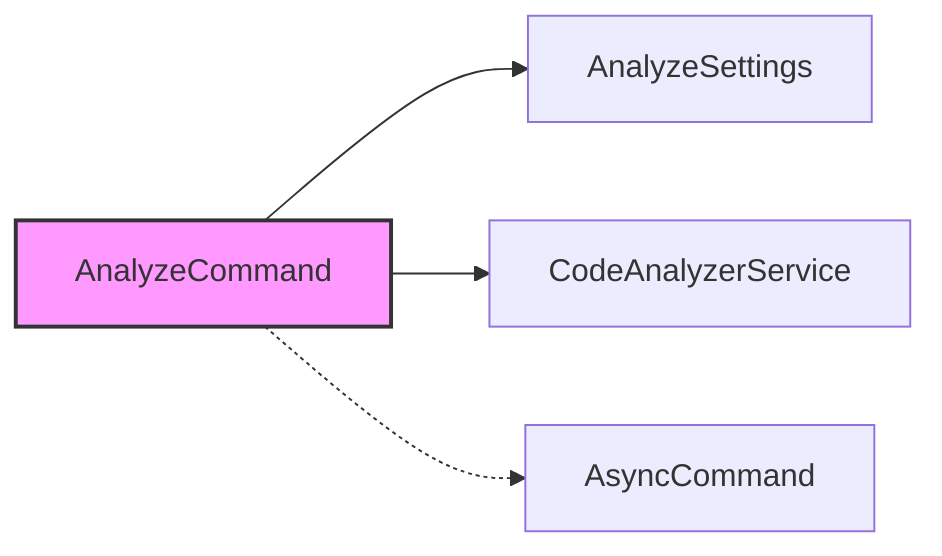
##### PlantUML
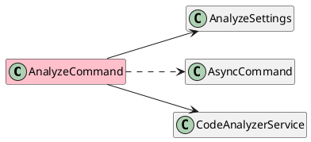

### Repo Map: Extraer solo firmas públicas y imports de cada archivo
#### API Publica:
- class AnalyzeCommand : AsyncCommand<AnalyzeSettings>
    - Modificadores: public
    - Implementa: AsyncCommand<AnalyzeSettings>
  - AnalyzeCommand(CodeAnalyzerService service)
  - Task<int> ExecuteAsync(CommandContext context, AnalyzeSettings settings, CancellationToken cancellationToken)

#### Imports:
- ContextWeaver.Services
- Spectre.Console.Cli
- System.Threading
- System.Threading.Tasks

#### Métricas
* **Líneas de Código (LOC):** 36
* **CyclomaticComplexity:** 1
* **MaxNestingDepth:** 0

#### Código Fuente
```csharp
using System.Threading;
using System.Threading.Tasks;
using ContextWeaver.Services;
using Spectre.Console.Cli;

namespace ContextWeaver.Cli.Commands;

/// <summary>
///     Command to execute automatic analysis without interaction.
/// </summary>
public class AnalyzeCommand : AsyncCommand<AnalyzeSettings>
{
    private readonly CodeAnalyzerService _service;

    /// <summary>
    ///     Initializes a new instance of the <see cref="AnalyzeCommand"/> class.
    /// </summary>
    /// <param name="service">Code analyzer service.</param>
    public AnalyzeCommand(CodeAnalyzerService service)
    {
        _service = service;
    }

    /// <inheritdoc />
    public override async Task<int> ExecuteAsync(CommandContext context, AnalyzeSettings settings, CancellationToken cancellationToken)
    {
        var directoryInfo = new DirectoryInfo(settings.Directory ?? ".");
        var fileInfo = new FileInfo(settings.Output ?? "analysis_report.md");
        var format = settings.Format ?? "markdown";

        await _service.AnalyzeAndGenerateReport(directoryInfo, fileInfo, format);

        return 0;
    }
}
```

## Archivo: src/ContextWeaver.Cli/Commands/AnalyzeSettings.cs

#### Contexto
##### Mermaid
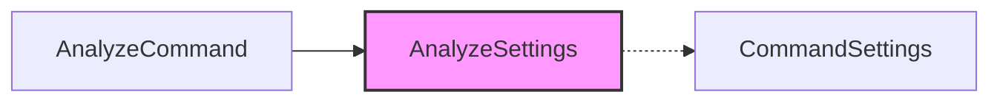
##### PlantUML


### Repo Map: Extraer solo firmas públicas y imports de cada archivo
#### API Publica:
- class AnalyzeSettings : CommandSettings
    - Modificadores: public
    - Implementa: CommandSettings
  - string? Directory {get;set;}
  - string? Output {get;set;}
  - string? Format {get;set;}

#### Imports:
- Spectre.Console.Cli
- System.ComponentModel

#### Métricas
* **Líneas de Código (LOC):** 34
* **CyclomaticComplexity:** 1
* **MaxNestingDepth:** 0

#### Código Fuente
```csharp
using System.ComponentModel;
using Spectre.Console.Cli;

namespace ContextWeaver.Cli.Commands;

/// <summary>
///     Configuración para el comando de análisis automático.
/// </summary>
public class AnalyzeSettings : CommandSettings
{
    /// <summary>
    ///     Gets or sets the root directory of the project to analyze.
    /// </summary>
    [CommandOption("-d|--directory <DIRECTORY>")]
    [Description("El directorio raíz del proyecto a analizar. Por defecto, es el directorio actual.")]
    public string? Directory { get; set; }

    /// <summary>
    ///     Gets or sets the output file for the consolidated report.
    /// </summary>
    [CommandOption("-o|--output <OUTPUT>")]
    [Description("El archivo de salida para el reporte consolidado.")]
    [DefaultValue("analysis_report.md")]
    public string? Output { get; set; }

    /// <summary>
    ///     Gets or sets the output report format.
    /// </summary>
    [CommandOption("-f|--format <FORMAT>")]
    [Description("El formato del reporte de salida.")]
    [DefaultValue("markdown")]
    public string? Format { get; set; }
}
```

## Archivo: src/ContextWeaver.Cli/Commands/Wizard/FileDiscoveryStep.cs

#### Contexto
##### Mermaid
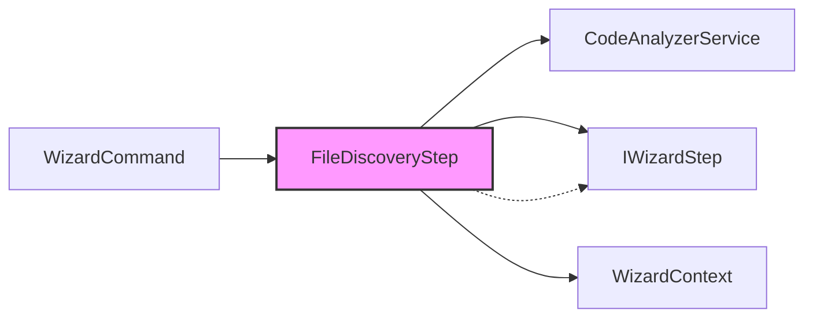
##### PlantUML
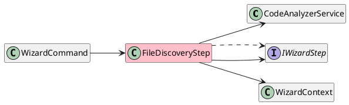

### Repo Map: Extraer solo firmas públicas y imports de cada archivo
#### API Publica:
- class FileDiscoveryStep : IWizardStep
    - Modificadores: public
    - Implementa: IWizardStep
  - FileDiscoveryStep(CodeAnalyzerService service)
  - bool IsInteractive
  - bool ShouldExecute(WizardContext context)
  - Task<StepResult> ExecuteAsync(WizardContext context)

#### Imports:
- ContextWeaver.Services
- Spectre.Console
- System.Threading.Tasks

#### Métricas
* **Líneas de Código (LOC):** 47
* **CyclomaticComplexity:** 2
* **MaxNestingDepth:** 1

#### Código Fuente
```csharp
using System.Threading.Tasks;
using ContextWeaver.Services;
using Spectre.Console;

namespace ContextWeaver.Cli.Commands.Wizard;

/// <summary>
///     Step responsible for discovering managed files in the base directory.
/// </summary>
public class FileDiscoveryStep : IWizardStep
{
    private readonly CodeAnalyzerService _service;

    /// <summary>
    ///     Initializes a new instance of the <see cref="FileDiscoveryStep"/> class.
    /// </summary>
    /// <param name="service">The code analyzer service.</param>
    public FileDiscoveryStep(CodeAnalyzerService service)
    {
        _service = service;
    }

    /// <inheritdoc/>
    public bool IsInteractive => false;

    /// <inheritdoc/>
    public bool ShouldExecute(WizardContext context) => true; // Always execute first

    /// <inheritdoc/>
    public Task<StepResult> ExecuteAsync(WizardContext context)
    {
        var (files, config) = _service.GetManagedFiles(context.Directory);

        if (files.Count == 0)
        {
            AnsiConsole.MarkupLine("[red]No se encontraron archivos gestionados en el directorio especificado.[/]");
            return Task.FromResult(StepResult.Cancel);
        }

        context.DiscoveredFiles = new System.Collections.Generic.List<System.IO.FileInfo>(files);
        context.ManagedFiles = new System.Collections.Generic.List<System.IO.FileInfo>(files);
        context.Config = config;

        return Task.FromResult(StepResult.Next);
    }
}
```

## Archivo: src/ContextWeaver.Cli/Commands/Wizard/FileSelectionStep.cs

#### Contexto
##### Mermaid
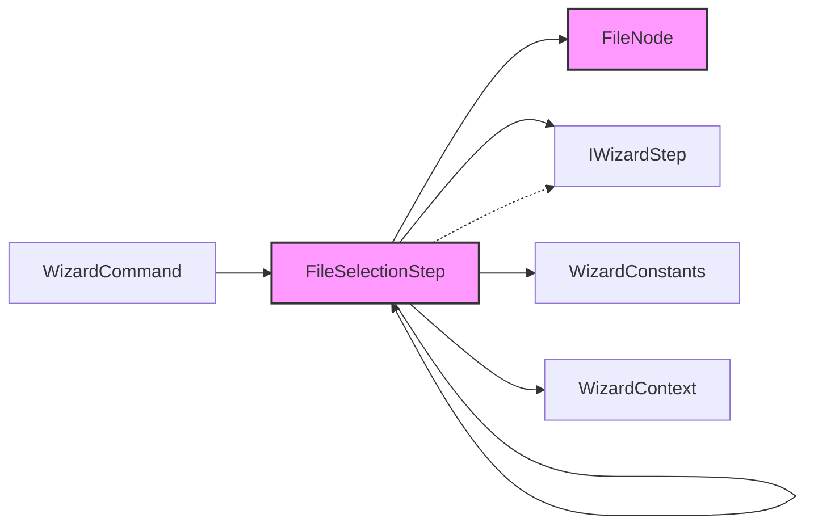
##### PlantUML
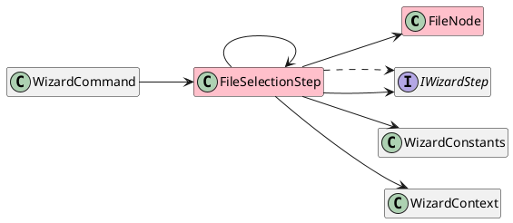

### Repo Map: Extraer solo firmas públicas y imports de cada archivo
#### API Publica:
- class FileSelectionStep : IWizardStep
    - Modificadores: public
    - Implementa: IWizardStep
  - bool ShouldExecute(WizardContext context)
  - Task<StepResult> ExecuteAsync(WizardContext context)

#### Imports:
- Spectre.Console
- System.Collections.Generic
- System.IO
- System.Linq
- System.Threading.Tasks

#### Métricas
* **Líneas de Código (LOC):** 142
* **CyclomaticComplexity:** 13
* **MaxNestingDepth:** 3

#### Código Fuente
```csharp
using System.Collections.Generic;
using System.IO;
using System.Linq;
using System.Threading.Tasks;
using Spectre.Console;

namespace ContextWeaver.Cli.Commands.Wizard;

/// <summary>
///     Step that prompts the user to select files from a directory tree.
/// </summary>
public class FileSelectionStep : IWizardStep
{
    /// <inheritdoc/>
    public bool ShouldExecute(WizardContext context) => !context.Settings.All;

    /// <inheritdoc/>
    public Task<StepResult> ExecuteAsync(WizardContext context)
    {
        var rootNode = BuildFileTree(context.ManagedFiles, context.Directory);

        var prompt = new MultiSelectionPrompt<object>()
            .Title("Seleccione los [green]archivos[/] que desea incluir en el contexto:")
            .PageSize(20)
            .MoreChoicesText("[grey](Muevase arriba y abajo para ver más archivos)[/]")
            .InstructionsText("[grey](Presione [blue]<espacio>[/] para seleccionar/deseleccionar, [green]<enter>[/] para confirmar)[/]\n[yellow]⚠️ ATENCIÓN: Si desea Volver, primero debe MARCAR la opción '[/][blue]🔙[/][yellow]' con <espacio>.[/]")
            .UseConverter(item => item is FileSystemInfo fsi ? fsi.Name : item.ToString()!);

        if (context.ShowBackButton)
        {
            prompt.AddChoice(WizardConstants.BackOption);
        }

        // Recursively add choices
        AddNodesToPrompt(prompt, rootNode, context.SelectAllFilesByDefault);

        var selectedItems = AnsiConsole.Prompt(prompt);

        if (selectedItems.Contains(WizardConstants.BackOption))
        {
            return Task.FromResult(StepResult.Previous);
        }

        // Filter only the files (ignore selected folders representing groups)
        context.SelectedFiles = selectedItems.OfType<FileInfo>().ToList();

        if (context.SelectedFiles.Count == 0)
        {
            AnsiConsole.MarkupLine("[yellow]No se seleccionaron archivos. Operación cancelada.[/]");
            return Task.FromResult(StepResult.Cancel);
        }

        return Task.FromResult(StepResult.Next);
    }

    private static FileNode BuildFileTree(List<FileInfo> files, DirectoryInfo rootDir)
    {
        var root = new FileNode("Root", rootDir);

        foreach (var file in files)
        {
            var relativePath = Path.GetRelativePath(rootDir.FullName, file.FullName);
            var parts = relativePath.Split(Path.DirectorySeparatorChar);

            var currentNode = root;
            for (int i = 0; i < parts.Length - 1; i++)
            {
                var part = parts[i];
                var existingChild = currentNode.Children.FirstOrDefault(c => c.Name == part);
                if (existingChild == null)
                {
                    var currentPath = Path.Combine(currentNode.Item.FullName, part);
                    var dirInfo = new DirectoryInfo(currentPath);
                    existingChild = new FileNode(part, dirInfo);
                    currentNode.Children.Add(existingChild);
                }

                currentNode = existingChild;
            }

            currentNode.Children.Add(new FileNode(parts.Last(), file));
        }

        return root;
    }

    private static void AddNodesToPrompt(MultiSelectionPrompt<object> prompt, FileNode node, bool selectAll)
    {
        foreach (var child in node.Children.OrderBy(c => c.Item is FileInfo))
        {
            var item = prompt.AddChoice(child.Item);

            if (selectAll)
            {
                item.Select();
            }

            AddNodesToPromptRecursive(item, child, selectAll);
        }
    }

    private static void AddNodesToPromptRecursive(IMultiSelectionItem<object> parent, FileNode node, bool selectAll)
    {
        foreach (var child in node.Children.OrderBy(c => c.Item is FileInfo))
        {
            // Use reflection to invoke 'AddChild' on the internal ListPromptItem<T>
            var addChildMethod = parent.GetType().GetMethod("AddChild", System.Reflection.BindingFlags.Public | System.Reflection.BindingFlags.NonPublic | System.Reflection.BindingFlags.Instance);

            if (addChildMethod != null)
            {
                var childItem = (IMultiSelectionItem<object>)addChildMethod.Invoke(parent, new object[] { child.Item })!;

                if (selectAll)
                {
                    childItem.Select();
                }

                AddNodesToPromptRecursive(childItem, child, selectAll);
            }
            else
            {
                AnsiConsole.MarkupLine($"[red]Error interno: No se pudo añadir el nodo hijo '{child.Name}'. Método 'AddChild' no encontrado.[/]");
            }
        }
    }

    private sealed class FileNode
    {
        public FileNode(string name, FileSystemInfo item)
        {
            Name = name;
            Item = item;
        }

        public string Name { get; }

        public FileSystemInfo Item { get; }

        public List<FileNode> Children { get; } = new();
    }
}
```

## Archivo: src/ContextWeaver.Cli/Commands/Wizard/FilterExtensionStep.cs

#### Contexto
##### Mermaid
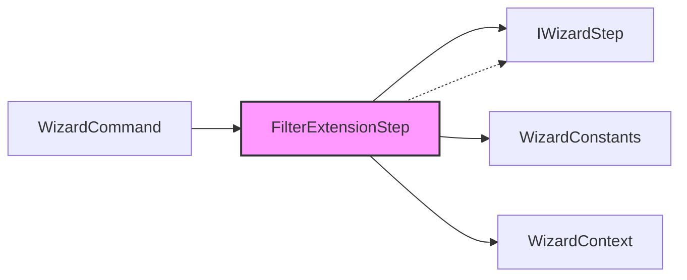
##### PlantUML
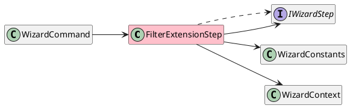

### Repo Map: Extraer solo firmas públicas y imports de cada archivo
#### API Publica:
- class FilterExtensionStep : IWizardStep
    - Modificadores: public
    - Implementa: IWizardStep
  - bool ShouldExecute(WizardContext context)
  - Task<StepResult> ExecuteAsync(WizardContext context)

#### Imports:
- Spectre.Console
- System
- System.Linq
- System.Threading.Tasks

#### Métricas
* **Líneas de Código (LOC):** 75
* **CyclomaticComplexity:** 7
* **MaxNestingDepth:** 3

#### Código Fuente
```csharp
using System;
using System.Linq;
using System.Threading.Tasks;
using Spectre.Console;

namespace ContextWeaver.Cli.Commands.Wizard;

/// <summary>
///     Step that prompts the user to filter files by extension.
/// </summary>
public class FilterExtensionStep : IWizardStep
{
    /// <inheritdoc/>
    public bool ShouldExecute(WizardContext context)
        => !context.Settings.All && context.DiscoveredFiles.Select(f => f.Extension.ToLowerInvariant()).Distinct().Count() > 1;

    /// <inheritdoc/>
    public Task<StepResult> ExecuteAsync(WizardContext context)
    {
        var extensions = context.DiscoveredFiles
            .Select(f => f.Extension.ToLowerInvariant())
            .Distinct()
            .OrderBy(e => e)
            .ToList();

        var extPrompt = new MultiSelectionPrompt<string>()
            .Title("¿Desea filtrar por [green]extensión[/]? (deseleccione las que no necesite)")
            .PageSize(15)
            .InstructionsText(
                "[grey]([blue]<espacio>[/] seleccionar/deseleccionar, [green]<enter>[/] confirmar)[/]\n[yellow]⚠️ ATENCIÓN: Si desea Volver, primero debe MARCAR la opción '[/][blue]🔙[/][yellow]' con <espacio>.[/]");

        if (context.ShowBackButton)
        {
            extPrompt.AddChoice(WizardConstants.BackOption);
        }

        foreach (var ext in extensions)
        {
            var count = context.DiscoveredFiles.Count(f => f.Extension.Equals(ext, StringComparison.OrdinalIgnoreCase));
            var choice = $"{ext} ({count} archivos)";
            extPrompt.AddChoice(choice);

            // PRE-SELECT only if it's currently in ManagedFiles (remembers previous selection natively)
            if (context.ManagedFiles.Any(f => f.Extension.Equals(ext, StringComparison.OrdinalIgnoreCase)))
            {
                extPrompt.Select(choice);
            }
        }

        var selectedExtLabels = AnsiConsole.Prompt(extPrompt);

        if (selectedExtLabels.Contains(WizardConstants.BackOption))
        {
            return Task.FromResult(StepResult.Previous);
        }

        var selectedExtensions = selectedExtLabels
            .Select(label => label.Split(' ')[0])
            .ToHashSet(StringComparer.OrdinalIgnoreCase);

        // Update the managed files based on selection from the full DiscoveredFiles list
        context.ManagedFiles = context.DiscoveredFiles
            .Where(f => selectedExtensions.Contains(f.Extension.ToLowerInvariant()))
            .ToList();

        if (context.ManagedFiles.Count == 0)
        {
            AnsiConsole.MarkupLine("[yellow]No hay archivos con las extensiones seleccionadas. Operación cancelada.[/]");
            return Task.FromResult(StepResult.Cancel);
        }

        return Task.FromResult(StepResult.Next);
    }
}
```

## Archivo: src/ContextWeaver.Cli/Commands/Wizard/IWizardStep.cs

#### Contexto
##### Mermaid
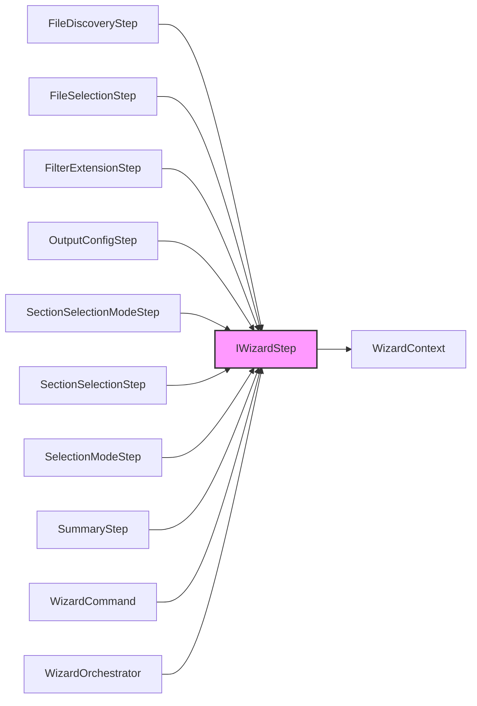
##### PlantUML
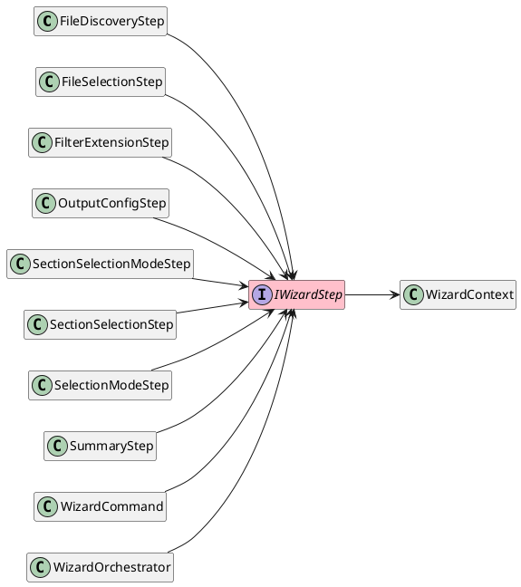

### Repo Map: Extraer solo firmas públicas y imports de cada archivo
#### API Publica:
- interface IWizardStep
    - Modificadores: public

#### Imports:
- System.Threading.Tasks

#### Métricas
* **Líneas de Código (LOC):** 30
* **CyclomaticComplexity:** 1
* **MaxNestingDepth:** 0

#### Código Fuente
```csharp
using System.Threading.Tasks;

namespace ContextWeaver.Cli.Commands.Wizard;

/// <summary>
///     Defines a step in the interactive wizard.
/// </summary>
public interface IWizardStep
{
    /// <summary>
    ///     Gets a value indicating whether this step has an interactive UI.
    ///     Used to determine if backwards navigation is possible from subsequent steps.
    /// </summary>
    bool IsInteractive => true;

    /// <summary>
    ///     Determines if this step should be executed based on the current context.
    /// </summary>
    /// <param name="context">The wizard context.</param>
    /// <returns>True if the step should execute, false to skip it.</returns>
    bool ShouldExecute(WizardContext context);

    /// <summary>
    ///     Executes the wizard step, potentially interacting with the user and mutating the context.
    /// </summary>
    /// <param name="context">The wizard context.</param>
    /// <returns>A task that represents the asynchronous operation, containing the result of the step.</returns>
    Task<StepResult> ExecuteAsync(WizardContext context);
}
```

## Archivo: src/ContextWeaver.Cli/Commands/Wizard/OutputConfigStep.cs

#### Contexto
##### Mermaid

##### PlantUML
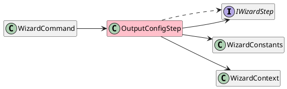

### Repo Map: Extraer solo firmas públicas y imports de cada archivo
#### API Publica:
- class OutputConfigStep : IWizardStep
    - Modificadores: public
    - Implementa: IWizardStep
  - bool ShouldExecute(WizardContext context)
  - Task<StepResult> ExecuteAsync(WizardContext context)

#### Imports:
- Spectre.Console
- System.Threading.Tasks

#### Métricas
* **Líneas de Código (LOC):** 66
* **CyclomaticComplexity:** 6
* **MaxNestingDepth:** 2

#### Código Fuente
```csharp
using System.Threading.Tasks;
using Spectre.Console;

namespace ContextWeaver.Cli.Commands.Wizard;

/// <summary>
///     Step that prompts the user for the output file name and format.
/// </summary>
public class OutputConfigStep : IWizardStep
{
    private static readonly string[] _supportedFormats = { "markdown", "json", "xml" };

    /// <inheritdoc/>
    public bool ShouldExecute(WizardContext context) => true;

    /// <inheritdoc/>
    public Task<StepResult> ExecuteAsync(WizardContext context)
    {
        if (string.IsNullOrEmpty(context.Settings.Format))
        {
            var formatPrompt = new SelectionPrompt<string>()
                .Title("Seleccione el [green]formato de salida[/]:")
                .PageSize(4)
                .AddChoices(_supportedFormats);

            if (context.ShowBackButton)
            {
                formatPrompt.AddChoice(WizardConstants.BackOption);
            }

            var format = AnsiConsole.Prompt(formatPrompt);

            if (format == WizardConstants.BackOption)
            {
                return Task.FromResult(StepResult.Previous);
            }

            context.OutputFormat = format;
        }
        else
        {
            context.OutputFormat = context.Settings.Format;
        }

        if (string.IsNullOrEmpty(context.Settings.Output))
        {
            var fileNamePrompt = new TextPrompt<string>("Ingrese el nombre del [green]archivo de salida[/]:")
                .DefaultValue(context.OutputFileName ?? "context.md")
                .Validate(name =>
                    string.IsNullOrWhiteSpace(name)
                        ? ValidationResult.Error("[red]El nombre del archivo no puede estar vacío[/]")
                        : ValidationResult.Success());

            var outputFileName = AnsiConsole.Prompt(fileNamePrompt);

            context.OutputFileName = outputFileName;
        }
        else
        {
            context.OutputFileName = context.Settings.Output;
        }

        return Task.FromResult(StepResult.Next);
    }
}
```

## Archivo: src/ContextWeaver.Cli/Commands/Wizard/SectionSelectionModeStep.cs

#### Contexto
##### Mermaid
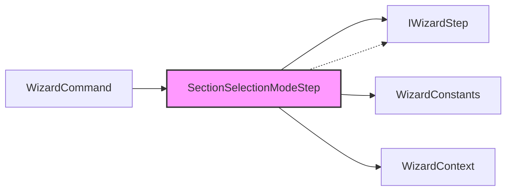
##### PlantUML
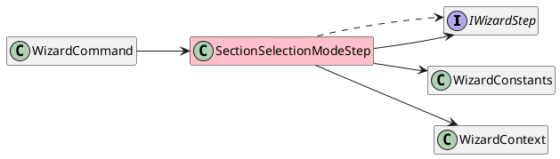

### Repo Map: Extraer solo firmas públicas y imports de cada archivo
#### API Publica:
- class SectionSelectionModeStep : IWizardStep
    - Modificadores: public
    - Implementa: IWizardStep
  - bool ShouldExecute(WizardContext context)
  - Task<StepResult> ExecuteAsync(WizardContext context)

#### Imports:
- Spectre.Console
- System
- System.Threading.Tasks

#### Métricas
* **Líneas de Código (LOC):** 58
* **CyclomaticComplexity:** 6
* **MaxNestingDepth:** 2

#### Código Fuente
```csharp
using System;
using System.Threading.Tasks;
using Spectre.Console;

namespace ContextWeaver.Cli.Commands.Wizard;

/// <summary>
///     Step that prompts the user to select how they want to start the section selection.
/// </summary>
public class SectionSelectionModeStep : IWizardStep
{
    private static readonly string[] BulkSelectionOptions =
    {
        "Usar selección por defecto / guardada",
        "Seleccionar TODAS las secciones opcionales",
        "Seleccionar NINGUNA sección opcional (empezar limpio)"
    };

    /// <inheritdoc/>
    public bool ShouldExecute(WizardContext context)
        => string.IsNullOrEmpty(context.Settings.Sections) && string.IsNullOrEmpty(context.Settings.ExcludeSections);

    /// <inheritdoc/>
    public Task<StepResult> ExecuteAsync(WizardContext context)
    {
        var prompt = new SelectionPrompt<string>()
            .Title("¿Cómo desea comenzar la selección de secciones?")
            .AddChoices(BulkSelectionOptions[0], BulkSelectionOptions[1], BulkSelectionOptions[2]);

        if (context.ShowBackButton)
        {
            prompt.AddChoice(WizardConstants.BackOption);
        }

        var selectionMode = AnsiConsole.Prompt(prompt);

        if (selectionMode == WizardConstants.BackOption)
        {
            return Task.FromResult(StepResult.Previous);
        }

        if (selectionMode.StartsWith(BulkSelectionOptions[0], StringComparison.Ordinal))
        {
            context.ModeForSections = SectionSelectionMode.SavedOrDefault;
        }
        else if (selectionMode.StartsWith(BulkSelectionOptions[1], StringComparison.Ordinal))
        {
            context.ModeForSections = SectionSelectionMode.All;
        }
        else
        {
            context.ModeForSections = SectionSelectionMode.None;
        }

        return Task.FromResult(StepResult.Next);
    }
}
```

## Archivo: src/ContextWeaver.Cli/Commands/Wizard/SectionSelectionStep.cs

#### Contexto
##### Mermaid
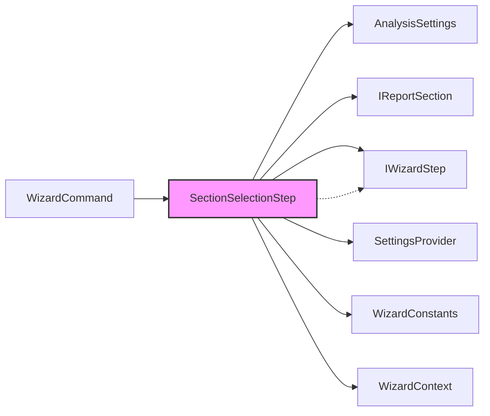
##### PlantUML
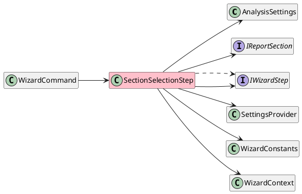

### Repo Map: Extraer solo firmas públicas y imports de cada archivo
#### API Publica:
- class SectionSelectionStep : IWizardStep
    - Modificadores: public
    - Implementa: IWizardStep
  - SectionSelectionStep(IReadOnlyList<IReportSection> availableSections, SettingsProvider settingsProvider)
  - bool ShouldExecute(WizardContext context)
  - Task<StepResult> ExecuteAsync(WizardContext context)

#### Imports:
- ContextWeaver.Reporters
- ContextWeaver.Services
- Spectre.Console
- System
- System.Collections.Generic
- System.Linq
- System.Threading.Tasks

#### Métricas
* **Líneas de Código (LOC):** 167
* **CyclomaticComplexity:** 21
* **MaxNestingDepth:** 3

#### Código Fuente
```csharp
using System;
using System.Collections.Generic;
using System.Linq;
using System.Threading.Tasks;
using ContextWeaver.Reporters;
using ContextWeaver.Services;
using Spectre.Console;

namespace ContextWeaver.Cli.Commands.Wizard;

/// <summary>
///     Step that handles the interactive or flag-based selection of report sections.
/// </summary>
public class SectionSelectionStep : IWizardStep
{
    private readonly IReadOnlyList<IReportSection> _availableSections;
    private readonly SettingsProvider _settingsProvider;

    /// <summary>
    ///     Initializes a new instance of the <see cref="SectionSelectionStep"/> class.
    /// </summary>
    /// <param name="availableSections">The sections available for the report.</param>
    /// <param name="settingsProvider">The settings provider.</param>
    public SectionSelectionStep(IReadOnlyList<IReportSection> availableSections, SettingsProvider settingsProvider)
    {
        _availableSections = availableSections;
        _settingsProvider = settingsProvider;
    }

    /// <inheritdoc/>
    public bool ShouldExecute(WizardContext context) => true;

    /// <inheritdoc/>
    public Task<StepResult> ExecuteAsync(WizardContext context)
    {
        var optionalSections = _availableSections.Where(s => !s.IsRequired).ToList();
        List<string> enabledSectionNames;

        if (!string.IsNullOrEmpty(context.Settings.Sections))
        {
            var inputs = context.Settings.Sections
                .Split(',', StringSplitOptions.RemoveEmptyEntries | StringSplitOptions.TrimEntries);

            enabledSectionNames = new List<string>();
            foreach (var input in inputs)
            {
                var match = _availableSections.FirstOrDefault(s => s.Name.Contains(input, StringComparison.OrdinalIgnoreCase));
                if (match != null)
                {
                    enabledSectionNames.Add(match.Name);
                }
            }

            context.EnabledSections = enabledSectionNames;
            return Task.FromResult(StepResult.Next); // Auto-advance because flag handles it
        }

        if (!string.IsNullOrEmpty(context.Settings.ExcludeSections))
        {
            var excludedInputs = context.Settings.ExcludeSections
                .Split(',', StringSplitOptions.RemoveEmptyEntries | StringSplitOptions.TrimEntries);

            var excludedNames = new HashSet<string>(StringComparer.Ordinal);
            foreach (var input in excludedInputs)
            {
                var match = _availableSections.FirstOrDefault(s => s.Name.Contains(input, StringComparison.OrdinalIgnoreCase));
                if (match != null)
                {
                    excludedNames.Add(match.Name);
                }
            }

            enabledSectionNames = optionalSections
                .Where(s => !excludedNames.Contains(s.Name))
                .Select(s => s.Name)
                .ToList();

            context.EnabledSections = enabledSectionNames;
            return Task.FromResult(StepResult.Next); // Auto-advance because flag handles it
        }

        // Interactive Mode
        var savedSections = context.Config?.EnabledSections != null
            ? new HashSet<string>(context.Config.EnabledSections, StringComparer.Ordinal)
            : null;

        var sectionPrompt = new MultiSelectionPrompt<string>()
            .Title("Seleccione las [green]secciones opcionales[/] que desea incluir en el reporte:\n[grey](Las secciones obligatorias como 'Header' se incluirán automáticamente)[/]")
            .PageSize(10)
            .MoreChoicesText("[grey](Muevase arriba y abajo para ver más secciones)[/]")
            .InstructionsText(
                "[grey]([blue]<espacio>[/] seleccionar/deseleccionar, [green]<enter>[/] confirmar)[/]\n[yellow]⚠️ ATENCIÓN: Si desea Volver, primero debe MARCAR la opción '[/][blue]🔙[/][yellow]' con <espacio>.[/]");
        // Note: removed .Required() to let the user select 'Back' without forcing selection.
        if (context.ShowBackButton)
        {
            sectionPrompt.AddChoice(WizardConstants.BackOption);
        }

        foreach (var section in optionalSections)
        {
            var label = $"{section.Name} — {section.Description}";
            sectionPrompt.AddChoice(label);

            bool shouldSelect = false;

            if (context.ModeForSections == SectionSelectionMode.SavedOrDefault)
            {
                shouldSelect = savedSections == null || savedSections.Contains(section.Name);
            }
            else if (context.ModeForSections == SectionSelectionMode.All)
            {
                shouldSelect = true;
            }

            if (shouldSelect)
            {
                sectionPrompt.Select(label);
            }
        }

        if (savedSections != null && context.ModeForSections == SectionSelectionMode.SavedOrDefault)
        {
            AnsiConsole.MarkupLine("[grey]  (Se cargaron preferencias de secciones guardadas)[/]");
        }

        var selectedSectionLabels = AnsiConsole.Prompt(sectionPrompt);

        if (selectedSectionLabels.Contains(WizardConstants.BackOption))
        {
            return Task.FromResult(StepResult.Previous);
        }

        enabledSectionNames = selectedSectionLabels
            .Select(label => label.Split(" — ")[0])
            .ToList();

        var optionalSelectedCount = enabledSectionNames.Count;

        if (optionalSelectedCount == 0)
        {
            AnsiConsole.MarkupLine("[red]Debe seleccionar al menos una sección opcional. Operación cancelada.[/]");
            return Task.FromResult(StepResult.Cancel);
        }

        var allOptionalSelected = enabledSectionNames.Count >= optionalSections.Count;
        if (!allOptionalSelected)
        {
            var savePref = AnsiConsole.Confirm("¿Guardar estas preferencias de secciones para futuros análisis?", defaultValue: false);
            if (savePref)
            {
                if (context.Config == null)
                {
                    context.Config = new ContextWeaver.Core.AnalysisSettings();
                }

                context.Config.EnabledSections = enabledSectionNames.ToArray();
                _settingsProvider.SaveSettings(context.Directory, context.Config);
                AnsiConsole.MarkupLine("[green]Preferencias guardadas en .contextweaver.json[/]");
            }
        }

        context.EnabledSections = enabledSectionNames;

        return Task.FromResult(StepResult.Next);
    }
}
```

## Archivo: src/ContextWeaver.Cli/Commands/Wizard/SelectionModeStep.cs

#### Contexto
##### Mermaid
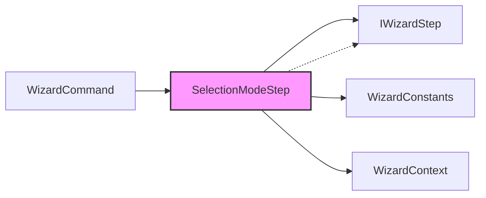
##### PlantUML


### Repo Map: Extraer solo firmas públicas y imports de cada archivo
#### API Publica:
- class SelectionModeStep : IWizardStep
    - Modificadores: public
    - Implementa: IWizardStep
  - bool ShouldExecute(WizardContext context)
  - Task<StepResult> ExecuteAsync(WizardContext context)

#### Imports:
- Spectre.Console
- System
- System.Threading.Tasks

#### Métricas
* **Líneas de Código (LOC):** 42
* **CyclomaticComplexity:** 3
* **MaxNestingDepth:** 1

#### Código Fuente
```csharp
using System;
using System.Threading.Tasks;
using Spectre.Console;

namespace ContextWeaver.Cli.Commands.Wizard;

/// <summary>
///     Step that prompts the user to select the initial state of the file selection tree.
/// </summary>
public class SelectionModeStep : IWizardStep
{
    private const string OptionAll = "Todos seleccionados (deseleccionar lo que no quiero)";
    private const string OptionNone = "Ninguno seleccionado (seleccionar lo que quiero)";

    /// <inheritdoc/>
    public bool ShouldExecute(WizardContext context) => !context.Settings.All;

    /// <inheritdoc/>
    public Task<StepResult> ExecuteAsync(WizardContext context)
    {
        var prompt = new SelectionPrompt<string>()
            .Title("¿Cómo desea empezar la [green]selección de archivos[/]?")
            .AddChoices(OptionAll, OptionNone);

        if (context.ShowBackButton)
        {
            prompt.AddChoice(WizardConstants.BackOption);
        }

        var selectionMode = AnsiConsole.Prompt(prompt);

        if (selectionMode == WizardConstants.BackOption)
        {
            return Task.FromResult(StepResult.Previous);
        }

        context.SelectAllFilesByDefault = selectionMode.StartsWith("Todos", StringComparison.Ordinal);

        return Task.FromResult(StepResult.Next);
    }
}
```

## Archivo: src/ContextWeaver.Cli/Commands/Wizard/StepResult.cs

#### Métricas
* **Líneas de Código (LOC):** 28
* **CyclomaticComplexity:** 1
* **MaxNestingDepth:** 0

#### Código Fuente
```csharp
namespace ContextWeaver.Cli.Commands.Wizard;

/// <summary>
///     Represents the result of executing a wizard step.
/// </summary>
public enum StepResult
{
    /// <summary>
    ///     Proceed to the next step.
    /// </summary>
    Next,

    /// <summary>
    ///     Go back to the previous step.
    /// </summary>
    Previous,

    /// <summary>
    ///     Cancel the wizard execution.
    /// </summary>
    Cancel,

    /// <summary>
    ///     Finish the wizard successfully.
    /// </summary>
    Finish
}
```

## Archivo: src/ContextWeaver.Cli/Commands/Wizard/SummaryStep.cs

#### Contexto
##### Mermaid
```mermaid
graph LR;
  SummaryStep --> IReportSection
  SummaryStep --> IWizardStep
  SummaryStep --> WizardConstants
  SummaryStep --> WizardContext
  SummaryStep -.-> IWizardStep
  WizardCommand --> SummaryStep
  style SummaryStep fill:#f9f,stroke:#333,stroke-width:2px
```
##### PlantUML
```plantuml
@startuml
left to right direction
hide empty members
interface IReportSection 
interface IWizardStep 
class SummaryStep  #Pink
class WizardCommand 
class WizardConstants 
class WizardContext 
  SummaryStep --> IReportSection
  SummaryStep --> IWizardStep
  SummaryStep --> WizardConstants
  SummaryStep --> WizardContext
  SummaryStep ..> IWizardStep
  WizardCommand --> SummaryStep
@enduml
```

### Repo Map: Extraer solo firmas públicas y imports de cada archivo
#### API Publica:
- class SummaryStep : IWizardStep
    - Modificadores: public
    - Implementa: IWizardStep
  - SummaryStep(IReadOnlyList<IReportSection> availableSections)
  - bool ShouldExecute(WizardContext context)
  - Task<StepResult> ExecuteAsync(WizardContext context)

#### Imports:
- ContextWeaver.Reporters
- Spectre.Console
- System.Collections.Generic
- System.IO
- System.Linq
- System.Threading.Tasks

#### Métricas
* **Líneas de Código (LOC):** 83
* **CyclomaticComplexity:** 5
* **MaxNestingDepth:** 2

#### Código Fuente
```csharp
using System.Collections.Generic;
using System.IO;
using System.Linq;
using System.Threading.Tasks;
using ContextWeaver.Reporters;
using Spectre.Console;

namespace ContextWeaver.Cli.Commands.Wizard;

/// <summary>
///     Final step that displays a summary of the selected configuration and asks for confirmation.
/// </summary>
public class SummaryStep : IWizardStep
{
    private readonly IReadOnlyList<IReportSection> _availableSections;

    /// <summary>
    ///     Initializes a new instance of the <see cref="SummaryStep"/> class.
    /// </summary>
    /// <param name="availableSections">The sections available for the report.</param>
    public SummaryStep(IReadOnlyList<IReportSection> availableSections)
    {
        _availableSections = availableSections;
    }

    /// <inheritdoc/>
    public bool ShouldExecute(WizardContext context) => true;

    /// <inheritdoc/>
    public Task<StepResult> ExecuteAsync(WizardContext context)
    {
        var requiredSectionNames = _availableSections
            .Where(s => s.IsRequired)
            .Select(s => s.Name);

        var allSectionNames = requiredSectionNames.Concat(context.EnabledSections).Distinct().ToList();

        var outputFile = new FileInfo(Path.Combine(context.Directory.FullName, context.OutputFileName!));

        var summaryTable = new Table()
            .Border(TableBorder.Rounded)
            .AddColumn("[bold]Configuración[/]")
            .AddColumn("[bold]Valor[/]");

        summaryTable.AddRow("📂 Archivos seleccionados", $"[green]{context.SelectedFiles.Count}[/]");
        summaryTable.AddRow("📝 Secciones del reporte", string.Join("\n", allSectionNames.Select(n => $"  • {n}")));
        summaryTable.AddRow("💾 Archivo de salida", $"[blue]{outputFile.FullName}[/]");
        summaryTable.AddRow("📄 Formato", $"[blue]{context.OutputFormat}[/]");

        AnsiConsole.Write(new Rule("[yellow]Resumen[/]").RuleStyle("grey"));
        AnsiConsole.Write(summaryTable);
        AnsiConsole.WriteLine();

        if (AnsiConsole.Profile.Capabilities.Interactive)
        {
            var summaryPrompt = new SelectionPrompt<string>()
                .Title("¿Desea continuar con la ejecución?")
                .AddChoices("✅ Sí, ejecutar");

            if (context.ShowBackButton)
            {
                summaryPrompt.AddChoice(WizardConstants.BackOption);
            }

            summaryPrompt.AddChoice("❌ No, cancelar");

            var confirmChoice = AnsiConsole.Prompt(summaryPrompt);

            if (confirmChoice == WizardConstants.BackOption)
            {
                return Task.FromResult(StepResult.Previous);
            }

            if (confirmChoice.Contains("cancelar"))
            {
                return Task.FromResult(StepResult.Cancel);
            }
        }

        return Task.FromResult(StepResult.Finish);
    }
}
```

## Archivo: src/ContextWeaver.Cli/Commands/Wizard/WizardConstants.cs

#### Contexto
##### Mermaid
```mermaid
graph LR;
  FileSelectionStep --> WizardConstants
  FilterExtensionStep --> WizardConstants
  OutputConfigStep --> WizardConstants
  SectionSelectionModeStep --> WizardConstants
  SectionSelectionStep --> WizardConstants
  SelectionModeStep --> WizardConstants
  SummaryStep --> WizardConstants
  style WizardConstants fill:#f9f,stroke:#333,stroke-width:2px
```
##### PlantUML
```plantuml
@startuml
left to right direction
hide empty members
class FileSelectionStep 
class FilterExtensionStep 
class OutputConfigStep 
class SectionSelectionModeStep 
class SectionSelectionStep 
class SelectionModeStep 
class SummaryStep 
class WizardConstants  #Pink
  FileSelectionStep --> WizardConstants
  FilterExtensionStep --> WizardConstants
  OutputConfigStep --> WizardConstants
  SectionSelectionModeStep --> WizardConstants
  SectionSelectionStep --> WizardConstants
  SelectionModeStep --> WizardConstants
  SummaryStep --> WizardConstants
@enduml
```

### Repo Map: Extraer solo firmas públicas y imports de cada archivo
#### API Publica:
- class WizardConstants
    - Modificadores: public, static

#### Métricas
* **Líneas de Código (LOC):** 13
* **CyclomaticComplexity:** 1
* **MaxNestingDepth:** 0

#### Código Fuente
```csharp
namespace ContextWeaver.Cli.Commands.Wizard;

/// <summary>
///     Common constants used across wizard steps.
/// </summary>
public static class WizardConstants
{
    /// <summary>
    ///     Option displayed in menus to allow the user to go back to the previous step.
    /// </summary>
    public const string BackOption = "🔙 [[Volver al paso anterior]]";
}
```

## Archivo: src/ContextWeaver.Cli/Commands/Wizard/WizardContext.cs

#### Contexto
##### Mermaid
```mermaid
graph LR;
  FileDiscoveryStep --> WizardContext
  FileSelectionStep --> WizardContext
  FilterExtensionStep --> WizardContext
  IWizardStep --> WizardContext
  OutputConfigStep --> WizardContext
  SectionSelectionModeStep --> WizardContext
  SectionSelectionStep --> WizardContext
  SelectionModeStep --> WizardContext
  SummaryStep --> WizardContext
  WizardCommand --> WizardContext
  WizardContext --> AnalysisSettings
  WizardContext --> WizardSettings
  WizardOrchestrator --> WizardContext
  style WizardContext fill:#f9f,stroke:#333,stroke-width:2px
  style SectionSelectionMode fill:#f9f,stroke:#333,stroke-width:2px
```
##### PlantUML
```plantuml
@startuml
left to right direction
hide empty members
class AnalysisSettings 
class FileDiscoveryStep 
class FileSelectionStep 
class FilterExtensionStep 
interface IWizardStep 
class OutputConfigStep 
class SectionSelectionModeStep 
class SectionSelectionStep 
class SelectionModeStep 
class SummaryStep 
class WizardCommand 
class WizardContext  #Pink
class WizardOrchestrator 
class WizardSettings 
  FileDiscoveryStep --> WizardContext
  FileSelectionStep --> WizardContext
  FilterExtensionStep --> WizardContext
  IWizardStep --> WizardContext
  OutputConfigStep --> WizardContext
  SectionSelectionModeStep --> WizardContext
  SectionSelectionStep --> WizardContext
  SelectionModeStep --> WizardContext
  SummaryStep --> WizardContext
  WizardCommand --> WizardContext
  WizardContext --> AnalysisSettings
  WizardContext --> WizardSettings
  WizardOrchestrator --> WizardContext
@enduml
```

### Repo Map: Extraer solo firmas públicas y imports de cada archivo
#### API Publica:
- class WizardContext
    - Modificadores: public
  - WizardContext(WizardSettings settings, DirectoryInfo directory)
  - WizardSettings Settings {get;}
  - DirectoryInfo Directory {get;}
  - List<FileInfo> DiscoveredFiles {get;set;}
  - List<FileInfo> ManagedFiles {get;set;}
  - ContextWeaver.Core.AnalysisSettings? Config {get;set;}
  - List<FileInfo> SelectedFiles {get;set;}
  - bool SelectAllFilesByDefault {get;set;}
  - SectionSelectionMode ModeForSections {get;set;}
  - List<string> EnabledSections {get;set;}
  - string? OutputFileName {get;set;}
  - string? OutputFormat {get;set;}
  - bool ShowBackButton {get;set;}

#### Imports:
- System.Collections.Generic
- System.IO

#### Métricas
* **Líneas de Código (LOC):** 108
* **CyclomaticComplexity:** 1
* **MaxNestingDepth:** 0

#### Código Fuente
```csharp
using System.Collections.Generic;
using System.IO;

namespace ContextWeaver.Cli.Commands.Wizard;

/// <summary>
///     Specifies the mode for selecting sections in the interactive wizard.
/// </summary>
public enum SectionSelectionMode
{
    /// <summary>
    ///     Use sections saved in the configuration file, or defaults if none exist.
    /// </summary>
    SavedOrDefault,

    /// <summary>
    ///     Select all available report sections.
    /// </summary>
    All,

    /// <summary>
    ///     Select none of the sections initially, allowing manual selection.
    /// </summary>
    None
}

/// <summary>
///     Holds the state for the wizard execution across different steps.
/// </summary>
public class WizardContext
{
    /// <summary>
    ///     Initializes a new instance of the <see cref="WizardContext"/> class.
    /// </summary>
    /// <param name="settings">The initial settings provided to the command.</param>
    /// <param name="directory">The root directory being analyzed.</param>
    public WizardContext(WizardSettings settings, DirectoryInfo directory)
    {
        Settings = settings;
        Directory = directory;
        DiscoveredFiles = new List<FileInfo>();
        ManagedFiles = new List<FileInfo>();
        SelectedFiles = new List<FileInfo>();
        EnabledSections = new List<string>();
    }

    /// <summary>
    ///     Gets the settings provided by the user via command line.
    /// </summary>
    public WizardSettings Settings { get; }

    /// <summary>
    ///     Gets the root directory for the analysis.
    /// </summary>
    public DirectoryInfo Directory { get; }

    /// <summary>
    ///     Gets or sets the original full list of discovered files before filtering.
    /// </summary>
    public List<FileInfo> DiscoveredFiles { get; set; }

    /// <summary>
    ///     Gets or sets the list of all files managed by the analyzer in the directory (active filtered list).
    /// </summary>
    public List<FileInfo> ManagedFiles { get; set; }

    /// <summary>
    ///     Gets or sets the system configuration loaded from the directory.
    /// </summary>
    public ContextWeaver.Core.AnalysisSettings? Config { get; set; }

    /// <summary>
    ///     Gets or sets the files selected by the user to be included in the context.
    /// </summary>
    public List<FileInfo> SelectedFiles { get; set; }

    /// <summary>
    ///     Gets or sets a value indicating whether to select all files by default in the selection step.
    /// </summary>
    public bool SelectAllFilesByDefault { get; set; }

    /// <summary>
    ///     Gets or sets a value indicating whether all optional sections should be selected.
    /// </summary>
    public SectionSelectionMode ModeForSections { get; set; }

    /// <summary>
    ///     Gets or sets the names of the report sections enabled by the user.
    /// </summary>
    public List<string> EnabledSections { get; set; }

    /// <summary>
    ///     Gets or sets the output file name.
    /// </summary>
    public string? OutputFileName { get; set; }

    /// <summary>
    ///     Gets or sets the output format.
    /// </summary>
    public string? OutputFormat { get; set; }

    /// <summary>
    ///     Gets or sets a value indicating whether a "Back" option should be displayed in the current step.
    ///     This is dynamically managed by the WizardOrchestrator.
    /// </summary>
    public bool ShowBackButton { get; set; }
}
```

## Archivo: src/ContextWeaver.Cli/Commands/Wizard/WizardOrchestrator.cs

#### Contexto
##### Mermaid
```mermaid
graph LR;
  WizardCommand --> WizardOrchestrator
  WizardOrchestrator --> IWizardStep
  WizardOrchestrator --> WizardContext
  style WizardOrchestrator fill:#f9f,stroke:#333,stroke-width:2px
```
##### PlantUML
```plantuml
@startuml
left to right direction
hide empty members
interface IWizardStep 
class WizardCommand 
class WizardContext 
class WizardOrchestrator  #Pink
  WizardCommand --> WizardOrchestrator
  WizardOrchestrator --> IWizardStep
  WizardOrchestrator --> WizardContext
@enduml
```

### Repo Map: Extraer solo firmas públicas y imports de cada archivo
#### API Publica:
- class WizardOrchestrator
    - Modificadores: public
  - WizardOrchestrator(IReadOnlyList<IWizardStep> steps)
  - Task<int> ExecuteAsync(WizardContext context)

#### Imports:
- Spectre.Console
- System.Collections.Generic
- System.Threading.Tasks

#### Métricas
* **Líneas de Código (LOC):** 96
* **CyclomaticComplexity:** 11
* **MaxNestingDepth:** 3

#### Código Fuente
```csharp
using System.Collections.Generic;
using System.Threading.Tasks;
using Spectre.Console;

namespace ContextWeaver.Cli.Commands.Wizard;

/// <summary>
///     Orchestrates the execution of a series of wizard steps.
/// </summary>
public class WizardOrchestrator
{
    private readonly IReadOnlyList<IWizardStep> _steps;

    /// <summary>
    ///     Initializes a new instance of the <see cref="WizardOrchestrator"/> class.
    /// </summary>
    /// <param name="steps">The sequence of steps to execute.</param>
    public WizardOrchestrator(IReadOnlyList<IWizardStep> steps)
    {
        _steps = steps;
    }

    /// <summary>
    ///     Executes the wizard steps in order, allowing for backwards navigation.
    /// </summary>
    /// <param name="context">The wizard context.</param>
    /// <returns>1 if cancelled or failed, 0 if successful.</returns>
    public async Task<int> ExecuteAsync(WizardContext context)
    {
        var history = new Stack<int>();
        int currentIndex = 0;
        bool movingBackward = false;

        var logPath = System.IO.Path.Combine(context.Directory.FullName, "wizard-debug.log");
        if (!System.IO.File.Exists(logPath))
        {
            System.IO.File.WriteAllText(logPath, $"--- Inicia Wizard ({System.DateTime.Now}) ---\n");
        }

        while (currentIndex >= 0 && currentIndex < _steps.Count)
        {
            var step = _steps[currentIndex];

            // If we are moving backwards, we MUST execute the step we landed on,
            // because it was already executed previously (it's in history).
            if (!movingBackward && !step.ShouldExecute(context))
            {
                System.IO.File.AppendAllText(logPath, $"[Salto] Index {currentIndex} ({step.GetType().Name}) omitido (ShouldExecute=false)\n");
                // Skip this step and move forward
                currentIndex++;
                continue;
            }

            // Calculate if the Back button should be shown.
            // It should be shown if there is ANY step in history that is Interactive.
            context.ShowBackButton = System.Linq.Enumerable.Any(history, idx => _steps[idx].IsInteractive);

            System.IO.File.AppendAllText(logPath, $"[Entra] Index {currentIndex} ({step.GetType().Name}) | History={history.Count} | ShowBack={context.ShowBackButton} | MovingBack={movingBackward}\n");

            movingBackward = false;

            var result = await step.ExecuteAsync(context);

            System.IO.File.AppendAllText(logPath, $"[Sale]  Index {currentIndex} ({step.GetType().Name}) | Result={result}\n");

            switch (result)
            {
                case StepResult.Next:
                    history.Push(currentIndex);
                    currentIndex++;
                    break;
                case StepResult.Previous:
                    if (history.Count > 0)
                    {
                        currentIndex = history.Pop();
                        movingBackward = true;
                    }
                    else
                    {
                        // Cannot go back from the first step
                        AnsiConsole.MarkupLine("[yellow]No se puede retroceder más.[/]");
                    }

                    break;
                case StepResult.Cancel:
                    AnsiConsole.MarkupLine("[yellow]Operación cancelada por el usuario.[/]");
                    return 1;
                case StepResult.Finish:
                    return 0; // Terminate early with success
            }
        }

        return 0;
    }
}
```

## Archivo: src/ContextWeaver.Cli/Commands/WizardCommand.cs

#### Contexto
##### Mermaid
```mermaid
graph LR;
  WizardCommand --> CodeAnalyzerService
  WizardCommand --> DirectoryTreeSection
  WizardCommand --> FileContentSection
  WizardCommand --> FileDiscoveryStep
  WizardCommand --> FileSelectionStep
  WizardCommand --> FilterExtensionStep
  WizardCommand --> HeaderSection
  WizardCommand --> HotspotSection
  WizardCommand --> InstabilitySection
  WizardCommand --> IReportSection
  WizardCommand --> IWizardStep
  WizardCommand --> MermaidDependencyGraphSection
  WizardCommand --> MermaidModuleDiagramSection
  WizardCommand --> ModuleAdjacencyListSection
  WizardCommand --> OutputConfigStep
  WizardCommand --> PlantUmlDependencyGraphSection
  WizardCommand --> PlantUmlModuleDiagramSection
  WizardCommand --> SectionSelectionModeStep
  WizardCommand --> SectionSelectionStep
  WizardCommand --> SelectionModeStep
  WizardCommand --> SettingsProvider
  WizardCommand --> SummaryStep
  WizardCommand --> WizardContext
  WizardCommand --> WizardOrchestrator
  WizardCommand --> WizardSettings
  WizardCommand -.-> AsyncCommand
  style WizardCommand fill:#f9f,stroke:#333,stroke-width:2px
```
##### PlantUML
```plantuml
@startuml
left to right direction
hide empty members
class AsyncCommand 
class CodeAnalyzerService 
class DirectoryTreeSection 
class FileContentSection 
class FileDiscoveryStep 
class FileSelectionStep 
class FilterExtensionStep 
class HeaderSection 
class HotspotSection 
class InstabilitySection 
interface IReportSection 
interface IWizardStep 
class MermaidDependencyGraphSection 
class MermaidModuleDiagramSection 
class ModuleAdjacencyListSection 
class OutputConfigStep 
class PlantUmlDependencyGraphSection 
class PlantUmlModuleDiagramSection 
class SectionSelectionModeStep 
class SectionSelectionStep 
class SelectionModeStep 
class SettingsProvider 
class SummaryStep 
class WizardCommand  #Pink
class WizardContext 
class WizardOrchestrator 
class WizardSettings 
  WizardCommand --> CodeAnalyzerService
  WizardCommand --> DirectoryTreeSection
  WizardCommand --> FileContentSection
  WizardCommand --> FileDiscoveryStep
  WizardCommand --> FileSelectionStep
  WizardCommand --> FilterExtensionStep
  WizardCommand --> HeaderSection
  WizardCommand --> HotspotSection
  WizardCommand --> InstabilitySection
  WizardCommand --> IReportSection
  WizardCommand --> IWizardStep
  WizardCommand --> MermaidDependencyGraphSection
  WizardCommand --> MermaidModuleDiagramSection
  WizardCommand --> ModuleAdjacencyListSection
  WizardCommand --> OutputConfigStep
  WizardCommand --> PlantUmlDependencyGraphSection
  WizardCommand --> PlantUmlModuleDiagramSection
  WizardCommand --> SectionSelectionModeStep
  WizardCommand --> SectionSelectionStep
  WizardCommand --> SelectionModeStep
  WizardCommand --> SettingsProvider
  WizardCommand --> SummaryStep
  WizardCommand --> WizardContext
  WizardCommand --> WizardOrchestrator
  WizardCommand --> WizardSettings
  WizardCommand ..> AsyncCommand
@enduml
```

### Repo Map: Extraer solo firmas públicas y imports de cada archivo
#### API Publica:
- class WizardCommand : AsyncCommand<WizardSettings>
    - Modificadores: public
    - Implementa: AsyncCommand<WizardSettings>
  - WizardCommand(CodeAnalyzerService service, SettingsProvider settingsProvider)
  - Task<int> ExecuteAsync(CommandContext context, WizardSettings settings, CancellationToken cancellationToken)

#### Imports:
- ContextWeaver.Cli.Commands.Wizard
- ContextWeaver.Reporters
- ContextWeaver.Reporters.Sections
- ContextWeaver.Services
- Spectre.Console
- Spectre.Console.Cli
- System.Collections.Generic
- System.IO
- System.Threading
- System.Threading.Tasks

#### Métricas
* **Líneas de Código (LOC):** 99
* **CyclomaticComplexity:** 2
* **MaxNestingDepth:** 1

#### Código Fuente
```csharp
using System.Collections.Generic;
using System.IO;
using System.Threading;
using System.Threading.Tasks;
using ContextWeaver.Cli.Commands.Wizard;
using ContextWeaver.Reporters;
using ContextWeaver.Reporters.Sections;
using ContextWeaver.Services;
using Spectre.Console;
using Spectre.Console.Cli;

namespace ContextWeaver.Cli.Commands;

/// <summary>
///     Command that starts the interactive wizard to configure the analysis.
/// </summary>
public class WizardCommand : AsyncCommand<WizardSettings>
{
    private static readonly IReportSection[] _availableSections =
    {
        new HeaderSection(),
        new HotspotSection(),
        new InstabilitySection(),
        new MermaidDependencyGraphSection(),
        new PlantUmlDependencyGraphSection(),
        new MermaidModuleDiagramSection(),
        new PlantUmlModuleDiagramSection(),
        new ModuleAdjacencyListSection(),
        new DirectoryTreeSection(),
        new FileContentSection()
    };

    private readonly CodeAnalyzerService _service;
    private readonly SettingsProvider _settingsProvider;

    /// <summary>
    ///     Initializes a new instance of the <see cref="WizardCommand"/> class.
    /// </summary>
    /// <param name="service">Code analyzer service.</param>
    /// <param name="settingsProvider">Settings provider.</param>
    public WizardCommand(CodeAnalyzerService service, SettingsProvider settingsProvider)
    {
        _service = service;
        _settingsProvider = settingsProvider;
    }

    /// <inheritdoc />
    public override async Task<int> ExecuteAsync(CommandContext context, WizardSettings settings, CancellationToken cancellationToken)
    {
        var directoryInfo = new DirectoryInfo(settings.Directory ?? ".");

        var wizardContext = new WizardContext(settings, directoryInfo);

        // Instantiate the workflow steps
        var steps = new List<IWizardStep>
        {
            new FileDiscoveryStep(_service),
            new FilterExtensionStep(),
            new SelectionModeStep(),
            new FileSelectionStep(),
            new SectionSelectionModeStep(),
            new SectionSelectionStep(_availableSections, _settingsProvider),
            new OutputConfigStep(),
            new SummaryStep(_availableSections)
        };

        var orchestrator = new WizardOrchestrator(steps);

        // Run Interactive Wizard Loop (allowing backwards navigation)
        var result = await orchestrator.ExecuteAsync(wizardContext);

        if (result != 0)
        {
            // Cancelled or errored in Wizard loop
            return result;
        }

        // Execute final action with gathered context
        var outputFile = new FileInfo(Path.Combine(directoryInfo.FullName, wizardContext.OutputFileName!));

        await AnsiConsole.Status()
            .Spinner(Spinner.Known.Dots)
            .SpinnerStyle(Style.Parse("green bold"))
            .StartAsync("Analizando archivos y generando reporte...", async ctx =>
            {
                await _service.AnalyzeFiles(
                    wizardContext.SelectedFiles,
                    directoryInfo,
                    outputFile,
                    wizardContext.OutputFormat!,
                    wizardContext.EnabledSections);
            });

        AnsiConsole.MarkupLine($"\n[green]✅ Reporte generado exitosamente en:[/] [link]{outputFile.FullName}[/]");

        return 0;
    }
}
```

## Archivo: src/ContextWeaver.Cli/Commands/WizardSettings.cs

#### Contexto
##### Mermaid
```mermaid
graph LR;
  WizardCommand --> WizardSettings
  WizardContext --> WizardSettings
  WizardSettings -.-> CommandSettings
  style WizardSettings fill:#f9f,stroke:#333,stroke-width:2px
```
##### PlantUML
```plantuml
@startuml
left to right direction
hide empty members
class CommandSettings 
class WizardCommand 
class WizardContext 
class WizardSettings  #Pink
  WizardCommand --> WizardSettings
  WizardContext --> WizardSettings
  WizardSettings ..> CommandSettings
@enduml
```

### Repo Map: Extraer solo firmas públicas y imports de cada archivo
#### API Publica:
- class WizardSettings : CommandSettings
    - Modificadores: public
    - Implementa: CommandSettings
  - string? Directory {get;set;}
  - bool All {get;set;}
  - string? Sections {get;set;}
  - string? ExcludeSections {get;set;}
  - string? Output {get;set;}
  - string? Format {get;set;}
  - ValidationResult Validate()

#### Imports:
- Spectre.Console
- Spectre.Console.Cli
- System.ComponentModel

#### Métricas
* **Líneas de Código (LOC):** 66
* **CyclomaticComplexity:** 3
* **MaxNestingDepth:** 1

#### Código Fuente
```csharp
using System.ComponentModel;
using Spectre.Console;
using Spectre.Console.Cli;

namespace ContextWeaver.Cli.Commands;

/// <summary>
///     Configuración para el comando del asistente interactivo (Wizard).
/// </summary>
public class WizardSettings : CommandSettings
{
    /// <summary>
    ///     Gets or sets the root directory of the project to analyze.
    /// </summary>
    [CommandOption("-d|--directory <DIRECTORY>")]
    [Description("El directorio raíz del proyecto a analizar. Por defecto, es el directorio actual.")]
    public string? Directory { get; set; }

    /// <summary>
    ///     Gets or sets a value indicating whether to include all managed files automatically.
    /// </summary>
    [CommandOption("--all")]
    [Description("Inicia con todos los archivos seleccionados (omite la pregunta de selección).")]
    [DefaultValue(false)]
    public bool All { get; set; }

    /// <summary>
    ///     Gets or sets the sections to include, separated by commas.
    /// </summary>
    [CommandOption("--sections <SECTIONS>")]
    [Description("Secciones a incluir separadas por coma (omite el selector). Ejemplo: '🔥 Hotspots,📁 Contenido de Archivos'.")]
    public string? Sections { get; set; }

    /// <summary>
    ///     Gets or sets the sections to exclude, separated by commas.
    /// </summary>
    [CommandOption("--exclude-sections <EXCLUDE_SECTIONS>")]
    [Description("Secciones a excluir separadas por coma (omite el selector).")]
    public string? ExcludeSections { get; set; }

    /// <summary>
    ///     Gets or sets the name of the output file.
    /// </summary>
    [CommandOption("-o|--output <OUTPUT>")]
    [Description("Nombre del archivo de salida (omite el prompt del nombre).")]
    public string? Output { get; set; }

    /// <summary>
    ///     Gets or sets the output format.
    /// </summary>
    [CommandOption("-f|--format <FORMAT>")]
    [Description("Formato de salida: markdown, json, xml (omite el selector de formato).")]
    public string? Format { get; set; }

    /// <inheritdoc />
    public override ValidationResult Validate()
    {
        if (!string.IsNullOrEmpty(Sections) && !string.IsNullOrEmpty(ExcludeSections))
        {
            return ValidationResult.Error("No puede usar --sections y --exclude-sections al mismo tiempo.");
        }

        return ValidationResult.Success();
    }
}
```

## Archivo: src/ContextWeaver.Cli/HostBuilderExtensions.cs

#### Contexto
##### Mermaid
```mermaid
graph LR;
  HostBuilderExtensions --> CodeAnalyzerService
  HostBuilderExtensions --> CSharpFileAnalyzer
  HostBuilderExtensions --> GenericFileAnalyzer
  HostBuilderExtensions --> IFileAnalyzer
  HostBuilderExtensions --> IReportGenerator
  HostBuilderExtensions --> MarkdownReportGenerator
  HostBuilderExtensions --> SettingsProvider
  style HostBuilderExtensions fill:#f9f,stroke:#333,stroke-width:2px
```
##### PlantUML
```plantuml
@startuml
left to right direction
hide empty members
class CodeAnalyzerService 
class CSharpFileAnalyzer 
class GenericFileAnalyzer 
class HostBuilderExtensions  #Pink
interface IFileAnalyzer 
interface IReportGenerator 
class MarkdownReportGenerator 
class SettingsProvider 
  HostBuilderExtensions --> CodeAnalyzerService
  HostBuilderExtensions --> CSharpFileAnalyzer
  HostBuilderExtensions --> GenericFileAnalyzer
  HostBuilderExtensions --> IFileAnalyzer
  HostBuilderExtensions --> IReportGenerator
  HostBuilderExtensions --> MarkdownReportGenerator
  HostBuilderExtensions --> SettingsProvider
@enduml
```

### Repo Map: Extraer solo firmas públicas y imports de cada archivo
#### API Publica:
- class HostBuilderExtensions
    - Modificadores: public, static
  - IHostBuilder CreateHostBuilder(string[] args)
  - void ConfigureServices(IServiceCollection services)

#### Imports:
- ContextWeaver.Analyzers
- ContextWeaver.Core
- ContextWeaver.Reporters
- ContextWeaver.Services
- ContextWeaver.Utilities
- Microsoft.Extensions.DependencyInjection
- Microsoft.Extensions.Hosting

#### Métricas
* **Líneas de Código (LOC):** 46
* **CyclomaticComplexity:** 1
* **MaxNestingDepth:** 1

#### Código Fuente
```csharp
using ContextWeaver.Analyzers;
using ContextWeaver.Core;
using ContextWeaver.Reporters;
using ContextWeaver.Services;
using ContextWeaver.Utilities;
using Microsoft.Extensions.DependencyInjection;
using Microsoft.Extensions.Hosting;

namespace ContextWeaver.Extensions;

/// <summary>
///     Composition Root — el único lugar donde las implementaciones concretas
///     se conectan a sus abstracciones (Information Hiding, Parnas 1972).
/// </summary>
public static class HostBuilderExtensions
{
    /// <summary>
    ///     Crea y configura el constructor del host con todos los servicios requeridos.
    /// </summary>
    /// <param name="args">Argumentos de línea de comandos.</param>
    /// <returns>El <see cref="IHostBuilder"/> configurado.</returns>
    public static IHostBuilder CreateHostBuilder(string[] args)
    {
        return Host.CreateDefaultBuilder(args)
            .ConfigureServices((hostContext, services) =>
            {
                ConfigureServices(services);
            });
    }

    /// <summary>
    ///     Registra los servicios de la aplicación en el contenedor de dependencias.
    /// </summary>
    /// <param name="services">Colección de servicios.</param>
    public static void ConfigureServices(IServiceCollection services)
    {
        services.AddSingleton<SettingsProvider>();
        services.AddSingleton<CodeAnalyzerService>();

        services.AddSingleton<IFileAnalyzer, CSharpFileAnalyzer>();
        services.AddSingleton<IFileAnalyzer, GenericFileAnalyzer>();

        services.AddSingleton<IReportGenerator, MarkdownReportGenerator>();
    }
}
```

## Archivo: src/ContextWeaver.Cli/Infrastructure/TypeRegistrar.cs

#### Contexto
##### Mermaid
```mermaid
graph LR;
  TypeRegistrar --> TypeRegistrar
  TypeRegistrar --> TypeResolver
  TypeRegistrar -.-> ITypeRegistrar
  TypeResolver -.-> IDisposable
  TypeResolver -.-> ITypeResolver
  style TypeRegistrar fill:#f9f,stroke:#333,stroke-width:2px
  style TypeResolver fill:#f9f,stroke:#333,stroke-width:2px
```
##### PlantUML
```plantuml
@startuml
left to right direction
hide empty members
interface IDisposable 
interface ITypeRegistrar 
interface ITypeResolver 
class TypeRegistrar  #Pink
class TypeResolver  #Pink
  TypeRegistrar --> TypeRegistrar
  TypeRegistrar --> TypeResolver
  TypeRegistrar ..> ITypeRegistrar
  TypeResolver ..> IDisposable
  TypeResolver ..> ITypeResolver
@enduml
```

### Repo Map: Extraer solo firmas públicas y imports de cada archivo
#### API Publica:
- class TypeRegistrar : ITypeRegistrar
    - Modificadores: public, sealed
    - Implementa: ITypeRegistrar
  - TypeRegistrar(IServiceCollection builder)
  - ITypeResolver Build()
  - void Register(Type service, Type implementation)
  - void RegisterInstance(Type service, object implementation)
  - void RegisterLazy(Type service, Func<object> factory)
- class TypeResolver : ITypeResolver, IDisposable
    - Modificadores: public, sealed
    - Implementa: ITypeResolver, IDisposable
  - TypeResolver(IServiceProvider provider)
  - object? Resolve(Type? type)
  - void Dispose()

#### Imports:
- Microsoft.Extensions.DependencyInjection
- Spectre.Console.Cli

#### Métricas
* **Líneas de Código (LOC):** 83
* **CyclomaticComplexity:** 3
* **MaxNestingDepth:** 1

#### Código Fuente
```csharp
using Microsoft.Extensions.DependencyInjection;
using Spectre.Console.Cli;

namespace ContextWeaver.Cli.Infrastructure;

/// <summary>
///     Registrador de tipos para Spectre.Console.Cli que utiliza Microsoft.Extensions.DependencyInjection.
/// </summary>
public sealed class TypeRegistrar : ITypeRegistrar
{
    private readonly IServiceCollection _builder;

    /// <summary>
    ///     Initializes a new instance of the <see cref="TypeRegistrar"/> class.
    /// </summary>
    /// <param name="builder">Service collection builder.</param>
    public TypeRegistrar(IServiceCollection builder)
    {
        _builder = builder;
    }

    /// <inheritdoc />
    public ITypeResolver Build()
    {
        return new TypeResolver(_builder.BuildServiceProvider());
    }

    /// <inheritdoc />
    public void Register(Type service, Type implementation)
    {
        _builder.AddSingleton(service, implementation);
    }

    /// <inheritdoc />
    public void RegisterInstance(Type service, object implementation)
    {
        _builder.AddSingleton(service, implementation);
    }

    /// <inheritdoc />
    public void RegisterLazy(Type service, Func<object> factory)
    {
        _builder.AddSingleton(service, _ => factory());
    }
}

/// <summary>
///     Resolvedor de tipos para Spectre.Console.Cli que utiliza IServiceProvider.
/// </summary>
public sealed class TypeResolver : ITypeResolver, IDisposable
{
    private readonly IServiceProvider _provider;

    /// <summary>
    ///     Initializes a new instance of the <see cref="TypeResolver"/> class.
    /// </summary>
    /// <param name="provider">Service provider.</param>
    public TypeResolver(IServiceProvider provider)
    {
        _provider = provider;
    }

    /// <inheritdoc />
    public object? Resolve(Type? type)
    {
        if (type == null)
        {
            return null;
        }

        return _provider.GetService(type);
    }

    /// <inheritdoc />
    public void Dispose()
    {
        if (_provider is IDisposable disposable)
        {
            disposable.Dispose();
        }
    }
}
```

## Archivo: src/ContextWeaver.Cli/Program.cs

#### Imports:
- ContextWeaver.Cli.Commands
- ContextWeaver.Cli.Infrastructure
- ContextWeaver.Extensions
- Microsoft.Extensions.DependencyInjection
- Microsoft.Extensions.Logging
- Spectre.Console.Cli
- System
- System.Linq
- System.Resources

#### Métricas
* **Líneas de Código (LOC):** 64
* **CyclomaticComplexity:** 1
* **MaxNestingDepth:** 1

#### Código Fuente
```csharp
using System;
using System.Linq;
using System.Resources;
using ContextWeaver.Cli.Commands;
using ContextWeaver.Cli.Infrastructure;
using ContextWeaver.Extensions;
using Microsoft.Extensions.DependencyInjection;
using Microsoft.Extensions.Logging;
using Spectre.Console.Cli;

[assembly: NeutralResourcesLanguage("en")]

// Setting the output encoding to UTF-8 ensures that icons and emojis are displayed correctly in modern terminals.
Console.OutputEncoding = System.Text.Encoding.UTF8;

// ARQUITECTURA: Top-Level Statements
// Este archivo actúa como el "Application Entry Point". Reduce el ruido visual ("boilerplate")
// de la declaración explícita de namespace y clase Program.Main.

// PRINCIPIO: Composition Root
// Aquí es donde ensamblamos todo el grafo de dependencias de la aplicación.
// Es el ÚNICO lugar donde se conocen las implementaciones concretas y se vinculan a sus interfaces.
var services = new ServiceCollection();

// BEST PRACTICE: Logging Configurado Explícitamente
// Configuramos el logging antes de cualquier otra cosa para asegurar observabilidad desde el inicio.
services.AddLogging(configure =>
{
    configure.ClearProviders();
    configure.AddConsole();
    configure.SetMinimumLevel(LogLevel.Information);
});

// PRINCIPIO: DRY (Don't Repeat Yourself) & Modularity
// Reutilizamos la configuración de servicios centralizada en HostBuilderExtensions.
// Esto nos permite compartir la misma configuración de inyección de dependencias
// entre diferentes "Hosts" (por ejemplo, si tuviéramos una API y una CLI).
HostBuilderExtensions.ConfigureServices(services);

// PATRÓN DE DISEÑO: Adapter Pattern
// `TypeRegistrar` actúa como un adaptador que permite a Spectre.Console.Cli (el cliente)
// interactuar con Microsoft.Extensions.DependencyInjection (el adaptado).
// Esto nos permite usar nuestro contenedor de DI preferido dentro de la librería de CLI.
var registrar = new TypeRegistrar(services);

// PATRÓN DE DISEÑO: Command Pattern
// Spectre.Console.Cli implementa el patrón Command.
// `CommandApp` encapsula la solicitud.
// CAMBIO: WizardCommand es ahora el comando por defecto para mejorar la experiencia de usuario.
var app = new CommandApp<WizardCommand>(registrar);

app.Configure(config =>
{
    config.SetApplicationName("contextweaver");

    var version = System.Reflection.Assembly.GetExecutingAssembly().GetName().Version;
    config.SetApplicationVersion(version?.ToString(3) ?? "1.0.0");

    config.AddCommand<AnalyzeCommand>("analyze")
        .WithDescription("Ejecuta el análisis automático sin interacción (ideal para CI/CD).");
});

return await app.RunAsync(args);
```

## Archivo: src/ContextWeaver.Cli/Resources/ReportStrings.Designer.cs

#### Imports:
- System

#### Métricas
* **Líneas de Código (LOC):** 405
* **CyclomaticComplexity:** 2
* **MaxNestingDepth:** 1

#### Código Fuente
```csharp
//------------------------------------------------------------------------------
// <auto-generated>
//     This code was generated by a tool.
//
//     Changes to this file may cause incorrect behavior and will be lost if
//     the code is regenerated.
// </auto-generated>
//------------------------------------------------------------------------------

namespace ContextWeaver.Resources {
    using System;
    
    
    /// <summary>
    ///   A strongly-typed resource class, for looking up localized strings, etc.
    /// </summary>
    // This class was auto-generated by the StronglyTypedResourceBuilder
    // class via a tool like ResGen or Visual Studio.
    // To add or remove a member, edit your .ResX file then rerun ResGen
    // with the /str option, or rebuild your VS project.
    [global::System.CodeDom.Compiler.GeneratedCodeAttribute("System.Resources.Tools.StronglyTypedResourceBuilder", "4.0.0.0")]
    [global::System.Diagnostics.DebuggerNonUserCodeAttribute()]
    [global::System.Runtime.CompilerServices.CompilerGeneratedAttribute()]
    internal class ReportStrings {
        
        private static global::System.Resources.ResourceManager resourceMan;
        
        private static global::System.Globalization.CultureInfo resourceCulture;
        
        [global::System.Diagnostics.CodeAnalysis.SuppressMessageAttribute("Microsoft.Performance", "CA1811:AvoidUncalledPrivateCode")]
        internal ReportStrings() {
        }
        
        /// <summary>
        ///   Returns the cached ResourceManager instance used by this class.
        /// </summary>
        [global::System.ComponentModel.EditorBrowsableAttribute(global::System.ComponentModel.EditorBrowsableState.Advanced)]
        internal static global::System.Resources.ResourceManager ResourceManager {
            get {
                if (object.ReferenceEquals(resourceMan, null)) {
                    global::System.Resources.ResourceManager temp = new global::System.Resources.ResourceManager("ContextWeaver.Resources.ReportStrings", typeof(ReportStrings).Assembly);
                    resourceMan = temp;
                }
                return resourceMan;
            }
        }
        
        /// <summary>
        ///   Overrides the current thread's CurrentUICulture property for all
        ///   resource lookups using this strongly typed resource class.
        /// </summary>
        [global::System.ComponentModel.EditorBrowsableAttribute(global::System.ComponentModel.EditorBrowsableState.Advanced)]
        internal static global::System.Globalization.CultureInfo Culture {
            get {
                return resourceCulture;
            }
            set {
                resourceCulture = value;
            }
        }
        
        /// <summary>
        ///   Looks up a localized string similar to This file is a merged representation of the codebase for &apos;{0}&apos;, combined into a single document by ContextWeaver..
        /// </summary>
        internal static string AnalysisOf {
            get {
                return ResourceManager.GetString("AnalysisOf", resourceCulture);
            }
        }
        
        /// <summary>
        ///   Looks up a localized string similar to Directory Structure.
        /// </summary>
        internal static string DirectoryStructure {
            get {
                return ResourceManager.GetString("DirectoryStructure", resourceCulture);
            }
        }
        
        /// <summary>
        ///   Looks up a localized string similar to File Format.
        /// </summary>
        internal static string FileFormat {
            get {
                return ResourceManager.GetString("FileFormat", resourceCulture);
            }
        }
        
        /// <summary>
        ///   Looks up a localized string similar to The content is organized as follows: 1. This summary section 2. A &quot;Hotspots&quot; section identifying key files by metrics 3. An &quot;Instability Analysis&quot; section providing architectural insights 4. A directory structure tree with clickable links to each file 5. Multiple file entries, each consisting of: a. A header with the file path (## File: path/to/file) b. The &quot;Repo Map&quot; summary (public API and imports) c. The full contents of the file in a code block.
        /// </summary>
        internal static string FileFormatDescription {
            get {
                return ResourceManager.GetString("FileFormatDescription", resourceCulture);
            }
        }
        
        /// <summary>
        ///   Looks up a localized string similar to File: {0}.
        /// </summary>
        internal static string FileHeader {
            get {
                return ResourceManager.GetString("FileHeader", resourceCulture);
            }
        }
        
        /// <summary>
        ///   Looks up a localized string similar to Files.
        /// </summary>
        internal static string Files {
            get {
                return ResourceManager.GetString("Files", resourceCulture);
            }
        }
        
        /// <summary>
        ///   Looks up a localized string similar to File Summary.
        /// </summary>
        internal static string FileSummary {
            get {
                return ResourceManager.GetString("FileSummary", resourceCulture);
            }
        }
        
        /// <summary>
        ///   Looks up a localized string similar to 🔥 Hotspots Analysis.
        /// </summary>
        internal static string HotspotsAnalysisTitle {
            get {
                return ResourceManager.GetString("HotspotsAnalysisTitle", resourceCulture);
            }
        }
        
        /// <summary>
        ///   Looks up a localized string similar to Top 5 Files by Number of Imports.
        /// </summary>
        internal static string HotspotsTop5ByImports {
            get {
                return ResourceManager.GetString("HotspotsTop5ByImports", resourceCulture);
            }
        }
        
        /// <summary>
        ///   Looks up a localized string similar to Top 5 Files by Lines of Code (LOC).
        /// </summary>
        internal static string HotspotsTop5ByLOC {
            get {
                return ResourceManager.GetString("HotspotsTop5ByLOC", resourceCulture);
            }
        }
        
        /// <summary>
        ///   Looks up a localized string similar to Imports:.
        /// </summary>
        internal static string Imports {
            get {
                return ResourceManager.GetString("Imports", resourceCulture);
            }
        }
        
        /// <summary>
        ///   Looks up a localized string similar to 📊 Instability Analysis.
        /// </summary>
        internal static string InstabilityAnalysisTitle {
            get {
                return ResourceManager.GetString("InstabilityAnalysisTitle", resourceCulture);
            }
        }
        
        /// <summary>
        ///   Looks up a localized string similar to - `Ca` (Afferent): How many other modules depend on this module (point inwards)..
        /// </summary>
        internal static string InstabilityCa {
            get {
                return ResourceManager.GetString("InstabilityCa", resourceCulture);
            }
        }
        
        /// <summary>
        ///   Looks up a localized string similar to - `Ce` (Efferent): How many other modules this module uses (points outwards)..
        /// </summary>
        internal static string InstabilityCe {
            get {
                return ResourceManager.GetString("InstabilityCe", resourceCulture);
            }
        }
        
        /// <summary>
        ///   Looks up a localized string similar to Intermediate Stability.
        /// </summary>
        internal static string InstabilityDescIntermediate {
            get {
                return ResourceManager.GetString("InstabilityDescIntermediate", resourceCulture);
            }
        }
        
        /// <summary>
        ///   Looks up a localized string similar to Very Stable / Core.
        /// </summary>
        internal static string InstabilityDescStable {
            get {
                return ResourceManager.GetString("InstabilityDescStable", resourceCulture);
            }
        }
        
        /// <summary>
        ///   Looks up a localized string similar to Very Unstable / Concrete.
        /// </summary>
        internal static string InstabilityDescUnstable {
            get {
                return ResourceManager.GetString("InstabilityDescUnstable", resourceCulture);
            }
        }
        
        /// <summary>
        ///   Looks up a localized string similar to `I = Ce / (Ca + Ce)`.
        /// </summary>
        internal static string InstabilityFormula {
            get {
                return ResourceManager.GetString("InstabilityFormula", resourceCulture);
            }
        }
        
        /// <summary>
        ///   Looks up a localized string similar to Ideally, stable modules should be abstract, and unstable modules concrete. Avoid highly abstract, unstable modules, or highly concrete, stable modules..
        /// </summary>
        internal static string InstabilityGuideIdeal {
            get {
                return ResourceManager.GetString("InstabilityGuideIdeal", resourceCulture);
            }
        }
        
        /// <summary>
        ///   Looks up a localized string similar to - `I ≈ 0.5`: Intermediate stability..
        /// </summary>
        internal static string InstabilityGuideIntermediate {
            get {
                return ResourceManager.GetString("InstabilityGuideIntermediate", resourceCulture);
            }
        }
        
        /// <summary>
        ///   Looks up a localized string similar to - `I ≈ 0`: Very stable (many depend on it; depends little on others). Often core contracts/interfaces..
        /// </summary>
        internal static string InstabilityGuideStable {
            get {
                return ResourceManager.GetString("InstabilityGuideStable", resourceCulture);
            }
        }
        
        /// <summary>
        ///   Looks up a localized string similar to - `I ≈ 1`: Very unstable (depends on many; few or none depend on it). Often concrete implementations like UI/adapters..
        /// </summary>
        internal static string InstabilityGuideUnstable {
            get {
                return ResourceManager.GetString("InstabilityGuideUnstable", resourceCulture);
            }
        }
        
        /// <summary>
        ///   Looks up a localized string similar to Interpretation Guide:.
        /// </summary>
        internal static string InstabilityInterpretationGuide {
            get {
                return ResourceManager.GetString("InstabilityInterpretationGuide", resourceCulture);
            }
        }
        
        /// <summary>
        ///   Looks up a localized string similar to This section estimates the Instability (I) metric for each top-level module (folder/project) based on its dependencies (imports)..
        /// </summary>
        internal static string InstabilityIntro {
            get {
                return ResourceManager.GetString("InstabilityIntro", resourceCulture);
            }
        }
        
        /// <summary>
        ///   Looks up a localized string similar to Module Instability Overview:.
        /// </summary>
        internal static string InstabilityModuleOverview {
            get {
                return ResourceManager.GetString("InstabilityModuleOverview", resourceCulture);
            }
        }
        
        /// <summary>
        ///   Looks up a localized string similar to | Module | Ca (Efferent) | Ce (Afferent) | Instability (I) | Description |.
        /// </summary>
        internal static string InstabilityTableHeader {
            get {
                return ResourceManager.GetString("InstabilityTableHeader", resourceCulture);
            }
        }
        
        /// <summary>
        ///   Looks up a localized string similar to |---|---|---|---|---|.
        /// </summary>
        internal static string InstabilityTableSeparator {
            get {
                return ResourceManager.GetString("InstabilityTableSeparator", resourceCulture);
            }
        }
        
        /// <summary>
        ///   Looks up a localized string similar to Lines of Code (LOC):.
        /// </summary>
        internal static string LinesOfCode {
            get {
                return ResourceManager.GetString("LinesOfCode", resourceCulture);
            }
        }
        
        /// <summary>
        ///   Looks up a localized string similar to Metrics.
        /// </summary>
        internal static string Metrics {
            get {
                return ResourceManager.GetString("Metrics", resourceCulture);
            }
        }
        
        /// <summary>
        ///   Looks up a localized string similar to Notes.
        /// </summary>
        internal static string Notes {
            get {
                return ResourceManager.GetString("Notes", resourceCulture);
            }
        }
        
        /// <summary>
        ///   Looks up a localized string similar to - Some files may have been excluded based on ContextWeaver&apos;s configuration in `.contextweaver.json` or the default `appsettings.json`. - Binary files are not included in this packed representation. - Files are sorted alphabetically by their full path for consistent ordering..
        /// </summary>
        internal static string NotesDescription {
            get {
                return ResourceManager.GetString("NotesDescription", resourceCulture);
            }
        }
        
        /// <summary>
        ///   Looks up a localized string similar to Public API:.
        /// </summary>
        internal static string PublicAPI {
            get {
                return ResourceManager.GetString("PublicAPI", resourceCulture);
            }
        }
        
        /// <summary>
        ///   Looks up a localized string similar to Purpose.
        /// </summary>
        internal static string Purpose {
            get {
                return ResourceManager.GetString("Purpose", resourceCulture);
            }
        }
        
        /// <summary>
        ///   Looks up a localized string similar to This file contains a packed representation of the repository&apos;s contents. It is designed to be easily consumable by AI systems for analysis, code review, or other automated processes..
        /// </summary>
        internal static string PurposeDescription {
            get {
                return ResourceManager.GetString("PurposeDescription", resourceCulture);
            }
        }
        
        /// <summary>
        ///   Looks up a localized string similar to Repo Map: Public API Signatures and Imports Extraction.
        /// </summary>
        internal static string RepoMapTitle {
            get {
                return ResourceManager.GetString("RepoMapTitle", resourceCulture);
            }
        }
        
        /// <summary>
        ///   Looks up a localized string similar to Source Code.
        /// </summary>
        internal static string SourceCode {
            get {
                return ResourceManager.GetString("SourceCode", resourceCulture);
            }
        }
        
        /// <summary>
        ///   Looks up a localized string similar to Usage Guidelines.
        /// </summary>
        internal static string UsageGuidelines {
            get {
                return ResourceManager.GetString("UsageGuidelines", resourceCulture);
            }
        }
        
        /// <summary>
        ///   Looks up a localized string similar to - This file should be treated as read-only. Any changes should be made to the original repository files, not this packed version. - When processing this file, use the file path to distinguish between different files in the repository. - Be aware that this file may contain sensitive information. Handle it with the same level of security as you would the original repository..
        /// </summary>
        internal static string UsageGuidelinesDescription {
            get {
                return ResourceManager.GetString("UsageGuidelinesDescription", resourceCulture);
            }
        }
    }
}
```

## Archivo: src/ContextWeaver.Cli/Resources/ReportStrings.es.Designer.cs

#### Imports:
- System

#### Métricas
* **Líneas de Código (LOC):** 405
* **CyclomaticComplexity:** 2
* **MaxNestingDepth:** 1

#### Código Fuente
```csharp
//------------------------------------------------------------------------------
// <auto-generated>
//     This code was generated by a tool.
//
//     Changes to this file may cause incorrect behavior and will be lost if
//     the code is regenerated.
// </auto-generated>
//------------------------------------------------------------------------------

namespace ContextWeaver.Resources {
    using System;
    
    
    /// <summary>
    ///   A strongly-typed resource class, for looking up localized strings, etc.
    /// </summary>
    // This class was auto-generated by the StronglyTypedResourceBuilder
    // class via a tool like ResGen or Visual Studio.
    // To add or remove a member, edit your .ResX file then rerun ResGen
    // with the /str option, or rebuild your VS project.
    [global::System.CodeDom.Compiler.GeneratedCodeAttribute("System.Resources.Tools.StronglyTypedResourceBuilder", "4.0.0.0")]
    [global::System.Diagnostics.DebuggerNonUserCodeAttribute()]
    [global::System.Runtime.CompilerServices.CompilerGeneratedAttribute()]
    internal class ReportStrings_es {
        
        private static global::System.Resources.ResourceManager resourceMan;
        
        private static global::System.Globalization.CultureInfo resourceCulture;
        
        [global::System.Diagnostics.CodeAnalysis.SuppressMessageAttribute("Microsoft.Performance", "CA1811:AvoidUncalledPrivateCode")]
        internal ReportStrings_es() {
        }
        
        /// <summary>
        ///   Returns the cached ResourceManager instance used by this class.
        /// </summary>
        [global::System.ComponentModel.EditorBrowsableAttribute(global::System.ComponentModel.EditorBrowsableState.Advanced)]
        internal static global::System.Resources.ResourceManager ResourceManager {
            get {
                if (object.ReferenceEquals(resourceMan, null)) {
                    global::System.Resources.ResourceManager temp = new global::System.Resources.ResourceManager("ContextWeaver.Resources.ReportStrings.es", typeof(ReportStrings_es).Assembly);
                    resourceMan = temp;
                }
                return resourceMan;
            }
        }
        
        /// <summary>
        ///   Overrides the current thread's CurrentUICulture property for all
        ///   resource lookups using this strongly typed resource class.
        /// </summary>
        [global::System.ComponentModel.EditorBrowsableAttribute(global::System.ComponentModel.EditorBrowsableState.Advanced)]
        internal static global::System.Globalization.CultureInfo Culture {
            get {
                return resourceCulture;
            }
            set {
                resourceCulture = value;
            }
        }
        
        /// <summary>
        ///   Looks up a localized string similar to Este archivo es una representación consolidada del código fuente de &apos;{0}&apos;, fusionado en un único documento por ContextWeaver..
        /// </summary>
        internal static string AnalysisOf {
            get {
                return ResourceManager.GetString("AnalysisOf", resourceCulture);
            }
        }
        
        /// <summary>
        ///   Looks up a localized string similar to Estructura de Directorios.
        /// </summary>
        internal static string DirectoryStructure {
            get {
                return ResourceManager.GetString("DirectoryStructure", resourceCulture);
            }
        }
        
        /// <summary>
        ///   Looks up a localized string similar to Formato del Archivo.
        /// </summary>
        internal static string FileFormat {
            get {
                return ResourceManager.GetString("FileFormat", resourceCulture);
            }
        }
        
        /// <summary>
        ///   Looks up a localized string similar to El contenido se organiza de la siguiente manera: 1. Esta sección de resumen 2. Una sección de &quot;Hotspots&quot; que identifica archivos clave por métricas 3. Una sección de &quot;Análisis de Inestabilidad&quot; que proporciona información arquitectónica 4. Un árbol de la estructura de directorios con enlaces clicables a cada archivo 5. Múltiples entradas de archivo, cada una de las cuales consta de: a. Un encabezado con la ruta del archivo (## Archivo: ruta/al/archivo) b. El resumen del &quot;Repo Map&quot; (API pública e importacion [rest of string was truncated]&quot;;.
        /// </summary>
        internal static string FileFormatDescription {
            get {
                return ResourceManager.GetString("FileFormatDescription", resourceCulture);
            }
        }
        
        /// <summary>
        ///   Looks up a localized string similar to Archivo: {0}.
        /// </summary>
        internal static string FileHeader {
            get {
                return ResourceManager.GetString("FileHeader", resourceCulture);
            }
        }
        
        /// <summary>
        ///   Looks up a localized string similar to Archivos.
        /// </summary>
        internal static string Files {
            get {
                return ResourceManager.GetString("Files", resourceCulture);
            }
        }
        
        /// <summary>
        ///   Looks up a localized string similar to Resumen del Archivo.
        /// </summary>
        internal static string FileSummary {
            get {
                return ResourceManager.GetString("FileSummary", resourceCulture);
            }
        }
        
        /// <summary>
        ///   Looks up a localized string similar to 🔥 Análisis de Hotspots.
        /// </summary>
        internal static string HotspotsAnalysisTitle {
            get {
                return ResourceManager.GetString("HotspotsAnalysisTitle", resourceCulture);
            }
        }
        
        /// <summary>
        ///   Looks up a localized string similar to 5 Principales Archivos por Número de Importaciones.
        /// </summary>
        internal static string HotspotsTop5ByImports {
            get {
                return ResourceManager.GetString("HotspotsTop5ByImports", resourceCulture);
            }
        }
        
        /// <summary>
        ///   Looks up a localized string similar to 5 Principales Archivos por Líneas de Código (LOC).
        /// </summary>
        internal static string HotspotsTop5ByLOC {
            get {
                return ResourceManager.GetString("HotspotsTop5ByLOC", resourceCulture);
            }
        }
        
        /// <summary>
        ///   Looks up a localized string similar to Imports:.
        /// </summary>
        internal static string Imports {
            get {
                return ResourceManager.GetString("Imports", resourceCulture);
            }
        }
        
        /// <summary>
        ///   Looks up a localized string similar to 📊 Análisis de Inestabilidad.
        /// </summary>
        internal static string InstabilityAnalysisTitle {
            get {
                return ResourceManager.GetString("InstabilityAnalysisTitle", resourceCulture);
            }
        }
        
        /// <summary>
        ///   Looks up a localized string similar to - `Ca` (Aferente): Cuántos otros módulos dependen de este módulo (apunta hacia adentro)..
        /// </summary>
        internal static string InstabilityCa {
            get {
                return ResourceManager.GetString("InstabilityCa", resourceCulture);
            }
        }
        
        /// <summary>
        ///   Looks up a localized string similar to - `Ce` (Eferente): Cuántos otros módulos usa este módulo (apunta hacia afuera)..
        /// </summary>
        internal static string InstabilityCe {
            get {
                return ResourceManager.GetString("InstabilityCe", resourceCulture);
            }
        }
        
        /// <summary>
        ///   Looks up a localized string similar to Estabilidad Intermedia.
        /// </summary>
        internal static string InstabilityDescIntermediate {
            get {
                return ResourceManager.GetString("InstabilityDescIntermediate", resourceCulture);
            }
        }
        
        /// <summary>
        ///   Looks up a localized string similar to Muy Estable / Core.
        /// </summary>
        internal static string InstabilityDescStable {
            get {
                return ResourceManager.GetString("InstabilityDescStable", resourceCulture);
            }
        }
        
        /// <summary>
        ///   Looks up a localized string similar to Muy Inestable / Concreto.
        /// </summary>
        internal static string InstabilityDescUnstable {
            get {
                return ResourceManager.GetString("InstabilityDescUnstable", resourceCulture);
            }
        }
        
        /// <summary>
        ///   Looks up a localized string similar to `I = Ce / (Ca + Ce)`.
        /// </summary>
        internal static string InstabilityFormula {
            get {
                return ResourceManager.GetString("InstabilityFormula", resourceCulture);
            }
        }
        
        /// <summary>
        ///   Looks up a localized string similar to Idealmente, los módulos estables deben ser abstractos y los inestables concretos. Evite módulos abstractos muy inestables o módulos concretos muy estables..
        /// </summary>
        internal static string InstabilityGuideIdeal {
            get {
                return ResourceManager.GetString("InstabilityGuideIdeal", resourceCulture);
            }
        }
        
        /// <summary>
        ///   Looks up a localized string similar to - `I ≈ 0.5`: Estabilidad intermedia..
        /// </summary>
        internal static string InstabilityGuideIntermediate {
            get {
                return ResourceManager.GetString("InstabilityGuideIntermediate", resourceCulture);
            }
        }
        
        /// <summary>
        ///   Looks up a localized string similar to - `I ≈ 0`: Muy estable (muchos dependen de él; depende poco de otros). A menudo son contratos/interfaces principales..
        /// </summary>
        internal static string InstabilityGuideStable {
            get {
                return ResourceManager.GetString("InstabilityGuideStable", resourceCulture);
            }
        }
        
        /// <summary>
        ///   Looks up a localized string similar to - `I ≈ 1`: Muy inestable (depende de muchos; pocos o ninguno dependen de él). A menudo son implementaciones concretas como UI/adaptadores..
        /// </summary>
        internal static string InstabilityGuideUnstable {
            get {
                return ResourceManager.GetString("InstabilityGuideUnstable", resourceCulture);
            }
        }
        
        /// <summary>
        ///   Looks up a localized string similar to Guía de Interpretación:.
        /// </summary>
        internal static string InstabilityInterpretationGuide {
            get {
                return ResourceManager.GetString("InstabilityInterpretationGuide", resourceCulture);
            }
        }
        
        /// <summary>
        ///   Looks up a localized string similar to Esta sección estima la métrica de Inestabilidad (I) para cada módulo de nivel superior (carpeta/proyecto) basándose en sus dependencias (importaciones)..
        /// </summary>
        internal static string InstabilityIntro {
            get {
                return ResourceManager.GetString("InstabilityIntro", resourceCulture);
            }
        }
        
        /// <summary>
        ///   Looks up a localized string similar to Resumen de Inestabilidad del Módulo:.
        /// </summary>
        internal static string InstabilityModuleOverview {
            get {
                return ResourceManager.GetString("InstabilityModuleOverview", resourceCulture);
            }
        }
        
        /// <summary>
        ///   Looks up a localized string similar to | Módulo | Ca (Eferente) | Ce (Aferente) | Inestabilidad (I) | Descripción |.
        /// </summary>
        internal static string InstabilityTableHeader {
            get {
                return ResourceManager.GetString("InstabilityTableHeader", resourceCulture);
            }
        }
        
        /// <summary>
        ///   Looks up a localized string similar to |---|---|---|---|---|.
        /// </summary>
        internal static string InstabilityTableSeparator {
            get {
                return ResourceManager.GetString("InstabilityTableSeparator", resourceCulture);
            }
        }
        
        /// <summary>
        ///   Looks up a localized string similar to Líneas de Código (LOC):.
        /// </summary>
        internal static string LinesOfCode {
            get {
                return ResourceManager.GetString("LinesOfCode", resourceCulture);
            }
        }
        
        /// <summary>
        ///   Looks up a localized string similar to Métricas.
        /// </summary>
        internal static string Metrics {
            get {
                return ResourceManager.GetString("Metrics", resourceCulture);
            }
        }
        
        /// <summary>
        ///   Looks up a localized string similar to Notas.
        /// </summary>
        internal static string Notes {
            get {
                return ResourceManager.GetString("Notes", resourceCulture);
            }
        }
        
        /// <summary>
        ///   Looks up a localized string similar to - Algunos archivos pueden haber sido excluidos según la configuración de ContextWeaver en `.contextweaver.json` o el `appsettings.json` por defecto. - Los archivos binarios no se incluyen en esta representación empaquetada. - Los archivos se ordenan alfabéticamente por su ruta completa para una ordenación consistente..
        /// </summary>
        internal static string NotesDescription {
            get {
                return ResourceManager.GetString("NotesDescription", resourceCulture);
            }
        }
        
        /// <summary>
        ///   Looks up a localized string similar to API Pública:.
        /// </summary>
        internal static string PublicAPI {
            get {
                return ResourceManager.GetString("PublicAPI", resourceCulture);
            }
        }
        
        /// <summary>
        ///   Looks up a localized string similar to Propósito.
        /// </summary>
        internal static string Purpose {
            get {
                return ResourceManager.GetString("Purpose", resourceCulture);
            }
        }
        
        /// <summary>
        ///   Looks up a localized string similar to Este archivo contiene una representación empaquetada de los contenidos del repositorio. Está diseñado para ser fácilmente consumible por sistemas de IA para análisis, revisión de código u otros procesos automatizados..
        /// </summary>
        internal static string PurposeDescription {
            get {
                return ResourceManager.GetString("PurposeDescription", resourceCulture);
            }
        }
        
        /// <summary>
        ///   Looks up a localized string similar to Mapa del Repositorio: Extracción de Firmas Públicas e Imports.
        /// </summary>
        internal static string RepoMapTitle {
            get {
                return ResourceManager.GetString("RepoMapTitle", resourceCulture);
            }
        }
        
        /// <summary>
        ///   Looks up a localized string similar to Código Fuente.
        /// </summary>
        internal static string SourceCode {
            get {
                return ResourceManager.GetString("SourceCode", resourceCulture);
            }
        }
        
        /// <summary>
        ///   Looks up a localized string similar to Pautas de Uso.
        /// </summary>
        internal static string UsageGuidelines {
            get {
                return ResourceManager.GetString("UsageGuidelines", resourceCulture);
            }
        }
        
        /// <summary>
        ///   Looks up a localized string similar to - Este archivo debe ser tratado como de solo lectura. Cualquier cambio debe realizarse en los archivos originales del repositorio, no en esta versión empaquetada. - Al procesar este archivo, use la ruta del archivo para distinguir entre los diferentes archivos del repositorio. - Tenga en cuenta que este archivo puede contener información sensible. Manéjelo con el mismo nivel de seguridad que manejaría el repositorio original..
        /// </summary>
        internal static string UsageGuidelinesDescription {
            get {
                return ResourceManager.GetString("UsageGuidelinesDescription", resourceCulture);
            }
        }
    }
}
```

## Archivo: src/ContextWeaver.Core/Abstractions/IFileAnalyzer.cs

#### Contexto
##### Mermaid
```mermaid
graph LR;
  CodeAnalyzerService --> IFileAnalyzer
  CSharpFileAnalyzer --> IFileAnalyzer
  GenericFileAnalyzer --> IFileAnalyzer
  HostBuilderExtensions --> IFileAnalyzer
  IFileAnalyzer --> FileAnalysisResult
  style IFileAnalyzer fill:#f9f,stroke:#333,stroke-width:2px
```
##### PlantUML
```plantuml
@startuml
left to right direction
hide empty members
class CodeAnalyzerService 
class CSharpFileAnalyzer 
class FileAnalysisResult 
class GenericFileAnalyzer 
class HostBuilderExtensions 
interface IFileAnalyzer  #Pink
  CodeAnalyzerService --> IFileAnalyzer
  CSharpFileAnalyzer --> IFileAnalyzer
  GenericFileAnalyzer --> IFileAnalyzer
  HostBuilderExtensions --> IFileAnalyzer
  IFileAnalyzer --> FileAnalysisResult
@enduml
```

### Repo Map: Extraer solo firmas públicas y imports de cada archivo
#### API Publica:
- interface IFileAnalyzer
    - Modificadores: public

#### Métricas
* **Líneas de Código (LOC):** 33
* **CyclomaticComplexity:** 1
* **MaxNestingDepth:** 0

#### Código Fuente
```csharp
namespace ContextWeaver.Core;

/// <summary>
///     Abstracción: Information Hiding (Parnas, 1972).
///     Esta interfaz oculta las decisiones de implementación de cada analizador de archivos.
///     Si mañana se agrega un analizador de Python, solo se implementa esta interfaz
///     sin modificar la lógica de orquestación existente.
/// </summary>
public interface IFileAnalyzer
{
    /// <summary>
    ///     Determina si este analizador puede procesar el archivo dado.
    /// </summary>
    /// <param name="file">Archivo a evaluar.</param>
    /// <returns>True si el archivo es soportado; de lo contrario, False.</returns>
    bool CanAnalyze(FileInfo file);

    /// <summary>
    ///     Realiza una pasada de inicialización sobre todos los archivos antes del análisis individual.
    ///     Útil para construir índices o mapas globales.
    /// </summary>
    /// <param name="files">Colección completa de archivos a analizar.</param>
    /// <returns>Una task que representa la inicialización asíncrona.</returns>
    Task InitializeAsync(IEnumerable<FileInfo> files);

    /// <summary>
    ///     Analiza un archivo individual y extrae métricas y metadatos.
    /// </summary>
    /// <param name="file">Archivo a analizar.</param>
    /// <returns>Resultado del análisis del archivo.</returns>
    Task<FileAnalysisResult> AnalyzeAsync(FileInfo file);
}
```

## Archivo: src/ContextWeaver.Core/Abstractions/IReportGenerator.cs

#### Contexto
##### Mermaid
```mermaid
graph LR;
  CodeAnalyzerService --> IReportGenerator
  HostBuilderExtensions --> IReportGenerator
  IReportGenerator --> FileAnalysisResult
  MarkdownReportGenerator --> IReportGenerator
  style IReportGenerator fill:#f9f,stroke:#333,stroke-width:2px
```
##### PlantUML
```plantuml
@startuml
left to right direction
hide empty members
class CodeAnalyzerService 
class FileAnalysisResult 
class HostBuilderExtensions 
interface IReportGenerator  #Pink
class MarkdownReportGenerator 
  CodeAnalyzerService --> IReportGenerator
  HostBuilderExtensions --> IReportGenerator
  IReportGenerator --> FileAnalysisResult
  MarkdownReportGenerator --> IReportGenerator
@enduml
```

### Repo Map: Extraer solo firmas públicas y imports de cada archivo
#### API Publica:
- interface IReportGenerator
    - Modificadores: public

#### Métricas
* **Líneas de Código (LOC):** 29
* **CyclomaticComplexity:** 1
* **MaxNestingDepth:** 0

#### Código Fuente
```csharp
namespace ContextWeaver.Core;

/// <summary>
///     Abstracción: Information Hiding (Parnas, 1972).
///     Esta interfaz oculta las decisiones de formato de reporte.
///     Para agregar un nuevo formato (XML, YAML, etc.), se implementa esta interfaz
///     sin alterar el servicio de análisis existente.
/// </summary>
public interface IReportGenerator
{
    /// <summary>Gets the format identifier for this generator (e.g. "markdown").</summary>
    string Format { get; }

    /// <summary>
    ///     Genera el contenido del reporte basado en los resultados del análisis.
    /// </summary>
    /// <param name="directory">El directorio raíz que fue analizado.</param>
    /// <param name="results">La lista de resultados del análisis para cada archivo.</param>
    /// <param name="instabilityMetrics">Métricas de inestabilidad calculadas para los módulos.</param>
    /// <param name="enabledSections">
    ///     Nombres de las secciones a incluir en el reporte. Si es null, se incluyen todas las secciones.
    ///     Los nombres deben coincidir con la propiedad Name de cada sección del reporte.
    /// </param>
    /// <returns>El contenido del reporte generado como una cadena de texto.</returns>
    string Generate(DirectoryInfo directory, List<FileAnalysisResult> results,
        Dictionary<string, (int Ca, int Ce, double Instability)> instabilityMetrics,
        IEnumerable<string>? enabledSections = null);
}
```

## Archivo: src/ContextWeaver.Core/Models/AnalysisSettings.cs

#### Contexto
##### Mermaid
```mermaid
graph LR;
  CodeAnalyzerService --> AnalysisSettings
  DefaultSettings --> AnalysisSettings
  SectionSelectionStep --> AnalysisSettings
  SettingsProvider --> AnalysisSettings
  WizardContext --> AnalysisSettings
  style AnalysisSettings fill:#f9f,stroke:#333,stroke-width:2px
```
##### PlantUML
```plantuml
@startuml
left to right direction
hide empty members
class AnalysisSettings  #Pink
class CodeAnalyzerService 
class DefaultSettings 
class SectionSelectionStep 
class SettingsProvider 
class WizardContext 
  CodeAnalyzerService --> AnalysisSettings
  DefaultSettings --> AnalysisSettings
  SectionSelectionStep --> AnalysisSettings
  SettingsProvider --> AnalysisSettings
  WizardContext --> AnalysisSettings
@enduml
```

### Repo Map: Extraer solo firmas públicas y imports de cada archivo
#### API Publica:
- class AnalysisSettings
    - Modificadores: public
  - string[] IncludedExtensions {get;set;}
  - string[] ExcludePatterns {get;set;}
  - string[]? EnabledSections {get;set;}
  - string[] WrapperDirectories {get;set;}

#### Métricas
* **Líneas de Código (LOC):** 34
* **CyclomaticComplexity:** 1
* **MaxNestingDepth:** 0

#### Código Fuente
```csharp
namespace ContextWeaver.Core;

/// <summary>
///     BUENA PRÁCTICA: Options Pattern.
///     Esta es una clase POCO (Plain Old CLR Object) que se usa para vincular
///     fuertemente las secciones del archivo appsettings.json. Esto proporciona
///     seguridad de tipos al acceder a la configuración.
/// </summary>
public class AnalysisSettings
{
    /// <summary>Gets or sets the list of file extensions to include in the analysis (e.g. .cs, .md).</summary>
    public string[] IncludedExtensions { get; set; } =
    [
        ".cs", ".csproj", ".sln", ".json", ".ts", ".html", ".scss", ".css", ".md"
    ];

    /// <summary>Gets or sets the list of patterns to exclude from the analysis (e.g. bin, obj, .git).</summary>
    public string[] ExcludePatterns { get; set; } =
    [
        "bin", "obj", "node_modules", ".angular", ".vs", "dist", "wwwroot", "Publish", "packages", "Scripts", "Content"
    ];

    /// <summary>Gets or sets the list of section names to include in the report. Null means all sections.</summary>
#pragma warning disable SA1011 // Closing square bracket should be followed by a space — conflicts with SA1018
    public string[]? EnabledSections { get; set; }
#pragma warning restore SA1011

    /// <summary>Gets or sets the list of wrapper directories used to compute module names (e.g. src, tests).</summary>
    public string[] WrapperDirectories { get; set; } =
    [
        "src", "source", "test", "tests", "lib"
    ];
}
```

## Archivo: src/ContextWeaver.Core/Models/DefaultSettings.cs

#### Contexto
##### Mermaid
```mermaid
graph LR;
  DefaultSettings --> AnalysisSettings
  SettingsProvider --> DefaultSettings
  style DefaultSettings fill:#f9f,stroke:#333,stroke-width:2px
```
##### PlantUML
```plantuml
@startuml
left to right direction
hide empty members
class AnalysisSettings 
class DefaultSettings  #Pink
class SettingsProvider 
  DefaultSettings --> AnalysisSettings
  SettingsProvider --> DefaultSettings
@enduml
```

### Repo Map: Extraer solo firmas públicas y imports de cada archivo
#### API Publica:
- class DefaultSettings
    - Modificadores: public, static
  - AnalysisSettings Get()

#### Métricas
* **Líneas de Código (LOC):** 17
* **CyclomaticComplexity:** 1
* **MaxNestingDepth:** 0

#### Código Fuente
```csharp
namespace ContextWeaver.Core;

/// <summary>
///     Proporciona los valores de configuración por defecto para la aplicación.
/// </summary>
public static class DefaultSettings
{
    /// <summary>
    ///     Obtiene la configuración predeterminada recomendada.
    /// </summary>
    /// <returns>Una instancia de <see cref="AnalysisSettings"/> con valores por defecto.</returns>
    public static AnalysisSettings Get()
    {
        return new AnalysisSettings();
    }
}
```

## Archivo: src/ContextWeaver.Core/Models/DependencyRelation.cs

#### Contexto
##### Mermaid
```mermaid
graph LR;
  BaseDependencyGraphSection --> DependencyRelation
  BaseModuleDiagramSection --> DependencyRelation
  CodeAnalyzerService --> DependencyRelation
  FileContentSection --> DependencyRelation
  InstabilityCalculator --> DependencyRelation
  ModuleAdjacencyListSection --> DependencyRelation
  style DependencyRelation fill:#f9f,stroke:#333,stroke-width:2px
  style DependencyKind fill:#f9f,stroke:#333,stroke-width:2px
```
##### PlantUML
```plantuml
@startuml
left to right direction
hide empty members
class BaseDependencyGraphSection 
class BaseModuleDiagramSection 
class CodeAnalyzerService 
class DependencyRelation <<record>> #Pink
class FileContentSection 
class InstabilityCalculator 
class ModuleAdjacencyListSection 
  BaseDependencyGraphSection --> DependencyRelation
  BaseModuleDiagramSection --> DependencyRelation
  CodeAnalyzerService --> DependencyRelation
  FileContentSection --> DependencyRelation
  InstabilityCalculator --> DependencyRelation
  ModuleAdjacencyListSection --> DependencyRelation
@enduml
```

### Repo Map: Extraer solo firmas públicas y imports de cada archivo
#### API Publica:
- record DependencyRelation
    - Modificadores: public
  - DependencyRelation? Parse(string raw)
  - string ToMermaid()
  - string ToPlantUml()

#### Métricas
* **Líneas de Código (LOC):** 56
* **CyclomaticComplexity:** 9
* **MaxNestingDepth:** 1

#### Código Fuente
```csharp
namespace ContextWeaver.Core;

/// <summary>
///     Representa una relación de dependencia entre dos tipos del proyecto.
///     Centraliza el parseo y la serialización de dependencias que antes se duplicaba
///     en CodeAnalyzerService, InstabilityCalculator, y MarkdownReportGenerator.
/// </summary>
public record DependencyRelation(string Source, string Target, DependencyKind Kind)
{
    /// <summary>
    ///     Parsea una cadena de dependencia en formato Mermaid ("Source --> Target" o "Source -.-> Target").
    ///     Retorna null si la cadena no tiene el formato esperado.
    /// </summary>
    /// <param name="raw">Cadena de texto cruda que representa la dependencia.</param>
    /// <returns>Una nueva instancia de <see cref="DependencyRelation"/> o null si el formato es inválido.</returns>
    public static DependencyRelation? Parse(string raw)
    {
        if (string.IsNullOrWhiteSpace(raw))
            return null;

        var kind = raw.Contains("-.->") ? DependencyKind.Inheritance : DependencyKind.Usage;
        var separator = kind == DependencyKind.Inheritance ? "-.->" : "-->";
        var parts = raw.Split(separator,
            StringSplitOptions.TrimEntries | StringSplitOptions.RemoveEmptyEntries);

        if (parts.Length != 2 || string.IsNullOrWhiteSpace(parts[0]) || string.IsNullOrWhiteSpace(parts[1]))
            return null;

        return new DependencyRelation(parts[0], parts[1], kind);
    }

    /// <summary>Serializa la relación a formato Mermaid graph TD.</summary>
    /// <returns>Cadena formateada para Mermaid.</returns>
    public string ToMermaid() => Kind == DependencyKind.Inheritance
        ? $"{Source} -.-> {Target}"
        : $"{Source} --> {Target}";

    /// <summary>Serializa la relación a formato PlantUML.</summary>
    /// <returns>Cadena formateada para PlantUML.</returns>
    public string ToPlantUml() => Kind == DependencyKind.Inheritance
        ? $"{Source} ..> {Target}"
        : $"{Source} --> {Target}";
}

/// <summary>
///     Enumera los tipos de relaciones de dependencia soportados.
/// </summary>
public enum DependencyKind
{
    /// <summary>Relación de uso directo (e.g., campo, propiedad, parámetro).</summary>
    Usage,

    /// <summary>Relación de herencia o implementación de interfaz.</summary>
    Inheritance
}
```

## Archivo: src/ContextWeaver.Core/Models/FileAnalysisResult.cs

#### Contexto
##### Mermaid
```mermaid
graph LR;
  CodeAnalyzerService --> FileAnalysisResult
  CSharpFileAnalyzer --> FileAnalysisResult
  DirectoryTreeSection --> FileAnalysisResult
  FileAnalysisResult --> FileAnalysisResult
  FileAnalysisResult --> FileMetrics
  FileAnalysisResult --> TypeSemantics
  FileContentSection --> FileAnalysisResult
  GenericFileAnalyzer --> FileAnalysisResult
  IFileAnalyzer --> FileAnalysisResult
  InstabilityCalculator --> FileAnalysisResult
  IReportGenerator --> FileAnalysisResult
  MarkdownReportGenerator --> FileAnalysisResult
  ReportContext --> FileAnalysisResult
  style FileAnalysisResult fill:#f9f,stroke:#333,stroke-width:2px
  style TypeSemantics fill:#f9f,stroke:#333,stroke-width:2px
```
##### PlantUML
```plantuml
@startuml
left to right direction
hide empty members
class CodeAnalyzerService 
class CSharpFileAnalyzer 
class DirectoryTreeSection 
class FileAnalysisResult  #Pink
class FileContentSection 
class FileMetrics 
class GenericFileAnalyzer 
interface IFileAnalyzer 
class InstabilityCalculator 
interface IReportGenerator 
class MarkdownReportGenerator 
class ReportContext <<record>>
class TypeSemantics <<record>> #Pink
  CodeAnalyzerService --> FileAnalysisResult
  CSharpFileAnalyzer --> FileAnalysisResult
  DirectoryTreeSection --> FileAnalysisResult
  FileAnalysisResult --> FileAnalysisResult
  FileAnalysisResult --> FileMetrics
  FileAnalysisResult --> TypeSemantics
  FileContentSection --> FileAnalysisResult
  GenericFileAnalyzer --> FileAnalysisResult
  IFileAnalyzer --> FileAnalysisResult
  InstabilityCalculator --> FileAnalysisResult
  IReportGenerator --> FileAnalysisResult
  MarkdownReportGenerator --> FileAnalysisResult
  ReportContext --> FileAnalysisResult
@enduml
```

### Repo Map: Extraer solo firmas públicas y imports de cada archivo
#### API Publica:
- class FileAnalysisResult
    - Modificadores: public
  - string RelativePath {get;set;}
  - int LinesOfCode {get;init;}
  - string CodeContent {get;init;}
  - string Language {get;init;}
  - FileMetrics Metrics {get;init;}
  - List<string> Usings {get;init;}
  - List<string> ClassDependencies {get;init;}
  - List<string> IncomingDependencies {get;set;}
  - List<string> DefinedTypes {get;init;}
  - Dictionary<string, string> DefinedTypeKinds {get;init;}
  - string ModuleName {get;set;}
  - Dictionary<string, TypeSemantics> DefinedTypeSemantics {get;init;}
- record TypeSemantics
    - Modificadores: public

#### Métricas
* **Líneas de Código (LOC):** 61
* **CyclomaticComplexity:** 1
* **MaxNestingDepth:** 0

#### Código Fuente
```csharp
namespace ContextWeaver.Core;

/// <summary>
///     Data Transfer Object (DTO) que transporta los resultados de un análisis de archivo
///     entre las capas de la aplicación (analizadores → generadores de reportes).
///     Propiedades son <c>init</c>-only para prevenir mutación accidental post-construcción.
/// </summary>
public class FileAnalysisResult
{
    /// <summary>Gets or sets the relative path of the file from the root directory.</summary>
    public string RelativePath { get; set; } = string.Empty;

    /// <summary>Gets the total number of lines in the file.</summary>
    public int LinesOfCode { get; init; }

    /// <summary>Gets the full content of the file.</summary>
    public string CodeContent { get; init; } = string.Empty;

    /// <summary>Gets the detected language identifier (e.g. "csharp", "json").</summary>
    public string Language { get; init; } = "plaintext";

    /// <summary>Gets the specific metrics calculated for this file.</summary>
    public FileMetrics Metrics { get; init; } = new();

    /// <summary>Gets the list of namespaces imported via 'using' directives.</summary>
    public List<string> Usings { get; init; } = new();

    /// <summary>Gets the list of outgoing dependencies (e.g. "ThisClass --> OtherClass").</summary>
    public List<string> ClassDependencies { get; init; } = new();

    /// <summary>
    ///     Gets or sets the list of incoming dependencies (files that depend on this one).
    ///     Remains as <c>set</c> because it is populated in post-processing.
    /// </summary>
    public List<string> IncomingDependencies { get; set; } = new();

    /// <summary>Gets the list of type names defined in this file.</summary>
    public List<string> DefinedTypes { get; init; } = new();

    /// <summary>Gets a dictionary mapping type names to their kind (class, interface, etc.).</summary>
    public Dictionary<string, string> DefinedTypeKinds { get; init; } = new();

    /// <summary>Gets or sets the module name derived from the file path.</summary>
    public string ModuleName { get; set; } = "Root";

    /// <summary>Gets a dictionary mapping type names to their semantic details (modifiers, interfaces).</summary>
    public Dictionary<string, TypeSemantics> DefinedTypeSemantics { get; init; } = new();
}

/// <summary>
///     Encapsula detalles semánticos sobre un tipo definido.
/// </summary>
/// <param name="Modifiers">Lista de modificadores de acceso (public, static, etc.).</param>
/// <param name="Interfaces">Lista de interfaces implementadas o clases base.</param>
/// <param name="Attributes">Lista de atributos aplicados.</param>
public record TypeSemantics(
    List<string> Modifiers,
    List<string> Interfaces,
    List<string> Attributes
);
```

## Archivo: src/ContextWeaver.Core/Models/FileMetrics.cs

#### Contexto
##### Mermaid
```mermaid
graph LR;
  CSharpFileAnalyzer --> FileMetrics
  FileAnalysisResult --> FileMetrics
  style FileMetrics fill:#f9f,stroke:#333,stroke-width:2px
```
##### PlantUML
```plantuml
@startuml
left to right direction
hide empty members
class CSharpFileAnalyzer 
class FileAnalysisResult 
class FileMetrics  #Pink
  CSharpFileAnalyzer --> FileMetrics
  FileAnalysisResult --> FileMetrics
@enduml
```

### Repo Map: Extraer solo firmas públicas y imports de cada archivo
#### API Publica:
- class FileMetrics
    - Modificadores: public
  - int? CyclomaticComplexity {get;init;}
  - int? MaxNestingDepth {get;init;}
  - List<string> PublicApiSignatures {get;init;}

#### Métricas
* **Líneas de Código (LOC):** 18
* **CyclomaticComplexity:** 1
* **MaxNestingDepth:** 0

#### Código Fuente
```csharp
namespace ContextWeaver.Core;

/// <summary>
///     Métricas tipadas para el resultado del análisis de un archivo.
///     Las propiedades son <c>init</c>-only para asegurar la inmutabilidad tras la construcción.
/// </summary>
public class FileMetrics
{
    /// <summary>Gets the cyclomatic complexity of the file (C# only).</summary>
    public int? CyclomaticComplexity { get; init; }

    /// <summary>Gets the maximum nesting depth found in the file (C# only).</summary>
    public int? MaxNestingDepth { get; init; }

    /// <summary>Gets the public API signatures extracted by Roslyn (C# only).</summary>
    public List<string> PublicApiSignatures { get; init; } = new();
}
```

## Archivo: src/ContextWeaver.Engine/Analyzers/CSharpFileAnalyzer.cs

#### Contexto
##### Mermaid
```mermaid
graph LR;
  CSharpFileAnalyzer --> CSharpMetricsCalculator
  CSharpFileAnalyzer --> FileAnalysisResult
  CSharpFileAnalyzer --> FileMetrics
  CSharpFileAnalyzer --> IFileAnalyzer
  CSharpFileAnalyzer --> TypeSemantics
  CSharpFileAnalyzer -.-> IFileAnalyzer
  HostBuilderExtensions --> CSharpFileAnalyzer
  style CSharpFileAnalyzer fill:#f9f,stroke:#333,stroke-width:2px
```
##### PlantUML
```plantuml
@startuml
left to right direction
hide empty members
class CSharpFileAnalyzer  #Pink
class CSharpMetricsCalculator 
class FileAnalysisResult 
class FileMetrics 
class HostBuilderExtensions 
interface IFileAnalyzer 
class TypeSemantics <<record>>
  CSharpFileAnalyzer --> CSharpMetricsCalculator
  CSharpFileAnalyzer --> FileAnalysisResult
  CSharpFileAnalyzer --> FileMetrics
  CSharpFileAnalyzer --> IFileAnalyzer
  CSharpFileAnalyzer --> TypeSemantics
  CSharpFileAnalyzer ..> IFileAnalyzer
  HostBuilderExtensions --> CSharpFileAnalyzer
@enduml
```

### Repo Map: Extraer solo firmas públicas y imports de cada archivo
#### API Publica:
- class CSharpFileAnalyzer : IFileAnalyzer
    - Modificadores: public
    - Implementa: IFileAnalyzer
  - CSharpFileAnalyzer(ILogger<CSharpFileAnalyzer> logger)
  - bool CanAnalyze(FileInfo file)
  - Task InitializeAsync(IEnumerable<FileInfo> files)
  - Task<FileAnalysisResult> AnalyzeAsync(FileInfo file)

#### Imports:
- ContextWeaver.Core
- ContextWeaver.Utilities
- Microsoft.CodeAnalysis
- Microsoft.CodeAnalysis.CSharp
- Microsoft.CodeAnalysis.CSharp.Syntax
- Microsoft.Extensions.Logging
- System.Text

#### Métricas
* **Líneas de Código (LOC):** 329
* **CyclomaticComplexity:** 37
* **MaxNestingDepth:** 7

#### Código Fuente
```csharp
using System.Text;
using ContextWeaver.Core;
using ContextWeaver.Utilities;
using Microsoft.CodeAnalysis;
using Microsoft.CodeAnalysis.CSharp;
using Microsoft.CodeAnalysis.CSharp.Syntax;
using Microsoft.Extensions.Logging;

namespace ContextWeaver.Analyzers;

/// <summary>
///     PATRÓN DE DISEÑO: Concrete Strategy (Estrategia Concreta).
///     Esta clase es una implementación específica de IFileAnalyzer para archivos C#.
///     PRINCIPIO DE DISEÑO: Principio de Responsabilidad Única (SRP) de SOLID.
///     La única razón para cambiar esta clase es si cambia la forma en que se analizan los archivos C#.
///     Toda la lógica relacionada con Roslyn y C# está encapsulada aquí (ALTA COHESIÓN).
/// </summary>
public class CSharpFileAnalyzer : IFileAnalyzer
{
    private readonly ILogger<CSharpFileAnalyzer> _logger;
    private readonly HashSet<string> _allProjectTypes = new();
    private CSharpCompilation? _globalCompilation;
    private Dictionary<string, SyntaxTree> _syntaxTrees = new();

    /// <summary>
    ///     Initializes a new instance of the <see cref="CSharpFileAnalyzer"/> class.
    /// </summary>
    /// <param name="logger">Logger para diagnósticos de análisis.</param>
    public CSharpFileAnalyzer(ILogger<CSharpFileAnalyzer> logger)
    {
        _logger = logger;
    }

    /// <inheritdoc />
    public bool CanAnalyze(FileInfo file)
    {
        return file.Extension.Equals(".cs", StringComparison.OrdinalIgnoreCase);
    }

    /// <inheritdoc />
    public async Task InitializeAsync(IEnumerable<FileInfo> files)
    {
        var csFiles = files.Where(CanAnalyze).ToList();
        var trees = new List<SyntaxTree>();

        foreach (var file in csFiles)
        {
            var content = await File.ReadAllTextAsync(file.FullName);
            var tree = CSharpSyntaxTree.ParseText(content, path: file.FullName); // Path es importante para mapear luego
            trees.Add(tree);
            _syntaxTrees[file.FullName] = tree;
        }

        _globalCompilation = CSharpCompilation.Create("ContextWeaverAnalysis")
            .AddReferences(MetadataReference.CreateFromFile(typeof(object).Assembly.Location))
            .AddSyntaxTrees(trees);

        // Extraer todos los tipos definidos en el proyecto para el filtro
        // ✅ MEJORA: Solo extraer tipos de los árboles de sintaxis (código fuente), no de las referencias ensambladas.
        foreach (var tree in trees)
        {
            var root = tree.GetRoot();
            foreach (var typeDecl in root.DescendantNodes().OfType<TypeDeclarationSyntax>())
            {
                _allProjectTypes.Add(typeDecl.Identifier.Text);
            }
        }
    }

    /// <inheritdoc />
    public async Task<FileAnalysisResult> AnalyzeAsync(FileInfo file)
    {
        try
        {
            if (!_syntaxTrees.TryGetValue(file.FullName, out var tree))
            {
                var content = await File.ReadAllTextAsync(file.FullName);
                tree = CSharpSyntaxTree.ParseText(content);
            }

            var root = tree.GetRoot();
            var contentText = root.ToFullString();

            // Usar SemanticModel global si está disponible, sino crear uno local.
            SemanticModel semanticModel;
            if (_globalCompilation != null)
            {
                semanticModel = _globalCompilation.GetSemanticModel(tree);
            }
            else
            {
                var compilation = CSharpCompilation.Create("ContextWeaverAnalysis")
                    .AddReferences(MetadataReference.CreateFromFile(typeof(object).Assembly.Location))
                    .AddSyntaxTrees(tree);
                semanticModel = compilation.GetSemanticModel(tree);
            }

            var complexity = CSharpMetricsCalculator.CalculateCyclomaticComplexity(root);
            var maxNestingDepth = CSharpMetricsCalculator.CalculateMaxNestingDepth(root);
            var publicApiSignatures = ExtractPublicApiSignatures(root);
            var usings = ExtractUsingStatements(root);
            // Extraer las dependencias de clase usando el modelo semántico (global o local)
            var classDependencies = ExtractClassDependencies(root, semanticModel);

            // Extraer tipos definidos con su semántica enriquecida
            var definedTypes = new List<string>();
            var definedTypeKinds = new Dictionary<string, string>();
            var definedTypeSemantics = new Dictionary<string, TypeSemantics>();

            foreach (var typeDecl in root.DescendantNodes().OfType<TypeDeclarationSyntax>())
            {
                var name = typeDecl.Identifier.Text;
                definedTypes.Add(name);
                definedTypeKinds[name] = typeDecl.Keyword.Text;

                // Semántica: Modificadores
                var modifiers = typeDecl.Modifiers.Select(m => m.Text).ToList();

                // Semántica: Interfaces
                var interfaces = new List<string>();
                if (typeDecl.BaseList != null)
                {
                    foreach (var unused in typeDecl.BaseList.Types)
                    {
                        // Nota: Aquí solo tomamos el texto crudo. Para mayor precisión se podría usar SemanticModel.
                        // Pero para "Repo Map" visual es suficiente y más rápido así.
                        interfaces.Add(unused.ToString());
                    }
                }

                // Semántica: Atributos
                var attributes = new List<string>();
                foreach (var attrList in typeDecl.AttributeLists)
                {
                    foreach (var attr in attrList.Attributes)
                    {
                        attributes.Add($"[{attr.Name}]");
                    }
                }

                definedTypeSemantics[name] = new TypeSemantics(modifiers, interfaces, attributes);
            }

            // También incluir Enums (con semántica vacía o básica)
            foreach (var enumDecl in root.DescendantNodes().OfType<EnumDeclarationSyntax>())
            {
                var name = enumDecl.Identifier.Text;
                definedTypes.Add(name);
                definedTypeKinds[name] = "enum";
                // Enums solo suelen tener modificadores (public, internal) y atributos.
                var modifiers = enumDecl.Modifiers.Select(m => m.Text).ToList();
                var attributes = new List<string>();
                foreach (var attrList in enumDecl.AttributeLists)
                {
                    foreach (var attr in attrList.Attributes)
                    {
                        attributes.Add($"[{attr.Name}]");
                    }
                }

                definedTypeSemantics[name] = new TypeSemantics(modifiers, new List<string>(), attributes);
            }

            return new FileAnalysisResult
            {
                LinesOfCode = contentText.Split('\n').Length,
                CodeContent = contentText,
                Language = "csharp",
                Usings = usings,
                ClassDependencies = classDependencies,
                DefinedTypes = definedTypes,
                DefinedTypeKinds = definedTypeKinds,
                DefinedTypeSemantics = definedTypeSemantics,
                Metrics = new FileMetrics
                {
                    CyclomaticComplexity = complexity,
                    MaxNestingDepth = maxNestingDepth,
                    PublicApiSignatures = publicApiSignatures
                }
            };
        }
        catch (Exception ex)
        {
            _logger.LogWarning(ex, "Error al analizar {File}. Se retorna resultado parcial.", file.FullName);
            var fallbackContent = await File.ReadAllTextAsync(file.FullName);
            return new FileAnalysisResult
            {
                LinesOfCode = fallbackContent.Split('\n').Length,
                CodeContent = fallbackContent,
                Language = "csharp"
            };
        }
    }

    /// <summary>
    ///     Extrae las firmas de los miembros públicos (clases, métodos, propiedades) del árbol de sintaxis.
    /// </summary>
    /// <returns>Una lista de cadenas que representan las firmas de la API pública.</returns>
    private static List<string> ExtractPublicApiSignatures(SyntaxNode root)
    {
        var signatures = new List<string>();

        // Visita las declaraciones de clases, structs, interfaces y records
        foreach (var typeDeclaration in root.DescendantNodes().OfType<TypeDeclarationSyntax>())
            if (typeDeclaration.Modifiers.Any(SyntaxKind.PublicKeyword))
            {
                var typeSignature = new StringBuilder();
                typeSignature.Append($"{typeDeclaration.Keyword.Text} {typeDeclaration.Identifier.Text}");
                if (typeDeclaration.TypeParameterList != null)
                    typeSignature.Append(typeDeclaration.TypeParameterList);
                if (typeDeclaration.BaseList != null)
                    typeSignature.Append(
                        $" : {string.Join(", ", typeDeclaration.BaseList.Types.Select(t => t.ToString()))}");
                signatures.Add($"- {typeSignature.ToString().Trim()}");

                // Visita los miembros dentro de esta clase/struct/etc.
                foreach (var member in typeDeclaration.Members)
                    if (member.Modifiers.Any(SyntaxKind.PublicKeyword))
                    {
                        var memberSignature = new StringBuilder();

                        if (member is MethodDeclarationSyntax method)
                        {
                            memberSignature.Append(
                                $"{method.ReturnType} {method.Identifier.Text}{method.TypeParameterList}{method.ParameterList}");
                            signatures.Add($"  - {memberSignature.ToString().Trim()}");
                        }
                        else if (member is PropertyDeclarationSyntax property)
                        {
                            memberSignature.Append($"{property.Type} {property.Identifier.Text}");
                            if (property.AccessorList != null)
                                memberSignature.Append(
                                    $" {property.AccessorList.ToString().Replace("\n", string.Empty).Replace("\r", string.Empty).Replace(" ", string.Empty)}"); // Simplificar accesores
                            signatures.Add($"  - {memberSignature.ToString().Trim()}");
                        }
                        else if (member is ConstructorDeclarationSyntax constructor)
                        {
                            memberSignature.Append($"{constructor.Identifier.Text}{constructor.ParameterList}");
                            signatures.Add($"  - {memberSignature.ToString().Trim()}");
                        }

                        // Puedes añadir más tipos de miembros si es necesario (ej. eventos, campos)
                    }
            }

        return signatures;
    }

    /// <summary>
    ///     Extrae las sentencias 'using' del árbol de sintaxis.
    /// </summary>
    /// <returns>Una lista de cadenas que representan las sentencias 'using'.</returns>
    private static List<string> ExtractUsingStatements(SyntaxNode root)
    {
        return root.DescendantNodes().OfType<UsingDirectiveSyntax>()
            .Select(u => u.Name.ToString())
            .OrderBy(u => u)
            .ToList();
    }

    /// <summary>
    ///     ✅ VERSIÓN CORREGIDA: Extrae dependencias limpias y con sintaxis correcta para 'graph TD'.
    ///     1. Usa '-->' para uso y '-.->' para herencia.
    ///     2. Filtra dependencias a tipos del sistema de .NET (ej. List, Exception).
    ///     3. Evita la creación de enlaces vacíos.
    /// </summary>
    /// <returns>Una lista de cadenas que representan las dependencias de clase.</returns>
    private List<string> ExtractClassDependencies(SyntaxNode root, SemanticModel semanticModel)
    {
        var dependencies = new HashSet<string>();
        var declaredTypeSymbols = root.DescendantNodes()
            .OfType<BaseTypeDeclarationSyntax>()
            .Select(typeSyntax => semanticModel.GetDeclaredSymbol(typeSyntax))
            .Where(symbol => symbol != null)
            .ToList();

        if (declaredTypeSymbols.Count == 0)
            return new List<string>();

        // Crear una lista de los nombres de nuestros propios tipos para poder filtrar.
        var projectTypeNames = new HashSet<string>(declaredTypeSymbols.Select(s => s.Name));

        foreach (var sourceTypeSymbol in declaredTypeSymbols)
        {
            var sourceTypeName = sourceTypeSymbol.Name;

            // --- Análisis de HERENCIA / IMPLEMENTACIÓN ---
            var baseTypes = sourceTypeSymbol.Interfaces.Concat(new[] { sourceTypeSymbol.BaseType });
            foreach (var baseTypeSymbol in baseTypes)
            {
                if (baseTypeSymbol == null || baseTypeSymbol.SpecialType == SpecialType.System_Object)
                    continue;

                var targetTypeName = baseTypeSymbol.Name;
                // ✅ FIX: Solo añadir si el destino es relevante (no es del sistema y no está vacío).
                var targetNs = baseTypeSymbol.ContainingNamespace?.ToDisplayString() ?? string.Empty;
                if (!string.IsNullOrWhiteSpace(targetTypeName) && !targetNs.StartsWith("System", StringComparison.Ordinal))
                    // ✅ FIX: Usar sintaxis de línea punteada para herencia en 'graph TD'
                    dependencies.Add($"{sourceTypeName} -.-> {targetTypeName}");
            }

            var typeDeclarationSyntax = sourceTypeSymbol.DeclaringSyntaxReferences.FirstOrDefault()?.GetSyntax();
            if (typeDeclarationSyntax == null)
                continue;

            // --- Análisis de USO / COMPOSICIÓN ---
            foreach (var typeNode in typeDeclarationSyntax.DescendantNodes().OfType<TypeSyntax>())
            {
                var symbolInfo = semanticModel.GetSymbolInfo(typeNode);
                if (symbolInfo.Symbol is not ITypeSymbol targetTypeSymbol)
                    continue;

                var targetTypeName = targetTypeSymbol.Name;
                var targetNs = targetTypeSymbol.ContainingNamespace?.ToDisplayString() ?? string.Empty;

                // ✅ FIX: El filtro principal. Solo nos interesan las dependencias a otros tipos del proyecto.
                // También se excluyen tipos del sistema y se asegura que el nombre no esté vacío.
                // Usamos _allProjectTypes para validar si el destino pertenece al proyecto.
                if (!string.IsNullOrWhiteSpace(targetTypeName) &&
                    _allProjectTypes.Contains(targetTypeName) &&
                    targetTypeName != sourceTypeName)
                    dependencies.Add($"{sourceTypeName} --> {targetTypeName}");
            }
        }

        return dependencies.ToList();
    }
}
```

## Archivo: src/ContextWeaver.Engine/Analyzers/GenericFileAnalyzer.cs

#### Contexto
##### Mermaid
```mermaid
graph LR;
  GenericFileAnalyzer --> FileAnalysisResult
  GenericFileAnalyzer --> IFileAnalyzer
  GenericFileAnalyzer -.-> IFileAnalyzer
  HostBuilderExtensions --> GenericFileAnalyzer
  style GenericFileAnalyzer fill:#f9f,stroke:#333,stroke-width:2px
```
##### PlantUML
```plantuml
@startuml
left to right direction
hide empty members
class FileAnalysisResult 
class GenericFileAnalyzer  #Pink
class HostBuilderExtensions 
interface IFileAnalyzer 
  GenericFileAnalyzer --> FileAnalysisResult
  GenericFileAnalyzer --> IFileAnalyzer
  GenericFileAnalyzer ..> IFileAnalyzer
  HostBuilderExtensions --> GenericFileAnalyzer
@enduml
```

### Repo Map: Extraer solo firmas públicas y imports de cada archivo
#### API Publica:
- class GenericFileAnalyzer : IFileAnalyzer
    - Modificadores: public
    - Implementa: IFileAnalyzer
  - bool CanAnalyze(FileInfo file)
  - Task InitializeAsync(IEnumerable<FileInfo> files)
  - Task<FileAnalysisResult> AnalyzeAsync(FileInfo file)

#### Imports:
- ContextWeaver.Core

#### Métricas
* **Líneas de Código (LOC):** 45
* **CyclomaticComplexity:** 1
* **MaxNestingDepth:** 0

#### Código Fuente
```csharp
using ContextWeaver.Core;

namespace ContextWeaver.Analyzers;

/// <summary>
///     PATRÓN DE DISEÑO: Concrete Strategy (Estrategia Concreta).
///     Esta clase es una implementación "genérica" de IFileAnalyzer para archivos de texto
///     que no requieren un análisis complejo, solo conteo de líneas y extracción de contenido.
///     PRINCIPIO DE DISEÑO: ALTA COHESIÓN y SRP.
///     Su única responsabilidad es manejar un conjunto predefinido de extensiones de archivo de texto.
/// </summary>
public class GenericFileAnalyzer : IFileAnalyzer
{
    private readonly Dictionary<string, string> _languageMap = new()
    {
        { ".ts", "typescript" }, { ".js", "javascript" }, { ".html", "html" },
        { ".css", "css" }, { ".scss", "scss" }, { ".json", "json" },
        { ".md", "markdown" }, { ".csproj", "xml" }, { ".sln", "plaintext" }
    };

    /// <inheritdoc />
    public bool CanAnalyze(FileInfo file)
    {
        return _languageMap.ContainsKey(file.Extension.ToLowerInvariant());
    }

    /// <inheritdoc />
    public Task InitializeAsync(IEnumerable<FileInfo> files)
    {
        return Task.CompletedTask;
    }

    /// <inheritdoc />
    public async Task<FileAnalysisResult> AnalyzeAsync(FileInfo file)
    {
        var content = await File.ReadAllTextAsync(file.FullName);
        return new FileAnalysisResult
        {
            LinesOfCode = content.Split('\n').Length,
            CodeContent = content,
            Language = _languageMap.GetValueOrDefault(file.Extension.ToLowerInvariant(), "plaintext")
        };
    }
}
```

## Archivo: src/ContextWeaver.Engine/Reporters/DiagramHelper.cs

#### Contexto
##### Mermaid
```mermaid
graph LR;
  FileContentSection --> DiagramHelper
  PlantUmlDependencyGraphSection --> DiagramHelper
  PlantUmlModuleDiagramSection --> DiagramHelper
  style DiagramHelper fill:#f9f,stroke:#333,stroke-width:2px
```
##### PlantUML
```plantuml
@startuml
left to right direction
hide empty members
class DiagramHelper  #Pink
class FileContentSection 
class PlantUmlDependencyGraphSection 
class PlantUmlModuleDiagramSection 
  FileContentSection --> DiagramHelper
  PlantUmlDependencyGraphSection --> DiagramHelper
  PlantUmlModuleDiagramSection --> DiagramHelper
@enduml
```

#### Métricas
* **Líneas de Código (LOC):** 50
* **CyclomaticComplexity:** 5
* **MaxNestingDepth:** 1

#### Código Fuente
```csharp
namespace ContextWeaver.Reporters;

/// <summary>
///     Helper compartido para la generación de diagramas PlantUML/Mermaid.
///     Utilizado por <see cref="Sections.DependencyGraphSection"/>,
///     <see cref="Sections.ModuleDiagramSection"/>, y
///     <see cref="Sections.FileContentSection"/>.
/// </summary>
internal static class DiagramHelper
{
    /// <summary>
    ///     Devuelve la palabra clave y estereotipo de PlantUML para un nombre de tipo,
    ///     usando <paramref name="typeKindMap"/> derivado de Roslyn para mayor precisión.
    /// </summary>
    /// <param name="typeName">Nombre del tipo a verificar.</param>
    /// <param name="typeKindMap">Diccionario mapeando nombres de tipos a sus clases (class, interface, etc.).</param>
    /// <returns>Una tupla conteniendo la palabra clave y el estereotipo de PlantUML.</returns>
    public static (string Keyword, string Stereotype) GetPlantUMLMeta(
        string typeName, Dictionary<string, string> typeKindMap)
    {
        if (typeKindMap.TryGetValue(typeName, out var kind))
        {
            return kind switch
            {
                "interface" => ("interface", string.Empty),
                "enum" => ("enum", string.Empty),
                "record" => ("class", "<<record>>"),
                "struct" => ("class", "<<struct>>"),
                _ => ("class", string.Empty)
            };
        }

        // Fallback: detección heurística
        if (typeName.Length > 1 && typeName.StartsWith('I') && char.IsUpper(typeName[1]))
            return ("interface", string.Empty);

        return ("class", string.Empty);
    }

    /// <summary>
    ///     Devuelve true si la palabra dada es una palabra clave de tipo en C#.
    /// </summary>
    /// <param name="keyword">La palabra a verificar.</param>
    /// <returns>True si la palabra es una palabra clave de tipo; de lo contrario, false.</returns>
    public static bool IsTypeKeyword(string? keyword)
    {
        return keyword is "class" or "interface" or "struct" or "record" or "enum";
    }
}
```

## Archivo: src/ContextWeaver.Engine/Reporters/IReportSection.cs

#### Contexto
##### Mermaid
```mermaid
graph LR;
  BaseDependencyGraphSection --> IReportSection
  BaseModuleDiagramSection --> IReportSection
  DirectoryTreeSection --> IReportSection
  FileContentSection --> IReportSection
  HeaderSection --> IReportSection
  HotspotSection --> IReportSection
  InstabilitySection --> IReportSection
  IReportSection --> ReportContext
  MarkdownReportGenerator --> IReportSection
  ModuleAdjacencyListSection --> IReportSection
  SectionSelectionStep --> IReportSection
  SummaryStep --> IReportSection
  WizardCommand --> IReportSection
  style IReportSection fill:#f9f,stroke:#333,stroke-width:2px
```
##### PlantUML
```plantuml
@startuml
left to right direction
hide empty members
class BaseDependencyGraphSection 
class BaseModuleDiagramSection 
class DirectoryTreeSection 
class FileContentSection 
class HeaderSection 
class HotspotSection 
class InstabilitySection 
interface IReportSection  #Pink
class MarkdownReportGenerator 
class ModuleAdjacencyListSection 
class ReportContext <<record>>
class SectionSelectionStep 
class SummaryStep 
class WizardCommand 
  BaseDependencyGraphSection --> IReportSection
  BaseModuleDiagramSection --> IReportSection
  DirectoryTreeSection --> IReportSection
  FileContentSection --> IReportSection
  HeaderSection --> IReportSection
  HotspotSection --> IReportSection
  InstabilitySection --> IReportSection
  IReportSection --> ReportContext
  MarkdownReportGenerator --> IReportSection
  ModuleAdjacencyListSection --> IReportSection
  SectionSelectionStep --> IReportSection
  SummaryStep --> IReportSection
  WizardCommand --> IReportSection
@enduml
```

### Repo Map: Extraer solo firmas públicas y imports de cada archivo
#### API Publica:
- interface IReportSection
    - Modificadores: public

#### Métricas
* **Líneas de Código (LOC):** 25
* **CyclomaticComplexity:** 1
* **MaxNestingDepth:** 0

#### Código Fuente
```csharp
namespace ContextWeaver.Reporters;

/// <summary>
///     Contrato para una sección de reporte autocontenida.
///     Cada implementación renderiza un bloque lógico del reporte Markdown.
/// </summary>
public interface IReportSection
{
    /// <summary>Gets the display name a human-readable label shown in the wizard selector.</summary>
    string Name { get; }

    /// <summary>Gets the short description of what this section generates.</summary>
    string Description { get; }

    /// <summary>Gets a value indicating whether this section is mandatory and cannot be deselected.</summary>
    bool IsRequired { get; }

    /// <summary>
    ///     Renderiza el contenido de la sección usando el contexto de reporte proporcionado.
    /// </summary>
    /// <param name="context">Datos de contexto disponibles para la generación del reporte.</param>
    /// <returns>La cadena markdown renderizada para esta sección.</returns>
    string Render(ReportContext context);
}
```

## Archivo: src/ContextWeaver.Engine/Reporters/MarkdownReportGenerator.cs

#### Contexto
##### Mermaid
```mermaid
graph LR;
  HostBuilderExtensions --> MarkdownReportGenerator
  MarkdownReportGenerator --> DirectoryTreeSection
  MarkdownReportGenerator --> FileAnalysisResult
  MarkdownReportGenerator --> FileContentSection
  MarkdownReportGenerator --> HeaderSection
  MarkdownReportGenerator --> HotspotSection
  MarkdownReportGenerator --> InstabilitySection
  MarkdownReportGenerator --> IReportGenerator
  MarkdownReportGenerator --> IReportSection
  MarkdownReportGenerator --> MermaidDependencyGraphSection
  MarkdownReportGenerator --> MermaidModuleDiagramSection
  MarkdownReportGenerator --> ModuleAdjacencyListSection
  MarkdownReportGenerator --> PlantUmlDependencyGraphSection
  MarkdownReportGenerator --> PlantUmlModuleDiagramSection
  MarkdownReportGenerator --> ReportContext
  MarkdownReportGenerator -.-> IReportGenerator
  style MarkdownReportGenerator fill:#f9f,stroke:#333,stroke-width:2px
```
##### PlantUML
```plantuml
@startuml
left to right direction
hide empty members
class DirectoryTreeSection 
class FileAnalysisResult 
class FileContentSection 
class HeaderSection 
class HostBuilderExtensions 
class HotspotSection 
class InstabilitySection 
interface IReportGenerator 
interface IReportSection 
class MarkdownReportGenerator  #Pink
class MermaidDependencyGraphSection 
class MermaidModuleDiagramSection 
class ModuleAdjacencyListSection 
class PlantUmlDependencyGraphSection 
class PlantUmlModuleDiagramSection 
class ReportContext <<record>>
  HostBuilderExtensions --> MarkdownReportGenerator
  MarkdownReportGenerator --> DirectoryTreeSection
  MarkdownReportGenerator --> FileAnalysisResult
  MarkdownReportGenerator --> FileContentSection
  MarkdownReportGenerator --> HeaderSection
  MarkdownReportGenerator --> HotspotSection
  MarkdownReportGenerator --> InstabilitySection
  MarkdownReportGenerator --> IReportGenerator
  MarkdownReportGenerator --> IReportSection
  MarkdownReportGenerator --> MermaidDependencyGraphSection
  MarkdownReportGenerator --> MermaidModuleDiagramSection
  MarkdownReportGenerator --> ModuleAdjacencyListSection
  MarkdownReportGenerator --> PlantUmlDependencyGraphSection
  MarkdownReportGenerator --> PlantUmlModuleDiagramSection
  MarkdownReportGenerator --> ReportContext
  MarkdownReportGenerator ..> IReportGenerator
@enduml
```

### Repo Map: Extraer solo firmas públicas y imports de cada archivo
#### API Publica:
- class MarkdownReportGenerator : IReportGenerator
    - Modificadores: public
    - Implementa: IReportGenerator
  - string Format
  - string Generate(DirectoryInfo directory, List<FileAnalysisResult> results,
        Dictionary<string, (int Ca, int Ce, double Instability)> instabilityMetrics,
        IEnumerable<string>? enabledSections = null)

#### Imports:
- ContextWeaver.Core
- ContextWeaver.Reporters.Sections
- System.Text

#### Métricas
* **Líneas de Código (LOC):** 74
* **CyclomaticComplexity:** 7
* **MaxNestingDepth:** 3

#### Código Fuente
```csharp
using System.Text;
using ContextWeaver.Core;
using ContextWeaver.Reporters.Sections;

namespace ContextWeaver.Reporters;

/// <summary>
///     PATRÓN DE DISEÑO: Concrete Strategy (Estrategia Concreta) + Composite.
///     Implementación de IReportGenerator que orquesta secciones independientes
///     para construir un reporte en formato Markdown.
///     Cada sección implementa <see cref="IReportSection"/> y se renderiza en orden.
/// </summary>
public class MarkdownReportGenerator : IReportGenerator
{
    private readonly IReportSection[] _sections =
    {
        new HeaderSection(),
        new HotspotSection(),
        new InstabilitySection(),
        new MermaidDependencyGraphSection(),
        new PlantUmlDependencyGraphSection(),
        new MermaidModuleDiagramSection(),
        new PlantUmlModuleDiagramSection(),
        new ModuleAdjacencyListSection(),
        new DirectoryTreeSection(),
        new FileContentSection()
    };

    /// <inheritdoc />
    public string Format => "markdown";

    /// <inheritdoc />
    public string Generate(DirectoryInfo directory, List<FileAnalysisResult> results,
        Dictionary<string, (int Ca, int Ce, double Instability)> instabilityMetrics,
        IEnumerable<string>? enabledSections = null)
    {
        var sortedResults = results.OrderBy(r => r.RelativePath).ToList();
        var typeKindMap = BuildTypeKindMap(sortedResults);

        var context = new ReportContext(directory, sortedResults, instabilityMetrics, typeKindMap);

        var sectionsToRender = enabledSections != null
            ? FilterSections(enabledSections)
            : _sections;

        var reportBuilder = new StringBuilder();
        foreach (var section in sectionsToRender)
            reportBuilder.Append(section.Render(context));

        return reportBuilder.ToString();
    }

    private static Dictionary<string, string> BuildTypeKindMap(List<FileAnalysisResult> results)
    {
        var map = new Dictionary<string, string>();
        foreach (var result in results)
        {
            if (result.DefinedTypeKinds != null)
            {
                foreach (var kvp in result.DefinedTypeKinds)
                    map[kvp.Key] = kvp.Value;
            }
        }

        return map;
    }

    private IEnumerable<IReportSection> FilterSections(IEnumerable<string> enabledSections)
    {
        var enabledSet = new HashSet<string>(enabledSections, StringComparer.Ordinal);
        return _sections.Where(s => s.IsRequired || enabledSet.Contains(s.Name));
    }
}
```

## Archivo: src/ContextWeaver.Engine/Reporters/ReportContext.cs

#### Contexto
##### Mermaid
```mermaid
graph LR;
  BaseDependencyGraphSection --> ReportContext
  BaseModuleDiagramSection --> ReportContext
  DirectoryTreeSection --> ReportContext
  FileContentSection --> ReportContext
  HeaderSection --> ReportContext
  HotspotSection --> ReportContext
  InstabilitySection --> ReportContext
  IReportSection --> ReportContext
  MarkdownReportGenerator --> ReportContext
  MermaidDependencyGraphSection --> ReportContext
  MermaidModuleDiagramSection --> ReportContext
  ModuleAdjacencyListSection --> ReportContext
  PlantUmlDependencyGraphSection --> ReportContext
  PlantUmlModuleDiagramSection --> ReportContext
  ReportContext --> FileAnalysisResult
  style ReportContext fill:#f9f,stroke:#333,stroke-width:2px
```
##### PlantUML
```plantuml
@startuml
left to right direction
hide empty members
class BaseDependencyGraphSection 
class BaseModuleDiagramSection 
class DirectoryTreeSection 
class FileAnalysisResult 
class FileContentSection 
class HeaderSection 
class HotspotSection 
class InstabilitySection 
interface IReportSection 
class MarkdownReportGenerator 
class MermaidDependencyGraphSection 
class MermaidModuleDiagramSection 
class ModuleAdjacencyListSection 
class PlantUmlDependencyGraphSection 
class PlantUmlModuleDiagramSection 
class ReportContext <<record>> #Pink
  BaseDependencyGraphSection --> ReportContext
  BaseModuleDiagramSection --> ReportContext
  DirectoryTreeSection --> ReportContext
  FileContentSection --> ReportContext
  HeaderSection --> ReportContext
  HotspotSection --> ReportContext
  InstabilitySection --> ReportContext
  IReportSection --> ReportContext
  MarkdownReportGenerator --> ReportContext
  MermaidDependencyGraphSection --> ReportContext
  MermaidModuleDiagramSection --> ReportContext
  ModuleAdjacencyListSection --> ReportContext
  PlantUmlDependencyGraphSection --> ReportContext
  PlantUmlModuleDiagramSection --> ReportContext
  ReportContext --> FileAnalysisResult
@enduml
```

### Repo Map: Extraer solo firmas públicas y imports de cada archivo
#### API Publica:
- record ReportContext
    - Modificadores: public

#### Imports:
- ContextWeaver.Core

#### Métricas
* **Líneas de Código (LOC):** 15
* **CyclomaticComplexity:** 1
* **MaxNestingDepth:** 0

#### Código Fuente
```csharp
using ContextWeaver.Core;

namespace ContextWeaver.Reporters;

/// <summary>
///     Contexto compartido pasado a cada <see cref="IReportSection"/>.
///     Construido una vez por el orquestador, evitando cálculos redundantes entre secciones.
/// </summary>
public record ReportContext(
    DirectoryInfo Directory,
    List<FileAnalysisResult> SortedResults,
    Dictionary<string, (int Ca, int Ce, double Instability)> InstabilityMetrics,
    Dictionary<string, string> TypeKindMap
);
```

## Archivo: src/ContextWeaver.Engine/Reporters/Sections/BaseDependencyGraphSection.cs

#### Contexto
##### Mermaid
```mermaid
graph LR;
  BaseDependencyGraphSection --> BaseDependencyGraphSection
  BaseDependencyGraphSection --> DependencyGraphData
  BaseDependencyGraphSection --> DependencyRelation
  BaseDependencyGraphSection --> IReportSection
  BaseDependencyGraphSection --> ReportContext
  BaseDependencyGraphSection -.-> IReportSection
  MermaidDependencyGraphSection --> BaseDependencyGraphSection
  PlantUmlDependencyGraphSection --> BaseDependencyGraphSection
  style BaseDependencyGraphSection fill:#f9f,stroke:#333,stroke-width:2px
  style DependencyGraphData fill:#f9f,stroke:#333,stroke-width:2px
```
##### PlantUML
```plantuml
@startuml
left to right direction
hide empty members
class BaseDependencyGraphSection  #Pink
class DependencyGraphData <<record>> #Pink
class DependencyRelation <<record>>
interface IReportSection 
class MermaidDependencyGraphSection 
class PlantUmlDependencyGraphSection 
class ReportContext <<record>>
  BaseDependencyGraphSection --> BaseDependencyGraphSection
  BaseDependencyGraphSection --> DependencyGraphData
  BaseDependencyGraphSection --> DependencyRelation
  BaseDependencyGraphSection --> IReportSection
  BaseDependencyGraphSection --> ReportContext
  BaseDependencyGraphSection ..> IReportSection
  MermaidDependencyGraphSection --> BaseDependencyGraphSection
  PlantUmlDependencyGraphSection --> BaseDependencyGraphSection
@enduml
```

### Repo Map: Extraer solo firmas públicas y imports de cada archivo
#### API Publica:
- class BaseDependencyGraphSection : IReportSection
    - Modificadores: public, abstract
    - Implementa: IReportSection
  - string Name {get;}
  - string Description {get;}
  - bool IsRequired
  - string Render(ReportContext context)
- record DependencyGraphData
    - Modificadores: public

#### Imports:
- ContextWeaver.Core
- System.Text

#### Métricas
* **Líneas de Código (LOC):** 85
* **CyclomaticComplexity:** 9
* **MaxNestingDepth:** 4

#### Código Fuente
```csharp
using System.Text;
using ContextWeaver.Core;

namespace ContextWeaver.Reporters.Sections;

/// <summary>
///     Base abstract class for global dependency graph sections.
///     Encapsulates the logic to build the graph data from the analysis results.
/// </summary>
public abstract class BaseDependencyGraphSection : IReportSection
{
    /// <inheritdoc />
    public abstract string Name { get; }

    /// <inheritdoc />
    public abstract string Description { get; }

    /// <inheritdoc />
    public bool IsRequired => false;

    /// <inheritdoc />
    public string Render(ReportContext context)
    {
        var data = BuildGraphData(context);

        if (data.Dependencies.Count == 0)
            return string.Empty;

        var sb = new StringBuilder();
        RenderDiagram(sb, data, context);
        return sb.ToString();
    }

    /// <summary>
    ///     Renders the specific diagram syntax (Mermaid, PlantUML, etc.).
    /// </summary>
    /// <param name="sb">The string builder to write to.</param>
    /// <param name="data">The graph data to render.</param>
    /// <param name="context">The report context.</param>
    protected abstract void RenderDiagram(StringBuilder sb, DependencyGraphData data, ReportContext context);

    private static DependencyGraphData BuildGraphData(ReportContext context)
    {
        var allDependencies = new HashSet<string>();
        var modules = new Dictionary<string, HashSet<string>>();
        var interfaces = new HashSet<string>();

        foreach (var result in context.SortedResults)
        {
            var moduleName = result.ModuleName;
            if (!modules.ContainsKey(moduleName))
                modules[moduleName] = new HashSet<string>();

            if (result.ClassDependencies != null)
            {
                foreach (var dependency in result.ClassDependencies)
                {
                    var relation = DependencyRelation.Parse(dependency);
                    if (relation == null)
                        continue;

                    allDependencies.Add(dependency);
                    modules[moduleName].Add(relation.Source);

                    if (context.TypeKindMap.TryGetValue(relation.Target, out var targetKind) &&
                        targetKind == "interface")
                    {
                        interfaces.Add(relation.Target);
                    }
                }
            }
        }

        return new DependencyGraphData(modules, allDependencies, interfaces);
    }
}

/// <summary>
///     Data structure holding the processed graph information.
/// </summary>
public record DependencyGraphData(
    Dictionary<string, HashSet<string>> Modules,
    HashSet<string> Dependencies,
    HashSet<string> Interfaces);
```

## Archivo: src/ContextWeaver.Engine/Reporters/Sections/BaseModuleDiagramSection.cs

#### Contexto
##### Mermaid
```mermaid
graph LR;
  BaseModuleDiagramSection --> BaseModuleDiagramSection
  BaseModuleDiagramSection --> DependencyRelation
  BaseModuleDiagramSection --> IReportSection
  BaseModuleDiagramSection --> ModuleDiagramData
  BaseModuleDiagramSection --> ReportContext
  BaseModuleDiagramSection -.-> IReportSection
  MermaidModuleDiagramSection --> BaseModuleDiagramSection
  PlantUmlModuleDiagramSection --> BaseModuleDiagramSection
  style BaseModuleDiagramSection fill:#f9f,stroke:#333,stroke-width:2px
  style ModuleDiagramData fill:#f9f,stroke:#333,stroke-width:2px
```
##### PlantUML
```plantuml
@startuml
left to right direction
hide empty members
class BaseModuleDiagramSection  #Pink
class DependencyRelation <<record>>
interface IReportSection 
class MermaidModuleDiagramSection 
class ModuleDiagramData <<record>> #Pink
class PlantUmlModuleDiagramSection 
class ReportContext <<record>>
  BaseModuleDiagramSection --> BaseModuleDiagramSection
  BaseModuleDiagramSection --> DependencyRelation
  BaseModuleDiagramSection --> IReportSection
  BaseModuleDiagramSection --> ModuleDiagramData
  BaseModuleDiagramSection --> ReportContext
  BaseModuleDiagramSection ..> IReportSection
  MermaidModuleDiagramSection --> BaseModuleDiagramSection
  PlantUmlModuleDiagramSection --> BaseModuleDiagramSection
@enduml
```

### Repo Map: Extraer solo firmas públicas y imports de cada archivo
#### API Publica:
- class BaseModuleDiagramSection : IReportSection
    - Modificadores: public, abstract
    - Implementa: IReportSection
  - string Name {get;}
  - string Description {get;}
  - bool IsRequired
  - string Render(ReportContext context)
- record ModuleDiagramData
    - Modificadores: public

#### Imports:
- ContextWeaver.Core
- System.Text

#### Métricas
* **Líneas de Código (LOC):** 103
* **CyclomaticComplexity:** 9
* **MaxNestingDepth:** 5

#### Código Fuente
```csharp
using System.Text;
using ContextWeaver.Core;

namespace ContextWeaver.Reporters.Sections;

/// <summary>
///     Base abstract class for module-level diagram sections.
///     Encapsulates the logic to group files by module and extract dependencies.
/// </summary>
public abstract class BaseModuleDiagramSection : IReportSection
{
    /// <inheritdoc />
    public abstract string Name { get; }

    /// <inheritdoc />
    public abstract string Description { get; }

    /// <inheritdoc />
    public bool IsRequired => false;

    /// <inheritdoc />
    public string Render(ReportContext context)
    {
        var modules = BuildModuleData(context);

        if (modules.Count == 0)
            return string.Empty;

        var sb = new StringBuilder();
        RenderPrologue(sb);

        foreach (var module in modules)
        {
            RenderModuleDiagram(sb, module, context);
        }

        return sb.ToString();
    }

    /// <summary>
    ///     Renders the introductory text for the section.
    /// </summary>
    /// <param name="sb">The string builder to write to.</param>
    protected abstract void RenderPrologue(StringBuilder sb);

    /// <summary>
    ///     Renders the diagram for a single module.
    /// </summary>
    /// <param name="sb">The string builder to write to.</param>
    /// <param name="moduleData">The data for the module diagram.</param>
    /// <param name="context">The report context.</param>
    protected abstract void RenderModuleDiagram(StringBuilder sb, ModuleDiagramData moduleData, ReportContext context);

    private static List<ModuleDiagramData> BuildModuleData(ReportContext context)
    {
        var resultList = new List<ModuleDiagramData>();

        var groupedModules = context.SortedResults
            .GroupBy(r => r.ModuleName)
            .OrderBy(g => g.Key);

        foreach (var moduleGroup in groupedModules)
        {
            var moduleName = moduleGroup.Key;
            var moduleFiles = moduleGroup.ToList();
            var moduleDependencies = new HashSet<string>();
            var relatedClasses = new HashSet<string>();

            foreach (var file in moduleFiles)
            {
                if (file.ClassDependencies != null)
                {
                    foreach (var dep in file.ClassDependencies)
                    {
                        var relation = DependencyRelation.Parse(dep);
                        if (relation == null)
                            continue;

                        moduleDependencies.Add(dep);
                        relatedClasses.Add(relation.Source);
                        relatedClasses.Add(relation.Target);
                    }
                }
            }

            if (moduleDependencies.Count > 0)
            {
                resultList.Add(new ModuleDiagramData(moduleName, moduleDependencies, relatedClasses));
            }
        }

        return resultList;
    }
}

/// <summary>
///     Data structure holding dependency information for a specialized module.
/// </summary>
public record ModuleDiagramData(
    string ModuleName,
    HashSet<string> Dependencies,
    HashSet<string> RelatedClasses);
```

## Archivo: src/ContextWeaver.Engine/Reporters/Sections/DirectoryTreeSection.cs

#### Contexto
##### Mermaid
```mermaid
graph LR;
  DirectoryTreeSection --> DirectoryTreeSection
  DirectoryTreeSection --> FileAnalysisResult
  DirectoryTreeSection --> IReportSection
  DirectoryTreeSection --> MarkdownHelper
  DirectoryTreeSection --> ReportContext
  DirectoryTreeSection --> TreeNode
  DirectoryTreeSection -.-> IReportSection
  MarkdownReportGenerator --> DirectoryTreeSection
  WizardCommand --> DirectoryTreeSection
  style DirectoryTreeSection fill:#f9f,stroke:#333,stroke-width:2px
  style TreeNode fill:#f9f,stroke:#333,stroke-width:2px
```
##### PlantUML
```plantuml
@startuml
left to right direction
hide empty members
class DirectoryTreeSection  #Pink
class FileAnalysisResult 
interface IReportSection 
class MarkdownHelper 
class MarkdownReportGenerator 
class ReportContext <<record>>
class TreeNode  #Pink
class WizardCommand 
  DirectoryTreeSection --> DirectoryTreeSection
  DirectoryTreeSection --> FileAnalysisResult
  DirectoryTreeSection --> IReportSection
  DirectoryTreeSection --> MarkdownHelper
  DirectoryTreeSection --> ReportContext
  DirectoryTreeSection --> TreeNode
  DirectoryTreeSection ..> IReportSection
  MarkdownReportGenerator --> DirectoryTreeSection
  WizardCommand --> DirectoryTreeSection
@enduml
```

### Repo Map: Extraer solo firmas públicas y imports de cada archivo
#### API Publica:
- class DirectoryTreeSection : IReportSection
    - Modificadores: public
    - Implementa: IReportSection
  - string Name
  - string Description
  - bool IsRequired
  - string Render(ReportContext context)

#### Imports:
- ContextWeaver.Core
- ContextWeaver.Utilities
- System.Text

#### Métricas
* **Líneas de Código (LOC):** 90
* **CyclomaticComplexity:** 7
* **MaxNestingDepth:** 3

#### Código Fuente
```csharp
using System.Text;
using ContextWeaver.Core;
using ContextWeaver.Utilities;

namespace ContextWeaver.Reporters.Sections;

/// <summary>
///     Genera la estructura de directorios con formato de árbol y enlaces a secciones de archivo.
/// </summary>
public class DirectoryTreeSection : IReportSection
{
    private static readonly char[] PathSeparators = { '/', '\\' };

    /// <inheritdoc />
    public string Name => "🌲 Árbol de Directorios";

    /// <inheritdoc />
    public string Description => "Estructura de directorios con enlaces a secciones";

    /// <inheritdoc />
    public bool IsRequired => false;

    /// <inheritdoc />
    public string Render(ReportContext context)
    {
        var sb = new StringBuilder();
        sb.AppendLine("# Estructura de Directorios");
        sb.AppendLine();

        var root = BuildTree(context.SortedResults);

        sb.AppendLine($"- {context.Directory.Name}/");
        AppendDirectoryStructureWithLinks(root.Children.Values, sb, 1);

        sb.AppendLine();
        return sb.ToString();
    }

    private static TreeNode BuildTree(List<FileAnalysisResult> results)
    {
        var root = new TreeNode { Name = string.Empty };
        foreach (var result in results)
        {
            var currentNode = root;
            var pathParts = result.RelativePath.Split(PathSeparators, StringSplitOptions.RemoveEmptyEntries);

            for (var i = 0; i < pathParts.Length; i++)
            {
                var part = pathParts[i];
                if (!currentNode.Children.ContainsKey(part))
                    currentNode.Children[part] = new TreeNode { Name = part };
                currentNode = currentNode.Children[part];
                if (i == pathParts.Length - 1)
                    currentNode.Path = result.RelativePath;
            }
        }

        return root;
    }

    private static void AppendDirectoryStructureWithLinks(
        IEnumerable<TreeNode> nodes, StringBuilder sb, int level)
    {
        var indent = new string(' ', level * 4);

        var directories = nodes.Where(n => n.Path == null).OrderBy(n => n.Name);
        var files = nodes.Where(n => n.Path != null).OrderBy(n => n.Name);

        foreach (var dir in directories)
        {
            sb.AppendLine($"{indent}- {dir.Name}/");
            AppendDirectoryStructureWithLinks(dir.Children.Values, sb, level + 1);
        }

        foreach (var file in files)
        {
            var headerText = $"Archivo: {file.Path}";
            var anchor = MarkdownHelper.CreateAnchor(headerText);
            sb.AppendLine($"{indent}- [{file.Name}](#{anchor})");
        }
    }

    private sealed class TreeNode
    {
        public string Name { get; set; } = string.Empty;
        public string? Path { get; set; }
        public SortedDictionary<string, TreeNode> Children { get; } = new();
    }
}
```

## Archivo: src/ContextWeaver.Engine/Reporters/Sections/FileContentSection.cs

#### Contexto
##### Mermaid
```mermaid
graph LR;
  FileContentSection --> DependencyRelation
  FileContentSection --> DiagramHelper
  FileContentSection --> FileAnalysisResult
  FileContentSection --> IReportSection
  FileContentSection --> ReportContext
  FileContentSection -.-> IReportSection
  MarkdownReportGenerator --> FileContentSection
  WizardCommand --> FileContentSection
  style FileContentSection fill:#f9f,stroke:#333,stroke-width:2px
```
##### PlantUML
```plantuml
@startuml
left to right direction
hide empty members
class DependencyRelation <<record>>
class DiagramHelper 
class FileAnalysisResult 
class FileContentSection  #Pink
interface IReportSection 
class MarkdownReportGenerator 
class ReportContext <<record>>
class WizardCommand 
  FileContentSection --> DependencyRelation
  FileContentSection --> DiagramHelper
  FileContentSection --> FileAnalysisResult
  FileContentSection --> IReportSection
  FileContentSection --> ReportContext
  FileContentSection ..> IReportSection
  MarkdownReportGenerator --> FileContentSection
  WizardCommand --> FileContentSection
@enduml
```

### Repo Map: Extraer solo firmas públicas y imports de cada archivo
#### API Publica:
- class FileContentSection : IReportSection
    - Modificadores: public
    - Implementa: IReportSection
  - string Name
  - string Description
  - bool IsRequired
  - string Render(ReportContext context)

#### Imports:
- ContextWeaver.Core
- ContextWeaver.Utilities
- System.Text

#### Métricas
* **Líneas de Código (LOC):** 200
* **CyclomaticComplexity:** 33
* **MaxNestingDepth:** 7

#### Código Fuente
```csharp
using System.Text;
using ContextWeaver.Core;
using ContextWeaver.Utilities;

namespace ContextWeaver.Reporters.Sections;

/// <summary>
///     Genera el contenido de todos los archivos con métricas, Repo Map, y código fuente.
/// </summary>
public class FileContentSection : IReportSection
{
    private static readonly char[] Separators = { ' ', ':' };

    /// <inheritdoc />
    public string Name => "📁 Contenido de Archivos";

    /// <inheritdoc />
    public string Description => "Código fuente con métricas, Repo Map y diagramas";

    /// <inheritdoc />
    public bool IsRequired => false;

    /// <inheritdoc />
    public string Render(ReportContext context)
    {
        var sb = new StringBuilder();
        sb.AppendLine("# Archivos");
        sb.AppendLine();

        foreach (var result in context.SortedResults)
        {
            sb.AppendLine($"## Archivo: {result.RelativePath}");
            sb.AppendLine();

            // Diagrama de Contexto
            sb.Append(RenderFileContextDiagram(result, context.TypeKindMap));

            // Referencias Entrantes ("Usado por")
            if (result.IncomingDependencies != null && result.IncomingDependencies.Count > 0)
            {
                var usedByFiles = result.IncomingDependencies
                    .Select(d => DependencyRelation.Parse(d))
                    .Where(r => r != null)
                    .Select(r => r!.Source)
                    .Distinct()
                    .OrderBy(x => x)
                    .ToList();

                if (usedByFiles.Count > 0)
                {
                    sb.AppendLine($"**Usado por:** {string.Join(", ", usedByFiles)}");
                    sb.AppendLine();
                }
            }

            // Repo Map: Public API
            if (result.Metrics.PublicApiSignatures.Count > 0)
            {
                var publicApi = result.Metrics.PublicApiSignatures;
                sb.AppendLine("### Repo Map: Extraer solo firmas públicas y imports de cada archivo");
                sb.AppendLine("#### API Publica:");
                foreach (var signature in publicApi)
                {
                    sb.AppendLine(signature);

                    var lineTrimmed = signature.TrimStart('-', ' ');
                    var firstWord = lineTrimmed.Split(' ').FirstOrDefault();
                    if (DiagramHelper.IsTypeKeyword(firstWord))
                    {
                        var parts = lineTrimmed.Split(Separators,
                            StringSplitOptions.RemoveEmptyEntries);
                        if (parts.Length >= 2)
                        {
                            var typeName = parts[1];
                            if (result.DefinedTypeSemantics != null &&
                                result.DefinedTypeSemantics.TryGetValue(typeName, out var semantics))
                            {
                                if (semantics.Modifiers.Count > 0)
                                    sb.AppendLine(
                                        $"    - Modificadores: {string.Join(", ", semantics.Modifiers)}");
                                if (semantics.Attributes.Count > 0)
                                    sb.AppendLine(
                                        $"    - Atributos: {string.Join(", ", semantics.Attributes)}");
                                if (semantics.Interfaces.Count > 0)
                                    sb.AppendLine(
                                        $"    - Implementa: {string.Join(", ", semantics.Interfaces)}");
                            }
                        }
                    }
                }

                sb.AppendLine();
            }

            // Imports
            if (result.Usings.Count > 0)
            {
                sb.AppendLine("#### Imports:");
                foreach (var singleUsing in result.Usings)
                    sb.AppendLine($"- {singleUsing}");
                sb.AppendLine();
            }

            // Métricas
            sb.AppendLine("#### Métricas");
            sb.AppendLine($"* **Líneas de Código (LOC):** {result.LinesOfCode}");
            if (result.Metrics.CyclomaticComplexity.HasValue)
                sb.AppendLine($"* **CyclomaticComplexity:** {result.Metrics.CyclomaticComplexity.Value}");
            if (result.Metrics.MaxNestingDepth.HasValue)
                sb.AppendLine($"* **MaxNestingDepth:** {result.Metrics.MaxNestingDepth.Value}");
            sb.AppendLine();

            // Código Fuente
            sb.AppendLine("#### Código Fuente");
            sb.AppendLine("```" + result.Language);
            sb.AppendLine(result.CodeContent.Trim());
            sb.AppendLine("```");
            sb.AppendLine();
        }

        return sb.ToString();
    }

    private static string RenderFileContextDiagram(
        FileAnalysisResult result, Dictionary<string, string> typeKindMap)
    {
        var connections = new HashSet<string>();

        // Salientes
        if (result.ClassDependencies != null)
            foreach (var dep in result.ClassDependencies)
                connections.Add(dep);

        // Entrantes
        if (result.IncomingDependencies != null && result.DefinedTypes != null)
            foreach (var incoming in result.IncomingDependencies)
            {
                var myMainType = result.DefinedTypes.FirstOrDefault() ??
                                 Path.GetFileNameWithoutExtension(result.RelativePath);
                connections.Add($"{incoming} --> {myMainType}");
            }

        if (connections.Count == 0)
            return string.Empty;

        var sb = new StringBuilder();
        sb.AppendLine("#### Contexto");

        // Mermaid
        sb.AppendLine("##### Mermaid");
        sb.AppendLine("```mermaid");
        sb.AppendLine("graph LR;");
        foreach (var conn in connections.OrderBy(c => c))
            sb.AppendLine($"  {conn}");

        if (result.DefinedTypes != null)
            foreach (var type in result.DefinedTypes)
                sb.AppendLine($"  style {type} fill:#f9f,stroke:#333,stroke-width:2px");
        sb.AppendLine("```");

        // PlantUML
        sb.AppendLine("##### PlantUML");
        sb.AppendLine("```plantuml");
        sb.AppendLine("@startuml");
        sb.AppendLine("left to right direction");
        sb.AppendLine("hide empty members");

        var participants = new HashSet<string>();
        foreach (var conn in connections)
        {
            var relation = DependencyRelation.Parse(conn);
            if (relation == null)
                continue;
            participants.Add(relation.Source);
            participants.Add(relation.Target);
        }

        foreach (var p in participants.OrderBy(x => x))
        {
            var (keyword, stereotype) = DiagramHelper.GetPlantUMLMeta(p, typeKindMap);
            if (result.DefinedTypes != null && result.DefinedTypes.Contains(p))
                sb.AppendLine($"{keyword} {p} {stereotype} #Pink");
            else
                sb.AppendLine($"{keyword} {p} {stereotype}");
        }

        foreach (var conn in connections.OrderBy(c => c))
        {
            var pUml = conn.Replace("-->", "-->").Replace("-.->", "..>");
            sb.AppendLine($"  {pUml}");
        }

        sb.AppendLine("@enduml");
        sb.AppendLine("```");
        sb.AppendLine();

        return sb.ToString();
    }
}
```

## Archivo: src/ContextWeaver.Engine/Reporters/Sections/HeaderSection.cs

#### Contexto
##### Mermaid
```mermaid
graph LR;
  HeaderSection --> IReportSection
  HeaderSection --> ReportContext
  HeaderSection -.-> IReportSection
  MarkdownReportGenerator --> HeaderSection
  WizardCommand --> HeaderSection
  style HeaderSection fill:#f9f,stroke:#333,stroke-width:2px
```
##### PlantUML
```plantuml
@startuml
left to right direction
hide empty members
class HeaderSection  #Pink
interface IReportSection 
class MarkdownReportGenerator 
class ReportContext <<record>>
class WizardCommand 
  HeaderSection --> IReportSection
  HeaderSection --> ReportContext
  HeaderSection ..> IReportSection
  MarkdownReportGenerator --> HeaderSection
  WizardCommand --> HeaderSection
@enduml
```

### Repo Map: Extraer solo firmas públicas y imports de cada archivo
#### API Publica:
- class HeaderSection : IReportSection
    - Modificadores: public
    - Implementa: IReportSection
  - string Name
  - string Description
  - bool IsRequired
  - string Render(ReportContext context)

#### Imports:
- System.Text

#### Métricas
* **Líneas de Código (LOC):** 61
* **CyclomaticComplexity:** 1
* **MaxNestingDepth:** 0

#### Código Fuente
```csharp
using System.Text;

namespace ContextWeaver.Reporters.Sections;

/// <summary>
///     Renderiza el encabezado introductorio del reporte.
///     Proporciona contexto sobre el formato del archivo, propósito y pautas de uso.
/// </summary>
public class HeaderSection : IReportSection
{
    /// <inheritdoc />
    public string Name => "📄 Header";

    /// <inheritdoc />
    public string Description => "Encabezado introductorio con instrucciones de uso";

    /// <inheritdoc />
    public bool IsRequired => true;

    /// <inheritdoc />
    public string Render(ReportContext context)
    {
        return $"""
                Este archivo es una representación consolidada del código fuente de '{context.Directory.Name}', fusionado en un único documento por ContextWeaver.
                El contenido ha sido procesado para crear un contexto completo para su análisis.

                # Resumen del Archivo

                ## Propósito
                Este archivo contiene una representación empaquetada de los contenidos del repositorio.
                Está diseñado para ser fácilmente consumible por sistemas de IA para análisis, revisión de código u 
                otros procesos automatizados.

                ## Formato del Archivo
                El contenido se organiza de la siguiente manera:
                1. Esta sección de resumen.
                2. Una sección de "Análisis de Hotspots" que identifica archivos clave por métricas.
                3. Una sección de "Análisis de Inestabilidad" que proporciona información arquitectónica.
                4. Un árbol de la estructura de directorios con enlaces clicables a cada archivo.
                5. Múltiples entradas de archivo, cada una de las cuales consta de:
                   - Un encabezado con la ruta del archivo (## Archivo: ruta/al/archivo)
                   - El resumen del "Repo Map" (API pública e importaciones).
                   - El contenido completo del archivo en un bloque de código.

                ## Pautas de Uso
                - Este archivo debe ser tratado como de solo lectura. Cualquier cambio debe realizarse en 
                  los archivos originales del repositorio, no en esta versión empaquetada.
                - Al procesar este archivo, use la ruta del archivo para distinguir entre los diferentes 
                  archivos del repositorio.
                - Tenga en cuenta que este archivo puede contener información sensible. Manéjelo con el mismo 
                  nivel de seguridad que manejaría el repositorio original.

                ## Notas
                - Algunos archivos pueden haber sido excluidos según la configuración de ContextWeaver en `.contextweaver.json`.
                - Los archivos binarios no se incluyen en esta representación empaquetada.
                - Los archivos se ordenan alfabéticamente por su ruta completa para una ordenación consistente.

                """;
    }
}
```

## Archivo: src/ContextWeaver.Engine/Reporters/Sections/HotspotSection.cs

#### Contexto
##### Mermaid
```mermaid
graph LR;
  HotspotSection --> IReportSection
  HotspotSection --> MarkdownHelper
  HotspotSection --> ReportContext
  HotspotSection -.-> IReportSection
  MarkdownReportGenerator --> HotspotSection
  WizardCommand --> HotspotSection
  style HotspotSection fill:#f9f,stroke:#333,stroke-width:2px
```
##### PlantUML
```plantuml
@startuml
left to right direction
hide empty members
class HotspotSection  #Pink
interface IReportSection 
class MarkdownHelper 
class MarkdownReportGenerator 
class ReportContext <<record>>
class WizardCommand 
  HotspotSection --> IReportSection
  HotspotSection --> MarkdownHelper
  HotspotSection --> ReportContext
  HotspotSection ..> IReportSection
  MarkdownReportGenerator --> HotspotSection
  WizardCommand --> HotspotSection
@enduml
```

### Repo Map: Extraer solo firmas públicas y imports de cada archivo
#### API Publica:
- class HotspotSection : IReportSection
    - Modificadores: public
    - Implementa: IReportSection
  - string Name
  - string Description
  - bool IsRequired
  - string Render(ReportContext context)

#### Imports:
- ContextWeaver.Utilities
- System.Text

#### Métricas
* **Líneas de Código (LOC):** 58
* **CyclomaticComplexity:** 3
* **MaxNestingDepth:** 1

#### Código Fuente
```csharp
using System.Text;
using ContextWeaver.Utilities;

namespace ContextWeaver.Reporters.Sections;

/// <summary>
///     Genera la sección de Hotspots: top 5 archivos por LOC y por imports.
/// </summary>
public class HotspotSection : IReportSection
{
    /// <inheritdoc />
    public string Name => "🔥 Hotspots";

    /// <inheritdoc />
    public string Description => "Top 5 archivos por LOC e importaciones";

    /// <inheritdoc />
    public bool IsRequired => false;

    /// <inheritdoc />
    public string Render(ReportContext context)
    {
        var sb = new StringBuilder();
        sb.AppendLine("# 🔥 Análisis de Hotspots");
        sb.AppendLine();

        // --- Top 5 por Líneas de Código (LOC) ---
        sb.AppendLine("## 5 Principales Archivos por Líneas de Código (LOC)");
        var topByLoc = context.SortedResults.OrderByDescending(r => r.LinesOfCode).Take(5);
        foreach (var result in topByLoc)
        {
            var headerText = $"Archivo: {result.RelativePath}";
            var anchor = MarkdownHelper.CreateAnchor(headerText);
            sb.AppendLine($"* **({result.LinesOfCode} LOC)** - [`{result.RelativePath}`](#{anchor})");
        }

        sb.AppendLine();

        // --- Top 5 por Número de Imports ---
        sb.AppendLine("## 5 Principales Archivos por Número de Importaciones");
        var topByImports = context.SortedResults
            .Select(r => new { Result = r, ImportCount = r.Usings.Count })
            .Where(x => x.ImportCount > 0)
            .OrderByDescending(x => x.ImportCount)
            .Take(5);

        foreach (var item in topByImports)
        {
            var headerText = $"Archivo: {item.Result.RelativePath}";
            var anchor = MarkdownHelper.CreateAnchor(headerText);
            sb.AppendLine($"* **({item.ImportCount} Importaciones)** - [`{item.Result.RelativePath}`](#{anchor})");
        }

        sb.AppendLine();
        return sb.ToString();
    }
}
```

## Archivo: src/ContextWeaver.Engine/Reporters/Sections/InstabilitySection.cs

#### Contexto
##### Mermaid
```mermaid
graph LR;
  InstabilitySection --> IReportSection
  InstabilitySection --> ReportContext
  InstabilitySection -.-> IReportSection
  MarkdownReportGenerator --> InstabilitySection
  WizardCommand --> InstabilitySection
  style InstabilitySection fill:#f9f,stroke:#333,stroke-width:2px
```
##### PlantUML
```plantuml
@startuml
left to right direction
hide empty members
class InstabilitySection  #Pink
interface IReportSection 
class MarkdownReportGenerator 
class ReportContext <<record>>
class WizardCommand 
  InstabilitySection --> IReportSection
  InstabilitySection --> ReportContext
  InstabilitySection ..> IReportSection
  MarkdownReportGenerator --> InstabilitySection
  WizardCommand --> InstabilitySection
@enduml
```

### Repo Map: Extraer solo firmas públicas y imports de cada archivo
#### API Publica:
- class InstabilitySection : IReportSection
    - Modificadores: public
    - Implementa: IReportSection
  - string Name
  - string Description
  - bool IsRequired
  - string Render(ReportContext context)

#### Imports:
- System.Text

#### Métricas
* **Líneas de Código (LOC):** 69
* **CyclomaticComplexity:** 4
* **MaxNestingDepth:** 2

#### Código Fuente
```csharp
using System.Text;

namespace ContextWeaver.Reporters.Sections;

/// <summary>
///     Genera la sección de Análisis de Inestabilidad con la métrica I de Robert C. Martin.
/// </summary>
public class InstabilitySection : IReportSection
{
    /// <inheritdoc />
    public string Name => "📊 Inestabilidad";

    /// <inheritdoc />
    public string Description => "Métrica I de Robert C. Martin por módulo";

    /// <inheritdoc />
    public bool IsRequired => false;

    /// <inheritdoc />
    public string Render(ReportContext context)
    {
        var sb = new StringBuilder();
        sb.AppendLine("# 📊 Análisis de Inestabilidad");
        sb.AppendLine();
        sb.AppendLine(
            "Esta sección estima la métrica de Inestabilidad (I) para cada módulo de nivel superior (carpeta/proyecto) basándose en sus dependencias (importaciones).");
        sb.AppendLine("`I = Ce / (Ca + Ce)`");
        sb.AppendLine("- `Ce` (Eferente): Cuántos otros módulos usa este módulo (apunta hacia afuera).");
        sb.AppendLine(
            "- `Ca` (Aferente): Cuántos otros módulos dependen de este módulo (apunta hacia adentro).");
        sb.AppendLine();
        sb.AppendLine("## Resumen de Inestabilidad del Módulo:");
        sb.AppendLine();
        sb.AppendLine("| Módulo | Ca (Eferente) | Ce (Aferente) | Inestabilidad (I) | Descripción |");
        sb.AppendLine("|---|---|---|---|---|");

        foreach (var entry in context.InstabilityMetrics.OrderBy(e => e.Key))
        {
            var module = entry.Key;
            var (ca, ce, instability) = entry.Value;
            var description = GetInstabilityDescription(instability);
            sb.AppendLine($"| `{module}` | {ca} | {ce} | {instability:F2} | {description} |");
        }

        sb.AppendLine();

        sb.AppendLine("## Guía de Interpretación:");
        sb.AppendLine(
            "- `I ≈ 0`: Muy estable (muchos dependen de él; depende poco de otros). A menudo son contratos/interfaces principales.");
        sb.AppendLine(
            "- `I ≈ 1`: Muy inestable (depende de muchos; pocos o ninguno dependen de él). A menudo son implementaciones concretas como UI/adaptadores.");
        sb.AppendLine("- `I ≈ 0.5`: Estabilidad intermedia.");
        sb.AppendLine(
            "Idealmente, los módulos estables deben ser abstractos y los inestables concretos. Evite módulos abstractos muy inestables o módulos concretos muy estables.");
        sb.AppendLine();

        return sb.ToString();
    }

    private static string GetInstabilityDescription(double instability)
    {
        if (instability <= 0.2)
            return "Muy estable / Core";
        if (instability >= 0.8)
            return "Muy inestable / Concreto";
        return "Estabilidad intermedia";
    }
}
```

## Archivo: src/ContextWeaver.Engine/Reporters/Sections/MermaidDependencyGraphSection.cs

#### Contexto
##### Mermaid
```mermaid
graph LR;
  MarkdownReportGenerator --> MermaidDependencyGraphSection
  MermaidDependencyGraphSection --> BaseDependencyGraphSection
  MermaidDependencyGraphSection --> DependencyGraphData
  MermaidDependencyGraphSection --> ReportContext
  MermaidDependencyGraphSection -.-> BaseDependencyGraphSection
  WizardCommand --> MermaidDependencyGraphSection
  style MermaidDependencyGraphSection fill:#f9f,stroke:#333,stroke-width:2px
```
##### PlantUML
```plantuml
@startuml
left to right direction
hide empty members
class BaseDependencyGraphSection 
class DependencyGraphData <<record>>
class MarkdownReportGenerator 
class MermaidDependencyGraphSection  #Pink
class ReportContext <<record>>
class WizardCommand 
  MarkdownReportGenerator --> MermaidDependencyGraphSection
  MermaidDependencyGraphSection --> BaseDependencyGraphSection
  MermaidDependencyGraphSection --> DependencyGraphData
  MermaidDependencyGraphSection --> ReportContext
  MermaidDependencyGraphSection ..> BaseDependencyGraphSection
  WizardCommand --> MermaidDependencyGraphSection
@enduml
```

### Repo Map: Extraer solo firmas públicas y imports de cada archivo
#### API Publica:
- class MermaidDependencyGraphSection : BaseDependencyGraphSection
    - Modificadores: public
    - Implementa: BaseDependencyGraphSection
  - string Name
  - string Description

#### Imports:
- ContextWeaver.Core
- System.Text

#### Métricas
* **Líneas de Código (LOC):** 62
* **CyclomaticComplexity:** 6
* **MaxNestingDepth:** 4

#### Código Fuente
```csharp
using System.Text;
using ContextWeaver.Core;

namespace ContextWeaver.Reporters.Sections;

/// <summary>
///     Genera el gráfico global de dependencias de clases usando Mermaid.js.
/// </summary>
public class MermaidDependencyGraphSection : BaseDependencyGraphSection
{
    /// <inheritdoc />
    public override string Name => "📈 Grafo de Dependencias (Mermaid)";

    /// <inheritdoc />
    public override string Description => "Diagrama global de dependencias con Mermaid.js";

    /// <inheritdoc />
    protected override void RenderDiagram(StringBuilder sb, DependencyGraphData data, ReportContext context)
    {
        sb.AppendLine("# 📈 Gráfico de Dependencias de Clases (Mermaid)");
        sb.AppendLine();
        sb.AppendLine(
            "Este gráfico visualiza las relaciones jerárquicas (línea punteada) y de colaboración (línea sólida) entre las clases del proyecto. Renderizado con Mermaid.js.");
        sb.AppendLine();
        sb.AppendLine("```mermaid");
        sb.AppendLine("graph TD;");
        sb.AppendLine();

        foreach (var module in data.Modules.OrderBy(m => m.Key))
        {
            if (module.Value.Count > 0)
            {
                sb.AppendLine($"  subgraph {module.Key}");
                foreach (var className in module.Value.OrderBy(n => n))
                {
                    sb.AppendLine($"    {className}");
                }

                sb.AppendLine("  end");
                sb.AppendLine();
            }
        }

        foreach (var dependency in data.Dependencies.OrderBy(d => d))
        {
            sb.AppendLine($"  {dependency}");
        }

        sb.AppendLine();

        if (data.Interfaces.Count > 0)
        {
            sb.AppendLine("  %% Estilos");
            sb.AppendLine("  classDef interface fill:#ccf,stroke:#333,stroke-width:2px");
            sb.AppendLine($"  class {string.Join(",", data.Interfaces)} interface");
        }

        sb.AppendLine("```");
        sb.AppendLine();
    }
}
```

## Archivo: src/ContextWeaver.Engine/Reporters/Sections/MermaidModuleDiagramSection.cs

#### Contexto
##### Mermaid
```mermaid
graph LR;
  MarkdownReportGenerator --> MermaidModuleDiagramSection
  MermaidModuleDiagramSection --> BaseModuleDiagramSection
  MermaidModuleDiagramSection --> ModuleDiagramData
  MermaidModuleDiagramSection --> ReportContext
  MermaidModuleDiagramSection -.-> BaseModuleDiagramSection
  WizardCommand --> MermaidModuleDiagramSection
  style MermaidModuleDiagramSection fill:#f9f,stroke:#333,stroke-width:2px
```
##### PlantUML
```plantuml
@startuml
left to right direction
hide empty members
class BaseModuleDiagramSection 
class MarkdownReportGenerator 
class MermaidModuleDiagramSection  #Pink
class ModuleDiagramData <<record>>
class ReportContext <<record>>
class WizardCommand 
  MarkdownReportGenerator --> MermaidModuleDiagramSection
  MermaidModuleDiagramSection --> BaseModuleDiagramSection
  MermaidModuleDiagramSection --> ModuleDiagramData
  MermaidModuleDiagramSection --> ReportContext
  MermaidModuleDiagramSection ..> BaseModuleDiagramSection
  WizardCommand --> MermaidModuleDiagramSection
@enduml
```

### Repo Map: Extraer solo firmas públicas y imports de cada archivo
#### API Publica:
- class MermaidModuleDiagramSection : BaseModuleDiagramSection
    - Modificadores: public
    - Implementa: BaseModuleDiagramSection
  - string Name
  - string Description

#### Imports:
- ContextWeaver.Core
- System.Text

#### Métricas
* **Líneas de Código (LOC):** 43
* **CyclomaticComplexity:** 2
* **MaxNestingDepth:** 2

#### Código Fuente
```csharp
using System.Text;
using ContextWeaver.Core;

namespace ContextWeaver.Reporters.Sections;

/// <summary>
///     Genera diagramas por módulo (carpeta de primer nivel) usando Mermaid.js.
/// </summary>
public class MermaidModuleDiagramSection : BaseModuleDiagramSection
{
    /// <inheritdoc />
    public override string Name => "🧩 Diagramas por Módulo (Mermaid)";

    /// <inheritdoc />
    public override string Description => "Diagramas de dependencia por carpeta con Mermaid.js";

    /// <inheritdoc />
    protected override void RenderPrologue(StringBuilder sb)
    {
        sb.AppendLine("# 🧩 Diagramas de Módulo (Mermaid)");
        sb.AppendLine();
        sb.AppendLine(
            "A continuación se presentan diagramas de dependencia detallados por cada módulo usando Mermaid.");
        sb.AppendLine();
    }

    /// <inheritdoc />
    protected override void RenderModuleDiagram(StringBuilder sb, ModuleDiagramData moduleData, ReportContext context)
    {
        sb.AppendLine($"## Módulo: {moduleData.ModuleName}");
        sb.AppendLine();
        sb.AppendLine("```mermaid");
        sb.AppendLine("graph TD;");
        foreach (var dep in moduleData.Dependencies.OrderBy(d => d))
        {
            sb.AppendLine($"  {dep}");
        }

        sb.AppendLine("```");
        sb.AppendLine();
    }
}
```

## Archivo: src/ContextWeaver.Engine/Reporters/Sections/ModuleAdjacencyListSection.cs

#### Contexto
##### Mermaid
```mermaid
graph LR;
  MarkdownReportGenerator --> ModuleAdjacencyListSection
  ModuleAdjacencyListSection --> DependencyRelation
  ModuleAdjacencyListSection --> IReportSection
  ModuleAdjacencyListSection --> ReportContext
  ModuleAdjacencyListSection -.-> IReportSection
  WizardCommand --> ModuleAdjacencyListSection
  style ModuleAdjacencyListSection fill:#f9f,stroke:#333,stroke-width:2px
```
##### PlantUML
```plantuml
@startuml
left to right direction
hide empty members
class DependencyRelation <<record>>
interface IReportSection 
class MarkdownReportGenerator 
class ModuleAdjacencyListSection  #Pink
class ReportContext <<record>>
class WizardCommand 
  MarkdownReportGenerator --> ModuleAdjacencyListSection
  ModuleAdjacencyListSection --> DependencyRelation
  ModuleAdjacencyListSection --> IReportSection
  ModuleAdjacencyListSection --> ReportContext
  ModuleAdjacencyListSection ..> IReportSection
  WizardCommand --> ModuleAdjacencyListSection
@enduml
```

### Repo Map: Extraer solo firmas públicas y imports de cada archivo
#### API Publica:
- class ModuleAdjacencyListSection : IReportSection
    - Modificadores: public
    - Implementa: IReportSection
  - string Name
  - string Description
  - bool IsRequired
  - string Render(ReportContext context)

#### Imports:
- ContextWeaver.Core
- System.Text

#### Métricas
* **Líneas de Código (LOC):** 106
* **CyclomaticComplexity:** 14
* **MaxNestingDepth:** 5

#### Código Fuente
```csharp
using System.Text;
using ContextWeaver.Core;

namespace ContextWeaver.Reporters.Sections;

/// <summary>
///     Genera una lista de adyacencia de módulos en formato YAML.
///     Ideal para ser procesada por LLMs.
/// </summary>
public class ModuleAdjacencyListSection : IReportSection
{
    private const string Indent = "  ";

    /// <inheritdoc />
    public string Name => "🔗 Lista de Adyacencia de Módulos (YAML)";

    /// <inheritdoc />
    public string Description => "Dependencias entre módulos en formato estructurado (YAML)";

    /// <inheritdoc />
    public bool IsRequired => false;

    /// <inheritdoc />
    public string Render(ReportContext context)
    {
        var modules = BuildModuleAdjacency(context);

        if (modules.Count == 0)
            return string.Empty;

        var sb = new StringBuilder();
        sb.AppendLine("# Lista de Adyacencia de Módulos");
        sb.AppendLine();
        sb.AppendLine("```yaml");

        foreach (var module in modules.OrderBy(m => m.Key))
        {
            sb.AppendLine($"{module.Key}:");

            if (module.Value.Count > 0)
            {
                foreach (var dep in module.Value.OrderBy(d => d))
                {
                    sb.AppendLine($"{Indent}- {dep}");
                }
            }
            else
            {
                sb.AppendLine($"{Indent}[]");
            }
        }

        sb.AppendLine("```");
        sb.AppendLine();

        return sb.ToString();
    }

    private static Dictionary<string, HashSet<string>> BuildModuleAdjacency(ReportContext context)
    {
        var adjacencyList = new Dictionary<string, HashSet<string>>();

        // Initialize all modules
        foreach (var result in context.SortedResults)
        {
            if (!adjacencyList.ContainsKey(result.ModuleName))
            {
                adjacencyList[result.ModuleName] = new HashSet<string>();
            }
        }

        // Populate dependencies
        foreach (var result in context.SortedResults)
        {
            var sourceModule = result.ModuleName;

            if (result.ClassDependencies != null)
            {
                foreach (var dependency in result.ClassDependencies)
                {
                    var relation = DependencyRelation.Parse(dependency);
                    if (relation == null)
                        continue;

                    // Find the target module
                    var targetResult = context.SortedResults.FirstOrDefault(r =>
                        r.DefinedTypes != null && r.DefinedTypes.Contains(relation.Target));

                    if (targetResult != null)
                    {
                        var targetModule = targetResult.ModuleName;

                        // We only care about inter-module dependencies
                        if (sourceModule != targetModule)
                        {
                            adjacencyList[sourceModule].Add(targetModule);
                        }
                    }
                }
            }
        }

        return adjacencyList;
    }
}
```

## Archivo: src/ContextWeaver.Engine/Reporters/Sections/PlantUmlDependencyGraphSection.cs

#### Contexto
##### Mermaid
```mermaid
graph LR;
  MarkdownReportGenerator --> PlantUmlDependencyGraphSection
  PlantUmlDependencyGraphSection --> BaseDependencyGraphSection
  PlantUmlDependencyGraphSection --> DependencyGraphData
  PlantUmlDependencyGraphSection --> DiagramHelper
  PlantUmlDependencyGraphSection --> ReportContext
  PlantUmlDependencyGraphSection -.-> BaseDependencyGraphSection
  WizardCommand --> PlantUmlDependencyGraphSection
  style PlantUmlDependencyGraphSection fill:#f9f,stroke:#333,stroke-width:2px
```
##### PlantUML
```plantuml
@startuml
left to right direction
hide empty members
class BaseDependencyGraphSection 
class DependencyGraphData <<record>>
class DiagramHelper 
class MarkdownReportGenerator 
class PlantUmlDependencyGraphSection  #Pink
class ReportContext <<record>>
class WizardCommand 
  MarkdownReportGenerator --> PlantUmlDependencyGraphSection
  PlantUmlDependencyGraphSection --> BaseDependencyGraphSection
  PlantUmlDependencyGraphSection --> DependencyGraphData
  PlantUmlDependencyGraphSection --> DiagramHelper
  PlantUmlDependencyGraphSection --> ReportContext
  PlantUmlDependencyGraphSection ..> BaseDependencyGraphSection
  WizardCommand --> PlantUmlDependencyGraphSection
@enduml
```

### Repo Map: Extraer solo firmas públicas y imports de cada archivo
#### API Publica:
- class PlantUmlDependencyGraphSection : BaseDependencyGraphSection
    - Modificadores: public
    - Implementa: BaseDependencyGraphSection
  - string Name
  - string Description

#### Imports:
- ContextWeaver.Core
- System.Text

#### Métricas
* **Líneas de Código (LOC):** 56
* **CyclomaticComplexity:** 5
* **MaxNestingDepth:** 4

#### Código Fuente
```csharp
using System.Text;
using ContextWeaver.Core;

namespace ContextWeaver.Reporters.Sections;

/// <summary>
///     Genera el gráfico global de dependencias de clases usando PlantUML.
/// </summary>
public class PlantUmlDependencyGraphSection : BaseDependencyGraphSection
{
    /// <inheritdoc />
    public override string Name => "📈 Grafo de Dependencias (PlantUML)";

    /// <inheritdoc />
    public override string Description => "Diagrama global de dependencias con PlantUML";

    /// <inheritdoc />
    protected override void RenderDiagram(StringBuilder sb, DependencyGraphData data, ReportContext context)
    {
        sb.AppendLine("# 📈 Gráfico de Dependencias de Clases (PlantUML)");
        sb.AppendLine();
        sb.AppendLine("Este gráfico visualiza las relaciones entre clases del proyecto mediante PlantUML. Requiere un renderizador compatible.");
        sb.AppendLine();
        sb.AppendLine("```plantuml");
        sb.AppendLine("@startuml");
        sb.AppendLine("hide empty members");
        sb.AppendLine();

        foreach (var module in data.Modules.OrderBy(m => m.Key))
        {
            if (module.Value.Count > 0)
            {
                sb.AppendLine($"package \"{module.Key}\" {{");
                foreach (var className in module.Value.OrderBy(n => n))
                {
                    var (keyword, stereotype) = DiagramHelper.GetPlantUMLMeta(className, context.TypeKindMap);
                    sb.AppendLine($"  {keyword} {className} {stereotype}");
                }

                sb.AppendLine("}");
                sb.AppendLine();
            }
        }

        foreach (var dependency in data.Dependencies.OrderBy(d => d))
        {
            var plantUmlDep = dependency.Replace("-.->", "..>").Replace("-->", "-->");
            sb.AppendLine($"  {plantUmlDep}");
        }

        sb.AppendLine("@enduml");
        sb.AppendLine("```");
        sb.AppendLine();
    }
}
```

## Archivo: src/ContextWeaver.Engine/Reporters/Sections/PlantUmlModuleDiagramSection.cs

#### Contexto
##### Mermaid
```mermaid
graph LR;
  MarkdownReportGenerator --> PlantUmlModuleDiagramSection
  PlantUmlModuleDiagramSection --> BaseModuleDiagramSection
  PlantUmlModuleDiagramSection --> DiagramHelper
  PlantUmlModuleDiagramSection --> ModuleDiagramData
  PlantUmlModuleDiagramSection --> ReportContext
  PlantUmlModuleDiagramSection -.-> BaseModuleDiagramSection
  WizardCommand --> PlantUmlModuleDiagramSection
  style PlantUmlModuleDiagramSection fill:#f9f,stroke:#333,stroke-width:2px
```
##### PlantUML
```plantuml
@startuml
left to right direction
hide empty members
class BaseModuleDiagramSection 
class DiagramHelper 
class MarkdownReportGenerator 
class ModuleDiagramData <<record>>
class PlantUmlModuleDiagramSection  #Pink
class ReportContext <<record>>
class WizardCommand 
  MarkdownReportGenerator --> PlantUmlModuleDiagramSection
  PlantUmlModuleDiagramSection --> BaseModuleDiagramSection
  PlantUmlModuleDiagramSection --> DiagramHelper
  PlantUmlModuleDiagramSection --> ModuleDiagramData
  PlantUmlModuleDiagramSection --> ReportContext
  PlantUmlModuleDiagramSection ..> BaseModuleDiagramSection
  WizardCommand --> PlantUmlModuleDiagramSection
@enduml
```

### Repo Map: Extraer solo firmas públicas y imports de cada archivo
#### API Publica:
- class PlantUmlModuleDiagramSection : BaseModuleDiagramSection
    - Modificadores: public
    - Implementa: BaseModuleDiagramSection
  - string Name
  - string Description

#### Imports:
- ContextWeaver.Core
- System.Text

#### Métricas
* **Líneas de Código (LOC):** 55
* **CyclomaticComplexity:** 3
* **MaxNestingDepth:** 2

#### Código Fuente
```csharp
using System.Text;
using ContextWeaver.Core;

namespace ContextWeaver.Reporters.Sections;

/// <summary>
///     Genera diagramas por módulo (carpeta de primer nivel) usando PlantUML.
/// </summary>
public class PlantUmlModuleDiagramSection : BaseModuleDiagramSection
{
    /// <inheritdoc />
    public override string Name => "🧩 Diagramas por Módulo (PlantUML)";

    /// <inheritdoc />
    public override string Description => "Diagramas de dependencia por carpeta con PlantUML";

    /// <inheritdoc />
    protected override void RenderPrologue(StringBuilder sb)
    {
        sb.AppendLine("# 🧩 Diagramas de Módulo (PlantUML)");
        sb.AppendLine();
        sb.AppendLine(
            "A continuación se presentan diagramas de dependencia detallados por cada módulo usando PlantUML.");
        sb.AppendLine();
    }

    /// <inheritdoc />
    protected override void RenderModuleDiagram(StringBuilder sb, ModuleDiagramData moduleData, ReportContext context)
    {
        sb.AppendLine($"## Módulo: {moduleData.ModuleName}");
        sb.AppendLine();
        sb.AppendLine("```plantuml");
        sb.AppendLine($"@startuml {moduleData.ModuleName}");
        sb.AppendLine("hide empty members");

        foreach (var cls in moduleData.RelatedClasses.OrderBy(c => c))
        {
            var (keyword, stereotype) = DiagramHelper.GetPlantUMLMeta(cls, context.TypeKindMap);
            sb.AppendLine($"{keyword} {cls} {stereotype}");
        }

        sb.AppendLine();

        foreach (var dep in moduleData.Dependencies.OrderBy(d => d))
        {
            var plantUmlDep = dep.Replace("-.->", "..>").Replace("-->", "-->");
            sb.AppendLine($"  {plantUmlDep}");
        }

        sb.AppendLine("@enduml");
        sb.AppendLine("```");
        sb.AppendLine();
    }
}
```

## Archivo: src/ContextWeaver.Engine/Services/CodeAnalyzerService.cs

#### Contexto
##### Mermaid
```mermaid
graph LR;
  AnalyzeCommand --> CodeAnalyzerService
  CodeAnalyzerService --> AnalysisSettings
  CodeAnalyzerService --> DependencyRelation
  CodeAnalyzerService --> FileAnalysisResult
  CodeAnalyzerService --> IFileAnalyzer
  CodeAnalyzerService --> InstabilityCalculator
  CodeAnalyzerService --> IReportGenerator
  CodeAnalyzerService --> SettingsProvider
  FileDiscoveryStep --> CodeAnalyzerService
  HostBuilderExtensions --> CodeAnalyzerService
  WizardCommand --> CodeAnalyzerService
  style CodeAnalyzerService fill:#f9f,stroke:#333,stroke-width:2px
```
##### PlantUML
```plantuml
@startuml
left to right direction
hide empty members
class AnalysisSettings 
class AnalyzeCommand 
class CodeAnalyzerService  #Pink
class DependencyRelation <<record>>
class FileAnalysisResult 
class FileDiscoveryStep 
class HostBuilderExtensions 
interface IFileAnalyzer 
class InstabilityCalculator 
interface IReportGenerator 
class SettingsProvider 
class WizardCommand 
  AnalyzeCommand --> CodeAnalyzerService
  CodeAnalyzerService --> AnalysisSettings
  CodeAnalyzerService --> DependencyRelation
  CodeAnalyzerService --> FileAnalysisResult
  CodeAnalyzerService --> IFileAnalyzer
  CodeAnalyzerService --> InstabilityCalculator
  CodeAnalyzerService --> IReportGenerator
  CodeAnalyzerService --> SettingsProvider
  FileDiscoveryStep --> CodeAnalyzerService
  HostBuilderExtensions --> CodeAnalyzerService
  WizardCommand --> CodeAnalyzerService
@enduml
```

### Repo Map: Extraer solo firmas públicas y imports de cada archivo
#### API Publica:
- class CodeAnalyzerService
    - Modificadores: public, sealed
  - CodeAnalyzerService(
        SettingsProvider settingsProvider,
        IEnumerable<IFileAnalyzer> analyzers,
        IEnumerable<IReportGenerator> generators,
        ILogger<CodeAnalyzerService> logger)
  - Task AnalyzeAndGenerateReport(DirectoryInfo directory, FileInfo outputFile, string format)
  - (List<FileInfo> Files, AnalysisSettings Settings) GetManagedFiles(DirectoryInfo directory)
  - Task AnalyzeFiles(IEnumerable<FileInfo> files, DirectoryInfo directory, FileInfo outputFile, string format, IEnumerable<string>? enabledSections = null)

#### Imports:
- ContextWeaver.Core
- ContextWeaver.Utilities
- Microsoft.Extensions.Logging

#### Métricas
* **Líneas de Código (LOC):** 204
* **CyclomaticComplexity:** 20
* **MaxNestingDepth:** 5

#### Código Fuente
```csharp
using ContextWeaver.Core;
using ContextWeaver.Utilities;
using Microsoft.Extensions.Logging;

namespace ContextWeaver.Services;

/// <summary>
///     Coordina el proceso de análisis de código.
///     Orquesta la carga de configuración, descubrimiento de archivos, ejecución de analizadores
///     y generación de reportes.
/// </summary>
public sealed class CodeAnalyzerService
{
    private readonly IEnumerable<IFileAnalyzer> _analyzers;
    private readonly IEnumerable<IReportGenerator> _generators;
    private readonly ILogger<CodeAnalyzerService> _logger;
    private readonly SettingsProvider _settingsProvider;

    /// <summary>
    ///     Initializes a new instance of the <see cref="CodeAnalyzerService"/> class.
    /// </summary>
    /// <param name="settingsProvider">Proveedor de configuración.</param>
    /// <param name="analyzers">Colección de analizadores de archivos disponibles.</param>
    /// <param name="generators">Colección de generadores de reportes disponibles.</param>
    /// <param name="logger">Logger para diagnósticos.</param>
    public CodeAnalyzerService(
        SettingsProvider settingsProvider,
        IEnumerable<IFileAnalyzer> analyzers,
        IEnumerable<IReportGenerator> generators,
        ILogger<CodeAnalyzerService> logger)
    {
        _settingsProvider = settingsProvider;
        _analyzers = analyzers;
        _generators = generators;
        _logger = logger;
    }

    /// <summary>
    ///     Ejecuta el pipeline completo de análisis y generación de reportes.
    /// </summary>
    /// <param name="directory">Directorio raíz a analizar.</param>
    /// <param name="outputFile">Archivo donde se escribirá el reporte.</param>
    /// <param name="format">Formato de salida deseado (ej. "markdown").</param>
    /// <returns>Una task que representa la operación asíncrona.</returns>
    public async Task AnalyzeAndGenerateReport(DirectoryInfo directory, FileInfo outputFile, string format)
    {
        // 1. Obtener archivos
        var (files, config) = GetManagedFiles(directory);

        // 2. Analizar y generar reporte
        await AnalyzeFiles(files, directory, outputFile, format);
    }

    /// <summary>
    ///     Obtiene la lista de archivos gestionados por la configuración del proyecto.
    /// </summary>
    /// <param name="directory">Directorio raíz.</param>
    /// <returns>Una tupla con la lista de archivos y la configuración cargada.</returns>
    public (List<FileInfo> Files, AnalysisSettings Settings) GetManagedFiles(DirectoryInfo directory)
    {
        // 1. Cargar configuración
        var settings = _settingsProvider.LoadSettingsFor(directory);

        // 2. Encontrar y filtrar archivos
        var allFiles = directory.GetFiles("*.*", SearchOption.AllDirectories)
            .Where(f => !settings.ExcludePatterns.Any(p =>
                f.FullName.Contains(Path.DirectorySeparatorChar + p + Path.DirectorySeparatorChar)))
            .Where(f => settings.IncludedExtensions.Contains(f.Extension.ToLowerInvariant()))
            .ToList();

        return (allFiles, settings);
    }

    /// <summary>
    ///     Analiza una lista específica de archivos y genera el reporte.
    /// </summary>
    /// <param name="files">Lista de archivos a analizar.</param>
    /// <param name="directory">Directorio raíz (para rutas relativas).</param>
    /// <param name="outputFile">Archivo de salida.</param>
    /// <param name="format">Formato del reporte.</param>
    /// <param name="enabledSections">Nombres de secciones a incluir. Si es null, se incluyen todas.</param>
    /// <returns>A <see cref="Task"/> representing the asynchronous operation.</returns>
    public async Task AnalyzeFiles(IEnumerable<FileInfo> files, DirectoryInfo directory, FileInfo outputFile, string format, IEnumerable<string>? enabledSections = null)
    {
        var generator = _generators.FirstOrDefault(g => g.Format.Equals(format, StringComparison.OrdinalIgnoreCase));
        if (generator == null)
        {
            _logger.LogError("El formato de salida '{Format}' no es soportado.", format);
            return;
        }

        var settings = _settingsProvider.LoadSettingsFor(directory);
        var fileList = files.ToList();

        // 3. Inicializar Analizadores (Pre-carga de contexto global)
        foreach (var analyzer in _analyzers)
        {
            await analyzer.InitializeAsync(fileList);
        }

        // 4. Analizar archivos (Paralelizado)
        var analysisResults = new System.Collections.Concurrent.ConcurrentBag<FileAnalysisResult>();

        await Parallel.ForEachAsync(fileList, async (file, ct) =>
        {
            var analyzer = _analyzers.FirstOrDefault(a => a.CanAnalyze(file));
            if (analyzer != null)
            {
                var result = await analyzer.AnalyzeAsync(file);

                var relativePath = file.FullName.Replace(directory.FullName, string.Empty)
                    .Replace(Path.DirectorySeparatorChar, '/').TrimStart('/');

                result.RelativePath = relativePath;
                result.ModuleName = CalculateModuleName(relativePath, settings.WrapperDirectories);

                analysisResults.Add(result);
            }
        });

        // 4b. Post-procesamiento: Calcular Dependencias Entrantes (Reverse Index)
        var resultsList = analysisResults.ToList();
        var typeToFileMap = new Dictionary<string, FileAnalysisResult>();

        // Construir mapa Tipo -> Archivo
        foreach (var result in resultsList)
        {
            if (result.DefinedTypes != null)
            {
                foreach (var type in result.DefinedTypes)
                {
                    if (!typeToFileMap.ContainsKey(type))
                    {
                        typeToFileMap[type] = result;
                    }
                }
            }
        }

        // Llenar IncomingDependencies
        foreach (var result in resultsList)
        {
            if (result.ClassDependencies != null)
            {
                foreach (var dep in result.ClassDependencies)
                {
                    var relation = DependencyRelation.Parse(dep);
                    if (relation == null)
                        continue;

                    if (typeToFileMap.TryGetValue(relation.Target, out var targetFile))
                    {
                        if (!targetFile.IncomingDependencies.Contains(relation.Source))
                        {
                            targetFile.IncomingDependencies.Add(relation.Source);
                        }
                    }
                }
            }
        }

        // 5. Calcular inestabilidad (responsabilidad delegada)
        var instabilityMetrics = InstabilityCalculator.Calculate(resultsList);

        // 6. Generar y escribir el reporte
        var reportContent = generator.Generate(directory, resultsList, instabilityMetrics, enabledSections);
        await File.WriteAllTextAsync(outputFile.FullName, reportContent);

        if (_logger.IsEnabled(LogLevel.Information))
        {
            _logger.LogInformation("Reporte en formato '{Format}' generado exitosamente en: {OutputPath}", format, outputFile.FullName);
        }
    }

    /// <summary>
    ///     Calcula el nombre del módulo basado en su ruta relativa y los directorios contenedores configurados.
    /// </summary>
    private static string CalculateModuleName(string relativePath, string[] wrapperDirectories)
    {
        if (string.IsNullOrWhiteSpace(relativePath))
        {
            return "Root";
        }

        var parts = relativePath.Replace('\\', '/').Split('/', StringSplitOptions.RemoveEmptyEntries);

        if (parts.Length == 0)
        {
            return "Root";
        }

        // Si el primer nivel es un directorio contenedor (ej. "src") y existe un subnivel (ej. "ContextWeaver.Core")
        // el módulo se considera la combinación de ambos.
        if (parts.Length > 1 && wrapperDirectories.Contains(parts[0], StringComparer.OrdinalIgnoreCase))
        {
            return $"{parts[0]}/{parts[1]}";
        }

        // De lo contrario, el módulo es el primer nivel.
        // Los archivos aislados en la raíz del repositorio se agrupan en "Root" (parts.Length == 1).
        return parts.Length > 1 ? parts[0] : "Root";
    }
}
```

## Archivo: src/ContextWeaver.Engine/Services/SettingsProvider.cs

#### Contexto
##### Mermaid
```mermaid
graph LR;
  CodeAnalyzerService --> SettingsProvider
  HostBuilderExtensions --> SettingsProvider
  SectionSelectionStep --> SettingsProvider
  SettingsProvider --> AnalysisSettings
  SettingsProvider --> DefaultSettings
  WizardCommand --> SettingsProvider
  style SettingsProvider fill:#f9f,stroke:#333,stroke-width:2px
```
##### PlantUML
```plantuml
@startuml
left to right direction
hide empty members
class AnalysisSettings 
class CodeAnalyzerService 
class DefaultSettings 
class HostBuilderExtensions 
class SectionSelectionStep 
class SettingsProvider  #Pink
class WizardCommand 
  CodeAnalyzerService --> SettingsProvider
  HostBuilderExtensions --> SettingsProvider
  SectionSelectionStep --> SettingsProvider
  SettingsProvider --> AnalysisSettings
  SettingsProvider --> DefaultSettings
  WizardCommand --> SettingsProvider
@enduml
```

### Repo Map: Extraer solo firmas públicas y imports de cada archivo
#### API Publica:
- class SettingsProvider
    - Modificadores: public, sealed
  - SettingsProvider(ILogger<SettingsProvider> logger)
  - AnalysisSettings LoadSettingsFor(DirectoryInfo directory)
  - void SaveSettings(DirectoryInfo directory, AnalysisSettings settings)

#### Imports:
- ContextWeaver.Core
- Microsoft.Extensions.Configuration
- Microsoft.Extensions.Logging
- System.Text.Json

#### Métricas
* **Líneas de Código (LOC):** 134
* **CyclomaticComplexity:** 10
* **MaxNestingDepth:** 3

#### Código Fuente
```csharp
using System.Text.Json;
using ContextWeaver.Core;
using Microsoft.Extensions.Configuration;
using Microsoft.Extensions.Logging;

namespace ContextWeaver.Services;

/// <summary>
///     Proveedor de configuración centralizado.
/// </summary>
public sealed class SettingsProvider
{
    private static readonly JsonSerializerOptions _jsonOptions = new() { WriteIndented = true };
    private readonly ILogger<SettingsProvider> _logger;

    /// <summary>
    ///     Initializes a new instance of the <see cref="SettingsProvider"/> class.
    /// </summary>
    /// <param name="logger">Logger para diagnósticos de configuración.</param>
    public SettingsProvider(ILogger<SettingsProvider> logger)
    {
        _logger = logger;
    }

    /// <summary>
    ///     Carga la configuración para un directorio específico.
    /// </summary>
    /// <param name="directory">Directorio raíz del análisis.</param>
    /// <returns>La configuración cargada o los valores por defecto si falla la carga.</returns>
    public AnalysisSettings LoadSettingsFor(DirectoryInfo directory)
    {
        var localConfigPath = Path.Combine(directory.FullName, ".contextweaver.json");

        if (File.Exists(localConfigPath))
        {
            _logger.LogInformation("Se encontró '.contextweaver.json'. Usándolo para este análisis.");
            try
            {
                using var stream = File.OpenRead(localConfigPath);
                var config = new ConfigurationBuilder().AddJsonStream(stream).Build();
                var section = config.GetSection("AnalysisSettings");

                if (!section.Exists())
                {
                    _logger.LogWarning("La sección 'AnalysisSettings' no existe en '.contextweaver.json'. Se usará la configuración por defecto.");
                    return DefaultSettings.Get();
                }

                var localSettings = section.Get<AnalysisSettings>();
                if (localSettings != null && ((localSettings.IncludedExtensions?.Length ?? 0) > 0 ||
                                              (localSettings.ExcludePatterns?.Length ?? 0) > 0))
                {
                    _logger.LogInformation("Configuración local aplicada exitosamente.");
                    return localSettings;
                }

                _logger.LogInformation("La configuración local está vacía o incompleta. Se usará la configuración por defecto.");
                return DefaultSettings.Get();
            }
            catch (Exception ex)
            {
                _logger.LogWarning(ex, "Error al leer '{ConfigPath}'. Se usará la configuración por defecto.", localConfigPath);
                return DefaultSettings.Get();
            }
        }

        // --- NUEVA LÓGICA: El archivo NO existe, así que lo creamos ---
        _logger.LogInformation("No se encontró '.contextweaver.json'. Se creará uno nuevo con valores por defecto.");
        var defaultSettings = DefaultSettings.Get();

        try
        {
            // H10: Validar que el path resuelto permanece dentro del directorio esperado.
            var resolvedPath = Path.GetFullPath(localConfigPath);
            var resolvedDir = Path.GetFullPath(directory.FullName);
            if (!resolvedPath.StartsWith(resolvedDir, StringComparison.OrdinalIgnoreCase))
            {
                _logger.LogWarning("Ruta de configuración resuelta '{ResolvedPath}' está fuera del directorio objetivo. No se escribirá el archivo.", resolvedPath);
                return defaultSettings;
            }

            var jsonString = JsonSerializer.Serialize(new { AnalysisSettings = defaultSettings }, _jsonOptions);
            File.WriteAllText(resolvedPath, jsonString);
            if (_logger.IsEnabled(LogLevel.Information))
            {
                _logger.LogInformation("Archivo de configuración creado en: {ConfigPath}", resolvedPath);
            }
        }
        catch (UnauthorizedAccessException ex)
        {
            _logger.LogWarning(ex, "Sin permisos para escribir en '{ConfigPath}'. Se continuará con la configuración por defecto en memoria.", localConfigPath);
        }
        catch (Exception ex)
        {
            _logger.LogWarning(ex, "No se pudo crear el archivo de configuración. Se continuará con la configuración por defecto en memoria.");
        }

        return defaultSettings;
    }

    /// <summary>
    ///     Guarda la configuración actualizada en .contextweaver.json.
    /// </summary>
    /// <param name="directory">Directorio raíz del análisis.</param>
    /// <param name="settings">La configuración a persistir.</param>
    public void SaveSettings(DirectoryInfo directory, AnalysisSettings settings)
    {
        var localConfigPath = Path.Combine(directory.FullName, ".contextweaver.json");

        try
        {
            var resolvedPath = Path.GetFullPath(localConfigPath);
            var resolvedDir = Path.GetFullPath(directory.FullName);
            if (!resolvedPath.StartsWith(resolvedDir, StringComparison.OrdinalIgnoreCase))
            {
                _logger.LogWarning("Ruta de configuración resuelta '{ResolvedPath}' está fuera del directorio objetivo.", resolvedPath);
                return;
            }

            var jsonString = JsonSerializer.Serialize(new { AnalysisSettings = settings }, _jsonOptions);
            File.WriteAllText(resolvedPath, jsonString);

            if (_logger.IsEnabled(LogLevel.Information))
            {
                _logger.LogInformation("Configuración guardada en: {ConfigPath}", resolvedPath);
            }
        }
        catch (Exception ex)
        {
            _logger.LogWarning(ex, "No se pudo guardar la configuración en '{ConfigPath}'.", localConfigPath);
        }
    }
}
```

## Archivo: src/ContextWeaver.Engine/Utilities/CSharpMetricsCalculator.cs

#### Contexto
##### Mermaid
```mermaid
graph LR;
  ComplexityWalker -.-> CSharpSyntaxWalker
  CSharpFileAnalyzer --> CSharpMetricsCalculator
  CSharpMetricsCalculator --> ComplexityWalker
  CSharpMetricsCalculator --> CSharpMetricsCalculator
  CSharpMetricsCalculator --> NestingWalker
  style CSharpMetricsCalculator fill:#f9f,stroke:#333,stroke-width:2px
  style ComplexityWalker fill:#f9f,stroke:#333,stroke-width:2px
```
##### PlantUML
```plantuml
@startuml
left to right direction
hide empty members
class ComplexityWalker  #Pink
class CSharpFileAnalyzer 
class CSharpMetricsCalculator  #Pink
class CSharpSyntaxWalker 
class NestingWalker 
  ComplexityWalker ..> CSharpSyntaxWalker
  CSharpFileAnalyzer --> CSharpMetricsCalculator
  CSharpMetricsCalculator --> ComplexityWalker
  CSharpMetricsCalculator --> CSharpMetricsCalculator
  CSharpMetricsCalculator --> NestingWalker
@enduml
```

### Repo Map: Extraer solo firmas públicas y imports de cada archivo
#### API Publica:
- class CSharpMetricsCalculator
    - Modificadores: public, static
  - int CalculateCyclomaticComplexity(SyntaxNode root)
  - int CalculateMaxNestingDepth(SyntaxNode root)

#### Imports:
- Microsoft.CodeAnalysis
- Microsoft.CodeAnalysis.CSharp
- Microsoft.CodeAnalysis.CSharp.Syntax

#### Métricas
* **Líneas de Código (LOC):** 91
* **CyclomaticComplexity:** 4
* **MaxNestingDepth:** 1

#### Código Fuente
```csharp
using Microsoft.CodeAnalysis;
using Microsoft.CodeAnalysis.CSharp;
using Microsoft.CodeAnalysis.CSharp.Syntax;

namespace ContextWeaver.Utilities;

/// <summary>
///     BUENA PRÁCTICA: Clase de Utilidad Estática.
///     Contiene lógica pura y sin estado para calcular métricas de código C#.
///     El uso de la API de Roslyn es una técnica avanzada para el análisis estático.
/// </summary>
public static class CSharpMetricsCalculator
{
    /// <summary>
    ///     Calcula la complejidad ciclomática de un nodo de sintaxis dado.
    ///     Comienza con una complejidad base de 1 y suma 1 por cada sentencia de flujo de control.
    /// </summary>
    /// <param name="root">El nodo raíz de sintaxis a analizar.</param>
    /// <returns>La complejidad ciclomática calculada.</returns>
    public static int CalculateCyclomaticComplexity(SyntaxNode root)
    {
        if (root == null)
            return 1;

        var walker = new ComplexityWalker();
        walker.Visit(root);

        return walker.Complexity;
    }

    /// <summary>
    ///     Calcula la profundidad máxima de anidamiento de un nodo de sintaxis dado.
    /// </summary>
    /// <param name="root">El nodo raíz de sintaxis a analizar.</param>
    /// <returns>La profundidad máxima de anidamiento encontrada.</returns>
    public static int CalculateMaxNestingDepth(SyntaxNode root)
    {
        var walker = new NestingWalker();
        walker.Visit(root);
        return walker.MaxDepth;
    }

    private sealed class ComplexityWalker : CSharpSyntaxWalker
    {
        public int Complexity { get; private set; } = 1;

        public override void VisitIfStatement(IfStatementSyntax node)
        {
            Complexity++;
            base.VisitIfStatement(node);
        }

        public override void VisitForEachStatement(ForEachStatementSyntax node)
        {
            Complexity++;
            base.VisitForEachStatement(node);
        }

        public override void VisitForStatement(ForStatementSyntax node)
        {
            Complexity++;
            base.VisitForStatement(node);
        }

        public override void VisitWhileStatement(WhileStatementSyntax node)
        {
            Complexity++;
            base.VisitWhileStatement(node);
        }

        public override void VisitCaseSwitchLabel(CaseSwitchLabelSyntax node)
        {
            Complexity++;
            base.VisitCaseSwitchLabel(node);
        }

        public override void VisitConditionalExpression(ConditionalExpressionSyntax node)
        {
            Complexity++;
            base.VisitConditionalExpression(node);
        }

        public override void VisitBinaryExpression(BinaryExpressionSyntax node)
        {
            if (node.IsKind(SyntaxKind.LogicalAndExpression) || node.IsKind(SyntaxKind.LogicalOrExpression))
                Complexity++;
            base.VisitBinaryExpression(node);
        }
    }
}
```

## Archivo: src/ContextWeaver.Engine/Utilities/InstabilityCalculator.cs

#### Contexto
##### Mermaid
```mermaid
graph LR;
  CodeAnalyzerService --> InstabilityCalculator
  InstabilityCalculator --> DependencyRelation
  InstabilityCalculator --> FileAnalysisResult
  style InstabilityCalculator fill:#f9f,stroke:#333,stroke-width:2px
```
##### PlantUML
```plantuml
@startuml
left to right direction
hide empty members
class CodeAnalyzerService 
class DependencyRelation <<record>>
class FileAnalysisResult 
class InstabilityCalculator  #Pink
  CodeAnalyzerService --> InstabilityCalculator
  InstabilityCalculator --> DependencyRelation
  InstabilityCalculator --> FileAnalysisResult
@enduml
```

### Repo Map: Extraer solo firmas públicas y imports de cada archivo
#### API Publica:
- class InstabilityCalculator
    - Modificadores: public
  - Dictionary<string, (int Ca, int Ce, double Instability)> Calculate(List<FileAnalysisResult> results)

#### Imports:
- ContextWeaver.Core

#### Métricas
* **Líneas de Código (LOC):** 103
* **CyclomaticComplexity:** 14
* **MaxNestingDepth:** 5

#### Código Fuente
```csharp
using ContextWeaver.Core;

namespace ContextWeaver.Utilities;

/// <summary>
///     Calcula métricas de inestabilidad arquitectónica (I = Ce / (Ca + Ce)).
///     Basado en los principios de paquetes de Robert C. Martin.
/// </summary>
public class InstabilityCalculator
{
    /// <summary>
    ///     Calcula las métricas de inestabilidad para cada módulo en los resultados del análisis.
    /// </summary>
    /// <param name="results">Lista de resultados de análisis de archivos que contienen información de dependencias.</param>
    /// <returns>Un diccionario mapeando nombres de módulos a sus métricas (Aferente, Eferente, Inestabilidad).</returns>
    public static Dictionary<string, (int Ca, int Ce, double Instability)> Calculate(List<FileAnalysisResult> results)
    {
        var typeToModuleMap = new Dictionary<string, string>();
        var moduleNames = new HashSet<string>();

        // 1. Construir mapa: Tipo -> Módulo
        foreach (var result in results)
        {
            var moduleName = result.ModuleName;
            moduleNames.Add(moduleName);

            if (result.DefinedTypes != null)
            {
                foreach (var type in result.DefinedTypes)
                {
                    // Asumimos unicidad de nombre de tipo por simplicidad en este contexto,
                    // o "último gana" si hay duplicados (partial classes en mismo módulo ok).
                    typeToModuleMap[type] = moduleName;
                }
            }
        }

        var moduleEfferentDependencies = new Dictionary<string, HashSet<string>>();

        // Inicializar
        foreach (var module in moduleNames)
        {
            moduleEfferentDependencies[module] = new HashSet<string>();
        }

        // 2. Analizar dependencias de CLASE (Source -> Target)
        foreach (var result in results)
        {
            var sourceModule = result.ModuleName;

            if (result.ClassDependencies != null)
            {
                foreach (var dep in result.ClassDependencies)
                {
                    var relation = DependencyRelation.Parse(dep);
                    if (relation == null)
                        continue;

                    if (typeToModuleMap.TryGetValue(relation.Target, out var targetModule))
                    {
                        if (!string.Equals(sourceModule, targetModule, StringComparison.OrdinalIgnoreCase))
                        {
                            moduleEfferentDependencies[sourceModule].Add(targetModule);
                        }
                    }
                }
            }
        }

        var moduleMetrics = moduleNames.ToDictionary(m => m, m => (Ca: 0, Ce: 0));

        // 3. Calcular Ce (Eferentes) y Ca (Aferentes)
        foreach (var (module, dependencies) in moduleEfferentDependencies)
        {
            // Ce = Número de módulos de los que dependo
            var ce = dependencies.Count;
            var currentMetrics = moduleMetrics[module];
            moduleMetrics[module] = (currentMetrics.Ca, ce);

            // Ca = Número de módulos que dependen de mí
            foreach (var dependentModule in dependencies)
            {
                if (moduleMetrics.TryGetValue(dependentModule, out var depMetrics))
                {
                    moduleMetrics[dependentModule] = (depMetrics.Ca + 1, depMetrics.Ce);
                }
            }
        }

        // 4. Calcular Inestabilidad (I)
        return moduleMetrics.ToDictionary(
            kvp => kvp.Key,
            kvp =>
            {
                var (ca, ce) = kvp.Value;
                // I = Ce / (Ca + Ce)
                // Rango: [0, 1]. 0 = Muy Estable (Abstracto), 1 = Muy Inestable (Concreto)
                var instability = ca + ce == 0 ? 0.0 : (double)ce / (ca + ce);
                return (ca, ce, instability);
            });
    }
}
```

## Archivo: src/ContextWeaver.Engine/Utilities/MarkdownHelper.cs

#### Contexto
##### Mermaid
```mermaid
graph LR;
  DirectoryTreeSection --> MarkdownHelper
  HotspotSection --> MarkdownHelper
  style MarkdownHelper fill:#f9f,stroke:#333,stroke-width:2px
```
##### PlantUML
```plantuml
@startuml
left to right direction
hide empty members
class DirectoryTreeSection 
class HotspotSection 
class MarkdownHelper  #Pink
  DirectoryTreeSection --> MarkdownHelper
  HotspotSection --> MarkdownHelper
@enduml
```

### Repo Map: Extraer solo firmas públicas y imports de cada archivo
#### API Publica:
- class MarkdownHelper
    - Modificadores: public, static
  - string CreateAnchor(string text)

#### Imports:
- System.Text.RegularExpressions

#### Métricas
* **Líneas de Código (LOC):** 29
* **CyclomaticComplexity:** 2
* **MaxNestingDepth:** 1

#### Código Fuente
```csharp
using System.Text.RegularExpressions;

namespace ContextWeaver.Utilities;

/// <summary>
///     BUENA PRÁCTICA: Clase de Utilidad Estática.
///     Encapsula una lógica muy específica y reutilizable: la creación de anclas de Markdown.
///     Esto mantiene la lógica de formato fuera del generador de reportes, siguiendo el SRP.
/// </summary>
public static class MarkdownHelper
{
    /// <summary>
    ///     Crea una cadena de ancla compatible con URL a partir del texto dado.
    ///     Convierte a minúsculas, elimina caracteres especiales y reemplaza espacios con guiones.
    /// </summary>
    /// <param name="text">El texto a convertir.</param>
    /// <returns>Una cadena de ancla limpia adecuada para enlaces Markdown.</returns>
    public static string CreateAnchor(string text)
    {
        if (string.IsNullOrWhiteSpace(text))
            return string.Empty;

        var anchor = text.Trim().ToLowerInvariant();
        anchor = Regex.Replace(anchor, @"[^a-z0-9\s-]", string.Empty);
        anchor = Regex.Replace(anchor, @"[\s-]+", "-");
        return anchor.Trim('-');
    }
}
```

## Archivo: src/ContextWeaver.Engine/Utilities/NestingWalker.cs

#### Contexto
##### Mermaid
```mermaid
graph LR;
  CSharpMetricsCalculator --> NestingWalker
  NestingWalker -.-> CSharpSyntaxWalker
  style NestingWalker fill:#f9f,stroke:#333,stroke-width:2px
```
##### PlantUML
```plantuml
@startuml
left to right direction
hide empty members
class CSharpMetricsCalculator 
class CSharpSyntaxWalker 
class NestingWalker  #Pink
  CSharpMetricsCalculator --> NestingWalker
  NestingWalker ..> CSharpSyntaxWalker
@enduml
```

### Repo Map: Extraer solo firmas públicas y imports de cada archivo
#### API Publica:
- class NestingWalker : CSharpSyntaxWalker
    - Modificadores: public
    - Implementa: CSharpSyntaxWalker
  - int MaxDepth
  - void Visit(SyntaxNode? node)

#### Imports:
- Microsoft.CodeAnalysis
- Microsoft.CodeAnalysis.CSharp
- Microsoft.CodeAnalysis.CSharp.Syntax

#### Métricas
* **Líneas de Código (LOC):** 58
* **CyclomaticComplexity:** 5
* **MaxNestingDepth:** 2

#### Código Fuente
```csharp
using Microsoft.CodeAnalysis;
using Microsoft.CodeAnalysis.CSharp;
using Microsoft.CodeAnalysis.CSharp.Syntax;

namespace ContextWeaver.Utilities;

/// <summary>
///     Calcula la profundidad máxima de anidamiento de un bloque de código.
///     Útil para detectar complejidad cognitiva que puede confundir a un LLM.
/// </summary>
public class NestingWalker : CSharpSyntaxWalker
{
    private int _currentDepth;
    private int _maxDepth;

    /// <summary>Gets the maximum nesting depth found during the walk.</summary>
    public int MaxDepth => _maxDepth;

    /// <inheritdoc />
    public override void Visit(SyntaxNode? node)
    {
        if (node == null)
            return;

        var isNestingNode = IsNestingNode(node);

        if (isNestingNode)
        {
            _currentDepth++;
            if (_currentDepth > _maxDepth)
                _maxDepth = _currentDepth;
        }

        base.Visit(node);

        if (isNestingNode)
        {
            _currentDepth--;
        }
    }

    private static bool IsNestingNode(SyntaxNode node)
    {
        return node is IfStatementSyntax
               or ForStatementSyntax
               or ForEachStatementSyntax
               or WhileStatementSyntax
               or DoStatementSyntax
               or SwitchStatementSyntax
               or TryStatementSyntax
               or UsingStatementSyntax
               or LockStatementSyntax
               or ParenthesizedLambdaExpressionSyntax
               or SimpleLambdaExpressionSyntax
               or AnonymousMethodExpressionSyntax;
    }
}
```

